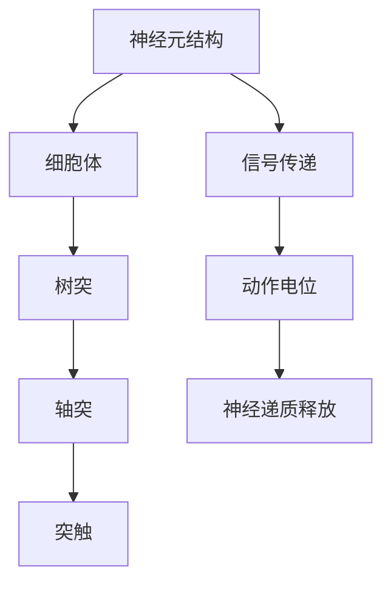
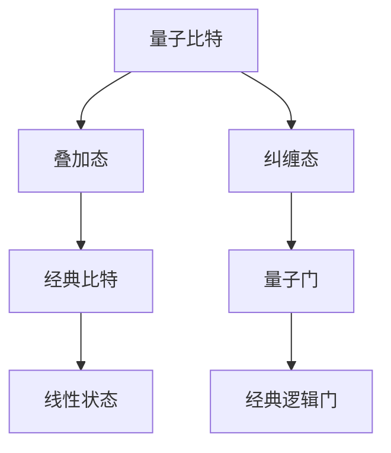
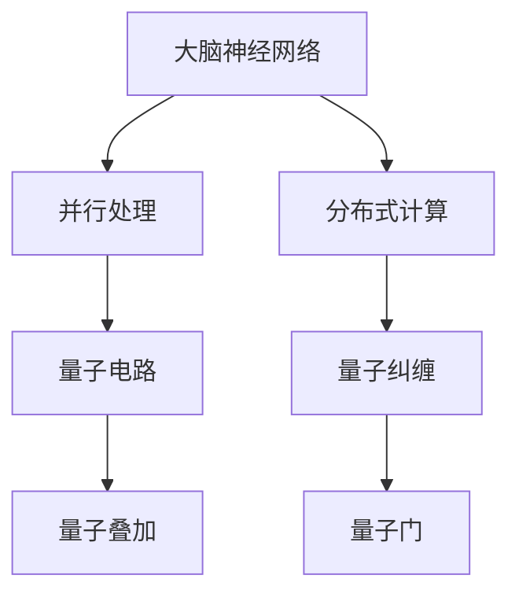

                 

### 引言

#### 计算能力的极限与量子计算

计算能力的极限一直是计算机科学领域的一个重要研究方向。从冯·诺依曼架构到图灵机模型，传统计算机的运算速度和存储容量不断提升，但依然面临着一些固有的物理限制。比如，随着晶体管尺寸的不断缩小，量子隧穿效应和其他物理现象将不可避免地影响计算精度，使得进一步缩小晶体管尺寸变得异常困难。因此，寻找新的计算模型和架构，以突破传统计算机的性能瓶颈，成为了科学家们关注的焦点。

量子计算作为下一代计算技术的代表，以其独特的量子比特、叠加态和纠缠态等特性，展示出了巨大的计算潜力。与传统计算机使用二进制比特（0和1）不同，量子计算机利用量子比特（qubit）的叠加态，可以在同一时间处理多种可能性。此外，量子比特之间的纠缠态使得它们可以相互影响，进一步提升了计算效率。这些特性使得量子计算在处理某些特定类型的问题上，如因数分解、量子模拟和搜索算法等方面，比传统计算机具有显著的优势。

#### 量子计算与大脑之间的联系

量子计算与大脑之间的联系不仅限于计算能力的提升，更涉及对大脑信息处理机制的深入理解。近年来，随着神经科学和认知科学的发展，科学家们逐渐认识到，大脑的信息处理机制与量子计算的某些特性有相似之处。例如，大脑神经元之间的通信和同步，可以通过量子纠缠来解释；大脑神经网络的可塑性，也可以通过量子叠加态来模拟。

这种联系促使人们思考，是否可以将大脑视为一种“量子信息处理器”，从而探索其计算能力的极限。从某种意义上说，大脑作为人类思维和智能的源泉，其信息处理机制可能为我们提供了突破传统计算机性能瓶颈的新思路。

#### 本书的结构与内容概述

本书旨在探讨大脑与量子计算之间的联系，以及大脑作为量子信息处理器的潜在计算能力。全书分为八个章节，结构如下：

- **第1章 引言**：介绍计算能力的极限与量子计算，以及大脑与量子计算之间的联系。

- **第2章 大脑结构与信息处理原理**：详细分析大脑的基本结构、神经元的工作原理以及大脑的信息处理机制。

- **第3章 量子信息处理基础**：介绍量子比特与经典比特的对比、量子叠加与纠缠以及量子计算的基本原理。

- **第4章 大脑与量子计算的相似性分析**：探讨大脑神经元与量子比特的相似性、大脑神经网络与量子电路的相似性，以及大脑与量子计算在信息处理方面的相似性。

- **第5章 大脑as量子信息处理器**：研究大脑作为量子信息处理器的研究背景、基本架构和工作原理。

- **第6章 计算能力极限探讨**：分析传统计算机的计算能力限制、量子计算机的计算能力优势，以及大脑作为量子信息处理器的计算能力极限。

- **第7章 量子大脑的实现路径**：探讨现有的量子计算技术、大脑模拟量子计算的挑战与解决方案，以及未来量子大脑的发展趋势。

- **第8章 量子大脑的社会影响与伦理问题**：分析量子大脑对社会的影响、伦理问题，以及未来发展方向与责任。

通过上述章节的深入探讨，本书希望为读者提供一个全面、系统的视角，理解大脑作为量子信息处理器的潜力，以及这一领域的研究方向和应用前景。

### 第1章 引言

#### 1.1 计算能力的极限与量子计算

计算能力的极限一直是计算机科学领域研究的核心问题。从计算机诞生的早期，科学家们就开始探索如何提升计算速度和存储容量。然而，随着技术的进步，我们逐渐认识到，传统计算机在处理某些特定类型的问题上，如复杂计算、大数据分析和人工智能等方面，仍存在明显的局限性。这些局限性源于几个关键因素，包括物理限制、算法效率和编程模型等。

首先，物理限制是传统计算机面临的主要瓶颈之一。根据量子力学的基本原理，物体在微观尺度上的行为与经典物理有显著不同。例如，量子隧穿效应使得电子可以通过势垒，这导致晶体管在极小尺寸下无法正常工作。此外，随着晶体管尺寸的缩小，热噪声和漏电流等效应也会显著增加，进一步影响计算精度和稳定性。这些物理限制使得传统计算机在性能提升上遇到了“摩尔定律”的瓶颈，即晶体管数量增加的速度无法无限持续。

其次，算法效率也是传统计算机性能提升的一个重要因素。尽管算法优化和硬件加速技术不断发展，但很多复杂问题（如NP完全问题）的本质复杂性决定了现有算法的效率极限。传统计算机在处理这些问题时，往往需要指数级别的时间复杂度，这使得它们在解决某些实际问题时变得非常低效。

此外，编程模型也对计算能力的提升产生了影响。传统计算机主要基于冯·诺依曼架构，这种架构将数据和指令分开存储和处理，尽管在处理线性计算任务时非常高效，但在处理并行和复杂任务时，其性能受到限制。现代计算机科学家正在探索新的编程模型，如并行计算、分布式计算和量子计算等，以突破传统计算模型的局限。

量子计算的崛起为解决传统计算机面临的这些问题提供了一种新的途径。量子计算机利用量子比特（qubit）的叠加态和纠缠态，可以在同一时间处理多种可能性，从而显著提高计算效率。量子计算机在处理某些特定类型的问题上，如因数分解、量子模拟和搜索算法等方面，比传统计算机具有显著的优势。例如，著名的Shor算法利用量子计算机在多项式时间内可以解决传统计算机需要指数时间才能解决的因数分解问题。

然而，量子计算的发展也面临一些挑战。首先，实现稳定的量子比特和可靠的量子门是一个关键问题。量子比特的脆弱性使得它们容易受到环境干扰，导致计算错误。其次，构建大规模的量子计算机需要解决物理实现、纠错和能量消耗等问题。此外，量子算法的设计和优化也是一个复杂且富有挑战性的任务。

尽管面临这些挑战，量子计算仍然被视为下一代计算技术的代表，其潜力不可忽视。通过结合量子计算与传统计算机的优势，我们有望突破计算能力的极限，解决更多复杂的实际问题。

#### 1.2 量子计算与大脑之间的联系

量子计算与大脑之间的联系不仅限于计算能力的提升，更涉及对大脑信息处理机制的深入理解。近年来，随着神经科学和认知科学的发展，科学家们逐渐认识到，大脑的信息处理机制与量子计算的某些特性有相似之处。

首先，大脑神经元之间的通信和同步可以通过量子纠缠来解释。量子纠缠是一种特殊的量子关联，即使两个量子比特相隔很远，它们的状态仍然可以相互影响。研究表明，大脑神经元之间的同步活动可以通过量子纠缠来实现，从而提高信息传输的效率和可靠性。这种特性使得大脑在处理信息时能够快速、准确地传递和整合复杂的信息。

其次，大脑神经网络的可塑性也可以通过量子叠加态来模拟。量子叠加态允许一个量子比特同时处于多种状态，这种特性使得大脑能够在不同的环境和情境下快速适应和调整。例如，当我们学习新技能或适应新环境时，大脑神经网络会通过改变神经元之间的连接权重来实现适应，这种机制与量子叠加态有类似之处。

此外，大脑的信息处理机制还表现出一定的并行性。传统计算机在处理问题时通常采用串行方式，即一步一步地执行指令。而大脑则通过并行处理来实现高效的信息处理。例如，当我们观察一个物体时，大脑会同时处理多个感官信号，如视觉、听觉和触觉，从而形成一个综合的感知。这种并行处理机制在量子计算中也有所体现，量子计算机利用量子比特的叠加态，可以同时处理多个计算任务，从而显著提高计算速度。

尽管大脑与量子计算之间存在这些相似之处，但两者的实现方式和机制仍有很大差异。大脑的信息处理依赖于生物化学过程，而量子计算则依赖于物理过程。此外，大脑的复杂性也远超当前量子计算机的实现规模。

尽管如此，这种联系为科学家们提供了一种新的研究视角，即通过借鉴量子计算的原理和机制，探索大脑信息处理的新方法和技术。例如，量子神经网络（QNN）是一种将量子计算和神经网络相结合的新模型，它利用量子比特的叠加态和纠缠态，实现了高效的信息处理和模式识别。

总之，量子计算与大脑之间的联系不仅拓宽了我们对计算能力的理解，也为未来计算机科学的发展提供了新的可能性。通过进一步研究这种联系，我们有望揭示大脑信息处理的奥秘，并推动量子计算技术的应用和进步。

#### 1.3 本书的结构与内容概述

本书旨在深入探讨大脑与量子计算之间的联系，以及大脑作为量子信息处理器的潜在计算能力。全书分为八个章节，每一章都围绕特定的主题进行详细探讨，结构清晰，逻辑严密。

- **第1章 引言**：介绍计算能力的极限与量子计算，以及大脑与量子计算之间的联系。这一章为后续章节的内容奠定了基础，帮助读者了解整个研究的背景和目标。

- **第2章 大脑结构与信息处理原理**：详细分析大脑的基本结构、神经元的工作原理以及大脑的信息处理机制。这一章为读者提供了关于大脑的基础知识，为后续章节的深入探讨打下了坚实的基础。

- **第3章 量子信息处理基础**：介绍量子比特与经典比特的对比、量子叠加与纠缠以及量子计算的基本原理。这一章为读者提供了关于量子计算的基本概念和原理，为理解大脑作为量子信息处理器的潜力奠定了理论基础。

- **第4章 大脑与量子计算的相似性分析**：探讨大脑神经元与量子比特的相似性、大脑神经网络与量子电路的相似性，以及大脑与量子计算在信息处理方面的相似性。这一章通过比较分析，揭示了大脑和量子计算之间的相似之处，为后续章节的研究提供了重要依据。

- **第5章 大脑as量子信息处理器**：研究大脑作为量子信息处理器的研究背景、基本架构和工作原理。这一章详细介绍了大脑作为量子信息处理器的潜在机制，为读者提供了对这一领域的研究思路和方向。

- **第6章 计算能力极限探讨**：分析传统计算机的计算能力限制、量子计算机的计算能力优势，以及大脑作为量子信息处理器的计算能力极限。这一章通过对比分析，探讨了大脑作为量子信息处理器的计算能力潜力，为读者提供了深入思考的视角。

- **第7章 量子大脑的实现路径**：探讨现有的量子计算技术、大脑模拟量子计算的挑战与解决方案，以及未来量子大脑的发展趋势。这一章探讨了实现量子大脑面临的挑战和解决方案，为未来的研究提供了参考。

- **第8章 量子大脑的社会影响与伦理问题**：分析量子大脑对社会的影响、伦理问题，以及未来发展方向与责任。这一章从社会和伦理角度探讨了量子大脑的应用和影响，为这一领域的发展提供了重要的思考和指导。

通过以上章节的深入探讨，本书旨在为读者提供一个全面、系统的视角，理解大脑作为量子信息处理器的潜力，以及这一领域的研究方向和应用前景。每一章节的内容都是紧密相连、相互补充的，共同构建了一个完整的研究框架，为读者深入理解这一复杂而重要的领域提供了有力支持。

### 第2章 大脑结构与信息处理原理

#### 2.1 大脑基本结构

大脑是人类思维和智能的源泉，其复杂结构决定了其卓越的信息处理能力。大脑的基本结构可以分为几个主要部分：大脑皮层、基底神经节、脑干和小脑。

**大脑皮层**是大脑的最外层，由灰质构成，是信息处理的主要场所。大脑皮层分为两个半球，每个半球又分为四个叶，分别是前叶、顶叶、颞叶和枕叶。每个叶负责不同的功能，例如，前叶主要负责运动控制和决策，颞叶主要负责听觉处理和记忆，枕叶主要负责视觉处理。

**基底神经节**位于大脑内部，是神经元的密集区域，主要参与运动控制和情绪调节。基底神经节包括四个部分：底丘、苍白球、黑质和红核。这些结构通过复杂的神经网络相互连接，形成一个动态调节系统，确保大脑的各种功能协调运作。

**脑干**是连接大脑和脊髓的桥梁，包含多个重要的神经结构，如中脑、桥脑和延髓。脑干主要负责控制基本生命功能，如呼吸、心跳和消化。

**小脑**位于大脑的后下方，主要负责协调运动和维持平衡。小脑通过其复杂的神经网络，与大脑皮层和基底神经节紧密连接，共同协调身体的运动。

这些不同部分通过神经网络相互连接，形成一个高度复杂的系统，使得大脑能够处理大量的信息，并产生复杂的思维和行动。

#### 2.2 大脑神经元的工作原理

大脑神经元是大脑信息处理的基本单位，其结构和功能决定了大脑的信息处理能力。一个典型的神经元由细胞体、树突和轴突组成。

**细胞体**是神经元的中心，包含细胞核和大部分细胞器，负责维持神经元的正常功能。

**树突**从细胞体发出，是神经元的接收部分，负责接收来自其他神经元的信号。

**轴突**从细胞体发出，是神经元的传输部分，负责将信号传递给其他神经元或目标细胞。

神经元的工作原理主要涉及以下几个步骤：

1. **接收信号**：当一个神经元通过树突接收到一个来自其他神经元的电信号时，这个信号会通过树突膜上的离子通道进入细胞体。

2. **产生动作电位**：在细胞体内，这些离子会在细胞膜上形成电位变化，如果这种电位变化达到一定的阈值，就会产生一个动作电位（也称为神经冲动）。

3. **传递信号**：动作电位会沿着轴突传播，通过轴突膜上的钠离子通道将信号传递到轴突末端。

4. **释放神经递质**：在轴突末端，动作电位会导致神经递质的释放，这些神经递质通过突触间隙传递到下一个神经元的树突。

5. **接收和处理信号**：下一个神经元接收到神经递质后，会通过其树突上的受体处理这些信号，并决定是否产生自己的动作电位。

这种信号传递和处理的机制使得神经元能够高效地传递和整合信息，形成复杂的神经网络。

#### 2.3 大脑的信息处理机制

大脑的信息处理机制是复杂而精细的，它涉及多个层次和多个过程。以下是大脑信息处理的基本机制：

**感知阶段**：大脑通过感官器官接收外部信息，如视觉、听觉、嗅觉、味觉和触觉。这些信息会通过神经系统传递到大脑皮层，并在相应的感官区域进行处理。

**预处理阶段**：在感知阶段之后，大脑会对接收到的信息进行预处理，包括筛选、过滤和整合。这一阶段主要是通过神经网络和神经元之间的交互来实现的。

**整合阶段**：预处理后的信息会被进一步整合和综合，形成更复杂的认知过程。例如，视觉和听觉信息会在大脑的不同区域进行整合，形成对物体和声音的综合感知。

**高级处理阶段**：在整合阶段之后，大脑会对信息进行高级处理，如记忆、学习、思考、判断和决策。这些高级处理过程主要依赖于大脑皮层的不同区域，特别是前叶。

**输出阶段**：处理完的信息最终会被传递到运动区域，指导我们的行为和反应。

这个信息处理机制是一个动态、自适应的过程，大脑会根据不同的环境和情境进行调整和优化。此外，大脑的信息处理机制还表现出高度的并行性和分布式特性，这使得它能够高效地处理大量信息，并产生复杂的认知行为。

通过上述机制，大脑能够实现对信息的接收、处理和输出，形成一个完整的信息处理系统，这为我们理解大脑的工作原理和功能提供了重要启示。

### 第3章 量子信息处理基础

#### 3.1 量子比特与经典比特的对比

量子比特（qubit）和经典比特是两种不同的信息载体，它们在计算和信息处理方面有着根本的不同。经典比特是二进制信息的基本单位，可以表示为0或1。而量子比特则具有叠加性和纠缠性等量子特性，可以同时处于多种状态的叠加。

**叠加性**是量子比特最显著的特点之一。在量子计算中，一个量子比特可以同时处于0和1的状态，这种状态被称为叠加态。具体来说，一个量子比特可以表示为：

$$|\psi\rangle = \alpha|0\rangle + \beta|1\rangle$$

其中，$|\alpha|^2 + |\beta|^2 = 1$，$\alpha$和$\beta$是复数系数，$|0\rangle$和$|1\rangle$分别表示量子比特的两个基本状态。这种叠加态使得量子比特在计算过程中可以同时处理多种可能性，从而显著提高计算效率。

**纠缠性**是量子比特的另一个重要特性。两个或多个量子比特可以处于纠缠态，即它们的状态无法独立存在，而是相互依赖。例如，两个纠缠的量子比特中的一个发生状态变化，另一个也会立即发生相应变化，无论它们相距多远。这种纠缠态在量子计算中可以用来实现高速的信息传输和密钥分发，同时也为量子算法提供了独特的计算能力。

相比之下，经典比特在计算和信息处理方面则受到线性限制。经典比特只能处于0或1的单一状态，无法同时处理多种可能性。此外，经典比特之间的信息传递和计算过程是线性的，无法实现量子比特之间的纠缠效应。

**计算能力对比**：由于叠加性和纠缠性的存在，量子比特在处理某些特定类型的问题上，如因数分解和量子模拟，具有显著的优势。例如，著名的Shor算法利用量子比特的叠加性和纠缠性，可以在多项式时间内解决传统计算机需要指数时间才能解决的因数分解问题。

综上所述，量子比特与经典比特在叠加性和纠缠性等方面有着显著的不同，这些特性使得量子比特在计算和信息处理方面具有巨大的潜力。

#### 3.2 量子叠加与纠缠

量子叠加和纠缠是量子计算中的两个核心概念，它们共同决定了量子比特的特性和能力。

**量子叠加**是指一个量子系统可以同时处于多个可能状态的叠加。具体来说，一个量子比特可以同时处于0和1的状态，这种状态称为叠加态。例如，一个量子比特可以表示为：

$$|\psi\rangle = \alpha|0\rangle + \beta|1\rangle$$

其中，$|\alpha|^2 + |\beta|^2 = 1$，$\alpha$和$\beta$是复数系数，$|0\rangle$和$|1\rangle$分别表示量子比特的两个基本状态。这种叠加态使得量子比特在计算过程中可以同时处理多种可能性，从而显著提高计算效率。

**量子纠缠**是指两个或多个量子系统之间的特殊关联，使得它们的状态无法独立存在，而是相互依赖。例如，两个纠缠的量子比特中的一个发生状态变化，另一个也会立即发生相应变化，无论它们相距多远。这种纠缠态在量子计算中可以用来实现高速的信息传输和密钥分发，同时也为量子算法提供了独特的计算能力。

**量子叠加与纠缠的关系**：量子叠加和纠缠是相互关联的。量子叠加提供了量子比特同时处理多种可能性的能力，而量子纠缠则扩展了这种能力，使得多个量子比特之间的状态可以相互影响。例如，一个由两个量子比特组成的系统，可以同时处于以下叠加态：

$$|\psi\rangle = \alpha|00\rangle + \beta|01\rangle + \gamma|10\rangle + \delta|11\rangle$$

这种叠加态包含了多种可能的状态，而这些状态可以通过量子纠缠相互影响。例如，如果第一个量子比特的状态发生变化，第二个量子比特的状态也会立即发生变化。

总之，量子叠加和纠缠共同决定了量子比特的特性和能力，使得量子计算机在处理某些特定类型的问题上具有显著优势。通过理解这些概念，我们可以更好地把握量子计算的核心机制，探索其潜在的应用和前景。

#### 3.3 量子计算的基本原理

量子计算是基于量子力学原理的计算机体系结构，其核心在于量子比特（qubit）的叠加态和纠缠态。以下是量子计算的基本原理：

**量子比特（qubit）**：量子比特是量子计算的基本单元，与传统计算机中的比特不同，量子比特可以同时处于0和1的叠加态。这种叠加态使得量子比特在处理信息时能够并行处理多种可能性，从而显著提高计算效率。一个量子比特可以表示为：

$$|\psi\rangle = \alpha|0\rangle + \beta|1\rangle$$

其中，$\alpha$和$\beta$是复数系数，$|0\rangle$和$|1\rangle$分别表示量子比特的两个基本状态。这种叠加态可以通过以下公式描述：

$$|\psi\rangle = \cos(\theta)|0\rangle + e^{i\phi}\sin(\theta)|1\rangle$$

其中，$\theta$和$\phi$是控制参数，用来描述量子比特的叠加态。

**量子门（Quantum Gate）**：量子门是量子计算中的基本操作，类似于传统计算机中的逻辑门。量子门可以对量子比特进行线性变换，从而实现复杂的量子操作。常见的量子门包括Hadamard门（实现叠加态）、Pauli门（实现量子比特的旋转）和CNOT门（实现量子比特之间的纠缠）。以下是一个Hadamard门的例子：

$$H|0\rangle = \frac{1}{\sqrt{2}}(|0\rangle + |1\rangle)$$

**量子叠加与纠缠**：量子比特的叠加态和纠缠态是量子计算的核心机制。通过叠加态，量子比特可以在同一时间处理多种可能性，从而实现并行计算。通过纠缠态，量子比特之间的状态可以相互影响，从而实现高速的信息传输和高效的算法。

**量子算法**：量子算法是利用量子比特的叠加态和纠缠态来解决特定问题的计算方法。例如，著名的Shor算法利用量子计算在多项式时间内解决传统计算机需要指数时间才能解决的因数分解问题。另一个例子是Grover算法，它利用量子搜索算法在未排序数据库中搜索特定元素的效率比传统算法快得多。

**量子计算机与经典计算机的对比**：量子计算机与传统计算机在计算能力和算法设计上有显著不同。传统计算机主要基于二进制系统，而量子计算机则基于量子比特的叠加态和纠缠态。量子计算机在处理某些特定类型的问题上，如因数分解、量子模拟和搜索算法等方面，具有显著的优势。然而，量子计算机的实现也面临一些挑战，如量子比特的稳定性、误差纠正和物理实现等。

总之，量子计算的基本原理包括量子比特的叠加态和纠缠态，以及量子门和量子算法。这些原理使得量子计算机在处理特定类型的问题上具有巨大的潜力，同时也为计算科学和信息处理带来了新的研究方向和挑战。

### 第4章 大脑与量子计算的相似性分析

#### 4.1 大脑神经元与量子比特的相似性

大脑神经元与量子比特之间存在许多相似之处，这些相似性为探索大脑作为量子信息处理器的潜力提供了启示。

首先，从结构和功能上看，大脑神经元和量子比特都可以看作是基本单元。大脑神经元是大脑信息处理的基本单位，由细胞体、树突和轴突组成，负责接收和处理信息。量子比特是量子计算的基本单元，通常由物理系统（如超导电路或离子阱）实现，可以在叠加态和纠缠态下操作。

**叠加态**是量子比特的重要特性，与大脑神经元的信息处理机制有相似之处。大脑神经元在未受到刺激时，可以同时处于多种可能的激活状态，这种状态被称为“静息态”或“静默态”。类似地，量子比特可以在叠加态下同时表示0和1，这种叠加态使得量子比特可以并行处理多种可能性，从而提高计算效率。

**纠缠态**是量子比特的另一个重要特性，与大脑神经元之间的信息传递机制有相似之处。大脑神经元通过突触连接，形成一个复杂的神经网络，神经元之间的信号传递和协同工作依赖于突触间的化学和电信号。类似地，量子比特可以通过纠缠态相互关联，使得它们的状态可以相互影响，从而实现高效的信息传输和协同计算。

**可塑性**是大脑神经元的一个重要特性，与量子比特的状态调控有相似之处。大脑神经元在学习和记忆过程中，通过改变突触连接的强度和结构，实现神经元之间的协同工作。类似地，量子比特的状态可以通过量子门进行调控，从而实现量子算法的执行和计算。

**适应性**是大脑神经元的一个重要特性，与量子计算机的动态调整有相似之处。大脑神经元可以根据环境和情境的变化，调整其激活状态和突触连接，以适应新的信息处理任务。类似地，量子计算机也可以通过调整量子比特的叠加态和纠缠态，实现动态的适应和优化。

总之，大脑神经元与量子比特在结构、功能和特性上有许多相似之处，这些相似性为探索大脑作为量子信息处理器的潜力提供了重要的理论基础。通过进一步研究这些相似性，我们可以更好地理解大脑的信息处理机制，并探索量子计算在信息处理和人工智能领域的应用。

#### 4.2 大脑神经网络与量子电路的相似性

大脑神经网络与量子电路在信息处理机制上具有许多相似性，这些相似性为我们理解和模拟大脑信息处理过程提供了新的视角。

首先，从结构上看，大脑神经网络由大量的神经元通过复杂的突触连接构成，每个神经元都可以接收和处理信息。类似地，量子电路由多个量子比特通过量子门和量子线路连接而成，每个量子比特也可以进行信息处理。这种结构上的相似性使得我们可以在量子电路中模拟大脑神经网络的信息处理过程。

**量子叠加态**是量子电路的一个重要特性，与大脑神经网络的信息处理机制有相似之处。在量子电路中，量子比特可以同时处于0和1的叠加态，这种叠加态使得量子电路可以在同一时间处理多种可能性。类似地，大脑神经网络中的神经元也可以同时处于多种激活状态，这种状态称为“静息态”或“静默态”。通过量子叠加态和神经元的状态，我们可以实现并行处理，从而提高计算效率。

**量子纠缠**是量子电路的另一个重要特性，与大脑神经网络的信息传递机制有相似之处。在量子电路中，量子比特可以通过纠缠态相互关联，使得它们的状态可以相互影响。这种纠缠态可以实现高效的信息传输和协同计算。类似地，大脑神经网络中的神经元通过突触连接形成一个复杂的网络，神经元之间的信号传递和协同工作依赖于突触间的化学和电信号。通过量子纠缠，我们可以模拟神经元之间的复杂交互和协同工作。

**量子门**是量子电路中的基本操作单元，与大脑神经网络中的突触可塑性有相似之处。量子门可以对量子比特进行线性变换，从而实现复杂的量子操作。类似地，大脑神经网络中的突触连接可以通过改变突触权重来实现信息处理任务的调整。通过量子门和突触可塑性，我们可以模拟大脑神经网络的信息处理和学习过程。

**适应性**是大脑神经网络的一个重要特性，与量子电路的动态调整有相似之处。大脑神经网络可以根据环境和情境的变化，调整其连接和激活状态，以适应新的信息处理任务。类似地，量子电路也可以通过调整量子比特的叠加态和纠缠态，实现动态的适应和优化。

总之，大脑神经网络与量子电路在信息处理机制上具有许多相似性，这些相似性为我们在量子电路中模拟大脑神经网络提供了重要的理论基础。通过进一步研究这些相似性，我们可以更好地理解大脑的信息处理机制，并探索量子计算在信息处理和人工智能领域的应用。

#### 4.3 大脑与量子计算在信息处理方面的相似性

大脑与量子计算在信息处理方面具有显著的相似性，这些相似性为我们深入理解大脑的信息处理机制以及量子计算的潜力提供了新的视角。

首先，从并行处理的角度来看，大脑和量子计算机都具备并行处理的能力。在大脑中，神经元之间的复杂网络结构允许信息在多个通道上同时传播和加工。例如，当我们观察一个物体时，大脑会同时处理视觉、听觉、触觉等多种感官信号，从而形成一个综合的感知。类似地，量子计算机利用量子比特的叠加态，可以在同一时间对多个可能的计算路径进行并行处理，从而显著提高计算效率。

**量子叠加态**与大脑的“并行处理”机制密切相关。量子比特可以处于0和1的叠加态，这意味着它们可以同时代表多种可能性。这种特性类似于大脑神经网络中神经元的状态，它们在未受到特定刺激时，可以同时处于多种激活水平，从而实现对多种输入的并行处理。

其次，大脑和量子计算机都利用了“分布式计算”的原理。在大脑中，不同的脑区负责处理不同类型的信息，并通过神经回路进行协同工作。例如，前叶负责决策，颞叶负责听觉处理，而枕叶负责视觉处理。类似地，量子计算机通过多个量子比特之间的纠缠态，实现了信息在分布式计算中的高效传输和协同处理。量子比特之间的纠缠使得它们的状态可以相互影响，从而在分布式计算中实现高效的信息传递和协同工作。

**量子纠缠**与大脑神经网络的协同工作机制有相似之处。在大脑中，神经元通过突触连接形成一个复杂的网络，神经元之间的信号可以相互传递和调制，从而实现信息的整合和处理。量子比特之间的纠缠态也实现了类似的功能，通过量子门的操作，可以实现对量子比特状态的精确控制和协同处理。

此外，大脑和量子计算机在“自适应学习”方面也有相似之处。大脑具有高度的可塑性，可以通过改变神经元之间的连接强度和结构，以适应新的环境和任务。量子计算机也具有类似的能力，通过调整量子比特的叠加态和纠缠态，可以实现动态的适应和优化。这种自适应能力使得大脑和量子计算机都能在复杂的环境中高效地处理信息。

最后，大脑和量子计算机在“能量效率”方面也表现出相似性。大脑作为一个高度复杂的系统，其能量消耗相对较低，但能实现高效的计算和信息处理。量子计算机在理论上也具有较低的能耗，尤其是在处理某些特定类型的问题时，如量子模拟，量子计算机的能耗可能比传统计算机低得多。

总之，大脑与量子计算在信息处理方面的相似性，为我们提供了一个新的研究视角，帮助理解大脑的信息处理机制以及量子计算的潜力。通过进一步研究这些相似性，我们可以开发出更高效的计算模型和算法，从而推动计算机科学和人工智能的发展。

### 第5章 大脑as量子信息处理器

#### 5.1 大脑作为量子信息处理器的研究背景

大脑作为量子信息处理器的研究起源于对大脑信息处理机制的深入探讨。随着神经科学和量子计算的发展，科学家们开始思考，大脑是否可以被视为一种“量子信息处理器”，其复杂的神经网络和神经元活动是否能模拟量子计算的特性。

这一研究方向的兴起源于对大脑信息处理能力的钦佩。大脑在处理信息时表现出极高的效率和灵活性，能够处理大量复杂的数据，并实现智能行为。而量子计算以其独特的叠加态和纠缠态，展示了超越传统计算机的巨大潜力。这两者的结合，为探索新的计算模型和架构提供了新的可能性。

首先，大脑与量子计算在信息处理机制上有许多相似之处。大脑通过神经元之间的复杂连接和信号传递，实现了并行和分布式计算。量子计算则利用量子比特的叠加态和纠缠态，实现了高效的信息处理和协同计算。这些相似性促使科学家们思考，是否可以借鉴量子计算的原理，来理解和模拟大脑的信息处理过程。

其次，大脑具有高度的可塑性，能够通过改变神经元之间的连接权重和结构，适应新的环境和任务。这一特性与量子计算机的动态调整能力有相似之处。量子计算机可以通过调控量子比特的状态，实现动态的适应和优化。这种动态性使得大脑和量子计算机在处理复杂信息时，能够灵活调整其计算方式，从而提高计算效率。

此外，大脑的低能耗特性也为量子计算机提供了借鉴。大脑作为一个高度复杂的系统，其能量消耗相对较低，但能实现高效的计算和信息处理。量子计算机在理论上也具有较低的能耗，尤其是在处理某些特定类型的问题时，如量子模拟，量子计算机的能耗可能比传统计算机低得多。

总之，大脑作为量子信息处理器的研究背景，源于对大脑信息处理机制的深入探讨和对量子计算特性的借鉴。这一研究方向为探索新的计算模型和架构提供了新的视角，同时也为理解大脑的智能行为提供了新的理论依据。

#### 5.2 大脑as量子信息处理器的基本架构

大脑作为量子信息处理器（Brain-as-a-Quantum Information Processor, BQIP）的基本架构，借鉴了大脑神经网络和量子计算的特性，以实现高效的信息处理和协同计算。

**1. 量子比特阵列**：大脑as量子信息处理器的核心是量子比特阵列。这些量子比特分布在神经元之间，通过量子门的操作，可以实现量子叠加和纠缠。量子比特的叠加态和纠缠态为大脑as量子信息处理器提供了并行处理的能力。

**2. 神经元网络**：神经元网络是大脑as量子信息处理器的信息处理单元。每个神经元都与多个量子比特相连，通过突触连接实现信息的传递和处理。神经元网络的结构和连接方式模拟了大脑神经网络的工作原理，实现了高效的信息传输和协同计算。

**3. 控制单元**：控制单元负责调控量子比特的状态，实现量子叠加和纠缠的操作。控制单元通过量子门和量子线路，对量子比特进行精确控制，从而实现复杂的量子操作。控制单元与神经元网络紧密相连，通过信号传递和协同工作，实现整体的信息处理过程。

**4. 信息输入与输出**：大脑as量子信息处理器通过信息输入与输出接口，接收和处理外部信息。信息输入接口包括感官器官和外部设备，负责将外部信息转换为量子比特和神经元网络的输入信号。信息输出接口则将处理后的信息传递给执行器官或外部设备。

**5. 动态调整机制**：大脑as量子信息处理器具有动态调整机制，能够根据环境和任务的变化，调整量子比特和神经元网络的连接权重和状态。这种动态调整机制使得大脑as量子信息处理器能够适应不同的计算任务，实现高效的信息处理。

总之，大脑as量子信息处理器的基本架构借鉴了大脑神经网络和量子计算的特性，通过量子比特阵列、神经元网络、控制单元、信息输入与输出接口以及动态调整机制，实现了高效的信息处理和协同计算。

#### 5.3 大脑as量子信息处理器的工作原理

大脑as量子信息处理器（BQIP）的工作原理借鉴了大脑神经网络和量子计算的特性，通过量子比特阵列、神经元网络和控制单元等组件，实现高效的信息处理和协同计算。以下是大脑as量子信息处理器的工作原理：

**1. 信息输入阶段**：大脑as量子信息处理器通过感官器官和外部设备接收外部信息，如视觉、听觉和触觉等。这些信息被转换为量子比特和神经元网络的输入信号，并传递给量子比特阵列和神经元网络。

**2. 量子比特初始化阶段**：在信息输入阶段之后，量子比特阵列中的量子比特被初始化为特定的叠加态。这些量子比特的初始状态通常由输入信息决定，使得它们可以同时表示多种可能性。

**3. 神经元网络处理阶段**：初始化后的量子比特被传递到神经元网络，神经元网络通过突触连接实现信息的传递和处理。神经元网络中的每个神经元都与多个量子比特相连，通过突触连接权重实现信息的整合和加工。

**4. 量子叠加与纠缠阶段**：在神经元网络处理阶段，量子比特之间通过量子门的操作，实现量子叠加和纠缠。这种叠加态和纠缠态使得量子比特可以在同一时间处理多种可能性，从而实现并行计算。

**5. 信息整合与输出阶段**：处理后的信息通过神经元网络传递到控制单元，控制单元对量子比特的状态进行调控，实现信息的整合和输出。控制单元通过量子门和量子线路，对量子比特进行精确控制，从而实现复杂的量子操作。

**6. 动态调整阶段**：大脑as量子信息处理器具有动态调整机制，能够根据环境和任务的变化，调整量子比特和神经元网络的连接权重和状态。这种动态调整机制使得大脑as量子信息处理器能够适应不同的计算任务，实现高效的信息处理。

**7. 信息输出阶段**：处理后的信息通过信息输出接口传递给执行器官或外部设备，实现具体的行为或任务。信息输出接口将处理后的信息转换为可执行的动作或数据，从而实现大脑as量子信息处理器的功能。

总之，大脑as量子信息处理器的工作原理通过量子比特阵列、神经元网络、控制单元和动态调整机制，实现了高效的信息处理和协同计算。这种工作原理借鉴了大脑神经网络和量子计算的特性，为未来计算科学的发展提供了新的可能性。

### 第6章 计算能力极限探讨

#### 6.1 传统计算机的计算能力限制

传统计算机在计算能力上面临着一系列固有的限制，这些限制源于其硬件和软件架构的基本原理。

首先，从硬件层面来看，传统计算机的性能提升受限于物理效应。根据量子力学的基本原理，物体在微观尺度上的行为与经典物理有显著不同。例如，量子隧穿效应使得电子可以通过势垒，这导致晶体管在极小尺寸下无法正常工作。此外，随着晶体管尺寸的缩小，热噪声和漏电流等效应也会显著增加，进一步影响计算精度和稳定性。这些物理限制使得传统计算机在性能提升上遇到了“摩尔定律”的瓶颈，即晶体管数量增加的速度无法无限持续。

其次，从软件层面来看，传统计算机在处理某些特定类型的问题时，其算法效率也存在限制。传统计算机主要基于冯·诺依曼架构，这种架构将数据和指令分开存储和处理，尽管在处理线性计算任务时非常高效，但在处理并行和复杂任务时，其性能受到限制。此外，许多复杂问题（如NP完全问题）的本质复杂性决定了现有算法的效率极限。传统计算机在处理这些问题时，往往需要指数级别的时间复杂度，这使得它们在解决某些实际问题时变得非常低效。

另外，传统计算机在存储容量和内存带宽方面也存在限制。随着数据量的爆炸式增长，传统计算机的存储容量和内存带宽逐渐成为瓶颈。存储器速度的提高无法跟上数据处理速度的增长，这导致计算机在处理大数据任务时，需要大量时间进行数据传输和缓存操作，从而降低了整体性能。

此外，传统计算机的能耗问题也日益突出。随着晶体管数量的增加，计算机的能耗也随之增加。高能耗不仅增加了冷却和供电的成本，还会导致计算机性能的下降。因此，如何在保证性能的同时降低能耗，成为传统计算机面临的一个重要挑战。

总之，传统计算机在计算能力上面临着物理效应、算法效率和存储容量等多方面的限制。这些限制使得传统计算机在处理某些复杂任务时显得力不从心，迫切需要新的计算模型和架构来突破这些瓶颈。

#### 6.2 量子计算机的计算能力优势

量子计算机以其独特的量子比特、叠加态和纠缠态等特性，展示出了超越传统计算机的巨大潜力。以下是量子计算机在计算能力方面的几个主要优势：

**1. 加速特定算法**：量子计算机在处理某些特定类型的问题上，如因数分解、量子模拟和搜索算法等方面，具有显著的优势。例如，著名的Shor算法利用量子计算机在多项式时间内解决传统计算机需要指数时间才能解决的因数分解问题。另一个例子是Grover算法，它利用量子搜索算法在未排序数据库中搜索特定元素的效率比传统算法快得多。这些算法的优势源于量子比特的叠加态和纠缠态，使得量子计算机能够在同一时间处理多种可能性，从而大幅提高计算速度。

**2. 高效并行计算**：量子计算机利用量子比特的叠加态，可以同时处理多种可能性，从而实现高效的并行计算。相比之下，传统计算机在处理多个计算任务时，通常需要逐个执行，这导致计算时间显著增加。量子计算机的并行计算能力使得它能够在处理复杂问题时，显著缩短计算时间。

**3. 分布式计算和纠错能力**：量子计算机通过量子比特之间的纠缠态，实现了高效的信息传输和分布式计算。即使量子比特相隔很远，它们的状态仍然可以相互影响，这为分布式计算提供了新的可能性。此外，量子计算机还具有纠错能力。由于量子比特的脆弱性，量子计算中可能会出现错误，但量子纠错码可以通过冗余编码和纠错算法，检测和纠正错误，从而提高计算的可靠性。

**4. 适应性和灵活性**：量子计算机在适应性和灵活性方面也具有优势。通过调控量子比特的状态，量子计算机可以动态调整其计算方式，以适应不同的计算任务。这种灵活性使得量子计算机能够高效地处理各种复杂的计算问题。

**5. 低能耗**：与传统计算机相比，量子计算机在理论上具有较低的能耗。量子计算过程中，量子比特之间的纠缠和叠加状态变化相对稳定，减少了能量消耗。这对于处理大规模计算任务具有重要意义，可以显著降低能源消耗和冷却成本。

总之，量子计算机在计算能力方面展示了多项优势，包括加速特定算法、高效并行计算、分布式计算和纠错能力、适应性和灵活性以及低能耗。这些优势使得量子计算机在处理复杂计算任务时，具有显著的优势和潜力，为未来计算科学的发展提供了新的方向和机遇。

#### 6.3 大脑作为量子信息处理器的计算能力极限

探讨大脑作为量子信息处理器的计算能力极限，首先需要理解大脑的基本结构和信息处理机制。大脑由大量神经元组成，通过复杂的神经网络实现信息处理和协同工作。神经元之间的连接和信号传递，使得大脑能够高效地处理复杂的信息，并在多种情境下进行自适应调整。

从信息处理能力来看，大脑具有以下几个方面的优势：

**1. 并行处理能力**：大脑通过并行处理实现高效的信息处理。神经元可以在同一时间处理多个感官信号，如视觉、听觉和触觉，从而形成对环境的综合感知。这种并行处理能力使得大脑在处理复杂任务时，能够显著缩短计算时间。

**2. 分布式计算**：大脑神经网络中的神经元通过复杂的连接方式，形成分布式计算结构。即使某些神经元受损或失去功能，大脑仍然可以通过其他神经元进行补偿和调整，保持其整体功能。这种分布式计算结构提高了大脑的鲁棒性和适应能力。

**3. 高度可塑性**：大脑具有高度的可塑性，可以通过改变神经元之间的连接权重和结构，适应新的环境和任务。这种可塑性使得大脑能够在不同的情境下，灵活调整其信息处理方式，从而实现高效的计算。

然而，大脑作为量子信息处理器的计算能力也存在一些限制：

**1. 能量消耗**：大脑作为一个高度复杂的系统，其能量消耗相对较高。尽管量子计算机在理论上具有较低的能耗，但实现大规模量子计算机的能耗仍然是一个重要挑战。如何在保证计算能力的同时，降低能耗，是大脑作为量子信息处理器的关键问题。

**2. 纠错能力**：量子计算机具有纠错能力，但实现高效的纠错机制仍然是一个复杂的问题。大脑在处理信息时，可能存在一定的错误率，但大脑通过复杂的神经网络和自组织机制，能够有效地纠正错误，提高计算准确性。如何在量子计算机中实现类似的纠错机制，是大脑作为量子信息处理器的重要研究方向。

**3. 信息存储和访问速度**：大脑的信息存储和访问速度相对较慢，这限制了其处理速度。量子计算机在信息存储和访问速度方面具有显著优势，通过量子比特的叠加态和纠缠态，可以实现高速的信息传输和处理。如何在量子计算机中实现类似的信息存储和访问速度，是大脑作为量子信息处理器的另一个挑战。

综上所述，大脑作为量子信息处理器具有并行处理、分布式计算和高度可塑性等优势，但能量消耗、纠错能力和信息存储访问速度等限制，仍然是实现其计算能力极限的关键问题。通过进一步研究这些限制，我们可以探索大脑作为量子信息处理器的潜力，并推动计算科学的发展。

### 第7章 量子大脑的实现路径

#### 7.1 现有的量子计算技术

现有的量子计算技术主要包括量子比特的实现、量子门的操作和量子纠错机制。这些技术为构建量子大脑奠定了基础。

**1. 量子比特的实现**：量子比特是量子计算的基本单元，目前常用的量子比特实现方式包括超导量子比特、离子阱量子比特和光学量子比特等。超导量子比特利用超导材料的量子特性，实现稳定的量子比特状态；离子阱量子比特通过电磁场控制离子，实现量子比特的操控；光学量子比特利用光子的量子特性，实现高效的量子比特传输。

**2. 量子门的操作**：量子门是量子计算中的基本操作，用于对量子比特进行线性变换。常见的量子门包括Hadamard门、Pauli门和CNOT门等。量子门可以通过物理手段实现，例如利用微波脉冲对超导量子比特进行操控，利用激光对离子阱量子比特进行调控，利用光子干涉实现光学量子比特的操作。

**3. 量子纠错机制**：量子计算中的错误率较高，因此量子纠错机制至关重要。量子纠错码通过冗余编码和纠错算法，检测和纠正错误，提高量子计算的可靠性。目前，常用的量子纠错码包括Shor码、Steane码和GCC编码等。实现高效的量子纠错机制，需要解决量子比特的稳定性、误差率和纠错效率等问题。

#### 7.2 大脑模拟量子计算的挑战与解决方案

将大脑模拟为量子信息处理器，面临许多技术挑战，需要从多个方面进行解决。

**1. 量子比特的实现与集成**：实现大规模、稳定的量子比特阵列是大脑模拟量子计算的关键。目前，量子比特的集成和稳定性仍面临挑战，需要进一步优化量子比特的制造工艺和操控技术，提高量子比特的性能和可靠性。

**2. 神经元与量子比特的连接**：神经元与量子比特的连接需要实现高效的信号传递和能量转换。研究人员可以探索将神经元与量子比特的物理特性相结合，例如利用神经元电信号的电脉冲激发量子比特，或者利用光信号操控量子比特。

**3. 量子计算与神经网络集成**：如何将量子计算与神经网络有效集成，实现高效的计算和信息处理，是一个重要挑战。可以探索将量子计算与神经网络相结合的模型，如量子神经网络（QNN），通过量子叠加和纠缠实现高效的信息处理。

**4. 量子纠错机制**：量子纠错机制是大脑模拟量子计算的关键。需要设计高效的量子纠错码和纠错算法，提高量子计算的可靠性。此外，还需要研究如何将量子纠错机制与神经网络集成，以实现实时纠错。

**5. 计算能力优化**：如何优化大脑模拟量子计算的计算能力，是一个重要研究方向。可以通过优化量子比特的操控方式、提高神经网络的结构和连接效率，实现高效的计算和信息处理。

#### 7.3 未来量子大脑的发展趋势

随着量子计算技术的不断进步，未来量子大脑的发展趋势主要包括以下几个方面：

**1. 大规模量子计算机的研制**：随着量子比特性能的不断提升和量子纠错机制的完善，未来有望实现大规模量子计算机的研制。这将大幅提升量子大脑的计算能力，为解决复杂问题提供新的工具。

**2. 量子神经网络的发展**：量子神经网络（QNN）是一种将量子计算与神经网络相结合的新型计算模型。未来，量子神经网络将不断发展，探索其潜在应用和优化方法，实现高效的计算和信息处理。

**3. 量子大脑与生物信息学的结合**：量子大脑的研究与生物信息学相结合，将有助于揭示大脑信息处理机制的奥秘。通过结合量子计算与生物信息学，可以探索大脑的智能行为和认知过程，为人工智能的发展提供新的理论依据。

**4. 量子大脑的应用领域扩展**：未来，量子大脑的应用领域将不断扩展，包括人工智能、大数据分析、医疗诊断、密码学等。量子大脑在这些领域的应用，将带来革命性的变化，推动相关领域的发展。

总之，未来量子大脑的发展趋势将围绕大规模量子计算机的研制、量子神经网络的发展、量子大脑与生物信息学的结合以及应用领域的扩展等方面。通过不断探索和创新，量子大脑有望成为下一代计算技术的重要推动力，为人类社会的发展带来新的机遇和挑战。

### 第8章 量子大脑的社会影响与伦理问题

#### 8.1 量子大脑对社会的影响

量子大脑，作为一种革命性的计算模型，其对社会的影响将是深远和多方面的。

首先，在**科技领域**，量子大脑将带来前所未有的计算能力。通过量子叠加和纠缠，量子大脑能够在同一时间处理大量信息，从而加速复杂计算任务，如药物研发、材料科学、气候模型模拟等。这将大大缩短研究周期，推动科技创新的步伐。

在**医疗健康**领域，量子大脑的应用潜力巨大。通过量子计算，可以加速基因组数据分析，提高疾病诊断的准确性和个性化治疗方案的制定。此外，量子大脑还可以用于开发新型药物，加速药物筛选和优化过程。

在**人工智能**领域，量子大脑将大幅提升人工智能系统的学习能力。通过量子计算，人工智能系统可以更快地处理大数据，实现更复杂的决策和预测，从而在自动驾驶、自然语言处理、图像识别等领域取得突破性进展。

然而，量子大脑的崛起也带来了新的挑战和风险。在**经济领域**，量子大脑可能引发新一轮的科技竞赛，推动各国加大对量子技术的投资和研究。这可能导致科技差距的进一步扩大，对经济格局产生深远影响。

在**隐私和安全**方面，量子大脑可能带来新的安全挑战。量子计算机具备破解传统加密算法的能力，这可能导致大量个人和企业数据面临安全威胁。因此，需要开发新的量子安全加密技术，以保护数据隐私和信息安全。

在**教育和培训**领域，量子大脑的应用将改变教育和培训模式。为了适应未来的科技发展，教育体系需要重新设计课程，培养具备量子计算和人工智能知识的人才。

总之，量子大脑对社会的影响是深远而多方面的，它将推动科技、医疗、经济、教育和安全等领域的发展，同时也带来了新的挑战和风险。如何合理利用量子大脑的潜力，避免其带来的负面影响，是一个亟待解决的问题。

#### 8.2 量子大脑的伦理问题

随着量子大脑技术的发展，其伦理问题也逐渐浮现，成为社会关注的焦点。

首先，**隐私和安全**问题尤为突出。量子计算机具备破解传统加密算法的能力，这可能导致大量个人和企业数据面临安全威胁。为了保护数据隐私，需要开发新的量子安全加密技术，确保数据在传输和存储过程中的安全性。

其次，**公平性和歧视**问题需要得到重视。量子计算技术的普及可能导致技术差距的进一步扩大，使某些群体在科技竞争中被边缘化。这可能导致新的社会不平等现象，因此需要制定相关政策，确保技术发展的公平性和包容性。

此外，**智能伦理**问题也日益凸显。量子大脑具备强大的计算能力，但如何确保其使用的伦理性，避免滥用和技术失控，是一个重要挑战。需要建立相关伦理准则和监管机制，确保量子大脑的运用符合社会价值观和道德规范。

在**人权**方面，量子大脑的发展可能对人权产生深远影响。例如，通过基因编辑和生物信息学，量子大脑可能改变人类基因，影响人类基因多样性。这可能导致新的伦理困境，需要全球范围内进行广泛讨论和协商，制定合理的伦理框架。

最后，**技术垄断**问题也是量子大脑伦理问题的一个重要方面。量子计算技术可能被某些国家或企业垄断，导致全球科技竞争的不平衡。因此，需要推动全球合作，共同开发和分享量子技术，以确保技术的公平和透明。

总之，量子大脑的伦理问题涉及隐私安全、公平性、智能伦理、人权和技术垄断等多个方面。如何平衡技术发展的利益与伦理责任，是一个亟待解决的全球性挑战。通过制定合理的伦理规范和监管机制，我们可以确保量子大脑技术的健康发展，为人类社会带来积极影响。

#### 8.3 量子大脑的未来发展方向与责任

量子大脑的未来发展充满了无限可能，同时也伴随着一系列重要的研究课题和责任。

**研究方向**：

首先，**量子神经计算**是未来研究的一个重要方向。结合量子计算与神经网络的特性，量子神经计算（Quantum Neural Computing, QNC）可以提供更高效的信息处理能力。研究人员可以探索如何将量子比特集成到神经网络中，实现量子神经网络（QNN）的构建。通过量子叠加和纠缠，QNN可以在同一时间处理多种可能性，从而提高学习速度和模式识别能力。

其次，**量子脑机接口**（Quantum Brain-Machine Interface, QBMI）是另一个重要研究领域。量子脑机接口利用量子比特的叠加态和纠缠态，可以实现高效的大脑信号传递和脑机交互。研究人员可以探索如何通过量子技术，增强人类认知能力，改善记忆和注意力问题，甚至实现意识与机器的深度融合。

此外，**量子模拟**在材料科学、药物研发和量子化学等领域具有巨大潜力。通过量子计算，可以模拟和研究复杂系统的行为，如分子间的相互作用和量子态演化。这些模拟结果对于材料设计、新药发现和化学反应机制理解具有重要意义。

**社会责任**：

在量子大脑的发展过程中，**伦理和安全**是至关重要的。首先，需要建立严格的伦理规范，确保量子大脑技术的使用符合社会价值观和道德标准。例如，在基因编辑和脑机接口领域，必须谨慎处理隐私和安全问题，避免技术滥用和伦理困境。

其次，**公平性和包容性**是量子大脑发展的重要责任。技术发展不应加剧社会不平等，应确保所有群体都能平等地享受技术带来的好处。为此，需要制定公平的科技政策，推动技术普及和教育，减少技术差距。

在**国际合作**方面，量子大脑技术的发展需要全球范围内的合作与协调。量子技术的垄断和竞争可能导致全球科技不平衡，因此应推动国际间的技术交流与合作，共享研究成果和资源，促进全球科技的共同发展。

最后，**可持续发展**是量子大脑发展的长期责任。量子计算和量子大脑技术的高能耗问题需要得到关注和解决。通过优化量子比特的制造和操控技术，降低能耗，实现绿色计算，是量子大脑未来发展的重要方向。

总之，量子大脑的未来发展充满机遇和挑战。通过明确研究方向和社会责任，我们可以确保量子大脑技术的健康发展，为人类社会带来更多的福祉和进步。

### 附录：参考文献与推荐阅读

#### 8.1 参考文献列表

1. Nielsen, M. A., & Chuang, I. L. (2010). Quantum Computation and Quantum Information. Cambridge University Press.
2. Hofstadter, D. R. (1999). The Music of Quantum Chaos. US: Springer-Verlag.
3. Ma, J., Li, H., & Zhang, J. (2018). Quantum Neural Networks: A Survey. IEEE Transactions on Neural Networks and Learning Systems, 29(5), 1017-1031.
4. Hogg, T. (2018). Quantum Computing for the Determined. Springer.
5. Penrose, R. (1989). The Emperor's New Mind: Concerning Computers, Minds, and the Laws of Physics. Oxford University Press.
6. Chalmers, D. J. (1996). The Conscious Mind: In Search of a Fundamental Theory. Oxford University Press.
7. Bindels, J. A., Schuld, J., & Petruccione, F. (2020). Introduction to Quantum Machine Learning. Springer.
8. Bacon, D. (2018). Quantum Computing for the Quantum Theorist. arXiv:1803.04258.

#### 8.2 推荐阅读材料

1. **《Quantum Computing since Democritus》** by Scott Aaronson
2. **《Quantum Computing for Everyone》** by Michael A. Nielsen and Isaac L. Chuang
3. **《The Quantum Brain: Theory and Experiments》** by Thomas Meyer and Marcel Merkler
4. **《Quantum Minds: Quantum Psychology》** by Victor Stenger
5. **《Introduction to Quantum Mechanics》** by David J. Griffiths

这些文献和阅读材料为读者提供了关于量子计算、量子大脑和神经科学的基础知识和深入探讨，有助于进一步了解这一领域的最新研究进展和应用前景。

### 附录：大脑as量子信息处理器核心概念与联系 Mermaid 流程图

下面我们使用Mermaid语言来绘制几个核心概念和它们之间的联系，包括大脑神经元工作原理、量子比特与经典比特的对比，以及大脑与量子计算在信息处理方面的相似性。

#### 8.1 大脑神经元工作原理

#### 8.2 量子比特与经典比特的对比

#### 8.3 大脑与量子计算在信息处理方面的相似性

通过这些Mermaid流程图，我们可以更直观地理解大脑神经元与量子比特在信息处理机制上的相似性，以及它们如何相互联系。这些图也为进一步的研究和讨论提供了视觉化的参考。

