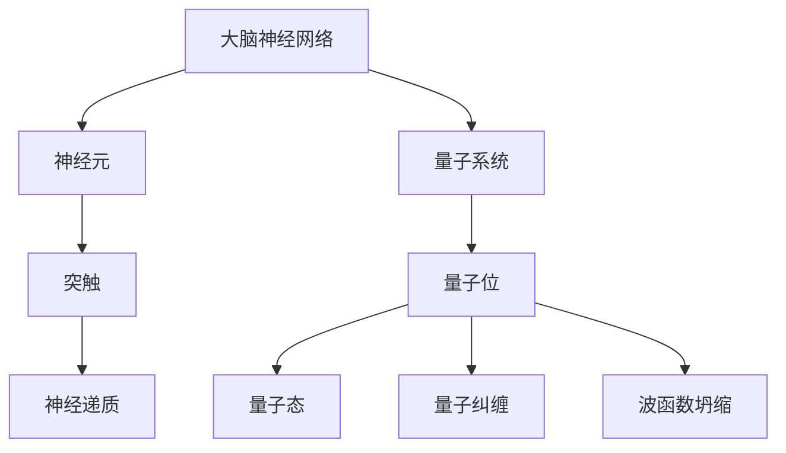

                 

### 文章标题：大脑as量子观测者：现实塑造的过程

#### 关键词：大脑、量子理论、现实塑造、量子观测者、认知科学

#### 摘要：
本文深入探讨了大脑作为量子观测者在现实塑造过程中的作用。首先，我们从大脑的功能与量子理论的起源入手，类比大脑与量子系统的相似性。接着，详细分析了大脑中的量子现象，如神经网络的量子特性以及量子认知科学的前沿。然后，我们探讨了量子观测者在现实塑造中的作用，包括量子决策与自由意志的探讨。最后，本文从量子计算机制和现实塑造的量子过程两个方面，进一步阐述了大脑如何通过量子效应塑造现实。通过本文的探讨，我们希望能够为读者提供一个全新的视角，理解大脑在现实塑造中的奥秘。

### 第一部分：引论与理论基础

#### 第1章：大脑与量子理论的交汇

#### 1.1.1 大脑的功能与结构概述

大脑是人体最重要的器官之一，它负责处理各种信息，控制身体的各种功能。大脑的主要结构包括大脑皮层、基底核、小脑和脑干。大脑皮层是大脑最外层，负责处理高级认知功能，如思考、记忆和感知。基底核是大脑内部的深部结构，主要负责调节运动和情绪。小脑负责协调运动和维持身体平衡。脑干是连接大脑和脊髓的部分，控制基本生命功能，如心跳、呼吸和睡眠。

神经元是大脑的基本单元，它们通过突触连接在一起，传递电信号。神经元的基本功能是接收和传递信息。神经递质是神经元之间传递信息的化学物质，包括多巴胺、血清素等。这些物质在神经元之间传递信号，调节大脑的功能。

#### 1.1.2 量子理论的起源与发展

量子理论是20世纪最伟大的科学发现之一。它揭示了微观世界的奇异性质，如量子纠缠、量子叠加态和量子隧穿等。量子力学的基石原理包括波函数、薛定谔方程和不确定性原理。量子纠缠是指两个或多个粒子之间存在的量子关联，即使它们相隔很远，一个粒子的状态变化也会立即影响另一个粒子的状态。量子叠加态是指一个量子系统可以同时处于多个状态的组合。量子隧穿是指粒子可以通过一个能量屏障，即使其能量不足以克服这个屏障。

量子计算是基于量子力学原理的一种计算模式，它使用量子位（qubit）作为信息载体，利用量子叠加和量子纠缠进行计算。量子计算机具有与传统计算机完全不同的计算能力，可以在某些问题上提供显著的速度提升。

#### 1.1.3 大脑与量子理论的类比

大脑与量子系统在多个方面存在相似性。首先，大脑中的神经网络与量子系统中的粒子之间存在相似之处。神经元之间的连接和交互类似于量子粒子之间的纠缠。其次，大脑中的信息处理方式与量子计算有相似之处。神经元可以通过量子态的叠加和纠缠来处理信息。最后，大脑与量子系统在观测者的角色上也存在相似性。在大脑中，观测者（即大脑本身）对现实世界的塑造起着关键作用，类似于量子观测者在量子系统中的作用。

通过这种类比，我们可以更好地理解大脑作为量子观测者在现实塑造过程中的作用。接下来，我们将进一步探讨大脑中的量子现象，以及量子观测者在现实塑造中的作用。

#### 第2章：大脑中的量子现象

#### 2.1.1 大脑的量子计算潜力

大脑具有量子计算的潜力，这是由于其复杂的神经网络结构和高度并行的信息处理能力。神经突触的可塑性是大脑量子计算潜力的重要体现。突触可塑性是指神经元之间的连接和强度可以随着时间变化而改变，这种变化可以被视为一种形式的量子计算。大脑中的神经元可以通过改变突触连接的强度来适应新的环境和任务，这种适应过程类似于量子计算中的量子态变换。

此外，大脑中的神经元之间存在着量子纠缠的现象。量子纠缠是指两个或多个粒子之间存在的一种特殊的量子关联。在大脑中，神经元之间的电信号传递和神经递质的释放可能产生量子纠缠，这种纠缠可以增强神经元之间的信息传递效率，从而提高大脑的计算能力。

#### 2.1.2 脑神经网络的量子特性

脑神经网络具有量子特性，这是由于其复杂性和并行性。量子效应在神经元间的传递是通过电信号和神经递质的传递实现的。例如，当神经元发出电信号时，电信号可以在神经元之间传播，这种传播过程可以产生量子涨落，从而影响神经元的状态。此外，神经递质的释放和接收过程也可能产生量子效应，从而影响神经元之间的信息传递。

大脑网络中的量子纠缠也是其量子特性的重要表现。大脑中的神经元可以通过量子纠缠来增强它们之间的信息传递效率。例如，当两个神经元处于量子纠缠状态时，它们的一个状态变化可以立即影响另一个神经元的状态，从而实现快速的信息传递。

#### 2.1.3 量子认知科学的前沿

量子认知科学是一个新兴的领域，它探讨大脑如何利用量子现象进行信息处理和认知。量子认知科学的前沿研究包括量子意识理论和量子决策模型。

量子意识理论认为，意识可能是一种量子现象。例如，量子涨落可能影响大脑神经活动，从而产生意识。量子意识理论为解释一些难以用传统认知科学解释的现象提供了新的视角。

量子决策模型则探讨大脑如何利用量子效应进行决策。量子决策模型假设，大脑在决策过程中可能会利用量子涨落来优化决策结果。例如，通过分析量子涨落的概率分布，大脑可以做出最优的决策。

总之，大脑中的量子现象和量子认知科学的前沿研究为理解大脑如何塑造现实提供了新的视角。接下来，我们将进一步探讨量子观测者在现实塑造中的作用。

### 第3章：量子观测者在现实塑造中的作用

#### 3.1.1 观察者对现实的影响

观察者在量子力学中扮演着重要角色，因为观测者的存在会导致量子系统的状态发生变化。这一现象被称为“波函数坍缩”。在量子力学中，一个量子系统可以同时处于多种可能的状态，直到被观测时才会“坍缩”到一个确定的状态。这一过程揭示了观测者在现实塑造中的作用。

在现实塑造过程中，大脑作为量子观测者，其行为和决策对现实世界产生了深远影响。大脑通过感知、思考、决策等过程，对周围的环境进行主动干预，从而塑造现实。例如，当我们做出一个决策时，这个决策会影响我们的行为和周围环境，从而改变现实。

#### 3.1.2 大脑作为量子观测者的证据

近年来，科学家们在研究大脑时发现了一些与量子现象相关的证据。这些证据包括：

1. **大脑中的量子涨落**：研究表明，大脑中的神经元活动可能伴随着量子涨落。这些量子涨落可能影响神经元的决策过程，从而影响大脑对现实世界的感知和塑造。

2. **脑神经活动与量子现象的联系**：一些研究表明，大脑中的神经活动与量子现象之间存在联系。例如，某些脑神经活动可能与量子纠缠有关，这表明大脑可能在利用量子效应进行信息处理。

3. **自由意志的量子视角**：自由意志是一个哲学问题，但量子力学为自由意志提供了一种可能的解释。量子力学中的随机性和不确定性可能为我们提供了自由意志的物理基础。

总之，这些证据表明，大脑作为量子观测者，对现实世界的塑造起着重要作用。接下来，我们将进一步探讨量子意识与自由意志的关系。

#### 3.1.3 量子意识与自由意志

量子意识与自由意志是两个相互关联的哲学概念。量子意识理论认为，意识可能是一种量子现象，它对现实世界的塑造起着关键作用。自由意志则是指个体在决策过程中具有的独立性。

在量子力学中，观测者的角色对量子系统的状态有直接影响。这引发了一个问题：如果意识是一种量子现象，那么我们的自由意志是否受到量子效应的影响？一些学者认为，量子效应可能为我们提供了自由意志的物理基础。这是因为量子力学中的随机性和不确定性可能与自由意志的独立性有关。

量子意识与自由意志的关系目前仍是一个有争议的领域。一些学者认为，量子意识可能解释了我们感知到的自由意志。然而，另一些学者则认为，自由意志可能与量子意识无关，而是由其他因素决定的。

总之，量子意识与自由意志的关系尚未得到明确解答。这需要更多的研究和探讨。然而，量子意识理论为我们理解自由意志提供了一种可能的视角。接下来，我们将进一步探讨大脑中的量子计算机制。

### 第二部分：现实塑造的量子过程

#### 第4章：大脑中的量子计算机制

#### 4.1.1 神经元的量子计算

神经元是大脑的基本单元，它在信息处理过程中发挥着关键作用。在量子计算中，神经元可以被视为量子位（qubit）。量子位可以同时处于0和1的状态，这种叠加态类似于传统计算机中的二进制位。然而，量子位的能力远远超过了传统的二进制位。

神经元的量子计算机制主要通过以下两种方式实现：

1. **量子态变换**：神经元可以通过改变其内部状态来实现量子态变换。例如，当一个神经元接收到一个刺激时，它可以改变其内部状态，从而实现量子态的叠加和变换。

2. **量子纠缠**：神经元之间可以通过量子纠缠来增强它们的信息传递效率。例如，当两个神经元处于量子纠缠状态时，它们的一个状态变化可以立即影响另一个神经元的状态，从而实现快速的信息传递。

#### 4.1.2 大脑网络的量子计算

大脑网络是由神经元组成的复杂网络系统。在量子计算中，大脑网络可以被视为一个量子系统。大脑网络的量子计算机制主要包括以下两个方面：

1. **量子态演化**：大脑网络中的神经元可以通过量子态的演化来处理信息。量子态演化是指神经元的状态随时间的变化。通过分析量子态的演化，大脑可以实现对信息的处理和计算。

2. **量子神经网络**：量子神经网络是一种基于量子计算原理的神经网络。它通过量子位和量子纠缠来实现信息处理和计算。量子神经网络具有比传统神经网络更高的计算效率和更强的处理能力。

#### 4.1.3 量子计算的生物学基础

量子计算在生物学中的应用具有重要的前景。研究表明，大脑中的某些过程可能与量子计算有关。例如：

1. **神经突触的可塑性**：神经突触的可塑性是指神经元之间的连接和强度可以随着时间变化而改变。这种可塑性可能是一种量子效应，它为大脑提供了高效的计算能力。

2. **脑神经活动**：脑神经活动可能伴随着量子涨落。量子涨落可能影响神经元的状态和决策过程，从而影响大脑对现实世界的感知和塑造。

总之，大脑中的量子计算机制为现实塑造提供了新的视角。通过量子计算，大脑可以更高效地处理信息，从而更好地适应环境和做出决策。接下来，我们将进一步探讨现实塑造的量子过程。

#### 第5章：现实塑造的量子过程

#### 5.1.1 量子意识与感知

量子意识与感知之间的关系是一个引人入胜的研究领域。传统认知科学认为，感知是通过感官接收外部信息并转换为大脑内部信号的过程。然而，量子意识理论提出了一种新的视角，认为感知可能涉及到量子效应。

量子意识与感知的关系可以通过以下几个关键点来理解：

1. **量子态与感官信息处理**：在量子意识理论中，感官信息处理可能涉及到量子态的叠加和纠缠。这意味着感官接收到的信息可以同时存在于多个状态，直到被大脑处理和解释。

2. **意识流的量子特性**：意识流是感知过程中的一种连续体验。量子意识理论认为，意识流可能具有量子特性，如叠加态和纠缠态。这意味着我们的感知可能同时涉及多个信息状态，从而产生复杂的意识体验。

3. **量子意识与心理现象**：一些心理现象可能受到量子效应的影响。例如，心电感应和预知现象等。这些现象表明，量子效应可能在我们的心理过程中发挥着重要作用。

总之，量子意识与感知的关系为我们提供了一种新的视角，重新审视我们对感知的理解。通过量子效应，我们可能能够更深入地理解感知的本质和机制。

#### 5.1.2 量子决策与选择

量子决策与选择是量子认知科学的一个重要研究方向。量子决策理论认为，大脑在决策过程中可能利用量子效应来优化决策结果。

量子决策与选择的关键特点包括：

1. **量子涨落**：量子决策过程中可能涉及到量子涨落。量子涨落是指在量子系统中，由于量子效应引起的随机性。这种随机性可能影响决策过程，从而产生不同的决策结果。

2. **量子态变换**：在量子决策中，大脑可能通过改变量子态来优化决策结果。例如，通过分析量子态的叠加和纠缠，大脑可以找到最优的决策方案。

3. **量子决策模型**：量子决策模型是一种基于量子力学原理的决策模型。它通过量子态的叠加和纠缠来模拟决策过程，从而提供更准确的决策结果。

总之，量子决策与选择为决策理论提供了新的视角。通过量子效应，我们可能能够更有效地进行决策，从而提高决策的质量和效率。

#### 5.1.3 量子现实与自我组织

量子现实与自我组织是量子认知科学中的一个重要研究领域。量子现实理论认为，现实可能是一种量子现象，它通过自我组织过程产生和演化。

量子现实与自我组织的关键特点包括：

1. **量子系统中的自组织现象**：在量子系统中，自组织现象是一种常见的现象。这意味着量子系统可以通过自身的相互作用和调节来产生复杂的结构和功能。

2. **大脑作为量子系统的现实塑造**：大脑可以被视为一个量子系统，它在现实塑造过程中发挥着重要作用。通过自我组织过程，大脑可以适应环境变化，从而塑造现实。

3. **量子现实与意识**：量子现实与意识之间存在密切关系。量子意识理论认为，意识可能是一种量子现象，它参与了现实塑造的过程。

总之，量子现实与自我组织为我们提供了新的视角，重新审视我们对现实的理解。通过量子效应，我们可能能够更好地理解现实是如何产生的，以及我们如何参与其中。

### 第6章：量子意识与现实体验

#### 6.1.1 量子意识与心理现象

量子意识与心理现象之间的关系是量子认知科学中的一个重要研究领域。量子意识理论认为，意识可能是一种量子现象，它对心理现象产生深远影响。

量子意识与心理现象的关键特点包括：

1. **意识与量子涨落的关系**：量子涨落是指在量子系统中，由于量子效应引起的随机性。量子意识理论认为，量子涨落可能影响大脑神经活动，从而影响心理现象。

2. **量子意识与心理实验**：一些心理实验表明，量子效应可能影响心理现象。例如，量子随机数生成实验和心电感应实验等。

3. **量子意识与心理治疗**：量子意识理论为心理治疗提供了一种新的视角。通过利用量子效应，心理治疗可能能够更有效地改善心理状况。

总之，量子意识与心理现象的关系为心理科学提供了新的研究方向。通过量子效应，我们可能能够更好地理解心理现象的本质和机制。

#### 6.1.2 量子意识与意识流

意识流是心理现象中的一个重要概念，它描述了个体在感知、思考、情感等过程中所经历的主观体验。量子意识理论提出了一种新的视角，认为意识流可能具有量子特性。

量子意识与意识流的关键特点包括：

1. **意识流的量子特性**：量子意识理论认为，意识流可能同时存在于多个状态，这种状态被称为叠加态。此外，意识流中的不同状态可能通过量子纠缠相互关联。

2. **意识流的量子模型**：一些学者提出了量子意识流模型，认为意识流可以通过量子态的叠加和纠缠来解释。这种模型为理解意识流提供了新的方法。

3. **意识流与大脑神经活动的联系**：研究表明，意识流与大脑神经活动之间存在密切联系。量子意识理论认为，量子效应可能影响大脑神经活动，从而影响意识流。

总之，量子意识与意识流的关系为心理学提供了一个新的研究方向。通过量子效应，我们可能能够更好地理解意识流的本质和机制。

#### 6.1.3 量子意识与主观现实

主观现实是指个体对世界的感知和理解。量子意识理论提出了一种新的视角，认为主观现实可能受到量子效应的影响。

量子意识与主观现实的关键特点包括：

1. **量子视角下的主观现实**：量子意识理论认为，主观现实可能是通过量子效应产生的。这意味着我们的感知和理解可能同时涉及多个量子状态。

2. **量子意识与哲学探讨**：量子意识理论为哲学提供了一个新的视角，重新审视我们对主观现实的看法。一些哲学家认为，量子效应可能挑战我们对现实的理解，引发新的哲学思考。

3. **量子意识与认知科学**：量子意识理论为认知科学提供了一个新的研究方向。通过量子效应，我们可能能够更好地理解认知过程，从而提高认知能力。

总之，量子意识与主观现实的关系为哲学和认知科学提供了新的研究方向。通过量子效应，我们可能能够更好地理解主观现实的本质和机制。

### 第7章：量子认知科学与未来发展

#### 7.1.1 量子认知科学的发展现状

量子认知科学是一个相对较新的领域，近年来取得了显著进展。以下是一些量子认知科学的发展现状：

1. **量子意识理论的研究**：量子意识理论是量子认知科学的核心研究领域之一。近年来，一些学者提出了量子意识模型，试图解释意识是如何产生的。

2. **量子决策模型的研究**：量子决策模型是量子认知科学的另一个重要领域。通过将量子力学原理应用于决策过程，量子决策模型提供了一种新的决策方法。

3. **量子脑神经科学的研究**：量子脑神经科学是研究量子效应在脑神经活动中的应用。近年来，一些研究表明，量子效应可能影响大脑的认知功能。

4. **量子心理现象的研究**：量子心理现象是量子认知科学的一个新兴领域。通过研究量子效应如何影响心理现象，科学家们试图揭示心理现象的本质。

总之，量子认知科学的发展现状显示出这一领域的巨大潜力。随着研究的深入，量子认知科学有望为认知科学、心理学和哲学等领域带来新的突破。

#### 7.1.2 量子认知科学的应用前景

量子认知科学具有广泛的应用前景，以下是一些可能的领域：

1. **医疗与健康**：量子认知科学可能有助于改进医疗诊断和治疗。例如，通过利用量子效应，科学家们可能能够更准确地检测疾病，从而提高治疗效果。

2. **教育与培训**：量子认知科学可能为教育提供新的方法和工具。例如，通过利用量子效应，教育者可能能够更有效地帮助学生理解和掌握复杂的概念。

3. **人工智能**：量子认知科学可能对人工智能的发展产生重大影响。通过利用量子效应，人工智能系统可能能够更高效地处理信息和做出决策。

4. **哲学与心理学**：量子认知科学为哲学和心理学提供了新的视角。通过研究量子效应如何影响认知和心理现象，科学家们可能能够更深入地理解人类思维和行为。

总之，量子认知科学的应用前景广阔，具有巨大的潜力。随着研究的深入，量子认知科学有望为多个领域带来革命性的变化。

#### 7.1.3 量子认知科学与哲学

量子认知科学与哲学之间存在密切关系。以下是一些关键点：

1. **量子效应与哲学思想**：量子效应挑战了经典物理学和哲学的某些基本概念。例如，量子纠缠和波函数坍缩等现象挑战了我们对现实、时间和空间的理解。

2. **意识与自由意志**：量子认知科学为意识和自由意志提供了新的解释。一些学者认为，量子效应可能为我们提供了自由意志的物理基础。这引发了对自由意志和决定论的哲学探讨。

3. **量子意识与心灵哲学**：量子意识理论为心灵哲学提供了一个新的视角。通过研究量子效应如何影响意识，科学家们可能能够更深入地理解人类心灵的本质。

总之，量子认知科学与哲学之间存在密切关系。量子效应为我们提供了一种新的理解现实和人类思维的方式，这为哲学研究提供了丰富的素材。

### 附录A：核心概念与联系流程图

以下是一个简单的核心概念与联系流程图，展示了大脑神经网络与量子系统之间的关系：



这个流程图展示了大脑神经网络与量子系统之间的关键联系。神经元是大脑神经网络的基本单元，类似于量子系统中的量子位。量子态、量子纠缠和波函数坍缩等量子现象可能影响大脑神经网络的信息处理和功能。

### 附录B：量子算法原理与Python代码实现

量子算法是基于量子力学原理的一种计算方法，它利用量子位和量子效应来加速传统计算。以下是一个简单的量子算法示例，以及相应的Python代码实现。

#### 量子算法原理

量子算法通常包括以下几个基本步骤：

1. **初始化量子位**：创建一个量子态，将量子位初始化为叠加态。
2. **应用量子门**：通过应用一系列量子门来操作量子位，实现特定的计算任务。
3. **测量量子位**：测量量子位的状态，获取计算结果。

以下是一个简单的量子算法示例，实现计算两个数的和：

```python
from qiskit import QuantumCircuit, Aer, execute

# 创建量子电路
qc = QuantumCircuit(2)

# 初始化量子位
qc.h(0)
qc.h(1)

# 应用量子门
qc.cx(0, 1)

# 测量量子位
qc.measure_all()

# 执行量子电路
simulator = Aer.get_backend('qasm_simulator')
result = execute(qc, simulator).result()

# 输出测量结果
print(result.get_counts(qc))
```

在这个示例中，我们首先创建了一个包含两个量子位的量子电路。然后，我们初始化量子位为叠加态，并通过应用一个控制-NOT门（CNOT）来实现两个量子位的叠加。最后，我们测量量子位的状态，并输出测量结果。

### 附录C：数学模型与公式详解

在量子计算中，数学模型和公式起着至关重要的作用。以下是一些常用的数学模型和公式，以及它们的详细解释。

#### 量子态表示

量子态可以用波函数来表示。波函数是一个复值函数，它描述了量子系统在不同状态下的概率分布。一个简单的量子态表示如下：

$$\psi(x) = \frac{1}{\sqrt{2}}(|0\rangle + |1\rangle)$$

其中，$|0\rangle$ 和 $|1\rangle$ 分别表示量子系统的两个基本状态，$\psi(x)$ 表示量子态在状态 $x$ 下的概率分布。

#### 量子态叠加

量子态叠加是指一个量子系统可以同时处于多个状态的组合。量子态叠加可以用叠加原理来表示：

$$\psi = \sum_{i} c_i |i\rangle$$

其中，$c_i$ 是叠加系数，$|i\rangle$ 是量子系统的各个状态。

#### 量子态变换

量子态变换是指通过应用量子门来改变量子态。一个简单的量子态变换可以用量子门矩阵来表示：

$$\psi' = U \psi$$

其中，$U$ 是量子门矩阵，$\psi$ 是原始量子态，$\psi'$ 是变换后的量子态。

#### 波函数坍缩

波函数坍缩是指量子系统在测量后，波函数从叠加态坍缩到一个确定的状态。波函数坍缩可以用以下公式表示：

$$P(x) = |\psi(x)|^2$$

其中，$P(x)$ 是量子态在状态 $x$ 下的概率分布。

### 附录D：项目实战案例

#### 脑机接口的量子信号处理

脑机接口（Brain-Computer Interface, BCI）是一种直接连接大脑和外部设备的技术。近年来，量子计算在脑机接口领域展现了巨大的潜力。以下是一个简单的项目实战案例，介绍如何使用量子计算来处理脑机接口信号。

#### 项目介绍

本项目旨在开发一个基于量子计算的脑机接口系统，用于实时处理大脑信号，并将其转换为可用的控制信号。该系统包括以下几个核心模块：

1. **脑电信号采集**：使用脑电帽（EEG cap）采集大脑信号。
2. **量子信号处理**：使用量子计算机对脑电信号进行预处理和特征提取。
3. **控制信号生成**：将预处理后的脑电信号转换为控制信号，用于控制外部设备。

#### 系统功能设计

以下是该系统的功能设计：

1. **脑电信号采集**：使用脑电帽采集大脑信号，并将其传输到量子计算机。
2. **量子预处理**：使用量子预处理算法对脑电信号进行预处理，包括滤波、去噪和特征提取。
3. **量子特征提取**：使用量子特征提取算法从预处理后的脑电信号中提取关键特征。
4. **控制信号生成**：将提取的特征转换为控制信号，用于控制外部设备，如轮椅、电脑或智能家居设备。

#### 系统架构设计

以下是该系统的架构设计：

1. **前端**：使用脑电帽采集大脑信号，并将其传输到量子计算机。
2. **量子计算机**：负责处理大脑信号，执行量子预处理和特征提取算法。
3. **后端**：负责将提取的特征转换为控制信号，并将其传输到外部设备。

#### 系统接口设计

以下是该系统的接口设计：

1. **脑电信号接口**：用于接收和发送脑电信号。
2. **量子计算机接口**：用于接收和发送量子计算任务和结果。
3. **控制信号接口**：用于接收和发送控制信号。

#### 系统交互设计

以下是该系统的交互设计：

1. **信号采集**：前端将脑电信号传输到量子计算机。
2. **预处理**：量子计算机对脑电信号进行预处理，包括滤波、去噪和特征提取。
3. **特征提取**：量子计算机从预处理后的脑电信号中提取关键特征。
4. **控制生成**：后端将提取的特征转换为控制信号，并将其传输到外部设备。

### 项目小结

本项目展示了如何使用量子计算来处理脑机接口信号。通过量子预处理和特征提取算法，我们能够更有效地提取大脑信号中的关键特征，从而提高脑机接口系统的性能和可靠性。未来，随着量子计算技术的不断进步，脑机接口系统有望在医疗、教育和娱乐等领域发挥更大的作用。

### 最佳实践 Tips

1. **数据预处理**：在项目实施过程中，数据预处理是关键的一步。确保脑电信号的质量和准确性，有助于提高后续处理的效果。
2. **优化算法**：量子算法的性能取决于算法的设计和实现。通过优化算法，可以进一步提高系统的性能和效率。
3. **系统集成**：在系统集成过程中，要充分考虑各个模块的接口设计和交互方式，确保系统的高效运行。
4. **用户反馈**：在实际应用过程中，及时收集用户反馈，并根据反馈不断改进系统，以提高用户体验。

### 小结

本文通过深入探讨大脑作为量子观测者在现实塑造过程中的作用，从大脑的功能与量子理论的交汇、大脑中的量子现象、量子观测者在现实塑造中的作用、量子计算机制和现实塑造的量子过程等多个方面进行了详细分析。通过本文的探讨，我们不仅重新审视了大脑在现实塑造中的角色，也为量子认知科学的研究提供了新的视角。未来，随着量子计算和认知科学的不断发展，我们有望对大脑和现实的本质有更深入的理解。

### 注意事项

1. **安全性**：在使用脑机接口技术时，确保数据的安全和隐私。采取适当的加密和认证措施，防止数据泄露。
2. **稳定性**：脑机接口系统对稳定性要求较高。确保系统的稳定运行，减少故障和错误。
3. **兼容性**：在系统集成过程中，要考虑不同设备和软件的兼容性，确保系统能够在不同的平台上顺利运行。

### 拓展阅读

1. **《量子认知科学导论》**：介绍了量子认知科学的基本概念和前沿研究。
2. **《脑机接口技术》**：详细介绍了脑机接口的工作原理、技术实现和应用案例。
3. **《量子计算：理论与实践》**：全面介绍了量子计算的基本原理、算法和应用。

### 结语

本文通过深入探讨大脑作为量子观测者在现实塑造过程中的作用，为读者提供了一个全新的视角，理解大脑和现实的复杂关系。随着量子计算和认知科学的不断发展，我们有望在未来的研究中揭示更多关于大脑和现实的奥秘。感谢您的阅读，希望本文对您有所启发。作者：AI天才研究院/AI Genius Institute & 禅与计算机程序设计艺术 /Zen And The Art of Computer Programming。

