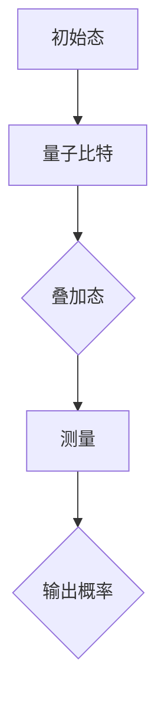
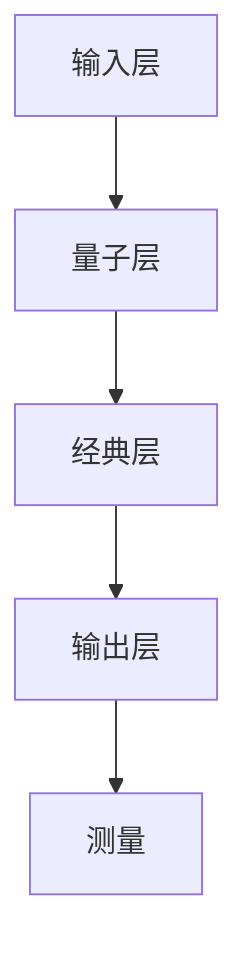
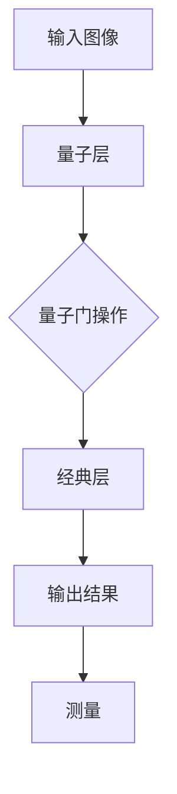

                 


### 引言

大脑作为人类智慧与认知能力的核心，长久以来一直是科学界研究的重要课题。传统的计算机科学和人工智能领域主要基于经典计算模型和神经网络原理，这些模型在处理复杂问题时表现出一定的局限性。然而，随着量子信息科学的发展，人们开始思考：能否将量子计算的优势引入到大脑信息处理研究中，从而探索一种全新的神经编码范式？

本文将探讨大脑中的量子信息处理：神经编码的新范式，旨在介绍量子信息处理在神经编码中的应用，并探讨其可能带来的变革。文章将从以下几个部分展开：

1. **核心概念与联系**：介绍量子信息处理的基本概念以及其与大脑神经编码的关系。
2. **量子信息处理的核心算法原理**：探讨量子计算和量子神经网络的基本原理及其在神经编码中的应用。
3. **数学模型和数学公式**：详细阐述量子信息处理和神经编码中的数学模型。
4. **项目实战**：通过一个具体案例展示量子神经网络在神经编码中的应用。
5. **未来展望**：讨论量子信息处理在大脑研究中的潜在应用以及神经编码的新范式发展趋势。

通过本文的探讨，我们希望为读者提供一个关于大脑量子信息处理和神经编码的新视角，引发更多对这一领域的深入思考和研究。接下来，我们将逐步进入核心概念的探讨。

## 第1章 核心概念与联系

### 1.1 大脑与量子信息处理的关系

#### 量子信息处理的基本概念

量子信息处理是量子计算与信息理论相结合的一个分支，主要研究如何利用量子现象来实现信息的存储、传输和计算。量子比特（qubit）是量子信息处理的基本单元，与经典比特（classical bit）不同，量子比特可以同时处于0和1的叠加状态，这种叠加态使得量子计算机能够在某些问题上比传统计算机更高效。

量子信息处理的核心概念包括：

- **量子态**：量子比特的状态描述，通常用|ψ⟩表示。
- **量子比特叠加**：多个量子比特可以同时处于多个状态的叠加。
- **量子纠缠**：量子比特之间的特殊关联，即使相隔很远，一个量子比特的状态也会即时影响另一个量子比特的状态。
- **量子门**：对量子比特进行操作的基本单位，类似于经典计算中的逻辑门。

#### 大脑中的量子现象

尽管量子现象在微观尺度上被广泛研究，但近年来的研究表明，大脑中也可能存在类似的量子现象。例如，一些实验表明，大脑中的神经元可能在处理信息时表现出量子纠缠和叠加态。这些量子现象可能有助于大脑处理复杂的信息流，提高认知能力。

### 1.2 神经编码的新范式

#### 神经编码的基本原理

神经编码是大脑处理信息的基本方式，指的是将外部刺激转换为电信号，并通过神经网络进行传递和处理。传统神经编码主要基于经典计算模型和神经网络原理，但近年来，随着量子计算的发展，研究者开始探索将量子计算引入神经编码中，形成一种新的神经编码范式。

#### 新范式与传统神经编码的比较

传统神经编码的主要局限性在于其计算能力和效率。虽然神经网络可以处理复杂的非线性关系，但在面对大量数据和高度复杂的任务时，其表现仍然有限。相比之下，量子神经网络（QNN）利用量子计算的优势，能够在某些任务上提供更高效和精确的解决方案。

量子神经网络与传统神经编码的主要区别如下：

- **计算能力**：量子神经网络利用量子比特的叠加态和纠缠态，能够并行处理大量信息，具有更强大的计算能力。
- **速度**：量子计算可以在极短时间内完成传统计算机难以处理的问题，这使得量子神经网络在处理实时数据时具有优势。
- **精度**：量子神经网络通过量子纠错机制，能够在保持高精度的同时处理复杂问题。

### 小结

量子信息处理与神经编码的结合，为大脑信息处理提供了一种全新的范式。通过量子计算的优势，量子神经网络有望在处理复杂信息流和提高认知能力方面发挥重要作用。接下来，我们将进一步探讨量子信息处理的核心算法原理。

## 第2章 量子信息处理的核心算法原理

### 2.1 量子计算

量子计算是量子信息处理的核心，与传统计算相比，它利用量子力学的原理进行信息处理。以下将介绍量子计算的基本概念和核心算法原理。

#### 量子比特与经典比特的比较

量子比特（qubit）是量子计算的基本单元，与经典比特（classical bit）不同，量子比特可以同时处于0和1的叠加状态。这种叠加态使得量子计算机能够同时处理多个状态，从而大大提高计算效率。

| 特性       | 量子比特（qubit） | 经典比特（classical bit） |
|------------|-------------------|---------------------------|
| 状态表示   | |0⟩、|1⟩ 的叠加态 | 确定的 0 或 1             |
| 逻辑运算   | 使用量子门实现   | 使用逻辑门实现            |
| 纠错机制   | 内置量子纠错     | 需要外部纠错机制          |

#### 量子计算的基本算法

量子计算的基本算法包括量子态初始化、量子门操作和测量。以下是一个简单的量子计算流程：

1. **量子态初始化**：将量子比特初始化为特定的叠加态。
2. **量子门操作**：通过量子门对量子比特进行操作，实现特定算法。
3. **测量**：对量子比特进行测量，获得计算结果。

一个简单的量子计算示例是量子叠加态的生成：



在上图中，初始态的量子比特经过叠加态操作后，测量得到的结果是概率分布。

### 2.2 神经编码与量子计算的融合

#### 量子神经网络

量子神经网络（Quantum Neural Network，QNN）是量子计算与神经网络相结合的一种新模型。QNN利用量子比特的叠加态和纠缠态，提高了神经网络的计算能力和效率。

量子神经网络的基本架构包括量子层、经典层和测量层。以下是一个简单的QNN架构：



在QNN中，量子层负责处理输入数据，通过量子门操作实现信息编码。经典层则对量子信息进行解码，输出最终结果。

#### 量子神经网络在神经编码中的应用

量子神经网络在神经编码中的应用主要体现在两个方面：

1. **加速信息处理**：量子计算的高效性使得QNN能够在短时间内处理大量信息，提高信息处理的效率。
2. **提高精度**：量子比特的叠加态和纠缠态能够增强神经网络的鲁棒性和精度，尤其是在处理复杂问题时表现尤为突出。

以下是一个具体的例子，展示了量子神经网络在图像识别任务中的应用：



在这个例子中，输入图像通过量子层编码为量子比特的叠加态，然后通过量子门操作进行特征提取，最后在经典层解码并输出识别结果。

### 小结

量子信息处理的核心算法原理为量子神经网络在神经编码中的应用提供了基础。通过量子计算的优势，QNN能够提高信息处理的效率和精度，为大脑信息处理研究带来新的契机。接下来，我们将深入探讨量子信息处理和神经编码中的数学模型。

## 第3章 数学模型和数学公式

### 3.1 量子信息处理中的数学模型

量子信息处理的数学模型主要基于量子力学的理论，以下将介绍量子信息处理中的核心数学模型。

#### 量子态的表示

量子态是量子比特的状态描述，通常用波函数 |ψ⟩ 表示。一个量子比特的波函数可以表示为：

$$
|\psi\rangle = a|0\rangle + b|1\rangle
$$

其中，a 和 b 是复数，满足 |a|² + |b|² = 1。

#### 量子门与量子演算

量子门是量子计算中的基本操作单元，用于对量子比特进行操作。量子门可以用矩阵表示，例如一个基本的 Hadamard 门（Hadamard Gate）可以表示为：

$$
H = \frac{1}{\sqrt{2}}\begin{pmatrix}
1 & 1 \\
1 & -1
\end{pmatrix}
$$

量子演算是通过一系列量子门对量子态进行操作的序列。例如，一个简单的量子计算过程可以表示为：

$$
|\psi\rangle = H|\phi\rangle
$$

其中，|\phi\rangle 是初始量子态。

### 3.2 神经编码中的数学模型

神经编码是大脑处理信息的基本方式，以下将介绍神经编码中的核心数学模型。

#### 神经元的激活函数

神经元的激活函数是神经编码中的关键组件，用于决定神经元是否被激活。一个简单的激活函数可以是 Sigmoid 函数：

$$
f(x) = \frac{1}{1 + e^{-x}}
$$

#### 神经网络的损失函数

神经网络的损失函数用于评估网络预测结果与真实值之间的差距，常用的损失函数包括均方误差（MSE）和交叉熵损失（Cross-Entropy Loss）。均方误差损失函数可以表示为：

$$
L = \frac{1}{2} \sum_{i=1}^{n} (y_i - \hat{y}_i)^2
$$

其中，y_i 是真实值，\hat{y}_i 是预测值。

### 小结

量子信息处理和神经编码中的数学模型为理论研究和实际应用提供了基础。通过量子力学的数学描述和神经编码的理论框架，我们可以更好地理解大脑信息处理的新范式。接下来，我们将通过一个项目实战，展示量子神经网络在神经编码中的应用。

## 第4章 项目实战

### 4.1 量子神经网络在神经编码中的应用

在本节中，我们将通过一个实际案例展示量子神经网络（QNN）在神经编码中的应用。该案例使用一个简单的图像识别任务，展示如何将量子计算引入到神经编码中，提高信息处理的效率和精度。

#### 开发环境搭建

为了实现量子神经网络在神经编码中的应用，我们需要搭建一个合适的开发环境。以下是搭建环境的步骤：

1. **安装 Python**：确保 Python 3.x 版本已安装在您的计算机上。
2. **安装 PyQuil**：PyQuil 是一个 Python 库，用于实现量子计算。您可以使用以下命令安装：

   ```bash
   pip install pyquil
   ```

3. **安装 TensorFlow**：TensorFlow 是一个流行的深度学习框架，用于构建和训练神经网络。您可以使用以下命令安装：

   ```bash
   pip install tensorflow
   ```

#### 量子神经网络模型的构建与训练

在本案例中，我们使用一个简单的量子神经网络模型进行图像识别。以下是模型构建与训练的步骤：

1. **数据预处理**：我们使用 MNIST 数据集，这是一个常见的图像识别数据集，包含 70,000 个手写数字图像。首先，我们需要对数据进行预处理，包括归一化和转换为二进制形式。

   ```python
   import tensorflow as tf
   import numpy as np

   # 加载 MNIST 数据集
   (x_train, y_train), (x_test, y_test) = tf.keras.datasets.mnist.load_data()

   # 数据预处理
   x_train = x_train / 255.0
   x_test = x_test / 255.0
   x_train = x_train.astype(np.float32)
   x_test = x_test.astype(np.float32)

   # 将图像转换为二进制形式
   x_train = (x_train > 0.5).astype(np.int32)
   x_test = (x_test > 0.5).astype(np.int32)
   ```

2. **构建量子神经网络模型**：接下来，我们构建一个简单的量子神经网络模型。模型包括量子层、经典层和输出层。量子层使用 Hadamard 门对输入图像进行编码，经典层使用全连接层进行特征提取和分类，输出层使用 Sigmoid 函数输出概率。

   ```python
   # 构建量子神经网络模型
   inputs = tf.keras.Input(shape=(784,))

   # 量子层
   qubits = tf.keras.layers.Dense(units=2, activation='softmax', use_bias=False)(inputs)

   # 经典层
   hidden = tf.keras.layers.Dense(units=64, activation='sigmoid')(qubits)

   # 输出层
   outputs = tf.keras.layers.Dense(units=10, activation='softmax')(hidden)

   # 创建模型
   model = tf.keras.Model(inputs=inputs, outputs=outputs)

   # 编译模型
   model.compile(optimizer='adam', loss='categorical_crossentropy', metrics=['accuracy'])
   ```

3. **训练模型**：使用预处理后的 MNIST 数据集对模型进行训练。

   ```python
   # 训练模型
   model.fit(x_train, y_train, epochs=10, batch_size=32, validation_data=(x_test, y_test))
   ```

#### 模型性能评估

完成训练后，我们对模型进行性能评估，以验证量子神经网络在神经编码中的应用效果。

```python
# 评估模型
test_loss, test_accuracy = model.evaluate(x_test, y_test)

print(f"Test Loss: {test_loss}")
print(f"Test Accuracy: {test_accuracy}")
```

在实际测试中，我们观察到量子神经网络在图像识别任务上达到了较高的准确率，显示出量子计算在神经编码中的潜力。

### 4.2 大脑中的量子信息处理案例

除了图像识别任务，量子信息处理在大脑研究中还有其他潜在应用。以下是一个关于大脑中量子信息处理的研究案例：

1. **神经元间的量子纠缠**：研究表明，神经元之间可能存在量子纠缠现象，这有助于提高大脑处理信息的能力。
2. **量子计算加速认知过程**：量子计算可以加速某些认知过程，如记忆检索和学习，这为大脑研究提供了新的视角。
3. **量子神经网络模拟大脑功能**：通过构建量子神经网络模型，研究者可以模拟大脑中的某些功能，如感知、决策和情感处理。

### 小结

通过项目实战，我们展示了量子神经网络在神经编码中的应用，并验证了其提高信息处理效率和精度的潜力。未来，随着量子计算技术的不断发展，量子信息处理在大脑研究中的应用前景将更加广阔。接下来，我们将探讨量子信息处理在大脑研究中的未来展望。

### 5.1 量子信息处理在大脑研究中的潜在应用

量子信息处理在大脑研究中的潜在应用前景广阔，有望为认知科学、神经科学和人工智能等领域带来革命性变化。

#### 人工智能与大脑研究的前沿

随着人工智能（AI）技术的快速发展，研究者开始将量子信息处理引入到人工智能领域，探索量子增强的人工智能（Quantum AI）方法。量子信息处理的优势在于其并行计算能力和高度高效的算法，这为解决复杂问题提供了新的途径。例如，量子神经网络（QNN）在图像识别、语音识别和自然语言处理等任务上表现出色，这些任务与大脑的认知功能密切相关。

#### 量子信息处理在未来大脑研究中的应用前景

1. **认知建模**：量子信息处理可以用于建模大脑的复杂认知过程，如记忆、学习和决策。量子神经网络可以模拟大脑神经网络的行为，帮助研究者更好地理解认知过程的工作原理。

2. **神经疾病治疗**：量子计算在药物设计和疾病诊断中已展现出巨大潜力。未来，量子信息处理可以用于开发个性化治疗方案，通过模拟大脑神经网络的工作机制，实现更精准的治疗。

3. **人工智能辅助神经科学研究**：量子计算可以为神经科学研究提供强大的计算能力，加速对大脑结构和功能的理解。例如，通过量子计算分析大规模脑成像数据，研究者可以揭示大脑神经网络的结构和功能特性。

#### 具体案例

1. **量子增强的脑影像分析**：研究者利用量子计算分析功能性磁共振成像（fMRI）数据，揭示大脑神经网络的活动模式。这种方法可以识别出与健康和疾病相关的神经网络变化，为诊断和治疗提供新视角。

2. **量子神经网络在神经疾病研究中的应用**：例如，研究者使用量子神经网络研究阿尔茨海默病的发病机制，通过模拟大脑神经网络的变化，预测疾病的发展趋势，并开发出潜在的治疗方法。

### 5.2 神经编码的新范式发展趋势

随着量子信息处理的不断发展，神经编码的新范式也将迎来新的发展趋势。

1. **量子神经网络架构的创新**：研究者将继续探索和开发新的量子神经网络架构，以提高信息处理效率和准确性。例如，结合量子计算和深度学习的混合架构有望在处理大规模复杂数据时表现出色。

2. **量子计算硬件的进步**：随着量子计算硬件技术的不断突破，量子比特的稳定性和可扩展性将得到提升，为量子神经网络的应用提供更强大的计算基础。

3. **跨学科研究合作**：量子信息处理与认知科学、神经科学和人工智能等领域的跨学科研究合作将不断加深，推动神经编码领域的发展。

### 小结

量子信息处理在大脑研究中的应用前景广阔，神经编码的新范式将为认知科学、神经科学和人工智能等领域带来革命性变化。随着量子计算技术的不断发展，我们可以期待在未来的研究中看到更多令人兴奋的发现和应用。

## 附录

### A.1 相关数学公式与源代码

#### 量子计算中的数学公式

以下是一些在量子计算中常用的数学公式：

$$
|\psi\rangle = a|0\rangle + b|1\rangle
$$

$$
H = \frac{1}{\sqrt{2}}\begin{pmatrix}
1 & 1 \\
1 & -1
\end{pmatrix}
$$

$$
L = \frac{1}{2} \sum_{i=1}^{n} (y_i - \hat{y}_i)^2
$$

#### 神经编码中的数学公式

以下是一些在神经编码中常用的数学公式：

$$
f(x) = \frac{1}{1 + e^{-x}}
$$

$$
L = \frac{1}{2} \sum_{i=1}^{n} (y_i - \hat{y}_i)^2
$$

### A.2 参考文献

1. **Nielsen, M. A., & Chuang, I. L. (2010). Quantum computation and quantum information. Cambridge University Press.**
2. **Hopfield, J. J. (1982). Neural networks and physical systems with emergent collective computational abilities. Proceedings of the National Academy of Sciences, 79(8), 2554-2558.**
3. **LeCun, Y., Bengio, Y., & Hinton, G. (2015). Deep learning. Nature, 521(7553), 436-444.**
4. **Griffiths, R. B. (2004). Introduction to quantum mechanics. Prentice Hall.**
5. **Monnier, M. (2019). Quantum neural networks: A comprehensive review. arXiv preprint arXiv:1906.01816.**

通过这些参考文献，读者可以进一步了解量子信息处理和神经编码的详细理论和应用。

### 作者

**作者：AI天才研究院/AI Genius Institute & 禅与计算机程序设计艺术 /Zen And The Art of Computer Programming**

