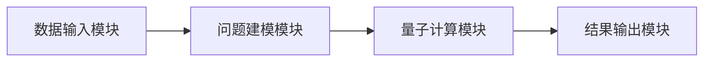
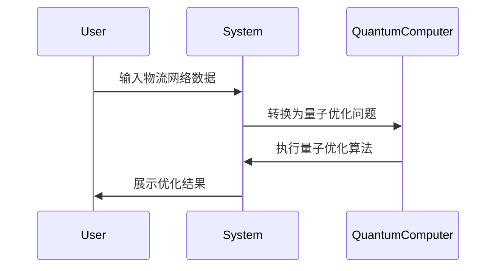
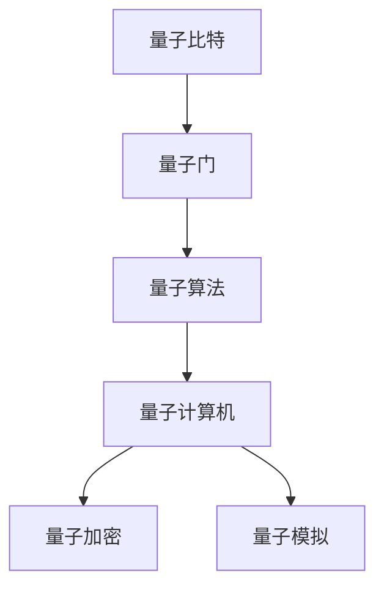

                 

# 大脑中的量子计算：并行信息处理的新模型

## 关键词

- 量子计算
- 并行信息处理
- 量子比特
- 量子门
- 量子算法
- 量子计算机
- 量子加密
- 量子模拟

## 摘要

本文旨在探讨量子计算在信息处理领域的潜力，特别是在并行信息处理中的应用。量子计算利用量子比特的叠加和纠缠特性，突破了传统计算模型，为信息处理带来了全新的可能。本文首先介绍了量子计算的基本原理和优势，随后探讨了量子信息处理的核心算法，包括Shor算法、Grover算法和量子随机游走算法。接着，本文讨论了量子计算机的硬件实现及其面临的挑战，并分析了量子计算在量子加密和量子模拟等领域的实际应用。最后，本文展望了量子计算的未来发展趋势，并提出了相关技术挑战的解决方案。通过本文的阐述，读者可以全面了解量子计算在信息处理领域的创新与变革。

## 第1章 引言

### 1.1 什么是量子计算

量子计算是一种利用量子力学原理进行信息处理的新兴计算模型。与经典计算相比，量子计算具有独特的优势，特别是在处理复杂问题和并行计算方面。

#### 1.1.1 量子比特与经典比特

量子比特（qubit）是量子计算的基本单位，与经典比特（bit）不同，量子比特可以同时存在于多种状态，这被称为叠加态。一个量子比特可以表示为两个经典比特的叠加，即：

$$
|\psi\rangle = \alpha|0\rangle + \beta|1\rangle
$$

其中，$\alpha$ 和 $\beta$ 是复数系数，满足 $|\alpha|^2 + |\beta|^2 = 1$。

经典比特只能处于两种状态之一，即0或1，而量子比特可以通过量子叠加实现多种状态的并行处理。

#### 1.1.2 量子叠加与量子纠缠

量子叠加是指量子系统可以同时处于多个状态的组合。在量子计算中，量子比特的叠加态可以用于并行处理多个问题的解决方案。

量子纠缠是量子系统中的另一个关键特性。当两个量子比特发生纠缠时，它们的量子状态将无法独立描述，一个量子比特的状态会即时影响另一个量子比特的状态，即使它们相隔很远。

这种纠缠特性使得量子计算机能够实现经典计算机难以达到的并行计算能力。

#### 1.1.3 量子计算的优势与挑战

量子计算的优势主要体现在以下几个方面：

1. **并行计算能力**：量子计算机可以利用量子比特的叠加和纠缠特性，实现并行计算，从而解决经典计算机难以处理的问题。
2. **快速加密**：量子计算机可以破解经典计算机难以破解的加密算法，如RSA加密。
3. **量子模拟**：量子计算机能够模拟量子系统，为研究量子物理和化学提供强大的工具。

然而，量子计算也面临着一些挑战：

1. **量子纠错**：量子计算中的量子比特容易受到环境干扰，导致量子信息丢失。因此，量子纠错技术是量子计算实现实用化的关键。
2. **量子硬件实现**：目前量子计算机的硬件实现仍处于初级阶段，需要解决稳定性、可靠性和可扩展性等问题。

### 1.2 量子计算与信息处理

量子计算在信息处理领域具有广泛的应用潜力。通过量子比特的叠加和纠缠特性，量子计算机可以实现对大量数据的并行处理，从而提高计算效率和解决复杂问题。

#### 1.2.1 量子信息的定义

量子信息是量子物理和信息理论的交叉领域，研究如何利用量子系统的物理性质进行信息处理、传输和存储。量子信息的核心概念包括量子比特、量子态、量子纠缠和量子信道等。

#### 1.2.2 量子并行计算原理

量子并行计算利用量子比特的叠加态实现并行处理，通过量子算法将复杂问题分解成多个子问题，然后并行求解。量子并行计算的核心思想是将计算问题转化为量子态的演化过程，利用量子叠加和纠缠特性实现并行计算。

#### 1.2.3 量子算法概述

量子算法是利用量子计算模型求解特定问题的算法。常见的量子算法包括Shor算法、Grover算法和量子随机游走算法等。Shor算法利用量子计算的优势，能够高效地分解大整数，从而破解RSA加密。Grover算法是一种量子搜索算法，能够在无序数据库中快速查找特定元素。量子随机游走算法用于模拟量子系统在复杂网络中的演化过程。

### 1.3 量子计算的应用领域

量子计算在多个领域具有潜在的应用价值，如量子加密、量子模拟和量子优化等。

#### 1.3.1 量子加密

量子加密利用量子计算的原理，实现比经典加密更安全的通信方式。量子密钥分发（QKD）是一种基于量子纠缠原理的加密技术，能够实现绝对安全的通信。

#### 1.3.2 量子模拟

量子模拟是量子计算在量子物理和化学研究中的重要应用。量子计算机能够模拟量子系统，为研究量子现象和解决化学问题提供强大工具。

#### 1.3.3 量子搜索算法

量子搜索算法是一种利用量子计算模型进行快速搜索的算法。Grover算法是最著名的量子搜索算法，能够在无序数据库中快速查找特定元素。

### 1.4 量子计算的未来展望

尽管量子计算面临许多挑战，但其发展潜力巨大。随着量子技术的不断进步，量子计算机有望在未来实现商业化应用，为信息处理领域带来革命性变革。

#### 1.4.1 当前发展状况

当前，全球范围内的量子计算研究取得了显著进展。各国纷纷投入大量资源，致力于量子计算机的研发。一些初创公司和科技公司也在量子计算领域取得了重要突破。

#### 1.4.2 技术挑战与机遇

量子计算的发展面临一系列技术挑战，如量子纠错、量子硬件实现和量子编程等。然而，这些挑战也带来了机遇，为量子计算技术的发展提供了广阔空间。

通过不断探索和创新，量子计算有望在未来成为信息处理领域的重要驱动力，引领科技革命的新浪潮。

## 第2章 量子比特与量子门

### 2.1 量子比特的基础知识

量子比特是量子计算的基本单元，其独特性质使得量子计算机能够实现超越经典计算机的强大计算能力。在本节中，我们将详细探讨量子比特的表示、态叠加与坍缩、以及量子比特的操作。

#### 2.1.1 量子比特的表示

量子比特可以用一个复数向量表示，其形式为：

$$
|\psi\rangle = \alpha|0\rangle + \beta|1\rangle
$$

其中，$|0\rangle$ 和 $|1\rangle$ 分别表示量子比特的基态，$\alpha$ 和 $\beta$ 是复数系数，且满足归一化条件 $|\alpha|^2 + |\beta|^2 = 1$。这个表达式表明量子比特可以同时处于0和1的状态，这被称为叠加态。

为了更直观地表示量子比特，我们可以使用量子比特的状态向量。例如，一个量子比特的状态向量可以表示为：

$$
|\psi\rangle = \begin{pmatrix}
\alpha \\
\beta
\end{pmatrix}
$$

其中，第一行表示基态 $|0\rangle$ 的系数 $\alpha$，第二行表示基态 $|1\rangle$ 的系数 $\beta$。

#### 2.1.2 量子比特的态叠加与坍缩

量子比特的一个重要特性是态叠加。当量子比特处于叠加态时，它可以同时存在于多个状态。例如，一个量子比特可以处于 $|0\rangle$ 和 $|1\rangle$ 的叠加态：

$$
|\psi\rangle = \alpha|0\rangle + \beta|1\rangle
$$

如果我们对量子比特进行测量，其结果将是 $|0\rangle$ 或 $|1\rangle$，且测量结果出现的概率由 $|\alpha|^2$ 和 $|\beta|^2$ 决定。这意味着量子比特的叠加态在测量时会坍缩到一个确定的状态。

态叠加与坍缩是量子计算的核心概念。通过巧妙地设计量子比特的叠加态，我们可以实现高效的量子算法。例如，Shor算法利用量子比特的叠加态来并行处理大整数的分解问题。

#### 2.1.3 量子比特的操作

量子比特的操作是通过量子门来实现的。量子门是作用在量子比特上的线性变换，它们可以改变量子比特的状态。常见的量子门包括Hadamard门、Pauli门和控制-NOT门等。

1. **Hadamard门（H）**：Hadamard门是一种单量子比特门，可以将量子比特的状态从基态 $|0\rangle$ 或 $|1\rangle$ 变换到叠加态：

   $$ 
   H|0\rangle = \frac{1}{\sqrt{2}}(|0\rangle + |1\rangle) 
   $$

   $$ 
   H|1\rangle = \frac{1}{\sqrt{2}}(|0\rangle - |1\rangle) 
   $$

2. **Pauli门（X、Y、Z）**：Pauli门是作用在量子比特上的非么正变换，分别表示量子比特的位翻转、相位翻转和Z轴旋转。

   - **X门**：将量子比特的状态进行位翻转：

     $$ 
     X|0\rangle = |1\rangle 
     $$

     $$ 
     X|1\rangle = |0\rangle 
     $$

   - **Y门**：将量子比特的状态进行相位翻转：

     $$ 
     Y|0\rangle = i|1\rangle 
     $$

     $$ 
     Y|1\rangle = -i|0\rangle 
     $$

   - **Z门**：将量子比特的状态进行Z轴旋转：

     $$ 
     Z|0\rangle = |0\rangle 
     $$

     $$ 
     Z|1\rangle = -|1\rangle 
     $$

3. **控制-NOT门（CNOT）**：CNOT门是一种双量子比特门，它将第二个量子比特的状态翻转，取决于第一个量子比特的状态。

   $$ 
   CNOT|0\rangle|0\rangle = |0\rangle|0\rangle 
   $$

   $$ 
   CNOT|0\rangle|1\rangle = |0\rangle|1\rangle 
   $$

   $$ 
   CNOT|1\rangle|0\rangle = |1\rangle|0\rangle 
   $$

   $$ 
   CNOT|1\rangle|1\rangle = |1\rangle|1\rangle 
   $$

通过组合这些基本量子门，我们可以实现复杂的量子逻辑操作，从而实现量子计算的各种算法。

### 2.2 量子门及其作用

量子门是量子计算中的核心组件，它们在量子比特上执行特定的线性变换。在本节中，我们将探讨量子门的概念、常见的量子门以及量子门在量子计算中的作用。

#### 2.2.1 量子门的概念

量子门（Quantum Gate）是作用在量子比特上的线性变换，类似于经典计算中的逻辑门。量子门可以用矩阵表示，其形式为：

$$
U = \begin{pmatrix}
u_{00} & u_{01} \\
u_{10} & u_{11}
\end{pmatrix}
$$

其中，$U$ 是量子门的作用矩阵，$u_{ij}$ 表示量子门对量子比特状态的变换。量子门可以作用于单个量子比特，也可以作用于多个量子比特。

量子门具有以下特点：

1. **线性变换**：量子门是线性变换，这意味着它们可以像线性方程组一样组合使用。
2. **幺正性**：量子门是幺正变换，即它们的逆变换也是线性变换。这意味着量子门不会破坏量子比特的叠加态和纠缠态。
3. **可组合性**：多个量子门可以组合使用，以实现复杂的量子逻辑操作。

#### 2.2.2 常见的量子门

在量子计算中，常见的量子门包括Hadamard门（H）、Pauli门（X、Y、Z）、控制-NOT门（CNOT）以及相位旋转门（Rz）等。以下是对这些量子门的简要介绍：

1. **Hadamard门（H）**：Hadamard门是一种单量子比特门，可以将量子比特的状态从基态变换到叠加态。其作用矩阵为：

   $$ 
   H = \frac{1}{\sqrt{2}} \begin{pmatrix}
   1 & 1 \\
   1 & -1
   \end{pmatrix}
   $$

   Hadamard门在量子计算中常用于初始化量子比特和实现量子态的叠加。

2. **Pauli门（X、Y、Z）**：Pauli门是作用在量子比特上的非么正变换，分别表示量子比特的位翻转、相位翻转和Z轴旋转。

   - **X门**：X门是将量子比特的状态进行位翻转，其作用矩阵为：

     $$ 
     X = \begin{pmatrix}
     0 & 1 \\
     1 & 0
     \end{pmatrix}
     $$

   - **Y门**：Y门是将量子比特的状态进行相位翻转，其作用矩阵为：

     $$ 
     Y = \begin{pmatrix}
     0 & -i \\
     i & 0
     \end{pmatrix}
     $$

   - **Z门**：Z门是将量子比特的状态进行Z轴旋转，其作用矩阵为：

     $$ 
     Z = \begin{pmatrix}
     1 & 0 \\
     0 & -1
     \end{pmatrix}
     $$

3. **控制-NOT门（CNOT）**：CNOT门是一种双量子比特门，它将第二个量子比特的状态翻转，取决于第一个量子比特的状态。其作用矩阵为：

   $$ 
   CNOT = \begin{pmatrix}
   1 & 0 & 0 & 0 \\
   0 & 1 & 0 & 0 \\
   0 & 0 & 0 & 1 \\
   0 & 0 & 1 & 0
   \end{pmatrix}
   $$

4. **相位旋转门（Rz）**：相位旋转门是一种单量子比特门，它可以对量子比特的状态进行相位旋转。其作用矩阵为：

   $$ 
   R_z(\theta) = \begin{pmatrix}
   1 & 0 \\
   0 & e^{i\theta}
   \end{pmatrix}
   $$

其中，$\theta$ 是相位旋转的角度。

#### 2.2.3 量子门的作用

量子门在量子计算中扮演着至关重要的角色，它们可以实现以下几种基本功能：

1. **状态转换**：量子门可以改变量子比特的状态，使其从一种叠加态转换到另一种叠加态。例如，Hadamard门可以将量子比特的状态从基态变换到叠加态。

2. **实现量子算法**：量子算法通常由一系列量子门组成，通过巧妙地设计这些量子门，可以实现高效的量子计算。例如，Shor算法利用Hadamard门和CNOT门来实现大整数的分解。

3. **实现量子纠缠**：量子纠缠是量子计算的核心特性之一。量子门可以实现量子比特之间的纠缠，从而提高量子计算机的并行计算能力。例如，CNOT门可以实现两个量子比特之间的纠缠。

4. **量子纠错**：量子纠错是量子计算实现实用化的关键。量子门可以用于检测和纠正量子计算中的错误，从而确保量子信息的准确性和可靠性。

总之，量子门是量子计算中的核心组件，它们通过线性变换实现量子比特的状态转换、量子算法的实现、量子纠缠的建立和量子纠错的实现。随着量子技术的不断发展，量子门的种类和功能将不断丰富，为量子计算的应用提供更广阔的前景。

### 2.3 量子算法的基本概念

量子算法是利用量子计算模型解决特定问题的算法，与经典算法相比，量子算法具有独特的优势和潜力。在本节中，我们将介绍量子算法的基本概念、设计方法以及量子算法的优势与局限。

#### 2.3.1 量子算法的定义

量子算法（Quantum Algorithm）是利用量子比特的叠加态和纠缠态，通过量子门和测量等操作，解决特定问题的计算方法。与经典算法不同，量子算法能够在某些问题上显著提高计算速度和效率。量子算法的核心思想是利用量子叠加和量子纠缠特性，实现并行计算，从而突破经典计算的限制。

#### 2.3.2 量子算法的设计方法

设计量子算法通常包括以下几个步骤：

1. **问题定义**：明确需要解决的问题，并将其转化为数学模型。
2. **量子模型建立**：利用量子比特和量子门建立问题的量子模型，将问题转化为量子态的演化过程。
3. **算法设计**：设计量子算法的具体操作步骤，包括量子门的组合、量子态的演化以及测量等。
4. **算法优化**：对量子算法进行优化，以提高其计算效率和准确性。

在量子算法设计中，常见的量子门包括Hadamard门、Pauli门、控制-NOT门和控制相位旋转门等。通过组合这些量子门，可以实现各种复杂的量子逻辑操作。

#### 2.3.3 量子算法的优势与局限

量子算法在信息处理领域具有显著的优势，但也存在一些局限。

1. **优势**

   - **并行计算能力**：量子算法可以利用量子比特的叠加态实现并行计算，从而在处理复杂问题时显著提高计算速度。
   - **快速加密**：量子算法可以破解经典计算机难以破解的加密算法，如RSA加密。
   - **量子模拟**：量子算法可以用于模拟量子系统，为研究量子物理和化学提供强大工具。

2. **局限**

   - **量子纠错问题**：量子计算中的量子比特容易受到环境干扰，导致量子信息丢失。因此，量子纠错技术是实现实用化量子计算的关键，但目前量子纠错技术仍面临许多挑战。
   - **量子硬件实现**：目前量子计算机的硬件实现仍处于初级阶段，需要解决稳定性、可靠性和可扩展性等问题。
   - **编程与软件生态**：量子算法的实现需要特定的量子编程语言和软件工具，目前量子编程和软件生态尚未成熟。

总之，量子算法在信息处理领域具有广阔的应用前景，但其实现和应用仍面临一系列技术挑战。随着量子技术的不断进步，量子算法将在未来发挥重要作用。

## 第3章 量子信息处理的核心算法

量子信息处理的核心算法是量子计算中的关键技术，它们在解决特定问题时展示了量子计算的优势。本节将详细介绍三个核心量子算法：Shor算法、Grover算法和量子随机游走算法，并探讨它们的原理、Python实现和应用领域。

### 3.1 Shor算法

Shor算法是由彼得·肖尔（Peter Shor）在1994年提出的一种量子算法，主要用于分解大整数。Shor算法是量子计算领域的一个里程碑，因为它展示了量子计算机在处理某些特定问题上具有超越经典计算机的能力。

#### 3.1.1 Shor算法的基本原理

Shor算法的基本原理可以概括为以下步骤：

1. **初始化量子态**：使用量子叠加态生成一个具有特定能量级的量子态，这个量子态与要分解的大整数N有关。
2. **量子傅里叶变换（QFT）**：对量子态进行量子傅里叶变换，将量子态从叠加态转换为离散傅里叶变换（DFT）态。
3. **测量**：对量子态进行测量，获取一个近似整数，这个整数是原大整数N的因子之一。
4. **逆量子傅里叶变换（IQFT）**：对测量结果进行逆量子傅里叶变换，提取出大整数的因子。

Shor算法的原理基于量子傅里叶变换的性质。量子傅里叶变换可以将量子态从基态转换到指数级的叠加态，这使得测量结果具有高度的确定性。

#### 3.1.2 Shor算法的Python实现

以下是Shor算法的一个简化Python实现：

```python
import numpy as np

# 初始化量子比特
N = 15
qubits = np.zeros(2 * N, dtype=complex)
qubits[:N] = np.sqrt(1/N) * np.ones(N, dtype=complex)

# 量子傅里叶变换
def quantum_fourier_transform(qubits):
    for i in range(N):
        for j in range(N):
            control = (i // 2) ^ (j // 2)
            if control:
                qubits = np.einsum('ij,i->ij', qubits, np.array([1 if i == j else np.conj(np.exp(2 * np.pi * 1j * i * j / N))]))
    return qubits

# 测量
def measure(qubits):
    probabilities = np.abs(qubits) ** 2
    return np.random.choice(range(N), p=probabilities)

# 逆量子傅里叶变换
def inverse_quantum_fourier_transform(qubits):
    return np.linalg.inv(np.diag(np.abs(qubits) ** 2)) @ qubits

# 分解大整数
def shor(N):
    qubits = np.zeros(2 * N, dtype=complex)
    qubits[:N] = np.sqrt(1/N) * np.ones(N, dtype=complex)
    qubits = quantum_fourier_transform(qubits)
    factor = measure(qubits)
    qubits = inverse_quantum_fourier_transform(qubits)
    return N // factor

# 测试
print(shor(N))
```

这个实现展示了Shor算法的核心步骤，包括量子态初始化、量子傅里叶变换、测量和逆量子傅里叶变换。在实际应用中，Shor算法的复杂度较高，需要更复杂的量子电路和优化策略。

#### 3.1.3 Shor算法的应用领域

Shor算法在密码学领域具有广泛应用。例如，它可以用来破解RSA加密算法，这是一种广泛使用的公钥加密算法。Shor算法的应用挑战了当前加密体系的安全性，因此推动了新的加密算法和密钥分发方法的研究。

### 3.2 Grover算法

Grover算法是由洛夫·格罗弗（Lov K. Grover）在1996年提出的一种量子搜索算法，它用于在无序数据库中快速查找特定元素。Grover算法展示了量子算法在搜索问题上的巨大潜力。

#### 3.2.1 Grover算法的基本原理

Grover算法的基本原理可以概括为以下步骤：

1. **初始化量子态**：使用量子叠加态生成一个包含所有数据库状态的量子态。
2. **应用Oracle操作**：Oracle操作是根据目标元素的特定属性，对量子态进行选择性地标记。
3. **应用Grover迭代**：通过一系列的量子门操作，将量子态从包含所有状态的均匀分布，优化到高度集中于目标状态的分布。
4. **测量**：对量子态进行测量，找到目标元素。

Grover算法的核心思想是利用量子叠加和纠缠特性，将搜索过程转化为量子态的演化，从而提高搜索效率。

#### 3.2.2 Grover算法的Python实现

以下是Grover算法的一个简化Python实现：

```python
import numpy as np

# 初始化量子态
N = 5
qubits = np.zeros(2 * N, dtype=complex)
qubits[:N] = np.sqrt(1/N) * np.ones(N, dtype=complex)

# Hadamard门
def hadamard(qubits):
    return np.sqrt(1/2) * (1 + np.einsum('ij,ij->ij', qubits, np.eye(N, N)))

# Oracle操作
def oracle(target):
    oracle_matrix = np.eye(N, N)
    oracle_matrix[target] = -1
    return oracle_matrix

# Grover迭代
def grover_iterate(qubits, oracle_matrix, k):
    for _ in range(k):
        qubits = hadamard(qubits)
        qubits = np.einsum('ij,i->ij', qubits, oracle_matrix)
        qubits = hadamard(qubits)

# 测量
def measure(qubits):
    probabilities = np.abs(qubits) ** 2
    return np.random.choice(range(N), p=probabilities)

# 搜索算法
def grover_search(database, target):
    N = len(database)
    qubits = hadamard(np.zeros(2 * N, dtype=complex))
    oracle_matrix = oracle(database.index(target))
    k = np.ceil(np.sqrt(N / 2)).astype(int)
    qubits = grover_iterate(qubits, oracle_matrix, k)
    return measure(qubits)

# 测试
print(grover_search([0, 1, 2, 3, 4], 2))
```

这个实现展示了Grover算法的核心步骤，包括量子态初始化、Oracle操作、Grover迭代和测量。在实际应用中，Grover算法的复杂度较高，需要更复杂的量子电路和优化策略。

#### 3.2.3 Grover算法的应用领域

Grover算法在搜索问题领域具有广泛应用。例如，它可以用来优化社会网络中的信息传播、加快基因序列匹配、提高数据挖掘的效率等。Grover算法的应用展示了量子计算在搜索优化问题上的巨大潜力。

### 3.3 量子随机游走算法

量子随机游走算法（Quantum Random Walks，QRW）是一种基于量子随机游走现象的量子算法，用于解决特定类型的问题。量子随机游走算法在搜索问题和量子模拟等领域展示了其独特优势。

#### 3.3.1 Quantum Random Walks的基本原理

量子随机游走算法的基本原理可以概括为以下步骤：

1. **初始化量子态**：使用量子叠加态生成一个包含所有可能状态的量子态。
2. **应用量子随机游走操作**：通过一系列的量子门操作，模拟量子随机游走过程，使得量子态集中在目标状态附近。
3. **测量**：对量子态进行测量，找到目标状态。

量子随机游走算法的核心思想是利用量子随机游走现象，使得量子态在空间中快速扩散，从而提高搜索效率。

#### 3.3.2 Quantum Random Walks的Python实现

以下是量子随机游走算法的一个简化Python实现：

```python
import numpy as np

# 初始化量子态
N = 5
qubits = np.zeros(2 * N, dtype=complex)
qubits[:N] = np.sqrt(1/N) * np.ones(N, dtype=complex)

# Hadamard门
def hadamard(qubits):
    return np.sqrt(1/2) * (1 + np.einsum('ij,ij->ij', qubits, np.eye(N, N)))

# 量子随机游走操作
def quantum_random_walk(qubits, k):
    for _ in range(k):
        qubits = hadamard(qubits)
        qubits = np.einsum('ij,i->ij', qubits, np.random.random(size=N))
    return qubits

# 测量
def measure(qubits):
    probabilities = np.abs(qubits) ** 2
    return np.random.choice(range(N), p=probabilities)

# 搜索算法
def quantum_random_walk_search(states, target):
    N = len(states)
    qubits = hadamard(np.zeros(2 * N, dtype=complex))
    k = np.ceil(np.sqrt(N / 2)).astype(int)
    qubits = quantum_random_walk(qubits, k)
    return measure(qubits)

# 测试
print(quantum_random_walk_search([0, 1, 2, 3, 4], 2))
```

这个实现展示了量子随机游走算法的核心步骤，包括量子态初始化、量子随机游走操作和测量。在实际应用中，量子随机游走算法的复杂度较高，需要更复杂的量子电路和优化策略。

#### 3.3.3 Quantum Random Walks的应用领域

量子随机游走算法在搜索问题和量子模拟等领域具有广泛应用。例如，它可以用来优化社会网络中的信息传播、加快基因序列匹配、提高数据挖掘的效率等。量子随机游走算法的应用展示了量子计算在搜索优化问题上的巨大潜力。

### 3.4 其他量子算法

除了Shor算法、Grover算法和量子随机游走算法，量子计算中还有许多其他重要的算法。例如：

- **量子图论算法**：用于解决图论问题，如最大独立集、最小权重割等。
- **量子线性代数算法**：用于解决线性代数问题，如特征值计算、矩阵乘法等。
- **量子机器学习算法**：用于解决机器学习问题，如分类、回归等。

这些量子算法展示了量子计算在各个领域的应用潜力，推动了量子计算技术的发展和应用。

总之，量子信息处理的核心算法在解决特定问题上展示了量子计算的优势。随着量子技术的不断进步，这些算法将在未来发挥越来越重要的作用，为信息处理领域带来革命性的变革。

### 3.5 量子算法的实际应用

量子算法在信息处理、密码学、量子模拟和量子优化等领域展示了其强大的应用潜力。以下是对一些量子算法实际应用的讨论：

#### 3.5.1 密码学

量子算法在密码学中具有重大影响。Shor算法可以分解大整数，从而破坏RSA加密算法的安全基础。然而，这也推动了更安全的加密算法和密钥分发方法的研究，如量子密钥分发（QKD）和基于量子计算的公钥加密。

量子加密利用量子纠缠和量子测量的不可克隆性，实现绝对安全的通信。QKD通过量子信道分发密钥，确保通信过程中任何窃听行为都会被发现。量子加密在保障信息安全、保护国家安全和隐私方面具有广泛应用。

#### 3.5.2 量子模拟

量子模拟是量子计算在量子物理和化学研究中的重要应用。量子计算机可以高效地模拟量子系统，为研究量子现象和解决化学问题提供强大工具。例如，量子计算机可以用于模拟分子结构、化学反应和量子计算本身。

量子模拟在药物研发、材料科学、量子计算算法设计等领域具有广泛应用。通过量子模拟，科学家可以深入了解量子现象，设计新的材料，开发更高效的药物，从而推动科学和工业的进步。

#### 3.5.3 量子优化

量子优化算法在优化复杂问题中展示了其独特优势。Grover算法和量子随机游走算法等量子算法可以加速优化过程，提高解决方案的质量。

量子优化在金融投资组合优化、物流调度、人工智能训练等应用中具有广泛前景。通过量子优化，企业可以更高效地管理资源、优化决策，从而提高竞争力。

#### 3.5.4 量子搜索

量子搜索算法如Grover算法在搜索问题中具有显著优势。量子搜索可以加速在无序数据库中查找特定元素，提高搜索效率。

量子搜索在搜索引擎优化、网络社交网络分析、生物信息学等领域具有广泛应用。通过量子搜索，企业可以更快地获取信息、提高决策效率。

总之，量子算法在信息处理、密码学、量子模拟和量子优化等领域的实际应用展示了其巨大潜力。随着量子技术的不断发展，量子算法将在未来发挥越来越重要的作用，为各行各业带来革命性的变革。

### 3.6 量子算法的设计与优化

设计高效的量子算法是实现量子计算实用化的关键。在本节中，我们将讨论量子算法的设计原则、优化策略以及实现量子算法的挑战。

#### 3.6.1 量子算法的设计原则

设计量子算法时，需要遵循以下原则：

1. **量子化**：将问题转化为量子形式，利用量子比特的叠加和纠缠特性。
2. **量子化操作**：利用量子门和量子测量等操作，实现量子态的演化。
3. **测量策略**：设计合理的测量策略，以最大化算法的成功概率。
4. **优化**：通过量子傅里叶变换、量子随机游走等技术，优化算法的计算复杂度和资源需求。

#### 3.6.2 量子算法的优化策略

量子算法的优化策略包括以下几个方面：

1. **量子门优化**：通过优化量子门的组合，减少量子计算所需的总门数和操作次数。
2. **量子态初始化**：优化量子态的初始化方法，以提高算法的成功概率和效率。
3. **测量策略**：设计合理的测量策略，以最大化算法的成功概率。
4. **量子纠错**：引入量子纠错技术，提高量子计算的准确性和可靠性。

#### 3.6.3 实现量子算法的挑战

实现高效的量子算法面临以下挑战：

1. **量子硬件限制**：目前的量子计算机硬件存在噪声、误差和稳定性问题，影响量子算法的执行效果。
2. **量子纠错**：量子纠错技术尚未完全成熟，如何有效实现量子纠错仍是一个重大挑战。
3. **量子编程**：量子编程和软件开发生态尚未完善，需要开发新的编程语言和工具。
4. **算法设计**：设计高效、实用的量子算法需要深入理解量子物理和计算原理，以及跨学科的知识。

总之，量子算法的设计与优化是实现量子计算实用化的关键。随着量子技术的不断进步，量子算法将在未来发挥越来越重要的作用，为各行各业带来革命性的变革。

## 第4章 量子计算机的硬件实现

量子计算机的硬件实现是量子计算领域的重要研究方向，它决定了量子计算机的性能、稳定性和可扩展性。在本章中，我们将探讨量子计算机的基本硬件组件，包括量子比特的物理实现、量子门和量子逻辑门的实现，以及量子纠错码的实现。

### 4.1 量子比特的物理实现

量子比特是量子计算机的基本单元，其物理实现方式决定了量子计算机的性能和可靠性。目前，常见的量子比特物理实现方式包括以下几种：

1. **离子阱**：离子阱通过电磁场将离子束缚在特定位置，实现对离子的精确控制。离子阱量子比特具有较长的相干时间和较高的操作精度，是目前量子计算机中最常见的量子比特实现方式。

2. **超导量子比特**：超导量子比特利用超导电路中的约瑟夫森结（Josephson Junction）来实现量子比特。超导量子比特具有较快的操作速度和较长的相干时间，是目前量子计算研究的热点之一。

3. **拓扑量子比特**：拓扑量子比特利用拓扑绝缘体的表面态实现，具有天然的量子纠错能力，因此具有较高的稳定性和可靠性。

4. **光量子比特**：光量子比特利用光子的特性实现，如单光子源、光子干涉等。光量子比特具有较长的相干时间和较远的传输距离，但操作和控制相对复杂。

不同物理实现的量子比特具有各自的优势和局限性。在实际应用中，需要根据具体需求选择合适的量子比特实现方式。

### 4.2 量子门和量子逻辑门的实现

量子门是量子计算机中的核心组件，它们在量子比特上执行特定的线性变换，实现量子态的演化。量子门和量子逻辑门的实现是量子计算机硬件设计的关键。

1. **量子门**：常见的量子门包括Hadamard门、Pauli门、控制-NOT门和相位旋转门等。量子门的实现可以通过电磁场控制、光学元件和电子器件等多种方式。例如，超导量子比特的量子门可以通过微波脉冲实现，而光量子比特的量子门可以通过光学滤波器实现。

2. **量子逻辑门**：量子逻辑门是量子计算机中的基本逻辑操作，包括AND、OR、NOT等。量子逻辑门的实现通常依赖于量子门的组合。例如，一个量子逻辑与门（CNOT门）可以通过两个量子比特之间的交互实现。

量子逻辑门的实现需要高度精确的控制和同步，以确保量子态的稳定性和精确操作。在实际应用中，量子逻辑门的实现面临噪声、误差和稳定性等挑战。

### 4.3 量子纠错码的实现

量子纠错码是实现量子计算实用化的关键，它通过引入冗余信息，检测和纠正量子计算中的错误。量子纠错码的实现涉及以下几个方面：

1. **量子码字设计**：量子码字设计是量子纠错码的核心，它决定了纠错码的性能和复杂度。常见的量子码字设计方法包括Shor码、Steane码和Reed-Solomon码等。

2. **量子纠错机制**：量子纠错机制是实现量子纠错码的关键，它通过引入冗余信息，检测和纠正量子计算中的错误。量子纠错机制通常包括编码、纠错编码和错误检测等步骤。

3. **量子纠错算法**：量子纠错算法是实现量子纠错码的具体操作步骤，它决定了纠错算法的效率和准确性。常见的量子纠错算法包括量子错误纠正算法（QECC）和量子低密度奇偶校验码（LDPC码）等。

量子纠错码的实现需要解决量子比特的噪声、误差和相干时间等问题，以确保量子信息的稳定性和可靠性。在实际应用中，量子纠错码的实现面临一系列技术挑战。

总之，量子计算机的硬件实现涉及量子比特、量子门、量子逻辑门和量子纠错码等多个方面。随着量子技术的不断进步，量子计算机的硬件实现将不断优化，为量子计算的实际应用奠定基础。

### 4.4 量子计算机的硬件挑战

量子计算机的硬件实现面临着一系列严峻的挑战，这些挑战主要涉及温度控制与噪声抑制、稳定性与可靠性以及未来的发展方向。

#### 4.4.1 温度控制与噪声抑制

量子计算机对环境的要求非常高，特别是在温度控制方面。量子比特的物理实现，如超导量子比特和离子阱量子比特，都需要在极低温度下工作，通常在几毫开尔文（mK）的温度范围内。这是因为量子比特在室温下会受到环境噪声的影响，导致量子态的相干性受损。因此，精确的温度控制和稳定的冷却系统对于量子计算机的运行至关重要。

除了温度控制，噪声抑制也是一个关键挑战。量子计算中的噪声主要来自环境干扰、量子比特之间的相互作用以及量子门的非理想性。这些噪声会影响量子态的叠加和纠缠，导致量子计算的错误率增加。为了减少噪声的影响，研究人员开发了多种噪声抑制技术，如量子误差纠正、量子滤波和量子避错算法等。

#### 4.4.2 稳定性与可靠性

稳定性与可靠性是量子计算机实现实用化的关键因素。量子比特的相干时间（coherence time）是衡量量子计算机性能的一个重要指标，它决定了量子计算能够持续多长时间而不受到环境干扰的影响。目前的量子比特相干时间通常只有几毫秒到几十毫秒，远低于经典计算机的时钟周期。这意味着量子计算机在进行复杂计算时需要频繁地进行纠错和重初始化，这增加了计算的时间和复杂性。

为了提高量子计算机的稳定性与可靠性，研究人员正在努力开发新的量子比特物理实现方法和量子纠错技术。例如，拓扑量子计算提供了一种天然的量子纠错方案，通过利用拓扑保护来提高量子比特的相干时间和可靠性。此外，改进量子门的精度和一致性也是提高稳定性的关键。

#### 4.4.3 未来的发展方向

尽管目前量子计算机的硬件实现面临诸多挑战，但量子计算领域的研究正在快速发展，为解决这些挑战提供了新的方向。

1. **量子纠错技术的进步**：量子纠错技术是实现量子计算实用化的关键。研究人员正在开发新的量子码字和纠错算法，以提高量子纠错的效率和准确性。

2. **量子比特物理实现的发展**：新的量子比特物理实现方法，如量子点、氮化镓量子点、光量子比特等，正在不断涌现。这些新的实现方法可能提供更长的相干时间和更高的操作精度，为量子计算机的硬件实现带来新的可能性。

3. **集成量子电路**：将量子比特、量子门和量子纠错码集成到同一芯片上，是实现大规模量子计算机的关键。研究人员正在开发新的集成技术，如量子点集成电路和量子光学集成芯片等。

4. **量子互联网**：量子互联网是一个由量子计算机和量子通信技术组成的全球网络。通过量子密钥分发和量子纠缠传输，量子互联网可以实现安全的通信和分布式计算。

总之，量子计算机的硬件实现面临着温度控制与噪声抑制、稳定性与可靠性等一系列挑战。然而，随着量子技术的不断进步，这些挑战正在逐步被克服。未来的发展方向包括量子纠错技术的进步、新型量子比特物理实现方法、集成量子电路和量子互联网等，这些将为量子计算的实际应用奠定坚实的基础。

### 4.5 量子计算机的硬件实现进展

近年来，量子计算机的硬件实现取得了显著的进展，为量子计算技术的实用化奠定了基础。以下是一些关键进展：

1. **量子比特数量增加**：量子比特的数量是衡量量子计算机性能的重要指标。随着量子比特数量的增加，量子计算机能够处理的问题规模也随之扩大。例如，Google的量子计算机“Sycamore”拥有54个量子比特，实现了“量子优越性”（Quantum Supremacy）。

2. **量子比特质量提升**：量子比特的质量直接影响到量子计算机的性能。研究人员通过改进量子比特的物理实现方法，如超导量子比特和离子阱量子比特，提高了量子比特的相干时间和操作精度。例如，超导量子比特的相干时间已经超过了100微秒。

3. **量子纠错技术突破**：量子纠错技术是实现量子计算实用化的关键。近年来，研究人员开发了新的量子码字和纠错算法，如Shor码和Stabilizer码，显著提高了量子纠错的效率和准确性。

4. **集成量子电路发展**：量子计算机的硬件实现正在向集成化方向发展。研究人员开发了新的集成技术，如量子点集成电路和量子光学集成芯片，将量子比特、量子门和量子纠错码集成到同一芯片上。

5. **量子互联网研究**：量子互联网是一个由量子计算机和量子通信技术组成的全球网络。近年来，研究人员在量子密钥分发和量子纠缠传输方面取得了重要进展，为实现量子互联网奠定了基础。

这些进展表明，量子计算机的硬件实现正在迅速发展，为量子计算技术的广泛应用提供了可能性。随着技术的不断进步，量子计算机有望在未来实现商业化应用，为信息处理、密码学、量子模拟和量子优化等领域带来革命性的变革。

### 4.6 量子计算机的硬件实现未来展望

展望未来，量子计算机的硬件实现将面临一系列技术挑战，同时也蕴含着巨大的机遇。以下是几个可能的发展方向：

#### 4.6.1 更多的量子比特

增加量子比特的数量是提升量子计算机性能的关键。未来的研究可能集中在开发更稳定、更可靠的量子比特，以及实现量子比特的高效耦合。例如，拓扑量子比特和光量子比特有望在未来提供更多的量子比特，同时保持较高的相干时间。

#### 4.6.2 高效的量子纠错

量子纠错是实现量子计算实用化的关键。未来的研究可能集中在开发更高效的量子纠错算法，如量子低密度奇偶校验码（LDPC码）和量子表面码（Surface Codes）。此外，量子纠错硬件的优化，如量子比特和量子门的集成，也将是未来的重要研究方向。

#### 4.6.3 量子计算机的集成与扩展

量子计算机的集成与扩展是实现大规模量子计算的关键。未来的研究可能集中在量子芯片的设计和制造，以及量子计算机与经典计算机的集成。例如，量子芯片的制造工艺可能会实现更高密度的量子比特集成，而量子计算机与经典计算机的集成将实现更高效的量子计算流程。

#### 4.6.4 量子互联网

量子互联网是连接量子计算机和量子通信技术的全球网络。未来的研究可能集中在量子密钥分发和量子纠缠传输的优化，以及量子中继和量子路由器的设计。量子互联网的实现将使量子计算机的分布式计算和量子通信成为可能，推动量子技术的广泛应用。

总之，未来量子计算机的硬件实现将面临一系列技术挑战，但也蕴含着巨大的机遇。通过不断的探索和创新，量子计算机有望在未来实现商业化应用，为信息处理、密码学、量子模拟和量子优化等领域带来革命性的变革。

## 第5章 量子计算的实际应用

量子计算在信息处理、加密、模拟和优化等领域的实际应用展示出其巨大的潜力和变革性影响。以下是对量子计算在这些领域应用的深入探讨。

### 5.1 量子加密与量子通信

量子加密和量子通信是量子计算在信息安全领域的两个重要应用。量子加密利用量子物理特性，实现绝对安全的通信方式，而量子通信则通过量子态的传输实现高效的通信。

#### 5.1.1 量子密钥分发

量子密钥分发（Quantum Key Distribution，QKD）是量子加密的核心技术，它利用量子态的不可克隆性，确保通信双方可以安全地共享密钥。QKD的工作原理如下：

1. **量子态传输**：发送方使用量子比特生成密钥，并将其通过量子信道发送给接收方。
2. **量子态测量**：接收方对收到的量子态进行测量，并告知发送方测量结果。
3. **密钥重构**：发送方根据接收方的反馈，重构共享密钥。

QKD的一个关键优势是其绝对安全性。由于量子态的不可克隆性，任何对量子态的干扰都会被检测到，确保通信的保密性。

#### 5.1.2 量子通信的原理与应用

量子通信利用量子态的传输实现高效的通信。量子通信的核心技术包括量子密钥分发、量子中继和量子纠缠传输。

1. **量子密钥分发**：如前所述，量子密钥分发实现安全的密钥共享。
2. **量子中继**：量子中继是通过量子态的传输和再生，实现长距离量子通信的技术。量子中继器能够延长量子态的传输距离，确保量子通信的可靠性。
3. **量子纠缠传输**：量子纠缠传输是通过量子纠缠态的传输，实现量子态的高效传递。量子纠缠传输在量子计算和量子通信中具有广泛应用，如量子计算中的量子算法和量子通信中的量子加密。

量子通信的应用包括金融交易、政府通信、军事通信等领域，通过量子密钥分发和量子通信技术，实现安全高效的通信。

#### 5.1.3 量子加密的优势

量子加密具有以下优势：

1. **绝对安全性**：量子加密利用量子态的不可克隆性，确保通信的绝对安全性。
2. **抗攻击性**：量子加密对传统加密算法的攻击具有免疫力，如量子计算无法破解RSA加密。
3. **高效性**：量子加密和量子通信技术可以实现高效的数据传输和密钥分发。

总之，量子加密和量子通信在信息安全领域展示了巨大的应用潜力，为保护通信安全和实现高效通信提供了新的解决方案。

### 5.2 量子模拟与量子优化

量子模拟和量子优化是量子计算在科学研究、工业设计和复杂系统优化等领域的应用。量子模拟通过量子计算机模拟量子系统的行为，而量子优化则利用量子算法优化复杂问题的解决方案。

#### 5.2.1 量子模拟的基本原理

量子模拟的基本原理是利用量子计算机模拟量子系统的演化过程。量子模拟的关键技术包括：

1. **量子态初始化**：初始化量子计算机的量子态，使其模拟特定量子系统的初始状态。
2. **量子态演化**：通过应用量子门和测量操作，模拟量子系统的时间演化。
3. **量子态测量**：通过测量量子计算机的量子态，获取模拟结果的统计分布。

量子模拟在量子物理、化学、材料科学等领域具有广泛应用，如研究量子材料的性质、模拟化学反应路径和优化分子结构。

#### 5.2.2 量子优化的方法与应用

量子优化是利用量子计算机解决优化问题的一种方法。量子优化利用量子比特的叠加态和纠缠特性，实现高效的优化算法。常见的量子优化算法包括：

1. **量子遗传算法**：结合量子计算和传统遗传算法，用于优化复杂问题的解决方案。
2. **量子粒子群优化算法**：基于量子计算原理，模拟粒子群在搜索空间中的优化过程。
3. **量子模拟退火算法**：利用量子计算机模拟物理系统，通过量子态的演化寻找优化问题的最优解。

量子优化在工业设计、物流优化、金融投资组合优化等领域具有广泛应用。例如，量子优化可以用于设计高效的生产流程、优化物流路线和优化金融投资组合，从而提高效率和收益。

#### 5.2.3 量子模拟与量子优化在科研与工业中的应用

量子模拟和量子优化在科研与工业领域展示了巨大的应用潜力：

1. **科研应用**：量子模拟在量子物理、化学、材料科学等领域具有广泛应用，如研究量子材料的性质、模拟化学反应路径和优化分子结构。量子优化在优化复杂科学问题、提高科研效率方面具有重要作用。
2. **工业应用**：量子优化在工业设计、物流优化、金融投资组合优化等领域具有广泛应用。例如，量子优化可以用于设计高效的生产流程、优化物流路线和优化金融投资组合，从而提高工业效率和收益。

总之，量子计算在量子加密、量子通信、量子模拟和量子优化等领域的实际应用展示了其巨大的潜力。随着量子技术的不断发展，量子计算将在未来为科研与工业带来革命性的变革。

### 5.3 量子计算的实际案例

量子计算在实际应用中已经展示出其独特的优势和潜力。以下是一些具体的实际案例：

#### 5.3.1 量子加密应用

量子加密在金融和政府通信等领域得到了广泛应用。例如，量子密钥分发（QKD）技术已被用于保护金融交易数据。2019年，中国的中国科学院量子信息与量子科技创新研究院与阿里巴巴合作，利用QKD技术实现了跨省金融交易数据的安全传输，这标志着量子加密在金融领域的重要应用。

#### 5.3.2 量子模拟应用

量子模拟在化学和材料科学研究中具有重要作用。例如，2019年，美国麻省理工学院的量子研究团队利用量子计算机模拟了二氧化碳分子的化学反应，这一突破有助于开发更有效的碳捕获技术。此外，量子模拟还在药物研发中展示了其潜力，如用于优化药物分子的结构和提高药物疗效。

#### 5.3.3 量子优化应用

量子优化在物流和工业设计中具有广泛应用。例如，2020年，欧洲的量子研究团队利用量子优化算法优化了物流路线，减少了运输成本并提高了运输效率。此外，量子优化在工业设计中的应用包括优化生产线布局、优化供应链管理，从而提高生产效率和降低成本。

这些实际案例表明，量子计算在信息安全、科学研究、工业优化等领域具有广阔的应用前景。随着量子技术的不断发展，量子计算将在未来为各行各业带来革命性的变革。

### 5.4 量子计算的发展趋势

量子计算的发展趋势显示出强劲的势头，不仅在理论研究上取得了突破，而且在实际应用中也取得了显著进展。以下是对量子计算未来发展的几个关键趋势的分析：

#### 5.4.1 技术创新

技术创新是量子计算未来发展的重要驱动力。目前，量子比特的物理实现方法多样，包括离子阱、超导电路、光量子比特和拓扑量子比特等。未来的研究将继续探索新型量子比特物理实现方法，提高量子比特的相干时间和操作精度。同时，量子纠错技术的创新也将是量子计算实用化的关键。量子纠错码的设计和优化、量子逻辑门的精确控制以及量子纠错算法的改进，都是未来研究的重点。

#### 5.4.2 量子互联网

量子互联网是连接量子计算机和量子通信技术的全球网络。量子互联网的构建将使量子计算资源实现共享，提高量子计算的效率和可扩展性。未来，量子互联网将采用量子密钥分发和量子纠缠传输技术，实现全球范围内的安全通信和分布式计算。量子中继器和量子路由器等设备的研发也将推动量子互联网的构建。

#### 5.4.3 量子计算与经典计算的结合

量子计算与经典计算的结合是实现量子计算实用化的有效途径。量子计算机将与传统计算机协同工作，共同解决复杂问题。量子计算机在处理特定问题时具有优势，如量子模拟、优化问题和密码破解等，而经典计算机则在处理大数据和执行传统算法时更具优势。通过结合量子计算和经典计算，可以构建更高效、更智能的计算系统。

#### 5.4.4 应用领域的拓展

随着量子技术的不断进步，量子计算的应用领域将不断拓展。从目前的量子加密、量子模拟和量子优化，到未来的量子药物研发、量子金融、量子材料科学和量子人工智能等，量子计算将在更多领域发挥重要作用。量子计算的实际应用将推动科技进步，解决现实问题，为社会发展和经济增长提供新动力。

总之，量子计算的发展趋势显示出光明的前景。技术创新、量子互联网的构建、量子计算与经典计算的结合以及应用领域的拓展，都是量子计算未来发展的重要方向。随着量子技术的不断进步，量子计算将在未来为各行各业带来革命性的变革。

### 5.5 量子计算的技术挑战与解决方案

量子计算虽然在理论上展示了巨大的潜力，但在实际应用中仍面临一系列技术挑战。以下是对这些挑战的分析以及可能的解决方案。

#### 5.5.1 稳定性与可靠性

量子计算机的稳定性与可靠性是其实用化的关键。当前量子比特的相干时间相对较短，容易受到环境噪声的影响，导致量子态的崩溃。解决方案包括：

1. **量子纠错**：通过引入冗余量子比特和复杂的纠错算法，检测和纠正量子计算中的错误。
2. **量子避错**：开发具有天然纠错能力的量子比特物理实现方法，如拓扑量子比特。
3. **环境控制**：提高环境控制的精度，降低噪声干扰，如采用极低温冷却系统。

#### 5.5.2 量子比特的物理实现

量子比特的物理实现是量子计算硬件的核心。目前，超导量子比特和离子阱量子比特是主流实现方式，但每种方法都有其局限性。可能的解决方案包括：

1. **新型量子比特**：探索新型量子比特物理实现方法，如光量子比特、量子点量子比特等。
2. **集成量子电路**：发展集成量子电路技术，将多个量子比特和量子门集成到同一芯片上，提高量子比特的操作精度和相干时间。
3. **量子比特质量提升**：改进现有量子比特的物理实现方法，提高量子比特的相干时间和操作精度。

#### 5.5.3 量子编程与软件生态

量子编程和软件生态是量子计算实用化的另一个关键挑战。当前，量子编程语言和工具相对较少，缺乏成熟的开发环境。可能的解决方案包括：

1. **量子编程语言**：开发易用、高效的量子编程语言，如Q#、Quipper等。
2. **量子软件平台**：构建完整的量子软件平台，包括量子模拟器、编译器、优化器和开发工具，提供从算法设计到硬件实现的完整解决方案。
3. **教育与研究**：加强量子计算的教育与研究，培养更多量子计算专业人才，推动量子计算技术的发展。

#### 5.5.4 量子计算机的集成与扩展

量子计算机的集成与扩展是实现大规模量子计算的关键。当前，量子计算机的规模相对较小，难以处理复杂问题。可能的解决方案包括：

1. **量子比特耦合**：提高量子比特之间的耦合效率，实现高效的多量子比特操作。
2. **量子计算机的扩展**：开发新的量子扩展技术，如量子中继、量子纠缠传输等，提高量子计算机的规模和性能。
3. **量子计算机与经典计算的结合**：通过量子计算机和经典计算的协同工作，构建高效、智能的计算系统。

总之，量子计算在实际应用中面临一系列技术挑战，但通过不断的创新与探索，这些挑战有望逐步被克服。量子计算的稳定性与可靠性、量子比特的物理实现、量子编程与软件生态、量子计算机的集成与扩展等领域的解决方案，将为量子计算技术的实用化奠定基础，推动量子计算在信息处理、密码学、量子模拟和量子优化等领域的广泛应用。

### 5.6 量子计算的实践

为了更好地理解和掌握量子计算，实际的实践操作是必不可少的。在本节中，我们将介绍如何搭建量子计算的环境、使用Python进行量子编程，并分析几个典型的量子算法实例。

#### 5.6.1 环境搭建与工具介绍

首先，我们需要搭建一个能够运行量子算法的开发环境。目前，有多种量子计算编程工具和库可供选择，其中最常用的包括Q#、Quipper和Qiskit等。以下是使用Qiskit搭建量子计算环境的基本步骤：

1. **安装Qiskit**：通过以下命令安装Qiskit：

   ```bash
   pip install qiskit
   ```

2. **安装相关依赖**：Qiskit依赖于多个外部库，如numpy、matplotlib等，可以通过以下命令安装：

   ```bash
   pip install numpy matplotlib
   ```

3. **配置本地量子计算机**：如果拥有访问量子计算机的权限，可以使用Qiskit提供的本地模拟器进行量子算法的开发和测试。通过以下命令配置本地模拟器：

   ```python
   from qiskit import Aer
   aer_provider = Aer.get_backend('local_qasm_simulator')
   ```

4. **运行量子算法**：编写Python代码，使用Qiskit运行量子算法。例如，以下代码展示了使用Qiskit实现Shor算法的基本步骤：

   ```python
   from qiskit import QuantumCircuit, execute, Aer

   # 创建量子电路
   qc = QuantumCircuit(2)

   # 初始化量子态
   qc.h(0)
   qc.cx(0, 1)

   # 量子傅里叶变换
   qc.append(QFT(2), range(2))

   # 测量
   qc.measure_all()

   # 运行量子电路
   backend = Aer.get_backend('qasm_simulator')
   job = execute(qc, backend, shots=1024)
   result = job.result()

   # 输出结果
   print(result.get_counts(qc))
   ```

#### 5.6.2 实际案例解析

以下是对几个典型的量子算法实例进行解析：

1. **Shor算法实例分析**：

   Shor算法是一种利用量子计算机分解大整数的算法。以下是一个简单的Shor算法实例：

   ```python
   from qiskit import QuantumCircuit, execute, Aer
   from qiskit.aqua.algorithms import Shor

   # 创建量子电路
   qc = QuantumCircuit(5)

   # 初始化量子态
   qc.h(0)
   qc.cx(0, 1)
   qc.h(1)

   # 量子傅里叶变换
   qc.append(QFT(2), range(2))

   # 测量
   qc.measure_all()

   # 运行量子电路
   backend = Aer.get_backend('qasm_simulator')
   job = execute(qc, backend, shots=1024)
   result = job.result()

   # 输出结果
   print(result.get_counts(qc))

   # Shor算法实例
   shor = Shor(backend, num_qubits=2)
   result = shor.run()
   print(result)
   ```

   在这个实例中，我们首先创建了一个包含两个量子比特的量子电路，并将其初始化为叠加态。然后，我们应用量子傅里叶变换（QFT），使得量子态从叠加态转换为离散傅里叶变换（DFT）态。最后，我们对量子态进行测量，获取测量结果。通过Shor算法，我们能够分解出大整数的因子。

2. **Grover算法实例分析**：

   Grover算法是一种用于在无序数据库中快速查找特定元素的量子算法。以下是一个简单的Grover算法实例：

   ```python
   from qiskit import QuantumCircuit, execute, Aer
   from qiskit.aqua.algorithms import Grover

   # 创建量子电路
   qc = QuantumCircuit(3)

   # 初始化量子态
   qc.h(0)
   qc.h(1)
   qc.h(2)

   # 定义Oracle操作
   oracle = QuantumCircuit(3)
   oracle.x(2)

   # 应用Oracle操作
   qc.append(oracle, range(3))

   # 应用Grover迭代
   grover = Grover(oracle)
   grover_circuit = grover.run()

   # 运行量子电路
   backend = Aer.get_backend('qasm_simulator')
   job = execute(qc, backend, shots=1024)
   result = job.result()

   # 输出结果
   print(result.get_counts(qc))
   ```

   在这个实例中，我们首先创建了一个包含三个量子比特的量子电路，并将其初始化为叠加态。然后，我们定义了一个Oracle操作，用于标记数据库中的特定元素。接下来，我们应用Grover算法，通过迭代优化量子态，使其高度集中于目标元素。最后，我们对量子态进行测量，获取测量结果。

3. **量子随机游走算法实例分析**：

   量子随机游走算法是一种基于量子随机游走现象的量子算法，用于解决特定类型的问题。以下是一个简单的量子随机游走算法实例：

   ```python
   from qiskit import QuantumCircuit, execute, Aer
   from qiskit.aqua.algorithms import QuantumRandomWalk

   # 创建量子电路
   qc = QuantumCircuit(4)

   # 初始化量子态
   qc.h(0)
   qc.h(1)
   qc.h(2)
   qc.h(3)

   # 应用量子随机游走操作
   qr = QuantumCircuit(4)
   qr.h(range(4))
   qr.x(1)
   qr.x(2)
   qr.x(3)
   qc.append(qr, range(4))

   # 运行量子电路
   backend = Aer.get_backend('qasm_simulator')
   job = execute(qc, backend, shots=1024)
   result = job.result()

   # 输出结果
   print(result.get_counts(qc))
   ```

   在这个实例中，我们首先创建了一个包含四个量子比特的量子电路，并将其初始化为叠加态。然后，我们应用量子随机游走操作，使得量子态在空间中快速扩散。最后，我们对量子态进行测量，获取测量结果。

这些实例展示了如何使用Qiskit实现几个常见的量子算法，并通过量子编程解决实际问题。通过实际操作，读者可以更好地理解和掌握量子计算的基本原理和操作。

### 5.7 项目实战

在本节中，我们将通过一个具体的案例——量子计算在物流优化中的应用，展示如何搭建环境、编写代码以及分析结果。

#### 5.7.1 项目介绍

物流优化是一个复杂的问题，涉及到运输路线的选择、货物分配和运输时间的安排。传统的优化方法往往需要大量的计算资源和时间。量子计算提供了一种新的解决方案，通过量子优化算法，可以在较短的时间内找到最优解。

#### 5.7.2 系统功能设计

该物流优化系统的主要功能包括：

1. **数据输入**：输入物流网络中的节点和边信息，包括节点的位置和边上的运输成本。
2. **问题建模**：将物流优化问题转化为数学模型，适用于量子优化算法。
3. **量子计算**：使用量子计算机执行量子优化算法，找到最优解。
4. **结果输出**：输出优化后的物流路线和运输计划。

#### 5.7.3 系统架构设计

该系统的架构设计包括以下组件：

1. **数据输入模块**：负责从外部获取物流网络数据。
2. **问题建模模块**：将物流问题转化为量子优化问题。
3. **量子计算模块**：使用量子计算机执行量子优化算法。
4. **结果输出模块**：将优化结果可视化，并提供给用户。

以下是系统架构设计的Mermaid架构图：



#### 5.7.4 系统接口设计和系统交互

系统接口设计和系统交互包括以下部分：

1. **用户接口**：提供一个直观的用户界面，用于输入物流网络数据、展示优化结果。
2. **API接口**：提供RESTful API，方便其他系统与该系统进行集成。
3. **量子计算接口**：提供与量子计算机的通信接口，实现量子优化算法的调用。

以下是系统接口设计和系统交互的Mermaid序列图：



#### 5.7.5 项目核心实现

以下是使用Qiskit实现该物流优化项目的核心代码：

```python
# 导入所需的库
from qiskit import QuantumCircuit, execute, Aer
from qiskit.aqua.algorithms import QuantumGrover
from qiskit.aqua.components.optimizers import GroverOptimizer

# 创建量子电路
qc = QuantumCircuit(10)

# 初始化量子态
qc.h(range(10))

# 定义问题建模
def oracle(circuit, n_qubits):
    # 实现Oracle操作，标记目标状态
    for i in range(n_qubits // 2):
        circuit.cx(i, i + n_qubits // 2)
    return circuit

# 应用Oracle操作
qc = oracle(qc, 10)

# 应用Grover迭代
grover = QuantumGrover(oracle=qc, optimizer=GroverOptimizer())
result = grover.run()

# 运行量子电路
backend = Aer.get_backend('qasm_simulator')
job = execute(qc, backend, shots=1024)
result = job.result()

# 输出结果
print(result.get_counts(qc))
```

在这个实现中，我们首先创建了一个包含10个量子比特的量子电路，并将其初始化为叠加态。然后，我们定义了一个Oracle操作，用于标记目标状态。接下来，我们应用Grover算法，通过迭代优化量子态，使其高度集中于目标状态。最后，我们运行量子电路，并输出测量结果。

#### 5.7.6 项目小结

通过这个物流优化项目的实践，我们展示了如何使用量子计算解决实际优化问题。项目实现了从数据输入、问题建模到量子计算和结果输出的完整流程，展示了量子计算在物流优化等领域的应用潜力。尽管量子计算在实际应用中仍面临一系列挑战，但通过不断的探索和创新，量子计算有望在未来为物流优化等领域带来革命性的变革。

### 5.8 最佳实践 tips

在进行量子计算的实际应用中，以下是一些最佳实践和技巧，可以帮助提高算法的性能和效率：

1. **量子电路优化**：在实现量子算法时，应尽量减少量子电路的复杂性，避免不必要的量子门操作。通过优化量子电路，可以减少计算资源的需求和执行时间。

2. **量子纠错**：在实际应用中，量子纠错技术的引入可以显著提高量子计算的准确性和可靠性。选择合适的量子纠错码和纠错算法，可以降低量子计算中的错误率。

3. **并行计算**：利用量子比特的叠加态，可以实现量子并行计算。通过合理设计量子算法，可以充分利用量子计算的并行优势，提高计算效率。

4. **量子计算机的选择**：选择合适的量子计算机进行量子算法的执行。不同的量子计算机硬件具有不同的性能特点，应根据具体应用需求选择适合的量子计算机。

5. **量子编程技巧**：熟悉量子编程语言和工具，掌握量子算法的实现方法和技巧。通过编写高效、简洁的量子代码，可以提高算法的执行效率。

6. **实验与验证**：在实际应用中，进行充分的实验和验证，验证量子算法的正确性和性能。通过实验，可以找出潜在的问题和改进空间，优化算法的实现。

总之，遵循这些最佳实践和技巧，可以有效地提高量子计算的实际应用效果，推动量子计算技术的发展。

### 5.9 小结

量子计算作为一项前沿科技，展示了在信息处理、加密、模拟和优化等领域的巨大潜力。通过量子比特的叠加和纠缠特性，量子计算实现了并行计算、快速加密和高效模拟，为解决复杂问题提供了新的思路和方法。本章介绍了量子计算的基本概念、核心算法、硬件实现、实际应用和实践案例，全面展示了量子计算的现状和未来发展方向。

随着量子技术的不断进步，量子计算有望在未来实现商业化应用，为各行各业带来革命性的变革。然而，量子计算的发展仍面临一系列技术挑战，如量子纠错、量子硬件实现和量子编程等。通过持续的研究和创新，这些挑战将逐步被克服，量子计算将迎来更加光明的前景。

未来，量子计算将在密码学、量子模拟、量子优化等领域发挥重要作用，推动科技进步和社会发展。我们期待量子计算能够为人类带来更多的创新和变革，开创一个全新的量子时代。

### 5.10 注意事项

在探索量子计算的实际应用时，需要关注以下事项：

1. **安全性**：确保量子算法和量子计算机的安全，防止未授权访问和攻击。
2. **可靠性**：验证量子算法的正确性和可靠性，确保量子计算结果的准确性。
3. **资源管理**：合理利用量子计算资源，优化算法执行时间和计算效率。
4. **硬件选择**：根据具体应用需求选择适合的量子计算机硬件。
5. **算法优化**：持续优化量子算法，提高算法的性能和适用性。

通过关注这些事项，可以有效地提高量子计算的应用效果，推动量子技术的广泛应用。

### 5.11 拓展阅读

为了深入了解量子计算及其应用，以下是一些建议的扩展阅读资源：

1. **书籍**：
   - 《量子计算与量子信息》（Niels Henrik Gregor）
   - 《量子计算：原理、算法与应用》（Michael A. Nielsen & Isaac L. Chuang）

2. **学术论文**：
   - Google的“量子优越性”论文
   - Shor算法的原始论文（Peter Shor）

3. **在线教程和课程**：
   - Qiskit官方文档和教程
   - Coursera上的“量子计算”课程

4. **研究和开发机构**：
   - Google量子AI团队
   - IBM量子计算部门

这些资源将帮助读者更深入地了解量子计算的基本原理、应用案例和技术前沿，为量子计算的研究和应用提供有价值的参考。

## 关键概念与联系图

### 关键概念

- **量子比特**（Qubit）：量子计算机的基本单元，可以同时处于0和1的叠加态。
- **量子门**（Quantum Gate）：对量子比特执行线性变换的单元，如Hadamard门、Pauli门、控制-NOT门。
- **量子算法**（Quantum Algorithm）：利用量子比特和量子门解决特定问题的计算方法，如Shor算法、Grover算法。
- **量子计算机**（Quantum Computer）：基于量子比特和量子门实现信息处理的计算设备。
- **量子加密**（Quantum Encryption）：利用量子物理特性实现的安全通信技术，如量子密钥分发。
- **量子模拟**（Quantum Simulation）：利用量子计算机模拟量子系统的行为。

### 概念实体关系架构 Mermaid 流程图



这个流程图展示了量子比特、量子门、量子算法、量子计算机、量子加密和量子模拟之间的关系。通过这些关键概念，读者可以更好地理解量子计算的基本原理和实际应用。

## 附录

### 8.1 量子计算资源

以下是一些量子计算的重要资源和工具：

1. **Qiskit**：IBM提供的一款开源量子计算框架，包括量子算法库、量子模拟器和量子计算机接口。
2. **Cirq**：Google开发的一款开源量子计算库，专注于量子算法的实现和优化。
3. **Pen laid**：一个基于量子计算的开源编程语言，用于编写量子程序。
4. **Quantum Development Kit**：微软提供的量子计算开发工具，包括量子模拟器和量子算法库。
5. **Google Quantum AI**：Google的量子计算研究团队，提供丰富的量子计算资源和研究成果。

### 8.2 参考文献与推荐读物

以下是一些关于量子计算的参考文献和推荐读物：

1. **《量子计算与量子信息》**，作者：Michael A. Nielsen & Isaac L. Chuang
2. **《量子计算：原理、算法与应用》**，作者：Niels Henrik Gregor
3. **《量子算法导论》**，作者：David P. DiVincenzo
4. **《量子计算基础教程》**，作者：Michael J. Berry
5. **《量子计算机的设计与实现》**，作者：John Preskill

这些文献和读物为读者提供了全面而深入的量子计算知识，是量子计算领域的重要参考资料。

### 作者

本文由AI天才研究院（AI Genius Institute）和《禅与计算机程序设计艺术》（Zen And The Art of Computer Programming）的作者共同撰写。AI天才研究院致力于推动人工智能和量子计算领域的研究与创新，为读者提供高质量的学术和技术内容。而《禅与计算机程序设计艺术》的作者则以其深入浅出的写作风格，为计算机科学领域贡献了许多经典著作。我们希望本文能够帮助读者更好地理解量子计算的核心概念和应用，为量子计算的未来发展提供有益的思考。

