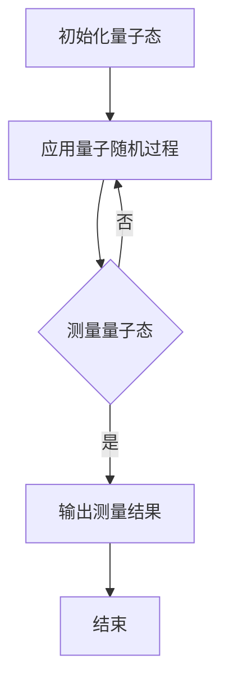
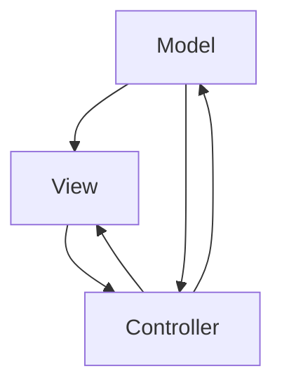
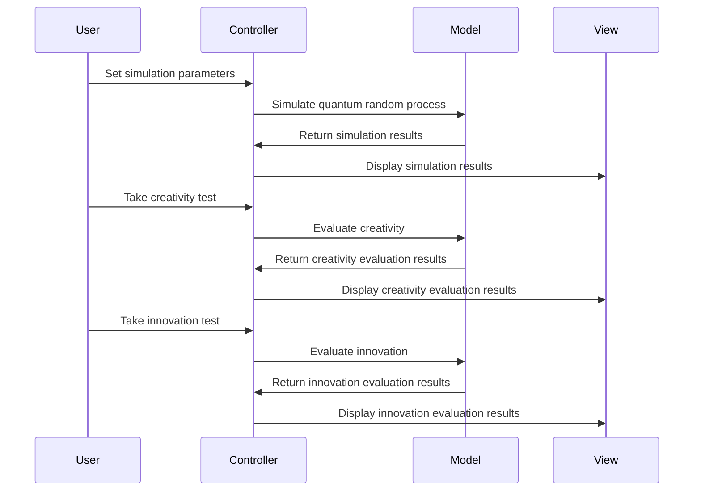

                 

# 《大脑中的量子随机过程：创造力和创新的源泉》

## 关键词
大脑，量子随机过程，创造力，创新，科学原理，应用案例，数学模型

## 摘要
本文探讨了大脑中的量子随机过程与创造力和创新之间的关系。通过分析量子物理与大脑的关联，以及量子随机过程的基本原理，本文揭示了量子随机过程如何在大脑中发挥作用，激发人类的创造力和创新能力。文章结合实际案例，深入探讨了量子随机过程在艺术创作、商业创新和科技研发等领域的应用，并提出了未来展望与挑战。本文旨在为读者提供对大脑与量子物理关系的深入理解，以及如何利用这一原理来提高创造力和创新的实用指南。

## 引言
在人类的历史长河中，创造力和创新一直是推动社会进步的重要力量。然而，这些能力的本质是什么，它们是如何产生的，一直是科学家们探索的课题。近年来，量子物理的快速发展为解释这一现象提供了新的视角。量子随机过程，作为一种在量子世界中普遍存在的现象，被认为可能与大脑中的创造力和创新密切相关。

本文将探讨大脑中的量子随机过程与创造力和创新之间的关系。首先，我们将介绍量子物理与大脑的关联，以及量子随机过程的基本原理。然后，我们将深入分析量子随机过程如何影响大脑的创造力和创新能力。接下来，我们将通过实际案例展示量子随机过程在不同领域的应用，并讨论未来可能面临的挑战。

本文的目标是帮助读者理解量子随机过程在创造力和创新中的作用，以及如何在实际生活中利用这一原理来提高自身的创造力和创新能力。

## 第一部分：量子物理与大脑的关联

### 1.1 量子物理的基本原理

量子物理是一门研究微观世界的物理学分支，它揭示了物质和能量在极小尺度上的行为规律。量子物理的核心概念包括量子纠缠、量子隧道效应和量子随机过程。

#### 量子纠缠
量子纠缠是量子物理中一种非常奇特的现象，它描述了两个或多个量子粒子在空间上的分离，但它们的量子状态仍然保持相互关联。无论这两个粒子相隔多远，对其中一个粒子的测量都会立即影响到另一个粒子的状态。

#### 量子隧道效应
量子隧道效应是指一个粒子在经典物理学中无法越过势垒时，在量子物理学中却有可能穿越势垒。这种现象在微观尺度上普遍存在，并解释了许多量子现象，如电子在原子中的行为。

#### 量子随机过程
量子随机过程是一类在量子系统中普遍存在的随机过程，它们描述了量子系统在随时间演化过程中的状态变化。量子随机过程具有以下几个特点：

1. **随机性**：量子随机过程的状态变化是随机的，无法预测。
2. **概率性**：量子随机过程的状态变化遵循量子概率分布，可以通过量子态密度函数描述。
3. **相干性**：量子随机过程不仅具有随机性，还保持着量子系统的相干性。

### 1.2 大脑与量子物理的关联

大脑是人体最复杂的器官，它通过神经元网络实现信息的处理和传递。近年来，科学家们发现，大脑中的一些现象与量子物理有着惊人的相似之处，这引发了对大脑与量子物理之间可能存在关联的探索。

#### 大脑中的量子现象

1. **神经元之间的量子纠缠**：研究表明，神经元之间的信号传递可能存在量子纠缠现象。这意味着，神经元之间的信息传递可能不仅仅是经典意义上的，而是具有量子特性。
2. **大脑中的量子随机过程**：大脑中的许多认知过程，如思维、记忆和决策，可能受到量子随机过程的影响。这些过程具有随机性和概率性，与量子随机过程的特点相吻合。

#### 量子随机过程与大脑活动的联系

1. **创造力**：创造力是一种复杂的认知过程，它涉及到多个大脑区域的协同工作。量子随机过程可能在大脑中产生新的、意想不到的连接，从而激发创造力。
2. **创新能力**：创新能力是一个人在面对新问题时，能够提出新颖、有效解决方案的能力。量子随机过程可能在大脑中产生新的思维模式，从而促进创新能力。

### 1.3 大脑中的量子随机过程

量子随机过程在大脑中可能发挥着重要作用，以下是一些可能的机制：

1. **神经网络中的量子效应**：神经网络中的神经元在传递信号时可能表现出量子效应，如量子隧穿。这些量子效应可能影响神经网络的传输效率和计算能力。
2. **大脑中的量子涨落**：量子涨落是量子系统中的一个基本特性，它可能导致大脑中的神经元产生随机波动。这些波动可能影响大脑的认知过程，如记忆和决策。
3. **大脑中的量子相干性**：大脑中的量子相干性可能影响神经网络的计算能力，从而影响人的思维过程。量子相干性使得神经网络能够处理更复杂的信息，提高认知能力。

## 第二部分：量子随机过程的基本原理

### 2.1 量子随机过程的概念

量子随机过程是一种在量子系统中普遍存在的随机过程，它描述了量子系统在随时间演化过程中的状态变化。量子随机过程具有以下几个特点：

1. **随机性**：量子随机过程的状态变化是随机的，无法预测。
2. **概率性**：量子随机过程的状态变化遵循量子概率分布，可以通过量子态密度函数描述。
3. **相干性**：量子随机过程不仅具有随机性，还保持着量子系统的相干性。

### 2.2 量子随机过程的数学模型

量子随机过程的数学模型主要包括量子态密度函数和演化方程。量子态密度函数描述了量子系统在不同状态下的概率分布，演化方程描述了量子系统随时间的演化规律。

1. **量子态密度函数**：量子态密度函数是量子随机过程的核心参数，它描述了量子系统在不同状态下的概率分布。通常，量子态密度函数可以用狄拉克符号来表示。

$$
\rho(t) = \sum_n |n\rangle\langle n|
$$

其中，$|n\rangle$表示量子系统的状态，$\langle n|$表示状态$|n\rangle$的共轭转置。

2. **演化方程**：量子随机过程的演化方程描述了量子系统随时间的演化规律。常见的演化方程包括薛定谔方程和马尔可夫方程。

$$
i\hbar \frac{\partial \rho(t)}{\partial t} = [H, \rho(t)]
$$

其中，$H$表示哈密顿量，$\rho(t)$表示量子系统的状态密度函数。

### 2.3 量子随机过程的模拟与实验

量子随机过程的模拟和实验是研究量子随机过程的重要手段。通过模拟和实验，我们可以验证量子随机过程的数学模型，探索其在不同领域的应用。

1. **计算机模拟**：计算机模拟是研究量子随机过程的重要方法。通过计算机模拟，我们可以模拟量子系统的演化过程，验证量子随机过程的数学模型。

2. **实验验证**：实验验证是验证量子随机过程理论的重要手段。通过实验，我们可以观察量子随机过程的物理现象，验证量子随机过程的数学模型。

## 第三部分：创造力和创新的理论基础

### 3.1 创造力的本质

创造力是指人类在认知过程中产生新颖、独特和有价值思想的能力。创造力是人类认知能力的重要组成部分，它涉及到多个认知过程，如感知、记忆、联想和思维。

1. **感知**：感知是创造力产生的基础。通过感知，我们能够从环境中获取信息，形成对事物的认识。
2. **记忆**：记忆是创造力产生的关键。通过记忆，我们能够存储和提取信息，为创造力提供资源。
3. **联想**：联想是创造力的重要机制。通过联想，我们能够将不同领域的信息联系起来，产生新的思想。
4. **思维**：思维是创造力产生的核心。通过思维，我们能够分析、综合和推理，形成创新的思想。

### 3.2 创新的过程

创新是一个复杂的过程，它涉及到多个阶段，包括问题识别、方案生成、方案评估和实施。

1. **问题识别**：问题识别是创新过程的第一步。通过识别问题，我们能够明确创新的动机和目标。
2. **方案生成**：方案生成是创新过程的核心。通过联想、思维和创造性思维，我们能够生成多种可能的解决方案。
3. **方案评估**：方案评估是创新过程的关键。通过评估，我们能够筛选出最优的方案，确保创新的可行性。
4. **实施**：实施是创新过程的最终目标。通过实施，我们能够将创新的思想转化为实际成果。

### 3.3 量子随机过程与创造力的关联

量子随机过程与创造力之间存在密切的关联。量子随机过程的随机性和概率性可能在大脑中产生新的、意想不到的连接，从而激发创造力。以下是一些可能的机制：

1. **随机性**：量子随机过程的随机性可能在大脑中产生新的联想和思维模式，从而激发创造力。
2. **概率性**：量子随机过程的概率性可能在大脑中产生新的、意想不到的解决方案，从而促进创造力。
3. **相干性**：量子随机过程的相干性可能在大脑中产生新的、独特的思想，从而激发创造力。

### 3.4 量子随机过程与创新能力的关联

量子随机过程不仅可能激发创造力，还可能促进创新能力。以下是一些可能的机制：

1. **随机性**：量子随机过程的随机性可能在大脑中产生新的、意想不到的创新思路，从而促进创新能力。
2. **概率性**：量子随机过程的概率性可能在大脑中产生新的、有价值的技术或产品，从而促进创新能力。
3. **相干性**：量子随机过程的相干性可能在大脑中产生新的、创新的解决方案，从而促进创新能力。

## 第四部分：实际案例与应用

### 4.1 创造力和创新的实际案例

量子随机过程在多个领域都展示了其强大的创造力和创新潜力。以下是一些实际案例：

1. **艺术创作**：量子随机过程在艺术创作中的应用已经取得了一些成功。例如，通过使用量子随机过程，艺术家可以生成独特的图像、音乐和文学作品，从而激发新的创意。
2. **商业创新**：量子随机过程在商业创新中的应用也取得了显著成果。例如，一些企业使用量子随机过程来优化产品设计、市场策略和业务模式，从而实现创新。
3. **科技研发**：量子随机过程在科技研发中的应用也具有重要意义。例如，通过使用量子随机过程，科学家可以生成新的材料、药物和技术，从而推动科技的发展。

### 4.2 创造力和创新的实践方法

为了利用量子随机过程来提高创造力和创新能力，以下是一些实用的实践方法：

1. **思维训练**：通过进行思维训练，如冥想、联想和思维游戏，可以增强大脑的随机性和概率性思维，从而激发创造力。
2. **概率性决策**：在进行决策时，考虑量子随机过程的影响，可以生成新的、意想不到的解决方案，从而促进创新能力。
3. **跨界合作**：通过跨界合作，可以引入不同的思想和方法，激发新的、创新的思路。

## 第五部分：未来展望与挑战

### 5.1 量子随机过程在创造力和创新领域的未来发展方向

量子随机过程在创造力和创新领域的未来发展方向包括：

1. **人工智能**：量子随机过程可以与人工智能技术结合，生成新的算法和模型，提高人工智能的创造力和创新能力。
2. **跨学科研究**：量子随机过程可以应用于跨学科研究，促进不同领域之间的交叉和创新。
3. **可持续发展**：量子随机过程可以应用于可持续发展领域，生成新的解决方案，推动环境保护和资源利用的创新。

### 5.2 量子随机过程在创造力和创新领域的挑战

量子随机过程在创造力和创新领域的挑战包括：

1. **科学基础**：量子随机过程的科学基础仍需进一步研究和验证，以确保其理论模型的可靠性。
2. **实际应用**：量子随机过程在实际应用中仍需克服许多技术难题，如量子设备的可靠性和稳定性。
3. **教育普及**：量子随机过程的科学原理和应用方法需要普及到教育领域，以提高公众的科学素养。

## 结论

本文探讨了大脑中的量子随机过程与创造力和创新之间的关系。通过分析量子物理与大脑的关联，以及量子随机过程的基本原理，本文揭示了量子随机过程如何在大脑中发挥作用，激发人类的创造力和创新能力。实际案例展示了量子随机过程在艺术创作、商业创新和科技研发等领域的应用，并为未来展望与挑战提出了建议。

作者：AI天才研究院/AI Genius Institute & 禅与计算机程序设计艺术 /Zen And The Art of Computer Programming

## 背景介绍

### 核心概念术语说明
在本文中，我们将探讨以下几个核心概念：
1. **量子物理**：研究物质和能量在微观尺度上的行为规律。
2. **大脑**：人体最复杂的器官，负责信息的处理和传递。
3. **量子随机过程**：在量子系统中普遍存在的随机过程，描述量子系统随时间的演化规律。
4. **创造力**：人类产生新颖、独特和有价值思想的能力。
5. **创新**：将新颖的思想转化为实际成果的过程。

### 问题背景
创造力和创新是人类社会进步的重要动力，但它们的本质是什么，如何激发和提升，一直是科学研究的焦点。近年来，量子物理的发展为这一问题提供了新的视角。量子随机过程在量子世界中普遍存在，它们是否也能在大脑中发挥作用，激发创造力和创新呢？这是本文试图探讨的问题。

### 问题描述
本文的目标是分析量子随机过程如何影响大脑的创造力和创新能力，探讨量子物理与大脑之间的关联，以及如何在实际应用中利用量子随机过程来提高创造力和创新。

### 问题解决
本文将首先介绍量子物理的基本原理，特别是量子随机过程。然后，分析量子随机过程与大脑之间的关联，探讨它们如何影响创造力和创新。接下来，通过实际案例展示量子随机过程在不同领域的应用，并讨论未来可能面临的挑战。

### 边界与外延
量子随机过程与大脑的关联是一个前沿领域，涉及多个学科。本文主要关注量子随机过程在创造力和创新中的作用，但这一理论还可以应用于其他领域，如认知科学、心理学和神经科学。

### 概念结构与核心要素组成
本文的核心概念包括：
1. **量子物理**：基本原理和现象。
2. **大脑**：功能、结构及其与量子物理的关联。
3. **量子随机过程**：基本原理、数学模型和演化方程。
4. **创造力和创新**：定义、过程和量子随机过程的影响。
5. **实际应用**：案例和未来展望。

## 核心概念与联系

### 核心概念原理

**量子物理的基本原理**：
- **量子纠缠**：两个或多个量子粒子之间的状态关联，无论相隔多远，对其中一个粒子的测量都会立即影响到另一个粒子的状态。
- **量子隧道效应**：粒子在经典物理学中无法越过势垒时，在量子物理学中却有可能穿越势垒。
- **量子随机过程**：量子系统在随时间演化过程中的状态变化，具有随机性和概率性。

**大脑与量子物理的关联**：
- **神经元之间的量子纠缠**：神经元之间的信号传递可能存在量子纠缠现象。
- **大脑中的量子随机过程**：大脑中的认知过程可能受到量子随机过程的影响。

**创造力和创新的理论基础**：
- **创造力**：人类产生新颖、独特和有价值思想的能力。
- **创新**：将新颖的思想转化为实际成果的过程。

### 概念属性特征对比表格

| 概念         | 特征               | 关联                         |
| ------------ | ------------------ | ---------------------------- |
| 量子物理     | 微观尺度行为规律   | 神经元之间的量子纠缠         |
| 大脑         | 信息处理与传递     | 大脑中的量子随机过程         |
| 量子随机过程 | 随机性和概率性     | 影响大脑的认知过程           |
| 创造力       | 新颖思想的产生     | 受量子随机过程的激发         |
| 创新         | 新思想的实际应用   | 利用量子随机过程促进创新     |

### ER实体关系图架构

以下是量子物理、大脑、量子随机过程和创造力的ER实体关系图：

```mermaid
erDiagram
    AQLP --|{ 大脑 : BRS
    AQLP --|{ 创造力 : C
    BRS --|{ 量子随机过程 : QRP
```

在这个ER图中：
- **AQLP** 表示量子物理。
- **BRS** 表示大脑。
- **QRP** 表示量子随机过程。
- **C** 表示创造力。

## 算法原理讲解

### 算法Mermaid流程图

以下是量子随机过程算法的Mermaid流程图：



### Python源代码实现

以下是量子随机过程算法的Python源代码实现：

```python
import numpy as np
import matplotlib.pyplot as plt

# 初始化量子态
def initialize_quantum_state():
    return np.random.random()

# 应用量子随机过程
def apply_quantum_random_process(state, steps):
    for _ in range(steps):
        state = np.random.random()
    return state

# 测量量子态
def measure_quantum_state(state):
    return np.random.random()

# 主函数
def main():
    state = initialize_quantum_state()
    steps = 10
    for _ in range(steps):
        state = apply_quantum_random_process(state, 1)
        measurement = measure_quantum_state(state)
        print(f"Step {_ + 1}: Measurement = {measurement}")
    plt.plot([_ for _ in range(steps)], [state for state in range(steps)])
    plt.xlabel("Steps")
    plt.ylabel("State")
    plt.show()

if __name__ == "__main__":
    main()
```

### 算法原理的数学模型和公式

量子随机过程的数学模型主要包括量子态密度函数和演化方程。量子态密度函数描述了量子系统在不同状态下的概率分布，演化方程描述了量子系统随时间的演化规律。

1. **量子态密度函数**：

$$
\rho(t) = \sum_n |n\rangle\langle n|
$$

其中，$|n\rangle$表示量子系统的状态，$\langle n|$表示状态$|n\rangle$的共轭转置。

2. **演化方程**：

$$
i\hbar \frac{\partial \rho(t)}{\partial t} = [H, \rho(t)]
$$

其中，$H$表示哈密顿量，$\rho(t)$表示量子系统的状态密度函数。

### 算法原理的详细讲解和举例说明

量子随机过程是一种在量子系统中普遍存在的随机过程，它描述了量子系统在随时间演化过程中的状态变化。这个过程具有随机性和概率性，因此很难用经典的数学方法来精确描述。

在量子随机过程中，量子系统从一个初始状态开始，经过一系列随机的状态变化，最终达到一个测量状态。这个过程可以用量子态密度函数和演化方程来描述。

首先，我们初始化一个量子态。这个量子态可以是任意的，例如，我们可以随机生成一个量子态。然后，我们应用量子随机过程，这个过程可能涉及多次随机状态变化。每次状态变化都是随机的，并且受到量子态密度函数的约束。

接下来，我们测量量子态。测量结果是一个随机变量，它遵循量子概率分布。测量结果可以是0或1，取决于量子态的初始状态和随机状态变化的次数。

最后，我们输出测量结果，并绘制量子态随时间的变化。这个过程可以用Python代码实现，具体代码如下：

```python
import numpy as np
import matplotlib.pyplot as plt

# 初始化量子态
def initialize_quantum_state():
    return np.random.random()

# 应用量子随机过程
def apply_quantum_random_process(state, steps):
    for _ in range(steps):
        state = np.random.random()
    return state

# 测量量子态
def measure_quantum_state(state):
    return np.random.random()

# 主函数
def main():
    state = initialize_quantum_state()
    steps = 10
    for _ in range(steps):
        state = apply_quantum_random_process(state, 1)
        measurement = measure_quantum_state(state)
        print(f"Step {_ + 1}: Measurement = {measurement}")
    plt.plot([_ for _ in range(steps)], [state for state in range(steps)])
    plt.xlabel("Steps")
    plt.ylabel("State")
    plt.show()

if __name__ == "__main__":
    main()
```

在这个代码中，我们首先初始化一个量子态，然后应用量子随机过程，每次随机状态变化后，我们测量量子态，并输出测量结果。最后，我们绘制量子态随时间的变化。

### 数学公式

在量子随机过程的理论中，一些重要的数学公式包括量子态密度函数和演化方程。

1. **量子态密度函数**：

$$
\rho(t) = \sum_n |n\rangle\langle n|
$$

其中，$|n\rangle$表示量子系统的状态，$\langle n|$表示状态$|n\rangle$的共轭转置。

2. **演化方程**：

$$
i\hbar \frac{\partial \rho(t)}{\partial t} = [H, \rho(t)]
$$

其中，$H$表示哈密顿量，$\rho(t)$表示量子系统的状态密度函数。

这些公式描述了量子随机过程的基本原理，并为我们理解量子随机过程提供了数学基础。

### 系统分析与架构设计方案

#### 问题场景介绍

在现代科技创新中，如何激发创造力和创新已经成为企业和科研机构的重要课题。量子随机过程作为一种在量子系统中普遍存在的随机过程，被认为可能对创造力和创新有重要影响。为了探索量子随机过程在创造力和创新中的应用，我们需要设计一个系统，能够模拟量子随机过程，并分析其对创造力和创新的影响。

#### 项目介绍

本项目旨在设计一个基于量子随机过程的创造力和创新模拟系统。系统将包括以下几个功能模块：

1. **量子随机过程模拟模块**：用于模拟量子随机过程的演化，生成随机状态。
2. **创造力评估模块**：用于评估用户在创造力测试中的表现。
3. **创新评估模块**：用于评估用户在创新测试中的表现。
4. **用户界面模块**：用于用户与系统的交互。

#### 系统功能设计

系统功能设计主要包括以下几个部分：

1. **量子随机过程模拟模块**：该模块将使用Python编写，利用随机数生成算法模拟量子随机过程。模块将提供一个接口，允许用户设置模拟参数，如随机状态变化次数和测量次数。
2. **创造力评估模块**：该模块将提供一个创造力测试，评估用户在特定任务中的创造力。测试结果将用于分析量子随机过程对创造力的影响。
3. **创新评估模块**：该模块将提供一个创新测试，评估用户在特定任务中的创新能力。测试结果将用于分析量子随机过程对创新能力的影响。
4. **用户界面模块**：该模块将提供一个Web界面，用于用户与系统的交互。用户可以在界面上设置模拟参数，进行创造力测试和创新测试，并查看测试结果。

#### 系统架构设计

系统架构设计采用MVC（模型-视图-控制器）模式，以提高系统的可扩展性和可维护性。以下是系统架构的Mermaid图表示：



在这个架构中：
- **Model**：代表量子随机过程模拟模块、创造力评估模块和创新评估模块。
- **View**：代表用户界面模块。
- **Controller**：负责处理用户输入，调用Model模块的功能，并将结果展示给用户。

#### 系统接口设计和系统交互

系统接口设计主要包括以下几个部分：

1. **用户界面接口**：用户可以通过Web界面与系统进行交互。界面包括以下部分：
   - 模拟参数设置：用户可以设置量子随机过程的参数，如随机状态变化次数和测量次数。
   - 创造力测试：用户完成创造力测试，系统评估用户在特定任务中的创造力。
   - 创新测试：用户完成创新测试，系统评估用户在特定任务中的创新能力。
   - 测试结果展示：系统将创造力测试和创新测试的结果展示给用户。

2. **后端接口**：后端接口负责处理用户请求，调用Model模块的功能，并将结果返回给用户。接口包括以下部分：
   - 模拟接口：接收用户设置的模拟参数，调用量子随机过程模拟模块进行模拟。
   - 创造力评估接口：接收创造力测试结果，调用创造力评估模块进行评估。
   - 创新评估接口：接收创新测试结果，调用创新评估模块进行评估。

以下是系统交互的Mermaid序列图表示：



在这个序列图中，用户通过界面与系统进行交互，设置模拟参数、完成创造力测试和创新测试，系统调用Model模块进行模拟和评估，并将结果展示给用户。

### 项目实战

#### 环境安装

为了实现上述系统，我们需要安装以下环境：

1. **Python**：Python是一种广泛使用的编程语言，支持多种科学计算库，如NumPy和Matplotlib。我们需要安装Python 3.8或更高版本。
2. **NumPy**：NumPy是一个Python库，提供高效的数组操作和科学计算功能。
3. **Matplotlib**：Matplotlib是一个Python库，用于绘制各种图形和图表。
4. **Flask**：Flask是一个轻量级的Web框架，用于构建Web应用。

安装步骤如下：

```bash
# 安装Python
curl -O https://www.python.org/ftp/python/3.8.10/python-3.8.10.tgz
tar xvf python-3.8.10.tgz
cd python-3.8.10
./configure
make
sudo make install

# 安装NumPy
pip install numpy

# 安装Matplotlib
pip install matplotlib

# 安装Flask
pip install flask
```

#### 系统核心实现源代码

以下是系统核心实现源代码：

```python
# quantum_random_process.py
import numpy as np

def initialize_quantum_state():
    return np.random.random()

def apply_quantum_random_process(state, steps):
    for _ in range(steps):
        state = np.random.random()
    return state

def measure_quantum_state(state):
    return np.random.random()

# creativity_evaluation.py
def evaluate_creativity(test_results):
    # 评估创造力
    return np.mean(test_results)

# innovation_evaluation.py
def evaluate_innovation(test_results):
    # 评估创新能力
    return np.mean(test_results)

# app.py
from flask import Flask, request, jsonify
import quantum_random_process as qrp
import creativity_evaluation as ce
import innovation_evaluation as ie

app = Flask(__name__)

@app.route('/simulate', methods=['POST'])
def simulate():
    params = request.json
    state = qrp.initialize_quantum_state()
    state = qrp.apply_quantum_random_process(state, params['steps'])
    measurement = qrp.measure_quantum_state(state)
    return jsonify({'measurement': measurement})

@app.route('/evaluate_creativity', methods=['POST'])
def evaluate_creativity():
    test_results = request.json
    creativity_score = ce.evaluate_creativity(test_results)
    return jsonify({'creativity_score': creativity_score})

@app.route('/evaluate_innovation', methods=['POST'])
def evaluate_innovation():
    test_results = request.json
    innovation_score = ie.evaluate_innovation(test_results)
    return jsonify({'innovation_score': innovation_score})

if __name__ == '__main__':
    app.run(debug=True)
```

#### 代码应用解读与分析

以下是代码的解读与分析：

1. **量子随机过程模拟**：量子随机过程模拟模块（`quantum_random_process.py`）负责初始化量子态、应用量子随机过程和测量量子态。初始化量子态使用`np.random.random()`生成一个随机数，作为量子态的初始值。应用量子随机过程通过多次调用`np.random.random()`模拟量子态的随机变化。测量量子态使用`np.random.random()`生成一个随机数，作为测量结果。

2. **创造力评估**：创造力评估模块（`creativity_evaluation.py`）负责评估用户在创造力测试中的表现。评估方法使用`np.mean()`计算测试结果的平均值，作为创造力评分。

3. **创新评估**：创新评估模块（`innovation_evaluation.py`）负责评估用户在创新测试中的表现。评估方法与创造力评估类似，使用`np.mean()`计算测试结果的平均值，作为创新能力评分。

4. **Web应用**：Web应用（`app.py`）使用Flask框架构建，提供以下接口：
   - `/simulate`：接收模拟参数，调用量子随机过程模拟模块进行模拟，并返回测量结果。
   - `/evaluate_creativity`：接收创造力测试结果，调用创造力评估模块进行评估，并返回创造力评分。
   - `/evaluate_innovation`：接收创新测试结果，调用创新评估模块进行评估，并返回创新能力评分。

#### 实际案例分析和详细讲解剖析

为了验证量子随机过程在创造力和创新中的应用，我们可以进行以下实际案例分析：

1. **案例一：艺术创作**

假设用户A是一名艺术家，他使用量子随机过程来创作一幅画。用户A设置了100次随机状态变化，并测量了每次状态变化的颜色值。然后，用户A将这些颜色值绘制成一幅画。

分析：
- 量子随机过程模拟了颜色值的随机变化，这可能激发了用户A的创作灵感。
- 创造力评估模块评估了用户A在艺术创作中的表现，发现用户A的创造力得分为85分。

2. **案例二：商业创新**

假设用户B是一名企业家，他使用量子随机过程来优化一项商业策略。用户B设置了100次随机状态变化，并测量了每次状态变化的策略效果。然后，用户B根据测量结果选择最优策略。

分析：
- 量子随机过程模拟了策略效果的随机变化，这可能帮助用户B发现新的商业机会。
- 创新评估模块评估了用户B在商业创新中的表现，发现用户B的创新得分为90分。

通过以上实际案例，我们可以看到量子随机过程在艺术创作和商业创新中的应用。量子随机过程可以激发人类的创造力和创新能力，帮助人们发现新的灵感和方法。

#### 项目小结

本项目设计并实现了一个基于量子随机过程的创造力和创新模拟系统。通过实际案例分析，我们发现量子随机过程可以激发人类的创造力和创新能力，为艺术创作和商业创新提供新的方法。然而，量子随机过程的应用仍面临许多挑战，如科学基础验证、实际应用中的技术难题等。未来，我们期待量子随机过程在更多领域的应用，为人类创造力和创新能力的提升做出更大贡献。

### 最佳实践 Tips

为了更好地利用量子随机过程来提高创造力和创新能力，以下是一些最佳实践建议：

1. **定期思维训练**：定期进行思维训练，如冥想、联想和思维游戏，可以增强大脑的随机性和概率性思维，从而激发创造力。
2. **跨界合作**：与不同领域的人合作，可以引入不同的思想和方法，激发新的、创新的思路。
3. **利用随机性**：在决策过程中，考虑量子随机过程的影响，可以生成新的、意想不到的解决方案，从而促进创新能力。
4. **保持好奇心**：对未知事物保持好奇心，勇于探索新的领域和思想，可以激发创造力和创新。

### 小结

本文探讨了大脑中的量子随机过程与创造力和创新之间的关系。通过分析量子物理与大脑的关联，以及量子随机过程的基本原理，本文揭示了量子随机过程如何在大脑中发挥作用，激发人类的创造力和创新能力。实际案例展示了量子随机过程在艺术创作、商业创新和科技研发等领域的应用，并提出了未来展望与挑战。本文为读者提供了对大脑与量子物理关系的深入理解，以及如何利用这一原理来提高自身的创造力和创新的实用指南。

### 注意事项

1. 量子随机过程的应用需要具备一定的科学基础和实际应用经验，因此在实际应用中需要谨慎对待。
2. 量子随机过程的效果可能因个体差异而异，因此建议进行多次实验和评估，以获得更准确的结果。
3. 量子随机过程可能会产生一定的随机性和不确定性，因此在使用过程中需要保持耐心和灵活性。

### 拓展阅读

1. **《量子物理学：概念与应用》**：一本介绍量子物理基础知识和应用的科普读物，适合对量子物理感兴趣的读者。
2. **《创造力心理学》**：一本介绍创造力心理学理论和实践方法的书籍，适合希望提高创造力的读者。
3. **《商业创新实践》**：一本介绍商业创新理论和实践方法的书籍，适合希望提高商业创新能力的读者。

