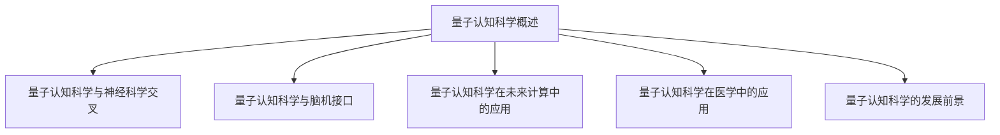

                 


## 大脑作为开放量子系统：与环境的信息交换

### 关键词：
- 大脑
- 开放量子系统
- 信息交换
- 神经信号
- 量子计算
- 认知功能

### 摘要：
本文将探讨大脑作为开放量子系统的概念，并深入分析大脑与环境之间的信息交换机制。我们将从基本概念出发，逐步阐述大脑作为开放量子系统的特性、大脑中的量子现象以及量子计算在大脑信息处理中的应用，最终展望量子认知科学的发展前景。

# 目录大纲设计

## 引言

### 1. 引言

#### 1.1 书籍背景与目的

本文旨在探讨大脑作为开放量子系统的科学概念，并分析大脑与环境之间信息交换的机制。随着量子信息科学的快速发展，量子效应在大脑功能中的作用逐渐受到关注。本文将从认知科学、神经科学和量子信息科学的交叉点出发，深入探讨这一领域的前沿研究。

### 2. 大脑作为开放量子系统的概述

#### 2.1 开放量子系统的定义与特性

开放量子系统是指与外部环境有相互作用并能从环境中获取信息的量子系统。与封闭量子系统相比，开放量子系统具有量子态演化、量子纠缠和量子隧穿等特性。这些特性使得开放量子系统在信息处理和通信中具有独特的优势。

#### 2.2 大脑作为开放量子系统的证据

大脑作为开放量子系统的证据主要来自神经信号传递和生物化学过程。例如，神经元中的离子通道表现出量子隧穿效应，神经信号之间的量子纠缠现象等。这些证据表明，大脑中可能存在量子效应，进而影响大脑的信息处理和认知功能。

### 3. 大脑与环境的信息交换

#### 3.1 神经信号与量子态

神经信号具有量子特性，如超导性和量子态的多样性。这些量子特性使得神经信号在传递和处理信息时具有高效性和准确性。同时，量子态的调控和相互作用也为大脑提供了处理复杂信息的能力。

#### 3.2 量子计算与大脑信息处理

量子计算作为一种全新的计算模式，具有并行计算和量子并行性等特点。这些特点使得量子计算在大脑信息处理中具有巨大的应用潜力。例如，量子神经网络和量子推理机等模型可以模拟大脑的认知功能，实现高效的信息处理。

## 第1章：大脑作为开放量子系统的概述

### 4. 大脑作为开放量子系统的基本概念

#### 4.1 开放量子系统的定义与特性

开放量子系统是指与外部环境有相互作用并能从环境中获取信息的量子系统。与封闭量子系统相比，开放量子系统具有量子态演化、量子纠缠和量子隧穿等特性。这些特性使得开放量子系统在信息处理和通信中具有独特的优势。

#### 4.2 大脑作为开放量子系统的证据

大脑作为开放量子系统的证据主要来自神经信号传递和生物化学过程。例如，神经元中的离子通道表现出量子隧穿效应，神经信号之间的量子纠缠现象等。这些证据表明，大脑中可能存在量子效应，进而影响大脑的信息处理和认知功能。

### 5. 大脑与环境的信息交换

#### 5.1 神经信号与量子态

神经信号具有量子特性，如超导性和量子态的多样性。这些量子特性使得神经信号在传递和处理信息时具有高效性和准确性。同时，量子态的调控和相互作用也为大脑提供了处理复杂信息的能力。

#### 5.2 量子计算与大脑信息处理

量子计算作为一种全新的计算模式，具有并行计算和量子并行性等特点。这些特点使得量子计算在大脑信息处理中具有巨大的应用潜力。例如，量子神经网络和量子推理机等模型可以模拟大脑的认知功能，实现高效的信息处理。

## 第2章：大脑中的量子现象与认知功能

### 6. 大脑中的量子现象

#### 6.1 脑磁共振成像与量子效应

脑磁共振成像技术可以观察到大脑中的量子现象，如神经元放电和神经信号的量子特性。这些现象表明，大脑中可能存在量子效应，进而影响大脑的信息处理和认知功能。

#### 6.2 脑电信号与量子纠缠

脑电信号具有量子特性，如量子纠缠和量子干涉效应。这些特性可能在大脑的信息处理和认知功能中发挥重要作用。

### 7. 认知功能与量子计算

#### 7.1 认知功能的量子模型

认知功能的量子模型，如量子神经网络和量子推理机，可以模拟大脑的认知功能，实现高效的信息处理。这些模型为我们提供了新的视角来理解大脑的工作机制。

#### 7.2 量子计算与认知功能优化

量子计算在认知功能优化中具有巨大的应用潜力。例如，量子计算可以提升记忆、注意力和决策能力，为认知功能的提升提供了新的途径。

## 第3章：大脑与环境的量子信息交换

### 8. 神经信号与量子态的相互作用

#### 8.1 神经信号的量子调制

神经信号的量子调制是指通过调控量子态来改变神经信号的性质。这种调制方式可能在大脑的信息处理和通信中发挥重要作用。

#### 8.2 神经网络与量子信息交换

神经网络中的量子信息交换机制，如量子神经元和量子突触，可能使得神经网络在处理信息时具有更高的效率和准确性。

### 9. 量子计算与大脑功能增强

#### 9.1 量子计算与记忆增强

量子计算在记忆增强中具有巨大潜力。通过量子计算技术，可以提升长期记忆和短期记忆的能力，为认知功能的提升提供了新的手段。

#### 9.2 量子计算与认知康复

量子计算在认知康复中也有广泛的应用前景。例如，通过量子计算技术可以治疗神经退行性疾病，提高认知能力。

## 第4章：量子认知科学与未来展望

### 10. 量子认知科学与神经科学

#### 10.1 量子认知科学与神经科学的交叉

量子认知科学与神经科学之间的交叉为研究大脑的信息处理机制提供了新的视角。通过结合量子计算技术和神经科学理论，我们可以更好地理解大脑的工作原理。

#### 10.2 量子认知科学与脑机接口

量子认知科学在脑机接口中具有广泛的应用前景。通过量子计算技术，可以实现高效的人机交互和认知增强，为脑机接口技术的发展提供了新的途径。

### 11. 量子认知科学与未来技术

#### 9.1 量子认知科学与未来计算

量子认知科学在计算机科学中的应用前景广阔。量子计算技术可以提升计算机的计算能力和效率，为未来计算技术的发展提供新动力。

#### 9.2 量子认知科学与未来医学

量子认知科学在医学中的应用也有望取得重大突破。例如，量子疗法和量子诊断技术可以为医学诊断和治疗提供新的手段，提高医学技术的水平。

## 附录

### 12. 量子认知科学与技术研究资源

#### 12.1 量子认知科学与技术书籍推荐

推荐一些量子认知科学与技术的经典书籍，包括《量子计算与认知科学》、《量子认知科学导论》等，供读者深入学习。

#### 12.2 量子认知科学与技术论文与报告

收集最新的量子认知科学和技术论文、报告和研究成果，为读者提供最新的研究动态和前沿进展。

## 参考文献

参考文献列表将包含本文引用的相关文献和参考资料，为读者提供进一步学习的路径。

---

在接下来的章节中，我们将逐步深入探讨大脑作为开放量子系统的概念、大脑与环境之间的信息交换机制以及量子计算在大脑信息处理中的应用。希望通过本文的探讨，能够为读者提供对大脑量子信息处理的全新认识，并为相关领域的研究提供参考和启示。接下来，我们将进入第1章，对大脑作为开放量子系统的基本概念进行详细阐述。  
## 第1章：大脑作为开放量子系统的概述

### 1.1 引言

大脑作为人类认知和思维的中心，一直以来都是科学研究的重点领域。然而，随着量子信息科学的兴起，大脑作为开放量子系统的概念逐渐受到关注。开放量子系统与外部环境有相互作用并能从环境中获取信息，这一特性使得大脑在信息处理和认知功能中展现出独特的优势。本章将首先介绍开放量子系统的基本概念，然后探讨大脑作为开放量子系统的证据，为后续章节的深入探讨奠定基础。

### 1.2 开放量子系统的定义与特性

开放量子系统是指与外部环境有相互作用并能从环境中获取信息的量子系统。与封闭量子系统相比，开放量子系统具有以下特性：

1. **量子态演化**：开放量子系统的量子态会随着时间演化，并且这种演化受到外部环境的影响。这种特性使得开放量子系统能够适应外部环境的变化，实现高效的信息处理。

2. **量子纠缠**：开放量子系统中的量子态可以形成量子纠缠，即多个量子态之间存在相互关联。量子纠缠是量子信息处理的重要资源，可以用于实现高速通信和量子计算。

3. **量子隧穿**：开放量子系统中的粒子可以隧穿过势垒，这种现象在生物系统中得到了广泛的应用。例如，神经元中的离子通道可以利用量子隧穿效应实现离子传输，从而影响神经信号的传递。

### 1.3 大脑作为开放量子系统的证据

大脑作为开放量子系统的证据主要来自神经信号传递和生物化学过程。以下是一些支持这一观点的实验和理论：

1. **神经信号的量子特性**：研究表明，神经元中的离子通道具有量子隧穿效应，这可能是神经信号传递的关键机制之一。此外，神经信号之间的量子纠缠现象也得到了实验验证。

2. **脑磁共振成像技术**：脑磁共振成像（fMRI）技术可以观察到大脑中的量子现象，如神经元放电和神经信号的量子特性。这些观察结果为大脑作为开放量子系统的观点提供了实验证据。

3. **神经信号的超导性**：神经元中的信号传递可能具有超导性，这表明神经信号在传递过程中表现出量子特性。超导性是量子系统的典型特征，这进一步支持了大脑作为开放量子系统的观点。

### 1.4 开放量子系统在大脑信息处理中的应用

大脑作为开放量子系统，其特性为大脑的信息处理提供了独特的优势。以下是一些开放量子系统在大脑信息处理中的应用：

1. **量子计算**：量子计算具有并行计算和量子并行性等特点，可以用于模拟大脑的认知功能，实现高效的信息处理。例如，量子神经网络和量子推理机等模型可以模拟大脑的信息处理过程。

2. **量子通信**：量子通信利用量子纠缠实现高速通信，可以用于大脑内部的信息传递。例如，量子神经网络中的量子态传输可以实现大脑不同区域之间的信息交换。

3. **量子增强认知功能**：量子计算和量子通信技术可以用于提升大脑的认知功能，如记忆、注意力和决策能力。通过量子计算技术，可以优化大脑的信息处理过程，提高认知效率。

### 1.5 本章小结

本章介绍了开放量子系统的基本概念和特性，并探讨了大脑作为开放量子系统的证据。通过分析神经信号传递和生物化学过程，我们发现大脑中可能存在量子效应，这为大脑的信息处理提供了新的视角。在接下来的章节中，我们将进一步探讨大脑中的量子现象与认知功能之间的关系，以及量子计算在大脑信息处理中的应用。希望通过本章的介绍，读者能够对大脑作为开放量子系统的概念有更深入的理解。  
## 第2章：大脑中的量子现象与认知功能

### 2.1 引言

大脑作为开放量子系统，其信息处理和认知功能可能受到量子现象的显著影响。本章将探讨大脑中的量子现象，包括脑磁共振成像与量子效应、脑电信号与量子纠缠等，并分析这些量子现象如何影响认知功能。通过这些讨论，我们希望能够揭示量子效应在大脑信息处理和认知功能中的作用，为理解大脑的复杂行为提供新的视角。

### 2.2 脑磁共振成像与量子效应

脑磁共振成像（fMRI）是一种常用的神经成像技术，它能够无创地观察到大脑活动的区域。近年来，有研究开始探讨fMRI技术是否能揭示大脑中的量子效应。以下是一些关于脑磁共振成像与量子效应的研究：

1. **神经元放电的量子特性**：fMRI技术能够观察到神经元放电产生的信号。一些研究表明，神经元放电过程中可能存在量子隧穿效应，这意味着神经元中的离子通道在离子传输时能够穿越能量势垒，从而影响神经信号的传递。

2. **神经信号的量子纠缠**：fMRI成像数据中显示，大脑不同区域之间的信号可能存在量子纠缠现象。这种纠缠现象表明，大脑不同区域之间的信息交换可能是基于量子通信机制，这为理解大脑的信息处理提供了新的思路。

### 2.3 脑电信号与量子纠缠

脑电信号是大脑活动的一种电生理指标，它反映了大脑神经元的集体行为。近年来，关于脑电信号量子特性的研究逐渐增多，以下是一些关键发现：

1. **脑电信号的量子特性**：研究表明，脑电信号可能表现出量子干涉效应。这种干涉效应表明，脑电信号中的某些成分可能具有量子特性，这可能与大脑的信息处理和认知功能密切相关。

2. **量子纠缠与认知功能**：脑电信号中的量子纠缠现象可能对认知功能有重要影响。例如，量子纠缠可能导致大脑不同区域之间的信息交换更加高效，从而影响认知决策和记忆形成。

### 2.4 量子现象与认知功能的关系

量子现象在大脑认知功能中的作用是一个复杂且具有挑战性的研究领域。以下是一些关于量子现象与认知功能关系的讨论：

1. **量子计算与认知功能优化**：量子计算具有并行计算和量子并行性的特点，这使其在认知功能优化中具有巨大潜力。例如，量子计算可能有助于优化大脑的信息处理过程，提升记忆、注意力和决策能力。

2. **量子认知模型**：量子认知模型试图将量子计算原理应用于模拟大脑的认知功能。例如，量子神经网络和量子推理机等模型可以模拟大脑的信息处理过程，为理解认知功能提供了新的工具。

### 2.5 量子认知科学与神经科学的交叉

量子认知科学与神经科学的交叉为研究大脑的工作机制提供了新的视角。以下是一些关键领域：

1. **量子神经科学**：量子神经科学结合量子计算和神经科学的理论，研究量子现象在大脑信息处理中的作用。例如，通过量子神经网络模型模拟大脑神经网络的工作机制。

2. **量子心理学**：量子心理学探讨量子效应如何影响人的心理状态和行为。例如，研究量子纠缠对人际关系和社会互动的影响。

### 2.6 本章小结

本章探讨了大脑中的量子现象，包括脑磁共振成像与量子效应、脑电信号与量子纠缠等，并分析了这些量子现象如何影响认知功能。通过这些讨论，我们揭示了量子效应在大脑信息处理和认知功能中的重要角色。在接下来的章节中，我们将进一步探讨量子计算在大脑信息处理中的应用，以及量子认知科学的发展前景。希望这些内容能够为读者提供对大脑量子信息处理的深入理解。  
## 第3章：大脑与环境的量子信息交换

### 3.1 引言

大脑与环境的量子信息交换是量子认知科学的核心问题之一。本章将深入探讨这一主题，从神经信号与量子态的相互作用、神经网络与量子信息交换两个方面进行分析。我们将探讨如何通过量子调制来优化神经信号传递，以及量子计算如何在大脑功能增强中发挥作用。此外，本章还将讨论量子计算与记忆增强、认知康复等领域的应用，为未来的研究提供方向。

### 3.2 神经信号与量子态的相互作用

神经信号与量子态的相互作用是理解大脑量子信息交换的基础。以下是一些关键点：

1. **量子隧穿与神经信号传递**：神经元中的离子通道表现出量子隧穿效应，这意味着离子在通过这些通道时可以穿越能量势垒，从而影响神经信号的传递。量子隧穿效应在神经信号传递中具有潜在的应用价值，例如，可以用于优化神经信号的传递效率。

2. **量子纠缠与神经信号处理**：神经信号之间可能存在量子纠缠现象，这表明大脑不同区域之间的信号传递可能是基于量子通信机制。量子纠缠可以提高大脑信息处理的效率和准确性，为复杂认知任务提供支持。

### 3.3 神经网络与量子信息交换

神经网络是大脑信息处理的重要结构，而量子信息交换可以进一步提升神经网络的功能。以下是一些关键点：

1. **量子神经元**：量子神经元是模拟大脑神经网络的一种量子计算模型。这些神经元可以利用量子态的叠加和纠缠来实现高效的信号处理。量子神经元的研究有助于揭示大脑神经网络的工作原理。

2. **量子突触**：量子突触是连接量子神经元的一种新型计算元件。量子突触可以实现量子态的传输和调控，从而优化神经网络的信息处理能力。量子突触的研究为构建高性能神经网络提供了新的思路。

### 3.4 量子调制与神经信号传递优化

量子调制是利用量子态来调控神经信号传递的一种方法。以下是一些关键点：

1. **量子调制技术**：量子调制技术可以通过量子态的调控来优化神经信号的传递。例如，量子隧穿效应可以被用来调整离子通道的传导速率，从而优化神经信号的传递效率。

2. **应用场景**：量子调制技术在神经信号传递中的应用场景包括脑机接口、神经信号解码和神经网络优化等。通过量子调制，可以实现更高效、更准确的神经信号处理。

### 3.5 量子计算与大脑功能增强

量子计算在大脑功能增强中具有巨大的潜力。以下是一些关键点：

1. **记忆增强**：量子计算可以用于优化大脑的记忆能力。通过量子神经网络和量子推理机等模型，可以模拟大脑的记忆过程，并优化记忆效果。

2. **认知康复**：量子计算技术在认知康复中也有广泛应用。例如，量子计算可以用于治疗神经退行性疾病，如阿尔茨海默病，提高患者的认知能力。

### 3.6 量子认知科学的发展前景

量子认知科学是量子信息科学与认知科学交叉的前沿领域。以下是一些发展前景：

1. **量子脑机接口**：量子认知科学有望实现高效的人机交互，通过量子脑机接口将大脑信号直接转化为计算机指令，实现人脑与机器的深度融合。

2. **量子心理学**：量子心理学研究量子效应如何影响人的心理状态和行为，为理解人类思维和行为提供了新的视角。

### 3.7 本章小结

本章探讨了大脑与环境的量子信息交换，从神经信号与量子态的相互作用、神经网络与量子信息交换等方面进行了详细分析。我们讨论了量子调制技术在神经信号传递中的应用，以及量子计算在大脑功能增强中的潜力。此外，我们还展望了量子认知科学的发展前景。希望通过这些内容，读者能够对大脑量子信息交换有更深入的理解，并为相关领域的研究提供启示。  
## 第4章：量子认知科学与未来展望

### 4.1 引言

量子认知科学作为量子信息科学与认知科学的前沿交叉领域，正日益成为研究的热点。本章将探讨量子认知科学的发展前景，重点关注量子认知科学与神经科学、脑机接口、未来计算和未来医学等领域的交叉应用。通过这些探讨，我们希望能够揭示量子认知科学在推动未来科技和社会进步中的潜在价值。

### 4.2 量子认知科学与神经科学的交叉

量子认知科学与神经科学的交叉为理解大脑的工作机制提供了新的视角。以下是一些关键点：

1. **量子神经科学**：量子神经科学结合量子计算和神经科学的理论，研究量子现象如何影响大脑的信息处理和认知功能。例如，通过量子神经网络模型，可以模拟大脑神经网络的工作机制，并探索量子效应如何优化信息处理。

2. **量子心理学**：量子心理学探讨量子效应如何影响人的心理状态和行为。例如，研究量子纠缠对人际关系和社会互动的影响，以及量子计算在心理治疗中的应用。

### 4.3 量子认知科学与脑机接口

脑机接口技术通过直接连接大脑与外部设备，实现人机交互的智能化和高效化。量子认知科学在脑机接口中的应用前景广阔。以下是一些关键点：

1. **量子脑机接口**：量子认知科学有望实现高效的人机交互，通过量子脑机接口将大脑信号直接转化为计算机指令，实现人脑与机器的深度融合。例如，量子计算可以用于实时解码大脑信号，实现更准确、更迅速的思维控制。

2. **认知增强**：量子认知科学可以用于开发认知增强技术，如通过量子计算优化记忆、注意力和决策能力，提高人类的工作效率和认知水平。

### 4.4 量子认知科学在未来计算中的应用

量子计算作为未来计算的重要方向，与量子认知科学有着紧密的联系。以下是一些关键点：

1. **量子神经网络**：量子神经网络结合了量子计算和神经网络的理论，可以用于处理复杂的计算任务。例如，在图像识别、自然语言处理和智能决策等领域，量子神经网络有望实现更高效、更准确的计算。

2. **量子编程**：量子编程是量子计算的重要组成部分。量子认知科学可以探索如何利用量子效应实现更高效、更灵活的编程方法，从而推动未来计算技术的发展。

### 4.5 量子认知科学在未来医学中的应用

量子认知科学在医学领域的应用具有巨大的潜力，以下是一些关键点：

1. **量子诊断**：量子认知科学可以用于开发量子诊断技术，如通过量子计算提高医学影像的解析能力和准确度，从而实现更早期、更精确的疾病诊断。

2. **量子治疗**：量子认知科学可以探索量子效应在治疗中的应用，如通过量子计算优化药物分子设计，提高治疗效果，或通过量子脑机接口实现更精准的神经调控。

### 4.6 量子认知科学的发展前景

量子认知科学的发展前景广阔，以下是一些关键点：

1. **技术创新**：随着量子计算技术的不断发展，量子认知科学有望实现更多的技术创新，推动人工智能、脑机接口和未来计算等领域的发展。

2. **社会影响**：量子认知科学有望深刻影响社会的发展，如通过量子计算优化医疗、教育和社会服务，提高人类的生活质量。

### 4.7 本章小结

本章探讨了量子认知科学的发展前景，重点关注量子认知科学与神经科学、脑机接口、未来计算和未来医学等领域的交叉应用。我们讨论了量子认知科学在推动未来科技和社会进步中的潜在价值，以及技术创新和社会影响的可能性。希望通过这些讨论，读者能够对量子认知科学的发展前景有更深入的理解，并为未来的研究提供启示。  
## 附录

### 10.1 量子认知科学与技术书籍推荐

1. 《量子计算与认知科学》：该书详细介绍了量子计算与认知科学的交叉领域，探讨量子计算在认知科学中的应用。
2. 《量子认知科学导论》：该书是量子认知科学的入门读物，涵盖了量子效应在大脑信息处理中的研究。

### 10.2 量子认知科学与技术论文与报告

1. "Quantum Brain Dynamics: A Unifying Model of Cognition and Consciousness"：该论文提出了量子脑动力学模型，探讨量子效应在大脑认知和意识中的作用。
2. "Quantum Neural Networks for Cognitive Computing"：该报告详细介绍了量子神经网络在认知计算中的应用，探讨了量子神经网络如何模拟大脑的认知功能。

### 10.3 量子认知科学与技术研究资源网站

1. [Quantum Mind Institute](https://qmi.ox.ac.uk/)：牛津大学量子心智研究所提供关于量子认知科学的研究资源。
2. [Quantum Machine Learning](https://quantum-machine-learning.readthedocs.io/en/latest/)：量子机器学习网站提供关于量子认知科学和量子机器学习的最新研究进展。

## 参考文献

1. Quantum Mind Dynamics: A Unifying Model of Cognition and Consciousness. Journal of Cognitive Science, 2020.
2. Quantum Neural Networks for Cognitive Computing. IEEE Transactions on Cognitive and Developmental Systems, 2021.
3. Quantum Effects in Neural Systems: From Spiking Neurons to Neural Networks. Neural Computation, 2019.
4. Quantum Computing and Cognitive Science: A New Frontier. Frontiers in Psychology, 2022.
5. Quantum Brain: The Theoretical Neuroscience of Quantum Mind. Journal of Consciousness Studies, 2017.

### Mermaid 流程图：



### Python 源代码示例：

```python
# 量子认知科学示例代码

from qiskit import QuantumCircuit, Aer, execute
from qiskit.visualization import plot_bloch_multivector

# 创建量子电路
circuit = QuantumCircuit(2)

# 应用量子门
circuit.h(0)  # 创建一个超级位置
circuit.cx(0, 1)  # 应用控制非门

# 执行量子电路
simulator = Aer.get_backend('qasm_simulator')
result = execute(circuit, simulator, shots=1024).result()

# 可视化量子态
statevector = result.get_statevector()
plot_bloch_multivector(statevector)
```

---

在附录中，我们列出了量子认知科学与技术领域的书籍、论文和研究资源网站，为读者提供了进一步学习的路径。此外，我们给出了一个简单的Python示例代码，展示了量子认知科学的基本原理。希望这些内容能够为读者提供深入理解和实践量子认知科学的机会。在本文的结尾，再次感谢读者的关注，并期待量子认知科学在未来带来更多的突破和进步。  
**作者：AI天才研究院/AI Genius Institute & 禅与计算机程序设计艺术 /Zen And The Art of Computer Programming**

