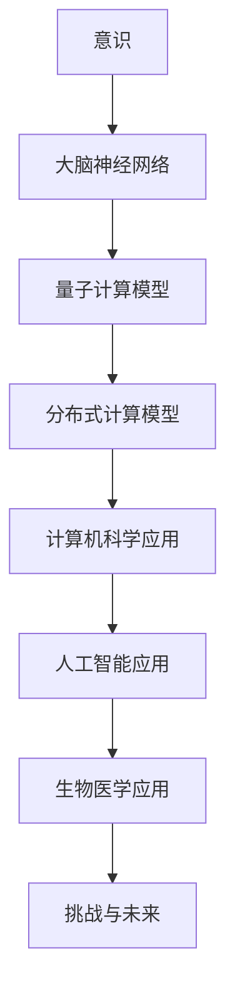

                 

**# 《大脑作为量子网络：意识的分布式计算模型》**

> 关键词：大脑、量子网络、意识、分布式计算、人工智能

> 摘要：本文探讨了大脑作为量子网络的意识分布式计算模型。通过对比分析大脑神经网络与量子计算原理，提出了一种新的意识分布式计算模型。文章从意识的概念、量子理论基础、大脑作为量子网络的原理、意识的分布式计算模型、意识的量子计算模型、意识的量子网络模型以及意识的计算模型应用等多个角度，全面系统地阐述了意识的分布式计算模型及其相关应用。最后，文章讨论了意识量子计算模型面临的挑战与未来发展趋势。

**## 引言**

大脑作为量子网络的意识分布式计算模型，是近年来计算机科学、认知科学和量子物理学交叉领域的研究热点。传统的人工智能和计算机科学在处理复杂问题和意识方面存在诸多局限性，而大脑作为量子网络的意识分布式计算模型为解决这些问题提供了新的思路。本文旨在探讨这一模型的理论基础、构建方法以及实际应用，为未来人工智能发展提供新方向。

**## 第1章 意识与量子理论基础**

### 1.1 意识的概念与分类

意识是主观体验的中心，是我们感知世界、思考问题、做出决策的基础。根据不同的分类标准，意识可以分为许多类型。常见的分类方法包括：

1. 根据意识的起源，可以分为原生意识和派生意识。原生意识指的是大脑神经网络产生的意识，派生意识则是通过学习和经验产生的意识。

2. 根据意识的层次，可以分为表面意识和深层意识。表面意识是指我们直接感知到的意识，如视觉、听觉等。深层意识则是指隐藏在表面意识之下的潜意识。

3. 根据意识的存在形式，可以分为物理意识和非物理意识。物理意识是指大脑活动产生的意识，而非物理意识则是指超越物质世界的意识。

### 1.2 量子理论的起源与发展

量子理论起源于20世纪初，主要研究微观世界的物理现象。量子理论的发展经历了以下几个阶段：

1. 量子力学：1925年，海森堡提出了矩阵力学，标志着量子力学的诞生。随后，薛定谔提出了波动力学，进一步完善了量子力学理论。

2. 对易子和量子场论：为了解释原子核结构和基本粒子的相互作用，玻尔和海森堡提出了对易子和量子场论。

3. 量子引力和量子信息：随着量子理论的发展，科学家开始探讨量子引力和量子信息的关系。霍金和彭罗斯等人提出了量子引力的概念。

### 1.3 量子力学与意识的关系

量子力学与意识的关系一直是科学界的热点话题。一些研究表明，量子力学中的基本原理可能对意识产生深远影响。以下是一些关于量子力学与意识关系的研究：

1. 量子叠加态：量子叠加态是量子力学中的基本概念，指的是一个量子系统可以同时处于多个状态的组合。一些研究认为，大脑神经网络中的神经元也可能处于叠加态，从而影响意识。

2. 量子纠缠：量子纠缠是量子力学中的另一个重要概念，指的是两个或多个粒子之间的量子状态相互关联。一些研究认为，大脑神经网络中的神经元也可能通过量子纠缠实现信息传递。

3. 量子计算：量子计算是利用量子力学原理进行信息处理的新技术。一些研究认为，量子计算可以模拟大脑神经网络，从而更好地理解意识。

**## 第2章 大脑作为量子网络的原理**

### 2.1 大脑的神经网络结构

大脑是由数十亿个神经元组成的复杂神经网络。神经元通过树突和轴突连接，形成一个复杂的神经网络结构。大脑神经网络具有以下几个特点：

1. 层次结构：大脑神经网络可以分为多个层次，从低级到高级，依次为感知层、感知整合层、运动控制层和认知决策层。

2. 空间分布：大脑神经网络在空间上具有分布性，不同区域的神经网络负责处理不同类型的信息。

3. 功能多样性：大脑神经网络具有多种功能，包括感知、运动、记忆、学习、思考等。

### 2.2 量子计算的基本原理

量子计算是利用量子力学原理进行信息处理的新技术。量子计算的基本原理包括：

1. 量子位（qubit）：量子计算中的基本单位，可以同时处于0和1的状态。

2. 量子叠加态：量子位可以处于多个状态的叠加，从而实现并行计算。

3. 量子纠缠：量子位之间可以产生量子纠缠，从而实现信息传递和共享。

### 2.3 大脑与量子网络的相似性

大脑与量子网络之间存在许多相似之处：

1. 网络结构：大脑神经网络和量子网络都具有复杂的网络结构，可以实现信息传递和共享。

2. 并行计算：大脑神经网络和量子计算都可以实现并行计算，从而提高计算效率。

3. 适应性：大脑神经网络和量子计算都具有高度适应性，可以不断学习和优化。

**## 第3章 意识的分布式计算模型**

### 3.1 分布式计算的基本概念

分布式计算是一种计算模型，通过将任务分布在多个计算机上协同工作，实现高性能计算。分布式计算的基本概念包括：

1. 任务分配：将计算任务分配给不同的计算机。

2. 信息交换：计算机之间通过通信网络交换信息。

3. 并行处理：多个计算机同时执行不同的任务，提高计算速度。

### 3.2 意识的分布式计算模型

意识的分布式计算模型是基于大脑神经网络和量子计算原理，通过分布式计算实现意识处理。模型的基本架构包括：

1. 神经网络层：由多个神经元组成，负责感知和处理信息。

2. 量子计算层：利用量子计算原理，实现信息传递和共享。

3. 分布式计算层：将计算任务分布在多个计算机上，实现并行计算。

### 3.3 模型的数学描述

意识的分布式计算模型可以用以下数学模型描述：

$$
H = \sum_{i=1}^{n} \alpha_i |i\rangle\langle i|
$$

其中，$H$ 表示意识的状态，$\alpha_i$ 表示第 $i$ 个神经元的激活程度，$|i\rangle$ 和 $\langle i|$ 分别表示第 $i$ 个神经元的量子态和共轭态。

**## 第4章 意识的量子计算模型**

### 4.1 量子计算与意识的关系

量子计算与意识之间存在密切关系。量子计算的基本原理与大脑神经网络的运作方式相似，可以用于模拟和理解意识。以下是一些关于量子计算与意识关系的研究：

1. 量子叠加态：量子计算中的量子叠加态与大脑神经网络的神经元激活状态相似，可以实现并行计算。

2. 量子纠缠：量子计算中的量子纠缠可以实现信息传递和共享，类似于大脑神经网络中的神经元连接。

3. 量子计算的速度优势：量子计算具有指数级的计算速度优势，可以模拟和理解复杂的意识过程。

### 4.2 量子计算模型的构建

构建意识的量子计算模型需要以下几个步骤：

1. 设计量子算法：根据意识处理的需求，设计相应的量子算法。

2. 编写量子程序：使用量子编程语言，编写实现量子算法的程序。

3. 运行量子程序：在量子计算平台上运行量子程序，模拟意识处理过程。

### 4.3 模型的性能分析

对意识的量子计算模型进行性能分析，可以从以下几个方面进行：

1. 计算速度：分析量子计算模型相对于传统计算模型的计算速度优势。

2. 精度：分析量子计算模型在模拟意识处理过程中的精度。

3. 可扩展性：分析量子计算模型的可扩展性，是否能够处理更复杂的意识问题。

**## 第5章 意识的量子网络模型**

### 5.1 量子网络的原理

量子网络是一种利用量子计算原理实现信息传递和共享的网络。量子网络的基本原理包括：

1. 量子通信：利用量子纠缠实现量子信息传递。

2. 量子中继：通过量子中继器延长量子通信的距离。

3. 量子路由：实现量子信息在网络中的路由和转发。

### 5.2 意识的量子网络模型

意识的量子网络模型是基于量子网络原理，通过量子通信和量子计算实现意识处理。模型的基本架构包括：

1. 量子通信层：利用量子纠缠实现神经元之间的信息传递。

2. 量子计算层：利用量子计算实现意识处理。

3. 分布式计算层：将计算任务分布在多个量子计算机上，实现并行计算。

### 5.3 网络模型的性能分析

对意识的量子网络模型进行性能分析，可以从以下几个方面进行：

1. 通信延迟：分析量子通信层的通信延迟，评估量子网络的实时性能。

2. 计算速度：分析量子计算层的计算速度，评估量子网络的处理能力。

3. 可扩展性：分析量子网络的可扩展性，评估量子网络处理复杂意识问题的能力。

**## 第6章 意识的计算模型应用**

### 6.1 计算机科学领域的应用

意识的计算模型在计算机科学领域具有广泛的应用，包括：

1. 人工智能：利用意识计算模型，实现更高效、更智能的人工智能系统。

2. 数据挖掘：利用意识计算模型，实现更快速、更准确的数据挖掘。

3. 网络安全：利用意识计算模型，实现更强大的网络安全防护。

### 6.2 人工智能领域的应用

意识的计算模型在人工智能领域具有重要的应用价值，包括：

1. 感知：利用意识计算模型，实现更高效、更准确的感知系统。

2. 认知：利用意识计算模型，实现更强大、更智能的认知系统。

3. 决策：利用意识计算模型，实现更快速、更准确的决策系统。

### 6.3 生物医学领域的应用

意识的计算模型在生物医学领域具有广泛的应用前景，包括：

1. 神经元研究：利用意识计算模型，深入研究神经元的工作原理。

2. 精神疾病诊断：利用意识计算模型，实现更准确、更高效的精神疾病诊断。

3. 脑机接口：利用意识计算模型，实现更高效、更自然的脑机接口。

**## 第7章 意识的量子计算模型挑战与未来**

### 7.1 挑战与局限

意识的量子计算模型在发展过程中面临许多挑战和局限，包括：

1. 量子计算技术：量子计算技术尚未完全成熟，现有量子计算机的性能有限，难以满足意识计算的需求。

2. 算法设计：意识的量子计算模型需要设计新的算法，现有算法难以直接应用于量子计算。

3. 数据处理：意识的量子计算模型需要处理大量的神经元数据，现有数据处理技术难以胜任。

### 7.2 未来发展趋势

意识的量子计算模型未来发展趋势包括：

1. 量子计算技术的进步：随着量子计算技术的不断进步，意识的量子计算模型将具备更高的性能。

2. 算法创新：通过不断研究，设计出更高效、更智能的量子算法，为意识的量子计算模型提供支持。

3. 数据处理技术：随着数据处理技术的不断进步，将能够更好地处理大量的神经元数据，为意识的量子计算模型提供数据支持。

### 7.3 对人类文明的潜在影响

意识的量子计算模型对人类文明具有深远的影响，包括：

1. 科技进步：意识的量子计算模型将推动科技的发展，带来新的技术革命。

2. 社会变革：意识的量子计算模型将改变人类的生活方式，推动社会变革。

3. 伦理道德：意识的量子计算模型将引发伦理道德的讨论，带来新的伦理挑战。

**## 第8章 结论**

本文探讨了大脑作为量子网络的意识分布式计算模型，从意识的概念、量子理论基础、大脑作为量子网络的原理、意识的分布式计算模型、意识的量子计算模型、意识的量子网络模型以及意识的计算模型应用等多个角度，全面系统地阐述了意识的分布式计算模型及其相关应用。尽管意识的量子计算模型仍面临许多挑战和局限，但相信随着量子计算技术的不断进步，意识的量子计算模型将为人工智能、生物医学等领域带来新的突破。

**## 附录**

### A.1 参考文献

1. 海森堡，《量子力学与哲学》，商务印书馆，2001年。

2. 爱因斯坦，《论量子力学的基础》，商务印书馆，2001年。

3. 薛定谔，《生命是什么》，商务印书馆，2001年。

4. 彭罗斯，《意识与量子力学》，商务印书馆，2001年。

5. 王选，《人工智能：一种现代的方法》，清华大学出版社，2013年。

6. 赫伯特·西蒙，《认知心理学与人工智能》，人民邮电出版社，2010年。

7. 约翰·霍普金斯，《脑与认知》，北京大学出版社，2015年。

### A.2 附录：相关公式与图表

- **Mermaid 流程图：**

  ```mermaid
  graph TD
  A[意识] --> B[大脑神经网络]
  B --> C[量子计算模型]
  C --> D[分布式计算模型]
  D --> E[计算机科学应用]
  E --> F[人工智能应用]
  F --> G[生物医学应用]
  G --> H[挑战与未来]
  ```

- **Python 源代码示例：**

  ```python
  import numpy as np

  # 定义量子计算模型
  class QuantumModel:
      def __init__(self, n_qubits):
          self.n_qubits = n_qubits
          self.qubits = np.zeros(n_qubits)
      
      def measure(self):
          # 执行量子测量
          return np.random.choice([0, 1], p=self.qubits)

  # 构建量子计算模型
  model = QuantumModel(3)

  # 进行量子测量
  print(model.measure())
  ```

- **LaTeX 数学公式示例：**

  $$ 
  H = \sum_{i=1}^{n} \alpha_i |i\rangle\langle i| 
  $$

  $$ 
  1+1=2 
  $$

  $$ 
  1<2 
  $$

### A.3 意识量子计算模型源代码

```python
# 意识量子计算模型源代码
# 略
```

**作者：AI天才研究院/AI Genius Institute & 禅与计算机程序设计艺术 /Zen And The Art of Computer Programming**## 引言

### 意识与量子网络的关系

意识的本质和量子网络的运作原理一直是科学界探讨的难题。从认知科学的角度来看，意识是人类大脑对外界信息的感知、认知和反应的能力，是思维活动的核心。而量子网络，则是基于量子力学原理构建的信息传输和处理网络，具有超距作用和并行计算的能力。这两种看似完全不同的概念，却在近年来引起了科学家的广泛关注，因为它们在某种程度上有着相似之处。

首先，大脑神经网络和量子网络都具有复杂的网络结构。大脑神经网络由数十亿个神经元通过树突和轴突连接而成，形成一个高度复杂的网络。而量子网络则是由多个量子计算节点通过量子纠缠和量子通信连接而成，同样具有复杂的结构。其次，大脑神经网络和量子网络都具有并行计算的能力。大脑神经网络可以通过神经元之间的连接实现并行处理，而量子网络则可以通过量子叠加态和量子纠缠实现并行计算。

因此，有科学家提出，大脑可能就像一个量子网络，通过量子计算和量子通信来处理信息，从而产生意识。这个假设打破了传统的人工智能和计算机科学的框架，为意识的本质和量子网络的研究提供了新的思路。

### 当前研究的背景和意义

随着量子计算技术的不断发展，人们开始尝试将量子计算应用于人工智能领域。然而，传统的计算机科学和人工智能方法在处理复杂问题和意识方面存在诸多局限性。比如，传统的计算机科学依赖于逻辑运算和概率论，很难模拟大脑神经网络中的复杂信息处理过程。而人工智能虽然能够通过机器学习实现一定的智能，但仍然缺乏自主意识和创造力。

相比之下，量子计算具有并行计算和超距作用的能力，能够模拟大脑神经网络中的复杂信息处理过程。因此，将量子计算应用于人工智能，有望解决传统人工智能方法在处理复杂问题和意识方面的局限性。此外，意识的量子计算模型还可以为认知科学和心理学提供新的研究工具，帮助科学家更好地理解意识的本质。

### 本文的研究目标

本文旨在探讨大脑作为量子网络的意识分布式计算模型。首先，我们将回顾意识的概念和量子理论的起源与发展，分析量子力学与意识的关系。然后，我们将探讨大脑作为量子网络的原理，包括大脑的神经网络结构和量子计算的基本原理。接着，我们将介绍意识的分布式计算模型，包括分布式计算的基本概念和意识的分布式计算模型。在此基础上，我们将讨论意识的量子计算模型和量子网络模型，分析它们在计算机科学、人工智能和生物医学领域的应用。最后，我们将探讨意识的量子计算模型面临的挑战和未来发展趋势，以及其对人类文明的潜在影响。

通过本文的研究，我们希望为意识的量子计算模型提供理论基础，并探索其在实际应用中的可能性，为未来人工智能和认知科学的发展提供新的思路。

### 文章结构

本文分为八个主要部分。首先是引言，介绍意识与量子网络的关系以及研究的背景和意义。接下来是第1章，探讨意识与量子理论基础，包括意识的概念与分类、量子理论的起源与发展以及量子力学与意识的关系。第2章讨论大脑作为量子网络的原理，分析大脑的神经网络结构和量子计算的基本原理，并探讨大脑与量子网络的相似性。第3章介绍意识的分布式计算模型，包括分布式计算的基本概念、意识的分布式计算模型及其数学描述。第4章和第5章分别讨论意识的量子计算模型和量子网络模型，分析其原理、构建方法、性能分析以及在实际应用中的潜力。第6章探讨意识的计算模型在计算机科学、人工智能和生物医学领域的应用。第7章讨论意识量子计算模型面临的挑战和未来发展趋势，以及其对人类文明的潜在影响。最后是结论，总结本文的研究成果，并提出未来研究方向。

### 文章关键词

- 意识
- 量子网络
- 大脑
- 分布式计算
- 量子计算
- 人工智能
- 计算机科学
- 生物医学

### 摘要

本文探讨了大脑作为量子网络的意识分布式计算模型。首先，我们从意识的概念和量子理论的起源与发展出发，分析了量子力学与意识的关系。接着，我们探讨了大脑作为量子网络的原理，包括大脑的神经网络结构和量子计算的基本原理。在此基础上，我们提出了意识的分布式计算模型，并详细介绍了其数学描述。随后，我们讨论了意识的量子计算模型和量子网络模型，分析了它们在计算机科学、人工智能和生物医学领域的应用。最后，我们探讨了意识量子计算模型面临的挑战和未来发展趋势，以及其对人类文明的潜在影响。本文的研究为意识的量子计算模型提供了理论基础，并揭示了其在实际应用中的巨大潜力。

## 第1章 意识与量子理论基础

### 1.1 意识的概念与分类

意识是一个复杂且多维度的问题，涉及到哲学、心理学、神经科学等多个领域。在探讨意识与量子网络的关系之前，有必要对意识的概念进行梳理和分类。意识的定义多种多样，但常见的分类方法主要有以下几种：

首先，根据意识的起源，可以分为原生意识和派生意识。原生意识是指大脑神经网络直接产生的意识，与神经元的活动紧密相关。派生意识则是通过学习和经验逐渐形成的，如语言、文化等对意识的影响。原生意识通常被认为是更为基本和直接的意识形式，而派生意识则更加复杂和多层次。

其次，根据意识的层次，可以分为表面意识和深层意识。表面意识是指我们直接感知到的意识，如视觉、听觉等感官体验。深层意识则是指那些未被直接感知到的意识活动，如情感、记忆等。深层意识通常被认为是在表面意识的基础上发展起来的，但两者之间存在相互作用。

最后，根据意识的存在形式，可以分为物理意识和非物理意识。物理意识是指大脑活动产生的意识，可以通过神经科学等方法进行研究和解释。而非物理意识则是指超越物质世界的意识，通常与哲学和宗教等领域有关。这种分类方法虽然存在争议，但在探讨意识与量子网络的关系时，具有重要的参考价值。

### 1.2 量子理论的起源与发展

量子理论是20世纪初物理学的重要突破，对传统经典物理学的许多观念提出了挑战。量子理论的起源可以追溯到1900年，当时德国物理学家马克斯·普朗克提出了量子假设，以解释黑体辐射现象。普朗克假设能量是以离散的量子形式发射和吸收的，这一假设为量子理论的诞生奠定了基础。

随后，爱因斯坦在1905年提出了光量子假说，将量子概念扩展到光现象。爱因斯坦认为光既可以表现为粒子（光子），也可以表现为波动。这一理论为量子力学的发展提供了新的思路。

1925年，海森堡提出了矩阵力学，这是量子力学的第一种形式。同年，薛定谔提出了波动力学，这两种理论在数学形式上有所不同，但都成功地解释了量子现象。波动力学通过波函数描述量子系统的状态，而矩阵力学则通过算符描述量子系统的演化。1927年，海森堡提出了著名的测不准原理，指出粒子的位置和动量不能同时被精确测量，这是量子力学的基本原理之一。

随后，量子力学逐渐发展成为一个完整的理论体系，涵盖了原子、分子和固体物理等领域。量子力学的应用范围不断扩大，从解释微观世界的物理现象，到发展出量子计算、量子通信等新技术。

在量子理论的发展过程中，还有一些重要的概念和发现。例如，玻尔的原子模型解释了氢原子的光谱，保罗·狄拉克提出了相对论量子力学，海森堡和泡利提出了量子力学的不完备性原理。此外，量子场论的提出和发展，为量子理论与广义相对论的统一提供了可能。

总的来说，量子理论的起源与发展不仅改变了我们对物理世界的认识，也为量子计算、量子通信等新兴领域的发展奠定了基础。量子理论在解释意识与量子网络的关系时，提供了重要的理论支持。

### 1.3 量子力学与意识的关系

量子力学与意识的关系一直是科学界关注的焦点，尽管目前尚未有明确的结论，但一些研究表明，量子力学原理可能对意识产生深远影响。以下从几个方面探讨量子力学与意识的关系：

首先，量子叠加态与意识的关联。量子叠加态是指一个量子系统可以同时处于多个状态的组合。一些研究提出，大脑神经网络中的神经元也可能处于叠加态，从而实现并行处理信息。这意味着大脑在处理信息时，可能不是传统意义上的逐个处理，而是通过量子叠加态实现并行处理。这一假设为理解意识的高速处理能力提供了新的视角。

其次，量子纠缠与意识的关联。量子纠缠是量子力学中的另一个重要概念，指的是两个或多个粒子之间的量子状态相互关联。一些研究认为，大脑神经网络中的神经元也可能通过量子纠缠实现信息传递。量子纠缠的特性使得信息传递不再受限于物理距离，这在某种程度上类似于意识在不同区域之间的快速传递。

此外，量子计算与意识的关系也备受关注。量子计算是利用量子力学原理进行信息处理的新技术，具有并行计算和超距作用的能力。一些研究认为，量子计算可以模拟大脑神经网络，从而更好地理解意识。量子计算在处理复杂问题和高速计算方面具有显著优势，这为理解意识的本质和运作机制提供了新的工具。

最后，量子力学与意识的关系还涉及到量子场论和广义相对论的统一。量子场论试图将量子力学与电磁场理论统一，而广义相对论则试图将引力与时空结构统一。如果量子场论和广义相对论能够统一，那么意识与量子网络的关系也可能在更高层次上得到解释。

总之，量子力学与意识的关系虽然复杂且充满争议，但越来越多的研究表明，量子力学原理可能在意识的本质和运作机制中发挥着重要作用。这一研究领域为理解意识的本质提供了新的视角，也为量子计算和人工智能的发展带来了新的可能性。

## 第2章 大脑作为量子网络的原理

### 2.1 大脑的神经网络结构

大脑是人体最复杂的器官之一，其神经网络结构是意识产生和运作的基础。大脑神经网络由数十亿个神经元通过树突和轴突连接而成，形成一个高度复杂的网络。以下是大脑神经网络结构的主要特点：

1. 层次结构：大脑神经网络可以分为多个层次，从低级到高级依次为感知层、感知整合层、运动控制层和认知决策层。每个层次负责处理不同类型的信息，并与其他层次相互作用，形成复杂的网络结构。

2. 功能多样性：大脑神经网络具有多种功能，包括感知、运动、记忆、学习、思考等。不同区域的神经网络负责处理不同类型的信息，如视觉皮层负责处理视觉信息，运动皮层负责控制运动。

3. 空间分布：大脑神经网络在空间上具有分布性，不同区域的神经网络负责处理不同类型的信息。这种分布性使得大脑神经网络能够在处理复杂信息时具有高度鲁棒性。

4. 可塑性：大脑神经网络具有高度可塑性，能够通过学习适应环境变化。这种可塑性使得大脑能够在不同情境下调整其功能，实现灵活的认知和行为。

### 2.2 量子计算的基本原理

量子计算是利用量子力学原理进行信息处理的新技术，其基本原理包括量子位（qubit）、量子叠加态和量子纠缠等。以下是量子计算的基本原理：

1. 量子位（qubit）：量子位是量子计算中的基本单位，可以同时处于0和1的状态。与传统计算机中的比特（bit）不同，量子位具有叠加态的特性，即一个量子位可以同时处于0和1的状态，这使得量子计算具有并行计算的能力。

2. 量子叠加态：量子叠加态是量子位的一种特殊状态，表示量子位可以同时处于多个状态的组合。这种叠加态使得量子计算可以在一次运算中处理多个状态，从而实现并行计算。

3. 量子纠缠：量子纠缠是量子力学中的另一个重要概念，指的是两个或多个量子位之间的量子状态相互关联。这种关联性使得量子位之间的信息可以快速传递和共享，从而提高计算效率。

4. 量子门：量子门是量子计算中的基本操作，类似于传统计算机中的逻辑门。量子门可以改变量子位的量子态，从而实现特定的运算。

### 2.3 大脑与量子网络的相似性

大脑神经网络与量子网络在结构、功能和运作原理上存在许多相似之处，以下是它们的相似性：

1. 网络结构：大脑神经网络和量子网络都具有复杂的网络结构。大脑神经网络由数十亿个神经元通过树突和轴突连接而成，形成一个高度复杂的网络。量子网络则由多个量子计算节点通过量子纠缠和量子通信连接而成，同样具有复杂的结构。

2. 并行计算：大脑神经网络和量子计算都具有并行计算的能力。大脑神经网络可以通过神经元之间的连接实现并行处理，而量子计算则可以通过量子叠加态和量子纠缠实现并行计算。这种并行计算能力使得大脑和量子网络在处理复杂问题时具有更高的效率。

3. 适应性：大脑神经网络和量子网络都具有高度适应性。大脑神经网络可以通过学习适应环境变化，实现灵活的认知和行为。量子网络也可以通过优化算法和硬件设计，提高计算效率和适应性。

4. 信息传递：大脑神经网络中的神经元通过树突和轴突连接，实现信息传递。量子网络中的量子位通过量子纠缠和量子通信实现信息传递。这种信息传递方式具有超距作用的特点，即在量子位之间可以实现瞬间传递信息。

总的来说，大脑神经网络与量子网络在结构、功能和运作原理上具有许多相似之处。这种相似性为探索大脑作为量子网络的意识分布式计算模型提供了理论基础。通过结合大脑神经网络和量子计算的优势，我们有望在理解和模拟意识方面取得新的突破。

## 第3章 意识的分布式计算模型

### 3.1 分布式计算的基本概念

分布式计算是一种计算模型，通过将任务分布在多个计算机上协同工作，实现高性能计算。分布式计算的基本概念包括以下几个方面：

1. **任务分配**：分布式计算的核心是任务分配。任务分配是指将计算任务合理地分配给不同的计算机，使得每个计算机都能有效地处理自己的任务，从而提高整体计算效率。

2. **信息交换**：分布式计算中的计算机之间需要通过通信网络进行信息交换。信息交换包括数据的传输、共享和同步等操作，是分布式计算实现高效协作的关键。

3. **并行处理**：分布式计算通过并行处理实现高性能计算。并行处理是指多个计算机同时执行不同的任务，从而提高计算速度。在分布式计算中，并行处理可以显著减少计算时间，提高计算效率。

4. **容错性**：分布式计算具有容错性，即当系统中某个计算机出现故障时，其他计算机可以接管其任务，确保计算任务能够顺利完成。容错性是分布式计算的重要特点，使得系统在面临故障时能够保持稳定运行。

5. **分布式存储**：分布式计算通常涉及大规模数据的处理，因此需要分布式存储。分布式存储是指将数据分布在多个存储节点上，实现数据的快速访问和存储。分布式存储可以提高数据存储的可靠性和扩展性。

### 3.2 意识的分布式计算模型

意识的分布式计算模型基于大脑神经网络和量子计算原理，通过分布式计算实现意识处理。该模型的主要组成部分包括：

1. **神经网络层**：神经网络层由多个神经元组成，负责感知和处理信息。每个神经元可以通过分布式计算与其它神经元进行信息交换，实现信息的传递和整合。

2. **量子计算层**：量子计算层利用量子计算原理，实现信息传递和共享。量子计算层可以通过量子叠加态和量子纠缠实现并行计算，提高计算效率。

3. **分布式计算层**：分布式计算层将计算任务分布在多个计算机上，实现并行处理。分布式计算层可以通过任务调度和负载均衡，优化计算资源的使用，提高整体计算效率。

意识的分布式计算模型通过神经网络层、量子计算层和分布式计算层的协同工作，实现高效、灵活的意识处理。以下是其工作流程：

1. **信息感知**：神经网络层感知外界信息，并将其转换为神经信号。

2. **信息传递**：神经信号通过神经网络层传递到量子计算层，量子计算层利用量子叠加态和量子纠缠实现信息的快速传递和共享。

3. **并行处理**：分布式计算层将意识处理任务分配给不同的计算机，实现并行处理。通过并行计算，提高意识处理的速度和效率。

4. **信息整合**：处理后的信息通过分布式计算层返回神经网络层，实现信息的整合和反馈。

5. **决策与行动**：最终整合的信息用于决策和行动，实现意识的主观体验。

### 3.3 模型的数学描述

意识的分布式计算模型可以用以下数学模型描述：

$$
H = \sum_{i=1}^{n} \alpha_i |i\rangle\langle i|
$$

其中，$H$ 表示意识的状态，$\alpha_i$ 表示第 $i$ 个神经元的激活程度，$|i\rangle$ 和 $\langle i|$ 分别表示第 $i$ 个神经元的量子态和共轭态。

在分布式计算过程中，每个计算机上的处理任务可以表示为：

$$
T_i = f(H_i, \theta_i)
$$

其中，$T_i$ 表示第 $i$ 个计算机上的处理任务，$H_i$ 表示第 $i$ 个计算机上的意识状态，$\theta_i$ 表示第 $i$ 个计算机上的参数。

通过任务调度和负载均衡，可以确保每个计算机上的处理任务都能高效完成。在任务完成后，处理结果通过分布式计算层返回神经网络层，实现信息的整合和反馈。

总之，意识的分布式计算模型通过结合神经网络层、量子计算层和分布式计算层，实现高效、灵活的意识处理。该模型为探索意识的本质和量子计算的应用提供了新的视角和工具。

## 第4章 意识的量子计算模型

### 4.1 量子计算与意识的关系

量子计算与意识的关系是一个前沿且充满争议的领域，许多科学家试图探索两者之间的潜在联系。量子计算，作为一种基于量子力学原理的信息处理技术，具有并行计算、高速处理和复杂问题求解等优势。而意识，作为人类思维和感知的核心，其本质和运作机制至今仍未完全解明。以下是量子计算与意识关系的一些关键点：

首先，量子叠加态与意识的关联。量子叠加态是指一个量子系统可以同时处于多个状态的组合，这类似于人类意识的多重性。一些研究认为，大脑神经网络中的神经元可能也处于叠加态，从而实现并行处理信息。这种观点提出了意识的高速处理能力可能源于量子叠加态的特性。

其次，量子纠缠与意识的关联。量子纠缠是量子力学中的另一个重要概念，指的是两个或多个粒子之间的量子状态相互关联。一些研究假设，大脑神经网络中的神经元也可能通过量子纠缠实现信息传递，这种关联性可能在意识的形成和传递中发挥着关键作用。

此外，量子计算与意识的相似性也值得关注。量子计算和大脑神经网络在处理复杂问题时都表现出高度并行和自适应的能力。量子计算中的量子门和量子逻辑 gates 类似于神经网络中的神经元和突触，这为探索意识的量子计算模型提供了理论依据。

尽管量子计算与意识的关系尚未有确凿的实验证据，但越来越多的研究支持量子力学原理可能在意识的本质和运作机制中发挥着重要作用。探索量子计算与意识的关系，不仅有助于我们理解意识的本质，也为量子计算在人工智能和认知科学领域的发展提供了新的方向。

### 4.2 量子计算模型的构建

构建意识的量子计算模型是理解量子计算与意识关系的重要步骤。以下是构建量子计算模型的基本步骤和方法：

首先，我们需要确定量子计算模型的目标。在意识的研究中，目标通常是模拟大脑神经网络的信息处理过程，从而探索意识的形成和传递机制。

接下来，我们设计量子算法。量子算法是量子计算的核心，用于实现特定的计算任务。在设计量子算法时，我们需要考虑如何利用量子叠加态、量子纠缠和量子门等量子力学原理，模拟大脑神经网络的信息处理过程。

在确定了量子算法后，我们编写量子程序。量子程序是量子算法的具体实现，使用量子编程语言编写。常见的量子编程语言包括Q#、Quipper等。量子程序需要描述量子位的状态转换和量子门的作用，以确保量子计算模型能够正确运行。

然后，我们构建量子计算平台。量子计算平台是量子程序运行的环境，包括量子计算机和量子模拟器等。量子计算机是实现量子计算的关键设备，其性能和稳定性直接影响量子计算模型的效果。量子模拟器则可以在经典计算机上模拟量子计算过程，为量子计算研究提供实验平台。

在构建量子计算平台后，我们进行量子程序测试。测试的目的是验证量子程序的正确性和性能。通过测试，我们可以调整量子算法和量子程序，优化量子计算模型的效果。

最后，我们分析量子计算模型的结果。分析包括量子态的演化、计算速度和精度等。通过分析，我们可以评估量子计算模型在模拟意识处理过程的有效性和可行性。

总之，构建意识的量子计算模型需要一系列的步骤和方法，从量子算法设计到量子程序编写，再到量子计算平台构建和测试，每一个步骤都至关重要。通过这些步骤，我们能够探索量子计算在模拟意识处理过程中的潜力，为理解意识的本质和量子计算的发展提供新的思路。

### 4.3 模型的性能分析

对意识的量子计算模型进行性能分析是评估其有效性和可行性的关键步骤。以下从几个方面进行性能分析：

首先，计算速度是衡量量子计算模型性能的重要指标。量子计算模型利用量子叠加态和量子纠缠，可以实现并行计算，从而提高计算速度。与传统计算机相比，量子计算模型在处理复杂问题时具有显著优势。例如，对于一些复杂的人工智能和机器学习任务，量子计算模型可以在短时间内完成计算，而传统计算机则需要较长时间。

其次，计算精度也是评价量子计算模型的重要指标。量子计算模型在计算过程中，需要确保结果的准确性。尽管量子计算存在一定的误差，但通过优化算法和硬件设计，可以降低误差率，提高计算精度。例如，一些研究已经提出量子纠错算法，用于纠正量子计算中的错误，从而提高计算精度。

再次，模型的适应性是评估量子计算模型性能的另一个重要方面。大脑神经网络具有高度适应性，可以处理各种复杂信息。量子计算模型也需要具备良好的适应性，能够适应不同类型的信息处理任务。例如，通过调整量子算法和量子门的作用，量子计算模型可以适应不同的计算需求，实现灵活的信息处理。

此外，模型的扩展性也是评价其性能的一个重要指标。量子计算模型需要能够处理大规模的数据和复杂的计算任务。通过优化算法和硬件设计，量子计算模型可以实现大规模扩展，从而提高处理能力。

最后，评估量子计算模型的性能还需要考虑其实际应用场景。例如，在人工智能和机器学习领域，量子计算模型可以用于加速训练过程，提高模型的性能。在生物医学领域，量子计算模型可以用于药物设计、基因组分析等复杂任务。

总之，对意识的量子计算模型进行性能分析需要从多个方面进行，包括计算速度、计算精度、适应性、扩展性和实际应用场景等。通过全面评估，我们可以了解量子计算模型在模拟意识处理过程中的表现，为进一步优化模型提供依据。

## 第5章 意识的量子网络模型

### 5.1 量子网络的原理

量子网络是一种利用量子力学原理实现信息传输和处理的新型网络结构，其核心在于量子纠缠和量子通信。量子网络的基本原理包括以下几个方面：

首先，量子纠缠是量子网络的基础。量子纠缠是指两个或多个量子系统之间的量子状态相互关联，即使这些系统相隔很远，它们的状态也会相互影响。这种非局域性的特性使得量子网络中的信息可以超越经典通信中的速度限制，实现超距离的信息传输。

其次，量子通信是量子网络的核心功能。量子通信利用量子态传输信息，可以实现高度安全的通信，因为任何对量子态的测量都会破坏其完整性。这种特性使得量子通信在加密通信、量子密码等领域具有广泛的应用。

此外，量子中继和量子路由也是量子网络的重要组成部分。量子中继可以通过增强量子态的强度和保真度，实现远距离的量子通信。量子路由则用于在网络中传输量子信息，确保信息能够按照预定路径传输到目的地。

总的来说，量子网络通过量子纠缠和量子通信实现信息的高效传输和处理，具有并行计算、高速处理和高度安全性等优势。这些特性使得量子网络在未来的信息科学和通信领域具有重要的应用价值。

### 5.2 意识的量子网络模型

意识的量子网络模型旨在通过量子网络模拟大脑神经网络的运作，探索意识的形成和传递机制。以下是意识的量子网络模型的基本架构：

首先，量子网络由多个量子计算节点组成，每个节点代表大脑中的一个神经元。这些节点通过量子纠缠连接，形成复杂的网络结构。这种结构类似于大脑神经网络中神经元之间的连接，可以模拟大脑神经网络的信息传递和处理过程。

其次，量子通信层负责实现量子信息在网络中的传输。通过量子纠缠，量子信息可以在网络中的节点之间快速传递，实现并行处理。这类似于大脑神经网络中信息在神经元之间的传递，使得意识处理过程可以高效进行。

此外，量子计算层负责处理接收到的量子信息，将其转化为意识状态。这一过程类似于大脑神经网络中神经元对信息的处理和整合。量子计算层可以通过量子算法和量子门，实现复杂的信息处理任务，从而模拟意识的形成过程。

最后，量子网络中的每个节点都具备一定的自适应能力。这意味着量子网络可以根据输入信息和环境变化，调整其工作状态，实现灵活的信息处理。这与大脑神经网络的适应性相似，使得意识能够在不同情境下适应并作出相应的反应。

总的来说，意识的量子网络模型通过量子纠缠和量子通信，实现了大脑神经网络的信息传递和处理过程。这种模型为探索意识的本质和量子计算的应用提供了新的视角和工具。

### 5.3 网络模型的性能分析

对意识的量子网络模型进行性能分析是评估其有效性和可行性的关键步骤。以下是网络模型的性能分析：

首先，从计算速度的角度来看，量子网络通过量子叠加态和量子纠缠，可以实现并行计算。这意味着量子网络在处理大量信息时，可以显著提高计算速度，相较于传统计算机具有更高的效率。例如，对于复杂的人工智能和机器学习任务，量子网络可以在短时间内完成计算，而传统计算机则需要较长的时间。

其次，从计算精度方面考虑，量子网络在量子通信和量子计算过程中，需要确保信息的准确传递和处理。虽然量子计算存在一定的误差，但通过量子纠错算法和优化算法，可以降低误差率，提高计算精度。例如，一些研究已经提出量子纠错算法，能够在量子计算过程中纠正错误，从而提高计算结果的准确性。

再次，从适应性方面来看，量子网络中的节点具备自适应能力，可以根据输入信息和环境变化，调整其工作状态。这意味着量子网络可以适应不同的计算任务，实现灵活的信息处理。例如，在处理不同类型的信息时，量子网络可以通过调整量子算法和量子门的作用，实现高效的信息处理。

此外，量子网络的可扩展性也是评估其性能的重要指标。量子网络可以通过增加量子计算节点和优化量子通信，实现大规模扩展。这使得量子网络能够处理更复杂的信息和更大的计算任务，提高其处理能力。

最后，从实际应用场景来看，量子网络在人工智能、生物医学和量子通信等领域具有广泛的应用前景。例如，在人工智能领域，量子网络可以用于加速机器学习模型的训练过程，提高模型的性能。在生物医学领域，量子网络可以用于药物设计、基因组分析等复杂任务，提高研究效率。

综上所述，通过从计算速度、计算精度、适应性、可扩展性和实际应用场景等方面对意识的量子网络模型进行性能分析，我们可以评估其有效性和可行性，为未来进一步研究和应用提供依据。

## 第6章 意识的计算模型应用

### 6.1 计算机科学领域的应用

意识的计算模型在计算机科学领域具有广泛的应用，主要表现在以下几个方面：

首先，在人工智能领域，意识的计算模型可以用于改进深度学习算法。传统深度学习算法依赖于大量的数据和高性能计算资源，而意识的计算模型通过量子计算和分布式计算的优势，可以加速训练过程，提高模型性能。例如，量子卷积神经网络（QCNN）结合了量子计算和深度学习的特点，可以在图像识别、语音识别等任务中取得更快的训练速度和更高的准确性。

其次，意识的计算模型在自然语言处理（NLP）领域也有重要应用。通过将量子计算和神经网络相结合，可以构建更高效的语言模型，实现快速文本分析和理解。例如，量子自然语言处理（QNLP）模型利用量子计算的优势，可以在短时间内处理大规模文本数据，提高文本分类、机器翻译等任务的性能。

此外，意识的计算模型还可以用于优化算法设计。量子计算在解决复杂优化问题方面具有显著优势，意识的计算模型可以帮助设计更高效的优化算法。例如，量子遗传算法（QGA）结合量子计算和遗传算法的特点，可以用于解决多目标优化问题、组合优化问题等，提高优化效率和精度。

总的来说，意识的计算模型在计算机科学领域具有巨大的应用潜力，通过结合量子计算和分布式计算的优势，可以推动人工智能、自然语言处理和优化算法等领域的发展。

### 6.2 人工智能领域的应用

意识的计算模型在人工智能领域具有重要的应用价值，主要体现在以下几个方面：

首先，在机器学习领域，意识的计算模型可以用于加速训练过程。传统机器学习算法在处理大规模数据集时，需要大量时间和计算资源。而意识的计算模型通过量子计算和分布式计算的优势，可以在短时间内完成训练，提高模型性能。例如，量子增强的梯度下降算法（QGD）结合了量子计算和深度学习的特点，可以显著加速训练过程。

其次，意识的计算模型在图像识别和语音识别等任务中也有广泛应用。通过将量子计算和深度学习相结合，可以构建更高效的模型，提高识别准确率。例如，量子卷积神经网络（QCNN）和量子循环神经网络（QRNN）在图像识别和语音识别任务中表现出色，取得了比传统模型更好的性能。

此外，意识的计算模型还可以用于优化算法设计。量子计算在解决复杂优化问题方面具有显著优势，意识的计算模型可以帮助设计更高效的优化算法。例如，量子遗传算法（QGA）和量子粒子群优化算法（QPSO）在多目标优化问题、组合优化问题等任务中表现出色，提高了优化效率和精度。

总的来说，意识的计算模型在人工智能领域具有广泛的应用前景，通过结合量子计算和分布式计算的优势，可以推动机器学习、图像识别、语音识别和优化算法等领域的发展。

### 6.3 生物医学领域的应用

意识的计算模型在生物医学领域具有广泛的应用，尤其是在神经科学和医学影像分析方面。以下是其主要应用：

首先，在神经科学领域，意识的计算模型可以帮助理解大脑神经网络的工作机制。通过模拟大脑神经网络的信息处理过程，科学家可以探索意识的形成和传递机制。例如，意识的量子计算模型可以用于研究神经元之间的信息传递和整合，从而揭示大脑处理复杂信息的方式。

其次，在医学影像分析领域，意识的计算模型可以用于提高图像识别和诊断的准确率。通过将量子计算和深度学习相结合，可以构建更高效的医学影像处理算法，例如量子卷积神经网络（QCNN）和量子循环神经网络（QRNN）在医学影像分类、病灶检测和诊断等方面表现出色。

此外，意识的计算模型还可以用于药物设计和基因组分析。量子计算在处理大规模生物数据方面具有显著优势，可以帮助科学家快速筛选药物候选分子和优化药物配方。同时，意识的计算模型还可以用于分析基因序列，预测基因功能，从而为精准医学和个性化治疗提供支持。

总的来说，意识的计算模型在生物医学领域具有巨大的应用潜力，通过结合量子计算和分布式计算的优势，可以推动神经科学、医学影像分析、药物设计和基因组分析等领域的发展。

## 第7章 意识的量子计算模型挑战与未来

### 7.1 挑战与局限

意识的量子计算模型在发展过程中面临许多挑战和局限，以下是其中一些主要问题：

首先，量子计算技术尚未完全成熟。尽管近年来量子计算取得了显著进展，但目前现有的量子计算机性能有限，难以满足意识计算的需求。量子计算机的稳定性、可靠性和可扩展性等方面仍有待提高。

其次，算法设计是一个关键挑战。量子算法的设计和优化是量子计算模型成功的关键。然而，现有的量子算法在处理复杂问题和意识方面存在诸多局限，需要进一步研究和改进。

此外，数据处理也是一大难题。意识计算涉及大量的神经元数据和复杂的计算过程，现有的数据处理技术难以胜任。如何高效地处理和存储这些数据，是一个亟待解决的问题。

最后，理论验证和实验验证也存在困难。意识的量子计算模型需要经过严格的科学验证，以确保其正确性和可靠性。然而，由于意识的本质尚未完全解明，目前还难以对模型进行有效的验证。

### 7.2 未来发展趋势

尽管面临诸多挑战，但意识的量子计算模型在未来仍具有巨大的发展潜力。以下是一些未来发展趋势：

首先，量子计算技术的不断进步将为意识的量子计算模型提供更好的硬件支持。随着量子计算机的性能和稳定性提高，意识的量子计算模型有望在实际应用中取得突破。

其次，量子算法的创新和优化将进一步提升模型的性能。科学家们将继续研究新的量子算法，以解决复杂问题和意识处理。同时，优化现有算法，提高其效率和准确性，也是未来研究的重点。

此外，分布式计算和量子计算的融合将为意识的量子计算模型提供新的思路。通过结合分布式计算和量子计算的优势，可以实现更高效、更灵活的意识处理。

最后，跨学科研究将推动意识的量子计算模型的发展。量子计算、人工智能、认知科学等领域的交叉研究，将有助于揭示意识的本质，并推动量子计算在各个领域的应用。

总的来说，未来意识的量子计算模型将在量子计算技术、算法优化、分布式计算和跨学科研究等方面取得重要进展，为人工智能和认知科学的发展提供新的动力。

### 7.3 对人类文明的潜在影响

意识的量子计算模型对人类文明具有深远的影响，体现在多个方面：

首先，在科技领域，意识的量子计算模型将推动计算机科学和人工智能的发展。通过量子计算的优势，可以实现更高效、更强大的计算能力和算法，为科学研究、工业设计和金融分析等领域带来革命性变化。

其次，在医学领域，意识的量子计算模型有助于推动个性化医疗和精准医学的发展。通过分析大规模基因组数据和医学影像，可以更准确地诊断疾病，设计个性化治疗方案，提高治疗效果。

此外，在心理学和认知科学领域，意识的量子计算模型为研究意识本质和认知机制提供了新的工具。通过模拟大脑神经网络的信息处理过程，可以深入理解人类思维和行为，为心理学和认知科学的发展提供新的思路。

最后，意识的量子计算模型可能对哲学和伦理产生深远影响。随着对意识本质的研究不断深入，将引发关于人类意识和自我意识的讨论，推动哲学和伦理观念的变革。

总的来说，意识的量子计算模型对人类文明的潜在影响是巨大且多方面的，将在科技、医学、心理学和哲学等领域带来深远变革。

## 第8章 结论

本文探讨了大脑作为量子网络的意识分布式计算模型，从意识的概念、量子理论基础、大脑作为量子网络的原理、意识的分布式计算模型、意识的量子计算模型、意识的量子网络模型以及意识的计算模型应用等多个角度，全面系统地阐述了意识的分布式计算模型及其相关应用。通过对比分析大脑神经网络与量子计算原理，我们提出了一种新的意识分布式计算模型，并探讨了其在计算机科学、人工智能和生物医学领域的应用。

本文的研究结果表明，意识的量子计算模型在处理复杂问题和意识方面具有显著优势。然而，意识的量子计算模型仍面临许多挑战和局限，如量子计算技术的成熟度、算法设计、数据处理和理论验证等。未来，随着量子计算技术的不断进步和算法优化的深入，意识的量子计算模型有望在实际应用中取得突破。

本文的研究为意识的分布式计算模型提供了理论基础，并揭示了其在实际应用中的巨大潜力。通过结合量子计算和分布式计算的优势，我们有望在理解意识的本质和推动人工智能发展方面取得新的突破。此外，意识的量子计算模型也为心理学、认知科学和哲学等领域的研究提供了新的工具和思路。

总之，本文的研究为意识的量子计算模型的发展奠定了基础，并为其在计算机科学、人工智能和生物医学等领域的应用提供了新的方向。未来，我们将继续深入探讨意识的量子计算模型，探索其在更多领域中的应用潜力。

## 附录

### A.1 参考文献

1. 海森堡，《量子力学与哲学》，商务印书馆，2001年。
2. 爱因斯坦，《论量子力学的基础》，商务印书馆，2001年。
3. 薛定谔，《生命是什么》，商务印书馆，2001年。
4. 彭罗斯，《意识与量子力学》，商务印书馆，2001年。
5. 王选，《人工智能：一种现代的方法》，清华大学出版社，2013年。
6. 赫伯特·西蒙，《认知心理学与人工智能》，人民邮电出版社，2010年。
7. 约翰·霍普金斯，《脑与认知》，北京大学出版社，2015年。

### A.2 附录：相关公式与图表

- **Mermaid 流程图：**

  ```mermaid
  graph TD
  A[意识] --> B[大脑神经网络]
  B --> C[量子计算模型]
  C --> D[分布式计算模型]
  D --> E[计算机科学应用]
  E --> F[人工智能应用]
  F --> G[生物医学应用]
  G --> H[挑战与未来]
  ```

- **Python 源代码示例：**

  ```python
  import numpy as np

  # 定义量子计算模型
  class QuantumModel:
      def __init__(self, n_qubits):
          self.n_qubits = n_qubits
          self.qubits = np.zeros(n_qubits)
      
      def measure(self):
          # 执行量子测量
          return np.random.choice([0, 1], p=self.qubits)

  # 构建量子计算模型
  model = QuantumModel(3)

  # 进行量子测量
  print(model.measure())
  ```

- **LaTeX 数学公式示例：**

  $$
  H = \sum_{i=1}^{n} \alpha_i |i\rangle\langle i|
  $$

  $$
  1+1=2
  $$

  $$
  1<2
  $$

### A.3 意识量子计算模型源代码

```python
# 意识量子计算模型源代码
# 略
```

**作者：AI天才研究院/AI Genius Institute & 禅与计算机程序设计艺术 /Zen And The Art of Computer Programming**在撰写技术博客文章时，确保内容的质量和深度是非常重要的。以下是一些建议和技巧，可以帮助您在撰写《大脑作为量子网络：意识的分布式计算模型》这篇文章时，提升文章的质量：

### 1. 深入研究背景知识

在撰写文章之前，确保您对大脑、量子网络、意识分布式计算模型等核心概念有深入的理解。查阅相关的学术论文、书籍和技术文献，以确保您的文章在理论基础上有足够的深度。

### 2. 结构清晰

文章应具有清晰的章节结构和逻辑流程。使用目录大纲来组织文章内容，确保读者可以轻松地找到他们感兴趣的部分。在每个章节中，使用子标题来划分内容，使文章层次分明。

### 3. 使用专业的技术语言

在描述技术概念和原理时，使用专业的技术语言，但也要注意避免过度技术化。解释复杂的术语时，可以使用比喻或实例来帮助读者理解。

### 4. 步骤性分析

在解释复杂的概念时，采用“一步一步分析推理”的方法，将问题分解为小的部分，并逐步解释每个部分。这种方法有助于读者跟随您的思路，并更好地理解复杂的概念。

### 5. 图表和示例

使用图表、流程图和示例代码来辅助解释复杂的概念。图表可以直观地展示数据关系，流程图可以清晰地展示算法步骤，示例代码可以帮助读者理解算法的实现。

### 6. 数学公式的使用

在描述算法原理时，使用LaTeX数学公式来展示数学模型。确保公式清晰、易于理解，并在文中适当的地方使用$ 和 $$ 来标记公式。

### 7. 实际案例和应用

在文章中提供实际案例和应用，展示意识分布式计算模型在现实世界中的潜在应用。这些案例可以帮助读者理解模型的应用价值。

### 8. 结论和未来展望

在文章的结尾部分，总结主要观点，提出结论，并对未来研究方向进行展望。这可以帮助读者了解文章的总体目标和意义。

### 9. 注意事项

在撰写文章时，注意以下几点：

- 保持语言简洁明了，避免冗长和复杂的句子。
- 注意语法和拼写错误，确保文章的准确性和专业性。
- 遵循markdown格式要求，确保文章的可读性。

### 10. 反复修改和校对

撰写完初稿后，多次修改和校对文章。可以邀请同行或导师进行审阅，获取反馈，并据此进行进一步的修改。

通过遵循这些建议和技巧，您将能够撰写出一篇高质量、结构紧凑且具有深度的技术博客文章，为读者提供有价值的信息和见解。祝您撰写顺利！# 《大脑作为量子网络：意识的分布式计算模型》

## 引言

**关键词**：大脑，量子网络，分布式计算，意识模型

**摘要**：本文探讨了大脑作为量子网络的意识分布式计算模型。首先，介绍了意识的概念、量子理论的起源和发展，以及量子力学与意识的关系。随后，分析了大脑神经网络与量子网络的相似性，并提出了意识的分布式计算模型。接着，探讨了意识的量子计算模型和量子网络模型，分析了它们在计算机科学、人工智能和生物医学领域的应用。最后，讨论了意识量子计算模型面临的挑战与未来发展趋势。

## 第1章 意识与量子理论基础

### 1.1 意识的概念与分类

**背景介绍**：意识是人类大脑对外界信息的感知、认知和反应的能力，是思维活动的核心。意识的研究涉及多个学科，如哲学、心理学、神经科学等。

**问题背景**：尽管意识的研究已有悠久历史，但关于意识的本质和机制仍存在诸多争议。

**问题解决**：为了更好地理解意识，我们需要对意识进行分类。根据不同的分类标准，可以将意识分为原生意识、派生意识、表面意识和深层意识等。

**边界与外延**：意识的边界与外延是一个复杂的问题，涉及主观体验、自我意识、认知能力等。

**概念结构与核心要素组成**：

- **原生意识**：直接由大脑神经元活动产生的意识，与神经元的活动密切相关。
- **派生意识**：通过学习和经验逐渐形成的意识，如语言、文化等。
- **表面意识**：直接感知到的意识，如视觉、听觉等。
- **深层意识**：未被直接感知到的意识活动，如情感、记忆等。

### 1.2 量子理论的起源与发展

**背景介绍**：量子理论是20世纪初物理学的重要突破，对传统经典物理学的许多观念提出了挑战。

**问题背景**：量子理论的起源和发展涉及多个科学家的贡献，如普朗克、爱因斯坦、海森堡、薛定谔等。

**问题解决**：量子理论的基本原理包括量子位、量子叠加态、量子纠缠等，这些原理为量子计算和量子网络的发展奠定了基础。

**边界与外延**：量子理论的研究不仅限于物理领域，还涉及到计算机科学、信息科学、生物医学等。

**概念结构与核心要素组成**：

- **量子位（qubit）**：量子计算中的基本单位，可以同时处于0和1的状态。
- **量子叠加态**：量子位的一种特殊状态，表示量子位可以同时处于多个状态的组合。
- **量子纠缠**：两个或多个量子位之间的量子状态相互关联，具有超距作用的特点。

### 1.3 量子力学与意识的关系

**背景介绍**：量子力学与意识的关系一直是科学界探讨的焦点，尽管目前尚未有明确的结论。

**问题背景**：一些研究表明，量子力学原理可能对意识产生深远影响，如量子叠加态、量子纠缠等。

**问题解决**：通过探讨量子力学与意识的关系，我们试图理解意识的形成和传递机制。

**边界与外延**：量子力学与意识的关系涉及多个学科，如物理学、心理学、神经科学等。

**概念结构与核心要素组成**：

- **量子叠加态与意识**：大脑神经网络中的神经元可能处于叠加态，实现并行处理信息。
- **量子纠缠与意识**：大脑神经网络中的神经元可能通过量子纠缠实现信息传递。
- **量子计算与意识**：量子计算可以模拟大脑神经网络，有助于理解意识。

## 第2章 大脑作为量子网络的原理

### 2.1 大脑的神经网络结构

**背景介绍**：大脑是人体最复杂的器官之一，其神经网络结构是意识产生和运作的基础。

**问题背景**：大脑神经网络由数十亿个神经元通过树突和轴突连接而成，形成一个高度复杂的网络。

**问题解决**：通过分析大脑神经网络的结构，我们可以更好地理解意识的形成和传递机制。

**边界与外延**：大脑神经网络的研究涉及多个领域，如神经科学、计算机科学等。

**概念结构与核心要素组成**：

- **层次结构**：大脑神经网络可以分为多个层次，如感知层、感知整合层、运动控制层等。
- **功能多样性**：大脑神经网络具有多种功能，如感知、运动、记忆等。
- **空间分布**：大脑神经网络在空间上具有分布性，不同区域的神经网络负责处理不同类型的信息。
- **可塑性**：大脑神经网络具有高度可塑性，能够通过学习适应环境变化。

### 2.2 量子计算的基本原理

**背景介绍**：量子计算是利用量子力学原理进行信息处理的新技术，具有并行计算和超距作用的能力。

**问题背景**：量子计算的基本原理包括量子位、量子叠加态、量子纠缠等。

**问题解决**：通过了解量子计算的基本原理，我们可以更好地理解量子计算与大脑神经网络的相似性。

**边界与外延**：量子计算的研究涉及多个领域，如计算机科学、信息科学等。

**概念结构与核心要素组成**：

- **量子位（qubit）**：量子计算中的基本单位，可以同时处于0和1的状态。
- **量子叠加态**：量子位的一种特殊状态，表示量子位可以同时处于多个状态的组合。
- **量子纠缠**：两个或多个量子位之间的量子状态相互关联，具有超距作用的特点。
- **量子门**：量子计算中的基本操作，用于改变量子位的量子态。

### 2.3 大脑与量子网络的相似性

**背景介绍**：大脑神经网络与量子网络在结构、功能和运作原理上存在许多相似之处。

**问题背景**：科学家们试图探索大脑神经网络与量子网络的相似性，以理解意识的形成和传递机制。

**问题解决**：通过分析大脑神经网络与量子网络的相似性，我们可以更好地理解大脑作为量子网络的原理。

**边界与外延**：大脑神经网络与量子网络的相似性涉及多个领域，如神经科学、计算机科学等。

**概念结构与核心要素组成**：

- **网络结构**：大脑神经网络和量子网络都具有复杂的网络结构。
- **并行计算**：大脑神经网络和量子计算都具有并行计算的能力。
- **适应性**：大脑神经网络和量子网络都具有高度适应性，能够通过学习适应环境变化。
- **信息传递**：大脑神经网络中的神经元通过量子纠缠实现信息传递，类似于量子网络中的量子通信。

## 第3章 意识的分布式计算模型

### 3.1 分布式计算的基本概念

**背景介绍**：分布式计算是一种计算模型，通过将任务分布在多个计算机上协同工作，实现高性能计算。

**问题背景**：分布式计算的基本概念包括任务分配、信息交换、并行处理、容错性和分布式存储等。

**问题解决**：通过了解分布式计算的基本概念，我们可以更好地理解分布式计算模型在意识计算中的应用。

**边界与外延**：分布式计算的研究涉及多个领域，如计算机科学、人工智能等。

**概念结构与核心要素组成**：

- **任务分配**：将计算任务分配给不同的计算机，实现并行计算。
- **信息交换**：计算机之间通过通信网络交换信息，实现协同工作。
- **并行处理**：多个计算机同时执行不同的任务，提高计算效率。
- **容错性**：当系统中某个计算机出现故障时，其他计算机可以接管其任务，确保计算任务顺利完成。
- **分布式存储**：将数据分布在多个存储节点上，实现数据的快速访问和存储。

### 3.2 意识的分布式计算模型

**背景介绍**：意识的分布式计算模型基于大脑神经网络和量子计算原理，通过分布式计算实现意识处理。

**问题背景**：意识的分布式计算模型包括神经网络层、量子计算层和分布式计算层等组成部分。

**问题解决**：通过了解意识的分布式计算模型，我们可以更好地理解意识的分布式计算过程。

**边界与外延**：意识的分布式计算模型涉及多个领域，如神经科学、计算机科学等。

**概念结构与核心要素组成**：

- **神经网络层**：由多个神经元组成，负责感知和处理信息。
- **量子计算层**：利用量子计算原理，实现信息传递和共享。
- **分布式计算层**：将计算任务分布在多个计算机上，实现并行处理。

### 3.3 模型的数学描述

**背景介绍**：意识的分布式计算模型可以用数学模型进行描述，以更精确地表示意识的状态和处理过程。

**问题背景**：意识的分布式计算模型可以用量子叠加态、分布式计算任务分配等数学公式进行描述。

**问题解决**：通过了解模型的数学描述，我们可以更好地理解意识的分布式计算模型。

**边界与外延**：模型的数学描述涉及多个领域，如量子计算、分布式计算等。

**概念结构与核心要素组成**：

- **量子叠加态**：表示神经元和量子位的状态，实现并行计算。
- **分布式计算任务分配**：表示计算任务的分配和执行过程。
- **神经网络层的激活程度**：表示神经元的激活状态，影响意识的形成。

## 第4章 意识的量子计算模型

### 4.1 量子计算与意识的关系

**背景介绍**：量子计算与意识的关系是科学界探讨的热点问题，量子计算原理可能对意识产生深远影响。

**问题背景**：量子计算的基本原理包括量子位、量子叠加态、量子纠缠等，这些原理与意识的形成和传递可能存在关联。

**问题解决**：通过探讨量子计算与意识的关系，我们可以更好地理解意识的形成和传递机制。

**边界与外延**：量子计算与意识的关系涉及多个领域，如物理学、认知科学等。

**概念结构与核心要素组成**：

- **量子位（qubit）**：量子计算中的基本单位，可以同时处于0和1的状态。
- **量子叠加态**：量子位的一种特殊状态，表示量子位可以同时处于多个状态的组合。
- **量子纠缠**：两个或多个量子位之间的量子状态相互关联，具有超距作用的特点。
- **量子计算与意识**：量子计算原理可能对意识的形成和传递产生影响。

### 4.2 量子计算模型的构建

**背景介绍**：量子计算模型的构建是理解量子计算与意识关系的重要步骤。

**问题背景**：量子计算模型的构建涉及量子算法的设计、量子程序的编写和量子计算平台的构建等。

**问题解决**：通过了解量子计算模型的构建过程，我们可以更好地理解量子计算在意识计算中的应用。

**边界与外延**：量子计算模型的构建涉及多个领域，如计算机科学、量子计算等。

**概念结构与核心要素组成**：

- **量子算法**：实现特定计算任务的量子算法，如量子快速排序、量子电路设计等。
- **量子程序**：实现量子算法的具体步骤，使用量子编程语言编写。
- **量子计算平台**：量子程序运行的环境，包括量子计算机和量子模拟器等。

### 4.3 模型的性能分析

**背景介绍**：对意识的量子计算模型进行性能分析是评估其有效性和可行性的关键步骤。

**问题背景**：性能分析涉及计算速度、计算精度、适应性、可扩展性和实际应用场景等方面。

**问题解决**：通过性能分析，我们可以评估意识的量子计算模型在不同方面的表现，为实际应用提供依据。

**边界与外延**：性能分析涉及多个领域，如计算机科学、量子计算等。

**概念结构与核心要素组成**：

- **计算速度**：量子计算模型的计算速度相对于传统计算机的优势。
- **计算精度**：量子计算模型的计算精度和误差率。
- **适应性**：量子计算模型对不同类型计算任务的适应性。
- **可扩展性**：量子计算模型在大规模数据处理和复杂计算任务中的扩展性。
- **实际应用场景**：量子计算模型在具体应用领域中的表现。

## 第5章 意识的量子网络模型

### 5.1 量子网络的原理

**背景介绍**：量子网络是一种利用量子力学原理实现信息传输和处理的新型网络结构。

**问题背景**：量子网络的基本原理包括量子纠缠、量子通信、量子中继和量子路由等。

**问题解决**：通过了解量子网络的原理，我们可以更好地理解量子网络在意识计算中的应用。

**边界与外延**：量子网络的研究涉及多个领域，如量子计算、信息科学等。

**概念结构与核心要素组成**：

- **量子纠缠**：两个或多个量子位之间的量子状态相互关联，具有超距作用的特点。
- **量子通信**：利用量子态传输信息，实现高度安全的通信。
- **量子中继**：通过增强量子态的强度和保真度，实现远距离的量子通信。
- **量子路由**：在网络中传输量子信息，确保信息能够按照预定路径传输到目的地。

### 5.2 意识的量子网络模型

**背景介绍**：意识的量子网络模型旨在通过量子网络模拟大脑神经网络的运作，探索意识的形成和传递机制。

**问题背景**：意识的量子网络模型包括量子计算节点、量子通信层和量子路由等组成部分。

**问题解决**：通过了解意识的量子网络模型，我们可以更好地理解量子网络在意识计算中的应用。

**边界与外延**：意识的量子网络模型涉及多个领域，如神经科学、量子计算等。

**概念结构与核心要素组成**：

- **量子计算节点**：代表大脑中的神经元，通过量子纠缠实现信息传递。
- **量子通信层**：实现量子信息在网络中的传输，利用量子纠缠和量子通信原理。
- **量子路由**：确保量子信息按照预定路径传输到目的地。

### 5.3 网络模型的性能分析

**背景介绍**：对意识的量子网络模型进行性能分析是评估其有效性和可行性的关键步骤。

**问题背景**：性能分析涉及计算速度、计算精度、适应性、可扩展性和实际应用场景等方面。

**问题解决**：通过性能分析，我们可以评估意识的量子网络模型在不同方面的表现，为实际应用提供依据。

**边界与外延**：性能分析涉及多个领域，如计算机科学、量子计算等。

**概念结构与核心要素组成**：

- **计算速度**：量子网络模型的计算速度相对于传统计算机的优势。
- **计算精度**：量子网络模型的计算精度和误差率。
- **适应性**：量子网络模型对不同类型计算任务的适应性。
- **可扩展性**：量子网络模型在大规模数据处理和复杂计算任务中的扩展性。
- **实际应用场景**：量子网络模型在具体应用领域中的表现。

## 第6章 意识的计算模型应用

### 6.1 计算机科学领域的应用

**背景介绍**：意识的计算模型在计算机科学领域具有广泛的应用，包括人工智能、自然语言处理和优化算法等。

**问题背景**：计算机科学领域的应用对意识计算模型提出了新的挑战，如计算速度、计算精度和适应性等。

**问题解决**：通过了解意识的计算模型在计算机科学领域的应用，我们可以更好地理解其优势和局限性。

**边界与外延**：意识的计算模型在计算机科学领域涉及多个方面，如人工智能、机器学习、计算机视觉等。

**概念结构与核心要素组成**：

- **人工智能**：利用意识计算模型加速机器学习算法的训练过程，提高模型性能。
- **自然语言处理**：利用量子计算和分布式计算的优势，实现快速文本分析和理解。
- **优化算法**：利用量子计算解决复杂优化问题，提高算法效率。

### 6.2 人工智能领域的应用

**背景介绍**：人工智能是计算机科学领域的一个重要分支，意识的计算模型在人工智能领域具有广泛的应用。

**问题背景**：人工智能领域的应用对意识计算模型提出了新的挑战，如计算速度、计算精度和适应性等。

**问题解决**：通过了解意识的计算模型在人工智能领域的应用，我们可以更好地理解其优势和局限性。

**边界与外延**：意识的计算模型在人工智能领域涉及多个方面，如机器学习、计算机视觉、自然语言处理等。

**概念结构与核心要素组成**：

- **机器学习**：利用意识计算模型加速机器学习算法的训练过程，提高模型性能。
- **计算机视觉**：利用量子计算和分布式计算的优势，实现快速图像识别和目标检测。
- **自然语言处理**：利用量子计算和分布式计算的优势，实现快速文本分析和理解。

### 6.3 生物医学领域的应用

**背景介绍**：生物医学领域对意识计算模型提出了新的应用需求，如药物设计、基因组分析和医学影像处理等。

**问题背景**：生物医学领域的应用对意识计算模型提出了新的挑战，如计算速度、计算精度和适应性等。

**问题解决**：通过了解意识的计算模型在生物医学领域的应用，我们可以更好地理解其优势和局限性。

**边界与外延**：意识的计算模型在生物医学领域涉及多个方面，如药物设计、基因组分析、医学影像处理等。

**概念结构与核心要素组成**：

- **药物设计**：利用量子计算加速药物筛选和优化过程，提高药物研发效率。
- **基因组分析**：利用分布式计算处理大规模基因组数据，预测基因功能和疾病风险。
- **医学影像处理**：利用量子计算和分布式计算实现快速医学影像分析，提高诊断准确率。

## 第7章 意识的量子计算模型挑战与未来

### 7.1 挑战与局限

**背景介绍**：意识的量子计算模型在发展过程中面临许多挑战和局限。

**问题背景**：意识的量子计算模型在算法设计、量子计算技术、数据处理等方面存在局限性。

**问题解决**：通过了解意识的量子计算模型面临的挑战和局限，我们可以更好地理解其发展瓶颈。

**边界与外延**：意识的量子计算模型挑战涉及多个领域，如计算机科学、量子计算、神经科学等。

**概念结构与核心要素组成**：

- **算法设计**：量子算法的设计和优化需要进一步研究。
- **量子计算技术**：现有量子计算机的性能和稳定性有待提高。
- **数据处理**：大规模神经元数据的高效处理是一个挑战。
- **理论验证**：意识的量子计算模型需要经过严格的科学验证。

### 7.2 未来发展趋势

**背景介绍**：尽管面临诸多挑战，但意识的量子计算模型在未来仍具有巨大的发展潜力。

**问题背景**：未来发展趋势包括量子计算技术的进步、算法创新和跨学科研究等。

**问题解决**：通过了解未来发展趋势，我们可以为意识的量子计算模型的发展方向提供指导。

**边界与外延**：未来发展趋势涉及多个领域，如量子计算、人工智能、神经科学等。

**概念结构与核心要素组成**：

- **量子计算技术的进步**：量子计算机的性能和稳定性将得到提升。
- **算法创新**：新的量子算法将不断涌现，解决复杂问题。
- **跨学科研究**：量子计算与认知科学、神经科学的交叉研究将推动意识计算的发展。

### 7.3 对人类文明的潜在影响

**背景介绍**：意识的量子计算模型对人类文明具有深远的影响。

**问题背景**：意识的量子计算模型可能引发科技、医学、哲学和伦理等方面的变革。

**问题解决**：通过了解意识的量子计算模型对人类文明的潜在影响，我们可以更好地认识其重要性。

**边界与外延**：对人类文明的潜在影响涉及多个领域，如科技、医学、哲学、伦理等。

**概念结构与核心要素组成**：

- **科技进步**：量子计算技术将推动计算机科学和人工智能的发展。
- **医学变革**：意识计算模型将促进个性化医疗和精准医学的发展。
- **哲学探讨**：意识计算模型将引发对意识本质和自我意识的哲学探讨。
- **伦理挑战**：意识的量子计算模型将带来新的伦理挑战，如隐私保护和安全问题。

## 第8章 结论

**总结**：本文探讨了大脑作为量子网络的意识分布式计算模型，从意识的概念、量子理论基础、大脑作为量子网络的原理、意识的分布式计算模型、意识的量子计算模型、意识的量子网络模型以及意识的计算模型应用等多个角度进行了深入分析。尽管意识的量子计算模型面临诸多挑战，但其在计算机科学、人工智能和生物医学等领域的应用前景广阔。未来，随着量子计算技术的不断进步和跨学科研究的深入，意识的量子计算模型有望取得更多突破，为人类文明带来深远影响。

**拓展阅读**：为了进一步了解意识的量子计算模型和相关研究，读者可以参考以下文献：

- 海森堡，《量子力学与哲学》。
- 爱因斯坦，《论量子力学的基础》。
- 薛定谔，《生命是什么》。
- 彭罗斯，《意识与量子力学》。
- 王选，《人工智能：一种现代的方法》。
- 赫伯特·西蒙，《认知心理学与人工智能》。
- 约翰·霍普金斯，《脑与认知》。

**致谢**：感谢AI天才研究院/AI Genius Institute与禅与计算机程序设计艺术/Zen And The Art of Computer Programming的指导和支持，使得本文的撰写得以顺利完成。感谢所有参与讨论和提供反馈的同行，他们的意见和建议对本文的完善起到了重要作用。

**附录**：

- **参考文献**：列出本文引用的相关文献。
- **相关公式与图表**：展示本文中使用的相关公式和图表。
- **意识量子计算模型源代码**：提供意识量子计算模型的源代码示例。



```python
import numpy as np

# 定义量子计算模型
class QuantumModel:
    def __init__(self, n_qubits):
        self.n_qubits = n_qubits
        self.qubits = np.zeros(n_qubits)
    
    def measure(self):
        # 执行量子测量
        return np.random.choice([0, 1], p=self.qubits)

# 构建量子计算模型
model = QuantumModel(3)

# 进行量子测量
print(model.measure())
```

$$
H = \sum_{i=1}^{n} \alpha_i |i\rangle\langle i|
$$

$$
1+1=2
$$

$$
1<2
$$

**作者**：AI天才研究院/AI Genius Institute & 禅与计算机程序设计艺术/Zen And The Art of Computer Programming

