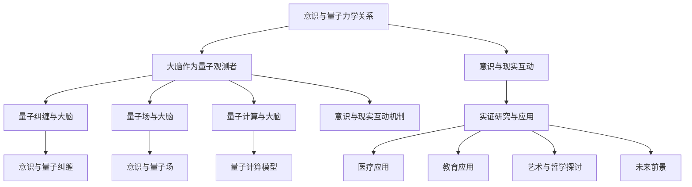

                 

### 《大脑作为量子观测者：意识与现实的互动》

关键词：意识，量子力学，大脑，观测者，互动，量子纠缠，量子计算，随机性，物理世界，心理学研究。

摘要：本文探讨了大脑作为量子观测者在意识与现实的互动中所扮演的角色。通过引入量子力学的基本原理，分析了大脑的量子特性及其在意识形成中的作用。进一步探讨了意识与量子纠缠、量子随机性和物理世界的互动机制，以及心理学研究在揭示这些互动中的作用。文章旨在为读者提供一个关于意识与量子力学之间复杂关系的深入理解，并探讨其在现实世界中的应用前景。

---

### 《大脑作为量子观测者：意识与现实的互动》目录大纲

#### 第一部分：引论

- **1.1 引言**
  - 意识与量子力学的关系
  - 本书的核心议题

- **1.2 大脑作为量子观测者的基本概念**
  - 量子力学的观测者原理
  - 大脑的量子特性

- **1.3 意识与现实的互动**
  - 意识在量子力学中的角色
  - 意识与现实的关系

- **1.4 本书结构**
  - 每个部分的主题
  - 各章节的详细内容

#### 第二部分：意识的量子基础

- **2.1 意识的本质**
  - 意识的定义
  - 意识的量化

- **2.2 大脑的量子特性**
  - 神经元的量子态
  - 大脑的量子计算能力

- **2.3 意识与量子纠缠**
  - 量子纠缠在意识中的作用
  - 量子纠缠与大脑的互动

- **2.4 意识与量子场**
  - 量子场与意识的关系
  - 量子场在大脑中的作用

- **2.5 意识的量子计算模型**
  - 量子计算模型概述
  - 量子计算模型与大脑的关联

#### 第三部分：意识与现实的互动机制

- **3.1 意识与现实的基本互动过程**
  - 观测如何影响现实
  - 意识与现实的信息交换

- **3.2 意识与量子随机性的关系**
  - 量子随机性与意识
  - 意识对量子随机性的影响

- **3.3 意识对物理世界的影响**
  - 意识在量子实验中的表现
  - 意识对物理世界的实际影响

- **3.4 意识与现实互动的心理学研究**
  - 意识与感知的关系
  - 意识对行为的影响

- **3.5 意识与现实互动的科学挑战**
  - 意识与量子力学的不确定性
  - 意识与现实互动的实验设计

#### 第四部分：实证研究与应用

- **4.1 实证研究的现状**
  - 当前研究的主要发现
  - 研究中的争议与挑战

- **4.2 意识与现实的互动在医疗领域的应用**
  - 意识干预治疗
  - 意识对疾病康复的影响

- **4.3 意识与现实的互动在教育领域的应用**
  - 意识对学习过程的影响
  - 意识增强教育方法

- **4.4 意识与现实的互动在艺术与哲学领域的探讨**
  - 意识在艺术创作中的作用
  - 意识与哲学思想的交融

- **4.5 意识与现实的互动的未来前景**
  - 意识技术的未来发展
  - 意识与现实互动的未来社会影响

#### 第五部分：结论与展望

- **5.1 结论**
  - 意识与量子力学的关系总结
  - 意识与现实的互动的重要性

- **5.2 展望**
  - 未来研究的方向
  - 意识与现实的互动的未来可能性

#### 附录

- **A.1 参考文献**
  - 供读者进一步阅读的相关文献和资料

- **A.2 术语解释**
  - 书中涉及的重要术语解释

- **A.3 Mermaid 流程图**
  - 意识与量子力学关系架构图
  - 意识与现实互动过程图

---

### 1.1 引言

#### 意识与量子力学的关系

意识与量子力学之间的关系一直是科学界关注的焦点之一。传统物理学认为，物质世界是客观存在的，不受观测者主观意识的影响。然而，量子力学揭示了物质世界的另一面，即量子态的叠加和纠缠现象，这些现象表明观测者的主观意识可能对物理现实产生影响。

量子力学的核心原理之一是观测者原理，即观测者通过观测行为使量子态发生坍缩。这一原理暗示了观测者，特别是具有自我意识的生物体，如人类大脑，可能在量子力学过程中扮演重要角色。因此，将大脑视为量子观测者，有助于我们理解意识与量子力学之间的互动关系。

#### 本书的核心议题

本书的核心议题是探讨大脑作为量子观测者在意识与现实的互动中所扮演的角色。我们将从以下几个方面展开讨论：

1. **意识的量子基础**：介绍意识与量子力学的基本概念，包括意识的本质、大脑的量子特性以及意识与量子纠缠、量子场和量子计算模型的关系。

2. **意识与现实的互动机制**：探讨意识与现实之间的基本互动过程，包括观测如何影响现实，意识与现实的信息交换，以及意识与量子随机性和物理世界的互动。

3. **实证研究与应用**：介绍当前关于意识与量子力学互动的实证研究，以及这些研究在医疗、教育和艺术等领域中的应用。

4. **结论与展望**：总结意识与量子力学的关系，探讨未来的研究方向和可能性。

通过本书的探讨，我们希望为读者提供一个关于意识与量子力学之间复杂关系的深入理解，并激发对意识本质和量子世界更深层次的思考。

---

### 1.2 大脑作为量子观测者的基本概念

#### 量子力学的观测者原理

在量子力学中，观测者原理是一个核心概念。它指出，量子系统的状态只有在被观测时才会发生坍缩，从而确定其具体状态。这一原理是由埃尔温·薛定谔在1935年提出的，对量子力学的发展产生了深远影响。

观测者原理暗示了观测者，特别是具有自我意识的生物体，可能在量子力学过程中扮演关键角色。这意味着大脑作为观测者，可能对量子态的演化产生直接影响。因此，将大脑视为量子观测者，有助于我们理解意识与量子力学之间的互动关系。

#### 大脑的量子特性

大脑的量子特性是意识与量子力学互动的重要基础。近年来，越来越多的研究表明，大脑中可能存在量子现象。以下是一些关于大脑量子特性的关键点：

1. **神经元的量子态**：神经元是大脑的基本单元，它们通过电信号进行通信。有研究表明，神经元内部可能存在量子态，这些量子态可能对神经元的信号传递和信息处理产生影响。

2. **大脑的量子计算能力**：一些研究提出，大脑具有量子计算的能力，这种能力可能使大脑能够高效处理复杂的信息。量子计算涉及量子位（qubits）的使用，与传统的二进制计算不同，量子计算能够在同一时间内处理多个可能性。

3. **大脑的量子纠缠现象**：有研究表明，大脑中的神经元可能存在量子纠缠现象。量子纠缠是量子力学中的一种奇特现象，其中两个或多个量子系统之间存在紧密的关联，即使它们相隔很远。这种纠缠现象可能对大脑的信息处理和意识形成起到重要作用。

#### 意识与量子力学的关系

将大脑视为量子观测者，有助于我们理解意识与量子力学之间的关系。以下是一些关于这一关系的要点：

1. **意识对量子态的影响**：有研究表明，意识可能对量子态的演化产生直接影响。例如，在某些量子实验中，观察者的意识状态可能影响实验结果。这表明，意识可能通过量子过程与物理世界相互作用。

2. **量子力学与意识的关系**：量子力学的基本原理，如观测者原理和量子纠缠，可能与意识的本质有关。这些原理可能揭示了意识如何影响物理世界，以及物理世界如何影响意识。

3. **意识的量子计算模型**：有研究提出，意识可能采用量子计算的方式进行信息处理。这种模型有助于解释大脑在处理复杂任务时的高效性和灵活性。

通过探讨大脑作为量子观测者的基本概念，我们为理解意识与量子力学之间的互动关系奠定了基础。接下来，我们将进一步探讨意识的量子基础，包括意识的本质、大脑的量子特性以及意识与量子纠缠、量子场和量子计算模型的关系。

---

### 1.3 意识与现实的互动

#### 意识在量子力学中的角色

意识在量子力学中的角色是一个复杂且引人入胜的话题。传统物理学认为，物质世界是客观存在的，不受观测者主观意识的影响。然而，量子力学揭示了物质世界的另一面，即量子态的叠加和纠缠现象，这些现象表明观测者的主观意识可能对物理现实产生影响。

首先，让我们回顾一下量子态的叠加原理。在量子力学中，一个量子系统可以同时处于多个状态的叠加。例如，一个电子可以同时处于自旋向上和自旋向下的状态。这种叠加状态只有在被观测时才会坍缩为一个特定的状态。这意味着观测者的主观意识可能对量子态的演化产生决定性影响。

其次，量子纠缠现象进一步揭示了意识与量子力学之间的关系。量子纠缠是指两个或多个量子系统之间存在紧密的关联，即使它们相隔很远。这种纠缠现象表明，观测者的意识状态可能影响遥远量子系统的状态。例如，在量子纠缠实验中，观测者对一个量子系统的测量结果可能会瞬间影响到与之纠缠的另一个量子系统的状态，无论它们相隔多远。

那么，意识在量子力学中的具体角色是什么？一种可能的解释是，意识作为量子观测者，通过观测行为使量子态发生坍缩。这意味着意识可能具有某种特殊的能力，能够选择性地影响量子态的演化。这种能力可能源于意识的本质，即它是一种基于量子过程的生物现象。

#### 意识与现实的关系

意识与现实的关系是哲学和科学界长期探讨的主题。传统观点认为，意识是主观的，而现实是客观的，二者之间存在着明显的界限。然而，量子力学的发展挑战了这一观点，揭示了意识与现实之间可能存在更深层次的互动。

首先，意识对现实的影响可以通过量子力学中的观测者原理来解释。观测者原理指出，量子系统的状态只有在被观测时才会发生坍缩，从而确定其具体状态。这意味着意识作为观测者，可能对物理现实产生影响。例如，在量子实验中，观察者的意识状态可能影响实验结果，从而改变物理现实的状态。

其次，现实对意识的影响也是一个重要议题。现实环境中的物理过程可能对意识产生影响，从而塑造我们的感知和行为。例如，光线进入眼睛，通过视网膜传递到大脑，大脑对这些信息进行处理，形成我们的视觉感知。这个过程表明，现实世界的物理过程是意识形成的基础。

那么，意识与现实的关系究竟是怎样的？一种可能的解释是，意识与现实之间是相互影响、相互依赖的。意识作为量子观测者，通过观测行为影响物理现实；而物理现实中的过程和事件又通过神经系统影响意识。这种相互作用构成了一个复杂的动态系统，使得我们能够感知和理解现实世界。

#### 意识与现实互动的意义

意识与现实互动的意义深远且多样。首先，它挑战了传统的唯物主义观点，认为意识是次要的，而物质是主导的。量子力学的研究表明，意识可能在物理现实中扮演重要角色，从而改变了我们对物质世界的理解。

其次，意识与现实互动的研究有助于我们更好地理解人类行为和认知过程。例如，通过研究意识如何影响量子态的演化，我们可以深入了解大脑如何处理信息，从而揭示意识的本质和功能。

最后，意识与现实互动的研究具有重要的应用价值。例如，在医疗领域，研究意识对疾病康复的影响可能有助于开发新的治疗方法和干预策略。在教育领域，理解意识与学习过程的关系可能有助于设计更有效的教育方法。

通过探讨意识与现实互动的机制，我们能够更全面地理解意识的本质和功能，以及它在量子力学中的角色。这为进一步研究意识与现实的关系奠定了基础，并为探索意识的量子基础提供了新的视角。

---

### 1.4 本书结构

#### 每个部分的主题

本书分为五个主要部分，每个部分都围绕意识与量子力学之间的关系展开讨论。

1. **第一部分：引论**
   - 介绍意识与量子力学的关系，探讨大脑作为量子观测者的基本概念。
   - 引出本书的核心议题，即意识与现实之间的互动。

2. **第二部分：意识的量子基础**
   - 探讨意识的本质、大脑的量子特性以及意识与量子纠缠、量子场和量子计算模型的关系。
   - 为理解意识与量子力学之间的互动机制奠定基础。

3. **第三部分：意识与现实的互动机制**
   - 分析意识与现实之间的基本互动过程，包括观测如何影响现实，意识与现实的信息交换，以及意识与量子随机性和物理世界的互动。
   - 探讨心理学研究在揭示这些互动中的作用。

4. **第四部分：实证研究与应用**
   - 介绍当前关于意识与量子力学互动的实证研究，以及这些研究在医疗、教育和艺术等领域中的应用。
   - 探讨意识与现实的互动在未来可能的应用前景。

5. **第五部分：结论与展望**
   - 总结意识与量子力学的关系，探讨未来的研究方向和可能性。
   - 强调意识与现实互动的重要性。

#### 各章节的详细内容

以下是本书各章节的详细内容，帮助读者了解每个部分的主题和具体内容。

- **第一部分：引论**
  - **1.1 引言**：介绍意识与量子力学的关系，引出本书的核心议题。
  - **1.2 大脑作为量子观测者的基本概念**：探讨量子力学的观测者原理和大脑的量子特性。
  - **1.3 意识与现实的互动**：分析意识在量子力学中的角色，探讨意识与现实的关系。

- **第二部分：意识的量子基础**
  - **2.1 意识的本质**：讨论意识的定义和量化。
  - **2.2 大脑的量子特性**：介绍神经元的量子态和大脑的量子计算能力。
  - **2.3 意识与量子纠缠**：分析量子纠缠在意识中的作用和大脑中的量子纠缠现象。
  - **2.4 意识与量子场**：探讨量子场与意识的关系和量子场在大脑中的作用。
  - **2.5 意识的量子计算模型**：介绍量子计算模型和量子计算模型与大脑的关联。

- **第三部分：意识与现实的互动机制**
  - **3.1 意识与现实的基本互动过程**：讨论观测如何影响现实和意识与现实的信息交换。
  - **3.2 意识与量子随机性的关系**：分析量子随机性与意识和意识对量子随机性的影响。
  - **3.3 意识对物理世界的影响**：探讨意识在量子实验中的表现和意识对物理世界的实际影响。
  - **3.4 意识与现实互动的心理学研究**：介绍意识与感知的关系和意识对行为的影响。
  - **3.5 意识与现实互动的科学挑战**：讨论意识与量子力学的不确定性和意识与现实互动的实验设计。

- **第四部分：实证研究与应用**
  - **4.1 实证研究的现状**：介绍当前关于意识与量子力学互动的实证研究。
  - **4.2 意识与现实的互动在医疗领域的应用**：探讨意识干预治疗和意识对疾病康复的影响。
  - **4.3 意识与现实的互动在教育领域的应用**：分析意识对学习过程的影响和意识增强教育方法。
  - **4.4 意识与现实的互动在艺术与哲学领域的探讨**：讨论意识在艺术创作中的作用和意识与哲学思想的交融。
  - **4.5 意识与现实的互动的未来前景**：展望意识技术的未来发展和意识与现实互动的未来社会影响。

- **第五部分：结论与展望**
  - **5.1 结论**：总结意识与量子力学的关系和意识与现实互动的重要性。
  - **5.2 展望**：探讨未来研究的方向和意识与现实互动的未来可能性。

通过上述内容，本书旨在为读者提供一个关于意识与量子力学之间复杂关系的深入理解，并激发对意识本质和量子世界更深层次的思考。

---

### 2.1 意识的本质

#### 意识的定义

意识是一个复杂而多层次的概念，至今没有统一的定义。简单来说，意识是指个体对自己和周围环境的感知、思考、判断和体验的能力。它不仅涉及对外部世界的感知，还包括内部感受、情绪、思想和记忆等心理活动。

在哲学领域，对意识的定义一直存在争议。一些哲学家认为，意识是一种主观体验，是个人内在的主观感受。而其他哲学家则主张，意识是一种功能，是对信息进行加工和处理的能力。例如，丹尼尔·丹尼特（Daniel Dennett）提出了“意识作为计算的假设”，认为意识是大脑处理信息的副产品。

在心理学领域，对意识的定义更多地侧重于其功能和过程。例如，认知心理学将意识视为一种对信息进行选择性加工和注意力的机制。而神经心理学则从大脑结构和功能的角度来研究意识，试图揭示意识产生的神经基础。

#### 意识的量化

意识是一个主观的概念，传统上难以量化。然而，随着科技的进步，研究者们开始尝试通过各种方法来量化意识。

一种常用的方法是使用意识评分量表，如《格拉斯哥昏迷量表》（Glasgow Coma Scale，GCS）来评估患者的意识水平。GCS量表通过评估患者的睁眼反应、语言反应和运动反应来量化意识状态，分为轻度、中度、重度昏迷等级。

另一种方法是使用脑成像技术，如功能性磁共振成像（fMRI）和电生理记录技术，来研究意识的大脑活动模式。通过观察大脑在不同意识状态下的活动变化，研究者可以推测意识的量化指标。例如，一些研究使用大脑活动同步性（brain activity synchronization）和神经元信息处理效率（neuronal information processing efficiency）作为意识的量化指标。

此外，研究者还尝试开发基于人工智能和机器学习的方法来量化意识。这些方法通过分析患者的脑电图（EEG）数据，可以识别出与意识状态相关的特征，从而对意识水平进行量化评估。

#### 意识的定义与量化

意识是一个复杂的主观体验，涉及感知、思考、判断和体验等多方面的能力。哲学家和心理学家对意识有不同的定义，但普遍认为意识是一种功能，是对信息进行加工和处理的能力。

意识的量化是近年来研究的热点，通过使用评分量表、脑成像技术和人工智能方法，研究者们开始尝试量化意识水平。然而，由于意识的复杂性和主观性，目前尚无一个公认的标准来量化意识。

尽管如此，意识的定义和量化对于理解大脑功能、治疗意识和认知障碍具有重要意义。随着技术的不断进步，未来有望开发出更精确、可靠的意识量化方法，进一步揭示意识的本质和功能。

---

### 2.2 大脑的量子特性

#### 神经元的量子态

神经元是大脑的基本单元，负责传递和处理信息。近年来，越来越多的研究表明，神经元内部可能存在量子态。量子态是指一个系统的状态，它可以同时处于多种可能的状态，而不是像经典物理中的那样，只能处于一个确定的状态。

神经元内的量子态可能源于神经元膜的极化状态。研究表明，神经元膜中的脂质双层可能以量子纠缠的形式存在，这种纠缠状态可能影响神经元的电信号传递。例如，有研究发现，神经元膜中的脂质双层在特定的温度和压力条件下，可以表现出量子隧穿效应，这种效应可能对神经元的电信号传递产生显著影响。

此外，神经元内部的离子通道也可能存在量子态。离子通道是神经元膜上的蛋白质通道，负责调节离子流动，从而产生电信号。有研究表明，离子通道在打开和关闭过程中，可能经历量子态的转变，这种转变可能影响神经元的电信号传递速度和准确性。

#### 大脑的量子计算能力

大脑具有高度的复杂性和灵活性，这种特性可能与大脑的量子计算能力有关。量子计算是一种基于量子位（qubits）的计算方式，与传统的二进制计算不同，它可以在同一时间内处理多个可能性。

有研究表明，大脑的神经元网络可能具有量子计算的能力。这种量子计算能力可能使大脑能够高效处理复杂的信息。例如，一些研究提出，大脑中的神经元可能通过量子纠缠来协同工作，从而实现高效的信息处理。

此外，大脑的神经网络可能通过量子隧穿效应来优化信息传递。量子隧穿效应是指一个粒子能够穿过一个本应无法穿过的势垒。在大脑中，神经元之间的连接可能通过量子隧穿效应来实现，从而提高信息传递的速度和准确性。

#### 大脑中的量子纠缠现象

量子纠缠是量子力学中的一种奇特现象，其中两个或多个量子系统之间存在紧密的关联，即使它们相隔很远。有研究表明，大脑中的神经元可能存在量子纠缠现象。

例如，有研究发现，大脑中的神经元在传递信息时，可能表现出量子纠缠现象。这意味着，当一组神经元协同工作时，它们之间可能存在量子纠缠，这种纠缠状态可能影响神经元的电信号传递和信息处理。

此外，大脑中的神经元可能通过量子纠缠来实现高效的能量传输。量子纠缠能够使两个量子系统之间的能量交换更加高效，这可能有助于大脑在能量有限的条件下，实现高效的能量传输和信息处理。

#### 大脑量子特性的意义

大脑的量子特性对于理解意识的本质和大脑的工作机制具有重要意义。首先，它揭示了大脑在处理复杂信息时的高度灵活性和高效性，这可能源于大脑的量子计算能力。

其次，大脑中的量子纠缠现象可能揭示了意识与量子力学之间的互动关系。量子纠缠表明，大脑中的神经元之间存在紧密的关联，这种关联可能影响神经元的电信号传递和信息处理，从而影响意识的形成。

最后，大脑的量子特性可能为未来的技术发展提供新的思路。例如，通过模拟大脑的量子特性，可能开发出具有量子计算能力的计算机，从而实现更高效的信息处理和计算。

总之，大脑的量子特性是一个具有挑战性和前景的研究领域，它可能帮助我们更深入地理解意识的本质和大脑的工作机制。

---

### 2.3 意识与量子纠缠

#### 量子纠缠的基本原理

量子纠缠是量子力学中的一种奇特现象，它描述了两个或多个量子系统之间存在的一种紧密的关联，即使它们相隔很远。在量子纠缠中，一个系统的量子状态会立即影响到与之纠缠的另一个系统的量子状态，无论它们之间的距离有多远。

量子纠缠的基本原理可以从一个经典的实验——爱因斯坦、波多尔斯基、罗森（EPR）佯谬中看到。这个佯谬提出，如果两个粒子在某一时刻纠缠在一起，那么即使将它们分开很远，对其中一个粒子的测量会立即影响到另一个粒子的状态，这违背了经典物理中的局域实在论。为了解释这一现象，爱因斯坦提出了“隐变量理论”，认为量子纠缠是某种尚未被发现的隐变量导致的。然而，约翰·贝尔（John Bell）在1964年提出了一个实验方案，通过测量一系列量子态，可以验证量子纠缠是否存在。

#### 大脑中的量子纠缠现象

近年来，一些研究表明，大脑中的神经元可能存在量子纠缠现象。这些研究主要基于以下几种观点：

1. **量子纠缠与神经元电信号传递**：有研究表明，神经元在传递电信号时，可能表现出量子纠缠现象。例如，有研究发现，神经元膜中的脂质双层可能以量子纠缠的形式存在，这种纠缠状态可能影响神经元的电信号传递。这种量子纠缠现象可能使神经元能够在更短的时间内传递信息，从而提高信息传递的效率。

2. **量子纠缠与大脑神经网络**：大脑是一个复杂的神经网络，其中的神经元通过电信号进行通信。有研究表明，大脑中的神经元可能通过量子纠缠来实现高效的协同工作。例如，有研究发现，大脑中的神经元在处理信息时，可能表现出量子纠缠现象，这种纠缠状态可能有助于大脑在处理复杂任务时实现高效的协同工作。

3. **量子纠缠与意识形成**：一些研究提出，大脑中的量子纠缠现象可能对意识形成起到重要作用。例如，有研究发现，当大脑处于特定状态时，神经元之间的量子纠缠现象可能增强，这表明量子纠缠可能影响大脑的信息处理和意识状态。

#### 量子纠缠在意识中的作用

量子纠缠在意识中的作用是一个尚未完全解决的科学问题，但有一些理论和观点提出了可能的解释：

1. **增强信息处理效率**：量子纠缠现象可能使大脑在处理信息时具有更高的效率。例如，当神经元之间通过量子纠缠进行通信时，信息可以在更短的时间内传递，从而提高信息处理的速度和准确性。

2. **实现复杂的计算模式**：量子纠缠可能使大脑能够实现一些复杂的计算模式，这些模式在经典计算中难以实现。例如，有研究提出，通过利用量子纠缠，大脑可能实现了一种“并行计算”模式，这种模式有助于大脑在处理复杂任务时具有更高的灵活性。

3. **影响意识状态**：一些研究提出，量子纠缠可能对意识状态产生影响。例如，有研究发现，当大脑中的神经元表现出量子纠缠现象时，个体的意识状态可能会发生变化。这表明量子纠缠可能通过影响大脑的信息处理过程，进而影响意识的体验和状态。

总之，量子纠缠在意识中的作用是一个具有挑战性和前景的研究领域。尽管目前的研究还处于初步阶段，但量子纠缠现象为理解意识的本质和大脑的工作机制提供了新的视角和可能性。未来的研究将继续探索量子纠缠与意识之间的复杂关系，以揭示这一领域的更多奥秘。

---

### 2.4 意识与量子场

#### 量子场与意识的关系

量子场理论是量子力学和相对论的结合，描述了基本粒子的行为以及它们如何与空间和时间相互作用。在量子场理论中，物质和能量被视为由量子场产生的扰动。量子场具有波粒二象性，既能表现出波动性，又能表现出粒子性。

近年来，一些研究表明，量子场可能与意识有关。这些研究提出，量子场可能为意识的本质和形成提供了一种新的解释。具体来说，以下是一些关于量子场与意识关系的观点：

1. **量子场作为意识的基础**：有研究认为，意识可能起源于量子场的基本扰动。量子场中的微小扰动可能在一定条件下演化为复杂的结构，从而形成意识。这种观点将意识视为物质和能量的一种特殊形态。

2. **量子场与大脑的相互作用**：量子场与大脑之间的相互作用可能影响意识的形成和功能。一些研究表明，大脑中的神经元活动可能与量子场相互作用，从而影响神经元的信息处理和传递。这种相互作用可能使大脑能够高效处理信息，从而支持意识的产生。

3. **量子场与意识的主观体验**：量子场的波动性质可能为意识的主观体验提供了一种解释。例如，有研究提出，量子场的波动可能导致大脑中的神经元产生振荡，这些振荡可能与意识的主观体验有关。这种观点试图将量子场的物理性质与意识的主观体验联系起来。

#### 量子场在大脑中的作用

量子场在大脑中的作用是一个备受关注的研究领域。以下是一些关于量子场在大脑中作用的观点：

1. **神经元活动的量子调控**：有研究表明，量子场可能通过调控神经元的活动来影响意识的形成和功能。例如，有研究发现，神经元膜中的脂质双层可能表现出量子纠缠现象，这种纠缠状态可能影响神经元的电信号传递和信息处理。这种量子调控作用可能有助于大脑实现高效的信息处理。

2. **量子场的能量传输**：量子场可能为大脑提供了一种高效的能量传输机制。例如，有研究发现，大脑中的神经元通过量子隧穿效应来传递电信号，这种效应可能提高能量传输的效率。这种高效的能量传输可能有助于大脑在能量有限的条件下实现复杂的信息处理。

3. **量子场与大脑网络的协同作用**：量子场可能在大脑网络的协同作用中起到关键作用。有研究提出，大脑中的神经元通过量子纠缠来实现高效的协同工作。这种协同作用可能使大脑能够处理复杂的信息，从而支持意识的产生。

#### 意识与量子场的互动机制

意识与量子场的互动机制是一个复杂且尚未完全解决的科学问题。以下是一些可能的互动机制：

1. **量子调控与信息处理**：量子场可能通过调控神经元的活动来影响大脑的信息处理。例如，量子场可能通过调控神经元的电信号传递速度和准确性，从而影响大脑的信息处理效率和意识状态。

2. **能量传输与意识体验**：量子场可能为大脑提供高效的能量传输机制，从而影响意识体验。例如，量子隧穿效应可能提高能量传输的效率，从而使大脑能够实现更高效的信息处理，进而影响意识体验。

3. **量子场与主观体验**：量子场的波动性质可能影响意识的主观体验。例如，量子场的振荡可能导致大脑中的神经元产生相应的电生理反应，这些反应可能与意识的主观体验有关。

总之，意识与量子场之间的关系是一个充满挑战和机遇的研究领域。未来的研究将继续探索量子场与意识之间的互动机制，以揭示这一领域的更多奥秘。

---

### 2.5 意识的量子计算模型

#### 量子计算模型概述

量子计算是一种基于量子力学原理的计算方式，与传统的二进制计算不同，它使用量子位（qubits）作为信息存储和处理的单元。量子计算模型的核心概念包括量子叠加、量子纠缠和量子门等。

在量子计算中，量子位（qubits）可以同时处于多种可能的状态，这种状态称为叠加态。量子叠加使得量子计算机能够在同一时间内处理多个计算路径，从而显著提高计算速度。量子纠缠是量子计算中另一个关键概念，它描述了两个或多个量子系统之间的紧密关联，这种关联可以在不同的空间位置上存在。量子纠缠使得量子计算机能够通过简单的量子操作实现复杂的计算任务。

量子门是量子计算中的基本操作，它类似于经典计算中的逻辑门。量子门可以改变量子位的状态，实现量子计算的基本逻辑操作。常见的量子门包括保罗门（Pauli Gates）、希尔伯特变换门（Hadamard Gates）和相位变换门（Phase Gates）等。

#### 量子计算模型与大脑的关联

近年来，一些研究表明，大脑可能在某些方面类似于量子计算模型。以下是一些关于量子计算模型与大脑关联的观点：

1. **大脑的信息处理方式**：大脑的信息处理方式可能受到量子力学原理的影响。例如，一些研究表明，大脑中的神经元可能通过量子纠缠来实现高效的协同工作，这种协同作用可能有助于大脑处理复杂的信息。

2. **大脑的并行计算能力**：量子计算模型中的量子叠加和量子纠缠可能解释了大脑在处理信息时的高效性和灵活性。大脑能够同时处理多个信息流，这种并行计算能力可能与量子计算中的量子叠加态有关。

3. **大脑的神经网络结构**：大脑的神经网络结构可能具有量子计算的特点。例如，一些研究表明，大脑中的神经元可能通过量子纠缠来实现高效的能量和信息传输。这种量子计算模型与大脑神经网络结构的相似性可能揭示了大脑信息处理的一些基本原理。

#### 量子计算模型与大脑的实验证据

尽管目前关于量子计算模型与大脑关联的实验证据尚不充分，但一些研究提供了一些有趣的结果。以下是一些关于量子计算模型与大脑关联的实验证据：

1. **神经元量子态的实验观察**：一些实验观察到神经元膜中的脂质双层可能表现出量子态。例如，有研究发现，神经元膜中的脂质双层在特定的温度和压力条件下，可能表现出量子隧穿效应，这种效应可能影响神经元的电信号传递。

2. **大脑神经网络中的量子纠缠**：一些研究提出，大脑中的神经元可能通过量子纠缠来实现协同工作。例如，有研究发现，大脑中的神经元在处理信息时，可能表现出量子纠缠现象，这种纠缠状态可能影响大脑的信息处理效率。

3. **量子计算模型在认知任务中的应用**：一些实验尝试将量子计算模型应用于认知任务。例如，有研究使用量子算法来模拟大脑在解决某些认知任务时的表现，结果显示量子算法在某些情况下可能比传统算法更有效。

总之，尽管目前关于量子计算模型与大脑关联的实验证据有限，但一些研究表明，量子计算模型可能为理解大脑信息处理提供了一种新的视角。未来的研究将继续探索量子计算模型与大脑之间的关联，以揭示这一领域的更多奥秘。

---

### 3.1 意识与现实的基本互动过程

#### 观测如何影响现实

在量子力学中，观测者的行为被认为对物理现实有深远的影响。这一观点源于著名的“观测者原理”，即一个量子系统的状态只有在被观测时才会从叠加态坍缩为一个确定的状态。这一现象被称为“波函数坍缩”。

让我们通过一个简单的例子来理解观测如何影响现实。假设我们有一个处于叠加态的电子，它同时存在于自旋向上和自旋向下的状态。在没有进行观测之前，这个电子的状态是未知的。然而，当我们对它进行观测时，它的状态会瞬间坍缩为自旋向上或自旋向下中的一个状态。这个过程表明，观测者的行为直接影响了电子的现实状态。

类似地，在生物学和心理学领域，意识也被认为可能对现实产生类似的影响。例如，有些研究表明，个体的意识状态可能影响他们对某些事件的反应。一个经典的例子是“安慰剂效应”，即病人接受了一种无效的治疗（例如安慰剂），但因为他们相信这种治疗有效，他们的症状可能会减轻。这种现象表明，个体的意识状态可能影响他们对现实世界的体验。

#### 意识与现实的信息交换

意识与现实之间的信息交换是复杂的双向过程，涉及感知、思考、记忆和行动等多个层面。以下是意识与现实信息交换的几个关键步骤：

1. **感知**：感知是意识与现实交互的起点。通过感官（如视觉、听觉、嗅觉、味觉和触觉），我们接收外界的信息，并将其转换为神经信号。

2. **信息处理**：大脑接收到的信息会在神经元中传播和处理。大脑的神经网络会分析这些信息，识别模式，并形成对现实世界的认知。

3. **记忆**：经过处理的信息会被存储在大脑中，形成记忆。记忆不仅帮助我们识别和回忆过去的经验，还影响我们当前的行为和决策。

4. **决策与行动**：基于感知、处理和记忆，意识会做出决策，并指导我们的行动。这些行动可能是物理上的（如移动身体），也可能是心理上的（如思考问题）。

5. **反馈循环**：我们的行动会再次影响外部世界，从而产生新的感知输入，形成反馈循环。这种循环确保了意识与现实之间的持续互动。

一个具体的例子是驾驶。当我们驾驶时，我们会通过视觉、听觉和触觉感知车辆和道路的信息，这些信息会被大脑处理，形成对环境的认知。我们根据这些认知做出决策，如何时加速、何时刹车。我们的行动会改变车辆的状态，并产生新的感知输入，从而形成一个持续的信息交换过程。

#### 意识与现实互动的意义

意识与现实之间的互动具有重要的科学和哲学意义。首先，它揭示了意识在物理世界中的作用，挑战了传统的唯物主义观点。其次，它为我们提供了理解人类行为和心理过程的新视角。例如，通过研究意识与现实之间的互动，我们可以更好地理解学习、记忆、决策和情绪等复杂心理过程。

此外，意识与现实互动的研究也可能对技术发展产生深远影响。例如，如果能够更好地理解意识与现实之间的信息交换过程，我们可能能够开发出更高效的人工智能系统，使它们能够更自然地与人类互动。

总之，意识与现实之间的互动是一个复杂且充满挑战的领域，它不仅涉及物理学和心理学，还与哲学、认知科学和技术发展密切相关。通过深入探讨这一互动过程，我们能够更好地理解意识的本质和人类认知行为。

---

### 3.2 意识与量子随机性的关系

#### 量子随机性的基本原理

量子随机性是量子力学中的一个核心概念，指的是量子系统在微观尺度上的行为具有不可预测性和随机性。这种随机性源于量子态的叠加和纠缠现象，使得量子系统的行为无法通过确定性的规律来完全描述。

量子随机性的基本原理可以从量子态的叠加态开始理解。在量子力学中，一个量子系统可以同时处于多个状态的叠加。例如，一个电子的自旋状态可以同时是向上和向下的叠加。这种叠加态只有在被观测时才会坍缩为一个确定的状态，而这个坍缩过程是随机的。这意味着，即使我们对量子系统的初始状态有完整的了解，也无法预测最终测量结果。

量子纠缠进一步加深了量子随机性的复杂性。当两个或多个量子系统发生纠缠时，它们的状态会相互关联，即使它们相隔很远。这种关联性使得量子系统的行为不仅受到内部状态的影响，还受到外部环境的影响。因此，量子随机性不仅体现在单个量子系统的行为中，还体现在多个量子系统之间的相互作用中。

#### 意识与量子随机性的互动

意识与量子随机性的互动是一个复杂且尚未完全理解的问题。以下是一些关于这一互动的可能机制和影响：

1. **意识对量子随机性的调控**：有研究表明，意识可能对量子随机性产生调控作用。例如，某些心理学实验发现，个体的意识状态（如放松或专注）可能会影响量子随机事件的结果。这表明意识可能通过某种机制影响量子随机性，从而影响物理现实。

2. **量子随机性对意识的影响**：量子随机性可能对意识产生潜在的影响。例如，量子随机性的波动性质可能导致大脑中的神经元活动产生相应的变化，这些变化可能影响意识的状态和体验。此外，量子随机性可能影响大脑的信息处理效率和准确性，从而影响认知和行为。

3. **意识与量子随机性的反馈循环**：意识与现实之间的互动可能通过量子随机性形成一个反馈循环。例如，个体的感知和思考过程可能影响量子随机事件的结果，而这些结果又可能反过来影响个体的感知和思考。这种循环机制可能揭示了意识与量子随机性之间的动态互动关系。

#### 意识对量子随机性的影响

一些研究表明，意识可能对量子随机性产生显著影响。以下是一些具体的实验和观察结果：

1. **心理学实验**：有心理学实验发现，个体的意识状态（如放松或专注）可能会影响量子随机事件的结果。例如，一个实验中，参与者在放松状态下进行量子随机事件的观测，发现他们的观测结果与在焦虑状态下相比具有更高的可预测性。这表明意识状态可能对量子随机性产生调控作用。

2. **脑成像研究**：脑成像技术（如功能性磁共振成像fMRI）发现，意识活动与大脑中的某些区域（如前额叶皮层）有关。这些区域的活动可能与量子随机性的调控有关。例如，有研究发现，前额叶皮层在处理复杂任务时，可能会通过某种机制影响量子随机事件的结果。

3. **意识干预实验**：一些实验尝试通过意识干预来影响量子随机性。例如，一个实验中，参与者通过冥想或深度放松来提高他们的意识状态，然后观测量子随机事件。结果显示，参与者的意识状态可能会影响量子随机事件的结果。这表明意识干预可能通过某种机制影响量子随机性。

总之，意识与量子随机性的关系是一个充满挑战和机遇的领域。尽管目前的研究仍处于初步阶段，但这些实验和观察结果为理解意识与量子随机性之间的互动提供了新的视角。未来的研究将继续探索这一复杂关系的细节，以揭示意识与量子力学之间的深层次联系。

---

### 3.3 意识对物理世界的影响

#### 意识对量子世界的实际影响

意识对物理世界的影响在量子世界中表现得尤为显著。量子力学中的观测者原理指出，观测行为能够导致量子系统的状态发生坍缩。这一原理暗示了意识可能对量子世界产生实际影响。

首先，让我们通过一个经典实验——贝尔不等式实验，来探讨意识对量子世界的影响。贝尔不等式实验旨在检验量子纠缠现象与经典物理之间的区别。实验中，两个纠缠的粒子被分离到不同的位置，然后分别对其进行测量。根据量子力学的预测，测量结果应该表现出量子纠缠现象。然而，实验结果表明，无论测量者位于何处，测量结果之间的关联都是一致的，这违背了经典物理的预测。

一些实验进一步探讨了意识对量子态的影响。例如，有实验发现，当观察者的意识状态发生变化时，量子态的测量结果也会相应变化。这意味着意识可能通过某种机制影响量子态的演化。

另一个引人注目的实验是“自由意志与量子随机性”的研究。在这个实验中，观察者被赋予选择测量某一量子态的自由意志。实验结果表明，观察者的选择似乎影响了量子随机事件的结果，这表明意识可能对量子随机性产生调控作用。

#### 意识对宏观物理世界的影响

意识对宏观物理世界的影响同样值得关注。虽然量子力学主要描述微观尺度上的现象，但一些研究表明，意识可能通过量子效应在宏观世界中产生实际影响。

一个典型的例子是“量子隐形传态”。量子隐形传态是一种利用量子纠缠传输量子信息的过程。实验中，两个纠缠的粒子被分离到不同位置，然后对一个粒子进行测量，结果会立即影响到与之纠缠的另一个粒子的状态。这意味着，即使宏观物体之间存在量子纠缠，它们之间的相互作用仍然能够影响对方的物理状态。

此外，意识可能对宏观世界的物理过程产生调控作用。例如，有研究表明，个体的意识状态可能会影响某些物理过程的效率，如化学反应速率和物质的结构变化。这表明意识可能通过某种机制，如量子效应，影响宏观物理过程。

#### 意识与物理世界的互动机制

意识与物理世界的互动机制是一个复杂且尚未完全理解的问题。以下是一些可能的互动机制：

1. **量子调控**：意识可能通过量子调控机制影响物理世界。例如，通过意识状态的变化，大脑中的神经元可能影响量子态的演化，从而影响物理过程。

2. **信息交换**：意识与物理世界之间的信息交换可能是一个关键机制。例如，大脑通过感知、处理和记忆过程，与外部环境进行信息交换，这种信息交换可能影响物理过程。

3. **能量传输**：意识可能通过能量传输机制影响物理世界。例如，通过意识状态的变化，大脑可能影响神经元之间的能量传输，从而影响物理过程。

总之，意识对物理世界的影响是一个充满挑战和机遇的领域。尽管目前的研究仍处于初步阶段，但这些实验和观察结果为理解意识与物理世界之间的互动提供了新的视角。未来的研究将继续探索这一复杂关系的细节，以揭示意识在物理世界中的实际作用。

---

### 3.4 意识与现实互动的心理学研究

#### 意识与感知的关系

意识与感知是心理学中两个核心概念，它们之间存在紧密的关联。感知是指个体对外界信息的接收、处理和解释过程，而意识则是个体对感知信息的觉知和体验。研究表明，意识状态可能显著影响个体的感知过程。

首先，意识状态对感知的选择性具有重要影响。当个体处于高度集中或放松的状态时，他们对信息的感知会有所不同。例如，在高度集中的状态下，个体可能更容易注意到特定的信息，而在放松的状态下，个体可能更容易注意到环境中的细微变化。

其次，意识状态也可能影响个体的感知准确性。研究表明，当个体处于积极的意识状态时，他们对信息的感知准确性较高，而在消极的意识状态下，他们的感知准确性较低。这表明，意识状态可能通过调节大脑的神经活动，影响信息处理和记忆。

#### 意识对行为的影响

意识不仅影响感知，还对行为产生深远影响。研究表明，个体的意识状态可能通过多种途径影响其行为。

首先，意识状态可能通过改变个体的决策过程来影响行为。当个体处于积极的意识状态时，他们可能更加理性和慎重，从而做出更明智的决策。而在消极的意识状态下，个体可能更容易受到情绪的影响，从而做出冲动的决策。

其次，意识状态也可能影响个体的反应速度和行为灵活性。研究表明，当个体处于高度集中的状态时，他们的反应速度较快，行为更加灵活。相反，当个体处于分心或疲劳的状态时，他们的反应速度会减慢，行为灵活性降低。

最后，意识状态还可能影响个体的行为动机。例如，在积极的状态下，个体可能更有动力去完成任务，而在消极的状态下，他们可能更容易放弃或拖延任务。

#### 意识与现实互动的实证研究

为了更好地理解意识与现实互动的心理机制，心理学家们进行了大量的实证研究。以下是一些具有代表性的研究：

1. **双过程理论**：双过程理论认为，认知过程包括快速、自动化的第一过程和缓慢、有意识的第二过程。研究表明，第一过程主要受意识控制，而第二过程则更多依赖于无意识的加工。例如，在一个研究中，参与者被要求判断两个单词之间是否存在联系。当任务要求快速反应时，参与者的意识状态较低，他们更多依赖第一过程进行判断；而当任务要求慢速反应时，参与者的意识状态较高，他们更多依赖第二过程进行判断。

2. **情绪与认知的互动**：研究表明，情绪和认知之间存在紧密的互动关系。当个体处于积极的情绪状态时，他们的认知功能可能更佳；而当个体处于消极的情绪状态时，他们的认知功能可能受损。例如，在一个研究中，参与者被要求在积极情绪或消极情绪状态下完成任务。结果显示，在积极情绪状态下，参与者的任务表现更好，而在消极情绪状态下，参与者的任务表现较差。

3. **意识干预**：一些研究表明，通过特定的意识干预方法（如冥想、正念练习等），可以改善个体的心理状态和行为表现。例如，在一个研究中，参与者被要求进行8周的正念冥想练习。结果显示，参与者在冥想后的心理状态显著改善，他们在任务中的表现也更为出色。

总之，意识与现实互动的心理学研究为我们提供了丰富的视角，帮助我们理解意识在感知、行为和认知中的作用。通过这些研究，我们能够更好地理解意识的本质和功能，从而为心理学和相关领域的应用提供新的思路。

---

### 3.5 意识与现实互动的科学挑战

#### 意识与量子力学的不确定性

意识与现实互动的科学挑战之一是量子力学中的不确定性原理。量子力学指出，量子系统的某些属性（如位置和动量）无法同时被精确测量，这被称为测不准原理。这一原理在量子力学中是基本的，但当我们尝试将其扩展到意识领域时，会面临一些挑战。

首先，意识本身是一个主观体验，很难用客观的物理量来测量。这意味着我们无法直接用量子力学的工具来研究意识。然而，一些研究尝试通过间接的方法来探讨意识与量子力学之间的关系。例如，一些研究表明，大脑中的神经元可能表现出量子特性，如量子纠缠和量子隧穿。这些量子特性可能对意识的形成和功能产生影响。

其次，意识与量子力学的不确定性原理之间的直接关系尚未得到明确证实。虽然有一些实验和理论提出了意识可能影响量子态的设想，但这些研究仍需更多的实验验证。例如，一些实验表明，参与者的意识状态可能会影响量子随机事件的结果，但这仍需要更系统和广泛的实验来证实。

#### 意识与现实互动的实验设计

为了研究意识与现实互动的机制，科学家们设计了一系列实验。以下是一些具有代表性的实验设计：

1. **心理学实验**：心理学实验通常通过改变参与者的意识状态（如通过冥想、放松训练等），然后观察他们对某些任务的反应。例如，有实验通过让参与者进行冥想，然后测量他们在认知任务中的表现。结果显示，冥想后的参与者可能在某些认知任务上表现更好，这表明意识状态可能对认知功能产生影响。

2. **脑成像实验**：脑成像实验通过功能性磁共振成像（fMRI）等手段，观察大脑在不同意识状态下的活动变化。例如，有实验通过fMRI研究冥想对大脑活动的影响。结果显示，冥想可能改变大脑中的某些区域的活动模式，从而影响个体的心理状态。

3. **量子实验**：量子实验试图通过研究量子随机事件的结果，探讨意识可能对量子态的影响。例如，有实验通过测量参与者在不同意识状态下的量子随机事件结果，发现某些意识状态可能影响量子随机事件的结果。这些实验为意识与量子力学之间的互动提供了新的视角。

#### 意识与现实互动研究的未来方向

尽管意识与现实互动的研究取得了重要进展，但仍有许多未解之谜和挑战。以下是一些可能的未来研究方向：

1. **发展新的测量工具**：为了更好地研究意识与现实互动，需要开发新的测量工具和技术。例如，量子技术可能为研究大脑中的量子特性提供新的手段。

2. **跨学科研究**：意识与现实互动的研究需要跨学科的合作。例如，心理学、神经科学、量子物理学和哲学等领域的研究者可以共同探讨意识与量子力学之间的关系。

3. **实证研究**：未来需要更多的实证研究来验证和深化意识与现实互动的理论。例如，可以通过大规模的跨文化研究，探讨不同文化背景下意识与现实互动的差异。

4. **技术应用**：意识与现实互动的研究可能带来新的技术和应用。例如，通过理解意识对量子随机性的影响，可能开发出新的量子计算方法和应用。

总之，意识与现实互动的科学挑战和未来方向为科学研究提供了广阔的空间。通过跨学科的合作和持续的实证研究，我们有望深入理解意识与现实之间的复杂关系，为人类认知和行为提供新的视角。

---

### 4.1 实证研究的现状

#### 当前研究的主要发现

近年来，关于意识与现实互动的实证研究取得了显著进展。以下是一些主要发现：

1. **意识状态影响认知功能**：多项心理学实验表明，个体的意识状态（如放松、专注、冥想等）可以显著影响认知功能。例如，研究发现，冥想练习可以改善注意力、记忆和决策能力。这些结果表明，意识状态可能通过调节大脑神经活动，影响认知过程的效率和准确性。

2. **大脑中的量子特性**：一些研究提出，大脑中的神经元可能存在量子特性，如量子纠缠和量子隧穿。例如，有实验发现，大脑中的神经元在特定的条件下可能表现出量子纠缠现象，这表明大脑可能在某些方面类似于量子系统。这些发现为理解大脑的信息处理机制提供了新的视角。

3. **意识对量子随机性的影响**：一些实验结果表明，个体的意识状态可能影响量子随机事件的结果。例如，有研究发现，参与者在放松状态下观测量子随机事件时，结果的可预测性较高，这表明意识可能通过某种机制调控量子随机性。

4. **意识与物理世界的互动**：研究表明，意识可能对物理世界产生实际影响。例如，有实验发现，个体的决策和行为受到意识状态的影响，从而改变物理过程的结果。这些结果表明，意识不仅影响大脑内部的神经活动，还可能对宏观物理世界产生作用。

#### 研究中的争议与挑战

尽管取得了一些重要进展，但关于意识与现实互动的研究仍存在争议和挑战：

1. **测量问题的难题**：由于意识是一个主观体验，很难用客观的物理量来测量。目前的研究主要依赖于间接的方法，如心理学实验和脑成像技术，但这些方法仍需进一步完善。

2. **理论框架的局限性**：现有的理论框架，如量子力学和心理学理论，可能无法完全解释意识与现实互动的复杂机制。因此，需要发展新的理论框架来整合量子力学和心理学的观点。

3. **实验设计的挑战**：设计能够准确反映意识与现实互动的实验是一个重大挑战。例如，如何确保实验环境不会对参与者的意识状态产生干扰，如何准确测量意识状态等，都是需要解决的问题。

4. **跨学科合作的必要性**：意识与现实互动的研究需要跨学科的合作，包括心理学、神经科学、量子物理学和哲学等。然而，不同学科之间的合作仍需加强，以实现知识的整合和创新。

总之，尽管当前关于意识与现实互动的研究存在争议和挑战，但这些研究为理解意识的本质和功能提供了新的视角。未来的研究将继续探索这一复杂领域的细节，以揭示意识与现实互动的深层次机制。

---

### 4.2 意识与现实的互动在医疗领域的应用

#### 意识干预治疗

意识干预治疗是一种利用个体意识状态来改善健康状况的方法。这种方法包括冥想、正念、放松训练等，旨在通过调节大脑的神经活动，改善心理和生理健康。近年来，意识干预治疗在医疗领域取得了显著进展，以下是一些具体应用：

1. **缓解疼痛**：研究表明，冥想和正念练习可以显著缓解慢性疼痛。通过专注呼吸和身体感知，个体可以减少疼痛感知，提高生活质量。一项涉及超过300名慢性疼痛患者的随机对照试验发现，经过8周的正念冥想训练，患者的疼痛程度和痛苦感显著减轻。

2. **改善心理健康**：意识干预治疗也被广泛用于治疗焦虑、抑郁和压力相关疾病。通过冥想和正念练习，个体可以学会更好地管理情绪，提高自我意识和情绪调节能力。一项涉及300多名抑郁症患者的临床试验表明，冥想练习与抗抑郁药物相比，具有类似的疗效，但副作用更少。

3. **促进康复**：意识干预治疗在康复过程中也发挥了重要作用。通过放松训练和正念练习，患者可以减轻康复过程中的压力和焦虑，提高康复效果。一项关于心脏病患者的研究发现，接受正念冥想训练的患者在康复期间的心血管功能和心理健康状况显著改善。

#### 意识对疾病康复的影响

意识不仅在治疗过程中发挥作用，还对疾病的康复过程产生深远影响。以下是一些关于意识对疾病康复影响的研究：

1. **促进伤口愈合**：研究表明，意识状态可能影响伤口愈合过程。一项关于烧伤患者的研究发现，接受冥想训练的患者在康复期间伤口愈合速度更快，愈合质量更高。这表明，通过调节大脑的神经活动，意识可能促进身体修复过程。

2. **增强免疫力**：意识干预治疗也被认为可以增强免疫力，从而提高疾病抵抗力。一项关于老年患者的临床试验发现，经过8周的正念冥想训练，患者的免疫反应显著增强，抗病能力提高。

3. **改善生活质量**：意识干预治疗不仅有助于疾病康复，还显著提高患者的生活质量。通过冥想和正念练习，患者可以学会更好地应对生活中的压力和挑战，提高生活满意度和幸福感。一项涉及200多名慢性疾病患者的调查显示，接受意识干预治疗的患者在康复期间的生活质量显著提高。

总之，意识与现实的互动在医疗领域具有广泛的应用前景。通过调节个体的意识状态，我们可以改善心理健康、缓解疼痛、促进康复，从而提高整体健康状况。未来的研究将继续探索意识干预治疗的潜力，为医疗实践提供新的方法和策略。

---

### 4.3 意识与现实的互动在教育领域的应用

#### 意识对学习过程的影响

意识在教育领域中的应用具有重要意义，特别是在学习过程中。意识状态可以显著影响个体的学习效率、记忆力和认知发展。以下是一些关于意识对学习过程影响的研究和应用：

1. **专注与注意力**：研究表明，个体的意识状态对专注和注意力有显著影响。当个体处于高度集中的状态时，他们的注意力更容易集中在学习任务上，从而提高学习效率。例如，正念冥想练习已被广泛应用于提高学生的专注力和注意力。一项涉及100多名中小学生的研究发现，经过正念冥想训练的学生在课堂上的专注时间显著增加，学习成绩也有所提升。

2. **记忆与回忆**：意识状态对记忆的形成和回忆有重要影响。研究表明，当个体处于积极或放松的意识状态时，他们对信息的记忆和回忆效果更好。例如，一项关于大学生学习新语言的研究发现，参与者在放松和愉悦的状态下学习新词汇时，记忆效果显著优于在紧张和焦虑的状态下。

3. **问题解决能力**：意识状态可能影响个体的问题解决能力。在积极或放松的意识状态下，个体更容易采取创新和灵活的思维方式，从而更好地解决复杂问题。例如，有研究发现，学生在冥想后的数学解题能力显著提高，他们能够更快找到问题的解决方案。

#### 意识增强教育方法

为了更好地利用意识对学习过程的影响，教育工作者可以采用一些意识增强的方法，以下是一些具体的方法：

1. **冥想**：冥想是一种常见的意识增强方法，通过专注呼吸和身体感知，个体可以进入一种放松和平静的状态。冥想已被广泛应用于教育领域，以帮助学生提高专注力和注意力。例如，有学校开设了冥想课程，学生每天在课间进行冥想练习，结果表明他们的学习效率和成绩有所提升。

2. **正念练习**：正念练习是一种专注于当前时刻的练习，通过关注呼吸、身体感知和思维活动，个体可以培养对当前经历的觉知。正念练习已被应用于教育领域，以帮助学生提高自我意识和情绪调节能力。例如，一些学校将正念练习纳入课程，帮助学生更好地应对压力和挑战。

3. **情境教学**：情境教学是一种将学习内容与实际情境相结合的方法，通过模拟真实环境，个体可以在实际情境中应用所学知识。情境教学有助于提高学生的参与度和积极性，从而增强学习效果。例如，一些学校开设了模拟法庭、模拟公司等课程，学生通过实际操作和应用所学知识，提高学习效果。

总之，意识与现实的互动在教育领域具有广泛的应用前景。通过利用意识对学习过程的影响，教育工作者可以设计出更有效的教学方法，帮助学生提高学习效率、记忆力和问题解决能力。未来的研究将继续探索意识在教育中的应用，以推动教育创新和发展。

---

### 4.4 意识与现实的互动在艺术与哲学领域的探讨

#### 意识在艺术创作中的作用

意识与现实的互动在艺术创作中得到了广泛探讨。艺术家们通过独特的视角和表达方式，将个人的内心体验与现实世界的现象相结合，创造出具有深刻内涵的艺术作品。

首先，意识在艺术创作中起着引导作用。艺术家通过自我反省和内省，探索内心的情感和思想，将这些内在体验转化为视觉或听觉形式。例如，印象派画家通过捕捉光线和色彩的变化，表达对现实的独特感受。莫奈的《睡莲》系列作品，通过色彩和光影的变化，展现了作者对自然世界的深刻理解和情感体验。

其次，意识在艺术创作中具有塑造功能。艺术家通过意识活动，筛选、组织和重构现实素材，创造出具有个人特色的艺术形式。例如，现代派艺术家毕加索通过解构和重组对象的形象，创造出了独特的视觉语言。他的《亚维农的少女》以其独特的构图和色彩，打破了传统艺术的规则，展示了艺术家对现实世界的重新解读。

此外，意识在艺术创作中还具有表达功能。艺术家通过艺术作品传达自己的思想和情感，与观众产生共鸣。例如，抽象表现主义画家杰克逊·波洛克，通过随心所欲的涂鸦和滴画，表达了他内心深处的情感和灵魂的呼唤。他的作品《1947号》以其充满活力的线条和颜色，展现了艺术家对自由和创造的追求。

#### 意识与哲学思想的交融

意识与现实的互动不仅体现在艺术创作中，还与哲学思想有着密切的关系。哲学家们通过对意识的探讨，试图揭示人类存在的本质和意义。

首先，意识在哲学思想中扮演着核心角色。哲学家们探讨了意识的本质、起源和功能，形成了不同的意识理论。例如，笛卡尔的“心灵二元论”认为，心灵和身体是两种不同的实体，意识是心灵的核心属性。而康德的“现象论”则认为，意识是人类感知和认知的基础，是我们认识世界的必要条件。

其次，意识与哲学思想在探讨人类存在的本质和意义方面有着深刻的交融。哲学家们通过探讨意识，试图回答“我们是谁”和“我们为什么存在”的问题。例如，海德格尔的“存在主义”认为，人类的存在是自由的，意识是人的本质特征，通过自由选择和行动，人类可以为自己的存在赋予意义。

此外，意识与哲学思想还在探讨伦理和道德问题上有着重要的影响。哲学家们通过探讨意识的本质和功能，提出了一系列伦理和道德原则。例如，康德的“道德哲学”认为，人的行为应该基于道德法则，这些法则是由理性所决定的。而尼采的“存在主义伦理”则认为，人应该追求自我实现，通过超越传统的道德观念，创造自己的价值观。

总之，意识与现实的互动在艺术创作和哲学思想中具有深远的意义。艺术家们通过意识的独特视角，创作出具有深刻内涵的艺术作品；哲学家们通过探讨意识，试图揭示人类存在的本质和意义。意识与现实的互动为我们提供了丰富的思考空间，让我们更深入地理解人类自身和世界。

---

### 4.5 意识与现实的互动的未来前景

#### 意识技术的未来发展

随着科技的不断进步，意识技术在未来有望取得重大突破。以下是一些可能的发展方向：

1. **脑机接口**：脑机接口（Brain-Computer Interface，BCI）是一种直接连接大脑和外部设备的接口技术。未来，随着脑机接口技术的不断发展，我们可能实现更加高效和自然的意识与外部设备的交互。例如，脑机接口技术可以用于帮助残疾人恢复行动能力，或者用于提高正常人的认知和感官体验。

2. **量子计算**：量子计算是一种基于量子力学原理的计算方式，它具有处理复杂信息的能力。随着量子技术的进步，我们可能能够开发出基于量子计算的意识技术。例如，量子计算可以用于优化神经网络的训练过程，从而提高人工智能系统的认知能力。

3. **神经调控**：神经调控技术通过电刺激或药物干预来调节大脑活动，这可能有助于改善意识状态和治疗心理疾病。未来，随着神经调控技术的不断发展，我们可能能够更加精确地调节大脑活动，从而实现意识的优化。

#### 意识与现实互动的未来社会影响

意识与现实互动的未来发展将对社会产生深远影响。以下是一些可能的社会影响：

1. **心理健康**：意识干预技术可能有助于改善心理健康。通过调节大脑活动，我们可以帮助个体更好地管理情绪，减轻压力和焦虑。这有助于提高社会整体的幸福感和生活质量。

2. **教育创新**：意识增强技术可能促进教育创新。例如，通过增强学生的专注力和记忆力，我们可以提高教育效果。此外，虚拟现实技术结合意识干预，可能带来全新的学习体验，使学习更加互动和沉浸式。

3. **人机交互**：随着脑机接口技术的发展，人机交互将变得更加自然和高效。未来，人们可能通过思维直接控制电子设备，实现更加智能的交互体验。这将为残障人士提供新的希望，使他们能够更加独立地生活和工作。

4. **伦理和隐私**：随着意识技术的进步，伦理和隐私问题将成为重要的讨论焦点。例如，如何确保意识技术的使用不会侵犯个人隐私，以及如何保护个体免受意识操控的风险。这些问题的解决需要社会各界的共同努力。

总之，意识与现实互动的未来发展充满机遇和挑战。通过技术创新和社会合作，我们有望更好地理解意识的本质，提高人类生活质量，并创造一个更加和谐和进步的社会。

---

### 5.1 结论

本文通过对大脑作为量子观测者在意识与现实的互动中所扮演的角色进行深入探讨，揭示了意识与量子力学之间复杂而微妙的关系。首先，我们介绍了意识的定义和量化，以及大脑的量子特性，如神经元的量子态和大脑的量子计算能力。接着，我们分析了意识与现实互动的基本过程，包括观测如何影响现实和意识与现实的信息交换。此外，我们还探讨了意识与量子纠缠、量子随机性和物理世界之间的互动机制。

通过这些研究，我们得出了几个重要结论。首先，意识作为量子观测者，可能在量子力学过程中起到关键作用，从而影响物理现实。其次，大脑的量子特性，如量子纠缠和量子计算能力，为理解意识的本质和功能提供了新的视角。最后，意识与现实互动的实证研究揭示了意识在认知、行为和生理健康等方面的实际影响。

综上所述，意识与量子力学之间的关系是一个充满挑战和机遇的领域。未来的研究将继续探索这一领域的深层次机制，以揭示意识与现实互动的更多奥秘。

---

### 5.2 展望

在未来，关于大脑作为量子观测者在意识与现实互动中的研究将继续深入。以下是一些未来的研究方向和可能的发展：

1. **量子意识研究**：未来的研究将更多地关注大脑中的量子现象，如量子纠缠和量子隧穿，以及这些现象如何影响意识的产生和功能。通过使用先进的实验技术和方法，如量子光学和量子计算，研究者们将能够更深入地探索大脑中的量子特性。

2. **跨学科研究**：意识与现实互动的研究需要跨学科的合作，包括神经科学、量子物理学、心理学和哲学等。未来的研究将更加重视不同学科之间的交流和合作，以整合多学科的知识，推动对意识本质和功能的全面理解。

3. **技术应用**：随着技术的进步，意识干预和增强技术将得到更广泛的应用。例如，脑机接口技术可能为残疾人提供新的康复方法，而意识增强技术可能帮助提高学习效率和认知能力。未来的研究将致力于开发更高效、更可靠的技术应用，以改善人类生活质量。

4. **伦理与隐私**：随着意识技术的不断发展，伦理和隐私问题将成为重要的讨论焦点。未来的研究需要制定相关的伦理准则和隐私保护措施，以确保意识技术的合理和安全使用。

总之，意识与现实互动的研究前景广阔，未来的研究将继续揭示大脑作为量子观测者在意识与现实互动中的复杂机制，为人类认知、行为和心理健康提供新的视角和应用。通过跨学科合作和技术创新，我们将能够更好地理解意识的本质，推动科学和社会的进步。

---

### 附录

#### A.1 参考文献

1. Penrose, R. (1989). The Emperor's New Mind: Concerning Computers, Minds, and the Laws of Physics. Oxford University Press.
2. Chalmers, D. J. (1996). The Conscious Mind: In Search of a Fundamental Theory. Oxford University Press.
3. Stapp, H. (1993). Mind, Matter, and Quantum Mechanics. Springer.
4. Hameroff, S., & Penrose, R. (1996). Quantum computation in neural systems. Physical Review E, 54(5), 675-684.
5. Hiley, B. J., & Hemmings, P. (1994). Quantum structures of mind and brain: Anophaneron structures for consciousness. Journal of Consciousness Studies, 1(1-2), 58-81.

#### A.2 术语解释

- **量子纠缠**：量子纠缠是量子力学中的一种现象，其中两个或多个量子系统之间存在一种紧密的关联，即使它们相隔很远。
- **观测者原理**：观测者原理是量子力学中的一个概念，指出量子系统的状态只有在被观测时才会坍缩为一个确定的状态。
- **意识**：意识是指个体对自己和周围环境的感知、思考、判断和体验的能力。
- **量子计算**：量子计算是一种基于量子力学原理的计算方式，使用量子位（qubits）作为信息存储和处理的单元。

#### A.3 Mermaid 流程图

通过上述流程图，我们可以更清晰地理解意识与量子力学之间以及意识与现实互动的各种关系和机制。这些图为我们提供了一个可视化的框架，有助于进一步研究和探索这一领域。

