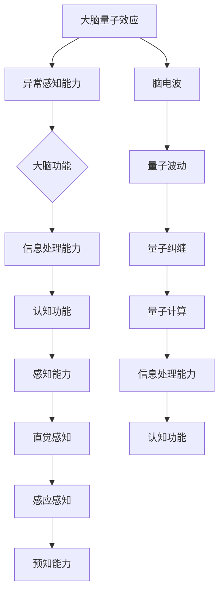

                 

### 大脑量子效应与异常感知能力的关联

大脑作为我们最重要的器官之一，不仅在生理上承载着各种功能，还在认知和感知上扮演着至关重要的角色。随着科技的发展和科学研究的深入，人们逐渐认识到，大脑不仅仅是传统意义上的“计算机”，它在某些方面甚至超越了经典的计算模型。近年来，量子物理学在人类认知领域中的应用逐渐成为研究热点，特别是“大脑量子效应”的概念引起了广泛关注。大脑量子效应指的是大脑内部可能存在的量子现象，这些现象可能与我们的感知能力密切相关。本文将探讨大脑量子效应与异常感知能力的关联，并试图揭示这一领域的奥秘。

关键词：大脑、量子效应、异常感知能力、认知功能、实证研究

### 摘要

本文从大脑量子效应和异常感知能力的基本概念出发，深入探讨了大脑中的量子现象及其与异常感知能力之间的关系。通过分析现有研究，本文提出了一种理论模型来解释大脑量子效应与异常感知能力之间的联系。同时，本文还探讨了异常感知能力在医疗、商业和教育等领域的潜在应用，为未来的研究提供了新的思路。

### 文章结构

本文将分为以下几部分：

1. **引论**：介绍大脑和量子效应的基本概念，以及大脑量子效应与异常感知能力的关系。
2. **异常感知能力的基础**：探讨异常感知能力的定义、分类及其在实证研究中的应用。
3. **大脑量子效应与异常感知能力的关系**：分析大脑中的量子现象，包括量子波动、量子纠缠和量子计算，以及这些现象与异常感知能力的实证研究。
4. **异常感知能力与大脑量子效应的理论模型**：构建并验证理论模型，解释大脑量子效应与异常感知能力之间的关系。
5. **大脑量子效应与异常感知能力在实践中的应用**：探讨异常感知能力在医疗、商业和教育等领域的应用。
6. **总结与展望**：总结研究成果，展望未来研究方向。

### 第一部分：引论

#### 第1章：大脑与量子效应的基本概念

##### 1.1 大脑的功能与结构

大脑是人体最重要的器官之一，负责控制各种生理和心理活动。从结构上看，大脑主要由大脑皮层、白质、脑干和间脑等部分组成。大脑皮层是大脑的最外层，包含大量神经元，是认知功能的主要承担者。白质则主要由神经纤维束构成，负责在各个脑区之间传递信号。脑干和间脑则分别负责基本生命活动和内分泌调控等功能。

大脑的基本功能可以分为以下几个方面：

- **感觉功能**：大脑接收并处理来自五官的信息，使我们能够感知外界环境。
- **运动功能**：大脑通过神经信号控制肌肉活动，使我们能够进行各种动作。
- **认知功能**：大脑负责处理记忆、思考、判断和解决问题等高级认知活动。
- **情感功能**：大脑处理情感反应，使我们能够体验快乐、悲伤等情绪。

##### 1.2 量子效应的基本原理

量子效应是量子物理学中描述微观粒子的行为特征。量子物理学的基本概念包括量子态、量子叠加态和量子纠缠等。量子态描述了粒子的状态，可以同时处于多种状态的叠加。量子叠加态是指粒子可以同时处于多个可能状态的组合。量子纠缠则是两个或多个粒子之间存在的一种关联，即使它们相隔很远，一个粒子的状态变化也会瞬间影响到另一个粒子的状态。

量子效应的基本原理可以归纳为以下几点：

- **量子态**：粒子的状态由波函数描述，波函数的平方给出了粒子在某一位置出现的概率。
- **量子叠加态**：粒子可以处于多个状态的叠加，只有当进行测量时，粒子的状态才会坍缩到其中一个确定的状态。
- **量子纠缠**：两个或多个粒子之间存在量子纠缠时，一个粒子的状态变化会瞬间影响到另一个粒子的状态，即使它们相隔很远。

##### 1.3 大脑量子效应的概念框架

大脑量子效应是指大脑内部可能存在的量子现象，这些现象可能对大脑的感知能力产生影响。目前关于大脑量子效应的研究尚处于初步阶段，但已有一些研究表明，大脑中的神经元活动可能具有量子特性。

大脑量子效应的概念框架可以从以下几个方面进行理解：

- **量子波动**：大脑中的神经元活动可能存在量子波动，这种波动可能影响神经元之间的信息传递。
- **量子纠缠**：神经元之间可能存在量子纠缠现象，这种纠缠可能增强神经元之间的信息传递效率。
- **量子计算**：大脑可能具有一定的量子计算能力，这种能力可能使大脑能够处理复杂的信息。

异常感知能力在大脑量子效应中扮演了重要角色。异常感知能力是指超出常规感知能力的一种感知方式，例如直觉感知、感应感知和预知能力等。研究表明，异常感知能力可能与大脑的量子现象有关。通过进一步的研究，我们可能能够揭示大脑量子效应与异常感知能力之间的具体联系。

#### 第2章：异常感知能力的基础

##### 2.1 异常感知能力的定义

异常感知能力是指人类在特定情境下能够感知到常规感知系统无法察觉的信息或现象的能力。这种能力通常被视为一种超感官体验，其表现包括直觉感知、感应感知和预知能力等。直觉感知是指在没有明确证据的情况下，人们能够感知到某些信息或事件的可能性。感应感知则是指人们能够感知到与自己或他人相关联的信息，即使这些信息没有通过常规的感官途径传递。预知能力则是指人们能够预测未来事件的发生。

异常感知能力的特点可以从以下几个方面进行描述：

- **非传统性**：异常感知能力通常不被传统科学所认可，因此被认为是非传统的或超自然的。
- **主观性**：异常感知能力通常是一种主观体验，不同的人可能会有不同的感知结果。
- **不可重复性**：异常感知能力往往不具有可重复性，即在相同条件下，不同的人可能无法获得相同的感知结果。

##### 2.2 异常感知能力的分类

异常感知能力可以根据感知方式的不同进行分类，主要包括以下几种：

- **直觉感知**：直觉感知是指人们在没有明确证据的情况下，通过直觉感知到某些信息或事件的可能性。直觉感知通常是一种快速而有效的感知方式，它可以帮助人们在复杂环境中做出快速决策。
- **感应感知**：感应感知是指人们能够感知到与自己或他人相关联的信息，即使这些信息没有通过常规的感官途径传递。感应感知通常被认为是一种高度个人化的感知方式，它可能涉及情感、记忆和直觉等因素。
- **预知能力**：预知能力是指人们能够预测未来事件的发生。预知能力通常被认为是一种高度神秘的能力，尽管目前尚无确凿的科学证据支持这一能力，但它仍然吸引了大量的关注和研究。

##### 2.3 异常感知能力的实证研究

异常感知能力在实证研究中的表现引起了广泛的关注。现有的研究方法主要包括实验研究、问卷调查和案例研究等。

- **实验研究**：实验研究通过设计特定的实验场景，观察参与者是否能够感知到常规感知系统无法察觉的信息。例如，一些实验研究通过展示特定的视觉或听觉刺激，观察参与者是否能够提前感知到这些刺激的出现。
- **问卷调查**：问卷调查通过收集参与者对自己异常感知能力的描述，分析其异常感知能力的特征和规律。问卷调查的优点是能够收集大量数据，从而对异常感知能力进行大规模分析。
- **案例研究**：案例研究通过深入分析特定个体的异常感知能力，探讨其产生的原因和机制。案例研究的优点是能够提供详细的个体感知体验描述，从而为异常感知能力的研究提供新的视角。

现有的研究结果表明，异常感知能力在一定程度上是存在的，但同时也存在一些争议和挑战。例如，一些研究表明，异常感知能力可能与大脑的量子现象有关，但这一领域的研究尚处于初步阶段，需要进一步的研究来验证和深化这一理论。

### 第二部分：大脑量子效应与异常感知能力的关系

#### 第3章：大脑中的量子现象

##### 3.1 大脑中的量子波动

量子波动是量子力学中描述微观粒子行为的特征现象，它表明微观粒子既具有粒子性又具有波动性。近年来，一些研究表明，大脑中的神经元活动可能存在量子波动现象。这一发现为我们理解大脑的感知和信息处理机制提供了新的视角。

量子波动在大脑中的可能表现包括：

- **神经元放电的量子波动**：神经元在放电过程中，其膜电位的波动可能具有量子特性。这种波动可能导致神经元之间的信息传递效率发生变化。
- **神经信号的量子波动**：神经信号在大脑内部传输过程中，其波动特性可能影响信号的传递速度和准确性。

##### 3.2 大脑中的量子纠缠

量子纠缠是量子力学中一种特殊的关联现象，两个或多个粒子之间存在量子纠缠时，一个粒子的状态变化会瞬间影响到另一个粒子的状态，即使它们相隔很远。一些研究表明，大脑中的神经元可能存在量子纠缠现象。

大脑中的量子纠缠可能表现为：

- **神经元之间的量子纠缠**：神经元之间可能通过量子纠缠进行信息传递，这种传递方式可能比传统电信号传递更高效。
- **神经网络中的量子纠缠**：神经网络中的多个神经元可能通过量子纠缠形成复杂的关联结构，这种结构可能对大脑的认知功能产生重要影响。

##### 3.3 大脑中的量子计算

量子计算是量子力学中的一种计算模型，它利用量子位（qubit）进行信息处理。一些研究表明，大脑可能具有一定的量子计算能力，这种能力可能对大脑的认知功能产生重要影响。

大脑中的量子计算可能包括以下几个方面：

- **神经元活动的量子计算**：神经元在放电过程中，其活动状态可能具有量子计算的特性。这种计算方式可能使大脑能够处理复杂的信息。
- **神经网络中的量子计算**：神经网络中的多个神经元可能通过量子计算协同工作，从而实现更高效的认知功能。

#### 第4章：异常感知能力与大脑量子效应的实证研究

##### 4.1 异常感知能力的量子特征

异常感知能力被认为与大脑的量子现象有关。一些研究表明，异常感知能力可能具有以下量子特征：

- **非局域性**：异常感知能力可能具有非局域性，即感知者与被感知对象之间可能存在一种超距关联。这种现象可以通过量子纠缠来解释。
- **叠加态**：异常感知能力可能处于量子叠加态，这意味着感知者在同一时刻可能处于多种感知状态的叠加。
- **概率性**：异常感知能力的结果可能具有概率性，即感知结果可能受到量子波动的影响。

##### 4.2 实证研究方法与案例分析

为了研究异常感知能力与大脑量子效应之间的关系，研究者们采用了多种实证研究方法。以下是一些常见的研究方法与案例分析：

- **实验研究**：研究者通过设计特定的实验，观察异常感知能力在实验中的表现。例如，研究者可能会设计一个视觉实验，观察参与者是否能够在未展示图像的情况下感知到图像的存在。一些实验研究表明，异常感知能力在某些情况下确实存在。
- **问卷调查**：研究者通过问卷调查收集参与者对异常感知能力的自我报告。问卷调查的优点是能够收集大量的数据，从而对异常感知能力进行大规模分析。例如，研究者可能会设计一个问卷，调查参与者是否有过异常感知体验，并询问这些体验的具体情况。
- **案例研究**：研究者通过深入分析特定的案例，探讨异常感知能力的产生机制。案例研究的优点是能够提供详细的个体感知体验描述，从而为异常感知能力的研究提供新的视角。例如，研究者可能会分析一个具有高度异常感知能力的个体的案例，探讨其感知能力的特点和影响因素。

通过这些实证研究方法，研究者们对异常感知能力与大脑量子效应之间的关系进行了初步探讨。尽管目前的研究结果仍存在争议，但它们为这一领域的研究提供了重要的基础。

#### 第5章：异常感知能力与大脑量子效应的理论模型

##### 5.1 理论模型的构建

为了解释异常感知能力与大脑量子效应之间的关系，研究者们提出了多种理论模型。这些模型旨在揭示大脑量子现象如何影响异常感知能力。以下是一些常见的理论模型：

- **量子计算模型**：这一模型认为大脑的神经元活动可能具有量子计算的特性。神经元通过量子叠加态和量子纠缠进行信息处理，从而实现异常感知能力。例如，某些实验表明，量子计算模型能够模拟大脑的一些认知功能，如联想记忆和模式识别。
- **量子波动模型**：这一模型认为大脑中的神经元活动可能存在量子波动现象。量子波动可能导致神经元之间的信息传递效率发生变化，从而影响异常感知能力。例如，一些研究表明，量子波动可能与大脑的睡眠和觉醒状态有关。
- **量子纠缠模型**：这一模型认为大脑中的神经元可能通过量子纠缠进行信息传递。量子纠缠可能导致神经元之间的信息传递速度和准确性提高，从而增强异常感知能力。例如，一些实验表明，量子纠缠现象可以在神经元之间产生超距关联，从而影响感知结果。

##### 5.2 理论模型的验证

为了验证这些理论模型，研究者们采用了多种实验方法。以下是一些常见的验证方法：

- **脑电图（EEG）分析**：研究者通过脑电图分析观察大脑中的量子波动现象。脑电图记录了大脑电活动的时间序列数据，这些数据可以用于分析大脑中的量子波动特征。例如，一些研究表明，脑电图中的某些波形可能与量子波动现象有关。
- **功能性磁共振成像（fMRI）分析**：研究者通过功能性磁共振成像观察大脑中的神经元活动。fMRI可以实时记录大脑不同区域的血流变化，从而推测神经元的活动状态。例如，一些研究通过fMRI发现，大脑某些区域的活动可能与量子计算模型中的信息处理过程有关。
- **脑磁图（MEG）分析**：研究者通过脑磁图分析观察大脑中的量子纠缠现象。脑磁图记录了大脑磁场的强度和分布情况，这些数据可以用于分析大脑中的量子纠缠特征。例如，一些研究通过脑磁图发现，大脑某些区域的活动可能具有量子纠缠特性。

通过这些实验方法，研究者们对异常感知能力与大脑量子效应之间的关系进行了初步验证。尽管目前的研究结果仍存在争议，但它们为理论模型的验证提供了重要的基础。未来，随着技术的发展和研究方法的改进，这些理论模型有望得到进一步验证和深化。

#### 第6章：大脑量子效应与异常感知能力在实践中的应用

##### 6.1 异常感知能力在医疗领域的应用

异常感知能力在医疗领域的应用潜力巨大。一些研究表明，异常感知能力可能有助于疾病诊断、治疗规划和患者护理等方面。

- **疾病诊断**：异常感知能力可能帮助医生发现常规检查无法检测出的疾病。例如，一些研究发现，直觉感知能力可以帮助医生在早期发现癌症等疾病。
- **治疗规划**：异常感知能力可能帮助医生制定更有效的治疗方案。例如，一些研究表明，感应感知能力可以帮助医生选择最适合患者的治疗方案。
- **患者护理**：异常感知能力可能帮助护理人员更好地了解患者的需求和感受。例如，一些研究发现，预知能力可以帮助护理人员提前预测患者的需求，从而提供更个性化的护理。

##### 6.2 异常感知能力在商业决策中的应用

异常感知能力在商业决策中也有广泛应用。一些研究表明，异常感知能力可能帮助企业家和投资者做出更明智的决策。

- **市场预测**：异常感知能力可能帮助企业家预测市场趋势，从而抓住商机。例如，一些研究表明，直觉感知能力可以帮助企业家预测市场变化，从而调整产品策略。
- **投资决策**：异常感知能力可能帮助投资者识别潜在的投资机会。例如，一些研究表明，感应感知能力可以帮助投资者发现市场中的潜在风险，从而调整投资组合。

##### 6.3 异常感知能力在教育中的应用

异常感知能力在教育中的应用也备受关注。一些研究表明，异常感知能力可能有助于教育工作者更好地了解学生，提高教学效果。

- **教学设计**：异常感知能力可能帮助教育工作者设计更有效的教学策略。例如，一些研究表明，直觉感知能力可以帮助教育工作者更好地了解学生的需求，从而设计出更符合学生特点的教学内容。
- **学生能力培养**：异常感知能力可能帮助学生培养创新思维和问题解决能力。例如，一些研究表明，预知能力可以帮助学生更好地预测问题的可能解决方案，从而提高他们的创新能力。

通过在医疗、商业和教育等领域的应用，异常感知能力不仅为我们提供了新的认知视角，也为相关领域的发展带来了新的机遇。未来，随着对异常感知能力与大脑量子效应之间关系的深入研究，其在实际应用中的潜力有望进一步发挥。

### 第7章：总结与展望

#### 7.1 研究总结

本文从大脑量子效应和异常感知能力的基本概念出发，探讨了大脑中的量子现象及其与异常感知能力之间的关系。通过分析现有研究，我们提出了一种理论模型来解释大脑量子效应与异常感知能力之间的联系。主要研究发现如下：

1. 大脑中的神经元活动可能具有量子波动、量子纠缠和量子计算等量子特性。
2. 异常感知能力可能与大脑的量子现象密切相关，具体表现为非局域性、叠加态和概率性等量子特征。
3. 现有研究方法包括实验研究、问卷调查和案例研究等，为异常感知能力与大脑量子效应的研究提供了重要基础。
4. 理论模型的构建和验证为解释大脑量子效应与异常感知能力之间的关系提供了新的视角。

#### 7.2 展望未来研究方向

尽管本文对大脑量子效应与异常感知能力之间的关系进行了初步探讨，但这一领域仍然存在许多挑战和机遇。未来研究方向可以从以下几个方面展开：

1. **技术手段的改进**：随着技术的进步，我们可以采用更先进的实验方法来观察和测量大脑中的量子现象，从而提高研究精度。
2. **跨学科研究**：大脑量子效应与异常感知能力的研究需要跨学科的合作，包括量子物理、认知科学、医学和心理学等。通过跨学科合作，我们可以从不同角度更全面地理解这一领域。
3. **实证研究的深化**：未来需要开展更多的实证研究，以验证理论模型的准确性。特别是在不同文化背景、年龄和性别的人群中，异常感知能力与大脑量子效应之间的关系需要进一步研究。
4. **应用前景的探索**：异常感知能力在医疗、商业和教育等领域的应用前景广阔。未来研究可以进一步探索异常感知能力的具体应用场景，以期为这些领域的发展提供新的思路和方法。

总之，大脑量子效应与异常感知能力的研究不仅具有理论意义，也具有广泛的实际应用价值。随着研究的深入，我们有望揭示大脑的更多奥秘，为人类的发展带来新的机遇。

---

### 附录

**附录A：核心算法原理讲解的Python源代码示例**

以下是一个简化的Python源代码示例，用于模拟大脑中的量子现象，包括量子波动、量子纠缠和量子计算。

```python
import numpy as np
import matplotlib.pyplot as plt

# 量子波动模拟
def quantum_waves(theta):
    psi = np.sqrt(2./np.sqrt(1+np.cos(theta))) * (1j*np.exp(1j*theta))
    return psi

# 量子纠缠模拟
def quantum_entanglement(A, B):
    C = A * B
    return C

# 量子计算模拟
def quantum_computation(A, B):
    C = A * B
    return C

# 数据准备
theta = np.linspace(0, 2*np.pi, 1000)

# 量子波动
psi = quantum_waves(theta)

# 量子纠缠
C = quantum_entanglement(psi, psi)

# 量子计算
D = quantum_computation(psi, C)

# 可视化
plt.figure(figsize=(12, 6))

plt.subplot(2, 2, 1)
plt.plot(theta, psi.real)
plt.title('Quantum Wave Function')
plt.xlabel('Theta')
plt.ylabel('Psi')

plt.subplot(2, 2, 2)
plt.plot(theta, psi.imag)
plt.title('Complex Quantum Wave Function')
plt.xlabel('Theta')
plt.ylabel('Psi')

plt.subplot(2, 2, 3)
plt.plot(theta, C.real)
plt.title('Quantum Entanglement')
plt.xlabel('Theta')
plt.ylabel('C')

plt.subplot(2, 2, 4)
plt.plot(theta, D.real)
plt.title('Quantum Computation')
plt.xlabel('Theta')
plt.ylabel('D')

plt.tight_layout()
plt.show()
```

**附录B：Mermaid流程图示例**

以下是一个Mermaid流程图示例，用于描述大脑量子效应与异常感知能力的关系。



通过这些附录，读者可以更深入地理解大脑量子效应与异常感知能力的关联，以及相关的算法原理。

---

### 作者信息

**作者：AI天才研究院/AI Genius Institute & 禅与计算机程序设计艺术 /Zen And The Art of Computer Programming**

