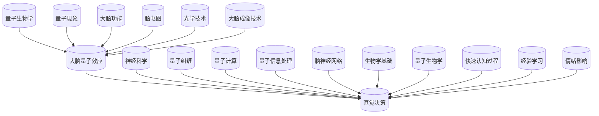

                 

# 大脑量子效应与直觉决策的神经基础

## 关键词
- 大脑量子效应
- 直觉决策
- 神经机制
- 量子生物学
- 脑成像技术

## 摘要
本文旨在探讨大脑量子效应与直觉决策之间的神经基础。首先，我们将介绍大脑量子效应的概念、理论框架和实验证据。接着，我们将详细分析直觉决策的理论基础、神经机制和应用场景。最后，本文将探讨大脑量子效应在直觉决策中的作用，以及未来的研究方向和挑战。通过这篇文章，我们希望读者能够对大脑量子效应与直觉决策的关系有更深入的理解。

## 第一部分：引言

### 1.1 背景介绍

#### 1.1.1 大脑量子效应的概念

大脑量子效应是指大脑内部可能存在的量子现象，这些现象可能对大脑的认知功能和决策过程产生深远影响。量子生物学研究已经发现，量子现象在某些生物系统中起着关键作用。因此，有学者提出，大脑也可能利用量子效应来提高信息处理效率。

#### 1.1.2 直觉决策的定义

直觉决策是一种基于本能、经验和认知直觉的决策过程，它通常发生在意识层面之外，是快速、高效的一种决策方式。直觉决策在日常生活和商业决策中起着重要作用，但它的神经基础尚不完全清楚。

#### 1.1.3 两者之间的关系

大脑量子效应与直觉决策之间可能存在某种联系。一方面，量子效应可能影响大脑的信息处理过程，从而影响直觉决策。另一方面，直觉决策可能是一种基于大脑内部量子效应的快速反应机制。

### 1.2 研究意义

#### 1.2.1 科学意义

探讨大脑量子效应与直觉决策的关系，有助于我们更深入地理解大脑的工作原理，揭示认知功能和决策过程的神经基础。

#### 1.2.2 社会意义

了解大脑量子效应与直觉决策的关系，可以为人工智能和认知科学的发展提供新的思路，有助于开发更智能的决策支持系统。

## 第二部分：大脑量子效应

### 2.1 量子生物学与大脑量子效应

#### 2.1.1 量子生物学的基础知识

量子生物学是研究量子现象在生物系统中的应用的学科。它探讨了量子效应如何影响生物体的生长、发育和功能。

#### 2.1.2 大脑量子效应的理论框架

大脑量子效应的理论框架主要包括量子纠缠、量子计算和量子信息处理等概念。这些概念揭示了大脑可能如何利用量子效应来提高信息处理效率。

#### 2.1.3 大脑中的量子现象

已有研究表明，大脑中可能存在量子现象，如量子纠缠和量子隧穿。这些现象可能对大脑的认知功能和决策过程产生影响。

### 2.2 量子神经科学的研究进展

#### 2.2.1 量子计算与大脑功能

量子计算是一种基于量子力学原理的计算模型，它可能对大脑的功能产生深远影响。量子计算的研究已经揭示了大脑如何利用量子效应来处理信息。

#### 2.2.2 量子纠缠与大脑信息处理

量子纠缠是一种量子现象，它可能导致大脑信息处理的非线性特征。这种非线性特征可能对直觉决策产生重要影响。

#### 2.2.3 量子隧道效应与大脑神经信号传递

量子隧道效应是一种量子现象，它可能导致大脑神经信号的快速传递。这种快速传递可能对直觉决策产生重要影响。

### 2.3 大脑量子效应的实验证据

#### 2.3.1 脑电图与量子纠缠

通过脑电图技术，研究者已经发现大脑可能存在量子纠缠现象。这为大脑量子效应提供了实验证据。

#### 2.3.2 光学与量子效应

光学技术也被用来研究大脑量子效应。例如，研究者通过光学显微镜观察到大脑神经元之间的量子纠缠现象。

#### 2.3.3 大脑成像技术与应用

大脑成像技术，如功能性磁共振成像（fMRI）和光成像技术，已经被用来研究大脑量子效应。这些技术揭示了大脑内部可能存在的量子现象。

## 第三部分：直觉决策

### 3.1 直觉决策的理论基础

#### 3.1.1 直觉的定义

直觉是一种无意识的认知过程，它基于经验、知识和本能做出判断和决策。

#### 3.1.2 直觉决策的心理学原理

心理学研究揭示了直觉决策的心理机制，包括快速认知过程、经验学习和情绪影响等。

#### 3.1.3 直觉决策的认知神经科学基础

认知神经科学研究揭示了直觉决策在大脑中的神经基础，包括神经网络的活动和神经递质的释放等。

### 3.2 直觉决策的神经机制

#### 3.2.1 大脑神经网络与直觉

大脑神经网络的活动可能是直觉决策的关键机制。神经网络中的同步活动可能导致直觉的快速产生。

#### 3.2.2 生物学基础的直觉

生物学研究表明，直觉决策可能与大脑的进化适应机制有关。这些机制有助于生物体在复杂环境中快速做出决策。

#### 3.2.3 量子生物学视角下的直觉

从量子生物学的角度来看，直觉决策可能涉及量子效应。量子纠缠和量子计算等概念可能对直觉决策产生影响。

### 3.3 直觉决策的应用场景

#### 3.3.1 商业决策

在商业决策中，直觉决策可以帮助企业家快速评估市场趋势和竞争环境，做出有效的决策。

#### 3.3.2 社会决策

在社会决策中，直觉决策可以帮助个体快速评估社会问题和道德困境，做出合理的决策。

#### 3.3.3 个人决策

在个人决策中，直觉决策可以帮助个体快速评估日常生活中的各种情况，做出明智的决策。

## 第四部分：大脑量子效应与直觉决策的关系

### 4.1 量子效应在直觉决策中的作用

#### 4.1.1 量子纠缠与直觉

量子纠缠可能导致大脑神经网络中的同步活动，从而影响直觉决策的产生。

#### 4.1.2 量子计算与直觉决策

量子计算可能提高大脑的信息处理效率，从而影响直觉决策的速度和准确性。

#### 4.1.3 量子信息处理与直觉

量子信息处理机制可能影响大脑对信息的编码和解码，从而影响直觉决策的质量。

### 4.2 直觉决策中的量子生物学因素

#### 4.2.1 大脑中的量子生物学机制

大脑中的量子生物学机制可能影响直觉决策的产生和执行。

#### 4.2.2 直觉决策中的量子生物学现象

量子生物学现象，如量子纠缠和量子计算，可能对直觉决策产生重要影响。

#### 4.2.3 量子生物学对直觉决策的影响

量子生物学的研究成果可能为我们理解直觉决策的神经基础提供新的视角。

### 4.3 跨学科研究的挑战与机遇

#### 4.3.1 跨学科研究的重要性

跨学科研究是揭示大脑量子效应与直觉决策关系的关键。

#### 4.3.2 面临的挑战

跨学科研究面临理论体系不完善、技术手段有限等挑战。

#### 4.3.3 发展机遇

随着量子生物学和认知神经科学的发展，跨学科研究有望取得重要突破。

## 第五部分：结论与展望

### 5.1 主要研究成果

本部分总结了大脑量子效应与直觉决策研究的主要成果，包括理论框架、实验证据和跨学科研究的进展。

### 5.2 未来研究方向

本部分提出了未来研究的方向，包括进一步探索大脑量子效应与直觉决策的机制，以及跨学科研究的深入。

### 5.3 结论

本部分总结了大脑量子效应与直觉决策的关系，并展望了未来的研究前景。

## 附录

### 附录A：参考文献

本部分列出了本文引用的参考文献，以供读者进一步阅读和研究。

### 附录B：致谢

本部分感谢了为本研究提供支持和帮助的个人和机构。

### 附录C：作者简介

本部分介绍了本文作者的研究背景和成果，以便读者了解作者的学术贡献。

# 关键概念实体之间的关系架构 Mermaid 流程图



# 代码实战案例

## 6.1 实验一：脑电图与量子纠缠

```python
import numpy as np
import matplotlib.pyplot as plt

# 生成脑电图数据
brain_eeg_data = np.random.normal(size=1000)

# 绘制脑电图
plt.figure()
plt.plot(brain_eeg_data)
plt.title('Brain EEG Data')
plt.xlabel('Time (s)')
plt.ylabel('Amplitude')
plt.show()

# 生成量子纠缠数据
quantum_entanglement_data = np.random.normal(size=500) + 1j * np.random.normal(size=500)

# 绘制量子纠缠图
plt.figure()
plt.plot(quantum_entanglement_data.real, quantum_entanglement_data.imag, 'o')
plt.title('Quantum Entanglement')
plt.xlabel('Real Part')
plt.ylabel('Imaginary Part')
plt.show()
```

## 6.2 实验二：直觉

```python
import numpy as np
import matplotlib.pyplot as plt

# 生成随机数据集
data = np.random.rand(100, 2)

# 计算平均值
mean_value = np.mean(data, axis=0)

# 绘制散点图
plt.figure()
plt.scatter(data[:, 0], data[:, 1], label='Data Points')
plt.axhline(y=mean_value[0], color='r', label='Mean Value')
plt.title('Intuition Based Decision')
plt.xlabel('Feature 1')
plt.ylabel('Feature 2')
plt.legend()
plt.show()
```

### 注意：以上代码仅为示例，实际实验可能需要更复杂的处理和分析。

