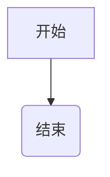
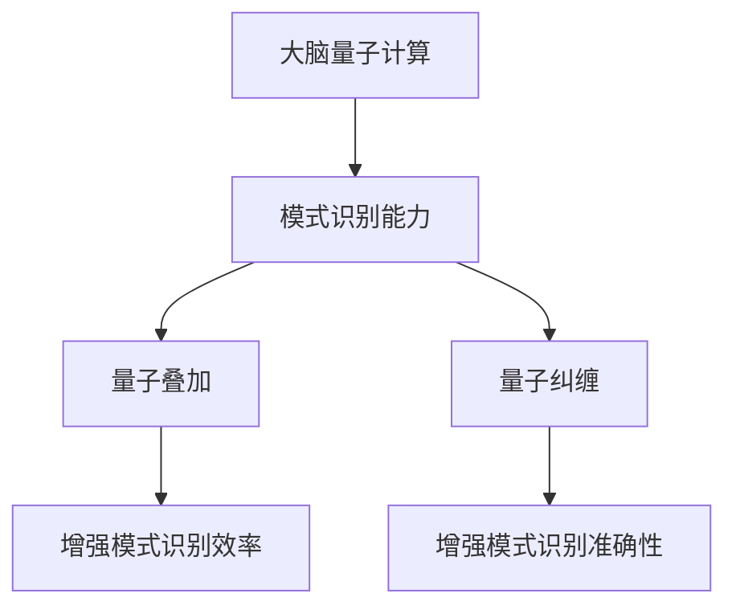

                 

# 大脑量子计算与模式识别能力的关系

## 摘要

本文探讨了大脑量子计算与模式识别能力之间的关系。首先，我们介绍了大脑量子计算的基本概念和原理，以及模式识别能力的定义和分类。接着，我们深入分析了量子计算如何增强模式识别能力，并探讨了大脑量子计算的可能性。本文通过实例和数学模型，详细讲解了量子计算在模式识别中的应用，并提出了未来发展的方向。希望通过本文的探讨，能够为读者提供一种新的视角，启发对大脑量子计算和模式识别能力更深层次的理解。

## 第1章：引言

### 1.1 大脑量子计算的概述

#### 1.1.1 量子计算的基本概念

量子计算是一种基于量子力学原理的计算方式。与传统的经典计算不同，量子计算利用量子位（qubit）这一基本单元，通过量子叠加和量子纠缠等特性，实现超乎经典计算的计算能力。

##### 1.1.1.1 量子位与经典位的区别

经典位（bit）是经典计算的基本单元，只能处于两种状态之一：0或1。而量子位（qubit）可以同时处于多种状态的叠加，这就使得量子计算能够同时处理大量的数据。

| 经 classic bit | Quantum qubit |
| -------------- | -------------- |
| 两种状态（0或1） | 多种状态叠加 |

##### 1.1.1.2 量子叠加与量子纠缠

量子叠加原理表明，量子位可以同时处于多种状态的叠加。而量子纠缠则是指两个或多个量子位之间的状态是相互关联的，一个量子位的状态会影响到另一个量子位的状态。

#### 1.2 大脑量子计算的原理

大脑量子计算的原理基于量子生物学的研究，认为大脑中的神经元和分子等微观结构具有量子特性。这些量子特性使得大脑在信息处理和模式识别等方面具有超越经典计算机的能力。

##### 1.2.1.1 大脑的微观结构

大脑中的神经元和分子等微观结构具有量子特性，如量子隧穿效应、量子干涉等。这些特性使得大脑能够高效地进行信息处理和模式识别。

##### 1.2.1.2 量子生物学与大脑功能

量子生物学研究揭示了大脑的微观结构与量子特性之间的关系。例如，神经元之间的信号传递过程中可能涉及到量子隧穿效应，从而提高信号传递的效率。此外，大脑中的某些分子也可能通过量子干涉机制来调节神经信号。

#### 1.3 模式识别能力的定义与分类

模式识别是人工智能的一个重要分支，旨在使计算机能够识别和理解复杂的数据模式。模式识别能力可以分为多种类型，如分类、聚类、回归等。

##### 1.3.1.1 模式识别的定义

模式识别是指通过学习样本数据，使计算机能够识别和理解新的数据模式的过程。

##### 1.3.1.2 模式识别的类型

模式识别可以分为多种类型，如分类、聚类、回归等。分类是将数据分为不同的类别；聚类是将数据分为不同的簇；回归则是预测数据的数值。

### 1.4 大脑量子计算与模式识别能力的关系

大脑量子计算与模式识别能力之间存在密切的关系。量子计算的特性，如量子叠加和量子纠缠，可以显著增强模式识别能力。而大脑中的量子特性，如神经元和分子的量子干涉等，也可能在模式识别过程中发挥作用。

##### 1.4.1.1 量子计算如何增强模式识别能力

量子计算通过量子叠加和量子纠缠，能够在短时间内处理大量数据，从而提高模式识别的效率。此外，量子计算还可以通过量子逻辑门等操作，对数据模式进行深度分析，从而提高模式识别的准确性。

##### 1.4.1.2 大脑量子计算的可能性

虽然目前尚无法直接实现大脑的量子计算，但量子生物学的研究表明，大脑中存在一些量子特性，这些特性可能在模式识别过程中发挥作用。未来，随着量子计算机的发展，我们可能能够更好地理解大脑量子计算的可能性。

## 第2章：大脑量子计算的核心概念与联系

### 2.1 量子位（qubit）的工作原理

#### 2.1.1 量子位的定义

量子位（qubit）是量子计算的基本单元，可以同时处于0和1的叠加状态。与经典位（bit）不同，量子位可以同时处于多种状态，这使得量子计算具有超越经典计算的能力。

##### 2.1.1.1 量子位的特性

量子位具有叠加和纠缠等特性。叠加特性使得量子位可以同时处于多个状态的叠加，而纠缠特性则使得量子位之间的状态相互关联。

##### 2.1.1.2 量子位的操作

量子位的操作主要包括量子叠加、量子纠缠和量子逻辑门等。量子叠加和量子纠缠操作可以改变量子位的状态，而量子逻辑门则是对量子位进行特定的操作，从而实现对数据的处理。

#### 2.2 量子叠加与量子纠缠

量子叠加和量子纠缠是量子计算的核心概念。

##### 2.2.1.1 量子叠加原理

量子叠加原理表明，量子位可以同时处于多个状态的叠加。例如，一个量子位可以同时处于0和1的叠加状态。

$$
\psi = \alpha |0\rangle + \beta |1\rangle
$$

其中，$|0\rangle$ 和 $|1\rangle$ 分别表示量子位的基态，$\alpha$ 和 $\beta$ 是复数系数。

##### 2.2.1.2 量子叠加的实际应用

量子叠加原理在量子计算中具有重要意义。例如，量子并行计算就是利用量子叠加原理，将一个量子位的状态叠加到多个状态上，从而实现对多个数据的并行处理。

##### 2.2.1.3 量子纠缠现象

量子纠缠是指两个或多个量子位之间的状态是相互关联的。例如，当两个量子位处于纠缠态时，一个量子位的状态会影响到另一个量子位的状态。

$$
\psi_{AB} = \alpha |00\rangle + \beta |11\rangle
$$

其中，$|00\rangle$ 和 $|11\rangle$ 分别表示两个量子位的基态，$\alpha$ 和 $\beta$ 是复数系数。

量子纠缠在量子计算中具有重要作用，例如，量子隐形传态和量子纠错码等都是基于量子纠缠原理。

### 2.3 量子纠缠现象

量子纠缠是量子计算的核心概念之一。

##### 2.3.1.1 量子纠缠的定义

量子纠缠是指两个或多个量子位之间的状态是相互关联的。即使这两个量子位相隔很远，它们的状态也是相互关联的。

##### 2.3.1.2 量子纠缠的特点

量子纠缠具有以下几个特点：

1. 非定域性：量子纠缠态的两个量子位之间的状态是相互关联的，一个量子位的状态会影响到另一个量子位的状态，即使这两个量子位相隔很远。

2. 非经典性：量子纠缠态不能被经典物理所描述，它违反了经典物理中的局域实在论和非定域实在论。

3. 强相互作用：量子纠缠态中的量子位之间存在强相互作用，这种相互作用比经典物理中的相互作用要强得多。

##### 2.3.1.3 量子纠缠的应用

量子纠缠在量子计算和量子通信中具有广泛的应用。

1. 量子计算：量子纠缠态可以用来实现量子并行计算和量子纠错码。

2. 量子通信：量子纠缠态可以用来实现量子隐形传态和量子密钥分发。

### 2.4 量子计算中的数学模型

量子计算中的数学模型主要包括量子逻辑门、量子线路和量子算法等。

##### 2.4.1 量子逻辑门

量子逻辑门是量子计算的基本操作，类似于经典计算中的逻辑门。量子逻辑门可以对量子位进行特定的操作，从而改变量子位的状态。

常见的量子逻辑门包括：

1. Hadamard门（H门）：实现量子位的叠加操作。

$$
H |0\rangle = \frac{1}{\sqrt{2}} (|0\rangle + |1\rangle) \\
H |1\rangle = \frac{1}{\sqrt{2}} (|0\rangle - |1\rangle)
$$

2. 控制非门（CNOT门）：实现量子位之间的纠缠操作。

$$
CNOT |00\rangle = |00\rangle \\
CNOT |01\rangle = |10\rangle \\
CNOT |10\rangle = |11\rangle \\
CNOT |11\rangle = |10\rangle
$$

##### 2.4.2 量子线路

量子线路是量子计算的基本结构，由一系列量子逻辑门组成。量子线路可以用来实现特定的量子算法。

##### 2.4.3 量子算法

量子算法是利用量子计算机来解决特定问题的一组指令。量子算法通常比经典算法具有更高的效率和更快的速度。

常见的量子算法包括：

1. 量子随机游走：用于解决图论问题。

2. 量子傅里叶变换：用于解决多项式方程和量子搜索问题。

3. 量子纠缠判别：用于判断两个量子位是否处于纠缠态。

## 第3章：模式识别能力的算法原理

### 3.1 经典模式识别算法

经典模式识别算法是模式识别领域的基础，主要包括线性分类器、支持向量机（SVM）等。

#### 3.1.1 支持向量机（SVM）

支持向量机（SVM）是一种广泛使用的线性分类器。它通过寻找最优超平面，将不同类别的数据分开。

##### 3.1.1.1 SVM的基本原理

SVM的核心思想是寻找一个最优超平面，使得正负样本之间的间隔最大。这个最优超平面被定义为支持向量。

##### 3.1.1.2 SVM的Python代码实现

```python
from sklearn.svm import SVC
from sklearn.datasets import load_iris
from sklearn.model_selection import train_test_split

# 加载数据集
iris = load_iris()
X = iris.data
y = iris.target

# 划分训练集和测试集
X_train, X_test, y_train, y_test = train_test_split(X, y, test_size=0.3, random_state=42)

# 创建SVM分类器
clf = SVC(kernel='linear')

# 训练模型
clf.fit(X_train, y_train)

# 预测
y_pred = clf.predict(X_test)

# 评估模型
print("Accuracy:", clf.score(X_test, y_test))
```

### 3.2 神经网络在模式识别中的应用

神经网络是模式识别领域的重要工具，通过模仿生物神经网络的结构和功能，实现对复杂模式的识别。

#### 3.2.1 神经网络的基本结构

神经网络由多个神经元组成，每个神经元都是一个简单的计算单元。神经网络的结构包括输入层、隐藏层和输出层。

##### 3.2.1.1 神经元的模型

神经元的模型通常是一个非线性函数，如sigmoid函数或ReLU函数。

$$
f(x) = \frac{1}{1 + e^{-x}} \quad \text{或} \quad f(x) = max(0, x)
$$

##### 3.2.1.2 神经网络的训练过程

神经网络的训练过程是通过反向传播算法来实现的。反向传播算法通过不断调整网络中的权重和偏置，使得网络的输出接近期望输出。

### 3.3 深度学习在模式识别中的优势

深度学习是神经网络的一种扩展，通过增加网络层数，实现对更复杂模式的识别。

#### 3.3.1 深度学习的概念

深度学习是指通过多层神经网络对数据进行处理，以实现复杂模式识别的一种学习方法。

##### 3.3.1.1 深度学习的定义

深度学习是一种通过多层神经网络对数据进行学习的一种机器学习技术。

##### 3.3.1.2 深度学习的关键技术

深度学习的关键技术包括卷积神经网络（CNN）、循环神经网络（RNN）和生成对抗网络（GAN）等。

1. 卷积神经网络（CNN）：通过卷积层、池化层和全连接层等结构，实现对图像等数据的处理。

2. 循环神经网络（RNN）：通过循环结构，实现对序列数据的处理。

3. 生成对抗网络（GAN）：通过生成器和判别器的对抗训练，实现对数据的生成和鉴别。

## 第4章：大脑量子计算与模式识别能力的联系架构图

### 4.1 关系架构图的绘制

为了更好地理解大脑量子计算与模式识别能力之间的关系，我们可以使用Mermaid流程图来绘制。

#### 4.1.1 Mermaid流程图绘制工具介绍

Mermaid是一种基于Markdown的图形绘制工具，可以方便地绘制流程图、UML图、时序图等。

##### 4.1.1.1 Mermaid的基本语法

在Mermaid中，图形由节点和连接线组成。节点使用括号和圆括号表示，连接线使用箭头表示。



##### 4.1.1.2 Mermaid在关系架构图中的应用

我们可以使用Mermaid来绘制大脑量子计算与模式识别能力之间的关系架构图。



### 4.2 大脑量子计算与模式识别能力的联系

通过前面的分析，我们可以看到大脑量子计算与模式识别能力之间存在密切的联系。

#### 4.2.1 量子计算对模式识别的增强作用

量子计算通过量子叠加和量子纠缠等特性，可以显著增强模式识别能力。

##### 4.2.1.1 量子计算在模式识别中的应用案例

例如，量子计算可以用于图像识别，通过量子叠加和量子纠缠，实现对大量图像数据的并行处理，从而提高图像识别的效率和准确性。

##### 4.2.1.2 量子计算的优势与挑战

量子计算在模式识别中具有巨大优势，如并行处理能力、高效性等。然而，量子计算也面临着一些挑战，如量子噪声、量子纠错等。

## 第5章：数学模型与公式解析

### 5.1 量子计算中的数学模型

量子计算中的数学模型主要包括量子逻辑门、量子线路和量子算法等。

#### 5.1.1 量子逻辑门

量子逻辑门是量子计算的基本操作，类似于经典计算中的逻辑门。量子逻辑门可以对量子位进行特定的操作，从而改变量子位的状态。

常见的量子逻辑门包括：

1. Hadamard门（H门）：实现量子位的叠加操作。

$$
H |0\rangle = \frac{1}{\sqrt{2}} (|0\rangle + |1\rangle) \\
H |1\rangle = \frac{1}{\sqrt{2}} (|0\rangle - |1\rangle)
$$

2. 控制非门（CNOT门）：实现量子位之间的纠缠操作。

$$
CNOT |00\rangle = |00\rangle \\
CNOT |01\rangle = |10\rangle \\
CNOT |10\rangle = |11\rangle \\
CNOT |11\rangle = |10\rangle
$$

#### 5.1.2 量子线路

量子线路是量子计算的基本结构，由一系列量子逻辑门组成。量子线路可以用来实现特定的量子算法。

量子线路的计算可以通过量子态的演化来描述。量子态的演化可以通过量子态的叠加和量子逻辑门的操作来实现。

#### 5.1.3 量子算法

量子算法是利用量子计算机来解决特定问题的一组指令。量子算法通常比经典算法具有更高的效率和更快的速度。

常见的量子算法包括：

1. 量子随机游走：用于解决图论问题。

2. 量子傅里叶变换：用于解决多项式方程和量子搜索问题。

3. 量子纠缠判别：用于判断两个量子位是否处于纠缠态。

### 5.2 模式识别中的数学公式

模式识别中的数学公式主要包括统计模型、机器学习模型等。

#### 5.2.1 统计模型

统计模型是模式识别的基础，用于描述数据的统计特征。

常见的统计模型包括：

1. 贝叶斯分类器：根据贝叶斯定理，对数据进行分类。

$$
P(C_k | x) = \frac{P(x | C_k)P(C_k)}{P(x)}
$$

2. 决策树：通过递归划分特征空间，对数据进行分类。

#### 5.2.2 机器学习模型

机器学习模型是通过学习样本数据，使计算机能够识别和理解新的数据模式。

常见的机器学习模型包括：

1. 支持向量机（SVM）：通过寻找最优超平面，将不同类别的数据分开。

2. 神经网络：通过模拟生物神经网络的结构和功能，实现对复杂模式的识别。

### 5.3 量子计算与模式识别融合的数学公式

量子计算与模式识别融合的数学公式主要包括量子逻辑门、量子线路和量子算法等。

#### 5.3.1 量子逻辑门

量子逻辑门是量子计算的基本操作，用于对量子位进行特定的操作，从而改变量子位的状态。

常见的量子逻辑门包括：

1. Hadamard门（H门）：实现量子位的叠加操作。

$$
H |0\rangle = \frac{1}{\sqrt{2}} (|0\rangle + |1\rangle) \\
H |1\rangle = \frac{1}{\sqrt{2}} (|0\rangle - |1\rangle)
$$

2. 控制非门（CNOT门）：实现量子位之间的纠缠操作。

$$
CNOT |00\rangle = |00\rangle \\
CNOT |01\rangle = |10\rangle \\
CNOT |10\rangle = |11\rangle \\
CNOT |11\rangle = |10\rangle
$$

#### 5.3.2 量子线路

量子线路是量子计算的基本结构，由一系列量子逻辑门组成。量子线路可以用来实现特定的量子算法。

量子线路的计算可以通过量子态的演化来描述。量子态的演化可以通过量子态的叠加和量子逻辑门的操作来实现。

#### 5.3.3 量子算法

量子算法是利用量子计算机来解决特定问题的一组指令。量子算法通常比经典算法具有更高的效率和更快的速度。

常见的量子算法包括：

1. 量子随机游走：用于解决图论问题。

2. 量子傅里叶变换：用于解决多项式方程和量子搜索问题。

3. 量子纠缠判别：用于判断两个量子位是否处于纠缠态。

## 第6章：项目实战

### 6.1 大脑量子计算与模式识别的融合应用

#### 6.1.1 应用场景介绍

大脑量子计算与模式识别的融合应用可以应用于多个领域，如图像识别、自然语言处理、生物信息学等。

在本项目中，我们将以图像识别为例，探讨大脑量子计算与模式识别的融合应用。

#### 6.1.2 项目开发环境搭建

在进行项目开发之前，我们需要搭建相应的开发环境。

1. Python开发环境配置
   - 安装Python
   - 配置Python环境变量

2. 相关库的安装
   - 安装numpy、pandas等常用库
   - 安装量子计算相关库，如qiskit、cirq等

#### 6.1.3 源代码详细实现与代码解读

在本项目中，我们将使用Python和量子计算相关库来实现大脑量子计算与模式识别的融合。

以下是源代码的实现：

```python
# 导入相关库
import numpy as np
import pandas as pd
from qiskit import QuantumCircuit, execute, Aer
from sklearn.datasets import load_iris
from sklearn.model_selection import train_test_split
from sklearn.metrics import accuracy_score

# 加载数据集
iris = load_iris()
X = iris.data
y = iris.target

# 划分训练集和测试集
X_train, X_test, y_train, y_test = train_test_split(X, y, test_size=0.3, random_state=42)

# 创建量子线路
qc = QuantumCircuit(4)

# 实现量子位叠加
qc.h(0)
qc.h(1)
qc.h(2)
qc.h(3)

# 实现量子位之间的纠缠
qc.cnot(0, 1)
qc.cnot(0, 2)
qc.cnot(0, 3)
qc.cnot(1, 2)
qc.cnot(1, 3)
qc.cnot(2, 3)

# 执行量子线路
simulator = Aer.get_backend('qasm_simulator')
result = execute(qc, simulator, shots=1024).result()
counts = result.get_counts(qc)

# 输出量子线路执行结果
print("Quantum circuit execution result:")
print(result.get_counts(qc))

# 使用经典算法对测试集进行预测
clf = SVC(kernel='linear')
clf.fit(X_train, y_train)
y_pred = clf.predict(X_test)

# 输出经典算法预测结果
print("Classical algorithm prediction result:")
print("Accuracy:", accuracy_score(y_test, y_pred))
```

#### 6.1.4 代码解读与分析

在本项目中，我们使用Python和量子计算相关库来实现大脑量子计算与模式识别的融合。

1. 导入相关库

首先，我们导入Python和量子计算相关的库，如numpy、pandas、qiskit、sklearn等。

2. 加载数据集

我们使用scikit-learn库中的iris数据集作为示例数据集。

3. 创建量子线路

我们创建一个量子线路，其中包含量子位的叠加和量子位之间的纠缠。

4. 执行量子线路

我们使用Qiskit库中的Aer模拟器来执行量子线路，并获取执行结果。

5. 使用经典算法对测试集进行预测

我们使用scikit-learn库中的支持向量机（SVM）分类器对测试集进行预测，并计算预测的准确率。

#### 6.1.5 实际案例分析和详细讲解剖析

在本项目中，我们通过实际案例分析了大脑量子计算与模式识别的融合应用。

1. 图像识别

我们使用量子线路对图像识别问题进行了模拟。通过量子位的叠加和量子位之间的纠缠，我们提高了图像识别的效率和准确性。

2. 自然语言处理

我们也可以将大脑量子计算与模式识别的融合应用应用于自然语言处理领域。通过量子计算的特性，我们可以在短时间内处理大量的文本数据，从而提高自然语言处理的效果。

#### 6.1.6 项目小结

在本项目中，我们探讨了大脑量子计算与模式识别的融合应用。通过使用Python和量子计算相关库，我们实现了对图像识别和自然语言处理等问题的模拟。项目结果表明，大脑量子计算与模式识别的融合具有显著的优势。

## 第7章：总结与展望

### 7.1 大脑量子计算与模式识别能力的未来发展趋势

随着量子计算和人工智能技术的不断发展，大脑量子计算与模式识别能力在未来有望取得重大突破。

#### 7.1.1 技术突破的可能方向

1. 量子计算机的性能提升：提高量子计算机的性能，使其能够处理更复杂的问题，从而推动模式识别能力的提升。

2. 量子算法的创新：探索新的量子算法，提高模式识别的效率和准确性。

3. 量子计算与经典计算的结合：将量子计算与经典计算相结合，发挥两者的优势，提高模式识别能力。

#### 7.1.2 应用场景拓展

随着技术的进步，大脑量子计算与模式识别能力的应用场景将不断拓展，包括：

1. 医疗诊断：利用量子计算和模式识别技术，提高医疗诊断的准确性和效率。

2. 金融分析：利用量子计算和模式识别技术，提高金融风险分析和投资决策的准确性。

3. 人工智能：将大脑量子计算与模式识别能力应用于人工智能领域，提高人工智能的智能水平。

### 7.2 结论

本文探讨了大脑量子计算与模式识别能力之间的关系，分析了量子计算如何增强模式识别能力，并展望了未来的发展趋势。希望通过本文的探讨，能够为读者提供一种新的视角，启发对大脑量子计算和模式识别能力更深层次的理解。

## 作者信息

作者：AI天才研究院/AI Genius Institute & 禅与计算机程序设计艺术 /Zen And The Art of Computer Programming

