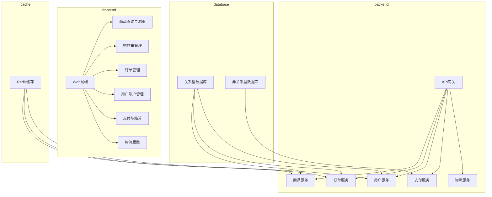
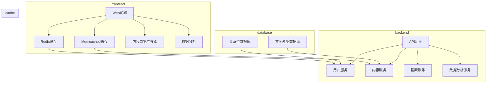
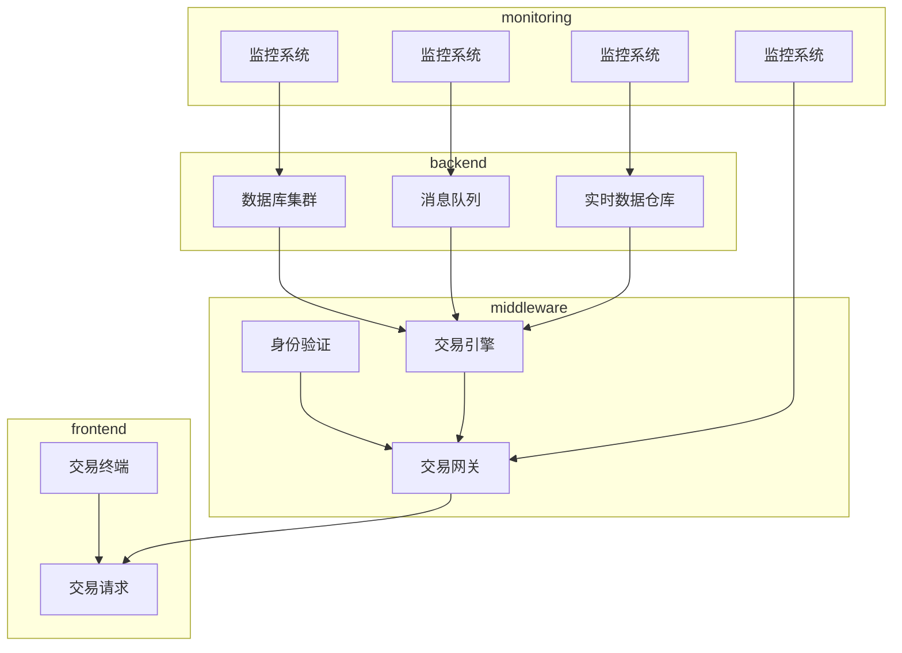

                 

### 目录结构说明

《大规模系统设计：P9架构师的必备技能》一书的设计旨在为读者提供一个全面、系统且深入的大规模系统设计知识和实战经验。目录结构清晰，每一部分都针对不同的系统设计主题，确保读者能够循序渐进地学习和掌握相关内容。

## 第一部分：大规模系统设计基础

这部分内容为大规模系统设计打下了坚实的基础。通过第1章的概述，读者可以了解大规模系统的定义、挑战以及P9架构师的角色和职责。第2章详细介绍了分布式系统的原理，包括数据一致性模型、分布式事务处理和分布式系统的容错机制，这些都是构建大规模系统不可或缺的基石。

## 第二部分：大规模系统核心组件设计

本部分深入探讨了大规模系统中的核心组件设计。第4章数据存储系统设计涵盖了关系型数据库、非关系型数据库以及分布式存储系统的设计。第5章则从高性能计算的角度出发，讲解了CPU架构、存储和网络的优化策略。第6章则聚焦于大规模数据处理系统设计，介绍了流处理、批处理和实时数据处理等关键技术。

## 第三部分：大规模系统优化与监控

系统优化和监控是保持大规模系统高效运行的关键。第7章介绍了系统性能优化策略、负载均衡、缓存机制以及系统调优案例分析。第8章则从系统监控与告警的角度，阐述了系统监控的重要性、监控工具与技术、告警策略与流程以及监控数据可视化。

## 第四部分：大规模系统实战案例

本部分通过三个实战案例，展示了如何将前面的理论知识应用于实际项目。第9章中的案例涵盖了电商平台、社交媒体平台和金融交易系统，为读者提供了丰富的实战经验和启发。

## 第五部分：大规模系统设计展望

最后一部分是对大规模系统设计领域的展望，讨论了大规模系统设计的发展趋势、新技术对未来系统设计的影响，以及P9架构师的持续成长路径。

通过这样的目录结构，读者可以从基础理论学习到实际操作，逐步构建自己的大规模系统设计能力。每一章的内容都经过精心设计，确保读者能够掌握核心概念和技能，为成为一名顶尖的P9架构师做好准备。

### 第1章：大规模系统设计概述

#### 1.1 大规模系统的定义与挑战

**大规模系统**，通常指的是那些服务于大量用户、处理海量数据、具备高度可扩展性和高可用性的系统。这类系统在当今数字化时代无处不在，从电子商务平台到社交媒体，再到金融交易系统，都是大规模系统的典型应用场景。它们之所以受到广泛关注，是因为它们不仅代表了技术的高度集成，也反映了现代企业对效率和用户体验的极致追求。

**定义**：大规模系统通常具有以下几个关键特征：
- **高并发性**：能够同时处理大量用户请求。
- **海量数据处理**：能够存储和处理海量数据。
- **高可用性**：系统稳定运行，故障率极低。
- **高可扩展性**：随着业务需求的增长，系统能够无缝扩展。

**挑战**：然而，构建和维护大规模系统并非易事，它们面临如下挑战：

1. **系统复杂性**：大规模系统通常由多个子系统和模块组成，这些组件之间需要紧密协作，导致系统复杂性大幅增加。
2. **数据一致性**：在分布式环境下，如何保证数据的一致性是一个重大挑战。
3. **容错性与可用性**：如何确保系统在面临故障时依然能够保持可用性，是大规模系统设计的关键难题。
4. **性能优化**：如何在高并发情况下保持系统性能，是一个持续的挑战。
5. **运维与监控**：大规模系统的运维和监控需要复杂且高效的工具和方法。

#### 1.2 P9架构师的角色与职责

**P9架构师**，是指那些在技术领域拥有卓越能力，能够带领团队设计和实现复杂大规模系统的顶尖技术专家。他们不仅需要深厚的计算机科学背景，还需要具备卓越的系统设计能力、项目管理能力和团队协作能力。

**角色**：
- **技术领导者**：负责制定系统的技术战略和方向，引领团队技术创新。
- **架构设计者**：负责系统整体架构的设计和优化，确保系统能够满足业务需求。
- **问题解决者**：面对系统中的复杂问题和挑战，能够迅速定位并解决问题。
- **团队导师**：指导团队成员成长，提升团队的技术水平和协作效率。

**职责**：
- **技术选型**：选择合适的技术栈和工具，确保系统的高效和可扩展性。
- **系统架构设计**：设计系统的整体架构，确保系统的可靠性、性能和可维护性。
- **风险管理**：识别和评估系统风险，制定相应的风险控制措施。
- **项目管理**：协调项目进度，确保项目按时按质完成。
- **团队建设**：培养和带领团队，提升团队整体技术实力。

#### 1.3 大规模系统设计的目标

**大规模系统设计的目标**主要包括以下几个方面：

1. **高效性**：系统要能够高效地处理海量数据和高并发请求，提供快速、稳定的响应。
2. **可靠性**：系统要具备高可用性和容错性，能够在面对故障和异常情况下保持稳定运行。
3. **可扩展性**：系统能够随着业务需求的增长而无缝扩展，保证资源利用率和性能。
4. **可维护性**：系统设计要简洁、模块化，便于维护和升级。
5. **安全性**：确保系统的数据安全和用户隐私。

通过明确大规模系统设计的目标，P9架构师能够更加清晰地规划系统设计和实现的方向，确保系统能够满足业务需求和用户期望。

### 第2章：分布式系统原理

#### 2.1 分布式系统基础

分布式系统是由多个独立计算节点组成的系统，这些节点通过网络连接，共同完成计算任务。分布式系统的核心思想是将任务分解成多个子任务，分布到不同的计算节点上执行，以实现高性能和可扩展性。

**定义与特点**：

- **定义**：分布式系统是一种通过网络连接的计算机节点组成的系统，节点之间通过通信协议协同工作，共同完成计算任务。
- **特点**：
  - **并行处理**：分布式系统可以利用多个计算节点的并行处理能力，提高系统的处理速度。
  - **高可用性**：分布式系统通过节点冗余和故障转移机制，提高系统的可用性和容错性。
  - **可扩展性**：分布式系统可以根据需求动态地增加或减少计算节点，实现系统的弹性扩展。
  - **高可靠性**：分布式系统通过数据复制和故障检测机制，保证数据的一致性和系统的稳定性。

**基本架构**：

分布式系统通常包含以下几个基本组件：

- **计算节点**：执行具体计算任务的节点，可以是物理服务器或虚拟机。
- **通信网络**：连接各个计算节点的网络，负责数据传输和节点间的通信。
- **协调器**：负责任务调度、负载均衡和故障管理，如分布式调度器、负载均衡器等。
- **数据存储**：分布式系统中的数据存储，可以是分布式文件系统、数据库或缓存系统。

**分类与类型**：

分布式系统可以根据不同的分类标准进行分类：

- **按数据一致性模型**：可以分为强一致性模型和最终一致性模型。
- **按计算模型**：可以分为计算密集型、存储密集型和I/O密集型。
- **按拓扑结构**：可以分为基于环、树、网状等拓扑结构的分布式系统。

#### 2.2 数据一致性模型

数据一致性是指系统中各个副本的数据保持一致的状态。在分布式系统中，由于数据分布在多个节点上，如何保证数据一致性成为了一个重要问题。常见的数据一致性模型包括强一致性模型和最终一致性模型。

**强一致性模型**：

强一致性模型要求系统在任意时刻都能访问到最新的、一致的数据状态。这种模型通常通过数据复制和同步机制来实现。

- **特点**：
  - **数据一致性**：强一致性保证了系统的数据在任何时候都是一致的。
  - **响应时间**：由于需要同步数据，系统的响应时间可能较长。

- **应用场景**：
  - 对一致性要求非常高的系统，如银行交易系统、股票交易系统等。

**最终一致性模型**：

最终一致性模型允许系统在一段时间内访问到旧的数据状态，但最终会达到一致状态。这种模型通过事件日志或事件溯源机制来实现。

- **特点**：
  - **数据最终一致性**：系统在一段时间后会达到一致性状态，但中间可能会出现不一致情况。
  - **响应时间**：由于不需要同步数据，系统的响应时间较短。

- **应用场景**：
  - 对一致性要求相对较低的系统，如社交媒体、电商系统等。

**数据一致性模型对比表格**：

| 模型           | 特点                                         | 应用场景                           |
|----------------|--------------------------------------------|------------------------------------|
| 强一致性模型   | 数据在任何时刻都是一致的                     | 银行交易系统、股票交易系统等       |
| 最终一致性模型 | 数据在一段时间后会达到一致性状态             | 社交媒体、电商系统等               |

#### 2.3 分布式事务处理

分布式事务处理是指在一个分布式系统中，如何确保多个操作（事务）原子性地执行。分布式事务处理面临的主要挑战包括数据的一致性和故障恢复。

**两阶段提交（2PC）协议**：

两阶段提交是一种分布式事务处理的协议，它将事务的提交过程分为两个阶段：投票阶段和提交阶段。

- **阶段一**：协调者向参与者发送预提交请求，参与者根据本地日志判断是否可以执行提交操作，并将结果反馈给协调者。
- **阶段二**：协调者根据参与者的反馈决定是否执行提交操作。如果所有参与者都同意提交，协调者向所有参与者发送提交请求；如果有参与者不同意提交，协调者向所有参与者发送回滚请求。

**三阶段提交（3PC）协议**：

三阶段提交是对两阶段提交的改进，它通过引入超时机制来提高系统的可用性和容错性。

- **阶段一**：协调者向参与者发送预提交请求，参与者根据本地日志判断是否可以执行提交操作，并将结果反馈给协调者。
- **阶段二**：协调者根据参与者的反馈决定是否进入提交阶段。如果所有参与者都同意提交，协调者向参与者发送提交请求；如果有参与者不同意提交，协调者进入撤销阶段，向参与者发送回滚请求。
- **阶段三**：参与者根据协调者的请求执行提交或回滚操作。

**分布式事务处理对比表格**：

| 协议         | 特点                                           | 优点                                | 缺点                                |
|--------------|--------------------------------------------|------------------------------------|------------------------------------|
| 两阶段提交   | 传统的分布式事务处理协议                     | 简单、易实现                       | 可能造成死锁、性能瓶颈             |
| 三阶段提交   | 对两阶段提交的改进，引入超时机制             | 提高系统可用性和容错性             | 可能造成网络风暴、性能影响         |

#### 2.4 分布式系统容错机制

分布式系统的容错机制是为了应对节点故障和系统异常情况，保证系统的高可用性和稳定性。常见的容错机制包括数据冗余、故障检测和故障恢复。

**数据冗余**：

数据冗余是指通过复制数据来提高系统的容错能力。常见的数据冗余策略有：

- **副本复制**：在多个节点上保存数据的多个副本，确保在节点故障时，其他节点可以继续提供服务。
- **数据分片**：将数据分成多个片段，分布在不同的节点上，提高数据的可用性和查询效率。

**故障检测**：

故障检测是指系统定期检查节点的状态，检测是否存在故障。常见的故障检测方法有：

- **心跳检测**：节点定期发送心跳信号，其他节点根据心跳信号的接收情况判断节点是否正常。
- **健康检查**：系统定期执行健康检查，检测节点的各项性能指标，判断节点是否正常工作。

**故障恢复**：

故障恢复是指系统在检测到节点故障后，采取措施将故障节点替换掉，确保系统继续提供服务。常见的故障恢复方法有：

- **故障转移**：在主节点发生故障时，将主节点的任务转移到备份节点，确保系统继续提供服务。
- **节点重启**：在节点故障后，重新启动节点，使其恢复正常工作。

**分布式系统容错机制对比表格**：

| 机制       | 特点                             | 优点                              | 缺点                          |
|------------|--------------------------------|----------------------------------|------------------------------|
| 数据冗余   | 通过复制数据提高容错能力       | 提高数据可用性和查询效率         | 增加存储和带宽消耗            |
| 故障检测   | 定期检查节点状态，检测故障     | 提高系统可用性和稳定性           | 增加系统复杂性和维护成本      |
| 故障恢复   | 在节点故障后采取措施恢复       | 确保系统继续提供服务             | 可能影响系统性能和响应时间    |

通过上述对分布式系统原理的介绍，我们可以看到分布式系统设计涉及多个方面，包括基础架构、数据一致性、事务处理和容错机制。理解这些原理和机制对于P9架构师来说至关重要，他们需要将这些理论应用到实际项目中，确保大规模系统的可靠性和高性能。

### 第3章：微服务架构设计

#### 3.1 微服务的定义与优势

微服务架构是一种基于组件的分布式系统设计方法，其核心思想是将大型单体应用分解为多个独立的、小型、自治的服务。每个服务负责完成特定的业务功能，并且可以通过轻量级的通信协议（如HTTP/REST、gRPC等）进行交互。

**定义**：

微服务架构（Microservices Architecture）是一种将应用程序构建为一组小型、独立的服务的方法。每个服务都是完全自治的，可以独立部署、扩展和升级。

**优势**：

1. **高可扩展性**：微服务架构允许单个服务独立扩展，可以根据实际需求调整资源分配，提高系统的整体性能。
2. **高可用性**：由于每个服务都是独立的，单个服务的故障不会影响整个系统的运行，提高了系统的容错性和可用性。
3. **快速迭代**：微服务架构支持快速开发和部署，每个服务都可以独立开发和迭代，缩短了发布周期。
4. **技术多样性**：不同的服务可以采用不同的技术栈，例如前端、后端、数据库等，提高了系统的灵活性和适应性。
5. **松耦合**：服务之间通过轻量级的通信协议进行交互，降低了服务的耦合度，提高了系统的可维护性和可扩展性。

**与传统单体架构的比较**：

| 特点            | 微服务架构       | 传统单体架构       |
|-----------------|-----------------|-----------------|
| 系统规模        | 小型、独立服务   | 大型、整体系统   |
| 扩展性          | 高度可扩展       | 固定扩展性       |
| 容错性          | 高可用性         | 低可用性         |
| 开发与部署      | 快速迭代         | 较慢的迭代        |
| 技术栈          | 多样性           | 单一性           |
| 耦合度          | 松耦合           | 紧耦合           |

#### 3.2 微服务架构设计原则

微服务架构设计需要遵循一系列原则，以确保系统的高效性和可维护性。以下是一些核心原则：

1. **自治性**：每个微服务应该独立运行，拥有自己的数据存储、配置和管理，以便能够独立部署和扩展。
2. **服务拆分**：服务应该根据业务功能进行拆分，每个服务应聚焦于完成一个明确的业务功能。
3. **服务通信**：服务之间通过轻量级通信协议（如HTTP/REST、gRPC）进行通信，降低耦合度。
4. **状态管理**：服务应尽量减少共享状态，每个服务应独立管理自己的状态。
5. **可复用性**：服务设计应考虑可复用性，减少重复代码和功能。
6. **可测试性**：服务应具备良好的可测试性，以便进行单元测试和集成测试。
7. **安全性**：服务之间应通过安全协议（如SSL/TLS）进行通信，确保数据传输的安全。
8. **监控与日志**：服务应具备良好的监控和日志记录功能，以便进行故障排查和性能优化。

**自治性**：

自治性是微服务架构的核心原则之一。每个微服务应该拥有独立的数据库、配置文件和依赖项，以便能够独立部署和升级。这种自治性确保了服务之间的松耦合，提高了系统的可靠性和可维护性。

**服务拆分**：

服务拆分是微服务架构设计的核心。服务应该根据业务功能进行拆分，每个服务应具有明确的职责和边界。常见的拆分方法包括：

- **功能拆分**：根据业务功能将应用拆分成多个服务，每个服务负责一个特定的业务功能。
- **用户角色拆分**：根据不同的用户角色和业务流程将应用拆分成多个服务，每个服务为特定用户角色提供服务。
- **业务域拆分**：根据业务领域将应用拆分成多个服务，每个服务负责一个特定的业务领域。

**服务通信**：

服务之间的通信是微服务架构设计的关键。服务通过轻量级的通信协议（如HTTP/REST、gRPC）进行通信。这种通信方式具有以下几个优点：

- **低耦合**：服务之间通过API进行通信，降低了服务之间的耦合度。
- **灵活性**：支持多种通信协议和消息中间件，提高了系统的灵活性。
- **可扩展性**：服务可以独立扩展，不需要修改其他服务的代码。

**状态管理**：

在微服务架构中，状态管理是一个重要但复杂的问题。由于每个服务都是独立的，它们应该尽量减少共享状态。以下是一些常见的状态管理策略：

- **无状态服务**：服务不应存储任何用户会话或状态信息，所有状态信息都应存储在独立的存储系统中。
- **有限状态服务**：服务可以存储有限的状态信息，但应尽量避免复杂的共享状态。
- **分布式缓存**：使用分布式缓存（如Redis、Memcached）存储会话和临时状态信息，提高系统的性能和可扩展性。

**可复用性**：

可复用性是提高开发效率和系统质量的重要原则。在微服务架构中，服务设计应考虑可复用性，避免重复代码和功能。以下是一些实现可复用性的方法：

- **通用服务**：设计通用服务，为多个业务场景提供支持。
- **服务组合**：通过组合多个服务实现更复杂的业务功能。
- **设计模式**：使用设计模式（如工厂模式、策略模式等）提高服务的可复用性。

**可测试性**：

可测试性是确保服务质量和开发效率的重要保障。在微服务架构中，服务应具备良好的可测试性，以便进行单元测试和集成测试。以下是一些提高可测试性的方法：

- **服务隔离**：通过隔离服务（如使用容器技术）提高服务的测试独立性。
- **自动化测试**：编写自动化测试脚本，进行持续集成和部署。
- **接口测试**：使用接口测试工具（如Postman、JMeter）进行服务接口测试。

**安全性**：

安全性是微服务架构设计的重要方面。服务之间应通过安全协议（如SSL/TLS）进行通信，确保数据传输的安全。以下是一些提高安全性的方法：

- **身份验证**：使用身份验证机制（如OAuth、JWT）确保服务访问的安全性。
- **访问控制**：实施访问控制策略，确保服务访问权限的正确性和安全性。
- **数据加密**：对敏感数据进行加密存储和传输，确保数据的安全性。

**监控与日志**：

监控与日志是确保系统正常运行和快速故障排查的重要手段。在微服务架构中，服务应具备良好的监控和日志记录功能。以下是一些监控与日志的方法：

- **集中式监控**：使用集中式监控工具（如Prometheus、Grafana）进行系统监控。
- **日志收集**：使用日志收集工具（如ELK、Loki）收集和分析日志数据。
- **告警与通知**：设置告警机制，及时通知运维团队和处理故障。

通过遵循上述原则，微服务架构设计能够实现高可扩展性、高可用性和高可维护性，满足大规模系统的需求。

### 第4章：数据存储系统设计

#### 4.1 数据存储系统概述

数据存储系统是大规模系统中的关键组件，它负责存储、管理和访问数据。一个高效、可靠的数据存储系统能够保证数据的完整性、一致性和高性能。在分布式环境中，数据存储系统的设计尤为重要，因为它需要处理数据的分布、复制、容错和高可用性等问题。

**数据存储系统的定义与功能**：

- **定义**：数据存储系统是一种用于存储和管理数据的系统，包括数据存储设备、数据管理软件和访问接口。
- **功能**：
  - **数据存储**：提供数据的持久化存储，确保数据的安全性和持久性。
  - **数据管理**：对数据进行组织、分类、备份和恢复，确保数据的可用性和一致性。
  - **数据访问**：提供高效的访问接口，支持数据的查询、更新和删除操作。

**数据存储系统的分类**：

数据存储系统可以根据数据类型和处理能力进行分类：

- **关系型数据库**：适用于结构化数据存储，提供强大的数据查询和事务处理能力。
- **非关系型数据库**：适用于非结构化或半结构化数据存储，提供灵活的数据模型和高效的读写性能。
- **分布式存储系统**：适用于大规模分布式环境，提供高性能的数据存储和访问能力。

#### 4.2 关系型数据库设计

关系型数据库（RDBMS）是数据存储系统中最常见的类型之一，它基于关系模型，使用SQL语言进行数据查询和操作。关系型数据库的设计涉及多个方面，包括数据模式设计、索引设计、性能优化等。

**数据模式设计**：

数据模式设计是关系型数据库设计的基础，它定义了数据库的结构，包括表、字段、关系等。

- **实体-关系（ER）模型**：使用ER模型定义数据库中的实体和关系，为表结构设计提供参考。
- **规范化**：通过规范化方法（如第一范式、第二范式等）优化表结构，减少数据冗余和提高数据一致性。

**索引设计**：

索引是提高数据库查询性能的关键因素。合适的索引设计能够显著减少查询时间。

- **B树索引**：常用的索引结构，适用于范围查询和排序操作。
- **哈希索引**：适用于等值查询，查询时间固定，但更新操作较慢。
- **复合索引**：适用于多字段查询，通过组合多个索引字段提高查询效率。

**性能优化**：

关系型数据库的性能优化包括多个方面，如查询优化、存储优化、并发控制等。

- **查询优化**：通过优化查询语句、索引设计和查询缓存等手段提高查询性能。
- **存储优化**：通过合理分配磁盘空间、存储引擎选择和数据库配置调整提高存储性能。
- **并发控制**：通过锁机制、事务隔离和乐观锁等手段控制并发访问，避免数据一致性问题。

#### 4.3 非关系型数据库设计

非关系型数据库（NoSQL）适用于非结构化或半结构化数据存储，具有灵活的数据模型和高扩展性。常见的非关系型数据库包括键值存储、文档数据库、列族数据库和图数据库。

**键值存储**：

键值存储是最简单的NoSQL数据库类型，它使用键值对存储数据。键值存储具有以下特点：

- **高性能**：通过直接访问键值对，查询速度非常快。
- **高扩展性**：可以水平扩展，支持大规模数据存储。

**文档数据库**：

文档数据库使用文档模型存储数据，每个文档都是独立的JSON或XML对象。常见的文档数据库包括MongoDB和Couchbase。

- **灵活的数据模型**：支持多种数据类型，如字符串、数字、数组、嵌套文档等。
- **高效的读写操作**：支持快速的文档插入、查询和更新。

**列族数据库**：

列族数据库使用列族模型存储数据，每个数据条目包含多个列。常见的列族数据库包括Cassandra和HBase。

- **分布式存储**：数据分布在多个节点上，提高系统的可用性和扩展性。
- **高性能写入**：适合大规模数据的快速写入。

**图数据库**：

图数据库使用图模型存储数据，节点表示实体，边表示实体之间的关系。常见的图数据库包括Neo4j和JanusGraph。

- **强大的关系查询**：支持复杂的图查询，如路径查询、子图查询等。
- **高性能分析**：适用于复杂的关系分析和图算法。

**关系型数据库与非关系型数据库对比表格**：

| 类型           | 特点                                             | 优点                                  | 缺点                                  |
|----------------|------------------------------------------------|--------------------------------------|--------------------------------------|
| 关系型数据库   | 基于关系模型，提供强大的事务处理能力           | 强一致性、丰富的查询功能、成熟稳定   | 扩展性受限、灵活性较低               |
| 非关系型数据库 | 基于非关系模型，适用于非结构化数据存储           | 高扩展性、灵活性高、易于横向扩展     | 数据一致性较弱、事务处理能力有限     |

#### 4.4 分布式存储系统设计

分布式存储系统是在分布式环境中用于存储和管理大规模数据的关键组件。它通过将数据分布到多个节点上，提供高可用性、高性能和可扩展性。

**分布式存储系统的定义与特点**：

- **定义**：分布式存储系统是一种将数据分布在多个节点上存储的系统，通过节点间的协作提供数据存储和访问服务。
- **特点**：
  - **高可用性**：通过数据冗余和节点备份，确保系统的高可用性。
  - **高性能**：通过数据分布和并行处理，提高系统的读写性能。
  - **可扩展性**：通过动态添加或移除节点，实现系统的弹性扩展。
  - **容错性**：通过故障检测和节点恢复机制，提高系统的容错能力。

**分布式存储系统的架构**：

分布式存储系统通常包括以下几个关键组件：

- **数据存储节点**：存储数据的物理节点，可以是物理服务器或虚拟机。
- **数据管理节点**：负责数据分布、负载均衡、故障检测和节点管理。
- **客户端**：负责数据的访问和操作，可以是应用程序或工具。

**分布式存储系统的数据分布策略**：

- **数据分片**：将数据划分为多个分片，分布在不同的节点上，提高系统的性能和扩展性。
- **副本策略**：通过在多个节点上存储数据副本，提高系统的可用性和容错性。
- **负载均衡**：通过负载均衡算法，将数据访问请求均匀分配到各个节点，提高系统的性能。

**分布式存储系统的数据一致性模型**：

- **强一致性**：系统在任何时刻都能访问到最新的、一致的数据状态。适用于对数据一致性要求高的场景。
- **最终一致性**：系统在一段时间后会达到一致性状态，但中间可能会出现不一致情况。适用于对一致性要求较低的场景。

**分布式存储系统的容错机制**：

- **故障检测**：定期检查节点的状态，检测是否存在故障。
- **故障恢复**：在检测到节点故障后，自动替换故障节点，确保系统继续提供服务。

**分布式存储系统的监控与维护**：

- **监控**：通过监控工具实时监控系统的性能、健康状态和资源使用情况。
- **维护**：定期进行数据备份、节点维护和系统升级，确保系统的稳定运行。

通过合理设计和部署分布式存储系统，可以满足大规模系统的数据存储和管理需求，提供高效、可靠的数据存储服务。

### 第5章：高性能计算系统设计

#### 5.1 高性能计算基础

高性能计算（High-Performance Computing，HPC）是指在计算机科学和工程领域中，通过使用高性能计算机系统来执行复杂计算任务的一种计算模式。HPC的应用领域广泛，包括气象预测、生物信息学、金融分析、科学研究、工程设计等。HPC系统设计的目标是最大化计算资源的利用效率，提供高性能的并行计算能力。

**定义与特点**：

- **定义**：高性能计算是指使用高性能计算机系统进行大规模、复杂计算的一种计算模式。
- **特点**：
  - **高性能**：通过使用专用硬件和优化软件，提供强大的计算能力。
  - **并行计算**：利用多处理器、多核、分布式计算等技术，实现任务的并行执行。
  - **高可用性**：通过冗余设计和故障恢复机制，确保系统的稳定运行。
  - **可扩展性**：能够根据计算需求动态调整系统规模和资源分配。

**高性能计算系统的组成**：

高性能计算系统通常由以下几个关键部分组成：

- **计算节点**：执行具体计算任务的硬件设备，可以是单个服务器或集群。
- **通信网络**：连接各个计算节点的网络，负责数据传输和节点间的通信。
- **存储系统**：用于存储计算数据和中间结果，可以是高速磁盘、固态硬盘或分布式存储系统。
- **调度系统**：负责任务调度、资源管理和作业监控，确保计算任务的合理分配和高效执行。
- **软件平台**：包括编程环境、编译器、库函数等，支持高性能计算的应用开发。

**应用领域**：

高性能计算在多个领域具有重要应用：

- **科学计算**：如天体物理、流体动力学、量子化学等，用于解决复杂科学问题。
- **工程模拟**：如汽车设计、航空航天、土木工程等，用于仿真和优化设计。
- **数据分析**：如大数据处理、机器学习、深度学习等，用于处理海量数据和提取有价值的信息。
- **金融分析**：如风险建模、资产定价、高频交易等，用于提高投资决策的准确性和效率。

**挑战**：

高性能计算系统设计面临以下挑战：

- **性能优化**：如何最大化计算资源的利用效率，提高系统的整体性能。
- **可扩展性**：如何确保系统在扩展时能够保持高性能和高可用性。
- **可维护性**：如何确保系统的可维护性和可扩展性，降低维护成本。
- **能效优化**：如何在保证性能的同时，降低能耗和散热问题。

#### 5.2 CPU架构与优化

CPU（Central Processing Unit，中央处理器）是高性能计算系统的核心组件，其性能直接影响到整个系统的计算能力。CPU架构的设计和优化是高性能计算系统设计中的重要一环。

**CPU架构**：

- **指令集架构**：定义了指令集和操作模式，如RISC（精简指令集计算）和CISC（复杂指令集计算）。
- **微架构**：实现了具体的指令集和操作模式，如流水线、乱序执行、超线程等。
- **核心数**：现代CPU通常具有多个核心，通过多核并行处理提高计算性能。
- **缓存**：包括L1、L2、L3等缓存层，用于减少访问内存的延迟。

**优化策略**：

- **并行处理**：通过多核并行处理，将任务分配到多个核心，提高计算速度。
- **流水线技术**：通过流水线（Pipeline）将指令执行过程分解为多个阶段，提高指令吞吐率。
- **乱序执行**：通过乱序执行（Out-of-Order Execution）技术，提高指令的执行效率。
- **超线程**：通过超线程（Hyper-Threading）技术，在一个核心上模拟出两个逻辑核心，提高核心利用率。
- **缓存优化**：通过缓存优化策略，如缓存一致性协议（MESI）和缓存替换算法（如LRU），提高数据访问速度。

#### 5.3 存储优化策略

存储系统是高性能计算系统的重要组成部分，其性能直接影响到整个系统的读写速度和响应时间。存储优化策略包括以下几个方面：

**存储层级优化**：

- **多层存储**：使用不同类型的存储设备（如SSD、HDD、内存等）构建多层存储系统，根据数据访问频率和速度进行优化。
- **缓存**：使用缓存（如CPU缓存、内存缓存、磁盘缓存等）减少对慢速存储设备的访问，提高数据访问速度。
- **存储池**：通过存储池（Storage Pool）将不同类型的存储设备组合在一起，提供统一的数据访问接口，提高存储系统的整体性能。

**数据布局优化**：

- **数据分区**：将数据分成多个分区，分布在不同的存储设备上，减少数据访问的竞争。
- **数据压缩**：通过数据压缩技术减少存储空间的占用，提高存储系统的利用率。
- **数据复制**：通过数据复制策略，将数据备份到多个存储设备上，提高数据的可靠性和访问速度。

**IO优化**：

- **IO调度策略**：使用IO调度策略（如电梯算法、轮转算法等）优化数据读写顺序，减少IO冲突，提高IO性能。
- **IO并行化**：通过并行化IO操作，将多个IO请求同时提交到存储系统，提高IO吞吐量。
- **IO缓存**：使用IO缓存（如磁盘缓存、内存缓存等）减少对慢速存储设备的访问，提高IO性能。

**系统优化**：

- **并发控制**：通过并发控制机制（如锁、事务等）确保多用户同时访问存储系统时的数据一致性。
- **负载均衡**：通过负载均衡策略，将读写请求均匀分配到各个存储设备上，提高系统的整体性能。
- **故障恢复**：通过故障恢复机制，确保存储系统在面临故障时能够快速恢复，减少数据丢失。

**性能监控与调优**：

- **性能监控**：通过性能监控工具实时监控存储系统的性能指标，如吞吐量、响应时间、IOPS等，及时发现性能瓶颈。
- **调优策略**：根据性能监控结果，采用相应的优化策略进行调整，如调整缓存大小、优化数据布局、调整IO调度策略等。

通过上述存储优化策略，可以显著提高存储系统的性能，满足高性能计算系统的需求。

#### 5.4 网络优化策略

在网络优化的过程中，关键目标是通过减少延迟、提高带宽利用率和保证数据传输的可靠性，来提升整体系统的性能。以下是一些主要的网络优化策略：

**带宽优化**：

- **带宽管理**：通过带宽管理策略，合理分配网络带宽，避免带宽的过度使用和浪费。例如，使用带宽分配算法（如Weighted Fair Queuing，WFQ）确保重要流量得到优先处理。
- **带宽预留**：在网络高峰期，通过带宽预留策略确保关键应用和网络服务的带宽需求得到满足。
- **压缩技术**：采用数据压缩技术减少传输的数据量，提高带宽利用率。例如，使用HTTP压缩（如Gzip压缩）减少Web页面的数据大小。

**延迟优化**：

- **路由优化**：通过优化路由策略，选择最佳路径传输数据，减少数据传输的延迟。例如，使用路由优化算法（如Dijkstra算法）选择最优路径。
- **缓存策略**：在关键节点上部署缓存（如CDN缓存），减少用户访问的延迟。缓存可以存储频繁访问的数据，用户可以直接从缓存获取数据，减少对原始数据源的访问。
- **负载均衡**：通过负载均衡策略，将访问请求分散到多个服务器和网络上，减少单点瓶颈，提高整体系统的响应速度。

**可靠性优化**：

- **冗余网络**：通过构建冗余网络，确保在网络设备或链路故障时，数据仍然可以通过其他路径传输，提高网络的可靠性。例如，使用多重链路聚合技术（如LACP）将多个网络链路组合在一起，提供更高的可靠性。
- **故障检测与恢复**：通过定期检测网络设备的健康状态，及时发现故障并进行恢复。例如，使用网络监控工具（如Nagios）监控网络设备的运行状况，并在检测到故障时自动切换到备用设备。
- **安全策略**：采用安全策略（如防火墙、入侵检测系统等）保护网络免受攻击，确保数据传输的安全性和可靠性。

**流量管理**：

- **流量工程**：通过流量工程策略，根据网络负载和流量模式动态调整路由和带宽分配，优化整体网络的性能。例如，使用流量工程工具（如NetFlow）分析网络流量模式，优化路由策略。
- **QoS（服务质量）策略**：通过QoS策略，为不同的流量类型分配不同的优先级和带宽资源，确保关键业务流量的优先处理。例如，为视频会议和在线交易等关键应用分配更高的带宽和优先级。
- **网络虚拟化**：通过网络虚拟化技术（如SDN、NFV），提供灵活的流量管理和网络配置，满足多样化的网络需求。网络虚拟化可以动态调整网络架构和资源分配，提高网络的灵活性和可扩展性。

通过实施上述网络优化策略，可以显著提升高性能计算系统的网络性能，满足大规模数据处理和高并发访问的需求。

### 第6章：大规模数据处理系统设计

大规模数据处理系统设计的目标是高效地处理海量数据，提供实时、批处理和流处理能力，以满足不同类型的应用需求。本章将详细介绍大规模数据处理系统的设计要点，包括数据处理框架、流数据处理、批处理数据处理和实时数据处理等。

#### 6.1 大规模数据处理框架

大规模数据处理框架是构建高效数据处理系统的核心。常见的数据处理框架包括Hadoop、Spark、Flink等。这些框架提供了强大的数据处理能力和优化机制，能够满足大规模数据处理的需求。

**Hadoop框架**：

Hadoop是一个开源的大规模数据处理框架，主要用于处理和存储大规模数据集。其核心组件包括HDFS（Hadoop Distributed File System，Hadoop分布式文件系统）和MapReduce。

- **HDFS**：用于存储海量数据，具有高可靠性、高吞吐量和高可扩展性。
- **MapReduce**：用于处理HDFS上的数据，通过分布式计算模型实现高效的数据处理。

**Spark框架**：

Spark是一个基于内存的大规模数据处理框架，提供了丰富的数据处理API和优化机制。其核心组件包括Spark Core、Spark SQL、Spark Streaming等。

- **Spark Core**：提供基本的分布式计算功能，支持弹性调度、内存计算等。
- **Spark SQL**：提供数据处理和查询功能，支持结构化数据操作。
- **Spark Streaming**：提供实时数据处理功能，支持流数据的高效处理。

**Flink框架**：

Flink是一个流处理和批处理的统一数据处理框架，具有高性能、高可扩展性和高可靠性。其核心组件包括Flink Core、Flink SQL等。

- **Flink Core**：提供流处理和批处理的基本功能，支持事件驱动和窗口操作。
- **Flink SQL**：提供数据处理和查询功能，支持结构化数据操作。

**选择与对比**：

在选择数据处理框架时，需要考虑以下几个方面：

- **数据处理需求**：根据数据处理的需求（如批处理、流处理等）选择合适的框架。
- **性能要求**：根据系统的性能要求（如内存使用、吞吐量等）选择合适的框架。
- **生态系统**：考虑框架的生态系统和社区支持，以便在开发和使用过程中获得帮助。

**Hadoop与Spark对比**：

| 对比项 | Hadoop | Spark |
|--------|--------|-------|
| 数据存储 | HDFS   | 内存/磁盘 |
| 处理模型 | MapReduce | DataSet/API |
| 性能 | 批处理高效 | 流处理高效 |
| 内存使用 | 高内存消耗 | 低内存消耗 |

#### 6.2 流数据处理

流数据处理是指实时处理和分析流数据（如网络日志、传感器数据、金融交易数据等）。流数据处理系统需要能够高效地处理大量并发数据流，并提供低延迟的响应。

**流数据处理框架**：

- **Apache Kafka**：一个分布式流处理平台，用于构建实时数据流处理系统。Kafka提供高吞吐量、可靠性和可扩展性，支持消息队列和流处理功能。
- **Apache Flink**：提供流处理和批处理的一体化解决方案，支持实时流数据处理。Flink支持事件驱动和窗口操作，提供高效的数据处理能力。
- **Apache Storm**：一个实时分布式流处理框架，提供低延迟的流数据处理能力。Storm支持动态流处理和容错机制，适用于大规模实时数据处理。

**流数据处理策略**：

- **事件驱动**：流数据处理系统以事件为中心，处理实时发生的数据流。事件驱动模型适用于需要实时响应和低延迟的场景。
- **窗口操作**：流数据处理系统通过窗口操作将流数据划分为固定时间窗口或滑动窗口，进行聚合和分析。窗口操作适用于对时间序列数据的分析。
- **分布式计算**：流数据处理系统通过分布式计算模型，将数据流处理任务分布到多个节点上，实现并行处理。分布式计算可以提高处理效率和吞吐量。

**流数据处理应用场景**：

- **实时监控**：实时处理和分析网络日志、传感器数据等，实现实时监控和报警。
- **实时推荐**：实时处理用户行为数据，实现实时推荐系统，提高用户体验。
- **实时分析**：实时处理金融交易数据、股票行情等，实现实时分析和决策支持。

#### 6.3 批处理数据处理

批处理数据处理是指在一定时间间隔内处理大量数据集，通常用于数据处理和批量任务执行。批处理数据处理系统需要能够高效地处理海量数据，并提供高效的数据处理流程。

**批处理数据处理框架**：

- **Apache Hadoop**：提供批处理数据处理能力，通过MapReduce模型处理大规模数据集。Hadoop支持数据的分布式存储和计算，具有高可靠性和可扩展性。
- **Apache Spark**：提供高效的批处理数据处理能力，通过DataFrame和Dataset API简化数据处理流程。Spark支持内存计算和优化机制，提供高性能的批处理能力。
- **Apache Flink**：提供批处理和流处理的一体化解决方案，支持高效的数据处理和实时计算。Flink支持批量数据处理和批处理窗口操作，提供高性能和低延迟的批处理能力。

**批处理数据处理策略**：

- **数据分片**：将大批量数据集划分为多个小分片，分布式处理，提高处理效率。
- **并行处理**：将数据处理任务并行分配到多个节点，实现并行计算，提高处理速度。
- **任务调度**：合理调度数据处理任务，优化任务执行顺序和资源分配，提高整体处理效率。
- **容错处理**：在数据处理过程中，使用容错机制（如任务重试、数据校验等）确保数据处理结果的正确性和完整性。

**批处理数据处理应用场景**：

- **数据ETL**：批量处理和转换结构化和非结构化数据，实现数据的导入、清洗、转换和存储。
- **批量任务**：执行批量计算和数据处理任务，如报告生成、数据统计等。
- **批量分析**：对大规模历史数据进行批量分析，提取有价值的信息和趋势。

#### 6.4 实时数据处理

实时数据处理是指在一定时间内对数据进行实时分析和处理，提供快速响应和决策支持。实时数据处理系统需要能够处理高并发数据流，并提供低延迟的处理能力。

**实时数据处理框架**：

- **Apache Kafka**：提供高吞吐量、可靠性和可扩展性的消息队列服务，支持实时数据传输和消费。Kafka适用于实时数据处理和流处理应用。
- **Apache Flink**：提供高效的实时数据处理能力，支持事件驱动和窗口操作。Flink适用于实时数据分析和实时流处理。
- **Apache Storm**：提供低延迟的实时数据处理能力，支持动态流处理和容错机制。Storm适用于大规模实时数据处理和实时分析。

**实时数据处理策略**：

- **实时数据采集**：使用高效的数据采集工具（如Kafka Producers）实时采集和传输数据。
- **实时数据存储**：使用高效的数据存储和缓存技术（如Redis、Memcached）存储和缓存实时数据。
- **实时数据处理**：使用实时数据处理框架（如Flink、Spark Streaming）进行实时数据分析和处理。
- **实时数据可视化**：使用实时数据可视化工具（如Kibana、Grafana）实时展示和分析数据处理结果。

**实时数据处理应用场景**：

- **实时监控**：实时处理和分析实时数据，实现实时监控和报警。
- **实时推荐**：实时处理用户行为数据，实现实时推荐和个性化服务。
- **实时决策支持**：实时处理和分析实时数据，提供实时决策支持和业务洞察。

通过合理设计和部署大规模数据处理系统，可以高效地处理海量数据，提供实时、批处理和流处理能力，满足不同类型的应用需求。

### 第7章：系统性能优化

#### 7.1 性能优化策略

系统性能优化是确保大规模系统在高并发、高负载情况下依然能够稳定、高效运行的重要手段。性能优化策略包括以下几个方面：

**性能监控**：

- **定义**：性能监控是指通过工具和手段实时跟踪和记录系统性能指标，如CPU利用率、内存使用率、磁盘I/O、网络延迟等。
- **目的**：及时发现性能瓶颈和异常，为性能优化提供数据支持。
- **方法**：
  - 使用系统监控工具（如Prometheus、Grafana）收集性能数据。
  - 定期分析性能数据，识别性能瓶颈。

**负载均衡**：

- **定义**：负载均衡是指通过将请求分配到多个服务器或节点，均衡系统负载，提高系统整体性能。
- **目的**：避免单点瓶颈，提高系统的可用性和扩展性。
- **方法**：
  - 使用负载均衡器（如Nginx、HAProxy）分配请求。
  - 根据不同的负载均衡算法（如轮询、最小连接数、IP哈希等）实现负载均衡。

**缓存机制**：

- **定义**：缓存是指将频繁访问的数据存储在内存中，减少对后端系统的访问，提高系统响应速度。
- **目的**：降低后端系统的负载，提高系统的性能和响应速度。
- **方法**：
  - 使用内存缓存（如Redis、Memcached）存储频繁访问的数据。
  - 使用分布式缓存系统（如Ehcache、Consul）实现数据的一致性和分布式存储。

**系统调优**：

- **定义**：系统调优是指通过调整系统配置、优化代码、提升硬件性能等手段，提高系统整体性能。
- **目的**：优化系统资源使用，提高系统响应速度和吞吐量。
- **方法**：
  - 调整系统配置（如调整JVM参数、数据库配置等）。
  - 优化代码（如减少不必要的数据库查询、优化算法等）。
  - 提升硬件性能（如增加内存、更换更快的磁盘等）。

**数据库优化**：

- **定义**：数据库优化是指通过调整数据库配置、优化查询、索引等方式，提高数据库性能。
- **目的**：提高数据库查询和操作速度，减少数据库负载。
- **方法**：
  - 调整数据库配置（如调整缓冲区大小、连接池大小等）。
  - 优化查询（如避免全表扫描、使用索引等）。
  - 索引优化（如选择合适的索引类型、索引列组合等）。

**网络优化**：

- **定义**：网络优化是指通过调整网络配置、优化数据传输方式等手段，提高网络传输速度和稳定性。
- **目的**：减少数据传输延迟，提高系统响应速度。
- **方法**：
  - 调整网络配置（如调整TCP参数、优化路由策略等）。
  - 优化数据传输方式（如使用压缩传输、减少HTTP请求等）。

**容灾备份**：

- **定义**：容灾备份是指通过将数据和系统备份到异地，确保在发生灾难时系统能够快速恢复。
- **目的**：确保系统的高可用性和数据的安全性。
- **方法**：
  - 数据备份（如使用备份工具、定期备份等）。
  - 系统恢复（如使用备份镜像、虚拟化技术等）。

**自动化运维**：

- **定义**：自动化运维是指通过自动化工具和脚本，实现系统部署、监控、维护等运维工作。
- **目的**：提高运维效率，减少人工错误。
- **方法**：
  - 使用自动化工具（如Puppet、Ansible）进行系统配置和管理。
  - 编写运维脚本，实现自动化的部署和监控。

**持续集成和持续部署**：

- **定义**：持续集成和持续部署是指通过自动化工具，实现代码的持续集成和部署。
- **目的**：提高开发效率，确保系统稳定性和可靠性。
- **方法**：
  - 使用CI/CD工具（如Jenkins、GitLab CI）实现代码的自动化集成和部署。
  - 编写自动化测试脚本，确保每次部署都是高质量的。

**最佳实践**：

- **定期性能评估**：定期对系统进行性能评估，识别性能瓶颈和优化机会。
- **代码优化**：优化代码，减少不必要的数据库查询和系统调用。
- **合理配置**：合理配置系统参数，确保系统资源得到最佳利用。
- **性能监控和报警**：实时监控系统性能，设置报警机制，及时发现和处理性能问题。

#### 7.2 负载均衡

负载均衡是系统性能优化的重要手段，通过将请求分配到多个服务器或节点，均衡系统负载，提高系统整体性能和可用性。

**定义**：

负载均衡是指通过分配和调度请求，将系统负载均衡到多个服务器或节点，确保系统资源得到充分利用，避免单点瓶颈。

**目的**：

- 提高系统的整体性能。
- 增强系统的可用性和可靠性。
- 提高系统的扩展性。

**负载均衡算法**：

- **轮询（Round Robin）**：将请求按照顺序分配到服务器，每个服务器承担相同的工作量。
- **最小连接数（Least Connections）**：将请求分配到当前连接数最少的服务器，减少服务器的负载。
- **IP哈希（IP Hash）**：根据客户端IP地址进行哈希计算，将请求分配到特定服务器，确保相同IP地址的请求总是分配到同一服务器。
- **响应时间（Response Time）**：根据服务器的响应时间分配请求，选择响应最快的服务器。

**负载均衡器**：

- **Nginx**：一个高性能的HTTP和反向代理服务器，支持负载均衡、缓存和SSL等功能。
- **HAProxy**：一个开源的高性能负载均衡器，支持TCP、HTTP和HTTPS协议，具有高可用性和故障转移功能。

**实施策略**：

- **多层级负载均衡**：在应用层和基础设施层分别实现负载均衡，提高系统的灵活性和扩展性。
- **动态调整**：根据系统负载和性能监控结果，动态调整负载均衡策略，确保系统始终处于最佳状态。
- **健康检查**：定期对服务器进行健康检查，确保只将请求分配到健康的服务器。

**案例**：

假设一个电商系统，每天面临大量用户请求，如果所有请求都集中在一个服务器上，可能会导致服务器过载、响应时间过长，从而影响用户体验。通过负载均衡，可以将请求分配到多个服务器，实现以下效果：

- **提高性能**：通过分布式处理，缩短响应时间，提高用户满意度。
- **增强可用性**：通过多个服务器的冗余，确保系统在面临故障时依然能够提供服务。
- **扩展性**：随着用户量的增加，可以动态增加服务器，实现无缝扩展。

通过合理设计和部署负载均衡，可以显著提高系统的性能和可靠性，为用户提供更好的服务体验。

#### 7.3 缓存机制

缓存机制是系统性能优化的重要手段之一，通过将频繁访问的数据存储在内存中，减少对后端系统的访问，提高系统响应速度和性能。缓存机制在分布式系统中尤为重要，因为它能够有效地分担后端系统的负载，提高系统的整体性能。

**定义与作用**：

缓存机制是指将数据临时存储在内存中，以便快速访问，减少对磁盘或网络等慢速存储的依赖。缓存的作用主要包括：

- **提高访问速度**：内存的读写速度远远快于磁盘和网络，通过缓存，可以显著减少数据访问的延迟。
- **降低系统负载**：通过缓存频繁访问的数据，减少对后端系统的请求，降低后端系统的负载。
- **提高系统性能**：缓存机制能够显著提高系统的响应速度和吞吐量，增强系统的性能。

**缓存策略**：

缓存策略是指如何选择和存储数据，以及如何管理和淘汰缓存数据的方法。常见的缓存策略包括：

- **LRU（Least Recently Used）**：淘汰最近最少使用的数据，确保缓存中的数据是最新的。
- **LFU（Least Frequently Used）**：淘汰使用频率最低的数据，适用于数据访问频率不均匀的场景。
- **FIFO（First In First Out）**：淘汰最早进入缓存的数据，适用于固定大小的缓存空间。
- **内存分页**：将内存分成多个页面，每次只加载需要访问的页面，减少内存的使用。

**缓存机制**：

缓存机制包括缓存的选择、存储、管理和淘汰等过程，以下是常见的缓存机制：

- **客户端缓存**：在客户端设备上存储数据，如浏览器缓存、应用缓存等，减少对服务器的请求。
- **服务器缓存**：在服务器端存储数据，如Web服务器缓存、应用服务器缓存等，提高数据访问速度。
- **分布式缓存**：将缓存存储在分布式系统中，如Redis、Memcached等，提高缓存的可扩展性和可靠性。

**缓存实现**：

缓存实现主要包括以下几个方面：

- **数据选择**：选择哪些数据需要缓存，哪些数据不需要缓存。通常选择访问频率高、数据量大、实时性要求不高的数据作为缓存对象。
- **数据存储**：将选定的数据存储在内存中，使用高效的存储和访问方式，如哈希表、跳表等。
- **数据更新**：当缓存中的数据发生变化时，及时更新缓存，保持数据的一致性。
- **数据淘汰**：根据缓存策略淘汰不再需要的缓存数据，确保缓存空间的有效利用。

**缓存优化**：

缓存优化主要包括以下几个方面：

- **缓存命中**：提高缓存命中率，减少未命中缓存的情况。可以通过缓存预热、缓存一致性等方式实现。
- **缓存容量**：合理设置缓存容量，避免缓存容量过大或过小。缓存容量过大会增加内存消耗，缓存容量过小会降低缓存效果。
- **缓存一致性**：保证缓存和后端数据的一致性，避免缓存 stale 数据。可以通过缓存版本、缓存锁等方式实现。
- **缓存更新策略**：优化缓存数据的更新策略，减少缓存更新带来的性能开销。

通过合理设计和实施缓存机制，可以显著提高系统的响应速度和性能，为用户提供更好的服务体验。

#### 7.4 系统调优案例分析

为了更好地理解系统调优的实际应用，以下将通过一个电商平台的实际案例，详细阐述系统性能优化过程中的关键步骤和优化策略。

**背景**：

一个大型电商平台，每天要处理数百万次用户请求，包括商品浏览、下单、支付等操作。系统初期上线时，虽然能够正常运行，但随着用户量的增加，系统的性能逐渐下降，响应时间延长，甚至出现了频繁的故障和崩溃现象。公司决定对系统进行性能调优，以提高其稳定性和响应速度。

**问题分析**：

1. **CPU利用率高**：系统的CPU利用率持续在90%以上，表明系统资源使用紧张，需要进一步优化。
2. **内存泄漏**：通过监控工具发现，系统的内存使用率不断攀升，最终导致OutOfMemoryError异常，影响了系统的稳定性。
3. **数据库查询慢**：数据库查询速度慢，尤其是在高峰时段，大量查询请求导致数据库瓶颈。
4. **网络延迟**：部分地区的网络延迟较高，影响了用户的访问体验。

**优化策略**：

1. **优化数据库查询**：
   - **索引优化**：对常用的查询语句添加索引，减少全表扫描。通过分析日志，找出最慢的查询语句，并优化其索引策略。
   - **查询优化**：避免使用SELECT *，只查询必要的字段。优化JOIN查询，减少JOIN操作的复杂性。
   - **分库分表**：将大表拆分为多个小表，分别存储在不同数据库实例上，减少单个数据库的压力。

2. **提升硬件性能**：
   - **增加内存**：为服务器增加内存，提升系统的内存容量，减少内存溢出风险。
   - **使用SSD**：将传统机械硬盘更换为固态硬盘（SSD），提高磁盘I/O速度。
   - **网络优化**：优化网络拓扑结构，降低网络延迟。

3. **负载均衡**：
   - **添加反向代理**：在Web服务器前添加反向代理服务器（如Nginx），实现负载均衡，将请求均匀分配到多个服务器上。
   - **使用集群**：通过集群部署，实现服务的负载均衡和高可用性。

4. **缓存机制**：
   - **全链路缓存**：在客户端和服务器端设置缓存，减少对后端系统的请求。使用Redis等分布式缓存系统存储热点数据。
   - **缓存一致性**：通过缓存版本机制，确保缓存数据和后端数据的一致性。

5. **代码优化**：
   - **减少不必要的数据库查询**：优化代码，减少不必要的数据库查询，如避免重复查询。
   - **使用异步处理**：将耗时较长的操作（如发送邮件、生成报告等）异步处理，避免阻塞主线程。

6. **持续集成与监控**：
   - **引入CI/CD**：采用持续集成和持续部署（CI/CD）工具，确保每次代码更新都能经过自动化测试和部署。
   - **性能监控**：使用性能监控工具（如Prometheus、Grafana）实时监控系统的性能指标，及时发现和解决问题。

**实施过程**：

1. **评估系统现状**：通过对现有系统的性能进行全面评估，找出性能瓶颈和优化点。
2. **制定优化方案**：根据评估结果，制定详细的优化方案，包括数据库优化、硬件升级、负载均衡、缓存机制等。
3. **逐步实施**：按照优化方案的步骤，逐步实施优化措施，确保每次优化都是可逆的，不会影响系统的稳定性。
4. **测试与验证**：在每次优化后，进行充分的测试和验证，确保优化措施的有效性和系统的稳定性。
5. **持续监控**：优化完成后，持续监控系统的性能，确保系统运行在最佳状态。

**效果**：

通过上述优化措施，电商平台的系统性能得到了显著提升：

- **CPU利用率**：从90%降低到60%以下，系统资源使用更加合理。
- **内存泄漏**：通过优化代码和JVM参数，解决了内存泄漏问题，系统内存使用率稳定在80%以下。
- **数据库查询速度**：优化后的查询速度提升了30%以上，数据库瓶颈问题得到解决。
- **网络延迟**：通过优化网络拓扑结构，降低了网络延迟，提升了用户的访问体验。
- **系统稳定性**：优化后的系统更加稳定，故障率显著降低。

**总结**：

通过这个实际案例，我们可以看到系统调优是一个系统性工程，需要从多个方面进行优化，包括数据库优化、硬件升级、负载均衡、缓存机制、代码优化等。优化过程中，还需要充分测试和验证，确保每次优化都是有效的。通过持续的性能监控和优化，可以不断提升系统的性能和稳定性，为用户提供更好的服务体验。

### 第8章：系统监控与告警

#### 8.1 系统监控的重要性

系统监控是确保大规模系统稳定运行和高效管理的重要手段。它通过对系统性能、资源使用、健康状态等方面的实时监控，可以及时发现异常和潜在问题，并采取相应措施进行修复，从而保障系统的可靠性和可用性。

**重要性**：

1. **早期问题发现**：系统监控可以帮助开发人员和运维人员提前发现性能瓶颈、资源耗尽等潜在问题，避免故障发生。
2. **性能优化**：通过监控系统的性能指标，可以识别系统的性能瓶颈，为性能优化提供依据。
3. **故障排查**：在系统发生故障时，监控数据可以帮助快速定位问题，缩短故障排查时间。
4. **容量规划**：通过监控数据的分析和预测，可以帮助进行系统资源的规划和管理，避免资源浪费。
5. **合规性检查**：系统监控还可以帮助确保系统运行符合相关法规和标准，如数据安全、隐私保护等。

**监控对象**：

1. **硬件监控**：包括CPU利用率、内存使用率、磁盘I/O、网络流量等硬件资源的状态。
2. **软件监控**：包括应用程序的性能指标、服务状态、日志记录等。
3. **业务监控**：包括业务交易量、用户行为、业务性能指标等。

#### 8.2 监控工具与技术

在系统监控中，选择合适的监控工具和技术至关重要。以下是一些常用的监控工具和技术：

1. **Prometheus**：
   - **定义**：Prometheus是一个开源的监控解决方案，主要用于收集和存储监控数据，提供查询和告警功能。
   - **特点**：
     - **时间序列数据库**：以时间序列数据存储监控数据。
     - **拉模式采集**：从目标服务器拉取监控数据，减少网络负载。
     - **PromQL**：提供丰富的查询语言，用于数据分析。
   - **使用场景**：适用于大规模分布式系统的监控。

2. **Grafana**：
   - **定义**：Grafana是一个开源的数据监控和可视化平台，可以与多种数据源集成，提供数据可视化和告警功能。
   - **特点**：
     - **数据可视化**：提供丰富的图表和仪表盘，方便数据展示。
     - **告警管理**：支持多种告警机制，如邮件、短信、 webhook等。
     - **插件生态系统**：支持多种插件，扩展监控功能。
   - **使用场景**：适用于各种规模的数据监控和可视化需求。

3. **Zabbix**：
   - **定义**：Zabbix是一个开源的监控解决方案，提供性能监控、告警、自动化操作等功能。
   - **特点**：
     - **自动发现**：自动发现网络设备、服务器等目标，简化监控配置。
     - **分布式监控**：支持分布式部署，提高监控能力。
     - **告警管理**：提供多种告警方式，如邮件、短信、脚本执行等。
   - **使用场景**：适用于企业级系统监控和运维管理。

4. **Nagios**：
   - **定义**：Nagios是一个开源的监控系统，主要用于监控服务器、网络设备、应用程序等。
   - **特点**：
     - **插件丰富**：提供大量的插件，可以监控各种资源。
     - **告警机制**：提供多种告警方式，如邮件、短信、声音提示等。
     - **扩展性强**：支持自定义监控插件和告警脚本。
   - **使用场景**：适用于中小规模系统的监控和告警。

**监控数据收集**：

1. ** agents**：在需要监控的目标服务器上部署agent程序，定期收集监控数据。
2. **API采集**：通过目标服务的API接口，收集监控数据。
3. **日志收集**：通过日志文件收集系统运行过程中的日志数据，进行监控分析。

**监控数据存储**：

1. **时间序列数据库**：如InfluxDB、Prometheus，用于存储大规模的监控数据。
2. **关系型数据库**：如MySQL、PostgreSQL，用于存储结构化监控数据。
3. **NoSQL数据库**：如MongoDB、Cassandra，用于存储非结构化监控数据。

#### 8.3 告警策略与流程

告警策略是监控系统中重要的组成部分，它通过设置阈值和告警条件，及时通知相关人员系统异常情况，确保问题得到及时处理。

**定义**：

告警策略是指根据监控数据设置阈值和告警条件，当监控数据超过阈值时，触发告警通知，提示相关人员处理异常情况。

**告警策略**：

1. **阈值设置**：根据系统的性能指标和历史数据，设置合适的阈值。阈值设置需要考虑系统的负载、性能需求、可用性要求等因素。
2. **告警条件**：定义告警条件，如连续多次超过阈值、阈值持续超过一段时间等。
3. **告警级别**：根据告警的严重程度设置不同的告警级别，如警告、严重、紧急等。
4. **告警通知**：通过邮件、短信、电话、Webhook等方式通知相关人员。

**告警流程**：

1. **监控数据采集**：监控系统定期采集目标服务器的监控数据。
2. **数据存储**：将监控数据存储到时间序列数据库或其他存储系统中。
3. **数据分析和告警条件判断**：监控系统根据预设的阈值和告警条件对监控数据进行分析，判断是否触发告警。
4. **告警通知**：当监控数据超过阈值时，系统触发告警，通过邮件、短信、Webhook等方式通知相关人员。
5. **告警处理**：相关人员收到告警通知后，根据告警信息进行故障排查和处理。

**告警优化**：

1. **告警合并**：将连续多次的告警合并为一次，避免频繁的告警通知。
2. **告警抑制**：在故障恢复后，不再触发告警，避免重复告警。
3. **告警模板**：使用告警模板，统一格式和内容，提高告警通知的可读性和规范性。

**告警案例**：

以一个Web服务器的监控为例，假设CPU利用率持续超过90%，设置如下告警策略：

- **阈值**：CPU利用率阈值设置为90%。
- **告警条件**：连续5分钟CPU利用率超过90%。
- **告警级别**：设置告警级别为“严重”。
- **告警通知**：通过邮件和短信通知运维人员。

通过合理的告警策略和流程，可以确保系统在发生异常时及时通知相关人员，快速响应和解决问题，保障系统的稳定性和可靠性。

### 第9章：大规模系统设计实战案例

#### 9.1 案例一：电商平台的系统架构设计

电商平台是一个典型的分布式系统，其系统架构需要具备高并发处理能力、数据存储能力和高可用性。以下是一个电商平台的系统架构设计案例，介绍其系统功能、架构设计、接口设计和系统交互。

**系统功能**：

电商平台的主要功能包括：

- **商品浏览与查询**：提供商品分类、搜索和商品详情页面。
- **购物车与订单管理**：用户可以将商品添加到购物车，生成订单并进行支付。
- **用户账户管理**：用户可以注册、登录、修改个人信息、查看历史订单等。
- **支付与结算**：支持多种支付方式，如支付宝、微信支付等。
- **物流跟踪**：用户可以查看订单物流状态。

**系统架构设计**：

电商平台的系统架构设计如图所示：

**接口设计**：

电商平台的接口设计包括以下核心API：

- **商品查询接口**：提供商品列表查询、商品详情查询等功能。
- **购物车接口**：提供商品添加到购物车、购物车列表查询、购物车删除等功能。
- **订单接口**：提供创建订单、订单列表查询、订单详情查询、订单取消等功能。
- **用户接口**：提供用户注册、登录、个人信息查询、历史订单查询等功能。
- **支付接口**：提供订单支付、支付状态查询等功能。

**系统交互**：

电商平台的主要系统交互包括：

- **用户操作前端**：用户通过Web前端进行商品浏览、购物车管理、订单创建等操作，前端将请求发送到API网关。
- **API网关处理**：API网关负责路由请求到相应的后端服务，并进行身份验证和权限检查。
- **后端服务处理**：后端服务根据请求处理业务逻辑，并将结果返回给API网关。
- **数据库操作**：后端服务通过数据库存储和查询数据，确保数据的一致性和完整性。
- **缓存使用**：后端服务使用Redis缓存热点数据，提高系统性能。

通过这个案例，我们可以看到电商平台的系统架构设计如何通过前端、后端、数据库和缓存等多层次架构，实现高并发处理、数据存储和管理、高可用性和高扩展性的功能。

### 9.2 案例二：社交媒体平台的数据存储与计算架构

社交媒体平台是一个高度分布式、高并发的系统，其数据存储与计算架构需要能够处理海量用户数据、实时流数据和复杂查询需求。以下是一个社交媒体平台的数据存储与计算架构设计，介绍其项目介绍、系统功能设计、系统架构设计、接口设计和系统交互。

**项目介绍**：

社交媒体平台是一个集社交、内容创作、互动和数据分析于一体的综合性平台，主要包括以下功能：

- **用户关系管理**：包括用户注册、登录、个人信息管理、好友关系管理等。
- **内容创作与发布**：用户可以创作和发布各种形式的内容（如文本、图片、视频等）。
- **内容浏览与搜索**：用户可以浏览、搜索平台上的内容，并对内容进行点赞、评论、分享等操作。
- **数据分析**：对用户行为、内容数据进行分析，提供数据报表和可视化。

**系统功能设计**：

社交媒体平台的系统功能设计如图所示：

**系统架构设计**：

社交媒体平台的系统架构设计包括以下几个关键组件：

- **前端**：负责用户交互和页面渲染，通过API与后端进行数据交互。
- **API网关**：作为系统的统一入口，负责路由请求、身份验证和负载均衡。
- **用户服务**：处理用户注册、登录、个人信息管理和好友关系管理等功能。
- **内容服务**：处理内容创作、发布、浏览、搜索和互动等功能。
- **搜索服务**：提供全文搜索和索引服务，支持高效的内容查询。
- **数据分析服务**：对用户行为和内容数据进行分析，提供数据报表和可视化。

**接口设计**：

社交媒体平台的核心接口设计包括：

- **用户接口**：包括用户注册、登录、个人信息查询、好友管理等功能。
- **内容接口**：包括内容发布、内容查询、内容点赞、评论和分享等功能。
- **搜索接口**：提供全文搜索和索引接口，支持多条件查询和排序。
- **数据分析接口**：提供数据报表接口，支持数据下载和可视化。

**系统交互**：

社交媒体平台的主要系统交互包括：

- **用户操作前端**：用户通过Web前端进行用户关系管理、内容创作与发布、内容浏览与搜索等操作，前端将请求发送到API网关。
- **API网关处理**：API网关负责路由请求到相应的后端服务，并进行身份验证和权限检查。
- **后端服务处理**：后端服务根据请求处理业务逻辑，并将结果返回给API网关。
- **数据库操作**：后端服务通过数据库存储和查询数据，确保数据的一致性和完整性。
- **缓存使用**：后端服务使用Redis和Memcached缓存热点数据，提高系统性能。

通过这个案例，我们可以看到社交媒体平台的数据存储与计算架构如何通过前端、后端、数据库和缓存等多层次架构，实现高并发处理、海量数据存储、实时搜索和数据分析的功能，满足社交媒体平台的复杂需求。

### 9.3 案例三：金融交易系统的实时数据处理

金融交易系统是一个高度复杂、高并发的系统，其实时数据处理能力至关重要。以下是一个金融交易系统的实时数据处理架构设计，介绍其问题场景、系统架构设计、接口设计和系统交互。

**问题场景**：

金融交易系统需要处理大量的交易请求，确保交易数据实时、准确地存储和处理。主要问题场景包括：

- **高频交易**：金融交易系统需要处理高频交易请求，要求毫秒级响应。
- **海量交易数据**：每天处理数百万甚至数亿笔交易，需要高效的数据处理能力。
- **数据一致性**：确保交易数据的准确性和一致性，避免数据丢失和重复。
- **故障恢复**：在发生系统故障时，能够快速恢复交易处理，确保系统的高可用性。

**系统架构设计**：

金融交易系统的实时数据处理架构设计如图所示：

**接口设计**：

金融交易系统的核心接口设计包括：

- **交易请求接口**：用于接收和处理交易请求，包括交易类型、交易金额、交易账号等信息。
- **身份验证接口**：用于验证用户身份，确保交易请求的安全性和合法性。
- **交易引擎接口**：用于处理交易请求，包括交易确认、资金转移、交易记录等操作。
- **数据库接口**：用于与数据库集群进行数据交互，存储交易记录和资金账户信息。
- **消息队列接口**：用于处理消息传递和异步任务，确保交易请求的高效处理。

**系统交互**：

金融交易系统的实时数据处理系统交互包括：

- **交易终端发送请求**：交易终端（如交易客户端、网站等）发送交易请求到交易网关。
- **身份验证与交易网关处理**：交易网关对接收到的交易请求进行身份验证，并路由到交易引擎处理。
- **交易引擎处理**：交易引擎根据交易请求进行交易确认、资金转移和交易记录等操作，并将结果返回给交易网关。
- **数据库操作**：交易引擎将交易记录和资金账户信息存储到数据库集群，确保数据的准确性和一致性。
- **消息队列使用**：交易引擎通过消息队列传递异步任务，如交易通知、日志记录等，提高系统的并发处理能力和可扩展性。
- **实时数据仓库存储**：交易引擎将实时交易数据存储到实时数据仓库，用于实时分析和报表生成。

通过这个案例，我们可以看到金融交易系统的实时数据处理架构如何通过交易终端、交易网关、交易引擎、数据库集群和消息队列等多层次架构，实现高频交易处理、海量数据存储和实时分析的功能，确保系统的高效性和稳定性。

### 第10章：大规模系统设计展望

#### 10.1 大规模系统设计的发展趋势

随着数字化转型的加速，大规模系统设计面临着前所未有的挑战和机遇。以下是一些大规模系统设计的发展趋势，这些趋势将对未来的系统设计和实施产生深远影响。

**云原生技术**：

云原生技术（Cloud-Native）正在成为大规模系统设计的核心趋势。云原生技术利用云计算的弹性、分布式和自动化特性，使系统能够更加灵活、高效地运行。云原生系统通常采用容器化技术（如Docker、Kubernetes）、微服务架构和持续集成/持续部署（CI/CD）流程，能够实现快速部署、动态扩展和自动恢复。

**边缘计算**：

随着物联网（IoT）和5G技术的普及，边缘计算（Edge Computing）逐渐成为大规模系统设计的重要趋势。边缘计算将数据处理和计算能力从云端下放到网络的边缘，靠近数据源，减少数据传输延迟，提高系统响应速度和效率。边缘计算适用于需要实时处理和低延迟的场景，如智能交通、智能医疗、智能工厂等。

**人工智能与机器学习**：

人工智能（AI）和机器学习（ML）技术的快速发展，正在大规模系统设计中扮演越来越重要的角色。AI和ML技术可以用于优化系统性能、提高故障预测能力、实现自动化运维和个性化推荐等。大规模系统设计需要考虑如何有效地集成AI和ML技术，提高系统的智能化水平和用户体验。

**分布式存储与数据库**：

分布式存储和数据库技术的发展，为大规模系统设计提供了更强大的数据存储和处理能力。分布式存储系统（如HDFS、Cassandra、Elasticsearch）能够提供高可用性、高性能和可扩展性的数据存储解决方案。分布式数据库（如MongoDB、Cassandra、Redis）支持大规模数据的分布式存储和查询，能够满足复杂的业务需求。

**服务网格与服务化架构**：

服务网格（Service Mesh）和服务化架构（Service-Oriented Architecture，SOA）正在成为大规模系统设计的新趋势。服务网格通过提供动态服务发现、负载均衡、服务间通信和安全等功能，简化了微服务架构的部署和管理。服务化架构通过将系统功能拆分为独立的服务，提高了系统的灵活性和可扩展性。

**区块链技术**：

区块链技术的兴起，为大规模系统设计提供了新的数据存储和分布式共识机制。区块链技术可用于实现数据的安全存储、透明交易和智能合约等功能，适用于金融、供应链、医疗等多个领域。大规模系统设计需要考虑如何有效利用区块链技术，提高系统的可信度和数据安全性。

**安全性与隐私保护**：

随着大规模系统设计中数据量的不断增加，安全性与隐私保护变得越来越重要。大规模系统设计需要采用先进的安全技术，如加密、访问控制、身份验证等，确保数据的机密性、完整性和可用性。同时，需要遵守相关的数据保护法规，如GDPR等，确保用户隐私得到有效保护。

#### 10.2 新技术对未来系统设计的影响

新技术的不断涌现，将对未来的系统设计产生深远影响。以下是一些关键新技术及其对系统设计的影响：

**容器化与Kubernetes**：

容器化技术（如Docker）和Kubernetes容器编排平台，使得系统部署、管理和扩展变得更加灵活和高效。容器化技术简化了应用程序的打包和分发，使系统能够快速部署和横向扩展。Kubernetes提供了强大的容器编排功能，包括服务发现、负载均衡、自动扩缩容等，大大提高了系统的可靠性和可维护性。

**云计算与Serverless**：

云计算（如AWS、Azure、Google Cloud）和Serverless架构（如AWS Lambda、Azure Functions、Google Cloud Functions）为大规模系统设计提供了强大的计算资源和支持。云计算提供弹性的计算资源和丰富的服务，使系统能够根据实际需求动态调整资源使用。Serverless架构通过自动管理和扩展函数，简化了系统开发和部署流程，降低了运维成本。

**分布式数据库**：

分布式数据库技术的发展，为大规模系统设计提供了强大的数据存储和处理能力。分布式数据库支持水平扩展和高可用性，能够处理海量数据和高并发访问。例如，Cassandra和Elasticsearch等分布式数据库，适用于复杂的数据查询和实时分析场景。

**人工智能与机器学习**：

人工智能和机器学习技术，将为大规模系统设计带来更智能、更高效的功能。通过引入AI和ML算法，系统可以优化资源使用、提高故障预测能力、实现自动化运维和个性化推荐等。例如，基于机器学习的预测模型可以用于需求预测和库存管理，提高系统的运营效率。

**区块链技术**：

区块链技术为大规模系统设计提供了新的数据存储和分布式共识机制。区块链技术可用于实现数据的安全存储、透明交易和智能合约等功能，适用于金融、供应链、医疗等多个领域。区块链技术的引入，将提高系统的可信度和数据安全性。

**物联网**：

物联网（IoT）技术的快速发展，将大规模系统设计扩展到物理世界。物联网设备（如传感器、智能设备等）产生大量数据，需要大规模系统进行收集、存储和处理。物联网系统设计需要考虑数据的安全传输、实时处理和数据分析，以提高系统的智能化和自动化水平。

#### 10.3 P9架构师的持续成长路径

P9架构师作为顶尖的系统设计专家，需要持续学习和成长，以应对不断变化的技术挑战和业务需求。以下是一些P9架构师的持续成长路径：

**技术深度**：

P9架构师需要不断深入学习技术领域的前沿知识，包括云原生技术、分布式系统、大数据处理、人工智能等。通过阅读技术书籍、参加技术会议和研讨会，可以保持对最新技术趋势的了解和掌握。

**项目管理能力**：

P9架构师需要具备出色的项目管理能力，能够带领团队高效地完成复杂项目。通过学习项目管理方法和工具，如敏捷开发、Scrum等，可以提升项目管理水平，确保项目按时按质完成。

**领导力与团队协作**：

P9架构师需要具备领导力和团队协作能力，能够带领团队共同解决问题、实现目标。通过参与团队建设和团队管理培训，可以提升领导力和团队协作能力。

**持续学习与自我提升**：

P9架构师需要保持持续学习的态度，通过在线课程、在线论坛和开源社区等途径，不断提升自己的技能和知识水平。同时，积极参与开源项目和技术社区，贡献自己的经验和智慧。

**跨领域知识**：

P9架构师需要具备跨领域知识，了解不同行业的业务需求和最佳实践。通过参与跨领域项目和技术交流，可以拓展自己的视野，提高系统设计的实用性和适用性。

通过持续学习和成长，P9架构师可以不断提升自己的技术水平和领导力，为大规模系统设计提供卓越的解决方案，引领技术潮流。

### 附录

#### 附录A：大规模系统设计工具与资源

在构建大规模系统时，选择合适的工具和资源是至关重要的。以下列出了一些常用的工具和资源，为大规模系统设计提供支持和参考。

**1. 开源框架与工具**：

- **Kubernetes**：容器编排平台，用于自动化部署、扩展和管理容器化应用程序。
- **Docker**：容器化技术，用于打包、交付和运行应用程序。
- **Elasticsearch**：分布式搜索引擎，用于大规模数据的实时搜索和分析。
- **Kafka**：分布式消息队列系统，用于处理大规模数据的实时传输。
- **Spark**：大数据处理框架，支持实时流处理和批处理。
- **Hadoop**：分布式数据处理框架，用于存储和处理大规模数据集。
- **Prometheus**：监控解决方案，用于收集、存储和展示系统性能数据。
- **Grafana**：数据可视化和监控平台，用于监控数据分析和可视化。
- **Zabbix**：开源监控系统，用于监控服务器、网络设备和应用程序。
- **Nginx**：高性能的HTTP和反向代理服务器，用于负载均衡和缓存。

**2. 学习资源**：

- **技术书籍**：阅读相关领域的经典书籍，如《大规模分布式系统设计》、《大规模数据处理：原理与架构》等。
- **在线课程**：参加在线课程，如Coursera、edX等平台上的大数据处理、云计算和人工智能等课程。
- **技术社区**：参与技术社区和论坛，如Stack Overflow、GitHub等，获取实践经验和解决方案。
- **开源项目**：参与开源项目，贡献代码和经验，学习如何设计和实施大规模系统。
- **技术会议**：参加技术会议和研讨会，如Google I/O、AWS re:Invent等，了解最新技术趋势和最佳实践。

通过合理利用这些工具和资源，可以有效地提高大规模系统设计的效率和质量，为系统架构师提供强有力的支持和指导。

### 结尾

通过本文的详细探讨，我们深入了解了大规模系统设计的核心概念、设计原则和实战经验。从大规模系统的定义与挑战，到分布式系统原理、微服务架构设计、数据存储系统设计、高性能计算系统设计，再到系统优化与监控，每一个部分都为P9架构师提供了宝贵的知识和实践指导。

大规模系统设计不仅仅是一种技术实践，更是一种系统性的思维方式。它要求我们不仅要掌握技术细节，还要具备宏观的视野和深入的分析能力。作为P9架构师，我们需要能够在复杂多变的环境中，快速定位问题、设计解决方案，并确保系统的稳定性和高性能。

希望本文能够成为您在系统架构设计道路上的一盏明灯，帮助您更好地应对大规模系统设计中的各种挑战。继续学习和实践，不断提升自己的技术水平和领导力，相信您一定能够在系统架构领域取得更加辉煌的成就。

最后，感谢您的阅读，希望本文能够为您带来启发和帮助。如果您有任何问题或建议，欢迎在评论区留言，让我们一起探讨和进步。祝您在系统架构设计道路上越走越远，成为顶尖的P9架构师！

作者：AI天才研究院/AI Genius Institute & 禅与计算机程序设计艺术 /Zen And The Art of Computer Programming

---

**关键词**：大规模系统设计、P9架构师、分布式系统、微服务、高性能计算、数据存储、系统优化、监控与告警

**摘要**：本文深入探讨了大规模系统设计的核心概念、设计原则和实战经验。从分布式系统原理、微服务架构设计、数据存储系统设计、高性能计算系统设计、系统优化与监控到实战案例，全面介绍了P9架构师必备的技能和知识。希望通过本文的探讨，帮助读者更好地理解和掌握大规模系统设计的方法和策略，为系统架构领域的发展贡献力量。

