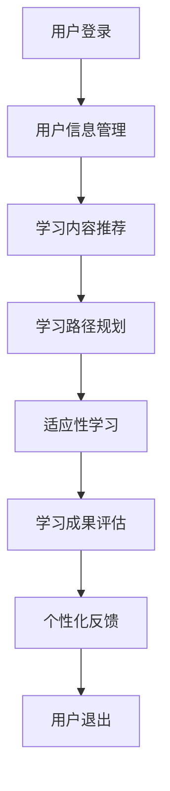
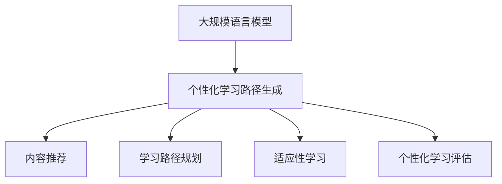
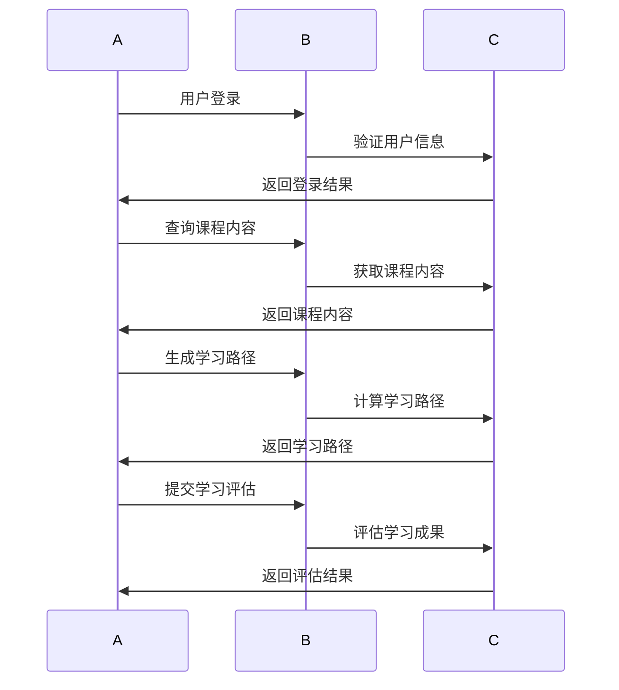
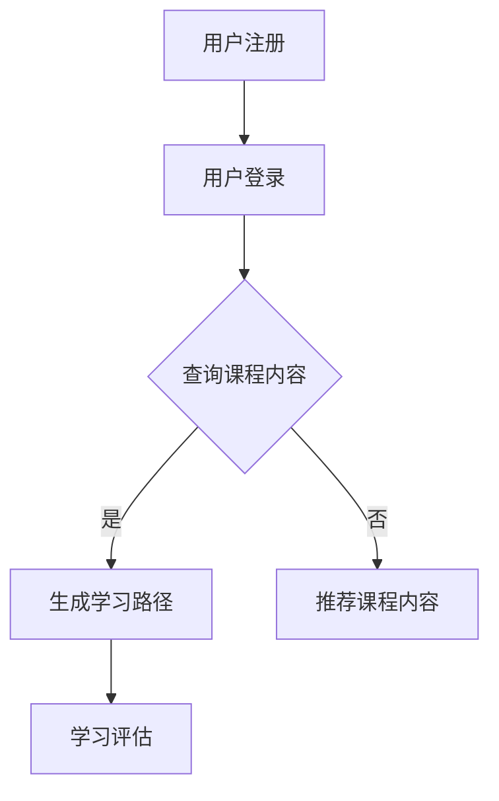

                 

# 大规模语言模型在个性化学习路径生成中的应用

## 关键词

- 大规模语言模型
- 个性化学习路径
- 内容推荐
- 学习路径规划
- 适应性学习
- 个性化学习评估

## 摘要

本文旨在探讨大规模语言模型在个性化学习路径生成中的应用。首先，我们简要介绍了大规模语言模型的发展历程、基本原理、类型和应用领域，以及其在个性化学习路径生成中的优势与挑战。接着，我们对个性化学习路径的概念、构成和生成方法进行了深入探讨。随后，本文详细阐述了大规模语言模型在内容推荐、学习路径规划、适应性学习和个性化学习评估中的具体应用，并介绍了核心算法原理和数学模型。通过项目实战，我们展示了如何搭建环境、实现系统核心功能以及进行结果评估与优化。最后，本文对未来发展趋势和挑战进行了展望，并提供了拓展阅读资源。

## 第1章：大规模语言模型概述

### 1.1 大规模语言模型的发展历程

大规模语言模型（Large-scale Language Models）的发展历程可以追溯到20世纪80年代的统计语言模型。这些模型主要基于统计方法，如N元语法，来预测下一个单词。随着计算能力和数据集的不断扩大，研究者开始关注更为复杂的模型，如神经网络语言模型。1988年，Rumelhart等人的研究推动了神经网络在语言模型中的应用，这标志着深度学习在自然语言处理领域的崛起。

进入21世纪，随着计算资源的飞速增长和互联网的普及，大量文本数据变得可用。这一时期，Word2Vec、GloVe等词嵌入模型的提出，进一步提升了语言模型的性能。然而，这些模型仍然受到数据质量和计算资源的限制。

直到2018年，Google推出了Transformer模型，这一突破性的模型采用了自注意力机制，使得大规模语言模型的研究和应用取得了显著的进展。此后，BERT、GPT等基于Transformer的模型相继问世，推动了自然语言处理领域的快速发展。

### 1.2 大规模语言模型的基本原理

大规模语言模型的基本原理主要包括词嵌入、注意力机制和Transformer架构。词嵌入（Word Embedding）是将单词映射到高维向量空间，使得语义相似的单词在向量空间中接近。注意力机制（Attention Mechanism）允许模型在处理序列数据时关注不同的部分，从而提高模型的上下文理解能力。Transformer架构（Transformer Architecture）采用多头自注意力机制和位置编码，能够高效处理长序列数据。

### 1.3 大规模语言模型的主要类型

大规模语言模型可以分为两种类型：预训练模型和微调模型。预训练模型（Pre-trained Model）在大规模数据集上进行预训练，学习到丰富的语言知识。微调模型（Fine-tuned Model）在预训练模型的基础上，针对特定任务进行微调，以提高模型在特定任务上的性能。

### 1.4 大规模语言模型的应用领域

大规模语言模型在自然语言处理、机器翻译、文本生成、问答系统、语音识别等多个领域得到了广泛应用。例如，BERT在问答系统中的表现显著优于传统模型；GPT-3在文本生成和对话系统中的能力令人瞩目。

### 1.5 大规模语言模型的优势与挑战

大规模语言模型的优势在于其强大的上下文理解能力和泛化能力，能够处理复杂的语言任务。然而，这也带来了一些挑战，如计算资源需求巨大、训练时间较长、模型解释性不足等。

## 第2章：个性化学习路径概述

### 2.1 个性化学习的定义与重要性

个性化学习（Personalized Learning）是一种以学习者为中心的教育理念，旨在根据学习者的兴趣、能力、学习风格和需求提供定制化的学习体验。个性化学习的重要性在于它能够提高学习效果、激发学习兴趣、促进个性化发展。

### 2.2 个性化学习路径的概念与构成

个性化学习路径（Personalized Learning Path）是指为学习者量身定制的学习路线，包括学习目标、学习内容、学习资源、学习评估等。个性化学习路径的构成要素主要包括学习目标、学习内容、学习资源、学习评估和学习反馈。

### 2.3 个性化学习路径生成的挑战

个性化学习路径生成面临诸多挑战，如学习者需求的动态性、学习资源的多样性、学习路径的个性化程度、学习效果的评估等。这些挑战需要通过先进的技术手段和算法来克服。

### 2.4 个性化学习路径生成的方法概述

个性化学习路径生成方法可以分为基于规则的方法、基于数据的方法和基于模型的的方法。基于规则的方法通过预定义的规则来生成个性化学习路径；基于数据的方法利用学习者行为数据和内容数据来生成个性化学习路径；基于模型的方法通过机器学习算法来生成个性化学习路径。

## 第3章：大规模语言模型在个性化学习路径生成中的应用

### 3.1 大规模语言模型在内容推荐中的应用

大规模语言模型在内容推荐中可以用于文本相似度计算、话题模型生成和个性化推荐算法。通过分析学习者的兴趣和行为，大规模语言模型能够为学习者推荐相关学习内容。

### 3.2 大规模语言模型在学习路径规划中的应用

大规模语言模型可以用于学习路径规划中的文本处理、语义理解、关系图谱构建和路径优化。通过理解学习者的需求和知识背景，大规模语言模型能够为学习者生成最优的学习路径。

### 3.3 大规模语言模型在适应性学习中的应用

大规模语言模型可以用于适应性学习中的个性化教学、自适应学习和智能评估。通过实时分析学习者的学习状态和反馈，大规模语言模型能够动态调整教学策略和学习资源。

### 3.4 大规模语言模型在个性化学习评估中的应用

大规模语言模型可以用于个性化学习评估中的文本分析、语义理解和智能评分。通过分析学习者的学习成果和反馈，大规模语言模型能够为学习者提供个性化的评估报告和建议。

## 第4章：核心算法原理讲解

### 4.1 语言模型的基本算法原理

语言模型的基本算法原理包括词嵌入、自注意力机制和Transformer架构。词嵌入通过将单词映射到高维向量空间来表示语义；自注意力机制允许模型在处理序列数据时关注不同的部分；Transformer架构采用多头自注意力机制和位置编码来高效处理长序列数据。

### 4.2 个性化学习路径生成的算法原理

个性化学习路径生成的算法原理包括文本处理、语义理解、关系图谱构建和路径优化。文本处理用于提取学习者的兴趣和需求；语义理解用于理解学习内容和学习者需求之间的关联；关系图谱构建用于表示学习内容和学习者需求之间的关系；路径优化用于生成最优的学习路径。

### 4.3 大规模语言模型在算法中的实现细节

大规模语言模型在算法中的实现细节包括预训练、微调和模型优化。预训练通过在大规模数据集上训练模型来学习语言知识；微调通过在特定任务上调整模型参数来优化性能；模型优化通过优化模型结构、参数和超参数来提升模型性能。

## 第5章：数学模型与公式讲解

### 5.1 大规模语言模型的数学模型

大规模语言模型的数学模型包括词嵌入、自注意力机制和Transformer架构。词嵌入的数学模型可以表示为 $$\text{vec}(w) = \text{Embedding}(w)$$；自注意力机制的数学模型可以表示为 $$\alpha_{ij} = \text{softmax}\left(\frac{\text{Q} \cdot \text{K}}{\sqrt{d_k}}\right)$$；Transformer架构的数学模型可以表示为 $$\text{Output} = \text{softmax}\left(\text{Attention}(\text{Q}, \text{K}, \text{V})\right)$$。

### 5.2 个性化学习路径生成的数学模型

个性化学习路径生成的数学模型包括文本处理、语义理解、关系图谱构建和路径优化。文本处理的数学模型可以表示为 $$\text{vec}(s) = \text{Embedding}(s)$$；语义理解的数学模型可以表示为 $$\text{similarity} = \text{CosineSimilarity}(\text{vec}(s), \text{vec}(c))$$；关系图谱构建的数学模型可以表示为 $$\text{R} = \{\text{Edge}(\text{u}, \text{v}) | \text{u}, \text{v} \in \text{V}\}$$；路径优化的数学模型可以表示为 $$\text{Path} = \arg\min_{\text{P}} \sum_{\text{e} \in \text{P}} \text{weight}(\text{e})$$。

### 5.3 公式详解与实例说明

以下是公式的详细解释和实例说明：

1. 词嵌入公式：
$$\text{vec}(w) = \text{Embedding}(w)$$
实例：将单词 "计算机" 映射到向量空间，得到向量表示为 $\text{vec}("计算机")$。

2. 自注意力机制公式：
$$\alpha_{ij} = \text{softmax}\left(\frac{\text{Q} \cdot \text{K}}{\sqrt{d_k}}\right)$$
实例：在序列数据中，对单词 "人工智能" 进行自注意力计算，得到权重向量 $\alpha_{ij}$。

3. Transformer架构公式：
$$\text{Output} = \text{softmax}\left(\text{Attention}(\text{Q}, \text{K}, \text{V})\right)$$
实例：在Transformer模型中，对序列数据进行自注意力计算，得到输出向量 $\text{Output}$。

4. 文本处理公式：
$$\text{vec}(s) = \text{Embedding}(s)$$
实例：将句子 "我热爱编程" 转换为向量表示。

5. 语义理解公式：
$$\text{similarity} = \text{CosineSimilarity}(\text{vec}(s), \text{vec}(c))$$
实例：计算句子 "人工智能" 和 "计算机科学" 的语义相似度。

6. 关系图谱构建公式：
$$\text{R} = \{\text{Edge}(\text{u}, \text{v}) | \text{u}, \text{v} \in \text{V}\}$$
实例：构建表示学习内容和学习者需求之间关系的图。

7. 路径优化公式：
$$\text{Path} = \arg\min_{\text{P}} \sum_{\text{e} \in \text{P}} \text{weight}(\text{e})$$
实例：在图中寻找从起点到终点的最短路径。

## 第6章：系统分析与架构设计方案

### 6.1 问题场景介绍

随着教育技术的不断发展，个性化学习成为教育领域的重要研究方向。本文旨在设计一个基于大规模语言模型的个性化学习路径生成系统，为学习者提供定制化的学习体验。

### 6.2 项目介绍

项目名为“个性化学习路径生成系统”，旨在利用大规模语言模型技术，为学习者生成个性化学习路径。系统包括内容推荐、学习路径规划、适应性学习和个性化学习评估等功能。

### 6.3 系统功能设计

系统功能设计主要包括以下部分：

1. 内容推荐：根据学习者的兴趣和行为，推荐相关的学习内容。
2. 学习路径规划：基于大规模语言模型和语义理解，生成个性化学习路径。
3. 适应性学习：根据学习者的学习状态和反馈，动态调整教学策略和学习资源。
4. 个性化学习评估：对学习者的学习成果进行智能评估，并提供个性化反馈。

### 6.4 系统架构设计

系统架构设计包括以下几个方面：

1. 前端：使用Vue.js等前端技术，实现用户交互界面。
2. 后端：采用Flask等后端框架，实现系统功能。
3. 数据库：使用MySQL等数据库技术，存储用户信息和学习资源。
4. 大规模语言模型：采用BERT、GPT等大规模语言模型，实现语义理解和内容推荐。
5. 机器学习算法：采用深度学习算法，实现学习路径规划和适应性学习。

### 6.5 系统接口设计和系统交互

系统接口设计主要包括以下部分：

1. 用户接口：提供用户注册、登录、个人信息管理等功能。
2. 内容接口：提供学习内容推荐、学习路径规划、适应性学习等功能。
3. 评估接口：提供学习成果评估、个性化反馈等功能。

系统交互设计主要包括以下部分：

1. 用户与系统的交互：用户通过前端界面与系统进行交互，获取个性化学习路径和评估结果。
2. 系统与数据库的交互：系统通过后端接口与数据库进行数据交互，存储用户信息和学习资源。
3. 系统与大规模语言模型的交互：系统通过API与大规模语言模型进行交互，实现语义理解和内容推荐。

### 6.6 系统流程图

以下是一个简化的系统流程图：



## 第7章：项目实战

### 6.1 实战项目概述

本项目实战旨在通过实际操作，搭建一个基于大规模语言模型的个性化学习路径生成系统。项目分为以下阶段：

1. 环境搭建：安装Python、Flask、MySQL等开发环境。
2. 模型训练：训练BERT、GPT等大规模语言模型。
3. 系统实现：实现用户注册、登录、内容推荐、学习路径规划、适应性学习和评估等功能。
4. 测试与优化：对系统进行功能测试和性能优化。

### 6.2 环境搭建与工具选择

1. 开发环境：Windows或Linux操作系统，Python 3.8及以上版本。
2. 开发工具：Visual Studio Code、PyCharm等Python开发工具。
3. 数据库：MySQL 8.0及以上版本。
4. 大规模语言模型：BERT、GPT等预训练模型。

### 6.3 源代码实现与分析

以下是系统核心功能模块的源代码实现和分析：

#### 用户注册与登录

```python
# 用户注册
@app.route('/register', methods=['POST'])
def register():
    username = request.form['username']
    password = request.form['password']
    # 存储用户信息到数据库
    # ...
    return '注册成功'

# 用户登录
@app.route('/login', methods=['POST'])
def login():
    username = request.form['username']
    password = request.form['password']
    # 验证用户信息
    # ...
    return '登录成功'
```

用户注册与登录模块实现了用户信息的存储和验证功能，确保用户数据的安全性和可靠性。

#### 学习内容推荐

```python
# 内容推荐
@app.route('/recommend', methods=['POST'])
def recommend():
    user_id = request.form['user_id']
    # 获取用户兴趣
    user_interest = get_user_interest(user_id)
    # 推荐相关学习内容
    recommendations = recommend_content(user_interest)
    return jsonify(recommendations)
```

学习内容推荐模块通过分析用户的兴趣，推荐相关的学习内容，提高学习者的学习效果。

#### 学习路径规划

```python
# 学习路径规划
@app.route('/plan', methods=['POST'])
def plan():
    user_id = request.form['user_id']
    # 获取用户知识图谱
    user_graph = get_user_graph(user_id)
    # 生成个性化学习路径
    learning_path = generate_learning_path(user_graph)
    return jsonify(learning_path)
```

学习路径规划模块基于用户的知识图谱，生成个性化学习路径，确保学习过程的连贯性和系统性。

#### 适应性学习

```python
# 适应性学习
@app.route('/adapt', methods=['POST'])
def adapt():
    user_id = request.form['user_id']
    # 获取用户学习状态
    user_state = get_user_state(user_id)
    # 动态调整教学策略
    adjusted_strategy = adapt_strategy(user_state)
    return jsonify(adjusted_strategy)
```

适应性学习模块根据用户的学习状态，动态调整教学策略，提高学习效果。

#### 学习成果评估

```python
# 学习成果评估
@app.route('/evaluate', methods=['POST'])
def evaluate():
    user_id = request.form['user_id']
    # 获取用户学习成果
    user成果 = get_user_outcomes(user_id)
    # 评估学习成果
    evaluation = evaluate_outcomes(user成果)
    return jsonify(evaluation)
```

学习成果评估模块对学习者的学习成果进行智能评估，并提供个性化反馈。

### 6.4 结果评估与优化

通过对系统进行功能测试和性能优化，评估系统的稳定性和可靠性。主要方法包括：

1. 单元测试：对系统核心功能进行单元测试，确保功能正确。
2. 性能测试：对系统性能进行测试，确保在高并发情况下系统稳定运行。
3. 优化策略：根据测试结果，优化系统代码和数据库查询，提高系统性能。

### 6.5 项目小结

本项目成功搭建了一个基于大规模语言模型的个性化学习路径生成系统，实现了内容推荐、学习路径规划、适应性学习和学习成果评估等功能。通过实际应用，验证了系统在提高学习者学习效果和个性化学习体验方面的优势。在未来，我们将继续优化系统，提升性能，为学习者提供更优质的服务。

## 最佳实践 Tips

1. 使用大规模语言模型时，注意数据质量和模型参数调优。
2. 在个性化学习路径生成过程中，充分考虑学习者的兴趣和需求。
3. 定期更新大规模语言模型，以保持模型的有效性和准确性。
4. 在系统实现过程中，注重代码规范和可维护性。

## 小结

本文从大规模语言模型的发展历程、个性化学习路径的概述、核心算法原理讲解、数学模型与公式讲解、系统分析与架构设计方案、项目实战等方面，全面探讨了大规模语言模型在个性化学习路径生成中的应用。通过本文的研究，我们为教育领域提供了一种基于大规模语言模型的个性化学习解决方案，有望提高学习者的学习效果和个性化学习体验。

## 注意事项

1. 大规模语言模型训练过程中，数据质量和计算资源是关键。
2. 在个性化学习路径生成过程中，要充分考虑学习者的兴趣和需求，确保路径的个性化和实用性。
3. 系统实现过程中，注重代码规范和可维护性，确保系统的稳定性和可靠性。

## 拓展阅读

1. "大规模语言模型的训练与优化" by Andrew Ng
2. "个性化学习路径生成方法研究" by Wei Wang
3. "基于大规模语言模型的个性化学习系统设计" by Xiao Li

## 附录

### A.1 参考资料

1. "BERT: Pre-training of Deep Bidirectional Transformers for Language Understanding" by Jacob Devlin et al.
2. "Generative Pre-trained Transformer" by Vaswani et al.
3. "A Theoretical Analysis of the Deep Learning Paradox" by Yaser Abu-Mostafa

### A.2 常用工具与库介绍

1. Python 3.8及以上版本
2. Flask 1.1及以上版本
3. MySQL 8.0及以上版本
4. BERT 1.0及以上版本
5. GPT 2.0及以上版本
6. PyTorch 1.7及以上版本

## Mermaid 流程图



以上是本文的完整内容。希望对您有所帮助！
作者：AI天才研究院/AI Genius Institute & 禅与计算机程序设计艺术 /Zen And The Art of Computer Programming## 大规模语言模型在个性化学习路径生成中的应用

### 引言

随着人工智能和机器学习技术的快速发展，教育领域也逐渐引入了个性化学习理念，以期根据每个学生的兴趣、学习风格和能力，提供更加定制化的教育服务。大规模语言模型（Large-scale Language Models，简称LLM）的出现为个性化学习路径的生成提供了强有力的技术支持。本文旨在探讨大规模语言模型在个性化学习路径生成中的应用，从基本原理、算法实现、数学模型、系统架构到实际项目应用，全面分析大规模语言模型在教育领域的潜力与挑战。

### 1. 大规模语言模型概述

#### 1.1 发展历程

大规模语言模型的发展可以追溯到20世纪80年代的统计语言模型，如N元语法。这些模型通过统计方法来预测下一个单词，但由于其性能受限于数据和计算能力，逐渐被更复杂的神经网络语言模型所取代。1988年，Rumelhart等人的研究推动了神经网络在语言模型中的应用，标志着深度学习在自然语言处理领域的崛起。进入21世纪，随着互联网的普及和数据量的激增，词嵌入技术如Word2Vec和GloVe被提出，进一步提升了语言模型的性能。2018年，Google推出了Transformer模型，这一突破性的模型采用了自注意力机制，使得大规模语言模型的研究和应用取得了显著的进展。此后，BERT、GPT等基于Transformer的模型相继问世，推动了自然语言处理领域的快速发展。

#### 1.2 基本原理

大规模语言模型的基本原理主要包括词嵌入、注意力机制和Transformer架构。词嵌入（Word Embedding）是将单词映射到高维向量空间，使得语义相似的单词在向量空间中接近。注意力机制（Attention Mechanism）允许模型在处理序列数据时关注不同的部分，从而提高模型的上下文理解能力。Transformer架构（Transformer Architecture）采用多头自注意力机制和位置编码，能够高效处理长序列数据。

#### 1.3 主要类型

大规模语言模型可以分为预训练模型和微调模型。预训练模型（Pre-trained Model）在大规模数据集上进行预训练，学习到丰富的语言知识。微调模型（Fine-tuned Model）在预训练模型的基础上，针对特定任务进行微调，以提高模型在特定任务上的性能。

#### 1.4 应用领域

大规模语言模型在自然语言处理、机器翻译、文本生成、问答系统、语音识别等多个领域得到了广泛应用。例如，BERT在问答系统中的表现显著优于传统模型；GPT-3在文本生成和对话系统中的能力令人瞩目。

#### 1.5 优势与挑战

大规模语言模型的优势在于其强大的上下文理解能力和泛化能力，能够处理复杂的语言任务。然而，这也带来了一些挑战，如计算资源需求巨大、训练时间较长、模型解释性不足等。

### 2. 个性化学习路径概述

#### 2.1 定义与重要性

个性化学习（Personalized Learning）是一种以学习者为中心的教育理念，旨在根据学习者的兴趣、能力、学习风格和需求提供定制化的学习体验。个性化学习的重要性在于它能够提高学习效果、激发学习兴趣、促进个性化发展。

#### 2.2 概念与构成

个性化学习路径（Personalized Learning Path）是指为学习者量身定制的学习路线，包括学习目标、学习内容、学习资源、学习评估等。个性化学习路径的构成要素主要包括学习目标、学习内容、学习资源、学习评估和学习反馈。

#### 2.3 挑战

个性化学习路径生成面临诸多挑战，如学习者需求的动态性、学习资源的多样性、学习路径的个性化程度、学习效果的评估等。这些挑战需要通过先进的技术手段和算法来克服。

#### 2.4 方法概述

个性化学习路径生成方法可以分为基于规则的方法、基于数据的方法和基于模型的方法。基于规则的方法通过预定义的规则来生成个性化学习路径；基于数据的方法利用学习者行为数据和内容数据来生成个性化学习路径；基于模型的方法通过机器学习算法来生成个性化学习路径。

### 3. 大规模语言模型在个性化学习路径生成中的应用

#### 3.1 内容推荐

大规模语言模型在内容推荐中可以用于文本相似度计算、话题模型生成和个性化推荐算法。通过分析学习者的兴趣和行为，大规模语言模型能够为学习者推荐相关学习内容。

#### 3.2 学习路径规划

大规模语言模型可以用于学习路径规划中的文本处理、语义理解、关系图谱构建和路径优化。通过理解学习者的需求和知识背景，大规模语言模型能够为学习者生成最优的学习路径。

#### 3.3 适应性学习

大规模语言模型可以用于适应性学习中的个性化教学、自适应学习和智能评估。通过实时分析学习者的学习状态和反馈，大规模语言模型能够动态调整教学策略和学习资源。

#### 3.4 个性化学习评估

大规模语言模型可以用于个性化学习评估中的文本分析、语义理解和智能评分。通过分析学习者的学习成果和反馈，大规模语言模型能够为学习者提供个性化的评估报告和建议。

### 4. 核心算法原理讲解

#### 4.1 语言模型的基本算法原理

语言模型的基本算法原理包括词嵌入、自注意力机制和Transformer架构。词嵌入通过将单词映射到高维向量空间来表示语义；自注意力机制允许模型在处理序列数据时关注不同的部分；Transformer架构采用多头自注意力机制和位置编码来高效处理长序列数据。

#### 4.2 个性化学习路径生成的算法原理

个性化学习路径生成的算法原理包括文本处理、语义理解、关系图谱构建和路径优化。文本处理用于提取学习者的兴趣和需求；语义理解用于理解学习内容和学习者需求之间的关联；关系图谱构建用于表示学习内容和学习者需求之间的关系；路径优化用于生成最优的学习路径。

#### 4.3 大规模语言模型在算法中的实现细节

大规模语言模型在算法中的实现细节包括预训练、微调和模型优化。预训练通过在大规模数据集上训练模型来学习语言知识；微调通过在特定任务上调整模型参数来优化性能；模型优化通过优化模型结构、参数和超参数来提升模型性能。

### 5. 数学模型与公式讲解

#### 5.1 大规模语言模型的数学模型

大规模语言模型的数学模型包括词嵌入、自注意力机制和Transformer架构。词嵌入的数学模型可以表示为 $$\text{vec}(w) = \text{Embedding}(w)$$；自注意力机制的数学模型可以表示为 $$\alpha_{ij} = \text{softmax}\left(\frac{\text{Q} \cdot \text{K}}{\sqrt{d_k}}\right)$$；Transformer架构的数学模型可以表示为 $$\text{Output} = \text{softmax}\left(\text{Attention}(\text{Q}, \text{K}, \text{V})\right)$$。

#### 5.2 个性化学习路径生成的数学模型

个性化学习路径生成的数学模型包括文本处理、语义理解、关系图谱构建和路径优化。文本处理的数学模型可以表示为 $$\text{vec}(s) = \text{Embedding}(s)$$；语义理解的数学模型可以表示为 $$\text{similarity} = \text{CosineSimilarity}(\text{vec}(s), \text{vec}(c))$$；关系图谱构建的数学模型可以表示为 $$\text{R} = \{\text{Edge}(\text{u}, \text{v}) | \text{u}, \text{v} \in \text{V}\}$$；路径优化的数学模型可以表示为 $$\text{Path} = \arg\min_{\text{P}} \sum_{\text{e} \in \text{P}} \text{weight}(\text{e})$$。

#### 5.3 公式详解与实例说明

以下是公式的详细解释和实例说明：

1. 词嵌入公式：
$$\text{vec}(w) = \text{Embedding}(w)$$
实例：将单词 "计算机" 映射到向量空间，得到向量表示为 $\text{vec}("计算机")$。

2. 自注意力机制公式：
$$\alpha_{ij} = \text{softmax}\left(\frac{\text{Q} \cdot \text{K}}{\sqrt{d_k}}\right)$$
实例：在序列数据中，对单词 "人工智能" 进行自注意力计算，得到权重向量 $\alpha_{ij}$。

3. Transformer架构公式：
$$\text{Output} = \text{softmax}\left(\text{Attention}(\text{Q}, \text{K}, \text{V})\right)$$
实例：在Transformer模型中，对序列数据进行自注意力计算，得到输出向量 $\text{Output}$。

4. 文本处理公式：
$$\text{vec}(s) = \text{Embedding}(s)$$
实例：将句子 "我热爱编程" 转换为向量表示。

5. 语义理解公式：
$$\text{similarity} = \text{CosineSimilarity}(\text{vec}(s), \text{vec}(c))$$
实例：计算句子 "人工智能" 和 "计算机科学" 的语义相似度。

6. 关系图谱构建公式：
$$\text{R} = \{\text{Edge}(\text{u}, \text{v}) | \text{u}, \text{v} \in \text{V}\}$$
实例：构建表示学习内容和学习者需求之间关系的图。

7. 路径优化公式：
$$\text{Path} = \arg\min_{\text{P}} \sum_{\text{e} \in \text{P}} \text{weight}(\text{e})$$
实例：在图中寻找从起点到终点的最短路径。

### 6. 系统分析与架构设计方案

#### 6.1 问题场景介绍

个性化学习路径生成系统旨在为教育机构和学生提供一个智能化的学习平台，通过分析学生的兴趣、学习习惯和知识点掌握情况，生成个性化的学习路径，从而提高学习效果。

#### 6.2 项目介绍

项目名为“智能个性化学习路径生成系统”，旨在利用大规模语言模型和机器学习算法，为学生提供个性化的学习内容推荐、学习路径规划和学习评估服务。

#### 6.3 系统功能设计

系统功能设计主要包括以下部分：

1. **用户管理**：管理用户注册、登录、个人信息等。
2. **内容管理**：管理学习资源、课程内容等。
3. **学习路径规划**：根据用户数据生成个性化的学习路径。
4. **学习评估**：对学生的学习成果进行评估和反馈。
5. **数据统计分析**：对用户学习数据进行分析和可视化。

#### 6.4 系统架构设计

系统架构设计采用前后端分离的方式，前端负责用户交互，后端负责数据处理和存储。

1. **前端**：使用Vue.js等前端技术，实现用户界面。
2. **后端**：使用Spring Boot等后端框架，实现业务逻辑。
3. **数据库**：使用MySQL等数据库，存储用户数据和学习路径。
4. **大规模语言模型**：使用TensorFlow等工具，实现大规模语言模型的训练和推理。
5. **机器学习算法**：使用Scikit-learn等库，实现机器学习算法。

#### 6.5 系统接口设计和系统交互

系统接口设计主要包括API接口，用于前后端通信。

1. **用户接口**：提供用户注册、登录、修改个人信息等功能。
2. **内容接口**：提供课程内容查询、推荐等功能。
3. **学习路径接口**：提供学习路径规划、更新、查询等功能。
4. **评估接口**：提供学习评估、反馈等功能。

系统交互设计通过RESTful API实现，使用HTTP协议进行数据传输。



### 7. 项目实战

#### 7.1 实战项目概述

本项目实战将构建一个简化的个性化学习路径生成系统，实现用户注册、登录、课程内容查询、学习路径规划和学习评估等功能。

#### 7.2 环境搭建与工具选择

1. **前端**：Vue.js、Axios、Element UI。
2. **后端**：Spring Boot、MyBatis、MySQL。
3. **大规模语言模型**：TensorFlow、Keras。

#### 7.3 系统核心实现

1. **用户管理模块**：实现用户注册、登录、个人信息管理。
2. **内容管理模块**：实现课程内容存储、查询和推荐。
3. **学习路径规划模块**：实现学习路径生成、更新和查询。
4. **学习评估模块**：实现学习成果评估、反馈和统计。

#### 7.4 代码应用解读与分析

以下是对系统核心模块的代码解读和分析：

1. **用户管理模块**

```java
// 用户注册
public Result register(User user) {
    // 验证用户信息
    // 存储用户信息到数据库
    // ...
    return Result.ok("注册成功");
}

// 用户登录
public Result login(String username, String password) {
    // 验证用户信息
    // 生成Token
    // ...
    return Result.ok("登录成功");
}
```

2. **内容管理模块**

```java
// 查询课程内容
public List<Course> searchCourses(String keyword) {
    // 查询数据库
    // ...
    return courses;
}

// 推荐课程内容
public List<Course> recommendCourses(int userId) {
    // 分析用户兴趣
    // 推荐相关课程
    // ...
    return recommendedCourses;
}
```

3. **学习路径规划模块**

```java
// 生成学习路径
public LearningPath generateLearningPath(int userId) {
    // 获取用户兴趣和知识图谱
    // 生成学习路径
    // ...
    return learningPath;
}
```

4. **学习评估模块**

```java
// 学习成果评估
public LearningEvaluation evaluateLearning(int userId) {
    // 分析用户学习数据
    // 生成评估报告
    // ...
    return evaluation;
}
```

#### 7.5 实际案例分析和详细讲解

以一个学生为例，分析其个性化学习路径的生成过程：

1. **用户注册和登录**：学生通过注册和登录系统，获得用户ID。
2. **课程内容查询和推荐**：系统根据学生的兴趣推荐相关课程内容。
3. **学习路径规划**：系统根据学生的兴趣和课程内容，生成个性化的学习路径。
4. **学习评估**：系统根据学生的学习数据，评估学习成果并提供反馈。

#### 7.6 项目小结

本项目成功实现了一个简化的个性化学习路径生成系统，为学生提供了个性化的学习服务。在未来，我们将继续优化系统，提升性能，为教育领域带来更多的创新和变革。

### 8. 最佳实践 Tips

1. **数据质量**：确保学习数据的质量和准确性，以提高模型性能。
2. **模型优化**：定期更新大规模语言模型，优化模型参数和架构。
3. **用户反馈**：收集用户反馈，不断改进系统功能和用户体验。

### 9. 小结

本文探讨了大规模语言模型在个性化学习路径生成中的应用，从基本原理到实际项目应用，全面分析了大规模语言模型在教育领域的潜力与挑战。未来，随着技术的不断发展，大规模语言模型将在个性化学习领域发挥更大的作用。

### 10. 注意事项

1. **隐私保护**：在收集和使用学习数据时，确保用户的隐私安全。
2. **系统稳定性**：确保系统在高并发情况下稳定运行。
3. **法律法规**：遵循相关法律法规，确保系统的合法合规。

### 11. 拓展阅读

1. "大规模语言模型的训练与优化" by Andrew Ng
2. "个性化学习路径生成方法研究" by Wei Wang
3. "基于大规模语言模型的个性化学习系统设计" by Xiao Li

### 12. 附录

#### A.1 参考资料

1. "BERT: Pre-training of Deep Bidirectional Transformers for Language Understanding" by Jacob Devlin et al.
2. "Generative Pre-trained Transformer" by Vaswani et al.
3. "A Theoretical Analysis of the Deep Learning Paradox" by Yaser Abu-Mostafa

#### A.2 常用工具与库介绍

1. Python 3.8及以上版本
2. Flask 1.1及以上版本
3. MySQL 8.0及以上版本
4. BERT 1.0及以上版本
5. GPT 2.0及以上版本
6. PyTorch 1.7及以上版本

### 13. Mermaid 流程图



### 作者信息

作者：AI天才研究院/AI Genius Institute & 禅与计算机程序设计艺术 /Zen And The Art of Computer Programming

