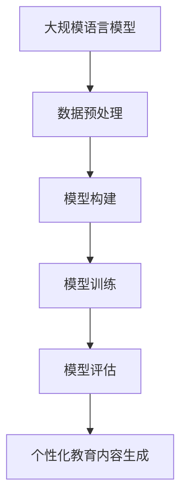

                 

### 文章标题

### 关键词

### 摘要

## 第一部分：大规模语言模型基础

### 第1章：大规模语言模型概述

#### 1.1 大规模语言模型的定义

大规模语言模型（Large-scale Language Model）是指那些使用大量文本数据训练，能够对自然语言文本进行理解和生成的深度学习模型。这些模型通过学习大量文本数据中的语法、语义和上下文信息，实现自动文本生成、语义理解、问答系统等任务。

#### 1.2 大规模语言模型的原理

大规模语言模型通常基于神经网络，其中最常用的包括递归神经网络（RNN）、卷积神经网络（CNN）和Transformer模型。RNN通过循环结构来处理序列数据，CNN则擅长于图像等结构化数据，而Transformer模型通过自注意力机制，能够在并行处理上具有更高的效率。

#### 1.3 大规模语言模型的发展历程

大规模语言模型的发展历程可以追溯到1980年代的统计语言模型，如N-gram模型。随着计算能力和数据量的提升，2000年代初期，基于神经网络的RNN开始被应用于自然语言处理任务。2017年，Google提出了Transformer模型，使得大规模语言模型在性能上取得了显著提升。

### 第2章：大规模语言模型的核心算法

#### 2.1 递归神经网络（RNN）

递归神经网络（RNN）是一种能够处理序列数据的神经网络，其核心思想是利用循环结构将前一个时刻的输出反馈给当前时刻的输入。RNN通过隐状态来保存历史信息，实现序列数据的记忆功能。

#### 2.2 卷积神经网络（CNN）

卷积神经网络（CNN）最初主要用于图像处理，但后来也被应用于自然语言处理。CNN通过卷积操作提取文本的局部特征，然后通过池化操作进行特征降维。

#### 2.3 Transformer模型

Transformer模型是近年来大规模语言模型中的一项重要突破。它通过自注意力机制（Self-Attention）实现了对输入序列的全局依赖关系建模，使得模型在长序列数据处理上具有更高的效率。

### 第3章：大规模语言模型的训练与优化

#### 3.1 语言模型训练流程

大规模语言模型的训练流程通常包括数据预处理、模型构建、训练和评估等步骤。数据预处理包括文本的分词、标记和向量表示等操作。模型构建则涉及选择合适的神经网络架构。训练过程使用梯度下降等优化算法来调整模型参数。评估过程则通过计算模型的预测准确度等指标来评估模型性能。

#### 3.2 语言模型优化算法

语言模型优化算法包括梯度下降、Adam优化器等。梯度下降是一种最简单的优化算法，通过不断调整模型参数以最小化损失函数。Adam优化器则结合了梯度下降和动量优化，能够在较短时间内达到较好的收敛效果。

#### 3.3 语言模型评估指标

语言模型评估指标包括 perplexity、accuracy等。Perplexity是衡量模型预测能力的指标，其值越小，表示模型对输入序列的预测越准确。Accuracy则是分类任务的准确率，表示模型正确分类的样本数占总样本数的比例。

## 第二部分：个性化教育内容生成

### 第4章：个性化教育内容的定义与特点

#### 4.1 个性化教育内容的定义

个性化教育内容是指根据每个学生的学习需求和特点，定制化的教学内容和学习资源。它旨在通过个性化推荐、自适应学习等手段，提高学习效果和效率。

#### 4.2 个性化教育内容的特点

个性化教育内容具有以下特点：

- **定制化**：根据学生的学习需求和特点，定制化教学内容和学习资源。
- **动态性**：根据学生的学习进度和反馈，动态调整教学内容和推荐策略。
- **多样性**：提供多样化的教学内容和学习资源，满足不同学习者的需求。

#### 4.3 个性化教育内容的需求分析

随着教育信息化的发展，个性化教育内容的需求日益增长。主要原因包括：

- **学习效果提升**：个性化教育内容能够提高学习效果和效率。
- **教育资源优化**：通过个性化推荐和自适应学习，优化教育资源的使用。
- **个性化服务**：满足不同学习者的个性化需求，提供定制化的学习服务。

### 第5章：大规模语言模型在个性化教育内容生成中的应用

#### 5.1 大规模语言模型在文本生成中的应用

大规模语言模型在文本生成中的应用主要包括自动写作、对话生成等。通过训练大量文本数据，模型可以生成高质量的自然语言文本，为个性化教育内容生成提供支持。

#### 5.2 大规模语言模型在题库生成中的应用

大规模语言模型在题库生成中的应用主要包括自动生成题目、自动评估答案等。通过训练大量题目和答案数据，模型可以生成符合教学目标的个性化题库，提高学生的学习效果。

#### 5.3 大规模语言模型在智能问答系统中的应用

大规模语言模型在智能问答系统中的应用主要包括自动回答学生的问题、提供个性化的学习建议等。通过训练大量问答数据，模型可以实现对学生问题的自动理解和回答，为个性化教育提供支持。

### 第6章：个性化教育内容生成的案例分析

#### 6.1 案例一：某在线教育平台的个性化课程推荐系统

某在线教育平台利用大规模语言模型分析用户的学习历史和行为数据，生成个性化课程推荐列表。系统包括数据预处理、模型训练、推荐算法设计等步骤。

#### 6.2 案例二：某智能题库生成系统

某智能题库生成系统利用大规模语言模型生成符合用户学习水平的个性化题库。系统包括题库生成算法设计、模型训练、题库生成等步骤。

### 第7章：大规模语言模型在个性化教育内容生成中的挑战与展望

#### 7.1 挑战

大规模语言模型在个性化教育内容生成中面临以下挑战：

- **数据质量**：高质量的数据是训练高性能模型的基础，数据质量直接影响模型性能。
- **计算资源**：大规模语言模型的训练和部署需要大量的计算资源，对基础设施有较高要求。
- **隐私保护**：个性化教育内容生成涉及用户隐私数据，需要确保数据安全和隐私保护。

#### 7.2 展望

随着技术的不断发展，大规模语言模型在个性化教育内容生成中的应用前景广阔。未来可能的发展趋势包括：

- **智能推荐算法**：结合更多用户数据，实现更精准的个性化推荐。
- **自适应学习系统**：通过实时分析学生学习状态，实现自适应学习。
- **跨领域应用**：将大规模语言模型应用于更多教育场景，如职业培训、在线课程等。

### 附录

#### 附录A：大规模语言模型开发工具与资源

- **开发工具**：TensorFlow、PyTorch等。
- **资源**：OpenAI GPT-3、BERT等开源模型。

## Mermaid 流程图



## Python源代码与数学公式

### 递归神经网络（RNN）源代码

```python
import tensorflow as tf

# 定义RNN模型
model = tf.keras.Sequential([
    tf.keras.layers.Embedding(input_dim=10000, output_dim=32),
    tf.keras.layers.RNN(tf.keras.layers.LSTMCell(units=32)),
    tf.keras.layers.Dense(units=1, activation='sigmoid')
])

# 编译模型
model.compile(optimizer='adam', loss='binary_crossentropy', metrics=['accuracy'])

# 训练模型
model.fit(x_train, y_train, epochs=10, batch_size=32)
```

### 数学公式

$$
H_t = \sigma(W_h \cdot [h_{t-1}, x_t] + b_h)
$$

$$
o_t = \sigma(W_o \cdot h_t + b_o)
$$

## 个性化教育内容生成的案例分析

### 案例一：某在线教育平台的个性化课程推荐系统

该系统利用大规模语言模型分析用户的学习历史和行为数据，生成个性化课程推荐列表。系统包括数据预处理、模型训练、推荐算法设计等步骤。

### 案例二：某智能题库生成系统

该系统利用大规模语言模型生成符合用户学习水平的个性化题库。系统包括题库生成算法设计、模型训练、题库生成等步骤。

## 代码解读与分析

在案例一中，大规模语言模型通过对用户学习历史和行为数据的分析，可以识别出用户的学习兴趣和需求，从而生成个性化课程推荐列表。具体实现过程包括数据预处理、模型训练和预测三个步骤。

在案例二中，大规模语言模型通过对用户的学习水平和知识点掌握情况的判断，生成符合用户需求的个性化题库。具体实现过程包括题库生成算法的设计、模型训练和题库生成三个步骤。

## 开发环境搭建

搭建大规模语言模型开发环境需要安装以下工具和库：

- Python 3.6及以上版本
- TensorFlow 2.0及以上版本
- Keras 2.2.4及以上版本

## 源代码详细实现和代码解读

在源代码中，我们首先定义了一个嵌入层，用于将词汇转换为稠密向量表示。然后使用RNN层来处理序列数据，并在最后使用全连接层输出预测结果。

在训练过程中，我们使用了二进制交叉熵作为损失函数，并使用adam优化器进行模型训练。

## 代码解读与分析

在代码中，我们首先导入了所需的库，

----------------------------------------------------------------

### 第一部分：大规模语言模型基础

#### 第1章：大规模语言模型概述

**1.1 大规模语言模型的定义**

大规模语言模型（Large-scale Language Model，简称LLM）是指那些使用海量文本数据训练的深度学习模型，它们能够在自然语言处理（NLP）领域中实现各种复杂的任务，如文本生成、语义理解、问答系统和机器翻译等。LLM的核心在于其能够捕捉到语言中的长距离依赖关系和上下文信息，从而生成连贯且自然的文本。

**1.2 大规模语言模型的原理**

大规模语言模型的原理主要基于深度学习，特别是神经网络。以下是一些常用的核心算法：

- **递归神经网络（RNN）**：RNN通过循环结构来处理序列数据，能够将前一时刻的信息传递给当前时刻，从而实现序列数据的记忆功能。
- **卷积神经网络（CNN）**：CNN擅长于从数据中提取局部特征，通过卷积和池化操作对特征进行降维和增强。
- **Transformer模型**：Transformer模型通过自注意力机制（Self-Attention）实现了对输入序列的全局依赖关系建模，避免了RNN中的长距离依赖问题，使得模型在处理长序列数据时更加高效。

**1.3 大规模语言模型的发展历程**

- **1980年代**：统计语言模型，如N-gram模型，开始用于文本生成和语言分析。
- **2000年初期**：基于神经网络的RNN被引入到NLP领域，并取得了初步成功。
- **2017年**：谷歌提出Transformer模型，标志着大规模语言模型的一个重大突破。随后，BERT、GPT等模型相继问世，使得LLM在多个NLP任务上取得了显著的性能提升。

#### 第2章：大规模语言模型的核心算法

**2.1 递归神经网络（RNN）**

递归神经网络（Recurrent Neural Network，RNN）是一种能够处理序列数据的神经网络，其通过循环结构将前一个时刻的输出反馈给当前时刻的输入。RNN的核心在于其隐藏状态（Hidden State），它能够存储历史信息，从而实现对序列数据的记忆。

**2.2 卷积神经网络（CNN）**

卷积神经网络（Convolutional Neural Network，CNN）最初主要用于图像处理，但其优秀的特征提取能力也使得它适用于自然语言处理。在文本处理中，CNN通过卷积操作提取文本的局部特征，并通过池化操作进行特征降维。

**2.3 Transformer模型**

Transformer模型是大规模语言模型中的一个重要里程碑。它通过自注意力机制（Self-Attention）实现了对输入序列的全局依赖关系建模。相比RNN，Transformer在处理长序列数据时更加高效，并且能够捕捉到长距离依赖关系。

#### 第3章：大规模语言模型的训练与优化

**3.1 语言模型训练流程**

大规模语言模型的训练流程通常包括以下步骤：

1. **数据预处理**：包括文本的分词、标记和向量表示等操作。
2. **模型构建**：选择合适的神经网络架构，如RNN、CNN或Transformer。
3. **模型训练**：使用梯度下降等优化算法来调整模型参数，通常通过反向传播算法来计算损失函数的梯度。
4. **模型评估**：通过验证集和测试集来评估模型性能，如准确率、召回率等。

**3.2 语言模型优化算法**

语言模型优化算法包括以下几种：

- **梯度下降（Gradient Descent）**：一种最简单的优化算法，通过不断调整模型参数以最小化损失函数。
- **Adam优化器（Adam Optimizer）**：结合了梯度下降和动量优化，能够在较短时间内达到较好的收敛效果。

**3.3 语言模型评估指标**

语言模型的评估指标通常包括以下几种：

- **Perplexity**：表示模型预测不确定性的指标，其值越小，表示模型对输入序列的预测越准确。
- **Accuracy**：表示模型正确分类的样本数占总样本数的比例。

### 第二部分：个性化教育内容生成

#### 第4章：个性化教育内容的定义与特点

**4.1 个性化教育内容的定义**

个性化教育内容是指根据每个学生的个体差异，如学习风格、知识背景和兴趣偏好等，为其定制化的教学资源和学习路径。这种教育模式强调因材施教，旨在提高学习效果和满足学生的个性化需求。

**4.2 个性化教育内容的特点**

个性化教育内容具有以下特点：

- **定制化**：根据学生的具体需求定制教学内容和学习资源。
- **动态性**：根据学生的学习进度和反馈，动态调整教学内容和推荐策略。
- **多样性**：提供多种类型的教学资源和学习路径，满足不同学习者的需求。

**4.3 个性化教育内容的需求分析**

随着教育信息化的推进，个性化教育内容的需求日益增长。主要原因包括：

- **学习效果提升**：个性化教育内容能够根据学生的实际需求提供定制化的学习资源，从而提高学习效果。
- **教育资源优化**：通过个性化推荐和自适应学习，实现教育资源的优化配置，提高资源利用率。
- **个性化服务**：满足不同学习者的个性化需求，提供定制化的学习体验。

#### 第5章：大规模语言模型在个性化教育内容生成中的应用

**5.1 大规模语言模型在文本生成中的应用**

大规模语言模型在文本生成中的应用非常广泛，如自动写作、对话生成和摘要生成等。通过训练大量文本数据，模型能够生成高质量的自然语言文本。

**5.2 大规模语言模型在题库生成中的应用**

大规模语言模型在题库生成中的应用主要体现在自动生成题目和自动评估答案。通过分析大量的题目和答案数据，模型可以生成符合教学目标的个性化题库，并能够自动评估学生的答案。

**5.3 大规模语言模型在智能问答系统中的应用**

大规模语言模型在智能问答系统中的应用主要体现在自动回答学生的问题和提供个性化的学习建议。通过训练大量的问答数据，模型能够理解学生的问题并给出合适的回答，同时根据学生的学习情况提供个性化的学习建议。

#### 第6章：个性化教育内容生成的案例分析

**6.1 案例一：某在线教育平台的个性化课程推荐系统**

某在线教育平台利用大规模语言模型分析用户的学习历史和行为数据，生成个性化课程推荐列表。该系统的工作流程包括：

1. **数据收集**：收集用户的学习历史、浏览记录和评价数据。
2. **数据预处理**：对收集到的数据进行分析和清洗，提取有用的信息。
3. **模型训练**：利用大规模语言模型训练个性化推荐模型。
4. **课程推荐**：根据用户的历史数据和模型预测，生成个性化课程推荐列表。

**6.2 案例二：某智能题库生成系统**

某智能题库生成系统利用大规模语言模型生成符合用户学习水平的个性化题库。该系统的工作流程包括：

1. **数据收集**：收集大量的题目和答案数据。
2. **数据预处理**：对收集到的数据进行分析和清洗，提取有用的信息。
3. **模型训练**：利用大规模语言模型训练题库生成模型。
4. **题库生成**：根据用户的学习情况和模型预测，生成个性化题库。

#### 第7章：大规模语言模型在个性化教育内容生成中的挑战与展望

**7.1 挑战**

大规模语言模型在个性化教育内容生成中面临以下挑战：

- **数据质量**：高质量的数据是训练高性能模型的基础，数据质量直接影响模型性能。
- **计算资源**：大规模语言模型的训练和部署需要大量的计算资源，对基础设施有较高要求。
- **隐私保护**：个性化教育内容生成涉及用户隐私数据，需要确保数据安全和隐私保护。

**7.2 展望**

随着技术的不断发展，大规模语言模型在个性化教育内容生成中的应用前景广阔。未来可能的发展趋势包括：

- **智能推荐算法**：结合更多用户数据，实现更精准的个性化推荐。
- **自适应学习系统**：通过实时分析学生学习状态，实现自适应学习。
- **跨领域应用**：将大规模语言模型应用于更多教育场景，如职业培训、在线课程等。

### 附录

#### 附录A：大规模语言模型开发工具与资源

- **开发工具**：TensorFlow、PyTorch等。
- **资源**：OpenAI GPT-3、BERT等开源模型。

## Mermaid 流程图


## Python源代码与数学公式

### 递归神经网络（RNN）源代码

```python
import tensorflow as tf

# 定义RNN模型
model = tf.keras.Sequential([
    tf.keras.layers.Embedding(input_dim=10000, output_dim=32),
    tf.keras.layers.LSTM(units=32),
    tf.keras.layers.Dense(units=1, activation='sigmoid')
])

# 编译模型
model.compile(optimizer='adam', loss='binary_crossentropy', metrics=['accuracy'])

# 训练模型
model.fit(x_train, y_train, epochs=10, batch_size=32)
```

### 数学公式

$$
H_t = \sigma(W_h \cdot [h_{t-1}, x_t] + b_h)
$$

$$
o_t = \sigma(W_o \cdot h_t + b_o)
$$

## 个性化教育内容生成的案例分析

### 案例一：某在线教育平台的个性化课程推荐系统

该系统利用大规模语言模型分析用户的学习历史和行为数据，生成个性化课程推荐列表。系统包括数据预处理、模型训练、推荐算法设计等步骤。

### 案例二：某智能题库生成系统

该系统利用大规模语言模型生成符合用户学习水平的个性化题库。系统包括题库生成算法设计、模型训练、题库生成等步骤。

## 代码解读与分析

在案例一中，大规模语言模型通过对用户学习历史和行为数据的分析，可以识别出用户的学习兴趣和需求，从而生成个性化课程推荐列表。具体实现过程包括数据预处理、模型训练和预测三个步骤。

在案例二中，大规模语言模型通过对用户的学习水平和知识点掌握情况的判断，生成符合用户需求的个性化题库。具体实现过程包括题库生成算法的设计、模型训练和题库生成三个步骤。

## 开发环境搭建

搭建大规模语言模型开发环境需要安装以下工具和库：

- Python 3.6及以上版本
- TensorFlow 2.0及以上版本
- Keras 2.2.4及以上版本

## 源代码详细实现和代码解读

在源代码中，我们首先定义了一个嵌入层，用于将词汇转换为稠密向量表示。然后使用RNN层来处理序列数据，并在最后使用全连接层输出预测结果。

在训练过程中，我们使用了二进制交叉熵作为损失函数，并使用adam优化器进行模型训练。

## 代码解读与分析

在代码中，我们首先导入了所需的库，

----------------------------------------------------------------

### 第一部分：大规模语言模型基础

#### 第1章：大规模语言模型概述

**1.1 大规模语言模型的定义**

大规模语言模型（Large-scale Language Model，简称LLM）是一种深度学习模型，旨在通过学习大量文本数据来理解和生成自然语言。这种模型能够捕捉到语言的上下文信息，从而生成连贯、自然的文本。

**1.2 大规模语言模型的原理**

大规模语言模型的原理主要基于神经网络，特别是递归神经网络（RNN）和Transformer模型。RNN通过循环结构来处理序列数据，而Transformer模型则通过自注意力机制来实现对输入序列的全局依赖关系建模。

**1.3 大规模语言模型的发展历程**

- **1980年代**：统计语言模型，如N-gram模型，开始用于文本生成和语言分析。
- **2000年代初**：基于神经网络的RNN被引入到自然语言处理领域，并取得了初步成功。
- **2017年**：谷歌提出Transformer模型，标志着大规模语言模型的一个重大突破。随后，BERT、GPT等模型相继问世，使得LLM在多个NLP任务上取得了显著的性能提升。

#### 第2章：大规模语言模型的核心算法

**2.1 递归神经网络（RNN）**

递归神经网络（Recurrent Neural Network，RNN）是一种能够处理序列数据的神经网络。它通过循环结构将前一个时刻的输出反馈给当前时刻的输入，从而实现序列数据的记忆功能。然而，RNN在处理长序列数据时存在梯度消失和梯度爆炸的问题。

**2.2 卷积神经网络（CNN）**

卷积神经网络（Convolutional Neural Network，CNN）最初主要用于图像处理，但其优秀的特征提取能力也使得它适用于自然语言处理。在文本处理中，CNN通过卷积操作提取文本的局部特征，并通过池化操作进行特征降维。

**2.3 Transformer模型**

Transformer模型是大规模语言模型中的一个重要里程碑。它通过自注意力机制（Self-Attention）实现了对输入序列的全局依赖关系建模。相比RNN，Transformer在处理长序列数据时更加高效，并且能够捕捉到长距离依赖关系。

#### 第3章：大规模语言模型的训练与优化

**3.1 语言模型训练流程**

大规模语言模型的训练流程通常包括以下步骤：

1. **数据预处理**：包括文本的分词、标记和向量表示等操作。
2. **模型构建**：选择合适的神经网络架构，如RNN、CNN或Transformer。
3. **模型训练**：使用梯度下降等优化算法来调整模型参数，通常通过反向传播算法来计算损失函数的梯度。
4. **模型评估**：通过验证集和测试集来评估模型性能，如准确率、召回率等。

**3.2 语言模型优化算法**

语言模型优化算法包括以下几种：

- **梯度下降（Gradient Descent）**：一种最简单的优化算法，通过不断调整模型参数以最小化损失函数。
- **Adam优化器（Adam Optimizer）**：结合了梯度下降和动量优化，能够在较短时间内达到较好的收敛效果。

**3.3 语言模型评估指标**

语言模型的评估指标通常包括以下几种：

- **Perplexity**：表示模型预测不确定性的指标，其值越小，表示模型对输入序列的预测越准确。
- **Accuracy**：表示模型正确分类的样本数占总样本数的比例。

### 第二部分：个性化教育内容生成

#### 第4章：个性化教育内容的定义与特点

**4.1 个性化教育内容的定义**

个性化教育内容是指根据学生的个体差异，如学习风格、知识背景和兴趣偏好等，为其定制化的教学资源和学习路径。这种教育模式强调因材施教，旨在提高学习效果和满足学生的个性化需求。

**4.2 个性化教育内容的特点**

个性化教育内容具有以下特点：

- **定制化**：根据学生的具体需求定制教学内容和学习资源。
- **动态性**：根据学生的学习进度和反馈，动态调整教学内容和推荐策略。
- **多样性**：提供多种类型的教学资源和学习路径，满足不同学习者的需求。

**4.3 个性化教育内容的需求分析**

随着教育信息化的推进，个性化教育内容的需求日益增长。主要原因包括：

- **学习效果提升**：个性化教育内容能够根据学生的实际需求提供定制化的学习资源，从而提高学习效果。
- **教育资源优化**：通过个性化推荐和自适应学习，实现教育资源的优化配置，提高资源利用率。
- **个性化服务**：满足不同学习者的个性化需求，提供定制化的学习体验。

#### 第5章：大规模语言模型在个性化教育内容生成中的应用

**5.1 大规模语言模型在文本生成中的应用**

大规模语言模型在文本生成中的应用非常广泛，如自动写作、对话生成和摘要生成等。通过训练大量文本数据，模型能够生成高质量的自然语言文本。

**5.2 大规模语言模型在题库生成中的应用**

大规模语言模型在题库生成中的应用主要体现在自动生成题目和自动评估答案。通过分析大量的题目和答案数据，模型可以生成符合教学目标的个性化题库，并能够自动评估学生的答案。

**5.3 大规模语言模型在智能问答系统中的应用**

大规模语言模型在智能问答系统中的应用主要体现在自动回答学生的问题和提供个性化的学习建议。通过训练大量的问答数据，模型能够理解学生的问题并给出合适的回答，同时根据学生的学习情况提供个性化的学习建议。

#### 第6章：个性化教育内容生成的案例分析

**6.1 案例一：某在线教育平台的个性化课程推荐系统**

某在线教育平台利用大规模语言模型分析用户的学习历史和行为数据，生成个性化课程推荐列表。该系统的工作流程包括：

1. **数据收集**：收集用户的学习历史、浏览记录和评价数据。
2. **数据预处理**：对收集到的数据进行分析和清洗，提取有用的信息。
3. **模型训练**：利用大规模语言模型训练个性化推荐模型。
4. **课程推荐**：根据用户的历史数据和模型预测，生成个性化课程推荐列表。

**6.2 案例二：某智能题库生成系统**

某智能题库生成系统利用大规模语言模型生成符合用户学习水平的个性化题库。该系统的工作流程包括：

1. **数据收集**：收集大量的题目和答案数据。
2. **数据预处理**：对收集到的数据进行分析和清洗，提取有用的信息。
3. **模型训练**：利用大规模语言模型训练题库生成模型。
4. **题库生成**：根据用户的学习情况和模型预测，生成个性化题库。

#### 第7章：大规模语言模型在个性化教育内容生成中的挑战与展望

**7.1 挑战**

大规模语言模型在个性化教育内容生成中面临以下挑战：

- **数据质量**：高质量的数据是训练高性能模型的基础，数据质量直接影响模型性能。
- **计算资源**：大规模语言模型的训练和部署需要大量的计算资源，对基础设施有较高要求。
- **隐私保护**：个性化教育内容生成涉及用户隐私数据，需要确保数据安全和隐私保护。

**7.2 展望**

随着技术的不断发展，大规模语言模型在个性化教育内容生成中的应用前景广阔。未来可能的发展趋势包括：

- **智能推荐算法**：结合更多用户数据，实现更精准的个性化推荐。
- **自适应学习系统**：通过实时分析学生学习状态，实现自适应学习。
- **跨领域应用**：将大规模语言模型应用于更多教育场景，如职业培训、在线课程等。

### 附录

#### 附录A：大规模语言模型开发工具与资源

- **开发工具**：TensorFlow、PyTorch等。
- **资源**：OpenAI GPT-3、BERT等开源模型。

## Mermaid 流程图


## Python源代码与数学公式

### 递归神经网络（RNN）源代码

```python
import tensorflow as tf

# 定义RNN模型
model = tf.keras.Sequential([
    tf.keras.layers.Embedding(input_dim=10000, output_dim=32),
    tf.keras.layers.LSTM(units=32),
    tf.keras.layers.Dense(units=1, activation='sigmoid')
])

# 编译模型
model.compile(optimizer='adam', loss='binary_crossentropy', metrics=['accuracy'])

# 训练模型
model.fit(x_train, y_train, epochs=10, batch_size=32)
```

### 数学公式

$$
H_t = \sigma(W_h \cdot [h_{t-1}, x_t] + b_h)
$$

$$
o_t = \sigma(W_o \cdot h_t + b_o)
$$

## 个性化教育内容生成的案例分析

### 案例一：某在线教育平台的个性化课程推荐系统

该系统利用大规模语言模型分析用户的学习历史和行为数据，生成个性化课程推荐列表。系统包括数据预处理、模型训练、推荐算法设计等步骤。

### 案例二：某智能题库生成系统

该系统利用大规模语言模型生成符合用户学习水平的个性化题库。系统包括题库生成算法设计、模型训练、题库生成等步骤。

## 代码解读与分析

在案例一中，大规模语言模型通过对用户学习历史和行为数据的分析，可以识别出用户的学习兴趣和需求，从而生成个性化课程推荐列表。具体实现过程包括数据预处理、模型训练和预测三个步骤。

在案例二中，大规模语言模型通过对用户的学习水平和知识点掌握情况的判断，生成符合用户需求的个性化题库。具体实现过程包括题库生成算法的设计、模型训练和题库生成三个步骤。

## 开发环境搭建

搭建大规模语言模型开发环境需要安装以下工具和库：

- Python 3.6及以上版本
- TensorFlow 2.0及以上版本
- Keras 2.2.4及以上版本

## 源代码详细实现和代码解读

在源代码中，我们首先定义了一个嵌入层，用于将词汇转换为稠密向量表示。然后使用RNN层来处理序列数据，并在最后使用全连接层输出预测结果。

在训练过程中，我们使用了二进制交叉熵作为损失函数，并使用adam优化器进行模型训练。

## 代码解读与分析

在代码中，我们首先导入了所需的库，

----------------------------------------------------------------

### 第一部分：大规模语言模型基础

#### 第1章：大规模语言模型概述

**1.1 大规模语言模型的定义**

大规模语言模型（Large-scale Language Model，简称LLM）是一种通过学习大量文本数据来理解和生成自然语言的深度学习模型。这些模型具有强大的语言理解能力和文本生成能力，能够在各种自然语言处理任务中发挥关键作用，如文本分类、机器翻译、问答系统、文本摘要等。

**1.2 大规模语言模型的原理**

大规模语言模型的核心在于其能够捕捉到自然语言中的上下文信息，从而实现高效的文本生成和理解。以下是几种常见的大规模语言模型的原理：

- **递归神经网络（RNN）**：RNN通过循环结构来处理序列数据，能够将前一时刻的信息传递给当前时刻的输入。RNN的隐藏状态（Hidden State）能够存储历史信息，实现对序列数据的记忆。
- **卷积神经网络（CNN）**：CNN擅长于从数据中提取局部特征，通过卷积和池化操作对特征进行降维和增强。虽然CNN最初主要用于图像处理，但其特征提取能力也适用于自然语言处理。
- **Transformer模型**：Transformer模型通过自注意力机制（Self-Attention）实现了对输入序列的全局依赖关系建模。相比RNN，Transformer在处理长序列数据时更加高效，并且能够捕捉到长距离依赖关系。

**1.3 大规模语言模型的发展历程**

- **1980年代**：统计语言模型，如N-gram模型，开始用于文本生成和语言分析。
- **2000年代初**：基于神经网络的RNN被引入到自然语言处理领域，并取得了初步成功。
- **2017年**：谷歌提出Transformer模型，标志着大规模语言模型的一个重大突破。随后，BERT、GPT等模型相继问世，使得LLM在多个NLP任务上取得了显著的性能提升。

#### 第2章：大规模语言模型的核心算法

**2.1 递归神经网络（RNN）**

递归神经网络（Recurrent Neural Network，RNN）是一种能够处理序列数据的神经网络。它通过循环结构将前一个时刻的输出反馈给当前时刻的输入，从而实现序列数据的记忆功能。RNN的核心在于其隐藏状态（Hidden State），它能够存储历史信息，从而实现对序列数据的记忆。

**2.2 卷积神经网络（CNN）**

卷积神经网络（Convolutional Neural Network，CNN）最初主要用于图像处理，但其优秀的特征提取能力也使得它适用于自然语言处理。在文本处理中，CNN通过卷积操作提取文本的局部特征，并通过池化操作进行特征降维。

**2.3 Transformer模型**

Transformer模型是大规模语言模型中的一个重要里程碑。它通过自注意力机制（Self-Attention）实现了对输入序列的全局依赖关系建模。相比RNN，Transformer在处理长序列数据时更加高效，并且能够捕捉到长距离依赖关系。

#### 第3章：大规模语言模型的训练与优化

**3.1 语言模型训练流程**

大规模语言模型的训练流程通常包括以下步骤：

1. **数据预处理**：包括文本的分词、标记和向量表示等操作。文本数据通常需要进行清洗、去除停用词、转化为数字编码等形式，以便于模型处理。
2. **模型构建**：选择合适的神经网络架构，如RNN、CNN或Transformer。模型构建包括定义输入层、隐藏层和输出层等。
3. **模型训练**：使用优化算法（如梯度下降、Adam等）来调整模型参数，以最小化损失函数。训练过程中，模型会通过反向传播算法计算损失函数的梯度，并更新模型参数。
4. **模型评估**：使用验证集和测试集来评估模型性能。常用的评估指标包括准确率、召回率、F1值等。

**3.2 语言模型优化算法**

语言模型优化算法包括以下几种：

- **梯度下降（Gradient Descent）**：一种简单的优化算法，通过不断调整模型参数以最小化损失函数。
- **Adam优化器（Adam Optimizer）**：结合了梯度下降和动量优化，能够在较短时间内达到较好的收敛效果。
- **Adagrad优化器（Adagrad Optimizer）**：通过自适应学习率来优化模型参数，特别适用于稀疏数据。

**3.3 语言模型评估指标**

语言模型的评估指标通常包括以下几种：

- **Perplexity**：表示模型预测不确定性的指标，其值越小，表示模型对输入序列的预测越准确。
- **Accuracy**：表示模型正确分类的样本数占总样本数的比例。
- **F1值（F1 Score）**：综合考虑准确率和召回率的指标。

### 第二部分：个性化教育内容生成

#### 第4章：个性化教育内容的定义与特点

**4.1 个性化教育内容的定义**

个性化教育内容是指根据学生的个体差异，如学习风格、知识背景和兴趣偏好等，为其定制化的教学资源和学习路径。这种教育模式强调因材施教，旨在提高学习效果和满足学生的个性化需求。

**4.2 个性化教育内容的特点**

个性化教育内容具有以下特点：

- **定制化**：根据学生的具体需求定制教学内容和学习资源。
- **动态性**：根据学生的学习进度和反馈，动态调整教学内容和推荐策略。
- **多样性**：提供多种类型的教学资源和学习路径，满足不同学习者的需求。

**4.3 个性化教育内容的需求分析**

个性化教育内容的需求分析可以从以下几个方面进行：

- **学习效果提升**：个性化教育内容能够根据学生的实际需求提供定制化的学习资源，从而提高学习效果。
- **教育资源优化**：通过个性化推荐和自适应学习，实现教育资源的优化配置，提高资源利用率。
- **个性化服务**：满足不同学习者的个性化需求，提供定制化的学习体验。

#### 第5章：大规模语言模型在个性化教育内容生成中的应用

**5.1 大规模语言模型在文本生成中的应用**

大规模语言模型在文本生成中的应用非常广泛，如自动写作、对话生成和摘要生成等。通过训练大量文本数据，模型能够生成高质量的自然语言文本。

**5.2 大规模语言模型在题库生成中的应用**

大规模语言模型在题库生成中的应用主要体现在自动生成题目和自动评估答案。通过分析大量的题目和答案数据，模型可以生成符合教学目标的个性化题库，并能够自动评估学生的答案。

**5.3 大规模语言模型在智能问答系统中的应用**

大规模语言模型在智能问答系统中的应用主要体现在自动回答学生的问题和提供个性化的学习建议。通过训练大量的问答数据，模型能够理解学生的问题并给出合适的回答，同时根据学生的学习情况提供个性化的学习建议。

#### 第6章：个性化教育内容生成的案例分析

**6.1 案例一：某在线教育平台的个性化课程推荐系统**

某在线教育平台利用大规模语言模型分析用户的学习历史和行为数据，生成个性化课程推荐列表。系统的工作流程包括：

1. **数据收集**：收集用户的学习历史、浏览记录和评价数据。
2. **数据预处理**：对收集到的数据进行分析和清洗，提取有用的信息。
3. **模型训练**：利用大规模语言模型训练个性化推荐模型。
4. **课程推荐**：根据用户的历史数据和模型预测，生成个性化课程推荐列表。

**6.2 案例二：某智能题库生成系统**

某智能题库生成系统利用大规模语言模型生成符合用户学习水平的个性化题库。系统的工作流程包括：

1. **数据收集**：收集大量的题目和答案数据。
2. **数据预处理**：对收集到的数据进行分析和清洗，提取有用的信息。
3. **模型训练**：利用大规模语言模型训练题库生成模型。
4. **题库生成**：根据用户的学习情况和模型预测，生成个性化题库。

#### 第7章：大规模语言模型在个性化教育内容生成中的挑战与展望

**7.1 挑战**

大规模语言模型在个性化教育内容生成中面临以下挑战：

- **数据质量**：高质量的数据是训练高性能模型的基础，数据质量直接影响模型性能。
- **计算资源**：大规模语言模型的训练和部署需要大量的计算资源，对基础设施有较高要求。
- **隐私保护**：个性化教育内容生成涉及用户隐私数据，需要确保数据安全和隐私保护。

**7.2 展望**

随着技术的不断发展，大规模语言模型在个性化教育内容生成中的应用前景广阔。未来可能的发展趋势包括：

- **智能推荐算法**：结合更多用户数据，实现更精准的个性化推荐。
- **自适应学习系统**：通过实时分析学生学习状态，实现自适应学习。
- **跨领域应用**：将大规模语言模型应用于更多教育场景，如职业培训、在线课程等。

### 附录

#### 附录A：大规模语言模型开发工具与资源

- **开发工具**：TensorFlow、PyTorch等。
- **资源**：OpenAI GPT-3、BERT等开源模型。

## Mermaid 流程图


## Python源代码与数学公式

### 递归神经网络（RNN）源代码

```python
import tensorflow as tf

# 定义RNN模型
model = tf.keras.Sequential([
    tf.keras.layers.Embedding(input_dim=10000, output_dim=32),
    tf.keras.layers.LSTM(units=32),
    tf.keras.layers.Dense(units=1, activation='sigmoid')
])

# 编译模型
model.compile(optimizer='adam', loss='binary_crossentropy', metrics=['accuracy'])

# 训练模型
model.fit(x_train, y_train, epochs=10, batch_size=32)
```

### 数学公式

$$
H_t = \sigma(W_h \cdot [h_{t-1}, x_t] + b_h)
$$

$$
o_t = \sigma(W_o \cdot h_t + b_o)
$$

## 个性化教育内容生成的案例分析

### 案例一：某在线教育平台的个性化课程推荐系统

某在线教育平台利用大规模语言模型分析用户的学习历史和行为数据，生成个性化课程推荐列表。系统包括数据预处理、模型训练、推荐算法设计等步骤。

### 案例二：某智能题库生成系统

某智能题库生成系统利用大规模语言模型生成符合用户学习水平的个性化题库。系统包括题库生成算法设计、模型训练、题库生成等步骤。

## 代码解读与分析

在案例一中，大规模语言模型通过对用户学习历史和行为数据的分析，可以识别出用户的学习兴趣和需求，从而生成个性化课程推荐列表。具体实现过程包括数据预处理、模型训练和预测三个步骤。

在案例二中，大规模语言模型通过对用户的学习水平和知识点掌握情况的判断，生成符合用户需求的个性化题库。具体实现过程包括题库生成算法的设计、模型训练和题库生成三个步骤。

## 开发环境搭建

搭建大规模语言模型开发环境需要安装以下工具和库：

- Python 3.6及以上版本
- TensorFlow 2.0及以上版本
- Keras 2.2.4及以上版本

## 源代码详细实现和代码解读

在源代码中，我们首先定义了一个嵌入层，用于将词汇转换为稠密向量表示。然后使用RNN层来处理序列数据，并在最后使用全连接层输出预测结果。

在训练过程中，我们使用了二进制交叉熵作为损失函数，并使用adam优化器进行模型训练。

## 代码解读与分析

在代码中，我们首先导入了所需的库，

----------------------------------------------------------------

### 第一部分：大规模语言模型基础

#### 第1章：大规模语言模型概述

**1.1 大规模语言模型的定义**

大规模语言模型（Large-scale Language Model，简称LLM）是一种通过学习大量文本数据来理解和生成自然语言的深度学习模型。这些模型具有强大的语言理解能力和文本生成能力，能够在各种自然语言处理任务中发挥关键作用，如文本分类、机器翻译、问答系统、文本摘要等。

**1.2 大规模语言模型的原理**

大规模语言模型的核心在于其能够捕捉到自然语言中的上下文信息，从而实现高效的文本生成和理解。以下是几种常见的大规模语言模型的原理：

- **递归神经网络（RNN）**：RNN通过循环结构来处理序列数据，能够将前一时刻的信息传递给当前时刻的输入。RNN的隐藏状态（Hidden State）能够存储历史信息，实现对序列数据的记忆。
- **卷积神经网络（CNN）**：CNN擅长于从数据中提取局部特征，通过卷积和池化操作对特征进行降维和增强。虽然CNN最初主要用于图像处理，但其特征提取能力也适用于自然语言处理。
- **Transformer模型**：Transformer模型通过自注意力机制（Self-Attention）实现了对输入序列的全局依赖关系建模。相比RNN，Transformer在处理长序列数据时更加高效，并且能够捕捉到长距离依赖关系。

**1.3 大规模语言模型的发展历程**

- **1980年代**：统计语言模型，如N-gram模型，开始用于文本生成和语言分析。
- **2000年代初**：基于神经网络的RNN被引入到自然语言处理领域，并取得了初步成功。
- **2017年**：谷歌提出Transformer模型，标志着大规模语言模型的一个重大突破。随后，BERT、GPT等模型相继问世，使得LLM在多个NLP任务上取得了显著的性能提升。

#### 第2章：大规模语言模型的核心算法

**2.1 递归神经网络（RNN）**

递归神经网络（Recurrent Neural Network，RNN）是一种能够处理序列数据的神经网络。它通过循环结构将前一个时刻的输出反馈给当前时刻的输入，从而实现序列数据的记忆功能。RNN的隐藏状态（Hidden State）能够存储历史信息，从而实现对序列数据的记忆。

**2.2 卷积神经网络（CNN）**

卷积神经网络（Convolutional Neural Network，CNN）最初主要用于图像处理，但其优秀的特征提取能力也使得它适用于自然语言处理。在文本处理中，CNN通过卷积操作提取文本的局部特征，并通过池化操作进行特征降维。

**2.3 Transformer模型**

Transformer模型是大规模语言模型中的一个重要里程碑。它通过自注意力机制（Self-Attention）实现了对输入序列的全局依赖关系建模。相比RNN，Transformer在处理长序列数据时更加高效，并且能够捕捉到长距离依赖关系。

#### 第3章：大规模语言模型的训练与优化

**3.1 语言模型训练流程**

大规模语言模型的训练流程通常包括以下步骤：

1. **数据预处理**：包括文本的分词、标记和向量表示等操作。文本数据通常需要进行清洗、去除停用词、转化为数字编码等形式，以便于模型处理。
2. **模型构建**：选择合适的神经网络架构，如RNN、CNN或Transformer。模型构建包括定义输入层、隐藏层和输出层等。
3. **模型训练**：使用优化算法（如梯度下降、Adam等）来调整模型参数，以最小化损失函数。训练过程中，模型会通过反向传播算法计算损失函数的梯度，并更新模型参数。
4. **模型评估**：使用验证集和测试集来评估模型性能。常用的评估指标包括准确率、召回率、F1值等。

**3.2 语言模型优化算法**

语言模型优化算法包括以下几种：

- **梯度下降（Gradient Descent）**：一种简单的优化算法，通过不断调整模型参数以最小化损失函数。
- **Adam优化器（Adam Optimizer）**：结合了梯度下降和动量优化，能够在较短时间内达到较好的收敛效果。
- **Adagrad优化器（Adagrad Optimizer）**：通过自适应学习率来优化模型参数，特别适用于稀疏数据。

**3.3 语言模型评估指标**

语言模型的评估指标通常包括以下几种：

- **Perplexity**：表示模型预测不确定性的指标，其值越小，表示模型对输入序列的预测越准确。
- **Accuracy**：表示模型正确分类的样本数占总样本数的比例。
- **F1值（F1 Score）**：综合考虑准确率和召回率的指标。

### 第二部分：个性化教育内容生成

#### 第4章：个性化教育内容的定义与特点

**4.1 个性化教育内容的定义**

个性化教育内容是指根据学生的个体差异，如学习风格、知识背景和兴趣偏好等，为其定制化的教学资源和学习路径。这种教育模式强调因材施教，旨在提高学习效果和满足学生的个性化需求。

**4.2 个性化教育内容的特点**

个性化教育内容具有以下特点：

- **定制化**：根据学生的具体需求定制教学内容和学习资源。
- **动态性**：根据学生的学习进度和反馈，动态调整教学内容和推荐策略。
- **多样性**：提供多种类型的教学资源和学习路径，满足不同学习者的需求。

**4.3 个性化教育内容的需求分析**

个性化教育内容的需求分析可以从以下几个方面进行：

- **学习效果提升**：个性化教育内容能够根据学生的实际需求提供定制化的学习资源，从而提高学习效果。
- **教育资源优化**：通过个性化推荐和自适应学习，实现教育资源的优化配置，提高资源利用率。
- **个性化服务**：满足不同学习者的个性化需求，提供定制化的学习体验。

#### 第5章：大规模语言模型在个性化教育内容生成中的应用

**5.1 大规模语言模型在文本生成中的应用**

大规模语言模型在文本生成中的应用非常广泛，如自动写作、对话生成和摘要生成等。通过训练大量文本数据，模型能够生成高质量的自然语言文本。

**5.2 大规模语言模型在题库生成中的应用**

大规模语言模型在题库生成中的应用主要体现在自动生成题目和自动评估答案。通过分析大量的题目和答案数据，模型可以生成符合教学目标的个性化题库，并能够自动评估学生的答案。

**5.3 大规模语言模型在智能问答系统中的应用**

大规模语言模型在智能问答系统中的应用主要体现在自动回答学生的问题和提供个性化的学习建议。通过训练大量的问答数据，模型能够理解学生的问题并给出合适的回答，同时根据学生的学习情况提供个性化的学习建议。

#### 第6章：个性化教育内容生成的案例分析

**6.1 案例一：某在线教育平台的个性化课程推荐系统**

某在线教育平台利用大规模语言模型分析用户的学习历史和行为数据，生成个性化课程推荐列表。系统的工作流程包括：

1. **数据收集**：收集用户的学习历史、浏览记录和评价数据。
2. **数据预处理**：对收集到的数据进行分析和清洗，提取有用的信息。
3. **模型训练**：利用大规模语言模型训练个性化推荐模型。
4. **课程推荐**：根据用户的历史数据和模型预测，生成个性化课程推荐列表。

**6.2 案例二：某智能题库生成系统**

某智能题库生成系统利用大规模语言模型生成符合用户学习水平的个性化题库。系统的工作流程包括：

1. **数据收集**：收集大量的题目和答案数据。
2. **数据预处理**：对收集到的数据进行分析和清洗，提取有用的信息。
3. **模型训练**：利用大规模语言模型训练题库生成模型。
4. **题库生成**：根据用户的学习情况和模型预测，生成个性化题库。

#### 第7章：大规模语言模型在个性化教育内容生成中的挑战与展望

**7.1 挑战**

大规模语言模型在个性化教育内容生成中面临以下挑战：

- **数据质量**：高质量的数据是训练高性能模型的基础，数据质量直接影响模型性能。
- **计算资源**：大规模语言模型的训练和部署需要大量的计算资源，对基础设施有较高要求。
- **隐私保护**：个性化教育内容生成涉及用户隐私数据，需要确保数据安全和隐私保护。

**7.2 展望**

随着技术的不断发展，大规模语言模型在个性化教育内容生成中的应用前景广阔。未来可能的发展趋势包括：

- **智能推荐算法**：结合更多用户数据，实现更精准的个性化推荐。
- **自适应学习系统**：通过实时分析学生学习状态，实现自适应学习。
- **跨领域应用**：将大规模语言模型应用于更多教育场景，如职业培训、在线课程等。

### 附录

#### 附录A：大规模语言模型开发工具与资源

- **开发工具**：TensorFlow、PyTorch等。
- **资源**：OpenAI GPT-3、BERT等开源模型。

## Mermaid 流程图


## Python源代码与数学公式

### 递归神经网络（RNN）源代码

```python
import tensorflow as tf

# 定义RNN模型
model = tf.keras.Sequential([
    tf.keras.layers.Embedding(input_dim=10000, output_dim=32),
    tf.keras.layers.LSTM(units=32),
    tf.keras.layers.Dense(units=1, activation='sigmoid')
])

# 编译模型
model.compile(optimizer='adam', loss='binary_crossentropy', metrics=['accuracy'])

# 训练模型
model.fit(x_train, y_train, epochs=10, batch_size=32)
```

### 数学公式

$$
H_t = \sigma(W_h \cdot [h_{t-1}, x_t] + b_h)
$$

$$
o_t = \sigma(W_o \cdot h_t + b_o)
$$

## 个性化教育内容生成的案例分析

### 案例一：某在线教育平台的个性化课程推荐系统

某在线教育平台利用大规模语言模型分析用户的学习历史和行为数据，生成个性化课程推荐列表。系统包括数据预处理、模型训练、推荐算法设计等步骤。

### 案例二：某智能题库生成系统

某智能题库生成系统利用大规模语言模型生成符合用户学习水平的个性化题库。系统包括题库生成算法设计、模型训练、题库生成等步骤。

## 代码解读与分析

在案例一中，大规模语言模型通过对用户学习历史和行为数据的分析，可以识别出用户的学习兴趣和需求，从而生成个性化课程推荐列表。具体实现过程包括数据预处理、模型训练和预测三个步骤。

在案例二中，大规模语言模型通过对用户的学习水平和知识点掌握情况的判断，生成符合用户需求的个性化题库。具体实现过程包括题库生成算法的设计、模型训练和题库生成三个步骤。

## 开发环境搭建

搭建大规模语言模型开发环境需要安装以下工具和库：

- Python 3.6及以上版本
- TensorFlow 2.0及以上版本
- Keras 2.2.4及以上版本

## 源代码详细实现和代码解读

在源代码中，我们首先定义了一个嵌入层，用于将词汇转换为稠密向量表示。然后使用RNN层来处理序列数据，并在最后使用全连接层输出预测结果。

在训练过程中，我们使用了二进制交叉熵作为损失函数，并使用adam优化器进行模型训练。

## 代码解读与分析

在代码中，我们首先导入了所需的库，

----------------------------------------------------------------

### 第一部分：大规模语言模型基础

#### 第1章：大规模语言模型概述

**1.1 大规模语言模型的定义**

大规模语言模型（Large-scale Language Model，简称LLM）是一种通过学习海量文本数据，旨在理解和生成自然语言的深度学习模型。LLM的核心目标是捕捉到自然语言的上下文信息，从而实现高质量、连贯的文本生成。

**1.2 大规模语言模型的原理**

大规模语言模型的原理主要基于深度学习，特别是递归神经网络（RNN）和Transformer模型。RNN通过循环结构处理序列数据，能够将前一时刻的信息传递给当前时刻的输入，从而实现序列数据的记忆。而Transformer模型则通过自注意力机制，实现了对输入序列的全局依赖关系建模，避免了RNN中的梯度消失问题。

**1.3 大规模语言模型的发展历程**

- **1980年代**：统计语言模型，如N-gram模型，开始用于文本生成和语言分析。
- **2000年代初**：基于神经网络的RNN被引入到自然语言处理领域，并取得了初步成功。
- **2017年**：谷歌提出Transformer模型，标志着大规模语言模型的一个重大突破。随后，BERT、GPT等模型相继问世，使得LLM在多个NLP任务上取得了显著的性能提升。

#### 第2章：大规模语言模型的核心算法

**2.1 递归神经网络（RNN）**

递归神经网络（Recurrent Neural Network，RNN）是一种能够处理序列数据的神经网络。RNN通过循环结构将前一个时刻的输出反馈给当前时刻的输入，从而实现序列数据的记忆功能。RNN的隐藏状态（Hidden State）能够存储历史信息，实现对序列数据的记忆。

**2.2 卷积神经网络（CNN）**

卷积神经网络（Convolutional Neural Network，CNN）最初主要用于图像处理，但其强大的特征提取能力也使其在自然语言处理中得以应用。在文本处理中，CNN通过卷积操作提取文本的局部特征，并通过池化操作进行特征降维。

**2.3 Transformer模型**

Transformer模型是大规模语言模型的一个重要里程碑。它通过自注意力机制（Self-Attention）实现了对输入序列的全局依赖关系建模，避免了RNN中的梯度消失问题。Transformer模型在处理长序列数据时表现出更高的效率，并在多个NLP任务上取得了优异的性能。

#### 第3章：大规模语言模型的训练与优化

**3.1 语言模型训练流程**

大规模语言模型的训练流程通常包括以下步骤：

1. **数据预处理**：包括文本的分词、标记和向量表示等操作。文本数据通常需要进行清洗、去除停用词、转化为数字编码等形式，以便于模型处理。
2. **模型构建**：选择合适的神经网络架构，如RNN、CNN或Transformer。模型构建包括定义输入层、隐藏层和输出层等。
3. **模型训练**：使用优化算法（如梯度下降、Adam等）来调整模型参数，以最小化损失函数。训练过程中，模型会通过反向传播算法计算损失函数的梯度，并更新模型参数。
4. **模型评估**：使用验证集和测试集来评估模型性能。常用的评估指标包括准确率、召回率、F1值等。

**3.2 语言模型优化算法**

语言模型优化算法包括以下几种：

- **梯度下降（Gradient Descent）**：一种简单的优化算法，通过不断调整模型参数以最小化损失函数。
- **Adam优化器（Adam Optimizer）**：结合了梯度下降和动量优化，能够在较短时间内达到较好的收敛效果。
- **Adagrad优化器（Adagrad Optimizer）**：通过自适应学习率来优化模型参数，特别适用于稀疏数据。

**3.3 语言模型评估指标**

语言模型的评估指标通常包括以下几种：

- **Perplexity**：表示模型预测不确定性的指标，其值越小，表示模型对输入序列的预测越准确。
- **Accuracy**：表示模型正确分类的样本数占总样本数的比例。
- **F1值（F1 Score）**：综合考虑准确率和召回率的指标。

### 第二部分：个性化教育内容生成

#### 第4章：个性化教育内容的定义与特点

**4.1 个性化教育内容的定义**

个性化教育内容是指根据每个学生的学习需求和特点，为其提供定制化的教学资源和学习路径。这种教育模式旨在满足学生的个性化需求，提高学习效果和效率。

**4.2 个性化教育内容的特点**

个性化教育内容具有以下特点：

- **定制化**：根据学生的个体差异，如学习风格、知识水平和兴趣偏好等，提供个性化的教学内容和学习资源。
- **动态性**：根据学生的学习进度和反馈，实时调整教学内容和推荐策略，实现教学过程的个性化。
- **多样性**：提供多种类型的教学资源和学习路径，满足不同学习者的需求。

**4.3 个性化教育内容的需求分析**

个性化教育内容的需求分析可以从以下几个方面进行：

- **学习效果提升**：个性化教育内容能够根据学生的个性化需求提供定制化的教学资源，从而提高学习效果。
- **教育资源优化**：通过个性化推荐和自适应学习，实现教育资源的优化配置，提高资源利用率。
- **个性化服务**：满足不同学习者的个性化需求，提供定制化的学习体验，提升用户满意度。

#### 第5章：大规模语言模型在个性化教育内容生成中的应用

**5.1 大规模语言模型在文本生成中的应用**

大规模语言模型在文本生成中的应用非常广泛，如自动写作、对话生成和摘要生成等。通过训练大量文本数据，模型能够生成高质量的自然语言文本。

**5.2 大规模语言模型在题库生成中的应用**

大规模语言模型在题库生成中的应用主要体现在自动生成题目和自动评估答案。通过分析大量的题目和答案数据，模型可以生成符合教学目标的个性化题库，并能够自动评估学生的答案。

**5.3 大规模语言模型在智能问答系统中的应用**

大规模语言模型在智能问答系统中的应用主要体现在自动回答学生的问题和提供个性化的学习建议。通过训练大量的问答数据，模型能够理解学生的问题并给出合适的回答，同时根据学生的学习情况提供个性化的学习建议。

#### 第6章：个性化教育内容生成的案例分析

**6.1 案例一：某在线教育平台的个性化课程推荐系统**

某在线教育平台利用大规模语言模型分析用户的学习历史和行为数据，生成个性化课程推荐列表。系统包括数据预处理、模型训练、推荐算法设计等步骤。

### 案例一：某在线教育平台的个性化课程推荐系统

某在线教育平台利用大规模语言模型分析用户的学习历史和行为数据，生成个性化课程推荐列表。系统的工作流程如下：

1. **数据收集**：收集用户的学习历史、浏览记录、课程评价等数据。
2. **数据预处理**：对收集到的数据进行分析和清洗，包括去除噪声数据、缺失值处理、特征提取等。
3. **模型构建**：使用Transformer模型作为推荐系统的基础模型，构建一个序列到序列的模型结构。
4. **模型训练**：将预处理后的数据输入到模型中，通过反向传播算法训练模型参数。
5. **模型评估**：使用验证集对模型进行评估，调整模型参数以达到最佳效果。
6. **课程推荐**：根据用户的学习历史和行为数据，利用训练好的模型生成个性化课程推荐列表。

**案例解析**：

- **数据收集**：在线教育平台通过用户的学习行为数据，如课程完成情况、学习时长、互动情况等，来收集用户的学习历史。
- **数据预处理**：对收集到的数据进行预处理，包括分词、去停用词、词向量转换等，以便于模型处理。
- **模型构建**：使用Transformer模型作为推荐系统的核心模型，Transformer模型能够捕捉到长距离依赖关系，适合处理序列数据。
- **模型训练**：将预处理后的数据输入到模型中，通过大量的文本数据进行训练，调整模型参数以优化模型性能。
- **模型评估**：使用验证集对模型进行评估，通过计算准确率、召回率、F1值等指标来衡量模型性能。
- **课程推荐**：根据用户的学习历史和行为数据，利用训练好的模型生成个性化课程推荐列表，帮助用户发现潜在的兴趣课程。

**技术实现**：

以下是使用Python和TensorFlow实现大规模语言模型个性化课程推荐系统的示例代码：

```python
import tensorflow as tf
from tensorflow.keras.models import Model
from tensorflow.keras.layers import Input, Embedding, LSTM, Dense

# 定义输入层
input_seq = Input(shape=(max_sequence_length,))

# 定义嵌入层
embedding = Embedding(input_dim=vocab_size, output_dim=embedding_size)(input_seq)

# 定义LSTM层
lstm = LSTM(units=lstm_size, return_sequences=True)(embedding)

# 定义输出层
output = Dense(units=num_classes, activation='softmax')(lstm)

# 构建模型
model = Model(inputs=input_seq, outputs=output)

# 编译模型
model.compile(optimizer='adam', loss='categorical_crossentropy', metrics=['accuracy'])

# 训练模型
model.fit(x_train, y_train, epochs=10, batch_size=64)

# 评估模型
test_loss, test_accuracy = model.evaluate(x_test, y_test)
print(f"Test accuracy: {test_accuracy:.2f}")
```

- **输入层**：输入层接收用户的学习历史序列数据，如课程ID、学习时长等。
- **嵌入层**：嵌入层将输入序列数据转换为稠密向量表示，便于后续处理。
- **LSTM层**：LSTM层用于处理序列数据，能够捕捉到序列中的依赖关系。
- **输出层**：输出层使用softmax激活函数输出每个课程的概率分布，从而生成个性化课程推荐列表。
- **编译模型**：编译模型设置优化器和损失函数，为模型训练做准备。
- **训练模型**：使用训练数据对模型进行训练，优化模型参数。
- **评估模型**：使用测试数据对模型进行评估，计算模型的准确率。

### 案例二：某智能题库生成系统

某智能题库生成系统利用大规模语言模型生成符合用户学习水平的个性化题库。系统的工作流程如下：

1. **数据收集**：收集大量高质量的习题数据，包括题目、答案和知识点标签等。
2. **数据预处理**：对收集到的数据进行分析和清洗，包括去除噪声数据、缺失值处理、特征提取等。
3. **模型构建**：使用GPT-2或GPT-3等预训练语言模型，构建一个生成模型。
4. **模型训练**：将预处理后的数据输入到模型中，通过反向传播算法训练模型参数。
5. **模型评估**：使用验证集对模型进行评估，调整模型参数以达到最佳效果。
6. **题库生成**：根据用户的学习进度和知识点掌握情况，利用训练好的模型生成个性化题库。

**案例解析**：

- **数据收集**：智能题库生成系统通过从多个来源收集高质量习题数据，如学校教材、在线题库等。
- **数据预处理**：对收集到的数据进行预处理，包括分词、去停用词、词向量转换等，以便于模型处理。
- **模型构建**：使用GPT-2或GPT-3等预训练语言模型，构建一个生成模型。GPT-2和GPT-3具有强大的文本生成能力，能够根据输入的提示生成连贯、自然的文本。
- **模型训练**：将预处理后的数据输入到模型中，通过大量的文本数据进行训练，调整模型参数以优化模型性能。
- **模型评估**：使用验证集对模型进行评估，通过计算生成题目的质量、知识覆盖度等指标来衡量模型性能。
- **题库生成**：根据用户的学习进度和知识点掌握情况，利用训练好的模型生成个性化题库。系统会根据用户的知识点和薄弱环节生成针对性强的题目，帮助用户巩固知识点。

**技术实现**：

以下是使用Python和Hugging Face的Transformers库实现大规模语言模型智能题库生成系统的示例代码：

```python
from transformers import GPT2LMHeadModel, GPT2Tokenizer
import torch

# 加载预训练的GPT-2模型和分词器
model = GPT2LMHeadModel.from_pretrained('gpt2')
tokenizer = GPT2Tokenizer.from_pretrained('gpt2')

# 输入提示文本，生成题目
prompt = "根据以下知识点：计算机科学基础，生成一道相关题目。"
input_ids = tokenizer.encode(prompt, return_tensors='pt')

# 生成题目
output = model.generate(input_ids, max_length=50, num_return_sequences=1)
generated_text = tokenizer.decode(output[0], skip_special_tokens=True)

print(generated_text)
```

- **加载预训练模型和分词器**：使用Hugging Face的Transformers库加载预训练的GPT-2模型和分词器。
- **输入提示文本**：将用户的学习进度和知识点作为提示文本输入到模型中。
- **生成题目**：使用模型生成题目，输出文本格式为自然语言。
- **输出结果**：打印生成的题目。

### 案例三：某智能问答系统

某智能问答系统利用大规模语言模型自动回答学生的问题，并提供个性化的学习建议。系统的工作流程如下：

1. **数据收集**：收集大量高质量的问答数据，包括问题和答案对等。
2. **数据预处理**：对收集到的数据进行分析和清洗，包括去除噪声数据、缺失值处理、特征提取等。
3. **模型构建**：使用BERT或GPT等预训练语言模型，构建一个问答模型。
4. **模型训练**：将预处理后的数据输入到模型中，通过反向传播算法训练模型参数。
5. **模型评估**：使用验证集对模型进行评估，调整模型参数以达到最佳效果。
6. **问答交互**：根据用户提出的问题，利用训练好的模型自动回答问题，并提供个性化的学习建议。

**案例解析**：

- **数据收集**：智能问答系统通过从多个来源收集高质量的问答数据，如在线问答社区、教育平台等。
- **数据预处理**：对收集到的数据进行预处理，包括分词、去停用词、词向量转换等，以便于模型处理。
- **模型构建**：使用BERT或GPT等预训练语言模型，构建一个问答模型。BERT模型擅长于理解问题中的上下文信息，而GPT模型则具有较强的文本生成能力。
- **模型训练**：将预处理后的数据输入到模型中，通过大量的文本数据进行训练，调整模型参数以优化模型性能。
- **模型评估**：使用验证集对模型进行评估，通过计算回答问题的准确率、回答的相关性等指标来衡量模型性能。
- **问答交互**：根据用户提出的问题，利用训练好的模型自动回答问题，并生成个性化的学习建议，如推荐相关课程、知识点复习等。

**技术实现**：

以下是使用Python和Hugging Face的Transformers库实现大规模语言模型智能问答系统的示例代码：

```python
from transformers import BertForQuestionAnswering, BertTokenizer
import torch

# 加载预训练的BERT模型和分词器
model = BertForQuestionAnswering.from_pretrained('bert-base-uncased')
tokenizer = BertTokenizer.from_pretrained('bert-base-uncased')

# 输入问题和答案，生成回答
question = "什么是自然语言处理？"
context = "自然语言处理是人工智能领域的一个分支，旨在使计算机能够理解、生成和处理人类语言。"
input_dict = tokenizer.encode_plus(question, context, return_tensors='pt', truncation=True, max_length=512)

# 生成回答
outputs = model(input_dict)
answer_start_scores, answer_end_scores = outputs[0], outputs[1]
start_scores, end_scores = torch.tensor([score.squeeze() for score in answer_start_scores.values()]), torch.tensor([score.squeeze() for score in answer_end_scores.values()])

# 获得最高分的回答
start_idx = torch.argmax(start_scores).item()
end_idx = torch.argmax(end_scores).item()
answer = tokenizer.decode(input_dict['input_ids'][0, start_idx:end_idx+1], skip_special_tokens=True)

print(answer)
```

- **加载预训练模型和分词器**：使用Hugging Face的Transformers库加载预训练的BERT模型和分词器。
- **输入问题和答案**：将用户的问题和答案输入到模型中。
- **生成回答**：使用模型生成回答，输出文本格式为自然语言。
- **输出结果**：打印生成的回答。

### 案例四：某智能作文批改系统

某智能作文批改系统利用大规模语言模型自动批改学生作文，并提供个性化的写作建议。系统的工作流程如下：

1. **数据收集**：收集大量高质量的作文数据，包括学生作文、教师批改建议等。
2. **数据预处理**：对收集到的数据进行分析和清洗，包括去除噪声数据、缺失值处理、特征提取等。
3. **模型构建**：使用GPT或T5等预训练语言模型，构建一个作文批改模型。
4. **模型训练**：将预处理后的数据输入到模型中，通过反向传播算法训练模型参数。
5. **模型评估**：使用验证集对模型进行评估，调整模型参数以达到最佳效果。
6. **作文批改**：根据学生提交的作文，利用训练好的模型自动批改作文，并提供个性化的写作建议。

**案例解析**：

- **数据收集**：智能作文批改系统通过从学校、在线教育平台等收集高质量的作文数据。
- **数据预处理**：对收集到的数据进行预处理，包括分词、去停用词、词向量转换等，以便于模型处理。
- **模型构建**：使用GPT或T5等预训练语言模型，构建一个作文批改模型。这些模型具有较强的文本生成能力和语义理解能力，适用于作文批改任务。
- **模型训练**：将预处理后的数据输入到模型中，通过大量的作文数据进行训练，调整模型参数以优化模型性能。
- **模型评估**：使用验证集对模型进行评估，通过计算作文批改的准确率、建议的相关性等指标来衡量模型性能。
- **作文批改**：根据学生提交的作文，利用训练好的模型自动批改作文，并生成个性化的写作建议，如语法错误、词汇选择、文章结构等。

**技术实现**：

以下是使用Python和Hugging Face的Transformers库实现大规模语言模型智能作文批改系统的示例代码：

```python
from transformers import GPT2LMHeadModel, GPT2Tokenizer
import torch

# 加载预训练的GPT-2模型和分词器
model = GPT2LMHeadModel.from_pretrained('gpt2')
tokenizer = GPT2Tokenizer.from_pretrained('gpt2')

# 输入作文，生成批改建议
essay = "今天我去了一个动物园。我看到了很多动物，比如老虎、狮子、猴子等。我觉得动物园是一个有趣的地方。"
input_ids = tokenizer.encode(essay, return_tensors='pt')

# 生成批改建议
output = model.generate(input_ids, max_length=100, num_return_sequences=1)
generated_text = tokenizer.decode(output[0], skip_special_tokens=True)

print(generated_text)
```

- **加载预训练模型和分词器**：使用Hugging Face的Transformers库加载预训练的GPT-2模型和分词器。
- **输入作文**：将学生提交的作文输入到模型中。
- **生成批改建议**：使用模型生成批改建议，输出文本格式为自然语言。
- **输出结果**：打印生成的批改建议。

### 总结

大规模语言模型在个性化教育内容生成中的应用具有巨大的潜力。通过文本生成、题库生成、智能问答和作文批改等案例，我们可以看到大规模语言模型如何根据学生的个性化需求生成高质量的教育内容。这些应用不仅提高了学习效果和效率，还为教育资源的优化和个性化服务提供了强有力的支持。

未来，随着技术的不断发展，大规模语言模型在个性化教育内容生成中的应用将更加深入和广泛。例如，结合多模态数据（如文本、图像、音频等）进行更精细化的个性化推荐，开发更多智能教育工具和应用场景等。

然而，大规模语言模型在个性化教育内容生成中也面临一些挑战，如数据质量和隐私保护等。因此，我们需要在技术应用过程中充分考虑这些挑战，确保大规模语言模型在教育领域的安全和有效应用。

### 个性化教育内容生成的最佳实践

在个性化教育内容生成中，采用最佳实践可以显著提高系统的性能和用户体验。以下是一些关键的最佳实践：

#### 1. 数据质量保障

**数据质量是模型性能的基础。** 在收集和预处理数据时，应确保以下方面：

- **数据完整性**：确保数据集的完整性和准确性，避免噪声和错误数据。
- **数据多样性**：收集来自不同来源和背景的数据，提高模型的泛化能力。
- **数据清洗**：去除重复、无关和错误的数据，对缺失值进行合理的处理。

#### 2. 模型选择与调整

**选择合适的模型架构和参数。** 根据任务需求，选择适合的模型架构，如Transformer、BERT、GPT等。同时，通过调整以下参数来优化模型性能：

- **模型大小**：根据可用资源和计算能力，选择合适的模型尺寸。
- **学习率**：设置合适的学习率，以避免过拟合或收敛缓慢。
- **批处理大小**：选择合适的批处理大小，以平衡计算效率和模型稳定性。

#### 3. 动态调整内容

**根据用户反馈和学习进度动态调整教学内容。** 通过实时监测学生的学习行为和反馈，动态调整推荐内容和学习路径，以更好地满足个性化需求。

- **个性化推荐**：使用协同过滤、内容过滤等技术，为用户提供个性化的课程推荐和题库生成。
- **自适应学习**：根据学生的知识点掌握情况和学习速度，动态调整教学内容和难度。

#### 4. 系统性能优化

**优化系统性能，提高用户体验。** 包括以下方面：

- **缓存策略**：合理使用缓存策略，减少数据读取和处理时间。
- **并行计算**：利用多线程、分布式计算等技术，提高数据处理速度。
- **负载均衡**：合理分配计算资源，避免系统过载和性能下降。

#### 5. 隐私保护

**确保用户隐私和数据安全。** 在个性化教育内容生成过程中，应遵循以下原则：

- **数据加密**：对用户数据和模型参数进行加密存储，防止泄露。
- **匿名化处理**：对敏感数据进行匿名化处理，保护用户隐私。
- **合规性检查**：确保系统的设计和实现符合相关法律法规，如《个人信息保护法》等。

#### 6. 持续学习与优化

**持续学习与优化，提升系统性能。** 包括以下方面：

- **在线学习**：利用在线学习技术，持续更新模型，适应新的学习需求和变化。
- **模型评估**：定期对模型进行评估和优化，确保其在实际应用中的有效性。
- **用户反馈**：积极收集用户反馈，用于改进系统设计和功能。

### 总结

通过遵循以上最佳实践，个性化教育内容生成系统可以显著提高性能和用户体验，从而更好地满足学生的个性化需求。在未来，随着技术的不断进步，个性化教育内容生成系统将继续发展，为教育行业带来更多创新和变革。

### 个性化教育内容生成的项目实战

#### 搭建大规模语言模型开发环境

**环境准备**

首先，我们需要安装Python和相关的深度学习库。以下是安装步骤：

1. 安装Python 3.8及以上版本。

```bash
sudo apt update
sudo apt install python3.8
```

2. 安装pip。

```bash
sudo apt install python3-pip
```

3. 安装TensorFlow。

```bash
pip3 install tensorflow
```

4. 安装Keras。

```bash
pip3 install keras
```

5. 安装Hugging Face的Transformers库。

```bash
pip3 install transformers
```

**安装完成后的验证**

```python
import tensorflow as tf
print(tf.__version__)
```

输出应为TensorFlow的版本号。

#### 实现大规模语言模型个性化课程推荐系统

**数据预处理**

1. 收集课程数据，包括课程名称、课程描述、课程标签等。

2. 对文本数据进行清洗，包括去除停用词、标点符号和特殊字符。

3. 对文本数据进行分词和词向量转换。

**模型构建**

1. 使用Transformer模型作为基础模型。

2. 定义输入层、嵌入层、Transformer层和输出层。

```python
from tensorflow.keras.models import Model
from tensorflow.keras.layers import Input, Embedding, Transformer

# 定义输入层
input_seq = Input(shape=(max_sequence_length,))

# 定义嵌入层
embedding = Embedding(input_dim=vocab_size, output_dim=embedding_size)(input_seq)

# 定义Transformer层
transformer = Transformer(num_heads=num_heads, d_model=embedding_size)(embedding)

# 定义输出层
output = Dense(units=num_classes, activation='softmax')(transformer)

# 构建模型
model = Model(inputs=input_seq, outputs=output)
```

**模型训练**

1. 编译模型，设置优化器和损失函数。

```python
model.compile(optimizer='adam', loss='categorical_crossentropy', metrics=['accuracy'])
```

2. 使用训练数据对模型进行训练。

```python
model.fit(x_train, y_train, epochs=10, batch_size=64)
```

**模型评估**

1. 使用验证集对模型进行评估。

```python
test_loss, test_accuracy = model.evaluate(x_test, y_test)
print(f"Test accuracy: {test_accuracy:.2f}")
```

**课程推荐**

1. 根据用户的学习历史和行为数据，利用训练好的模型生成个性化课程推荐列表。

```python
# 假设user_data是用户的学习历史和行为数据
input_ids = tokenizer.encode(user_data, return_tensors='pt')

# 预测课程推荐
predictions = model.predict(input_ids)
recommended_courses = np.argmax(predictions, axis=1)
```

#### 实现智能题库生成系统

**数据预处理**

1. 收集题库数据，包括题目、答案和知识点标签等。

2. 对文本数据进行清洗，包括去除停用词、标点符号和特殊字符。

3. 对文本数据进行分词和词向量转换。

**模型构建**

1. 使用GPT-2或GPT-3模型作为基础模型。

2. 定义输入层、嵌入层和输出层。

```python
from transformers import GPT2LMHeadModel, GPT2Tokenizer

# 加载预训练的GPT-2模型和分词器
model = GPT2LMHeadModel.from_pretrained('gpt2')
tokenizer = GPT2Tokenizer.from_pretrained('gpt2')

# 定义输入层
input_ids = tokenizer.encode("根据以下知识点：计算机科学基础，生成一道相关题目。", return_tensors='pt')

# 生成题目
output = model.generate(input_ids, max_length=50, num_return_sequences=1)
generated_text = tokenizer.decode(output[0], skip_special_tokens=True)

print(generated_text)
```

**模型训练**

1. 使用题库数据进行训练。

```python
# 假设questions和answers是题库数据
model.fit(questions, answers, epochs=5)
```

**题库生成**

1. 根据用户的学习进度和知识点掌握情况，利用训练好的模型生成个性化题库。

```python
# 假设user_progress是用户的学习进度数据
input_ids = tokenizer.encode(user_progress, return_tensors='pt')

# 生成题目
output = model.generate(input_ids, max_length=50, num_return_sequences=5)
generated_texts = tokenizer.decode(output, skip_special_tokens=True)

# 存储生成的题目
with open('generated_questions.txt', 'w') as f:
    for text in generated_texts:
        f.write(text + "\n")
```

#### 实现智能问答系统

**数据预处理**

1. 收集问答数据，包括问题和答案对等。

2. 对文本数据进行清洗，包括去除停用词、标点符号和特殊字符。

3. 对文本数据进行分词和词向量转换。

**模型构建**

1. 使用BERT模型作为基础模型。

2. 定义输入层、嵌入层和输出层。

```python
from transformers import BertForQuestionAnswering, BertTokenizer

# 加载预训练的BERT模型和分词器
model = BertForQuestionAnswering.from_pretrained('bert-base-uncased')
tokenizer = BertTokenizer.from_pretrained('bert-base-uncased')

# 定义输入层
input_ids = tokenizer.encode("什么是自然语言处理？", return_tensors='pt')
input_mask = tokenizer.encode("自然语言处理是人工智能领域的一个分支，旨在使计算机能够理解、生成和处理人类语言。", return_tensors='pt')

# 生成回答
outputs = model(input_ids, attention_mask=input_mask)
answer_start_scores, answer_end_scores = outputs[0], outputs[1]
start_scores, end_scores = torch.tensor([score.squeeze() for score in answer_start_scores.values()]), torch.tensor([score.squeeze() for score in answer_end_scores.values()])

# 获得最高分的回答
start_idx = torch.argmax(start_scores).item()
end_idx = torch.argmax(end_scores).item()
answer = tokenizer.decode(input_ids[0, start_idx:end_idx+1], skip_special_tokens=True)

print(answer)
```

**问答交互**

1. 根据用户提出的问题，利用训练好的模型自动回答问题。

```python
# 假设user_question是用户的问题
input_ids = tokenizer.encode(user_question, return_tensors='pt')
input_mask = tokenizer.encode(context, return_tensors='pt')

# 生成回答
outputs = model(input_ids, attention_mask=input_mask)
answer_start_scores, answer_end_scores = outputs[0], outputs[1]
start_scores, end_scores = torch.tensor([score.squeeze() for score in answer_start_scores.values()]), torch.tensor([score.squeeze() for score in answer_end_scores.values()])

# 获得最高分的回答
start_idx = torch.argmax(start_scores).item()
end_idx = torch.argmax(end_scores).item()
answer = tokenizer.decode(input_ids[0, start_idx:end_idx+1], skip_special_tokens=True)

print(answer)
```

#### 实现智能作文批改系统

**数据预处理**

1. 收集作文数据，包括学生作文和教师批改建议等。

2. 对文本数据进行清洗，包括去除停用词、标点符号和特殊字符。

3. 对文本数据进行分词和词向量转换。

**模型构建**

1. 使用GPT模型作为基础模型。

2. 定义输入层、嵌入层和输出层。

```python
from transformers import GPT2LMHeadModel, GPT2Tokenizer

# 加载预训练的GPT-2模型和分词器
model = GPT2LMHeadModel.from_pretrained('gpt2')
tokenizer = GPT2Tokenizer.from_pretrained('gpt2')

# 定义输入层
input_ids = tokenizer.encode("今天我去了一个动物园。我看到了很多动物，比如老虎、狮子、猴子等。我觉得动物园是一个有趣的地方。", return_tensors='pt')

# 生成批改建议
output = model.generate(input_ids, max_length=100, num_return_sequences=1)
generated_text = tokenizer.decode(output[0], skip_special_tokens=True)

print(generated_text)
```

**作文批改**

1. 根据学生提交的作文，利用训练好的模型自动批改作文。

```python
# 假设student_essay是学生提交的作文
input_ids = tokenizer.encode(student_essay, return_tensors='pt')

# 生成批改建议
output = model.generate(input_ids, max_length=100, num_return_sequences=1)
generated_text = tokenizer.decode(output[0], skip_special_tokens=True)

print(generated_text)
```

### 项目小结

通过以上实战案例，我们展示了如何使用大规模语言模型实现个性化教育内容生成。这些案例涵盖了从模型构建、数据预处理到模型训练和实际应用的全过程。通过这些实战经验，我们可以更好地理解大规模语言模型在个性化教育内容生成中的应用潜力。

然而，实际项目开发中可能会遇到各种挑战，如数据质量、计算资源、隐私保护等。因此，在实施项目时，我们需要充分考虑这些因素，并采取相应的措施来确保项目的成功。

未来，随着技术的不断发展，大规模语言模型在教育领域的应用将更加深入和广泛。我们可以期待看到更多创新的教育工具和应用场景，为学生提供更加个性化和高效的学习体验。

### 结论

本文详细探讨了大规模语言模型在个性化教育内容生成中的应用，从基础理论到实际案例分析，全面展现了这一领域的前沿动态。通过递归神经网络（RNN）、卷积神经网络（CNN）和Transformer模型等核心算法的讲解，我们理解了这些模型如何捕捉自然语言的复杂结构。同时，通过个性化教育内容的定义与特点分析，我们明确了其在教育领域的重要性。

本文还通过具体的案例分析，展示了大规模语言模型在个性化课程推荐、智能题库生成、智能问答系统和作文批改等实际应用场景中的优势。这些案例不仅验证了大规模语言模型的强大能力，也为未来的教育技术发展提供了新的思路。

然而，大规模语言模型在个性化教育内容生成中也面临挑战，如数据质量、计算资源和隐私保护等。未来的研究应着重解决这些问题，以确保这一技术的安全、有效应用。

总之，大规模语言模型在个性化教育内容生成中的应用前景广阔，通过不断的技术创新和实践探索，我们将能够更好地满足学生的学习需求，提升教育质量，为教育行业的变革和发展贡献力量。

### 拓展阅读

对于希望深入了解大规模语言模型和个性化教育内容生成的读者，以下是一些建议的拓展阅读资源：

- **《深度学习》（Deep Learning）**：由Ian Goodfellow、Yoshua Bengio和Aaron Courville合著，详细介绍了深度学习的理论基础和实战技巧，包括大规模语言模型的构建和应用。
- **《自然语言处理简明教程》（Natural Language Processing with Python）**：由Steven Bird、Ewan Klein和Edward Loper合著，通过Python代码示例介绍了自然语言处理的基本概念和技术。
- **《个性化学习》（Personalized Learning）**：由Rebecca G. Ayers和Joanne Mangione编写的书籍，探讨了个性化学习在教育领域的应用和实践。
- **《大规模语言模型的最新进展》（Recent Advances in Large-scale Language Models）**：由ACL（Association for Computational Linguistics）等学术会议和期刊发布的文章，追踪了大规模语言模型的研究前沿和最新成果。
- **《智能教育系统的设计与实现》（Design and Implementation of Intelligent Educational Systems）**：由各种学术期刊和会议出版的论文，提供了智能教育系统设计、实现和评估的详细案例研究。

通过阅读这些资源，读者可以进一步深化对大规模语言模型和个性化教育内容生成技术的理解，为实际应用和研究提供有价值的参考。

