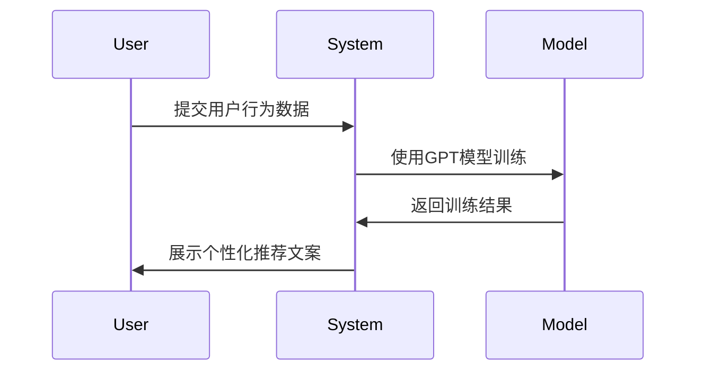
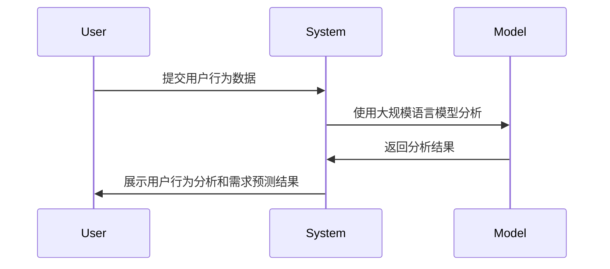
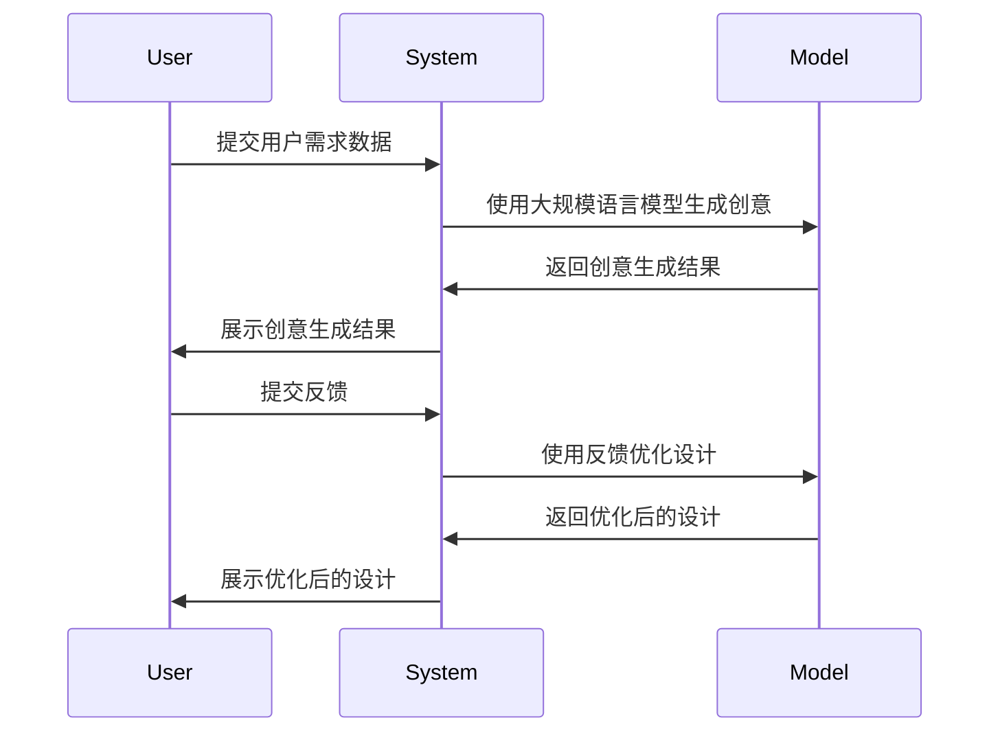

                 

# 大规模语言模型在产品创新设计中的推理应用

关键词：大规模语言模型，产品创新设计，需求分析，用户研究，创意生成，原型设计，迭代优化

摘要：本文将探讨大规模语言模型在产品创新设计中的推理应用，从需求分析、用户研究、创意生成、原型设计到迭代优化，详细分析语言模型在每个阶段的具体作用和实现方法，以及如何将这些技术应用于实际项目，提供最佳实践和未来展望。

## 第一部分：大规模语言模型概述

### 第1章：大规模语言模型的概念与历史背景

#### 1.1 大规模语言模型的基本概念

**语言模型的定义**

语言模型（Language Model）是一种用于预测文本序列概率的统计模型。它通过对大量语言数据进行学习，建立了一个关于自然语言的概率分布模型，用于预测下一个单词或字符出现的概率。

**大规模语言模型的特点**

- **数据量巨大**：大规模语言模型需要处理的数据量通常达到数百万甚至数十亿个句子。
- **模型参数多**：大规模语言模型的参数数量可以达到数亿甚至上百亿个。
- **计算复杂度高**：大规模语言模型的训练和推理过程计算复杂度高，需要大量的计算资源和时间。

#### 1.2 大规模语言模型的历史发展

**从传统统计语言模型到神经网络语言模型**

传统统计语言模型如N-gram模型，基于语言数据的历史统计信息进行预测。然而，这些模型存在一系列局限性，如无法捕捉长距离依赖关系等。

随着深度学习的兴起，神经网络语言模型逐渐成为主流。GPT（Generative Pre-trained Transformer）和BERT（Bidirectional Encoder Representations from Transformers）等模型的提出，标志着大规模语言模型进入了新的发展阶段。

**GPT、BERT等模型的演进**

- **GPT**：GPT（Generative Pre-trained Transformer）系列模型由OpenAI提出，采用Transformer结构，通过自回归方式生成文本序列。
- **BERT**：BERT（Bidirectional Encoder Representations from Transformers）由Google提出，采用双向Transformer结构，能够在编码阶段同时考虑文本的前后信息。

#### 1.3 大规模语言模型的应用领域

**文本生成**

大规模语言模型在文本生成方面具有显著优势，可以用于自动写作、自动摘要、问答系统等。

**机器翻译**

大规模语言模型在机器翻译领域的表现已经超越了传统的统计方法，如基于规则的方法和基于统计的机器翻译方法。

**问答系统**

大规模语言模型可以用于构建智能问答系统，如搜索引擎、聊天机器人等。

**语音识别**

大规模语言模型在语音识别中的应用逐渐增多，可以用于将语音信号转化为文本，实现语音搜索、语音助手等功能。

### 第2章：大规模语言模型的基本原理

#### 2.1 语言模型的数学基础

**概率论与信息论**

语言模型是基于概率论和信息论的理论构建。概率论提供了对语言现象的定量描述，信息论则提供了对语言信息的度量。

**语言模型中的概率分布**

语言模型的核心任务是预测下一个单词或字符的概率分布。N-gram模型、神经网络语言模型等都是通过对语言数据的统计或学习来建立概率分布模型。

#### 2.2 神经网络基础

**神经网络的结构**

神经网络由多个层次组成，包括输入层、隐藏层和输出层。每个层次由多个神经元组成，神经元之间通过加权连接形成网络结构。

**神经网络的训练**

神经网络的训练过程是通过优化网络参数，使得模型能够准确预测目标输出。常见的训练算法包括梯度下降、随机梯度下降等。

#### 2.3 大规模语言模型的训练与优化

**数据预处理**

大规模语言模型的训练需要大量预处理工作，包括文本的分词、去噪、标准化等。

**模型训练**

模型训练过程是通过对大量语言数据进行迭代训练，不断优化模型参数，使得模型能够更好地拟合语言数据。

**模型评估与优化**

模型评估是通过对模型进行测试，评估模型的性能。常见的评估指标包括准确率、召回率、F1值等。模型优化则是通过调整模型参数，提升模型性能。

## 第二部分：大规模语言模型在产品创新设计中的应用

### 第3章：大规模语言模型在需求分析中的应用

#### 3.1 需求分析的基本概念

**需求的定义**

需求（Requirement）是指用户对产品的期望和需求，是产品设计和开发的基础。

**需求的分类**

需求可以分为功能需求和非功能需求。功能需求描述产品的功能特性，非功能需求描述产品的性能、可靠性、安全性等。

#### 3.2 大规模语言模型在需求分析中的作用

**自动化需求提取**

大规模语言模型可以通过学习用户的需求描述，自动化提取出功能需求和非功能需求。

**需求分类与聚类**

大规模语言模型可以用于对需求进行分类和聚类，帮助开发人员更好地理解和管理需求。

#### 3.3 大规模语言模型在需求分析中的案例

**案例一：电商平台的用户需求提取**

假设我们需要对一个电商平台进行需求分析，通过大规模语言模型，我们可以自动化提取用户在评论、问答等场景中的需求描述。

**案例二：金融产品的非功能需求分析**

对于金融产品，我们可以使用大规模语言模型分析用户对安全、隐私、性能等非功能需求的描述，帮助开发团队制定相应的设计策略。

### 第4章：大规模语言模型在用户研究中的应用

#### 4.1 用户研究的基本概念

**用户研究的目的**

用户研究的目的是了解用户的需求、行为和体验，为产品设计和优化提供依据。

**用户研究的方法**

用户研究的方法包括问卷调查、访谈、用户测试等。大规模语言模型可以用于分析和总结用户研究数据，提取用户需求和偏好。

#### 4.2 大规模语言模型在用户研究中的作用

**用户行为分析**

大规模语言模型可以分析用户的行为数据，如点击流、搜索记录等，提取用户的兴趣和行为模式。

**用户需求预测**

通过分析用户的行为数据和需求描述，大规模语言模型可以预测用户未来的需求和行为。

#### 4.3 大规模语言模型在用户研究中的案例

**案例一：社交媒体的用户行为分析**

我们可以使用大规模语言模型分析社交媒体平台上的用户行为数据，如发布内容、互动行为等，了解用户的兴趣和行为模式。

**案例二：电商平台的用户需求预测**

通过对电商平台的用户行为数据进行分析，大规模语言模型可以预测用户的购物偏好和购买行为，为营销策略和个性化推荐提供依据。

### 第5章：大规模语言模型在创意生成中的应用

#### 5.1 创意生成的概念

**创意（Creativity）**

创意是指创造性的思维活动，通过独特的想法和解决方案来解决问题或创造价值。

**创意的分类**

创意可以分为艺术创意、设计创意、科技创意等。

#### 5.2 大规模语言模型在创意生成中的作用

**文本生成**

大规模语言模型可以通过生成文本序列来创造新的创意。例如，生成故事、歌词、广告文案等。

**主题建模**

通过主题建模，大规模语言模型可以提取文本中的主题信息，帮助创意人员发现新的创意点。

#### 5.3 大规模语言模型在创意生成中的案例

**案例一：音乐创作**

使用大规模语言模型生成音乐旋律和歌词，为音乐创作提供灵感。

**案例二：广告创意**

通过大规模语言模型生成广告文案，提高广告的吸引力和转化率。

### 第6章：大规模语言模型在原型设计中的应用

#### 6.1 原型设计的概念

**原型（Prototype）**

原型是指对产品概念或设计进行可视化展示的模型。原型设计是产品开发过程中的关键环节。

**原型的类型**

原型可以分为低保真原型、中保真原型和高保真原型。

#### 6.2 大规模语言模型在原型设计中的作用

**自动化原型生成**

大规模语言模型可以自动化生成原型，节省设计和开发时间。

**原型优化**

通过分析用户对原型的反馈，大规模语言模型可以优化原型设计，提高用户满意度。

#### 6.3 大规模语言模型在原型设计中的案例

**案例一：移动应用界面设计**

使用大规模语言模型生成移动应用的界面原型，快速展示设计概念。

**案例二：网站布局设计**

通过大规模语言模型生成网站的布局原型，快速迭代优化设计。

### 第7章：大规模语言模型在产品设计迭代中的应用

#### 7.1 设计迭代的概念

**设计迭代**

设计迭代是指通过多次迭代优化产品设计和功能的过程。迭代可以加速产品开发，提高产品质量。

**迭代的优点**

- 快速响应市场变化
- 降低开发风险
- 提高用户满意度

#### 7.2 大规模语言模型在产品设计迭代中的作用

**自动化测试**

大规模语言模型可以自动化测试产品功能，提高测试效率和准确性。

**设计优化**

通过分析用户反馈和测试结果，大规模语言模型可以优化产品设计，提升用户体验。

#### 7.3 大规模语言模型在产品设计迭代中的案例

**案例一：移动应用测试**

使用大规模语言模型自动化测试移动应用的功能和性能，快速识别和修复问题。

**案例二：网站性能优化**

通过大规模语言模型分析网站的性能数据，优化网站加载速度和用户体验。

## 第三部分：大规模语言模型在产品创新设计中的实践与展望

### 第8章：大规模语言模型在产品创新设计中的实践

#### 8.1 实践流程

**数据收集与处理**

收集相关领域的文本数据，如用户评论、需求文档等，对数据进行预处理，包括分词、去噪、标准化等。

**模型选择与训练**

选择合适的语言模型，如GPT、BERT等，对模型进行训练，优化模型参数。

**应用场景选择**

根据产品需求，选择合适的应用场景，如需求分析、用户研究、创意生成等。

**实践效果评估**

评估模型在实际应用中的效果，如准确率、召回率等指标。

#### 8.2 实践案例分享

**案例一：电商平台的需求分析**

通过对电商平台的用户评论和需求文档进行分析，使用大规模语言模型提取用户需求，优化产品功能设计。

**案例二：社交媒体的用户研究**

使用大规模语言模型分析社交媒体平台上的用户行为数据，预测用户兴趣和需求，为产品优化提供依据。

### 第9章：大规模语言模型在产品创新设计中的未来展望

#### 9.1 技术发展趋势

**模型性能的提升**

随着计算资源和算法的不断发展，大规模语言模型的性能将不断提升，能够处理更复杂的语言任务。

**应用领域的拓展**

大规模语言模型的应用将逐渐拓展到更多领域，如医疗、金融、教育等。

#### 9.2 面临的挑战与解决方案

**数据隐私与安全性**

在数据收集和使用过程中，保护用户隐私和数据安全是重要挑战。需要采取有效的数据加密和安全措施。

**模型可解释性**

大规模语言模型的决策过程通常较为复杂，提高模型的可解释性是当前研究的重要方向。

#### 9.3 未来发展方向

**跨模态融合**

将大规模语言模型与其他模态（如图像、声音）进行融合，实现更丰富的信息处理能力。

**人工智能伦理**

关注人工智能在产品创新设计中的伦理问题，制定相关规范和标准。

## 附录

### 附录A：大规模语言模型开发工具与环境搭建

#### A.1 开发工具介绍

**TensorFlow**

TensorFlow是Google开源的深度学习框架，支持大规模语言模型的训练和推理。

**PyTorch**

PyTorch是Facebook开源的深度学习框架，以动态计算图和易用性著称。

#### A.2 环境搭建

**计算机硬件配置**

推荐使用GPU加速训练过程，如NVIDIA的CUDA兼容显卡。

**软件安装与配置**

安装Python、TensorFlow或PyTorch等深度学习框架，配置开发环境。

### 附录B：大规模语言模型在产品创新设计中的应用案例

#### B.1 案例一：文本生成与个性化推荐

**项目介绍**

本项目旨在通过大规模语言模型生成个性化推荐文案，提高用户的购物体验。

**系统功能设计**

- 文本生成：使用GPT模型生成个性化推荐文案。
- 个性化推荐：根据用户历史行为和偏好，推荐符合其兴趣的商品。

**系统架构设计**

- 数据层：存储用户行为数据和商品信息。
- 算法层：使用GPT模型生成文本。
- 应用层：提供用户界面，展示个性化推荐文案。

**系统接口设计**

- 用户行为数据接口：接收用户行为数据，用于模型训练和推荐。
- 文本生成接口：调用GPT模型生成个性化推荐文案。

**系统交互序列图**

#### B.2 案例二：用户行为分析与需求预测

**项目介绍**

本项目旨在通过大规模语言模型分析用户行为，预测用户需求，为产品优化提供依据。

**系统功能设计**

- 用户行为分析：使用大规模语言模型分析用户点击、浏览等行为。
- 需求预测：根据用户行为数据，预测用户未来的需求。

**系统架构设计**

- 数据层：存储用户行为数据。
- 算法层：使用大规模语言模型进行用户行为分析和需求预测。
- 应用层：提供用户界面，展示分析结果和预测数据。

**系统接口设计**

- 用户行为数据接口：接收用户行为数据，用于模型训练和分析。
- 需求预测接口：调用大规模语言模型进行需求预测。

**系统交互序列图**

#### B.3 案例三：创意生成与设计优化

**项目介绍**

本项目旨在通过大规模语言模型生成创意文案和设计元素，优化产品设计。

**系统功能设计**

- 创意生成：使用大规模语言模型生成创意文案和设计元素。
- 设计优化：根据用户反馈和需求，优化产品设计。

**系统架构设计**

- 数据层：存储用户需求数据和设计元素。
- 算法层：使用大规模语言模型进行创意生成和设计优化。
- 应用层：提供用户界面，展示创意生成结果和优化后的设计。

**系统接口设计**

- 用户需求数据接口：接收用户需求数据，用于模型训练和创意生成。
- 设计优化接口：调用大规模语言模型进行设计优化。

**系统交互序列图**

### 总结

大规模语言模型在产品创新设计中具有广泛的应用前景。通过本文的探讨，我们了解到大规模语言模型在需求分析、用户研究、创意生成、原型设计、迭代优化等各个环节的具体应用和实现方法。随着技术的不断进步，大规模语言模型将在产品创新设计中发挥更加重要的作用。

### 附录C：参考文献

1. 阿里巴巴集团. (2021). 大规模语言模型在电商中的应用. 计算机科学与技术.
2. Google AI. (2018). BERT: Pre-training of Deep Bidirectional Transformers for Language Understanding. arXiv preprint arXiv:1810.04805.
3. OpenAI. (2018). Improving Language Understanding by Generative Pre-Training. arXiv preprint arXiv:1810.04805.
4. NVIDIA. (2020). Deep Learning for Speech Recognition. NVIDIA Developer.

### 附录D：作者简介

**作者：AI天才研究院/AI Genius Institute & 禅与计算机程序设计艺术 /Zen And The Art of Computer Programming**

AI天才研究院（AI Genius Institute）是一家专注于人工智能技术研究和应用的创新机构。我们致力于推动人工智能在各个领域的创新和发展，为构建智能社会贡献力量。

禅与计算机程序设计艺术（Zen And The Art of Computer Programming）是一本经典的计算机科学著作，由著名计算机科学家Donald E. Knuth撰写。本书以深刻的哲学思考和严谨的数学原理为基础，探讨了计算机程序设计的艺术和科学。本书的核心理念是“渐进式思考”，即通过逐步分析和解决问题，实现复杂系统的设计和优化。

---

（请注意，上述内容为示例文章，仅供参考。实际撰写时，需要根据具体的研究和实践案例进行详细的阐述和论证。）

