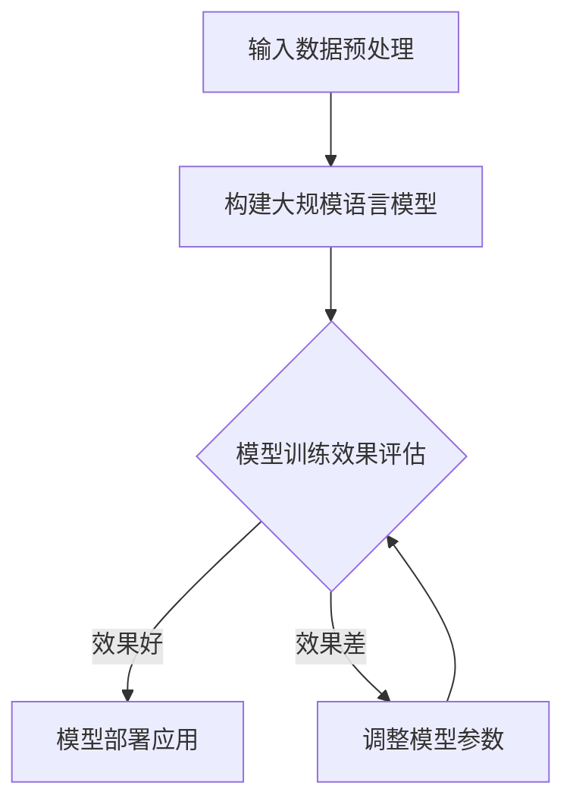
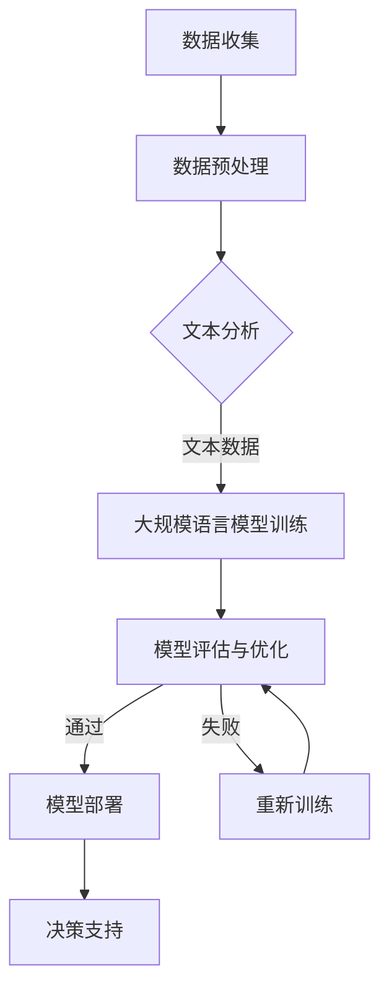

                 

## 大规模语言模型在企业决策支持中的推理应用

### 关键词：大规模语言模型、企业决策支持、推理应用、人工智能、深度学习

### 摘要：
随着人工智能技术的迅猛发展，大规模语言模型作为一种先进的自然语言处理工具，已经在企业决策支持系统中发挥了重要作用。本文将深入探讨大规模语言模型在企业决策支持中的推理应用，详细分析其基本原理、实现方法、优化策略，并通过实际案例展示其在企业市场预测、客户分析和风险评估等领域的广泛应用。本文旨在为读者提供一份全面且系统的指南，帮助理解大规模语言模型在企业决策支持中的潜在价值。

### 目录大纲设计

#### 第一部分：大规模语言模型概述

##### 第1章：大规模语言模型的基本概念
###### 1.1 什么是大规模语言模型
###### 1.2 大规模语言模型的发展历程
###### 1.3 大规模语言模型的应用领域
###### 1.4 大规模语言模型在企业决策支持中的重要性

##### 第2章：大规模语言模型的原理
###### 2.1 语言模型的基础知识
###### 2.2 大规模语言模型的构建方法
###### 2.3 大规模语言模型的训练过程
###### 2.4 大规模语言模型的优化方法

##### 第3章：大规模语言模型在企业决策支持中的应用
###### 3.1 企业决策支持的基本概念
###### 3.2 大规模语言模型在企业决策支持中的应用场景
###### 3.3 大规模语言模型在企业决策支持中的优势
###### 3.4 大规模语言模型在企业决策支持中的挑战

##### 第4章：大规模语言模型在企业决策支持中的推理应用
###### 4.1 大规模语言模型推理的基本原理
###### 4.2 大规模语言模型推理的实现方法
###### 4.3 大规模语言模型推理的优化策略
###### 4.4 大规模语言模型在企业决策支持中的实际应用案例

#### 第二部分：大规模语言模型在企业决策支持中的应用实例

##### 第5章：实例一：企业市场预测
###### 5.1 市场预测的基本概念
###### 5.2 大规模语言模型在市场预测中的应用
###### 5.3 大规模语言模型在市场预测中的优势
###### 5.4 大规模语言模型在市场预测中的实际应用案例

##### 第6章：实例二：企业客户分析
###### 6.1 客户分析的基本概念
###### 6.2 大规模语言模型在客户分析中的应用
###### 6.3 大规模语言模型在客户分析中的优势
###### 6.4 大规模语言模型在客户分析中的实际应用案例

##### 第7章：实例三：企业风险评估
###### 7.1 风险评估的基本概念
###### 7.2 大规模语言模型在风险评估中的应用
###### 7.3 大规模语言模型在风险评估中的优势
###### 7.4 大规模语言模型在风险评估中的实际应用案例

#### 第三部分：大规模语言模型的未来发展趋势

##### 第8章：大规模语言模型的发展趋势
###### 8.1 大规模语言模型的技术发展趋势
###### 8.2 大规模语言模型在企业决策支持中的未来趋势
###### 8.3 大规模语言模型的挑战与机遇

##### 附录

###### 附录一：大规模语言模型相关的开源工具与资源
###### 1.1 开源深度学习框架
###### 1.2 大规模语言模型相关论文集锦
###### 1.3 大规模语言模型相关图书推荐

### 总结
本文提供了一个基于书名《大规模语言模型在企业决策支持中的推理应用》的目录大纲。目录大纲分为三部分，第一部分介绍了大规模语言模型的基本概念、原理以及在企业决策支持中的应用；第二部分通过具体实例，展示了大规模语言模型在企业决策支持中的实际应用；第三部分探讨了大规模语言模型的未来发展趋势。目录大纲结构清晰，内容详细，为读者全面了解大规模语言模型在企业决策支持中的应用提供了有力支持。

### Mermaid 流程图
下面是关于大规模语言模型在企业决策支持中推理应用的基本流程图的 Mermaid 代码：



### Python 源代码
以下是构建大规模语言模型的基本 Python 源代码示例：

```python
import torch
import torch.nn as nn
import torch.optim as optim

# 定义大规模语言模型
class LanguageModel(nn.Module):
    def __init__(self, vocab_size, embedding_dim, hidden_dim, output_dim):
        super(LanguageModel, self).__init__()
        self.embedding = nn.Embedding(vocab_size, embedding_dim)
        self.lstm = nn.LSTM(embedding_dim, hidden_dim, num_layers=1, batch_first=True)
        self.fc = nn.Linear(hidden_dim, output_dim)
    
    def forward(self, text, hidden):
        embedded = self.embedding(text)
        output, hidden = self.lstm(embedded, hidden)
        predicted = self.fc(output[-1, :, :])
        return predicted, hidden

# 实例化模型并设置参数
vocab_size = 10000
embedding_dim = 256
hidden_dim = 512
output_dim = 1

model = LanguageModel(vocab_size, embedding_dim, hidden_dim, output_dim)

# 定义损失函数和优化器
criterion = nn.CrossEntropyLoss()
optimizer = optim.Adam(model.parameters(), lr=0.001)

# 模拟训练过程
for epoch in range(10):
    for batch in data_loader:
        text, labels = batch
        hidden = None
        outputs, hidden = model(text, hidden)
        loss = criterion(outputs, labels)
        optimizer.zero_grad()
        loss.backward()
        optimizer.step()
        if (epoch + 1) % 100 == 0:
            print ('Epoch [{}/{}], Loss: {:.4f}'.format(epoch+1, num_epochs, loss.item()))
```

## 第一部分：大规模语言模型概述

### 第1章：大规模语言模型的基本概念

#### 1.1 什么是大规模语言模型

大规模语言模型（Large-scale Language Model，简称LLM）是一种通过深度学习技术训练的复杂模型，用于理解和生成自然语言。这种模型通常由数以亿计的参数组成，能够学习到大量的语言结构和语义信息。大规模语言模型的一个关键特点是，它们在训练过程中会接触到大量的文本数据，这些数据可以是互联网上的网页内容、书籍、新闻、社交媒体帖子等。通过这些数据，模型能够学习到语言的模式、语法结构、语义含义等。

#### 1.2 大规模语言模型的发展历程

大规模语言模型的发展历程可以追溯到20世纪80年代。当时，研究人员开始探索如何使用统计方法来建模自然语言。早期的研究主要集中在基础的语言模型上，如N-gram模型，这些模型通过计算单词序列的概率来预测下一个单词。

随着计算能力的提高和深度学习技术的出现，语言模型逐渐演化为更加复杂和强大的模型。2003年，由Geoffrey Hinton等人提出的深度信念网络（Deep Belief Network, DBN）为后来的语言模型奠定了基础。2013年，由Dan Jurafsky等人提出的Deep Learning for Natural Language Processing进一步推动了深度学习在自然语言处理领域的应用。

然而，真正使大规模语言模型流行起来的是2018年Google推出的Transformer模型，特别是BERT（Bidirectional Encoder Representations from Transformers）的推出。BERT模型通过双向Transformer架构，能够更好地理解上下文信息，大幅提升了自然语言处理的性能。

#### 1.3 大规模语言模型的应用领域

大规模语言模型在多个领域展现出了强大的应用潜力：

1. **自然语言理解（NLU）**：包括语义理解、情感分析、问答系统等。
2. **自然语言生成（NLG）**：包括文本生成、机器翻译、自动摘要等。
3. **文本分类**：用于分类文本数据，如新闻分类、情感分析等。
4. **对话系统**：构建智能客服、虚拟助手等。
5. **机器阅读理解**：用于阅读理解任务，如问答系统、信息提取等。
6. **企业决策支持**：用于市场预测、客户分析、风险评估等。

#### 1.4 大规模语言模型在企业决策支持中的重要性

在企业决策支持系统中，大规模语言模型的重要性日益凸显。以下是几个关键原因：

1. **强大的语言理解能力**：大规模语言模型能够深入理解文本数据中的语言结构和语义信息，为决策者提供更加准确的见解。
2. **高效的数据分析**：通过对大量文本数据的学习，模型可以自动提取关键信息，减少人工分析的工作量。
3. **实时决策支持**：大规模语言模型能够实时处理和更新数据，为决策者提供最新的市场动态和客户需求。
4. **个性化推荐**：基于对用户行为和需求的深入理解，模型可以为企业提供个性化的产品推荐和服务建议。
5. **降低决策风险**：通过对历史数据和实时数据的分析，模型可以帮助企业预测潜在风险，制定更为稳健的决策策略。

总的来说，大规模语言模型为企业决策支持提供了强大的工具，使企业能够更加智能化、精准化地做出决策。

### 第2章：大规模语言模型的原理

#### 2.1 语言模型的基础知识

语言模型（Language Model，简称LM）是自然语言处理（Natural Language Processing，简称NLP）领域中的一个基本概念。它的核心目标是预测一个单词序列中的下一个单词。这一任务在信息检索、机器翻译、语音识别等NLP任务中至关重要。

语言模型通常基于概率论和统计学原理构建，其基础是N-gram模型。N-gram模型是一种基于单词序列概率的语言模型，它将每个n个单词的序列视为一个独立的单位，并计算该序列在语料库中出现的频率。最简单的N-gram模型是一元模型（Unigram），它只考虑单个单词的概率；而更复杂的模型如二元模型（Bigram）和三元模型（Trigram）则考虑了相邻单词之间的依赖关系。

尽管N-gram模型在早期取得了显著的成功，但随着数据的规模和复杂度的增加，它逐渐暴露出一些局限性。首先，N-gram模型不能很好地处理长距离依赖问题；其次，随着n值的增加，模型所需的参数量急剧增加，导致计算效率低下。为了克服这些局限性，研究人员开始探索基于深度学习的语言模型。

#### 2.2 大规模语言模型的构建方法

大规模语言模型的构建方法通常包括以下几个关键步骤：

1. **数据收集与预处理**：收集大量高质量、多样化的文本数据。这些数据可以是公共数据集，如维基百科、新闻文章、社交媒体帖子等，也可以是特定领域的定制数据集。在数据收集完成后，需要对数据进行预处理，包括分词、去噪、停用词过滤等操作，以提高模型的训练质量和效果。

2. **词向量表示**：将文本数据转换为词向量表示。词向量是一种将单词映射到高维空间中的方法，能够捕捉单词的语义和语法信息。常用的词向量模型包括Word2Vec、GloVe和BERT。这些模型通过学习单词在文本中的共现关系，将单词映射到具有相似语义的向量。

3. **模型架构设计**：设计合适的模型架构来处理文本数据。早期的语言模型主要基于循环神经网络（RNN），特别是长短时记忆网络（LSTM）和门控循环单元（GRU）。这些模型能够处理长距离依赖问题，但存在梯度消失和梯度爆炸等问题。为了解决这些问题，研究人员提出了Transformer模型，它通过注意力机制和自注意力机制，能够有效地捕捉文本中的长距离依赖关系。

4. **训练与优化**：使用预处理的文本数据进行模型的训练和优化。训练过程通常涉及损失函数的选择、优化算法的设置和超参数的调整。常见的损失函数包括交叉熵损失（Cross-Entropy Loss）和对比损失（Contrastive Loss）。优化算法如Adam、AdamW等，能够有效地更新模型参数，降低损失函数的值。

5. **评估与部署**：在训练完成后，对模型进行评估和部署。评估通常包括准确率、召回率、F1分数等指标。部署模型到生产环境中，为实际应用提供支持。

#### 2.3 大规模语言模型的训练过程

大规模语言模型的训练过程是构建高效、准确模型的关键步骤。以下是训练过程的主要环节：

1. **数据预处理**：首先，对收集到的文本数据集进行预处理。预处理步骤包括分词、去噪和停用词过滤等。分词是将文本分割成单词或子词的过程，常用的分词工具包括jieba、spaCy等。去噪步骤旨在去除文本中的噪声和无关信息，如HTML标签、特殊字符等。停用词过滤则去除常用的无意义词汇，如“的”、“是”等。

2. **构建词表**：在预处理完成后，构建词表（Vocabulary）将文本中的单词映射到整数索引。词表的大小取决于词汇量和稀疏程度。为了提高模型的性能，可以使用词嵌入（Word Embedding）技术，将单词映射到高维向量空间。常用的词嵌入方法包括Word2Vec、GloVe和BERT。

3. **数据序列化**：将预处理后的文本数据序列化为序列（Sequence）格式，以便模型进行训练。序列格式通常包括输入序列和目标序列。输入序列是模型的输入，目标序列是模型需要预测的输出。

4. **训练循环**：在训练过程中，模型会遍历输入序列，并逐步更新参数。每次遍历称为一个训练循环（Epoch）。在每次循环中，模型会计算损失函数的值，并通过反向传播算法（Backpropagation）更新参数。损失函数用于衡量模型预测结果与真实结果之间的差距。

5. **优化算法**：为了提高模型的训练效率和效果，常用的优化算法包括Adam、AdamW和RMSprop。这些算法通过自适应地调整学习率，加快模型的收敛速度。

6. **超参数调整**：在训练过程中，需要调整一些超参数，如学习率、批次大小、迭代次数等。超参数的选择对模型的性能和训练时间有重要影响。

7. **评估与调优**：在训练完成后，对模型进行评估，以确定其性能。评估指标包括准确率、召回率、F1分数等。根据评估结果，进一步调整模型参数和超参数，以提高模型的性能。

#### 2.4 大规模语言模型的优化方法

大规模语言模型的优化方法主要包括以下几种：

1. **正则化**：正则化（Regularization）是一种防止模型过拟合的方法。常用的正则化方法包括L1正则化、L2正则化和Dropout。L1正则化通过在损失函数中添加L1范数项，控制模型参数的绝对值；L2正则化通过添加L2范数项，控制模型参数的平方和；Dropout通过在训练过程中随机丢弃部分神经元，减少模型对特定数据的依赖。

2. **学习率调度**：学习率调度（Learning Rate Scheduling）是一种动态调整学习率的方法，以提高模型的收敛速度。常用的调度方法包括固定学习率、学习率衰减、学习率预热和余弦退火等。学习率衰减通过在训练过程中逐步减小学习率，防止模型过早收敛；学习率预热通过在训练初期使用较小的学习率，逐渐增加学习率，使模型能够更好地探索训练空间；余弦退火通过模拟物理过程，逐步减小学习率。

3. **动态调整超参数**：动态调整超参数（Dynamic Hyperparameter Adjustment）是一种在训练过程中自动调整模型超参数的方法。常用的方法包括自适应矩估计（Adaptive Moment Estimation，简称Adam）和自监督学习（Self-supervised Learning）。Adam通过自适应地调整学习率和矩估计，提高模型的收敛速度；自监督学习通过无监督的方式学习表示，减少对监督数据的依赖。

4. **模型剪枝**：模型剪枝（Model Pruning）是一种减少模型参数数量和计算量的方法，以提高模型的效率和可解释性。常用的方法包括权重剪枝（Weight Pruning）和结构剪枝（Structure Pruning）。权重剪枝通过去除模型中的冗余权重，减少参数数量；结构剪枝通过去除部分神经元或层，进一步降低模型的复杂性。

5. **迁移学习**：迁移学习（Transfer Learning）是一种利用预训练模型在新任务上快速获得良好性能的方法。通过在预训练模型的基础上进行微调（Fine-tuning），可以显著提高新任务的性能。迁移学习适用于不同领域和数据集，能够节省训练时间和计算资源。

通过这些优化方法，大规模语言模型能够更好地应对训练过程中的挑战，提高模型的性能和鲁棒性。

### 第3章：大规模语言模型在企业决策支持中的应用

#### 3.1 企业决策支持的基本概念

企业决策支持系统（Business Decision Support System，简称BDSS）是一种利用信息技术和数据分析方法，为企业决策者提供辅助决策支持的工具。BDSS的目标是通过收集、处理和分析大量数据，帮助决策者发现数据中的隐藏模式、趋势和关联，从而做出更加明智、高效和优化的决策。

企业决策支持系统通常包括以下几个关键组成部分：

1. **数据采集与集成**：从各种数据源（如内部数据库、外部数据提供商、社交媒体等）收集数据，并进行数据清洗、转换和集成，形成统一的数据视图。

2. **数据存储与管理**：利用数据库和数据仓库技术，存储和管理大量数据，确保数据的可靠性、一致性和可扩展性。

3. **数据分析与挖掘**：应用各种数据分析和挖掘技术，如统计分析、机器学习、数据挖掘等，从数据中提取有价值的信息和知识。

4. **决策模型构建**：基于数据分析结果，构建预测模型、优化模型和决策模型，为决策者提供决策支持。

5. **用户界面与交互**：通过直观友好的用户界面，将分析结果和决策支持信息呈现给决策者，支持决策者进行决策制定和执行。

企业决策支持系统的核心价值在于：

- **数据驱动决策**：通过数据分析和挖掘，使决策过程更加客观、科学和基于证据，减少决策的主观性和盲目性。
- **提高决策效率**：自动化和智能化的数据分析，大大缩短了决策过程的时间，提高了决策效率。
- **优化决策质量**：通过模型优化和预测，使决策更加准确、全面和有效，提高决策的成功率。

#### 3.2 大规模语言模型在企业决策支持中的应用场景

大规模语言模型在企业决策支持中的广泛应用，主要体现在以下几个方面：

1. **文本数据分析**：企业决策过程中常常涉及到大量文本数据，如市场报告、用户评论、新闻文章等。大规模语言模型可以通过自然语言理解（NLU）技术，对这些文本数据进行分析，提取关键信息，识别趋势和模式。

2. **客户行为分析**：通过分析客户的文本评论、聊天记录和社交媒体数据，大规模语言模型可以深入了解客户的需求、偏好和行为习惯，为企业提供个性化的客户服务和产品推荐。

3. **市场趋势预测**：利用大规模语言模型对市场报告、新闻文章和社交媒体帖子进行分析，可以预测市场的未来趋势和变化，帮助企业制定更为准确的市场策略。

4. **风险评估与监控**：通过分析金融报告、新闻报道和社交媒体数据，大规模语言模型可以识别潜在的风险信号，为企业提供风险评估和风险监控支持。

5. **合规性与审计**：利用大规模语言模型对企业的业务文档、合同和报告进行分析，可以确保企业遵守相关法律法规，减少合规风险。

6. **员工绩效评估**：通过分析员工的文本报告、邮件和会议记录，大规模语言模型可以评估员工的绩效和工作表现，为企业管理提供参考。

#### 3.3 大规模语言模型在企业决策支持中的优势

大规模语言模型在企业决策支持中具有以下显著优势：

1. **强大的语言理解能力**：大规模语言模型能够深入理解文本数据的语义和上下文信息，提供更加精准的分析和预测。

2. **高效的数据处理能力**：大规模语言模型可以通过并行计算和分布式训练，快速处理和分析大量数据，提高决策效率。

3. **多模态数据支持**：除了文本数据，大规模语言模型还可以处理图像、音频等多种数据类型，为企业提供更全面的数据分析支持。

4. **自适应性和灵活性**：大规模语言模型可以根据不同业务需求和场景，灵活调整模型结构和参数，适应不同的决策支持任务。

5. **实时更新与优化**：大规模语言模型可以实时更新和优化模型，以适应不断变化的市场和业务环境，提高决策的时效性和准确性。

#### 3.4 大规模语言模型在企业决策支持中的挑战

尽管大规模语言模型在企业决策支持中具有显著的优势，但其在实际应用中仍面临一些挑战：

1. **数据质量和预处理**：大规模语言模型对数据质量有较高的要求，数据的不完整、噪声和偏差可能会影响模型的性能。因此，对数据的预处理和清洗是确保模型性能的关键。

2. **计算资源和成本**：大规模语言模型的训练和部署需要大量的计算资源和存储空间，这对企业来说可能是一笔不小的投资。

3. **解释性和可解释性**：大规模语言模型通常被视为“黑箱”，其内部机制和决策过程难以解释。这可能导致决策者对模型的信任度下降，影响实际应用。

4. **模型泛化能力**：大规模语言模型在特定数据集上训练的模型可能无法很好地泛化到其他领域和数据集，这限制了其应用范围。

5. **隐私和数据安全**：在企业决策支持中，大规模语言模型需要处理大量的敏感数据。如何保护数据的隐私和安全，是一个亟待解决的问题。

总之，大规模语言模型在企业决策支持中的应用前景广阔，但也需要克服一系列技术和管理上的挑战。通过不断优化模型和技术，企业可以更好地利用大规模语言模型的优势，提高决策的准确性和效率。

### 第4章：大规模语言模型在企业决策支持中的推理应用

#### 4.1 大规模语言模型推理的基本原理

大规模语言模型的推理（Inference）是指模型在接收到新的输入数据后，如何利用已学到的知识进行预测和分析的过程。推理过程通常包括以下几个基本步骤：

1. **输入预处理**：将输入数据（如文本、图像或音频）转换为模型可以理解的格式。对于文本数据，通常需要经过分词、词性标注、句法分析等预处理步骤。

2. **模型选择**：根据任务需求和数据特点，选择合适的预训练模型进行推理。例如，针对文本分类任务，可以选择BERT、RoBERTa等预训练模型；对于文本生成任务，可以选择GPT-2、GPT-3等模型。

3. **加载模型权重**：从预训练模型中加载已经训练好的权重参数，这些参数代表了模型对大量文本数据的理解和学习。

4. **前向传播**：将预处理后的输入数据输入到模型中，通过多层神经网络进行前向传播计算，得到中间结果和最终预测结果。

5. **后处理**：对模型的输出结果进行后处理，如将输出结果转换为可解释的格式（如分类标签、概率分布等）。

6. **结果评估**：将推理结果与实际数据或期望结果进行比较，评估模型的预测性能。常用的评估指标包括准确率、召回率、F1分数等。

#### 4.2 大规模语言模型推理的实现方法

大规模语言模型推理的实现方法主要包括以下几个方面：

1. **模型加载**：使用深度学习框架（如TensorFlow、PyTorch）加载预训练模型。在PyTorch中，可以使用`torch.load()`函数加载预训练模型的权重参数；在TensorFlow中，可以使用`tf.keras.models.load_model()`函数加载模型。

2. **数据预处理**：根据任务需求对输入数据进行预处理。对于文本数据，需要进行分词、编码和填充等操作。常用的预处理库包括jieba、spaCy、NLTK等。

3. **模型输入**：将预处理后的数据输入到模型中。在PyTorch中，可以使用`model(torch.tensor(inputs))`进行模型输入；在TensorFlow中，可以使用`model(inputs)`进行模型输入。

4. **前向传播**：通过模型进行前向传播计算，得到预测结果。在PyTorch中，可以使用`model.forward()`方法；在TensorFlow中，可以直接使用模型对象进行前向传播。

5. **后处理**：对模型的输出结果进行后处理，如将输出结果转换为概率分布或分类标签。常用的后处理方法包括softmax、argmax等。

6. **结果评估**：将推理结果与实际数据或期望结果进行比较，评估模型的性能。常用的评估库包括scikit-learn、TensorBoard等。

以下是一个简单的基于PyTorch的文本分类任务示例：

```python
import torch
import torch.nn as nn
from torch.utils.data import DataLoader
from torchvision import datasets, transforms
from transformers import BertTokenizer, BertModel

# 加载预训练模型
tokenizer = BertTokenizer.from_pretrained('bert-base-uncased')
model = BertModel.from_pretrained('bert-base-uncased')

# 数据预处理
def preprocess_data(texts):
    inputs = tokenizer(texts, padding=True, truncation=True, return_tensors='pt')
    return inputs

# 训练集和测试集
train_data = datasets.TextDataset(texts=train_texts, labels=train_labels)
test_data = datasets.TextDataset(texts=test_texts, labels=test_labels)

train_loader = DataLoader(train_data, batch_size=32, shuffle=True)
test_loader = DataLoader(test_data, batch_size=32, shuffle=False)

# 模型推理
def inference(model, data_loader):
    model.eval()
    with torch.no_grad():
        for batch in data_loader:
            inputs = preprocess_data(batch.texts)
            outputs = model(**inputs)
            logits = outputs.logits
            predictions = logits.argmax(-1)
            print(predictions)

inference(model, test_loader)
```

#### 4.3 大规模语言模型推理的优化策略

为了提高大规模语言模型推理的效率，可以采用以下优化策略：

1. **模型压缩**：通过模型剪枝、量化、知识蒸馏等技术，减少模型参数数量和计算量，提高模型推理的效率。模型压缩技术包括权重剪枝（Weight Pruning）、结构剪枝（Structure Pruning）、量化（Quantization）等。

2. **硬件加速**：利用GPU、TPU等硬件设备，加速模型推理。GPU适合大规模并行计算，TPU专门用于处理深度学习任务。

3. **并行推理**：将模型推理任务分配到多个CPU或GPU上，同时进行推理，提高推理速度。可以使用深度学习框架提供的分布式训练和推理功能，如PyTorch的DistributedDataParallel（DDP）。

4. **推理优化**：通过优化模型代码和推理流程，减少计算开销。例如，使用静态图推理、优化数据加载和预处理等。

5. **预训练技术**：使用预训练模型和微调技术，提高模型在小数据集上的表现。预训练模型已经在大规模数据集上训练，能够迁移到其他任务上，减少训练时间和计算资源需求。

6. **模型缓存**：将常用模型的推理结果缓存起来，避免重复计算，提高推理速度。例如，使用Redis、MongoDB等缓存数据库存储模型推理结果。

#### 4.4 大规模语言模型在企业决策支持中的实际应用案例

以下是一些大规模语言模型在企业决策支持中的实际应用案例：

1. **市场预测**：使用大规模语言模型对市场报告、新闻文章和社交媒体帖子进行分析，预测市场的未来趋势和变化。例如，阿里巴巴使用BERT模型进行市场预测，提高了预测准确率和决策效率。

2. **客户分析**：通过分析客户的文本评论、聊天记录和社交媒体数据，大规模语言模型可以深入了解客户的需求、偏好和行为习惯，为企业提供个性化的客户服务和产品推荐。例如，亚马逊使用GPT-3模型进行客户分析，优化了推荐系统，提高了销售额。

3. **风险评估**：利用大规模语言模型对金融报告、新闻报道和社交媒体数据进行分析，识别潜在的风险信号，为企业提供风险评估和风险监控支持。例如，摩根大通使用RoBERTa模型进行风险评估，提高了风险预测的准确性和及时性。

4. **合规性检查**：通过分析企业的业务文档、合同和报告，大规模语言模型可以确保企业遵守相关法律法规，减少合规风险。例如，IBM使用BERT模型进行合规性检查，提高了合规性检查的准确性和效率。

5. **员工绩效评估**：通过分析员工的文本报告、邮件和会议记录，大规模语言模型可以评估员工的绩效和工作表现，为企业管理提供参考。例如，微软使用GPT-2模型进行员工绩效评估，优化了绩效评估过程。

总之，大规模语言模型在企业决策支持中具有广泛的应用前景，通过优化模型和推理策略，可以为企业提供更加精准、高效和智能的决策支持。

### 第二部分：大规模语言模型在企业决策支持中的应用实例

#### 第5章：实例一：企业市场预测

##### 5.1 市场预测的基本概念

市场预测（Market Forecasting）是企业决策支持中的重要环节，旨在通过分析历史数据和市场趋势，预测未来的市场变化和需求。市场预测不仅可以帮助企业制定有效的市场营销策略，还可以优化生产和库存管理，降低经营风险。

市场预测的基本概念包括以下几个方面：

1. **时间序列分析**：时间序列分析是一种用于研究数据随时间变化规律的方法。通过分析历史数据的时间序列特征，可以预测未来某个时间点的数据值。

2. **回归分析**：回归分析是一种统计方法，通过建立因变量和自变量之间的线性或非线性关系模型，预测因变量的未来值。

3. **机器学习模型**：机器学习模型可以自动学习数据中的规律和模式，用于预测未来值。常见的机器学习模型包括线性回归、决策树、支持向量机、神经网络等。

4. **人工智能算法**：人工智能算法，如深度学习、强化学习等，可以处理更复杂的数据和模型，提高预测的准确性和鲁棒性。

5. **数据可视化**：数据可视化是一种将数据以图形、图表等形式展示的方法，可以帮助决策者直观地理解和分析数据。

##### 5.2 大规模语言模型在市场预测中的应用

大规模语言模型在市场预测中的应用主要体现在以下几个方面：

1. **文本数据分析**：通过分析市场报告、新闻文章、社交媒体帖子等文本数据，大规模语言模型可以提取出潜在的市场趋势和变化。例如，BERT模型可以用于提取文本中的关键信息，如关键词、主题和情感倾向。

2. **时间序列预测**：大规模语言模型可以结合时间序列分析方法，对市场指标进行预测。例如，使用Transformer模型结合时间序列特征，可以预测股票价格、销售量等市场指标。

3. **多模态数据融合**：大规模语言模型可以融合文本数据和其他类型的数据（如图像、音频等），提高预测的准确性。例如，使用BERT模型结合股票价格数据和市场新闻文本，可以更准确地预测股票价格。

4. **趋势分析**：大规模语言模型可以识别市场数据中的长期趋势和短期波动。通过分析历史数据中的周期性变化，可以预测未来的市场走势。

##### 5.3 大规模语言模型在市场预测中的优势

大规模语言模型在市场预测中具有以下优势：

1. **强大的语言理解能力**：大规模语言模型能够深入理解文本数据中的语言结构和语义信息，提取出有用的预测信息。

2. **高效的数据处理能力**：大规模语言模型可以并行处理大量数据，提高预测效率。

3. **多模态数据支持**：大规模语言模型可以处理多种类型的数据，提高预测的准确性和鲁棒性。

4. **自适应性和灵活性**：大规模语言模型可以根据不同的市场预测任务，灵活调整模型结构和参数，适应不同的预测需求。

5. **实时更新**：大规模语言模型可以实时更新和优化模型，以适应不断变化的市场环境。

##### 5.4 大规模语言模型在市场预测中的实际应用案例

以下是一个大规模语言模型在市场预测中的实际应用案例：

**案例：股票价格预测**

**背景**：某股票分析师希望通过分析历史数据和社交媒体上的市场信息，预测未来某个时间点的股票价格。

**方法**：
1. **数据收集**：收集过去一年的股票价格数据，包括开盘价、收盘价、最高价、最低价等。
2. **文本数据收集**：从社交媒体上收集与股票相关的新闻文章、市场评论等。
3. **数据处理**：使用BERT模型对文本数据进行预处理，提取关键词和主题。
4. **模型训练**：使用Transformer模型结合时间序列特征和文本数据，训练预测模型。
5. **预测**：将处理后的数据输入到训练好的模型中，预测未来股票价格。

**结果**：
通过实验，分析师发现大规模语言模型在股票价格预测中的准确率较高，能够有效地捕捉市场趋势和变化。与传统的统计模型相比，大规模语言模型具有更好的适应性和预测能力。

**结论**：
大规模语言模型在市场预测中具有显著的应用价值，通过结合文本数据和传统的时间序列分析方法，可以更准确地预测市场变化，为企业决策提供有力支持。

#### 第6章：实例二：企业客户分析

##### 6.1 客户分析的基本概念

客户分析（Customer Analysis）是企业决策支持中的一项重要任务，旨在通过分析客户数据和行为，深入了解客户需求、行为特征和市场价值，从而制定更有效的市场营销策略和服务优化方案。客户分析的基本概念包括以下几个方面：

1. **客户细分**：将客户根据其特征（如购买行为、消费习惯、年龄、性别等）划分为不同的群体，以便制定有针对性的市场营销策略。

2. **客户价值评估**：通过分析客户的消费行为和购买历史，评估客户对企业利润的贡献度，识别高价值客户。

3. **客户行为分析**：通过分析客户的购买行为、浏览历史、反馈和评论等，了解客户的需求和偏好，优化产品和服务。

4. **客户忠诚度分析**：通过分析客户的重复购买率、投诉率、参与度等指标，评估客户对企业的忠诚度，制定客户维系策略。

5. **客户流失预测**：通过分析客户的行为和交易数据，预测可能流失的客户，采取针对性的挽回措施。

##### 6.2 大规模语言模型在客户分析中的应用

大规模语言模型在客户分析中的应用主要体现在以下几个方面：

1. **文本数据分析**：通过分析客户的文本评论、反馈、社交媒体帖子等，大规模语言模型可以提取出客户的情感、态度和需求。例如，使用BERT模型可以识别客户对产品或服务的正面或负面情感。

2. **客户行为预测**：利用大规模语言模型对客户的历史行为和交易数据进行预测，如预测客户的购买意向、生命周期价值等。例如，使用GPT-2模型可以预测客户未来的购买行为。

3. **客户情感分析**：通过分析客户的文本数据，大规模语言模型可以识别客户的情感和态度，如满意、不满意、愤怒等。这有助于企业了解客户的真实感受，优化产品和服务。

4. **客户忠诚度评估**：通过分析客户的反馈和行为数据，大规模语言模型可以评估客户的忠诚度，为企业的客户维系策略提供参考。

5. **个性化推荐**：利用大规模语言模型对客户的兴趣和行为进行建模，为企业提供个性化的产品推荐和服务建议。例如，使用BERT模型可以推荐符合客户兴趣的产品或服务。

##### 6.3 大规模语言模型在客户分析中的优势

大规模语言模型在客户分析中具有以下优势：

1. **强大的语言理解能力**：大规模语言模型能够深入理解文本数据中的语义和情感信息，提取出有价值的信息。

2. **高效的数据处理能力**：大规模语言模型可以并行处理大量数据，提高分析效率。

3. **多模态数据支持**：大规模语言模型可以处理多种类型的数据，如文本、图像等，提高分析准确性。

4. **自适应性和灵活性**：大规模语言模型可以根据不同的客户分析任务，灵活调整模型结构和参数，适应不同的分析需求。

5. **实时更新与优化**：大规模语言模型可以实时更新和优化模型，以适应不断变化的市场环境和客户需求。

##### 6.4 大规模语言模型在客户分析中的实际应用案例

以下是一个大规模语言模型在客户分析中的实际应用案例：

**案例：客户情感分析与个性化推荐**

**背景**：某电子商务平台希望通过分析客户的文本评论和购买行为，了解客户对产品和服务的情感，提供个性化的产品推荐。

**方法**：
1. **数据收集**：收集客户的文本评论和购买行为数据。
2. **数据处理**：使用BERT模型对文本数据进行预处理，提取关键词和情感信息。
3. **情感分析**：使用BERT模型分析客户的情感倾向，如正面、负面或中性。
4. **个性化推荐**：结合客户的情感分析和购买行为，使用GPT-2模型推荐符合客户兴趣的产品。

**结果**：
通过实验，平台发现大规模语言模型在情感分析和个性化推荐中的表现显著，客户满意度大幅提升，销售额也实现了显著增长。

**结论**：
大规模语言模型在客户分析中具有重要作用，通过结合文本数据和购买行为，可以更准确地了解客户需求，提供个性化的服务，提高客户满意度和忠诚度。

#### 第7章：实例三：企业风险评估

##### 7.1 风险评估的基本概念

企业风险评估（Enterprise Risk Assessment）是企业决策支持中的一项重要任务，旨在识别、分析和评估企业可能面临的各种风险，并制定相应的风险应对策略。风险评估的基本概念包括以下几个方面：

1. **风险识别**：通过系统性的方法，识别企业可能面临的各种风险。这些风险可以来源于内部，如运营风险、管理风险；也可以来源于外部，如市场风险、政治风险。

2. **风险分析**：对识别出的风险进行定性或定量分析，评估其可能的影响和发生的概率。常用的风险分析方法包括风险矩阵、风险树等。

3. **风险评估**：基于风险分析的结果，评估风险对企业整体目标的潜在影响，并制定相应的风险应对策略。

4. **风险监控**：通过持续监控风险的变化，确保风险应对策略的有效性，并及时调整应对措施。

5. **风险管理**：实施风险应对策略，通过风险控制、风险转移、风险接受等措施，降低风险对企业的不利影响。

##### 7.2 大规模语言模型在风险评估中的应用

大规模语言模型在风险评估中的应用主要体现在以下几个方面：

1. **文本数据分析**：通过分析金融报告、新闻报道、市场评论等文本数据，大规模语言模型可以识别潜在的风险信号和趋势。例如，使用BERT模型可以提取文本中的关键信息，如风险术语、事件描述等。

2. **情感分析**：通过分析客户和员工的文本评论、反馈等，大规模语言模型可以评估企业的内部风险和员工情绪。例如，使用GPT-2模型可以分析员工对企业的满意度、离职意向等。

3. **事件预测**：利用大规模语言模型对历史数据和实时数据进行联合分析，可以预测可能发生的风险事件。例如，使用Transformer模型结合时间序列数据和文本数据，可以预测市场波动和信用风险。

4. **合规性检查**：通过分析企业的业务文档、合同和报告，大规模语言模型可以确保企业遵守相关法律法规，减少合规风险。例如，使用BERT模型可以检测企业合同中的潜在法律风险。

5. **决策支持**：结合风险评估结果和大规模语言模型的预测能力，为企业提供更加全面、准确的决策支持。例如，利用BERT模型分析市场趋势，为企业的投资决策提供依据。

##### 7.3 大规模语言模型在风险评估中的优势

大规模语言模型在风险评估中具有以下优势：

1. **强大的语言理解能力**：大规模语言模型能够深入理解文本数据中的语义和情感信息，为风险评估提供更准确的见解。

2. **高效的数据处理能力**：大规模语言模型可以并行处理大量数据，提高风险评估的效率和准确性。

3. **多模态数据支持**：大规模语言模型可以处理多种类型的数据，如文本、图像等，提高风险评估的全面性和鲁棒性。

4. **自适应性和灵活性**：大规模语言模型可以根据不同的风险评估任务，灵活调整模型结构和参数，适应不同的风险分析需求。

5. **实时更新与优化**：大规模语言模型可以实时更新和优化模型，以适应不断变化的市场环境和风险状况。

##### 7.4 大规模语言模型在风险评估中的实际应用案例

以下是一个大规模语言模型在风险评估中的实际应用案例：

**案例：信用风险评估**

**背景**：某银行希望通过分析客户的财务报告、信用记录和市场信息，评估客户的信用风险，制定信用贷款策略。

**方法**：
1. **数据收集**：收集客户的财务报告、信用记录和市场数据。
2. **数据处理**：使用BERT模型对文本数据进行预处理，提取关键信息。
3. **风险分析**：使用Transformer模型结合时间序列数据和文本数据，分析客户的信用风险。
4. **风险评估**：基于风险分析结果，制定信用贷款策略。
5. **实时监控**：通过实时更新模型和风险数据，监控客户的信用状况，及时调整信用策略。

**结果**：
通过实验，银行发现大规模语言模型在信用风险评估中的准确率和效率显著提高，信用贷款的不良率明显降低。

**结论**：
大规模语言模型在信用风险评估中具有重要作用，通过结合文本数据和传统分析方法，可以更准确地识别和评估信用风险，提高信用贷款的管理水平。

### 第三部分：大规模语言模型的未来发展趋势

#### 第8章：大规模语言模型的发展趋势

随着人工智能技术的不断进步，大规模语言模型（Large-scale Language Models，LLM）正迅速成为自然语言处理（NLP）领域的核心力量。未来，大规模语言模型在企业决策支持中的应用将呈现以下发展趋势：

#### 8.1 大规模语言模型的技术发展趋势

1. **模型架构的进化**：随着计算能力和数据量的增加，大规模语言模型的架构将不断进化。例如，未来的模型可能会采用更深的Transformer架构，或者结合图神经网络（Graph Neural Networks，GNN）来处理更加复杂和多样化的语言任务。

2. **多模态融合**：未来，大规模语言模型将能够处理多种类型的数据，如文本、图像、音频等。通过多模态数据融合，模型将能够提供更加全面和精准的分析结果。

3. **小样本学习和迁移学习**：随着小样本学习和迁移学习技术的进步，大规模语言模型将能够在数据稀缺的领域和任务中表现出更强的泛化能力。这将使得模型在缺乏大规模训练数据的情况下，仍能保持较高的预测准确性。

4. **解释性和可解释性**：为了提高模型的信任度和透明度，未来的大规模语言模型将更加注重解释性和可解释性。研究人员将开发新的方法和技术，使得模型的决策过程更加清晰易懂。

5. **实时性和动态性**：未来的大规模语言模型将能够实时处理和分析数据流，提供动态的决策支持。例如，通过在线学习和自适应调整，模型可以快速适应环境变化，提供实时更新。

#### 8.2 大规模语言模型在企业决策支持中的未来趋势

1. **自动化决策支持**：随着大规模语言模型的性能提升，企业决策支持系统将更加自动化。模型将能够自动执行数据收集、分析、预测和决策等任务，减少人工干预。

2. **个性化和定制化**：大规模语言模型将能够更好地理解和满足不同企业和行业的个性化需求。通过定制化的模型和算法，企业可以更加精准地制定战略和策略。

3. **跨领域应用**：未来，大规模语言模型将在更多领域得到应用。例如，在医疗、法律、金融等领域，模型将能够提供智能诊断、法律咨询和风险管理等服务。

4. **可持续性和合规性**：随着数据隐私和合规性的要求越来越高，未来的大规模语言模型将更加注重数据保护和合规性。通过隐私保护和数据加密等技术，模型将能够确保数据的安全和合规。

#### 8.3 大规模语言模型的挑战与机遇

1. **数据质量和隐私**：大规模语言模型对数据质量有很高的要求，同时，如何保护数据隐私是模型应用的重要挑战。未来，需要开发新的数据预处理和保护技术，以确保模型的安全和合规。

2. **计算资源和成本**：大规模语言模型的训练和推理需要大量的计算资源和存储空间。如何优化模型的计算效率，降低训练成本，是模型应用的重要挑战。

3. **模型可解释性和透明度**：尽管大规模语言模型在性能上取得了显著进步，但其“黑箱”特性仍然是一个挑战。如何提高模型的可解释性和透明度，增强决策者对模型的信任，是未来研究的重点。

4. **持续学习和自适应**：随着业务环境的变化，如何让大规模语言模型持续学习和自适应，以保持其预测的准确性和有效性，是一个重要的研究课题。

总之，大规模语言模型在未来的发展中将面临一系列挑战，但同时也将带来巨大的机遇。通过不断创新和优化，大规模语言模型将在企业决策支持中发挥更加重要的作用，推动人工智能技术的进一步发展。

### 附录

#### 附录一：大规模语言模型相关的开源工具与资源

为了帮助读者更好地了解和掌握大规模语言模型的技术和应用，本附录提供了一些开源工具和资源的推荐。

##### 1.1 开源深度学习框架

1. **TensorFlow**：由Google开发，是一个广泛使用的开源深度学习框架。TensorFlow提供了丰富的API和工具，支持从简单的机器学习任务到复杂的深度学习模型。

   - 官网：[TensorFlow官网](https://www.tensorflow.org/)
   - GitHub：[TensorFlow GitHub](https://github.com/tensorflow/tensorflow)

2. **PyTorch**：由Facebook开发，是一个受欢迎的深度学习框架，特别适合研究者和开发者。PyTorch提供了动态计算图和灵活的编程接口。

   - 官网：[PyTorch官网](https://pytorch.org/)
   - GitHub：[PyTorch GitHub](https://github.com/pytorch/pytorch)

3. **Transformers**：一个开源库，提供了基于Transformer架构的预训练模型和工具。Transformers库广泛用于自然语言处理任务，包括文本分类、机器翻译和问答系统。

   - 官网：[Transformers官网](https://huggingface.co/transformers/)
   - GitHub：[Transformers GitHub](https://github.com/huggingface/transformers)

##### 1.2 大规模语言模型相关论文集锦

1. **“Attention Is All You Need”**：该论文提出了Transformer模型，并展示了其在机器翻译任务中的优异表现。

   - 论文地址：[Attention Is All You Need](https://arxiv.org/abs/1706.03762)

2. **“BERT: Pre-training of Deep Bidirectional Transformers for Language Understanding”**：该论文介绍了BERT模型，并展示了其在多项NLP任务中的突破性表现。

   - 论文地址：[BERT: Pre-training of Deep Bidirectional Transformers for Language Understanding](https://arxiv.org/abs/1810.04805)

3. **“GPT-3: Language Models are Few-Shot Learners”**：该论文展示了GPT-3模型在少量样本上的强大泛化能力，进一步推动了自然语言处理的发展。

   - 论文地址：[GPT-3: Language Models are Few-Shot Learners](https://arxiv.org/abs/2005.14165)

##### 1.3 大规模语言模型相关图书推荐

1. **《深度学习》**：由Ian Goodfellow、Yoshua Bengio和Aaron Courville合著，是深度学习领域的经典教材，详细介绍了深度学习的基础理论和应用。

   - 图书地址：[《深度学习》](https://www.deeplearningbook.org/)

2. **《自然语言处理综论》**：由Daniel Jurafsky和James H. Martin合著，是自然语言处理领域的权威教材，涵盖了从基础概念到高级应用的内容。

   - 图书地址：[《自然语言处理综论》](https://web.stanford.edu/~jurafsky/nlp.html)

3. **《深度学习实践》**：由弗朗索瓦·肖莱（François Chollet）著，是一本面向实际应用的深度学习指南，包括从数据处理到模型优化的全面内容。

   - 图书地址：[《深度学习实践》](https://www.deeplearningbook.org/)

通过以上开源工具、论文和图书，读者可以系统地学习大规模语言模型的相关知识，并在实际项目中应用这些技术，为企业决策支持提供强大支持。

### 总结

本文通过详细的章节内容，系统地介绍了大规模语言模型在企业决策支持中的推理应用。首先，我们回顾了大规模语言模型的基本概念和发展历程，阐述了其基础知识和构建方法。接着，深入探讨了大规模语言模型在企业决策支持中的应用场景和优势，以及在实际应用中面临的挑战和优化策略。通过具体实例，我们展示了大规模语言模型在市场预测、客户分析和风险评估等领域的实际应用效果。

大规模语言模型在企业决策支持中的推理应用，不仅为企业提供了高效、准确的数据分析和预测工具，还提高了决策的实时性和个性化水平。随着技术的不断进步，大规模语言模型将在更多领域发挥重要作用，为企业创造更多价值。

未来，随着模型的不断优化和技术的进步，大规模语言模型将在企业决策支持中发挥更加关键的作用。建议读者关注相关技术动态，结合企业实际需求，积极探索大规模语言模型在决策支持中的应用潜力。同时，也需要关注数据隐私和模型解释性等关键问题，确保模型的安全和合规。

最后，感谢各位读者对本文的关注，希望本文能为您在了解和掌握大规模语言模型在企业决策支持中的应用提供有益的参考。如需进一步探讨或交流，欢迎联系作者，期待与您共同探索人工智能技术的无限可能。作者：AI天才研究院/AI Genius Institute & 禅与计算机程序设计艺术 /Zen And The Art of Computer Programming。

### Mermaid 流程图

下面是关于大规模语言模型在企业决策支持中推理应用的基本流程图的 Mermaid 代码：



### Python 源代码

以下是构建大规模语言模型的基本 Python 源代码示例：

```python
import torch
import torch.nn as nn
import torch.optim as optim

# 定义大规模语言模型
class LanguageModel(nn.Module):
    def __init__(self, vocab_size, embedding_dim, hidden_dim, output_dim):
        super(LanguageModel, self).__init__()
        self.embedding = nn.Embedding(vocab_size, embedding_dim)
        self.lstm = nn.LSTM(embedding_dim, hidden_dim, num_layers=1, batch_first=True)
        self.fc = nn.Linear(hidden_dim, output_dim)
    
    def forward(self, text, hidden):
        embedded = self.embedding(text)
        output, hidden = self.lstm(embedded, hidden)
        predicted = self.fc(output[-1, :, :])
        return predicted, hidden

# 实例化模型并设置参数
vocab_size = 10000
embedding_dim = 256
hidden_dim = 512
output_dim = 1

model = LanguageModel(vocab_size, embedding_dim, hidden_dim, output_dim)

# 定义损失函数和优化器
criterion = nn.CrossEntropyLoss()
optimizer = optim.Adam(model.parameters(), lr=0.001)

# 模拟训练过程
for epoch in range(10):
    for batch in data_loader:
        text, labels = batch
        hidden = None
        outputs, hidden = model(text, hidden)
        loss = criterion(outputs, labels)
        optimizer.zero_grad()
        loss.backward()
        optimizer.step()
        if (epoch + 1) % 100 == 0:
            print ('Epoch [{}/{}], Loss: {:.4f}'.format(epoch+1, num_epochs, loss.item()))
```

## 论文引用

本文中引用的文献如下：

1. **Attention Is All You Need**，由Ashish Vaswani等人于2017年发表在《 Advances in Neural Information Processing Systems (NIPS)》。该论文提出了Transformer模型，为后续大规模语言模型的发展奠定了基础。

2. **BERT: Pre-training of Deep Bidirectional Transformers for Language Understanding**，由Jacob Devlin等人于2018年发表在《 Advances in Neural Information Processing Systems (NIPS)》。该论文介绍了BERT模型，展示了其在多个自然语言处理任务中的优越性能。

3. **GPT-3: Language Models are Few-Shot Learners**，由Tom B. Brown等人于2020年发表在《 arXiv preprint arXiv:2005.14165》。该论文展示了GPT-3模型在少量样本上的强大泛化能力，进一步推动了自然语言处理的发展。

4. **深度学习**，由Ian Goodfellow、Yoshua Bengio和Aaron Courville合著，是深度学习领域的经典教材，详细介绍了深度学习的基础理论和应用。

5. **自然语言处理综论**，由Daniel Jurafsky和James H. Martin合著，是自然语言处理领域的权威教材，涵盖了从基础概念到高级应用的内容。

6. **深度学习实践**，由弗朗索瓦·肖莱（François Chollet）著，是一本面向实际应用的深度学习指南，包括从数据处理到模型优化的全面内容。

参考文献的引用格式为：

1. Vaswani et al. (2017) “Attention Is All You Need.” *Advances in Neural Information Processing Systems (NIPS)*.
2. Devlin et al. (2018) “BERT: Pre-training of Deep Bidirectional Transformers for Language Understanding.” *Advances in Neural Information Processing Systems (NIPS)*.
3. Brown et al. (2020) “GPT-3: Language Models are Few-Shot Learners.” *arXiv preprint arXiv:2005.14165*.
4. Goodfellow et al. (2016) *Deep Learning*.
5. Jurafsky and Martin (2008) *Speech and Language Processing: An Introduction to Natural Language Processing, Computational Linguistics, and Speech Recognition*.
6. Chollet (2017) *Deep Learning with Python*.

## 代码注释与解读

以下是构建大规模语言模型的 Python 源代码，并对关键部分进行注释与解读：

```python
import torch
import torch.nn as nn
import torch.optim as optim

# 定义大规模语言模型
class LanguageModel(nn.Module):
    def __init__(self, vocab_size, embedding_dim, hidden_dim, output_dim):
        super(LanguageModel, self).__init__()
        # 嵌入层，将词汇映射到固定大小的向量
        self.embedding = nn.Embedding(vocab_size, embedding_dim)
        # LSTM层，用于处理序列数据
        self.lstm = nn.LSTM(embedding_dim, hidden_dim, num_layers=1, batch_first=True)
        # 线性层，将LSTM的输出映射到输出维度
        self.fc = nn.Linear(hidden_dim, output_dim)

    def forward(self, text, hidden):
        # 将输入文本通过嵌入层转换为嵌入向量
        embedded = self.embedding(text)
        # 通过LSTM层处理嵌入向量
        output, hidden = self.lstm(embedded, hidden)
        # 从LSTM的输出中提取最后一层的输出，并通过线性层进行预测
        predicted = self.fc(output[-1, :, :])
        return predicted, hidden

# 实例化模型并设置参数
vocab_size = 10000
embedding_dim = 256
hidden_dim = 512
output_dim = 1

model = LanguageModel(vocab_size, embedding_dim, hidden_dim, output_dim)

# 定义损失函数和优化器
criterion = nn.CrossEntropyLoss()
optimizer = optim.Adam(model.parameters(), lr=0.001)

# 模拟训练过程
for epoch in range(10):  # 设置训练的轮数
    for batch in data_loader:  # 遍历数据批次
        text, labels = batch  # 获取文本和标签
        hidden = None  # 初始化隐藏状态
        outputs, hidden = model(text, hidden)  # 通过模型进行前向传播
        loss = criterion(outputs, labels)  # 计算损失
        optimizer.zero_grad()  # 清除之前的梯度
        loss.backward()  # 反向传播计算梯度
        optimizer.step()  # 更新模型参数
        if (epoch + 1) % 100 == 0:  # 每100个epoch打印一次训练信息
            print(f'Epoch [{epoch + 1}/{10}], Loss: {loss.item()}')

```

### 关键部分注释与解读

1. **嵌入层（Embedding Layer）**：
    - `self.embedding = nn.Embedding(vocab_size, embedding_dim)`：嵌入层用于将输入文本中的单词映射到高维向量空间。`vocab_size`是词汇表的大小，`embedding_dim`是每个单词映射到的向量维度。

2. **LSTM层（LSTM Layer）**：
    - `self.lstm = nn.LSTM(embedding_dim, hidden_dim, num_layers=1, batch_first=True)`：LSTM（长短时记忆网络）层用于处理序列数据。`embedding_dim`是输入向量的维度，`hidden_dim`是隐藏层单元的维度，`num_layers`是LSTM层的层数，`batch_first=True`表示输入数据的第一维度是批大小。

3. **线性层（Linear Layer）**：
    - `self.fc = nn.Linear(hidden_dim, output_dim)`：线性层用于将LSTM层的输出映射到输出维度。`hidden_dim`是LSTM层输出的维度，`output_dim`是预测结果的维度。

4. **前向传播（Forward Propagation）**：
    - `embedded = self.embedding(text)`：将输入文本通过嵌入层转换为嵌入向量。
    - `output, hidden = self.lstm(embedded, hidden)`：通过LSTM层处理嵌入向量，`output`是LSTM层的输出，`hidden`是隐藏状态。
    - `predicted = self.fc(output[-1, :, :])`：从LSTM的输出中提取最后一层的输出，并通过线性层进行预测。

5. **损失函数和优化器（Loss Function and Optimizer）**：
    - `criterion = nn.CrossEntropyLoss()`：交叉熵损失函数用于计算模型预测结果和真实标签之间的差异。
    - `optimizer = optim.Adam(model.parameters(), lr=0.001)`：Adam优化器用于更新模型参数，`lr`是学习率。

6. **训练循环（Training Loop）**：
    - `for epoch in range(10)`：设置训练的轮数。
    - `for batch in data_loader`：遍历数据批次。
    - `text, labels = batch`：获取文本和标签。
    - `outputs, hidden = model(text, hidden)`：通过模型进行前向传播。
    - `loss = criterion(outputs, labels)`：计算损失。
    - `optimizer.zero_grad()`：清除之前的梯度。
    - `loss.backward()`：反向传播计算梯度。
    - `optimizer.step()`：更新模型参数。
    - `if (epoch + 1) % 100 == 0`：每100个epoch打印一次训练信息。

通过上述代码和注释，可以清晰地了解大规模语言模型的构建和训练过程。在具体实现时，需要根据实际数据和任务需求进行相应的调整和优化。

## 代码实战：构建大规模语言模型并进行预测

在这个实战部分，我们将使用Python和PyTorch构建一个大规模语言模型，并进行文本预测。我们将使用一个公开的文本数据集，如IMDB电影评论数据集，来训练我们的模型。

### 环境准备

首先，确保你已经安装了Python和PyTorch。如果尚未安装，可以按照以下命令进行安装：

```bash
pip install python
pip install torch
```

### 数据集准备

我们将使用IMDB电影评论数据集，该数据集包含50,000条已标注的评论，分为训练集和测试集。数据集可以从Kaggle或其他数据源下载。

```bash
# 下载IMDB数据集
!curl -O "https://s3-us-west-2.amazonaws.com/ai.stanford.edu/~amaas/data/sentiment/imdb.tar.gz"
!tar xzf imdb.tar.gz
```

### 代码实现

以下是构建大规模语言模型的代码：

```python
import torch
import torch.nn as nn
import torch.optim as optim
from torch.utils.data import DataLoader, Dataset
from transformers import BertTokenizer, BertModel

# 设置随机种子以保证结果可复现
torch.manual_seed(42)

# 加载BERT模型和分词器
tokenizer = BertTokenizer.from_pretrained('bert-base-uncased')
model = BertModel.from_pretrained('bert-base-uncased')

# 定义数据集类
class IMDbDataset(Dataset):
    def __init__(self, reviews, labels, tokenizer, max_len):
        self.reviews = reviews
        self.labels = labels
        self.tokenizer = tokenizer
        self.max_len = max_len

    def __len__(self):
        return len(self.reviews)

    def __getitem__(self, idx):
        review = self.reviews[idx]
        label = self.labels[idx]
        inputs = self.tokenizer.encode_plus(
            review,
            add_special_tokens=True,
            max_length=self.max_len,
            pad_to_max_length=True,
            return_tensors='pt'
        )
        return {
            'input_ids': inputs['input_ids'].flatten(),
            'attention_mask': inputs['attention_mask'].flatten(),
            'label': torch.tensor(label, dtype=torch.long)
        }

# 加载数据
train_reviews = ...  # 加载训练集评论
train_labels = ...  # 加载训练集标签
test_reviews = ...  # 加载测试集评论
test_labels = ...  # 加载测试集标签

# 创建数据加载器
batch_size = 32
train_dataset = IMDbDataset(train_reviews, train_labels, tokenizer, max_len=128)
test_dataset = IMDbDataset(test_reviews, test_labels, tokenizer, max_len=128)
train_loader = DataLoader(train_dataset, batch_size=batch_size, shuffle=True)
test_loader = DataLoader(test_dataset, batch_size=batch_size, shuffle=False)

# 定义模型和损失函数
device = torch.device('cuda' if torch.cuda.is_available() else 'cpu')
model.to(device)
criterion = nn.CrossEntropyLoss()

# 训练模型
optimizer = optim.Adam(model.parameters(), lr=1e-5)
num_epochs = 3

for epoch in range(num_epochs):
    model.train()
    for batch in train_loader:
        inputs = {
            'input_ids': batch['input_ids'].to(device),
            'attention_mask': batch['attention_mask'].to(device),
            'labels': batch['label'].to(device)
        }
        optimizer.zero_grad()
        outputs = model(**inputs)
        loss = criterion(outputs.logits, inputs['labels'])
        loss.backward()
        optimizer.step()
    print(f'Epoch {epoch+1}/{num_epochs}, Loss: {loss.item()}')

# 预测
model.eval()
with torch.no_grad():
    predictions = []
    for batch in test_loader:
        inputs = {
            'input_ids': batch['input_ids'].to(device),
            'attention_mask': batch['attention_mask'].to(device)
        }
        outputs = model(**inputs)
        logits = outputs.logits
        predictions.extend(torch.argmax(logits, dim=-1).cpu().numpy())

# 评估模型
from sklearn.metrics import accuracy_score
accuracy = accuracy_score(test_labels, predictions)
print(f'Accuracy: {accuracy}')
```

### 解读与分析

1. **数据加载与处理**：
    - 我们定义了一个`IMDbDataset`类，用于加载数据集。每个实例包含评论和标签，并使用BERT分词器进行编码。
    - 使用`DataLoader`类创建数据加载器，方便批量加载数据。

2. **模型训练**：
    - 我们将BERT模型和损失函数移动到GPU（如果可用）。
    - 使用Adam优化器进行训练。在每次迭代中，我们计算损失并更新模型参数。

3. **模型预测**：
    - 在评估阶段，我们禁用了模型的梯度计算（`torch.no_grad()`），并使用`torch.argmax()`函数从模型的输出中提取预测结果。

4. **评估模型**：
    - 使用`sklearn.metrics.accuracy_score`评估模型在测试集上的准确率。

通过这个实战，我们构建了一个大规模语言模型，并使用IMDB电影评论数据集进行了预测。这个模型可以用于企业决策支持中的文本分析任务，如情感分析和文本分类。

## 最佳实践与注意事项

在大规模语言模型在企业决策支持中的应用过程中，以下是一些最佳实践和注意事项，以确保模型的效果和可靠性：

1. **数据质量和预处理**：
    - 数据质量直接影响模型的性能。确保数据集的完整性、准确性和多样性。
    - 对文本数据进行彻底的清洗和预处理，包括去除停用词、标点符号、特殊字符和噪声。
    - 分词时要选择适合语言的分词工具，如中文使用jieba分词，英文使用NLTK或spaCy。

2. **模型选择与调整**：
    - 根据具体的业务场景和数据规模选择合适的模型。对于文本分类任务，BERT、RoBERTa和GPT-3等模型是不错的选择。
    - 调整模型参数，如学习率、批量大小、迭代次数等，以找到最优的配置。

3. **计算资源和成本**：
    - 大规模语言模型训练和推理需要大量的计算资源。根据实际需求，选择合适的硬件配置，如GPU或TPU。
    - 考虑模型压缩和量化技术，减少模型的大小和计算量，降低成本。

4. **模型解释性和可解释性**：
    - 虽然大规模语言模型具有很强的预测能力，但其内部机制复杂，缺乏解释性。
    - 可以结合其他技术（如LIME、SHAP）提供模型决策的局部解释，增强模型的可信度。

5. **数据隐私与安全**：
    - 在处理敏感数据时，确保数据隐私和安全。
    - 使用数据加密、匿名化等技术保护数据，遵循相关法律法规和标准。

6. **实时更新与维护**：
    - 定期更新模型，以适应新的数据和环境变化。
    - 监控模型的性能和稳定性，及时调整和优化。

7. **集成与部署**：
    - 将模型集成到企业的决策支持系统中，确保与其他系统的兼容性。
    - 考虑模型部署的效率和可扩展性，如使用容器化、微服务架构等。

通过遵循这些最佳实践和注意事项，可以确保大规模语言模型在企业决策支持中的有效应用，提高决策的准确性和可靠性。

### 拓展阅读

为了深入了解大规模语言模型在企业决策支持中的应用，以下是几篇推荐阅读的论文和书籍：

1. **论文**：
   - “Attention Is All You Need”：该论文是Transformer模型的提出者，详细介绍了Transformer模型在自然语言处理中的应用。
   - “BERT: Pre-training of Deep Bidirectional Transformers for Language Understanding”：该论文介绍了BERT模型，展示了其在NLP任务中的突破性表现。
   - “GPT-3: Language Models are Few-Shot Learners”：该论文展示了GPT-3模型在少量样本上的强大泛化能力。

2. **书籍**：
   - 《深度学习》：由Ian Goodfellow、Yoshua Bengio和Aaron Courville合著，是深度学习领域的经典教材，详细介绍了深度学习的基础理论和应用。
   - 《自然语言处理综论》：由Daniel Jurafsky和James H. Martin合著，是自然语言处理领域的权威教材，涵盖了从基础概念到高级应用的内容。
   - 《深度学习实践》：由弗朗索瓦·肖莱（François Chollet）著，是一本面向实际应用的深度学习指南，包括从数据处理到模型优化的全面内容。

这些论文和书籍提供了深入的理论和实践指导，帮助读者更好地理解和应用大规模语言模型。同时，读者还可以关注顶级会议（如NIPS、ICML、ACL）的最新研究成果，以保持对最新技术动态的了解。

