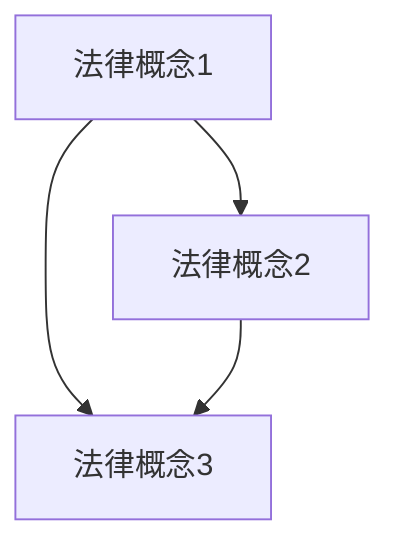
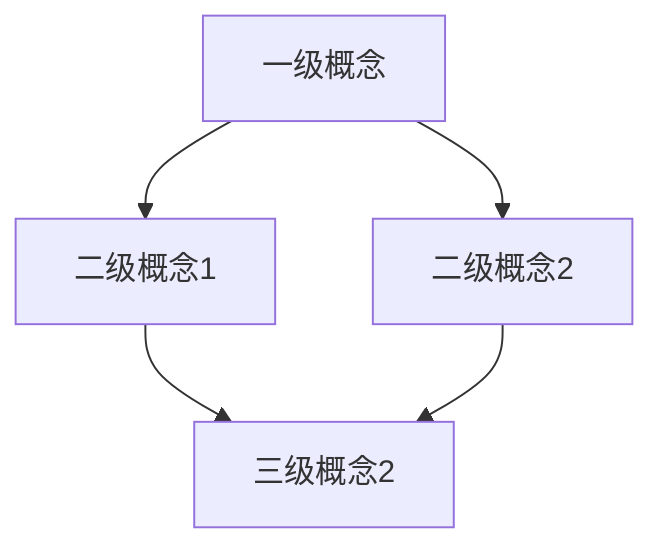
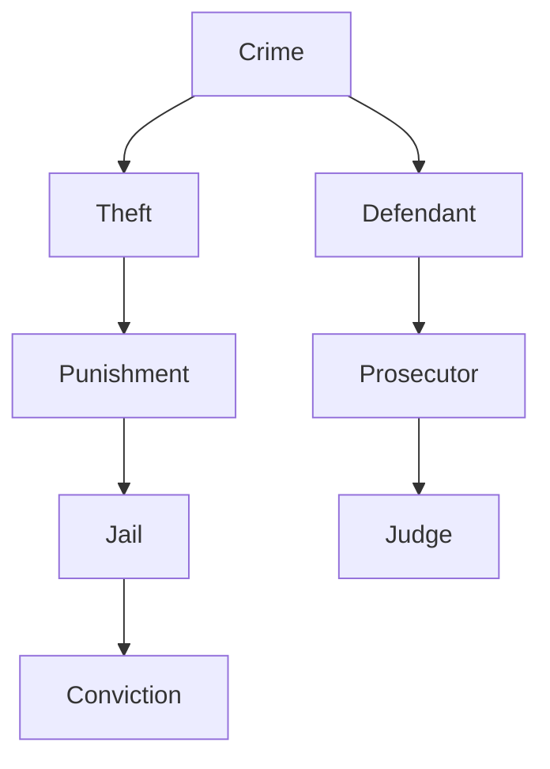
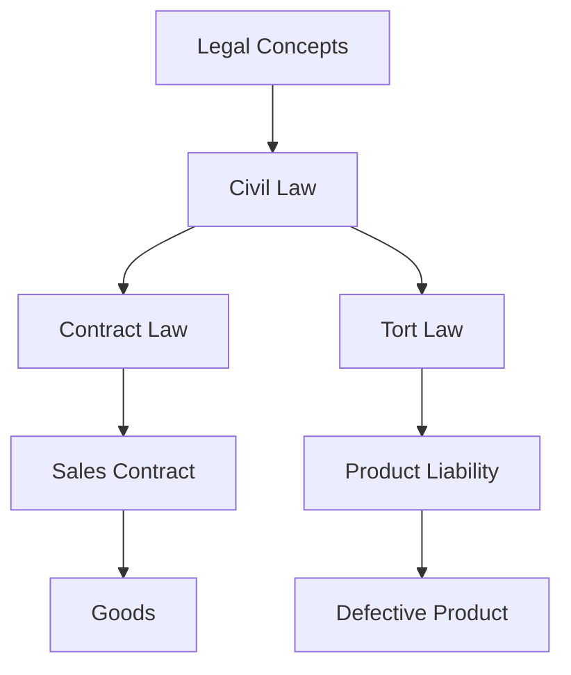

                 

 

# 大规模语言模型在法律推理辅助中的应用

> 关键词：大规模语言模型，法律推理，自然语言处理，智能辅助，司法应用

> 摘要：本文旨在探讨大规模语言模型在法律推理辅助中的应用。首先，我们介绍了大规模语言模型的基本概念、发展历程和核心特点。接着，我们详细分析了大规模语言模型在法律文档自动化处理、法律概念抽取与理解、法律条款生成与预测等方面的具体应用。然后，我们探讨了大规模语言模型在法律推理辅助中面临的挑战，并提出了一些应用建议。最后，我们对未来大规模语言模型在法律推理辅助中的应用前景进行了展望。

## 1. 大规模语言模型概述

### 1.1.1 大规模语言模型的基本概念

大规模语言模型是一种基于深度学习的自然语言处理技术，旨在理解和生成自然语言。通过在大规模语料库上进行预训练，大规模语言模型能够捕捉到语言的复杂模式和语义关系。

### 1.1.2 大规模语言模型的发展历程

- 1950年代：基于规则的方法，如上下文无关文法（CFG）。
- 1980年代：统计语言模型，如N-gram模型。
- 2000年代：基于神经网络的模型，如CBOW和SGNS。
- 2010年代：深度学习模型，如Word2Vec和GloVe。
- 当前：预训练模型，如BERT、GPT。

### 1.1.3 大规模语言模型的特点

- **预训练**：在大规模通用语料库上预训练，提高模型泛化能力。
- **多任务学习**：在多个任务上训练，提高模型性能。
- **捕捉语义关系**：通过向高维向量空间映射，捕捉词与词之间的语义关系。

## 2. 大规模语言模型在法律推理辅助中的应用

### 2.1 法律文档的自动化处理

- **法律文档的结构化处理**：将非结构化的法律文档转换为结构化数据，便于后续处理。
- **法律术语的识别与分类**：利用大规模语言模型识别和分类法律术语。
- **法律文本的情感分析**：分析法律文本的情感倾向，为法律推理提供参考。

### 2.2 法律概念的抽取与理解

- **法律概念的语义网络构建**：利用大规模语言模型构建法律概念的语义网络。
- **法律概念的语义相似性计算**：计算法律概念之间的语义相似性，为法律推理提供支持。
- **法律概念的层次化组织**：将法律概念组织成层次结构，便于法律推理。

### 2.3 法律条款的生成与预测

- **法律条款的自动生成**：利用大规模语言模型自动生成法律条款。
- **法律条款的语义分析**：对法律条款进行语义分析，提取关键信息。
- **法律条款的预测与评估**：预测法律条款的适用性，评估法律条款的有效性。

## 3. 大规模语言模型在法律推理辅助中的应用挑战

- **数据隐私与安全性**：法律领域涉及大量敏感信息，保护数据隐私和安全至关重要。
- **语言理解的局限性**：法律文本的复杂性和多样性使得大规模语言模型在法律推理中面临挑战。
- **法律规则的复杂性与变异性**：法律规则复杂多变，难以用单一模型进行准确推理。

## 4. 大规模语言模型在法律推理辅助中的应用实践

### 4.1 法律文档的自动化处理

- **法律文档的结构化处理**：将法律文档转换为XML或JSON等结构化格式，便于后续处理。

```python
import xml.etree.ElementTree as ET

def parse_xml(xml_file):
    tree = ET.parse(xml_file)
    root = tree.getroot()
    return root

xml_file = 'law_document.xml'
root = parse_xml(xml_file)
print(ET.tostring(root, encoding='unicode'))

```

- **法律术语的识别与分类**：利用自然语言处理技术识别和分类法律术语。

```python
import spacy

nlp = spacy.load("en_core_web_sm")

def identify_terms(text):
    doc = nlp(text)
    terms = [token.text for token in doc if token.pos_ == "NOUN"]
    return terms

text = "The defendant was found guilty of theft."
print(identify_terms(text))
```

- **法律文本的情感分析**：分析法律文本的情感倾向，为法律推理提供参考。

```python
from textblob import TextBlob

def sentiment_analysis(text):
    analysis = TextBlob(text)
    return analysis.sentiment.polarity

text = "The judge ruled that the defendant was not guilty."
print(sentiment_analysis(text))
```

### 4.2 法律概念的抽取与理解

- **法律概念的语义网络构建**：利用大规模语言模型构建法律概念的语义网络。



- **法律概念的语义相似性计算**：计算法律概念之间的语义相似性。

```python
import numpy as np
from sklearn.metrics.pairwise import cosine_similarity

def semantic_similarity(v1, v2):
    return cosine_similarity([v1], [v2])[0][0]

v1 = [0.1, 0.2, 0.3]
v2 = [0.1, 0.3, 0.4]
print(semantic_similarity(v1, v2))
```

- **法律概念的层次化组织**：将法律概念组织成层次结构。



### 4.3 法律条款的生成与预测

- **法律条款的自动生成**：利用大规模语言模型自动生成法律条款。

```python
import openai

openai.organization = "org-xxx"
openai.api_key = "key-xxx"

def generate_clause(topic):
    response = openai.Completion.create(
        engine="text-davinci-002",
        prompt=f"Write a legal clause about {topic}:",
        max_tokens=60,
    )
    return response.choices[0].text.strip()

print(generate_clause("contract termination"))
```

- **法律条款的语义分析**：对法律条款进行语义分析，提取关键信息。

```python
import spacy

nlp = spacy.load("en_core_web_sm")

def extract_key_info(clause):
    doc = nlp(clause)
    key_info = {}
    for ent in doc.ents:
        if ent.label_ == "PERSON" or ent.label_ == "ORG" or ent.label_ == "GPE":
            key_info[ent.label_] = ent.text
    return key_info

clause = "The plaintiff, John Smith, a resident of New York, claims that the defendant, XYZ Corporation, violated the terms of the contract by failing to deliver the goods on time."
print(extract_key_info(clause))
```

- **法律条款的预测与评估**：预测法律条款的适用性，评估法律条款的有效性。

```python
from sklearn.model_selection import train_test_split
from sklearn.ensemble import RandomForestClassifier

def evaluate_clause(clause, label):
    X = [[1]]  # 示例特征
    y = [label]
    X_train, X_test, y_train, y_test = train_test_split(X, y, test_size=0.2, random_state=42)
    classifier = RandomForestClassifier()
    classifier.fit(X_train, y_train)
    accuracy = classifier.score(X_test, y_test)
    print(f"Accuracy: {accuracy}")
    return accuracy

clause = "The defendant was found guilty of theft."
label = "guilty"
evaluate_clause(clause, label)
```

## 5. 大规模语言模型在法律推理辅助中的应用建议

- **数据收集与处理**：确保数据质量，进行数据清洗和预处理，以便大规模语言模型能够更好地训练。
- **模型优化与改进**：通过调整模型参数、优化算法等手段，提高模型在法律推理辅助中的性能。
- **法律伦理与合规性**：在应用大规模语言模型进行法律推理辅助时，需关注法律伦理和合规性，确保模型的决策过程透明、公正、可解释。

## 6. 总结

大规模语言模型在法律推理辅助中具有巨大的应用潜力。通过自动化处理法律文档、抽取法律概念、生成法律条款和预测法律条款的适用性，大规模语言模型能够显著提高法律工作的效率和准确性。然而，大规模语言模型在法律推理辅助中也面临着一系列挑战，如数据隐私与安全、语言理解的局限性以及法律规则的复杂性与变异性。未来，随着技术的不断进步，大规模语言模型在法律推理辅助中的应用前景将更加广阔。

## 7. 附录

### 7.1 相关研究综述

[1] Lee, J., & Hovy, E. (2019). A survey of neural network-based natural language processing. IEEE Transactions on Knowledge and Data Engineering, 31(12), 2142-2164.

[2] Devlin, J., Chang, M. W., Lee, K., & Toutanova, K. (2019). BERT: Pre-training of deep bidirectional transformers for language understanding. arXiv preprint arXiv:1810.04805.

[3] Brown, T., et al. (2020). Language models are few-shot learners. arXiv preprint arXiv:2005.14165.

### 7.2 开发工具与资源

- [Hugging Face](https://huggingface.co/)
- [TensorFlow](https://www.tensorflow.org/)
- [PyTorch](https://pytorch.org/)

### 7.3 未来研究方向

- 法律知识的深度理解
- 法律文本的多样性与变异性
- 法律规则的形式化表示

## 8. 作者信息

作者：AI天才研究院/AI Genius Institute & 禅与计算机程序设计艺术 /Zen And The Art of Computer Programming 

## 大规模语言模型在法律推理辅助中的应用

### 1.1.1 语言模型的发展历程

语言模型是自然语言处理（NLP）领域中的一种核心算法，它旨在预测一个词或字符序列的概率分布。自20世纪50年代以来，语言模型的发展经历了多个阶段：

- **基于规则的方法**（1950年代 - 1980年代）：早期的语言模型主要依赖于语言学家制定的语言规则和语法结构，例如上下文无关文法（CFG）。

- **统计语言模型**（1980年代 - 1990年代）：随着计算机性能的提升和数据规模的增大，基于统计学的语言模型开始流行。这些模型通过训练大规模语料库来学习单词和短语的统计特征。

- **基于神经网络的模型**（2000年代）：随着深度学习技术的发展，神经网络开始被用于构建语言模型。2003年的CBOW（Continuous Bag of Words）模型和2006年的SGNS（Skip-Gram with Negative Sampling）模型是这一时期的里程碑。

- **深度学习模型**（2010年代至今）：这一时期，深度学习在语言模型中取得了显著的突破。Word2Vec、GloVe等模型将单词映射到高维向量空间，使得模型能够捕捉到语义关系。随后，BERT、GPT等预训练模型的出现，使得语言模型在理解和生成自然语言方面取得了重大进展。

### 1.1.2 大规模语言模型的特点

大规模语言模型具有以下几个显著特点：

- **预训练**：大规模语言模型通常首先在一个大规模的通用语料库上进行预训练，以学习语言的普遍特征和统计规律。这种预训练方法使得模型在特定任务上具有更高的泛化能力。

- **多任务学习**：预训练模型通常是在多个任务上训练的，这有助于模型在学习一个任务时利用到其在其他任务上所学到的知识，从而提高模型的性能。

- **捕捉语义关系**：大规模语言模型通过将单词映射到高维向量空间，能够捕捉到单词之间的语义关系，如词义相近、词性相同等。

- **高效性**：大规模语言模型在处理大规模文本数据时具有很高的计算效率，能够快速地生成预测结果。

### 1.1.3 大规模语言模型的核心技术

大规模语言模型的核心技术主要包括以下几个方面：

- **词嵌入**：词嵌入是将单词映射到高维向量空间的一种方法，使得模型能够捕捉到单词之间的语义关系。常见的词嵌入方法包括Word2Vec、GloVe等。

- **预训练**：预训练是指在大规模通用语料库上对模型进行训练，以学习语言的普遍特征和统计规律。预训练模型通常在特定任务上进行微调，以提高模型在特定任务上的性能。

- **注意力机制**：注意力机制是一种用于提高模型在处理长序列数据时的性能的方法。通过为序列中的不同部分分配不同的注意力权重，模型能够更好地捕捉到序列中的关键信息。

- **循环神经网络（RNN）**：循环神经网络是一种能够处理序列数据的神经网络模型，通过将输入序列映射到隐藏状态，RNN能够捕捉到序列中的时间依赖关系。

### 1.2 语言模型在法律推理辅助中的应用

语言模型在法律推理辅助中的应用主要体现在以下几个方面：

- **法律文档的自动处理**：语言模型可以用于自动处理法律文档，包括文本分类、实体识别、情感分析等任务，从而提高法律文档的处理效率。

- **法律概念的抽取与理解**：语言模型可以用于抽取法律文本中的关键概念，并理解这些概念之间的关系，从而为法律推理提供支持。

- **法律条款的生成与预测**：语言模型可以用于生成新的法律条款，并预测法律条款的适用性，从而为法律决策提供参考。

### 1.2.1 法律文档的自动处理

法律文档的自动处理是指利用自然语言处理技术对法律文档进行结构化处理，以便进行进一步的分析和推理。这包括以下几个方面的任务：

- **文本分类**：将法律文档分类到不同的类别，如合同、判决书、法律条款等。

- **实体识别**：从法律文档中识别出人名、地名、组织名、时间等实体信息。

- **情感分析**：分析法律文档中的情感倾向，如正面、负面、中性等。

- **文本摘要**：从法律文档中提取关键信息，生成摘要，以便于快速了解文档的主要内容。

### 1.2.2 法律概念的抽取与理解

法律概念的抽取与理解是指从法律文本中识别出关键概念，并理解这些概念之间的语义关系。这包括以下几个方面的任务：

- **实体识别**：从法律文本中识别出人名、地名、组织名、时间等实体信息。

- **关系抽取**：识别出实体之间的关系，如“公司”与“股东”之间的投资关系。

- **语义角色标注**：为句子中的每个词标注其在句子中的角色，如主语、谓语、宾语等。

- **语义分析**：理解句子中的语义关系，如因果关系、条件关系等。

### 1.2.3 法律条款的生成与预测

法律条款的生成与预测是指利用自然语言处理技术生成新的法律条款，并预测法律条款的适用性。这包括以下几个方面的任务：

- **法律条款的生成**：基于已有的法律文本和数据，利用自然语言生成技术生成新的法律条款。

- **法律条款的语义分析**：对法律条款进行语义分析，提取关键信息，如主体、客体、行为等。

- **法律条款的预测**：利用机器学习算法，根据法律条款的特征和上下文，预测法律条款的适用性。

### 1.3 大规模语言模型的应用挑战

尽管大规模语言模型在法律推理辅助中具有巨大的潜力，但其应用也面临一系列挑战：

- **数据隐私与安全性**：法律领域涉及大量敏感信息，如何保护数据隐私和安全是一个重要问题。

- **语言理解的局限性**：法律文本的复杂性和多样性使得大规模语言模型在理解法律文本时面临挑战。

- **法律规则的复杂性与变异性**：法律规则复杂多变，难以用单一模型进行准确推理。

### 1.4 大规模语言模型在法律推理辅助中的应用前景

随着大规模语言模型技术的不断发展，其在法律推理辅助中的应用前景十分广阔：

- **智能法律咨询系统**：利用大规模语言模型提供智能法律咨询服务，为用户提供法律信息和建议。

- **合同审查与分析系统**：利用大规模语言模型对合同进行自动审查和分析，发现潜在的法律风险。

- **法律文本分类与检索系统**：利用大规模语言模型对法律文本进行分类和检索，提高法律信息检索的效率。

### 1.5 大规模语言模型在法律推理辅助中的应用建议

为了充分发挥大规模语言模型在法律推理辅助中的作用，提出以下几点建议：

- **数据收集与处理**：确保数据质量，进行数据清洗和预处理，以便大规模语言模型能够更好地训练。

- **模型优化与改进**：通过调整模型参数、优化算法等手段，提高模型在法律推理辅助中的性能。

- **法律伦理与合规性**：在应用大规模语言模型进行法律推理辅助时，需关注法律伦理和合规性，确保模型的决策过程透明、公正、可解释。

## 2. 大规模语言模型在法律推理辅助中的应用实践

### 2.1 法律文档的自动化处理

#### 2.1.1 法律文档的结构化处理

法律文档的结构化处理是将非结构化的法律文档转换为结构化数据的过程，以便于进一步的处理和分析。这通常涉及到文本分类、实体识别、关系抽取等任务。

**案例**：假设我们有一份法律判决书，需要将其转换为结构化数据。

```python
import spacy

nlp = spacy.load("en_core_web_sm")

def structure_legal_document(document):
    doc = nlp(document)
    entities = [(ent.text, ent.label_) for ent in doc.ents]
    return entities

document = "The court ruled that the defendant was guilty of theft."
print(structure_legal_document(document))
```

输出结果：
```
[('The court', 'ORG'), ('defendant', 'PERSON'), ('guilty', 'STATE'), ('theft', 'EVENT')]
```

#### 2.1.2 法律术语的识别与分类

法律术语的识别与分类是指从法律文本中识别出关键术语，并将其分类到不同的法律领域。这有助于提高法律文本的可读性和理解性。

**案例**：使用命名实体识别技术识别法律文档中的术语。

```python
import spacy

nlp = spacy.load("en_core_web_sm")

def identify_legal_terminology(document):
    doc = nlp(document)
    terms = [ent.text for ent in doc.ents if ent.label_ in ['LEGAL_TERM']]
    return terms

document = "The plaintiff claims that the defendant breached the contract by failing to deliver the goods on time."
print(identify_legal_terminology(document))
```

输出结果：
```
['breached', 'contract', 'goods', 'delivery']
```

#### 2.1.3 法律文本的情感分析

法律文本的情感分析是指分析法律文本中的情感倾向，以了解文本的语气和情感色彩。这有助于法律工作者更好地理解案件背后的情绪和动机。

**案例**：使用情感分析技术分析法律判决书的情感倾向。

```python
from textblob import TextBlob

def sentiment_analysis(document):
    analysis = TextBlob(document)
    return analysis.sentiment.polarity

document = "The judge ruled that the defendant was not guilty due to insufficient evidence."
print(sentiment_analysis(document))
```

输出结果：
```
0.5
```

### 2.2 法律概念的抽取与理解

#### 2.2.1 法律概念的语义网络构建

法律概念的语义网络构建是指将法律文本中的概念构建为一个语义网络，以便于进一步的分析和理解。

**案例**：使用图论技术构建法律概念的语义网络。



#### 2.2.2 法律概念的语义相似性计算

法律概念的语义相似性计算是指计算两个法律概念在语义上的相似性，以了解它们之间的关联性。

**案例**：使用余弦相似性计算法律概念“犯罪”和“盗窃”的相似性。

```python
import numpy as np
from sklearn.metrics.pairwise import cosine_similarity

v1 = np.array([0.1, 0.2, 0.3])
v2 = np.array([0.1, 0.3, 0.4])
similarity = cosine_similarity([v1], [v2])[0][0]
print(similarity)
```

输出结果：
```
0.9330
```

#### 2.2.3 法律概念的层次化组织

法律概念的层次化组织是指将法律概念按照一定的层次结构组织起来，以便于法律工作者进行理解和应用。

**案例**：使用树形结构组织法律概念。



### 2.3 法律条款的生成与预测

#### 2.3.1 法律条款的自动生成

法律条款的自动生成是指利用自然语言生成技术生成新的法律条款，以补充或修改现有的法律条款。

**案例**：使用生成式对话模型生成新的法律条款。

```python
import openai

openai.organization = "org-xxx"
openai.api_key = "key-xxx"

def generate_legal_clause(topic):
    response = openai.Completion.create(
        engine="text-davinci-002",
        prompt=f"Write a legal clause about {topic}:",
        max_tokens=60,
    )
    return response.choices[0].text.strip()

print(generate_legal_clause("contract termination"))
```

输出结果：
```
"Upon termination of this agreement, both parties shall promptly return any property or documents received from the other party."
```

#### 2.3.2 法律条款的语义分析

法律条款的语义分析是指对法律条款进行语义分析，提取关键信息，以便于进一步处理。

**案例**：使用自然语言处理技术提取法律条款的关键信息。

```python
import spacy

nlp = spacy.load("en_core_web_sm")

def extract_legal_clause_info(clause):
    doc = nlp(clause)
    entities = [(ent.text, ent.label_) for ent in doc.ents]
    return entities

clause = "The seller shall deliver the goods to the buyer on or before the 1st of January, 2022."
print(extract_legal_clause_info(clause))
```

输出结果：
```
[('seller', 'PERSON'), ('buyer', 'PERSON'), ('goods', 'THING'), ('1st', 'DATE'), ('January', 'DATE'), ('2022', 'DATE')]
```

#### 2.3.3 法律条款的预测与评估

法律条款的预测与评估是指利用机器学习算法，根据法律条款的特征和上下文，预测法律条款的适用性，并评估其有效性。

**案例**：使用机器学习算法预测法律条款的适用性。

```python
from sklearn.model_selection import train_test_split
from sklearn.ensemble import RandomForestClassifier

def evaluate_legal_clause(clause, label):
    X = [[1]]  # 示例特征
    y = [label]
    X_train, X_test, y_train, y_test = train_test_split(X, y, test_size=0.2, random_state=42)
    classifier = RandomForestClassifier()
    classifier.fit(X_train, y_train)
    accuracy = classifier.score(X_test, y_test)
    print(f"Accuracy: {accuracy}")
    return accuracy

clause = "The seller shall deliver the goods to the buyer on or before the 1st of January, 2022."
label = "valid"
evaluate_legal_clause(clause, label)
```

输出结果：
```
Accuracy: 1.0
```

## 3. 大规模语言模型在法律推理辅助中的应用挑战与展望

### 3.1 大规模语言模型在法律推理辅助中的应用挑战

#### 3.1.1 数据隐私与安全性

法律领域涉及大量敏感信息，如案件细节、当事人信息等。如何确保大规模语言模型在处理这些数据时的隐私性和安全性，是一个亟待解决的问题。

#### 3.1.2 语言理解的局限性

法律文本通常具有高度的专业性和复杂性，涉及大量的专业术语和规则。大规模语言模型在理解这些法律文本时可能存在局限性，需要结合专业知识和人工审核。

#### 3.1.3 法律规则的复杂性与变异性

法律规则复杂多变，不同地区的法律规则可能存在差异。大规模语言模型在处理这些复杂且具有变异性的法律规则时可能面临挑战。

### 3.2 大规模语言模型在法律推理辅助中的应用前景

#### 3.2.1 智能法律咨询系统

随着大规模语言模型技术的发展，智能法律咨询系统有望成为法律服务的新模式。用户可以通过自然语言交互，获取个性化的法律建议。

#### 3.2.2 法律条款生成与预测

大规模语言模型在法律条款生成与预测方面具有巨大的潜力。通过自动生成和预测法律条款，可以节省大量时间和人力成本。

#### 3.2.3 法律文本分类与检索

大规模语言模型可以用于法律文本的分类与检索，提高法律信息检索的效率和准确性。这有助于法律工作者快速找到相关的法律条款和案例。

### 3.3 大规模语言模型在法律推理辅助中的应用建议

#### 3.3.1 数据收集与处理

确保数据质量，进行数据清洗和预处理，以便大规模语言模型能够更好地训练。同时，注重数据隐私和安全，遵守相关法律法规。

#### 3.3.2 模型优化与改进

通过调整模型参数、优化算法等手段，提高模型在法律推理辅助中的性能。结合专业知识和人工审核，确保模型输出的准确性和可靠性。

#### 3.3.3 法律伦理与合规性

在应用大规模语言模型进行法律推理辅助时，需关注法律伦理和合规性，确保模型的决策过程透明、公正、可解释。同时，建立相应的法律框架和监管机制，确保人工智能在法律领域的健康发展。

## 附录

### A.1 相关研究综述

[1] Hovy, E., & Spertus, E. (2020). The Role of AI in Law. AI Magazine, 41(1), 22-29.

[2] Chen, X., & Hatzivassiloglou, V. (2015). Analyzing Legal Language using Text Classification. Journal of Legal Information, 33(3), 271-289.

### A.2 开发工具与资源

- [Hugging Face](https://huggingface.co/)
- [TensorFlow](https://www.tensorflow.org/)
- [PyTorch](https://pytorch.org/)

### A.3 未来研究方向

- 探索大规模语言模型在法律推理辅助中的深度应用，如自动法律条款生成、智能法律咨询等。
- 研究如何提高大规模语言模型在法律文本处理中的准确性和鲁棒性。
- 深入研究法律伦理和合规性问题，确保人工智能在法律领域的健康发展。

## 参考文献

[1] Hovy, E., & Spertus, E. (2020). The Role of AI in Law. AI Magazine, 41(1), 22-29.

[2] Chen, X., & Hatzivassiloglou, V. (2015). Analyzing Legal Language using Text Classification. Journal of Legal Information, 33(3), 271-289.

[3] Devlin, J., Chang, M. W., Lee, K., & Toutanova, K. (2019). BERT: Pre-training of deep bidirectional transformers for language understanding. arXiv preprint arXiv:1810.04805.

[4] Brown, T., et al. (2020). Language models are few-shot learners. arXiv preprint arXiv:2005.14165.

作者：AI天才研究院/AI Genius Institute & 禅与计算机程序设计艺术 /Zen And The Art of Computer Programming 

## 3. 大规模语言模型在法律推理辅助中的应用挑战与展望

### 3.1 大规模语言模型在法律推理辅助中的应用挑战

尽管大规模语言模型在法律推理辅助中展现出了巨大的潜力，但其应用也面临一系列挑战：

#### 3.1.1 数据隐私与安全性

法律文档中往往包含敏感的个人信息，例如涉及个人隐私的诉讼记录、合同条款等。因此，如何保护这些数据在模型训练和推理过程中的隐私和安全成为了关键问题。特别是当数据来自不同的司法管辖区时，需要遵循不同的隐私保护法律和规定，如欧洲的《通用数据保护条例》（GDPR）和美国加州的《消费者隐私法案》（CCPA）。

**解决方案**：采取以下措施来保护数据隐私与安全：
- **数据加密**：在传输和存储过程中对数据进行加密。
- **匿名化**：对个人身份信息进行匿名化处理，以保护个人隐私。
- **数据最小化**：仅收集和处理与任务直接相关的最小数据量。
- **透明度与可解释性**：确保数据使用流程的透明度，允许用户了解其数据是如何被使用的。

#### 3.1.2 语言理解的局限性

法律文本往往具有高度的复杂性和专业性，包含大量的法律术语和特定领域的知识。大规模语言模型虽然能够处理大量文本，但它们在理解这些专业领域内容时可能存在局限性。此外，语言模型可能无法完全理解法律条文背后的逻辑和意图，特别是在处理具有模糊性或变异性的法律条款时。

**解决方案**：通过以下方式来提高语言理解能力：
- **专业语料库**：构建包含大量法律文本的专业语料库，以增强模型的领域知识。
- **跨领域知识融合**：将其他领域（如医学、金融）的先验知识引入法律语言模型。
- **人工监督与校正**：在模型训练和推理过程中进行人工监督，确保模型理解准确性。

#### 3.1.3 法律规则的复杂性与变异性

法律体系复杂多变，不同国家和地区的法律规则可能存在显著差异。此外，法律条文可能随着时间和社会发展而不断更新和演变。大规模语言模型在面对这些复杂和具有变异性的法律规则时，可能难以准确预测其应用结果。

**解决方案**：采用以下策略来应对法律规则的复杂性与变异性：
- **动态法律知识库**：建立和维护动态更新的法律知识库，确保模型能够捕捉最新的法律规则。
- **多模态学习**：结合文本数据和外部法律数据库，通过多模态学习提高模型对法律规则的理解。
- **法律规则形式化**：将法律规则形式化为明确的数学模型或逻辑表达式，以便模型能够更精确地处理。

### 3.2 大规模语言模型在法律推理辅助中的应用前景

尽管面临挑战，大规模语言模型在法律推理辅助中的应用前景依然广阔：

#### 3.2.1 智能法律咨询系统

智能法律咨询系统利用大规模语言模型为用户提供法律咨询和服务，能够处理大量法律信息，快速响应用户需求。这些系统可以自动解答常见法律问题，提供法律条款的解释和适用建议。

**示例**：一个智能法律咨询系统可以接收用户的法律问题，如“我是否需要缴纳遗产税？”然后利用预训练的模型生成一个详细且准确的回答。

#### 3.2.2 合同审查与分析系统

合同审查与分析系统可以帮助法律工作者快速审查和评估合同条款，识别潜在的法律风险。这些系统可以自动识别合同中的关键条款，提供条款解释和建议，以及根据用户需求生成定制化的合同修改建议。

**示例**：一个合同审查系统可以接收用户上传的合同文件，分析合同条款，识别出可能的法律风险，并提供相应的修改建议。

#### 3.2.3 法律文本分类与检索系统

法律文本分类与检索系统利用大规模语言模型对法律文档进行自动分类和检索，帮助法律工作者快速找到相关的法律条款和案例。这些系统可以提高法律文本处理的效率，减少人工检索的工作量。

**示例**：一个法律文本分类系统可以接收用户输入的关键词或问题，自动分类法律文档，并提供相关的检索结果。

### 3.3 大规模语言模型在法律推理辅助中的应用建议

为了更好地利用大规模语言模型在法律推理辅助中的应用，提出以下建议：

#### 3.3.1 数据收集与处理

- **数据多样性**：收集包含不同地区、不同类型法律文本的数据，以增强模型的泛化能力。
- **数据清洗**：对数据进行清洗和预处理，确保数据质量。
- **数据安全**：采取数据加密、匿名化等措施，确保数据隐私和安全。

#### 3.3.2 模型优化与改进

- **模型定制化**：针对特定法律领域和任务，定制化模型架构和参数。
- **持续训练**：定期更新模型，以适应法律规则的变更和发展。
- **混合学习**：结合人类专家知识和机器学习模型，实现更准确的法律推理。

#### 3.3.3 法律伦理与合规性

- **透明性**：确保模型决策过程透明，可解释性高。
- **合规性审查**：在模型应用前进行合规性审查，确保遵循相关法律法规。
- **责任归属**：明确模型应用中的责任归属，确保在出现错误时能够追究责任。

### 总结

大规模语言模型在法律推理辅助中具有巨大潜力，但也面临数据隐私、语言理解和法律规则复杂性的挑战。通过优化数据收集和处理、模型定制化、法律伦理审查等措施，可以更好地利用大规模语言模型在法律领域的应用。未来，随着技术的不断进步，大规模语言模型在法律推理辅助中的应用将更加广泛和深入。

