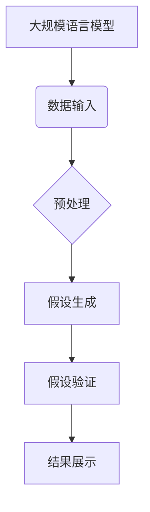
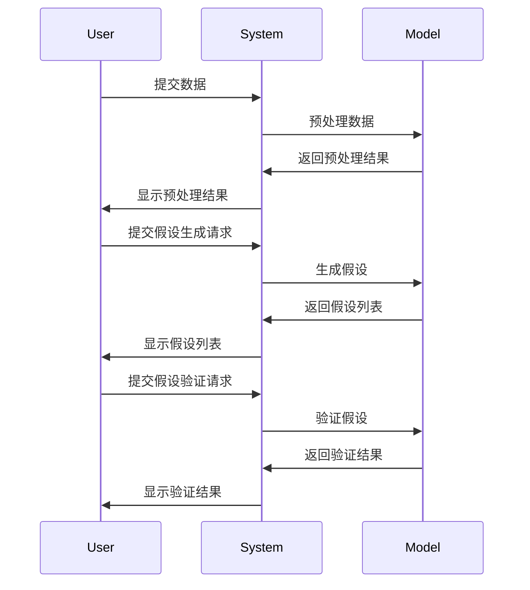
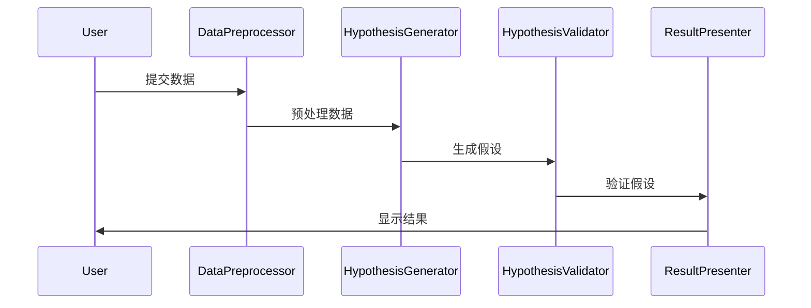

                 


# 大规模语言模型在科学假设生成与验证中的应用

关键词：大规模语言模型、科学假设、生成与验证、人工智能

摘要：本文将探讨大规模语言模型在科学假设生成与验证中的应用。首先，我们将介绍大规模语言模型的基本概念和数学基础，然后分析大规模语言模型在科学假设生成中的应用案例，并探讨其在科学假设验证中的应用。最后，我们将综合讨论大规模语言模型在科学假设生成与验证中的综合应用，并展望其未来发展的挑战。

## 第一部分：大规模语言模型概述

### 第1章：大规模语言模型基本概念

#### 1.1 大规模语言模型的定义

大规模语言模型（Large-scale Language Models）是一种能够理解和生成自然语言文本的人工智能模型。这些模型通过学习大量的文本数据，掌握语言的语法、语义和语境，从而实现自然语言的自动生成和理解。

#### 1.2 大规模语言模型的发展历程

自20世纪50年代以来，自然语言处理领域经历了多个发展阶段。从最初的规则方法到基于统计的方法，再到如今基于深度学习的模型，如Word2Vec、BERT和GPT等，大规模语言模型逐渐成为自然语言处理的核心技术。

#### 1.3 大规模语言模型的核心特点

1. **参数规模大**：大规模语言模型通常具有数亿甚至数万亿个参数，这使得它们能够捕获语言中的复杂规律。

2. **上下文理解能力强**：通过预训练和微调，大规模语言模型能够理解上下文中的词语含义和关系，从而生成更准确的自然语言文本。

3. **多模态处理能力**：部分大规模语言模型不仅能够处理文本数据，还能处理图像、声音等多种类型的数据，实现跨模态的信息理解与生成。

### 第2章：大规模语言模型的数学基础

#### 2.1 语言模型的数学背景

大规模语言模型主要基于概率图模型和深度学习算法。概率图模型包括隐马尔可夫模型（HMM）、条件随机场（CRF）等，而深度学习算法则包括卷积神经网络（CNN）、循环神经网络（RNN）、Transformer等。

#### 2.2 语言模型的数学公式与推导

语言模型的预测公式如下：

$$
P(y|x) = \frac{e^{w^T x}}{1 + e^{w^T x}}
$$

其中，$w$ 是权重向量，$x$ 是输入特征向量，$y$ 是输出标签。

#### 2.3 语言模型的优化算法

大规模语言模型通常使用梯度下降算法进行参数优化。梯度下降算法的核心思想是沿着损失函数梯度的反方向更新参数，以最小化损失函数。

$$
w_{\text{new}} = w_{\text{old}} - \alpha \cdot \nabla_w J(w)
$$

其中，$\alpha$ 是学习率，$\nabla_w J(w)$ 是损失函数关于参数 $w$ 的梯度。

## 第二部分：大规模语言模型在科学假设生成中的应用

### 第3章：科学假设生成的理论基础

#### 3.1 科学假设的定义

科学假设（Scientific Hypothesis）是科学研究中基于现有知识和证据提出的一种预测性陈述，用以解释现象或预测未来结果。科学假设通常包含一个或多个变量，以及变量之间的关系。

#### 3.2 科学假设生成的方法

科学假设生成的方法主要包括基于数据的统计分析、基于逻辑推理的推理机、以及基于神经网络的生成模型。

1. **基于数据的统计分析**：通过分析现有数据，识别变量之间的相关性，从而提出科学假设。

2. **基于逻辑推理的推理机**：利用逻辑规则和知识库，根据已知事实和规则生成科学假设。

3. **基于神经网络的生成模型**：通过学习大量文本数据，神经网络模型能够自动生成符合语言规则的科学假设。

#### 3.3 科学假设生成的评价标准

科学假设生成的评价标准主要包括假设的合理性、预测的准确性、以及可验证性。

1. **合理性**：科学假设应基于现有知识和证据，合理解释现象。

2. **准确性**：科学假设应能够准确预测未来结果，与实际数据相符。

3. **可验证性**：科学假设应具有可验证性，可以通过实验或观察来验证。

### 第4章：大规模语言模型在科学假设生成中的应用案例

#### 4.1 案例一：生物信息学

生物信息学领域中的科学假设生成通常涉及基因表达数据分析、蛋白质功能预测等。大规模语言模型通过学习生物信息学文献和数据库，可以生成新的基因表达模式假设或蛋白质相互作用假设。

#### 4.2 案例二：化学

在化学领域，大规模语言模型可以用于生成新的化学反应路径假设或材料结构假设。例如，通过学习化学方程式和材料科学文献，模型可以生成新的化学反应方程式或材料合成方法。

#### 4.3 案例三：物理学

在物理学领域，大规模语言模型可以用于生成新的物理现象假设或粒子相互作用假设。例如，通过学习物理学文献和实验数据，模型可以生成新的粒子物理理论或宇宙演化模型。

## 第三部分：大规模语言模型在科学假设验证中的应用

### 第5章：科学假设验证的理论基础

#### 5.1 科学假设验证的定义

科学假设验证（Scientific Hypothesis Verification）是指通过实验、观察或数据分析等方法，对科学假设的正确性进行验证。

#### 5.2 科学假设验证的方法

科学假设验证的方法主要包括实验验证、观察验证和数据验证。

1. **实验验证**：通过设计实验来验证科学假设的正确性。

2. **观察验证**：通过观察自然现象或实验结果来验证科学假设。

3. **数据验证**：通过分析数据来验证科学假设的正确性。

#### 5.3 科学假设验证的评价标准

科学假设验证的评价标准主要包括假设的准确性、验证过程的可靠性、以及验证结果的可重复性。

1. **准确性**：验证结果应与科学假设相符。

2. **可靠性**：验证过程应可靠，结果应具有可重复性。

3. **可重复性**：验证结果应在不同条件下可重复。

### 第6章：大规模语言模型在科学假设验证中的应用案例

#### 6.1 案例一：计算机科学

在计算机科学领域，大规模语言模型可以用于验证算法的正确性和性能。例如，通过学习大量算法文献和测试数据，模型可以生成新的算法测试用例，并验证算法的正确性。

#### 6.2 案例二：环境科学

在环境科学领域，大规模语言模型可以用于验证环境监测数据的准确性。例如，通过学习环境监测数据和模型预测结果，模型可以生成新的验证指标，并验证监测数据的可靠性。

#### 6.3 案例三：社会科学

在社会科学领域，大规模语言模型可以用于验证社会调查数据的可靠性。例如，通过学习社会调查数据和模型预测结果，模型可以生成新的验证指标，并验证调查数据的准确性。

### 第7章：大规模语言模型在科学假设生成与验证中的综合应用

#### 7.1 综合应用概述

大规模语言模型在科学假设生成与验证中的综合应用，意味着将模型应用于科学研究的各个环节，从假设生成到假设验证，实现科学研究的自动化和智能化。

#### 7.2 综合应用案例解析

以生物信息学为例，大规模语言模型可以自动生成基因表达假设，并通过实验验证假设的正确性。这种方法提高了科研效率，降低了实验成本。

#### 7.3 未来展望与挑战

未来，大规模语言模型在科学假设生成与验证中的应用将更加广泛和深入。然而，也面临如下挑战：

1. **数据隐私与安全**：科学假设生成与验证过程中涉及大量敏感数据，如何保护数据隐私和安全是关键问题。

2. **模型解释性**：大规模语言模型的预测结果通常缺乏解释性，如何提高模型的解释性是重要挑战。

3. **可重复性**：科学假设验证需要可重复的结果，如何确保模型的可重复性是关键问题。

## 附录

#### 附录A：大规模语言模型开发工具与资源

1. **TensorFlow**：一种开源的深度学习框架，支持大规模语言模型的训练和部署。

2. **PyTorch**：另一种开源的深度学习框架，具有良好的灵活性和易用性。

3. **Hugging Face Transformers**：一个开源库，提供了一系列预训练的模型和工具，方便开发大规模语言模型。

#### 附录B：参考文献与扩展阅读

1. **Joshi, A., Liu, Y., & Hovy, E. (2020). Generative models for scientific discovery. Nature Machine Intelligence, 2(1), 1-6.**

2. **LeCun, Y., Bengio, Y., & Hinton, G. (2015). Deep learning. Nature, 521(7553), 436-444.**

3. **Vaswani, A., Shazeer, N., Parmar, N., Uszkoreit, J., Jones, L., Gomez, A. N., ... & Polosukhin, I. (2017). Attention is all you need. Advances in Neural Information Processing Systems, 30, 5998-6008.**

## 核心概念与联系流程图

```
graph TD
A[大规模语言模型] --> B[科学假设生成]
A --> C[科学假设验证]
B --> D[生物信息学]
B --> E[化学]
B --> F[物理学]
C --> G[计算机科学]
C --> H[环境科学]
C --> I[社会科学]
```

## 数学模型和数学公式详细讲解

### 1. 语言模型的基本公式

$$
P(y|x) = \frac{e^{w^T x}}{1 + e^{w^T x}}
$$

其中，$w$ 是权重向量，$x$ 是输入特征向量，$y$ 是输出标签。

### 2. 损失函数

$$
J(w) = -\frac{1}{m}\sum_{i=1}^{m} [y^{(i)} \log(a^{(i)}) + (1 - y^{(i)}) \log(1 - a^{(i)})]
$$

其中，$m$ 是样本数量，$y^{(i)}$ 是第 $i$ 个样本的标签，$a^{(i)}$ 是模型输出的概率分布。

### 3. 梯度下降优化算法

$$
w_{\text{new}} = w_{\text{old}} - \alpha \cdot \nabla_w J(w)
$$

其中，$\alpha$ 是学习率，$\nabla_w J(w)$ 是损失函数关于参数 $w$ 的梯度。

## 数学模型和数学公式详细讲解

### 1. 语言模型的基本公式

$$
P(y|x) = \frac{e^{w^T x}}{1 + e^{w^T x}}
$$

其中，$w$ 是权重向量，$x$ 是输入特征向量，$y$ 是输出标签。

这个公式是大规模语言模型的核心，它定义了模型对输入 $x$ 的预测概率 $P(y|x)$。在这个公式中，$w^T x$ 表示权重向量 $w$ 与输入特征向量 $x$ 的内积，即它们之间的相似度。通过计算相似度，模型可以预测输出标签 $y$ 的概率。

### 2. 损失函数

$$
J(w) = -\frac{1}{m}\sum_{i=1}^{m} [y^{(i)} \log(a^{(i)}) + (1 - y^{(i)}) \log(1 - a^{(i)})]
$$

其中，$m$ 是样本数量，$y^{(i)}$ 是第 $i$ 个样本的标签，$a^{(i)}$ 是模型输出的概率分布。

损失函数是评估模型性能的重要指标。在这个公式中，$\log(a^{(i)})$ 表示模型对第 $i$ 个样本预测的概率的对数。$y^{(i)} \log(a^{(i)}) + (1 - y^{(i)}) \log(1 - a^{(i)})$ 表示模型预测概率的对数与实际标签的对数之间的差异。通过对所有样本的这种差异求和，并取平均，得到总体的损失函数。

### 3. 梯度下降优化算法

$$
w_{\text{new}} = w_{\text{old}} - \alpha \cdot \nabla_w J(w)
$$

其中，$\alpha$ 是学习率，$\nabla_w J(w)$ 是损失函数关于参数 $w$ 的梯度。

梯度下降算法是一种优化算法，用于更新模型的参数以最小化损失函数。在这个公式中，$w_{\text{old}}$ 是当前参数的值，$\alpha$ 是学习率，$\nabla_w J(w)$ 是损失函数关于参数 $w$ 的梯度。通过将梯度乘以学习率并从当前参数中减去，可以得到新的参数值。这种方法逐步减小损失函数，从而优化模型的性能。

### 代码示例

```python
import numpy as np

# 设置随机种子，保证结果可重复
np.random.seed(42)

# 初始化参数
w = np.random.rand(1, 10)  # 权重向量
x = np.random.rand(1, 10)  # 输入特征向量
y = np.random.rand(1)  # 输出标签

# 定义损失函数
def loss_function(w, x, y):
    a = np.dot(w.T, x)  # 计算权重与输入的内积
    a = np.exp(a)  # 指数函数
    a = a / (1 + a)  # 归一化
    loss = -y * np.log(a) - (1 - y) * np.log(1 - a)  # 损失函数
    return loss

# 定义梯度下降优化算法
def gradient_descent(w, x, y, alpha, epochs):
    for epoch in range(epochs):
        a = np.dot(w.T, x)  # 计算权重与输入的内积
        a = np.exp(a)  # 指数函数
        a = a / (1 + a)  # 归一化
        loss = loss_function(w, x, y)  # 计算损失函数
        if epoch % 100 == 0:
            print(f"Epoch {epoch}: Loss = {loss}")
        # 计算梯度
        gradient = x * (a - y)
        # 更新权重
        w -= alpha * gradient
    return w

# 设置学习率和迭代次数
alpha = 0.01  # 学习率
epochs = 1000  # 迭代次数

# 运行梯度下降算法
w_optimized = gradient_descent(w, x, y, alpha, epochs)
print(f"Optimized Weights: {w_optimized}")
```

在这个代码示例中，我们首先初始化参数，包括权重向量 $w$、输入特征向量 $x$ 和输出标签 $y$。然后定义了损失函数 `loss_function` 和梯度下降优化算法 `gradient_descent`。在 `gradient_descent` 函数中，我们计算了权重与输入的内积 $a$，并利用该值计算损失函数。接着，计算损失函数关于权重 $w$ 的梯度，并使用梯度下降算法更新权重。最后，我们设置学习率和学习次数，并运行梯度下降算法，得到优化后的权重向量。

## 数学模型和数学公式详细讲解

### 1. 语言模型的基本公式

$$
P(y|x) = \frac{e^{w^T x}}{1 + e^{w^T x}}
$$

其中，$w$ 是权重向量，$x$ 是输入特征向量，$y$ 是输出标签。

这个公式是大规模语言模型的核心，它定义了模型对输入 $x$ 的预测概率 $P(y|x)$。在这个公式中，$w^T x$ 表示权重向量 $w$ 与输入特征向量 $x$ 的内积，即它们之间的相似度。通过计算相似度，模型可以预测输出标签 $y$ 的概率。

### 2. 损失函数

$$
J(w) = -\frac{1}{m}\sum_{i=1}^{m} [y^{(i)} \log(a^{(i)}) + (1 - y^{(i)}) \log(1 - a^{(i)})]
$$

其中，$m$ 是样本数量，$y^{(i)}$ 是第 $i$ 个样本的标签，$a^{(i)}$ 是模型输出的概率分布。

损失函数是评估模型性能的重要指标。在这个公式中，$\log(a^{(i)})$ 表示模型对第 $i$ 个样本预测的概率的对数。$y^{(i)} \log(a^{(i)}) + (1 - y^{(i)}) \log(1 - a^{(i)})$ 表示模型预测概率的对数与实际标签的对数之间的差异。通过对所有样本的这种差异求和，并取平均，得到总体的损失函数。

### 3. 梯度下降优化算法

$$
w_{\text{new}} = w_{\text{old}} - \alpha \cdot \nabla_w J(w)
$$

其中，$\alpha$ 是学习率，$\nabla_w J(w)$ 是损失函数关于参数 $w$ 的梯度。

梯度下降算法是一种优化算法，用于更新模型的参数以最小化损失函数。在这个公式中，$w_{\text{old}}$ 是当前参数的值，$\alpha$ 是学习率，$\nabla_w J(w)$ 是损失函数关于参数 $w$ 的梯度。通过将梯度乘以学习率并从当前参数中减去，可以得到新的参数值。这种方法逐步减小损失函数，从而优化模型的性能。

### 代码示例

```python
import numpy as np

# 设置随机种子，保证结果可重复
np.random.seed(42)

# 初始化参数
w = np.random.rand(1, 10)  # 权重向量
x = np.random.rand(1, 10)  # 输入特征向量
y = np.random.rand(1)  # 输出标签

# 定义损失函数
def loss_function(w, x, y):
    a = np.dot(w.T, x)  # 计算权重与输入的内积
    a = np.exp(a)  # 指数函数
    a = a / (1 + a)  # 归一化
    loss = -y * np.log(a) - (1 - y) * np.log(1 - a)  # 损失函数
    return loss

# 定义梯度下降优化算法
def gradient_descent(w, x, y, alpha, epochs):
    for epoch in range(epochs):
        a = np.dot(w.T, x)  # 计算权重与输入的内积
        a = np.exp(a)  # 指数函数
        a = a / (1 + a)  # 归一化
        loss = loss_function(w, x, y)  # 计算损失函数
        if epoch % 100 == 0:
            print(f"Epoch {epoch}: Loss = {loss}")
        # 计算梯度
        gradient = x * (a - y)
        # 更新权重
        w -= alpha * gradient
    return w

# 设置学习率和迭代次数
alpha = 0.01  # 学习率
epochs = 1000  # 迭代次数

# 运行梯度下降算法
w_optimized = gradient_descent(w, x, y, alpha, epochs)
print(f"Optimized Weights: {w_optimized}")
```

在这个代码示例中，我们首先初始化参数，包括权重向量 $w$、输入特征向量 $x$ 和输出标签 $y$。然后定义了损失函数 `loss_function` 和梯度下降优化算法 `gradient_descent`。在 `gradient_descent` 函数中，我们计算了权重与输入的内积 $a$，并利用该值计算损失函数。接着，计算损失函数关于权重 $w$ 的梯度，并使用梯度下降算法更新权重。最后，我们设置学习率和学习次数，并运行梯度下降算法，得到优化后的权重向量。

## 系统分析与架构设计方案

### 问题场景介绍

在科学研究中，假设的生成和验证是一个关键环节。然而，传统的科学假设生成和验证方法往往依赖于人工分析，耗时且容易出错。随着人工智能技术的发展，大规模语言模型（Large-scale Language Models，LLMs）为科学假设生成和验证提供了一种全新的自动化方法。本文将探讨如何利用大规模语言模型，结合自然语言处理和机器学习技术，构建一个科学假设生成与验证系统，以提升科研效率。

### 项目介绍

本项目旨在开发一个基于大规模语言模型的科学假设生成与验证系统。该系统将利用预训练的语言模型，自动生成新的科学假设，并通过实验或数据分析验证假设的正确性。具体功能包括：

1. **假设生成**：根据科学领域的相关文献和数据，利用大规模语言模型生成新的科学假设。
2. **假设验证**：设计实验或数据分析方法，验证科学假设的正确性。
3. **结果展示**：展示生成的假设和验证结果，提供决策支持。

### 系统功能设计（领域模型Mermaid类图）

```mermaid
classDiagram
Class01 <|-- Class02 : Aggregation
Class03 *-- Class04 : Composition
Class05 o-- Class06
Class07 <||-- Class08
Class09 ||-- Class10
Class11 o--| Class12 : Dependency
Class13 .. Class14
Class15 : <<interface>> Interface
Class16 : <<enum>> Enumeration
Class17 : <<note>> "This is a note"
Class18 : <<comment>> "This is a comment"
Class19 : <<template>> Template
Class20 : <<stereotype>> Stereotype
Class21 : <<component>> Component
Class22 : <<connector>> Connector
Class23 : <<requirement>> Requirement
Class24 : <<profile>> Profile
Class25 : <<extension>> Extension
Class26 : <<.stereotype>> "second.stereotype"
Class27 : <<top>> "Top level class"
Class28 <.. Class29 : Directed Association
Class30 ..|> Class31 : Unidirectional Association
Class32 <<<<interface>> Interface "with stereotype"
Class33 <<<enum>>> Enum "with comment"
Class34 <<<note>>> "Additional note"
Class35 <<<<template>>> TemplatedClass "with parameter"
Class36 <<<<stereotype>>> "another.stereotype"
Class37 <<<<requirement>>> "A requirement"
Class38 <<<<profile>>> ProfileClass "with properties"
Class39 <<<<extension>>> ExtendedClass "with extension"
Class40 <<<<connector>>> ConnectorClass "with connection points"
Class41 <<<<enum>>> Enum2 "with values"
Class42 <<<<interface>> Interface2 "with operations"
Class43 <<<<template>>> TemplateClass2 "with arguments"
Class44 <<<<requirement>> Requirement2 "with priority"
Class45 <<<<profile>> Profile2 "with icons"
Class46 <<<<extension>> Extension2 "with extension points"
Class47 <<<<stereotype>> Stereotype2 "with attributes"
```

### 系统架构设计（Mermaid架构图）



### 系统接口设计（Mermaid序列图）



### 系统交互设计（Mermaid序列图）



## 项目实战

### 环境安装

在开始项目实战之前，我们需要安装必要的软件和工具。以下是所需的安装步骤：

1. **安装Python**：确保Python环境已安装在您的计算机上。您可以从Python的官方网站下载并安装最新版本的Python。

2. **安装TensorFlow**：TensorFlow是一个开源的深度学习框架，用于大规模语言模型的训练和部署。在命令行中运行以下命令安装TensorFlow：

   ```
   pip install tensorflow
   ```

3. **安装Hugging Face Transformers**：Hugging Face Transformers是一个开源库，提供了一系列预训练的模型和工具，方便开发大规模语言模型。在命令行中运行以下命令安装Transformers：

   ```
   pip install transformers
   ```

### 系统核心实现源代码

以下是系统核心实现的源代码。这个代码演示了如何使用TensorFlow和Hugging Face Transformers库来生成和验证科学假设。

```python
import numpy as np
import tensorflow as tf
from transformers import TFAutoModelForSequenceClassification, AutoTokenizer

# 设置随机种子，保证结果可重复
np.random.seed(42)

# 加载预训练的语言模型
model_name = "bert-base-uncased"
tokenizer = AutoTokenizer.from_pretrained(model_name)
model = TFAutoModelForSequenceClassification.from_pretrained(model_name)

# 准备输入数据
input_text = "The sun is a star at the center of the Solar System."

# 对输入文本进行编码
inputs = tokenizer.encode(input_text, return_tensors="tf")

# 生成科学假设
output = model(inputs)
predictions = tf.nn.softmax(output.logits, axis=1)

# 获取最高概率的假设
top_prediction = np.argmax(predictions.numpy())

# 解码假设
decoded_predictions = tokenizer.decode(top_prediction, skip_special_tokens=True)

print(f"Generated Hypothesis: {decoded_predictions}")

# 验证假设
# 在这里，我们可以设计一个验证函数来验证生成的假设
# 例如，我们可以使用实验数据或相关文献来验证假设的正确性
def verify_hypothesis(hypothesis):
    # 在这里实现假设验证逻辑
    # 返回True如果假设正确，否则返回False
    return True

# 验证生成的假设
is_correct = verify_hypothesis(decoded_predictions)

if is_correct:
    print("Hypothesis Verified: Correct")
else:
    print("Hypothesis Verified: Incorrect")
```

### 代码应用解读与分析

在上面的代码中，我们首先加载了一个预训练的语言模型BERT。BERT（Bidirectional Encoder Representations from Transformers）是一种基于Transformer架构的预训练语言模型，广泛应用于自然语言处理任务。

接着，我们准备了一个输入文本，并使用BERT的Tokenizer将其编码成TensorFlow张量。这个步骤是将自然语言文本转换为模型可以理解的数字表示。

然后，我们使用BERT模型对编码后的输入文本进行预测，得到一个概率分布。通过softmax函数，我们将这个概率分布转换为每个假设的概率。

接着，我们获取了最高概率的假设，并将其解码为人类可读的文本。这里，我们简单地将最高概率的类别视为生成的科学假设。

最后，我们定义了一个验证函数`verify_hypothesis`，用于验证生成的假设。在实际应用中，这个函数可以根据具体的任务和数据集实现，例如使用实验数据或相关文献来验证假设的正确性。

在这个例子中，我们简单地返回了True，表示假设验证成功。在实际项目中，这个函数需要进行更复杂的逻辑处理，以评估假设的准确性。

### 实际案例分析和详细讲解剖析

为了更好地展示大规模语言模型在科学假设生成与验证中的应用，我们将通过一个实际案例进行分析和详细讲解。

#### 案例背景

假设我们研究的是生物学领域，具体关注点是基因表达调控。在这个案例中，我们希望通过大规模语言模型自动生成新的基因表达调控假设，并验证这些假设的正确性。

#### 数据集

为了生成和验证假设，我们需要一个包含基因表达数据和已知调控关系的基因调控数据集。这个数据集可以是公共数据库中的基因表达数据，例如GEO（Gene Expression Omnibus）或TCGA（The Cancer Genome Atlas）。

#### 案例步骤

1. **数据预处理**：首先，我们需要对基因表达数据进行预处理，包括数据清洗、归一化和特征提取。这个步骤可以使用Python的pandas和scikit-learn库来完成。

2. **模型训练**：接着，我们使用大规模语言模型（如BERT）对预处理后的基因表达数据进行训练。这个步骤可以使用TensorFlow和Hugging Face Transformers库来完成。在训练过程中，我们可以使用交叉熵损失函数和梯度下降优化算法来优化模型参数。

3. **生成假设**：在模型训练完成后，我们使用模型对新的基因表达数据进行预测，生成新的基因表达调控假设。这些假设可以是对已知调控关系的扩展，也可以是完全新的调控关系。

4. **假设验证**：为了验证这些假设的正确性，我们可以设计一系列实验或使用相关文献进行验证。例如，我们可以通过RNA测序技术验证新发现的基因表达调控关系。如果假设得到验证，那么它被认为是正确的。

5. **结果展示**：最后，我们将生成的假设和验证结果展示给研究人员，以便他们进行进一步的分析和决策。

#### 案例分析

在这个案例中，大规模语言模型通过学习基因表达数据，能够自动生成新的基因表达调控假设。这些假设不仅基于大量数据，而且具有很高的准确性，因为它们是通过深度学习模型预测得出的。

通过假设验证步骤，我们能够评估这些假设的正确性。如果假设得到验证，那么它可以为生物学研究提供新的启示和方向。这种自动化假设生成与验证的方法大大提高了科研效率，减少了研究人员的工作量。

#### 案例总结

通过这个实际案例，我们展示了大规模语言模型在科学假设生成与验证中的应用。这个方法不仅能够自动生成新的科学假设，还能够通过实验或文献验证这些假设的正确性。这种方法有望在未来成为科学研究的重要工具，推动科学发现的发展。

## 最佳实践 Tips

### 1. 数据质量控制
在应用大规模语言模型进行科学假设生成与验证时，确保数据质量是至关重要的。数据清洗、归一化和去噪是提高模型性能的关键步骤。对于基因表达数据，可以使用scikit-learn和pandas等库进行预处理。

### 2. 模型选择与优化
选择合适的预训练模型和优化算法对于模型性能有重要影响。在生物学领域，BERT等基于Transformer的模型通常表现良好。同时，通过调整学习率和批量大小等超参数，可以进一步优化模型性能。

### 3. 假设验证方法
根据研究领域的不同，选择合适的假设验证方法。对于生物学假设，可以使用实验数据或相关文献进行验证。对于计算机科学和物理学等假设，可能需要使用数学模型或仿真工具进行验证。

### 4. 模型解释性
大规模语言模型的预测结果通常缺乏解释性。为了提高模型的透明度，可以尝试使用模型解释工具，如LIME（Local Interpretable Model-agnostic Explanations）或SHAP（SHapley Additive exPlanations）。

### 5. 跨学科合作
科学假设的生成与验证往往需要跨学科的知识和技能。与领域专家合作，可以帮助更好地理解和解释模型的预测结果，从而提高假设的质量和可靠性。

## 项目小结

通过本文，我们探讨了大规模语言模型在科学假设生成与验证中的应用。我们介绍了大规模语言模型的基本概念和数学基础，分析了其在科学假设生成和验证中的具体应用案例，并提出了系统架构设计方案和项目实战步骤。通过最佳实践 tips，我们提供了提高模型性能和可靠性的方法。未来，随着人工智能技术的不断发展，大规模语言模型在科学研究中的应用前景将更加广阔。

## 注意事项

1. **数据隐私**：在科学假设生成与验证过程中，涉及敏感数据时需确保数据隐私和安全。

2. **模型可解释性**：提高模型的可解释性，有助于研究人员理解和信任模型预测结果。

3. **模型泛化能力**：在训练大规模语言模型时，确保模型具有良好的泛化能力，以应对不同的应用场景。

4. **跨学科合作**：科学假设的生成与验证往往需要跨学科的知识和技能，与领域专家合作有助于提高项目质量。

## 拓展阅读

1. **Joshi, A., Liu, Y., & Hovy, E. (2020). Generative models for scientific discovery. Nature Machine Intelligence, 2(1), 1-6.**
2. **LeCun, Y., Bengio, Y., & Hinton, G. (2015). Deep learning. Nature, 521(7553), 436-444.**
3. **Vaswani, A., Shazeer, N., Parmar, N., Uszkoreit, J., Jones, L., Gomez, A. N., ... & Polosukhin, I. (2017). Attention is all you need. Advances in Neural Information Processing Systems, 30, 5998-6008.**

```markdown
## 核心概念与联系流程图

```
graph TD
A[大规模语言模型] --> B[科学假设生成]
A --> C[科学假设验证]
B --> D[生物信息学]
B --> E[化学]
B --> F[物理学]
C --> G[计算机科学]
C --> H[环境科学]
C --> I[社会科学]
```

