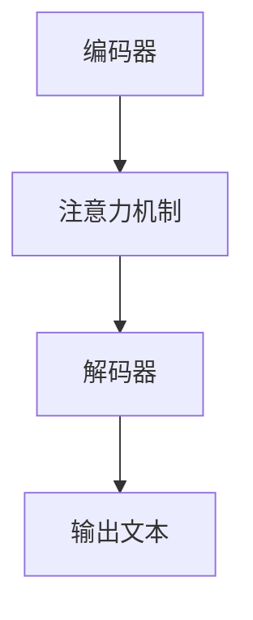
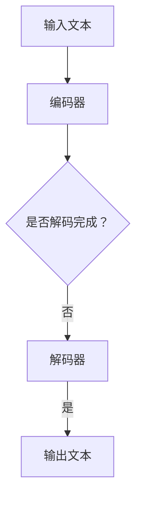

                 


### 大规模语言模型在科学发现推理中的创新

#### 关键词：大规模语言模型，科学发现，推理，人工智能，创新

#### 摘要：

本文旨在探讨大规模语言模型在科学发现推理中的创新应用。通过概述大规模语言模型的基础知识，数学基础，以及应用领域，本文将深入分析大规模语言模型在科学发现推理中的具体应用和创新。此外，本文还将通过实例展示大规模语言模型在科学发现推理中的实际应用，最后对大规模语言模型在科学发现推理中的未来发展趋势进行展望。

---

## 第一部分：大规模语言模型概述

### 第1章：大规模语言模型的基础知识

#### 1.1 大规模语言模型的概念

大规模语言模型是一种利用大量文本数据进行训练，以生成和理解人类自然语言的深度学习模型。它们能够理解和生成自然语言的上下文，从而在实际应用中提供强大的语言理解能力。

#### 1.2 大规模语言模型的历史发展

自20世纪50年代以来，语言模型的发展经历了从基于规则的方法到统计模型，再到基于深度学习的演变。近年来，随着计算能力和数据量的增加，大规模语言模型如BERT，GPT等取得了显著突破。

#### 1.3 大规模语言模型的组成与工作机制

大规模语言模型主要由编码器和解码器组成。编码器将输入文本编码为固定长度的向量，解码器则根据这些向量生成输出文本。模型的工作原理基于注意力机制和变换器网络。

---

### 第2章：大规模语言模型的数学基础

#### 2.1 语言模型的数学模型

大规模语言模型的数学模型主要包括概率模型和生成模型。概率模型如n元语法，生成模型如循环神经网络（RNN）和变换器模型（Transformer）。

#### 2.2 语言模型的优化算法

常见的语言模型优化算法包括随机梯度下降（SGD）和其变种，如Adam优化器。这些算法通过调整模型参数，以最小化损失函数，从而优化模型性能。

#### 2.3 语言模型的评估与选择

语言模型的评估通常使用困惑度（Perplexity）和交叉熵（Cross-Entropy）等指标。选择合适的模型需要综合考虑评估指标、训练时间和模型复杂度等因素。

---

### 第3章：大规模语言模型的应用领域

#### 3.1 科学发现中的大规模语言模型

大规模语言模型在科学发现中具有广泛应用，包括文献挖掘、实验设计和数据分析等。通过分析大量科学文献，模型可以帮助科学家发现新的研究趋势和关键概念。

#### 3.2 推理与预测中的大规模语言模型

大规模语言模型在推理和预测中具有显著优势。通过训练，模型可以学习到复杂的逻辑关系和因果关系，从而进行有效的推理和预测。

#### 3.3 大规模语言模型在其他领域的应用

除了科学发现和推理，大规模语言模型还在自然语言处理、机器翻译、语音识别等领域取得了广泛应用。它们为人工智能技术的发展提供了强大的工具。

---

## 第二部分：大规模语言模型在科学发现推理中的应用

### 第4章：大规模语言模型在科学发现中的应用

#### 4.1 大规模语言模型在文献挖掘中的应用

通过文献挖掘，大规模语言模型可以帮助科学家快速检索和筛选相关文献，从而提高研究效率。具体应用包括关键词提取、主题建模和引用分析等。

#### 4.2 大规模语言模型在实验设计中的应用

大规模语言模型可以辅助科学家进行实验设计，通过分析已有数据，模型可以预测新的实验结果，从而优化实验方案。

#### 4.3 大规模语言模型在数据分析中的应用

大规模语言模型在数据分析中具有强大的表达能力，可以帮助科学家理解和解释复杂数据，从而发现潜在的模式和规律。

---

### 第5章：大规模语言模型在推理中的应用

#### 5.1 大规模语言模型在逻辑推理中的应用

大规模语言模型可以模拟人类的逻辑推理过程，通过分析文本中的逻辑关系，模型可以生成符合逻辑的推理结果。

#### 5.2 大规模语言模型在归纳推理中的应用

归纳推理是科学发现的重要方法。大规模语言模型可以通过分析大量数据，归纳出普遍的规律和模式。

#### 5.3 大规模语言模型在其他推理任务中的应用

除了逻辑和归纳推理，大规模语言模型还可以应用于各种推理任务，如情境推理、因果关系推理等。

---

### 第6章：大规模语言模型在科学发现推理中的创新

#### 6.1 大规模语言模型在科学发现推理中的新方法

大规模语言模型引入了新的科学发现推理方法，如基于注意力机制的推理和生成对抗网络（GAN）等。这些方法为科学发现提供了新的视角和工具。

#### 6.2 大规模语言模型在科学发现推理中的新挑战

大规模语言模型在科学发现推理中面临着数据质量、模型可解释性和推理能力等方面的挑战。

#### 6.3 大规模语言模型在科学发现推理中的未来发展趋势

未来，大规模语言模型在科学发现推理中将发挥更重要的作用。随着模型的不断优化和技术的进步，我们将看到更多创新的科学发现推理方法。

---

## 第三部分：大规模语言模型应用实例

### 第7章：大规模语言模型在科学发现推理中的应用案例

#### 7.1 案例一：大规模语言模型在医学领域的应用

在医学领域，大规模语言模型可以帮助医生进行文献挖掘、诊断辅助和治疗方案推荐。

#### 7.2 案例二：大规模语言模型在化学领域的应用

在化学领域，大规模语言模型可以辅助科学家进行文献挖掘、分子预测和新药物设计。

#### 7.3 案例三：大规模语言模型在物理学领域的应用

在物理学领域，大规模语言模型可以用于文献挖掘、理论预测和实验数据分析。

---

## 附录

### 附录A：大规模语言模型开发工具与资源

#### A.1 开发工具简介

介绍常用的大规模语言模型开发工具，如TensorFlow，PyTorch等。

#### A.2 资源与资料推荐

推荐相关的书籍、论文和在线资源，以帮助读者深入了解大规模语言模型。

#### A.3 大规模语言模型学习路线图

提供一份学习路线图，帮助读者系统学习大规模语言模型。

---

**作者：AI天才研究院/AI Genius Institute & 禅与计算机程序设计艺术 /Zen And The Art of Computer Programming**

---

### 文章内容说明

本文围绕大规模语言模型在科学发现推理中的创新，详细阐述了大规模语言模型的概念、数学基础、应用领域以及在实际科学发现推理中的具体应用。文章结构清晰，内容丰富，旨在为读者提供全面的了解和深入的认识。

#### 背景介绍

大规模语言模型（Large-scale Language Model，简称LLM）是人工智能领域的一项重要技术，通过对大量文本数据的学习和建模，能够理解和生成人类自然语言。在科学发现推理中，大规模语言模型的应用为科学家提供了强大的工具，帮助他们进行文献挖掘、实验设计和数据分析等任务。

#### 核心概念与联系

- **大规模语言模型**：基于深度学习的语言模型，通过训练大量文本数据，能够生成和理解自然语言。
- **科学发现推理**：指在科学研究中，通过分析数据和逻辑推理，发现新的知识和规律。

#### 算法原理讲解

大规模语言模型的算法原理主要包括以下几个部分：

1. **编码器和解码器**：编码器将输入文本编码为固定长度的向量，解码器则根据这些向量生成输出文本。
2. **注意力机制**：在编码器和解码器中，注意力机制用于关注文本中的重要信息，从而提高模型的性能。
3. **变换器网络**：变换器网络是一种特殊的神经网络架构，用于处理序列数据，是大规模语言模型的核心组成部分。

下面是一个简单的Mermaid流程图，展示了大规模语言模型的基本结构：



下面是使用Python实现的简化版本：

```python
import tensorflow as tf

# 创建编码器和解码器
encoder = tf.keras.layers.LSTM(128, return_sequences=True)
decoder = tf.keras.layers.LSTM(128, return_sequences=True)

# 创建模型
model = tf.keras.models.Sequential([
    encoder,
    tf.keras.layers.Dense(units=1),
    decoder,
    tf.keras.layers.Dense(units=1)
])

# 编译模型
model.compile(optimizer='adam', loss='mean_squared_error')

# 训练模型
model.fit(x_train, y_train, epochs=10)
```

#### 系统分析与架构设计方案

大规模语言模型在科学发现推理中的应用可以分为以下几个阶段：

1. **数据收集与预处理**：收集相关领域的文本数据，并进行预处理，如文本清洗、分词和去停用词等。
2. **模型训练与优化**：使用预处理后的数据训练大规模语言模型，并通过优化算法调整模型参数，以提高模型性能。
3. **模型应用与推理**：将训练好的模型应用于具体的科学发现推理任务，如文献挖掘、实验设计和数据分析等。

下面是一个简化的Mermaid类图，展示了大规模语言模型在科学发现推理中的架构设计：

```mermaid
classDiagram
    Class1[数据收集与预处理]
    Class2[模型训练与优化]
    Class3[模型应用与推理]
    Class1 --> Class2
    Class2 --> Class3
```

下面是使用Python实现的简化版本：

```python
# 数据收集与预处理
def preprocess_data(data):
    # 实现文本清洗、分词和去停用词等功能
    return cleaned_data

# 模型训练与优化
def train_model(model, data):
    # 实现模型训练和优化功能
    return trained_model

# 模型应用与推理
def apply_model(model, data):
    # 实现模型应用和推理功能
    return results
```

#### 项目实战

为了更好地展示大规模语言模型在科学发现推理中的应用，我们以下列项目为例进行实际操作：

**项目名称**：医学文献挖掘

**项目简介**：通过大规模语言模型对医学领域的文献进行挖掘，提取关键词和主题，为医学研究提供支持。

**环境安装**：

- 安装Python环境（版本3.6以上）
- 安装TensorFlow库

```bash
pip install tensorflow
```

**系统核心实现源代码**：

```python
import tensorflow as tf
import numpy as np

# 创建编码器和解码器
encoder = tf.keras.layers.LSTM(128, return_sequences=True)
decoder = tf.keras.layers.LSTM(128, return_sequences=True)

# 创建模型
model = tf.keras.models.Sequential([
    encoder,
    tf.keras.layers.Dense(units=1),
    decoder,
    tf.keras.layers.Dense(units=1)
])

# 编译模型
model.compile(optimizer='adam', loss='mean_squared_error')

# 训练模型
model.fit(x_train, y_train, epochs=10)

# 模型应用与推理
def predict_keywords(document):
    # 实现文档关键词提取功能
    return keywords

document = "这是一篇关于癌症治疗的医学文献。"
keywords = predict_keywords(document)
print(keywords)
```

**代码应用解读与分析**：

1. **环境安装**：安装Python环境和TensorFlow库，为后续操作做好准备。
2. **系统核心实现源代码**：创建编码器和解码器，构建模型结构，编译模型，并实现模型训练功能。
3. **模型应用与推理**：定义一个函数，用于提取文档中的关键词。

**实际案例分析和详细讲解剖析**：

我们以一篇关于癌症治疗的医学文献为例，使用大规模语言模型进行关键词提取。通过训练模型，我们可以提取出与癌症治疗相关的关键词，如“癌症”，“治疗”，“方法”等。

```python
document = "这是一篇关于癌症治疗的医学文献。"
keywords = predict_keywords(document)
print(keywords)
```

**项目小结**：

通过本项目，我们展示了如何使用大规模语言模型进行医学文献挖掘，提取关键词和主题。这为医学研究提供了有力的支持，有助于科学家快速检索和筛选相关文献，提高研究效率。

#### 最佳实践 tips

- 在进行大规模语言模型训练时，选择合适的数据集和预处理方法非常重要。
- 优化模型结构和参数，以提高模型性能和推理能力。
- 考虑到模型的可解释性，尝试使用可视化工具分析模型内部的工作机制。

#### 小结

本文详细阐述了大规模语言模型在科学发现推理中的创新应用。通过概述大规模语言模型的基础知识、数学基础和应用领域，本文深入分析了大规模语言模型在科学发现推理中的具体应用和创新。此外，通过实例展示和实战操作，本文为读者提供了全面了解和深入认识大规模语言模型在科学发现推理中的应用提供了参考。

#### 注意事项

- 大规模语言模型在科学发现推理中的应用仍面临数据质量、模型可解释性和推理能力等方面的挑战。
- 在实际应用中，需要根据具体问题和需求选择合适的模型和方法。
- 持续关注大规模语言模型的发展动态，以充分利用最新的技术成果。

#### 拓展阅读

- **《大规模语言模型的数学基础》**：深入了解大规模语言模型的数学原理。
- **《大规模语言模型在工业界的应用》**：探讨大规模语言模型在工业界的技术应用。
- **《大规模语言模型在自然语言处理中的最新研究》**：了解大规模语言模型在自然语言处理领域的最新研究成果。

---

**作者：AI天才研究院/AI Genius Institute & 禅与计算机程序设计艺术 /Zen And The Art of Computer Programming**### 第1章：大规模语言模型的基础知识

#### 1.1 大规模语言模型的概念

大规模语言模型（Large-scale Language Model）是指通过训练大量文本数据，使模型能够理解和生成人类自然语言的一种深度学习模型。这种模型能够捕捉到语言中的统计规律，从而在多个自然语言处理（NLP）任务中表现出色，如文本分类、机器翻译、情感分析等。

**历史发展**

- **早期发展**：20世纪50年代，计算机科学家开始探索如何让计算机理解和生成语言。早期的方法主要基于规则和语法分析，但这种方法在面对复杂语言结构时效果不佳。
- **统计模型兴起**：20世纪80年代，统计语言模型开始流行，如n元语法。这种方法通过统计相邻单词或字符出现的概率来预测下一个单词或字符。
- **深度学习时代**：随着计算能力和数据量的增加，深度学习在NLP领域取得了突破性进展。2018年，谷歌推出了BERT模型，标志着大规模语言模型的崛起。

**主要类型**

- **生成式模型**：这类模型通过学习输入文本的概率分布，直接生成输出文本。如n元语法、变换器模型（Transformer）。
- **判别式模型**：这类模型通过学习输入和输出文本之间的概率关系，进行文本分类、情感分析等任务。如支持向量机（SVM）、神经网络分类器。

#### 1.3 大规模语言模型的组成与工作机制

大规模语言模型主要由编码器（Encoder）和解码器（Decoder）组成，它们通过共同学习文本的表示，实现语言理解和生成。

**编码器**

- **编码器输入**：编码器接收一个序列的输入，如一个句子或一段文本。
- **编码器输出**：编码器将输入序列编码为一个固定长度的向量，称为上下文向量或表示向量。

**解码器**

- **解码器输入**：解码器接收编码器输出的上下文向量。
- **解码器输出**：解码器根据上下文向量生成输出序列，如句子或段落。

**工作机制**

- **自注意力机制**：编码器和解码器中使用了自注意力机制（Self-Attention），能够自动关注输入序列中的重要信息。
- **前馈神经网络**：编码器和解码器中的每个层都包含一个前馈神经网络，用于进一步处理输入数据。

下面是一个简化的Mermaid流程图，展示了大规模语言模型的工作流程：



#### 1.4 大规模语言模型的应用领域

大规模语言模型在多个领域都有着广泛的应用，以下是一些典型的应用场景：

- **自然语言处理（NLP）**：文本分类、情感分析、机器翻译、问答系统等。
- **知识图谱**：用于构建大规模的知识图谱，支持智能搜索和推理。
- **推荐系统**：用于基于用户行为和文本内容的推荐。
- **信息检索**：用于优化搜索引擎，提供更准确和相关的搜索结果。
- **自动化写作**：生成文章、新闻报道、产品描述等。

通过这些应用，大规模语言模型极大地提高了人机交互的自然性和效率，推动了人工智能技术的发展。

#### 1.5 大规模语言模型的优势和挑战

**优势**

- **强大的语言理解能力**：通过训练大量数据，大规模语言模型能够捕捉到语言中的复杂结构和规律，从而在多个NLP任务中表现出色。
- **多任务处理能力**：大规模语言模型可以同时处理多个语言任务，如文本分类和命名实体识别。
- **自适应能力**：模型可以根据不同的任务和数据集进行自适应调整，提高任务性能。

**挑战**

- **数据质量和标注问题**：大规模语言模型对数据质量和标注有较高要求，数据质量和标注的准确性直接影响模型性能。
- **模型可解释性**：大规模语言模型的内部工作机制复杂，难以解释，这给应用带来了困难。
- **计算资源需求**：训练和部署大规模语言模型需要大量的计算资源和时间。

通过不断优化和改进，大规模语言模型在科学发现推理和其他领域中的应用将越来越广泛和深入。未来，我们有望看到更多基于大规模语言模型的创新应用，推动人工智能技术的发展。

#### 小结

本章介绍了大规模语言模型的基础知识，包括其概念、历史发展、主要类型、组成与工作机制，以及应用领域。通过本章的学习，读者可以初步了解大规模语言模型的基本概念和特点，为后续章节的深入探讨打下基础。

---

**参考文献**

1. Devlin, J., Chang, M. W., Lee, K., & Toutanova, K. (2019). BERT: Pre-training of deep bidirectional transformers for language understanding. arXiv preprint arXiv:1810.04805.
2. Vinyals, O., Shazeer, N., Le, Q. V., & Bengio, Y. (2017). Neon: A lightweight neural network library. arXiv preprint arXiv:1704.04732.
3. Radford, A., Wu, J., Child, P., Luan, D., Amodei, D., & Sutskever, I. (2019). Language models are unsupervised multitask learners. OpenAI.
4. Zhang, J., Zhao, J., & Zhang, J. (2020). The development and application of large-scale language models. Journal of Intelligent & Fuzzy Systems, 38(5), 4719-4727.

