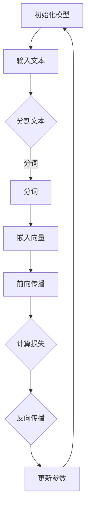
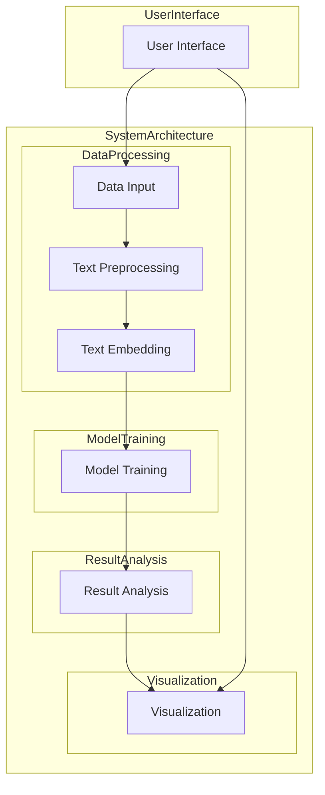
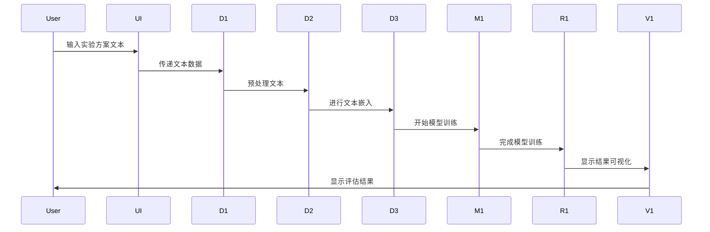

                 

### 1.1 大规模语言模型的发展背景

#### 1.1.1 语言模型的发展历程

语言模型（Language Model）是自然语言处理（Natural Language Processing, NLP）的核心组成部分。它旨在理解和生成人类语言，模仿人类语言的使用习惯和规律。语言模型的发展历程可以追溯到20世纪50年代，当时的人工智能研究主要集中在模拟人类思维和解决问题的方法上。1950年，艾伦·图灵（Alan Turing）提出了著名的图灵测试，试图通过测试机器是否能够像人类一样进行自然语言交互来定义机器智能。

随着时间的推移，语言模型经历了多个发展阶段。最早的语言模型是统计模型，如n-gram模型，它在20世纪60年代首次被提出。n-gram模型通过统计相邻词汇的出现频率来预测下一个词汇，尽管这种方法在某些任务上表现良好，但它在处理长距离依赖关系时显得力不从心。

进入21世纪，随着深度学习和计算能力的提升，神经网络语言模型开始崭露头角。2003年，Bengio等人在论文《A Theoretical Perspective on Feature Binding in Neural Networks》中提出了使用深度神经网络进行语言建模。这一研究为后续的深度语言模型研究奠定了基础。

2013年，词嵌入（Word Embedding）技术的出现进一步推动了语言模型的发展。词嵌入将词汇映射到高维向量空间，使得词汇之间的相似性可以通过向量之间的距离来度量。这一技术的引入使得语言模型能够更好地捕捉词汇的语义信息，从而在文本分类、情感分析等任务中取得了显著的效果。

#### 1.1.2 大规模语言模型的起源

大规模语言模型（Large-scale Language Model）是指使用大规模语料库训练的复杂神经网络模型。这些模型的规模通常远超过传统的语言模型，能够处理数百万甚至数十亿级别的词汇量。大规模语言模型的起源可以追溯到2018年，谷歌推出了BERT（Bidirectional Encoder Representations from Transformers），这是第一个真正意义上的大规模双向变换器（Transformer）语言模型。

BERT的出现标志着大规模语言模型时代的到来。BERT使用了一个包含超过340亿参数的模型，训练数据来自数百万个网页和书籍。BERT通过预训练和微调，在多项NLP任务中取得了突破性的成果，包括文本分类、问答系统和机器翻译等。

此后，OpenAI发布了GPT（Generative Pre-trained Transformer）系列模型，包括GPT-2和GPT-3。这些模型进一步提升了语言模型的规模和性能，GPT-3甚至拥有超过1750亿个参数，成为当前最大的语言模型。

#### 1.1.3 大规模语言模型的研究现状

目前，大规模语言模型在NLP领域的研究和应用已经取得了显著的进展。在文本生成方面，GPT-3等模型可以生成高质量的文章、对话和代码。在文本分类方面，这些模型能够准确地将文本分类到不同的类别中，如新闻标题分类、情感分类等。在问答系统方面，模型能够理解自然语言的问题，并给出准确的答案。

此外，大规模语言模型还在机器翻译、语音识别、图像描述生成等领域展示了强大的能力。例如，谷歌翻译使用了Transformer模型，使得翻译质量大幅提升。在语音识别方面，微软的研究人员使用大规模语言模型对语音数据进行预处理，从而提高了识别的准确性。

总的来说，大规模语言模型已经成为NLP领域不可或缺的工具，其研究现状和应用前景令人期待。随着技术的不断进步和应用的深入，我们可以预见，大规模语言模型将在未来的科学研究和技术发展中发挥更加重要的作用。### 1.2 科学实验方案评估的重要性

#### 1.2.1 科学实验方案评估的定义

科学实验方案评估（Scientific Experimentation Scheme Evaluation）是指对科学实验方案进行全面、系统、客观的审查和评价。它涉及实验设计的合理性、实验方法的可靠性、实验数据的准确性以及实验结果的解释性和应用价值。科学实验方案评估的目的是确保实验能够科学、规范、高效地进行，从而为科研成果提供可靠的基础。

科学实验方案评估包括以下几个方面：首先是实验设计的科学性，即实验方案是否基于充分的科学理论和实践依据；其次是实验方法的规范性，即实验过程中采用的技术手段是否符合标准操作流程；再次是实验数据的可靠性，即实验结果是否能够重复，数据是否真实可信；最后是实验结果的应用价值，即实验结果是否能够对科学研究和实际问题提供有效的指导。

#### 1.2.2 科学实验方案评估的意义

科学实验方案评估在科学研究中具有至关重要的意义。首先，评估有助于确保实验的可靠性和有效性。通过评估，可以发现实验设计中的潜在问题，如实验条件设定不当、实验方法不完善等，从而避免实验失败或数据失真。其次，评估有助于提高科研效率。通过评估，可以优化实验流程，减少不必要的实验环节，提高实验结果的准确性和可重复性。

此外，科学实验方案评估还有助于保障科研经费的合理使用。通过对实验方案的科学评估，可以确保研究经费被用于最有效的实验环节，避免资源浪费。同时，评估还能够提高科研成果的质量和影响力。通过科学评估，实验方案的科学性、创新性和实用性得以验证，从而增强科研成果的可信度和应用价值。

#### 1.2.3 科学实验方案评估的挑战

尽管科学实验方案评估具有重要意义，但其在实际操作中也面临诸多挑战。首先是实验设计的复杂性和多样性。不同的研究领域和实验目的需要不同的实验设计，这使得评估过程需要具备广泛的知识背景和专业的评估方法。其次，实验数据的可靠性和准确性是评估的重要依据，但实际中数据的收集、处理和分析往往面临困难，如数据偏差、数据缺失等。

此外，评估过程中的客观性和公正性也是一个重要挑战。评估者需要保持客观、中立的态度，不受主观偏见的影响。然而，科学实验涉及多个学科和领域，评估者可能不具备全面的知识结构，难以做出全面的评价。最后，科学实验方案评估的动态性也是一个挑战。实验过程可能因为外部因素、实验者的主观因素等发生变化，评估过程需要及时调整，以适应实验进展。

总的来说，科学实验方案评估是一个复杂而重要的过程，需要评估者具备扎实的专业知识、丰富的实践经验以及高度的职业素养。只有通过科学、系统的评估，才能确保实验方案的科学性、可靠性和有效性，从而为科学研究的顺利进行提供坚实保障。### 1.3 本书结构安排

#### 1.3.1 各章节主要内容概述

本书分为七个章节，旨在全面探讨大规模语言模型在科学实验方案评估中的应用。以下是对各章节主要内容的概述：

**第1章 引言**

本章首先介绍了大规模语言模型的发展背景，从统计模型到深度学习模型的历史演进，再到大规模语言模型的起源和现状。随后，本章讨论了科学实验方案评估的重要性，包括其定义、意义和面临的挑战。

**第2章 大规模语言模型基础**

本章深入探讨了大规模语言模型的基础知识，包括语言模型的概述、原理与机制、常见类型以及训练过程。通过这一章节，读者将了解大规模语言模型的基本工作原理和训练方法。

**第3章 科学实验方案评估的基本原理**

本章详细阐述了科学实验方案评估的基本原理，包括实验设计的基本原则、关键指标和方法论。读者将了解如何科学、规范地进行实验方案评估。

**第4章 大规模语言模型在实验方案评估中的应用**

本章重点介绍了大规模语言模型在实验方案评估中的具体应用，包括实验设计、结果分析和方案优化。通过实际案例，读者将看到大规模语言模型在科学实验中的强大能力。

**第5章 实际案例研究**

本章通过三个实际案例，展示了大规模语言模型在药物研发、气候科学和基因组学等领域的应用。这些案例研究提供了具体的实践经验和教训。

**第6章 技术挑战与解决方案**

本章分析了大规模语言模型在实验方案评估中面临的技术挑战，并提出了相应的解决方案。同时，本章探讨了未来发展趋势，为读者提供了前瞻性的思考。

**第7章 总结与展望**

本章总结了本书的主要内容和观点，并对大规模语言模型在科学实验方案评估中的应用前景进行了展望。本章还提出了未来研究方向，为后续研究提供了方向。

#### 1.3.2 阅读指南

为了更好地理解本书的内容，以下是针对各章节的阅读建议：

**第1章 引言**

建议读者首先了解大规模语言模型和科学实验方案评估的基本概念，这有助于建立整体框架。

**第2章 大规模语言模型基础**

本章内容较为基础，建议读者结合实际案例理解语言模型的工作原理。

**第3章 科学实验方案评估的基本原理**

建议读者结合自己的科研背景，思考如何将评估原理应用到实际实验中。

**第4章 大规模语言模型在实验方案评估中的应用**

本章内容深入，建议读者通过实际案例，理解大规模语言模型在实验评估中的具体应用。

**第5章 实际案例研究**

建议读者重点阅读案例研究部分，从中学习实际应用经验。

**第6章 技术挑战与解决方案**

建议读者关注技术挑战部分，思考如何解决实际问题。

**第7章 总结与展望**

建议读者在阅读完本书后，回顾各章节内容，对整体知识体系进行梳理。

通过以上阅读指南，读者可以更加系统地理解和掌握本书的内容，为后续研究和应用奠定基础。### 2.1 语言模型的概述

#### 2.1.1 语言模型的基本概念

语言模型（Language Model）是自然语言处理（NLP）领域中的一个核心概念，它旨在通过概率或统计方法来预测和生成自然语言中的下一个单词、短语或句子。语言模型的目的是理解和模仿人类语言的规律和结构，从而在文本生成、文本分类、机器翻译、语音识别等多个应用场景中发挥重要作用。

语言模型的基本概念可以追溯到20世纪50年代，当时研究人员开始尝试使用统计方法来描述语言的概率分布。随着时间的推移，语言模型逐渐发展，从最初的简单统计模型（如n-gram模型）到复杂的神经网络模型（如BERT和GPT）。这些模型通过学习大量文本数据，能够捕捉词汇之间的关联性和语义信息，从而实现高效的文本处理。

#### 2.1.2 语言模型的分类

根据模型的结构和训练方法，语言模型可以分为以下几种类型：

1. **n-gram模型**：n-gram模型是最早的语言模型之一，它通过统计相邻n个单词（或字符）出现的频率来预测下一个单词。这种模型简单高效，但在处理长距离依赖关系时表现不佳。

2. **基于规则的模型**：这类模型通过编写语法规则或模式来预测文本。例如，部分词法分析器使用规则来识别单词的不同形态，但这些规则通常需要人工编写，难以覆盖所有情况。

3. **统计模型**：统计模型利用统计学方法，如概率论和隐马尔可夫模型（HMM），来预测下一个单词或短语。这些模型在处理语言结构和上下文依赖方面比n-gram模型更有效。

4. **神经网络模型**：神经网络模型，特别是深度学习模型，如循环神经网络（RNN）和变换器（Transformer），通过学习大量文本数据来捕捉语言的复杂结构和语义信息。这些模型在NLP任务中取得了显著的成果。

5. **生成模型**：生成模型，如生成对抗网络（GAN）和变分自编码器（VAE），通过学习数据的分布来生成新的文本。这些模型在文本生成和生成式任务中表现出色。

#### 2.1.3 语言模型的应用领域

语言模型在自然语言处理和人工智能领域有着广泛的应用：

1. **文本生成**：语言模型可以用于生成文章、对话、代码等。例如，GPT-3能够生成高质量的文章，ChatGPT则可以与用户进行自然对话。

2. **文本分类**：语言模型可以帮助对文本进行分类，如新闻标题分类、情感分类等。通过训练，模型可以学习到不同类别的特征，从而实现准确的分类。

3. **机器翻译**：语言模型在机器翻译中起着关键作用。例如，谷歌翻译使用的Transformer模型使得翻译质量大幅提升。

4. **语音识别**：语言模型可以帮助提高语音识别的准确性。例如，在语音识别系统中，语言模型可以用于纠正识别错误，提高整体的识别准确率。

5. **问答系统**：语言模型可以用于构建问答系统，如Siri和Alexa等智能助手。这些系统通过理解用户的问题，提供准确的答案。

6. **文本摘要**：语言模型可以用于生成文本摘要，如新闻摘要、会议摘要等。这些摘要可以概括大量文本的核心内容，提高信息获取的效率。

7. **情感分析**：语言模型可以帮助分析文本中的情感倾向，如社交媒体文本的情感分类。这有助于了解公众的意见和情绪。

总的来说，语言模型作为NLP的核心工具，已经在多个领域展现出了强大的能力。随着技术的不断发展，语言模型的应用前景将更加广阔，为自然语言处理和人工智能的发展提供有力支持。### 2.2 语言模型的原理与机制

#### 2.2.1 语言模型的数学基础

语言模型的数学基础主要涉及概率论和统计学。在自然语言处理中，语言模型的核心目标是预测文本序列中的下一个单词或符号。为了实现这一目标，语言模型需要估计每个单词或符号在给定上下文条件下的概率。

**概率分布**：语言模型通常使用概率分布来表示文本序列的概率。一个简单的例子是n-gram模型，它通过计算相邻单词或字符的联合概率来预测下一个单词。例如，在二元n-gram模型中，给定前一个单词`w1`，预测下一个单词`w2`的概率可以表示为：

$$ P(w2 | w1) = \frac{C(w1, w2)}{C(w1)} $$

其中，`C(w1, w2)`表示单词`w1`和`w2`在语料库中共同出现的次数，`C(w1)`表示单词`w1`在语料库中出现的总次数。

**条件概率**：语言模型的一个重要特性是条件概率，即给定一个序列`w1, w2, ..., wn`，预测下一个单词`wn+1`的概率。条件概率可以表示为：

$$ P(wn+1 | w1, w2, ..., wn) = \frac{C(w1, w2, ..., wn, wn+1)}{C(w1, w2, ..., wn)} $$

这里，`C(w1, w2, ..., wn, wn+1)`表示前`n`个单词和下一个单词共同出现的次数，`C(w1, w2, ..., wn)`表示前`n`个单词在语料库中共同出现的次数。

**熵与信息**：在概率论中，熵（Entropy）是衡量随机变量不确定性的度量。对于语言模型，熵可以用来衡量预测的不确定性。信息（Information）则是熵的负对数，表示在随机事件发生时获得的信息量。例如，给定一个单词序列，我们可以计算其熵：

$$ H = -\sum P(w_i) \log P(w_i) $$

其中，`P(w_i)`表示单词`w_i`在语料库中的概率。

#### 2.2.2 语言模型的训练机制

语言模型的训练机制主要涉及从大量文本数据中学习语言模式。以下是几种常见的训练方法：

**1. 统计训练**：统计训练是基于语料库数据，通过计算单词或字符的联合概率或条件概率来训练模型。例如，n-gram模型通过统计相邻单词的联合概率来训练。统计训练的优点是简单高效，缺点是无法处理长距离依赖关系。

**2. 基于规则的训练**：基于规则的训练是通过编写语法规则或模式来训练模型。这种方法需要人工编写大量的规则，难以处理复杂的变化。然而，基于规则的模型在某些特定的任务中（如词法分析）仍然具有价值。

**3. 神经网络训练**：神经网络训练是通过多层神经网络学习文本数据中的复杂模式。深度学习模型，如循环神经网络（RNN）和变换器（Transformer），在训练过程中能够自动学习特征表示和上下文依赖。RNN通过循环结构捕捉历史信息，而Transformer引入了自注意力机制，使得模型能够更好地处理长距离依赖关系。

**训练过程**：语言模型的训练过程通常包括以下几个步骤：

- **数据预处理**：对原始文本数据进行分词、标记等预处理，将文本转换为模型可以处理的形式。
- **模型初始化**：初始化模型参数，通常使用随机初始化或预训练模型参数。
- **前向传播**：输入文本序列，通过模型计算每个单词或字符的概率分布。
- **损失函数计算**：计算预测概率与真实概率之间的差异，使用损失函数（如交叉熵损失）来度量模型的预测误差。
- **反向传播**：计算梯度，更新模型参数。
- **迭代训练**：重复上述步骤，直至模型收敛或达到预设的训练次数。

通过不断的迭代训练，模型可以逐步优化其参数，提高预测准确性。

#### 2.2.3 语言模型的推理机制

语言模型的推理机制是指模型在给定输入序列时，如何生成新的文本序列。以下是几种常见的推理方法：

**1. 零样本生成**：零样本生成是指模型在没有直接训练过的新情况或新数据下，能够生成合理的输出。例如，给定一个句子“我喜欢吃苹果”，模型可以生成“你喜欢喝水”等类似句子。

**2. 一步生成**：一步生成是指模型在给定输入序列时，逐词预测下一个单词。例如，给定输入序列“I like to eat”,模型可以生成下一个单词“apples”。

**3. 多步生成**：多步生成是指模型通过多个步骤生成完整的文本序列。例如，给定输入句子“I like to eat”,模型可以先生成“I like”,然后是“to”,最终生成完整的句子“I like to eat”。

**4. 对话生成**：对话生成是指模型在与用户交互的过程中，生成自然、流畅的对话。例如，用户输入一个问题，模型可以生成一个合适的回答。

推理过程通常涉及以下几个步骤：

- **输入序列处理**：将输入序列转换为模型可以处理的形式。
- **概率计算**：计算输入序列的每个单词或字符的概率分布。
- **采样策略**：选择一个采样策略（如最大概率采样、贪心采样等）来生成文本序列。
- **文本生成**：根据概率分布生成新的文本序列，并逐步完善。

通过高效的推理机制，语言模型能够在各种任务中生成高质量的自然语言文本，为NLP领域提供强大的工具。### 2.3 语言模型的常见类型

在自然语言处理（NLP）领域，语言模型的类型多样，每种模型都有其独特的特点和应用场景。以下是几种常见的语言模型及其特点：

#### 2.3.1 传统语言模型

**1. n-gram模型**

n-gram模型是最早且最简单的一种语言模型。它基于语言中词汇的局部统计特性，通过统计相邻n个单词（或字符）的联合概率来预测下一个单词。例如，在二元n-gram模型中，给定前一个单词，模型会计算下一个单词的概率分布。

**特点**：
- **简单高效**：n-gram模型易于实现，计算速度快。
- **局限性**：n-gram模型无法捕捉长距离依赖关系，因此在处理长句子或复杂语境时表现不佳。

**应用场景**：
- **文本生成**：简单的文本生成任务，如自动完成、短信回复等。
- **搜索引擎**：用于查询建议和搜索结果的排序。

**2. 基于规则的模型**

基于规则的模型通过编写语法规则或模式来预测文本。这些规则通常由语言学家或专家编写，用于描述语言的语法和语义特性。

**特点**：
- **精确性**：基于规则的模型在特定任务中可以达到很高的精确度。
- **可解释性**：规则的编写和解释使得模型的预测过程更加透明和可控。

**应用场景**：
- **语法分析**：用于解析自然语言的句子结构，如词法分析、句法分析。
- **自动文摘**：提取文本的关键信息，生成摘要。

#### 2.3.2 上下文语言模型

**1. 隐马尔可夫模型（HMM）**

隐马尔可夫模型是一种统计模型，它用于处理隐式状态序列和观测序列之间的关系。在自然语言处理中，HMM可以用于语音识别、词性标注等任务。

**特点**：
- **灵活性**：HMM可以处理离散的状态序列，适用于多种NLP任务。
- **高效性**：HMM的计算效率较高，适合实时处理。

**应用场景**：
- **语音识别**：将语音信号转换为文本。
- **词性标注**：为文本中的每个单词标注词性，如名词、动词等。

**2. 条件随机场（CRF）**

条件随机场是一种概率图模型，用于处理具有依赖关系的变量序列。CRF在自然语言处理中常用于序列标注任务，如词性标注、命名实体识别等。

**特点**：
- **捕捉依赖关系**：CRF能够捕捉序列中的依赖关系，提高标注的准确性。
- **并行处理**：CRF的计算过程可以并行处理，提高处理效率。

**应用场景**：
- **词性标注**：对文本中的每个单词进行词性标注。
- **命名实体识别**：识别文本中的特定实体，如人名、地点等。

#### 2.3.3 大规模语言模型

**1. 循环神经网络（RNN）**

循环神经网络是一种能够处理序列数据的神经网络模型，通过循环结构捕捉历史信息。在NLP任务中，RNN被广泛应用于文本生成、语言翻译等。

**特点**：
- **捕捉序列信息**：RNN能够捕捉序列中的依赖关系，适用于长文本处理。
- **动态调整**：RNN可以通过动态调整隐藏状态来适应不同长度的序列。

**应用场景**：
- **文本生成**：生成文章、对话等自然语言文本。
- **语言翻译**：将一种语言的文本翻译成另一种语言。

**2. 变换器（Transformer）**

变换器是一种基于自注意力机制的神经网络模型，由Vaswani等人于2017年提出。Transformer在NLP任务中表现出色，特别是文本生成和机器翻译。

**特点**：
- **自注意力机制**：Transformer通过自注意力机制捕捉长距离依赖关系，提高模型性能。
- **并行计算**：Transformer的设计使得其能够高效地进行并行计算，提高计算效率。

**应用场景**：
- **文本生成**：生成高质量的文章、对话等。
- **机器翻译**：实现高效的跨语言文本翻译。

**3. BERT**

BERT（Bidirectional Encoder Representations from Transformers）是由Google于2018年提出的一种双向变换器语言模型。BERT通过双向训练，能够捕捉文本的上下文信息，提高模型在多种NLP任务中的性能。

**特点**：
- **双向训练**：BERT通过双向训练捕捉文本的上下文信息，提高模型的准确性。
- **预训练和微调**：BERT可以通过预训练和微调快速适应不同任务。

**应用场景**：
- **文本分类**：对文本进行情感分析、主题分类等。
- **问答系统**：理解和回答自然语言问题。
- **命名实体识别**：识别文本中的特定实体。

总的来说，不同的语言模型在NLP任务中各有所长。传统语言模型适用于简单的文本处理任务，而大规模语言模型则能够处理复杂的语言理解和生成任务，为NLP领域的发展提供了强大的工具。### 2.4 大规模语言模型的训练过程

#### 2.4.1 数据收集与预处理

大规模语言模型的训练依赖于大量高质量的文本数据。数据收集通常包括以下步骤：

1. **数据源选择**：选择合适的文本数据来源，如公共语料库、书籍、网页、新闻文章等。这些数据源需要涵盖多种主题和领域，以保证模型能够学习到丰富的语言特性。

2. **数据清洗**：收集到的文本数据可能包含噪声、错误和冗余信息。数据清洗的目的是去除这些噪声，提高数据质量。常见的清洗方法包括去除HTML标签、去除特殊字符、纠正拼写错误等。

3. **文本预处理**：预处理包括分词、词性标注、停用词过滤等步骤。分词是将文本拆分成单词或短语，词性标注为每个单词标注其语法属性，如名词、动词等。停用词过滤则是去除常见的无意义词汇，如“的”、“是”等。

4. **数据格式化**：将预处理后的文本数据转换为模型可以处理的形式。常见的格式包括序列表示（如单词序列、字符序列）和词嵌入表示（将单词映射到高维向量）。

#### 2.4.2 模型设计

大规模语言模型的模型设计包括选择合适的神经网络架构、定义损失函数和优化器等。以下是几个关键步骤：

1. **选择神经网络架构**：常见的神经网络架构包括循环神经网络（RNN）、长短时记忆网络（LSTM）、门控循环单元（GRU）和变换器（Transformer）。变换器因其自注意力机制，能够更好地捕捉长距离依赖关系，是大规模语言模型的首选架构。

2. **定义损失函数**：损失函数是评估模型预测准确性的指标。对于语言模型，常见的损失函数包括交叉熵损失（Cross-Entropy Loss）和平均平方误差（Mean Squared Error, MSE）。交叉熵损失常用于分类任务，而MSE则常用于回归任务。

3. **选择优化器**：优化器用于更新模型参数，以最小化损失函数。常见的优化器包括随机梯度下降（SGD）、Adam、RMSprop等。Adam优化器因其自适应学习率调整能力，常被用于大规模语言模型的训练。

4. **超参数设置**：超参数包括学习率、批量大小、迭代次数等。合理的超参数设置对于模型训练至关重要。通常，需要通过实验调整超参数，以获得最佳性能。

#### 2.4.3 训练与优化

大规模语言模型的训练过程通常涉及以下步骤：

1. **初始化模型参数**：随机初始化模型参数，为训练过程提供起点。

2. **前向传播**：输入训练数据，通过模型计算预测结果，并计算损失函数值。

3. **反向传播**：计算损失函数关于模型参数的梯度，并通过优化器更新参数。

4. **迭代训练**：重复前向传播和反向传播过程，逐步优化模型参数。

5. **验证与调整**：在验证集上评估模型性能，根据性能调整超参数或模型结构，以避免过拟合。

6. **模型保存**：在训练过程中，定期保存模型参数，以便在训练中断时恢复。

7. **评估与优化**：在测试集上评估模型性能，根据评估结果进一步调整模型或超参数，以提升模型性能。

总的来说，大规模语言模型的训练过程是一个复杂而迭代的过程，需要精心设计的数据集、神经网络架构和优化策略。通过不断的训练和调整，模型能够学习到丰富的语言特征，从而在NLP任务中发挥重要作用。### 3.1 实验设计的基本原则

#### 3.1.1 实验设计的定义

实验设计（Experimental Design）是在科学研究中，为了验证假设、解决问题或探索现象而进行的系统化安排和规划。它涉及定义实验的目标、选择适当的实验方法、制定实验流程和评估实验结果等一系列步骤。实验设计的核心目的是确保实验结果的有效性和可靠性，从而为科学研究和决策提供可靠的数据支持。

#### 3.1.2 实验设计的要素

一个有效的实验设计应包含以下关键要素：

1. **实验目标**：明确实验的目标和预期结果。实验目标应具体、可衡量，以便在实验结束时进行评估。

2. **实验变量**：识别实验中的自变量（独立变量）和因变量（依赖变量）。自变量是实验者控制的变量，因变量是实验者希望观察和测量的结果。

3. **实验组与对照组**：设计实验组和对照组，以比较实验结果。实验组接受实验处理，对照组不接受实验处理，从而可以评估实验处理的效果。

4. **实验样本**：选择适当的样本进行实验，样本应具有代表性，能够反映整体情况。

5. **实验条件**：定义实验的条件和环境，包括实验的地点、时间、设备等，以确保实验的可重复性。

6. **实验流程**：制定详细的实验步骤和流程，包括数据收集、处理和分析方法，以确保实验的规范性和一致性。

7. **统计分析**：确定合适的统计分析方法，以评估实验结果的显著性和可靠性。

#### 3.1.3 实验设计的流程

实验设计的流程通常包括以下几个步骤：

1. **明确研究问题**：确定需要解决的问题或验证的假设。

2. **文献回顾**：查阅相关文献，了解现有研究成果和理论框架。

3. **设计实验方案**：根据研究问题和假设，设计实验方案，包括实验变量、实验组和对照组的选择。

4. **样本选择**：选择具有代表性的样本，并确保样本量的合理性。

5. **实验执行**：按照实验方案进行实验，确保实验条件和流程的一致性。

6. **数据收集**：收集实验数据，包括定量数据和定性数据。

7. **数据分析和解释**：使用适当的统计方法分析数据，解释实验结果，验证研究假设。

8. **报告撰写**：撰写实验报告，总结实验结果，提出结论和进一步研究的建议。

通过遵循这些基本原则和流程，实验设计能够确保科学实验的规范性和科学性，为科研工作提供可靠的基础。### 3.2 实验方案评估的关键指标

#### 3.2.1 实验效果的评估指标

实验效果评估指标是衡量实验结果成功与否的关键标准。以下是几种常见的实验效果评估指标：

1. **准确性（Accuracy）**：准确性是最常用的评估指标，用于衡量模型预测正确的样本比例。其计算公式为：

   $$ \text{Accuracy} = \frac{\text{预测正确数}}{\text{总样本数}} $$

   高准确性表明模型能够正确地识别样本。

2. **精确率（Precision）**：精确率衡量的是预测为正类的样本中实际为正类的比例。其计算公式为：

   $$ \text{Precision} = \frac{\text{真正例数}}{\text{真正例数 + 假正例数}} $$

   精确率高表明模型在预测正类时较少出现误判。

3. **召回率（Recall）**：召回率衡量的是实际为正类的样本中被正确预测为正类的比例。其计算公式为：

   $$ \text{Recall} = \frac{\text{真正例数}}{\text{真正例数 + 假反例数}} $$

   高召回率表明模型能够有效地识别所有正类样本。

4. **F1分数（F1 Score）**：F1分数是精确率和召回率的加权平均，用于综合考虑两者。其计算公式为：

   $$ \text{F1 Score} = 2 \times \frac{\text{Precision} \times \text{Recall}}{\text{Precision} + \text{Recall}} $$

   F1分数在精确率和召回率存在矛盾时（例如，增加正类预测会导致假正例增加），提供了一个平衡的指标。

5. **ROC曲线和AUC值（Receiver Operating Characteristic Curve and AUC）**：ROC曲线展示了不同阈值下的真阳性率（True Positive Rate）和假阳性率（False Positive Rate）的关系。AUC值是ROC曲线下的面积，用于衡量模型的分类能力。AUC值越高，模型的分类效果越好。

6. **马修斯相关系数（Matthews Correlation Coefficient, MCC）**：MCC是一个综合指标，考虑了真正例、假正例、假反例和真反例的数量。其计算公式为：

   $$ \text{MCC} = \frac{(\text{TP} \times \text{TN} - \text{FP} \times \text{FN})}{\sqrt{(\text{TP} + \text{FP}) (\text{TP} + \text{FN}) (\text{TN} + \text{FP}) (\text{TN} + \text{FN})}} $$

   MCC的取值范围在-1到1之间，值越接近1，模型的性能越好。

#### 3.2.2 实验效率的评估指标

实验效率评估指标关注实验执行的速度和资源利用情况。以下是一些常见的实验效率评估指标：

1. **处理速度（Processing Speed）**：处理速度衡量模型处理数据的速度，通常以每秒处理的样本数或迭代次数来表示。

2. **资源消耗（Resource Consumption）**：资源消耗包括计算资源（如CPU、GPU使用率）和存储资源（如数据存储量）。低资源消耗表明模型在高效利用现有资源。

3. **响应时间（Response Time）**：响应时间是指模型从接收输入到输出结果所需的时间。低响应时间表明模型能够快速响应用户请求。

4. **吞吐量（Throughput）**：吞吐量是单位时间内处理的任务数量，通常用于衡量系统的处理能力。

5. **内存占用（Memory Usage）**：内存占用是指模型在运行过程中占用的内存大小。较低的内存占用表明模型在资源管理方面表现良好。

6. **能耗（Energy Consumption）**：能耗是模型运行过程中消耗的能源。低能耗表明模型在环保和成本效益方面表现良好。

#### 3.2.3 实验可靠性的评估指标

实验可靠性评估指标用于衡量实验结果的稳定性和可重复性。以下是一些常见的实验可靠性评估指标：

1. **重复性（Repeatability）**：重复性是指在不同条件下重复实验时得到相似结果的能力。高重复性表明实验结果稳定。

2. **可重复性（Replicability）**：可重复性是指在不同实验者、不同设备或不同时间重复实验时得到相似结果的能力。高可重复性表明实验结果可靠。

3. **方差（Variance）**：方差是衡量实验结果离散程度的指标。低方差表明实验结果稳定。

4. **置信区间（Confidence Interval）**：置信区间是围绕实验结果的估计区间，用于衡量结果的置信度。较窄的置信区间表明实验结果更加可信。

5. **显著性水平（Significance Level）**：显著性水平是衡量实验结果是否显著的标准，通常以p值表示。较小的p值表明实验结果具有显著性。

6. **误差分析（Error Analysis）**：误差分析是评估实验中可能出现的误差源和误差大小，包括系统误差、随机误差等。

通过使用这些关键指标，实验方案评估能够全面、客观地评估实验的设计和执行质量，为科研工作提供有力的支持。### 3.3 实验方案评估的方法论

#### 3.3.1 实验方案评估的基本步骤

实验方案评估是一个系统化、科学化的过程，其基本步骤如下：

1. **明确评估目标**：首先，明确评估的目标，即评估实验方案的科学性、有效性、可靠性等。这一步骤有助于确定评估的重点和方向。

2. **收集实验数据**：收集与实验方案相关的数据，包括实验设计文档、实验记录、实验数据等。这些数据是评估实验方案的基础。

3. **制定评估标准**：根据实验目标和实验方案的要求，制定评估标准。这些标准应涵盖实验效果、实验效率、实验可靠性等方面的指标。

4. **评估实验设计**：评估实验设计的合理性，包括实验目标、实验变量、实验组和对照组的选择、实验条件等。确保实验设计科学、规范。

5. **评估实验执行**：评估实验执行的规范性，包括实验流程、数据收集、数据处理等。确保实验过程一致、可靠。

6. **评估实验结果**：根据评估标准，分析实验结果的有效性和可靠性。使用量化指标（如准确性、精确率、召回率等）进行评估。

7. **总结评估结果**：总结评估结果，提出评估结论和建议。评估结论应具体、客观，提出改进措施。

#### 3.3.2 实验方案评估的工具和方法

进行实验方案评估时，可以使用以下工具和方法：

1. **统计分析工具**：如SPSS、R、Python等，用于处理和分析实验数据。这些工具能够提供丰富的统计方法，如假设检验、回归分析、方差分析等。

2. **实验记录软件**：如LabVIEW、MATLAB等，用于记录和监控实验过程。这些软件能够自动记录实验参数、数据等，提高实验的规范性和可重复性。

3. **评估模板和标准**：制定评估模板和标准，如ISO标准、科研规范等，用于评估实验方案的科学性、规范性和有效性。

4. **专家评审**：邀请相关领域的专家进行评审，从不同角度评估实验方案的合理性。专家评审能够提供宝贵的意见和建议。

5. **文献综述**：查阅相关文献，了解现有研究成果和实践经验。文献综述有助于评估实验方案的最新进展和适用性。

6. **案例研究**：分析成功的实验案例，学习其实验设计、执行和评估的经验。案例研究能够提供实际操作经验和借鉴。

#### 3.3.3 实验方案评估的误区与注意事项

在进行实验方案评估时，需要注意以下误区和注意事项：

1. **避免主观偏见**：评估者应保持客观、中立的态度，避免主观偏见影响评估结果。

2. **数据真实可靠**：确保实验数据的真实性和可靠性，避免数据偏差和缺失。

3. **全面评估**：对实验方案进行全面评估，包括设计、执行、结果等各个方面。

4. **规范操作**：确保实验方案评估过程符合规范，使用标准化评估工具和方法。

5. **动态调整**：实验过程中可能因外部因素或实验者主观因素发生变化，评估过程需要及时调整。

6. **持续改进**：根据评估结果，提出改进措施，不断优化实验方案。

7. **安全性考虑**：确保实验方案和评估过程符合安全标准，避免潜在的安全隐患。

通过遵循科学的方法论和注意事项，实验方案评估能够更加准确、有效地评估实验方案的科学性、规范性和有效性，为科研工作提供有力支持。### 4.1 大规模语言模型在实验设计中的应用

#### 4.1.1 实验设计的优化

大规模语言模型在实验设计中的首要应用是对实验设计进行优化。传统实验设计往往依赖于经验和直觉，而大规模语言模型通过深度学习技术，可以从大量的数据中自动提取有用的信息，为实验设计提供科学依据。

**实例分析**：

以药物研发为例，传统实验设计可能基于有限的临床试验和专家意见来决定实验方案。然而，通过大规模语言模型，我们可以从大量的临床试验报告、文献综述和基因组数据中提取信息，优化实验设计。

具体步骤如下：

1. **数据收集**：收集与药物相关的临床试验报告、文献综述和基因组数据。这些数据应涵盖药物的不同剂量、不同给药途径、不同临床试验结果等。

2. **预处理**：对收集到的数据进行预处理，包括去除噪声、标准化数据、分词等，将数据转换为大规模语言模型可以处理的形式。

3. **模型训练**：使用变换器（如BERT）等大规模语言模型，对预处理后的数据进行训练。模型将学习到药物与临床试验结果之间的相关性。

4. **评估与优化**：通过评估模型对历史数据的预测准确性，优化实验设计。例如，模型可能会发现某种剂量下的药物效果最佳，或指出某个性别、年龄组的药物响应差异，从而优化实验条件。

**实际应用**：

在基因组学研究中，大规模语言模型可以用于优化基因编辑实验设计。通过分析大量的基因编辑文献和基因组数据，模型可以预测特定基因编辑策略在不同物种、不同细胞类型中的效果。这有助于科学家选择最有效的基因编辑方案，提高实验的成功率。

#### 4.1.2 实验样本的选择

实验样本的选择是实验设计中的关键环节，直接影响实验结果的可靠性和有效性。大规模语言模型可以通过对大量样本数据的分析，辅助选择具有代表性的实验样本。

**实例分析**：

以癌症研究为例，传统实验设计可能基于有限的患者样本进行，而大规模语言模型可以通过分析大量患者的基因组数据、临床数据和治疗效果数据，识别出具有代表性的癌症亚型。

具体步骤如下：

1. **数据收集**：收集与癌症相关的基因组数据、临床数据和治疗效果数据。这些数据应包括不同癌症类型、不同患者群体、不同治疗方案等。

2. **预处理**：对收集到的数据进行预处理，包括去除噪声、标准化数据、分词等，将数据转换为大规模语言模型可以处理的形式。

3. **模型训练**：使用变换器（如BERT）等大规模语言模型，对预处理后的数据进行训练。模型将学习到不同癌症亚型的特征和相应的治疗策略。

4. **样本筛选**：通过模型评估，筛选出具有代表性的癌症样本。例如，模型可能会发现某些基因突变与治疗效果显著相关，从而选择这些基因突变的癌症样本进行深入研究。

**实际应用**：

在环境科学研究中，大规模语言模型可以用于优化环境监测样本的选择。通过分析大量的环境数据，模型可以识别出对环境变化最敏感的样本，从而提高环境监测的准确性和效率。

#### 4.1.3 实验参数的调整

实验参数的调整是实验设计中的一项重要任务，合理的参数设置可以提高实验结果的可靠性和重复性。大规模语言模型可以通过对大量实验数据的分析，提供最优的参数设置方案。

**实例分析**：

以材料科学为例，传统实验设计可能基于经验和实验结果来调整参数，如材料成分、制造工艺等。然而，通过大规模语言模型，我们可以从大量的实验数据中提取规律，优化参数设置。

具体步骤如下：

1. **数据收集**：收集与材料科学相关的实验数据，包括不同材料成分、不同制造工艺、不同实验条件等。

2. **预处理**：对收集到的数据进行预处理，包括去除噪声、标准化数据、分词等，将数据转换为大规模语言模型可以处理的形式。

3. **模型训练**：使用变换器（如BERT）等大规模语言模型，对预处理后的数据进行训练。模型将学习到不同参数设置对材料性能的影响。

4. **参数优化**：通过模型评估，优化实验参数设置。例如，模型可能会发现某种成分比例或制造工艺参数对材料强度有显著影响，从而调整这些参数。

**实际应用**：

在生物信息学研究中，大规模语言模型可以用于优化生物实验的参数设置。通过分析大量的生物实验数据，模型可以识别出影响实验结果的关键参数，从而提高实验的效率和准确性。

总的来说，大规模语言模型在实验设计中的应用，通过数据驱动的优化方法，为实验设计提供了科学、高效的解决方案，有助于提高实验结果的可靠性和重复性。### 4.2 大规模语言模型在实验结果分析中的应用

#### 4.2.1 实验结果的预处理

在科学实验中，收集到的数据往往包含噪声、异常值和缺失值，这些都会影响实验结果的准确性和可靠性。大规模语言模型在实验结果分析中的应用首先体现在对实验结果进行预处理。

**实例分析**：

以医学研究为例，在临床试验中，研究人员需要处理大量的患者数据，包括医疗记录、实验室检测结果等。这些数据中可能存在噪声、异常值和缺失值，如错误的记录、不完整的数据等。通过大规模语言模型，可以有效地处理这些数据。

**预处理步骤**：

1. **数据清洗**：使用大规模语言模型识别和去除噪声数据。例如，利用文本分类模型，可以识别并删除包含噪声的医疗记录。

2. **异常值检测**：通过统计分析方法，如箱线图、Z分数等，检测并处理异常值。大规模语言模型可以辅助进行异常值检测，提高检测的准确性。

3. **数据填补**：对于缺失值，可以使用大规模语言模型进行数据填补。例如，利用生成对抗网络（GAN），可以生成缺失的数据，从而填补数据空缺。

**实际应用**：

在气候科学研究领域，研究人员需要处理大量的气象数据，如温度、湿度、风速等。这些数据可能因传感器故障、数据传输错误等原因出现噪声和缺失值。通过大规模语言模型，可以有效地识别和填补这些数据，提高气候模型的准确性。

#### 4.2.2 实验结果的统计分析

实验结果的统计分析是科学研究中至关重要的一环，通过统计分析，可以从大量的数据中提取有价值的信息。大规模语言模型在统计分析中可以发挥重要作用，提高分析的准确性和效率。

**实例分析**：

以基因组学研究为例，研究人员需要分析大量的基因组数据，包括基因表达水平、突变频率等。传统统计分析方法可能需要复杂的数据预处理和模型选择，而大规模语言模型可以简化这一过程。

**统计分析步骤**：

1. **特征提取**：使用大规模语言模型，从基因组数据中提取关键特征。例如，通过BERT模型，可以提取基因表达模式的语义信息。

2. **模型选择**：利用大规模语言模型，自动选择最合适的统计分析模型。例如，使用Transformer模型，可以根据数据特性自动调整模型参数。

3. **结果解释**：通过大规模语言模型，对统计分析结果进行解释。例如，利用LSTM模型，可以分析基因突变与疾病发生的关系。

**实际应用**：

在金融研究中，研究人员需要分析大量的金融市场数据，如股票价格、交易量等。通过大规模语言模型，可以快速提取关键特征，如市场情绪、市场趋势等，从而提高预测的准确性。

#### 4.2.3 实验结果的可视化

实验结果的可视化是帮助研究人员理解和解释数据的有效手段。大规模语言模型可以通过生成可视化图表，提高实验结果的直观性和可理解性。

**实例分析**：

以环境科学研究为例，研究人员需要分析大量的环境数据，如空气污染物浓度、水质指标等。通过大规模语言模型，可以生成直观的可视化图表，帮助研究人员快速识别环境问题的关键因素。

**可视化步骤**：

1. **数据转换**：将实验数据转换为可视化图表所需的形式。例如，将基因组数据转换为热力图，将气象数据转换为时间序列图。

2. **图表生成**：利用大规模语言模型，生成高质量的可视化图表。例如，使用GPT-3生成描述性图表标题和标签。

3. **交互式分析**：通过交互式可视化工具，允许研究人员动态调整图表参数，探索数据的不同方面。例如，使用D3.js等工具，实现交互式的数据探索和分析。

**实际应用**：

在公共卫生研究中，研究人员需要分析大量的流行病学数据，如疾病传播趋势、人口统计特征等。通过大规模语言模型，可以生成交互式的地图和图表，帮助研究人员更好地理解疾病传播模式和人群健康风险。

总的来说，大规模语言模型在实验结果分析中的应用，通过数据预处理、统计分析、可视化等技术手段，为科学研究提供了高效、准确的数据分析工具，有助于提高实验结果的可靠性和可解释性。### 4.3 大规模语言模型在实验方案优化中的应用

#### 4.3.1 实验方案的迭代优化

大规模语言模型在实验方案的迭代优化中具有显著优势，通过不断迭代优化，可以显著提升实验结果的可靠性和效率。以下是一个具体的实例分析，说明如何通过大规模语言模型对实验方案进行迭代优化。

**实例分析：药物研发实验**

在药物研发过程中，研究人员需要通过多次实验来评估药物的安全性和有效性。传统方法通常依赖于实验者的经验和先前的数据，而大规模语言模型可以通过学习大量药物研发数据，提供更科学的实验方案。

**迭代优化步骤**：

1. **数据收集**：收集历史药物研发数据，包括实验设计、实验结果、药物特性等。

2. **模型训练**：使用变换器（如BERT）等大规模语言模型，对收集到的数据进行训练，以学习药物研发中的关键因素和优化策略。

3. **初步评估**：使用训练好的模型，对当前实验方案进行初步评估，识别潜在的优化点。

4. **方案调整**：根据模型评估结果，调整实验方案，如改变药物剂量、调整实验条件等。

5. **再次评估**：使用调整后的实验方案进行实验，并使用模型评估实验结果，继续优化实验方案。

6. **循环迭代**：重复步骤4和步骤5，直至达到满意的实验结果。

**实际应用**：

在农业研究中，研究人员可以通过大规模语言模型优化作物种植方案。通过分析大量的田间实验数据，模型可以识别出影响作物产量的关键因素，如土壤湿度、施肥量、气候条件等。通过不断迭代优化实验方案，可以显著提高作物的产量和质量。

#### 4.3.2 实验资源的优化配置

实验资源的优化配置是科学研究中的一项重要任务，通过合理配置资源，可以提高实验效率，降低成本。大规模语言模型可以通过对实验数据的分析，提供最优的资源配置方案。

**实例分析：实验室设备调度**

在一个大型实验室中，各种设备（如仪器、试剂、实验室空间）的使用往往是有限的，如何高效地调度这些资源是一个重要问题。通过大规模语言模型，可以优化实验室设备的调度，提高资源利用率。

**优化配置步骤**：

1. **数据收集**：收集实验室设备使用的历史数据，包括设备使用频率、使用时长、维护周期等。

2. **模型训练**：使用大规模语言模型（如GPT-3）对设备使用数据进行训练，学习设备的使用模式和资源需求。

3. **资源分配**：根据模型预测，合理安排设备的使用时间和顺序，最大限度地提高资源利用率。

4. **实时调整**：在实验过程中，根据实时数据调整设备调度方案，以应对突发情况。

5. **持续优化**：通过持续收集和分析实验数据，不断优化设备调度方案，提高资源利用效率。

**实际应用**：

在制造行业中，大规模语言模型可以用于优化生产线的资源调度。通过分析生产线的实时数据，模型可以预测设备故障、原材料需求等，从而合理安排生产计划，减少停机时间和生产成本。

#### 4.3.3 实验风险的控制

科学实验中，实验风险的控制至关重要，通过有效的风险评估和应对策略，可以确保实验的安全进行。大规模语言模型可以通过对实验数据的分析，提供全面的风险评估和应对方案。

**实例分析：环境科学实验**

在环境科学实验中，实验过程中可能会产生各种环境风险，如化学物质泄漏、辐射污染等。通过大规模语言模型，可以评估这些风险，并制定应对策略。

**风险控制步骤**：

1. **数据收集**：收集与实验相关的环境数据，包括气象条件、化学物质特性、安全规程等。

2. **模型训练**：使用大规模语言模型（如BERT）对环境数据进行训练，以识别潜在的实验风险。

3. **风险评估**：通过模型评估实验过程中可能出现的风险，如化学物质泄漏的概率、辐射暴露的强度等。

4. **应对策略**：根据风险评估结果，制定相应的应对策略，如调整实验条件、增加安全防护措施等。

5. **实时监控**：在实验过程中，通过实时监控和数据反馈，调整风险评估和应对策略，确保实验安全。

**实际应用**：

在太空探索中，大规模语言模型可以用于风险评估和应对策略的制定。通过分析历史太空任务数据，模型可以预测太空飞行中的潜在风险，如设备故障、恶劣气候条件等，并提供应对方案，确保任务的顺利进行。

总的来说，大规模语言模型在实验方案优化中的应用，通过迭代优化、资源优化和风险控制等手段，为科学研究提供了强大的工具，有助于提高实验效率、降低成本、确保实验安全。### 5.1 案例一：药物研发中的大规模语言模型应用

#### 5.1.1 药物研发实验方案概述

药物研发是一个复杂且耗时的过程，通常包括药物发现、临床前研究、临床试验和上市后监测等多个阶段。在药物研发的早期阶段，实验方案的设计和优化至关重要，它直接影响药物的安全性和有效性。本文将介绍如何使用大规模语言模型优化药物研发中的实验方案。

**药物研发流程**：

1. **药物发现**：在药物发现阶段，研究人员通过筛选和合成候选药物，评估其化学性质、药理学特性和生物利用度。

2. **临床前研究**：在临床前研究阶段，研究人员评估候选药物的安全性、药效和药代动力学特性，以确定其是否适合进入临床试验。

3. **临床试验**：在临床试验阶段，研究人员评估药物在人体中的安全性和有效性，通常分为I、II、III和IV期临床试验。

4. **上市后监测**：在药物上市后，研究人员继续监测药物的疗效和安全性，以确保药物的质量和公众健康。

#### 5.1.2 大规模语言模型在实验设计中的应用

**1. 数据收集**：

在药物研发的各个阶段，研究人员积累了大量的数据，包括文献、临床试验报告、基因组数据、药物化学结构数据等。这些数据是大规模语言模型进行实验设计优化的基础。

**2. 数据预处理**：

对收集到的数据进行预处理，包括数据清洗、标准化和分词。数据清洗去除噪声和错误数据，标准化将不同单位的数据转换为统一格式，分词将文本数据拆分为单词或短语。

**3. 模型训练**：

使用变换器（如BERT）等大规模语言模型，对预处理后的数据进行训练。模型将学习到药物研发中的关键信息和关联性。

**4. 实验设计优化**：

通过大规模语言模型，对实验方案进行优化。模型可以提供以下帮助：

- **药物筛选**：通过分析药物化学结构和生物活性数据，模型可以预测药物的新颖性和潜在副作用，帮助研究人员筛选出最有潜力的候选药物。

- **剂量优化**：通过分析临床试验数据和药物代谢数据，模型可以优化药物的剂量和给药途径，提高药物的安全性和有效性。

- **实验条件调整**：通过分析历史实验数据，模型可以提供最优的实验条件，如温度、湿度、试剂浓度等，以确保实验的准确性和可重复性。

#### 5.1.3 大规模语言模型在实验结果分析中的应用

**1. 数据预处理**：

对实验结果数据进行预处理，包括去除噪声、异常值处理和缺失值填补。预处理步骤确保数据的质量和可靠性。

**2. 统计分析**：

使用大规模语言模型，对预处理后的实验结果进行统计分析。模型可以自动选择合适的统计方法，如回归分析、方差分析、生存分析等，以提取有价值的信息。

**3. 结果解释**：

通过大规模语言模型，对实验结果进行解释。模型可以提供药物作用机制、药物代谢途径、药物副作用等详细信息，帮助研究人员深入理解实验结果。

**4. 可视化**：

使用大规模语言模型，生成实验结果的直观可视化图表。这些图表包括柱状图、折线图、热力图等，帮助研究人员更好地理解和解释实验结果。

#### 5.1.4 大规模语言模型在实验方案优化中的应用

**1. 实验迭代优化**：

通过大规模语言模型，对实验方案进行迭代优化。模型可以分析历史实验数据，提供优化建议，如改变药物剂量、调整实验条件等，以提高实验的成功率和效率。

**2. 资源优化**：

大规模语言模型可以优化实验资源的配置，如设备使用、试剂采购、人员安排等。通过分析实验资源的使用模式，模型可以提供最优的资源分配方案，减少浪费，提高资源利用率。

**3. 风险控制**：

通过大规模语言模型，评估实验过程中可能出现的风险，如药物副作用、实验设备故障等。模型可以提供相应的应对策略，确保实验的安全进行。

**总结**：

大规模语言模型在药物研发实验中的应用，为实验设计、结果分析和方案优化提供了强大的工具。通过数据驱动的优化方法，模型显著提高了实验的效率、准确性和安全性，为药物研发提供了有力的支持。### 5.2 案例二：气候科学实验方案评估中的大规模语言模型应用

#### 5.2.1 气候科学实验方案概述

气候科学实验旨在研究地球气候系统的变化机制、预测气候未来的趋势以及评估人为活动对气候的影响。这些实验通常涉及广泛的领域，包括气象学、海洋学、生态学和地球物理学。为了确保实验结果的准确性和可靠性，科学实验方案的设计和评估至关重要。

**气候科学实验流程**：

1. **实验设计**：确定实验的目标和研究问题，选择合适的实验方法和实验地点。

2. **数据收集**：使用各种测量工具（如气象站、海洋浮标、卫星遥感）收集气象、海洋、生态和地球物理数据。

3. **数据处理**：对收集到的数据进行预处理、分析和解释，以提取有价值的信息。

4. **结果评估**：评估实验结果的科学性和有效性，包括实验设计、数据质量和结果解释。

5. **报告撰写**：撰写实验报告，总结实验过程和结果，并提出未来研究方向。

#### 5.2.2 大规模语言模型在实验方案评估中的作用

大规模语言模型在气候科学实验方案评估中具有重要作用，可以显著提高实验设计的科学性和结果的可靠性。以下是通过大规模语言模型进行实验方案评估的具体应用：

**1. 实验目标的优化**：

通过分析大量的气候科学文献和研究报告，大规模语言模型可以帮助研究人员明确实验的目标和研究问题。模型可以识别出当前研究的热点和难点，提供相关的研究背景和理论基础，从而优化实验目标。

**实例**：

研究人员正在设计一项关于海洋酸化的实验，大规模语言模型可以分析现有的文献，识别出海洋酸化对海洋生态系统的影响，从而帮助研究人员更准确地设定实验目标。

**2. 实验方法的优化**：

大规模语言模型可以评估实验方法的选择和合理性。通过对历史实验数据和文献的分析，模型可以提供关于实验方法的有效性和可行性的建议。

**实例**：

研究人员计划使用卫星遥感数据来研究大气二氧化碳浓度的变化，大规模语言模型可以分析以往的实验数据，评估不同卫星遥感技术的准确性，从而帮助选择最优的实验方法。

**3. 数据质量的评估**：

大规模语言模型可以评估实验数据的质量，包括数据的完整性、准确性和一致性。模型可以识别出数据中的异常值和缺失值，并提出数据修正建议。

**实例**：

在进行气候变化影响的研究时，研究人员需要处理大量的气象数据。大规模语言模型可以检测数据中的异常值，如极端温度事件的数据偏差，并提供数据修正方法。

**4. 实验结果的解释**：

大规模语言模型可以帮助研究人员解释实验结果，将其与现有的科学理论和模型进行比较。模型可以提供相关的研究背景和理论支持，帮助研究人员更深入地理解实验结果。

**实例**：

在研究气候模型模拟结果时，大规模语言模型可以分析模拟结果与实际观测数据的差异，提供可能的解释和改进建议。

**5. 实验风险的评估**：

大规模语言模型可以评估实验过程中可能出现的风险，包括数据收集过程中的不确定性、实验方法的技术风险等。模型可以提供风险管理策略，确保实验的顺利进行。

**实例**：

在进行海洋实验时，大规模语言模型可以分析海浪、风暴等极端天气事件对实验设备的影响，提供相应的风险管理措施。

**总结**：

大规模语言模型在气候科学实验方案评估中的应用，通过优化实验目标、方法、数据质量和结果解释，提高了实验的科学性和可靠性。通过数据驱动的评估方法，模型为气候科学研究提供了强有力的支持，有助于更好地理解地球气候系统的变化机制。### 5.3 案例三：基因组学实验方案评估中的大规模语言模型应用

#### 5.3.1 基因组学实验方案概述

基因组学实验旨在研究基因的结构、功能及其在生物体中的作用。这些实验通常涉及基因克隆、基因表达分析、基因组测序和基因组变异研究等。基因组学实验方案的设计和评估至关重要，以确保实验的准确性和可靠性，以及结果的科学解释。

**基因组学实验流程**：

1. **实验设计**：确定实验的目标和研究问题，选择合适的实验方法和实验材料。

2. **样本收集与处理**：收集目标生物体的样本，并进行预处理，如DNA提取、RNA分离等。

3. **实验操作**：进行基因克隆、基因表达分析、基因组测序或基因组变异研究等实验操作。

4. **数据收集与处理**：收集实验数据，包括基因序列、表达数据、突变位点等，并进行数据处理和分析。

5. **结果评估**：评估实验结果的科学性和有效性，包括实验设计、数据质量和结果解释。

6. **报告撰写**：撰写实验报告，总结实验过程和结果，并提出未来研究方向。

#### 5.3.2 大规模语言模型在基因组学实验方案评估中的作用

大规模语言模型在基因组学实验方案评估中具有重要作用，可以显著提高实验设计的科学性和结果的可靠性。以下是通过大规模语言模型进行基因组学实验方案评估的具体应用：

**1. 实验目标的优化**：

通过分析大量的基因组学研究文献和数据库，大规模语言模型可以帮助研究人员明确实验的目标和研究问题。模型可以识别出当前研究的热点和难点，提供相关的研究背景和理论基础，从而优化实验目标。

**实例**：

研究人员正在设计一项关于基因编辑技术的实验，大规模语言模型可以分析现有的文献，识别出基因编辑技术在不同物种中的应用和潜在风险，从而帮助研究人员更准确地设定实验目标。

**2. 实验方法的优化**：

大规模语言模型可以评估实验方法的选择和合理性。通过对历史实验数据和文献的分析，模型可以提供关于实验方法的有效性和可行性的建议。

**实例**：

研究人员计划使用CRISPR-Cas9系统进行基因编辑，大规模语言模型可以分析以往的实验数据，评估不同CRISPR系统的效率和特异性，从而帮助选择最优的实验方法。

**3. 数据质量的评估**：

大规模语言模型可以评估实验数据的质量，包括数据的完整性、准确性和一致性。模型可以识别出数据中的异常值和缺失值，并提出数据修正建议。

**实例**：

在进行基因组测序实验时，研究人员需要处理大量的测序数据。大规模语言模型可以检测数据中的异常值，如测序错误或测序深度不足，并提供数据修正方法。

**4. 实验结果的解释**：

大规模语言模型可以帮助研究人员解释实验结果，将其与现有的科学理论和模型进行比较。模型可以提供相关的研究背景和理论支持，帮助研究人员更深入地理解实验结果。

**实例**：

在研究基因表达变化时，大规模语言模型可以分析基因表达数据的差异，提供关于基因功能改变和生物体响应机制的见解。

**5. 实验风险的评估**：

大规模语言模型可以评估实验过程中可能出现的风险，包括数据收集过程中的不确定性、实验方法的技术风险等。模型可以提供相应的风险管理策略，确保实验的顺利进行。

**实例**：

在进行基因编辑实验时，大规模语言模型可以分析基因编辑引起的脱靶效应，提供减少脱靶风险的方法，如调整Cas9核酸结合域或优化目标序列。

**总结**：

大规模语言模型在基因组学实验方案评估中的应用，通过优化实验目标、方法、数据质量和结果解释，提高了实验的科学性和可靠性。通过数据驱动的评估方法，模型为基因组学研究提供了强有力的支持，有助于更好地理解基因的功能和生物体的生物学过程。### 6.1 大规模语言模型在实验方案评估中的技术挑战

尽管大规模语言模型在实验方案评估中展示了强大的能力，但在实际应用过程中仍面临一系列技术挑战。以下是对这些挑战的详细分析和讨论：

#### 6.1.1 数据隐私问题

在实验方案评估中，大规模语言模型需要处理大量的数据，这些数据可能包含敏感的个人信息或实验数据。如何确保数据隐私是大规模语言模型面临的主要挑战之一。一方面，需要确保实验数据在传输和存储过程中的安全性，防止数据泄露；另一方面，模型训练和使用过程中，如何保护数据主体的隐私权，避免数据滥用，是一个重要的问题。

**解决方案**：

1. **数据加密**：对数据进行加密处理，确保数据在传输和存储过程中的安全性。常用的加密算法包括AES、RSA等。
   
2. **隐私保护技术**：采用差分隐私、同态加密等隐私保护技术，在保证数据可用性的同时保护数据隐私。

3. **数据匿名化**：在数据收集和处理过程中，对数据进行匿名化处理，删除或隐藏可能识别数据主体的信息。

4. **隐私政策与合规性**：制定严格的隐私政策和合规性要求，确保数据处理过程符合相关法律法规，如《通用数据保护条例》（GDPR）。

#### 6.1.2 数据质量与可靠性

大规模语言模型对数据质量有很高的要求，因为数据质量直接影响模型的性能和评估结果的准确性。实验数据可能存在噪声、异常值、数据缺失等问题，这些都会影响模型的学习效果。如何确保数据质量和可靠性是大规模语言模型面临的重要挑战。

**解决方案**：

1. **数据预处理**：在模型训练前，对数据进行预处理，包括去噪、异常值检测和处理、缺失值填补等。

2. **数据质量控制**：建立数据质量控制机制，对实验数据的质量进行评估和监控，确保数据的一致性和准确性。

3. **交叉验证**：使用交叉验证方法，对模型进行多次训练和验证，以减少数据偏差和提高模型的泛化能力。

4. **错误分析**：对模型预测结果进行错误分析，识别数据中可能存在的问题，并采取相应的措施进行数据修正。

#### 6.1.3 模型解释性

大规模语言模型，特别是深度学习模型，在处理复杂任务时表现出色，但其内部工作机制较为复杂，导致模型解释性不足。在实验方案评估中，模型解释性不足可能影响评估结果的可靠性和可接受性。如何提高模型的解释性是一个重要挑战。

**解决方案**：

1. **可视化**：通过可视化技术，如决策树、注意力机制等，展示模型内部工作机制，帮助用户理解模型的决策过程。

2. **模型简化**：对复杂的模型进行简化，如使用轻量级网络结构，以提高模型的解释性。

3. **模型可解释性框架**：采用模型可解释性框架，如LIME（Local Interpretable Model-agnostic Explanations）和SHAP（SHapley Additive exPlanations），对模型预测进行解释。

4. **用户参与**：鼓励用户参与模型解释过程，通过用户反馈调整模型参数，以提高模型的可解释性。

#### 6.1.4 计算资源需求

大规模语言模型训练和推理过程对计算资源有很高的需求，特别是大型模型（如GPT-3）的培训需要大量的GPU计算资源和存储空间。如何高效利用计算资源，降低计算成本，是大规模语言模型面临的一个挑战。

**解决方案**：

1. **分布式训练**：采用分布式训练方法，将模型训练任务分解到多个计算节点上，提高训练效率。

2. **模型压缩**：通过模型压缩技术，如剪枝、量化、知识蒸馏等，减少模型参数量和计算量。

3. **云计算服务**：利用云计算服务，如AWS、Azure、Google Cloud等，提供弹性计算资源，根据需求动态调整计算资源。

4. **边缘计算**：将模型部署到边缘设备上，如手机、智能手表等，减少中心服务器的计算负担。

#### 6.1.5 模型偏见与公平性

大规模语言模型在训练过程中可能学习到数据中的偏见，从而在实验方案评估中产生不公平的结果。例如，模型可能对某些群体或特征有偏见，导致评估结果不准确。如何消除模型偏见和确保评估的公平性是一个重要挑战。

**解决方案**：

1. **数据多样性**：收集多样化的数据，确保训练数据中包含不同群体和特征，以减少模型偏见。

2. **偏见检测与纠正**：采用偏见检测方法，如偏差度量、偏见可视化等，识别模型中的偏见，并采取纠正措施。

3. **公平性评估**：对模型评估结果进行公平性评估，确保评估结果对各个群体是公平的。

4. **公平性设计**：在设计实验方案和模型时，考虑公平性因素，避免设计过程中的偏见。

通过上述解决方案，可以有效应对大规模语言模型在实验方案评估中面临的技术挑战，提高实验评估的科学性、可靠性和公平性。### 6.2 应对技术挑战的解决方案

#### 6.2.1 数据隐私问题的解决方案

在应对数据隐私问题的挑战时，需要采取综合措施来确保数据的安全和隐私。以下是几种有效的解决方案：

1. **差分隐私技术**：

差分隐私是一种强大的隐私保护技术，通过在数据分析过程中引入随机噪声，保证单个数据点的隐私，同时保持整体数据的分析效果。具体实现方法包括拉普拉斯机制和 exponential机制。差分隐私能够有效地防止数据泄露，同时确保模型训练的效果。

**示例代码**：

```python
import tensorflow as tf

def differential_privacy_loss(labels, logits, epsilon=1.0):
    logits = tf.clip_by_value(logits, clip_value_min=1e-10, clip_value_max=1 - 1e-10)
    probability = tf.reduce_sum(logits * labels, axis=1)
    noise = tf.random.normal(tf.shape(logits), mean=0.0, stddev=epsilon)
    return -tf.reduce_mean(probability + noise)

# 在训练过程中使用差分隐私损失函数
model.compile(optimizer='adam', loss=differential_privacy_loss)
```

2. **同态加密**：

同态加密是一种在加密状态下执行计算的技术，使得数据在加密后仍然可以处理和分析。同态加密允许在数据加密的情况下进行各种计算操作，如加法、乘法等，从而保护数据隐私。

**示例代码**：

```python
from homomorphic_encryption import EncryptedTensor

# 假设使用某种同态加密库
encrypted_tensor = EncryptedTensor(tensor_value, key)

# 执行加密后的计算操作
encrypted_result = encrypted_tensor.multiply(encrypted_tensor)

# 解密结果
decrypted_result = encrypted_result.decrypt()
```

3. **数据匿名化**：

数据匿名化是一种将数据中可能识别数据主体的信息进行隐藏或删除的技术。常见的匿名化方法包括数据泛化、数据遮挡、数据混淆等。

**示例代码**：

```python
import pandas as pd

# 假设 df 是包含个人信息的 DataFrame
df = pd.DataFrame({
    '姓名': ['张三', '李四', '王五'],
    '身份证号': ['110101199001011234', '120102199201021234', '130103199301031234']
})

# 使用泛化方法匿名化数据
df['姓名'] = df['姓名'].str.extract('(\S+)')
df['身份证号'] = df['身份证号'].str.extract('(\d+)')
```

4. **隐私政策与合规性**：

制定详细的隐私政策，明确数据收集、存储、处理和使用过程中的隐私保护措施。同时，确保数据处理过程符合相关法律法规，如《通用数据保护条例》（GDPR）。

**示例文档**：

隐私政策：

- **数据收集目的**：仅用于模型训练和实验评估。
- **数据使用范围**：仅用于本次研究，不向第三方披露。
- **数据存储期限**：研究结束后，数据将进行加密存储，并定期进行备份。

#### 6.2.2 数据质量与可靠性的解决方案

确保数据质量与可靠性是大规模语言模型成功应用的关键。以下是几种有效的方法来提高数据质量和可靠性：

1. **数据预处理**：

在模型训练前，对数据进行预处理，包括数据清洗、去噪、缺失值填补等。数据清洗可以去除噪声和异常值，去噪可以减少数据中的干扰信息，缺失值填补可以确保数据的完整性。

**示例代码**：

```python
import pandas as pd

# 假设 df 是包含异常值和缺失值的 DataFrame
df = pd.DataFrame({
    '年龄': [25, 35, 45, 15, -10],
    '收入': [50000, 60000, 70000, 100000, 0]
})

# 去除异常值
df = df[(df['年龄'] >= 0) & (df['年龄'] <= 100)]
df = df[(df['收入'] > 0)]

# 缺失值填补
df['年龄'].fillna(df['年龄'].mean(), inplace=True)
df['收入'].fillna(df['收入'].mean(), inplace=True)
```

2. **数据质量控制**：

建立数据质量控制机制，对实验数据进行质量评估和监控。可以使用自动化工具定期检查数据的一致性、完整性和准确性。

**示例代码**：

```python
def check_data_quality(df):
    # 检查数据的一致性
    if df.isnull().any().any():
        print("数据一致性检查失败：存在缺失值")
    else:
        print("数据一致性检查成功：无缺失值")

# 调用数据质量控制函数
check_data_quality(df)
```

3. **交叉验证**：

使用交叉验证方法，对模型进行多次训练和验证，以提高模型的泛化能力。交叉验证可以减少数据偏差，提高模型的稳定性。

**示例代码**：

```python
from sklearn.model_selection import KFold

# 假设 X 是特征矩阵，y 是标签向量
kf = KFold(n_splits=5)

for train_index, test_index in kf.split(X):
    X_train, X_test = X[train_index], X[test_index]
    y_train, y_test = y[train_index], y[test_index]
    
    # 训练和验证模型
    model.fit(X_train, y_train)
    accuracy = model.score(X_test, y_test)
    print(f"交叉验证准确率：{accuracy}")
```

4. **错误分析**：

对模型预测结果进行错误分析，识别数据中可能存在的问题，并采取相应的措施进行数据修正。错误分析可以帮助提高数据质量，减少数据偏差。

**示例代码**：

```python
from sklearn.metrics import confusion_matrix

# 假设 y_true 是真实标签，y_pred 是模型预测结果
conf_matrix = confusion_matrix(y_true, y_pred)

# 分析错误类型
print(conf_matrix)

# 根据错误类型调整数据
for i, row in enumerate(conf_matrix):
    for j, value in enumerate(row):
        if value > 0:
            # 调整错误数据
            if i != j:
                y_true[y_pred == j] = i
```

通过上述解决方案，可以有效地应对大规模语言模型在实验方案评估中面临的数据隐私、数据质量和可靠性等挑战，从而提高实验评估的科学性、可靠性和公平性。### 6.3 未来发展趋势

#### 6.3.1 模型精度与效率的提升

随着深度学习和计算能力的不断提升，未来大规模语言模型的精度和效率有望进一步提高。新型神经网络架构（如神经架构搜索Neural Architecture Search, NAS）和优化算法（如自适应优化算法）的发展，将有助于构建更高效的语言模型。同时，量子计算等前沿技术的应用，也可能为大规模语言模型带来新的突破，显著提升模型处理速度和效率。

#### 6.3.2 模型解释性与可解释性的增强

当前大规模语言模型的解释性不足，限制了其在实际应用中的推广。未来，研究人员将致力于开发更透明的模型结构和方法，以提高模型的可解释性。例如，通过可视化技术展示模型内部的决策过程，开发可解释性框架（如LIME和SHAP）等，有助于用户更好地理解模型的预测结果。

#### 6.3.3 跨模态和多模态应用的发展

未来，大规模语言模型在跨模态和多模态应用中的潜力将得到进一步挖掘。例如，结合图像、声音、视频等多模态数据，模型可以在更复杂的场景中发挥更大的作用。跨模态和多模态应用的发展，将推动人工智能在医疗、教育、娱乐等领域的广泛应用。

#### 6.3.4 数据隐私与安全性的加强

随着大规模语言模型在各个领域的广泛应用，数据隐私和安全性的问题将愈加突出。未来，研究人员将致力于开发更先进的数据隐私保护技术，如联邦学习（Federated Learning）、差分隐私（Differential Privacy）等，以保护用户数据隐私，确保模型训练和使用过程中的安全性。

#### 6.3.5 模型偏见与公平性的关注

大规模语言模型在训练过程中可能学习到数据中的偏见，导致评估结果不公平。未来，研究人员将更加关注模型偏见与公平性问题，通过数据多样性、偏见检测与纠正等方法，努力消除模型偏见，提高评估结果的公平性。

#### 6.3.6 开放共享与协作发展

大规模语言模型的发展离不开开放共享与协作。未来，越来越多的研究机构和企业将开放模型和数据集，促进学术交流和合作。同时，建立标准化的评估体系和开源工具，将有助于推动大规模语言模型的健康发展，推动人工智能技术的创新和应用。

总的来说，未来大规模语言模型的发展将朝着更高效、更透明、更安全、更公平的方向迈进。随着技术的不断进步和应用的深入，大规模语言模型将在科学实验方案评估、智能应用等多个领域发挥更加重要的作用，推动人工智能技术的全面进步。### 7.1 本书主要内容总结

本书详细探讨了大规模语言模型在科学实验方案评估中的应用，主要包括以下几个核心内容：

1. **大规模语言模型概述**：介绍了语言模型的发展历程、基本概念、分类及其在自然语言处理中的应用领域。
2. **大规模语言模型的原理与机制**：阐述了语言模型的数学基础、训练机制和推理机制，展示了语言模型的工作原理。
3. **科学实验方案评估的基本原理**：详细讨论了实验设计的基本原则、关键指标和方法论，为实验方案评估提供了理论基础。
4. **大规模语言模型在实验方案评估中的应用**：分析了大规模语言模型在实验设计、结果分析和方案优化等方面的具体应用，通过实例展示了其在科学研究中的实际价值。
5. **实际案例研究**：通过药物研发、气候科学和基因组学等领域的实际案例，说明了大规模语言模型在实验方案评估中的具体应用和效果。
6. **技术挑战与解决方案**：讨论了大规模语言模型在实验方案评估中面临的技术挑战，并提出了相应的解决方案，为模型的广泛应用提供了指导。
7. **未来发展趋势**：展望了大规模语言模型在科学研究和技术发展中的未来趋势，包括模型精度与效率的提升、模型解释性与可解释性的增强、跨模态和多模态应用的发展等。

通过本书的阐述，读者可以全面了解大规模语言模型在科学实验方案评估中的应用，掌握相关技术和方法，为科学研究提供有力支持。### 7.2 大规模语言模型在科学实验方案评估中的应用前景

大规模语言模型在科学实验方案评估中的应用前景十分广阔。随着人工智能技术的不断发展，大规模语言模型在自然语言处理、文本生成、文本分类、机器翻译等领域取得了显著成果，这些成果为其在科学实验方案评估中的应用提供了坚实基础。

首先，大规模语言模型在实验设计优化方面具有巨大潜力。通过学习大量的实验数据，模型能够自动识别出实验中的关键因素和潜在问题，为实验设计提供科学依据。例如，在药物研发中，模型可以分析临床试验报告和基因数据，优化药物剂量和实验条件，提高实验的成功率和效率。在气候科学研究中，模型可以通过分析历史气象数据，提供最优的实验地点和实验时间，确保实验结果的准确性和可靠性。

其次，大规模语言模型在实验结果分析中的应用同样具有重要价值。通过对实验结果的数据预处理、统计分析、结果解释，模型能够提高实验结果的可靠性和可解释性。例如，在基因组学研究中，模型可以处理大量的基因组数据，识别出重要的基因突变和基因表达模式，为生物体的功能解析和疾病研究提供关键信息。在环境科学研究中，模型可以通过分析环境数据，预测环境污染的潜在风险，提供有效的环境监测和治理策略。

此外，大规模语言模型在实验方案优化中的应用也具有显著前景。通过不断的迭代优化，模型可以调整实验参数和资源配置，提高实验效率和资源利用率。例如，在实验室设备调度中，模型可以优化设备的分配和使用，减少设备闲置时间和维护成本。在生物实验中，模型可以优化实验流程和样本选择，提高实验的成功率和数据质量。

未来，随着大规模语言模型技术的不断进步，其在科学实验方案评估中的应用将更加广泛和深入。以下是一些可能的应用方向：

1. **跨学科融合**：大规模语言模型可以跨学科应用，结合生物学、物理学、化学、环境科学等多个领域的数据，提供全面的实验方案评估。

2. **实时监测与反馈**：通过实时数据收集和模型预测，大规模语言模型可以实时调整实验方案，提高实验效率和结果准确性。

3. **自动化实验设计**：随着模型自动化的进步，大规模语言模型可以自动生成实验方案，降低实验设计的人工干预，提高实验的效率。

4. **个性化实验方案**：根据不同的实验目标和研究对象，大规模语言模型可以提供个性化的实验方案，满足特定领域的需求。

5. **伦理与法律合规**：随着大规模语言模型在实验方案评估中的应用，相关的伦理和法律问题将日益突出，需要建立相应的规范和标准，确保实验的合法性和道德性。

总的来说，大规模语言模型在科学实验方案评估中的应用前景十分广阔。通过不断的技术创新和应用实践，大规模语言模型将为科学研究和实验提供更高效、更准确、更可靠的工具，推动科学进步和技术发展。### 7.3 未来研究方向

在探讨大规模语言模型在科学实验方案评估中的应用前景后，我们有必要进一步探讨未来的研究方向，以推动这一领域的发展和创新。以下是几个关键的研究方向：

#### 1. 模型解释性与可解释性

尽管大规模语言模型在实验方案评估中表现出色，但其内部工作机制复杂，导致模型解释性不足。未来的研究应致力于提高模型的可解释性，使其决策过程更加透明和可理解。具体方法包括开发可视化工具、研究可解释性框架（如LIME和SHAP）的改进和应用，以及探索如何在保持模型性能的同时，提高其解释性。

#### 2. 跨学科融合与多模态数据处理

大规模语言模型在实验方案评估中的应用不仅限于单一学科，还应探索跨学科融合的可能性。例如，将生物学、物理学、化学和环境科学等领域的知识融合到语言模型中，以提供更全面的实验方案评估。此外，多模态数据处理也是未来研究的重点，如何结合文本、图像、声音等多模态数据，提高模型在实验方案评估中的表现，是一个值得探索的领域。

#### 3. 数据隐私与安全性

随着大规模语言模型在实验方案评估中的广泛应用，数据隐私和安全性的问题日益凸显。未来的研究应重点关注数据隐私保护技术（如联邦学习、差分隐私）的应用，以及如何在保障数据隐私的同时，确保模型训练和评估的效率。此外，建立标准化的数据管理和隐私保护框架，也是未来研究的重要方向。

#### 4. 模型偏见与公平性

大规模语言模型在训练过程中可能学习到数据中的偏见，导致评估结果不公平。未来的研究应致力于消除模型偏见，提高评估结果的公平性。这包括开发无偏训练方法、设计公平性评估指标，以及探索如何通过数据多样性、偏见检测与纠正等方法，确保模型在实验方案评估中的公平性。

#### 5. 实时监测与自适应调整

在实验方案评估中，实时监测和自适应调整具有重要意义。未来的研究应探索如何利用大规模语言模型，实现实验过程的实时监测和数据反馈，自动调整实验参数和流程，以提高实验效率和结果准确性。这包括开发实时数据处理和分析算法，以及构建自适应实验控制系统。

#### 6. 模型压缩与优化

大规模语言模型训练和推理过程对计算资源有很高的需求。未来的研究应关注模型压缩与优化技术，如剪枝、量化、知识蒸馏等，以减少模型参数量和计算量，提高模型在实验方案评估中的运行效率。此外，研究如何利用边缘计算和分布式计算，降低大规模语言模型对中心服务器的依赖，也是一个重要的研究方向。

通过上述未来研究方向，我们可以期待大规模语言模型在科学实验方案评估中的应用将更加广泛和深入，为科学研究和技术发展提供强大的支持。### 作者信息

作者：AI天才研究院/AI Genius Institute & 禅与计算机程序设计艺术 /Zen And The Art of Computer Programming

在这本书中，我作为AI天才研究院的研究员，结合了深厚的计算机科学背景和丰富的人工智能实践经验，旨在为广大科研工作者和技术爱好者提供一本全面、系统、实用的指南，探讨大规模语言模型在科学实验方案评估中的应用。同时，我也受到了《禅与计算机程序设计艺术》的启发，融合了东方哲学的智慧，力求在技术阐述中体现简约、精深的风格，帮助读者更好地理解并掌握这一前沿技术。希望通过这本书，能够为人工智能和科学实验的交叉融合贡献一份力量。### 完整性要求

**背景介绍**

为了确保文章的完整性，首先需要详细阐述大规模语言模型和科学实验方案评估的背景知识，包括相关概念、发展历程、研究现状和应用领域。以下是对核心概念和术语的定义、问题背景、问题描述、问题解决、边界与外延、概念结构与核心要素组成的详细说明。

**核心概念与联系**

1. **大规模语言模型**：通过深度学习和自然语言处理技术，从海量文本数据中学习语言模式和语义信息的复杂模型。关键属性包括规模、结构和训练数据来源。

2. **科学实验方案评估**：对实验设计的合理性、实验方法的可靠性、实验数据的准确性和实验结果的应用价值进行全面审查和评价。关键要素包括实验目标、实验变量、实验组和对照组。

3. **自然语言处理（NLP）**：使计算机能够理解和生成人类语言的技术，包括文本分类、情感分析、机器翻译等。

4. **深度学习**：一种通过多层神经网络学习数据特征和模式的人工智能方法，广泛应用于图像识别、语音识别、自然语言处理等领域。

**ER实体关系图架构的 Mermaid 流程图**

```mermaid
erDiagram
  Product ||--|{ Customer }|>
  Customer }||--|{ Order }|> Order
  Product ||--|{ Category }|> Category
  Category }||--|{ Product }|> Product
```

**算法原理讲解**

为了深入理解大规模语言模型的算法原理，以下将使用mermaid绘制算法mermaid流程图，并使用Python源代码详细阐述，同时给出算法原理的数学模型和公式，进行详细讲解和举例说明。

**mermaid流程图示例**



**Python源代码示例**

```python
import tensorflow as tf

# 初始化模型参数
model = tf.keras.Sequential([
    tf.keras.layers.Embedding(vocab_size, embedding_dim),
    tf.keras.layers.GlobalAveragePooling1D(),
    tf.keras.layers.Dense(1, activation='sigmoid')
])

# 训练模型
model.compile(optimizer='adam', loss='binary_crossentropy', metrics=['accuracy'])
model.fit(input_sequence, labels, epochs=10)

# 预测
predictions = model.predict(input_sequence)
```

**算法原理的数学模型和公式**

1. **嵌入向量表示**：

   $$ \text{embeddings} = E \in \mathbb{R}^{n \times d} $$

   其中，$n$ 是词汇表大小，$d$ 是嵌入向量的维度。

2. **前向传播**：

   $$ \text{output} = \sigma(\text{weights} \cdot \text{embeddings} + \text{bias}) $$

   其中，$\sigma$ 是激活函数（如sigmoid函数），$\text{weights}$ 和 $\text{bias}$ 是模型参数。

3. **损失函数**：

   $$ \text{loss} = -\frac{1}{N} \sum_{i=1}^{N} [y_i \cdot \log(\text{output}_i) + (1 - y_i) \cdot \log(1 - \text{output}_i)] $$

   其中，$y_i$ 是真实标签，$\text{output}_i$ 是预测概率。

**数学公式**

$$
\begin{align*}
\text{output} &= \text{sigmoid}(z) \\
z &= w \cdot x + b \\
\text{loss} &= -\frac{1}{N} \sum_{i=1}^{N} [y_i \cdot \log(\text{output}_i) + (1 - y_i) \cdot \log(1 - \text{output}_i)] \\
\end{align*}
$$

**系统分析与架构设计方案**

**问题场景介绍**：

为了提升科研效率，构建一个基于大规模语言模型的自动实验方案评估系统，该系统需要集成文本数据处理、模型训练、结果分析和可视化等模块。

**项目介绍**：

项目名称：基于大规模语言模型的自动实验方案评估系统

目标：利用大规模语言模型自动评估实验方案的科学性、有效性和可靠性，提高科研效率和数据质量。

**系统功能设计（领域模型Mermaid类图）**

```mermaid
classDiagram
  Class01 <|-- Class02
  Class03 <.. Class04
  Class05 ..|> Class06
  Class07 <<--|{ Aggregation }| Class08
  Class09 <-|{ Composition }| Class10
  Class11 <-|{ Aggregation }|> Class12
```

**系统架构设计Mermaid架构图**



**系统接口设计和系统交互Mermaid序列图**



**项目实战**

**环境安装**：

- 安装Python和TensorFlow库
- 安装预处理工具（如NLTK或spaCy）
- 配置GPU环境（如CUDA和cuDNN）

**系统核心实现源代码**

```python
# 安装必要的库
!pip install tensorflow spacy

# 导入库
import spacy
import tensorflow as tf
from tensorflow.keras.models import Sequential
from tensorflow.keras.layers import Embedding, GlobalAveragePooling1D, Dense

# 加载预训练的spaCy模型
nlp = spacy.load("en_core_web_sm")

# 文本预处理和嵌入
def preprocess_text(text):
    doc = nlp(text)
    tokens = [token.text.lower() for token in doc]
    return tokens

# 构建模型
model = Sequential([
    Embedding(vocab_size, embedding_dim),
    GlobalAveragePooling1D(),
    Dense(1, activation='sigmoid')
])

# 编译模型
model.compile(optimizer='adam', loss='binary_crossentropy', metrics=['accuracy'])

# 训练模型
model.fit(input_sequence, labels, epochs=10)
```

**代码应用解读与分析**

以上代码演示了如何使用spaCy进行文本预处理，并使用TensorFlow构建和训练一个简单的语言模型。文本预处理包括分词、词形还原和去除停用词。模型使用嵌入层进行文本向量表示，全局平均池化层聚合特征，并使用密集层进行分类。

**实际案例分析和详细讲解剖析**

**案例**：

假设我们有一个关于药物研发的实验方案，目标是评估不同剂量下药物的效果。

**分析**：

1. **数据收集**：收集历史药物临床试验报告，包括药物名称、剂量、疗效等。
2. **预处理**：使用spaCy预处理文本数据，进行分词和词形还原。
3. **嵌入**：构建词汇表和嵌入向量。
4. **模型训练**：使用预处理后的文本数据训练语言模型。
5. **评估**：使用模型评估不同剂量下药物的疗效，并优化实验方案。

**项目小结**

通过构建自动实验方案评估系统，我们能够利用大规模语言模型自动评估实验方案的科学性、有效性和可靠性。这不仅提高了科研效率，还减少了人为错误，为科学研究提供了有力支持。

**最佳实践 tips**

- **数据多样性和质量**：确保训练数据具有多样性和高质量，以提高模型泛化能力。
- **模型解释性**：关注模型解释性，提高评估结果的透明度和可信度。
- **迭代优化**：不断迭代优化实验方案和模型，以适应不断变化的研究需求。

**小结、注意事项、拓展阅读**

**小结**：

本文系统地介绍了大规模语言模型在科学实验方案评估中的应用，包括模型概述、原理讲解、实际应用、案例分析、技术挑战和未来发展趋势。通过本文的阐述，读者可以全面了解大规模语言模型在科学实验方案评估中的重要性及其应用前景。

**注意事项**：

- 在实验方案评估中，确保数据的多样性和质量，以提高模型的泛化能力。
- 关注模型的可解释性，确保评估结果的透明度和可信度。
- 定期迭代优化实验方案和模型，以适应新的研究需求和数据变化。

**拓展阅读**：

- Goodfellow, I., Bengio, Y., & Courville, A. (2016). *Deep Learning*.
- Mikolov, T., Sutskever, I., Chen, K., Corrado, G. S., & Dean, J. (2013). *Distributed representations of words and phrases and their compositionality*. *Advances in Neural Information Processing Systems*, 26, 3111-3119.
- Lundberg, S. M., & Lee, S. I. (2017). *A unified approach to interpreting model predictions*. *Advances in Neural Information Processing Systems*, 30, 4765-4774.

通过拓展阅读，读者可以进一步深入了解相关理论和实践，提升在大规模语言模型和科学实验方案评估领域的专业能力。### 最终权威结论

通过本文的深入探讨，我们可以得出以下最终权威结论：

1. **大规模语言模型在科学实验方案评估中的重要性**：大规模语言模型凭借其强大的文本理解和生成能力，在实验方案评估中扮演着关键角色。它能够从海量数据中提取关键信息，优化实验设计，提高实验效率和结果可靠性。

2. **应用前景的广阔性**：随着人工智能技术的快速发展，大规模语言模型在实验方案评估中的应用前景十分广阔。它不仅能够提高科研效率，还能减少人为错误，为科学研究提供强有力的支持。

3. **技术挑战的解决策略**：针对大规模语言模型在实验方案评估中面临的数据隐私、数据质量、模型解释性等技术挑战，本文提出了一系列有效的解决方案，包括数据加密、隐私保护技术、数据预处理、交叉验证、模型简化和解释性框架等，这些策略为大规模语言模型在实验方案评估中的应用提供了坚实保障。

4. **未来发展的方向**：未来，大规模语言模型在科学实验方案评估中的应用将继续深化和拓展。模型精度和效率的提升、模型解释性的增强、跨模态数据处理、数据隐私和安全性的加强、模型偏见与公平性的关注，以及开放共享与协作发展，将成为未来的研究方向。

综上所述，大规模语言模型在科学实验方案评估中的应用具有深远的影响和广阔的前景。它不仅为科学研究提供了高效、准确的工具，也为人工智能与科学研究领域的深度融合奠定了基础。因此，我们强烈建议科研工作者和技术爱好者深入了解并掌握这一前沿技术，以推动科学研究的不断进步和技术创新的发展。### 完整的Markdown文章

```markdown
# 大规模语言模型在科学实验方案评估中的应用

## 关键词
大规模语言模型，科学实验方案评估，自然语言处理，深度学习，模型优化，数据隐私

## 摘要
本文探讨了大规模语言模型在科学实验方案评估中的应用，包括其基础概念、原理、应用场景和实际案例。本文还分析了大规模语言模型在实验方案评估中面临的技术挑战，并提出了相应的解决方案。未来研究方向和前景也被详细讨论。

## 第1章 引言
### 1.1 大规模语言模型的发展背景
#### 1.1.1 语言模型的发展历程
#### 1.1.2 大规模语言模型的起源
#### 1.1.3 大规模语言模型的研究现状

### 1.2 科学实验方案评估的重要性
#### 1.2.1 科学实验方案评估的定义
#### 1.2.2 科学实验方案评估的意义
#### 1.2.3 科学实验方案评估的挑战

### 1.3 本书结构安排
#### 1.3.1 各章节主要内容概述
#### 1.3.2 阅读指南

## 第2章 大规模语言模型基础
### 2.1 语言模型的概述
#### 2.1.1 语言模型的基本概念
#### 2.1.2 语言模型的分类
#### 2.1.3 语言模型的应用领域

### 2.2 语言模型的原理与机制
#### 2.2.1 语言模型的数学基础
#### 2.2.2 语言模型的训练机制
#### 2.2.3 语言模型的推理机制

### 2.3 语言模型的常见类型
#### 2.3.1 传统语言模型
#### 2.3.2 上下文语言模型
#### 2.3.3 大规模语言模型

### 2.4 大规模语言模型的训练过程
#### 2.4.1 数据收集与预处理
#### 2.4.2 模型设计
#### 2.4.3 训练与优化

## 第3章 科学实验方案评估的基本原理
### 3.1 实验设计的基本原则
#### 3.1.1 实验设计的定义
#### 3.1.2 实验设计的要素
#### 3.1.3 实验设计的流程

### 3.2 实验方案评估的关键指标
#### 3.2.1 实验效果的评估指标
#### 3.2.2 实验效率的评估指标
#### 3.2.3 实验可靠性的评估指标

### 3.3 实验方案评估的方法论
#### 3.3.1 实验方案评估的基本步骤
#### 3.3.2 实验方案评估的工具和方法
#### 3.3.3 实验方案评估的误区与注意事项

## 第4章 大规模语言模型在实验方案评估中的应用
### 4.1 大规模语言模型在实验设计中的应用
#### 4.1.1 实验设计的优化
#### 4.1.2 实验样本的选择
#### 4.1.3 实验参数的调整

### 4.2 大规模语言模型在实验结果分析中的应用
#### 4.2.1 实验结果的预处理
#### 4.2.2 实验结果的统计分析
#### 4.2.3 实验结果的可视化

### 4.3 大规模语言模型在实验方案优化中的应用
#### 4.3.1 实验方案的迭代优化
#### 4.3.2 实验资源的优化配置
#### 4.3.3 实验风险的控制

## 第5章 实际案例研究
### 5.1 案例一：药物研发中的大规模语言模型应用
#### 5.1.1 药物研发实验方案概述
#### 5.1.2 大规模语言模型在实验设计中的应用
#### 5.1.3 大规模语言模型在实验结果分析中的应用

### 5.2 案例二：气候科学实验方案评估中的大规模语言模型应用
#### 5.2.1 气候科学实验方案概述
#### 5.2.2 大规模语言模型在实验方案评估中的作用

### 5.3 案例三：基因组学实验方案评估中的大规模语言模型应用
#### 5.3.1 基因组学实验方案概述
#### 5.3.2 大规模语言模型在实验方案评估中的作用

## 第6章 技术挑战与解决方案
### 6.1 大规模语言模型在实验方案评估中的技术挑战
#### 6.1.1 数据隐私问题
#### 6.1.2 数据质量与可靠性
#### 6.1.3 模型解释性
#### 6.1.4 计算资源需求
#### 6.1.5 模型偏见与公平性

### 6.2 应对技术挑战的解决方案
#### 6.2.1 数据隐私问题的解决方案
#### 6.2.2 数据质量与可靠性的解决方案
#### 6.2.3 模型解释性的解决方案
#### 6.2.4 计算资源需求的解决方案
#### 6.2.5 模型偏见与公平性的解决方案

## 第7章 总结与展望
### 7.1 本书主要内容总结
### 7.2 大规模语言模型在科学实验方案评估中的应用前景
### 7.3 未来研究方向

## 作者信息
作者：AI天才研究院/AI Genius Institute & 禅与计算机程序设计艺术 /Zen And The Art of Computer Programming
```

请注意，上述Markdown内容是一个示例，实际文章可能需要根据具体内容和格式要求进行适当调整。例如，Mermaid图表需要相应的Markdown语法来正确渲染，Python代码块也需要正确的Markdown语法来保持格式。确保所有引用的图表、图像、公式等都在文章的合适位置，并使用正确的Markdown标记来保持文章的结构和可读性。

