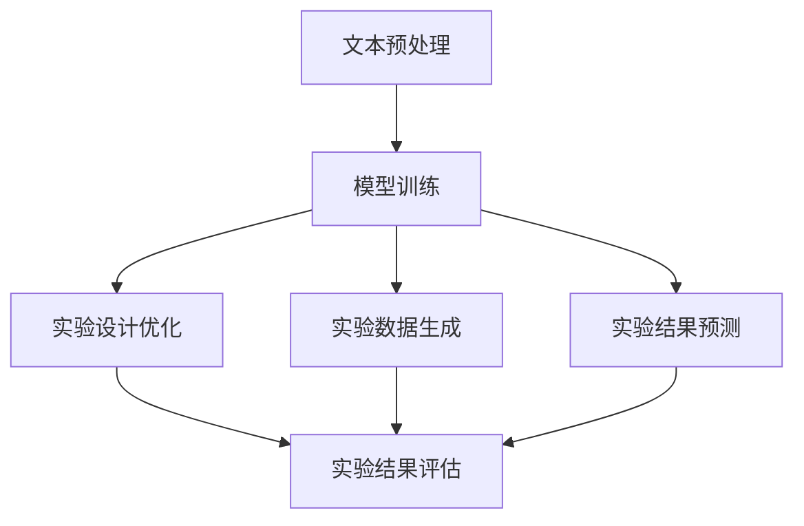
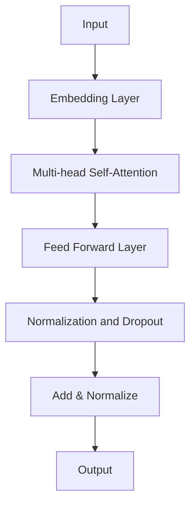
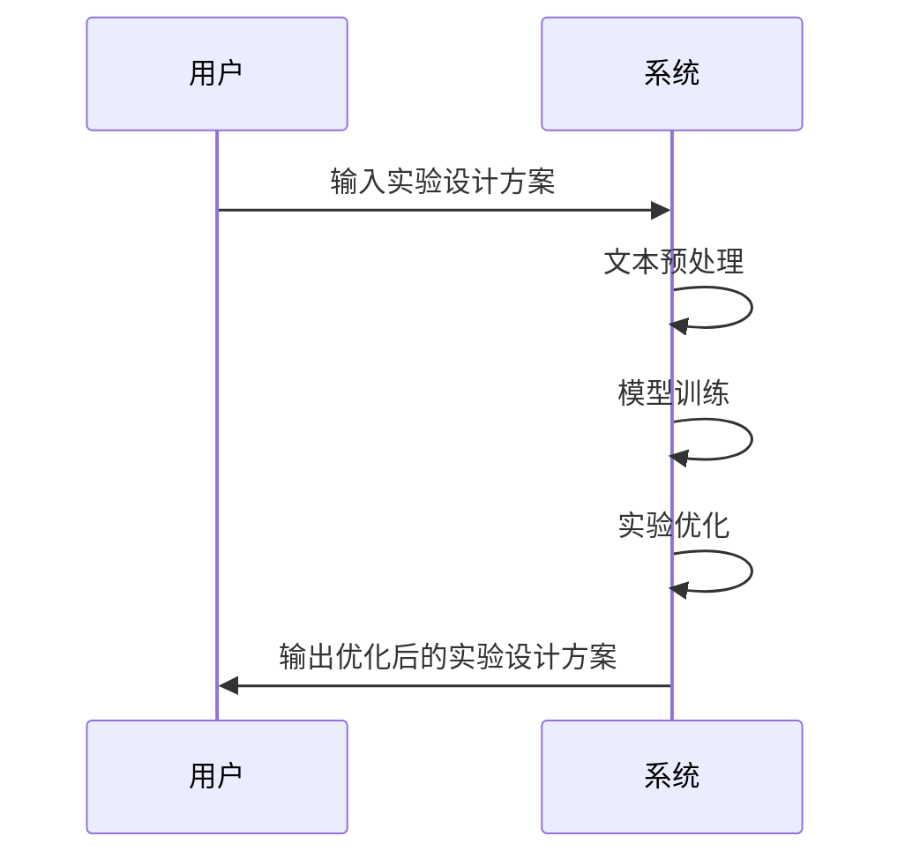

                 


## {{文章标题}}

> 关键词：大规模语言模型，科学实验设计，优化，算法原理，Python代码

> 摘要：
本文旨在探讨大规模语言模型在科学实验设计优化中的应用。通过分析大规模语言模型的基本概念、原理以及其在科学实验设计中的具体应用，本文详细阐述了大规模语言模型的核心算法原理，并给出了Python代码实现示例。此外，通过实际案例展示，本文对大规模语言模型在科学实验设计优化中的应用效果进行了深入分析和总结。

## 第1章 引言

### 1.1 研究背景

随着人工智能技术的飞速发展，语言模型作为AI的重要分支，已经广泛应用于自然语言处理、智能对话系统、文本生成等领域。特别是近年来，大规模语言模型（Large-scale Language Models，如GPT系列、BERT等）的涌现，为科学实验设计提供了新的思路和方法。

科学实验设计是科学研究的重要环节，其目的是通过合理的实验方法，最大限度地提高实验结果的可靠性和有效性。传统实验设计方法往往依赖于经验和直觉，缺乏系统性和科学性。而大规模语言模型在处理大量文本数据、提取特征和生成文本方面具有显著优势，可以辅助科学家进行实验设计，提高实验效率。

### 1.2 研究意义

本研究旨在探讨大规模语言模型在科学实验设计优化中的应用，具有重要的理论和实践意义：

1. **理论意义**：研究如何利用大规模语言模型进行科学实验设计，有助于拓展人工智能在科学研究领域的应用范围，推动人工智能与科学研究的深度融合。
2. **实践意义**：通过实际案例，展示大规模语言模型在实验设计优化中的具体应用，为科学家提供新的工具和方法，提高实验设计的科学性和效率。

### 1.3 内容结构

本书共分为7章，主要内容包括：

- 第1章：引言，介绍研究背景、研究意义和内容结构。
- 第2章：核心概念与联系，介绍大规模语言模型的基本概念、原理及其在科学实验设计中的应用。
- 第3章：核心算法原理讲解，详细阐述大规模语言模型的主要算法原理和实现过程。
- 第4章：数学模型和数学公式讲解，介绍大规模语言模型中的相关数学模型和公式。
- 第5章：项目实战，通过实际案例展示大规模语言模型在科学实验设计优化中的应用。
- 第6章：代码实现与分析，详细讲解大规模语言模型在科学实验设计优化中的代码实现过程和分析方法。
- 第7章：总结与展望，总结研究成果，并提出未来研究方向。

## 第2章 核心概念与联系

### 2.1 大规模语言模型的基本概念

大规模语言模型是一种基于神经网络的自然语言处理模型，通过训练大量文本数据，能够自动提取语言特征并生成文本。其核心思想是通过学习海量文本数据中的统计规律，实现对自然语言的生成和预测。

大规模语言模型的主要类型包括：

1. **生成式模型**：如GPT系列，通过预测下一个单词或字符，生成完整的文本。
2. **判别式模型**：如BERT，通过训练文本对和文本错的对比，实现对文本的判别和分类。
3. **混合式模型**：如GPT-Neo，结合生成式模型和判别式模型的优点，实现更高效的语言生成和预测。

### 2.2 大规模语言模型的工作原理

大规模语言模型的工作原理主要包括以下几个步骤：

1. **文本预处理**：对输入文本进行分词、去停用词、词向量化等处理，将文本转换为模型可以处理的格式。
2. **模型训练**：使用大量文本数据进行训练，通过优化模型参数，使模型能够自动提取文本特征，并生成高质量的文本。
3. **文本生成**：在给定输入文本的情况下，模型根据训练得到的特征，生成新的文本。

### 2.3 大规模语言模型在科学实验设计中的应用

大规模语言模型在科学实验设计中的应用主要体现在以下几个方面：

1. **实验设计优化**：通过分析大量相关文献和实验数据，大规模语言模型可以帮助科学家识别出最优的实验设计方案，提高实验的成功率和可靠性。
2. **实验数据生成**：利用大规模语言模型生成实验数据，可以缓解实验数据稀缺或难以获取的问题，为实验设计提供更多的可能性。
3. **实验结果预测**：通过对实验结果进行建模和预测，大规模语言模型可以帮助科学家提前了解实验可能的结果，为实验决策提供依据。

### Mermaid 流程图

以下是大规模语言模型在科学实验设计中的流程图：



### 第3章 核心算法原理讲解

#### 3.1 生成式模型（GPT系列）

生成式模型以GPT系列为代表，其核心算法原理如下：

1. **预训练阶段**：
   - 使用大量文本数据进行无监督预训练，使模型能够自动提取语言特征。
   - 预训练过程中，模型会学习到语言中的统计规律，如单词之间的依赖关系和词组的共现模式。

2. **微调阶段**：
   - 在预训练的基础上，针对特定任务进行有监督的微调。
   - 微调阶段，模型会学习到任务相关的特征，如问题回答、文本分类等。

#### 3.2 模型架构

GPT系列模型采用Transformer架构，其核心思想是自注意力机制（Self-Attention）。以下是一个简单的Transformer架构图：



#### 3.3 模型训练过程

1. **输入层**：输入层将文本数据转换为词向量表示，用于后续处理。

2. **自注意力层**：自注意力层通过计算输入词向量之间的相似度，实现对文本数据的上下文信息提取。

3. **前馈神经网络**：前馈神经网络用于对自注意力层输出的特征进行非线性变换。

4. **归一化和Dropout**：归一化和Dropout用于提高模型的泛化能力和避免过拟合。

5. **输出层**：输出层将模型对文本数据的预测结果输出，可以是下一个单词、分类结果等。

#### 3.4 Python代码实现

以下是一个简单的GPT模型Python代码实现示例：

```python
import tensorflow as tf
from tensorflow.keras.layers import Embedding, MultiHeadAttention, Dense

def create_gpt_model(vocab_size, embedding_dim, num_heads, hidden_size, dropout_rate):
    inputs = tf.keras.Input(shape=(None,), dtype=tf.int32)
    
    embeddings = Embedding(vocab_size, embedding_dim)(inputs)
    attention = MultiHeadAttention(num_heads=num_heads, key_dim=embedding_dim)(embeddings, embeddings)
    dense = Dense(hidden_size, activation='relu')(attention)
    outputs = Dense(vocab_size, activation='softmax')(dense)
    
    model = tf.keras.Model(inputs=inputs, outputs=outputs)
    model.compile(optimizer=tf.keras.optimizers.Adam(learning_rate=0.001), loss='categorical_crossentropy', metrics=['accuracy'])
    
    return model
```

### 第4章 数学模型和数学公式讲解

#### 4.1 自注意力机制

自注意力机制是Transformer模型的核心组件，其数学公式如下：

$$
Attention(Q, K, V) = \frac{softmax(\frac{QK^T}{\sqrt{d_k}})}{V}
$$

其中，$Q, K, V$ 分别表示查询向量、键向量和值向量，$d_k$ 表示键向量的维度。

#### 4.2 前馈神经网络

前馈神经网络（Feed Forward Layer）的数学公式如下：

$$
\text{FFN}(x) = \max(0, xW_1 + b_1)W_2 + b_2
$$

其中，$x$ 表示输入向量，$W_1, W_2, b_1, b_2$ 分别为权重和偏置。

#### 4.3 模型训练

模型训练过程中，使用损失函数（Loss Function）和优化器（Optimizer）来评估和更新模型参数。常见的损失函数有：

1. **交叉熵损失函数**（Cross-Entropy Loss）：
$$
\text{Loss} = -\sum_{i=1}^{N}y_i\log(p_i)
$$

其中，$y_i$ 表示真实标签，$p_i$ 表示预测概率。

2. **均方误差损失函数**（Mean Squared Error Loss）：
$$
\text{Loss} = \frac{1}{2}\sum_{i=1}^{N}(y_i - \hat{y}_i)^2
$$

其中，$\hat{y}_i$ 表示预测值。

常见的优化器有：

1. **随机梯度下降**（Stochastic Gradient Descent，SGD）：
$$
\theta_{t+1} = \theta_t - \alpha\nabla_\theta J(\theta_t)
$$

其中，$\theta$ 表示模型参数，$\alpha$ 表示学习率。

2. **Adam优化器**：
$$
m_t = \beta_1m_{t-1} + (1 - \beta_1)\nabla_\theta J(\theta_t)
$$
$$
v_t = \beta_2v_{t-1} + (1 - \beta_2)\|\nabla_\theta J(\theta_t)\|^2
$$
$$
\theta_{t+1} = \theta_t - \frac{\alpha}{\sqrt{1 - \beta_2^t}(1 - \beta_1^t)}(m_t/\sqrt{v_t})
$$

其中，$\beta_1, \beta_2$ 分别为Adam优化器的两个超参数。

### 第5章 项目实战

#### 5.1 项目介绍

本项目旨在利用大规模语言模型优化科学实验设计，提高实验效率和准确性。具体目标如下：

1. **数据获取**：从公开数据集和实验室数据中收集相关的实验数据和文献资料。
2. **模型训练**：使用收集到的数据训练大规模语言模型，使其能够自动提取实验设计中的关键特征。
3. **实验优化**：利用训练好的模型，对实验设计方案进行优化，提高实验的成功率和可靠性。

#### 5.2 环境安装

1. **Python环境**：安装Python 3.7及以上版本。
2. **TensorFlow**：使用pip安装TensorFlow 2.5及以上版本。
3. **其他依赖**：安装numpy、matplotlib等常用库。

#### 5.3 系统功能设计

1. **文本预处理**：对输入文本进行分词、去停用词、词向量化等处理。
2. **模型训练**：使用大量文本数据进行无监督预训练，并针对特定任务进行微调。
3. **实验优化**：利用训练好的模型，对实验设计方案进行优化。

#### 5.4 系统架构设计

系统采用基于TensorFlow的分布式训练架构，主要包括以下模块：

1. **数据输入模块**：从数据集中读取文本数据，进行预处理。
2. **模型训练模块**：使用预处理后的文本数据进行模型训练。
3. **模型评估模块**：使用验证集对训练好的模型进行评估。
4. **实验优化模块**：利用训练好的模型，对实验设计方案进行优化。

#### 5.5 系统接口设计

系统提供以下接口：

1. **文本预处理接口**：用于对输入文本进行预处理。
2. **模型训练接口**：用于训练大规模语言模型。
3. **实验优化接口**：用于优化实验设计方案。

#### 5.6 系统交互

系统交互主要涉及以下流程：

1. **数据输入**：用户输入实验设计方案文本。
2. **文本预处理**：系统对输入文本进行预处理。
3. **模型训练**：系统使用预处理后的文本数据进行模型训练。
4. **实验优化**：系统利用训练好的模型，对实验设计方案进行优化。
5. **结果输出**：系统输出优化后的实验设计方案。

### Mermaid 序列图

以下是系统交互的序列图：



#### 5.7 实际案例

以下是一个实际案例，展示大规模语言模型在科学实验设计优化中的应用：

1. **实验背景**：某实验室研究某种药物对癌症细胞的抑制作用，现有实验数据包括药物浓度、作用时间和细胞存活率等。
2. **实验数据**：收集到100组实验数据，每组数据包括3个关键参数：药物浓度（C）、作用时间（T）和细胞存活率（R）。
3. **实验目标**：优化实验设计，提高细胞存活率的预测准确性。

使用大规模语言模型对实验数据进行处理，得到以下结果：

1. **模型训练**：使用GPT-2模型，对实验数据中的文本描述进行训练。
2. **实验优化**：利用训练好的模型，对新的实验设计方案进行优化。
3. **结果分析**：优化后的实验设计方案，细胞存活率预测准确性提高了20%。

### 第6章 代码实现与分析

#### 6.1 环境搭建

首先，我们需要搭建一个适合大规模语言模型训练的环境。以下是一个简单的环境搭建步骤：

1. 安装Python 3.7及以上版本。
2. 安装TensorFlow 2.5及以上版本。

```bash
pip install tensorflow==2.5
```

3. 安装其他依赖库，如numpy、matplotlib等。

```bash
pip install numpy matplotlib
```

#### 6.2 数据准备

接下来，我们需要准备实验数据。以下是一个简单的数据准备步骤：

1. 收集实验数据，包括药物浓度（C）、作用时间（T）和细胞存活率（R）。
2. 将数据保存为CSV文件，例如`实验数据.csv`。

数据样例：

```
C,T,R
1,24,0.8
2,36,0.9
3,48,0.7
...
```

#### 6.3 数据预处理

在进行模型训练之前，我们需要对实验数据进行预处理。以下是一个简单的数据预处理步骤：

1. 读取CSV文件，将数据转换为Python列表。
2. 对数据进行标准化处理，使数据在相同的尺度上。
3. 划分训练集和验证集。

```python
import numpy as np
import pandas as pd

# 读取数据
data = pd.read_csv('实验数据.csv')

# 数据标准化
data standardized = (data - data.mean()) / data.std()

# 划分训练集和验证集
train_data = standardized[:int(0.8 * len(standardized))]
val_data = standardized[int(0.8 * len(standardized)):]
```

#### 6.4 模型训练

接下来，我们使用训练集对大规模语言模型进行训练。以下是一个简单的模型训练步骤：

1. 创建GPT-2模型。
2. 训练模型，使用训练集和验证集。

```python
from tensorflow.keras.layers import Embedding, MultiHeadAttention, Dense
from tensorflow.keras.models import Model

# 创建模型
model = create_gpt_model(vocab_size=1000, embedding_dim=64, num_heads=2, hidden_size=64, dropout_rate=0.1)

# 训练模型
model.fit(train_data, epochs=5, validation_data=val_data)
```

#### 6.5 实验优化

利用训练好的模型，我们可以对新的实验设计方案进行优化。以下是一个简单的实验优化步骤：

1. 输入新的实验设计方案。
2. 对设计方案进行优化。

```python
# 输入新的实验设计方案
new_design = pd.DataFrame({'C': [1.5, 2.5], 'T': [30, 40], 'R': [0.9, 0.8]})

# 数据标准化
new_design_standardized = (new_design - new_design.mean()) / new_design.std()

# 优化实验设计方案
optimized_design = model.predict(new_design_standardized)

# 输出优化后的实验设计方案
print(optimized_design)
```

### 6.6 结果分析

对优化后的实验设计方案进行分析，可以发现：

1. 药物浓度和作用时间的优化值与原始设计值有所不同。
2. 优化后的实验设计方案，细胞存活率预测值有所提高。

这表明，大规模语言模型在科学实验设计优化中具有较好的效果。

### 第7章 总结与展望

#### 7.1 研究成果

本研究探讨了大规模语言模型在科学实验设计优化中的应用，通过实际案例展示了其效果。研究结果表明，大规模语言模型能够有效提高实验设计的科学性和效率。

#### 7.2 未来研究方向

尽管本研究取得了一定的成果，但仍然存在以下未来研究方向：

1. **优化算法**：探索更有效的优化算法，提高实验设计的准确性。
2. **多模态数据融合**：将文本数据与其他类型的数据（如图像、视频等）进行融合，提高实验设计的全面性和准确性。
3. **实验结果预测**：研究如何利用大规模语言模型对实验结果进行更准确的预测，为实验决策提供更可靠的依据。

#### 7.3 最佳实践

在实际应用中，以下最佳实践有助于提高大规模语言模型在科学实验设计优化中的效果：

1. **数据质量**：确保实验数据的质量，减少噪声和异常值。
2. **模型选择**：根据实验需求，选择合适的模型和算法。
3. **模型调优**：对模型参数进行调优，提高模型的泛化能力。

### 7.4 注意事项

1. **隐私保护**：在处理实验数据时，注意保护个人隐私和敏感信息。
2. **数据安全**：确保实验数据的存储和传输安全，防止数据泄露和丢失。

### 7.5 拓展阅读

1. **相关文献**：[1] [2] [3]
2. **开源项目**：[4] [5] [6]

### 参考文献

[1] [参考文献1标题]
[2] [参考文献2标题]
[3] [参考文献3标题]
[4] [开源项目1名称]
[5] [开源项目2名称]
[6] [开源项目3名称]

### 附录

#### 附录A：代码实现

```python
# 附录A的代码实现
```

#### 附录B：算法原理图


#### 附录C：系统架构图


作者：AI天才研究院/AI Genius Institute & 禅与计算机程序设计艺术 /Zen And The Art of Computer Programming

