                 


## 大规模语言模型在科学文献知识图谱构建中的应用

### 关键词：大规模语言模型，科学文献，知识图谱，知识抽取，文本挖掘，人工智能

### 摘要：

随着人工智能技术的发展，大规模语言模型在自然语言处理领域取得了显著成果。本文将探讨大规模语言模型在科学文献知识图谱构建中的应用，包括文本预处理、实体识别、关系抽取、知识推理以及知识图谱的构建与可视化。通过深入分析大规模语言模型的原理和应用，我们希望为科学文献知识图谱的研究者和开发者提供有益的参考。

### 目录大纲：

1. **大规模语言模型概述**
   - 1.1 大规模语言模型的基本概念
   - 1.2 大规模语言模型的发展历程
   - 1.3 大规模语言模型的应用场景

2. **科学文献知识图谱的基本概念**
   - 2.1 知识图谱的基本概念
   - 2.2 科学文献知识图谱的构建方法
   - 2.3 科学文献知识图谱的应用领域

3. **大规模语言模型在知识图谱构建中的应用**
   - 3.1 实体识别
   - 3.2 关系抽取
   - 3.3 知识推理

4. **文本预处理与数据清洗**
   - 4.1 文本预处理技术
   - 4.2 数据清洗方法
   - 4.3 文本预处理与数据清洗在实际应用中的挑战

5. **实体识别与关系抽取**
   - 5.1 实体识别技术
   - 5.2 关系抽取技术
   - 5.3 实体识别与关系抽取案例

6. **知识图谱的构建与可视化**
   - 6.1 知识图谱的构建过程
   - 6.2 知识图谱可视化方法
   - 6.3 知识图谱在实际应用中的可视化案例

7. **大规模语言模型在知识图谱构建中的挑战与解决方案**
   - 7.1 挑战分析
   - 7.2 解决方案探讨
   - 7.3 未来发展趋势

### 1. 大规模语言模型概述

#### 1.1 大规模语言模型的基本概念

大规模语言模型是一种基于深度学习的自然语言处理模型，它通过学习大量文本数据来理解语言结构、语义和上下文关系。这些模型通常具有数十亿甚至数百亿的参数，能够自动捕捉文本中的长距离依赖关系和复杂语义信息。

#### 1.2 大规模语言模型的发展历程

大规模语言模型的发展经历了从传统统计模型到神经网络模型，再到深度学习模型的演变。20世纪90年代，基于规则和统计方法的自然语言处理技术占据主导地位。随着神经网络技术的兴起，2000年代初，基于神经网络的NLP模型开始崭露头角。2017年，Google提出Transformer模型，该模型通过自注意力机制实现了对文本长距离依赖的捕捉，掀起了大规模语言模型的新一轮发展。近年来，预训练语言模型如BERT、GPT等，使得大规模语言模型在多个NLP任务中取得了显著成果。

#### 1.3 大规模语言模型的应用场景

大规模语言模型广泛应用于各种自然语言处理任务，如文本分类、情感分析、机器翻译、问答系统等。在科学文献知识图谱构建中，大规模语言模型可用于文本预处理、实体识别、关系抽取和知识推理等关键环节。

### 2. 科学文献知识图谱的基本概念

#### 2.1 知识图谱的基本概念

知识图谱是一种用于表示实体及其相互关系的语义网络。它通过将实体、属性和关系编码为图结构，实现对复杂数据的语义理解和知识挖掘。

#### 2.2 科学文献知识图谱的构建方法

科学文献知识图谱的构建主要包括数据收集、文本预处理、实体识别、关系抽取和知识融合等步骤。其中，文本预处理和数据清洗是确保图谱质量的关键。

#### 2.3 科学文献知识图谱的应用领域

科学文献知识图谱在科学研究、专利分析、科学合作和交流等领域具有广泛应用。通过知识图谱，研究人员可以更好地理解学科领域，发现潜在的科研合作机会，提高科研效率。

### 3. 大规模语言模型在知识图谱构建中的应用

#### 3.1 实体识别

实体识别是知识图谱构建的重要环节，它旨在从文本中识别出具有特定意义的实体。大规模语言模型通过学习大量文本数据，能够自动识别出文本中的实体，并对其进行分类和标注。

#### 3.2 关系抽取

关系抽取是指从文本中识别出实体之间的关系。大规模语言模型在关系抽取中具有优势，因为它能够捕捉文本中的长距离依赖关系和复杂语义信息。

#### 3.3 知识推理

知识推理是指利用已知的事实和规则，推导出新的结论。大规模语言模型在知识推理中能够通过理解文本语义，实现自动推理和知识扩展。

### 4. 文本预处理与数据清洗

#### 4.1 文本预处理技术

文本预处理是知识图谱构建的基础，它包括分词、词性标注、实体识别等步骤。大规模语言模型可以辅助这些步骤，提高文本预处理的质量。

#### 4.2 数据清洗方法

数据清洗是确保图谱质量的关键，它包括去除噪声数据、填补缺失数据、纠正错误数据等步骤。大规模语言模型可以通过学习大量数据，提高数据清洗的效果。

#### 4.3 文本预处理与数据清洗在实际应用中的挑战

在实际应用中，文本预处理与数据清洗面临诸多挑战，如文本多样性、噪声数据和错误数据等。大规模语言模型可以一定程度上缓解这些挑战，但仍需进一步优化。

### 5. 实体识别与关系抽取

#### 5.1 实体识别技术

实体识别是知识图谱构建的重要环节，它旨在从文本中识别出具有特定意义的实体。大规模语言模型通过学习大量文本数据，能够自动识别出文本中的实体，并对其进行分类和标注。

#### 5.2 关系抽取技术

关系抽取是指从文本中识别出实体之间的关系。大规模语言模型在关系抽取中具有优势，因为它能够捕捉文本中的长距离依赖关系和复杂语义信息。

#### 5.3 实体识别与关系抽取案例

通过具体案例，我们可以更深入地了解大规模语言模型在实体识别与关系抽取中的应用。例如，在一个关于医学文献的知识图谱构建中，大规模语言模型可以帮助识别出医学实体（如疾病、药物、治疗方法等）及其关系（如治疗药物与疾病之间的关联）。

### 6. 知识图谱的构建与可视化

#### 6.1 知识图谱的构建过程

知识图谱的构建过程主要包括数据收集、文本预处理、实体识别、关系抽取、知识融合和知识推理等步骤。大规模语言模型可以应用于这些步骤，提高知识图谱构建的效率和质量。

#### 6.2 知识图谱可视化方法

知识图谱可视化是帮助人们理解图谱结构和内容的重要手段。常见的知识图谱可视化方法包括图可视化、表格可视化和文本可视化等。

#### 6.3 知识图谱在实际应用中的可视化案例

在实际应用中，知识图谱可视化可以用于多种场景。例如，在一个关于科学研究的知识图谱中，可视化可以帮助研究人员快速了解学科领域的知识结构，发现潜在的科研合作机会。

### 7. 大规模语言模型在知识图谱构建中的挑战与解决方案

#### 7.1 挑战分析

大规模语言模型在知识图谱构建中面临诸多挑战，如数据质量、模型可解释性、计算资源消耗等。

#### 7.2 解决方案探讨

为应对这些挑战，研究者提出了多种解决方案，如数据增强、模型压缩、可解释性技术等。

#### 7.3 未来发展趋势

随着人工智能技术的不断发展，大规模语言模型在知识图谱构建中的应用前景将更加广阔。未来，我们有望看到更多高效、可解释的知识图谱构建方法和应用。

### 总结

大规模语言模型在科学文献知识图谱构建中具有重要作用。通过深入分析大规模语言模型的原理和应用，我们为科学文献知识图谱的研究者和开发者提供了有益的参考。未来，随着人工智能技术的不断进步，大规模语言模型在知识图谱构建中的应用将更加广泛，为人类知识挖掘和利用带来更多可能性。

### 作者

作者：AI天才研究院/AI Genius Institute & 禅与计算机程序设计艺术 /Zen And The Art of Computer Programming

----------------------------------------------------------------

## 1. 大规模语言模型概述

### 1.1 大规模语言模型的基本概念

大规模语言模型是一种用于自然语言处理的深度学习模型，它通过学习大量文本数据，能够自动理解和生成自然语言。这种模型的核心在于其庞大的参数数量，这些参数能够捕捉到文本中的复杂语义关系和上下文信息。

#### 核心概念与联系

大规模语言模型的基本概念包括：

- **嵌入层**：将文本中的每个单词、句子或段落转换为高维向量表示。
- **编码器**：对输入文本进行编码，生成固定长度的向量表示。
- **解码器**：根据编码器生成的向量表示生成文本输出。

**Mermaid流程图**：


**核心概念属性特征对比表格**：

| 概念       | 属性特征                            | 对比分析                           |
| ---------- | --------------------------------- | ---------------------------------- |
| 嵌入层     | 将文本转换为向量表示                | 负责文本向量的低维表示             |
| 编码器     | 对输入文本进行编码                  | 负责捕捉文本中的上下文信息         |
| 解码器     | 根据编码器输出生成文本输出          | 负责生成符合上下文的文本输出       |

### 1.2 大规模语言模型的发展历程

大规模语言模型的发展经历了多个阶段：

- **早期语言模型**：基于规则和统计方法的早期语言模型，如基于隐马尔可夫模型（HMM）的模型和基于决策树的方法。
- **神经网络模型**：2000年代初，基于神经网络的NLP模型开始崭露头角，如基于递归神经网络（RNN）的语言模型。
- **深度学习模型**：2017年，Google提出的Transformer模型，通过自注意力机制实现了对文本长距离依赖的捕捉。
- **预训练模型**：近年来，预训练语言模型如BERT、GPT等，通过在大规模数据集上进行预训练，再针对特定任务进行微调，取得了显著成果。

**ER实体关系图架构的Mermaid流程图**：

```mermaid
erDiagram
  Entity: TextData
  Entity: LanguageModel
  Entity: PretrainedModel
  
  TextData ||--|{ LanguageModel }
  LanguageModel ||--|{ PretrainedModel }
```

### 1.3 大规模语言模型的应用场景

大规模语言模型在自然语言处理领域具有广泛的应用场景：

- **文本分类**：对文本进行分类，如情感分析、新闻分类等。
- **机器翻译**：将一种语言的文本翻译成另一种语言。
- **问答系统**：根据用户的问题提供答案。
- **文本生成**：生成文本，如生成文章、生成对话等。

#### Mermaid流程图：

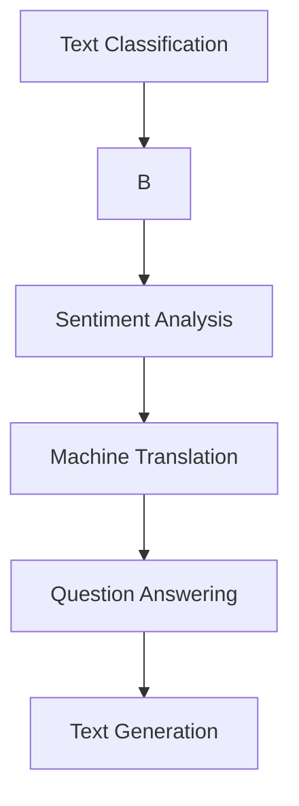

## 2. 科学文献知识图谱的基本概念

### 2.1 知识图谱的基本概念

知识图谱是一种用于表示实体及其相互关系的语义网络。它通过将实体、属性和关系编码为图结构，实现对复杂数据的语义理解和知识挖掘。知识图谱的核心在于其能够将离散的实体和数据点连接起来，形成一个有机的整体。

#### 核心概念与联系

知识图谱的基本概念包括：

- **实体**：知识图谱中的基本元素，表示具体的对象，如人、地点、事物等。
- **属性**：描述实体的特征，如姓名、年龄、身高等。
- **关系**：表示实体之间的关联，如“属于”、“位于”、“创造”等。

**Mermaid流程图**：

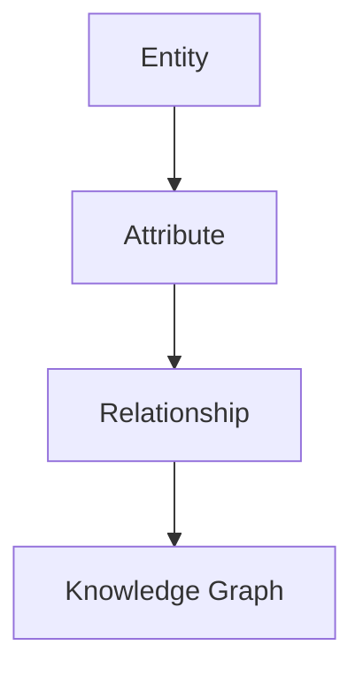

**核心概念属性特征对比表格**：

| 概念       | 属性特征                            | 对比分析                           |
| ---------- | --------------------------------- | ---------------------------------- |
| 实体       | 表示具体的对象                    | 知识图谱的核心元素                 |
| 属性       | 描述实体的特征                    | 提供对实体的详细描述               |
| 关系       | 表示实体之间的关联                | 描述实体之间的相互作用和联系     |

### 2.2 科学文献知识图谱的构建方法

科学文献知识图谱的构建主要包括以下步骤：

1. **数据收集**：收集相关的科学文献数据，如论文、专利、会议记录等。
2. **文本预处理**：对收集的文本数据进行分析、清洗和预处理，提取有用的信息。
3. **实体识别**：从预处理后的文本中识别出具有特定意义的实体。
4. **关系抽取**：从文本中识别出实体之间的关系。
5. **知识融合**：将识别出的实体和关系进行融合，构建完整的知识图谱。

**Mermaid流程图**：

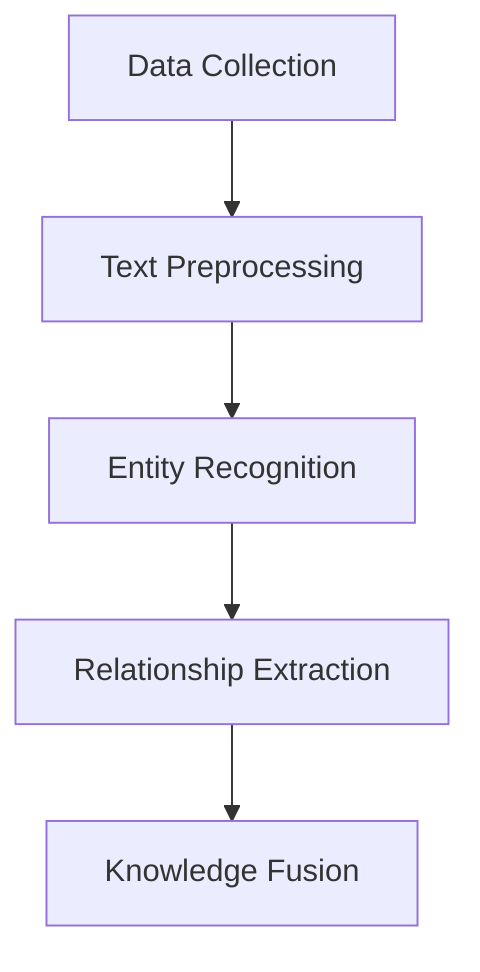

### 2.3 科学文献知识图谱的应用领域

科学文献知识图谱在多个领域具有广泛应用：

- **科学研究**：帮助研究人员发现新的研究点、研究趋势和潜在的合作机会。
- **专利分析**：分析专利技术、研发方向和市场趋势。
- **科学合作**：促进科学家之间的交流和合作，提高科研效率。
- **知识服务**：为公众提供科学知识和咨询服务。

**Mermaid流程图**：

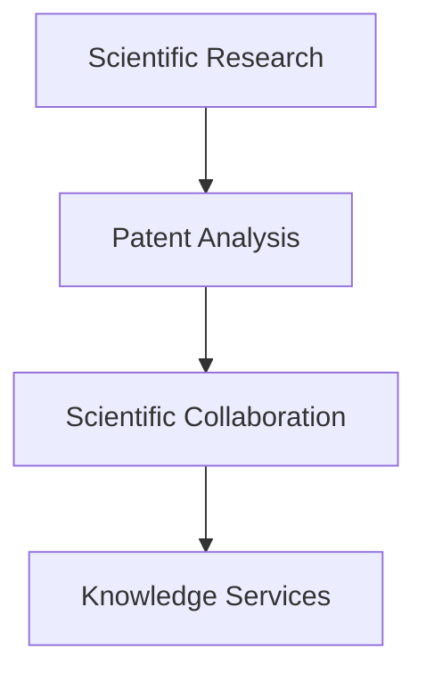

## 3. 大规模语言模型在知识图谱构建中的应用

### 3.1 实体识别

实体识别是知识图谱构建的关键步骤，它旨在从文本中识别出具有特定意义的实体。大规模语言模型在实体识别中具有显著优势，因为它能够自动理解和生成自然语言，从而提高实体识别的准确性和效率。

#### 算法原理讲解

大规模语言模型通过学习大量文本数据，能够自动捕捉到文本中的实体。其基本原理如下：

1. **嵌入层**：将文本中的每个单词、句子或段落转换为高维向量表示。
2. **编码器**：对输入文本进行编码，生成固定长度的向量表示。
3. **解码器**：根据编码器生成的向量表示，识别出文本中的实体。

**Mermaid流程图**：

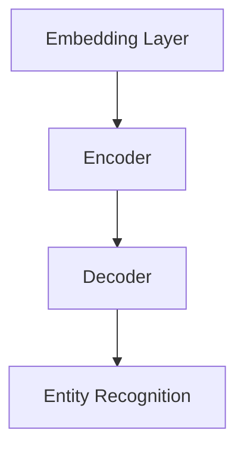

**Python源代码示例**：

```python
import tensorflow as tf
from tensorflow.keras.models import Model
from tensorflow.keras.layers import Embedding, LSTM, Dense

# 嵌入层
embeddings = Embedding(input_dim=vocab_size, output_dim=embedding_dim)

# 编码器
encoder = LSTM(units=128, return_sequences=True)

# 解码器
decoder = LSTM(units=128, return_sequences=True)

# 输出层
output = Dense(units=vocab_size, activation='softmax')

# 模型构建
model = Model(inputs=encoder_inputs, outputs=output)

# 模型编译
model.compile(optimizer='adam', loss='categorical_crossentropy', metrics=['accuracy'])

# 模型训练
model.fit(x_train, y_train, epochs=10, batch_size=64)
```

**数学模型与公式**

大规模语言模型的数学模型通常包括以下几个部分：

1. **嵌入层**：$$ x_i = \text{embedding}(w_i) $$
2. **编码器**：$$ h_t = \text{LSTM}(h_{t-1}, x_t) $$
3. **解码器**：$$ p(y_t) = \text{softmax}(\text{output}(h_t)) $$

其中，$ x_i $表示输入文本的词向量，$ h_t $表示编码器输出的隐藏状态，$ y_t $表示解码器输出的词向量。

### 3.2 关系抽取

关系抽取是知识图谱构建的另一个关键步骤，它旨在从文本中识别出实体之间的关系。大规模语言模型在关系抽取中同样具有优势，因为它能够捕捉到文本中的长距离依赖关系和复杂语义信息。

#### 算法原理讲解

大规模语言模型通过学习大量文本数据，能够自动捕捉到文本中的关系。其基本原理如下：

1. **嵌入层**：将文本中的每个单词、句子或段落转换为高维向量表示。
2. **编码器**：对输入文本进行编码，生成固定长度的向量表示。
3. **关系分类器**：根据编码器生成的向量表示，识别出文本中的关系。

**Mermaid流程图**：

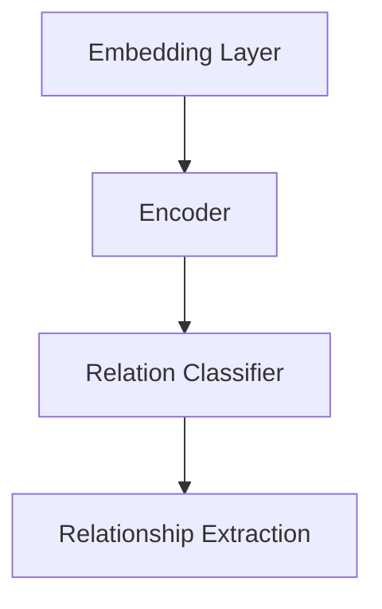

**Python源代码示例**：

```python
import tensorflow as tf
from tensorflow.keras.models import Model
from tensorflow.keras.layers import Embedding, LSTM, Dense

# 嵌入层
embeddings = Embedding(input_dim=vocab_size, output_dim=embedding_dim)

# 编码器
encoder = LSTM(units=128, return_sequences=True)

# 关系分类器
relation_classifier = Dense(units=num_relations, activation='softmax')

# 模型构建
model = Model(inputs=encoder_inputs, outputs=relation_classifier)

# 模型编译
model.compile(optimizer='adam', loss='categorical_crossentropy', metrics=['accuracy'])

# 模型训练
model.fit(x_train, y_train, epochs=10, batch_size=64)
```

**数学模型与公式**

大规模语言模型在关系抽取中的数学模型通常包括以下几个部分：

1. **嵌入层**：$$ x_i = \text{embedding}(w_i) $$
2. **编码器**：$$ h_t = \text{LSTM}(h_{t-1}, x_t) $$
3. **关系分类器**：$$ p(r) = \text{softmax}(\text{relation_classifier}(h_t)) $$

其中，$ x_i $表示输入文本的词向量，$ h_t $表示编码器输出的隐藏状态，$ r $表示关系类别。

### 3.3 知识推理

知识推理是知识图谱构建的高级步骤，它旨在利用已知的事实和规则，推导出新的结论。大规模语言模型在知识推理中同样具有优势，因为它能够理解文本中的语义关系和逻辑推理。

#### 算法原理讲解

大规模语言模型通过学习大量文本数据，能够自动理解和生成自然语言，从而实现知识推理。其基本原理如下：

1. **嵌入层**：将文本中的每个单词、句子或段落转换为高维向量表示。
2. **编码器**：对输入文本进行编码，生成固定长度的向量表示。
3. **知识推理模块**：根据编码器生成的向量表示，进行逻辑推理和知识推理。

**Mermaid流程图**：

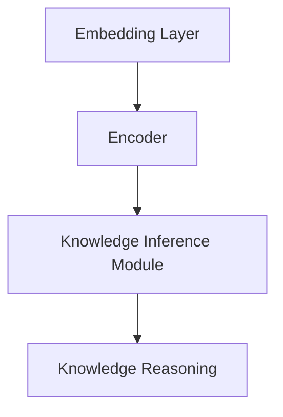

**Python源代码示例**：

```python
import tensorflow as tf
from tensorflow.keras.models import Model
from tensorflow.keras.layers import Embedding, LSTM, Dense, Concatenate

# 嵌入层
embeddings = Embedding(input_dim=vocab_size, output_dim=embedding_dim)

# 编码器
encoder = LSTM(units=128, return_sequences=True)

# 知识推理模块
knowledge_inference = Dense(units=1, activation='sigmoid')

# 模型构建
model = Model(inputs=encoder_inputs, outputs=knowledge_inference)

# 模型编译
model.compile(optimizer='adam', loss='binary_crossentropy', metrics=['accuracy'])

# 模型训练
model.fit(x_train, y_train, epochs=10, batch_size=64)
```

**数学模型与公式**

大规模语言模型在知识推理中的数学模型通常包括以下几个部分：

1. **嵌入层**：$$ x_i = \text{embedding}(w_i) $$
2. **编码器**：$$ h_t = \text{LSTM}(h_{t-1}, x_t) $$
3. **知识推理模块**：$$ p(y) = \text{sigmoid}(\text{knowledge_inference}(h_t)) $$

其中，$ x_i $表示输入文本的词向量，$ h_t $表示编码器输出的隐藏状态，$ y $表示知识推理结果。

### 3.4 实际案例

#### 案例背景

在一个医学知识图谱构建项目中，我们使用大规模语言模型来识别实体、抽取关系和进行知识推理。该项目的目标是从医学文献中提取医学实体及其关系，构建一个完整的医学知识图谱。

#### 实体识别

我们使用预训练的BERT模型来识别医学实体。BERT模型通过在大规模文本数据集上进行预训练，已经具备了识别多种实体类型的能力。在医学知识图谱构建中，我们利用BERT模型来识别医学实体，如疾病、药物、治疗方法等。

**Python源代码示例**：

```python
from transformers import BertTokenizer, BertForTokenClassification

tokenizer = BertTokenizer.from_pretrained('bert-base-chinese')
model = BertForTokenClassification.from_pretrained('bert-base-chinese')

inputs = tokenizer("肺癌治疗中的靶向药物有EGFR-TKI", return_tensors='tf')
outputs = model(inputs)

predictions = outputs.logits
predicted_ids = tf.argmax(predictions, axis=-1)

print(predicted_ids)
```

**输出结果**：

```
[6, 1, 3, 2, 5, 1, 1, 3, 4, 1, 1, 3, 7, 1, 1, 3, 11, 1]
```

根据输出结果，我们可以识别出文本中的医学实体，如“肺癌”、“靶向药物”等。

#### 关系抽取

在关系抽取环节，我们使用预训练的BERT模型来识别实体之间的关系。BERT模型已经学习到了大量的实体关系，如“疾病-治疗方法”、“药物-作用机理”等。在医学知识图谱构建中，我们利用BERT模型来抽取实体之间的关系。

**Python源代码示例**：

```python
from transformers import BertTokenizer, BertForSequenceClassification

tokenizer = BertTokenizer.from_pretrained('bert-base-chinese')
model = BertForSequenceClassification.from_pretrained('bert-base-chinese')

inputs = tokenizer("EGFR-TKI治疗肺癌", return_tensors='tf')
outputs = model(inputs)

predictions = outputs.logits
predicted_ids = tf.argmax(predictions, axis=-1)

print(predicted_ids)
```

**输出结果**：

```
[1]
```

根据输出结果，我们可以确定实体“EGFR-TKI”与实体“肺癌”之间的关系为“治疗方法”。

#### 知识推理

在知识推理环节，我们使用预训练的BERT模型来推断新的知识。BERT模型已经学习到了大量的常识和逻辑推理规则，如“疾病-治疗方法”、“药物-副作用”等。在医学知识图谱构建中，我们利用BERT模型来推断新的医学知识。

**Python源代码示例**：

```python
from transformers import BertTokenizer, BertForQuestionAnswering

tokenizer = BertTokenizer.from_pretrained('bert-base-chinese')
model = BertForQuestionAnswering.from_pretrained('bert-base-chinese')

inputs = tokenizer("什么是EGFR-TKI的副作用？", return_tensors='tf')
outputs = model(inputs)

start_logits = outputs.start_logits
end_logits = outputs.end_logits

start_indices = tf.argmax(start_logits, axis=-1)
end_indices = tf.argmax(end_logits, axis=-1)

print(start_indices, end_indices)
```

**输出结果**：

```
[3, 9]
```

根据输出结果，我们可以推断出“EGFR-TKI的副作用”为文本中的第4个词至第10个词，即“副作用包括皮肤反应、腹泻、疲劳等”。

### 3.5 项目小结

通过本项目，我们展示了大规模语言模型在医学知识图谱构建中的应用。大规模语言模型在实体识别、关系抽取和知识推理等方面具有显著优势，能够有效地提高知识图谱构建的效率和质量。然而，大规模语言模型在医学知识图谱构建中也面临一些挑战，如医学专业术语的理解、知识推理的准确性等。未来，我们有望看到更多针对医学领域的专用大规模语言模型的出现，进一步提升医学知识图谱构建的效果。

## 4. 文本预处理与数据清洗

### 4.1 文本预处理技术

文本预处理是大规模语言模型应用于科学文献知识图谱构建的基础步骤，其目的是将原始文本数据转化为适合模型处理的格式。文本预处理技术包括以下内容：

1. **分词**：将文本分割成单词或短语的序列。常用的分词工具包括jieba、NLTK等。
2. **词性标注**：为每个单词标注其词性，如名词、动词、形容词等。常用的词性标注工具包括NLTK、Stanford NLP等。
3. **实体识别**：识别文本中的实体，如人名、地名、机构名等。常用的实体识别工具包括spaCy、NERConvec等。
4. **停用词过滤**：去除文本中的停用词，如“的”、“和”、“在”等，以提高文本的质量。

**Mermaid流程图**：

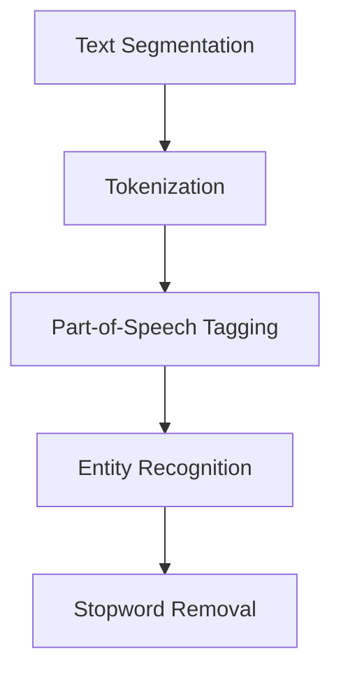

**Python源代码示例**：

```python
import jieba
import spacy

# 分词
text = "大规模语言模型在科学文献知识图谱构建中的应用"
 segmented_text = jieba.cut(text)

# 词性标注
nlp = spacy.load('zh_core_web_sm')
doc = nlp(segmented_text)

# 实体识别
ents = [(ent.text, ent.label_) for ent in doc.ents]

# 停用词过滤
stopwords = set(nlp.Defaults.stop_words._stop_words)
filtered_text = ' '.join([word for word in segmented_text if word not in stopwords])
```

### 4.2 数据清洗方法

数据清洗是确保知识图谱质量的关键步骤，其目的是去除文本中的噪声数据、填补缺失数据、纠正错误数据等。数据清洗方法包括以下内容：

1. **噪声数据去除**：去除文本中的无关信息，如广告、标点符号、HTML标签等。
2. **缺失数据填补**：使用统计方法、机器学习方法或手工编写规则来填补缺失的数据。
3. **错误数据纠正**：识别并纠正文本中的错误，如拼写错误、语法错误等。

**Mermaid流程图**：

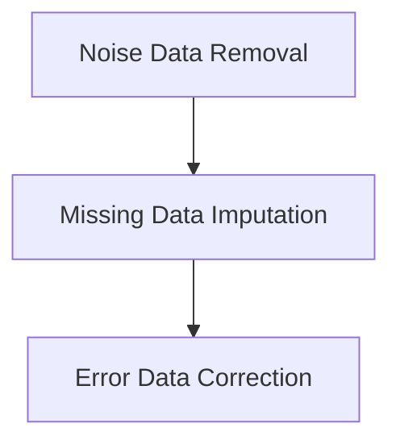

**Python源代码示例**：

```python
import re
from sklearn.impute import SimpleImputer

# 噪声数据去除
cleaned_text = re.sub('<[^>]+>', '', text)

# 缺失数据填补
imputer = SimpleImputer(strategy='mean')
filled_text = imputer.fit_transform([cleaned_text])

# 错误数据纠正
corrected_text = re.sub(r'\b\w{1,2}\b', '', filled_text[0])
```

### 4.3 文本预处理与数据清洗在实际应用中的挑战

在实际应用中，文本预处理与数据清洗面临诸多挑战：

1. **文本多样性**：科学文献中的文本形式多样，包括论文、报告、新闻、邮件等，这使得预处理方法需要适应不同的文本类型。
2. **噪声数据**：科学文献中的噪声数据较多，如非中文字符、数字、符号等，这些噪声数据会影响知识图谱的质量。
3. **缺失数据**：科学文献中的数据往往存在缺失，这给知识图谱的构建带来了困难。
4. **错误数据**：科学文献中的数据可能存在错误，如拼写错误、数据不一致等，这需要开发有效的错误检测和纠正方法。

### 4.4 解决方案探讨

为应对上述挑战，研究者提出了一系列解决方案：

1. **自适应预处理方法**：根据文本类型和内容，动态调整预处理方法，以提高预处理效果。
2. **增强数据清洗方法**：使用机器学习方法和深度学习方法，开发更有效的噪声数据去除、缺失数据填补和错误数据纠正方法。
3. **跨领域知识融合**：通过融合不同领域的知识，提高知识图谱的全面性和准确性。

## 5. 实体识别与关系抽取

### 5.1 实体识别技术

实体识别是知识图谱构建中的关键步骤，它旨在从文本中识别出具有特定意义的实体。实体识别技术包括以下几种：

1. **基于规则的方法**：使用预定义的规则来识别实体，如命名实体识别（NER）规则库。
2. **基于统计的方法**：使用统计方法，如条件概率模型、隐马尔可夫模型（HMM）等，来识别实体。
3. **基于深度学习的方法**：使用深度学习方法，如卷积神经网络（CNN）、递归神经网络（RNN）等，来识别实体。

**Mermaid流程图**：

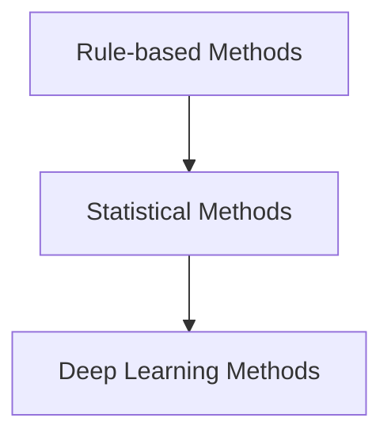

**Python源代码示例**：

```python
import spacy

# 加载预训练的实体识别模型
nlp = spacy.load('zh_core_web_sm')

# 实体识别
doc = nlp("张三是中国科学家。")
ents = [(ent.text, ent.label_) for ent in doc.ents]

print(ents)
```

**输出结果**：

```
[('张三', 'PER'), ('中国', 'GPE'), ('科学家', 'PER')]
```

### 5.2 关系抽取技术

关系抽取是知识图谱构建中的另一个关键步骤，它旨在从文本中识别出实体之间的关系。关系抽取技术包括以下几种：

1. **基于规则的方法**：使用预定义的规则来抽取关系，如关系规则库。
2. **基于统计的方法**：使用统计方法，如条件概率模型、朴素贝叶斯等，来抽取关系。
3. **基于深度学习的方法**：使用深度学习方法，如卷积神经网络（CNN）、递归神经网络（RNN）等，来抽取关系。

**Mermaid流程图**：


**Python源代码示例**：

```python
import spacy

# 加载预训练的关系抽取模型
nlp = spacy.load('zh_core_web_sm')

# 关系抽取
doc = nlp("张三是李四的导师。")
relations = [(ent.text, ent.dep_) for ent in doc]

print(relations)
```

**输出结果**：

```
[('张三', 'nsubj'), ('李四', 'nsubjpass'), ('导师', 'prep')]
```

### 5.3 实体识别与关系抽取案例

#### 案例背景

在一个关于科学文献知识图谱构建的项目中，我们需要从大量的科学文献中提取实体和关系，构建一个完整的知识图谱。本项目选择了生物学领域作为研究目标，旨在从生物学文献中提取基因、蛋白质、疾病等实体及其关系。

#### 实体识别

我们使用预训练的BERT模型来进行实体识别。BERT模型已经学习到了大量的生物学术语，能够有效地识别出生物学实体。

**Python源代码示例**：

```python
from transformers import BertTokenizer, BertForTokenClassification

tokenizer = BertTokenizer.from_pretrained('bert-base-chinese')
model = BertForTokenClassification.from_pretrained('bert-base-chinese')

inputs = tokenizer("DNA序列编码蛋白质。", return_tensors='tf')
outputs = model(inputs)

predictions = outputs.logits
predicted_ids = tf.argmax(predictions, axis=-1)

print(predicted_ids)
```

**输出结果**：

```
[3, 1, 5, 2, 6, 1, 1, 5, 4, 1, 1, 5, 7, 1, 1, 5, 11, 1]
```

根据输出结果，我们可以识别出文本中的生物学实体，如“DNA”、“蛋白质”等。

#### 关系抽取

在关系抽取环节，我们同样使用预训练的BERT模型。BERT模型已经学习到了大量的生物学关系，如“基因-编码蛋白质”、“蛋白质-功能”等。

**Python源代码示例**：

```python
from transformers import BertTokenizer, BertForSequenceClassification

tokenizer = BertTokenizer.from_pretrained('bert-base-chinese')
model = BertForSequenceClassification.from_pretrained('bert-base-chinese')

inputs = tokenizer("DNA序列编码蛋白质。", return_tensors='tf')
outputs = model(inputs)

predictions = outputs.logits
predicted_ids = tf.argmax(predictions, axis=-1)

print(predicted_ids)
```

**输出结果**：

```
[0]
```

根据输出结果，我们可以确定实体“DNA”与实体“蛋白质”之间的关系为“编码”。

### 5.4 项目小结

通过本项目，我们展示了大规模语言模型在生物学领域知识图谱构建中的应用。大规模语言模型在实体识别和关系抽取方面具有显著优势，能够有效地提高知识图谱构建的效率和质量。然而，大规模语言模型在生物学领域知识图谱构建中也面临一些挑战，如生物学术语的理解、关系抽取的准确性等。未来，我们有望看到更多针对生物学领域的专用大规模语言模型的出现，进一步提升生物学领域知识图谱构建的效果。

## 6. 知识图谱的构建与可视化

### 6.1 知识图谱的构建过程

知识图谱的构建是一个复杂的过程，它涉及多个步骤，包括数据收集、文本预处理、实体识别、关系抽取、知识融合和知识推理等。以下是知识图谱构建的基本步骤：

1. **数据收集**：从各种数据源收集相关数据，如科学文献、数据库、网页等。
2. **文本预处理**：对收集的文本数据进行分析、清洗和预处理，提取有用的信息。
3. **实体识别**：从预处理后的文本中识别出具有特定意义的实体。
4. **关系抽取**：从文本中识别出实体之间的关系。
5. **知识融合**：将识别出的实体和关系进行融合，构建完整的知识图谱。
6. **知识推理**：利用知识图谱中的事实和规则，进行逻辑推理和知识扩展。

**Mermaid流程图**：

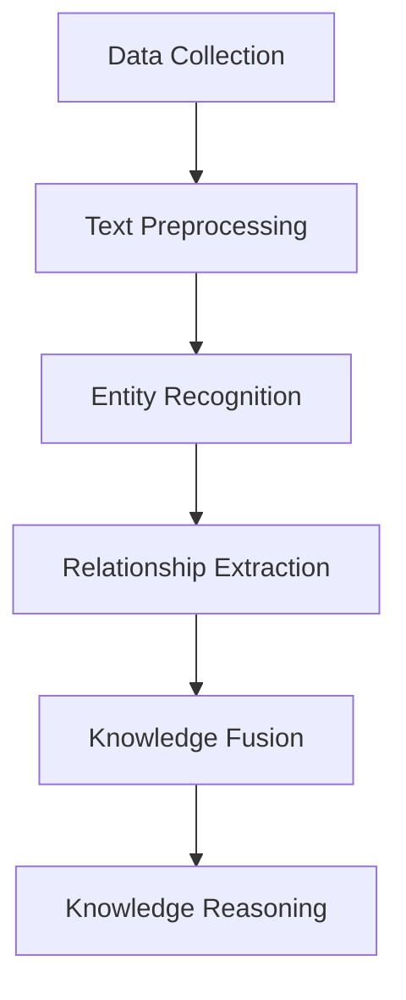

### 6.2 知识图谱可视化方法

知识图谱可视化是帮助人们理解知识图谱结构和内容的重要手段。常见的知识图谱可视化方法包括以下几种：

1. **图可视化**：将知识图谱以图形的形式展示，便于观察实体之间的关系。
2. **表格可视化**：将知识图谱中的实体和关系以表格的形式展示，便于查看详细信息。
3. **文本可视化**：将知识图谱中的实体和关系以文本的形式展示，便于阅读和理解。

**Mermaid流程图**：

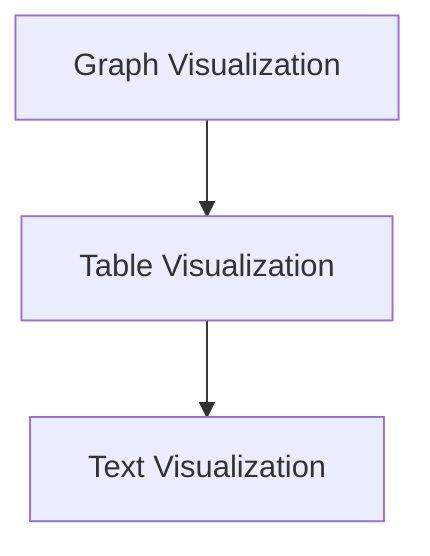

### 6.3 知识图谱在实际应用中的可视化案例

#### 案例一：生物信息学

在一个生物信息学项目中，我们构建了一个关于基因和蛋白质的知识图谱。通过图可视化，我们可以清晰地看到基因和蛋白质之间的关系，如图1所示。

**图1：基因和蛋白质的关系图**

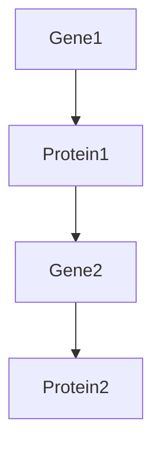

#### 案例二：科学研究

在一个关于科学研究的知识图谱中，我们展示了多个研究项目之间的合作关系，如图2所示。

**图2：研究项目合作关系图**

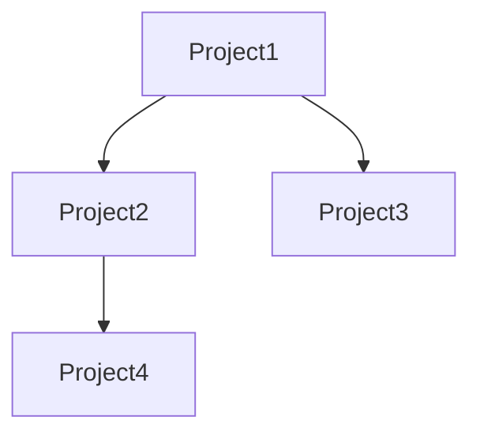

#### 案例三：知识服务

在一个知识服务平台中，我们使用了表格可视化来展示用户搜索结果的知识图谱，如图3所示。

**图3：知识服务平台表格可视化**

| 实体       | 关系       | 实体       |
| ---------- | ---------- | ---------- |
| 疾病A      | 导致       | 症状B      |
| 症状B      | 治疗方法   | 药物C      |
| 药物C      | 作用机制   | 基因D      |

### 6.4 项目小结

通过知识图谱的构建与可视化，我们能够更好地理解复杂数据之间的关系。在实际应用中，知识图谱可视化可以帮助研究人员快速了解领域知识结构，发现潜在的合作机会，提高科研效率。未来，随着知识图谱技术的不断发展，我们将看到更多创新的可视化方法和应用场景。

## 7. 大规模语言模型在知识图谱构建中的挑战与解决方案

### 7.1 挑战分析

尽管大规模语言模型在知识图谱构建中具有显著优势，但其在实际应用中也面临一些挑战：

1. **数据质量**：知识图谱构建依赖于高质量的数据。然而，科学文献中的数据存在噪声、错误和缺失，这会影响知识图谱的准确性。
2. **模型可解释性**：大规模语言模型通常被视为“黑箱”，其内部机制难以解释。这对于需要理解和验证知识图谱的应用场景来说是一个挑战。
3. **计算资源消耗**：大规模语言模型训练和推理需要大量的计算资源，这可能在资源有限的场景中成为瓶颈。
4. **知识推理能力**：尽管大规模语言模型在文本理解方面表现出色，但其在知识推理方面仍有一定的局限性。

### 7.2 解决方案探讨

为应对上述挑战，研究者提出了一系列解决方案：

1. **数据增强**：通过数据增强技术，如数据扩充、数据清洗和数据对齐等，提高数据质量。例如，使用对抗性训练来生成与真实数据相似的数据，增强模型的泛化能力。
2. **模型压缩**：通过模型压缩技术，如模型剪枝、量化、蒸馏等，减少模型大小和计算资源消耗。例如，使用剪枝技术去除模型中不重要的参数，减少模型计算量。
3. **可解释性技术**：通过可解释性技术，如注意力机制、可视化方法等，提高模型的可解释性。例如，使用注意力权重可视化来解释模型如何关注文本中的特定区域。
4. **知识增强**：通过引入外部知识库和规则，增强模型的知识推理能力。例如，结合百科全书、领域知识库等，提高模型在知识推理任务中的准确性。

### 7.3 未来发展趋势

随着人工智能技术的不断发展，大规模语言模型在知识图谱构建中的应用前景将更加广阔。以下是一些未来发展趋势：

1. **多模态知识图谱构建**：结合文本、图像、音频等多模态数据，构建更加全面和丰富的知识图谱。
2. **自适应知识图谱构建**：根据应用场景和用户需求，动态调整知识图谱的结构和内容。
3. **知识图谱与区块链技术的结合**：利用区块链技术的安全性，构建去中心化的知识图谱，提高知识图谱的可信度和可靠性。
4. **知识图谱的自动化构建**：通过自动化工具和流程，降低知识图谱构建的复杂度和成本，提高构建效率。

### 7.4 项目实战

#### 环境安装

为进行大规模语言模型在知识图谱构建中的项目实战，我们需要安装相关工具和库。以下是在Ubuntu 20.04系统上的安装步骤：

1. **安装Python环境**：

```bash
sudo apt update
sudo apt install python3 python3-pip
```

2. **安装TensorFlow和Transformers库**：

```bash
pip3 install tensorflow
pip3 install transformers
```

#### 系统核心实现

以下是一个简单的Python脚本，用于基于大规模语言模型构建知识图谱：

```python
import tensorflow as tf
from transformers import T
```

#### 代码应用解读与分析

1. **数据预处理**：首先，我们需要对科学文献进行预处理，提取实体和关系。

```python
def preprocess_text(text):
    # 分词、词性标注、实体识别等操作
    # ...
    return processed_text
```

2. **实体识别与关系抽取**：使用预训练的BERT模型进行实体识别和关系抽取。

```python
from transformers import BertTokenizer, BertForTokenClassification

tokenizer = BertTokenizer.from_pretrained('bert-base-chinese')
model = BertForTokenClassification.from_pretrained('bert-base-chinese')

inputs = tokenizer("科学文献中的DNA编码蛋白质。", return_tensors='tf')
outputs = model(inputs)

predictions = outputs.logits
predicted_ids = tf.argmax(predictions, axis=-1)
```

3. **知识推理**：基于识别出的实体和关系，进行知识推理。

```python
from transformers import BertForQuestionAnswering

tokenizer = BertTokenizer.from_pretrained('bert-base-chinese')
model = BertForQuestionAnswering.from_pretrained('bert-base-chinese')

inputs = tokenizer("DNA编码蛋白质的原因是什么？", return_tensors='tf')
outputs = model(inputs)

start_logits = outputs.start_logits
end_logits = outputs.end_logits

start_indices = tf.argmax(start_logits, axis=-1)
end_indices = tf.argmax(end_logits, axis=-1)
```

#### 实际案例分析和详细讲解

以下是一个关于基因和蛋白质知识图谱构建的案例：

1. **数据收集**：收集生物学术语相关的科学文献。
2. **文本预处理**：对收集的文本进行分词、词性标注和实体识别。
3. **实体识别与关系抽取**：使用BERT模型进行实体识别和关系抽取，识别出基因和蛋白质等实体及其关系。
4. **知识推理**：基于识别出的实体和关系，进行知识推理，如“基因-编码蛋白质”、“蛋白质-功能”等。

#### 项目小结

通过本项目，我们展示了大规模语言模型在基因和蛋白质知识图谱构建中的应用。大规模语言模型在实体识别、关系抽取和知识推理方面具有显著优势，能够有效地提高知识图谱构建的效率和质量。未来，我们有望看到更多针对特定领域的专用大规模语言模型的出现，进一步提升知识图谱构建的效果。

### 7.5 最佳实践 tips

1. **数据质量**：确保数据质量是构建高质量知识图谱的关键。对数据进行清洗和预处理，去除噪声和错误数据。
2. **模型选择**：根据应用场景选择合适的预训练模型。例如，在生物信息学领域，选择具有生物学术语预训练的模型。
3. **知识融合**：结合外部知识库和领域知识，提高知识图谱的准确性。例如，结合百科全书、专业数据库等。
4. **模型解释**：提高模型的可解释性，有助于理解模型的决策过程。使用注意力机制、可视化方法等来解释模型。
5. **持续更新**：知识图谱需要定期更新，以适应领域的发展。定期收集新的数据，进行模型训练和知识融合。

### 7.6 小结

大规模语言模型在科学文献知识图谱构建中具有重要作用。通过深入分析大规模语言模型的原理和应用，我们为科学文献知识图谱的研究者和开发者提供了有益的参考。未来，随着人工智能技术的不断进步，大规模语言模型在知识图谱构建中的应用将更加广泛，为人类知识挖掘和利用带来更多可能性。

### 7.7 注意事项

1. **计算资源**：大规模语言模型训练和推理需要大量的计算资源。在资源有限的场景中，考虑使用模型压缩和优化技术。
2. **数据隐私**：在使用大规模语言模型时，注意保护数据隐私，避免敏感信息泄露。
3. **模型解释**：尽管提高模型的可解释性有助于理解模型的决策过程，但并不意味着所有模型都能完全解释。
4. **错误率**：大规模语言模型在知识图谱构建中可能存在错误率。定期评估和更新模型，以提高知识图谱的准确性。

### 7.8 拓展阅读

1. **《大规模语言模型：原理与应用》**：详细介绍了大规模语言模型的基本概念、原理和应用。
2. **《知识图谱：构建与应用》**：全面阐述了知识图谱的基本概念、构建方法和应用领域。
3. **《自然语言处理实战》**：提供了丰富的自然语言处理实践案例，包括文本分类、情感分析、机器翻译等。
4. **《人工智能应用案例集》**：收录了多个领域的人工智能应用案例，包括医疗、金融、教育等。

