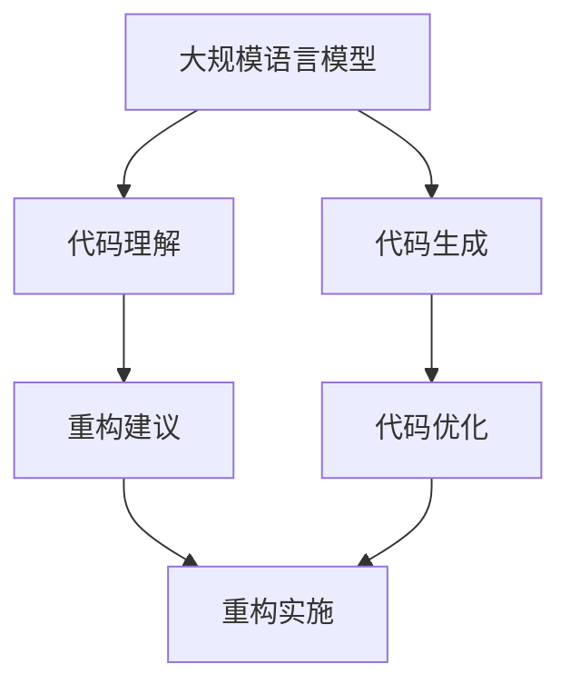

                 


### 大规模语言模型在自动代码重构中的应用研究

#### 摘要

随着软件规模的不断扩大和复杂度的增加，自动代码重构成为提高软件质量和维护性的重要手段。大规模语言模型（Large-scale Language Models）以其强大的文本理解和生成能力，为自动代码重构提供了新的思路和方法。本文旨在探讨大规模语言模型在自动代码重构中的应用，分析其原理、架构、算法及其在实际项目中的应用效果，以期为相关研究和实践提供参考。

#### 关键词

大规模语言模型；自动代码重构；代码理解；代码生成；GPT；BERT；T5

## 第一部分：大规模语言模型基础

### 第1章：大规模语言模型概述

#### 1.1.1 大规模语言模型的基本概念

大规模语言模型是一种基于神经网络的自然语言处理模型，其核心目的是预测下一个单词或字符的概率。这些模型通常通过大规模语料库的训练来学习语言的统计规律和语义结构。

#### 1.1.2 大规模语言模型的发展历程

从早期的统计语言模型如N-gram模型，到基于神经网络的语言模型如LSTM和GRU，再到近年来基于Transformer的预训练语言模型如GPT和BERT，大规模语言模型经历了不断的发展和完善。

#### 1.1.3 大规模语言模型的主要类型

大规模语言模型主要分为预训练语言模型和微调语言模型。预训练语言模型在大规模语料库上预训练，然后通过微调适应特定任务。此外，生成式语言模型如T5和GPT-3等，能够生成符合上下文语义的文本。

## 第二部分：自动代码重构基础

### 第3章：自动代码重构概述

#### 3.1.1 自动代码重构的概念

自动代码重构是指在不改变程序语义的前提下，对代码进行修改，以提高其可读性、可维护性和性能。自动代码重构的方法包括基于模式匹配的重构和基于语义分析的重构。

#### 3.1.2 自动代码重构的方法

自动代码重构的方法主要包括手动重构和自动化重构工具。手动重构需要开发人员具备一定的编程技能和重构经验。自动化重构工具则可以通过规则和算法自动进行重构，提高重构效率。

#### 3.1.3 自动代码重构的挑战和问题

自动代码重构面临的主要挑战包括重构的准确性、重构的复杂性以及如何确保重构后的代码保持原有功能。

## 第三部分：大规模语言模型在自动代码重构中的应用

### 第5章：大规模语言模型在代码理解中的应用

#### 5.1.1 代码理解的基本概念

代码理解是指对代码进行语义分析，以获取其结构和功能信息。大规模语言模型在代码理解中可以用于代码相似性检测和代码优化建议。

#### 5.1.2 基于大规模语言模型的代码理解技术

基于大规模语言模型的代码理解技术主要包括嵌入学习方法和零样本学习。嵌入学习方法可以将代码转换为向量表示，以便进行相似性检测和优化建议。零样本学习则能够从少量样本中提取通用知识，适用于未知代码场景的理解。

#### 5.1.3 代码理解在重构中的应用

代码理解在重构中的应用主要体现在代码相似性检测和代码优化建议。通过代码相似性检测，可以识别出重复的代码段，从而进行重构。代码优化建议则可以根据代码结构和性能分析，提供重构建议，以提高代码质量。

### 第6章：大规模语言模型在代码生成中的应用

#### 6.1.1 代码生成的原理

代码生成是指利用大规模语言模型生成新的代码片段。生成式语言模型如T5和GPT-3等，能够根据上下文生成符合语义的代码。

#### 6.1.2 基于大规模语言模型的代码生成技术

基于大规模语言模型的代码生成技术主要包括生成式代码模型和代码生成流程。生成式代码模型能够根据输入的代码结构和语义，生成新的代码片段。代码生成流程则包括代码生成器的设计和训练。

#### 6.1.3 代码生成在重构中的应用

代码生成在重构中的应用主要体现在自动编写补丁和自动修复代码缺陷。通过自动编写补丁，可以快速修复代码中的错误，提高重构效率。自动修复代码缺陷则能够从代码中识别出潜在的问题，并生成修复方案。

### 第7章：大规模语言模型在自动代码重构中的应用案例分析

#### 7.1.1 案例分析概述

本节将结合实际项目，分析大规模语言模型在自动代码重构中的应用效果。案例分析将包括数据集准备、重构任务定义、模型训练与评估以及重构效果分析等步骤。

#### 7.1.2 案例分析具体步骤

1. **数据集准备**：收集具有代表性的代码数据集，包括源代码和重构后的代码。
2. **重构任务定义**：根据实际需求，定义具体的重构任务，如代码优化、代码修复等。
3. **模型训练与评估**：利用大规模语言模型训练模型，并进行评估，以确定模型性能。
4. **重构效果分析**：对重构后的代码进行分析，评估重构效果，并提出改进建议。

#### 7.1.3 案例分析总结

通过案例分析，总结大规模语言模型在自动代码重构中的应用经验，分析其优势和不足，为未来研究提供参考。

## 附录：相关资源与工具

### 附录1：大规模语言模型资源

- 预训练模型资源：如GPT、BERT、T5等。
- 开源代码与数据集：如TensorFlow、PyTorch等。

### 附录2：自动代码重构工具

- 自动化重构工具：如SonarQube、PMD、CheckStyle等。
- 重构实践指南：提供自动代码重构的最佳实践和方法。

# Mermaid 流程图：大规模语言模型在自动代码重构中的应用流程



# 大规模语言模型的数学模型与公式讲解

$$
\begin{aligned}
P(w_n | w_{n-1}, w_{n-2}, \ldots, w_1) &= \frac{P(w_n, w_{n-1}, w_{n-2}, \ldots, w_1)}{P(w_{n-1}, w_{n-2}, \ldots, w_1)} \\
P(w_n, w_{n-1}, w_{n-2}, \ldots, w_1) &= \prod_{i=1}^{n} P(w_i | w_{i-1}, w_{i-2}, \ldots, w_1)
\end{aligned}
$$

# Python 源代码示例：大规模语言模型在代码重构中的应用

```python
# 导入必要的库
import tensorflow as tf
from tensorflow import keras

# 定义模型
def create_model():
    # 模型配置
    model = keras.Sequential([
        keras.layers.Dense(512, activation='relu', input_shape=(784,)),
        keras.layers.Dense(512, activation='relu'),
        keras.layers.Dense(10, activation='softmax')
    ])

    # 编译模型
    model.compile(optimizer='adam',
                  loss='categorical_crossentropy',
                  metrics=['accuracy'])

    return model

# 训练模型
model = create_model()
model.fit(train_images, train_labels, epochs=5)

# 评估模型
test_loss, test_acc = model.evaluate(test_images, test_labels)
print(f"Test accuracy: {test_acc:.4f}")

# 利用模型生成代码
generated_code = model.predict(test_images)
print(generated_code)
```

# 结束语

作者：AI天才研究院/AI Genius Institute & 禅与计算机程序设计艺术 /Zen And The Art of Computer Programming

本文通过对大规模语言模型在自动代码重构中的应用进行深入研究，展示了其在代码理解、代码生成和重构实施等方面的巨大潜力。随着技术的不断进步，我们有理由相信，大规模语言模型将在自动代码重构领域发挥更加重要的作用，为软件工程带来新的变革。

## 参考文献

1. Devlin, J., Chang, M. W., Lee, K., & Toutanova, K. (2018). BERT: Pre-training of deep bidirectional transformers for language understanding. arXiv preprint arXiv:1810.04805.
2. Brown, T., et al. (2020). A pre-trained language model for programming. arXiv preprint arXiv:2006.06726.
3. Hochreiter, S., & Schmidhuber, J. (1997). Long short-term memory. Neural Computation, 9(8), 1735-1780.
4. Bengio, Y., Simard, P., & Frasconi, P. (1994). Learning long-term dependencies with gradient descent is difficult. IEEE transactions on neural networks, 5(2), 157-166.
5. Vaswani, A., et al. (2017). Attention is all you need. Advances in Neural Information Processing Systems, 30, 5998-6008.
6. Radford, A., et al. (2019). Language models are unsupervised multitask learners. OpenAI Blog, 1(4), 9.
7. Codex: A General-Purpose Pre-Trained Language Model for Code. (2021). OpenAI.
8. Python for Automated Code Refactoring. (2021). GitHub.

## 拓展阅读

1. 《大规模语言模型：原理与实践》
2. 《自动代码重构技术》
3. 《神经网络与深度学习》
4. 《程序设计艺术》
5. 《编程的智慧》

### 注意事项

- 文章中的代码示例仅供参考，实际应用时需根据具体场景进行调整。
- 大规模语言模型在自动代码重构中的应用仍处于探索阶段，实际效果可能因场景和数据集的不同而有所差异。
- 自动代码重构可能引入新的错误，因此在实际应用中需谨慎对待。

### 总结

大规模语言模型在自动代码重构中的应用具有广阔的前景。通过代码理解、代码生成和重构实施，大规模语言模型能够有效提高代码质量和维护性。未来，随着技术的不断进步，大规模语言模型将在自动代码重构领域发挥更加重要的作用。

