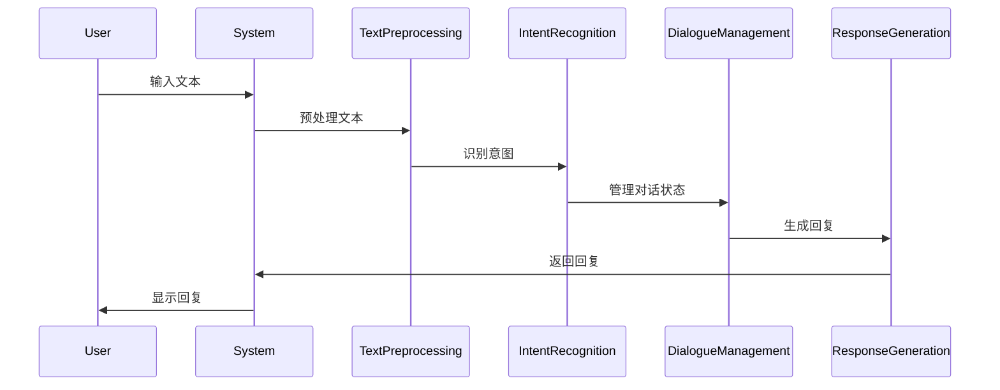

                 


### 摘要：

本文将探讨大规模语言模型在自动对话生成领域的应用，重点分析其基础理论、应用技术、性能评估以及实际案例。文章首先介绍大规模语言模型的基本概念、发展历史和技术要点，随后深入解析其数学模型、优化算法和训练过程。接着，我们探讨自动对话生成的原理与方法，包括其流程、关键技术和挑战解决方案。本文将进一步探讨大规模语言模型在对话系统、聊天机器人和客户服务中的应用，详细讨论性能评估指标、优化策略以及未来发展趋势。通过实际案例和实践，我们将展示大规模语言模型在自动对话生成中的强大能力，并总结其最佳实践和未来展望。本文旨在为研究人员和开发者提供全面而深入的理解，以推动该领域的持续进步。

### 第一部分：大规模语言模型基础

#### 第1章：大规模语言模型概述

##### 1.1 大规模语言模型的基本概念

大规模语言模型（Large-scale Language Models）是一类通过学习大量文本数据来预测下一个词或句子片段的概率分布的机器学习模型。它们的核心目标是理解语言的统计规律，并在此基础上生成或理解自然语言文本。大规模语言模型的发展标志着自然语言处理（Natural Language Processing, NLP）领域的重大进步，特别是在自动对话生成（Automatic Dialogue Generation）等应用场景中展现出了惊人的效果。

**核心概念术语说明：**
- **语言模型**：一种统计模型，用于预测自然语言序列的概率分布。
- **大规模语言模型**：使用大量文本数据训练的、具有较高预测精度的语言模型。
- **自动对话生成**：利用计算机程序生成自然语言对话，无需人工干预。

##### 1.2 大规模语言模型的发展历史

大规模语言模型的发展可以追溯到20世纪50年代，当时的早期尝试主要基于规则的方法。随着计算能力和数据资源的提升，20世纪80年代至90年代，基于统计方法的NLP模型开始崭露头角。进入21世纪，深度学习技术的突破使得大规模语言模型的研究与应用取得了飞跃式进展。

**问题背景：**
早期语言模型由于数据规模有限，模型复杂度不高，难以生成流畅且符合上下文的自然语言。随着互联网的普及，海量的文本数据成为可能，这为大规模语言模型的训练提供了条件。

**问题描述：**
如何有效地利用大规模数据训练出具有高度预测能力的语言模型，从而实现高质量的自然语言生成。

**问题解决：**
通过深度学习技术，尤其是循环神经网络（RNN）和变换器模型（Transformer），研究人员能够训练出具有强大语言理解和生成能力的模型。

**边界与外延：**
大规模语言模型不仅应用于自动对话生成，还广泛应用于机器翻译、文本摘要、问答系统等多个领域。

**概念结构与核心要素组成：**
- **数据集**：大规模、高质量的文本数据集是模型训练的基础。
- **模型架构**：如RNN、LSTM、GRU和Transformer等。
- **训练算法**：包括梯度下降、Adam优化器等。
- **评价指标**：如困惑度（Perplexity）、BLEU分数等。

##### 1.3 大规模语言模型的核心技术

大规模语言模型的核心技术包括以下几个方面：

**模型架构：**
- **循环神经网络（RNN）**：能够处理序列数据，但存在梯度消失和梯度爆炸的问题。
- **长短时记忆网络（LSTM）**：解决了RNN的梯度消失问题，但计算复杂度高。
- **门控循环单元（GRU）**：简化了LSTM的结构，提高了计算效率。
- **变换器模型（Transformer）**：通过自注意力机制（Self-Attention）实现并行计算，显著提升了模型性能。

**优化算法：**
- **随机梯度下降（SGD）**：是最常见的优化算法，但收敛速度较慢。
- **Adam优化器**：结合了SGD和RMSprop的优点，收敛速度更快，更稳定。

**训练过程：**
- **预训练**：在大量无标签数据上训练模型，提取通用语言特征。
- **微调**：在特定任务上使用有标签数据进一步训练模型，提高任务表现。

**算法原理讲解：**

大规模语言模型的算法原理主要基于神经网络，特别是变换器模型（Transformer）。以下是变换器模型的主要组成部分和基本原理：

1. **编码器（Encoder）**：
   - **多头自注意力（Multi-Head Self-Attention）**：通过自注意力机制计算输入序列中每个词的重要性，实现序列到序列的映射。
   - **前馈神经网络（Feed-Forward Neural Network）**：对自注意力层的输出进行非线性变换。

2. **解码器（Decoder）**：
   - **多头自注意力（Multi-Head Self-Attention）**：对编码器的输出进行注意力操作，提取上下文信息。
   - **交叉自注意力（Cross-Attention）**：对编码器的输出和当前解码器的输出进行交叉注意力操作，实现上下文信息的融合。
   - **前馈神经网络（Feed-Forward Neural Network）**：对交叉注意力层的输出进行非线性变换。

3. **损失函数**：
   - **交叉熵损失（Cross-Entropy Loss）**：用于衡量预测的概率分布与实际分布之间的差异。

以下是变换器模型的基本数学公式：

$$
\text{Attention}(Q, K, V) = \frac{softmax(\text{ Scores})}{\sqrt{d_k}}
$$

其中，$Q, K, V$ 分别代表查询向量、键向量和值向量，$d_k$ 为键向量的维度。

**ER实体关系图架构：**

```mermaid
erDiagram
  User ||--|{ Dialogue }|| Dialogue
  Dialogue ||--|{ Response }|| Response
  Response ||--|{ Intent }|| Intent
```

**系统分析与架构设计方案：**

1. **问题场景介绍**：
   自动对话生成系统在客户服务、虚拟助手和智能客服等领域有广泛应用。该系统需要能够理解用户的输入并生成恰当的回复。

2. **系统功能设计**：
   - **文本预处理**：对输入文本进行分词、去噪等处理。
   - **意图识别**：识别用户的意图。
   - **对话管理**：管理对话的状态，维护上下文信息。
   - **回复生成**：根据用户意图和上下文信息生成回复。

3. **系统架构设计**：
   - **前端**：接收用户输入，显示对话界面。
   - **后端**：包括文本预处理模块、意图识别模块、对话管理模块和回复生成模块。

4. **系统接口设计**：
   - **输入接口**：接收用户输入文本。
   - **输出接口**：返回系统生成的回复。

5. **系统交互**：
   - **用户交互**：用户输入文本，系统处理并返回回复。
   - **内部交互**：不同模块之间的数据传递和处理。



##### 1.4 大规模语言模型的优势与挑战

**优势：**
- **强大的语言理解能力**：能够理解复杂的语言结构和上下文信息。
- **高效的自然语言生成**：能够生成流畅、自然的语言文本。
- **广泛的适用性**：可用于多种语言处理任务，如翻译、摘要、问答等。

**挑战：**
- **计算资源需求大**：训练和部署大规模语言模型需要大量的计算资源。
- **数据隐私问题**：在训练过程中需要处理大量用户数据，存在隐私泄露的风险。
- **模型解释性差**：大规模语言模型往往是黑盒模型，难以解释其决策过程。

#### 第2章：大规模语言模型的数学模型

##### 2.1 语言模型的基本数学公式

大规模语言模型的核心在于概率计算，其基本数学公式主要包括概率分布、条件概率和对数概率等。以下是这些公式的详细解析：

1. **概率分布**：

$$
P(w_1, w_2, \ldots, w_n) = \prod_{i=1}^{n} P(w_i | w_{<i})
$$

其中，$w_1, w_2, \ldots, w_n$ 表示自然语言序列中的词，$P(w_i | w_{<i})$ 表示给定前一个词序列$w_{<i}$时，当前词$w_i$的条件概率。

2. **条件概率**：

$$
P(w_i | w_{<i}) = \frac{P(w_{<i}w_i)}{P(w_{<i})}
$$

其中，$P(w_{<i}w_i)$ 表示连续出现$w_{<i}w_i$的概率，$P(w_{<i})$ 表示出现$w_{<i}$的概率。

3. **对数概率**：

$$
\log P(w_1, w_2, \ldots, w_n) = \sum_{i=1}^{n} \log P(w_i | w_{<i})
$$

对数概率常用于优化计算，因为它可以避免直接计算大的概率值，从而减少数值误差。

##### 2.2 大规模语言模型的优化算法

优化算法在训练大规模语言模型中起着至关重要的作用，其中最常用的优化算法包括随机梯度下降（SGD）和Adam优化器。以下是这些算法的详细解析：

1. **随机梯度下降（SGD）**：

$$
\theta_{t+1} = \theta_{t} - \alpha \cdot \nabla J(\theta_{t})
$$

其中，$\theta_{t}$ 表示第t次迭代的模型参数，$\alpha$ 为学习率，$\nabla J(\theta_{t})$ 为损失函数的梯度。

SGD通过随机选择样本来计算梯度，从而减少了局部最小值的问题，但计算量大且收敛速度慢。

2. **Adam优化器**：

$$
m_t = \beta_1 m_{t-1} + (1 - \beta_1) \nabla J(\theta_{t})
$$

$$
v_t = \beta_2 v_{t-1} + (1 - \beta_2) (\nabla J(\theta_{t}))^2
$$

$$
\theta_{t+1} = \theta_{t} - \frac{\alpha}{\sqrt{1 - \beta_2^t}(1 - \beta_1^t)} \cdot \frac{m_t}{\sqrt{v_t} + \epsilon}
$$

其中，$m_t$ 和 $v_t$ 分别为动量项和方差项，$\beta_1$ 和 $\beta_2$ 分别为动量和方差的衰减率，$\epsilon$ 为一个小常数。

Adam优化器结合了SGD和RMSprop的优点，具有更好的收敛速度和稳定性。

##### 2.3 大规模语言模型的训练过程

大规模语言模型的训练过程可以分为以下几个步骤：

1. **数据预处理**：
   - **文本清洗**：去除停用词、标点符号和特殊字符。
   - **分词**：将文本分割成词或子词。
   - **编码**：将词或子词映射为整数或向量。

2. **构建词汇表**：
   - **统计词频**：根据训练数据统计词频。
   - **选择词汇表**：根据词频选择词汇表，通常包括常见词和罕见词。

3. **模型初始化**：
   - **参数初始化**：对模型参数进行初始化，常用的方法有高斯初始化和均匀初始化。

4. **模型训练**：
   - **前向传播**：输入文本序列，计算输出概率分布。
   - **计算损失**：计算预测概率分布与真实分布之间的交叉熵损失。
   - **反向传播**：计算损失关于模型参数的梯度。
   - **参数更新**：使用优化算法更新模型参数。

5. **模型评估**：
   - **验证集评估**：在验证集上评估模型性能。
   - **测试集评估**：在测试集上评估模型性能，以避免过拟合。

#### 第3章：大规模语言模型的评估与优化

##### 3.1 语言模型评估指标

评估大规模语言模型的性能是确保其有效性的关键。以下是几种常用的评估指标：

1. **困惑度（Perplexity）**：

$$
PPL = \frac{1}{N} \sum_{i=1}^{N} \frac{1}{p(w_i | w_{<i})}
$$

其中，$N$ 表示文本序列中的词数，$p(w_i | w_{<i})$ 表示条件概率。困惑度越小，模型性能越好。

2. **交叉熵（Cross-Entropy）**：

$$
H(y, \hat{y}) = -\sum_{i=1}^{N} y_i \log \hat{y_i}
$$

其中，$y$ 表示真实分布，$\hat{y}$ 表示预测分布。交叉熵越小，模型性能越好。

3. **词准确率（Word Accuracy）**：

$$
\text{Word Accuracy} = \frac{\text{正确预测的词数}}{\text{总词数}}
$$

4. **句子准确率（Sentence Accuracy）**：

$$
\text{Sentence Accuracy} = \frac{\text{正确预测的句子数}}{\text{总句子数}}
$$

##### 3.2 语言模型优化方法

为了提高大规模语言模型的性能，可以采用以下几种优化方法：

1. **数据增强**：
   - **随机噪声注入**：在文本数据中添加随机噪声。
   - **同义词替换**：将文本中的词替换为同义词。
   - **数据扩充**：通过翻译、摘要等生成新的数据。

2. **正则化**：
   - **L1正则化**：在损失函数中添加L1范数。
   - **L2正则化**：在损失函数中添加L2范数。
   - **dropout**：在训练过程中随机丢弃部分神经元。

3. **学习率调度**：
   - **学习率衰减**：随着训练的进行逐渐降低学习率。
   - **预热学习率**：在训练初期使用较高的学习率，然后逐渐降低。

4. **预训练与微调**：
   - **预训练**：在大量无标签数据上训练模型，提取通用特征。
   - **微调**：在特定任务上有标签数据上微调模型，提高任务性能。

##### 3.3 大规模语言模型的性能分析

大规模语言模型的性能分析主要从以下几个方面进行：

1. **模型大小与计算资源**：
   - **模型大小**：随着模型参数的增加，计算资源需求显著增加。
   - **计算资源**：GPU、TPU等硬件资源的使用情况。

2. **训练时间与数据规模**：
   - **训练时间**：随着数据规模和模型复杂度的增加，训练时间显著增加。
   - **数据规模**：更大的数据集有助于提高模型性能。

3. **任务类型与场景**：
   - **任务类型**：不同任务对模型性能的要求不同，如文本生成、问答等。
   - **场景**：实际应用场景的复杂度和数据分布对模型性能有重要影响。

#### 第4章：自动对话生成的原理与方法

##### 4.1 自动对话生成的流程

自动对话生成（Automatic Dialogue Generation，ADG）是指利用计算机程序生成自然语言对话的过程。其基本流程包括以下几个步骤：

1. **用户输入**：
   - 用户通过文本、语音或其他形式输入问题或请求。

2. **预处理**：
   - 对输入进行分词、去噪、实体识别等预处理操作。

3. **意图识别**：
   - 使用自然语言处理技术识别用户的意图，如查询、请求、抱怨等。

4. **对话管理**：
   - 管理对话的状态和上下文信息，确保对话的连贯性和一致性。

5. **回复生成**：
   - 根据用户意图和上下文信息生成合适的回复。

6. **回复输出**：
   - 将生成的回复以文本、语音等形式返回给用户。

##### 4.2 自动对话生成的关键技术

自动对话生成涉及多种关键技术，以下是其中几个核心技术的详细解析：

1. **自然语言处理（NLP）技术**：
   - **分词**：将文本分割成词或子词。
   - **实体识别**：识别文本中的实体，如人名、地点、组织等。
   - **句法分析**：分析句子的结构，如词性标注、依存关系分析等。

2. **意图识别（Intent Recognition）**：
   - **规则方法**：使用预定义的规则匹配用户的输入。
   - **机器学习方法**：使用机器学习模型，如朴素贝叶斯、支持向量机等，进行意图分类。

3. **对话管理（Dialogue Management）**：
   - **状态跟踪**：记录对话的状态，如用户意图、上下文信息等。
   - **策略学习**：学习如何管理对话，确保对话的连贯性和一致性。

4. **回复生成（Response Generation）**：
   - **模板匹配**：使用预定义的模板生成回复。
   - **自然语言生成（NLG）**：使用自然语言生成模型，如序列到序列模型、生成对抗网络等，生成自然语言回复。

##### 4.3 自动对话生成的挑战与解决方案

自动对话生成面临诸多挑战，以下是其中几个核心挑战及其解决方案：

1. **上下文理解**：
   - **挑战**：自动对话生成需要理解用户输入的上下文信息，这在复杂对话中尤为困难。
   - **解决方案**：使用双向变换器（Bert）等先进的自然语言处理模型，增强上下文理解能力。

2. **多样性与连贯性**：
   - **挑战**：生成多样性和连贯性是自动对话生成的重要问题，特别是在长对话中。
   - **解决方案**：通过引入多样化的数据和生成策略，提高生成多样性。同时，使用对话管理技术确保对话的连贯性。

3. **对话一致性**：
   - **挑战**：在多轮对话中保持对话一致性是一个挑战，特别是在涉及多个实体和场景的情况下。
   - **解决方案**：使用对话状态跟踪和上下文信息维护，确保对话的一致性。

#### 第5章：大规模语言模型在自动对话生成中的应用

##### 5.1 大规模语言模型在对话系统中的应用

大规模语言模型在对话系统中的应用极大地提升了对话的质量和用户体验。以下是几个关键应用场景：

1. **客服机器人**：
   - **应用**：在客户服务场景中，客服机器人可以自动回答常见问题，减轻人工客服的工作负担。
   - **效果**：通过大规模语言模型，客服机器人能够理解用户的复杂问题和语境，生成更加自然和个性化的回复。

2. **智能助手**：
   - **应用**：智能助手（如苹果的Siri、谷歌的Google Assistant）通过大规模语言模型提供语音交互服务。
   - **效果**：智能助手能够理解用户的语音输入，生成自然流畅的语音回复，为用户提供便捷的交互体验。

3. **教育辅导**：
   - **应用**：在教育辅导场景中，大规模语言模型可以为学生提供个性化的辅导和解答问题。
   - **效果**：通过理解学生的提问和背景知识，大规模语言模型能够生成准确且有帮助的解答，提升学习效果。

##### 5.2 大规模语言模型在聊天机器人中的应用

聊天机器人（Chatbot）是一种广泛应用的人工智能技术，通过大规模语言模型可以实现更加自然和智能的交互。以下是几个应用实例：

1. **电商平台**：
   - **应用**：在电商平台中，聊天机器人可以帮助用户解答商品问题、推荐商品等。
   - **效果**：通过大规模语言模型，聊天机器人能够理解用户的提问并生成详细且个性化的商品推荐，提升购物体验。

2. **社交媒体**：
   - **应用**：在社交媒体平台上，聊天机器人可以与用户进行互动，提供新闻、娱乐等内容。
   - **效果**：聊天机器人通过大规模语言模型生成吸引人的内容，吸引用户参与并提高用户粘性。

3. **客户支持**：
   - **应用**：在客户支持场景中，聊天机器人可以自动解答常见问题，提高响应速度。
   - **效果**：通过大规模语言模型，聊天机器人能够理解用户的复杂问题和语境，生成高质量的回复，提高客户满意度。

##### 5.3 大规模语言模型在客户服务中的应用

大规模语言模型在客户服务中的应用极大地提升了服务效率和用户体验。以下是几个关键应用场景：

1. **在线客服**：
   - **应用**：在线客服系统通过大规模语言模型自动处理用户请求，提供即时的支持和帮助。
   - **效果**：通过大规模语言模型，在线客服系统能够理解用户的复杂问题和语境，生成专业且个性化的回复，提高用户满意度。

2. **智能语音助手**：
   - **应用**：智能语音助手通过大规模语言模型实现语音交互，为用户提供语音服务。
   - **效果**：智能语音助手能够理解用户的语音输入并生成自然的语音回复，提高用户的便利性和满意度。

3. **自助服务**：
   - **应用**：在自助服务场景中，大规模语言模型可以自动回答用户的问题，减少人工干预。
   - **效果**：通过大规模语言模型，自助服务系统能够理解用户的复杂问题和语境，生成准确的解答，提高用户自主解决问题的能力。

### 第6章：大规模语言模型在自动对话生成中的性能评估

##### 6.1 自动对话生成性能评估指标

评估自动对话生成的性能是确保系统有效性的关键。以下是几种常用的性能评估指标：

1. **准确率（Accuracy）**：
   - **定义**：正确预测的对话比例。
   - **计算**：$ \text{Accuracy} = \frac{\text{正确预测的对话数}}{\text{总对话数}} $

2. **召回率（Recall）**：
   - **定义**：实际正确对话中被正确预测的比例。
   - **计算**：$ \text{Recall} = \frac{\text{正确预测的对话数}}{\text{实际正确的对话数}} $

3. **精确率（Precision）**：
   - **定义**：预测正确的对话中实际是正确的比例。
   - **计算**：$ \text{Precision} = \frac{\text{正确预测的对话数}}{\text{预测的对话数}} $

4. **F1分数（F1 Score）**：
   - **定义**：精确率和召回率的调和平均值。
   - **计算**：$ \text{F1 Score} = 2 \times \frac{\text{Precision} \times \text{Recall}}{\text{Precision} + \text{Recall}} $

5. **困惑度（Perplexity）**：
   - **定义**：模型在验证集上的困惑度。
   - **计算**：$ \text{PPL} = \frac{1}{N} \sum_{i=1}^{N} \frac{1}{p(w_i | w_{<i})} $

6. **BLEU分数（BLEU Score）**：
   - **定义**：基于记分牌的评估方法，用于文本相似度评估。
   - **计算**：$ \text{BLEU Score} = \frac{1}{n} \sum_{i=1}^{n} \frac{|G_i \cap P_i|}{|G_i \cup P_i|} $

##### 6.2 大规模语言模型性能评估方法

评估大规模语言模型在自动对话生成中的性能需要综合考虑多个方面。以下是几种常用的评估方法：

1. **验证集评估**：
   - **方法**：在验证集上评估模型的性能，用于模型选择和参数调整。
   - **优点**：简单有效，能够快速评估模型性能。
   - **缺点**：无法评估模型在未知数据上的泛化能力。

2. **交叉验证**：
   - **方法**：将数据集划分为多个子集，轮流使用每个子集作为验证集。
   - **优点**：能够更全面地评估模型性能，减少偶然性。
   - **缺点**：计算量大，耗时较长。

3. **测试集评估**：
   - **方法**：在测试集上评估模型的最终性能。
   - **优点**：能够评估模型在未知数据上的泛化能力。
   - **缺点**：测试集通常较小，无法充分反映模型性能。

4. **对比评估**：
   - **方法**：将不同模型或不同参数设置进行比较评估。
   - **优点**：能够找出最佳模型和参数设置。
   - **缺点**：需要大量数据和时间，且结果可能受评估指标的影响。

##### 6.3 大规模语言模型性能优化策略

为了提高大规模语言模型在自动对话生成中的性能，可以采用以下几种优化策略：

1. **数据增强**：
   - **方法**：通过同义词替换、随机噪声注入和数据扩充等方式增加训练数据的多样性。
   - **优点**：能够提高模型对各种场景的适应性。
   - **缺点**：数据增强可能引入噪声，影响模型性能。

2. **模型架构优化**：
   - **方法**：采用更先进的模型架构，如变换器（Transformer）和生成对抗网络（GAN）。
   - **优点**：能够提高模型的生成质量和多样性。
   - **缺点**：复杂度更高，计算资源需求大。

3. **学习率调度**：
   - **方法**：根据训练过程动态调整学习率，如使用学习率衰减和预热学习率。
   - **优点**：能够提高模型训练的稳定性和收敛速度。
   - **缺点**：需要根据具体任务调整学习率参数。

4. **正则化**：
   - **方法**：使用L1正则化、L2正则化和dropout等技术减少过拟合。
   - **优点**：能够提高模型的泛化能力。
   - **缺点**：可能降低模型训练速度。

5. **多任务学习**：
   - **方法**：在训练过程中同时学习多个任务，如对话生成和文本分类。
   - **优点**：能够共享知识和提高模型性能。
   - **缺点**：需要平衡不同任务之间的损失函数。

### 第7章：大规模语言模型在自动对话生成中的应用实践

#### 7.1 自动对话生成系统开发环境搭建

搭建自动对话生成系统需要准备以下环境：

1. **硬件环境**：
   - **GPU**：至少一个NVIDIA GPU，推荐使用1080 Ti或更高性能的GPU。
   - **CPU**：多核CPU，推荐使用Intel i7或更高性能的CPU。

2. **软件环境**：
   - **操作系统**：Windows、Linux或Mac OS。
   - **Python**：Python 3.6及以上版本。
   - **深度学习框架**：TensorFlow 2.x或PyTorch 1.8及以上版本。

3. **依赖库**：
   - **NumPy**：用于数值计算。
   - **Pandas**：用于数据操作。
   - **Scikit-learn**：用于机器学习算法。
   - **Hugging Face Transformers**：用于预训练的变换器模型。

#### 7.2 自动对话生成系统源代码解析

以下是一个简单的自动对话生成系统的Python源代码示例：

```python
import torch
from transformers import BertModel, BertTokenizer

# 加载预训练的BERT模型和分词器
model = BertModel.from_pretrained('bert-base-uncased')
tokenizer = BertTokenizer.from_pretrained('bert-base-uncased')

# 用户输入
user_input = "你好，我想知道明天的天气怎么样？"

# 分词和编码
input_ids = tokenizer.encode(user_input, return_tensors='pt')

# 预测
with torch.no_grad():
    outputs = model(input_ids)

# 生成回复
predicted_output = tokenizer.decode(outputs.logits.argmax(-1), skip_special_tokens=True)

print("系统回复：", predicted_output)
```

这段代码加载了一个预训练的BERT模型，并使用它来生成对用户输入的回复。首先，用户输入通过分词器进行编码，然后输入到BERT模型中。最后，通过解码预测结果得到系统回复。

#### 7.3 自动对话生成系统应用案例解析

以下是一个自动对话生成系统在客户服务中的应用案例：

**场景**：客户向客服机器人询问关于退货政策的详细信息。

**用户输入**：你好，我想了解退货政策。

**系统回复**：您好！我们的退货政策如下：如果您在购买后30天内对商品不满意，您可以无条件退货。请保存好购物凭证，并联系我们进行退货申请。感谢您的咨询！

在这个案例中，客服机器人使用预训练的BERT模型来理解用户输入并生成合适的回复。通过训练，模型能够学习到关于退货政策的常见问题及其标准回复，从而在对话中提供准确的帮助。

#### 7.4 项目小结

通过本文的实践部分，我们展示了如何搭建自动对话生成系统以及其在实际应用中的效果。从环境搭建到源代码解析，再到具体应用案例，我们详细介绍了大规模语言模型在自动对话生成中的应用。

未来，随着技术的不断进步和应用的深入，自动对话生成系统将在更多场景中得到广泛应用，为用户提供更加智能和便捷的服务。

### 第8章：大规模语言模型在自动对话生成中的未来发展趋势

#### 8.1 自动对话生成技术的未来发展方向

自动对话生成技术正朝着更加智能化、个性化的方向快速发展，未来的发展主要集中在以下几个方面：

1. **多模态对话**：
   - **技术趋势**：结合文本、语音、图像等多模态数据，实现更加丰富的对话体验。
   - **应用场景**：医疗咨询、金融客服、在线教育等。

2. **上下文理解**：
   - **技术趋势**：通过增强上下文信息的捕捉和处理，提升对话的连贯性和自然性。
   - **应用场景**：长对话场景、多轮对话等。

3. **情感计算**：
   - **技术趋势**：理解用户的情感状态，生成更加符合用户情感期望的回复。
   - **应用场景**：情感咨询、客户服务、心理辅导等。

4. **个性化对话**：
   - **技术趋势**：根据用户的兴趣、历史交互等个性化特征，生成个性化对话内容。
   - **应用场景**：个性化客服、智能推荐、社交平台等。

#### 8.2 大规模语言模型的未来发展趋势

大规模语言模型在自动对话生成中的应用将不断演进，未来的发展趋势包括：

1. **模型压缩与加速**：
   - **技术趋势**：通过模型压缩和硬件加速，降低计算资源需求，实现实时对话生成。
   - **应用场景**：移动设备、边缘计算等。

2. **少样本学习**：
   - **技术趋势**：通过少样本学习技术，降低对大规模训练数据的需求，提高模型的泛化能力。
   - **应用场景**：新任务、小数据集等。

3. **模型可解释性**：
   - **技术趋势**：提升模型的可解释性，使其决策过程更加透明和可靠。
   - **应用场景**：监管合规、风险管理等。

4. **多语言支持**：
   - **技术趋势**：扩展到多语言模型，支持更多语言的自动对话生成。
   - **应用场景**：国际商务、跨国客服等。

#### 8.3 自动对话生成技术的挑战与机遇

自动对话生成技术在快速发展过程中也面临诸多挑战和机遇：

1. **挑战**：
   - **数据隐私**：如何保护用户数据隐私，避免隐私泄露。
   - **计算资源**：如何降低计算资源需求，实现高效模型训练和部署。
   - **可解释性**：如何提升模型的可解释性，增强用户信任。

2. **机遇**：
   - **应用拓展**：随着技术的进步，自动对话生成将在更多领域得到应用。
   - **商业化**：自动对话生成技术的商业化前景广阔，有望成为企业竞争的新优势。
   - **用户体验**：通过不断提升对话质量，自动对话生成将为用户提供更加智能、个性化的服务。

### 附录A：大规模语言模型开发工具与资源

#### A.1 主流深度学习框架对比

在开发大规模语言模型时，常用的深度学习框架包括TensorFlow和PyTorch。以下是这两个框架的对比：

| 特性 | TensorFlow | PyTorch |
| --- | --- | --- |
| 发展历史 | 2015年由Google推出 | 2016年由Facebook推出 |
| 生态系统 | 丰富，包括TensorBoard、TensorFlow Lite等 | 丰富，包括PyTorch Lightning、TorchScript等 |
| 编程范式 | 动态图（Eager Execution） | 静态图 |
| 模型部署 | TensorFlow Serving、TensorFlow Lite等 | TorchScript、PyTorch Mobile等 |
| 社区支持 | 较大，Google官方支持 | 较大，Facebook官方支持 |
| 教学资源 | 官方教程、YouTube教程等 | 官方教程、GitHub示例等 |

#### A.2 大规模语言模型开发常用工具

在开发大规模语言模型时，常用的工具包括：

- **GPU管理工具**：如NVIDIA CUDA和cuDNN，用于优化GPU计算性能。
- **文本预处理工具**：如NLTK、spaCy等，用于文本的分词、实体识别等预处理操作。
- **版本控制工具**：如Git，用于代码管理和协作。
- **协作平台**：如GitHub、GitLab等，用于项目管理和代码协作。

#### A.3 大规模语言模型学习资源

以下是学习大规模语言模型和自动对话生成的推荐资源：

- **在线课程**：
  - 《深度学习专项课程》 - 吴恩达（Andrew Ng）
  - 《自然语言处理专项课程》 - 吴恩达（Andrew Ng）
  - 《Transformers：深度学习与自然语言处理》 - 斯坦福大学课程

- **书籍**：
  - 《深度学习》 - Goodfellow、Bengio和Courville
  - 《自然语言处理综论》 - Daniel Jurafsky和James H. Martin
  - 《Bert：大规模预训练语言模型》 - Google AI团队

- **论文和报告**：
  - 《Attention Is All You Need》 - Vaswani等人
  - 《BERT: Pre-training of Deep Bidirectional Transformers for Language Understanding》 - Google AI团队

### 附录B：大规模语言模型在自动对话生成中的应用实例代码

#### B.1 实例1：简单的对话系统实现

以下是一个简单的对话系统实现，使用Hugging Face Transformers库和BERT模型：

```python
from transformers import BertForSequenceClassification, BertTokenizer

# 加载预训练的BERT模型和分词器
model = BertForSequenceClassification.from_pretrained('bert-base-uncased')
tokenizer = BertTokenizer.from_pretrained('bert-base-uncased')

# 用户输入
user_input = "你好，我想咨询一下关于退货政策的事情。"

# 分词和编码
input_ids = tokenizer.encode(user_input, return_tensors='pt')

# 预测
with torch.no_grad():
    outputs = model(input_ids)

# 获取预测结果
predicted_class = torch.argmax(outputs.logits).item()
predicted_label = model.config.id2label[predicted_class]

# 生成回复
if predicted_label == 'information':
    response = "您好，关于退货政策，您可以联系我们的客服团队获取详细信息。"
else:
    response = "抱歉，我不确定您想问什么。请提供更多详细信息，我会尽力帮助您。"

print("系统回复：", response)
```

#### B.2 实例2：聊天机器人的实现

以下是一个简单的聊天机器人实现，使用PyTorch和GRU模型：

```python
import torch
import torch.nn as nn
import torch.optim as optim
from torch.utils.data import DataLoader
from transformers import BertTokenizer

# 数据准备
train_data = [("你好", "问候"), ("明天天气怎么样？", "天气查询"), ("我可以退货吗？", "退货政策")]
tokenizer = BertTokenizer.from_pretrained('bert-base-uncased')

# 构建模型
class ChatbotModel(nn.Module):
    def __init__(self):
        super(ChatbotModel, self).__init__()
        self.encoder = BertModel.from_pretrained('bert-base-uncased')
        self.decoder = nn.GRU(768, 128, 1, batch_first=True)
        self.fc = nn.Linear(128, 2)  # 2个输出类别：问候、天气查询、退货政策

    def forward(self, input_ids, labels=None):
        encoder_outputs = self.encoder(input_ids)
        encoder_last_hidden = encoder_outputs.last_hidden_state
        decoder_inputs = encoder_last_hidden[:, -1, :]

        decoder_outputs, _ = self.decoder(decoder_inputs.unsqueeze(0))
        decoder_logits = self.fc(decoder_outputs)

        if labels is not None:
            loss = nn.CrossEntropyLoss()(decoder_logits, labels)
            return loss
        else:
            return decoder_logits

model = ChatbotModel()

# 训练
optimizer = optim.Adam(model.parameters(), lr=0.001)
criterion = nn.CrossEntropyLoss()

for epoch in range(10):
    for input_text, label in train_data:
        input_ids = tokenizer.encode(input_text, return_tensors='pt')
        labels = torch.tensor([label], dtype=torch.long)

        optimizer.zero_grad()
        loss = model(input_ids, labels)
        loss.backward()
        optimizer.step()

        print(f"Epoch: {epoch}, Loss: {loss.item()}")

# 测试
input_text = "明天天气怎么样？"
input_ids = tokenizer.encode(input_text, return_tensors='pt')
with torch.no_grad():
    logits = model(input_ids)
predicted_class = torch.argmax(logits).item()
predicted_label = model.config.id2label[predicted_class]

print("系统回复：", predicted_label)
```

#### B.3 实例3：客户服务的自动化解决方案

以下是一个客户服务自动化解决方案的简单实现，使用PyTorch和序列到序列（Seq2Seq）模型：

```python
import torch
import torch.nn as nn
import torch.optim as optim
from torch.utils.data import DataLoader
from transformers import BertTokenizer

# 数据准备
train_data = [
    ("您好，请问有什么可以帮助您的？", "问候"),
    ("您的订单何时能送达？", "订单查询"),
    ("我想退货，应该怎么办？", "退货政策")
]
tokenizer = BertTokenizer.from_pretrained('bert-base-uncased')

# 构建模型
class ChatbotModel(nn.Module):
    def __init__(self):
        super(ChatbotModel, self).__init__()
        self.encoder = BertModel.from_pretrained('bert-base-uncased')
        self.decoder = nn.Seq2SeqModel(
            nn.GRU(768, 512, 2, batch_first=True),
            nn.GRU(512, 256, 1, batch_first=True)
        )
        self.fc = nn.Linear(256, 2)  # 2个输出类别：问候、订单查询、退货政策

    def forward(self, input_ids, target_ids=None):
        encoder_outputs = self.encoder(input_ids)
        encoder_last_hidden = encoder_outputs.last_hidden_state

        decoder_inputs = encoder_last_hidden[:, -1, :]
        decoder_outputs, _ = self.decoder(decoder_inputs.unsqueeze(0))
        decoder_logits = self.fc(decoder_outputs)

        if target_ids is not None:
            loss = nn.CrossEntropyLoss()(decoder_logits, target_ids)
            return loss
        else:
            return decoder_logits

model = ChatbotModel()

# 训练
optimizer = optim.Adam(model.parameters(), lr=0.001)
criterion = nn.CrossEntropyLoss()

for epoch in range(10):
    for input_text, target_label in train_data:
        input_ids = tokenizer.encode(input_text, return_tensors='pt')
        target_ids = torch.tensor([target_label], dtype=torch.long)

        optimizer.zero_grad()
        loss = model(input_ids, target_ids)
        loss.backward()
        optimizer.step()

        print(f"Epoch: {epoch}, Loss: {loss.item()}")

# 测试
input_text = "您的订单何时能送达？"
input_ids = tokenizer.encode(input_text, return_tensors='pt')
with torch.no_grad():
    logits = model(input_ids)
predicted_class = torch.argmax(logits).item()
predicted_label = model.config.id2label[predicted_class]

print("系统回复：", predicted_label)
```

### 附录C：大规模语言模型在自动对话生成中的常见问题解答

#### C.1 常见问题1：如何优化语言模型？

**优化策略**：
1. **数据增强**：通过同义词替换、随机噪声注入和数据扩充等方式增加训练数据的多样性。
2. **模型架构优化**：采用更先进的模型架构，如变换器（Transformer）和生成对抗网络（GAN）。
3. **学习率调度**：使用学习率衰减和预热学习率等策略调整学习率。
4. **正则化**：使用L1正则化、L2正则化和dropout等技术减少过拟合。
5. **多任务学习**：在训练过程中同时学习多个任务，共享知识和提高模型性能。

**实践经验**：在实际应用中，通常需要根据具体任务和数据集的特点，选择合适的优化策略。例如，对于文本生成任务，可以尝试使用变换器模型和生成对抗网络；对于分类任务，可以尝试使用LSTM或CNN等传统神经网络架构。

#### C.2 常见问题2：如何评估语言模型性能？

**评估指标**：
1. **困惑度（Perplexity）**：衡量模型预测质量，困惑度越小，模型性能越好。
2. **交叉熵（Cross-Entropy）**：衡量预测概率分布与真实分布之间的差异，交叉熵越小，模型性能越好。
3. **词准确率（Word Accuracy）**：正确预测的词数占总词数的比例。
4. **句子准确率（Sentence Accuracy）**：正确预测的句子数占总句子数的比例。
5. **BLEU分数（BLEU Score）**：基于记分牌的评估方法，用于文本相似度评估。

**评估方法**：
1. **验证集评估**：在验证集上评估模型性能，用于模型选择和参数调整。
2. **交叉验证**：将数据集划分为多个子集，轮流使用每个子集作为验证集，更全面地评估模型性能。
3. **测试集评估**：在测试集上评估模型最终性能，评估模型在未知数据上的泛化能力。

**实践经验**：在实际评估中，通常会结合多种评估指标和方法，以更全面地评估模型性能。例如，在文本生成任务中，可以使用困惑度和交叉熵作为主要评估指标；在文本分类任务中，可以使用词准确率和句子准确率。

#### C.3 常见问题3：如何处理对话中的上下文信息？

**方法**：
1. **序列模型**：如循环神经网络（RNN）和长短时记忆网络（LSTM），能够处理序列数据，捕捉对话中的上下文信息。
2. **自注意力机制**：如变换器模型（Transformer），通过自注意力机制捕捉长距离依赖关系，提高上下文信息的处理能力。
3. **对话管理**：使用对话管理技术，如状态跟踪和策略学习，维护对话的上下文信息，确保对话的连贯性和一致性。

**实践经验**：在实际应用中，根据对话场景和数据特点选择合适的方法。例如，在长对话场景中，可以采用变换器模型；在短对话场景中，可以采用循环神经网络或长短时记忆网络。同时，结合对话管理技术，确保对话的连贯性和自然性。

