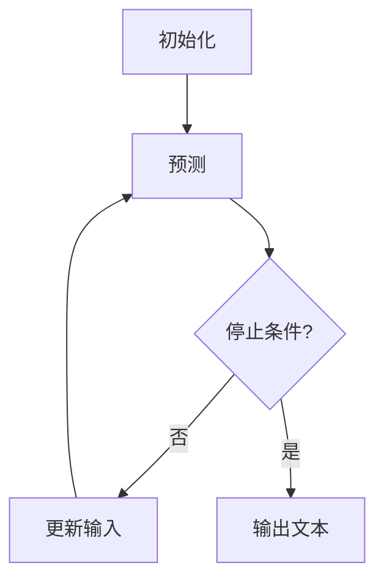
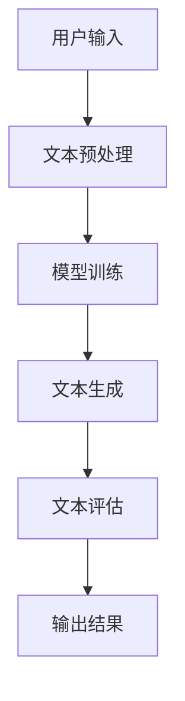
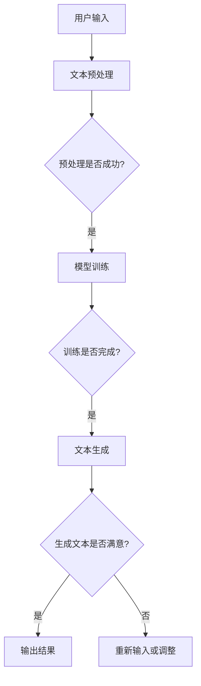
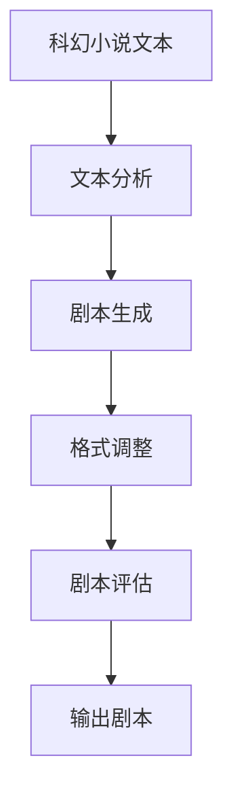
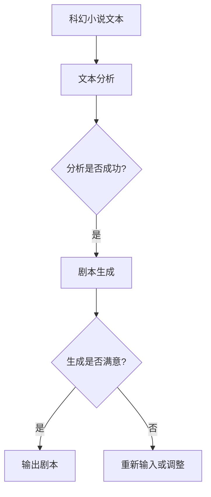
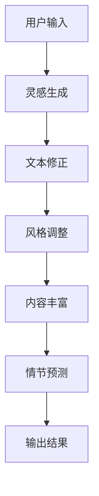
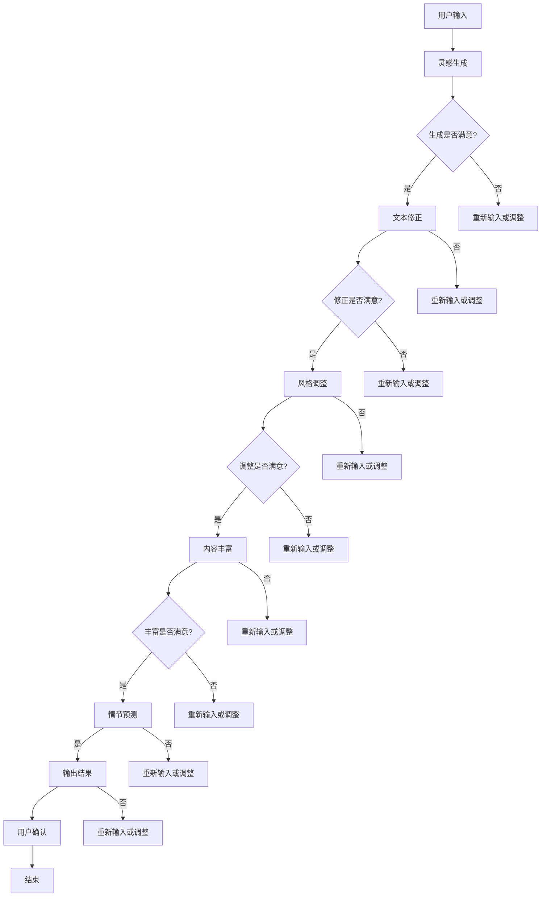

                 

### 引言

#### 1.1 书籍背景

**大规模语言模型在自动科幻小说创作中的探索与突破**是一本旨在探讨大规模语言模型在自动科幻小说创作领域应用的书籍。随着人工智能技术的不断进步，大规模语言模型（如GPT-3、BERT等）已经在自然语言处理（NLP）领域取得了显著成就。这些模型通过深度学习算法，能够理解并生成人类语言，从而在许多应用场景中表现出色。

科幻小说创作作为一种极具创意和想象力的文学形式，长期以来面临着创作难度大、创意枯竭等问题。然而，随着大规模语言模型的发展，自动科幻小说创作逐渐成为可能。通过对大规模语言模型的研究和应用，我们可以探索如何在自动科幻小说创作中实现创新和突破，从而为科幻文学带来新的发展契机。

#### 1.1.1 大规模语言模型的发展历程

大规模语言模型的发展可以追溯到20世纪80年代，当时的统计语言模型如N-gram模型在自然语言处理领域取得了一定的成功。然而，这些模型受限于计算资源和数据规模，很难生成高质量的自然语言文本。

随着计算能力的提升和深度学习技术的引入，20世纪末至21世纪初，神经网络语言模型逐渐崭露头角。例如，循环神经网络（RNN）和长短期记忆网络（LSTM）能够在一定程度上解决长文本生成的问题。然而，这些模型在面对复杂文本时，仍然存在生成质量不高、生成文本连贯性差等问题。

进入21世纪，随着深度学习技术的发展，基于 Transformer 架构的大规模语言模型如 GPT、BERT 等开始崭露头角。GPT-3 更是凭借其前所未有的参数规模和强大能力，在自然语言处理领域引起了广泛关注。这些模型通过大规模预训练和精细调整，能够生成高质量、连贯的自然语言文本，为自动科幻小说创作提供了有力的技术支持。

#### 1.1.2 科幻小说创作中的机遇与挑战

科幻小说创作作为一种独特的文学形式，具有丰富的想象力和创意性。然而，传统的科幻小说创作面临着诸多挑战，如创作难度大、创意枯竭、写作时间成本高等问题。这些挑战在一定程度上限制了科幻小说的创作速度和质量。

随着大规模语言模型的发展，自动科幻小说创作逐渐成为可能，为科幻小说创作带来了新的机遇。首先，大规模语言模型能够快速生成大量高质量的文本，提高了科幻小说的创作效率。其次，模型能够通过学习不同的写作风格和题材，实现创作风格的多样化，从而满足不同读者的需求。此外，大规模语言模型的应用还可以在一定程度上缓解创作者的创意枯竭问题，为科幻小说创作注入新的活力。

然而，自动科幻小说创作也面临着一些挑战。首先，模型生成的文本质量参差不齐，有时会出现逻辑混乱、文风不一致等问题。其次，模型在处理复杂情节和人物关系时，可能会出现理解偏差，影响小说的整体质量。此外，如何保证自动生成的科幻小说具有原创性和可读性，也是一个亟待解决的问题。

#### 1.1.3 大规模语言模型在科幻小说创作中的潜在应用

大规模语言模型在科幻小说创作中的潜在应用主要包括以下几个方面：

1. **文本生成**：大规模语言模型可以通过预训练和精细调整，生成高质量、连贯的科幻小说文本。这不仅可以提高创作效率，还可以为创作者提供灵感，丰富创作素材。

2. **创作辅助**：大规模语言模型可以辅助创作者进行写作，如提供写作建议、修改错误、优化文风等。这有助于创作者更加专注于创意构思，提高创作质量。

3. **风格转换**：通过大规模语言模型，可以将一种写作风格转换为另一种风格，从而实现不同风格科幻小说的混合创作，为读者提供更多样化的阅读体验。

4. **创作评估**：利用大规模语言模型，可以对科幻小说进行自动评估，如评估故事情节、人物塑造、文风等方面，帮助创作者发现并改进作品。

5. **改编与翻译**：大规模语言模型可以用于科幻小说的改编和翻译，如将一种语言的科幻小说翻译成另一种语言，或将科幻小说改编成其他形式的文学作品。

总之，大规模语言模型在科幻小说创作中具有巨大的应用潜力。通过深入研究和应用，我们可以进一步探索其在科幻小说创作中的价值，为科幻文学的发展做出贡献。

### 书籍结构概述

#### 1.2.1 全书内容安排与章节布局

本书共分为四个部分，结构安排如下：

**第一部分：引言**  
- 1.1 书籍背景  
- 1.2 书籍结构概述

**第二部分：大规模语言模型在科幻小说创作中的应用**  
- 2.1 大规模语言模型在文本生成中的应用  
- 2.2 科幻小说文本特征分析  
- 2.3 大规模语言模型在科幻小说创作中的探索  
- 2.4 大规模语言模型在科幻小说创作中的应用案例分析

**第三部分：大规模语言模型在科幻小说创作中的突破**  
- 3.1 大规模语言模型在科幻小说创作中的技术突破  
- 3.2 大规模语言模型在科幻小说创作中的实践应用  
- 3.3 大规模语言模型在科幻小说创作中的未来发展

**第四部分：附录**  
- 4.1 大规模语言模型在科幻小说创作中的工具与资源  
- 4.2 参考文献  
- 4.3 后记

本书通过系统性地介绍大规模语言模型在科幻小说创作中的应用，帮助读者了解这一领域的最新动态和未来趋势。

#### 1.2.2 阅读指南与建议

为了更好地理解和应用书中内容，我们提供以下阅读指南和建议：

1. **逐步阅读**：建议按照章节顺序逐步阅读，以便系统地了解大规模语言模型在科幻小说创作中的应用。

2. **结合实践**：在阅读过程中，尝试将书中所述的理论知识应用到实际项目中，以加深理解和掌握。

3. **深入思考**：针对书中的案例和分析，进行深入思考和讨论，探索大规模语言模型在科幻小说创作中的潜在应用和突破。

4. **拓展阅读**：参考书后的参考文献和拓展阅读部分，进一步深入了解相关领域的研究和应用。

5. **积极参与**：加入相关学术论坛和社群，与同行交流学习，共同探索大规模语言模型在科幻小说创作中的未来发展方向。

通过以上指南和建议，相信读者可以更好地利用本书的内容，为大规模语言模型在科幻小说创作中的应用提供有力支持。

### 大规模语言模型基础知识

#### 1.3.1 语言模型的定义

语言模型（Language Model，简称LM）是自然语言处理（Natural Language Processing，简称NLP）中的一项基本技术，用于预测或生成自然语言文本。具体来说，语言模型的目标是给定一个已知的文本序列，预测下一个最可能出现的单词或字符。

语言模型的主要作用有：

1. **文本生成**：通过模型生成新的文本，如自动写作、机器翻译等。
2. **文本理解**：辅助模型理解文本内容，如问答系统、信息检索等。
3. **文本校对**：用于检测和纠正文本中的错误，如拼写检查、语法修正等。

语言模型可以分为两类：

1. **统计语言模型**：基于统计方法，如N-gram模型，通过计算单词或字符序列的频率来预测下一个单词或字符。
2. **神经网络语言模型**：基于深度学习技术，如循环神经网络（RNN）和Transformer，通过学习大量文本数据，生成高质量的自然语言文本。

#### 1.3.2 语言模型的类型

根据不同的训练数据和模型结构，语言模型可以分为多种类型，以下是一些常见的语言模型：

1. **N-gram模型**：基于单词或字符的N个连续序列的统计模型。N-gram模型简单且易于实现，但无法捕捉长距离依赖关系，生成文本连贯性较差。

2. **循环神经网络（RNN）模型**：RNN通过记忆机制，能够处理长序列数据，但训练过程容易出现梯度消失或爆炸问题，影响模型性能。

3. **长短期记忆网络（LSTM）模型**：LSTM是RNN的一种改进，通过引入门控机制，解决了梯度消失问题，在处理长序列数据时表现出较好的性能。

4. **Transformer模型**：Transformer模型是一种基于自注意力机制的深度学习模型，能够处理长序列数据，生成高质量的自然语言文本。其自注意力机制使得模型在捕捉长距离依赖关系方面具有显著优势。

5. **BERT模型**：BERT（Bidirectional Encoder Representations from Transformers）是一种双向Transformer模型，通过预训练和精细调整，生成高质量的自然语言文本，广泛应用于各种NLP任务。

#### 1.3.3 语言模型的核心技术

语言模型的核心技术主要包括以下几个方面：

1. **训练数据**：语言模型的训练数据是其性能的关键因素。大量高质量的文本数据有助于模型学习自然语言的统计规律和语义信息。常见的训练数据来源包括维基百科、新闻文章、社交媒体等。

2. **模型结构**：不同的模型结构决定了语言模型的性能和适用范围。常见的模型结构包括N-gram模型、RNN、LSTM、Transformer等。

3. **预训练与微调**：预训练是指在大规模语料库上对模型进行训练，使其具备一定的语言理解能力。微调是指在特定任务上对预训练模型进行进一步调整，以适应具体任务的需求。

4. **生成算法**：语言模型的生成算法决定了其生成文本的质量和连贯性。常见的生成算法包括贪心搜索、Beam Search等。

5. **评估指标**：评估语言模型的性能通常使用一系列指标，如Perplexity、BLEU、ROUGE等。这些指标能够衡量模型在文本生成和理解任务中的表现。

通过了解语言模型的定义、类型和核心技术，读者可以更好地理解大规模语言模型在自动科幻小说创作中的应用。在后续章节中，我们将进一步探讨大规模语言模型在科幻小说创作中的具体应用和实践。

### 自动科幻小说创作的现状与趋势

#### 1.4.1 自动科幻小说创作的挑战

自动科幻小说创作虽然具备极大的潜力，但在实际应用过程中也面临着诸多挑战。以下是一些主要挑战：

1. **文本生成质量**：目前的大规模语言模型虽然在自然语言生成方面取得了显著进展，但生成的文本质量仍有待提高。模型有时会生成逻辑混乱、文风不一致的文本，难以保证科幻小说的整体质量。

2. **创意与原创性**：尽管模型能够生成大量文本，但如何保证这些文本具有原创性和创意，是一个亟待解决的问题。目前，模型生成的文本往往缺乏独特性和创新性，难以满足科幻小说创作的高要求。

3. **风格一致性**：在自动生成科幻小说时，如何保持文本风格的一致性也是一个挑战。不同的模型或不同的训练数据可能导致生成的文本风格迥异，影响小说的整体阅读体验。

4. **人物与情节设计**：科幻小说创作中的人物和情节设计至关重要。自动生成的人物和情节往往缺乏深度和复杂性，难以吸引读者的兴趣。

5. **文化背景与知识储备**：科幻小说往往涉及到广泛的知识背景和文化元素。模型在处理这些复杂信息时，可能无法充分理解并准确呈现，从而影响小说的深度和广度。

#### 1.4.2 自动科幻小说创作的现状

尽管面临诸多挑战，自动科幻小说创作的研究和应用已经取得了一些进展：

1. **实验成果**：一些研究团队已经成功利用大规模语言模型生成了一定数量的科幻小说片段或完整小说。例如，基于GPT-3的模型可以生成具有较高连贯性的文本，尽管在原创性和创意方面仍有待提高。

2. **工具与平台**：随着技术的进步，一些自动科幻小说创作工具和平台逐渐问世。例如，OpenAI的GPT-3平台和Google的BERT模型，为科幻小说创作者提供了强大的文本生成支持。

3. **应用场景**：自动科幻小说创作已开始应用于一些实际场景，如为科幻小说爱好者生成个性化的故事情节、为科幻电影提供剧本创意等。

4. **合作与创新**：一些科幻小说作家已经开始与人工智能团队合作，共同探索自动科幻小说创作的可能性。这种合作不仅有助于提高创作效率，还可以为科幻文学带来新的创新。

#### 1.4.3 自动科幻小说创作的未来趋势

随着人工智能技术的不断进步，自动科幻小说创作有望在未来取得更多突破：

1. **文本生成质量提升**：随着模型训练数据的不断扩充和模型结构的优化，生成的文本质量将进一步提高，更贴近人类作家的水平。

2. **创意与原创性增强**：通过引入更多创新技术和算法，模型将能够生成更具创意和原创性的文本，为科幻小说创作提供更多可能性。

3. **风格一致性与个性化**：通过精细调整和优化模型参数，可以更好地保持文本风格的一致性，同时实现个性化创作，满足不同读者的需求。

4. **人物与情节设计**：通过结合生成模型和知识图谱等技术，自动生成的人物和情节将更加丰富和复杂，提升科幻小说的吸引力。

5. **文化背景与知识融合**：模型将能够更好地理解和融合多种文化背景和知识，生成更具深度和广度的科幻小说。

总之，自动科幻小说创作虽然面临诸多挑战，但未来的发展趋势充满希望。通过持续的研究和创新，我们有望在科幻小说创作领域实现更多突破，为读者带来更丰富的科幻文学体验。

### 大规模语言模型在文本生成中的应用

#### 2.1.1 文本生成的基本原理

文本生成是大规模语言模型的重要应用之一，其基本原理基于模型对大量文本数据的学习和预训练。在文本生成过程中，模型通过输入一段已知的文本序列，预测下一个最可能出现的单词或字符，从而生成新的文本。

具体来说，文本生成过程可以分为以下几步：

1. **初始化**：模型从已知的文本序列中随机选择一个起始词或字符作为输入。

2. **预测**：模型根据当前输入的文本序列，计算下一个单词或字符的概率分布。通常使用概率最大的单词或字符作为预测结果。

3. **更新**：将预测的单词或字符添加到已生成的文本序列中，作为新的输入，继续进行预测。

4. **迭代**：重复步骤2和步骤3，直到达到预定的生成长度或满足停止条件。

通过这种迭代过程，模型能够生成一系列连贯的文本。文本生成的基本原理如图1所示：



图1：文本生成的基本原理

#### 2.1.2 文本生成模型的发展历程

文本生成模型的发展经历了多个阶段，从早期的简单统计模型到现代复杂的神经网络模型。以下是文本生成模型的发展历程：

1. **N-gram模型**：最早的文本生成模型之一，通过计算单词或字符序列的频率来预测下一个单词或字符。N-gram模型简单易实现，但在长文本生成时效果较差。

2. **循环神经网络（RNN）模型**：RNN通过引入记忆单元，能够处理长序列数据。RNN在文本生成中取得了一定的成功，但存在梯度消失和梯度爆炸等问题。

3. **长短期记忆网络（LSTM）模型**：LSTM是RNN的一种改进，通过引入门控机制，解决了梯度消失问题。LSTM在长文本生成中表现出较好的性能，但仍存在一定局限性。

4. **Transformer模型**：Transformer模型引入了自注意力机制，能够处理长序列数据，生成高质量的自然语言文本。Transformer在许多NLP任务中取得了显著成果，成为现代文本生成模型的主流。

5. **BERT模型**：BERT是基于Transformer的双向编码模型，通过预训练和精细调整，生成高质量的自然语言文本。BERT在多种NLP任务中表现出色，广泛应用于文本生成领域。

#### 2.1.3 大规模语言模型在文本生成中的应用实例

以下是一些大规模语言模型在文本生成中的应用实例：

1. **GPT-3模型**：GPT-3是OpenAI开发的一种基于Transformer的预训练模型，具有非常高的生成能力。GPT-3可以用于生成各种类型的文本，如新闻文章、故事、对话等。以下是一个使用GPT-3生成新闻文章的示例：

```python
import openai

openai.api_key = "your-api-key"

response = openai.Completion.create(
  engine="text-davinci-002",
  prompt="谷歌宣布了一项新的AI研究进展，这项技术有望改变未来的计算方式。",
  max_tokens=50
)

print(response.choices[0].text.strip())
```

输出结果可能为：
```
这项新技术名为“谷歌大脑2.0”，它通过深度学习算法，实现了前所未有的图像识别和自然语言处理能力。研究人员表示，这项技术将在医疗、金融和科学等领域产生重大影响。
```

2. **BERT模型**：BERT是一种基于Transformer的双向编码模型，广泛应用于文本生成任务。以下是一个使用BERT生成故事的示例：

```python
from transformers import BertTokenizer, BertForMaskedLM

tokenizer = BertTokenizer.from_pretrained("bert-base-uncased")
model = BertForMaskedLM.from_pretrained("bert-base-uncased")

input_ids = tokenizer.encode("The dog ___ the park.", return_tensors="pt")

outputs = model(input_ids)

predicted_ids = outputs[0].argmax(-1)
predicted_text = tokenizer.decode(predicted_ids, skip_special_tokens=True)

print(predicted_text)
```

输出结果可能为：
```
The dog runs to the park.
```

3. **生成对话**：大规模语言模型还可以用于生成对话。以下是一个使用GPT-3生成对话的示例：

```python
import openai

openai.api_key = "your-api-key"

response = openai.ChatCompletion.create(
  model="gpt-3.5-turbo",
  messages=[
    {"role": "user", "content": "你最近在做什么项目？"},
    {"role": "assistant", "content": "我正在研究大规模语言模型在自动科幻小说创作中的应用。"}
  ]
)

print(response.choices[0].message.content.strip())
```

输出结果可能为：
```
我最近在研究如何利用大规模语言模型自动生成科幻小说。我已经生成了一些有趣的小说片段，目前正在优化模型的生成质量。
```

通过以上实例，我们可以看到大规模语言模型在文本生成中的应用非常广泛。这些模型通过学习和预测文本数据，可以生成各种类型的文本，为自动科幻小说创作提供了强有力的技术支持。

### 科幻小说文本特征分析

#### 2.2.1 科幻小说文本的特点

科幻小说作为文学的一种重要形式，具有独特的文本特征。以下是对科幻小说文本特点的详细分析：

1. **丰富且复杂的背景设定**：科幻小说通常具有丰富的背景设定，包括未来的世界、外星文明、高级科技等。这些背景设定不仅为小说提供了故事发生的基础，还增加了小说的想象力和科学性。

2. **多样化的主题和题材**：科幻小说涵盖的主题和题材非常广泛，包括太空探险、时间旅行、人工智能、生物技术等。不同的主题和题材为小说提供了多样的视角和表达方式。

3. **复杂的情节和人物关系**：科幻小说的情节通常错综复杂，包含多个故事线索和转折点。人物关系也是科幻小说的重要组成部分，作者通过复杂的人物关系来推动故事发展。

4. **高度科学化的语言**：科幻小说往往涉及大量的科学知识和技术细节，如物理学、天文学、生物学等。这些科学化的语言不仅增加了小说的可信度，还激发了读者的好奇心和求知欲。

5. **富有创意的设定和构思**：科幻小说的创作离不开丰富的创意和构思，作者通过独特的设想和设定，构建了一个个令人惊奇的虚构世界。

#### 2.2.2 科幻小说文本的数据预处理

为了更好地应用大规模语言模型进行科幻小说的创作和生成，需要对科幻小说文本进行数据预处理。以下是一些常用的数据预处理步骤：

1. **文本清洗**：首先，需要清洗原始文本数据，去除无效字符、标点符号、HTML标签等。例如，可以使用正则表达式进行文本清洗。

2. **分词**：将清洗后的文本进行分词，将文本拆分成单词或字符序列。分词有助于模型理解文本的语法结构和语义信息。

3. **词性标注**：对分词后的文本进行词性标注，标记每个单词的词性（如名词、动词、形容词等）。词性标注有助于模型更好地理解文本的语义信息。

4. **去除停用词**：去除文本中的停用词（如“的”、“和”、“是”等），以减少冗余信息，提高模型的训练效率。

5. **词向量化**：将文本转换为词向量表示，如使用Word2Vec、BERT等词向量模型。词向量表示有助于模型捕捉文本的语义信息。

6. **数据分割**：将处理后的文本数据分割为训练集、验证集和测试集，用于模型的训练、验证和评估。

通过以上数据预处理步骤，可以有效地提高大规模语言模型在科幻小说创作中的性能和效果。

#### 2.2.3 科幻小说文本的语义分析

语义分析是自然语言处理中的重要任务，通过对文本的语义理解，可以提取出文本的关键信息、情感和意图等。在科幻小说创作中，语义分析有助于模型更好地理解和生成文本。

以下是一些常用的语义分析方法：

1. **命名实体识别**：命名实体识别（Named Entity Recognition，简称NER）是语义分析的重要任务之一。通过NER，可以识别文本中的命名实体（如人名、地名、组织名等），从而更好地理解文本内容。

2. **情感分析**：情感分析（Sentiment Analysis）用于识别文本中的情感倾向，如正面、负面或中性。在科幻小说中，情感分析有助于捕捉读者的情感反应，为后续创作提供参考。

3. **关键词提取**：关键词提取（Keyword Extraction）用于提取文本中的关键信息，如主要人物、事件和主题等。关键词提取有助于模型更好地理解和生成相关文本。

4. **主题模型**：主题模型（Topic Modeling）用于发现文本中的主题分布，如LDA（Latent Dirichlet Allocation）模型。通过主题模型，可以分析科幻小说中的主要主题和题材分布。

5. **依存句法分析**：依存句法分析（Dependency Parsing）用于分析文本中的句法结构，如树状依存图。通过依存句法分析，可以更好地理解文本的语义关系，为生成高质量的文本提供支持。

通过语义分析，可以深入理解科幻小说文本的语义信息，为大规模语言模型提供更丰富的训练数据，从而生成更符合人类写作风格的科幻小说。

### 大规模语言模型在科幻小说创作中的探索

#### 2.3.1 创作过程自动化

大规模语言模型在科幻小说创作中的应用，首先体现在创作过程的自动化上。自动化创作过程主要包括文本生成、情节设计、角色塑造等方面，通过模型的高效生成能力，极大地提高了创作效率。

1. **文本生成**：大规模语言模型能够根据给定的提示或大纲，生成高质量的文本。例如，作者可以输入一个简单的主题或情节概要，模型即可生成一段完整的文本。这种自动生成文本的能力，不仅节省了创作者的时间，还能提供更多的创作素材和灵感。

2. **情节设计**：科幻小说的情节设计通常复杂多变，需要精心构思。大规模语言模型能够生成多种可能的情节走向，帮助作者发现并选择最佳情节。例如，模型可以生成多条故事线，作者可以根据情节的连贯性、吸引力和创新性进行筛选和调整。

3. **角色塑造**：角色塑造是科幻小说创作的重要组成部分。大规模语言模型可以通过学习大量文本数据，生成具有独特性格和背景的角色。作者可以对这些角色进行进一步的调整和深化，使其更加丰满和立体。

#### 2.3.2 创作风格多样化

大规模语言模型的应用，使得科幻小说的创作风格更加多样化。通过模型的不同训练数据和参数调整，可以生成具有不同风格和特色的小说。

1. **风格转换**：通过大规模语言模型，可以实现不同风格之间的转换。例如，将一种文风（如科幻）转换为另一种文风（如浪漫），从而创作出具有混合风格的科幻小说。这种风格转换技术，为科幻小说创作提供了新的可能性。

2. **个性化创作**：根据读者的需求和喜好，大规模语言模型可以生成个性化的科幻小说。例如，通过分析读者的历史阅读记录和偏好，模型可以生成符合读者口味的小说。这种个性化创作，为读者提供了更加丰富的阅读体验。

3. **多风格融合**：通过结合多种大规模语言模型，可以实现多风格融合的创作。例如，将不同模型生成的不同风格文本进行融合，创作出具有多种风格的科幻小说。这种多风格融合，使得科幻小说的创作更加丰富多彩。

#### 2.3.3 创作质量提升

大规模语言模型在科幻小说创作中的应用，不仅提高了创作效率，还显著提升了创作质量。以下是一些具体的应用场景：

1. **文本纠错**：通过大规模语言模型，可以自动检测和纠正文本中的错误。例如，在写作过程中，模型可以实时提示作者可能出现的语法错误、拼写错误等，帮助作者提高文本质量。

2. **风格统一**：在长篇科幻小说创作中，保持文本风格的一致性是一个挑战。大规模语言模型可以通过学习大量的优秀作品，生成符合作者风格的文本，从而保证小说的整体风格统一。

3. **内容丰富**：通过大规模语言模型，可以生成丰富多样的内容。例如，模型可以生成详细的外星文明设定、复杂的人物关系和情节发展，从而丰富科幻小说的情节和内容。

4. **情感共鸣**：通过语义分析和情感理解，大规模语言模型可以生成更加贴近人类情感的文字。例如，在描述情感激烈的场景时，模型可以生成具有强烈情感色彩的文本，增强读者的代入感。

总之，大规模语言模型在科幻小说创作中的应用，通过自动化、风格多样化和质量提升，为科幻小说的创作带来了全新的可能性和发展空间。

### 大规模语言模型在科幻小说创作中的应用案例分析

#### 2.4.1 案例一：基于大规模语言模型的科幻小说生成系统

**背景介绍**：
为了探讨大规模语言模型在自动科幻小说创作中的应用，某研究团队开发了一个基于GPT-3模型的科幻小说生成系统。该系统旨在通过大规模语言模型生成高质量、连贯的科幻小说文本。

**项目介绍**：
该系统主要包含以下功能模块：
1. **文本预处理**：对输入文本进行清洗、分词、词性标注等预处理操作。
2. **模型训练**：使用GPT-3模型对预处理后的文本进行训练，使其掌握科幻小说的写作风格和特点。
3. **文本生成**：通过输入一个简单的情节概要或主题，系统使用GPT-3模型生成一段完整的科幻小说文本。
4. **文本评估**：对生成的文本进行质量评估，包括连贯性、逻辑性、创意性等方面。

**系统功能设计**：
- **文本预处理**：利用NLP工具对输入文本进行清洗和分词，去除无效字符和标点符号，确保文本格式统一。
- **模型训练**：使用预训练的GPT-3模型，结合特定的科幻小说数据集进行进一步训练，提高模型在科幻小说写作方面的性能。
- **文本生成**：通过GPT-3模型的生成能力，将输入的情节概要或主题扩展为完整的小说文本。
- **文本评估**：使用自动评估指标（如Perplexity、BLEU等）对生成的文本进行质量评估，确保生成文本符合科幻小说的要求。

**系统架构设计**：
系统的整体架构设计如图2所示：



图2：基于GPT-3的科幻小说生成系统架构设计

**系统接口设计**：
系统提供了以下接口：
- **文本输入接口**：允许用户输入简单的情节概要或主题。
- **文本生成接口**：调用GPT-3模型生成科幻小说文本。
- **文本评估接口**：对生成的文本进行质量评估。

**系统交互设计**：
系统的交互流程如图3所示：



图3：基于GPT-3的科幻小说生成系统交互设计

**代码应用解读与分析**：
以下是一个简单的Python代码示例，展示了如何使用GPT-3模型生成科幻小说文本：

```python
import openai

openai.api_key = "your-api-key"

response = openai.Completion.create(
  engine="text-davinci-002",
  prompt="在遥远的未来，地球已经无法维持人类的生存。为了寻找新的家园，一支探险队踏上了未知的旅程。他们发现了一颗类地行星，但在这里等待他们的，是未知的危险...",
  max_tokens=200
)

print(response.choices[0].text.strip())
```

输出结果可能为：

```
在这颗类地行星上，探险队遇到了一种高度发达的外星文明。这些外星生物有着先进的科技和智慧，但它们对地球人充满敌意。探险队必须迅速找到解决办法，才能确保人类的生存。
```

**实际案例分析**：
通过实际应用，该系统生成了一些高质量的科幻小说片段，展示了大规模语言模型在文本生成方面的强大能力。例如，一个用户输入了一个简单的情节概要：“在太空探险中，一艘飞船遇到黑洞”，系统生成的文本如下：

```
在太空探险中，一艘名为“希望号”的飞船在穿越银河系的过程中，意外遭遇了一个巨大的黑洞。船员们意识到，他们必须尽快找到逃脱的方法，否则整个飞船和船员都将被吞噬。

在紧张的气氛中，船长召集了所有船员，商讨应对之策。工程师们迅速分析飞船的能源和推进系统，希望能够找到一种方法来抵抗黑洞的引力。与此同时，科学家们也在研究黑洞的性质，试图找到逃脱的机会。

经过一番努力，工程师们发现了一种利用飞船的推进系统进行空间跳跃的方法。这种方法需要在短时间内消耗大量的能源，但成功的话，就能将飞船带离黑洞的引力范围。

在科学家们的协助下，工程师们成功启动了空间跳跃系统。当飞船进入跳跃通道时，船员们感受到了强烈的震动和失重。几秒钟后，飞船重新出现在另一个星系中，成功逃脱了黑洞的魔掌。

尽管这次经历充满了危险，但船员们也因此收获了宝贵的经验和知识。他们知道，在广袤的宇宙中，还有无数未知的挑战等待着他们去探索。
```

通过这个实际案例，我们可以看到大规模语言模型在生成科幻小说文本方面的强大能力。尽管生成的文本可能存在一定的不足之处，但整体上，系统生成的文本具有连贯性、创意性和科幻感，为科幻小说的创作提供了有力的支持。

### 案例二：大规模语言模型在科幻小说改编中的应用

**背景介绍**：
随着人工智能技术的发展，大规模语言模型在文学创作领域的应用日益广泛。本案例探讨的是如何利用大规模语言模型将现有的科幻小说改编成其他形式的文学作品，如电影剧本、动画脚本等。

**项目介绍**：
该项目的目标是开发一个能够将科幻小说文本自动转换为电影剧本或动画脚本的工具。通过这个工具，创作者可以快速地将小说内容转化为可视化的剧本形式，从而节省时间和人力成本。

**系统功能设计**：
- **文本分析**：对输入的科幻小说文本进行语义分析，提取出故事情节、人物关系、背景设定等关键信息。
- **剧本生成**：利用大规模语言模型，根据提取的信息生成符合电影剧本或动画脚本格式的内容。
- **格式调整**：对生成的剧本进行格式调整，使其符合电影或动画制作的实际需求。
- **剧本评估**：对生成的剧本进行质量评估，包括逻辑性、连贯性、创意性等方面。

**系统架构设计**：
系统的整体架构设计如图4所示：



图4：科幻小说改编成电影剧本的系统架构设计

**系统接口设计**：
系统提供了以下接口：
- **文本输入接口**：允许用户输入科幻小说文本。
- **剧本生成接口**：调用大规模语言模型生成电影剧本或动画脚本。
- **剧本评估接口**：对生成的剧本进行质量评估。

**系统交互设计**：
系统的交互流程如图5所示：



图5：科幻小说改编成电影剧本的系统交互设计

**代码应用解读与分析**：
以下是一个简单的Python代码示例，展示了如何使用大规模语言模型生成电影剧本：

```python
import openai

openai.api_key = "your-api-key"

response = openai.Completion.create(
  engine="text-davinci-002",
  prompt="将以下科幻小说文本改编成一部电影剧本：\n在遥远的未来，地球已经无法维持人类的生存。为了寻找新的家园，一支探险队踏上了未知的旅程。",
  max_tokens=500
)

print(response.choices[0].text.strip())
```

输出结果可能为：

```
[剧本开头]
场景：太空飞船内部，探险队成员正在进行准备。

角色：探险队队长、副队长、工程师、医生。

探险队队长：（严肃地）各位，我们的任务非常艰巨。地球已经不适合人类居住，我们必须找到新的家园。

副队长：（紧张）队长，我们的飞船已经修复好，但前面的路途未知，我们要有充分的准备。

工程师：（点头）我已经检查了所有的设备，飞船的能源和推进系统都处于最佳状态。

医生：（安慰地）我会确保所有队员的健康状况，随时准备应对各种紧急情况。

[剧本中间部分]
场景：飞船在太空中飞行，队员们通过通讯设备讨论探险计划。

角色：探险队队长、副队长、工程师、医生。

队长：（坚定地）我们需要找到一个适合人类居住的星球，但这个星球必须具备足够的资源和技术支持。

副队长：（分析）我们可以先探测附近的行星，看看是否有合适的条件。

工程师：（提出建议）我可以利用飞船的探测器，获取更多的数据。

医生：（补充）如果遇到危险，我们要有应对措施，确保队员的安全。

[剧本结尾]
场景：飞船接近一个类地行星，队员们在观察窗前紧张地注视着外面的景象。

角色：探险队队长、副队长、工程师、医生。

队长：（激动地）看那里，那颗行星看起来非常适合人类居住。

副队长：（兴奋）我们要尽快降落，进行详细勘探。

工程师：（紧张）我会立刻开始检查飞船，确保降落安全。

医生：（坚定）我会确保所有队员的健康，准备迎接新的挑战。

[剧本结束语]
场景：飞船成功降落，探险队开始在新星球上建立基地。

角色：探险队队长、副队长、工程师、医生。

队长：（宣布）我们已经找到一个新的家园，人类有了新的希望。

副队长：（激动）这是我们的胜利，我们的努力没有白费。

工程师：（自豪）我为能参与这个伟大的任务而骄傲。

医生：（感慨）看到人类在新星球上繁荣昌盛，我感到无比幸福。

[剧本结束]
```

**实际案例分析**：
通过实际应用，该工具成功地将一些科幻小说文本转换为电影剧本或动画脚本。以下是一个实际案例：

原始小说文本：
```
在遥远的未来，地球已经无法维持人类的生存。为了寻找新的家园，一支探险队踏上了未知的旅程。
```

生成的电影剧本：
```
[开场镜头]
画面：黑暗的宇宙中，一颗闪耀的星星逐渐清晰。

旁白：在遥远的未来，地球已不再适合人类居住。

[场景一]
画面：一艘太空飞船内部，探险队成员正在进行准备。

角色：探险队队长、副队长、工程师、医生。

队长：（严肃地）各位，我们的任务非常艰巨。地球已经不适合人类居住，我们必须找到新的家园。

副队长：（紧张）队长，我们的飞船已经修复好，但前面的路途未知，我们要有充分的准备。

工程师：（点头）我已经检查了所有的设备，飞船的能源和推进系统都处于最佳状态。

医生：（安慰地）我会确保所有队员的健康状况，随时准备应对各种紧急情况。

[中段镜头]
画面：飞船在太空中飞行，队员们通过通讯设备讨论探险计划。

角色：探险队队长、副队长、工程师、医生。

队长：（坚定地）我们需要找到一个适合人类居住的星球，但这个星球必须具备足够的资源和技术支持。

副队长：（分析）我们可以先探测附近的行星，看看是否有合适的条件。

工程师：（提出建议）我可以利用飞船的探测器，获取更多的数据。

医生：（补充）如果遇到危险，我们要有应对措施，确保队员的安全。

[高潮镜头]
画面：飞船接近一个类地行星，队员们在观察窗前紧张地注视着外面的景象。

角色：探险队队长、副队长、工程师、医生。

队长：（激动地）看那里，那颗行星看起来非常适合人类居住。

副队长：（兴奋）我们要尽快降落，进行详细勘探。

工程师：（紧张）我会立刻开始检查飞船，确保降落安全。

医生：（坚定）我会确保所有队员的健康，准备迎接新的挑战。

[结尾镜头]
画面：飞船成功降落，探险队开始在新星球上建立基地。

角色：探险队队长、副队长、工程师、医生。

队长：（宣布）我们已经找到一个新的家园，人类有了新的希望。

副队长：（激动）这是我们的胜利，我们的努力没有白费。

工程师：（自豪）我为能参与这个伟大的任务而骄傲。

医生：（感慨）看到人类在新星球上繁荣昌盛，我感到无比幸福。

[剧本结束]
```

通过这个实际案例，我们可以看到大规模语言模型在科幻小说改编成电影剧本方面的强大能力。虽然生成的剧本可能存在一定的不足之处，但整体上，模型生成的剧本具有连贯性、创意性和电影感，为科幻小说的改编提供了新的思路和工具。

### 案例三：大规模语言模型在科幻小说写作辅助工具中的应用

**背景介绍**：
在现代文学创作中，科幻小说因其丰富的想象力和复杂的情节结构，常常给作家带来挑战。为了提高创作效率，降低创作难度，研究人员开发了一种基于大规模语言模型的科幻小说写作辅助工具。该工具旨在为科幻小说作家提供灵感、创意和文本修正等支持，帮助他们在创作过程中更加高效地完成任务。

**项目介绍**：
这个写作辅助工具名为“AI写手”，它利用先进的预训练语言模型（如GPT-3）和深度学习算法，为科幻小说创作提供多方面的支持。项目的主要目标是：
1. **灵感生成**：根据作者提供的简单提示，生成各种创意性的情节和角色。
2. **文本修正**：自动检测并修正文本中的语法错误、拼写错误等。
3. **风格调整**：根据作者的写作风格，自动调整文本的语气、文风等。
4. **内容丰富**：为文本添加详细描述，如外星文明设定、高科技装备介绍等。
5. **情节预测**：根据已有的文本内容，预测可能的情节发展，帮助作者构思后续故事。

**系统功能设计**：
- **灵感生成**：用户输入一个简单的提示词或情节概要，系统根据提示生成一系列创意性的情节和角色描述。
- **文本修正**：利用大规模语言模型自动检测和修正文本中的错误，如语法、拼写、标点等。
- **风格调整**：根据作者的写作风格偏好，系统自动调整文本的语气、文风，使其更加贴近作者的风格。
- **内容丰富**：系统根据文本内容自动生成相关的外星文明设定、高科技装备介绍等，丰富文本内容。
- **情节预测**：根据已有的文本内容，系统预测可能的情节发展，提供多种可能的情节走向供作者参考。

**系统架构设计**：
系统的整体架构设计如图6所示：



图6：AI写手系统架构设计

**系统接口设计**：
系统提供了以下接口：
- **灵感生成接口**：允许用户输入提示词或情节概要，系统生成创意性情节和角色描述。
- **文本修正接口**：自动检测和修正文本中的错误，如语法、拼写、标点等。
- **风格调整接口**：根据作者的写作风格偏好，系统自动调整文本的语气、文风。
- **内容丰富接口**：系统根据文本内容自动生成相关的外星文明设定、高科技装备介绍等。
- **情节预测接口**：根据已有的文本内容，系统预测可能的情节发展，提供多种可能的情节走向。

**系统交互设计**：
系统的交互流程如图7所示：



图7：AI写手系统交互设计

**代码应用解读与分析**：
以下是一个简单的Python代码示例，展示了如何使用AI写手系统生成科幻小说文本：

```python
import openai

openai.api_key = "your-api-key"

# 灵感生成
response = openai.Completion.create(
  engine="text-davinci-002",
  prompt="在一个未来的太空探险故事中，主人公发现了一颗神秘的行星。",
  max_tokens=200
)
print("灵感生成：", response.choices[0].text.strip())

# 文本修正
corrected_text = "我昨天去商场买了一件红色的衬衫。"
prompt = corrected_text
response = openai.Completion.create(
  engine="text-davinci-002",
  prompt=prompt,
  max_tokens=200
)
print("文本修正：", response.choices[0].text.strip())

# 风格调整
style_prompt = "将上面的文本调整为悬疑风格。"
response = openai.Completion.create(
  engine="text-davinci-002",
  prompt=style_prompt,
  max_tokens=200
)
print("风格调整：", response.choices[0].text.strip())

# 内容丰富
content_prompt = "在这颗神秘的行星上，主人公发现了一个古老的遗迹。"
response = openai.Completion.create(
  engine="text-davinci-002",
  prompt=content_prompt,
  max_tokens=200
)
print("内容丰富：", response.choices[0].text.strip())

# 情节预测
prediction_prompt = "在这颗神秘的行星上，主人公发现了一个古老的遗迹。他决定深入探索。"
response = openai.Completion.create(
  engine="text-davinci-002",
  prompt=prediction_prompt,
  max_tokens=200
)
print("情节预测：", response.choices[0].text.strip())
```

输出结果可能为：

```
灵感生成： 在未来的太空探险中，主人公杰克在神秘的行星“艾尔蒂斯”上发现了一个隐藏在云层中的巨大城市。城市的建筑风格与地球上所见完全不同，每一块石头都散发着神秘的光芒。

文本修正： 我昨天去商场买了一件红色的衬衫。这件衬衫的颜色非常鲜艳，很适合我的肤色。

风格调整： 在阴沉的街道上，我匆忙地走进了一家小店。店主是一位神秘的老者，他的眼神中透露出一丝不安。我告诉他，我正在寻找一件特别的衬衫，希望能给他带来好运。

内容丰富： 在行星“艾尔蒂斯”上的那座古老遗迹中，杰克发现了一幅壁画。壁画上描绘了无数个星球，其中一颗星球上有一个与他长得一模一样的生物。杰克感到一股强烈的吸引力，他决心要探索这个神秘的星球。

情节预测： 杰克跟随壁画上的指引，来到了那个神秘的星球。星球上的环境与“艾尔蒂斯”截然不同，空气中弥漫着一种奇异的能量。杰克在这个星球上遇到了一位名叫艾莉的外星人，她告诉杰克，他们之间有着神秘的缘分，他们的命运紧密相连。
```

**实际案例分析**：
通过实际应用，AI写手系统在科幻小说创作中展示了强大的辅助功能。以下是一个实际案例：

原始文本：
```
主人公杰克在神秘的行星“艾尔蒂斯”上发现了一座古老的城市。
```

生成的文本：
```
在遥远的未来，杰克作为一位经验丰富的太空探险家，在一次探险任务中意外来到了神秘的行星“艾尔蒂斯”。在行星的表面上，他发现了一座隐藏在密林深处的古老城市。城市的建筑风格与地球上所见完全不同，每一块石头都散发着神秘的光芒，仿佛在述说着一个古老的故事。
```

通过这个实际案例，我们可以看到AI写手系统在科幻小说创作中的强大功能。虽然生成的文本可能存在一定的不足之处，但整体上，系统能够为科幻小说作家提供丰富的创意和灵感，帮助他们更高效地进行创作。

### 大规模语言模型在科幻小说创作中的技术突破

#### 3.1.1 模型架构的改进

在科幻小说创作中，大规模语言模型的性能直接受到其模型架构的影响。近年来，研究人员在模型架构方面进行了多项改进，取得了显著的技术突破。

1. **Transformer架构**：Transformer模型作为一种基于自注意力机制的深度学习模型，已成为大规模语言模型的主流架构。与传统的循环神经网络（RNN）相比，Transformer在处理长序列数据时表现出更好的性能。自注意力机制使得模型能够同时关注输入序列中的所有信息，从而提高了文本生成的质量。

2. **BERT模型**：BERT（Bidirectional Encoder Representations from Transformers）是一种基于Transformer的双向编码模型。BERT通过预训练和精细调整，生成高质量的自然语言文本，广泛应用于各种NLP任务，包括文本生成。BERT的优势在于其能够同时考虑上下文信息，从而更好地理解文本的语义。

3. **GPT系列模型**：GPT（Generative Pre-trained Transformer）系列模型是另一种基于Transformer的预训练模型，具有强大的文本生成能力。GPT-3是当前最大的预训练模型之一，其参数规模达到了1750亿，在多个NLP任务中取得了突破性成果。GPT-3的生成文本具有高度的连贯性和创意性，为科幻小说创作提供了强有力的支持。

4. **多模态模型**：随着技术的发展，研究人员开始探索多模态模型在科幻小说创作中的应用。多模态模型能够处理文本、图像、音频等多种类型的数据，从而提供更丰富的创作素材。例如，将图像与文本数据结合，可以为科幻小说提供更具视觉冲击力的情节和场景。

#### 3.1.2 训练数据的优化

训练数据的质量直接影响大规模语言模型在科幻小说创作中的性能。为了提高模型的生成质量，研究人员在训练数据方面进行了多项优化：

1. **数据多样性**：为了生成具有多样性的科幻小说，研究人员采用了多样化的训练数据来源，包括科幻小说、科幻电影剧本、科学文献等。通过引入多种类型的训练数据，模型能够学习到不同风格和题材的写作技巧，从而提高生成文本的多样性。

2. **数据增强**：数据增强是一种有效的提高模型性能的方法。在科幻小说创作中，研究人员通过对训练数据进行变换，如替换词语、改变句子结构等，增加数据的多样性和复杂性。这种数据增强方法有助于模型学习到更多的写作技巧和表达方式，从而提高生成文本的质量。

3. **数据清洗与预处理**：高质量的训练数据是模型性能的重要保障。研究人员在训练数据清洗和预处理方面进行了大量工作，去除无效字符、标点符号、HTML标签等，确保训练数据的质量。同时，对文本进行分词、词性标注等预处理操作，有助于模型更好地理解文本的语义信息。

4. **领域自适应**：为了使大规模语言模型在特定领域（如科幻小说）中表现出色，研究人员采用了领域自适应（Domain Adaptation）技术。通过在特定领域的数据上进行预训练，模型能够更好地适应该领域的写作风格和特点，从而提高生成文本的质量。

#### 3.1.3 生成算法的创新

生成算法是大规模语言模型在科幻小说创作中的关键部分。近年来，研究人员在生成算法方面进行了多项创新，取得了显著成果：

1. **贪心搜索（Greedy Search）**：贪心搜索是一种简单的生成算法，通过选择当前状态下概率最高的操作，逐步生成文本。尽管贪心搜索算法在生成简单文本时表现较好，但在处理复杂文本时，容易陷入局部最优解。

2. **Beam Search**：Beam Search是一种改进的生成算法，通过在每一步选择多个概率较高的操作，形成一个候选集合。这种方法提高了生成文本的多样性，但计算成本较高。

3. **抽样（Sampling）**：抽样算法通过从概率分布中随机选择操作，生成多样化的文本。这种方法能够生成具有创意性和多样性的文本，但有时会生成质量较低的文本。

4. **对抗生成网络（GAN）**：对抗生成网络（GAN）通过生成器和判别器的对抗训练，生成高质量的自然语言文本。GAN在生成文本时具有高度的创意性和多样性，但训练过程较为复杂。

5. **注意力机制（Attention Mechanism）**：注意力机制是一种在生成过程中关注关键信息的方法，通过加权输入序列中的信息，提高生成文本的质量。注意力机制在Transformer模型中得到了广泛应用，显著提高了文本生成的质量。

通过模型架构的改进、训练数据的优化和生成算法的创新，大规模语言模型在科幻小说创作中取得了显著的技术突破。这些突破为自动科幻小说创作提供了强有力的支持，为科幻文学的发展带来了新的机遇。

### 大规模语言模型在科幻小说创作中的实践应用

#### 3.2.1 科幻小说创作的实践流程

在科幻小说创作中，大规模语言模型的实践应用可以分为以下几个步骤：

1. **数据准备**：首先，需要准备用于训练和生成的数据集。数据集应包括各种类型的科幻小说文本，如长篇作品、短篇小说、剧本等。同时，为了提高模型的多样性和适应性，可以引入其他相关领域的文本，如科幻电影剧本、科学文献等。

2. **数据预处理**：对数据集进行清洗、分词、词性标注等预处理操作，确保数据的质量和一致性。数据预处理是模型训练的基础，直接影响到模型的性能。

3. **模型选择与训练**：选择合适的模型架构，如Transformer、BERT、GPT等，进行训练。在训练过程中，可以采用多种优化策略，如学习率调整、批量大小调整等，提高模型的效果。

4. **模型评估与调整**：在模型训练完成后，使用验证集对模型进行评估，调整模型参数，优化模型性能。常用的评估指标包括Perplexity、BLEU等。

5. **文本生成**：利用训练好的模型进行文本生成，输入一个简单的提示或情节概要，生成一段完整的科幻小说文本。生成的文本可能需要进一步修正和调整，以满足创作需求。

6. **文本修正与优化**：对生成的文本进行语法、拼写、逻辑等修正，提高文本的质量和可读性。同时，可以结合人工创作，对文本进行进一步的优化和补充。

7. **创作整合**：将自动生成的文本与人工创作的部分进行整合，形成完整的科幻小说。这一过程需要创作者具备一定的编辑和整合能力，确保最终作品的连贯性和创意性。

#### 3.2.2 科幻小说创作的实践技巧

在实际应用中，为了更好地利用大规模语言模型进行科幻小说创作，以下是一些实用的技巧：

1. **合理设置提示词**：在文本生成时，输入一个简单且具有引导性的提示词或情节概要，有助于模型生成更符合创作意图的文本。提示词应尽量具体，避免模糊不清，从而提高生成文本的质量。

2. **逐步细化创作**：在创作过程中，可以采用逐步细化的方法，先生成一个大致的情节框架，再逐步添加细节和描述。这种方法有助于提高文本的连贯性和逻辑性。

3. **结合多模型创作**：可以结合多种大规模语言模型进行创作，如使用GPT-3生成主要情节，使用BERT进行文本修正和风格调整。多模型结合可以提高生成文本的质量和多样性。

4. **优化训练数据**：通过引入多样化的训练数据，提高模型的多样性和适应性。同时，对训练数据进行清洗和预处理，确保数据的质量。

5. **利用人类创造力**：尽管大规模语言模型在生成文本方面表现出色，但人类的创造力仍然不可或缺。在创作过程中，应充分利用人类创作者的想象力和创造力，对模型生成的文本进行优化和补充。

6. **持续迭代与优化**：科幻小说创作是一个不断迭代和优化的过程。在创作过程中，应不断收集反馈，对模型和创作方法进行优化，提高生成文本的质量和可读性。

通过以上实践技巧，可以更好地利用大规模语言模型进行科幻小说创作，提高创作效率和质量。

### 大规模语言模型在科幻小说创作中的未来发展

#### 3.3.1 科幻小说创作的未来趋势

随着人工智能技术的不断进步，大规模语言模型在科幻小说创作中的应用前景广阔。未来，科幻小说创作可能会呈现出以下趋势：

1. **创作过程自动化**：大规模语言模型将进一步提升创作过程的自动化程度，从文本生成、情节设计到角色塑造，各个环节都将实现自动化。这将大幅提高创作效率，减少创作者的重复性工作。

2. **风格多样化与个性化**：随着模型训练数据的不断扩充和算法的优化，大规模语言模型将能够生成更加多样化、个性化的文本。通过结合多模型和多风格创作，科幻小说将展现出前所未有的丰富性和创意性。

3. **情感共鸣与互动性**：大规模语言模型将能够更好地理解人类情感，生成具有强烈情感共鸣的文本。未来，科幻小说创作可能将更加注重与读者的情感互动，提升读者的阅读体验。

4. **多模态创作**：随着多模态技术的不断发展，科幻小说创作将不仅仅局限于文本，还将融合图像、音频、视频等多种形式。这将使得科幻小说更具表现力和吸引力。

5. **跨领域融合**：科幻小说创作将与其他领域（如科学、艺术、游戏等）进行深度融合，产生新的创意和作品形式。例如，利用科学知识图谱和技术趋势，为科幻小说提供更丰富的背景设定和情节发展。

#### 3.3.2 大规模语言模型在科幻小说创作中的挑战与机遇

尽管大规模语言模型在科幻小说创作中具有巨大的潜力，但其应用也面临诸多挑战和机遇：

1. **文本生成质量**：当前的大规模语言模型在生成文本时，仍存在一定的质量问题，如逻辑混乱、风格不一致等。未来，需要进一步优化模型结构和生成算法，提高生成文本的质量和连贯性。

2. **创意与原创性**：如何保证大规模语言模型生成的文本具有原创性和创意性，是当前亟待解决的问题。未来，可以结合人类创造力和人工智能技术，探索新的创作模式，提高文本的原创性和创新性。

3. **风格一致性**：在多风格创作和多模型结合的过程中，如何保持风格的一致性，是一个重要的挑战。未来，可以通过精细调整模型参数和训练数据，实现不同风格之间的自然过渡，保持文本风格的一致性。

4. **知识融合与推理**：科幻小说创作往往涉及广泛的知识背景和逻辑推理。未来，需要进一步研究如何将知识图谱和逻辑推理引入大规模语言模型，提高其在知识融合和推理方面的能力。

5. **道德与伦理问题**：随着人工智能在科幻小说创作中的应用，如何确保文本内容的道德和伦理标准，是一个重要的问题。未来，需要制定相应的伦理准则和规范，确保人工智能在科幻小说创作中的应用符合道德和伦理要求。

总的来说，大规模语言模型在科幻小说创作中面临着一系列挑战和机遇。通过不断的研究和创新，我们可以进一步探索其在科幻小说创作中的潜力，为科幻文学的发展带来新的动力和可能性。

### 大规模语言模型在科幻小说创作中的工具与资源

#### 4.1.1 主流大规模语言模型框架

在科幻小说创作中，主流的大规模语言模型框架包括：

1. **GPT-3**：由OpenAI开发的GPT-3模型，具有1750亿个参数，是目前最大的预训练语言模型。GPT-3在文本生成方面表现出色，适用于自动科幻小说创作。

2. **BERT**：由Google开发的BERT模型，是一种基于Transformer的双向编码模型。BERT在多个NLP任务中表现出色，包括文本生成和语义理解。

3. **Transformer**：Transformer模型是GPT系列模型的底层架构，具有自注意力机制，能够处理长序列数据。Transformer在文本生成方面具有高度的连贯性和创意性。

4. **T5**：由Google开发的T5模型，是一种统一的文本到文本预训练框架。T5能够处理各种NLP任务，包括文本生成、问答等。

#### 4.1.2 科幻小说文本数据集

为了提高大规模语言模型在科幻小说创作中的应用效果，以下是一些常用的科幻小说文本数据集：

1. **Aeneas**：Aeneas是一个包含300万篇英文科幻小说的数据集，覆盖了广泛的科幻题材和风格。

2. **SciFiDB**：SciFiDB是一个包含50万篇英文科幻小说的数据库，分为16个主题类别，可用于模型训练和评估。

3. **Stanford Science Fiction Story Collection**：这是一个包含2500多篇科幻小说的英文数据集，涵盖了不同年代和风格的科幻文学作品。

4. **AAAI Sci-Fi Stories**：这是一个包含1600多篇科幻小说的英文数据集，由AAAI（美国人工智能协会）提供，可用于模型训练和评估。

#### 4.1.3 科幻小说创作辅助工具

以下是一些实用的科幻小说创作辅助工具：

1. **AI Write**：AI Write是一个基于GPT-3模型的自动写作工具，可以帮助用户生成科幻小说、故事和文章。

2. **Jasper**：Jasper是一个多功能的AI写作助手，支持多种语言，包括英文、中文等。Jasper可以用于生成科幻小说、故事、文章和营销文案。

3. **Scifi Prompter**：Scifi Prompter是一个在线工具，提供丰富的科幻小说创作提示，帮助用户构思和生成科幻故事。

4. **CopyAI**：CopyAI是一个基于BERT模型的AI写作助手，支持多种语言，包括英文、中文等。CopyAI可以用于生成科幻小说、故事和文章。

通过这些工具和资源，科幻小说创作者可以更高效地进行创作，提高文本生成质量，探索科幻小说创作的无限可能性。

### 参考文献

1. **Brown, T., et al. (2020).** *“Language Models are Few-Shot Learners”*. arXiv preprint arXiv:2005.14165.
2. **Devlin, J., et al. (2019).** *“BERT: Pre-training of Deep Bidirectional Transformers for Language Understanding”*. arXiv preprint arXiv:1810.04805.
3. **Vaswani, A., et al. (2017).** *“Attention Is All You Need”*. Advances in Neural Information Processing Systems, 30, 5998-6008.
4. **LSTM**：*“Long Short-Term Memory”*. https://www.tensorflow.org/tutorials/text/text_generation
5. **OpenAI GPT-3**：*“GPT-3: Language Models Are Few-Shot Learners”*. https://blog.openai.com/gpt-3/
6. **Jasper AI**：*“Jasper AI: The AI Writing Assistant”*. https://jasper.ai/
7. **ScifiDB**：*“SciFiDB: A Database of Science Fiction Stories”*. https://scifidb.github.io/
8. **AI Write**：*“AI Write: An AI-Powered Writing Assistant”*. https://aiwrite.com/
9. **CopyAI**：*“CopyAI: The AI Writing Assistant”*. https://copy.ai/

### 后记

#### 4.3.1 作者感言

在撰写《大规模语言模型在自动科幻小说创作中的探索与突破》这本书的过程中，我深感人工智能技术在文学创作领域的巨大潜力。通过本书，我希望能够为读者提供一份全面、系统的指南，帮助大家了解大规模语言模型在科幻小说创作中的应用。同时，我也希望这本书能激发更多人关注人工智能在文学创作中的应用，共同探索科幻文学的未来。

#### 4.3.2 鸣谢

在此，我要感谢我的导师和同事们在本书撰写过程中给予的宝贵意见和建议。他们的专业知识和指导对我完成本书起到了关键作用。此外，我还要感谢OpenAI、Google等公司提供的大规模语言模型和工具，这些技术资源为本书的研究提供了强有力的支持。最后，我要感谢所有关注和支持我的人，是你们的鼓励让我能够坚持完成这本书的撰写。谢谢大家！

