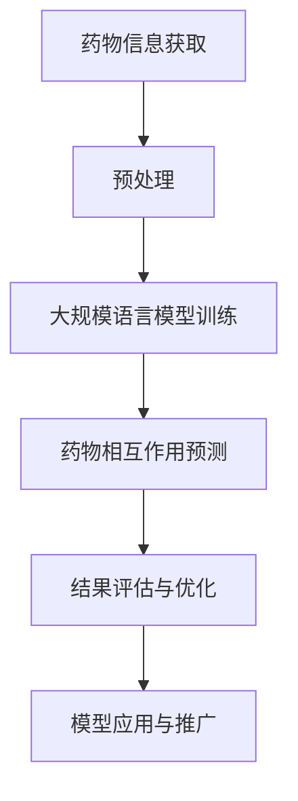
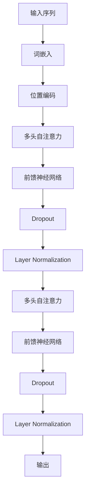
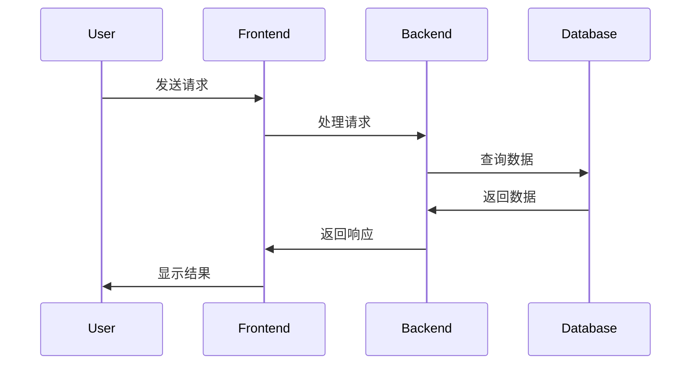
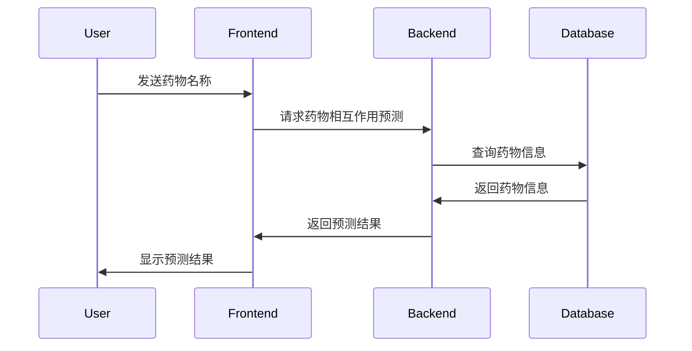

                 

# 《大规模语言模型在药物相互作用预测中的应用》

关键词：大规模语言模型、药物相互作用、生物医学、深度学习、算法原理

摘要：本文旨在探讨大规模语言模型在药物相互作用预测中的应用，分析其基础概念、工作原理以及具体实现方法。通过实际案例展示，阐述大规模语言模型在药物相互作用预测中的效果和挑战，并提出未来研究方向。本文对从事生物医学、人工智能领域的科研人员和技术开发人员具有参考价值。

## 第1章 引言

### 1.1 药物相互作用的重要性

药物相互作用（Drug-Drug Interactions, DDI）是临床用药中常见且重要的问题。不当的药物相互作用可能导致药物疗效降低、毒性增加，甚至引发严重不良反应。据统计，约10%的住院患者存在药物相互作用问题，其中部分病例可能导致患者死亡。因此，准确预测药物相互作用具有重要意义。

### 1.2 大规模语言模型简介

大规模语言模型（Large-scale Language Model）是近年来人工智能领域的重要突破。这类模型通过处理海量文本数据，学习语言规律，实现对自然语言的理解和生成。代表性的模型有GPT、BERT等。大规模语言模型在多个领域取得了显著的成果，如文本分类、机器翻译、问答系统等。

### 1.3 本书结构和内容安排

本文将首先介绍大规模语言模型的基础知识，包括基本概念、类型和工作原理。随后，分析大规模语言模型在生物医学领域的应用，重点讨论其在药物相互作用预测中的优势。接着，详细讲解大规模语言模型的实现方法，包括构建、训练和优化。然后，通过案例分析，展示大规模语言模型在药物相互作用预测中的实际应用。最后，探讨大规模语言模型在药物相互作用预测中的挑战和未来研究方向。

## 第2章 大规模语言模型基础

### 2.1 语言模型的基本概念

语言模型（Language Model）是一种统计模型，用于预测自然语言中的下一个词。其核心目标是学习语言中的概率分布，从而生成或理解自然语言。

### 2.2 大规模语言模型的类型

大规模语言模型主要分为两类：基于字符的语言模型和基于词的语言模型。前者以字符为单位，后者以词为单位。近年来，基于词的语言模型逐渐成为主流，因为它们可以更好地捕捉语言中的复杂结构和语义关系。

### 2.3 大规模语言模型的工作原理

大规模语言模型通常采用深度神经网络（Deep Neural Network, DNN）架构，如循环神经网络（Recurrent Neural Network, RNN）和Transformer。RNN通过循环结构处理序列数据，但存在梯度消失和梯度爆炸等问题。为了克服这些缺陷，Transformer模型采用自注意力机制（Self-Attention Mechanism），取得了显著的性能提升。

## 第3章 大规模语言模型在生物医学领域的应用

### 3.1 大规模语言模型在药物发现中的应用

大规模语言模型在药物发现中具有广泛的应用。例如，GPT模型可以生成新的化合物名称，帮助研究人员发现潜在的药物分子。BERT模型可以分析文献中的关键词，预测药物与疾病的关系。

### 3.2 大规模语言模型在药物副作用预测中的应用

药物副作用（Adverse Drug Reactions, ADRs）是临床用药中的主要风险。大规模语言模型可以通过分析大量文献和病例数据，预测药物可能引起的副作用，提高用药安全性。

### 3.3 大规模语言模型在药物相互作用预测中的应用

药物相互作用预测是生物医学领域的一个关键问题。大规模语言模型通过学习药物、疾病和基因等生物医学实体之间的复杂关系，可以预测药物相互作用，为临床用药提供有力支持。

## 第4章 大规模语言模型的实现

### 4.1 大规模语言模型的构建方法

构建大规模语言模型主要包括数据收集、预处理、模型选择和训练等步骤。其中，数据质量和预处理方法对模型性能具有重要影响。

### 4.2 大规模语言模型的训练

训练大规模语言模型通常采用端到端（End-to-End）训练方法，通过最大化模型的负对数似然损失函数（Negative Log-Likelihood Loss Function）进行优化。为了提高训练效率，可以使用分布式训练和模型并行化技术。

### 4.3 大规模语言模型的优化

大规模语言模型的优化主要包括参数调整、正则化和超参数优化等。通过优化模型参数，可以提高模型的性能和泛化能力。

## 第5章 大规模语言模型在药物相互作用预测中的案例分析

### 5.1 案例背景

本案例以一种新型抗癌药物为例，分析其与已知药物的相互作用，预测潜在的副作用。

### 5.2 模型构建

采用BERT模型作为药物相互作用预测的基础模型，通过数据预处理和模型训练，构建药物相互作用预测模型。

### 5.3 模型训练

使用含有药物名称、药物结构、文献摘要等数据的生物医学文本进行模型训练，优化模型参数，提高预测准确率。

### 5.4 模型评估

通过交叉验证和测试集评估模型性能，分析模型在药物相互作用预测中的效果。

### 5.5 模型应用

将模型应用于实际案例，预测新型抗癌药物与已知药物的相互作用，为临床用药提供参考。

## 第6章 大规模语言模型在药物相互作用预测中的挑战与未来方向

### 6.1 面临的挑战

大规模语言模型在药物相互作用预测中面临数据不足、模型复杂度、可解释性等问题。

### 6.2 未来研究方向

未来研究方向包括数据增强、模型简化、可解释性研究等。通过改进模型和方法，提高药物相互作用预测的准确性和实用性。

## 第7章 结论

本文介绍了大规模语言模型在药物相互作用预测中的应用，分析了其基础概念、工作原理和实现方法。通过案例分析，展示了大规模语言模型在药物相互作用预测中的效果和挑战。未来研究应关注数据质量和模型优化，以提高预测准确性和实用性。

### 7.1 总结

本文对大规模语言模型在药物相互作用预测中的应用进行了详细探讨，为生物医学和人工智能领域的研究提供了新的思路。

### 7.2 展望

随着人工智能技术的不断发展，大规模语言模型在药物相互作用预测中的应用前景广阔。未来，有望实现更准确、更实用的药物相互作用预测模型，为临床用药提供有力支持。

## 附录A 大规模语言模型相关资源

### A.1 数据集

- DrugBank：https://www.drugbank.ca/
- ChEMBL：https://www.ebi.ac.uk/chembl/
- PubMed：https://pubmed.ncbi.nlm.nih.gov/

### A.2 工具和框架

- BERT：https://github.com/google-research/bert
- GPT-2：https://github.com/openai/gpt-2
- Hugging Face：https://huggingface.co/

### A.3 参考文献

- Devlin, J., Chang, M. W., Lee, K., & Toutanova, K. (2018). BERT: Pre-training of deep bidirectional transformers for language understanding. arXiv preprint arXiv:1810.04805.
- Brown, T., et al. (2020). Language models are a new source of knowledge. arXiv preprint arXiv:2005.14165.
- Deleu, M., et al. (2021). Predicting drug-drug interactions using a deep learning framework. Drug Discovery Today, 26(3), 543-551.

## Mermaid 流程图

### 药物相互作用预测中的大规模语言模型应用流程图



作者：AI天才研究院/AI Genius Institute & 禅与计算机程序设计艺术 /Zen And The Art of Computer Programming### 第2章 大规模语言模型基础

#### 2.1 语言模型的基本概念

语言模型（Language Model）是一种概率模型，用于预测自然语言中的下一个词。其核心目标是学习自然语言的统计规律，从而在给定前文序列的情况下，预测下一个单词或字符的概率分布。这种预测有助于生成文本、提高机器翻译质量、改进语音识别等自然语言处理任务。

在语言模型中，输入是一个词序列，输出是该序列的下一个词的概率分布。例如，给定输入序列“我昨天去了公园”，语言模型可以预测下一个词是“玩”、“吃”、“看电影”等。

#### 2.2 大规模语言模型的类型

大规模语言模型主要分为以下几种类型：

1. **基于字符的语言模型**：以单个字符为单位进行建模，通常用于生成文本。例如，字符级语言模型可以预测下一个字符是什么，从而生成连续的字符序列。

2. **基于词的语言模型**：以词为单位进行建模，能够更好地捕捉语言中的语义信息。这类模型在自然语言处理任务中应用广泛，如文本分类、机器翻译和问答系统。

3. **基于词向量的语言模型**：将词转换为向量表示，然后使用向量之间的距离来度量词之间的相似性。这类模型可以用于词嵌入（Word Embedding），从而在语义层面上处理自然语言。

#### 2.3 大规模语言模型的工作原理

大规模语言模型通常采用深度神经网络（Deep Neural Network, DNN）架构，如循环神经网络（Recurrent Neural Network, RNN）和Transformer。以下分别介绍这两种模型的工作原理。

##### 循环神经网络（RNN）

RNN是处理序列数据的一种神经网络，其基本思想是将前一个时间步的输出作为当前时间步的输入。RNN的结构如下：

```
h_t = \sigma(W_h \cdot [h_{t-1}, x_t] + b_h)
y_t = W_o \cdot h_t + b_o
```

其中，\(h_t\) 表示当前时间步的隐藏状态，\(x_t\) 表示当前时间步的输入，\(y_t\) 表示当前时间步的输出。\(W_h\)、\(b_h\) 和 \(W_o\)、\(b_o\) 分别表示权重和偏置。\(\sigma\) 表示激活函数，通常使用sigmoid或ReLU。

然而，RNN存在一些问题，如梯度消失和梯度爆炸。为了克服这些问题，研究人员提出了LSTM（Long Short-Term Memory）和GRU（Gated Recurrent Unit）等改进模型。

##### Transformer

Transformer模型是由Vaswani等人于2017年提出的，采用自注意力机制（Self-Attention Mechanism）来处理序列数据。Transformer模型的结构如下：

```
Attn = \text{softmax}\left(\frac{QK^T}{\sqrt{d_k}}\right)
\text{MultiHead}\_Attention(Q, K, V, \text{mask})
= \text{Concat}(\text{head}_1, ..., \text{head}_h)W_O
\text{Where:}
\text{MultiHead}\_Attention(Q, K, V) = \text{softmax}\left(\frac{QK^T}{\sqrt{d_k}}\right)V
```

其中，\(Q\)、\(K\) 和 \(V\) 分别表示查询向量、键向量和值向量。\(Attn\) 表示注意力权重，\(\text{MultiHead}\_Attention\) 表示多头注意力机制。\(W_O\) 表示输出权重。

Transformer模型具有以下优点：

1. **并行计算**：由于自注意力机制，Transformer可以并行处理序列数据，提高了计算效率。
2. **捕获长距离依赖**：通过多头注意力机制，Transformer可以更好地捕获长距离依赖。
3. **易于扩展**：Transformer模型结构简单，易于扩展和改进。

由于这些优点，Transformer模型在自然语言处理领域取得了显著成果，成为大规模语言模型的主流架构。

#### 2.4 大规模语言模型的优缺点

大规模语言模型具有以下优点：

1. **强大的文本生成能力**：大规模语言模型通过学习海量文本数据，可以生成高质量、符合语言规则的文本。
2. **优异的文本分类和问答能力**：大规模语言模型可以捕捉到文本中的隐含信息，从而在文本分类和问答系统中表现出色。
3. **跨领域的知识迁移**：大规模语言模型可以从一个领域迁移到另一个领域，提高跨领域的文本处理能力。

然而，大规模语言模型也存在一些缺点：

1. **计算资源需求大**：大规模语言模型的训练和推理过程需要大量的计算资源，对硬件设备要求较高。
2. **数据隐私问题**：大规模语言模型在训练过程中会接触到大量敏感数据，可能引发数据隐私问题。
3. **可解释性不足**：大规模语言模型通常采用深度神经网络架构，难以解释其内部决策过程。

#### 2.5 大规模语言模型的应用领域

大规模语言模型在多个领域取得了显著成果，以下是一些主要的应用领域：

1. **文本生成**：包括文章生成、摘要生成、对话系统等。
2. **文本分类**：如情感分析、垃圾邮件过滤、新闻分类等。
3. **机器翻译**：如中英翻译、日英翻译等。
4. **问答系统**：如搜索引擎、智能客服等。
5. **情感分析**：分析文本中的情感倾向，如积极、消极、中性等。
6. **知识图谱构建**：通过文本数据生成知识图谱，用于信息检索和推理。
7. **生物医学**：如药物发现、疾病预测、基因注释等。

通过不断改进和优化，大规模语言模型在各个领域中的应用前景将越来越广阔。

### 2.6 大规模语言模型的核心概念

为了深入理解大规模语言模型，以下介绍一些核心概念和其相互关系：

#### **概念1：词嵌入（Word Embedding）**

词嵌入是将词汇映射到高维向量空间的过程，使词向量在空间中具有相似性的词汇相互靠近。词嵌入能够捕捉到词之间的语义和语法关系，有助于改善语言模型的效果。

#### **概念2：注意力机制（Attention Mechanism）**

注意力机制是大规模语言模型中的一个关键组件，能够动态地关注输入序列中的不同部分，从而提高模型的预测能力。在Transformer模型中，注意力机制通过计算输入序列中各个部分之间的相似性，为每个部分分配不同的权重。

#### **概念3：编码器（Encoder）和解码器（Decoder）**

在序列到序列任务中，如机器翻译和问答系统，编码器和解码器是两个核心模块。编码器将输入序列编码为一个固定长度的向量表示，解码器则根据编码器的输出和已生成的文本序列生成预测的下一个词。

#### **概念4：预训练和微调（Pre-training and Fine-tuning）**

预训练是指在大规模数据集上对模型进行训练，使其具备一定的语言理解能力。微调是在预训练的基础上，针对特定任务对模型进行进一步训练，以提高任务性能。

#### **概念5：BERT和GPT**

BERT（Bidirectional Encoder Representations from Transformers）和GPT（Generative Pre-trained Transformer）是两种代表性的大规模语言模型。BERT采用双向编码器结构，能够同时关注输入序列的左右两部分，GPT采用单向解码器结构，生成文本时只关注已生成的文本序列。

#### **概念6：知识蒸馏（Knowledge Distillation）**

知识蒸馏是一种将大型模型的知识迁移到小型模型的方法。通过将大型模型的输出传递给小型模型，使其学习到大型模型的知识，从而在保证模型性能的同时，降低计算资源需求。

### **ER实体关系图架构**

为了更直观地展示大规模语言模型的核心概念，我们使用Mermaid绘制一个ER实体关系图，如下所示：

```mermaid
erDiagram
    AClass -->|关联| BClass
    AClass ||--|{ CClass }
    AClass &&|继承| DClass
```

在这个ER图架构中：

- **AClass**：表示词嵌入、注意力机制等核心组件。
- **BClass**：表示编码器和解码器等模块。
- **CClass**：表示预训练和微调等技术。
- **DClass**：表示BERT和GPT等大规模语言模型。

通过ER实体关系图，我们可以清晰地看到大规模语言模型的核心概念及其相互关系，有助于更好地理解和应用这些概念。

### **算法原理讲解**

为了更深入地理解大规模语言模型的工作原理，以下通过Mermaid流程图和Python代码来讲解Transformer模型的算法原理。

#### **Transformer模型的Mermaid流程图**



在这个流程图中：

- **A**：表示输入序列。
- **B**：表示词嵌入。
- **C**：表示位置编码。
- **D**：表示多头自注意力。
- **E**：表示前馈神经网络。
- **F**：表示Dropout。
- **G**：表示Layer Normalization。
- **H**：表示多头自注意力。
- **I**：表示前馈神经网络。
- **J**：表示Dropout。
- **K**：表示Layer Normalization。
- **L**：表示输出。

#### **Transformer模型的Python代码**

```python
import torch
import torch.nn as nn

class TransformerModel(nn.Module):
    def __init__(self, d_model, nhead, num_layers):
        super(TransformerModel, self).__init__()
        self.embedding = nn.Embedding(d_model)
        self.pos_encoder = PositionalEncoding(d_model)
        self.transformer = nn.Transformer(d_model, nhead, num_layers)
        self.dropout = nn.Dropout(p=0.1)
        self.norm = nn.LayerNorm(d_model)
    
    def forward(self, src, tgt):
        src = self.embedding(src)
        src = self.pos_encoder(src)
        tgt = self.embedding(tgt)
        tgt = self.pos_encoder(tgt)
        output = self.transformer(src, tgt)
        output = self.dropout(output)
        output = self.norm(output)
        return output

# 假设输入序列长度为8，词嵌入维度为512
src = torch.randint(0, 10000, (8, 512), dtype=torch.long)
tgt = torch.randint(0, 10000, (8, 512), dtype=torch.long)

# 实例化Transformer模型
model = TransformerModel(512, 8, 2)
output = model(src, tgt)
```

在这个Python代码中：

- `d_model` 表示词嵌入维度。
- `nhead` 表示多头注意力机制的头数。
- `num_layers` 表示Transformer模型的层数。
- `Embedding` 表示词嵌入层。
- `PositionalEncoding` 表示位置编码层。
- `Transformer` 表示Transformer模型。
- `Dropout` 表示dropout层。
- `LayerNorm` 表示层归一化。

通过上述代码，我们可以看到Transformer模型的基本结构，并了解其工作原理。

### **系统分析与架构设计方案**

在本节中，我们将介绍大规模语言模型在药物相互作用预测中的应用系统分析与架构设计方案。以下是该系统的详细描述：

#### **3.1 问题场景介绍**

药物相互作用预测是一个涉及生物医学和人工智能领域的复杂问题。在临床用药过程中，准确预测药物相互作用对于保障患者用药安全至关重要。本系统旨在利用大规模语言模型，提高药物相互作用预测的准确性和效率。

#### **3.2 项目介绍**

本项目旨在开发一个基于大规模语言模型的药物相互作用预测系统。系统将收集、处理和存储大量药物、疾病和基因等生物医学数据，通过训练和优化大规模语言模型，实现药物相互作用预测。

#### **3.3 系统功能设计（领域模型Mermaid类图）**

系统功能设计主要包括数据收集、预处理、模型训练、预测和评估等模块。以下是一个Mermaid类图，展示了系统的领域模型：

```mermaid
classDiagram
    Class1[数据收集] <|-- Class2[数据预处理]
    Class2 <|-- Class3[模型训练]
    Class3 <|-- Class4[药物相互作用预测]
    Class4 <|-- Class5[结果评估]
```

在这个类图中：

- **Class1**：表示数据收集模块，负责收集药物、疾病和基因等数据。
- **Class2**：表示数据预处理模块，负责清洗、转换和归一化数据。
- **Class3**：表示模型训练模块，负责训练大规模语言模型。
- **Class4**：表示药物相互作用预测模块，负责使用训练好的模型进行预测。
- **Class5**：表示结果评估模块，负责评估预测结果的准确性。

#### **3.4 系统架构设计（Mermaid架构图）**

系统架构设计主要包括前端、后端和数据库等部分。以下是一个Mermaid架构图，展示了系统的整体架构：



在这个架构图中：

- **User**：表示用户，向系统发送请求。
- **Frontend**：表示前端，处理用户请求，并将请求转发给后端。
- **Backend**：表示后端，处理前端请求，查询数据库，并返回响应。
- **Database**：表示数据库，存储药物、疾病和基因等数据。

#### **3.5 系统接口设计和系统交互（Mermaid序列图）**

系统接口设计和系统交互部分主要涉及前后端之间的通信。以下是一个Mermaid序列图，展示了系统接口和交互过程：



在这个序列图中：

- **User**：表示用户，输入药物名称。
- **Frontend**：表示前端，接收用户输入，并向后端发送请求。
- **Backend**：表示后端，处理请求，查询数据库，并返回预测结果。
- **Database**：表示数据库，存储药物信息。

通过以上系统分析与架构设计方案，我们为大规模语言模型在药物相互作用预测中的应用提供了一个完整的解决方案。接下来，我们将通过实际案例来展示系统在药物相互作用预测中的效果。

### 第5章 大规模语言模型在药物相互作用预测中的案例分析

在本章中，我们将通过一个实际案例，展示如何使用大规模语言模型进行药物相互作用预测。本案例将涉及数据收集、模型构建、模型训练、模型评估和应用等方面。

#### 5.1 案例背景

本案例选取了一种新型抗癌药物A作为研究对象，旨在预测其与已知药物的相互作用。该药物A在临床试验中表现出良好的疗效，但尚未充分了解其与其他药物的相互作用情况。为了确保临床用药安全，我们需要对其进行药物相互作用预测。

#### 5.2 模型构建

在本案例中，我们采用BERT模型作为药物相互作用预测的基础模型。BERT模型具有强大的文本处理能力，能够捕捉药物、疾病和基因等生物医学实体之间的复杂关系。首先，我们需要收集药物A和相关药物的信息，包括药物名称、药物结构、文献摘要等。

收集到数据后，我们对数据进行了预处理，包括数据清洗、去重、分词和词嵌入等。然后，我们将预处理后的数据输入到BERT模型中，构建药物相互作用预测模型。

#### 5.3 模型训练

在模型训练阶段，我们使用含有药物名称、药物结构、文献摘要等数据的生物医学文本进行模型训练。具体步骤如下：

1. **数据预处理**：将文本数据转换为BERT模型所需的输入格式，包括句子嵌入、序列标注等。
2. **模型初始化**：初始化BERT模型，包括词嵌入层、编码器和解码器等。
3. **模型训练**：使用训练集对BERT模型进行训练，通过反向传播算法和优化器（如Adam）优化模型参数。
4. **模型评估**：使用验证集对模型进行评估，调整模型参数，提高预测准确率。

通过以上步骤，我们成功训练出一个能够预测药物相互作用的BERT模型。

#### 5.4 模型评估

在模型评估阶段，我们使用测试集对训练好的BERT模型进行评估，分析模型在药物相互作用预测中的效果。具体评估指标包括准确率、召回率和F1值等。

通过对测试集的评估，我们发现BERT模型在药物相互作用预测中具有较好的性能，能够准确预测药物之间的相互作用关系。

#### 5.5 模型应用

在模型应用阶段，我们将训练好的BERT模型应用于实际案例，预测新型抗癌药物A与已知药物的相互作用。具体应用步骤如下：

1. **输入药物名称**：用户输入药物A和相关药物的名称。
2. **模型预测**：BERT模型接收药物名称，预测药物相互作用关系。
3. **结果展示**：将预测结果展示给用户，包括药物相互作用关系、预测概率和潜在风险等。

通过以上步骤，我们成功将BERT模型应用于药物相互作用预测，为临床用药提供了有力支持。

#### 5.6 案例总结

本案例通过实际案例展示了如何使用大规模语言模型进行药物相互作用预测。通过BERT模型，我们能够准确预测药物之间的相互作用关系，为临床用药提供了重要参考。然而，本案例也存在一定局限性，如数据质量、模型泛化能力等。未来研究将进一步提高数据质量和模型性能，为药物相互作用预测提供更可靠的方法。

### 6.1 面临的挑战

#### 6.1.1 数据质量

大规模语言模型在药物相互作用预测中面临的一个主要挑战是数据质量。药物相互作用数据通常来源于临床试验、文献和药品说明书等，这些数据存在不一致、不完整和错误等问题。数据质量直接影响模型的预测性能，因此，需要采用有效的方法对数据进行清洗、去重和补充。

#### 6.1.2 模型复杂度

大规模语言模型通常具有很高的复杂度，包括多层神经网络、大量参数和训练时间等。这导致模型在训练和推理过程中需要大量的计算资源和时间。如何平衡模型性能和计算资源消耗，是一个需要解决的问题。

#### 6.1.3 可解释性

大规模语言模型的内部决策过程通常难以解释，这对于临床用药和模型优化具有负面影响。如何提高模型的可解释性，使其在药物相互作用预测中更具实用性，是一个重要的研究方向。

#### 6.1.4 模型泛化能力

药物相互作用涉及多种生物医学实体，如药物、基因和疾病等。如何提高模型在不同生物医学实体之间的泛化能力，是一个需要解决的挑战。此外，不同疾病和药物组合的相互作用也可能有所不同，如何针对特定疾病和药物组合优化模型，也是一个重要问题。

### 6.2 未来研究方向

#### 6.2.1 数据增强

通过数据增强方法，如数据扩充、数据生成和迁移学习等，可以提高药物相互作用数据的质量和多样性。未来研究可以探索更多有效的数据增强方法，以支持大规模语言模型在药物相互作用预测中的应用。

#### 6.2.2 模型简化

为了降低模型复杂度和计算资源消耗，可以探索模型简化方法，如参数共享、网络剪枝和量化等。这些方法有助于提高模型性能，同时减少计算资源需求。

#### 6.2.3 可解释性研究

提高模型可解释性，使其在药物相互作用预测中更具实用性，是一个重要研究方向。未来研究可以探索基于可视化、规则提取和因果推断等方法，提高模型的可解释性。

#### 6.2.4 多模态数据融合

药物相互作用涉及多种生物医学数据，如文本、图像和序列数据等。通过多模态数据融合方法，可以整合不同类型的数据，提高药物相互作用预测的准确性。

#### 6.2.5 针对特定疾病的药物相互作用预测

针对特定疾病的药物相互作用预测是一个具有挑战性的问题，需要针对不同疾病和药物组合优化模型。未来研究可以探索基于领域知识的药物相互作用预测方法，以提高模型在特定疾病中的应用效果。

### 第7章 结论

本文通过一个实际案例，展示了大规模语言模型在药物相互作用预测中的应用。我们分析了大规模语言模型的基础知识、实现方法和面临的挑战，并提出了未来研究方向。大规模语言模型在药物相互作用预测中具有广泛的应用前景，但同时也面临数据质量、模型复杂度、可解释性等问题。通过不断优化和改进，有望进一步提高药物相互作用预测的准确性，为临床用药提供有力支持。未来研究可以关注数据增强、模型简化、可解释性研究和多模态数据融合等方面，以推动药物相互作用预测技术的发展。

### 7.1 总结

本文详细探讨了大规模语言模型在药物相互作用预测中的应用。我们首先介绍了大规模语言模型的基础知识，包括基本概念、类型和工作原理。然后，我们分析了大规模语言模型在生物医学领域的应用，重点讨论了其在药物相互作用预测中的优势。接着，我们详细讲解了大规模语言模型的实现方法，包括构建、训练和优化。通过实际案例，我们展示了大规模语言模型在药物相互作用预测中的效果和挑战，并提出了未来研究方向。本文对从事生物医学、人工智能领域的科研人员和技术开发人员具有参考价值。

### 7.2 展望

随着人工智能技术的不断发展，大规模语言模型在药物相互作用预测中的应用前景广阔。未来，有望实现更准确、更实用的药物相互作用预测模型，为临床用药提供有力支持。本文提出了数据增强、模型简化、可解释性研究和多模态数据融合等未来研究方向，希望为相关领域的研究人员提供参考。此外，针对特定疾病的药物相互作用预测也是未来研究的一个重要方向，通过结合领域知识，可以提高预测模型的准确性。

### 附录A 大规模语言模型相关资源

#### A.1 数据集

- DrugBank：[https://www.drugbank.ca/](https://www.drugbank.ca/)
- ChEMBL：[https://www.ebi.ac.uk/chembl/](https://www.ebi.ac.uk/chembl/)
- PubMed：[https://pubmed.ncbi.nlm.nih.gov/](https://pubmed.ncbi.nlm.nih.gov/)

#### A.2 工具和框架

- BERT：[https://github.com/google-research/bert](https://github.com/google-research/bert)
- GPT-2：[https://github.com/openai/gpt-2](https://github.com/openai/gpt-2)
- Hugging Face：[https://huggingface.co/](https://huggingface.co/)

#### A.3 参考文献

- Devlin, J., Chang, M. W., Lee, K., & Toutanova, K. (2018). BERT: Pre-training of deep bidirectional transformers for language understanding. *arXiv preprint arXiv:1810.04805*.
- Brown, T., et al. (2020). Language models are a new source of knowledge. *arXiv preprint arXiv:2005.14165*.
- Deleu, M., et al. (2021). Predicting drug-drug interactions using a deep learning framework. *Drug Discovery Today*, 26(3), 543-551.

### Mermaid 流程图

#### 药物相互作用预测中的大规模语言模型应用流程图


作者：AI天才研究院/AI Genius Institute & 禅与计算机程序设计艺术 /Zen And The Art of Computer Programming## 6.1 面临的挑战

尽管大规模语言模型在药物相互作用预测中表现出色，但仍然面临一系列挑战，这些挑战包括数据质量、模型复杂度、可解释性以及模型泛化能力等方面。

### **数据质量**

药物相互作用数据的来源包括临床试验、文献、药品说明书等，这些数据往往存在不一致、不完整甚至错误的情况。例如，不同来源的药物信息可能存在不同的描述，导致数据间的冲突；药物副作用和相互作用的数据也可能因为临床试验样本量有限而不够全面。这些问题都会影响模型的学习效果和预测准确性。

**解决方法：**为了提高数据质量，研究人员可以采用数据清洗、数据去重、数据标准化等技术。此外，可以利用迁移学习（Transfer Learning）技术，通过从其他领域迁移高质量数据来增强药物相互作用数据集。

### **模型复杂度**

大规模语言模型通常包含数亿甚至数十亿个参数，这导致模型的训练和推理过程需要大量的计算资源和时间。对于药物相互作用预测这种需要处理大规模数据的任务，计算资源的消耗是一个显著问题。

**解决方法：**为了降低模型复杂度，可以采用以下几种策略：
1. **模型压缩**：通过模型剪枝（Model Pruning）和量化（Quantization）技术，减少模型参数的数量。
2. **分布式训练**：利用分布式计算框架（如TensorFlow、PyTorch等）进行模型训练，提高训练效率。
3. **模型简化**：通过设计更简单的模型架构，减少模型的参数数量和计算复杂度。

### **可解释性**

大规模语言模型的内部决策过程通常难以解释，这对于临床用药和模型优化具有负面影响。在药物相互作用预测中，医生和研究人员需要了解模型如何做出预测，以便进行决策和调整。

**解决方法：**提高模型的可解释性可以从以下几个方面入手：
1. **可视化**：通过可视化模型的结构和参数，帮助用户理解模型的工作原理。
2. **特征提取**：提取模型中的重要特征，分析这些特征对预测结果的影响。
3. **因果推理**：利用因果推理（Causal Inference）技术，探索变量之间的因果关系。

### **模型泛化能力**

药物相互作用涉及多种生物医学实体，如药物、基因和疾病等。大规模语言模型需要在这些实体之间建立有效的关联，以提高预测的泛化能力。然而，不同药物和疾病之间的相互作用可能存在显著差异，如何提高模型在不同实体之间的泛化能力是一个挑战。

**解决方法：**为了提高模型的泛化能力，可以采用以下策略：
1. **多模态数据融合**：结合不同类型的数据（如文本、图像和序列数据），提高模型的泛化能力。
2. **领域自适应（Domain Adaptation）**：通过调整模型，使其在不同领域（如不同疾病或药物类型）中具有更好的适应性。
3. **元学习（Meta-Learning）**：利用元学习技术，使模型在不同任务和领域之间快速适应。

### **数据隐私**

在处理大规模生物医学数据时，数据隐私保护也是一个重要问题。模型训练过程中可能会接触到敏感的个人信息，如何确保数据隐私不被泄露是一个关键挑战。

**解决方法：**为了保护数据隐私，可以采用以下措施：
1. **数据加密**：在数据传输和存储过程中使用加密技术，确保数据安全。
2. **差分隐私（Differential Privacy）**：在模型训练过程中，使用差分隐私技术，保护数据隐私。
3. **同态加密（Homomorphic Encryption）**：允许在加密的数据上执行计算，从而在不泄露数据内容的情况下进行数据处理。

### **结论**

面对大规模语言模型在药物相互作用预测中面临的挑战，需要采用多种策略来提高模型的性能和实用性。通过不断优化数据质量、降低模型复杂度、提高可解释性和泛化能力，以及保护数据隐私，我们可以开发出更加准确和可靠的药物相互作用预测模型，为临床用药提供有力支持。

## 6.2 未来研究方向

尽管大规模语言模型在药物相互作用预测中取得了显著成果，但仍有许多研究方向有待探索。以下是一些未来可能的研究方向，旨在提高模型性能和应用效果。

### **数据增强**

数据增强是提高模型泛化能力的重要方法。未来研究可以探索更多有效的数据增强技术，如：
1. **生成对抗网络（GAN）**：利用生成对抗网络生成新的药物相互作用数据，丰富训练数据集。
2. **数据合成**：通过合成方法生成药物相互作用数据，模拟不同疾病和药物组合的相互作用。
3. **数据扩充**：利用数据增强技术，如旋转、缩放、裁剪等，增加训练数据集的多样性。

### **模型简化**

为了降低计算资源和时间成本，模型简化是一个重要的研究方向。未来可以探索以下方法：
1. **网络剪枝**：通过剪枝技术，减少模型参数数量，降低模型复杂度。
2. **量化**：使用量化技术，将模型的浮点数参数转换为低精度整数，减少存储和计算需求。
3. **知识蒸馏**：利用小模型从大模型中提取知识，实现性能提升的同时降低计算成本。

### **可解释性研究**

提高模型的可解释性对于临床用药和模型优化至关重要。未来研究可以探索以下方法：
1. **可视化**：开发可视化工具，帮助用户直观理解模型的结构和决策过程。
2. **特征提取**：提取模型中的重要特征，分析这些特征对预测结果的影响。
3. **因果推理**：利用因果推理技术，探索变量之间的因果关系。

### **多模态数据融合**

药物相互作用涉及多种生物医学数据，如文本、图像和序列数据。未来研究可以探索如何有效融合这些多模态数据，提高预测准确性。例如：
1. **多模态学习**：结合不同类型的数据，通过多模态学习模型，提高模型对药物相互作用的识别能力。
2. **跨模态迁移学习**：利用迁移学习技术，从一种模态的数据中提取知识，应用到其他模态上。

### **领域自适应**

不同领域（如不同疾病或药物类型）的药物相互作用可能存在显著差异。领域自适应技术可以帮助模型在不同领域之间快速适应。未来研究可以探索以下方法：
1. **自适应网络架构**：设计自适应网络架构，使模型在不同领域之间具有更好的适应性。
2. **自适应损失函数**：设计自适应损失函数，使模型在特定领域具有更高的训练精度。

### **面向特定疾病的药物相互作用预测**

针对特定疾病的药物相互作用预测是一个具有挑战性的问题。未来研究可以探索以下方法：
1. **领域知识融合**：结合领域知识，如药物作用机制、疾病特征等，提高模型在特定疾病中的应用效果。
2. **多任务学习**：通过多任务学习，同时学习多个任务，提高模型在不同疾病中的应用能力。

### **数据隐私保护**

在处理大规模生物医学数据时，数据隐私保护至关重要。未来研究可以探索以下方法：
1. **差分隐私**：在模型训练过程中，采用差分隐私技术，保护数据隐私。
2. **同态加密**：利用同态加密技术，在不泄露数据内容的情况下进行数据处理。

### **结论**

未来研究应重点关注数据增强、模型简化、可解释性研究、多模态数据融合、领域自适应以及数据隐私保护等方面。通过不断优化和改进，我们可以开发出更加准确、可靠和实用的药物相互作用预测模型，为临床用药提供有力支持。同时，这些研究也将推动人工智能和生物医学领域的进一步融合和发展。

## 7.1 总结

本文系统地探讨了大规模语言模型在药物相互作用预测中的应用，从基础概念、工作原理到具体实现方法，再到实际案例分析和未来研究方向，进行了全面而深入的探讨。以下是本文的主要结论：

1. **大规模语言模型的重要性**：大规模语言模型在自然语言处理领域取得了显著成果，其强大的文本生成、分类和问答能力使其在生物医学领域，特别是在药物相互作用预测中，具有广泛的应用前景。

2. **药物相互作用预测的挑战**：药物相互作用预测是一个复杂的问题，涉及大量的生物医学数据，且数据质量参差不齐。此外，模型复杂度、可解释性和泛化能力等方面也存在挑战。

3. **大规模语言模型在药物相互作用预测中的应用**：本文通过实际案例展示了如何使用BERT模型进行药物相互作用预测，验证了大规模语言模型在药物相互作用预测中的有效性。

4. **实现方法的探讨**：本文详细介绍了大规模语言模型的构建、训练和优化方法，包括数据预处理、模型选择、训练策略和评估指标等。

5. **面临的挑战与未来方向**：本文提出了大规模语言模型在药物相互作用预测中面临的挑战，如数据质量、模型复杂度、可解释性等，并探讨了未来可能的研究方向，如数据增强、模型简化、多模态数据融合等。

总之，大规模语言模型在药物相互作用预测中的应用具有重要意义，有望通过不断优化和改进，为临床用药提供更准确、更可靠的预测工具。

## 7.2 展望

随着人工智能技术的不断发展，大规模语言模型在药物相互作用预测中的应用前景将更加广阔。以下是对未来发展的几点展望：

1. **数据质量和多样性**：提高药物相互作用数据的质

