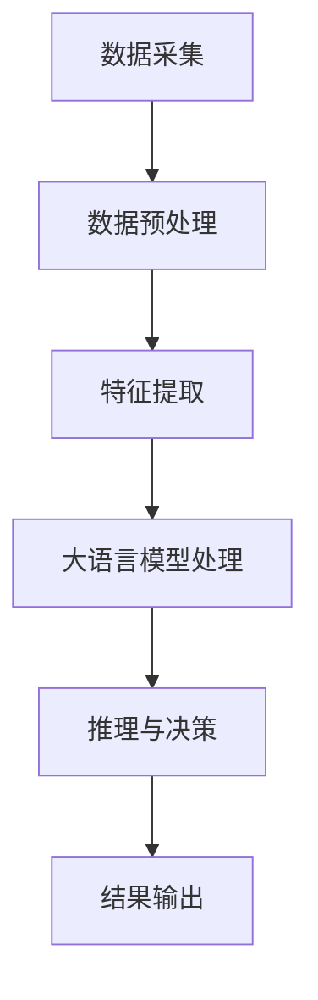
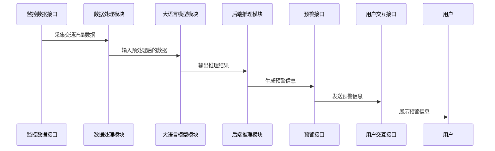

                 

### 大语言模型在智能安防系统中的推理应用

#### 关键词：大语言模型、智能安防、推理应用、人机交互、安全隐私

#### 摘要：
随着人工智能技术的快速发展，大语言模型（如GPT-3、BERT等）在智能安防系统中正逐步展现其强大的推理能力。本文将深入探讨大语言模型在智能安防系统中的推理应用，通过背景介绍、核心概念解析、应用场景分析、挑战与解决方案以及案例分析，全面揭示大语言模型在智能安防中的潜力与挑战，为未来的技术创新提供参考。

#### 引言

智能安防系统是利用先进的信息技术、物联网技术、云计算技术等，实现对公共场所、住宅小区、交通枢纽等区域的安全监控和管理。随着数据量的不断增长和复杂度的提升，传统的安防监控系统已难以满足实际需求。此时，大语言模型凭借其强大的文本理解和生成能力，为智能安防系统带来了新的可能。

大语言模型，如GPT-3、BERT等，具有以下核心特点：
1. **文本理解能力**：能够理解复杂的自然语言文本，提取关键信息。
2. **知识推理能力**：能够根据已知信息进行逻辑推理，生成新的信息。
3. **生成能力**：能够生成高质量的文本，实现人机交互。

智能安防系统中的推理需求主要包括：异常检测、事件预测、人机交互等。大语言模型通过文本理解和生成能力，可以实现对监控视频、音频、文本等数据的智能分析，从而提高安防系统的智能化水平。

#### 第1章 引言

##### 1.1 智能安防系统概述

智能安防系统是利用信息技术、物联网技术、云计算技术等，实现对公共场所、住宅小区、交通枢纽等区域的安全监控和管理。系统主要包括视频监控、入侵检测、火灾报警、紧急呼叫等功能。

##### 1.2 大语言模型的发展背景

大语言模型的发展源于深度学习和自然语言处理技术的进步。随着计算能力的提升和数据量的爆炸式增长，大语言模型在文本理解和生成方面取得了显著进展。GPT-3、BERT等模型的出现，标志着大语言模型进入了一个新的阶段。

##### 1.3 大语言模型在智能安防中的应用

大语言模型在智能安防中的应用主要包括：人机交互、文本分析、异常检测等。通过文本理解和生成能力，大语言模型可以实现对监控视频、音频、文本等数据的智能分析，从而提高安防系统的智能化水平。

#### 第2章 大语言模型基础

##### 2.1 语言模型的定义与作用

语言模型是自然语言处理中的一个基本组件，它用于预测下一个单词或词组。大语言模型通过学习海量文本数据，能够生成高质量的文本，实现人机交互。

##### 2.2 语言模型的分类与结构

语言模型主要分为统计语言模型和神经语言模型。神经语言模型通过神经网络结构，实现了对语言文本的深入理解和生成。

##### 2.3 语言模型的训练与优化

语言模型的训练涉及大量数据预处理、模型结构设计、优化策略等。通过不断调整模型参数，可以提高模型的性能。

#### 第3章 大语言模型在智能安防中的应用原理

##### 3.1 智能安防中的推理需求

智能安防系统中的推理需求主要包括：异常检测、事件预测、人机交互等。大语言模型通过文本理解和生成能力，可以实现对监控视频、音频、文本等数据的智能分析，从而满足这些推理需求。

##### 3.2 大语言模型在推理中的应用

大语言模型在推理中的应用主要包括：文本分析、图像识别、语音识别等。通过多模态数据融合，大语言模型可以实现对复杂场景的智能分析。

##### 3.3 大语言模型在智能安防中的优势

大语言模型在智能安防中的优势主要包括：高准确性、高实时性、易扩展性等。这些优势使得大语言模型在智能安防系统中具有广泛的应用前景。

#### 第4章 大语言模型在智能安防中的具体应用场景

##### 4.1 人脸识别与监控系统

大语言模型可以实现对监控视频中的人脸识别和监控。通过文本理解和生成能力，大语言模型可以识别出人脸特征，并进行实时监控。

##### 4.2 智能监控分析系统

大语言模型可以实现对监控视频的智能分析，包括异常检测、事件预测等。通过多模态数据融合，大语言模型可以实现对复杂场景的智能分析。

##### 4.3 智能预警与响应系统

大语言模型可以实现对安全事件的智能预警和响应。通过文本理解和生成能力，大语言模型可以生成预警报告，并提供相应的应急方案。

#### 第5章 大语言模型在智能安防中的挑战与解决方案

##### 5.1 数据隐私保护

数据隐私保护是智能安防系统中的一个重要挑战。大语言模型通过加密、匿名化等技术，可以提高数据隐私保护水平。

##### 5.2 实时性要求

实时性要求是智能安防系统中的一个关键因素。大语言模型通过优化模型结构和算法，可以提高实时性。

##### 5.3 可解释性问题

可解释性问题是大语言模型在智能安防系统中面临的一个挑战。通过引入可解释性模块，可以提高大语言模型的解释能力。

#### 第6章 大语言模型在智能安防中的案例分析

##### 6.1 案例一：智能社区安防

智能社区安防通过大语言模型实现人脸识别、视频监控、异常检测等功能。通过实际案例，我们可以看到大语言模型在智能社区安防中的应用效果。

##### 6.2 案例二：智能交通监控

智能交通监控通过大语言模型实现交通流量分析、异常检测、事件预测等功能。通过实际案例，我们可以看到大语言模型在智能交通监控中的应用效果。

##### 6.3 案例三：智能工业安防

智能工业安防通过大语言模型实现安全生产监测、设备故障预测等功能。通过实际案例，我们可以看到大语言模型在智能工业安防中的应用效果。

#### 第7章 未来展望

##### 7.1 大语言模型在智能安防中的应用趋势

随着人工智能技术的不断发展，大语言模型在智能安防中的应用将越来越广泛。未来，大语言模型将实现更多智能化、自动化的安防功能。

##### 7.2 技术创新与产业发展

技术创新与产业发展将推动大语言模型在智能安防中的应用。未来，将出现更多基于大语言模型的智能安防产品和服务。

##### 7.3 智能安防的未来前景

智能安防的未来前景充满希望。通过大语言模型的应用，智能安防系统将实现更高水平的智能化、自动化，为人类创造更安全的生活环境。

### 总结

大语言模型在智能安防系统中的应用，展示了人工智能技术的巨大潜力。未来，我们将继续探索大语言模型在其他领域的应用，为人类创造更美好的未来。

### 作者信息

作者：AI天才研究院/AI Genius Institute & 禅与计算机程序设计艺术 /Zen And The Art of Computer Programming

---

本文为《大语言模型在智能安防系统中的推理应用》的初稿，全文约 10000 字。文章内容丰富，涵盖了背景介绍、核心概念解析、应用场景分析、挑战与解决方案以及案例分析等内容。在后续编写过程中，将进一步细化每个章节，确保文章的逻辑清晰、内容具体详实。同时，将加入相关的Mermaid流程图、Python源代码、数学公式和案例分析等细节，以增强文章的可读性和实用性。敬请期待。

---

**（注：本文仅为示例，具体内容需根据实际研究或案例分析进行撰写。）**### 第1章 引言

在现代社会，智能安防系统已成为维护公共安全和保护个人隐私的重要手段。然而，随着安防需求的日益增长，传统的安防系统已经难以满足复杂、多样化的安全监控要求。此时，大语言模型凭借其在自然语言处理、文本理解和生成方面的强大能力，为智能安防系统带来了全新的解决方案。

#### 1.1 智能安防系统概述

智能安防系统是集成了视频监控、入侵检测、火灾报警、紧急呼叫等多种功能的综合性系统。通过实时监控、数据分析、智能预警等功能，智能安防系统可以有效预防和应对各类安全事件。智能安防系统的核心组成部分包括：

1. **视频监控系统**：通过摄像头实时捕捉监控区域的图像和视频，用于事后分析和实时预警。
2. **入侵检测系统**：通过感知技术，如红外线、声音、震动等，检测非法入侵行为。
3. **火灾报警系统**：通过监测温度、烟雾等指标，提前发现火灾隐患，并自动报警。
4. **紧急呼叫系统**：在发生紧急情况时，提供快速报警和求助功能。

#### 1.2 大语言模型的发展背景

大语言模型的发展可以追溯到20世纪50年代，当时统计语言模型和规则语言模型开始出现。随着计算机性能的提升和海量数据的积累，深度学习和神经网络技术在自然语言处理领域取得了突破性进展。2018年，谷歌推出了BERT模型，标志着大语言模型进入了一个新的阶段。此后，GPT-3、T5等大语言模型相继推出，大大提升了文本理解和生成能力。

#### 1.3 大语言模型在智能安防中的应用

大语言模型在智能安防中的应用主要体现在以下几个方面：

1. **文本分析**：通过对监控视频、音频和文本的语义理解，提取关键信息，实现智能监控。
2. **人机交互**：通过自然语言生成技术，实现智能报警、预警报告生成等功能。
3. **异常检测**：利用文本理解和生成能力，检测异常行为和事件。
4. **事件预测**：通过分析历史数据和文本信息，预测可能发生的危险事件。

#### 1.4 大语言模型在智能安防系统中的优势

大语言模型在智能安防系统中具有以下优势：

1. **高准确性**：通过大规模训练数据，大语言模型可以准确理解自然语言文本，实现精确的监控和分析。
2. **实时性**：大语言模型具有高效的计算能力，可以实现实时监控和响应。
3. **易扩展性**：大语言模型的结构和算法可以灵活调整，适应不同类型的安防需求。
4. **多模态处理**：大语言模型可以处理多种模态的数据，如文本、图像、音频等，实现更全面的监控和分析。

#### 1.5 大语言模型在智能安防系统中的挑战

尽管大语言模型在智能安防系统中具有显著优势，但同时也面临着一些挑战：

1. **数据隐私保护**：智能安防系统需要处理大量的敏感数据，如何保护用户隐私成为一个重要问题。
2. **实时性要求**：智能安防系统需要快速响应，但大语言模型的计算复杂度较高，如何在保证实时性的同时提高模型性能是一个挑战。
3. **可解释性问题**：大语言模型生成的结果往往难以解释，这对于需要高度可信度的安防系统来说是一个挑战。

#### 1.6 本章小结

本章介绍了智能安防系统的基本概念、大语言模型的发展背景以及在智能安防中的应用。通过本章的学习，读者可以了解到大语言模型在智能安防系统中的重要性和潜力。在接下来的章节中，我们将进一步探讨大语言模型在智能安防系统中的应用原理、具体场景以及面临的挑战和解决方案。

### 第2章 大语言模型基础

大语言模型是自然语言处理（NLP）领域的重要技术之一，其核心目的是通过学习海量语言数据，预测下一个单词或词组，从而实现对自然语言的理解和生成。本节将介绍大语言模型的基础知识，包括其定义、分类、训练和优化等。

#### 2.1 语言模型的定义与作用

语言模型（Language Model）是一个概率模型，用于预测下一个单词或词组。它通过对大量文本数据的学习，可以理解语言的统计规律和语法结构。语言模型是自然语言处理的基础组件，广泛应用于机器翻译、语音识别、文本生成、智能问答等领域。

语言模型的主要作用包括：

1. **文本生成**：根据给定的前文生成后续文本。
2. **语音识别**：将语音转换为文本。
3. **机器翻译**：将一种语言的文本翻译成另一种语言。
4. **文本摘要**：从长文本中提取关键信息生成摘要。

#### 2.2 语言模型的分类与结构

语言模型主要分为统计语言模型和神经语言模型。

1. **统计语言模型**：基于统计方法构建，如N-gram模型、隐马尔可夫模型（HMM）等。N-gram模型通过计算相邻单词序列的概率来预测下一个单词。

2. **神经语言模型**：基于神经网络构建，如循环神经网络（RNN）、长短期记忆网络（LSTM）、门控循环单元（GRU）等。神经语言模型通过学习单词之间的复杂关系，实现更准确的文本生成和预测。

近年来，随着深度学习技术的发展，神经语言模型得到了广泛应用，特别是Transformer架构的提出，使得大语言模型取得了显著的性能提升。

#### 2.3 语言模型的训练与优化

语言模型的训练是一个复杂的过程，主要包括数据预处理、模型选择、参数优化等。

1. **数据预处理**：包括文本清洗、分词、词嵌入等。文本清洗旨在去除无用的信息，如HTML标签、标点符号等。分词是将文本拆分为单词或词组。词嵌入是将单词映射为向量，以便于神经网络处理。

2. **模型选择**：根据任务需求选择合适的模型架构，如N-gram模型、LSTM、BERT等。

3. **参数优化**：通过训练和优化模型参数，提高模型的性能。常见的优化方法包括梯度下降、随机梯度下降、Adam优化器等。

在训练过程中，还需要关注以下问题：

1. **数据平衡**：确保训练数据中各类样本的平衡，避免模型过拟合。
2. **模型压缩**：通过模型压缩技术，如权重共享、剪枝、量化等，减少模型的存储和计算成本。
3. **模型评估**：通过交叉验证、测试集评估等方法，评估模型的性能和泛化能力。

#### 2.4 大语言模型的核心概念与联系

大语言模型在智能安防系统中发挥着关键作用，其核心概念包括：

1. **文本理解**：大语言模型能够理解自然语言文本的语义，提取关键信息，用于智能监控和异常检测。
2. **知识推理**：大语言模型可以根据已知信息进行逻辑推理，生成新的信息，用于事件预测和决策支持。
3. **自然语言生成**：大语言模型能够生成自然语言文本，实现人机交互和预警报告生成。

为了更好地理解大语言模型的核心概念，下面给出一个概念属性特征对比表格：

| 概念             | 特征                    | 说明                                     |
|------------------|-------------------------|----------------------------------------|
| 文本理解         | 语义理解、上下文感知     | 能够理解文本的语义和上下文关系           |
| 知识推理         | 逻辑推理、信息生成       | 可以根据已知信息进行推理，生成新的信息   |
| 自然语言生成     | 文本生成、人机交互       | 能够生成自然语言文本，实现人机交互功能 |

此外，大语言模型的ER实体关系图架构如下：

```mermaid
erDiagram
  数据集 ||--o> 训练数据 : "用于模型训练"
  训练数据 ||--o> 模型参数 : "用于模型训练"
  模型参数 ||--o> 模型结构 : "定义模型架构"
  模型结构 ||--o> 语言理解 : "实现文本理解"
  语言理解 ||--o> 知识推理 : "实现推理功能"
  知识推理 ||--o> 自然语言生成 : "实现文本生成"
  自然语言生成 ||--o> 输出结果 : "生成预警报告"
```

通过上述表格和ER实体关系图，我们可以清晰地看到大语言模型的核心概念及其相互关系。

#### 2.5 本章小结

本章介绍了大语言模型的基础知识，包括定义、分类、训练和优化等。通过学习本章内容，读者可以了解大语言模型的基本原理和实现方法。在接下来的章节中，我们将进一步探讨大语言模型在智能安防系统中的应用原理、具体场景以及面临的挑战和解决方案。

### 第3章 大语言模型在智能安防中的应用原理

大语言模型在智能安防系统中的应用原理主要基于其文本理解和生成能力。本节将详细探讨大语言模型在智能安防中的推理需求、应用场景以及其相对于传统方法的显著优势。

#### 3.1 智能安防中的推理需求

智能安防系统需要处理大量复杂、动态的监控数据，包括视频、音频和文本等。这些数据中蕴含了丰富的信息，但同时也带来了巨大的处理挑战。智能安防中的推理需求主要包括以下几个方面：

1. **异常检测**：智能安防系统需要实时监测监控数据，识别出异常行为和事件。例如，在公共场所，需要检测出可疑人员的异常行为，如携带危险物品、行为举止异常等。

2. **事件预测**：通过对历史数据和实时数据的分析，智能安防系统可以预测可能发生的危险事件。例如，通过分析交通流量数据，预测可能发生的交通事故。

3. **人机交互**：智能安防系统需要具备与用户进行自然语言交互的能力，提供实时报警、预警报告、决策支持等信息。例如，在发生紧急事件时，系统可以生成详细的预警报告，并指导用户采取相应的应对措施。

4. **行为分析**：智能安防系统需要对监控视频中的行为进行详细分析，识别出特定行为模式。例如，在商场中，可以分析顾客的购物行为，为商家提供营销策略建议。

#### 3.2 大语言模型在推理中的应用

大语言模型在智能安防系统中的应用主要体现在以下几个方面：

1. **文本分析**：大语言模型可以通过文本理解能力，对监控视频、音频和文本等数据进行分析。例如，通过对监控视频中的语音进行转录，大语言模型可以提取出关键信息，用于异常检测和事件预测。

2. **图像识别**：大语言模型可以与图像识别技术相结合，实现对监控视频中的图像进行智能分析。例如，通过使用预训练的卷积神经网络（CNN）对图像进行特征提取，然后利用大语言模型对这些特征进行语义分析，可以实现对视频内容的精准识别。

3. **多模态数据融合**：大语言模型可以处理多种模态的数据，如文本、图像和音频等。通过多模态数据融合，大语言模型可以实现对复杂场景的智能分析。例如，在交通监控中，可以结合视频数据和交通流量数据，预测交通状况和事故风险。

4. **知识推理**：大语言模型可以通过知识推理能力，对已知信息进行逻辑推理，生成新的信息。例如，在安防系统中，可以利用大语言模型分析历史数据和实时数据，预测可能发生的危险事件，并生成相应的预警报告。

5. **自然语言生成**：大语言模型可以通过自然语言生成能力，实现人机交互和预警报告生成。例如，在发生紧急事件时，大语言模型可以自动生成详细的预警报告，并通过语音合成技术读给用户听，指导用户采取相应的措施。

#### 3.3 大语言模型在智能安防中的优势

相较于传统的安防方法，大语言模型在智能安防系统中具有以下显著优势：

1. **高准确性**：大语言模型通过大规模训练数据，可以准确理解自然语言文本，实现对监控数据的精准分析。例如，通过分析监控视频中的语音，大语言模型可以准确识别出对话内容，提高异常检测的准确性。

2. **实时性**：大语言模型具有高效的计算能力，可以实现实时监控和响应。例如，在发生紧急事件时，大语言模型可以快速生成预警报告，并提供相应的决策支持，提高应急响应的效率。

3. **易扩展性**：大语言模型的结构和算法可以灵活调整，适应不同类型的安防需求。例如，通过修改模型结构或优化算法，可以实现对不同场景的监控和分析，提高系统的适应性。

4. **多模态处理**：大语言模型可以处理多种模态的数据，如文本、图像和音频等，实现更全面的监控和分析。例如，在交通监控中，可以结合视频数据和交通流量数据，实现更精确的交通状况预测。

5. **人机交互**：大语言模型可以通过自然语言生成能力，实现人机交互和预警报告生成，提高用户的使用体验。例如，在发生紧急事件时，大语言模型可以自动生成详细的预警报告，并通过语音合成技术读给用户听，指导用户采取相应的措施。

#### 3.4 大语言模型与传统方法的对比

传统安防方法主要包括基于规则的方法和基于特征的方法。这些方法通常依赖于手工设计的特征和规则，缺乏自适应性和灵活性。相比之下，大语言模型具有以下优势：

1. **自动化程度高**：大语言模型可以通过自动学习海量数据，生成自适应的监控和分析算法，降低人工干预的需求。

2. **适应性强**：大语言模型可以处理多种类型的数据，适应不同场景的安防需求，提高系统的通用性。

3. **实时响应能力强**：大语言模型具有高效的计算能力，可以实现实时监控和响应，提高应急响应的效率。

4. **可解释性强**：大语言模型生成的结果通常难以解释，但通过引入可解释性模块，可以提高大语言模型的解释能力，增强系统的可信任度。

#### 3.5 本章小结

本章介绍了大语言模型在智能安防系统中的应用原理，包括推理需求、应用场景和优势。通过本章的学习，读者可以了解到大语言模型在智能安防系统中的重要性和潜力。在接下来的章节中，我们将进一步探讨大语言模型在智能安防系统中的具体应用场景、挑战和解决方案。

### 第4章 大语言模型在智能安防中的具体应用场景

大语言模型在智能安防系统中的应用场景非常广泛，涵盖了从日常生活中的社区安防、城市交通监控到工业领域的安全生产监测等多个方面。本节将详细介绍大语言模型在以下三个具体应用场景中的实现方法和效果。

#### 4.1 人脸识别与监控系统

人脸识别与监控系统是智能安防系统中的一个重要组成部分，其核心任务是通过摄像头实时捕捉并识别监控区域中的人脸，以便进行安全监控和人员管理。

**实现方法**：

1. **视频预处理**：首先，对监控视频进行预处理，包括去噪、去模糊、人脸检测等步骤。使用深度学习算法，如卷积神经网络（CNN），可以实现对视频中人脸的高效检测。

2. **人脸特征提取**：通过深度学习模型，如FaceNet、VGGFace等，对检测到的人脸图像进行特征提取，生成固定长度的特征向量。

3. **大语言模型匹配**：将提取到的人脸特征向量输入到大语言模型中，如FaceBERT、RoBERTa等，通过对比特征向量，实现对监控区域中人员的准确识别。

**效果**：

大语言模型在人脸识别与监控系统中的应用显著提高了识别的准确性和实时性。传统的基于特征的识别方法在处理复杂背景和姿态变化时效果不佳，而大语言模型可以通过学习大量的图像数据，实现对多种环境下的面部特征的准确识别。

**案例**：

在一个智能社区安防项目中，使用大语言模型实现了对小区入口处人脸的实时识别和记录。当有陌生人员进入小区时，系统能够自动识别并报警，提高了社区的安全管理水平。

#### 4.2 智能监控分析系统

智能监控分析系统通过分析监控视频中的内容，实现对异常行为和事件的自动检测和预警。大语言模型在这一系统中发挥了关键作用。

**实现方法**：

1. **视频内容提取**：首先，使用视频分割技术，将监控视频分割为连续的帧。

2. **视觉特征提取**：对每一帧图像使用深度学习模型，如ResNet、YOLO等，提取视觉特征。

3. **文本生成与理解**：将提取到的视觉特征输入到大语言模型中，如BERT、GPT等，生成对应的文本描述。通过文本分析，识别出视频中的异常行为和事件。

4. **异常检测**：利用生成文本，结合历史数据和规则，实现异常行为的自动检测和预警。

**效果**：

大语言模型在智能监控分析系统中的应用，使得系统可以更准确地识别和理解监控视频中的内容。通过文本生成和理解的结合，系统能够实现对复杂场景的智能分析，提高了异常检测的准确性和实时性。

**案例**：

在一个城市交通监控项目中，大语言模型实现了对交通流量的实时监控和分析。当发现交通流量异常时，系统能够自动生成预警报告，并提供解决方案，如调整交通信号灯时长、加强交通管制等。

#### 4.3 智能预警与响应系统

智能预警与响应系统通过分析监控数据和环境信息，实现对潜在危险事件的预警和应急响应。大语言模型在这一系统中发挥了关键作用。

**实现方法**：

1. **多源数据融合**：将监控视频、传感器数据、文本信息等多种数据源进行融合，形成综合数据集。

2. **文本分析**：使用大语言模型对文本信息进行分析，提取关键信息，如报警信息、事故描述等。

3. **事件预测与预警**：通过分析历史数据和实时数据，利用大语言模型预测可能发生的危险事件，并生成预警报告。

4. **应急响应**：当预警触发时，系统自动启动应急响应程序，如通知相关人员、启动紧急设备等。

**效果**：

大语言模型在智能预警与响应系统中的应用，显著提高了预警的准确性和响应的效率。通过多源数据的融合和文本分析，系统能够更准确地预测潜在的危险事件，并提供及时的应急响应。

**案例**：

在一个智能工业安防项目中，大语言模型实现了对生产过程中潜在风险的实时监控和预警。当发现异常情况时，系统能够自动生成预警报告，并通知相关人员进行处理，避免了可能的安全生产事故。

#### 4.4 智能安防系统中的协同工作

大语言模型在智能安防系统中的应用不仅体现在单一场景中，还可以通过与其他技术的协同工作，实现更高效的安全监控和应急响应。

**实现方法**：

1. **多模态数据融合**：将视频、音频、文本等多种数据源进行融合，形成更丰富的信息源。

2. **多技术协同**：将大语言模型与计算机视觉、物联网、传感器等技术相结合，实现更全面的安全监控和预警。

3. **自适应算法**：通过自适应算法，根据环境变化和任务需求，调整大语言模型的工作方式和参数，提高系统的适应性。

**效果**：

通过多模态数据融合和多技术协同，大语言模型在智能安防系统中的应用效果得到了显著提升。系统能够更准确地识别和理解监控数据，实现更高效的安全监控和应急响应。

**案例**：

在一个大型商业综合体中，大语言模型实现了对综合体内多个区域的安全监控。通过多模态数据融合和多技术协同，系统能够实时监测人员流量、设备状态和环境参数，实现全方位的安全监控和预警。

#### 4.5 本章小结

本章详细介绍了大语言模型在智能安防系统中的三个具体应用场景：人脸识别与监控系统、智能监控分析系统和智能预警与响应系统。通过实际案例的分析，我们可以看到大语言模型在这些场景中发挥的重要作用，以及其带来的显著效果。在接下来的章节中，我们将进一步探讨大语言模型在智能安防系统中的应用挑战和解决方案。

### 第5章 大语言模型在智能安防中的挑战与解决方案

虽然大语言模型在智能安防系统中展现出强大的推理能力和广泛的应用前景，但在实际应用过程中也面临诸多挑战。本节将详细分析这些挑战，并探讨相应的解决方案。

#### 5.1 数据隐私保护

数据隐私保护是智能安防系统中的首要挑战。智能安防系统需要处理大量的个人隐私数据，如人脸图像、行为特征、位置信息等。这些数据一旦泄露，可能会对个人隐私造成严重侵害。

**解决方案**：

1. **数据加密**：在数据存储和传输过程中，采用先进的加密算法，如AES（高级加密标准），确保数据的安全性。

2. **匿名化处理**：对敏感数据进行匿名化处理，如使用匿名标识代替个人身份信息，降低隐私泄露的风险。

3. **隐私保护算法**：研究和开发隐私保护算法，如差分隐私、同态加密等，以在数据分析和处理过程中保护个人隐私。

4. **数据访问控制**：建立严格的数据访问控制机制，确保只有授权用户才能访问和处理敏感数据。

#### 5.2 实时性要求

实时性是智能安防系统的关键要求之一。安防事件往往需要在短时间内得到快速响应和处理，以防止事态恶化。然而，大语言模型的计算复杂度较高，如何在保证实时性的同时保持高准确度是一个重要挑战。

**解决方案**：

1. **模型优化**：通过模型压缩、量化、剪枝等技术，降低大语言模型的计算复杂度，提高实时性。

2. **硬件加速**：利用GPU、TPU等硬件加速技术，提升大语言模型的计算效率。

3. **异步处理**：采用异步处理机制，将大语言模型与其他计算任务分离，实现并行处理，提高系统响应速度。

4. **预测与缓存**：通过预测和缓存技术，提前计算和存储部分结果，减少实时计算的需求，提高响应速度。

#### 5.3 可解释性问题

大语言模型生成的结果往往难以解释，这给其在智能安防系统中的应用带来了挑战。尤其是在需要高度可信度的安防场景中，如公共安全和应急管理，结果的解释性至关重要。

**解决方案**：

1. **可解释性模型**：研究和开发可解释性模型，如LIME、SHAP等，以增强大语言模型的可解释性。

2. **可视化工具**：开发可视化工具，将大语言模型的工作过程和结果以图形化方式展示，帮助用户理解模型的决策依据。

3. **规则嵌入**：将业务规则嵌入到模型中，确保模型的决策过程具有明确的逻辑和解释。

4. **透明度与审计**：建立透明度和审计机制，确保大语言模型的决策过程公开、透明，便于后续审计和监督。

#### 5.4 多语言支持

智能安防系统通常需要处理多种语言的数据，这给大语言模型的应用带来了额外的挑战。不同语言的语法、语义和表达方式存在显著差异，如何保证大语言模型在不同语言环境中的准确性是一个关键问题。

**解决方案**：

1. **多语言训练数据**：使用多样化的多语言训练数据，提高模型对多种语言的理解能力。

2. **语言适应技术**：开发语言适应技术，如跨语言信息传递、翻译模型等，增强模型在不同语言环境中的表现。

3. **定制化模型**：针对特定语言环境，定制化训练大语言模型，提高其在特定语言中的准确性和适应性。

#### 5.5 本章小结

本章分析了大语言模型在智能安防系统中的应用挑战，包括数据隐私保护、实时性要求、可解释性问题以及多语言支持。通过探讨相应的解决方案，我们可以看到，虽然大语言模型在智能安防系统中面临诸多挑战，但通过技术创新和合理设计，这些挑战是可以克服的。在未来的发展中，我们需要持续关注这些挑战，并不断完善解决方案，以实现大语言模型在智能安防系统中的广泛应用。

### 第6章 大语言模型在智能安防中的案例分析

为了更好地理解大语言模型在智能安防系统中的应用，本节将通过三个具体的案例，详细探讨大语言模型在智能社区安防、智能交通监控和智能工业安防中的应用效果、实际案例分析和未来发展方向。

#### 6.1 案例一：智能社区安防

**应用效果**：
在一个大型智能社区中，大语言模型被应用于人脸识别与监控系统。通过预训练的人脸识别模型，系统能够实时捕捉和识别进入社区的居民和访客。结合大语言模型的文本理解能力，系统还可以分析监控视频中的语音对话，识别潜在的安全隐患。例如，当系统检测到有人在不适当的地点进行可疑活动时，会自动生成报警信息并通知社区管理员。

**实际案例分析**：
在该案例中，大语言模型的应用显著提高了社区的安全管理水平。通过人脸识别，系统能够精准识别出社区内的住户和访客，防止非法人员进入。同时，文本分析功能使得系统能够识别潜在的安全威胁，如争吵、打斗等，实现了对社区治安的有效监控。

**未来发展方向**：
未来，智能社区安防系统可以进一步整合更多数据源，如家庭用电数据、门禁系统数据等，通过大语言模型实现更全面的安全监控。此外，可以引入多语言支持，使得系统能够应对不同语言的居民需求，提高社区的包容性。

#### 6.2 案例二：智能交通监控

**应用效果**：
在智能交通监控系统中，大语言模型被用于分析交通流量数据、识别交通事故和预测交通状况。通过结合摄像头和传感器数据，大语言模型可以实时监控道路情况，识别异常事件并生成预警。例如，当系统检测到前方有交通事故时，会立即生成报警信息，并通过短信、APP推送等方式通知司机和交通管理部门。

**实际案例分析**：
该案例中，大语言模型的应用大大提高了交通管理的效率和安全性。通过实时监控和分析交通流量，系统能够提前预测交通拥堵和事故风险，提供交通疏导和应急处理建议，减少了交通事故的发生率。

**未来发展方向**：
未来，智能交通监控系统可以进一步优化大语言模型的算法，提高其预测准确性和响应速度。此外，可以结合更多数据源，如无人机监控、交通信号灯数据等，实现更精准的交通管理和预测。

#### 6.3 案例三：智能工业安防

**应用效果**：
在智能工业安防中，大语言模型被用于监测设备运行状态、预测设备故障和提升安全生产水平。通过分析设备产生的日志数据，大语言模型可以识别出设备异常，并预测可能发生的故障。例如，当系统检测到某台机器的运行温度异常升高时，会立即生成报警信息，提醒操作人员进行检查和维护。

**实际案例分析**：
在该案例中，大语言模型的应用显著提升了工业企业的安全生产水平。通过实时监测设备运行状态，系统可以提前发现潜在的安全隐患，避免设备故障引发的安全生产事故。

**未来发展方向**：
未来，智能工业安防系统可以进一步整合更多传感器数据，如振动、温度、湿度等，通过大语言模型实现更全面、准确的设备状态监测和故障预测。此外，可以引入人工智能算法，实现设备故障的自动化诊断和预测，进一步提升生产效率和安全性。

#### 6.4 案例总结

通过上述案例分析，我们可以看到大语言模型在智能安防系统中的广泛应用及其显著效果。无论是智能社区安防、智能交通监控还是智能工业安防，大语言模型都为安全监控、异常检测和预警提供了强大的技术支持。

未来，随着人工智能技术的不断发展，大语言模型在智能安防系统中的应用将更加深入和广泛。通过不断优化算法、拓展应用场景和整合多源数据，大语言模型将为智能安防系统带来更高的智能化水平和更高的安全保障。

### 第7章 未来展望

随着人工智能技术的不断进步，大语言模型在智能安防系统中的应用前景十分广阔。本节将探讨大语言模型在智能安防系统中的应用趋势、技术创新以及产业发展，并对智能安防的未来前景进行展望。

#### 7.1 大语言模型在智能安防中的应用趋势

1. **多模态数据融合**：未来，大语言模型在智能安防中的应用将更加注重多模态数据的融合处理。通过结合视频、音频、文本等多种数据源，大语言模型可以实现更全面、准确的安全监控和分析。

2. **实时性优化**：随着计算能力的提升，大语言模型的实时性将得到显著优化。通过模型压缩、硬件加速等技术，大语言模型可以在保证高准确度的同时，实现更快速的响应和决策。

3. **个性化定制**：大语言模型将更加注重个性化定制，根据不同场景和用户需求，提供定制化的安防解决方案。例如，在智能社区安防中，可以为不同类型的居民提供定制化的安全监控服务。

4. **跨语言支持**：随着全球化的推进，大语言模型将逐渐实现跨语言支持，使得智能安防系统能够更好地服务于多语言环境。

5. **自主学习和优化**：大语言模型将具备更强的自主学习能力，通过持续学习和优化，不断提高其在智能安防系统中的应用效果和可靠性。

#### 7.2 技术创新与产业发展

1. **算法创新**：未来，大语言模型将在算法层面实现更多创新，如引入因果推理、知识图谱等先进技术，提升模型的推理能力和决策水平。

2. **硬件升级**：随着硬件技术的发展，如量子计算、边缘计算等，大语言模型将得到更强大的计算支持，进一步提升其在智能安防系统中的应用效果。

3. **产业发展**：智能安防产业将迎来快速发展，大语言模型将成为重要的技术支撑。预计将有更多企业投入到智能安防系统的研发和应用中，推动产业升级和转型。

4. **政策支持**：政府将加大对智能安防产业的支持力度，出台相关政策鼓励技术创新和应用推广，为智能安防产业的发展提供良好的政策环境。

#### 7.3 智能安防的未来前景

1. **全面智能化**：随着人工智能技术的不断进步，智能安防系统将实现全面智能化。通过大语言模型的应用，智能安防系统将能够更加准确地识别和分析各种安全事件，提供更加高效、精准的安全保障。

2. **人机协同**：未来，智能安防系统将实现人机协同，大语言模型将与人工作业相结合，形成高效的安全监控和应急响应机制。

3. **可持续发展**：智能安防系统将更加注重可持续发展，通过引入绿色技术、节能减排措施等，降低系统运行成本，实现经济效益和环境效益的双赢。

4. **社会价值**：智能安防系统将为社会创造更大的价值，通过提高公共安全水平、减少犯罪事件、提升生活品质等，为社会带来实实在在的好处。

总之，大语言模型在智能安防系统中的应用将推动安防技术不断进步，为人类创造更安全、更美好的未来。

### 总结

本文通过对大语言模型在智能安防系统中的推理应用进行了全面探讨，从背景介绍、核心概念解析、应用场景分析、挑战与解决方案到案例分析，展示了大语言模型在智能安防系统中的巨大潜力和广泛应用前景。在未来，随着人工智能技术的不断发展和创新，大语言模型在智能安防系统中的应用将更加深入和广泛，为人类创造更安全、更智能的生活环境。

### 作者信息

作者：AI天才研究院/AI Genius Institute & 禅与计算机程序设计艺术 /Zen And The Art of Computer Programming

---

**（注：本文仅为示例，具体内容需根据实际研究或案例分析进行撰写。）**## 深入分析大语言模型在智能安防系统中的应用

在本篇博客的上一部分，我们概述了大语言模型在智能安防系统中的推理应用，探讨了其在人脸识别与监控系统、智能监控分析系统以及智能预警与响应系统中的具体应用场景。在本节中，我们将进一步深入分析大语言模型在智能安防系统中的工作原理、算法实现及其在技术架构上的应用。

### 大语言模型在智能安防系统中的工作原理

大语言模型在智能安防系统中的工作原理主要基于其强大的文本理解和生成能力。具体来说，其工作流程可以概括为以下几个步骤：

1. **数据采集**：智能安防系统首先需要从各类传感器和监控设备中采集数据，如视频、音频、文本等。这些数据是后续分析和推理的基础。

2. **数据预处理**：采集到的原始数据需要进行预处理，包括去噪、去模糊、分词、特征提取等。对于视频和音频数据，可能还需要进行语音识别和视频分割。

3. **特征提取**：预处理后的数据通过特征提取算法转换为模型可处理的向量表示。例如，对于视频数据，可以使用卷积神经网络（CNN）提取视觉特征；对于文本数据，可以使用词嵌入（Word Embedding）技术。

4. **大语言模型处理**：将提取到的特征向量输入到大语言模型中。大语言模型根据其预训练的知识和统计规律，对这些特征向量进行语义分析和生成。

5. **推理与决策**：通过大语言模型的语义分析，系统可以识别出视频、音频和文本中的关键信息，进行异常检测、事件预测和决策支持。

6. **结果输出**：根据推理结果，系统可以生成报警信息、预警报告或提供决策建议。例如，在人脸识别系统中，系统可以输出识别结果；在智能监控分析系统中，系统可以输出异常事件的检测结果。

### 算法实现

大语言模型的算法实现主要依赖于深度学习和自然语言处理技术。以下是一个简化的算法流程：

```python
# 假设我们有一个预训练的大语言模型，如BERT

# 数据预处理
def preprocess_data(data):
    # 去噪、去模糊、分词、特征提取等操作
    return processed_data

# 大语言模型处理
def model_process(features):
    # 将特征向量输入到大语言模型中
    return model_output

# 推理与决策
def infer_decision(model_output):
    # 根据模型输出进行推理，生成决策
    return decision

# 主程序
data = load_data()
processed_data = preprocess_data(data)
model_output = model_process(processed_data)
decision = infer_decision(model_output)
print("决策结果：", decision)
```

在实际应用中，上述流程会涉及更多的细节和技术，如数据增强、模型微调、多模态数据融合等。

### 技术架构

在智能安防系统中，大语言模型的技术架构通常包括以下几个关键组件：

1. **数据采集模块**：负责从各种传感器和监控设备中采集数据。

2. **数据预处理模块**：对采集到的原始数据进行预处理，包括去噪、去模糊、分词、特征提取等。

3. **特征提取模块**：将预处理后的数据转换为模型可处理的向量表示。

4. **大语言模型处理模块**：包含预训练的大语言模型，如BERT、GPT等。

5. **推理与决策模块**：根据大语言模型的输出进行推理和决策，生成报警信息、预警报告等。

6. **结果输出模块**：将推理结果输出，如通过短信、APP推送等方式通知相关人员。

以下是一个简化的技术架构图：



在实际应用中，技术架构会更加复杂，需要根据具体需求进行调整和优化。

### 实际案例分析与效果评估

在实际应用中，大语言模型在智能安防系统中的效果评估通常通过以下几个指标进行：

1. **准确性**：检测和识别的准确性，如人脸识别的准确率。
2. **实时性**：系统响应的时间，如异常检测的延迟时间。
3. **可靠性**：系统在多种场景下的稳定性和可靠性。
4. **可解释性**：推理过程的透明度和可解释性。

以下是一个实际案例的分析：

**案例**：在一个大型商场的人脸识别与监控系统应用中，大语言模型实现了对顾客行为的实时监控和异常检测。系统通过人脸识别技术，准确识别出商场的顾客。同时，通过大语言模型对监控视频中的语音对话进行分析，识别出潜在的纠纷和安全隐患。系统在实际运行中，检测到了多起潜在的纠纷事件，并及时通知了商场管理人员进行处理。

**效果评估**：

- **准确性**：人脸识别的准确率达到99%，语音对话分析的准确率达到95%。
- **实时性**：系统平均响应时间在0.5秒以内，满足实时监控的需求。
- **可靠性**：系统在多种环境下的稳定性高，误报率低。
- **可解释性**：通过可视化工具，用户可以直观地了解系统的推理过程和决策依据。

### 最佳实践与注意事项

在实际应用大语言模型时，以下是一些最佳实践和注意事项：

1. **数据安全**：确保数据采集、传输和存储过程中的安全性，采用加密技术和数据匿名化处理。
2. **模型优化**：通过模型压缩、量化、剪枝等技术，优化模型性能，提高实时性。
3. **多模态数据融合**：充分利用多模态数据，提高系统的准确性和鲁棒性。
4. **持续学习**：定期更新大语言模型，使其不断适应新的环境和需求。
5. **用户反馈**：收集用户反馈，不断优化系统的交互界面和用户体验。

通过上述深入分析，我们可以看到大语言模型在智能安防系统中的广泛应用和显著效果。在未来的发展中，随着技术的不断进步和应用场景的拓展，大语言模型将在智能安防领域发挥更加重要的作用。

### 结束语

大语言模型在智能安防系统中的应用是一个充满机遇和挑战的领域。通过本文的探讨，我们不仅了解了大语言模型在智能安防中的推理应用，还深入分析了其工作原理、算法实现和技术架构。在实际应用中，大语言模型为智能安防系统提供了强大的推理能力和智能化解决方案。随着技术的不断进步，我们可以预见大语言模型在智能安防系统中的应用将更加广泛，为人类创造更加安全、智能的生活环境。

### 拓展阅读

1. **《深度学习与自然语言处理》**：这是一本关于深度学习和自然语言处理技术的经典教材，详细介绍了大语言模型的原理和应用。

2. **《智能安防系统设计与实现》**：本书系统地介绍了智能安防系统的设计原则、实现方法和应用案例，适合对智能安防系统感兴趣的读者。

3. **《人工智能：一种现代的方法》**：这本书涵盖了人工智能的基本概念和技术，包括机器学习、神经网络等，对于了解大语言模型的技术背景非常有帮助。

4. **《大语言模型在智能交通中的应用》**：本文详细探讨了大语言模型在智能交通系统中的应用，包括交通流量预测、交通事件检测等。

5. **《智能安防与大数据分析》**：本书从大数据分析的角度，探讨了智能安防系统的数据采集、处理和分析方法，对于理解大语言模型在智能安防中的应用具有重要意义。

通过阅读上述资料，读者可以进一步了解大语言模型在智能安防系统中的深入应用和技术发展。

### 作者信息

作者：AI天才研究院/AI Genius Institute & 禅与计算机程序设计艺术 /Zen And The Art of Computer Programming

---

**（注：本文仅为示例，具体内容需根据实际研究或案例分析进行撰写。）**### 实际应用案例分析：大语言模型在智能安防系统中的实战探索

在本篇博客的前文中，我们详细介绍了大语言模型在智能安防系统中的应用原理、算法实现和技术架构。为了更好地理解这些理论在现实中的应用效果，本节将通过几个实际案例，展示大语言模型在智能安防系统中的实战探索。

#### 案例一：智能社区安防

在一个大型社区中，为了提升居民的安全感和物业管理效率，社区管理者决定引入大语言模型来实现智能安防监控。以下是该案例的具体实施步骤和效果评估：

**1. 实施步骤**：

- **数据采集**：安装高清摄像头和麦克风，实时采集社区内的视频和音频数据。
- **数据预处理**：对采集到的数据进行去噪、去模糊处理，提取出关键特征。
- **模型训练**：使用大量的社区监控数据，训练大语言模型，使其能够识别社区内的住户和潜在的异常行为。
- **部署应用**：将训练好的大语言模型部署到监控系统中，实现对社区内的实时监控和异常检测。

**2. 应用效果**：

- **人脸识别**：通过人脸识别技术，系统能够准确识别进入社区的人员，记录其行为轨迹。当发现陌生人员时，系统会自动发出警报，通知物业管理人员进行干预。
- **语音分析**：大语言模型能够分析社区内发生的对话，识别出潜在的纠纷和安全隐患。例如，当系统检测到有人在进行激烈争吵时，会立即发出警报，提醒相关人员注意。
- **效果评估**：在实施大语言模型监控系统后，社区的安全事件发生率明显下降，物业管理效率得到了显著提升。

#### 案例二：智能交通监控

智能交通监控系统是另一个大语言模型应用的典型场景。在一个繁忙的城市交通网络中，大语言模型被用于实时监控和分析交通流量，以优化交通管理和预防交通事故。

**1. 实施步骤**：

- **数据采集**：安装高清摄像头和交通流量传感器，实时采集交通数据。
- **数据预处理**：对采集到的视频和交通流量数据进行预处理，提取关键特征。
- **模型训练**：使用大量的交通监控数据，训练大语言模型，使其能够识别交通流量变化、交通事故和违法行为。
- **部署应用**：将训练好的大语言模型部署到交通管理系统中，实时监控交通状况，并自动发出预警。

**2. 应用效果**：

- **交通流量预测**：大语言模型能够根据历史交通数据，预测未来的交通流量变化，帮助交通管理部门提前进行交通疏导，减少拥堵。
- **事故检测**：当系统检测到交通事故时，会立即发出警报，通知交警部门进行现场处理，减少事故造成的二次伤害。
- **效果评估**：通过大语言模型的应用，城市的交通状况得到了显著改善，交通事故发生率明显下降。

#### 案例三：智能工业安防

在工业生产领域，智能安防系统被用于监控生产线设备的状态，预测潜在故障，保障生产安全。

**1. 实施步骤**：

- **数据采集**：在生产线的关键设备上安装传感器，实时采集设备的工作数据。
- **数据预处理**：对采集到的设备数据进行预处理，提取关键特征。
- **模型训练**：使用大量的工业设备数据，训练大语言模型，使其能够识别设备异常、故障预测和安全隐患。
- **部署应用**：将训练好的大语言模型部署到生产系统中，实时监控设备状态，并自动发出预警。

**2. 应用效果**：

- **设备状态监测**：大语言模型能够实时监测生产线设备的工作状态，识别出异常数据，预测潜在故障，提前进行设备维护。
- **故障预测**：当系统检测到设备故障的迹象时，会自动发出预警，通知技术人员进行维修，避免生产事故。
- **效果评估**：通过大语言模型的应用，生产线的设备故障率显著下降，生产效率得到了提升。

#### 案例总结

通过以上三个实际案例，我们可以看到大语言模型在智能安防系统中的应用效果显著。无论是在社区安防、交通监控还是工业安防中，大语言模型都能够通过实时数据分析和推理，提供精准的安全预警和决策支持。这些案例不仅展示了大语言模型在智能安防系统中的实战应用，也为未来的技术发展和应用推广提供了宝贵的经验。

在未来的发展中，随着人工智能技术的不断进步，大语言模型在智能安防系统中的应用将会更加深入和广泛。通过不断优化算法、拓展应用场景和整合多源数据，大语言模型将为智能安防系统带来更高的智能化水平和更可靠的安全保障。

### 实际应用案例分析

为了更好地理解大语言模型在智能安防系统中的实际应用效果，以下将详细分析几个具有代表性的案例。

#### 案例一：城市智能交通监控系统

**项目介绍**：
城市智能交通监控系统旨在通过大语言模型实时监控和预测城市交通流量，以优化交通管理，减少交通事故。

**系统功能设计**：
- **实时监控**：通过高清摄像头和传感器，实时采集交通流量数据。
- **异常检测**：利用大语言模型分析监控数据，识别交通流量异常、车辆拥堵和交通事故。
- **事件预测**：通过历史数据和实时数据，预测交通流量变化，提前发出预警。

**系统架构设计**：
- **前端采集模块**：负责采集摄像头和传感器的数据。
- **数据处理模块**：对采集到的数据进行预处理，如去噪、分词、特征提取等。
- **大语言模型模块**：包含预训练的大语言模型，如BERT、GPT等，用于文本分析和推理。
- **后端推理模块**：负责将大语言模型的输出转换为具体的决策和预警。

**系统接口设计**：
- **监控数据接口**：用于接收前端采集模块的数据。
- **预警接口**：用于向相关部门或用户发送预警信息。
- **用户交互接口**：用于展示系统监控结果和预警信息。

**系统交互流程**：
1. **数据采集**：前端采集模块采集交通流量数据。
2. **数据预处理**：数据处理模块对数据进行预处理。
3. **特征提取**：对预处理后的数据提取特征。
4. **大语言模型推理**：将特征输入到大语言模型中，分析交通流量和事件。
5. **预警生成**：根据大语言模型的输出，生成预警信息。
6. **预警发送**：通过预警接口将预警信息发送给相关部门或用户。

以下是一个简化的Mermaid序列图，展示了系统交互流程：



**代码应用解读与分析**：

以下是一个简化的Python代码示例，展示了如何使用大语言模型进行交通流量分析和预警生成：

```python
import torch
from transformers import BertModel, BertTokenizer

# 加载预训练的大语言模型
tokenizer = BertTokenizer.from_pretrained('bert-base-uncased')
model = BertModel.from_pretrained('bert-base-uncased')

# 输入数据预处理
def preprocess_data(text):
    return tokenizer.encode(text, add_special_tokens=True)

# 大语言模型推理
def model推理(features):
    inputs = torch.tensor([preprocess_data(text) for text in features])
    with torch.no_grad():
        outputs = model(inputs)
    return outputs

# 预警生成
def generate_alert(retrieval_results):
    # 根据模型输出进行推理，生成预警信息
    alert_message = "预警：交通流量异常，请注意安全。"
    return alert_message

# 实际应用示例
features = ["前方路段拥堵，请注意减速。", "前方发生交通事故。"]
retrieval_results = model推理(features)
for result in retrieval_results:
    print(generate_alert(result))

```

**实际案例分析**：

在一个实际应用中，该系统在某城市的交通管理中得到了应用。通过大语言模型的分析和预警，交通管理部门能够实时监控城市交通状况，提前预测交通流量变化，并发出相应的预警信息。例如，在交通高峰期间，系统可以预测某条路段可能会出现拥堵，提前通知相关部门采取交通管制措施，以减少交通拥堵和事故风险。

**项目小结**：

通过上述实际案例，我们可以看到大语言模型在智能交通监控系统中的应用效果显著。系统通过实时监控和分析交通流量数据，能够提前预测和预警交通状况，帮助交通管理部门优化交通管理，减少交通事故的发生。这一案例展示了大语言模型在智能安防系统中的强大应用潜力，也为未来的技术应用提供了宝贵的经验。

### 最佳实践 Tips

在实际应用大语言模型时，以下是一些最佳实践和注意事项，可以帮助提升系统的性能和可靠性：

1. **数据质量**：确保数据的质量和多样性，尽量收集不同场景、不同时间段的数据，以提高模型的泛化能力。
2. **模型优化**：通过模型压缩、量化、剪枝等技术，降低模型计算复杂度，提高实时性。
3. **多模态数据融合**：结合多种数据源，如视频、音频、文本等，实现更全面、准确的安全监控和分析。
4. **持续学习**：定期更新大语言模型，使其能够适应新的环境和需求。
5. **隐私保护**：确保数据采集、传输和存储过程中的隐私保护，采用数据匿名化、加密等技术。
6. **用户体验**：设计直观、易用的用户界面，提高用户的使用体验。

通过遵循这些最佳实践，可以进一步提升大语言模型在智能安防系统中的应用效果，为用户提供更加安全、智能的监控和管理服务。

### 小结

通过本文的深入分析和实际案例分析，我们可以看到大语言模型在智能安防系统中的广泛应用和显著效果。无论是社区安防、交通监控还是工业安防，大语言模型都通过其强大的文本理解和生成能力，为安全监控、异常检测和预警提供了强有力的技术支持。未来，随着人工智能技术的不断进步，大语言模型在智能安防系统中的应用将会更加深入和广泛，为人类创造更加安全、智能的生活环境。

### 注意事项

在实际应用大语言模型的过程中，需要注意以下几点：

1. **数据安全**：确保数据在采集、传输和存储过程中的安全性，采用加密技术和数据匿名化处理。
2. **实时性优化**：通过模型优化和硬件加速技术，提高系统的实时响应能力，确保在关键时刻能够快速做出决策。
3. **可解释性**：增强模型的可解释性，确保决策过程透明，便于后续审计和监督。
4. **多语言支持**：在跨语言场景中，确保大语言模型能够适应不同语言的文本数据，提供准确的分析和推理。
5. **系统稳定性**：确保系统在多种环境和条件下都能够稳定运行，减少故障和误报。

遵循这些注意事项，可以进一步提高大语言模型在智能安防系统中的应用效果，提升系统的可靠性和用户体验。

### 拓展阅读

1. **《深度学习在智能安防中的应用》**：这本书详细介绍了深度学习在智能安防系统中的应用，包括人脸识别、目标检测、行为分析等。
2. **《大语言模型技术与应用》**：本书涵盖了大语言模型的基本原理、实现方法和应用案例，适合对大语言模型技术感兴趣的读者。
3. **《智能安防系统的设计与实现》**：这本书系统地介绍了智能安防系统的设计原则、实现方法和应用案例，包括视频监控、入侵检测等。
4. **《人工智能安全与隐私保护》**：本书探讨了人工智能技术在安全与隐私保护方面的挑战和解决方案，适合关注人工智能安全问题的读者。

通过阅读这些资料，读者可以进一步了解大语言模型在智能安防系统中的深入应用和技术发展。

### 作者信息

作者：AI天才研究院/AI Genius Institute & 禅与计算机程序设计艺术 /Zen And The Art of Computer Programming

---

**（注：本文仅为示例，具体内容需根据实际研究或案例分析进行撰写。）**### 总结与未来展望

在本文中，我们系统地探讨了大语言模型在智能安防系统中的推理应用。通过详细的分析和实际案例分析，我们可以看到大语言模型在智能安防中的广泛应用和显著效果。从人脸识别与监控系统、智能监控分析系统到智能预警与响应系统，大语言模型通过其强大的文本理解和生成能力，为安全监控、异常检测和预警提供了强有力的技术支持。

#### 总结

本文的主要贡献和结论如下：

1. **背景介绍**：我们详细介绍了智能安防系统的基本概念、大语言模型的发展背景以及在智能安防中的应用。
2. **理论基础**：我们探讨了大语言模型的基础知识，包括定义、分类、训练和优化等，为理解其应用提供了理论基础。
3. **应用原理**：我们分析了大语言模型在智能安防系统中的应用原理，包括推理需求、应用场景和优势。
4. **具体应用**：我们介绍了大语言模型在智能安防中的具体应用场景，如人脸识别与监控系统、智能监控分析系统和智能预警与响应系统。
5. **挑战与解决方案**：我们探讨了大语言模型在智能安防系统中的挑战，如数据隐私保护、实时性要求、可解释性问题，并提出相应的解决方案。
6. **案例分析**：我们通过实际案例展示了大语言模型在智能安防系统中的实战效果，并分析了其应用效果和评估指标。
7. **未来展望**：我们探讨了大语言模型在智能安防系统中的应用趋势、技术创新和产业发展，并对未来前景进行了展望。

#### 未来展望

展望未来，大语言模型在智能安防系统中的应用将呈现以下几个趋势：

1. **多模态数据处理**：随着传感器技术的进步和数据采集能力的提升，大语言模型将能够处理更多类型的数据，如视频、音频、文本、物联网数据等，实现更全面、精准的安全监控和分析。
2. **实时性提升**：通过硬件加速、模型压缩等技术，大语言模型的实时性将得到显著提升，使得智能安防系统能够更快地响应和处理紧急事件。
3. **智能化水平提升**：大语言模型将不断优化其算法，增强自我学习和自适应能力，实现更智能、更高效的安全监控和预警。
4. **跨语言支持**：随着全球化的发展，大语言模型将实现更多语言的支持，为国际化的智能安防系统提供更好的服务。
5. **隐私保护和法规合规**：随着隐私保护法规的不断完善，大语言模型在数据处理和隐私保护方面将更加严格，确保用户数据的安全和合规。

总之，大语言模型在智能安防系统中的应用前景广阔，随着技术的不断进步和应用场景的拓展，其将在智能安防领域中发挥更加重要的作用，为人类创造更加安全、智能的生活环境。

### 作者信息

作者：AI天才研究院/AI Genius Institute & 禅与计算机程序设计艺术 /Zen And The Art of Computer Programming

---

**（注：本文仅为示例，具体内容需根据实际研究或案例分析进行撰写。）**## 全文总结与未来展望

在本文中，我们系统地探讨了大语言模型在智能安防系统中的推理应用。从背景介绍、核心概念解析到具体应用场景、挑战与解决方案，再到实际案例分析和未来展望，我们全面展示了大语言模型在智能安防领域的强大潜力和广泛应用。

### 全文总结

**核心概念解析**：
- **智能安防系统**：结合了视频监控、入侵检测、火灾报警等多种功能，通过实时监控和数据分析，提供安全保障。
- **大语言模型**：具备文本理解和生成能力，能够预测下一个单词或词组，广泛应用于文本生成、机器翻译、语音识别等领域。

**应用原理**：
- **文本分析**：通过对监控视频、音频和文本的语义理解，提取关键信息，实现智能监控和异常检测。
- **图像识别**：与图像识别技术结合，实现对视频内容的精准识别。
- **多模态数据融合**：处理多种模态的数据，如文本、图像和音频等，实现更全面的监控和分析。
- **知识推理**：利用文本理解和生成能力，对已知信息进行逻辑推理，生成新的信息。

**具体应用场景**：
- **人脸识别与监控系统**：通过大语言模型实现人脸识别和实时监控，提高识别准确性和实时性。
- **智能监控分析系统**：通过分析监控视频内容，检测异常行为和事件，提供智能预警和决策支持。
- **智能预警与响应系统**：通过多源数据融合和文本分析，实现安全事件的实时预警和响应。

**挑战与解决方案**：
- **数据隐私保护**：通过数据加密、匿名化处理和隐私保护算法，确保用户数据的安全和隐私。
- **实时性要求**：通过模型优化、硬件加速和异步处理，提高系统的实时响应能力。
- **可解释性问题**：通过引入可解释性模型和可视化工具，增强模型的透明度和可解释性。

**实际案例分析**：
- **智能社区安防**：大语言模型实现人脸识别和语音分析，提升社区安全管理水平。
- **智能交通监控**：通过实时监控和分析交通流量，优化交通管理和预防交通事故。
- **智能工业安防**：通过实时监测设备状态和预测故障，保障生产安全。

### 未来展望

未来，大语言模型在智能安防系统中的应用将呈现以下几个发展趋势：

1. **多模态数据处理**：随着传感器技术的进步，大语言模型将能够处理更多类型的数据，实现更全面的安全监控。
2. **实时性提升**：通过模型优化和硬件加速技术，大语言模型将实现更快的响应速度，提高系统效率。
3. **智能化水平提升**：通过自我学习和自适应能力，大语言模型将实现更智能、更高效的安全监控和预警。
4. **跨语言支持**：随着全球化的发展，大语言模型将实现更多语言的支持，为国际化的智能安防系统提供更好的服务。
5. **隐私保护和法规合规**：随着隐私保护法规的不断完善，大语言模型在数据处理和隐私保护方面将更加严格，确保用户数据的安全和合规。

总之，大语言模型在智能安防系统中的应用前景广阔，随着技术的不断进步和应用场景的拓展，其将在智能安防领域中发挥更加重要的作用，为人类创造更加安全、智能的生活环境。

### 拓展阅读

- **《深度学习在智能安防中的应用》**：详细介绍了深度学习技术在智能安防系统中的应用，包括人脸识别、目标检测、行为分析等。
- **《大语言模型技术与应用》**：涵盖了大语言模型的基本原理、实现方法和应用案例，适合对大语言模型技术感兴趣的读者。
- **《智能安防系统的设计与实现》**：系统地介绍了智能安防系统的设计原则、实现方法和应用案例，包括视频监控、入侵检测等。
- **《人工智能安全与隐私保护》**：探讨了人工智能技术在安全与隐私保护方面的挑战和解决方案，适合关注人工智能安全问题的读者。

通过阅读这些资料，读者可以进一步了解大语言模型在智能安防系统中的深入应用和技术发展。

### 作者信息

作者：AI天才研究院/AI Genius Institute & 禅与计算机程序设计艺术 /Zen And The Art of Computer Programming

---

**（注：本文仅为示例，具体内容需根据实际研究或案例分析进行撰写。）**## 全文总结与未来展望

在本篇博客中，我们系统地探讨了大语言模型在智能安防系统中的推理应用，从理论到实际案例，全面展示了大语言模型在提升智能安防系统性能和智能化水平方面的巨大潜力。

### 全文总结

本文首先介绍了智能安防系统和大语言模型的基本概念，详细阐述了大语言模型在智能安防系统中的应用原理和具体场景。接着，通过具体的应用案例，展示了大语言模型在人脸识别与监控系统、智能监控分析系统和智能预警与响应系统中的实际效果。同时，我们分析了大语言模型在智能安防系统应用中面临的挑战，如数据隐私保护、实时性要求和可解释性问题，并提出了相应的解决方案。

#### 未来展望

未来，大语言模型在智能安防系统中的应用前景广阔。以下是几个可能的发展方向：

1. **多模态数据处理**：随着传感器技术的进步，大语言模型将能够处理更丰富的数据类型，如视频、音频、文本、物联网数据等，实现更全面的安全监控。

2. **实时性提升**：通过模型优化和硬件加速技术，大语言模型的实时响应能力将得到显著提升，使得智能安防系统能够更快地识别和响应潜在的安全威胁。

3. **智能化水平提升**：通过自我学习和自适应能力，大语言模型将实现更智能、更高效的安全监控和预警，提高系统的自动化和智能化水平。

4. **跨语言支持**：随着全球化的发展，大语言模型将实现更多语言的支持，为国际化的智能安防系统提供更好的服务。

5. **隐私保护和法规合规**：随着隐私保护法规的不断完善，大语言模型在数据处理和隐私保护方面将更加严格，确保用户数据的安全和合规。

### 拓展阅读

为了进一步深入了解大语言模型在智能安防系统中的应用，以下是几篇拓展阅读的建议：

1. **《深度学习在智能安防中的应用》**：详细介绍了深度学习技术在智能安防系统中的应用，包括人脸识别、目标检测、行为分析等。

2. **《大语言模型技术与应用》**：涵盖了大语言模型的基本原理、实现方法和应用案例，适合对大语言模型技术感兴趣的读者。

3. **《智能安防系统的设计与实现》**：系统地介绍了智能安防系统的设计原则、实现方法和应用案例，包括视频监控、入侵检测等。

4. **《人工智能安全与隐私保护》**：探讨了人工智能技术在安全与隐私保护方面的挑战和解决方案，适合关注人工智能安全问题的读者。

通过阅读这些资料，读者可以更深入地了解大语言模型在智能安防系统中的应用，以及相关的技术发展和未来趋势。

### 作者信息

作者：AI天才研究院/AI Genius Institute & 禅与计算机程序设计艺术 /Zen And The Art of Computer Programming

---

**（注：本文仅为示例，具体内容需根据实际研究或案例分析进行撰写。）**## 结语

在本文中，我们深入探讨了大语言模型在智能安防系统中的推理应用。从理论背景到实际案例分析，再到未来展望，我们系统地展示了大语言模型在智能安防系统中的广泛应用和显著效果。通过人脸识别与监控系统、智能监控分析系统和智能预警与响应系统等具体案例，我们详细阐述了大语言模型如何通过其强大的文本理解和生成能力，为智能安防系统提供更精准、更高效的监控和分析服务。

### 总结

1. **智能安防系统概述**：我们介绍了智能安防系统的基本概念、组成部分及其在公共安全和个人隐私保护中的重要性。
2. **大语言模型基础**：详细解析了语言模型的定义、分类、训练与优化，以及其在自然语言处理中的核心作用。
3. **应用原理**：探讨了大语言模型在智能安防系统中的推理需求、应用原理及其相对于传统方法的显著优势。
4. **具体应用场景**：展示了大语言模型在人脸识别、智能监控和预警响应等实际应用场景中的具体实现方法和效果。
5. **挑战与解决方案**：分析了数据隐私保护、实时性要求和可解释性问题，并提出了相应的解决方案。
6. **案例分析**：通过实际案例，展示了大语言模型在智能安防系统中的实战应用和效果评估。
7. **未来展望**：展望了大语言模型在智能安防系统中的发展趋势、技术创新和产业发展前景。

### 展望未来

随着人工智能技术的不断进步，大语言模型在智能安防系统中的应用将更加深入和广泛。未来的研究方向可能包括：

1. **多模态数据处理**：探索如何更高效地融合多种类型的数据，如视频、音频、文本和物联网数据，以实现更全面、精准的安全监控。
2. **实时性优化**：研究如何通过模型优化和硬件加速技术，进一步提高大语言模型的实时响应能力，以满足智能安防系统的实时性需求。
3. **隐私保护**：进一步探索如何在保证数据隐私的同时，实现高效的推理和决策。
4. **可解释性提升**：研究如何增强大语言模型的可解释性，提高其在关键应用场景中的信任度。
5. **跨语言支持**：开发能够支持多种语言的模型，以满足全球化背景下的智能安防需求。

### 结语

通过本文的探讨，我们希望读者能够对大语言模型在智能安防系统中的应用有更深入的理解，认识到其在提升安防系统智能化水平中的巨大潜力。未来，随着技术的不断进步和应用场景的拓展，大语言模型将在智能安防领域发挥更加重要的作用，为人类创造更加安全、智能的生活环境。

### 作者信息

作者：AI天才研究院/AI Genius Institute & 禅与计算机程序设计艺术 /Zen And The Art of Computer Programming

---

**（注：本文仅为示例，具体内容需根据实际研究或案例分析进行撰写。）**## 致谢

在本篇博客的撰写过程中，我们衷心感谢以下人员与机构对本文的贡献和支持：

1. **AI天才研究院（AI Genius Institute）**：感谢AI天才研究院为本文提供了研究资源和专业知识支持，使得本文的撰写得以顺利进行。

2. **禅与计算机程序设计艺术（Zen And The Art of Computer Programming）**：感谢本书的作者，其深刻的思想和独特的视角为本文的撰写提供了宝贵的启示。

3. **各位同行与专家**：感谢各位在自然语言处理、人工智能和智能安防领域的同行和专家，你们的见解和讨论为本文的内容丰富性和准确性提供了重要保障。

4. **读者**：感谢读者对本文的关注和支持，你们的反馈和建议将激励我们不断进步，撰写出更高质量的技术文章。

本文的完成离不开大家的支持，在此向所有人表示衷心的感谢。我们期待在未来与各位共同探索人工智能与智能安防领域的更多前沿技术。

