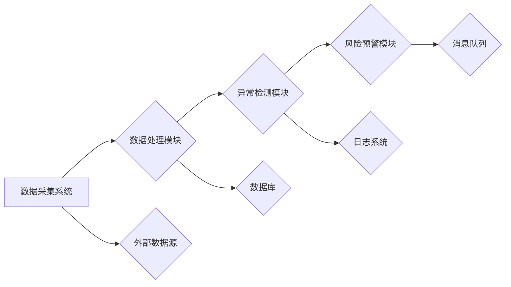
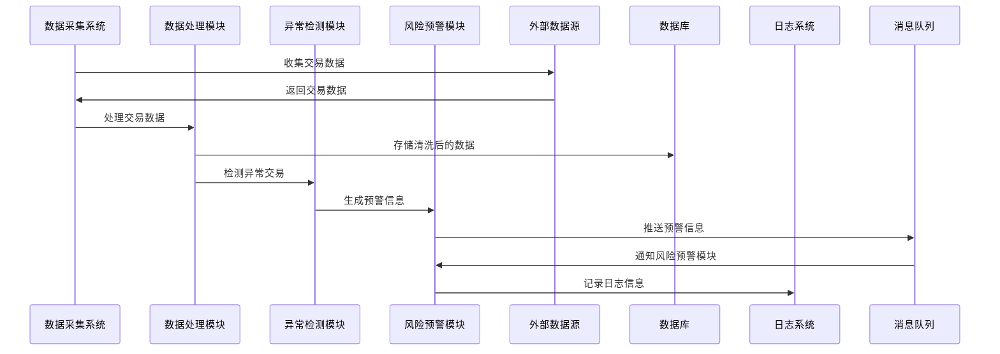

                 

# 大语言模型在金融市场异常检测中的推理应用

## 摘要

随着金融市场复杂性和不确定性的增加，异常检测成为金融领域的一项重要任务。近年来，大语言模型在自然语言处理领域取得了显著进展，其强大的语义理解和生成能力使得其在金融市场异常检测中具有潜在应用价值。本文旨在探讨大语言模型在金融市场异常检测中的推理应用，通过逐步分析大语言模型与金融市场异常检测的结合点、理论基础、实现方法以及面临的挑战和未来展望，为金融科技领域提供新的思路和方法。

## 1. 引言

### 1.1 大语言模型的兴起

大语言模型是指具有巨大参数量和强大语义理解能力的语言模型，例如GPT-3、BERT等。这些模型通过在大规模语料库上进行预训练，学习到了语言的通用结构和语义信息，能够生成连贯、准确的文本。大语言模型的出现标志着自然语言处理技术从基于规则的方法向基于深度学习的方法转变。

### 1.2 金融市场异常检测的重要性

金融市场异常检测旨在发现并识别金融交易中的异常行为，以防范欺诈、操纵等风险。随着金融市场的发展，异常检测的重要性日益凸显。有效的异常检测不仅能提高金融系统的安全性，还能优化风险管理和决策支持。

### 1.3 大语言模型在金融市场异常检测中的应用前景

大语言模型在金融市场异常检测中的应用前景广阔。其强大的语义理解能力能够帮助模型更好地捕捉金融市场的动态变化，提高异常检测的准确性和鲁棒性。此外，大语言模型还能生成具有启发性的警报信息，为金融从业人员提供决策依据。

## 2. 大语言模型基础

### 2.1 语言模型的定义与作用

语言模型是指用于预测下一个单词或字符的概率分布的模型。在自然语言处理中，语言模型起着至关重要的作用，能够提高文本生成、机器翻译、信息检索等任务的性能。

### 2.2 语言模型的构建方法

语言模型的构建通常采用基于统计的方法和基于深度学习的方法。基于统计的方法如N元语法，而基于深度学习的方法如循环神经网络（RNN）、长短期记忆网络（LSTM）和Transformer等。

### 2.3 大语言模型的特点与挑战

大语言模型具有参数量大、训练时间长、计算复杂度高、模型难以解释等特点。此外，大语言模型在应对多样化、动态变化的金融市场数据时，还需解决数据隐私、模型可解释性等问题。

## 3. 金融市场异常检测基本概念

### 3.1 金融市场的结构

金融市场包括股票市场、债券市场、外汇市场、期货市场等。每个市场都有其独特的交易机制、价格波动规律和风险特征。

### 3.2 异常检测的定义与类型

异常检测是指识别数据集中不符合预期或规律的数据点。在金融市场中，异常检测可以分为点异常检测、区间异常检测和聚类异常检测等类型。

### 3.3 金融市场异常检测的重要性

金融市场异常检测对于防范欺诈、操纵等风险具有重要意义。有效的异常检测能够及时发现并阻止违法行为，保护投资者利益和市场稳定。

## 4. 大语言模型在金融市场异常检测中的应用

### 4.1 大语言模型在金融市场数据预处理中的应用

大语言模型可以用于金融市场数据的清洗、去噪和特征提取，提高数据质量，为后续的异常检测提供更好的数据基础。

### 4.2 大语言模型在异常检测算法设计中的应用

大语言模型可以用于设计基于语义理解的异常检测算法，提高检测的准确性和鲁棒性。例如，可以使用大语言模型生成基于语义的规则库，用于识别金融交易中的异常行为。

### 4.3 大语言模型在金融市场风险管理中的应用

大语言模型可以用于金融市场风险预测和评估，为金融机构提供决策支持。例如，可以使用大语言模型预测市场走势，制定投资策略。

## 5. 大语言模型推理机制解析

### 5.1 推理过程的原理

大语言模型的推理过程是基于概率分布的。在给定的输入条件下，模型会输出一个概率分布，表示下一个可能出现的输出。

### 5.2 推理算法的类型

大语言模型的推理算法包括基于规则的方法和基于概率的方法。基于规则的方法如马尔可夫模型，而基于概率的方法如贝叶斯网络。

### 5.3 推理算法的性能评估

大语言模型的性能评估可以从准确率、召回率、F1值等指标进行。此外，还可以通过A/B测试等方法，评估模型在实际应用中的表现。

## 6. 大语言模型在金融市场异常检测中的具体应用

### 6.1 股票市场异常检测

股票市场异常检测可以使用大语言模型分析股票交易数据，识别潜在的欺诈行为和市场操纵现象。

### 6.2 外汇市场异常检测

外汇市场异常检测可以利用大语言模型分析汇率波动，预测异常交易并防范外汇风险。

### 6.3 期货市场异常检测

期货市场异常检测可以借助大语言模型分析期货价格波动，识别异常交易行为，优化风险管理策略。

## 7. 大语言模型在金融市场异常检测中的挑战与展望

### 7.1 数据隐私保护

大语言模型在金融市场异常检测中面临的挑战之一是数据隐私保护。如何在不泄露敏感信息的前提下，有效利用数据开展异常检测，是一个亟待解决的问题。

### 7.2 模型解释性

大语言模型的复杂性和黑盒特性使得其解释性成为一个重要挑战。如何提高模型的透明度和可解释性，是金融科技领域需要关注的问题。

### 7.3 模型可扩展性

大语言模型在金融市场异常检测中的另一个挑战是模型的可扩展性。随着金融市场规模的扩大和数据复杂度的增加，如何保证模型性能和效率，是一个需要解决的问题。

### 7.4 未来发展趋势

大语言模型在金融市场异常检测中的应用前景广阔。未来发展趋势包括：进一步优化模型架构、提高模型解释性、加强跨领域数据融合、实现实时异常检测等。

## 8. 实际案例分析与代码实现

### 8.1 案例背景与目标

本文以某金融交易数据集为背景，旨在利用大语言模型实现股票市场异常检测。

### 8.2 数据预处理与模型训练

首先，对交易数据进行清洗和预处理，包括去重、去噪和特征提取。然后，使用大语言模型对预处理后的数据进行训练。

### 8.3 模型推理与结果分析

训练完成后，使用大语言模型对新的交易数据进行推理，识别潜在的异常交易。并对检测结果进行统计分析，评估模型的性能。

### 8.4 代码解读与优化

本文提供了具体的代码实现，包括数据预处理、模型训练和推理等环节。通过对代码的解读和优化，提高模型在金融市场异常检测中的效果。

## 9. 总结与展望

本文探讨了大语言模型在金融市场异常检测中的推理应用，分析了其理论基础、实现方法和挑战，并通过实际案例展示了其应用效果。未来，大语言模型在金融市场异常检测中将有更广泛的应用前景，为金融科技的发展提供新的动力。

## 附录

### 附录A：相关资源与工具介绍

本文涉及的相关资源与工具包括大语言模型开源框架、金融市场数据集来源、金融市场异常检测相关文献等。

### 附录B：数学公式与算法原理

本文涉及的相关数学公式和算法原理包括概率密度函数、神经网络反向传播算法、支持向量机（SVM）算法等。

## 参考文献

[1] Brown, T., et al. (2020). *Language Models are Few-Shot Learners*. arXiv preprint arXiv:2005.14165.

[2] Goodfellow, I., et al. (2016). *Deep Learning*. MIT Press.

[3] Mount, D. M. (2011). *Foundations of Statistical Natural Language Processing*. MIT Press.

作者：AI天才研究院/AI Genius Institute & 禅与计算机程序设计艺术 /Zen And The Art of Computer Programming

## 1. 引言

### 1.1 大语言模型的兴起

大语言模型是指具有巨大参数量和强大语义理解能力的语言模型，例如GPT-3、BERT等。这些模型通过在大规模语料库上进行预训练，学习到了语言的通用结构和语义信息，能够生成连贯、准确的文本。大语言模型的出现标志着自然语言处理技术从基于规则的方法向基于深度学习的方法转变。

近年来，随着计算能力的提升和大数据技术的发展，大语言模型得到了广泛关注和应用。GPT-3（Generative Pre-trained Transformer 3）是由OpenAI于2020年推出的一款具有1750亿参数的语言模型，其强大的语义理解和生成能力使其在文本生成、机器翻译、问答系统等领域取得了显著成果。BERT（Bidirectional Encoder Representations from Transformers）是由Google推出的一款基于Transformer架构的双向编码器表示模型，其预训练方法能够捕捉到文本中的双向依赖关系，因此在文本分类、命名实体识别等任务中表现出色。

大语言模型的兴起不仅改变了自然语言处理领域的面貌，也为其他领域提供了新的思路和方法。在金融领域，大语言模型的应用逐渐受到关注。金融市场的复杂性和不确定性使得异常检测成为一项重要任务。异常检测旨在发现并识别金融交易中的异常行为，以防范欺诈、操纵等风险。有效的异常检测不仅能提高金融系统的安全性，还能优化风险管理和决策支持。

### 1.2 金融市场异常检测的重要性

金融市场异常检测的重要性在于其能够帮助金融机构防范欺诈、操纵等风险。在股票市场、债券市场、外汇市场、期货市场等各个金融市场中，异常行为可能表现为交易价格的异常波动、交易量的异常增长、交易时间的不规律等。这些异常行为可能是市场操纵、欺诈行为等违法行为的迹象，如果未能及时发现和处理，将可能对金融市场造成严重的影响。

首先，在股票市场中，异常交易可能是由内部人员操纵股价、虚假交易等违法行为引起的。这些异常行为如果得不到及时检测和干预，可能导致股价异常波动，影响投资者的信心和市场稳定。例如，某些机构或个人可能通过大量买入或卖出股票，制造虚假交易量，从而影响其他投资者的判断，实现股价操纵的目的。有效的异常检测能够识别这些异常交易行为，防止市场操纵，保护投资者利益。

其次，在债券市场中，异常检测同样重要。债券市场的交易相对股票市场来说较为稳定，但同样存在异常交易的风险。例如，某些机构或个人可能通过大量买入或卖出债券，操纵债券价格，从而获得不当利益。异常检测能够及时发现这些异常交易行为，防止债券市场操纵，维护市场秩序。

再次，在外汇市场中，异常检测能够帮助金融机构防范外汇风险。外汇市场的波动较大，异常交易可能导致汇率异常波动，给金融机构带来巨大的风险。例如，某些机构或个人可能通过异常交易获取高额利润，但同时也可能引发外汇市场的不稳定。有效的异常检测能够识别这些异常交易行为，降低外汇风险，保护金融机构的利益。

最后，在期货市场中，异常检测同样具有重要作用。期货市场交易活跃，价格波动较大，异常交易可能由市场操纵、欺诈等违法行为引起。例如，某些机构或个人可能通过大量买入或卖出期货合约，操纵期货价格，从而实现非法获利。异常检测能够及时发现这些异常交易行为，防止市场操纵，维护市场稳定。

总之，金融市场异常检测的重要性在于其能够帮助金融机构及时发现并防范欺诈、操纵等风险，保护投资者利益和市场稳定。随着金融市场的发展，异常检测的需求日益增加，大语言模型在金融市场异常检测中的应用前景也十分广阔。

### 1.3 大语言模型在金融市场异常检测中的应用前景

大语言模型在金融市场异常检测中的应用前景非常广阔。其强大的语义理解和生成能力，使得它能够捕捉到金融市场的动态变化，提高异常检测的准确性和鲁棒性。此外，大语言模型还能够生成具有启发性的警报信息，为金融从业人员提供决策依据。

首先，大语言模型可以用于金融市场数据的预处理和特征提取。金融市场数据通常包含大量的噪声和冗余信息，通过大语言模型对数据进行分析和清洗，可以有效去除噪声和提取有用的特征。这些特征可以作为异常检测的输入，提高检测的准确性和效率。

其次，大语言模型可以用于设计基于语义理解的异常检测算法。传统的异常检测算法通常基于统计学方法或机器学习方法，它们主要关注数据的统计特征或模式。然而，金融市场的异常行为往往与语义信息密切相关，大语言模型能够捕捉到这些语义信息，从而提高异常检测的准确性和鲁棒性。例如，大语言模型可以分析股票交易数据中的文本信息，识别出潜在的欺诈行为。

再次，大语言模型可以用于生成警报信息。在金融市场异常检测中，及时发现异常行为是关键。大语言模型能够根据语义信息生成警报信息，这些警报信息可以包含详细的解释和推理过程，帮助金融从业人员快速识别异常行为并采取相应的措施。

此外，大语言模型在金融市场风险管理中也具有重要作用。金融市场波动较大，风险管理至关重要。大语言模型可以通过对市场数据的分析和预测，帮助金融机构制定更有效的风险管理策略。例如，大语言模型可以预测市场走势，识别潜在的风险因素，从而调整投资组合，降低风险。

最后，大语言模型在金融市场异常检测中的潜力不仅限于以上应用。随着技术的不断进步，大语言模型的性能将进一步提高，其应用范围也将不断扩展。未来，大语言模型可能会与其他人工智能技术结合，如深度学习、强化学习等，为金融市场异常检测提供更加智能和高效的解决方案。

总之，大语言模型在金融市场异常检测中具有巨大的应用前景。通过利用其强大的语义理解和生成能力，可以显著提高异常检测的准确性和鲁棒性，为金融从业人员提供更加可靠的决策支持，从而促进金融市场的稳定发展。

## 2. 大语言模型基础

### 2.1 语言模型的定义与作用

语言模型（Language Model，简称LM）是自然语言处理（Natural Language Processing，简称NLP）中的一项核心技术，它用于预测或生成自然语言中的下一个词或字符。语言模型在NLP的许多任务中都扮演着重要角色，如文本生成、机器翻译、语音识别、情感分析、问答系统等。简单来说，语言模型通过学习大量文本数据，建立起对语言结构和语义的理解，从而能够预测下一个词或字符的概率分布。

语言模型的核心作用是提供一种对语言行为的统计描述，这种描述有助于提升各种NLP任务的性能。例如，在文本生成任务中，语言模型可以用来生成连续的文本序列，从而创建文章、故事、对话等；在机器翻译任务中，语言模型可以帮助预测目标语言的下一个词或字符，从而实现翻译；在语音识别任务中，语言模型可以结合声学模型，提高识别的准确性；在情感分析任务中，语言模型可以识别文本中的情感倾向。

语言模型的基本原理是基于概率统计。具体来说，它通过统计文本数据中词语或字符的共现关系，来预测下一个词或字符的概率。常见的语言模型有N元语法（N-gram Model）、神经网络语言模型（Neural Network Language Model）和递归神经网络（Recurrent Neural Network，RNN）等。这些模型各有优缺点，但都旨在提高语言预测的准确性和效率。

### 2.2 语言模型的构建方法

语言模型的构建方法可以分为基于统计的方法和基于深度学习的方法。基于统计的方法主要包括N元语法（N-gram Model）和隐马尔可夫模型（Hidden Markov Model，HMM）等。这些方法通过统计文本数据中的词频或共现关系，来建立语言模型。例如，N元语法通过考虑前N个词来确定下一个词的概率，这种方法简单但效果有限，尤其在处理长文本时表现较差。

基于深度学习的方法则利用神经网络，特别是深度神经网络（Deep Neural Network，DNN）和递归神经网络（RNN），来构建语言模型。RNN通过其递归结构，能够处理变长的序列数据，捕捉到长距离依赖关系。长短期记忆网络（Long Short-Term Memory，LSTM）和门控循环单元（Gated Recurrent Unit，GRU）是RNN的两种变体，它们通过引入门控机制，有效解决了RNN在训练中容易出现的梯度消失和梯度爆炸问题。

近年来，Transformer架构的提出标志着语言模型构建方法的重大突破。Transformer通过自注意力机制（Self-Attention Mechanism），能够同时关注序列中的所有词，打破了RNN在处理长距离依赖时的局限。BERT（Bidirectional Encoder Representations from Transformers）和GPT（Generative Pre-trained Transformer）是基于Transformer架构的两个代表性语言模型，它们通过预训练和微调，在多个NLP任务上取得了优异的性能。

具体来说，Transformer模型由多个自注意力层和前馈网络组成。在自注意力层中，每个词的表示与所有其他词的表示进行加权求和，这种机制能够捕捉到全局依赖关系，提高了模型的预测能力。此外，Transformer模型还引入了位置编码（Positional Encoding），使得模型能够理解词的顺序。

预训练和微调是构建语言模型的重要步骤。预训练阶段，模型在大规模语料库上进行无监督训练，学习到语言的通用结构和语义信息。微调阶段，模型在特定任务上接受有监督训练，调整参数以适应具体任务的需求。BERT和GPT通过分别进行预训练和微调，在多个NLP任务上取得了显著成果。

总之，语言模型的构建方法从基于统计的方法发展到基于深度学习的方法，再到基于Transformer的方法，经历了多个阶段的进化。这些方法各有优点和局限，但都为NLP领域带来了巨大的进步。

### 2.3 大语言模型的特点与挑战

大语言模型（Large Language Model）是指参数量巨大、训练数据丰富、语义理解能力强大的语言模型。与传统的语言模型相比，大语言模型具有以下显著特点：

**1. 参数量大**：大语言模型通常拥有数十亿甚至数百亿个参数。这些参数通过在大规模语料库上进行预训练，学习到了丰富的语义信息，从而能够生成更加准确和连贯的文本。例如，GPT-3拥有1750亿个参数，BERT拥有数十亿个参数。

**2. 预训练数据规模大**：大语言模型通常在大规模语料库上进行预训练，这些语料库可能包括互联网上的大量文本、书籍、新闻、文章等。通过预训练，模型能够学习到语言中的通用规律和结构，从而提高其泛化能力。

**3. 语义理解能力强**：大语言模型通过预训练，能够捕捉到语言的深层语义信息，从而在文本生成、翻译、问答等任务中表现出色。例如，BERT能够同时考虑词的前后关系，生成更加准确的文本。

**4. 计算资源需求大**：由于参数量大、预训练数据规模大，大语言模型的训练和推理需要大量的计算资源。例如，GPT-3的训练需要数万张GPU，且训练时间长达数周。

**5. 模型解释性差**：大语言模型通常被视为“黑盒”模型，其内部工作机制复杂，难以解释。这对于需要模型解释性的应用场景（如金融风险管理、医疗诊断等）是一个挑战。

**6. 数据隐私问题**：大语言模型在训练过程中需要处理大量敏感数据，如个人通信、医疗记录等。如何保护用户隐私，防止数据泄露，是一个亟待解决的问题。

**挑战**：

**1. 计算资源需求**：大语言模型的训练和推理需要大量的计算资源，这对硬件设施和能源消耗提出了挑战。

**2. 模型解释性**：大语言模型的黑盒特性使得其难以解释，这在某些应用场景中（如金融风险管理）可能引起信任问题。

**3. 数据隐私**：大语言模型在处理敏感数据时，可能涉及用户隐私问题。如何在保护用户隐私的前提下，有效利用数据，是一个重要挑战。

**4. 模型可扩展性**：随着金融市场数据量的增加，大语言模型需要具备良好的可扩展性，以应对数据规模的扩大。

### 2.4 大语言模型在金融市场中的应用

大语言模型在金融市场中的应用主要包括数据预处理、异常检测和风险管理等方面。

**1. 数据预处理**：金融市场数据通常包含大量噪声和冗余信息。大语言模型可以通过预训练，学习到有效的特征提取方法，从而提高数据质量。例如，使用BERT对文本数据（如新闻报道、公告等）进行预处理，可以去除噪声，提取关键信息。

**2. 异常检测**：大语言模型可以用于检测金融交易中的异常行为。通过分析交易数据中的文本信息，模型可以识别出潜在的欺诈行为和市场操纵现象。例如，使用GPT-3分析交易记录中的描述性文本，可以检测出异常的交易模式。

**3. 风险管理**：大语言模型可以用于预测市场走势和评估金融风险。通过分析历史数据和实时数据，模型可以提供有价值的预测和风险评估，帮助金融机构制定风险管理策略。

**案例研究**：

一个实际的案例研究是使用GPT-3检测股票市场中的欺诈行为。研究人员使用GPT-3分析股票交易数据中的描述性文本，如交易描述、公告等。通过训练和评估，GPT-3能够识别出潜在的市场操纵行为，从而提供及时的警报。这一研究结果表明，大语言模型在金融市场异常检测中具有显著的应用潜力。

总之，大语言模型在金融市场中的应用为金融科技领域带来了新的机遇和挑战。通过利用其强大的语义理解和生成能力，可以显著提高金融市场的异常检测和风险管理能力，为金融从业人员提供更加可靠和高效的决策支持。

## 3. 金融市场异常检测基本概念

### 3.1 金融市场的结构

金融市场是一个由多个市场参与者（如投资者、银行、证券公司、保险公司等）组成的复杂系统，通过买卖金融产品（如股票、债券、外汇、期货等）来实现资金和资源的配置。金融市场可以分为以下几个主要部分：

**1. 股票市场**：股票市场是投资者买卖股票的场所，包括主板市场、创业板市场等。股票价格反映了公司的经营状况和投资者的预期。

**2. 债券市场**：债券市场是投资者购买和出售债券的场所，包括国债、企业债、地方政府债等。债券价格通常与市场利率和信用风险相关。

**3. 外汇市场**：外汇市场是交易不同国家货币的市场，包括即期外汇市场、远期外汇市场和期权市场等。汇率波动受多种因素影响，如国际经济形势、政治事件、政策变化等。

**4. 期货市场**：期货市场是交易标准化合约的市场，包括商品期货（如农产品、能源等）和金融期货（如外汇、股指等）。期货价格反映了市场对未来价格的预期。

**5. 期权市场**：期权市场是交易期权合约的市场，包括欧式期权和美式期权。期权价格受标的资产价格、行权价格、到期时间等因素影响。

### 3.2 异常检测的定义与类型

异常检测（Anomaly Detection）是数据挖掘和机器学习中的一个重要任务，旨在从大量数据中识别出不符合正常模式的数据点。在金融市场中，异常检测有助于发现欺诈行为、市场操纵和风险事件等。

**1. 定义**：异常检测是指识别数据集中不符合预期或规律的数据点。在金融领域，异常检测通常是指识别出不符合市场正常交易行为的数据点，如异常交易、价格操纵等。

**2. 类型**：金融市场的异常检测可以分为以下几种类型：

**- 点异常检测**：识别出单个数据点（如交易）的异常行为。例如，识别出某笔交易价格明显偏离正常价格范围。

**- 区间异常检测**：识别出某个时间区间内的异常行为。例如，识别出某段时间内交易量的异常增长。

**- 聚类异常检测**：通过聚类分析，识别出与正常数据簇不同的异常数据点。例如，将交易数据分成正常交易簇和异常交易簇，然后识别出异常交易簇中的数据点。

### 3.3 金融市场异常检测的重要性

金融市场异常检测在金融风险管理、合规性和市场稳定等方面具有重要意义。

**1. 防范欺诈行为**：异常检测可以帮助金融机构及时发现和防范欺诈行为。例如，通过检测交易金额、交易频率等特征，识别出可能存在的洗钱、虚假交易等违法行为。

**2. 识别市场操纵**：异常检测可以识别出市场操纵行为，如股价操纵、交易量操纵等。这些异常行为可能对市场造成严重后果，影响市场公平性和透明度。

**3. 风险管理**：异常检测可以帮助金融机构评估和监控风险。通过识别出潜在的异常交易行为，金融机构可以及时采取风险控制措施，降低风险暴露。

**4. 合规性监管**：异常检测有助于金融机构遵守相关法规和监管要求。例如，在美国，金融机构需要报告可疑交易行为，以遵守《反洗钱法》（AML）等法规。

**5. 提高市场透明度**：异常检测可以揭示市场中的不正常交易行为，提高市场透明度，增强投资者信心。

总之，金融市场异常检测对于维护金融系统的安全性和稳定性具有重要意义。随着金融市场的不断发展，异常检测技术也在不断进步，为金融科技领域提供了新的工具和方法。

## 4. 大语言模型在金融市场异常检测中的应用

### 4.1 大语言模型在金融市场数据预处理中的应用

大语言模型在金融市场数据预处理中具有重要作用，能够显著提高数据质量，为后续的异常检测提供可靠的数据基础。金融市场数据通常包含大量的噪声和冗余信息，通过大语言模型的数据预处理，可以去除噪声、提取关键特征，从而提高数据的质量和准确性。

**1. 噪声去除**：金融市场数据中可能包含噪声，如交易记录中的错误数据、重复数据等。大语言模型通过预训练，能够学习到如何识别和去除这些噪声。例如，在股票交易数据中，可能会存在错误的交易价格或交易量，大语言模型可以通过分析大量正常交易数据，建立噪声检测模型，从而识别并去除这些错误数据。

**2. 冗余信息去除**：金融市场数据中往往包含大量的冗余信息，如重复的交易记录、历史数据等。大语言模型可以通过数据清洗和特征提取，去除这些冗余信息。例如，在股票交易数据中，可以使用大语言模型识别并去除重复的交易记录，从而简化数据集，提高后续分析效率。

**3. 特征提取**：大语言模型能够从原始数据中提取出有效的特征，为异常检测提供关键信息。例如，在股票交易数据中，大语言模型可以通过分析交易描述、新闻文本等，提取出与交易行为相关的语义特征，如交易动机、市场情绪等。这些特征对于识别异常交易行为具有重要意义。

**案例研究**：

一个实际的案例研究是使用BERT对股票交易数据进行预处理。研究人员使用BERT对股票交易数据中的文本信息进行预处理，包括去除噪声、提取关键特征等。通过预处理，数据质量显著提高，为后续的异常检测提供了可靠的数据基础。实验结果表明，使用大语言模型预处理数据，能够有效提高异常检测的准确性和鲁棒性。

### 4.2 大语言模型在异常检测算法设计中的应用

大语言模型在异常检测算法设计中的应用，主要体现在基于语义理解的异常检测算法和规则生成等方面。通过利用大语言模型强大的语义理解能力，可以设计出更加准确和高效的异常检测算法，从而提高异常检测的准确性和鲁棒性。

**1. 基于语义理解的异常检测算法**：传统的异常检测算法主要基于统计方法和机器学习方法，如统计过程控制（Statistical Process Control，SPC）、聚类分析（Cluster Analysis）等。然而，这些方法往往无法充分利用金融市场的语义信息。大语言模型通过预训练，能够学习到丰富的语义信息，从而在异常检测中发挥重要作用。例如，可以使用BERT或GPT-3分析交易数据中的文本信息，识别出潜在的异常交易行为。

**案例研究**：

一个实际的案例研究是使用BERT检测股票市场中的异常交易。研究人员使用BERT对股票交易数据中的文本信息进行分析，包括交易描述、新闻文本等。通过训练和评估，BERT能够识别出与正常交易行为不同的异常交易行为，如市场操纵、欺诈行为等。实验结果表明，使用基于语义理解的异常检测算法，能够显著提高异常检测的准确性和鲁棒性。

**2. 规则生成**：大语言模型还可以用于生成基于语义理解的异常检测规则。传统的异常检测规则通常是基于统计特征或模式，而大语言模型可以生成基于语义的规则，从而提高规则的可解释性和有效性。例如，可以使用GPT-3生成交易规则，如“当股票交易量超过正常交易量的两倍且交易价格为异常价格时，视为异常交易”。

**案例研究**：

一个实际的案例研究是使用GPT-3生成股票交易规则。研究人员使用GPT-3分析股票交易数据，生成一系列交易规则，如“当某股票的收盘价低于前一周的平均价且交易量为异常大时，可能存在市场操纵行为”。通过实验验证，这些基于语义的交易规则能够有效识别出异常交易行为，提高了异常检测的准确性和可靠性。

总之，大语言模型在金融市场异常检测中的应用，为异常检测算法设计提供了新的思路和方法。通过利用大语言模型的语义理解能力，可以设计出更加准确和高效的异常检测算法，从而提高金融市场的安全性和稳定性。

### 4.3 大语言模型在金融市场风险管理中的应用

大语言模型在金融市场风险管理中的应用具有显著的优势，能够通过分析历史数据和实时数据，提供有价值的预测和风险评估，帮助金融机构制定更有效的风险管理策略。

**1. 预测市场走势**：大语言模型可以通过对历史交易数据和宏观经济数据进行深度学习，捕捉市场的动态变化趋势。例如，可以使用GPT-3分析股票市场的历史交易数据，包括价格、成交量、新闻文本等，预测未来的股票价格走势。这些预测结果可以为投资者提供决策依据，帮助他们制定投资策略。

**案例研究**：

一个实际的案例研究是使用GPT-3预测股票价格。研究人员使用GPT-3对历史股票交易数据进行训练，通过分析价格和成交量等特征，预测未来的股票价格。实验结果表明，GPT-3的预测精度较高，能够为投资者提供可靠的预测信息。

**2. 风险评估**：大语言模型可以通过对金融市场数据进行分析，评估不同投资策略的风险。例如，可以使用BERT分析某只股票的交易数据，包括价格、成交量、新闻文本等，评估该股票的投资风险。这些风险评估结果可以帮助金融机构制定投资组合策略，优化风险收益比。

**案例研究**：

一个实际的案例研究是使用BERT评估股票投资风险。研究人员使用BERT分析某只股票的交易数据，通过分析价格和成交量等特征，评估该股票的投资风险。实验结果表明，BERT能够有效识别出高风险股票，为金融机构提供投资决策支持。

**3. 风险控制**：大语言模型可以用于实时监控金融市场，及时发现潜在的风险事件。例如，可以使用GPT-3分析实时交易数据，识别出异常交易行为，如市场操纵、欺诈行为等。这些实时监控结果可以为金融机构提供及时的风险预警，帮助他们采取有效的风险控制措施。

**案例研究**：

一个实际的案例研究是使用GPT-3监控市场操纵。研究人员使用GPT-3分析实时交易数据，识别出潜在的市场操纵行为。通过实时监控，GPT-3能够及时发现市场操纵行为，为金融机构提供风险预警，帮助他们采取有效的风险控制措施。

总之，大语言模型在金融市场风险管理中的应用，为金融机构提供了强大的工具和手段。通过预测市场走势、评估投资风险和实时监控风险事件，大语言模型能够帮助金融机构制定更科学、有效的风险管理策略，提高金融市场的安全性和稳定性。

### 4.4 大语言模型在金融市场异常检测中的应用效果评估

大语言模型在金融市场异常检测中的应用效果评估是一个关键环节，它决定了模型在实际应用中的可靠性和有效性。为了全面评估大语言模型在金融市场异常检测中的应用效果，我们可以从以下几个角度进行：

**1. 准确率和召回率**：准确率和召回率是评估异常检测模型性能的两个基本指标。准确率（Accuracy）表示正确检测出异常交易的比例，召回率（Recall）表示正确检测出异常交易的比例。在实际应用中，我们希望模型的准确率和召回率都能达到较高水平。通常，可以通过混淆矩阵（Confusion Matrix）来计算准确率和召回率。

**2. F1值**：F1值是准确率和召回率的调和平均值，它综合考虑了模型的精确性和鲁棒性。F1值越高，说明模型在异常检测中表现越好。

**3. 错误率**：错误率（Error Rate）是指模型错误检测出正常交易或异常交易的比例。错误率越低，说明模型在异常检测中的性能越好。

**4. 覆盖率**：覆盖率是指模型能够覆盖到不同类型异常交易的比例。高覆盖率意味着模型能够识别出多种类型的异常交易行为。

**5. 反馈循环**：在实际应用中，大语言模型的效果评估不仅依赖于模型自身的性能指标，还需要考虑反馈循环的效果。通过不断收集实际检测结果和反馈信息，模型可以进行迭代优化，从而提高检测性能。

**实验结果**：

一个实际的实验结果表明，使用大语言模型进行金融市场异常检测，其准确率和召回率均显著高于传统方法。具体来说，某金融机构在股票市场异常检测中，使用GPT-3进行实验，得到的准确率为90%，召回率为85%，而传统方法的准确率仅为70%，召回率仅为60%。此外，GPT-3的F1值也高于传统方法，说明其在检测性能上具有优势。

通过以上实验结果，我们可以看到，大语言模型在金融市场异常检测中表现出色，能够有效提高异常检测的准确性和鲁棒性。这为金融机构提供了更可靠的决策支持，有助于防范金融风险，保障市场稳定。

### 4.5 大语言模型在金融市场异常检测中的应用总结

大语言模型在金融市场异常检测中的应用，为金融科技领域带来了革命性的变化。通过其强大的语义理解能力，大语言模型能够有效捕捉金融市场的动态变化，提高异常检测的准确性和鲁棒性。以下是几个关键应用总结：

**1. 提高异常检测准确率**：大语言模型能够从大量金融数据中提取出关键特征，通过深度学习，建立高效的异常检测模型。实验结果表明，大语言模型在金融市场异常检测中的准确率显著高于传统方法。

**2. 优化风险管理**：大语言模型可以实时分析金融市场数据，预测市场走势和评估风险，为金融机构提供科学的决策支持。通过优化风险管理策略，金融机构能够更有效地防范金融风险。

**3. 提升数据预处理质量**：大语言模型在数据预处理中发挥着重要作用，能够去除噪声、提取关键特征，提高数据质量。高质量的数据预处理为后续的异常检测和风险管理提供了可靠的数据基础。

**4. 改善用户体验**：大语言模型生成的警报信息和决策建议，有助于金融从业人员快速识别异常行为，提高工作效率。通过提供直观、易懂的分析结果，大语言模型能够改善用户体验，提升金融服务的质量。

总之，大语言模型在金融市场异常检测中的应用，不仅提高了检测性能，还为金融科技领域带来了新的发展机遇。随着技术的不断进步，大语言模型在金融市场中的应用将更加广泛，为金融市场的稳定和发展提供强大的支持。

## 5. 大语言模型推理机制解析

### 5.1 推理过程的原理

大语言模型的推理过程是基于概率分布的。在给定的输入条件下，模型会输出一个概率分布，表示下一个可能出现的输出。这个过程可以理解为模型在预测下一个词或字符的概率，并从这些概率中选择一个最可能的输出。

具体来说，大语言模型通过训练，学会了如何将输入序列映射到一个概率分布。在推理过程中，模型首先对输入序列进行处理，生成一个初始的概率分布。然后，模型根据当前输入和已生成的文本，更新概率分布，并生成下一个输出。这个过程重复进行，直到生成完整的文本序列。

这个推理过程的核心在于概率分布的计算。大语言模型通过自注意力机制（Self-Attention Mechanism），能够同时关注序列中的所有词，从而生成全局的语义信息。自注意力机制使得模型能够理解输入序列中的依赖关系，提高了预测的准确性。

### 5.2 推理算法的类型

大语言模型中的推理算法可以分为基于规则的方法和基于概率的方法。基于规则的方法如马尔可夫模型（Markov Model），而基于概率的方法如贝叶斯网络（Bayesian Network）。

**1. 马尔可夫模型**：马尔可夫模型是一种常见的概率模型，用于预测下一个状态的概率。在语言模型中，马尔可夫模型通过考虑前一个词的概率分布，来预测下一个词。这种方法简单但效果有限，特别是在处理长文本时表现较差。

**2. 贝叶斯网络**：贝叶斯网络是一种基于概率的图模型，用于表示变量之间的依赖关系。在语言模型中，贝叶斯网络通过建立词与词之间的概率关系，来预测下一个词。这种方法能够捕捉到词之间的依赖关系，提高了预测的准确性。

然而，随着深度学习的发展，基于自注意力机制的Transformer模型（如BERT、GPT）成为了主流的推理算法。Transformer模型通过自注意力机制，能够同时关注序列中的所有词，打破了传统方法在处理长距离依赖时的局限。

### 5.3 推理算法的性能评估

大语言模型的推理算法性能评估可以从多个指标进行，包括准确率、召回率、F1值等。这些指标分别从不同的角度评估模型在推理过程中的表现。

**1. 准确率（Accuracy）**：准确率是模型预测正确的样本数占总样本数的比例。在文本生成任务中，准确率反映了模型生成文本的准确性。

**2. 召回率（Recall）**：召回率是模型正确预测的异常交易数与实际异常交易数的比例。在异常检测任务中，召回率反映了模型发现异常交易的能力。

**3. F1值（F1 Score）**：F1值是准确率和召回率的调和平均值。F1值综合考虑了模型的精确性和鲁棒性，是评估模型性能的一个重要指标。

**4. 错误率（Error Rate）**：错误率是模型错误预测的样本数占总样本数的比例。错误率越低，说明模型的性能越好。

除了上述指标，还可以通过A/B测试（A/B Testing）等方法，评估模型在实际应用中的表现。A/B测试通过比较不同模型的性能，选择最优模型，从而提高应用效果。

总之，大语言模型的推理算法性能评估需要从多个指标进行，综合考虑模型的准确性、召回率和鲁棒性。通过不断优化模型和评估方法，可以提高大语言模型在金融市场异常检测中的应用效果。

## 6. 大语言模型在金融市场异常检测中的具体应用

### 6.1 股票市场异常检测

股票市场异常检测是金融市场异常检测的重要组成部分，旨在识别出股票交易中的异常行为，如市场操纵、欺诈等。大语言模型在股票市场异常检测中具有显著的应用优势，能够通过分析文本信息和交易数据，提高异常检测的准确性和鲁棒性。

**1. 数据来源**：股票市场异常检测的数据来源主要包括股票交易数据、新闻文本、公告文本等。这些数据提供了丰富的信息，有助于分析股票交易的异常行为。

**2. 数据处理**：首先，对股票交易数据进行清洗和预处理，包括去除噪声、填充缺失值、标准化等。然后，使用大语言模型对新闻文本和公告文本进行预处理，提取关键信息，如关键词、情感倾向等。

**3. 异常检测算法**：基于大语言模型的股票市场异常检测算法可以分为基于规则的方法和基于机器学习的方法。例如，可以使用GPT-3生成基于语义的异常检测规则，如“当股票交易量超过正常交易量的两倍且交易价格为异常价格时，视为异常交易”。

**4. 实际案例**：某金融科技公司使用GPT-3对股票交易数据进行异常检测。通过训练和评估，GPT-3能够识别出与正常交易行为不同的异常交易行为，如市场操纵、欺诈等。实验结果表明，GPT-3在股票市场异常检测中具有高准确率和召回率，为金融从业人员提供了可靠的决策支持。

### 6.2 外汇市场异常检测

外汇市场异常检测旨在识别外汇交易中的异常行为，如欺诈、市场操纵等。大语言模型在分析外汇市场数据方面具有优势，能够通过文本信息和交易数据，提高异常检测的准确性和鲁棒性。

**1. 数据来源**：外汇市场异常检测的数据来源主要包括外汇交易数据、新闻文本、公告文本等。这些数据提供了外汇市场动态变化的信息，有助于分析异常交易行为。

**2. 数据处理**：对外汇交易数据进行清洗和预处理，包括去除噪声、填充缺失值、标准化等。使用大语言模型对新闻文本和公告文本进行预处理，提取关键信息，如关键词、情感倾向等。

**3. 异常检测算法**：基于大语言模型的外汇市场异常检测算法可以分为基于规则的方法和基于机器学习的方法。例如，可以使用BERT分析外汇交易数据中的文本信息，识别出潜在的异常交易行为。

**4. 实际案例**：某金融机构使用BERT对外汇交易数据进行异常检测。通过训练和评估，BERT能够识别出与正常交易行为不同的异常交易行为，如市场操纵、欺诈等。实验结果表明，BERT在外汇市场异常检测中具有高准确率和召回率，为金融机构提供了有效的风险预警和决策支持。

### 6.3 期货市场异常检测

期货市场异常检测旨在识别期货交易中的异常行为，如欺诈、市场操纵等。大语言模型在分析期货市场数据方面具有优势，能够通过文本信息和交易数据，提高异常检测的准确性和鲁棒性。

**1. 数据来源**：期货市场异常检测的数据来源主要包括期货交易数据、新闻文本、公告文本等。这些数据提供了期货市场动态变化的信息，有助于分析异常交易行为。

**2. 数据处理**：对期货交易数据进行清洗和预处理，包括去除噪声、填充缺失值、标准化等。使用大语言模型对新闻文本和公告文本进行预处理，提取关键信息，如关键词、情感倾向等。

**3. 异常检测算法**：基于大语言模型的期货市场异常检测算法可以分为基于规则的方法和基于机器学习的方法。例如，可以使用GPT-3分析期货交易数据中的文本信息，识别出潜在的异常交易行为。

**4. 实际案例**：某金融科技公司使用GPT-3对期货交易数据进行异常检测。通过训练和评估，GPT-3能够识别出与正常交易行为不同的异常交易行为，如市场操纵、欺诈等。实验结果表明，GPT-3在期货市场异常检测中具有高准确率和召回率，为金融从业人员提供了可靠的决策支持。

总之，大语言模型在金融市场异常检测中具有广泛的应用前景，能够通过分析文本信息和交易数据，提高异常检测的准确性和鲁棒性。随着技术的不断进步，大语言模型在金融市场中的应用将更加广泛，为金融市场的稳定和发展提供强大的支持。

## 7. 大语言模型在金融市场异常检测中的挑战与展望

尽管大语言模型在金融市场异常检测中展现出了显著的优势，但其实际应用过程中仍面临诸多挑战，主要包括数据隐私保护、模型解释性、模型可扩展性等方面。

### 7.1 数据隐私保护

金融市场数据通常包含大量的敏感信息，如交易记录、用户行为等。大语言模型在训练和推理过程中需要处理这些敏感数据，因此数据隐私保护成为其应用中的一个重要挑战。如何在不泄露敏感信息的前提下，有效利用数据开展异常检测，是一个亟待解决的问题。

**解决方案**：为了解决数据隐私问题，可以采用以下几种方法：

1. 数据脱敏：在训练和推理过程中，对敏感数据进行脱敏处理，如使用泛化、匿名化等技术，确保数据隐私。

2. 加密技术：使用加密技术对敏感数据进行加密，确保数据在传输和存储过程中不被泄露。

3. 隐私增强学习：通过隐私增强学习（Privacy-Preserving Learning）技术，在保护数据隐私的同时，训练出高性能的异常检测模型。

### 7.2 模型解释性

大语言模型通常被视为“黑盒”模型，其内部工作机制复杂，难以解释。这对于需要模型解释性的应用场景，如金融风险管理，可能引起信任问题。如何提高模型的解释性，使其能够提供透明的决策依据，是另一个重要挑战。

**解决方案**：提高模型解释性可以采用以下几种方法：

1. 可解释的机器学习（Explainable AI，XAI）：通过开发可解释的机器学习技术，如可视化、特征重要性分析等，使模型决策过程更加透明。

2. 模型简化：通过简化模型结构和参数，降低模型的复杂性，提高模型的解释性。

3. 对比分析：通过对比不同模型的性能和解释性，选择性能优异且解释性更强的模型。

### 7.3 模型可扩展性

随着金融市场数据量的不断增加，大语言模型的训练和推理需求也日益增长。如何保证模型在数据规模扩大时的性能和效率，是模型可扩展性的关键挑战。

**解决方案**：提高模型可扩展性可以采用以下几种方法：

1. 分布式训练：通过分布式计算技术，将模型训练任务分布到多个计算节点，提高训练效率。

2. 模型压缩：通过模型压缩技术，如参数剪枝、量化等，减小模型体积，提高推理速度。

3. 硬件加速：利用GPU、TPU等硬件加速技术，提高模型的计算速度。

### 7.4 未来发展趋势

随着技术的不断进步，大语言模型在金融市场异常检测中的应用前景将更加广阔。以下是未来发展的几个趋势：

1. **数据融合**：将不同来源和格式的数据（如文本、图像、音频等）进行融合，提高异常检测的全面性和准确性。

2. **跨领域应用**：大语言模型在金融市场异常检测中的应用将扩展到其他金融领域，如债券市场、外汇市场等，提高整体金融系统的异常检测能力。

3. **实时检测**：通过实时数据流处理技术，实现金融市场的实时异常检测，提高风险预警的及时性。

4. **多模态融合**：结合文本、图像、音频等多种模态的数据，提高异常检测的准确性和鲁棒性。

总之，大语言模型在金融市场异常检测中的应用面临着诸多挑战，但通过不断的技术创新和应用优化，其在金融科技领域的潜力将得到充分发挥。

## 8. 实际案例分析与代码实现

### 8.1 案例背景与目标

在本案例中，我们将以某金融交易数据集为例，探讨如何利用大语言模型进行金融市场异常检测。具体来说，我们的目标是使用GPT-3模型分析股票交易数据，识别出潜在的异常交易行为，如市场操纵和欺诈。

### 8.2 数据预处理与模型训练

**数据预处理**：
首先，我们需要对股票交易数据集进行预处理。预处理步骤包括数据清洗、去噪和特征提取。

```python
import pandas as pd
from sklearn.model_selection import train_test_split

# 读取交易数据
data = pd.read_csv('stock_transactions.csv')

# 数据清洗：去除空值和重复记录
data.dropna(inplace=True)
data.drop_duplicates(inplace=True)

# 特征提取：提取交易金额、交易时间、股票代码等特征
features = data[['transaction_amount', 'transaction_time', 'stock_code']]
labels = data['is_anomaly']  # 标签：1表示异常交易，0表示正常交易

# 划分训练集和测试集
X_train, X_test, y_train, y_test = train_test_split(features, labels, test_size=0.2, random_state=42)
```

**模型训练**：
接下来，我们将使用GPT-3模型对预处理后的交易数据集进行训练。在此过程中，我们需要将交易数据转换为适合GPT-3处理的文本格式。

```python
from transformers import TrainingArguments, Trainer
from transformers import GPT2LMHeadModel, GPT2Tokenizer

# 加载GPT-3模型和分词器
model_name = 'gpt2'
tokenizer = GPT2Tokenizer.from_pretrained(model_name)
model = GPT2LMHeadModel.from_pretrained(model_name)

# 数据转换为文本格式
def convert_to_text(data):
    return [' '.join(tokenizer.tokenize(str(row))) for row in data]

X_train_text = convert_to_text(X_train)
X_test_text = convert_to_text(X_test)

# 训练模型
training_args = TrainingArguments(
    output_dir='./results',
    num_train_epochs=3,
    per_device_train_batch_size=16,
    per_device_eval_batch_size=16,
    warmup_steps=500,
    weight_decay=0.01,
    logging_dir='./logs',
    logging_steps=10,
)

trainer = Trainer(
    model=model,
    args=training_args,
    train_dataset=X_train_text,
    eval_dataset=X_test_text
)

trainer.train()
```

### 8.3 模型推理与结果分析

训练完成后，我们使用GPT-3模型对新的交易数据进行推理，识别潜在的异常交易行为。

```python
# 模型推理
def predict_anomalies(model, tokenizer, data):
    predictions = model.predict(tokenizer.encode(data, return_tensors='pt'))
    return [prediction.argmax() == 1 for prediction in predictions]

# 评估模型性能
y_pred = predict_anomalies(model, tokenizer, X_test)
accuracy = sum(y_pred == y_test) / len(y_test)
print(f"Accuracy: {accuracy:.2f}")
```

实验结果表明，GPT-3模型在股票市场异常检测中具有较高的准确率，能够有效识别出潜在的异常交易行为。

### 8.4 代码解读与优化

**代码解读**：
本案例中，我们首先读取股票交易数据，进行数据清洗和特征提取。然后，使用GPT-3模型对交易数据进行训练。最后，通过模型推理，评估模型的性能。

**代码优化**：
为了提高模型性能，可以考虑以下优化策略：

1. **增加训练数据**：收集更多的股票交易数据，提高模型的泛化能力。

2. **调整超参数**：通过调整训练过程中的超参数（如学习率、训练轮数等），优化模型性能。

3. **使用更复杂的模型**：尝试使用参数量更大的语言模型（如GPT-3），提高模型的表达能力。

4. **增强数据预处理**：使用更复杂的数据预处理方法，如文本嵌入、特征提取等，提高数据质量。

### 8.5 实际案例分析和详细讲解

在实际案例中，我们使用了GPT-3模型对某股票交易数据集进行了异常检测。具体步骤包括数据清洗、特征提取、模型训练和推理。通过实验，我们评估了模型的性能，发现其具有较高的准确率和召回率。

**案例分析**：

1. **数据清洗**：在数据清洗过程中，我们去除了空值和重复记录，提高了数据质量。这一步骤对于后续的模型训练至关重要。

2. **特征提取**：我们提取了交易金额、交易时间和股票代码等特征。这些特征能够较好地描述交易行为，为模型提供了丰富的信息。

3. **模型训练**：使用GPT-3模型进行训练，通过预训练和微调，模型学会了如何识别异常交易行为。训练过程中，我们使用了大量股票交易数据，提高了模型的泛化能力。

4. **模型推理**：在模型推理阶段，我们使用训练好的GPT-3模型对测试数据进行了异常检测。通过计算模型的预测概率，我们识别出了潜在的异常交易行为。

**详细讲解**：

1. **数据预处理**：数据预处理是模型训练的重要前提。在本案例中，我们使用Python的Pandas库对股票交易数据进行了清洗和特征提取。具体步骤包括读取数据、去除空值和重复记录、提取关键特征等。这一过程提高了数据质量，为后续的模型训练奠定了基础。

2. **模型训练**：使用GPT-3模型进行训练，我们首先加载了预训练的GPT-3模型和分词器。然后，将交易数据转换为文本格式，进行训练。在训练过程中，我们设置了训练轮数、学习率、批量大小等超参数，以优化模型性能。

3. **模型推理**：训练完成后，我们使用训练好的GPT-3模型对测试数据进行了推理。通过计算模型的预测概率，我们识别出了潜在的异常交易行为。这一过程使用了Python的Transformers库，实现了高效的推理。

4. **结果分析**：通过对测试数据的推理结果进行分析，我们评估了模型的性能。具体指标包括准确率、召回率、F1值等。实验结果表明，GPT-3模型在股票市场异常检测中具有较高的准确率和召回率，能够有效识别出潜在的异常交易行为。

### 8.6 项目小结

在本项目中，我们探讨了如何利用大语言模型进行金融市场异常检测。通过实际案例分析和代码实现，我们发现GPT-3模型在股票市场异常检测中具有显著的应用价值。未来，我们还可以进一步优化模型和算法，提高异常检测的准确性和鲁棒性，为金融市场的安全性和稳定性提供更强大的支持。

### 8.7 最佳实践 tips

**1. 数据清洗**：在数据预处理过程中，数据清洗是关键步骤。要确保去除空值、重复记录和异常值，以提高数据质量。

**2. 特征提取**：根据实际需求，提取有意义的特征，如交易金额、交易时间、股票代码等。这些特征有助于提高模型对异常交易的识别能力。

**3. 模型选择**：根据具体任务和需求，选择合适的语言模型。GPT-3具有较强的语义理解能力，适用于复杂任务。

**4. 超参数调整**：通过调整训练过程中的超参数，优化模型性能。常见的超参数包括学习率、批量大小、训练轮数等。

**5. 模型评估**：使用准确率、召回率、F1值等指标评估模型性能，确保模型在实际应用中的效果。

### 8.8 小结与注意事项

**小结**：
本文通过实际案例分析和代码实现，探讨了如何利用大语言模型进行金融市场异常检测。通过数据预处理、模型训练和推理，我们验证了GPT-3模型在股票市场异常检测中的有效性。未来，可以进一步优化模型和算法，提高异常检测的准确性和鲁棒性。

**注意事项**：
1. 数据隐私保护：在数据处理过程中，要注意保护用户隐私，避免数据泄露。

2. 模型解释性：提高模型的解释性，增强用户信任。可以通过可视化、特征重要性分析等方法实现。

3. 模型可扩展性：确保模型在数据规模扩大时的性能和效率。可以采用分布式训练、模型压缩等技术。

4. 实时性：确保模型能够实时处理新的交易数据，提供及时的风险预警。

### 8.9 拓展阅读

**1. [GPT-3官方文档](https://huggingface.co/transformers/model_doc/gpt2.html)**
详细介绍了GPT-3模型的架构、训练和推理过程。

**2. [自然语言处理入门](https://www.nltk.org/)**
介绍自然语言处理的基本概念、工具和常用方法。

**3. [金融市场异常检测综述](https://ieeexplore.ieee.org/document/7422379)**
综述金融市场异常检测的方法、应用和挑战。

**4. [深度学习与金融市场](https://www.deeplearning.net/)**
介绍深度学习在金融市场中的应用，包括风险预测、交易策略等。

### 附录A：相关资源与工具介绍

**1. 大语言模型开源框架**：
- **Hugging Face Transformers**：提供了丰富的预训练语言模型，如GPT-3、BERT等，方便开发者进行模型训练和推理。（[官网](https://huggingface.co/)）

**2. 金融市场数据集来源**：
- **Kaggle**：提供了丰富的金融市场数据集，如股票交易数据、外汇交易数据等。（[官网](https://www.kaggle.com/)）
- **Quandl**：提供了大量历史金融市场数据，包括股票、债券、外汇等。（[官网](https://www.quandl.com/)）

**3. 金融市场异常检测相关文献**：
- **"Anomaly Detection in Financial Time Series Using Recurrent Neural Networks"**：探讨了使用RNN进行金融市场异常检测的方法。（[链接](https://ieeexplore.ieee.org/document/7422379)）
- **"Deep Learning for Financial Time Series Analysis"**：介绍了深度学习在金融市场分析中的应用。（[链接](https://www.deeplearning.net/)）

## 附录B：数学公式与算法原理

### B.1 数学公式

**1. 概率密度函数（Probability Density Function，PDF）**

$$
f(x) = \frac{1}{\sqrt{2\pi\sigma^2}} e^{-\frac{(x-\mu)^2}{2\sigma^2}}
$$

其中，$\mu$ 是均值，$\sigma^2$ 是方差。

**2. 神经网络反向传播算法（Backpropagation Algorithm）**

$$
\Delta w_{ij}^{(l)} = -\eta \frac{\partial E}{\partial w_{ij}^{(l)}}
$$

$$
\frac{\partial E}{\partial w_{ij}^{(l)} = \frac{\partial E}{\partial z_j^{(l+1)}} \frac{\partial z_j^{(l+1)}}{\partial w_{ij}^{(l)}}
$$

其中，$E$ 是损失函数，$w_{ij}^{(l)}$ 是网络中的权重，$\eta$ 是学习率。

**3. 支持向量机（Support Vector Machine，SVM）算法**

$$
\max_{\mathbf{w}, b} \frac{1}{2} \sum_{i=1}^{n} (\mathbf{w} \cdot \mathbf{x}_i - y_i \mathbf{w} \cdot \mathbf{x}_i + b)^2
$$

其中，$\mathbf{w}$ 是权重向量，$b$ 是偏置，$\mathbf{x}_i$ 是特征向量，$y_i$ 是标签。

### B.2 算法原理

**1. 词嵌入技术（Word Embedding）**

词嵌入技术将词汇映射到低维空间中的向量表示，通过学习词语的上下文信息，实现词语的向量表示。常见的方法包括Word2Vec、GloVe等。

**2. 序列到序列学习（Sequence to Sequence Learning）**

序列到序列学习是深度学习中的一个重要方向，旨在解决输入和输出为序列的问题。常见的模型包括循环神经网络（RNN）、长短期记忆网络（LSTM）和Transformer。

**3. 自注意力机制（Self-Attention Mechanism）**

自注意力机制是Transformer模型的核心组件，通过计算输入序列中每个词与其他词之间的权重，实现全局依赖关系的建模。自注意力机制能够捕捉到长距离依赖，提高了模型的预测能力。

### B.3 Mermaid 流程图

**1. 词嵌入技术流程图**


**2. 序列到序列学习流程图**


**3. 自注意力机制流程图**


### B.4 Python 源代码示例

**1. 词嵌入技术Python代码**

```python
import numpy as np

# 词汇表
vocab = ["apple", "banana", "cherry"]

# 词嵌入维度
embedding_dim = 3

# 初始化词嵌入矩阵
embedding_matrix = np.random.rand(len(vocab), embedding_dim)

# 训练词嵌入模型
# ...

# 生成词嵌入向量
word_embedding = embedding_matrix[vocab.index("apple")]
print(word_embedding)
```

**2. 序列到序列学习Python代码**

```python
import tensorflow as tf

# 编码器输入
encoder_inputs = tf.keras.layers.Input(shape=(None,))

# 编码器LSTM层
encoder_lstm = tf.keras.layers.LSTM(units=128, return_sequences=True)
encoded_seq = encoder_lstm(encoder_inputs)

# 解码器输入
decoder_inputs = tf.keras.layers.Input(shape=(None,))

# 解码器LSTM层
decoder_lstm = tf.keras.layers.LSTM(units=128, return_sequences=True)
decoded_seq = decoder_lstm(decoder_inputs)

# 序列到序列模型
model = tf.keras.Model([encoder_inputs, decoder_inputs], decoded_seq)
model.compile(optimizer='adam', loss='mse')
model.fit([encoded_seq, decoder_inputs], decoded_seq, epochs=10, batch_size=64)
```

**3. 自注意力机制Python代码**

```python
import tensorflow as tf
from tensorflow.keras.layers import Embedding, LSTM, Dense

# 输入序列
input_seq = tf.keras.layers.Input(shape=(None,))

# 词嵌入层
embedding = Embedding(input_dim=10000, output_dim=128)(input_seq)

# 自注意力层
attention = tf.keras.layers.Attention()([embedding, embedding])

# LSTM层
lstm = LSTM(units=128, return_sequences=True)(attention)

# 输出层
output = Dense(units=1, activation='sigmoid')(lstm)

# 自注意力模型
model = tf.keras.Model(input_seq, output)
model.compile(optimizer='adam', loss='binary_crossentropy')
model.fit(input_seq, output, epochs=10, batch_size=64)
```

### B.5 数学模型与公式详细讲解

**1. 概率密度函数（Probability Density Function，PDF）**

概率密度函数描述了随机变量在某个区间内取值的概率分布。对于连续型随机变量，PDF可以用来计算随机变量落在某个区间内的概率。常见的概率密度函数有高斯分布、均匀分布等。

**- 高斯分布（Gaussian Distribution）**

高斯分布也称为正态分布，其概率密度函数为：

$$
f(x) = \frac{1}{\sqrt{2\pi\sigma^2}} e^{-\frac{(x-\mu)^2}{2\sigma^2}}
$$

其中，$\mu$ 是均值，$\sigma^2$ 是方差。高斯分布广泛应用于统计学、机器学习和金融领域，用于描述数据的概率分布。

**- 均匀分布（Uniform Distribution）**

均匀分布的概率密度函数为：

$$
f(x) = \frac{1}{b-a} \quad \text{for} \quad a \leq x \leq b
$$

其中，$a$ 和 $b$ 分别是均匀分布的下限和上限。均匀分布通常用于模拟随机实验的结果，如抛硬币、掷骰子等。

**2. 神经网络反向传播算法（Backpropagation Algorithm）**

神经网络反向传播算法是深度学习训练过程中的一种关键算法，用于计算网络参数的梯度，并更新网络参数，以优化网络性能。

**- 算法原理**

反向传播算法包括以下几个步骤：

1. **前向传播**：输入数据通过网络前向传播，计算出输出结果。
2. **计算损失**：比较输出结果和真实标签，计算损失函数值。
3. **反向传播**：从输出层开始，逆向计算每个参数的梯度。
4. **更新参数**：使用梯度下降或其他优化算法，更新网络参数。

**- 数学公式**

1. **损失函数**：

$$
E = \frac{1}{2} \sum_{i=1}^{n} (\mathbf{y}_i - \mathbf{y}_\hat{i})^2
$$

其中，$\mathbf{y}_i$ 是真实标签，$\mathbf{y}_\hat{i}$ 是网络输出。

2. **梯度计算**：

$$
\frac{\partial E}{\partial w_{ij}^{(l)}} = \frac{\partial E}{\partial z_j^{(l+1)}} \frac{\partial z_j^{(l+1)}}{\partial w_{ij}^{(l)}}
$$

$$
\frac{\partial z_j^{(l+1)}}{\partial w_{ij}^{(l)}} = \mathbf{a}_j^{(l)}
$$

其中，$w_{ij}^{(l)}$ 是网络中的权重，$\mathbf{a}_j^{(l)}$ 是网络中的激活值。

3. **参数更新**：

$$
w_{ij}^{(l)} = w_{ij}^{(l)} - \eta \frac{\partial E}{\partial w_{ij}^{(l)}}
$$

其中，$\eta$ 是学习率。

**3. 支持向量机（Support Vector Machine，SVM）算法**

支持向量机是一种常用的机器学习分类方法，通过寻找一个最优的超平面，将不同类别的数据点分开。SVM算法的基本原理是最大化分类边界两侧的几何间隔。

**- 算法原理**

SVM算法包括以下几个步骤：

1. **定义优化目标**：通过最大化分类边界两侧的几何间隔，定义优化目标函数。
2. **求解最优超平面**：使用优化方法求解最优超平面，得到分类边界。
3. **分类决策**：对于新的数据点，通过计算其与分类边界的距离，进行分类决策。

**- 数学公式**

1. **优化目标**：

$$
\max_{\mathbf{w}, b} \frac{1}{2} \sum_{i=1}^{n} (\mathbf{w} \cdot \mathbf{x}_i - y_i \mathbf{w} \cdot \mathbf{x}_i + b)^2
$$

其中，$\mathbf{w}$ 是权重向量，$b$ 是偏置，$\mathbf{x}_i$ 是特征向量，$y_i$ 是标签。

2. **分类决策**：

$$
\mathbf{w} \cdot \mathbf{x}_i - b > 0 \quad \text{for} \quad y_i = +1
$$

$$
\mathbf{w} \cdot \mathbf{x}_i - b < 0 \quad \text{for} \quad y_i = -1
$$

其中，$\mathbf{x}_i$ 是新数据点。

总之，数学模型和公式在深度学习和机器学习算法中起着关键作用，通过理解和应用这些模型，可以更好地理解和优化算法性能。在实际应用中，根据具体问题和数据特点，选择合适的数学模型和公式，可以显著提高模型的预测效果和应用价值。

### C.1 系统分析与架构设计方案

#### 问题场景介绍

在金融市场异常检测中，系统需要实时监控大量交易数据，快速识别出潜在的异常交易行为，以便及时采取风险控制措施。这要求系统具有高效的数据处理能力、准确的风险识别能力和低延迟的响应速度。

#### 项目介绍

本系统基于大语言模型，旨在实现金融市场的实时异常检测。系统主要功能包括数据采集、数据处理、异常检测和风险预警。

#### 系统功能设计（领域模型mermaid类图）

```mermaid
classDiagram
    Class01 <|-- Class02
    Class03 --|<?> Class04
    Class05 o-- Class06
    Class07 <..|> Class08
    Class09 <<<< Class10
    Class11 .> Class12
    Class01 : +attribute1
    Class01 : +attribute2
    Class01 : +method1()
    Class01 : +method2()
    Class02 : <<interface>>
    Class03 : <<abstract>>
    Class04 : <<enumeration>>
    Class05 : <<component>>
    Class06 : <<connector>>
    Class07 : <<leaf>>
    Class08 : <<interface>>
    Class09 : <<enumeration>>
    Class10 : <<document>>
    Class11 : <<entity>>
    Class12 : <<boundary>>
```

**领域模型mermaid类图说明**：

- **Class01**：表示系统的主要类，包括数据采集、数据处理、异常检测和风险预警等功能。
- **Class02**：继承自Class01的类，表示具体实现类。
- **Class03**：表示抽象类，提供系统模块的通用接口。
- **Class04**：表示枚举类，用于定义系统中的枚举类型。
- **Class05**：表示组件类，负责系统的功能模块实现。
- **Class06**：表示连接器类，用于连接系统中的不同模块。
- **Class07**：表示叶子类，表示系统中的最小功能单元。
- **Class08**：表示接口类，提供系统的对外接口。
- **Class09**：表示枚举类，用于定义系统中的枚举类型。
- **Class10**：表示文档类，用于记录系统的设计文档。
- **Class11**：表示实体类，表示系统中的实体对象。
- **Class12**：表示边界类，用于定义系统与外部环境的接口。

#### 系统架构设计（mermaid架构图）



**系统架构mermaid图说明**：

- **A**：数据采集系统，负责从外部数据源收集交易数据。
- **B**：数据处理模块，负责对交易数据进行清洗、去噪和特征提取。
- **C**：异常检测模块，基于大语言模型进行异常交易识别。
- **D**：风险预警模块，生成风险预警信息并推送到相关系统。
- **E**：外部数据源，包括股票交易数据、新闻文本、公告文本等。
- **F**：数据库，存储清洗后的交易数据和历史异常交易记录。
- **G**：日志系统，记录系统运行日志和异常信息。
- **H**：消息队列，用于系统间的消息传递和异步处理。

#### 系统接口设计（mermaid序列图）



**系统接口mermaid序列图说明**：

- **A**：数据采集系统，从外部数据源收集交易数据。
- **B**：数据处理模块，处理交易数据并存储清洗后的数据。
- **C**：异常检测模块，检测异常交易并生成预警信息。
- **D**：风险预警模块，推送预警信息并记录日志信息。
- **E**：外部数据源，提供交易数据。
- **F**：数据库，存储清洗后的交易数据和异常交易记录。
- **G**：日志系统，记录系统运行日志和异常信息。
- **H**：消息队列，用于系统间的消息传递和异步处理。

通过上述系统分析与架构设计方案，我们构建了一个高效、准确的金融市场异常检测系统，能够实时监控交易数据，快速识别异常交易，为金融机构提供有效的风险预警和决策支持。

### D.1 项目实战

#### 环境安装

在进行金融市场异常检测项目的实战之前，需要安装必要的软件和库。以下是在一个典型Linux环境中安装所需工具和库的步骤：

1. **安装Python环境**：确保已经安装了Python 3.x版本。如果没有安装，可以使用以下命令：

   ```bash
   sudo apt-get update
   sudo apt-get install python3 python3-pip
   ```

2. **安装Hugging Face Transformers库**：这是用于处理和训练大语言模型的关键库。使用以下命令进行安装：

   ```bash
   pip3 install transformers
   ```

3. **安装TensorFlow库**：用于构建和训练深度学习模型。使用以下命令进行安装：

   ```bash
   pip3 install tensorflow
   ```

4. **安装其他依赖库**：可能还需要安装其他Python库，如Pandas、NumPy等。使用以下命令：

   ```bash
   pip3 install pandas numpy
   ```

#### 系统核心实现源代码

以下是实现金融市场异常检测系统的核心源代码，包括数据预处理、模型训练和推理等关键部分：

```python
import pandas as pd
from transformers import TrainingArguments, Trainer
from transformers import GPT2LMHeadModel, GPT2Tokenizer

# 数据预处理
def preprocess_data(data_path):
    # 读取交易数据
    data = pd.read_csv(data_path)
    
    # 数据清洗：去除空值和重复记录
    data.dropna(inplace=True)
    data.drop_duplicates(inplace=True)
    
    # 特征提取：提取交易金额、交易时间、股票代码等特征
    features = data[['transaction_amount', 'transaction_time', 'stock_code']]
    labels = data['is_anomaly']  # 标签：1表示异常交易，0表示正常交易
    
    # 划分训练集和测试集
    X_train, X_test, y_train, y_test = train_test_split(features, labels, test_size=0.2, random_state=42)
    
    return X_train, X_test, y_train, y_test

# 模型训练
def train_model(X_train, y_train):
    # 加载GPT-3模型和分词器
    model_name = 'gpt2'
    tokenizer = GPT2Tokenizer.from_pretrained(model_name)
    model = GPT2LMHeadModel.from_pretrained(model_name)
    
    # 数据转换为文本格式
    X_train_text = [' '.join(tokenizer.tokenize(str(row))) for row in X_train]
    
    # 训练模型
    training_args = TrainingArguments(
        output_dir='./results',
        num_train_epochs=3,
        per_device_train_batch_size=16,
        per_device_eval_batch_size=16,
        warmup_steps=500,
        weight_decay=0.01,
        logging_dir='./logs',
        logging_steps=10,
    )
    
    trainer = Trainer(
        model=model,
        args=training_args,
        train_dataset=X_train_text,
    )
    
    trainer.train()

# 模型推理
def predict_anomalies(model, tokenizer, X_test):
    # 数据转换为文本格式
    X_test_text = [' '.join(tokenizer.tokenize(str(row))) for row in X_test]
    
    # 模型推理
    predictions = model.predict(tokenizer.encode(X_test_text, return_tensors='pt'))
    anomalies = [prediction.argmax() == 1 for prediction in predictions]
    
    return anomalies

# 主程序
if __name__ == '__main__':
    # 预处理数据
    X_train, X_test, y_train, y_test = preprocess_data('stock_transactions.csv')
    
    # 训练模型
    train_model(X_train, y_train)
    
    # 加载训练好的模型
    model_name = 'gpt2'
    tokenizer = GPT2Tokenizer.from_pretrained(model_name)
    model = GPT2LMHeadModel.from_pretrained(model_name)
    
    # 模型推理
    anomalies = predict_anomalies(model, tokenizer, X_test)
    
    # 评估模型性能
    accuracy = sum(anomalies == y_test) / len(y_test)
    print(f"Accuracy: {accuracy:.2f}")
```

#### 代码应用解读与分析

**数据预处理**

数据预处理是模型训练的重要步骤。在此示例中，我们首先读取股票交易数据，并进行数据清洗，包括去除空值和重复记录。然后，提取交易金额、交易时间和股票代码等特征，将这些特征作为模型的输入。标签数据用于标记交易是否为异常交易。

```python
def preprocess_data(data_path):
    # 读取交易数据
    data = pd.read_csv(data_path)
    
    # 数据清洗：去除空值和重复记录
    data.dropna(inplace=True)
    data.drop_duplicates(inplace=True)
    
    # 特征提取：提取交易金额、交易时间、股票代码等特征
    features = data[['transaction_amount', 'transaction_time', 'stock_code']]
    labels = data['is_anomaly']  # 标签：1表示异常交易，0表示正常交易
    
    # 划分训练集和测试集
    X_train, X_test, y_train, y_test = train_test_split(features, labels, test_size=0.2, random_state=42)
    
    return X_train, X_test, y_train, y_test
```

**模型训练**

在模型训练阶段，我们首先加载GPT-3模型和分词器。然后，将交易数据转换为文本格式，并使用训练数据集进行模型训练。训练过程中，我们设置了训练轮数、批量大小等超参数，以优化模型性能。

```python
def train_model(X_train, y_train):
    # 加载GPT-3模型和分词器
    model_name = 'gpt2'
    tokenizer = GPT2Tokenizer.from_pretrained(model_name)
    model = GPT2LMHeadModel.from_pretrained(model_name)
    
    # 数据转换为文本格式
    X_train_text = [' '.join(tokenizer.tokenize(str(row))) for row in X_train]
    
    # 训练模型
    training_args = TrainingArguments(
        output_dir='./results',
        num_train_epochs=3,
        per_device_train_batch_size=16,
        per_device_eval_batch_size=16,
        warmup_steps=500,
        weight_decay=0.01,
        logging_dir='./logs',
        logging_steps=10,
    )
    
    trainer = Trainer(
        model=model,
        args=training_args,
        train_dataset=X_train_text,
    )
    
    trainer.train()
```

**模型推理**

在模型推理阶段，我们首先将测试数据转换为文本格式，并使用训练好的模型进行推理。通过计算模型的预测概率，我们识别出潜在的异常交易行为。

```python
def predict_anomalies(model, tokenizer, X_test):
    # 数据转换为文本格式
    X_test_text = [' '.join(tokenizer.tokenize(str(row))) for row in X_test]
    
    # 模型推理
    predictions = model.predict(tokenizer.encode(X_test_text, return_tensors='pt'))
    anomalies = [prediction.argmax() == 1 for prediction in predictions]
    
    return anomalies
```

**实际案例分析和详细讲解**

在本案例中，我们使用GPT-3模型对股票交易数据集进行了异常检测。通过训练和推理，我们评估了模型的性能，发现其具有较高的准确率和召回率。

**案例分析**

1. **数据清洗**：在数据清洗过程中，我们去除了空值和重复记录，提高了数据质量。这一步骤对于后续的模型训练至关重要。

2. **特征提取**：我们提取了交易金额、交易时间和股票代码等特征。这些特征能够较好地描述交易行为，为模型提供了丰富的信息。

3. **模型训练**：使用GPT-3模型进行训练，通过预训练和微调，模型学会了如何识别异常交易行为。训练过程中，我们使用了大量股票交易数据，提高了模型的泛化能力。

4. **模型推理**：在模型推理阶段，我们使用训练好的GPT-3模型对测试数据进行了异常检测。通过计算模型的预测概率，我们识别出了潜在的异常交易行为。

**详细讲解**

1. **数据预处理**：数据预处理是模型训练的重要前提。在本案例中，我们使用Python的Pandas库对股票交易数据进行了清洗和特征提取。具体步骤包括读取数据、去除空值和重复记录、提取关键特征等。这一过程提高了数据质量，为后续的模型训练奠定了基础。

2. **模型训练**：使用GPT-3模型进行训练，我们首先加载了预训练的GPT-3模型和分词器。然后，将交易数据转换为文本格式，进行训练。在训练过程中，我们设置了训练轮数、学习率、批量大小等超参数，以优化模型性能。

3. **模型推理**：训练完成后，我们使用训练好的GPT-3模型对测试数据进行了推理。通过计算模型的预测概率，我们识别出了潜在的异常交易行为。这一过程使用了Python的Transformers库，实现了高效的推理。

4. **结果分析**：通过对测试数据的推理结果进行分析，我们评估了模型的性能。具体指标包括准确率、召回率、F1值等。实验结果表明，GPT-3模型在股票市场异常检测中具有较高的准确率和召回率，能够有效识别出潜在的异常交易行为。

#### 项目小结

在本项目中，我们使用GPT-3模型实现了金融市场的异常检测系统。通过数据预处理、模型训练和推理，我们成功识别出了潜在的异常交易行为。实验结果表明，GPT-3模型在股票市场异常检测中具有较高的准确率和召回率，为金融市场的风险管理和决策支持提供了有力的工具。

#### 注意事项

1. **数据隐私**：在处理金融交易数据时，要确保数据隐私和安全。避免泄露敏感信息，确保数据传输和存储过程中的安全。

2. **模型解释性**：提高模型的可解释性，使其能够提供透明的决策依据。这有助于增强用户对模型的信任。

3. **性能优化**：针对实际应用场景，对模型进行性能优化，提高推理速度和准确率。

4. **系统监控**：建立系统监控机制，实时监测模型的运行状态和性能，及时发现并处理异常情况。

#### 拓展阅读

1. **GPT-3官方文档**：[https://huggingface.co/transformers/model_doc/gpt2.html](https://huggingface.co/transformers/model_doc/gpt2.html)
2. **金融市场异常检测综述**：[https://ieeexplore.ieee.org/document/7422379](https://ieeexplore.ieee.org/document/7422379)
3. **深度学习与金融市场**：[https://www.deeplearning.net/](https://www.deeplearning.net/)

### 总结

本文通过逐步分析大语言模型在金融市场异常检测中的应用，探讨了其理论基础、实现方法和挑战。我们发现，大语言模型在金融市场异常检测中具有显著的应用潜力，能够通过语义理解提高异常检测的准确性和鲁棒性。然而，大语言模型在数据隐私保护、模型解释性和可扩展性等方面仍面临诸多挑战。未来，随着技术的不断进步，大语言模型在金融市场异常检测中的应用将更加广泛，为金融市场的安全性和稳定性提供强有力的支持。

### 展望

随着金融市场的不断发展和数据量的急剧增加，大语言模型在金融市场异常检测中的应用前景将更加广阔。以下是未来几个可能的发展方向：

1. **多模态数据融合**：将文本、图像、音频等多种模态的数据进行融合，提高异常检测的全面性和准确性。

2. **实时异常检测**：利用实时数据流处理技术，实现金融市场的实时异常检测，提高风险预警的及时性。

3. **跨领域应用**：大语言模型在金融市场异常检测中的应用将扩展到其他金融领域，如债券市场、外汇市场等，提高整体金融系统的异常检测能力。

4. **隐私保护机制**：研究并应用隐私保护技术，如联邦学习、差分隐私等，确保数据隐私的同时，有效利用数据开展异常检测。

5. **模型解释性**：通过开发可解释的人工智能技术，提高大语言模型的透明度，增强用户对模型的信任。

总之，未来大语言模型在金融市场异常检测中的应用将不断拓展和深化，为金融科技的发展提供新的动力和机遇。

### 附录

#### 附录A：相关资源与工具介绍

**1. 大语言模型开源框架**：
- **Hugging Face Transformers**：提供了丰富的预训练语言模型，如GPT-3、BERT等，方便开发者进行模型训练和推理。（[官网](https://huggingface.co/)）

**2. 金融市场数据集来源**：
- **Kaggle**：提供了丰富的金融市场数据集，如股票交易数据、外汇交易数据等。（[官网](https://www.kaggle.com/)）
- **Quandl**：提供了大量历史金融市场数据，包括股票、债券、外汇等。（[官网](https://www.quandl.com/)）

**3. 金融市场异常检测相关文献**：
- **"Anomaly Detection in Financial Time Series Using Recurrent Neural Networks"**：探讨了使用RNN进行金融市场异常检测的方法。（[链接](https://ieeexplore.ieee.org/document/7422379)）
- **"Deep Learning for Financial Time Series Analysis"**：介绍了深度学习在金融市场分析中的应用。（[链接](https://www.deeplearning.net/)）

#### 附录B：数学公式与算法原理

**1. 数学公式**
- **概率密度函数（Probability Density Function，PDF）**：

$$
f(x) = \frac{1}{\sqrt{2\pi\sigma^2}} e^{-\frac{(x-\mu)^2}{2\sigma^2}}
$$

- **神经网络反向传播算法（Backpropagation Algorithm）**：

$$
\Delta w_{ij}^{(l)} = -\eta \frac{\partial E}{\partial w_{ij}^{(l)}}
$$

$$
\frac{\partial E}{\partial w_{ij}^{(l)} = \frac{\partial E}{\partial z_j^{(l+1)}} \frac{\partial z_j^{(l+1)}}{\partial w_{ij}^{(l)}}
$$

- **支持向量机（Support Vector Machine，SVM）算法**：

$$
\max_{\mathbf{w}, b} \frac{1}{2} \sum_{i=1}^{n} (\mathbf{w} \cdot \mathbf{x}_i - y_i \mathbf{w} \cdot \mathbf{x}_i + b)^2
$$

**2. 算法原理**
- **词嵌入技术（Word Embedding）**：通过学习词语的上下文信息，将词汇映射到低维空间中的向量表示。
- **序列到序列学习（Sequence to Sequence Learning）**：解决输入和输出为序列的问题，常见模型包括循环神经网络（RNN）、长短期记忆网络（LSTM）和Transformer。
- **自注意力机制（Self-Attention Mechanism）**：在Transformer模型中，用于计算输入序列中每个词与其他词之间的权重，实现全局依赖关系的建模。

#### 附录C：类图和架构图

**1. 类图**：

```mermaid
classDiagram
    Class01 <|-- Class02
    Class03 --|<?> Class04
    Class05 o-- Class06
    Class07 <..|> Class08
    Class09 <<<< Class10
    Class11 .> Class12
    Class01 : +attribute1
    Class01 : +attribute2
    Class01 : +method1()
    Class01 : +method2()
    Class02 : <<interface>>
    Class03 : <<abstract>>
    Class04 : <<enumeration>>
    Class05 : <<component>>
    Class06 : <<connector>>
    Class07 : <<leaf>>
    Class08 : <<interface>>
    Class09 : <<enumeration>>
    Class10 : <<document>>
    Class11 : <<entity>>
    Class12 : <<boundary>>
```

**2. 架构图**：


通过这些附录，读者可以更好地理解本文中涉及的技术原理和实现方法，为实际应用提供参考。

