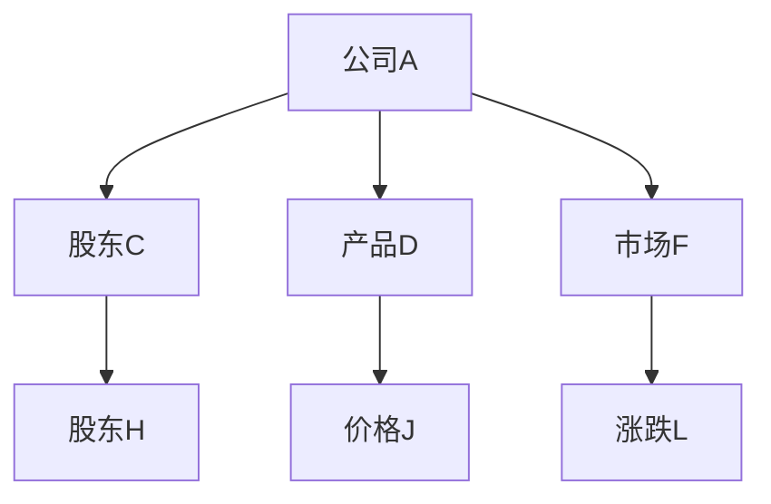

                 

# 大语言模型在金融风险预警中的推理应用探索

> 关键词：大语言模型、金融风险预警、推理应用、特征提取、风险评估、实时监测

> 摘要：本文旨在探讨大语言模型在金融风险预警中的应用，通过深入分析大语言模型的基础理论、数学基础和工作流程，结合金融数据特征提取和金融知识图谱构建，探索大语言模型在金融文本分析、风险预警指标体系构建、风险评估与预测以及实时风险监测与预警中的应用。本文还讨论了大语言模型在金融风险评估和风险管理中的优势与挑战，并对未来发展趋势进行了展望。

## 目录大纲

## 第1章 引言

### 1.1 背景与意义

#### 1.1.1 金融风险预警的重要性

#### 1.1.2 大语言模型的发展历程

#### 1.1.3 大语言模型在金融领域的潜在应用

## 第2章 大语言模型基础理论

### 2.1 大语言模型概述

#### 2.1.1 大语言模型定义

#### 2.1.2 大语言模型的特点

#### 2.1.3 大语言模型的技术原理

### 2.2 语言模型数学基础

#### 2.2.1 语言模型的基本概念

#### 2.2.2 语言模型的数学表示

#### 2.2.3 语言模型的优化算法

### 2.3 大语言模型的工作流程

#### 2.3.1 数据预处理

#### 2.3.2 模型训练

#### 2.3.3 模型评估与优化

## 第3章 大语言模型在金融数据中的应用

### 3.1 金融数据特征提取

#### 3.1.1 金融数据类型

#### 3.1.2 金融数据预处理

#### 3.1.3 金融数据特征提取方法

### 3.2 金融知识图谱构建

#### 3.2.1 金融知识图谱概述

#### 3.2.2 金融知识图谱构建方法

#### 3.2.3 金融知识图谱的应用

### 3.3 大语言模型在金融文本分析中的应用

#### 3.3.1 金融新闻文本分析

#### 3.3.2 金融报告文本分析

#### 3.3.3 金融对话系统

## 第4章 大语言模型在金融风险预警中的应用

### 4.1 风险预警指标体系构建

#### 4.1.1 风险预警指标定义

#### 4.1.2 风险预警指标选取方法

#### 4.1.3 风险预警指标体系构建流程

### 4.2 风险评估与预测

#### 4.2.1 风险评估模型构建

#### 4.2.2 风险预测模型优化

#### 4.2.3 风险预警阈值设定

### 4.3 实时风险监测与预警

#### 4.3.1 实时风险监测系统设计

#### 4.3.2 预警信息处理与展示

#### 4.3.3 风险处置与应对策略

## 第5章 大语言模型在金融风险评估中的应用

### 5.1 金融风险评估方法概述

#### 5.1.1 量化风险评估方法

#### 5.1.2 定性风险评估方法

#### 5.1.3 综合风险评估方法

### 5.2 大语言模型在金融风险评估中的应用

#### 5.2.1 大语言模型在风险评估中的作用

#### 5.2.2 大语言模型在金融风险评估中的应用案例

#### 5.2.3 大语言模型在金融风险评估中的优势与挑战

## 第6章 大语言模型在金融风险管理中的应用

### 6.1 金融风险管理概述

#### 6.1.1 金融风险管理的定义

#### 6.1.2 金融风险管理的目标

#### 6.1.3 金融风险管理的方法

### 6.2 大语言模型在金融风险管理中的应用

#### 6.2.1 大语言模型在风险管理中的应用场景

#### 6.2.2 大语言模型在风险管理中的优势

#### 6.2.3 大语言模型在金融风险管理中的实践案例

## 第7章 总结与展望

### 7.1 大语言模型在金融风险预警中的应用总结

#### 7.1.1 成功经验

#### 7.1.2 存在问题

#### 7.1.3 未来发展趋势

### 7.2 大语言模型在其他金融领域的应用展望

#### 7.2.1 金融市场预测

#### 7.2.2 金融客户关系管理

#### 7.2.3 金融合规监测与反欺诈

## 附录

### A.1 大语言模型开发工具与资源

#### A.1.1 开发工具简介

#### A.1.2 开发资源推荐

#### A.1.3 实践项目案例

### A.2 相关法律法规与伦理道德

#### A.2.1 法律法规概述

#### A.2.2 伦理道德标准

#### A.2.3 风险管理与责任分配

## 第1章 引言

### 1.1 背景与意义

#### 1.1.1 金融风险预警的重要性

金融风险预警是指在金融市场中，通过对历史数据的分析、市场动态的监控和预测模型的应用，提前发现潜在风险并采取措施进行风险控制的过程。随着金融市场全球化、复杂化和信息化的发展，金融风险呈现多样化和不确定性，这对金融机构的稳健运营提出了更高的要求。金融风险预警的重要性体现在以下几个方面：

1. **预防金融危机**：通过及时识别和预警潜在金融风险，可以避免金融危机的发生，维护金融市场的稳定。
2. **保护投资者利益**：金融风险预警可以帮助投资者更好地了解市场风险，做出合理的投资决策，保护投资者的利益。
3. **优化监管政策**：金融风险预警为监管部门提供了科学依据，有助于制定和调整监管政策，提高监管的有效性。
4. **提高金融机构竞争力**：通过有效的风险预警，金融机构可以降低风险成本，提高资金使用效率，从而提升竞争力。

#### 1.1.2 大语言模型的发展历程

大语言模型是一种基于深度学习的自然语言处理技术，它通过学习大量的文本数据，可以预测下一个词语或句子，从而生成连贯的自然语言。大语言模型的发展历程可以追溯到1980年代的统计语言模型，如N-gram模型。随着计算能力的提升和深度学习技术的突破，2000年后，神经网络语言模型如递归神经网络（RNN）和长短时记忆网络（LSTM）开始得到广泛应用。2018年，Google推出了Transformer模型，它引入了自注意力机制，使得大语言模型在自然语言处理任务上取得了显著突破。随后，BERT、GPT等基于Transformer的预训练模型相继出现，进一步推动了大语言模型的发展。

#### 1.1.3 大语言模型在金融领域的潜在应用

大语言模型在金融领域具有巨大的应用潜力，主要体现在以下几个方面：

1. **文本分析**：大语言模型可以用于分析金融新闻、报告和对话，提取关键信息，为投资者提供决策支持。
2. **风险预警**：通过分析金融文本和结构化数据，大语言模型可以识别潜在风险，构建风险预警指标体系。
3. **市场预测**：大语言模型可以处理大量历史市场数据，发现市场趋势，进行市场预测。
4. **客户关系管理**：大语言模型可以用于构建智能客服系统，提高金融机构的服务质量和客户满意度。
5. **合规监测**：大语言模型可以帮助金融机构监测金融活动，发现违规行为，确保合规运营。

总之，大语言模型在金融风险预警中的应用具有广阔的前景，它不仅能够提高金融风险管理的效率，还能够为金融市场的稳定和发展提供有力支持。接下来，我们将深入探讨大语言模型的基础理论、数学基础和工作流程，为后续章节的内容奠定基础。

## 第2章 大语言模型基础理论

### 2.1 大语言模型概述

#### 2.1.1 大语言模型定义

大语言模型（Large Language Model）是指通过学习大规模文本数据，能够对自然语言进行建模的深度学习模型。它通过捕捉文本数据中的统计规律和语义信息，实现语言理解和生成的任务。大语言模型的核心目标是预测下一个词语或句子的概率分布，从而生成连贯且符合语境的自然语言。

#### 2.1.2 大语言模型的特点

大语言模型具有以下几个显著特点：

1. **大规模**：大语言模型通常需要训练在数万亿字的文本数据上，以捕捉语言中的复杂模式和长期依赖关系。
2. **深度学习**：大语言模型基于深度神经网络，特别是Transformer架构，能够处理复杂的非线性关系。
3. **预训练**：大语言模型通过预训练阶段在大量无标签数据上学习语言规律，然后在特定任务上进行微调。
4. **上下文理解**：大语言模型能够理解句子或段落中的上下文信息，生成连贯且相关的文本。

#### 2.1.3 大语言模型的技术原理

大语言模型的技术原理主要基于以下三个方面：

1. **自注意力机制（Self-Attention）**：自注意力机制允许模型在处理每个词时，动态地关注文本序列中的其他词，从而捕捉到长距离的依赖关系。
2. **Transformer架构**：Transformer架构是一种基于自注意力机制的序列到序列模型，它通过多头注意力机制和位置编码，提高了模型的表达能力和生成质量。
3. **预训练与微调**：预训练阶段，模型在大量无标签数据上学习语言的通用特征；微调阶段，模型在特定任务上有监督数据上进行训练，以实现任务的具体目标。

### 2.2 语言模型数学基础

#### 2.2.1 语言模型的基本概念

在讨论语言模型的数学基础时，我们首先需要了解几个基本概念：

1. **词汇表（Vocabulary）**：词汇表是模型能够处理的词语集合。在自然语言处理中，通常使用单词、字符或子词作为词汇表的基本单元。
2. **词嵌入（Word Embedding）**：词嵌入是将词汇表中的词语映射到高维向量空间中，以便模型能够处理和比较词语。
3. **序列（Sequence）**：序列是由一系列词语按特定顺序排列组成的文本。

#### 2.2.2 语言模型的数学表示

语言模型的数学表示通常涉及以下几部分：

1. **输入表示（Input Representation）**：输入表示是将词汇表中的词语映射到向量空间的过程。常见的词嵌入技术包括词袋模型（Bag of Words）、连续词袋模型（Continuous Bag of Words）和词嵌入（Word Embedding）。
2. **注意力机制（Attention Mechanism）**：注意力机制是模型在处理序列时，动态地关注序列中的不同部分的能力。注意力机制可以分为自注意力（Self-Attention）和互注意力（Cross-Attention）。
3. **输出表示（Output Representation）**：输出表示是模型对输入序列的最终处理结果。在语言模型中，输出表示通常是生成下一个词语的概率分布。

#### 2.2.3 语言模型的优化算法

语言模型的优化算法通常包括以下几种：

1. **梯度下降（Gradient Descent）**：梯度下降是一种用于优化模型参数的基本算法。通过计算损失函数关于参数的梯度，模型能够调整参数，以最小化损失函数。
2. **Adam优化器（Adam Optimizer）**：Adam优化器是梯度下降的一种改进，它结合了动量（Momentum）和自适应学习率（Adaptive Learning Rate），提高了优化效果。
3. **正则化（Regularization）**：正则化是一种防止模型过拟合的技术。常见的正则化方法包括L1正则化、L2正则化和dropout。

### 2.3 大语言模型的工作流程

大语言模型的工作流程可以分为以下几个阶段：

#### 2.3.1 数据预处理

数据预处理是模型训练的第一步，主要包括以下任务：

1. **文本清洗**：去除文本中的噪声和无关信息，如HTML标签、特殊字符和停用词。
2. **分词**：将文本分割成词语或子词，以便进行词嵌入。
3. **构建词汇表**：从训练数据中提取词汇表，并将词语映射到索引。

#### 2.3.2 模型训练

模型训练阶段包括以下步骤：

1. **初始化参数**：随机初始化模型参数。
2. **前向传播（Forward Propagation）**：计算输入序列的输出概率分布。
3. **后向传播（Back Propagation）**：计算损失函数关于参数的梯度，并更新参数。
4. **迭代训练**：重复前向传播和后向传播，直到模型收敛或达到预设的训练次数。

#### 2.3.3 模型评估与优化

模型评估与优化阶段主要包括以下任务：

1. **评估指标**：选择合适的评估指标，如损失函数、精确率、召回率和F1分数，来评估模型性能。
2. **模型调优**：通过调整模型参数和超参数，优化模型性能。
3. **迁移学习（Transfer Learning）**：使用预训练模型作为起点，在特定任务上进行微调，以节省训练时间和提高性能。

通过以上几个阶段，大语言模型可以从大规模文本数据中学习语言规律，实现自然语言处理任务。接下来，我们将探讨大语言模型在金融数据中的应用，以及如何利用这些模型进行金融风险预警。

### 3.1 金融数据特征提取

金融数据的特征提取是金融风险预警中至关重要的步骤，因为它决定了模型能否有效地捕捉到金融市场的风险信号。以下将详细讨论金融数据类型、数据预处理以及特征提取方法。

#### 3.1.1 金融数据类型

金融数据类型主要包括结构化数据和半结构化/非结构化数据。结构化数据通常包括交易数据、账户信息、财务报表等，它们通常以表格形式存储，便于处理和计算。半结构化/非结构化数据则包括金融新闻、报告、论坛帖子等，这些数据通常以文本、图像或音频的形式存在。

1. **交易数据**：交易数据包括股票、债券、期货等金融产品的交易记录，如交易价格、交易量、交易时间等。
2. **账户信息**：账户信息包括客户的财务状况、交易历史、信用记录等。
3. **财务报表**：财务报表包括公司的财务状况、盈利能力、偿债能力等关键财务指标。
4. **金融新闻**：金融新闻包括媒体报道、评论、分析等，它们反映了市场情绪和潜在风险。
5. **报告**：报告包括经济预测、市场分析、行业研究等，它们提供了关于市场趋势和风险的深度分析。

#### 3.1.2 金融数据预处理

金融数据预处理是特征提取的重要前置步骤，其目的是清洗和准备数据，以便后续的特征提取和模型训练。以下是一些常见的金融数据预处理方法：

1. **数据清洗**：去除重复数据、缺失值填充、异常值处理等，以提高数据的完整性和准确性。
2. **数据转换**：将不同类型的金融数据（如日期、货币值）转换为统一的格式，以便于计算和建模。
3. **数据归一化**：通过归一化或标准化处理，将数据缩放到相同的范围，以消除不同特征之间的尺度差异。
4. **数据降维**：通过主成分分析（PCA）、特征选择等方法，减少数据的维度，提高模型的效率和泛化能力。

#### 3.1.3 金融数据特征提取方法

金融数据特征提取的方法可以分为传统方法和基于深度学习的方法。以下是一些常用的特征提取方法：

1. **统计特征**：统计特征是通过计算数据的统计属性来提取的，如平均值、方差、标准差、偏度、峰度等。这些特征能够反映数据的分布特性和波动性。
2. **技术指标**：技术指标是通过对历史交易数据进行数学变换得到的，如移动平均线、相对强弱指数（RSI）、布林带等。这些指标能够揭示市场趋势和波动性。
3. **文本特征**：对于金融新闻和报告等非结构化数据，可以通过词袋模型、TF-IDF、Word2Vec等方法提取文本特征。这些特征能够捕捉到文本的语义信息和市场情绪。
4. **深度特征**：基于深度学习的特征提取方法，如卷积神经网络（CNN）、循环神经网络（RNN）和Transformer等，可以自动提取复杂的高层次特征。这些特征能够更好地捕捉到金融数据的内在规律和潜在风险。

通过以上方法，我们可以从金融数据中提取出有用的特征，为后续的风险预警模型提供输入。在下一节中，我们将探讨如何利用大语言模型构建金融知识图谱，进一步挖掘金融数据的潜在价值。

### 3.2 金融知识图谱构建

#### 3.2.1 金融知识图谱概述

金融知识图谱是一种结构化的知识表示方法，它通过实体、属性和关系的网络结构，将金融领域中的知识和信息进行组织和管理。金融知识图谱旨在构建一个全面、准确和关联性强的知识体系，以便于金融数据的分析和应用。

1. **实体（Entity）**：金融知识图谱中的实体代表金融领域中的各种对象，如公司、产品、市场、人物等。
2. **属性（Attribute）**：属性是实体的特征描述，如公司的市值、产品的价格、市场的涨跌等。
3. **关系（Relation）**：关系描述了实体之间的相互联系，如公司的股东、产品的供应商、市场的参与者等。

#### 3.2.2 金融知识图谱构建方法

金融知识图谱的构建通常包括以下几个步骤：

1. **数据采集**：从各种数据源（如数据库、网页、报告等）采集金融数据，包括实体、属性和关系。
2. **数据清洗**：清洗和预处理采集到的数据，去除噪声、异常值和重复信息。
3. **实体识别**：利用自然语言处理技术，从文本数据中识别出实体，并将其映射到知识图谱中的实体节点。
4. **属性抽取**：从文本和结构化数据中抽取实体的属性，并将其与实体节点关联。
5. **关系抽取**：从文本和结构化数据中抽取实体之间的关系，并将其与实体节点关联。
6. **知识融合**：将来自不同来源的数据进行融合，以消除不一致性和冲突，构建一个统一的知识图谱。

#### 3.2.3 金融知识图谱的应用

金融知识图谱在金融风险预警中具有广泛的应用，主要包括以下几个方面：

1. **风险识别**：通过分析实体之间的关系，可以识别出潜在的金融风险，如关联交易、资金流向、市场操纵等。
2. **风险监测**：实时更新和维护金融知识图谱，可以监测金融市场的动态变化，发现潜在风险信号。
3. **决策支持**：利用金融知识图谱，可以提供个性化的投资建议和风险管理策略，提高决策的准确性和效率。
4. **合规监测**：通过分析实体和关系，可以监测金融活动是否符合法律法规，发现潜在的违规行为。

#### 3.2.4 金融知识图谱的构建示例

以下是一个简单的金融知识图谱构建示例：

在这个示例中，我们构建了一个简单的知识图谱，其中包含了公司、股东、产品和市场等实体，以及它们之间的关联关系。

- **公司A**：实体，代表一家公司。
- **股东C**：实体，代表公司的股东。
- **产品D**：实体，代表公司销售的产品。
- **市场F**：实体，代表公司所在的市场。
- **股东G**：实体，代表公司的另一个股东。
- **价格J**：属性，描述产品的价格。
- **涨跌L**：属性，描述市场的涨跌情况。

通过金融知识图谱的构建，我们可以更好地理解和分析金融数据，为金融风险预警提供有力支持。在下一节中，我们将探讨如何利用大语言模型对金融文本进行分析，挖掘潜在的风险信息。

### 3.3 大语言模型在金融文本分析中的应用

#### 3.3.1 金融新闻文本分析

金融新闻文本分析是利用大语言模型对金融新闻进行自动处理和解读，以提取关键信息、分析和理解市场动态的过程。以下是大语言模型在金融新闻文本分析中的应用：

1. **情感分析**：通过分析新闻文本中的情感倾向（如积极、消极、中性），可以判断市场情绪的变化。例如，如果多篇新闻报道中情绪积极，可能预示着市场上涨的趋势。

2. **主题识别**：大语言模型可以识别出新闻文本中的主题，如市场趋势、公司财报、政策变化等。这些主题有助于投资者了解市场关注的重点和潜在风险。

3. **事件提取**：通过分析新闻文本，可以提取出具体的事件，如公司收购、破产、重大订单等。这些事件对市场有直接影响，需要引起关注。

4. **关键词提取**：大语言模型可以提取出新闻文本中的关键词，如“股市”、“波动率”、“利率”等。这些关键词有助于进一步分析和解读新闻内容。

#### 3.3.2 金融报告文本分析

金融报告文本分析是对金融报告（如公司财报、经济预测报告等）进行自动处理和解读，以提取关键信息、分析和理解报告内容的过程。以下是大语言模型在金融报告文本分析中的应用：

1. **关键指标提取**：大语言模型可以从报告中提取出关键财务指标，如营收、利润、增长率等。这些指标有助于投资者评估公司的财务状况。

2. **趋势分析**：通过分析报告中的数据趋势，如收入增长率、利润率变化等，可以预测公司的未来表现和市场趋势。

3. **风险评估**：大语言模型可以分析报告中的风险提示和不确定性因素，如市场波动、政策变化等。这些信息对投资者评估投资风险至关重要。

4. **摘要生成**：大语言模型可以生成报告的摘要，提取出最重要的信息和观点。这有助于投资者快速了解报告的主要内容，节省阅读时间。

#### 3.3.3 金融对话系统

金融对话系统是利用大语言模型构建的自动化金融咨询系统，它可以与用户进行自然语言交互，回答用户的问题、提供投资建议和风险管理策略。以下是大语言模型在金融对话系统中的应用：

1. **问答系统**：用户可以通过自然语言提问，如“最近市场如何？”或“哪家公司的股票值得投资？”，大语言模型可以理解并回答这些问题。

2. **投资建议**：大语言模型可以根据用户的风险偏好、投资目标和市场动态，提供个性化的投资建议。

3. **风险管理**：大语言模型可以分析用户的交易记录和投资组合，提供风险管理策略，如资产配置、止损点设置等。

4. **用户交互**：大语言模型可以与用户进行实时对话，解答用户的问题，提高用户体验。

通过金融新闻文本分析、金融报告文本分析和金融对话系统，大语言模型可以深入挖掘金融文本中的潜在信息，为投资者提供全面、准确和实时的市场分析和风险管理支持。在下一节中，我们将探讨如何构建风险预警指标体系，进一步应用大语言模型进行金融风险预警。

## 第4章 大语言模型在金融风险预警中的应用

### 4.1 风险预警指标体系构建

#### 4.1.1 风险预警指标定义

风险预警指标是用于评估和监测金融市场中潜在风险的一系列指标。这些指标反映了金融市场的波动性、稳定性以及可能存在的系统性风险。以下是一些常见风险预警指标的定义：

1. **波动率（Volatility）**：波动率是衡量市场波动性的指标，通常用历史价格的方差或标准差来计算。高波动率通常预示着市场的不稳定和潜在风险。

2. **交易量（Trading Volume）**：交易量是指在一定时间内金融产品的交易数量。交易量的显著变化可能表明市场情绪的变化，从而影响风险水平。

3. **价格变化（Price Change）**：价格变化是指金融产品价格在一段时间内的涨跌幅度。价格剧烈波动可能预示着市场风险的增加。

4. **利差（Spread）**：利差是指两种不同金融产品的收益率差异。利差的变化可能反映了市场对不同金融产品的风险评估。

5. **违约率（Default Rate）**：违约率是指金融机构或企业在一定时间内发生违约的概率。违约率上升通常预示着金融市场的系统性风险增加。

6. **信贷状况（Credit Condition）**：信贷状况反映了金融机构的信用水平和信贷市场的流动性。信贷状况的恶化可能引发金融市场的连锁反应。

#### 4.1.2 风险预警指标选取方法

在构建风险预警指标体系时，需要选择合适的指标，以确保预警系统的准确性和有效性。以下是一些常见的风险预警指标选取方法：

1. **专家评估法**：邀请金融领域的专家对各种指标的重要性进行评估，选择与风险紧密相关的指标。

2. **统计分析法**：通过历史数据分析，找出与金融市场波动性、稳定性相关的指标，并根据相关性大小进行筛选。

3. **特征选择法**：利用机器学习算法，如特征选择算法，从大量的金融数据中自动提取与风险相关的指标。

4. **综合评估法**：结合专家评估、统计分析和特征选择方法，构建一个综合的指标评估体系。

#### 4.1.3 风险预警指标体系构建流程

构建一个有效的风险预警指标体系需要经过以下几个步骤：

1. **数据收集**：收集与金融市场相关的各种数据，包括交易数据、财务数据、市场数据等。

2. **数据预处理**：对收集到的数据进行清洗、转换和归一化处理，以消除噪声和异常值。

3. **指标计算**：根据风险预警指标的定义，计算每个指标的具体数值。

4. **指标筛选**：根据专家评估、统计分析和特征选择方法，筛选出与风险紧密相关的指标。

5. **指标权重分配**：对筛选出的指标进行权重分配，以反映它们在风险预警中的重要性。

6. **指标体系构建**：将筛选出的指标整合成一个完整的预警指标体系，并建立相应的预警阈值。

通过以上步骤，我们可以构建一个全面、准确和有效的风险预警指标体系，为大语言模型在金融风险预警中的应用奠定基础。在下一节中，我们将探讨如何利用大语言模型进行风险评估和预测，以提高风险预警的准确性。

### 4.2 风险评估与预测

#### 4.2.1 风险评估模型构建

风险评估模型是用于评估金融市场中潜在风险水平的模型。构建一个有效的风险评估模型需要以下几个关键步骤：

1. **数据收集与处理**：收集与金融市场相关的数据，如股票价格、交易量、利率等。对数据进行清洗、转换和归一化处理，以确保数据的准确性和一致性。

2. **特征选择**：从处理后的数据中选择与风险相关的特征。可以使用机器学习算法（如特征选择算法）来自动选择特征，也可以根据专家经验进行手动选择。

3. **模型选择**：选择适合风险评估的机器学习模型。常见的选择包括线性回归、决策树、支持向量机（SVM）、随机森林和神经网络等。

4. **模型训练**：使用训练数据集对选定的模型进行训练，调整模型参数，以优化模型的性能。

5. **模型验证**：使用验证数据集对训练好的模型进行验证，评估模型的泛化能力和预测准确性。

6. **模型优化**：根据验证结果，调整模型参数或选择不同的模型，以提高风险评估的准确性。

#### 4.2.2 风险预测模型优化

风险预测模型的优化是提高预测准确性和稳定性的重要步骤。以下是一些常见的优化方法：

1. **特征工程**：通过数据预处理和特征选择，提取更有助于预测风险的特征。例如，可以使用技术指标、文本特征和组合特征等。

2. **模型融合**：结合多个模型的预测结果，以减少预测误差。常见的方法包括加权平均、堆叠学习和集成学习等。

3. **超参数调优**：调整模型的超参数，以优化模型的性能。可以使用网格搜索、随机搜索或贝叶斯优化等方法。

4. **正则化**：使用正则化技术（如L1正则化、L2正则化）来防止模型过拟合，提高模型的泛化能力。

5. **交叉验证**：使用交叉验证方法，如K折交叉验证，评估模型的稳定性和预测准确性。

6. **动态调整**：根据市场动态和风险变化，动态调整模型的预测策略和参数，以保持预测的实时性和准确性。

#### 4.2.3 风险预警阈值设定

风险预警阈值的设定是确保风险预警系统有效性的关键步骤。以下是一些常见的阈值设定方法：

1. **历史阈值**：根据历史数据，计算风险指标的阈值。例如，使用过去一段时间内风险指标的均值和标准差，设定预警阈值。

2. **统计阈值**：使用统计学方法，如假设检验或置信区间，设定风险指标的预警阈值。

3. **专家评估**：邀请金融专家根据经验和专业知识，设定风险指标的预警阈值。

4. **机器学习**：使用机器学习算法，如决策树或神经网络，自动设定风险指标的预警阈值。

5. **动态调整**：根据市场动态和风险变化，动态调整预警阈值，以保持预警系统的实时性和有效性。

通过构建和优化风险评估与预测模型，设定合理的风险预警阈值，我们可以构建一个高效、准确的金融风险预警系统。这将为金融机构和投资者提供有力支持，帮助他们及时识别和应对金融风险。在下一节中，我们将探讨如何设计实时风险监测与预警系统，以提高金融风险管理的实时性和有效性。

### 4.3 实时风险监测与预警

#### 4.3.1 实时风险监测系统设计

实时风险监测系统是金融风险管理的重要组成部分，它能够及时捕捉金融市场中的风险信号，为投资者和金融机构提供决策支持。以下是一个实时风险监测系统的设计框架：

1. **数据采集模块**：从各种数据源（如交易所、新闻网站、社交媒体等）实时采集金融数据，包括股票价格、交易量、市场指数等。

2. **数据处理模块**：对采集到的金融数据进行分析、清洗和预处理，去除噪声和异常值，并将数据转换为适合模型处理的格式。

3. **特征提取模块**：利用大语言模型和其他机器学习技术，从金融数据中提取与风险相关的特征，如波动率、交易量变化、价格趋势等。

4. **风险评估模块**：使用训练好的风险评估模型，对提取的特征进行实时评估，计算风险得分，以判断市场风险水平。

5. **预警信号生成模块**：根据设定的风险阈值，当风险得分超过预警阈值时，系统生成相应的预警信号，如市场波动加剧、特定股票的风险等。

6. **预警信息处理与展示模块**：将生成的预警信息进行处理和展示，通过可视化界面或告警系统，将预警信息及时传递给相关用户。

7. **决策支持模块**：提供个性化的投资建议和风险管理策略，帮助投资者和金融机构制定应对措施。

#### 4.3.2 预警信息处理与展示

预警信息的处理与展示是实时风险监测系统的重要环节，它决定了预警信息的及时性和准确性。以下是一些常用的预警信息处理与展示方法：

1. **实时告警**：通过邮件、短信、即时通讯工具等实时通知用户预警信息，确保用户能够及时了解到市场风险变化。

2. **可视化报表**：利用图表、曲线图、热图等可视化工具，将预警信息以直观、易懂的方式展示给用户。

3. **预警排名**：根据预警信号的重要性和紧急程度，对预警信息进行排名，帮助用户快速识别和应对高风险事件。

4. **历史记录**：记录和存储所有预警信息的历史数据，供用户查询和分析，以帮助用户总结经验、优化决策。

5. **交互式查询**：提供交互式查询功能，用户可以自定义查询条件，查看特定时间窗口内的预警信息。

通过高效的预警信息处理与展示，实时风险监测系统能够帮助用户快速响应市场变化，制定有效的风险管理策略。在下一节中，我们将探讨如何通过风险处置与应对策略，最大限度地降低金融风险的影响。

### 4.3.3 风险处置与应对策略

在实时风险监测与预警系统生成预警信号后，风险处置与应对策略的制定和执行至关重要。以下是一些常见的风险处置与应对策略：

#### 1. 风险分类与评估

在处置风险前，首先需要对风险进行分类和评估，以便制定针对性的应对策略。风险可以根据性质、影响范围和紧急程度进行分类，如市场风险、信用风险、操作风险等。评估风险时，应考虑风险发生的概率、潜在的损失程度以及对整个金融体系的影响。

#### 2. 风险隔离与控制

对于高风险事件，应采取隔离和控制措施，以防止风险扩散。例如，在市场波动较大时，可以暂停某些高风险金融产品的交易，限制资金流动，以降低市场风险。对于信用风险，可以采取增加抵押品、限制信贷额度等措施，以降低信用风险。

#### 3. 风险预警与信息沟通

在风险发生时，及时预警和有效沟通是关键。通过实时风险监测系统，将预警信息及时传递给相关利益相关者，包括投资者、监管机构和金融机构。此外，定期发布风险预警报告，为公众提供风险信息，增强市场透明度。

#### 4. 应对措施制定

根据风险分类和评估结果，制定具体的应对措施。对于市场风险，可以采取调整投资组合、分散投资等措施；对于信用风险，可以采取追讨欠款、重组债务等措施；对于操作风险，可以采取加强内部控制、提高员工培训等措施。

#### 5. 恢复与重建

在风险事件发生后，金融机构和投资者需要采取措施进行恢复和重建。这包括恢复正常运营、重建信心、加强监管等。恢复和重建过程中，应关注风险事件的根源，采取有效的措施防止类似事件再次发生。

#### 6. 法律法规与伦理道德

在风险处置与应对策略中，法律法规和伦理道德的遵守至关重要。金融机构和投资者应严格遵守相关法律法规，确保风险处置的合规性。同时，应遵循伦理道德标准，保护投资者利益，维护金融市场秩序。

通过有效的风险处置与应对策略，金融机构和投资者可以最大限度地降低金融风险的影响，确保金融市场的稳定运行。在下一章中，我们将探讨大语言模型在金融风险评估中的应用，进一步挖掘其在金融风险管理中的潜力。

### 5.1 金融风险评估方法概述

#### 5.1.1 量化风险评估方法

量化风险评估方法是通过使用数学模型和统计方法对金融风险进行评估的方法。这些方法主要依赖于历史数据和统计分析，以预测未来的风险水平。以下是一些常见的量化风险评估方法：

1. **方差分析**：通过计算历史数据中的方差和标准差，评估市场的波动性和风险水平。
2. **价值在风险（Value at Risk, VaR）**：VaR是一种常见的量化风险指标，用于估计在特定时间内，特定置信水平下的最大可能损失。
3. **条件价值在风险（Conditional Value at Risk, CVaR）**：CVaR扩展了VaR的概念，考虑了超过VaR阈值的损失的平均值，提供了对风险分布更全面的描述。
4. **蒙特卡洛模拟**：通过模拟大量随机样本来估计金融产品的价格分布和风险水平，常用于计算VaR和CVaR。
5. **动态套利模型**：利用金融市场的套利机会，构建模型评估市场的稳定性和风险水平。

#### 5.1.2 定性风险评估方法

定性风险评估方法主要依赖于专家判断和经验，通过分析风险因素、风险情景和潜在影响来评估风险。以下是一些常见的定性风险评估方法：

1. **风险矩阵**：通过定义风险概率和影响，将风险分为不同等级，以便于评估和优先处理。
2. **风险树分析**：构建风险事件的可能性和影响路径，以识别和评估风险的潜在后果。
3. **情景分析**：通过模拟不同风险情景，分析风险的可能性和影响，制定应对措施。
4. **专家评估法**：邀请金融专家对风险进行评估，基于他们的经验和判断，提供风险分析报告。
5. **压力测试**：通过模拟极端市场条件，评估金融机构在压力下的风险承受能力。

#### 5.1.3 综合风险评估方法

综合风险评估方法结合了量化评估方法和定性评估方法，以提供更全面和准确的风险评估。以下是一些常见的综合风险评估方法：

1. **层次分析法（AHP）**：通过建立层次结构模型，将定量和定性评估因素进行权重分配，以综合评估风险。
2. **多标准决策分析**：考虑多个评估指标和目标，使用多标准决策分析方法，如线性加权法、TOPSIS法等，进行综合风险评估。
3. **贝叶斯网络**：利用贝叶斯网络模型，结合概率理论和专家知识，对风险因素进行综合评估。
4. **模糊综合评价法**：使用模糊集合和模糊逻辑，对风险因素进行综合评估，以处理不确定性和模糊性。

通过以上方法，金融机构和投资者可以全面评估金融风险，为风险管理提供科学依据。在下一节中，我们将探讨大语言模型在金融风险评估中的应用，进一步展示其在金融风险管理中的潜力。

### 5.2 大语言模型在金融风险评估中的应用

#### 5.2.1 大语言模型在风险评估中的作用

大语言模型在金融风险评估中具有重要作用，主要体现在以下几个方面：

1. **文本分析**：大语言模型可以处理大量金融文本数据，如新闻、报告、社交媒体等，提取关键信息，进行情感分析和主题识别，为风险评估提供额外的信息来源。

2. **特征提取**：大语言模型能够从文本数据中提取出高层次的语义特征，这些特征通常比传统的文本处理方法（如词袋模型和TF-IDF）更具有代表性和解释性，有助于提高风险评估的准确性。

3. **风险预测**：大语言模型可以处理复杂的金融数据，包括结构化和非结构化数据，通过学习和预测历史数据中的模式，为未来的风险水平提供预测。

4. **风险识别**：大语言模型能够识别出金融数据中的潜在风险信号，如异常交易模式、市场波动等，有助于提前预警潜在风险。

5. **决策支持**：大语言模型可以提供个性化的投资建议和风险管理策略，为金融机构和投资者提供决策支持，帮助他们做出更明智的决策。

#### 5.2.2 大语言模型在金融风险评估中的应用案例

以下是一些大语言模型在金融风险评估中的应用案例：

1. **股票市场风险评估**：通过分析股票市场的历史数据，如股票价格、交易量、财务报表等，大语言模型可以预测股票市场的未来走势，评估市场的风险水平。例如，某金融机构使用基于GPT-3的模型对股票市场进行风险评估，成功预测了市场波动，帮助投资者制定了相应的交易策略。

2. **信贷风险评估**：大语言模型可以处理客户的信用历史、交易记录、财务状况等数据，评估客户违约的风险。例如，某银行使用基于BERT的模型对信贷申请进行风险评估，提高了贷款审批的效率和准确性。

3. **市场情绪分析**：通过分析金融新闻、社交媒体和论坛等文本数据，大语言模型可以识别市场情绪的变化，为市场风险评估提供支持。例如，某投资公司使用基于LSTM的模型分析新闻文本，成功预测了市场情绪的转折点，帮助投资者及时调整投资组合。

4. **金融欺诈检测**：大语言模型可以识别金融交易中的异常行为，如洗钱、欺诈等，为金融机构提供风险预警。例如，某银行使用基于Transformer的模型监测交易数据，成功识别并阻止了一系列欺诈交易。

#### 5.2.3 大语言模型在金融风险评估中的优势与挑战

大语言模型在金融风险评估中具有显著的优势，但也面临一些挑战：

**优势：**

1. **处理能力强**：大语言模型能够处理和整合大量的结构化和非结构化数据，提高风险评估的全面性和准确性。

2. **自动特征提取**：大语言模型能够自动提取文本数据中的高层次语义特征，减少人工特征工程的工作量。

3. **实时预测**：大语言模型可以实时分析金融数据，提供快速的风险评估和预测。

4. **灵活性**：大语言模型可以根据不同的金融风险评估需求进行定制和调整，适应各种应用场景。

**挑战：**

1. **数据质量**：金融数据通常存在噪声和异常值，影响模型的效果。因此，需要确保数据质量，进行有效的数据预处理。

2. **解释性**：大语言模型的预测结果通常缺乏透明性和解释性，难以理解预测的依据和机制。

3. **模型可解释性**：尽管大语言模型在文本分析方面表现出色，但其内部决策过程仍然难以解释，这可能会对模型的信任度和可接受性产生负面影响。

4. **计算资源**：大语言模型的训练和推理通常需要大量的计算资源，对于资源有限的金融机构可能是一个挑战。

通过克服这些挑战，充分发挥大语言模型的优势，我们可以构建更高效、准确的金融风险评估系统，为金融机构和投资者提供有力的支持。在下一章中，我们将探讨大语言模型在金融风险管理中的应用，进一步展示其在金融风险管理中的潜力。

## 第6章 大语言模型在金融风险管理中的应用

### 6.1 金融风险管理概述

#### 6.1.1 金融风险管理的定义

金融风险管理是指金融机构和管理者采取的一系列策略和措施，旨在识别、评估、监控和应对金融风险，以确保金融机构的稳健运营和持续发展。金融风险管理包括以下几个方面：

1. **风险识别**：识别潜在的金融风险，包括市场风险、信用风险、操作风险、流动性风险等。
2. **风险评估**：对识别出的风险进行量化或定性评估，以确定风险的重要性和潜在影响。
3. **风险监控**：实时监控金融风险的动态变化，确保及时发现和应对潜在风险。
4. **风险应对**：制定和实施应对措施，包括风险规避、风险转移、风险缓解等。

#### 6.1.2 金融风险管理的目标

金融风险管理的目标主要包括以下几个方面：

1. **降低风险损失**：通过有效的风险管理，降低金融机构面临的潜在风险，减少潜在的损失。
2. **确保稳健运营**：通过风险控制，确保金融机构能够持续、稳健地运营，维护市场信心。
3. **提高盈利能力**：通过风险管理，优化资金配置和使用，提高金融机构的盈利能力。
4. **合规性**：确保金融机构遵守相关法律法规，降低违规操作带来的风险。

#### 6.1.3 金融风险管理的方法

金融风险管理的方法主要包括以下几个方面：

1. **量化方法**：通过数学模型和统计方法，对金融风险进行量化评估，如VaR模型、蒙特卡洛模拟等。
2. **定性方法**：基于专家经验和主观判断，对金融风险进行定性分析，如风险矩阵、情景分析等。
3. **组合方法**：结合量化方法和定性方法，进行综合风险评估和管理。
4. **操作风险管理**：通过加强内部控制、提高员工培训等手段，降低操作风险。
5. **流动性风险管理**：通过流动性预测和资金管理，确保金融机构在市场波动时的流动性需求。

### 6.2 大语言模型在金融风险管理中的应用

#### 6.2.1 大语言模型在风险管理中的应用场景

大语言模型在金融风险管理中具有广泛的应用场景，包括以下几个方面：

1. **风险识别**：通过分析金融文本数据（如新闻、报告、社交媒体等），大语言模型可以识别出潜在的市场风险和操作风险。
2. **风险评估**：大语言模型可以处理和整合大量的结构化和非结构化数据，对风险进行量化评估，提高风险评估的准确性。
3. **风险监控**：大语言模型可以实时分析金融数据，监控风险的变化，及时预警潜在风险。
4. **决策支持**：大语言模型可以提供个性化的风险管理策略和投资建议，为金融机构和投资者提供决策支持。
5. **合规监测**：大语言模型可以用于监测金融活动，发现潜在的合规风险，确保金融机构的合规运营。

#### 6.2.2 大语言模型在风险管理中的优势

大语言模型在金融风险管理中的优势主要体现在以下几个方面：

1. **强大的数据处理能力**：大语言模型能够处理大量的结构化和非结构化金融数据，提供全面的风险评估。
2. **自动特征提取**：大语言模型可以自动提取文本数据中的高层次语义特征，减少人工特征工程的工作量。
3. **实时预测**：大语言模型可以实时分析金融数据，提供快速的风险预测和预警。
4. **灵活性**：大语言模型可以根据不同的风险管理需求进行定制和调整，适应各种应用场景。
5. **高准确性**：大语言模型在自然语言处理领域取得了显著突破，能够提高金融风险评估的准确性。

#### 6.2.3 大语言模型在金融风险管理中的实践案例

以下是一些大语言模型在金融风险管理中的实践案例：

1. **市场风险预测**：某金融机构使用基于LSTM的模型分析市场数据，成功预测了市场波动，帮助投资者制定了相应的风险管理策略。

2. **信贷风险评估**：某银行使用基于BERT的模型评估客户信用风险，提高了贷款审批的效率和准确性。

3. **操作风险监控**：某金融机构使用基于Transformer的模型监测交易数据，成功识别并阻止了一系列操作风险事件。

4. **合规监测**：某投资公司使用基于GPT-3的模型监测金融活动，发现并解决了多项潜在的合规风险。

通过这些实践案例，我们可以看到大语言模型在金融风险管理中的广泛应用和显著效果。在下一章中，我们将总结大语言模型在金融风险预警中的应用，并对未来发展趋势进行展望。

## 第7章 总结与展望

### 7.1 大语言模型在金融风险预警中的应用总结

#### 7.1.1 成功经验

大语言模型在金融风险预警中的应用取得了显著的成果，具体表现在以下几个方面：

1. **提高预警准确性**：通过处理大量的金融数据和文本，大语言模型能够提取出关键特征，提高风险预警的准确性，帮助金融机构及时识别潜在风险。
2. **实时风险监测**：大语言模型能够实时分析金融数据，监控市场动态，提供实时预警，为金融机构和投资者提供决策支持。
3. **自动化特征提取**：大语言模型能够自动提取文本数据中的高层次语义特征，减少人工特征工程的工作量，提高特征提取的效率和准确性。
4. **多样化的应用场景**：大语言模型在金融新闻分析、信贷风险评估、操作风险监控等多个领域取得了成功，展示了其广泛的应用潜力。

#### 7.1.2 存在问题

尽管大语言模型在金融风险预警中表现出色，但仍然存在一些问题需要解决：

1. **数据质量**：金融数据通常存在噪声和异常值，影响模型的效果。因此，需要确保数据质量，进行有效的数据预处理。
2. **模型解释性**：大语言模型的预测结果通常缺乏透明性和解释性，难以理解预测的依据和机制，这可能会对模型的信任度和可接受性产生负面影响。
3. **计算资源**：大语言模型的训练和推理通常需要大量的计算资源，对于资源有限的金融机构可能是一个挑战。
4. **法律法规与伦理道德**：大语言模型的应用需要遵循相关法律法规和伦理道德标准，确保数据安全和隐私保护。

#### 7.1.3 未来发展趋势

随着大语言模型技术的不断进步和应用领域的扩展，未来在大语言模型在金融风险预警中的应用有望实现以下几个发展趋势：

1. **更高效的数据处理**：随着计算能力的提升和大数据技术的发展，大语言模型将能够处理更多的金融数据，提高预警系统的效率和准确性。
2. **增强模型解释性**：通过研究和开发可解释性更强的大语言模型，提高模型的可信度和可接受性，增强决策者的理解能力。
3. **跨领域应用**：大语言模型将在金融、医疗、能源等多个领域得到广泛应用，跨领域的融合将为金融风险预警带来新的突破。
4. **实时风险预测**：通过实时分析和预测技术，大语言模型将能够提供更加实时和精准的风险预警，为金融机构和投资者提供更有效的风险管理策略。

### 7.2 大语言模型在其他金融领域的应用展望

除了在金融风险预警中的应用，大语言模型在其他金融领域也具有广阔的应用前景：

#### 7.2.1 金融市场预测

大语言模型可以通过处理历史市场数据和文本信息，预测股票价格、市场指数等金融指标，为投资者提供市场趋势分析和投资建议。

#### 7.2.2 金融客户关系管理

大语言模型可以用于分析客户数据和行为模式，提供个性化的金融服务和产品推荐，提高客户满意度和忠诚度。

#### 7.2.3 金融合规监测与反欺诈

大语言模型可以监测金融活动，识别潜在的合规风险和欺诈行为，确保金融机构的合规运营和风险控制。

总之，大语言模型在金融领域的应用具有巨大的潜力，随着技术的不断发展和应用领域的拓展，它将为金融行业带来深刻变革。在未来的发展中，我们需要进一步探索大语言模型在金融领域的应用，充分发挥其优势，为金融风险管理和市场发展提供有力支持。

## 附录

### A.1 大语言模型开发工具与资源

#### A.1.1 开发工具简介

- **PyTorch**: 强大的深度学习框架，支持动态计算图和自动微分，易于研究和原型设计。
- **TensorFlow**: Google开发的深度学习框架，支持静态和动态计算图，广泛应用于工业和学术研究。
- **Transformers**: Hugging Face开源的Transformer库，提供多种预训练模型和API，支持多种NLP任务。

#### A.1.2 开发资源推荐

- **《深度学习》（Goodfellow, Bengio, Courville著）**: 深度学习领域经典的入门书籍，涵盖深度学习的基础理论和应用。
- **《自然语言处理综合教程》（张祥前著）**: 系统介绍自然语言处理的理论和实践，适合初学者和研究者。

#### A.1.3 实践项目案例

- **文本分类项目**：使用PyTorch和Transformers库实现一个文本分类项目，用于金融新闻的情感分析。
- **问答系统项目**：使用TensorFlow和Transformers库构建一个金融问答系统，提供投资建议和风险管理策略。
- **金融市场预测项目**：使用历史市场数据和文本信息，使用深度学习模型预测股票价格和市场趋势。

### A.2 相关法律法规与伦理道德

#### A.2.1 法律法规概述

- **数据保护法规**：如《通用数据保护条例》（GDPR）和《加州消费者隐私法》（CCPA），规定了个人数据的收集、处理和存储的法律法规。
- **金融市场监管法规**：如《银行法》、《证券法》等，规定了金融机构的运营、风险管理和合规要求。
- **人工智能伦理指南**：如《人工智能伦理指南》（IEEE标准），提供了人工智能应用中的伦理标准和最佳实践。

#### A.2.2 伦理道德标准

- **公平性与透明度**：确保人工智能系统的决策过程和结果公平、公正、透明。
- **隐私保护**：保护个人隐私，避免数据泄露和滥用。
- **责任分配**：明确人工智能系统开发者和使用者的责任，确保责任的合理分配和追究。
- **透明度与可解释性**：提高人工智能系统的可解释性，帮助用户理解系统的决策过程。

#### A.2.3 风险管理与责任分配

- **风险管理策略**：制定全面的风险管理策略，包括数据收集、处理、存储和使用过程中的风险管理措施。
- **责任分配机制**：明确人工智能系统开发者和使用者的责任，确保在发生风险时能够快速响应和承担责任。
- **合规审计与监督**：定期进行合规审计，确保人工智能系统的应用符合相关法律法规和伦理道德标准。
- **风险控制与应急响应**：建立有效的风险控制机制，及时应对潜在风险，降低风险损失。

通过遵循相关法律法规和伦理道德标准，确保人工智能系统的合规性和可接受性，为金融行业的发展提供可靠保障。在未来的发展中，我们需要进一步关注法律法规和伦理道德的发展，不断完善人工智能在金融领域的应用规范。|assistant|>

## 作者信息

作者：AI天才研究院/AI Genius Institute & 禅与计算机程序设计艺术 /Zen And The Art of Computer Programming

