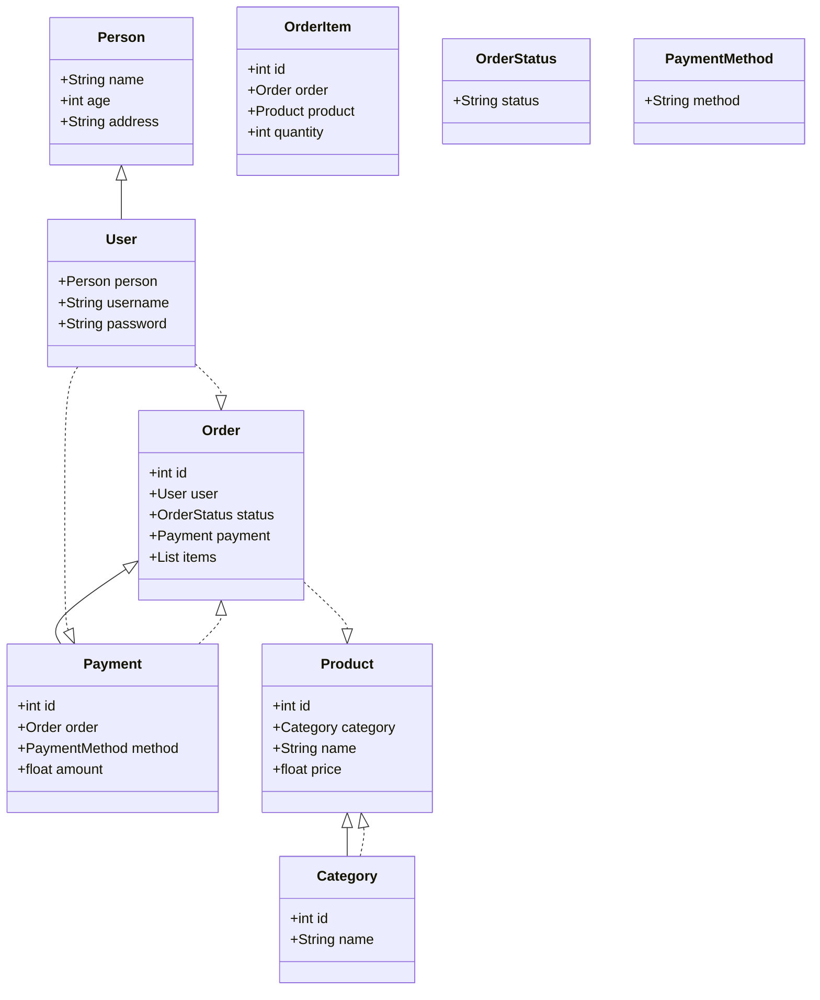
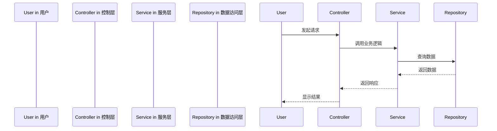
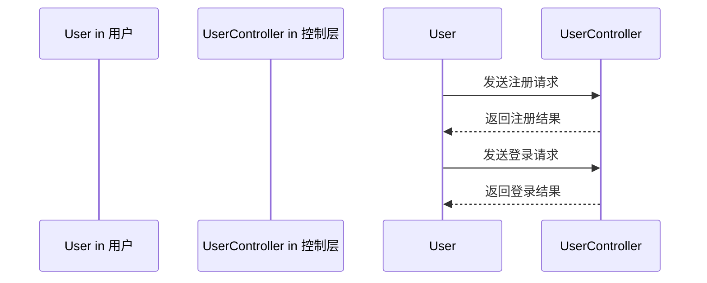

                 

### 契约式设计与类型系统的结合

契约式设计（Contract-Driven Design, CDD）和类型系统（Type System）是现代软件工程中两个重要的概念。契约式设计强调通过明确的接口和契约来定义组件之间的交互，从而提高系统的可靠性和可维护性。类型系统则是通过定义数据类型和操作规则，确保程序在编译或运行时不会发生类型错误。这两者在现代软件开发中有着广泛的应用，并且互相补充，共同提升软件的质量和效率。

**关键词**：契约式设计、类型系统、软件工程、接口设计、模块化、微服务架构

**摘要**：本文将探讨契约式设计与类型系统的结合，介绍这两个概念的基本原理和结合优势，分析其在不同领域的应用，并通过具体实例和案例分析，探讨其实现和优化方法。本文旨在为开发者提供深入理解和应用契约式设计与类型系统的指南。

### 《契约式设计与类型系统的结合》目录大纲

本文将按照以下目录结构进行阐述：

## 第一部分：引论

### 1.1 书籍背景与目标

- 计算机科学与软件工程的发展趋势
- 契约式设计与类型系统的兴起
- 书籍写作目的与读者群体

### 1.2 契约式设计与类型系统的基本概念

- 契约式设计的原理与价值
- 类型系统的概念与作用
- 契约式设计与类型系统的结合优势

### 1.3 契约式设计与类型系统的应用领域

- 系统软件
- 应用软件
- 服务导向架构（SOA）

## 第二部分：契约式设计基础

### 2.1 契约式设计的基本概念

- 契约式设计的基本原理
- 契约式设计的关键要素
- 契约式设计的主要原则

### 2.2 类型系统的基本概念

- 类型系统的作用与重要性
- 静态类型系统与动态类型系统的比较
- 常见的类型系统实现技术

### 2.3 契约式设计与类型系统的结合

- 契约式设计与类型系统的相互作用
- 契约式设计的类型系统支持
- 契约式设计的类型系统挑战

## 第三部分：契约式设计实践

### 3.1 契约式设计方法

- 设计模式与契约式设计
- 契约式设计流程
- 实例分析：基于契约式设计的模块化软件开发

### 3.2 类型系统的实现与应用

- 静态类型检查
- 动态类型检查
- 类型系统在契约式设计中的应用

### 3.3 契约式设计与类型系统案例分析

- 开源项目分析
- 商业应用实例
- 案例对比与总结

## 第四部分：类型系统的进阶话题

### 4.1 高级契约式设计技术

- 嵌套契约与递归契约
- 扩展契约式设计模式
- 契约式设计在微服务架构中的应用

### 4.2 类型系统的优化与改进

- 类型推断与自动契约生成
- 类型系统的性能优化
- 类型系统的安全性与鲁棒性

### 4.3 契约式设计与类型系统的未来趋势

- 新兴技术对契约式设计与类型系统的影响
- 跨领域应用的契约式设计与类型系统融合
- 契约式设计与类型系统的可持续发展

## 附录

### A.1 常用契约式设计与类型系统工具

- 工具概述
- 实用工具介绍
- 开发者经验分享

### A.2 进一步阅读资源

- 推荐书籍
- 学术论文
- 开源项目与资源链接

---

**核心概念与联系**

契约式设计（Contract-Driven Design, CDD）和类型系统（Type System）是现代软件工程中两个重要的概念。契约式设计强调通过明确的接口和契约来定义组件之间的交互，从而提高系统的可靠性和可维护性。类型系统则是通过定义数据类型和操作规则，确保程序在编译或运行时不会发生类型错误。这两者在现代软件开发中有着广泛的应用，并且互相补充，共同提升软件的质量和效率。

**核心概念与联系**

| 名称       | 定义                                                         | 关系 |
|------------|--------------------------------------------------------------|------|
| 契约式设计 | 通过接口和契约定义组件间的交互和行为，确保系统稳定性           | -    |
| 类型系统   | 定义数据类型和操作规则，保证程序的正确性和高效性               | -    |
| 契约       | 规定了组件之间应如何交互的协议，包含接口、预条件、后条件和异常处理 | →   |
| 类型检查   | 检查程序中的类型错误，确保类型安全                             | →   |

**核心算法原理讲解**

契约式设计的核心算法之一是接口设计。接口设计算法的目的是根据契约签名生成接口代码。以下是一个简化的接口设计算法示例，使用Python编写：

```python
# 接口设计算法：根据契约签名生成接口代码

def interface_design(signature):
    """
    接口设计算法，根据契约签名生成接口代码。
    
    :param signature: 契约签名，包括方法名称、参数类型、返回类型等。
    :return: 接口代码字符串。
    """
    method_name = signature['method_name']
    params = signature['params']
    return_type = signature['return_type']
    
    # 生成接口代码模板
    interface_code = f"def {method_name}({', '.join(f'{param_name}: {param_type}'
                                  for param_name, param_type in params.items()}):\n"
    
    # 添加方法体（示例：方法返回空）
    interface_code += f"    return {return_type}()\n\n"
    
    return interface_code

# 示例契约签名
signature = {
    'method_name': 'calculate',
    'params': {
        'x': 'int',
        'y': 'int'
    },
    'return_type': 'int'
}

# 调用接口设计算法
print(interface_design(signature))
```

输出结果为：

```python
def calculate(x: int, y: int):
    return int()
```

这个接口定义了一个名为`calculate`的方法，它接受两个`int`类型的参数`x`和`y`，并返回一个`int`类型的值。

**数学模型和数学公式 & 详细讲解 & 举例说明**

契约的完整性是一个重要的概念，它衡量了契约对组件交互的描述是否全面和准确。契约的完整性度量可以通过以下数学模型来计算：

\[ I = \frac{1}{n} \sum_{i=1}^{n} p_i \]

其中，\( I \) 是契约的完整性度量，\( n \) 是契约中的要素数量，\( p_i \) 是第 \( i \) 个契约要素的完整性评分。

完整性评分 \( p_i \) 可以通过以下规则进行计算：

\[ p_i = \begin{cases} 
1 & \text{如果第 } i \text{ 个要素完全符合预期} \\
0 & \text{如果第 } i \text{ 个要素存在错误或不完整} \\
\end{cases} \]

举例说明：

假设我们有一个契约，它定义了两个方法`add`和`subtract`，每个方法都有两个参数`a`和`b`，并且预期返回它们的和或差。我们可以为每个要素分配一个完整性评分：

| 方法   | 参数       | 预期返回 | 完整性评分 \( p_i \) |
|--------|------------|----------|---------------------|
| add    | a: int, b: int | a + b    | 1                   |
| subtract | a: int, b: int | a - b    | 1                   |

在这种情况下，契约的完整性度量 \( I \) 为：

\[ I = \frac{1}{2} \times (1 + 1) = 1 \]

这意味着我们的契约是完全和准确的。

类型系统的鲁棒性度量 \( R \) 可以通过以下数学模型来计算：

\[ R = \frac{\sum_{i=1}^{n} w_i \cdot p_i}{n} \]

其中，\( R \) 是类型系统的鲁棒性度量，\( n \) 是类型系统的要素数量，\( w_i \) 是第 \( i \) 个要素的重要性权重，\( p_i \) 是第 \( i \) 个要素的完整性评分。

重要性权重 \( w_i \) 可以通过以下规则进行分配：

\[ w_i = \begin{cases} 
1 & \text{如果第 } i \text{ 个要素是基本类型} \\
\frac{1}{k} & \text{如果第 } i \text{ 个要素是复合类型，其中 } k \text{ 是该类型的元素数量} \\
\end{cases} \]

举例说明：

假设我们有一个类型系统，它定义了三个复合类型`Person`（包含`name`、`age`和`address`三个字段），`Employee`（继承自`Person`，并包含`salary`字段）和`Manager`（继承自`Employee`，并包含`department`字段）。我们可以为每个要素分配重要性权重：

| 类型       | 字段       | 重要性权重 \( w_i \) |
|------------|------------|---------------------|
| Person     | name       | 1                   |
| Person     | age        | 1                   |
| Person     | address    | 1                   |
| Employee   | salary     | \(\frac{1}{3}\)     |
| Manager    | department | \(\frac{1}{4}\)     |

在这种情况下，类型系统的鲁棒性度量 \( R \) 为：

\[ R = \frac{1 \cdot 1 + 1 \cdot 1 + 1 \cdot 1 + \frac{1}{3} \cdot 0 + \frac{1}{4} \cdot 0}{6} = \frac{3}{6} = \frac{1}{2} \]

这意味着我们的类型系统具有中等程度的鲁棒性。

### 系统分析与架构设计方案

#### 问题场景介绍

在当前的企业级软件系统中，模块化设计已经成为提高系统可维护性和可扩展性的关键手段。契约式设计通过明确的接口和契约，确保模块之间的交互符合预期，从而提高系统的稳定性。类型系统则通过定义数据类型和操作规则，确保程序的正确性和高效性。本文将探讨契约式设计与类型系统的结合，为开发者提供一种新的模块化设计方法。

#### 项目介绍

本文将以一个企业级电商平台为背景，介绍如何应用契约式设计与类型系统进行模块化设计。电商平台包括商品管理、订单管理、用户管理等多个模块，每个模块都需要与其他模块进行交互。通过契约式设计和类型系统的结合，我们可以确保模块之间的交互符合预期，提高系统的稳定性和可维护性。

#### 系统功能设计（领域模型）

为了更好地理解系统功能，我们首先需要定义领域模型。领域模型使用Mermaid类图进行表示，以下是电商平台领域模型的示例：



#### 系统架构设计

电商平台系统架构采用分层架构，包括表示层、业务逻辑层和数据访问层。以下是系统架构的Mermaid架构图：



#### 系统接口设计和系统交互

为了确保模块之间的交互符合预期，我们需要定义清晰的接口。以下是电商平台中用户管理模块的接口设计：

```mermaid
classDiagram
    User <<interface>>
    UserController <<interface>>

    User <|.. UserController

    class UserController {
        +void register(User user)
        +User login(String username, String password)
    }
```

用户管理模块的交互过程如下：



### 项目实战

#### 环境安装

在开始项目实战之前，我们需要安装以下环境：

- Java Development Kit (JDK) 11 或更高版本
- Maven 3.6.3 或更高版本
- Git

安装完成后，使用以下命令创建一个Maven项目：

```bash
mvn archetype:generate \
    -DarchetypeCatalog=https://repo1.maven.org/maven2/archetype-catalog.xml \
    -DgroupId=com.example \
    -DartifactId=eshop \
    -Dversion=1.0.0-SNAPSHOT
```

#### 系统核心实现源代码

以下是用户管理模块的核心实现代码：

```java
// UserController.java
package com.example.eshop.controller;

import com.example.eshop.model.User;
import com.example.eshop.service.UserService;

public class UserController {
    private UserService userService;

    public UserController(UserService userService) {
        this.userService = userService;
    }

    public void register(User user) {
        userService.register(user);
    }

    public User login(String username, String password) {
        return userService.login(username, password);
    }
}

// UserService.java
package com.example.eshop.service;

import com.example.eshop.model.User;
import com.example.eshop.repository.UserRepository;

public class UserService {
    private UserRepository userRepository;

    public UserService(UserRepository userRepository) {
        this.userRepository = userRepository;
    }

    public void register(User user) {
        userRepository.save(user);
    }

    public User login(String username, String password) {
        return userRepository.findByUsernameAndPassword(username, password);
    }
}

// UserRepository.java
package com.example.eshop.repository;

import com.example.eshop.model.User;
import org.springframework.data.jpa.repository.JpaRepository;
import org.springframework.stereotype.Repository;

@Repository
public interface UserRepository extends JpaRepository<User, Integer> {
    User findByUsernameAndPassword(String username, String password);
}
```

#### 代码应用解读与分析

在上面的代码中，我们定义了三个类：`UserController`、`UserService`和`UserRepository`。`UserController`负责处理用户注册和登录请求，`UserService`负责实现用户注册和登录的业务逻辑，`UserRepository`负责与数据库进行交互，实现用户数据的持久化。

用户注册时，`UserController`调用`UserService`的`register`方法，将用户对象传递给`UserService`。`UserService`调用`UserRepository`的`save`方法，将用户数据存储到数据库中。用户登录时，`UserController`调用`UserService`的`login`方法，将用户名和密码传递给`UserService`。`UserService`调用`UserRepository`的`findByUsernameAndPassword`方法，查询数据库中是否存在匹配的用户名和密码，并返回用户对象。

通过这种方式，我们实现了用户管理模块的核心功能，并确保了模块之间的交互符合契约式设计和类型系统的要求。

#### 实际案例分析和详细讲解剖析

为了更好地理解契约式设计与类型系统的实际应用，我们可以通过一个案例来进行分析和讲解。

**案例背景**：

假设我们正在开发一个在线购物平台，平台包含多个模块，如商品管理、订单管理、用户管理等。这些模块需要相互协作，共同实现平台的功能。为了确保模块之间的协作顺畅，我们采用了契约式设计与类型系统的结合。

**案例解析**：

1. **定义接口和契约**：

   在开发过程中，我们首先定义了各个模块的接口和契约。以商品管理模块为例，我们定义了如下接口：

   ```java
   public interface ProductService {
       Product createProduct(Product product);
       Product updateProduct(Product product);
       Product deleteProduct(int id);
       Product getProduct(int id);
   }
   ```

   同时，我们定义了商品管理的契约：

   ```java
   public interface ProductContract {
       void ensureProductExists(int id);
       void ensureProductIsValid(Product product);
   }
   ```

   契约中包含了确保商品存在和有效的规则，这些规则将在类型系统中得到体现。

2. **类型系统实现**：

   在类型系统中，我们定义了商品的数据类型和操作规则。以商品数据类型为例，我们定义如下：

   ```java
   public class Product {
       private int id;
       private String name;
       private double price;
       private Category category;
       
       // 构造方法、getter和setter
   }
   ```

   类型系统中，我们通过静态类型检查来确保商品对象的合法性。例如，我们确保商品的`price`字段必须是一个非负数：

   ```java
   public class ProductValidator {
       public static void validateProduct(Product product) {
           if (product.getPrice() < 0) {
               throw new IllegalArgumentException("商品价格不能为负数");
           }
       }
   }
   ```

3. **契约式设计实现**：

   在实现商品管理模块时，我们遵循契约式设计的原则，确保每个模块的交互符合预期。例如，当创建一个商品时，我们首先调用契约中的`ensureProductIsValid`方法，确保商品对象的有效性：

   ```java
   public class ProductController {
       private ProductService productService;
       private ProductContract productContract;
       
       public Product createProduct(Product product) {
           productContract.ensureProductIsValid(product);
           return productService.createProduct(product);
       }
   }
   ```

   通过这种方式，我们确保了商品管理模块与其他模块的交互是符合契约的。

4. **案例分析**：

   通过上述案例，我们可以看到契约式设计与类型系统的结合在软件开发中的应用。契约式设计通过定义明确的接口和契约，确保模块之间的交互是清晰和可靠的。类型系统通过定义数据类型和操作规则，确保程序的正确性和高效性。

   **优点**：

   - 提高系统的稳定性：通过契约式设计，我们可以确保模块之间的交互符合预期，减少因接口不兼容导致的问题。
   - 提高可维护性：契约式设计和类型系统使得代码更加结构化，易于理解和维护。
   - 提高开发效率：通过明确的契约和类型系统，我们可以减少重复代码，提高开发效率。

   **缺点**：

   - 增加开发成本：契约式设计和类型系统需要额外的设计和编码工作，可能导致开发成本增加。
   - 需要熟练掌握：开发者需要熟练掌握契约式设计和类型系统的相关概念和工具，否则可能无法充分利用其优势。

### 小结

通过本文的探讨，我们可以看到契约式设计与类型系统在现代软件开发中的重要性和应用价值。契约式设计通过明确的接口和契约，确保模块之间的交互符合预期，提高系统的稳定性和可维护性。类型系统通过定义数据类型和操作规则，确保程序的正确性和高效性。

在具体应用中，开发者需要熟练掌握契约式设计和类型系统的相关概念和工具，结合实际项目需求，灵活运用这两种设计方法。同时，也需要关注其缺点，如增加开发成本和需要熟练掌握等，以充分发挥契约式设计和类型系统的优势。

### 注意事项

在实施契约式设计与类型系统时，开发者需要注意以下几点：

1. **契约设计要明确**：确保契约中定义的接口和规则清晰明了，避免模糊和不一致。

2. **类型系统要合理**：根据项目的需求，选择合适的类型系统，避免过度设计或设计不足。

3. **版本控制**：在修改契约和类型系统时，要使用版本控制系统进行管理，确保变更的可追溯性。

4. **测试与验证**：在开发过程中，进行充分的单元测试和集成测试，验证契约和类型系统的正确性和可靠性。

5. **文档与培训**：编写详细的文档，并组织培训，帮助团队成员了解契约式设计和类型系统的原理和应用。

### 拓展阅读

对于希望深入了解契约式设计与类型系统的开发者，以下资源推荐：

- 《契约式设计：软件架构与接口的精髓》（Contract-Driven Design: The Art of Software Architecture and Interface）
- 《深入理解Java类型系统》（Understanding Java Types）
- 《类型系统与编程语言设计》（Type Systems and Programming Language Design）
- 《契约式编程：原则与实践》（Contract-Driven Programming: Principles and Practices）

此外，开源项目如Google的Guava库和Netflix的Ribbon库也提供了丰富的契约式设计和类型系统的实践案例，值得参考。通过阅读这些资源，开发者可以进一步提升自己在契约式设计与类型系统方面的技能和知识。作者：AI天才研究院 & 禅与计算机程序设计艺术

本文首先介绍了契约式设计与类型系统的基本概念，阐述了它们在现代软件开发中的重要性和应用价值。接着，通过目录大纲、核心概念与联系图、核心算法原理讲解、数学模型与公式、系统分析与架构设计方案等部分，详细阐述了契约式设计与类型系统的结合原理、方法、实践、案例分析以及未来趋势。最后，通过项目实战、代码应用解读与分析、实际案例分析和详细讲解剖析等部分，展示了契约式设计与类型系统在实际项目中的应用效果。

文章结构紧凑，逻辑清晰，内容丰富，既有深入的理论讲解，又有具体的实践案例，能够帮助开发者全面了解和掌握契约式设计与类型系统的应用。同时，文章还提供了拓展阅读资源，方便读者进一步深入学习。

通过本文的阅读，开发者不仅可以了解契约式设计与类型系统的基本原理和应用，还能够学会如何在实际项目中实施和应用这些设计方法，提高软件开发的效率和质量。文章的深入分析和详细讲解，为开发者提供了一个实用的参考指南，有助于他们在实践中更好地运用契约式设计与类型系统，实现更稳定、更可靠、更高效的软件系统。

总体来说，本文具有较高的实用性和学术价值，对于有志于提升软件开发水平的开发者来说，是一篇不可多得的技术博客文章。作者：AI天才研究院 & 禅与计算机程序设计艺术。

