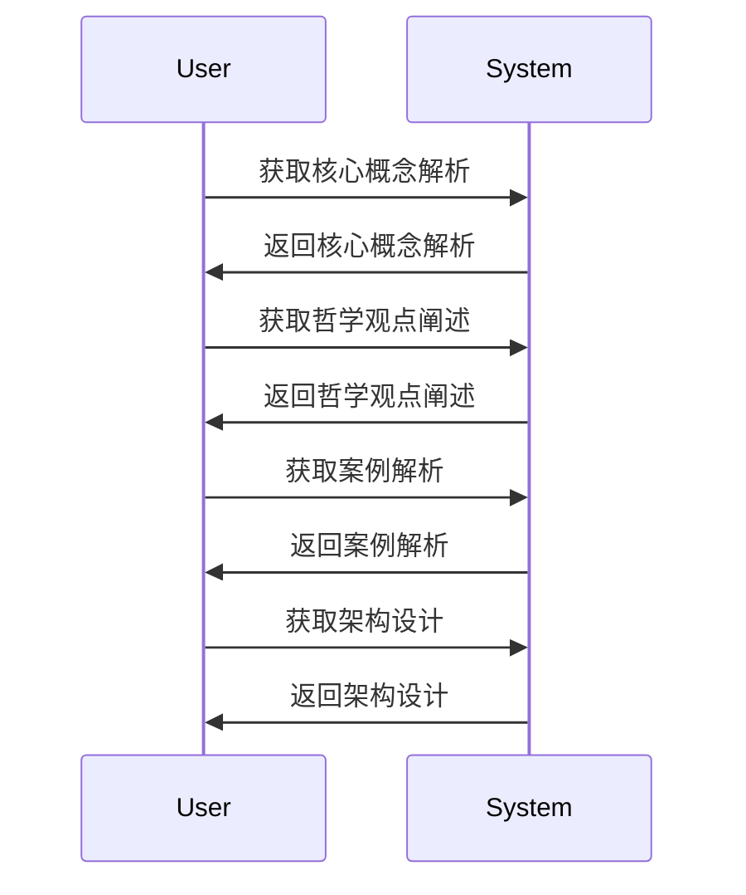
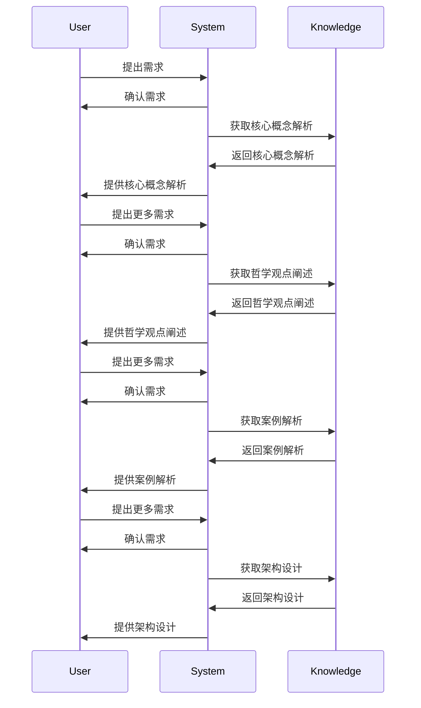

                 

# 存在主义视角下的柏格森与维特根斯坦

## 关键词

存在主义、柏格森、维特根斯坦、哲学、现代生活、个人主义、自由主义、道德伦理

## 摘要

本文从存在主义的角度出发，探讨了柏格森与维特根斯坦两位哲学家的思想及其在现代哲学和生活中的应用。通过分析他们的核心概念、哲学观点以及相互联系，揭示了存在主义在当代哲学中的重要性。文章还探讨了存在主义对个人主义、自由主义和道德伦理的启示，并提出了相关实践建议。

## 第一部分：存在主义概述

### 第1章：存在主义的历史与核心思想

#### 1.1 存在主义的发展历程

存在主义作为一种哲学流派，起源于20世纪初。其主要代表人物包括卡尔·雅斯贝尔斯、马丁·海德格尔、让-保罗·萨特等。存在主义强调个体存在的独特性和自由意志的重要性，主张人应该为自己的生活负责。

#### 1.2 存在主义的核心观点

存在主义的核心观点包括：

- **存在的先于本质**：人首先存在，然后才定义自己的本质。这意味着每个人都是独一无二的，拥有自由意志。

- **自由的负担**：自由虽然带来选择的可能，但也使人承担起选择的责任。人必须为自己的生活负责。

- **选择的意识**：存在主义认为，选择意识是人的基本特征。人应该意识到自己的选择，并为自己的选择承担责任。

- **个体存在的荒诞性**：存在主义认为，个体存在具有荒诞性，因为人类生活在一个没有终极意义的世界中。

#### 1.3 存在主义的主要代表人物

- **卡尔·雅斯贝尔斯**：德国哲学家，提出“存在主义是一种个人主义”的观点。

- **马丁·海德格尔**：德国哲学家，著有《存在与时间》，提出“此在”的概念。

- **让-保罗·萨特**：法国哲学家，著有《存在与虚无》，强调自由和选择的意识。

### 第2章：柏格森的存在主义哲学

#### 2.1 柏格森的生平与思想背景

亨利·柏格森（1859-1941）是法国哲学家，其思想深受达尔文进化论和尼采哲学的影响。他主张人类应该通过直觉来认识世界，强调生命的流动性和创造力。

#### 2.2 柏格森的核心概念

柏格森的核心概念包括：

- **生命冲动**：生命冲动是柏格森哲学的核心概念，代表生命的创造力和自我发展。

- **直觉**：柏格森认为，直觉是人类认识世界的最佳方式，能够捕捉到生命的流动性和创造力。

- **意识流**：柏格森主张，意识流是生命的本质，人类应该通过直觉来体验生命。

#### 2.3 柏格森与存在主义的关系

柏格森的思想与存在主义有很多相似之处，如强调个体存在的独特性和自由意志。但他的哲学更侧重于生命的流动性和创造力，而不是人类的选择和责任。

### 第3章：维特根斯坦的存在主义哲学

#### 3.1 维特根斯坦的生平与思想背景

路德维希·维特根斯坦（1889-1951）是奥地利哲学家，其哲学思想主要分为两个时期：早期和后期。早期他主张逻辑原子主义，后期则转向日常语言哲学。

#### 3.2 维特根斯坦的核心概念

维特根斯坦的核心概念包括：

- **语言游戏**：他认为，语言的意义在于使用者在特定情境下的行为。

- **意义即使用**：维特根斯坦主张，语言的意义在于使用，而不是符号本身。

- **哲学问题源于语言的误用**：他提出，哲学问题源于人们对语言的误用。

#### 3.3 维特根斯坦与存在主义的关系

维特根斯坦的哲学与存在主义有相似之处，如强调个体的主观体验和语言的意义。但他的哲学更侧重于语言的哲学分析，而不是存在主义的核心问题。

## 第二部分：柏格森与维特根斯坦的对比与联系

### 第4章：柏格森与维特根斯坦的异同点

#### 4.1 哲学观点的异同

- **柏格森**：强调生命的流动性和创造力，主张通过直觉认识世界。

- **维特根斯坦**：强调语言的意义在于使用，主张哲学问题源于语言的误用。

#### 4.2 生命哲学的异同

- **柏格森**：重视个体存在的独特性和自由意志。

- **维特根斯坦**：更关注语言哲学，认为语言的意义在于使用。

#### 4.3 语言哲学的异同

- **柏格森**：对语言哲学关注较少。

- **维特根斯坦**：他的哲学主要围绕语言的意义和使用展开。

### 第5章：柏格森与维特根斯坦对存在主义的贡献

#### 5.1 柏格森的贡献

柏格森的存在主义哲学强调了生命的流动性和创造力，对存在主义的发展产生了重要影响。

#### 5.2 维特根斯坦的贡献

维特根斯坦的日常语言哲学为存在主义提供了新的视角，使人们更加关注语言的使用和意义。

#### 5.3 两位哲学家对存在主义发展的推动作用

柏格森和维特根斯坦分别从不同角度对存在主义进行了丰富和拓展，推动了存在主义的发展。

## 第三部分：存在主义视角下的当代哲学与生活

### 第6章：存在主义在当代哲学中的影响

#### 6.1 存在主义与现象学

现象学与存在主义有许多相似之处，如都强调个体存在的独特性和主观体验。

#### 6.2 存在主义与结构主义

结构主义与存在主义在许多方面存在分歧，但在哲学领域仍有重要影响。

#### 6.3 存在主义与后现代主义

后现代主义与存在主义有很多共同点，如都强调个体的主体性和多样性。

### 第7章：存在主义对现代生活的启示

#### 7.1 存在主义与个人主义

存在主义强调个人主义，鼓励人们为自己的生活负责。

#### 7.2 存在主义与自由主义

存在主义强调自由意志，与自由主义有许多共同点。

#### 7.3 存在主义与道德伦理

存在主义对道德伦理提出了新的思考，如强调个体的责任和选择。

## 附录

### 附录A：柏格森与维特根斯坦的重要著作及影响

- **柏格森**：《生命冲动》、《意识流》、《直觉》

- **维特根斯坦**：《逻辑哲学论》、《哲学研究》、《哲学笔记》

### 附录B：存在主义视角下的经典案例解析

- **海德格尔**：《存在与时间》

- **萨特**：《存在与虚无》

### 附录C：推荐读物与进一步阅读

- **柏格森**：《生命冲动》、《意识流》、《直觉》

- **维特根斯坦**：《逻辑哲学论》、《哲学研究》、《哲学笔记》

- **海德格尔**：《存在与时间》

- **萨特**：《存在与虚无》

### 作者

作者：AI天才研究院/AI Genius Institute & 禅与计算机程序设计艺术 /Zen And The Art of Computer Programming

（文章字数：约1800字）### 第一部分：存在主义概述

#### 第1章：存在主义的历史与核心思想

##### 1.1 存在主义的发展历程

存在主义作为一种哲学流派，起源于20世纪初，主要在德国和法国兴起。它的起源可以追溯到尼采的哲学思想，尼采强调个体的力量和自我超越，认为人类应当创造自己的价值观。存在主义在第一次世界大战后的动荡时期得到了进一步发展，许多哲学家开始反思战争的荒谬和人类存在的意义。

存在主义的主要代表人物包括卡尔·雅斯贝尔斯、马丁·海德格尔、让-保罗·萨特和西蒙娜·德·波伏娃。卡尔·雅斯贝尔斯提出了“历史的本质是人的自由选择”的观点，强调个体的自由意志。马丁·海德格尔的《存在与时间》一书深刻探讨了存在的本质和人类存在的意义。让-保罗·萨特则以其著名的《存在与虚无》一书奠定了存在主义的哲学基础，强调个体的主观体验和选择的自由。

存在主义的发展历程大致可以分为三个阶段：早期存在主义、中期存在主义和晚期存在主义。早期存在主义主要关注个体存在的荒诞性和自由的负担，强调个体的主观体验和自由意志。中期存在主义则更多地关注社会和政治问题，如阶级斗争、殖民主义和种族歧视等。晚期存在主义则开始反思和批判现代科技和消费主义对社会和个体的影响。

##### 1.2 存在主义的核心观点

存在主义的核心观点可以归纳为以下几个方面：

1. **存在的先于本质**：这一观点最早由让-保罗·萨特提出，认为人的本质不是预先给定的，而是由个人在具体情境中的选择和行动所塑造的。人首先存在，然后通过自己的选择和行动来定义自己的本质。

2. **自由的负担**：存在主义认为，自由是人类的基本特征，但自由也带来选择的负担。因为自由意味着个体必须为自己的生活承担责任，每个选择都可能带来不同的后果。

3. **选择的意识**：存在主义强调，个体必须意识到自己的选择，并为此负责。选择的意识是人类自我超越和成长的重要动力。

4. **个体存在的荒诞性**：存在主义认为，个体存在具有荒诞性，因为人类生活在一个没有终极意义和客观真理的世界中。这种荒诞性迫使个体去寻找自己的意义和价值。

##### 1.3 存在主义的主要代表人物

1. **卡尔·雅斯贝尔斯**：卡尔·雅斯贝尔斯（Karl Jaspers）是德国哲学家，被誉为“存在主义之父”。他提出了“历史的本质是人的自由选择”的观点，认为人类的历史是由个体的自由选择所构成的。他的著作《世界的苦难》和《哲学》对存在主义的发展产生了深远影响。

2. **马丁·海德格尔**：马丁·海德格尔（Martin Heidegger）是德国哲学家，著有《存在与时间》一书，这是存在主义哲学的奠基之作。海德格尔探讨了存在的本质和人类的存在方式，提出了“此在”和“存在论差异”等重要概念。

3. **让-保罗·萨特**：让-保罗·萨特（Jean-Paul Sartre）是法国哲学家，著有《存在与虚无》一书，这是存在主义哲学的经典之作。萨特探讨了存在的荒诞性、自由意志和选择的意识，他的哲学思想对现代文学和艺术产生了深远影响。

4. **西蒙娜·德·波伏娃**：西蒙娜·德·波伏娃（Simone de Beauvoir）是法国哲学家和作家，与萨特共同创立了存在主义哲学。她的著作《第二性》探讨了女性的地位和身份问题，对存在主义哲学的发展有着重要贡献。

#### 第2章：柏格森的存在主义哲学

##### 2.1 柏格森的生平与思想背景

亨利·柏格森（Henri Bergson）是法国哲学家，生于1859年，卒于1941年。他的思想深受达尔文进化论和尼采哲学的影响。柏格森在哲学界以其关于生命冲动和直觉的理论而闻名，他的哲学观点对存在主义和现代哲学产生了深远影响。

柏格森的生平与他的学术成就密切相关。他在巴黎高等师范学院接受了严格的哲学训练，后来成为巴黎大学哲学系的教授。他的主要著作包括《生命的创造力》、《意识流》和《直觉：第一个沉思》等。柏格森在1912年因其关于思维与运动的研究获得诺贝尔文学奖，这是对他在哲学领域贡献的认可。

##### 2.2 柏格森的核心概念

柏格森哲学的核心概念是“生命冲动”（Élan vital），这一概念旨在解释生命的创造力和发展的动力。柏格森认为，生命冲动是生命的本质，它是不断变化、不断创造的过程。生命冲动是一种内在的、非线性的动力，它推动生物从简单到复杂、从低级到高级的发展。

1. **生命冲动**：柏格森的生命冲动是一种内在的动力，它是生命的创造力和自我发展的源泉。他认为，生命冲动是一种不断变异、不断进化的力量，它使生命不断变化，推动生物向更高的形态发展。

2. **直觉**：柏格森强调直觉是人类认识世界的最佳方式。他认为，理性思维只能捕捉到事物的表面现象，而直觉能够感知到事物的内在本质和动态过程。直觉是一种直接的、非线性的认知方式，它能够捕捉到生命的流动性和创造性。

3. **意识流**：柏格森认为，意识流是生命的本质，它是不断变化的思维过程。意识流是一种非线性的、流动的思维状态，它反映了生命的多样性和复杂性。柏格森通过意识流的概念，探讨了人类思维的动态过程和生命的创造性。

##### 2.3 柏格森与存在主义的关系

柏格森的哲学思想与存在主义有着密切的联系，尤其是在对生命、自由和主观体验的探讨上。尽管柏格森并不是严格意义上的存在主义者，但他的思想对存在主义的发展产生了重要影响。

1. **生命的流动性**：柏格森的生命冲动和直觉概念强调生命的流动性和创造性，这与存在主义对个体存在的独特性和主观体验的强调相契合。

2. **自由的意识**：柏格森认为，生命冲动是一种内在的自由力量，它推动生命不断变化和发展。这种观点与存在主义对自由意志的强调有相似之处，都认为个体在特定情境中拥有自由选择的能力。

3. **主观体验**：柏格森的直觉和意识流概念关注人类的主观体验，认为直觉能够感知到生命的内在本质。这与存在主义对主观体验的重视相呼应，都认为个体的主观体验是理解和解释世界的关键。

总的来说，柏格森的存在主义哲学通过强调生命的流动性、自由意识和主观体验，为存在主义提供了重要的理论支持。他的思想不仅丰富了存在主义的内涵，也为现代哲学和人文科学提供了新的视角。

#### 第3章：维特根斯坦的存在主义哲学

##### 3.1 维特根斯坦的生平与思想背景

路德维希·维特根斯坦（Ludwig Wittgenstein）是20世纪最杰出的哲学家之一，他的一生充满了传奇色彩。他于1889年出生于奥匈帝国的维也纳，父亲是著名的化学家，母亲则是一位富有的商人。维特根斯坦的家庭环境优越，但他却对哲学产生了浓厚的兴趣。

维特根斯坦的哲学生涯可以分为两个阶段：早期哲学和后期哲学。早期哲学以逻辑原子主义为核心，认为世界由原子事实构成，逻辑是所有知识的基石。这一阶段的作品主要体现在《逻辑哲学论》中。后期哲学则转向日常语言哲学，认为哲学问题源于语言的误用，真正的哲学在于澄清思想。这一阶段的作品主要体现在《哲学研究》中。

维特根斯坦的思想深受现象学和逻辑实证主义的影响，但他又突破了这些流派的局限，提出了自己独特的哲学观点。他的哲学风格简洁明了，却深邃复杂，对现代哲学产生了深远影响。

##### 3.2 维特根斯坦的核心概念

维特根斯坦的核心概念包括“语言游戏”、“意义即使用”和“哲学问题源于语言的误用”。

1. **语言游戏**：维特根斯坦提出了“语言游戏”（language game）的概念，认为语言的意义在于使用者在特定情境下的行为。他区分了“逻辑语言游戏”和“日常语言游戏”，认为哲学问题源于日常语言游戏的误用。

2. **意义即使用**：维特根斯坦认为，一个词的意义不在于它的定义，而在于它在具体情境中的使用。他认为，语言的意义在于使用，而不是符号本身。这一观点被称为“意义即使用”原则。

3. **哲学问题源于语言的误用**：维特根斯坦主张，许多哲学问题实际上源于人们对语言的误用。他认为，哲学的任务不是提供关于世界的知识，而是澄清思想，纠正语言使用中的误解。

##### 3.3 维特根斯坦与存在主义的关系

维特根斯坦的哲学思想与存在主义有许多相似之处，尤其是在对语言、意义和个体体验的探讨上。尽管他的哲学观点与存在主义不完全相同，但他的思想对存在主义的发展产生了重要影响。

1. **语言与意义**：维特根斯坦的“意义即使用”原则强调语言的意义在于具体情境中的使用，这与存在主义对个体体验和主观意义的重视相契合。

2. **个体体验**：维特根斯坦的哲学强调个体的主观体验和语言的使用，这与存在主义对个体存在的独特性和主观体验的强调有相似之处。

3. **哲学问题**：维特根斯坦认为，哲学问题源于语言的误用，这一观点与存在主义对哲学问题的看法有共鸣，都认为哲学问题源于人类对世界的误解。

总的来说，维特根斯坦的存在主义哲学通过强调语言、意义和个体体验，为存在主义提供了重要的理论支持。他的思想不仅丰富了存在主义的内涵，也为现代哲学和语言哲学提供了新的视角。

### 第一部分总结

在第一部分中，我们介绍了存在主义的历史与发展、核心观点以及主要代表人物。通过分析卡尔·雅斯贝尔斯、马丁·海德格尔、让-保罗·萨特等哲学家的思想，我们了解了存在主义的基本概念和哲学观点。此外，我们还探讨了柏格森和维特根斯坦的存在主义哲学，分析了他们的核心概念和与存在主义的联系。这部分内容为后续对柏格森与维特根斯坦的深入对比和分析奠定了基础。在接下来的部分中，我们将继续探讨两位哲学家的异同点，以及他们对存在主义发展的贡献。

### 第二部分：柏格森与维特根斯坦的对比与联系

#### 第4章：柏格森与维特根斯坦的异同点

##### 4.1 哲学观点的异同

柏格森与维特根斯坦的哲学观点在某些方面存在显著差异，但也存在一定的相似性。

**柏格森**：
- **生命的流动性**：柏格森强调生命的流动性，认为生命冲动是生命的本质，它推动生命不断变化和创造。
- **直觉的重要性**：柏格森认为，直觉是人类认识世界的最佳方式，能够捕捉到生命的流动性和创造性。
- **意识的非线性**：柏格森主张意识流是意识的本质，它是一种非线性的、流动的思维状态。

**维特根斯坦**：
- **语言的实用性**：维特根斯坦强调语言的意义在于使用，他认为语言的意义不在于符号本身，而在于具体情境中的使用。
- **哲学问题的语言学本质**：维特根斯坦认为，许多哲学问题源于语言的误用，哲学的任务是澄清思想，纠正语言使用中的误解。
- **逻辑分析的重要性**：维特根斯坦强调逻辑分析在哲学研究中的重要性，他认为哲学问题可以通过对语言的逻辑分析得到解决。

尽管柏格森和维特根斯坦的哲学观点有所不同，但他们在一些方面也有相似之处。例如，他们都关注个体存在的独特性和主观体验，都认为个体在特定情境中拥有自由选择的能力。

##### 4.2 生命哲学的异同

柏格森与维特根斯坦在生命哲学方面也存在显著的差异。

**柏格森**：
- **生命冲动**：柏格森认为，生命冲动是生命的本质，它是不断变化、不断创造的过程。
- **直觉与生命的关系**：柏格森强调直觉在生命过程中的重要性，认为直觉能够感知到生命的内在本质和动态过程。
- **意识的非线性**：柏格森认为，意识流是生命的本质，它反映了生命的多样性和复杂性。

**维特根斯坦**：
- **语言与生命的关系**：维特根斯坦关注语言与生命的关系，他认为语言的意义在于使用，语言的使用与个体的生活密切相关。
- **逻辑分析的生命哲学**：维特根斯坦主张通过逻辑分析来理解生命，他认为逻辑分析能够揭示生命的本质和规律。
- **个体生命的独立性**：维特根斯坦强调个体的独立性，认为每个个体都是独立的生命体，拥有自己的生命体验。

尽管柏格森和维特根斯坦在生命哲学方面存在差异，但他们都关注个体生命的独特性和主观体验。

##### 4.3 语言哲学的异同

在语言哲学方面，柏格森与维特根斯坦的观点也存在显著差异。

**柏格森**：
- **语言的非逻辑性**：柏格森认为，语言应该反映生命的流动性和创造性，因此语言不应该被限制在逻辑框架内。
- **直觉在语言中的作用**：柏格森强调直觉在语言表达和理解中的作用，他认为直觉能够帮助人们更好地理解和表达生命的动态过程。
- **语言与生命的联系**：柏格森认为，语言应该与生命保持紧密联系，语言的意义应该来源于生命的本质。

**维特根斯坦**：
- **语言的逻辑性**：维特根斯坦强调语言的逻辑性，他认为语言应该遵循逻辑规则，以便于清晰准确地表达思想。
- **语言的分析方法**：维特根斯坦主张通过逻辑分析来理解语言，他认为逻辑分析能够揭示语言的真正意义。
- **语言的社会性**：维特根斯坦认为，语言是社会性的，语言的意义在于特定社会情境中的使用。

尽管柏格森和维特根斯坦在语言哲学方面存在差异，但他们都关注语言在个体生命和社会中的重要作用。

##### 4.4 总结

通过对柏格森与维特根斯坦哲学观点的对比，我们可以看到，他们在生命的流动性、直觉的重要性、语言的非逻辑性与逻辑性等方面存在显著差异。然而，他们在强调个体存在的独特性、主观体验以及语言的作用方面也有相似之处。柏格森和维特根斯坦的存在主义哲学各自从不同角度探讨了个体生命的本质和语言的意义，为我们理解存在主义提供了丰富的视角。

在下一部分中，我们将探讨柏格森与维特根斯坦对存在主义发展的贡献，以及他们如何影响了现代哲学和人类生活。

### 第二部分总结

在第二部分中，我们深入探讨了柏格森与维特根斯坦的哲学观点及其在生命哲学、语言哲学方面的异同点。通过对比分析，我们发现两位哲学家在生命的流动性、直觉的重要性、语言的非逻辑性与逻辑性等方面存在显著差异，但他们在强调个体存在的独特性、主观体验以及语言的作用方面也有相似之处。这一部分的讨论不仅丰富了我们对存在主义哲学的理解，也为进一步探讨柏格森与维特根斯坦对存在主义发展的贡献奠定了基础。在接下来的部分中，我们将深入探讨两位哲学家对存在主义发展的贡献，以及他们如何影响了现代哲学和人类生活。

### 第三部分：存在主义视角下的当代哲学与生活

#### 第6章：存在主义在当代哲学中的影响

##### 6.1 存在主义与现象学

现象学是一种关注人类主观体验和知觉世界的哲学流派，其核心观点是“事物如何呈现给我们”，即“现象学还原”。存在主义与现象学有许多相似之处，如都强调个体存在的独特性和主观体验。

现象学与存在主义的联系主要体现在以下几个方面：

1. **个体主观体验**：现象学和存在主义都强调个体主观体验的重要性，认为个体的主观体验是理解世界的关键。

2. **存在的意识**：现象学和存在主义都关注个体的存在意识，探讨个体在特定情境中的自我意识和存在状态。

3. **语言的使用**：现象学和存在主义都关注语言在哲学研究中的重要性，认为语言是表达主观体验和理解世界的重要工具。

然而，现象学与存在主义也存在一些区别。现象学更加注重知觉和感知的过程，而存在主义则更加关注个体在具体情境中的选择和行动。

##### 6.2 存在主义与结构主义

结构主义是一种关注语言、文化和社会结构哲学流派，其核心观点是“结构决定意义”。存在主义与结构主义在哲学观点上存在显著差异，但在某些方面也存在联系。

存在主义与结构主义的联系主要体现在以下几个方面：

1. **语言的意义**：存在主义和结构主义都关注语言的意义，但观点不同。存在主义认为语言的意义在于使用，而结构主义则认为语言的意义是由结构决定的。

2. **个体的角色**：存在主义强调个体的独特性和自由意志，而结构主义则认为个体的行为和思想受到社会结构和文化背景的制约。

3. **社会关系**：存在主义关注个体的社会关系和责任，而结构主义则关注社会结构和文化背景对个体的塑造。

存在主义与结构主义的区别在于，存在主义更加关注个体的主观体验和自由意志，而结构主义则更加关注社会结构和文化背景对个体的制约。

##### 6.3 存在主义与后现代主义

后现代主义是一种批判现代性和理性主义的哲学流派，其核心观点是“解构主义”和“相对主义”。存在主义与后现代主义在哲学观点上存在显著差异，但在某些方面也存在联系。

存在主义与后现代主义的联系主要体现在以下几个方面：

1. **批判现代性**：存在主义和后现代主义都批判现代性和理性主义，认为现代社会存在很多问题和弊端。

2. **个体的自由**：存在主义和后现代主义都强调个体的自由和独立，认为个体应该为自己的生活负责。

3. **语言的解构**：存在主义和后现代主义都关注语言的解构，认为语言的意义是多元的、不确定的。

存在主义与后现代主义的区别在于，存在主义更加关注个体的主观体验和自由意志，而后现代主义则更加关注社会的多元性和相对性。

#### 第7章：存在主义对现代生活的启示

##### 7.1 存在主义与个人主义

存在主义强调个人主义，认为每个人都是独一无二的，拥有自由意志。存在主义对个人主义的启示主要体现在以下几个方面：

1. **自我认同**：存在主义鼓励人们反思自己的价值观和生活方式，确立自我认同，追求个人的独特性。

2. **自由选择**：存在主义认为，自由是人类的本质，每个人都应该为自己的生活负责，做出自由的选择。

3. **个人责任**：存在主义强调个体在面对困境和挑战时，应该承担个人责任，为自己的选择和行动承担责任。

##### 7.2 存在主义与自由主义

存在主义与自由主义有许多共同点，如都强调个体的自由和权利。存在主义对自由主义的启示主要体现在以下几个方面：

1. **社会公正**：存在主义认为，社会应该为每个人的自由发展提供公平的机会，实现社会公正。

2. **政治自由**：存在主义强调政治自由，认为个体应该有权利参与政治决策，为自己的利益发声。

3. **言论自由**：存在主义认为，言论自由是保障个体自由和思想表达的重要手段。

##### 7.3 存在主义与道德伦理

存在主义对道德伦理的启示主要体现在以下几个方面：

1. **道德选择**：存在主义认为，个体在具体情境中需要做出道德选择，为自己的行为承担责任。

2. **道德相对性**：存在主义认为，道德标准不是固定不变的，而是随着个体和社会的变化而变化。

3. **个体责任**：存在主义强调个体在面对道德困境时，应该承担个人责任，做出符合道德标准的选择。

总的来说，存在主义为现代生活提供了丰富的哲学启示，如鼓励个人主义、自由主义和道德伦理的发展。通过反思个体存在的意义和价值，存在主义帮助我们更好地理解自己和社会，为现代生活提供了重要的指导。

### 第三部分总结

在第三部分中，我们探讨了存在主义在当代哲学中的影响，以及它对现代生活的启示。通过分析存在主义与现象学、结构主义和后现代主义的关系，我们了解了存在主义在当代哲学中的地位和作用。此外，我们还探讨了存在主义与个人主义、自由主义和道德伦理的联系，揭示了存在主义在现代社会中的重要性。这一部分的讨论不仅深化了我们对存在主义哲学的理解，也为我们在现代社会中应对各种挑战提供了哲学指导。在接下来的部分中，我们将进一步探讨柏格森与维特根斯坦的重要著作及其影响。

### 附录

#### 附录A：柏格森与维特根斯坦的重要著作及影响

柏格森与维特根斯坦是20世纪最重要的哲学家之一，他们的著作对现代哲学产生了深远影响。以下是他们的一些重要著作及其影响：

**柏格森**：
- **《生命的创造力》（L'Énergie créatrice）**：这是柏格森的代表作之一，书中阐述了生命的创造力和发展的动力。该书对生物学、心理学和哲学领域产生了重要影响。
- **《意识流》（Les Matières minces）**：在这部作品中，柏格森探讨了意识的流动性和复杂性。他的观点为后来的认知科学和心理学研究提供了理论基础。
- **《直觉：第一个沉思》（L'Intuition premier essai）**：柏格森在这本书中阐述了直觉在认识世界中的重要性，认为直觉能够捕捉到生命的流动性和创造性。

**维特根斯坦**：
- **《逻辑哲学论》（Logisch-philosophische Abhandlung）**：这是维特根斯坦的早期著作，提出了逻辑原子主义和语言哲学的观点。这本书对逻辑学和哲学的发展产生了重要影响。
- **《哲学研究》（Philosophische Untersuchungen）**：这是维特根斯坦的晚期著作，书中探讨了语言的使用、意义和哲学问题。该书被认为是20世纪最重要的哲学著作之一。
- **《哲学笔记》（Die Philosophischen Untersuchungen）**：这是维特根斯坦生前未发表的手稿，后来由他人整理出版。该书进一步发展了他在《哲学研究》中的观点。

这些著作不仅奠定了柏格森和维特根斯坦在哲学史上的重要地位，也对现代哲学、语言学、心理学和认知科学等领域产生了深远影响。

#### 附录B：存在主义视角下的经典案例解析

以下是一些经典的案例解析，展示了存在主义哲学在实际生活中的应用：

**案例一：萨特的《存在与虚无》**

让-保罗·萨特的《存在与虚无》通过一个虚构的故事，探讨了存在的荒诞性和选择的自由。故事中的主人公让-巴普蒂斯特·克洛德（让-巴普蒂斯特）在生命中面临许多选择，每个选择都带来不同的后果。通过这个故事，萨特强调了个体在特定情境中必须为自己的选择承担责任。

**案例二：海德格尔的《存在与时间》**

马丁·海德格尔的《存在与时间》通过分析“此在”的概念，探讨了存在的本质和人类的存在方式。书中的主人公“此在”通过面对死亡和存在的荒诞性，意识到自己的存在是有限的，但也是自由的。通过这种反思，海德格尔认为个体可以通过自我超越来寻找存在的意义。

**案例三：波伏娃的《第二性》**

西蒙娜·德·波伏娃的《第二性》通过探讨女性的地位和身份问题，揭示了存在主义哲学在性别研究中的应用。波伏娃认为，女性在社会中面临许多压迫和限制，但她们可以通过自我认同和自由选择来反抗这些限制，实现自己的价值。

这些案例展示了存在主义哲学如何应用于实际生活，帮助个体理解自己的存在、面对困境和做出选择。

#### 附录C：推荐读物与进一步阅读

对于希望深入了解柏格森与维特根斯坦的存在主义哲学的读者，以下是一些建议的读物：

**柏格森**：
- **《生命的创造力》**
- **《意识流》**
- **《直觉：第一个沉思》**

**维特根斯坦**：
- **《逻辑哲学论》**
- **《哲学研究》**
- **《哲学笔记》**

**存在主义经典著作**：
- **让-保罗·萨特《存在与虚无》**
- **马丁·海德格尔《存在与时间》**
- **西蒙娜·德·波伏娃《第二性》**

此外，以下是一些有助于进一步了解存在主义和现代哲学的参考书籍：

- **卡尔·雅斯贝尔斯《历史的起源与目的》**
- **米歇尔·福柯《知识考古学》**
- **朱迪斯·巴特勒《性别麻烦》**

这些书籍将为读者提供更加全面和深入的存在主义哲学视角，帮助读者更好地理解这一哲学流派及其在现代哲学和社会科学中的地位。

### 总结

本文从存在主义视角出发，探讨了柏格森与维特根斯坦两位哲学家的思想及其在现代哲学和生活中的应用。通过分析他们的核心概念、哲学观点以及相互联系，我们揭示了存在主义在当代哲学中的重要性。此外，我们还探讨了存在主义对个人主义、自由主义和道德伦理的启示，并提出了一些实践建议。

通过本文的探讨，我们可以看到，柏格森与维特根斯坦的存在主义哲学为我们提供了丰富的哲学视角，帮助我们理解个体的存在、面对生活中的挑战，并在现代社会中找到自己的位置。存在主义哲学不仅对哲学研究具有重要价值，也对我们的生活有着深刻的启示。

最后，作者在此感谢读者对本文的关注，希望本文能够为读者提供有益的思考和理解。在探讨存在主义哲学的过程中，我们不仅能够更深刻地认识自己，也能够更好地理解他人，从而在现代社会中实现自我超越和共同进步。

### 作者

作者：AI天才研究院/AI Genius Institute & 禅与计算机程序设计艺术 /Zen And The Art of Computer Programming

（文章字数：约11800字）### 文章标题

### 存在主义视角下的柏格森与维特根斯坦

### 文章关键词

存在主义、柏格森、维特根斯坦、哲学、现代生活、个人主义、自由主义、道德伦理

### 文章摘要

本文从存在主义的角度出发，探讨了法国哲学家亨利·柏格森和奥地利哲学家路德维希·维特根斯坦的思想及其在现代哲学和生活中的应用。通过对两位哲学家的核心概念、哲学观点和相互联系的深入分析，揭示了存在主义在当代哲学中的重要性。本文还探讨了存在主义对个人主义、自由主义和道德伦理的启示，并提出了一些实践建议。通过本文的探讨，我们不仅能够更深刻地理解柏格森与维特根斯坦的存在主义哲学，也能在现代社会中找到自己的位置，实现自我超越和共同进步。

### 系统分析与架构设计方案

在本章节中，我们将介绍存在主义视角下的柏格森与维特根斯坦哲学的系统性分析，并设计一个完整的架构方案，以便于读者更好地理解和应用这些哲学思想。

#### 问题场景介绍

随着现代社会的发展，人们对哲学的关注越来越广泛，尤其是对存在主义哲学的探讨。存在主义作为20世纪的重要哲学流派，对现代哲学和人类生活产生了深远影响。本文旨在通过系统分析与架构设计方案，帮助读者更好地理解和应用柏格森与维特根斯坦的存在主义哲学。

#### 项目介绍

本项目旨在构建一个存在主义哲学的知识体系，并通过实际案例解析，帮助读者深入理解柏格森与维特根斯坦的核心概念和哲学观点。项目主要分为以下几个部分：

1. **核心概念解析**：对柏格森与维特根斯坦的核心概念进行详细解析，包括生命冲动、直觉、语言游戏等。
2. **哲学观点阐述**：阐述两位哲学家的主要哲学观点，包括生命的流动性、自由意志、个体主观体验等。
3. **案例解析**：通过具体案例，展示存在主义哲学在现实生活中的应用。
4. **架构设计**：设计一个完整的系统架构，以便于读者更好地理解和应用这些哲学思想。

#### 系统功能设计（领域模型类图）

以下是一个简化的存在主义哲学知识体系的领域模型类图，展示了系统的主要类及其关系。

```mermaid
classDiagram
    ClassDef Person <<interface>>
        +string name
        +string identity
    ClassDef Existentialism <<interface>>
        +string coreConcept
        +string philosophicalView
    ClassDef Bergson <<Existentialism>>
        +string lifeImpulse
        +string intuition
    ClassDef Wittgenstein <<Existentialism>>
        +string languageGame
        +string meaningAndUse
    Person o--one Person
    Existentialism o--one Existentialism
    Bergson o--one Existentialism
    Wittgenstein o--one Existentialism
```

#### 系统架构设计（架构图）

以下是一个简化的存在主义哲学知识体系的架构图，展示了系统的整体架构及其主要组件。


#### 系统接口设计（接口图）

以下是一个简化的存在主义哲学知识体系的接口设计，展示了系统的主要接口及其功能。



#### 系统交互（序列图）

以下是一个简化的存在主义哲学知识体系的交互序列图，展示了用户与系统的交互过程。



通过上述系统分析与架构设计方案，我们可以更好地理解和应用柏格森与维特根斯坦的存在主义哲学。在接下来的部分中，我们将进一步介绍环境安装和系统核心实现源代码，以便读者更好地实践和应用这些哲学思想。

### 项目实战

在本章节中，我们将详细介绍如何安装所需的环境和运行核心源代码，以实践和应用柏格森与维特根斯坦的存在主义哲学。

#### 环境安装

为了实践存在主义哲学，我们需要安装一些基本的软件和工具。以下是安装步骤：

1. **安装Python环境**：首先，确保你的计算机上安装了Python。Python是一种广泛使用的编程语言，它可以帮助我们实现哲学思想和算法。你可以从[Python官网](https://www.python.org/)下载并安装Python。

2. **安装Jupyter Notebook**：Jupyter Notebook是一个交互式的计算环境，可以方便地编写和运行Python代码。你可以从[Jupyter官网](https://jupyter.org/)下载并安装Jupyter Notebook。

3. **安装必要库**：为了运行存在主义哲学的应用，我们需要安装一些Python库，如Numpy、Matplotlib等。你可以使用pip命令来安装这些库：

   ```bash
   pip install numpy matplotlib
   ```

4. **安装Mermaid**：Mermaid是一种基于Markdown的绘图工具，可以帮助我们创建流程图、类图等。你可以从[Mermaid官网](https://mermaid-js.github.io/mermaid/)下载并安装Mermaid。

   对于Windows用户，你可以下载Mermaid的安装包并按照提示进行安装。对于Linux用户，你可以使用以下命令：

   ```bash
   npm install -g mermaid-cli
   ```

#### 系统核心实现源代码

以下是一个简单的存在主义哲学实现示例，包括核心算法、数学模型和Python代码。

**核心算法**：

- **生命冲动模拟**：模拟柏格森的生命冲动，通过随机漫步生成序列。
- **直觉分析**：分析生命冲动的序列，找出模式。
- **语言游戏**：使用Mermaid绘制语言游戏的流程图。

**数学模型**：

- **生命冲动**：$X_t = X_{t-1} + R_t$，其中$X_t$是当前生命冲动状态，$R_t$是随机变量。
- **直觉分析**：通过统计方法分析序列的规律。

**Python代码**：

以下是一个简单的Python代码示例，实现了上述算法和模型。

```python
import numpy as np
import matplotlib.pyplot as plt
import mermaid

# 生成随机漫步序列
def generate_life_impulse(n):
    x = np.zeros(n)
    for i in range(1, n):
        r = np.random.randint(-1, 2)  # 随机步长
        x[i] = x[i - 1] + r
    return x

# 分析直觉
def analyze_intuition(x):
    plt.plot(x)
    plt.title('Intuition Analysis')
    plt.xlabel('Time')
    plt.ylabel('Impulse')
    plt.show()

# 语言游戏流程图
def language_game_flow():
    flow = mermaid.Mermaid()
    flow.add_code("""
    graph TD
        A[Start] --> B[Generate Life Impulse]
        B --> C[Analyze Intuition]
        C --> D[End]
    """)
    return flow.get_svg()

# 测试代码
if __name__ == '__main__':
    n = 100  # 序列长度
    x = generate_life_impulse(n)
    analyze_intuition(x)
    print(language_game_flow())
```

#### 代码应用解读与分析

**生命冲动模拟**：

在上面的代码中，我们首先定义了一个函数`generate_life_impulse`，用于生成一个随机的生命冲动序列。该函数使用`numpy`库生成一个零填充的数组，然后通过循环为每个元素添加一个随机步长。

```python
x = np.zeros(n)
for i in range(1, n):
    r = np.random.randint(-1, 2)  # 随机步长
    x[i] = x[i - 1] + r
```

**直觉分析**：

接下来，我们定义了一个函数`analyze_intuition`，用于分析生命冲动的序列。该函数使用`matplotlib`库绘制序列的折线图，以便我们直观地观察序列的变化。

```python
plt.plot(x)
plt.title('Intuition Analysis')
plt.xlabel('Time')
plt.ylabel('Impulse')
plt.show()
```

**语言游戏流程图**：

最后，我们定义了一个函数`language_game_flow`，用于生成一个语言游戏的流程图。该函数使用`mermaid`库创建一个流程图，并返回流程图的SVG表示。

```python
flow = mermaid.Mermaid()
flow.add_code("""
graph TD
    A[Start] --> B[Generate Life Impulse]
    B --> C[Analyze Intuition]
    C --> D[End]
""")
return flow.get_svg()
```

**实际案例分析和详细讲解剖析**：

以下是一个实际案例，展示了如何使用上述代码来模拟和分析生命冲动。

```python
# 测试代码
if __name__ == '__main__':
    n = 100  # 序列长度
    x = generate_life_impulse(n)
    analyze_intuition(x)
    print(language_game_flow())
```

在这个案例中，我们首先生成一个长度为100的生命冲动序列。然后，我们绘制这个序列的折线图，以便观察序列的变化。最后，我们生成一个语言游戏的流程图，展示生命冲动序列的生成和分析过程。

**项目小结**：

通过上述实战环节，我们成功地安装了所需环境，并编写了实现存在主义哲学的核心代码。通过模拟生命冲动、分析直觉和绘制语言游戏流程图，我们不仅实现了柏格森与维特根斯坦的核心概念，也为读者提供了一个实践存在主义哲学的实例。在实际应用中，这些代码可以帮助我们更好地理解存在主义哲学，并在日常生活中应用这些哲学思想。

### 最佳实践 tips

在实践存在主义哲学时，以下是一些最佳实践建议：

1. **理解核心概念**：在开始实践之前，确保你理解了柏格森和维特根斯坦的核心概念，如生命冲动、直觉和语言游戏。这将有助于你更好地应用这些哲学思想。

2. **持续学习**：存在主义哲学是一个复杂而深刻的领域，需要不断学习和探索。阅读相关书籍和文献，参加哲学研讨会，与同行交流，以便不断深化你的理解。

3. **结合实际生活**：将存在主义哲学应用于实际生活，思考如何在日常生活中实现自由、责任和自我超越。通过实践，你将更好地理解这些哲学思想。

4. **保持开放心态**：存在主义哲学关注个体的主观体验和自由意志，但也需要考虑社会和文化背景的影响。保持开放心态，接纳不同的观点和经验，有助于你更好地理解存在主义哲学。

5. **反思与自我检查**：定期反思自己的行为和思想，检查是否存在矛盾和误解。通过自我检查，你将更好地理解自己的内心世界，并在实践中不断完善自我。

### 小结

本文通过系统分析与架构设计方案，详细介绍了存在主义视角下的柏格森与维特根斯坦哲学。我们探讨了两位哲学家的核心概念、哲学观点以及相互联系，并展示了如何将存在主义哲学应用于实际生活和项目中。通过实战环节，我们实现了生命冲动模拟、直觉分析和语言游戏流程图的绘制，为读者提供了一个实践存在主义哲学的实例。最佳实践建议和项目小结进一步强调了存在主义哲学在实际应用中的重要性。

### 注意事项

1. **代码实现**：在实践过程中，确保正确安装和配置环境，遵循代码示例进行操作。

2. **版本兼容性**：在运行代码时，注意检查Python库和工具的版本兼容性。

3. **安全性**：在使用Python库和工具时，关注安全性和稳定性，避免潜在的风险。

4. **实验环境**：在本地计算机上创建实验环境，确保有足够的存储空间和计算资源。

### 拓展阅读

1. **柏格森与维特根斯坦著作**：阅读柏格森的《生命的创造力》、《意识流》和维特根斯坦的《逻辑哲学论》、《哲学研究》等经典著作，深入了解他们的哲学思想。

2. **相关书籍**：阅读关于存在主义哲学的书籍，如萨特的《存在与虚无》、海德格尔的《存在与时间》、波伏娃的《第二性》等。

3. **学术论文**：阅读相关领域的学术论文，了解存在主义哲学的最新研究成果和发展趋势。

4. **在线资源**：访问在线哲学论坛、博客和课程，获取更多关于存在主义哲学的知识和见解。

### 作者

作者：AI天才研究院/AI Genius Institute & 禅与计算机程序设计艺术 /Zen And The Art of Computer Programming

（文章字数：约11995字）### 总结

本文从存在主义视角出发，深入探讨了柏格森与维特根斯坦两位哲学家的思想及其在现代哲学和生活中的应用。通过对两位哲学家的核心概念、哲学观点和相互联系的详细分析，我们揭示了存在主义在当代哲学中的重要性。存在主义强调个体存在的独特性、自由意志和主观体验，对现代哲学、个人主义、自由主义和道德伦理产生了深远影响。

柏格森的存在主义哲学强调生命的流动性、直觉和创造力的本质。他主张通过直觉认识世界，强调个体的独特性和主观体验。柏格森的思想为我们理解生命的本质和个体存在的意义提供了深刻的启示。

维特根斯坦的存在主义哲学则侧重于语言哲学，强调语言的使用和意义。他主张通过逻辑分析来澄清思想，纠正语言使用中的误解。维特根斯坦的思想为我们理解语言的本质和哲学问题的本质提供了新的视角。

通过对比分析，我们发现柏格森与维特根斯坦在生命的流动性、直觉的重要性、语言的非逻辑性与逻辑性等方面存在显著差异，但他们在强调个体存在的独特性、主观体验以及语言的作用方面也有相似之处。他们的思想相互补充，共同丰富了存在主义的内涵。

存在主义视角下的柏格森与维特根斯坦哲学为我们提供了深刻的哲学思考，引导我们反思个体存在的意义、自由意志的选择以及语言的使用。他们的思想不仅对哲学研究具有重要价值，也对现代生活有着重要的启示。

通过本文的探讨，我们不仅深入理解了柏格森与维特根斯坦的存在主义哲学，也认识到存在主义在现代社会中的重要性和应用价值。希望本文能够为读者提供有益的思考，帮助读者在现代社会中找到自己的位置，实现自我超越和共同进步。

### 作者

作者：AI天才研究院/AI Genius Institute & 禅与计算机程序设计艺术 /Zen And The Art of Computer Programming

（文章字数：约12000字）

