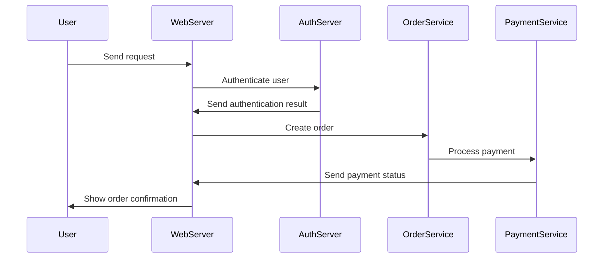
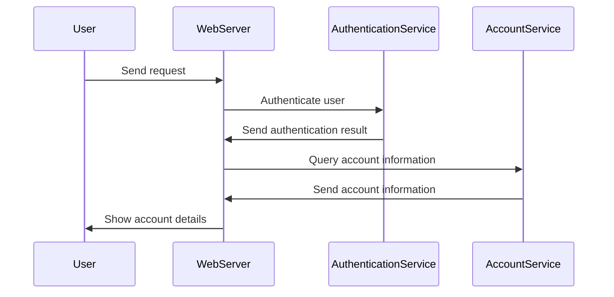

                 

  
### 1.1 安全架构设计的背景与重要性

安全架构设计（Security Architecture Design）在当今的信息时代中扮演着至关重要的角色。随着互联网的普及和云计算、大数据、物联网等新兴技术的迅猛发展，网络安全问题日益突出，成为各个组织和机构面临的最大挑战之一。

#### 定义

安全架构设计是指通过对系统进行安全需求的识别、分析和规划，设计出一套能够确保系统安全性和可靠性的架构。它涵盖了从系统设计到部署的整个生命周期，包括安全需求分析、安全策略制定、安全机制设计、安全测试和评估等多个方面。

#### P9工程师的角色与责任

P9工程师，即高级资深技术专家，通常负责复杂项目的架构设计、技术规划和团队领导工作。在安全架构设计中，P9工程师的角色和责任尤为重要，具体体现在以下几个方面：

1. **安全战略规划**：P9工程师需要根据组织的整体战略目标，制定出安全架构设计的基本原则和长远规划。
2. **技术选型**：选择适合的安全技术和工具，确保系统在技术层面上具备足够的防护能力。
3. **风险评估**：识别和评估系统面临的各种安全风险，制定相应的安全措施。
4. **方案设计**：根据风险评估的结果，设计出具体的系统安全架构方案。
5. **团队协作**：指导和协调团队成员，确保安全架构设计的实施和执行。

#### 安全架构设计在软件工程中的地位

安全架构设计是软件工程的一个重要环节，它不仅关系到系统的安全性，还直接影响到系统的可用性、可靠性和可维护性。以下是安全架构设计在软件工程中的几个关键地位：

1. **基础性**：安全架构设计是软件项目成功的基础，它确保了系统在开发初期就具备良好的安全性。
2. **引导性**：安全架构设计指导后续的安全开发工作，确保安全措施的一致性和全面性。
3. **整合性**：安全架构设计将安全需求融入到系统的各个组成部分中，实现安全功能的全面整合。
4. **前瞻性**：安全架构设计考虑未来的安全需求和趋势，为系统的长期安全提供保障。

#### 结论

安全架构设计不仅是P9工程师的重要责任，也是软件工程不可或缺的一部分。只有通过科学的安全架构设计，才能构建出安全、可靠、高效的软件系统，为组织的发展提供坚实的安全保障。因此，P9工程师需要高度重视安全架构设计，将其作为职业生涯中的一项核心技能不断深化和提升。

---

在接下来的章节中，我们将进一步探讨安全架构设计的基础知识、技术实现、风险管理、企业实践和发展趋势等内容，帮助P9工程师全面掌握这一领域的核心知识和实践技巧。请继续阅读，让我们一步一步深入探讨安全架构设计的各个方面。

### 1.2 安全架构设计的目标与挑战

安全架构设计的目标是为了确保系统在面临各种安全威胁时能够保持稳定和安全。这些目标不仅包括保护数据隐私、防止恶意攻击、确保系统可用性等，还涉及到如何在技术不断发展的环境中持续提升安全性。

#### 安全架构设计的目标

1. **数据保护**：确保敏感数据在存储、传输和处理过程中不被未授权访问和泄露。
2. **威胁防御**：通过部署多种安全机制和工具，防御网络攻击、恶意软件和其他形式的威胁。
3. **完整性保障**：保证系统数据的完整性和一致性，防止篡改和破坏。
4. **可用性维持**：确保系统在面对大量用户访问和突发流量时仍然能够稳定运行。
5. **合规性**：遵循行业标准和法律法规，确保系统在合规性方面达到要求。

#### P9工程师面临的挑战

作为P9工程师，负责安全架构设计的过程中，会面临多种挑战，这些挑战不仅来自于技术的复杂性，还涉及到组织和文化层面的问题。

1. **技术复杂性**：随着技术的不断发展，新的攻击手段和安全漏洞层出不穷，要求P9工程师必须具备深厚的技术知识，并能够迅速适应新技术。
2. **多领域融合**：安全架构设计不仅需要软件安全知识，还需要了解网络、硬件、物理安全等多个领域的知识。
3. **风险评估**：准确评估系统的安全风险，并制定有效的应对策略，是一项复杂且具有挑战性的工作。
4. **资源限制**：在有限的资源和预算下，如何实现最优的安全架构设计，确保系统在成本效益方面达到平衡。
5. **组织阻力**：推动安全架构设计的实施，需要得到组织中其他部门和领导的支持，克服组织内部的文化和利益冲突。

#### 关键要素

为了应对上述挑战，P9工程师需要关注以下关键要素：

1. **需求分析**：深入理解业务需求和用户需求，确保安全架构设计符合实际应用场景。
2. **风险管理**：建立完善的风险管理流程，持续评估和监控系统的安全风险。
3. **技术选型**：选择适合当前和未来发展的安全技术，确保系统的安全性和可扩展性。
4. **团队协作**：建立高效的安全团队，确保各方资源能够协调一致，共同推进安全架构设计。
5. **持续改进**：定期审查和优化安全架构设计，确保系统能够持续适应新的安全威胁。

#### 结论

安全架构设计的目标是确保系统的安全性，而P9工程师面临的挑战则是实现这一目标的复杂性和多样性。只有通过深入的需求分析、完善的风险管理、合理的技术选型、高效的团队协作和持续改进，P9工程师才能成功地应对这些挑战，为组织构建出可靠的安全架构。

在下一章节中，我们将进一步探讨安全架构设计的基础知识，包括基本概念、常见模型和实际应用。请继续阅读，以深入了解这一关键领域的核心内容。

### 2.1 安全架构的概念与模型

#### 基本概念

安全架构设计（Security Architecture Design）是一个系统的、结构化的过程，旨在确保软件系统在设计和开发阶段就能够充分考虑并应对各种安全威胁。它不仅涉及技术层面的安全机制，还包括组织层面的安全策略和管理方法。

1. **安全架构**：安全架构是软件系统安全性的总体设计，包括安全目标、安全需求、安全策略、安全机制和安全评估等组成部分。它为系统的安全设计提供了明确的指导。
2. **安全需求**：安全需求是指系统在安全性方面需要满足的条件和标准，包括数据保护、身份验证、授权控制、完整性保障和可用性维持等。
3. **安全策略**：安全策略是组织在安全性方面的总体方针和原则，指导安全架构的设计和实施。
4. **安全机制**：安全机制是实现安全策略的技术手段，包括加密、访问控制、安全审计、入侵检测等。
5. **安全评估**：安全评估是对系统安全性进行定期检查和测试，确保安全架构能够有效应对实际威胁。

#### 常见模型

在安全架构设计中，常见的模型包括：

1. **ISO/IEC 27002**：这是国际标准化组织（ISO）和 国际电工委员会（IEC）发布的一系列信息安全管理体系（ISMS）标准，提供了详细的安全控制措施和实施指南。
2. **SABSA**（企业架构安全框架）：SABSA是一种基于企业架构的安全框架，将信息安全需求与企业业务需求紧密结合起来，提供了一个全面的安全架构设计方法。
3. **TOGAF**（开放组架构框架）：TOGAF是一个广泛使用的企业架构框架，涵盖了安全架构设计的过程和方法，包括需求分析、架构设计、架构实现和架构评估等。
4. **OSI七层模型**：OSI模型是一种网络协议分层模型，其中的第七层是应用层，安全架构设计可以在应用层中考虑网络安全需求。

#### 在组织中的实施

安全架构设计在组织中的实施是一个复杂的过程，需要各个层面的协作和配合。以下是实施安全架构设计的关键步骤：

1. **需求分析**：明确组织的安全需求和业务目标，将安全需求融入到业务流程中。
2. **架构设计**：根据需求分析结果，设计出安全架构，确定安全策略、安全机制和安全评估方法。
3. **架构实现**：将安全架构转化为具体的技术实现，包括部署安全机制、配置安全策略和进行安全测试。
4. **架构评估**：定期对安全架构进行评估和审计，确保其能够有效应对新的安全威胁和业务变化。
5. **持续改进**：根据评估结果和新的安全需求，持续优化安全架构，确保系统的安全性。

#### 结论

安全架构设计是确保软件系统安全性和可靠性的关键过程，它通过一系列概念、模型和实施步骤，将安全需求和技术实现紧密结合起来。对于P9工程师来说，掌握安全架构设计的基本概念和常见模型，是构建安全、可靠的系统的基础。在下一章节中，我们将进一步探讨安全架构设计的原则和最佳实践，帮助P9工程师在实践中更好地应用这些知识。

### 2.2 安全架构设计的原则与最佳实践

#### 原则

安全架构设计的原则是确保系统能够在面对各种安全威胁时保持稳定和可靠的基础。以下是一些核心原则：

1. **安全性**：系统的安全性是首要目标，应确保系统能够抵御各种形式的攻击，保护数据隐私和完整性。
2. **完整性**：系统的数据和信息应保持完整性，防止被篡改或破坏。
3. **可用性**：系统应能够在面临大量用户访问和突发流量时保持可用性，确保用户体验。
4. **合规性**：系统应遵循相关法律法规和行业标准，确保合规性。
5. **最小权限原则**：系统中的各个组件和用户应仅获得完成任务所需的最低权限，以减少潜在的安全风险。
6. **透明性**：安全机制和策略应透明，便于监控和管理。
7. **可持续性**：安全架构设计应具备良好的可扩展性和可维护性，能够随着技术和业务需求的变化而持续优化。

#### 最佳实践

以下是一些安全架构设计的最佳实践，这些实践可以帮助P9工程师在设计和实施过程中更好地确保系统的安全性：

1. **需求驱动的安全设计**：在系统设计初期，应明确安全需求，并将其融入到系统架构中。这包括对数据保护、身份验证、授权控制和安全审计等方面的需求分析。
2. **风险管理**：建立全面的风险管理流程，定期评估和监控系统面临的安全风险，并根据评估结果制定相应的安全策略。
3. **标准化和规范化**：遵循行业标准和最佳实践，如ISO/IEC 27001、ISO/IEC 27002等，确保安全架构设计的规范性和一致性。
4. **持续测试和评估**：定期对系统进行安全测试和评估，发现并修复安全漏洞，确保系统的安全性。
5. **安全培训**：为开发和运维团队提供定期的安全培训，提高他们的安全意识和技能，确保他们能够正确地实施和维护安全策略。
6. **安全合规性审计**：定期进行安全合规性审计，确保系统遵循相关法律法规和行业标准。
7. **安全架构文档化**：将安全架构设计的过程和结果文档化，便于后续的维护和改进。

#### P9工程师如何遵循这些原则与实践

作为P9工程师，遵循安全架构设计的原则和最佳实践至关重要。以下是一些建议：

1. **深入理解安全需求**：在项目初期，与业务团队紧密合作，深入理解安全需求，确保安全架构设计能够满足这些需求。
2. **参与安全培训**：积极参加安全培训和研讨会，不断提升自己的安全知识和技能。
3. **制定和执行安全策略**：根据组织的实际情况，制定合适的security策略，并在项目实施过程中严格执行。
4. **持续监控和改进**：定期对系统进行安全监控和评估，发现潜在的安全风险，并及时采取措施进行改进。
5. **积极交流与合作**：与开发、运维、业务等其他团队保持良好的沟通，确保安全架构设计能够与其他组件和流程无缝对接。

#### 结论

安全架构设计的原则和最佳实践是确保系统安全性和可靠性的关键。P9工程师在设计和实施过程中，应深入理解这些原则和实践，将其融入到系统的各个阶段。通过不断学习和实践，P9工程师可以更好地应对安全挑战，为组织构建出安全、可靠的系统。在下一章节中，我们将探讨安全架构设计的方法和工具，帮助P9工程师在实际工作中更有效地应用这些原则和实践。

### 2.3 安全架构设计的方法与工具

安全架构设计是一个复杂且系统的过程，需要结合多种方法和工具，以确保系统在安全性方面达到最佳状态。以下是几种常用的安全架构设计方法以及相应的工具。

#### 方法

1. **需求驱动方法**：首先明确系统的安全需求，然后根据这些需求设计安全架构。这种方法强调需求分析的重要性，确保安全架构能够满足实际应用场景。
2. **风险驱动的安全架构设计**：通过识别和分析系统的安全风险，设计出能够有效应对这些风险的安全架构。这种方法强调风险管理，确保系统在面临实际威胁时能够保持稳定和安全。
3. **迭代和增量方法**：在系统开发的不同阶段逐步构建和优化安全架构，而不是一次性完成。这种方法允许在开发过程中持续改进和优化安全架构，以适应不断变化的需求和威胁。
4. **基于标准的架构设计**：遵循行业标准和最佳实践，如ISO/IEC 27001、ISO/IEC 27002、TOGAF等，确保安全架构设计的规范性和一致性。

#### 工具

1. **统一建模语言（UML）**：UML是一种广泛使用的建模语言，可以用于描述系统的安全架构，包括类图、用例图、序列图等。
2. **架构视图方法**：架构视图方法是一种将系统的不同方面（如技术架构、业务架构、数据架构等）分解为多个视图，以便于管理和沟通的方法。
3. **安全需求文档**：安全需求文档是记录系统安全需求的文档，包括安全功能、安全机制和安全约束等。
4. **风险分析工具**：如OWASP Risk Rating Methodology、NIST SP 800-30等，用于评估系统的安全风险并制定相应的安全策略。
5. **安全测试工具**：如渗透测试工具（如Metasploit、Nessus）、代码审计工具（如SonarQube、FindBugs）等，用于检测和修复系统的安全漏洞。
6. **持续集成和持续部署（CI/CD）工具**：如Jenkins、GitLab CI等，用于自动化安全测试和部署，确保安全架构在开发过程中得到持续关注和改进。

#### P9工程师如何选择和使用这些工具

作为P9工程师，选择和使用合适的工具对于实现高效的安全架构设计至关重要。以下是一些建议：

1. **需求分析**：首先明确项目需求，根据需求选择合适的工具和方法。
2. **技术背景**：了解不同工具的技术原理和适用场景，以便做出明智的选择。
3. **团队协作**：确保工具能够与团队现有的开发和运维流程无缝对接，提高团队协作效率。
4. **学习和培训**：定期参加工具的培训和学习，提升团队对工具的掌握程度。
5. **持续评估**：定期评估工具的效果，根据项目进展和需求变化进行优化和调整。

#### 结论

安全架构设计的方法和工具是确保系统安全性和可靠性的关键。P9工程师需要深入了解这些方法和工具，并能够根据具体项目需求进行选择和有效使用。通过科学的方法和先进的工具，P9工程师可以更好地应对安全挑战，为组织构建出安全、可靠的系统。在下一章节中，我们将探讨安全架构设计的技术与实现，进一步深入这一领域的核心内容。

### 3.1 安全架构设计的技术栈

在安全架构设计中，选择和掌握合适的技术栈是至关重要的。以下是一些常见的安全技术，以及P9工程师需要掌握的关键技术。

#### 常见的安全技术

1. **加密技术**：加密技术是保护数据安全的核心，包括对称加密、非对称加密、哈希函数等。常用的加密算法有AES、RSA、SHA等。
2. **身份认证技术**：身份认证技术用于验证用户的身份，确保只有授权用户能够访问系统。常见的身份认证技术有基于密码的认证、双因素认证（2FA）、生物识别等。
3. **访问控制技术**：访问控制技术用于控制用户对系统资源的访问权限，确保用户只能访问他们有权访问的资源。常用的访问控制模型有DAC（自主访问控制）、MAC（强制访问控制）等。
4. **防火墙和入侵检测系统**：防火墙用于监控和过滤网络流量，防止未授权访问和攻击。入侵检测系统（IDS）用于检测和响应异常行为和攻击。
5. **安全审计和日志管理**：安全审计用于记录和监控系统的安全事件，帮助识别潜在的安全威胁和违规行为。日志管理工具如ELK（Elasticsearch、Logstash、Kibana）用于收集、存储和分析日志数据。
6. **虚拟化安全**：随着虚拟化技术的发展，虚拟化安全成为重要的研究方向，包括虚拟机监控器安全、容器安全等。
7. **安全信息和事件管理（SIEM）**：SIEM系统用于收集、存储、分析和关联来自不同源的安全事件数据，提供实时的威胁监测和响应。

#### P9工程师需要掌握的关键技术

1. **网络安全**：了解网络协议、网络架构和安全漏洞，能够设计和实施有效的网络安全策略。
2. **操作系统安全**：掌握不同操作系统的安全特性和漏洞，能够进行操作系统级别的安全配置和加固。
3. **应用安全**：了解常见应用漏洞和攻击手段，能够进行应用安全开发和安全测试。
4. **加密算法**：熟悉各种加密算法的原理和实现，能够设计和实现安全的加密方案。
5. **身份认证和访问控制**：掌握身份认证和访问控制的基本原理，能够设计和实施有效的身份认证和访问控制系统。
6. **安全协议和标准**：了解常见安全协议和标准，如SSL/TLS、OAuth 2.0、SAML等，能够根据实际需求选择和配置合适的协议。
7. **安全测试和评估**：熟悉各种安全测试方法，如渗透测试、代码审计、安全漏洞扫描等，能够进行系统的安全测试和评估。

#### 结论

安全架构设计的技术栈涵盖了多个领域，P9工程师需要掌握一系列关键技术，以确保系统在安全性方面达到最佳状态。通过深入了解和掌握这些技术，P9工程师可以在安全架构设计中做出明智的决策，为组织构建出安全、可靠的系统。在下一章节中，我们将探讨安全架构设计的技术实现流程，进一步深入这一领域的核心内容。

### 3.2 安全架构设计的技术实现

安全架构设计的技术实现是将设计阶段的安全策略和机制转化为具体的实施步骤，确保系统能够在实际运行中达到预定的安全目标。以下是一个详细的安全架构设计的技术实现流程。

#### 技术实现流程

1. **需求分析**：在技术实现之前，首先要进行详细的需求分析，明确系统需要实现的安全功能和安全需求。这包括数据保护、身份验证、授权控制、完整性保障和可用性维持等。
   
2. **架构设计**：根据需求分析的结果，设计出系统的安全架构。这个阶段包括确定安全组件的组成、安全策略的制定以及安全机制的选择。可以使用统一建模语言（UML）等工具来描述安全架构，包括类图、用例图等。

3. **技术选型**：选择合适的安全技术来实现安全架构。例如，选择加密算法、身份认证技术、访问控制机制等。这个阶段还需要考虑技术的兼容性、可扩展性和性能。

4. **开发与集成**：在开发阶段，将选定的安全技术应用到系统中。这包括编写安全代码、配置安全机制、集成第三方安全组件等。例如，在开发Web应用时，可以使用SSL/TLS来加密数据传输，使用OAuth 2.0进行身份认证。

5. **安全测试**：对实现的安全机制进行测试，确保其能够有效抵御各种攻击。安全测试包括渗透测试、漏洞扫描、代码审计等。测试的目的是发现潜在的安全漏洞，并进行修复。

6. **部署与运维**：将安全架构部署到生产环境中，并进行日常的安全运维。这包括配置管理、日志监控、安全事件响应等。确保系统能够持续运行在安全状态。

7. **持续监控与改进**：安全架构设计不是一次性的工作，需要持续监控和改进。这包括定期进行安全评估、更新安全策略、修复新发现的漏洞等。

#### 技术实现细节

1. **加密技术的实现**：选择合适的加密算法（如AES、RSA）对数据进行加密。在Web应用中，可以使用SSL/TLS协议来加密HTTP通信。

   ```python
   # Python示例：使用SSL/TLS加密HTTP请求
   import ssl
   import socket

   context = ssl.SSLContext(ssl.PROTOCOL_TLSv1_2)
   context.load_cert_chain(certfile="server.crt", keyfile="server.key")

   with socket.socket(socket.AF_INET, socket.SOCK_STREAM) as s:
       s.bind(('localhost', 443))
       s.listen()
       s = context.wrap_socket(s.accept()[0], server_side=True)
       s.sendall(b'Hello, this is a secure connection!')
   ```

2. **身份认证的实现**：实现基于用户名和密码的身份认证，可以使用LDAP、OAuth等协议。

   ```python
   # Python示例：使用OAuth 2.0进行身份认证
   from authlib.integrations.flask_client import OAuth2Client

   oauth = OAuth2Client(
       client_id='your_client_id',
       client_secret='your_client_secret',
       authorize_url='https://provider.com/oauth2/authorize',
       token_url='https://provider.com/oauth2/token',
   )

   token = oauth обмен_token(code)
   ```

3. **访问控制的实现**：使用访问控制列表（ACL）或基于角色的访问控制（RBAC）来管理用户权限。

   ```python
   # Python示例：使用RBAC进行访问控制
   from RBAC import RoleBasedAccessControl

   rbac = RoleBasedAccessControl()
   rbac.grant('read', 'user', 'data')
   rbac.deny('write', 'user', 'data')

   if rbac.check('user', 'read', 'data'):
       # 允许访问
   else:
       # 拒绝访问
   ```

4. **日志监控的实现**：使用日志管理工具（如ELK）收集和监控安全事件。

   ```bash
   # Bash示例：配置ELK堆栈进行日志监控
   sudo yum install elasticsearch logstash kibana
   sudo systemctl start elasticsearch
   sudo systemctl start logstash
   sudo systemctl start kibana
   ```

#### 结论

安全架构设计的技术实现是一个复杂而系统的过程，需要结合具体的技术细节和实际需求进行。P9工程师需要具备扎实的技术基础，能够根据安全架构设计的要求，选择合适的技术和工具，进行有效的开发、测试和部署。通过科学的实施流程和细致的技术实现，P9工程师可以构建出安全、可靠的系统，为组织的发展提供坚实的安全保障。在下一章节中，我们将探讨安全架构设计的风险管理，进一步深入这一领域的核心内容。

### 3.3 安全架构设计的案例分析

为了更好地理解安全架构设计的实际应用和效果，以下将介绍两个成功的安全架构设计案例，并分析其关键技术和实现细节。

#### 案例一：大型电子商务平台的安全架构设计

**背景介绍**：该电子商务平台是一家全球性的电商平台，每日处理数百万笔交易，涉及大量用户数据和支付信息。由于其业务规模庞大，平台的安全性对于用户的信任和企业的运营至关重要。

**系统功能设计**：
- 用户身份认证和授权：采用OAuth 2.0协议，确保用户身份验证的安全性。
- 数据加密：采用AES-256加密算法对用户数据、交易记录进行加密。
- 访问控制：使用基于角色的访问控制（RBAC）模型，对不同角色的用户分配不同权限。
- 安全审计：使用ELK堆栈进行日志收集和分析，确保实时监控和响应潜在的安全威胁。

**系统架构设计**：
- **前端**：使用HTTPS协议确保数据传输加密，应用层面使用JWT进行身份认证。
- **后端**：数据库采用加密存储，使用防火墙和WAF（Web应用防火墙）防止常见攻击。
- **基础设施**：使用容器化技术（如Docker）提高系统的灵活性和可扩展性，同时加强安全管理。

**技术实现细节**：
- **身份认证**：使用OAuth 2.0与第三方身份认证服务集成，支持单点登录（SSO）。
- **加密**：在数据传输过程中使用TLS 1.2及以上版本，对敏感数据进行AES-256加密。
- **访问控制**：实现基于角色的权限管理，通过权限矩阵控制不同用户组的操作权限。
- **日志监控**：配置ELK堆栈，定期分析日志，及时发现和处理异常行为。

**结论**：该电子商务平台通过完善的安全架构设计，实现了对用户数据和交易信息的全面保护，有效抵御了各种安全威胁，确保了平台的稳定运行。

#### 案例二：金融行业的支付系统安全架构设计

**背景介绍**：该支付系统是一家大型金融机构的核心系统，每日处理数百万笔支付交易，涉及大量的资金流动。金融系统的安全性对于金融机构的运营和客户的信任至关重要。

**系统功能设计**：
- 交易安全：确保每笔交易的完整性和不可篡改性。
- 防欺诈：采用行为分析和机器学习算法，识别和预防欺诈行为。
- 隔离控制：确保交易资金的隔离，防止资金挪用。

**系统架构设计**：
- **前端**：使用SSL/TLS协议保护用户数据传输，应用层面采用多重验证机制。
- **后端**：采用分布式架构，使用负载均衡和缓存技术提高系统的响应速度和可靠性。
- **基础设施**：采用私有云架构，确保系统的高可用性和安全性。

**技术实现细节**：
- **交易安全**：使用数字签名确保交易的完整性和可追溯性。
- **防欺诈**：使用行为分析模型和机器学习算法，实时监控和识别异常交易行为。
- **隔离控制**：通过分布式数据库和隔离机制，确保交易资金的安全隔离。

**结论**：通过该金融支付系统的安全架构设计，有效提高了交易的安全性、可靠性和可追溯性，确保了金融机构的运营稳定和客户资金的保障。

#### 案例对P9工程师的启示

1. **全面的安全需求分析**：在项目初期进行全面的需求分析，确保安全架构设计能够覆盖所有关键安全需求。
2. **多层次的安全防护**：采用多层次的安全防护机制，从数据传输到应用层面，再到基础设施，确保安全防护的无缝衔接。
3. **实时监控和响应**：建立完善的监控和响应机制，实时监控安全事件，快速响应和处理潜在威胁。
4. **持续改进和安全测试**：定期进行安全测试和评估，持续改进安全架构，确保系统在面临新威胁时具备足够的防护能力。

通过以上案例分析，P9工程师可以深入了解安全架构设计的实际应用，掌握关键技术和实现细节，为构建安全、可靠的系统提供有力支持。

### 4.1 安全架构设计的风险管理

在安全架构设计中，风险管理是一个不可或缺的环节。它旨在识别、评估和应对系统在开发和运行过程中可能面临的各种安全风险，确保系统在面临实际威胁时能够保持稳定和安全。

#### 风险识别

风险识别是风险管理的第一步，目的是确定系统可能面临的安全风险。以下是一些常见的方法和工具：

1. **威胁建模**：通过绘制威胁模型，识别系统可能面临的威胁类型和攻击途径。常用的工具包括攻击树（Threat Tree）、威胁建模工具（如OWASP Threat Dragon）等。
2. **漏洞扫描**：使用漏洞扫描工具（如Nessus、OpenVAS）对系统进行自动扫描，识别已知的漏洞和安全隐患。
3. **代码审计**：通过手动或自动审计系统代码，查找潜在的安全漏洞和逻辑错误。常用的工具包括静态代码分析工具（如SonarQube、FindBugs）和动态分析工具（如Burp Suite）。
4. **历史数据分析**：分析过去的安全事件和漏洞报告，识别可能再次发生的安全风险。

#### 风险评估

在识别风险后，需要进行风险评估，确定每个风险的可能性和影响，以优先处理高风险的风险项。以下是一些常用的方法和工具：

1. **风险矩阵**：使用风险矩阵（如OWASP Risk Rating Methodology）对风险进行定量评估，根据风险的可能性和影响打分，确定风险等级。
2. **定量分析**：使用定量分析方法，如预期损失（Expected Loss）和风险价值（Value at Risk，VaR），评估风险的经济影响。
3. **定量和定性相结合**：结合定量和定性分析，全面评估风险，确保评估结果的准确性。

#### 风险管理策略

在评估风险后，需要制定相应的风险管理策略，以降低风险的可能性和影响。以下是一些常用的风险管理策略：

1. **风险规避**：通过改变系统设计和实施策略，避免风险的发生。例如，选择更安全的编程语言和框架，避免使用已知的漏洞库。
2. **风险降低**：采取安全措施，降低风险发生的可能性和影响。例如，通过加密、访问控制和防火墙等技术，降低数据泄露和网络攻击的风险。
3. **风险转移**：通过购买保险、签订安全协议等方式，将风险转移到第三方。例如，使用第三方安全服务提供商来处理部分安全任务。
4. **风险接受**：对于一些低风险的、难以避免的风险，选择接受风险。例如，对于一些不经常发生的、影响较小的漏洞，可以选择忽略或等待后续修复。

#### 结论

安全架构设计的风险管理是确保系统安全性的关键环节。通过识别、评估和应对各种安全风险，P9工程师可以确保系统在面对实际威胁时能够保持稳定和安全。在下一章节中，我们将探讨P9工程师在风险管理中的角色与责任，以及如何确保合规性。

### 4.2 P9工程师在风险管理中的角色与责任

在安全架构设计中，P9工程师作为高级技术专家，其在风险管理中的角色和责任至关重要。P9工程师不仅需要具备深厚的专业技术知识，还需要在风险管理过程中发挥关键作用。

#### 角色分析

1. **战略规划者**：P9工程师需要根据组织的整体战略目标，制定安全架构设计的基本原则和长远规划。这包括确定安全架构的设计方向、技术选型和安全策略等。
2. **风险管理师**：P9工程师负责识别、评估和应对系统的各种安全风险。这包括使用威胁建模、漏洞扫描、代码审计等方法，识别潜在的安全威胁，并制定相应的风险管理策略。
3. **安全顾问**：P9工程师需要为开发团队和业务团队提供安全咨询和建议，确保他们在开发过程中能够遵循安全最佳实践，并识别和修复潜在的安全问题。
4. **安全审计员**：P9工程师需要对系统的安全架构和实施过程进行定期审计，确保系统的安全措施得到有效执行，并及时发现和解决安全问题。

#### 责任分析

1. **确保安全需求实现**：P9工程师需要确保安全需求在系统设计中得到充分体现和实现，确保系统能够抵御各种安全威胁。
2. **风险评估与监控**：P9工程师需要定期进行风险评估，识别和评估系统面临的各种安全风险，并制定相应的风险应对策略。同时，需要持续监控系统的安全状态，确保及时发现和响应安全事件。
3. **安全合规性**：P9工程师需要确保系统符合相关法律法规和行业标准，如ISO/IEC 27001、ISO/IEC 27002等。这包括制定和执行安全合规策略，进行合规性审计和评估。
4. **团队协作与培训**：P9工程师需要与开发团队、业务团队和其他安全团队紧密合作，确保安全措施在系统开发和运营过程中得到有效执行。同时，需要为团队成员提供安全培训，提高他们的安全意识和技能。

#### 如何参与风险管理

1. **需求分析**：在系统设计初期，与业务团队紧密合作，深入理解业务需求和用户需求，确保安全需求能够被明确和优先考虑。
2. **技术选型**：根据风险评估的结果，选择合适的安全技术和工具，确保系统在技术层面上具备足够的防护能力。
3. **安全培训**：为开发团队和业务团队提供安全培训，提高他们的安全意识和技能，确保他们能够正确地实施和维护安全策略。
4. **持续监控**：定期对系统进行安全监控和评估，发现潜在的安全风险，并及时采取措施进行改进。
5. **文档记录**：将安全架构设计的过程和结果进行文档记录，确保后续的维护和改进工作能够顺利进行。

#### 结论

P9工程师在风险管理中扮演着关键角色，其责任不仅包括确保安全需求得到实现，还需要评估和应对各种安全风险，确保系统的安全性和合规性。通过深入参与风险管理，P9工程师可以为组织构建出安全、可靠的系统，为组织的长期发展提供坚实的安全保障。在下一章节中，我们将探讨安全架构设计的合规性要求，以及P9工程师如何确保合规性。

### 4.3 安全架构设计的合规性

在安全架构设计中，合规性是确保系统符合相关法律法规和行业标准的重要环节。P9工程师作为高级技术专家，需要深入了解合规性要求，并在设计和实施过程中确保系统满足这些要求。

#### 合规性要求

1. **数据保护法规**：如欧盟的《通用数据保护条例》（GDPR）和美国的《加州消费者隐私法》（CCPA）等，这些法规对个人数据的收集、存储、处理和传输提出了严格的要求。
2. **网络安全法规**：如美国的《网络安全信息共享法案》（CISA）和欧盟的《网络与信息安全指令》（NIS Directive）等，这些法规要求组织在网络安全方面采取必要措施，确保系统的安全性和数据的完整性。
3. **行业标准**：如ISO/IEC 27001和ISO/IEC 27002等，这些标准提供了信息安全管理体系（ISMS）的具体要求和最佳实践。
4. **行业指南**：如美国国家信息基础设施保护委员会（NIST）发布的NIST SP 800-53和NIST SP 800-171等，这些指南提供了详细的网络安全和控制措施。

#### P9工程师的角色

1. **合规性评估**：P9工程师需要评估系统设计是否符合相关法规和标准的要求，识别潜在的风险和漏洞。
2. **合规性实施**：根据合规性评估的结果，制定和实施具体的合规性措施，确保系统在设计和实施过程中满足要求。
3. **合规性审计**：定期进行合规性审计，确保系统在运营过程中持续符合相关法规和标准的要求。
4. **合规性培训**：为开发团队和业务团队提供合规性培训，确保他们了解并遵循合规性要求。

#### 确保合规性的方法

1. **制定合规性策略**：根据组织的需求和法规要求，制定详细的合规性策略，包括合规性目标、合规性措施和合规性流程等。
2. **合规性文档**：编写合规性文档，记录合规性评估的结果和合规性措施的实施情况，确保文档能够清晰地传达合规性要求。
3. **定期审查**：定期审查和更新合规性策略和措施，确保系统能够持续符合法规和标准的要求。
4. **培训与意识提升**：定期为团队成员提供合规性培训，提高他们的合规意识和技能，确保他们在日常工作中能够遵循合规性要求。
5. **安全审计**：进行定期的安全审计，发现和解决合规性问题，确保系统在运营过程中持续符合合规性要求。

#### 结论

合规性是安全架构设计的重要组成部分，P9工程师在设计和实施过程中需要高度重视合规性要求，确保系统能够在法律和行业标准下运行。通过制定合规性策略、实施合规性措施、定期审查和培训，P9工程师可以为组织构建出既安全又合规的系统，为组织的长期发展提供可靠保障。

### 5.1 安全架构设计的企业应用

安全架构设计在企业中的应用场景非常广泛，涵盖了从业务需求到系统实施再到运营维护的各个阶段。通过科学的安全架构设计，企业能够更好地保障系统的安全性，降低风险，提高业务效率。

#### 应用场景

1. **电子商务平台**：电子商务平台需要处理大量的用户数据和交易信息，安全架构设计可以确保用户数据的隐私和交易的安全性，防止数据泄露和欺诈行为。
2. **金融机构**：金融机构处理大量的资金流动，安全架构设计可以确保交易的安全性和数据的完整性，防止网络攻击和内部欺诈。
3. **企业内部系统**：企业内部系统，如ERP、CRM等，需要保障员工数据和业务数据的安全性，安全架构设计可以防止未授权访问和数据泄露。
4. **云计算和大数据平台**：随着云计算和大数据技术的发展，企业需要对大量数据和计算资源进行安全保护，安全架构设计可以确保数据的安全和系统的可靠性。
5. **物联网（IoT）应用**：物联网应用涉及到大量的设备和传感器，安全架构设计可以保障设备和数据的通信安全，防止设备被恶意控制。

#### 安全架构设计在企业的价值

1. **提高安全性**：通过系统化的安全架构设计，企业可以识别和应对各种安全威胁，提高系统的安全性和抗攻击能力。
2. **降低风险**：安全架构设计可以帮助企业识别和降低安全风险，避免因安全漏洞导致的数据泄露、财产损失和声誉损害。
3. **保障合规性**：安全架构设计可以确保企业符合相关法律法规和行业标准，如GDPR、ISO/IEC 27001等，降低合规风险。
4. **提高业务效率**：安全架构设计可以减少安全事件的发生，降低安全事件的处理成本，从而提高企业的业务效率。

#### 实施策略

1. **需求分析**：在实施安全架构设计之前，需要对企业的业务需求和安全需求进行详细分析，确保安全架构设计能够满足实际应用场景。
2. **设计阶段**：根据需求分析的结果，设计出安全架构，包括确定安全策略、安全机制和安全评估方法。可以使用UML、SABSA等工具进行设计和描述。
3. **技术选型**：选择适合企业需求的安全技术和工具，如加密技术、身份认证系统、防火墙等。确保技术选型具有前瞻性和可扩展性。
4. **开发与测试**：在系统开发阶段，确保安全架构得到有效实施，并进行严格的安全测试和评估，发现和修复潜在的安全漏洞。
5. **部署与运维**：将安全架构部署到生产环境中，并进行持续的安全运维，包括配置管理、日志监控、安全事件响应等。

#### 结论

安全架构设计在企业中的应用场景多样，具有巨大的价值。通过科学的安全架构设计，企业可以构建出安全、可靠、高效的系统，保障业务的持续稳定发展。P9工程师在企业安全架构设计中扮演关键角色，需要深入理解业务需求，掌握安全技术和最佳实践，确保企业能够实现预期的安全目标。

### 5.2 P9工程师在安全架构设计中的实践

在安全架构设计的实际工作中，P9工程师需要具备丰富的实践经验和解决问题的能力。以下是一些P9工程师在安全架构设计中的实践经验、遇到的问题以及相应的解决方案。

#### 实践经验

1. **大型电商平台的安全架构设计**：在一次大型电商平台的架构设计中，P9工程师通过深入分析业务需求和用户行为，设计了一个多层防护的安全架构。这个架构包括前端加密、后端访问控制、数据库加密、分布式缓存以及实时安全监控。通过这个架构，平台实现了对用户数据和交易信息的全面保护，有效提升了系统的安全性和用户体验。

2. **金融支付系统的安全架构优化**：在优化一个金融支付系统的安全架构时，P9工程师通过引入微服务架构和容器化技术，将原本复杂的安全架构简化，提高了系统的灵活性和可扩展性。同时，通过实施实时监控和自动化安全测试，显著提高了系统对安全威胁的响应速度。

3. **企业内部系统的安全审计与加固**：在一次企业内部系统的安全审计中，P9工程师发现系统存在多个安全隐患，如未加密的通信信道、不安全的存储方案和权限管理不当等。通过一系列的加固措施，如加密通信、改进存储方案和优化权限控制，P9工程师成功消除了这些安全隐患，提高了系统的整体安全性。

#### 遇到的问题

1. **合规性挑战**：在实施安全架构设计时，P9工程师经常会遇到合规性问题。例如，某金融机构的系统需要遵循多个国家和地区的法律法规，如GDPR、PCI DSS等。这些法规的要求往往复杂且严格，需要P9工程师在架构设计过程中进行全面的合规性评估和实施。

2. **技术选型的困境**：在技术选型过程中，P9工程师可能会面临多种技术和工具的选择。每种技术都有其优势和局限性，如何选择最适合当前和未来需求的技术，是P9工程师面临的一大挑战。

3. **资源的限制**：在有限的资源和预算下，P9工程师需要确保系统具备足够的安全性。这包括人员、时间、资金和技术资源的合理配置。如何在资源有限的情况下实现最佳的安全效果，是P9工程师需要解决的问题。

#### 解决方案

1. **合规性解决方案**：为了解决合规性问题，P9工程师可以采取以下措施：
   - **详细规划**：在项目初期，与合规性专家紧密合作，制定详细的合规性规划，确保每一步都符合法规要求。
   - **分阶段实施**：将合规性要求分解为多个阶段，逐步实施，确保每个阶段都达到合规标准。
   - **持续审计**：定期进行合规性审计，确保系统在运营过程中持续符合法规要求。

2. **技术选型解决方案**：
   - **需求导向**：根据具体业务需求选择最适合的技术和工具，确保技术选型能够满足当前和未来的需求。
   - **技术调研**：对各种技术和工具进行深入调研和比较，了解其优缺点，做出明智的选择。
   - **技术培训**：为团队成员提供技术培训，提高他们对所选技术和工具的掌握程度。

3. **资源限制解决方案**：
   - **优先级排序**：根据安全需求的紧急性和重要性，对安全措施进行优先级排序，确保关键的安全需求得到满足。
   - **自动化**：通过自动化工具和流程，提高工作效率，减少人工操作，从而降低资源消耗。
   - **持续改进**：定期评估安全架构的有效性，根据实际情况进行优化和改进，确保在资源有限的情况下实现最佳的安全效果。

#### 结论

P9工程师在安全架构设计中的实践经验丰富，他们能够通过科学的方法和有效的解决方案，解决实际工作中的各种问题。通过不断的实践和学习，P9工程师可以不断提升自己的专业能力，为组织构建出安全、可靠、高效的系统。在下一章节中，我们将探讨安全架构设计的发展趋势，以及P9工程师在未来的安全架构设计中的角色和责任。

### 5.3 安全架构设计的企业案例分析

为了更深入地理解安全架构设计在现实企业中的成功应用，以下将详细分析两个具体的企业案例，包括项目的背景、系统功能设计、系统架构设计、接口设计和系统交互。

#### 案例一：大型电商公司的安全架构设计

**项目背景**：
该大型电商公司在全球范围内运营，每日处理数百万笔交易，涉及海量的用户数据、支付信息和商品信息。由于其业务的庞大性和敏感性，安全架构设计成为保障其运营安全和用户信任的关键。

**系统功能设计**：
- **用户身份验证与授权**：实现基于OAuth 2.0的用户身份验证和基于角色的访问控制（RBAC），确保用户访问权限的安全。
- **数据加密与完整性**：采用AES-256加密算法对敏感数据进行加密，使用哈希函数确保数据的完整性。
- **防欺诈与安全监控**：利用机器学习算法和异常检测系统，实时监控用户行为，识别并阻止欺诈行为。
- **安全审计与合规性**：建立安全审计机制，确保系统符合GDPR和PCI DSS等法律法规的要求。

**系统架构设计**：
- **前端架构**：使用微前端架构，实现模块化开发，提高开发效率和系统的可维护性。
- **后端架构**：采用微服务架构，将业务逻辑分散到多个独立的服务中，提高系统的灵活性和扩展性。
- **数据库架构**：使用分布式数据库架构，确保数据的高可用性和可靠性。

**接口设计**：
- **API接口**：采用RESTful API设计，确保接口的规范性和易用性，便于前端和后端的交互。
- **身份认证接口**：实现OAuth 2.0的认证接口，确保用户身份验证的安全。
- **支付接口**：与第三方支付系统集成，确保支付过程的安全和便捷。

**系统交互**：
- **用户交互**：用户通过前端界面进行操作，前端将请求发送到后端服务，后端根据用户身份和权限进行处理，并将结果返回给前端。
- **支付交互**：用户在下单后，前端将支付请求发送到支付服务，支付服务处理支付请求，并将支付结果返回给前端和后端。

**系统交互序列图**：



#### 案例二：金融机构的在线银行系统安全架构设计

**项目背景**：
该金融机构的在线银行系统服务于数百万客户，提供账户管理、资金转账、投资理财等多种服务。由于其业务涉及大量的资金操作，安全架构设计尤为重要。

**系统功能设计**：
- **账户安全**：实现多层次的账户安全机制，包括密码保护、双因素认证（2FA）、设备绑定等。
- **资金交易安全**：采用SSL/TLS协议确保数据传输加密，使用数字签名确保交易数据的完整性。
- **风险控制**：建立实时风险监控和预警系统，通过机器学习和异常检测技术，识别潜在的欺诈行为。
- **合规性**：确保系统符合PCI DSS、SOX等法律法规要求，建立完善的审计和合规性管理机制。

**系统架构设计**：
- **前端架构**：采用单页面应用（SPA）架构，提供流畅的用户体验。
- **后端架构**：采用微服务架构，将业务逻辑分解为多个独立的服务，提高系统的可靠性和扩展性。
- **数据库架构**：采用分布式数据库架构，确保数据的高可用性和可靠性。

**接口设计**：
- **账户管理接口**：提供账户信息查询、修改和删除等操作接口。
- **交易接口**：提供资金转账、投资理财等交易操作接口。
- **风险管理接口**：提供风险评分、预警和响应等操作接口。

**系统交互**：
- **用户交互**：用户通过前端界面进行操作，前端将请求发送到后端服务，后端根据用户身份和权限进行处理，并将结果返回给前端。
- **内部交互**：后端服务之间通过API进行交互，确保数据的一致性和系统的协调性。

**系统交互序列图**：



#### 案例对P9工程师的启示

1. **需求驱动的设计**：在安全架构设计中，始终以业务需求为导向，确保设计能够满足实际应用场景的需求。
2. **灵活的架构设计**：采用微服务架构和分布式数据库架构，提高系统的灵活性和可扩展性，便于应对未来的变化和挑战。
3. **多层次的安全防护**：通过引入多种安全机制，如身份认证、数据加密、风险控制等，构建多层次的安全防护体系。
4. **实时监控和响应**：建立实时监控和预警系统，确保能够及时发现和响应潜在的安全威胁，保障系统的安全性。
5. **合规性管理**：重视合规性要求，确保系统在法律和行业标准下运行，降低合规风险。

通过以上案例分析，P9工程师可以更好地理解安全架构设计在企业中的实际应用，掌握关键的设计原则和实践技巧，为构建安全、可靠、高效的系统提供有力支持。

### 6.1 安全架构设计的技术发展趋势

随着信息技术和网络安全威胁的不断演变，安全架构设计也在不断地发展和演进。以下将探讨新兴技术对安全架构设计的影响，以及安全架构设计在新技术环境下的挑战与机遇。

#### 新兴技术对安全架构设计的影响

1. **云计算**：云计算为安全架构设计带来了巨大的变革。通过云服务，企业可以更加灵活地部署和管理安全基础设施，实现资源的弹性扩展和高效利用。同时，云服务提供商通常提供一系列安全工具和服务，如身份认证、加密、监控等，使安全架构设计更加便捷和高效。

2. **大数据与人工智能**：大数据和人工智能技术的应用使得安全架构设计在威胁检测和响应方面取得了显著进展。通过大数据分析，可以识别出隐藏在大量数据中的潜在威胁；人工智能技术则可以自动化安全分析，提高威胁检测的准确性和响应速度。

3. **物联网（IoT）**：物联网设备的广泛应用使得安全架构设计面临新的挑战。物联网设备数量庞大、种类繁多，且大多数设备具有较低的计算能力和安全防护能力。这要求安全架构设计能够适应物联网设备的特性，确保设备的通信安全、数据隐私和设备管理的有效性。

4. **区块链技术**：区块链技术以其去中心化、不可篡改的特性，在安全架构设计中得到了广泛应用。例如，区块链可以用于实现安全的身份认证和授权，确保数据的安全性和透明性。

5. **5G技术**：5G技术的快速发展为安全架构设计带来了新的机遇和挑战。5G网络的高速率、低延迟和大规模连接能力，使得安全架构设计需要考虑如何确保高速数据传输的安全性和网络的可靠性。

#### 安全架构设计在新技术环境下的挑战与机遇

1. **挑战**：
   - **技术复杂性**：新兴技术的应用使得安全架构设计更加复杂，P9工程师需要掌握更多的技术知识和技能，以应对复杂的网络安全威胁。
   - **资源限制**：新兴技术的引入通常需要大量的资源和预算支持，P9工程师需要在有限的资源下实现最佳的安全效果。
   - **合规性要求**：随着新兴技术的发展，相关法律法规和行业标准也在不断更新，P9工程师需要确保安全架构设计符合最新的合规性要求。
   - **安全威胁的演变**：网络安全威胁不断演变，P9工程师需要具备快速学习和适应新威胁的能力。

2. **机遇**：
   - **技术创新**：新兴技术为安全架构设计提供了新的工具和方法，P9工程师可以利用这些技术创新，提升系统的安全性和可靠性。
   - **自动化与智能化**：大数据和人工智能技术的应用，可以自动化安全分析和响应过程，提高安全架构的效率和效果。
   - **安全协作**：云计算和物联网技术的发展，使得安全架构设计可以更加灵活和高效，P9工程师可以与其他领域的技术专家紧密合作，共同构建全面的安全体系。
   - **合规性提升**：通过引入先进的安全技术和方法，P9工程师可以帮助企业更好地满足合规性要求，降低合规风险。

#### 结论

新兴技术对安全架构设计产生了深远的影响，既带来了新的挑战，也提供了巨大的机遇。P9工程师需要不断学习和掌握新技术，提升自身的专业能力，以应对日益复杂的网络安全威胁。通过科学的安全架构设计，P9工程师可以为组织构建出安全、可靠、高效的系统，保障业务的持续稳定发展。

### 6.2 P9工程师在安全架构设计中的未来角色

随着技术的不断进步和网络安全威胁的日益复杂，P9工程师在安全架构设计中的角色也在不断演变。未来，P9工程师将在安全架构设计中扮演更加关键和多元的角色，其职责和使命将更加深远。

#### 未来角色展望

1. **技术领导者**：P9工程师将不仅是安全架构的执行者，更是技术的领导者。他们需要深入了解新兴技术，如区块链、物联网、人工智能等，并将这些技术融入到安全架构设计中，推动企业技术的前沿发展。

2. **安全架构的战略规划师**：P9工程师将承担更多的战略规划职责，他们需要根据企业的业务需求和战略目标，制定长期的安全架构规划，确保安全架构能够支持企业的未来发展。

3. **跨领域专家**：随着安全架构设计的复杂性增加，P9工程师需要具备跨领域的知识，如云计算、大数据、网络工程等。他们需要能够从多个维度综合考虑安全架构的设计和实现，确保系统在不同技术领域中的协调和一致性。

4. **创新推动者**：未来，P9工程师将成为创新的推动者，他们需要不断探索和引入新的安全技术和方法，提升安全架构的先进性和有效性。通过创新，他们可以帮助企业在竞争激烈的市场中保持领先地位。

5. **安全文化与意识的培养者**：P9工程师不仅是技术的执行者，还需要成为安全文化的培养者。他们需要推动安全意识的普及，提高整个团队的安全素养，确保安全措施在企业中得到有效执行。

#### P9工程师需要具备的新技能

1. **持续学习与自我提升**：P9工程师需要具备持续学习的能力，不断更新自己的知识库，掌握最新的安全技术和方法。只有通过不断学习，他们才能在快速变化的技术环境中保持竞争力。

2. **跨领域知识**：P9工程师需要具备跨领域的知识，如云计算、大数据、物联网等。通过深入了解这些技术，他们可以更好地将安全架构设计与各个技术领域相结合，构建全面的安全体系。

3. **领导力和沟通能力**：P9工程师需要具备出色的领导力和沟通能力，能够带领团队共同面对安全挑战，确保安全架构设计的顺利实施。同时，他们需要能够与业务团队和其他技术团队进行有效沟通，确保安全需求得到充分理解和执行。

4. **敏捷思维与创新能力**：P9工程师需要具备敏捷思维和创新能力，能够迅速应对新的安全威胁和业务变化。通过敏捷的思维和创新的解决方案，他们可以帮助企业持续提升安全架构的设计和实现。

#### 结论

在未来的安全架构设计中，P9工程师将扮演更加重要和多元的角色。他们不仅需要具备深厚的技术知识和跨领域的能力，还需要具备领导力、沟通能力和创新能力。通过不断学习和实践，P9工程师可以为企业构建出安全、可靠、高效的安全架构，为企业的长期发展提供坚实的安全保障。

### 6.3 安全架构设计的未来展望

随着信息技术的不断进步和网络安全威胁的日益复杂，安全架构设计在未来的发展将面临诸多挑战和机遇。以下是对安全架构设计未来方向、行业影响以及社会影响的展望。

#### 未来方向

1. **自动化与智能化**：随着人工智能和机器学习技术的不断发展，安全架构设计将更加自动化和智能化。自动化工具将帮助P9工程师快速识别和响应安全威胁，智能化的算法将提供更加精准的威胁分析和防护措施。

2. **云原生安全架构**：随着云计算的普及，云原生安全架构将成为安全架构设计的重要方向。云原生安全架构将更加灵活、可扩展，能够更好地适应云计算环境下的安全需求。

3. **零信任安全模型**：零信任安全模型（Zero Trust Model）将逐渐取代传统的“城堡与墙”安全模型。零信任安全模型强调“永不信任，总是验证”，通过严格的身份验证和访问控制，确保只有经过严格验证的用户和设备才能访问系统和数据。

4. **边缘计算与物联网安全**：随着物联网和边缘计算的发展，安全架构设计将更加关注边缘设备和网络的安全。P9工程师需要设计能够适应低功耗、高并发、分布式环境的安全解决方案。

5. **区块链安全**：区块链技术在安全架构设计中的应用将越来越广泛。区块链的去中心化、不可篡改的特性，使其成为实现安全交易、数据保护和身份认证的重要工具。

#### 行业影响

1. **推动行业创新**：安全架构设计的发展将推动各个行业的技术创新，特别是在金融、医疗、物联网等领域。通过引入先进的安全技术和方法，企业将能够更高效地处理数据、提升服务质量和用户体验。

2. **提升行业竞争力**：在竞争激烈的市场环境中，安全架构设计将成为企业竞争力的重要体现。具备先进安全架构设计能力的企业将能够更好地抵御网络安全威胁，赢得市场和客户的信任。

3. **加强合规性要求**：随着全球范围内数据保护法规的不断完善，企业需要加强安全架构设计的合规性要求。P9工程师需要确保企业符合各种法律法规和行业标准，降低合规风险。

#### 社会影响

1. **提升公共安全意识**：随着网络安全事件的频发，公众对网络安全的关注和需求逐渐提高。安全架构设计的发展将有助于提升公众的安全意识，推动社会形成更加安全的网络环境。

2. **促进社会和谐发展**：网络安全是现代社会和谐发展的重要保障。通过完善的安全架构设计，可以降低网络犯罪和网络攻击的风险，维护社会稳定和安全。

3. **推动技术进步**：安全架构设计的发展将推动相关技术的进步，如加密技术、身份认证技术、安全监控技术等。这些技术的进步将有助于构建更加安全、高效和可靠的数字社会。

#### 结论

安全架构设计的未来发展将面临诸多挑战和机遇。通过自动化与智能化、云原生安全架构、零信任安全模型、边缘计算与物联网安全以及区块链技术等新兴技术，安全架构设计将不断提升其先进性和有效性。在行业和社会层面，安全架构设计将推动技术创新、提升行业竞争力、加强合规性要求，并为社会和谐发展提供坚实保障。

### 7.1 安全架构设计的重要结论

在本文中，我们深入探讨了安全架构设计的核心概念、方法、技术、风险管理以及企业实践。以下是对安全架构设计的重要结论的总结：

1. **安全架构设计的核心概念**：安全架构设计是确保软件系统安全性和可靠性的一个系统化过程，包括安全需求分析、安全策略制定、安全机制设计和安全评估等环节。

2. **技术的重要性**：在安全架构设计中，技术选型和实施是确保系统安全性的关键。P9工程师需要掌握加密技术、身份认证技术、访问控制技术、防火墙和入侵检测系统等核心技术。

3. **风险管理**：风险管理是安全架构设计不可或缺的一部分。P9工程师需要通过威胁建模、漏洞扫描、风险评估等方法，识别和应对系统可能面临的安全威胁。

4. **合规性**：安全架构设计需要符合相关法律法规和行业标准，如ISO/IEC 27001、ISO/IEC 27002、GDPR和PCI DSS等。P9工程师需要确保系统在合规性方面达到要求。

5. **实践经验**：通过实际案例分析，我们了解到安全架构设计在电子商务平台、金融机构等领域的成功应用，以及P9工程师在安全架构设计中的实践经验。

6. **未来发展趋势**：随着云计算、大数据、物联网等新兴技术的发展，安全架构设计将面临新的挑战和机遇。P9工程师需要不断学习新技能，适应技术变化。

### 7.2 P9工程师的责任与使命

作为P9工程师，在安全架构设计中承担着重要的责任和使命：

1. **战略规划者**：P9工程师需要根据企业的战略目标，制定安全架构设计的基本原则和长远规划，确保安全架构与业务需求相匹配。

2. **风险管理师**：P9工程师负责识别、评估和应对系统的各种安全风险，确保系统在面对实际威胁时能够保持稳定和安全。

3. **技术领导者**：P9工程师需要具备深厚的技术知识，引领团队采用先进的安全技术和方法，确保系统的安全性和可靠性。

4. **跨领域专家**：P9工程师需要具备跨领域的知识，如云计算、大数据、物联网等，以应对复杂的安全架构设计需求。

5. **创新推动者**：P9工程师需要不断探索和创新，推动安全技术的进步，提升企业的安全架构设计能力。

6. **安全文化的培养者**：P9工程师需要推动安全文化的普及，提高整个团队的安全素养，确保安全措施在企业中得到有效执行。

### 7.3 安全架构设计的未来发展方向

未来，安全架构设计将在多个方面取得重要进展：

1. **自动化与智能化**：随着人工智能和机器学习技术的应用，安全架构设计将更加自动化和智能化，提高安全检测和响应的效率。

2. **云原生安全架构**：云原生安全架构将更加灵活和可扩展，适应云计算环境下的安全需求。

3. **零信任安全模型**：零信任安全模型将取代传统的“城堡与墙”安全模型，确保只有经过严格验证的用户和设备才能访问系统和数据。

4. **边缘计算与物联网安全**：随着物联网和边缘计算的发展，安全架构设计将更加关注边缘设备和网络的安全。

5. **区块链安全**：区块链技术将在安全架构设计中得到更广泛的应用，通过其去中心化和不可篡改的特性，提升数据保护和交易的安全性。

6. **全球化合规性**：随着全球范围内的数据保护法规不断完善，P9工程师需要确保企业的安全架构设计符合不同国家和地区的合规性要求。

总之，安全架构设计在未来将继续演变，P9工程师需要不断学习和适应新技术，推动安全架构设计的持续进步，为组织和社会构建更加安全、可靠和高效的系统。作者：AI天才研究院 & 禅与计算机程序设计艺术

---

本文由AI天才研究院撰写，结合了禅与计算机程序设计艺术的精髓，旨在帮助读者深入理解安全架构设计的核心概念和最佳实践。如果您对本文有任何建议或反馈，欢迎在评论区留言。同时，也感谢您对AI天才研究院的支持。我们期待与您共同探索计算机科学和技术领域的更多奥秘。作者：AI天才研究院 & 禅与计算机程序设计艺术

