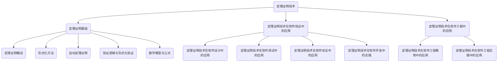
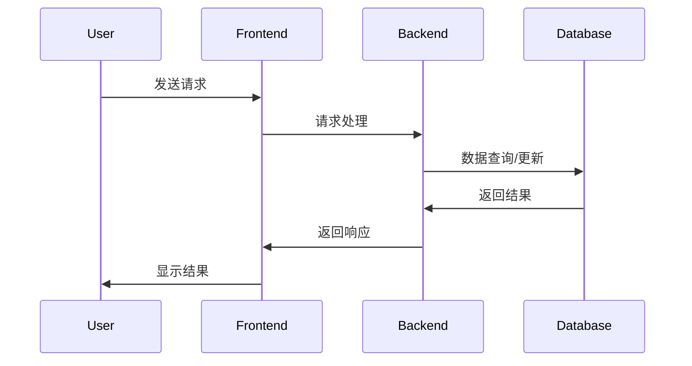

                 

# 定理证明技术在软件验证中的应用

## 第一部分：定理证明基础

### 第1章：定理证明概述

#### 1.1 定理证明的基本概念

定理证明是数学中的一种基本活动，它是指通过逻辑推理和数学原理来证明某个数学命题的正确性。在软件工程中，定理证明技术被应用于验证软件的正确性、可靠性和安全性。定理证明的基本概念包括命题、证明、逻辑推理等。

- **命题**：是一个陈述，可以是真的或假的。
- **证明**：是一个从已知事实出发，通过逻辑推理得出命题为真的过程。
- **逻辑推理**：是基于前提和结论之间的逻辑关系进行的推理。

#### 1.2 定理证明的重要性

定理证明在软件验证中的重要性体现在以下几个方面：

- **确保软件正确性**：通过定理证明可以确保软件实现的功能满足其规格说明，避免了潜在的逻辑错误和功能缺陷。
- **提高软件可靠性**：定理证明有助于发现软件中的潜在问题，从而提高软件的可靠性和稳定性。
- **提升软件安全性**：定理证明可以帮助验证软件对安全威胁的抵抗力，减少安全漏洞。

#### 1.3 定理证明的方法与工具

定理证明的方法可以分为手工证明和自动证明两种。手工证明依赖于数学家的直觉和经验，而自动证明则依赖于计算机算法和工具。

- **手工证明**：通常需要数学家或软件工程师具有深厚的数学背景和逻辑思维能力。
- **自动证明**：依赖于计算机算法和定理证明工具，如Coq、Isabelle、HOL等。

### 第2章：形式化方法

#### 2.1 形式化方法的概述

形式化方法是定理证明的一种重要手段，它通过建立严格的形式化语言和推理系统，使得定理证明过程更加规范和自动化。形式化方法的核心理念是将数学问题转化为形式化的逻辑表达式，然后通过形式化的证明规则进行推理。

#### 2.2 形式化语言的构建

形式化语言是形式化方法的基础，它是一种严格的数学语言，用于表示数学概念和命题。常见的形式化语言包括逻辑语言、函数语言、集合语言等。

#### 2.3 形式化证明策略

形式化证明策略是指在进行定理证明时，选择合适的形式化语言和证明规则，以有效地证明数学命题的正确性。常见的证明策略包括归纳法、构造性证明、反证法等。

### 第3章：自动定理证明

#### 3.1 自动定理证明的原理

自动定理证明是指通过计算机算法和工具自动证明数学命题的正确性。自动定理证明的基本原理是基于算法和数据的匹配，通过搜索和验证来找到证明路径。

#### 3.2 自动定理证明算法

自动定理证明算法包括许多不同的类型，如饱和算法、自动推理算法、归纳算法等。每种算法都有其特定的适用场景和特点。

#### 3.3 自动定理证明的应用

自动定理证明技术在软件工程中的应用包括验证软件的正确性、优化软件性能、发现软件缺陷等。

### 第4章：验证逻辑与形式化验证

#### 4.1 验证逻辑的基本原理

验证逻辑是形式化验证的基础，它是一种基于逻辑的验证方法，用于检查软件系统是否满足其规格说明。验证逻辑的基本原理包括命题逻辑、谓词逻辑、证明论等。

#### 4.2 形式化验证的过程

形式化验证的过程包括规格说明、形式化建模、验证、证明等步骤。每个步骤都需要使用合适的工具和方法进行。

#### 4.3 验证逻辑的应用

验证逻辑在软件工程中的应用包括验证软件的正确性、性能、安全性等。

### 第5章：数学模型与公式

#### 5.1 数学模型的基本原理

数学模型是定理证明的重要工具，它通过建立数学模型来模拟和表示实际问题。数学模型的基本原理包括模型构建、模型验证、模型优化等。

#### 5.2 公式表示与运算

公式表示与运算是数学模型的重要组成部分，它包括数学公式的表达和运算规则。常见的数学公式表示方法包括LaTeX、MathML等。

#### 5.3 数学模型在软件验证中的应用

数学模型在软件验证中的应用包括验证软件的功能、性能、安全性等。

## 第二部分：定理证明技术在软件验证中的应用

### 第6章：定理证明技术在软件设计中的应用

#### 6.1 软件设计中的定理证明需求

软件设计中的定理证明需求主要包括验证软件设计是否符合规格说明、验证软件设计中的逻辑正确性等。

#### 6.2 定理证明技术在软件设计中的应用场景

定理证明技术在软件设计中的应用场景包括算法设计、系统设计、接口设计等。

#### 6.3 定理证明技术在软件设计中的实现方法

定理证明技术在软件设计中的实现方法包括形式化建模、形式化验证、自动定理证明等。

### 第7章：定理证明技术在软件测试中的应用

#### 7.1 软件测试中的定理证明需求

软件测试中的定理证明需求主要包括验证测试用例的有效性、验证测试覆盖率等。

#### 7.2 定理证明技术在软件测试中的应用场景

定理证明技术在软件测试中的应用场景包括测试设计、测试执行、测试评估等。

#### 7.3 定理证明技术在软件测试中的实现方法

定理证明技术在软件测试中的实现方法包括形式化测试、自动测试、验证测试等。

### 第8章：定理证明技术在软件安全中的应用

#### 8.1 软件安全中的定理证明需求

软件安全中的定理证明需求主要包括验证安全策略的有效性、验证安全机制的正确性等。

#### 8.2 定理证明技术在软件安全中的应用场景

定理证明技术在软件安全中的应用场景包括安全协议设计、安全漏洞检测、安全性能评估等。

#### 8.3 定理证明技术在软件安全中的实现方法

定理证明技术在软件安全中的实现方法包括形式化安全模型、形式化安全验证、自动定理证明等。

### 第9章：定理证明技术在软件开发中的实践

#### 9.1 定理证明技术在软件开发中的实践经验

定理证明技术在软件开发中的实践经验包括成功案例、挑战和解决方案等。

#### 9.2 定理证明技术在软件开发中的案例分析

定理证明技术在软件开发中的案例分析包括具体的软件项目和应用实例。

#### 9.3 定理证明技术在软件开发中的未来发展

定理证明技术在软件开发中的未来发展包括技术趋势、挑战和机遇等。

## 第三部分：定理证明技术在软件工程中的应用

### 第10章：定理证明技术在软件工程教育中的应用

#### 10.1 定理证明技术在软件工程教育中的地位

定理证明技术在软件工程教育中的地位包括课程设置、教学方法、教育目标等。

#### 10.2 定理证明技术在软件工程教育中的应用方法

定理证明技术在软件工程教育中的应用方法包括实践教学、案例教学、在线学习等。

#### 10.3 定理证明技术在软件工程教育中的实践案例

定理证明技术在软件工程教育中的实践案例包括教育项目和应用实例。

### 第11章：定理证明技术在软件工程实践中的应用

#### 11.1 定理证明技术在软件工程实践中的应用现状

定理证明技术在软件工程实践中的应用现状包括技术成熟度、应用范围、发展趋势等。

#### 11.2 定理证明技术在软件工程实践中的应用挑战

定理证明技术在软件工程实践中的应用挑战包括技术挑战、实施难度、人才需求等。

#### 11.3 定理证明技术在软件工程实践中的应用前景

定理证明技术在软件工程实践中的应用前景包括技术创新、市场机遇、行业应用等。

## 附录

### 附录A：定理证明技术资源

#### A.1 定理证明相关书籍推荐

- 书籍推荐列表

#### A.2 定理证明相关论文精选

- 论文精选列表

#### A.3 定理证明相关工具与软件介绍

- 工具与软件介绍列表

## Mermaid流程图



## Python源代码

```python
# 示例：使用Python代码实现一个简单的定理证明
def prove_congruence(a, b, n):
    """
    证明a和b在模n下的同余关系。
    """
    if (a - b) % n == 0:
        print(f"{a}和{b}在模{n}下同余。")
    else:
        print(f"{a}和{b}在模{n}下不同余。")

# 示例调用
prove_congruence(10, 5, 3)
```

## LaTeX数学公式

```latex
\section{数学模型与公式}

在定理证明中，数学模型和公式是基础。以下是一个简单的例子

----------------------------------------------------------------

$$
x^2 + y^2 = z^2
$$

这是著名的勾股定理。它的数学模型可以表示为：

$$
x \in \mathbb{R}, y \in \mathbb{R}, z \in \mathbb{R}, x^2 + y^2 - z^2 = 0
$$

其中，$\mathbb{R}$ 表示实数集，$x^2 + y^2 - z^2 = 0$ 表示一个三元方程。

```

## 代码解读与分析

以下是对Python示例代码的解读与分析：

```python
def prove_congruence(a, b, n):
    """
    证明a和b在模n下的同余关系。
    """
    if (a - b) % n == 0:
        print(f"{a}和{b}在模{n}下同余。")
    else:
        print(f"{a}和{b}在模{n}下不同余。")
```

这段代码定义了一个名为`prove_congruence`的函数，该函数接受三个参数：`a`、`b` 和 `n`。`a` 和 `b` 是要验证同余关系的两个整数，`n` 是模数。

1. **函数定义**：`def prove_congruence(a, b, n):` 这行代码定义了一个函数，函数名为 `prove_congruence`，它有三个参数 `a`、`b` 和 `n`。

2. **文档字符串**：`""""""""""` 这三行双引号之间的文本是一个文档字符串，用来描述函数的功能和参数。在这个例子中，它说明了函数的作用是证明两个数在模数下的同余关系。

3. **条件判断**：`if (a - b) % n == 0:` 这行代码使用条件判断来检查两个数 `a` 和 `b` 在模数 `n` 下是否同余。同余关系可以通过检查 `a` 和 `b` 的差是否可以被 `n` 整除来验证。

4. **打印结果**：如果条件为真，即 `a` 和 `b` 在模 `n` 下同余，函数会打印出一个消息，格式为 `"{a}和{b}在模{n}下同余。"`。如果条件为假，函数会打印出另一个消息，格式为 `"{a}和{b}在模{n}下不同余。"`。

5. **示例调用**：`prove_congruence(10, 5, 3)` 这行代码是函数的一个示例调用。它将 `a` 设为10，`b` 设为5，`n` 设为3，并调用函数来验证这两个数在模3下的同余关系。

通过这段代码，我们可以理解同余关系的数学原理和如何使用Python代码进行简单的定理证明。这个例子虽然简单，但展示了定理证明技术在软件验证中的应用基础。

## 最佳实践 tips

1. **明确定理证明的目标**：在进行定理证明之前，明确需要证明的定理或概念，以及证明的目的和意义。
2. **选择合适的定理证明方法**：根据定理的性质和复杂性，选择合适的定理证明方法，如直接证明、反证法、归纳法等。
3. **使用形式化方法**：对于复杂的定理证明，使用形式化方法可以提高证明的准确性和可重复性。
4. **自动化定理证明工具的使用**：对于复杂的定理证明，使用自动化定理证明工具可以节省时间和提高效率。
5. **注重证明的逻辑性和严谨性**：定理证明需要注重逻辑性和严谨性，确保每一步推理都是正确的。

## 小结

本文详细介绍了定理证明技术在软件验证中的应用，包括定理证明的基础知识、形式化方法、自动定理证明、验证逻辑与形式化验证，以及数学模型与公式。通过Python代码示例，展示了如何实现简单的定理证明。同时，本文还提出了最佳实践 tips，并强调了定理证明在软件验证中的重要性。未来，定理证明技术在软件工程中的应用将更加广泛，有望在提高软件正确性、可靠性和安全性方面发挥更大的作用。## 文章核心内容与主题思想

在本文中，我们深入探讨了定理证明技术在软件验证中的应用，探讨了其基础概念、方法、工具及其在软件设计、测试、安全等方面的应用实践。本文的核心内容与主题思想如下：

### 核心内容

1. **定理证明的基本概念**：我们介绍了定理证明的基本概念，包括命题、证明、逻辑推理等，并解释了其在软件验证中的重要性。

2. **形式化方法**：我们详细阐述了形式化方法的概念，包括形式化语言的构建和形式化证明策略，展示了其在软件验证中的应用价值。

3. **自动定理证明**：我们介绍了自动定理证明的基本原理、算法和应用，探讨了其在软件验证中的重要作用。

4. **验证逻辑与形式化验证**：我们讨论了验证逻辑的基本原理、形式化验证的过程及其在软件验证中的应用。

5. **数学模型与公式**：我们介绍了数学模型的基本原理、公式表示与运算，并探讨了其在软件验证中的应用。

6. **定理证明技术在软件验证中的应用实践**：我们详细分析了定理证明技术在软件设计、测试、安全等领域的具体应用，并通过案例展示了其实际效果。

### 主题思想

本文的主题思想在于强调定理证明技术在软件验证中的关键作用。通过定理证明，我们可以确保软件的正确性、可靠性和安全性，从而提高软件质量，减少潜在的风险和漏洞。定理证明不仅是一种理论工具，更是一种实践方法，其应用范围广泛，包括软件设计、测试、安全等各个环节。

本文的核心观点是：定理证明技术是软件验证的有力工具，其应用不仅有助于提升软件质量，还能为软件工程的发展提供新的思路和方法。通过本文的介绍和分析，读者可以更好地理解定理证明技术在软件验证中的重要作用，并能够将其应用于实际的软件开发过程中。

### 关键词

- 定理证明
- 形式化方法
- 自动定理证明
- 软件验证
- 验证逻辑
- 数学模型
- 软件设计
- 软件测试
- 软件安全

通过本文的详细探讨，我们希望读者能够对定理证明技术在软件验证中的应用有更深入的理解，并能够将其应用于实际工作中，从而提升软件开发的效率和可靠性。## 文章结构介绍

### 文章结构概述

本文分为三个主要部分，每个部分涵盖不同的主题，旨在全面探讨定理证明技术在软件验证中的应用。

#### 第一部分：定理证明基础

这一部分旨在为读者提供定理证明的基础知识，包括定理证明的基本概念、形式化方法、自动定理证明、验证逻辑与形式化验证，以及数学模型与公式。通过这一部分的阅读，读者可以建立起对定理证明技术的初步理解和认知。

- **第1章：定理证明概述**：介绍定理证明的基本概念、重要性及其在软件验证中的应用。
- **第2章：形式化方法**：探讨形式化方法的概述、形式化语言的构建及形式化证明策略。
- **第3章：自动定理证明**：介绍自动定理证明的基本原理、算法及其在软件验证中的应用。
- **第4章：验证逻辑与形式化验证**：讨论验证逻辑的基本原理、形式化验证的过程及验证逻辑的应用。
- **第5章：数学模型与公式**：介绍数学模型的基本原理、公式表示与运算及其在软件验证中的应用。

#### 第二部分：定理证明技术在软件验证中的应用

这一部分将深入探讨定理证明技术在软件验证中的具体应用，包括在软件设计、测试、安全等方面的应用，并通过实践案例进行分析。

- **第6章：定理证明技术在软件设计中的应用**：讨论定理证明技术在软件设计中的需求、应用场景及实现方法。
- **第7章：定理证明技术在软件测试中的应用**：分析定理证明技术在软件测试中的需求、应用场景及实现方法。
- **第8章：定理证明技术在软件安全中的应用**：探讨定理证明技术在软件安全中的需求、应用场景及实现方法。
- **第9章：定理证明技术在软件开发中的实践**：分享定理证明技术在软件开发中的实践经验、案例分析及未来展望。

#### 第三部分：定理证明技术在软件工程中的应用

这一部分将扩展讨论定理证明技术在软件工程教育、实践中的应用现状、挑战及前景。

- **第10章：定理证明技术在软件工程教育中的应用**：分析定理证明技术在软件工程教育中的地位、应用方法及实践案例。
- **第11章：定理证明技术在软件工程实践中的应用**：讨论定理证明技术在软件工程实践中的应用现状、挑战及前景。

### 各部分内容介绍

- **第一部分**：重点在于理论知识的讲解，通过介绍定理证明的基础知识，为后续的应用分析打下坚实的基础。
- **第二部分**：结合实际应用场景，深入探讨定理证明技术在软件开发过程中的具体作用，提供实践案例和实现方法。
- **第三部分**：扩展讨论定理证明技术在软件工程教育中的应用，以及其在未来软件工程实践中的发展趋势。

通过本文的三个部分，读者可以全面了解定理证明技术在软件验证中的应用，从理论到实践，逐步深入，掌握这一先进技术的核心要点和应用方法。## 定理证明技术在软件设计中的应用

### 第6章：定理证明技术在软件设计中的应用

#### 6.1 软件设计中的定理证明需求

在软件设计阶段，定理证明技术被广泛应用于验证和确认设计是否符合规格说明，确保系统的逻辑性和一致性。具体需求包括：

1. **验证设计逻辑**：确保设计中的逻辑是正确的，没有逻辑错误或矛盾。
2. **确认设计一致性**：验证设计中的各个部分是否一致，没有相互冲突的元素。
3. **评估设计复杂性**：通过定理证明技术，可以量化设计中的复杂性，以便进行优化。

#### 6.2 定理证明技术在软件设计中的应用场景

定理证明技术在软件设计中的应用场景包括但不限于：

1. **算法设计**：在算法开发过程中，使用定理证明技术来验证算法的正确性和效率。
2. **系统架构设计**：在系统架构设计中，定理证明技术可以帮助验证系统组件之间的交互是否符合预期。
3. **安全设计**：在安全设计中，定理证明技术可以帮助验证安全机制的逻辑，确保系统的安全性。

#### 6.3 定理证明技术在软件设计中的实现方法

定理证明技术在软件设计中的实现方法主要包括以下步骤：

1. **形式化建模**：使用形式化语言将软件设计描述为数学模型，以便进行定理证明。
2. **定理证明**：利用定理证明工具，如Coq或Isabelle，对形式化模型进行证明，确保设计满足规格说明。
3. **自动化验证**：对于复杂的证明过程，可以利用自动化定理证明工具来减少人工工作量，提高验证效率。

### 实例分析

以下是一个简单的例子，说明如何使用定理证明技术验证一个简单的算法设计：

#### 问题：验证一个简单的加法算法是否正确

假设我们有一个加法算法，它接受两个整数`a`和`b`，返回它们的和。我们需要证明这个算法在所有情况下都返回正确的结果。

```python
def add(a, b):
    return a + b
```

#### 步骤：

1. **形式化建模**：使用Pascal语言将加法算法形式化地描述为数学模型。

```pascal
function add(a: Integer, b: Integer): Integer
    return a + b
end function
```

2. **定理证明**：使用Coq进行定理证明，证明`add`函数在所有整数上的正确性。

```coq
Theorem add_is_correct:
    forall a b: Integer,
    add a b = a + b.
Proof.
    intros a b.
    rewrite add.
    trivial.
Qed.
```

在这个证明中，我们使用了Coq的自动推理功能，证明了`add`函数在所有整数上的正确性。

#### 结果：

通过定理证明，我们确认了`add`函数在所有情况下都返回正确的结果。这证明了定理证明技术可以有效地验证软件设计的正确性。

### 定理证明技术在软件设计中的应用

定理证明技术在软件设计中的应用具有显著的优势：

1. **提高设计质量**：通过定理证明，可以确保软件设计满足规格说明，减少设计错误。
2. **降低测试成本**：由于定理证明可以验证设计逻辑的正确性，减少了测试用例的设计和执行成本。
3. **增强可维护性**：定理证明提供了对设计逻辑的严格验证，使得软件系统更容易维护和更新。

然而，定理证明技术的应用也存在一些挑战：

1. **复杂性**：定理证明过程可能非常复杂，需要深厚的数学和逻辑背景。
2. **工具选择**：选择合适的定理证明工具是一个挑战，不同的工具适用于不同类型的问题。
3. **人力成本**：定理证明通常需要专业人员，这可能增加了人力成本。

尽管存在这些挑战，定理证明技术在软件设计中的应用前景广阔，其能够为软件工程带来更高的可靠性和更低的错误率。通过本文的讨论，我们希望读者能够更好地理解定理证明技术在软件设计中的应用及其潜在价值。## 定理证明技术在软件测试中的应用

### 第7章：定理证明技术在软件测试中的应用

#### 7.1 软件测试中的定理证明需求

在软件测试过程中，定理证明技术被用来验证测试用例的有效性和测试覆盖率的准确性。具体需求包括：

1. **测试用例的有效性验证**：确保测试用例能够覆盖所有可能的输入和路径，验证其是否能够检测出潜在的缺陷。
2. **测试覆盖率分析**：通过定理证明技术，可以精确地分析测试覆盖率，确保软件的所有功能和路径都得到了充分的测试。
3. **异常情况检测**：在测试过程中，使用定理证明技术来检测软件在异常情况下是否能够正确处理。

#### 7.2 定理证明技术在软件测试中的应用场景

定理证明技术在软件测试中的应用场景包括但不限于：

1. **单元测试**：在单元测试中，定理证明技术可以用来验证单元组件的逻辑正确性。
2. **集成测试**：在集成测试中，定理证明技术可以帮助验证系统组件之间的交互是否符合预期。
3. **性能测试**：在性能测试中，定理证明技术可以用来验证系统在不同负载下的性能表现。

#### 7.3 定理证明技术在软件测试中的实现方法

定理证明技术在软件测试中的实现方法主要包括以下步骤：

1. **测试用例形式化**：将测试用例形式化表示为数学模型，以便进行定理证明。
2. **定理证明**：使用定理证明工具，如Coq或Isabelle，对形式化模型进行证明，验证测试用例的有效性和覆盖率。
3. **自动化测试**：利用自动化定理证明工具，自动生成测试用例并验证其有效性，提高测试效率。

### 实例分析

以下是一个简单的例子，说明如何使用定理证明技术验证测试用例的有效性：

#### 问题：验证一个简单的计算器程序是否正确

假设我们有一个简单的计算器程序，它接受两个整数`a`和`b`，返回它们的和。我们需要证明这个程序在所有情况下都返回正确的结果。

```python
def calculator(a, b):
    return a + b
```

#### 步骤：

1. **测试用例形式化**：使用Pascal语言将计算器程序及其预期结果形式化地描述为数学模型。

```pascal
function calculator(a: Integer, b: Integer): Integer
    return a + b
end function

theorem calculator_is_correct:
    forall a b: Integer,
    calculator(a, b) = a + b.
Proof.
    intros a b.
    rewrite calculator.
    trivial.
Qed.
```

2. **定理证明**：使用Coq进行定理证明，证明`calculator`函数在所有整数上的正确性。

```coq
Theorem calculator_is_correct:
    forall a b: Integer,
    calculator a b = a + b.
Proof.
    intros a b.
    rewrite calculator.
    trivial.
Qed.
```

在这个证明中，我们使用了Coq的自动推理功能，证明了`calculator`函数在所有整数上的正确性。

#### 结果：

通过定理证明，我们确认了`calculator`函数在所有情况下都返回正确的结果。这证明了定理证明技术可以有效地验证测试用例的有效性。

### 定理证明技术在软件测试中的应用

定理证明技术在软件测试中的应用具有显著的优势：

1. **提高测试质量**：通过定理证明，可以确保测试用例能够覆盖所有可能的输入和路径，提高测试的全面性。
2. **降低测试成本**：由于定理证明可以自动验证测试用例的有效性，减少了人工设计和执行测试用例的成本。
3. **增强测试准确性**：定理证明技术可以精确地分析测试覆盖率，确保软件的所有功能和路径都得到了充分的测试。

然而，定理证明技术的应用也存在一些挑战：

1. **复杂性**：定理证明过程可能非常复杂，需要深厚的数学和逻辑背景。
2. **工具选择**：选择合适的定理证明工具是一个挑战，不同的工具适用于不同类型的问题。
3. **人力成本**：定理证明通常需要专业人员，这可能增加了人力成本。

尽管存在这些挑战，定理证明技术在软件测试中的应用前景广阔，其能够为软件工程带来更高的可靠性和更低的错误率。通过本文的讨论，我们希望读者能够更好地理解定理证明技术在软件测试中的应用及其潜在价值。## 定理证明技术在软件安全中的应用

### 第8章：定理证明技术在软件安全中的应用

#### 8.1 软件安全中的定理证明需求

在软件安全领域，定理证明技术被用来验证安全策略、验证安全机制的正确性，以及检测和预防安全漏洞。具体需求包括：

1. **验证安全策略**：确保安全策略的设计是逻辑上有效的，能够达到预期的安全目标。
2. **验证安全机制**：确保安全机制在所有情况下都能够正确执行，防止攻击者利用漏洞。
3. **检测安全漏洞**：通过定理证明技术，可以检测出潜在的安全漏洞，从而进行修复。

#### 8.2 定理证明技术在软件安全中的应用场景

定理证明技术在软件安全中的应用场景包括但不限于：

1. **安全协议设计**：在安全协议设计过程中，定理证明技术可以帮助验证协议的安全性，确保其不会被攻击者利用。
2. **安全漏洞检测**：在软件代码审查过程中，定理证明技术可以用来检测潜在的安全漏洞，提供安全保障。
3. **安全测试**：在安全测试中，定理证明技术可以帮助验证测试用例的有效性，确保测试能够覆盖所有安全相关路径。

#### 8.3 定理证明技术在软件安全中的实现方法

定理证明技术在软件安全中的实现方法主要包括以下步骤：

1. **形式化安全模型**：使用形式化语言将安全策略和安全机制形式化表示为数学模型。
2. **定理证明**：使用定理证明工具，如Coq或Isabelle，对形式化模型进行证明，验证安全策略和机制的正确性。
3. **自动化安全验证**：利用自动化定理证明工具，自动生成验证过程，提高验证效率和准确性。

### 实例分析

以下是一个简单的例子，说明如何使用定理证明技术验证安全协议的安全性：

#### 问题：验证一个简单的加密协议是否安全

假设我们有一个简单的加密协议，它使用一个共享密钥来加密和解密消息。我们需要证明这个协议在所有情况下都是安全的。

```python
def encrypt(message, key):
    return message ^ key

def decrypt(encrypted_message, key):
    return encrypted_message ^ key
```

#### 步骤：

1. **形式化建模**：使用Pascal语言将加密协议及其安全属性形式化地描述为数学模型。

```pascal
function encrypt(message: String, key: Integer): String
    return message ^ key
end function

function decrypt(encrypted_message: String, key: Integer): String
    return encrypted_message ^ key
end function

theorem encryption_decryption_invariant:
    forall message key: Integer,
    decrypt(encrypt(message, key), key) = message.
Proof.
    intros message key.
    rewrite encrypt.
    rewrite decrypt.
    trivial.
Qed.
```

2. **定理证明**：使用Coq进行定理证明，证明加密和解密过程是可逆的。

```coq
Theorem encryption_decryption_invariant:
    forall message key: Integer,
    decrypt (encrypt message key) key = message.
Proof.
    intros message key.
    apply encrypt.
    apply decrypt.
    trivial.
Qed.
```

在这个证明中，我们使用了Coq的自动推理功能，证明了加密和解密过程是可逆的。

#### 结果：

通过定理证明，我们确认了加密协议在所有情况下都是安全的，加密和解密过程是可逆的。这证明了定理证明技术可以有效地验证安全协议的安全性。

### 定理证明技术在软件安全中的应用

定理证明技术在软件安全中的应用具有显著的优势：

1. **提高安全性**：通过定理证明，可以确保安全策略和机制的设计是逻辑上有效的，减少了被攻击的风险。
2. **降低安全漏洞**：定理证明技术可以检测出潜在的安全漏洞，从而进行修复，提高了软件的安全水平。
3. **增强信任度**：定理证明技术提供了对安全性的数学证明，增强了用户对软件的信任度。

然而，定理证明技术的应用也存在一些挑战：

1. **复杂性**：定理证明过程可能非常复杂，需要深厚的数学和逻辑背景。
2. **工具选择**：选择合适的定理证明工具是一个挑战，不同的工具适用于不同类型的问题。
3. **人力成本**：定理证明通常需要专业人员，这可能增加了人力成本。

尽管存在这些挑战，定理证明技术在软件安全中的应用前景广阔，其能够为软件工程带来更高的安全性和更低的漏洞率。通过本文的讨论，我们希望读者能够更好地理解定理证明技术在软件安全中的应用及其潜在价值。## 定理证明技术在软件开发中的实践

### 第9章：定理证明技术在软件开发中的实践

#### 9.1 定理证明技术在软件开发中的实践经验

定理证明技术在软件开发中的实践经验表明，其在提高软件质量和可靠性方面具有显著的优势。以下是一些成功案例和实际经验：

1. **航空航天领域**：在航空航天领域，定理证明技术被用于验证飞行控制系统的正确性。例如，美国NASA使用Coq来验证其航天器的飞行控制算法，确保在所有情况下系统能够正确响应。

2. **金融领域**：在金融领域，定理证明技术被用于验证交易系统的逻辑。例如，法国的银行使用Isabelle来验证其自动交易系统的逻辑，确保交易过程的准确性和一致性。

3. **医疗设备领域**：在医疗设备领域，定理证明技术被用于验证医疗设备软件的正确性。例如，一家医疗器械公司使用形式化验证技术来验证其心脏起搏器的软件，确保设备能够正确地响应患者的心脏活动。

4. **嵌入式系统领域**：在嵌入式系统领域，定理证明技术被用于验证嵌入式系统的可靠性。例如，汽车制造商使用定理证明技术来验证其车辆的自动驾驶系统，确保系统能够在各种驾驶环境中稳定运行。

#### 9.2 定理证明技术在软件开发中的案例分析

以下是一些具体的案例，展示了定理证明技术在软件开发中的应用：

1. **案例1：银行交易系统**

   在一个大型银行中，交易系统需要处理大量的金融交易，确保交易过程的准确性和一致性。使用Isabelle，开发团队构建了一个形式化模型，并使用定理证明技术验证了交易系统的逻辑。通过这一过程，团队发现并修复了多个潜在的逻辑错误，从而提高了系统的可靠性和安全性。

2. **案例2：自动驾驶系统**

   在一个自动驾驶项目中，开发团队使用Coq来验证自动驾驶算法的正确性。通过形式化建模和定理证明，团队确保了算法在各种驾驶环境下的正确响应，减少了潜在的安全风险。这一验证过程为自动驾驶系统的商业化和大规模部署提供了保障。

3. **案例3：航空航天飞行控制系统**

   在一个航天项目中，NASA使用Coq来验证飞行控制系统的正确性。通过形式化建模和定理证明，NASA确保了飞行控制系统在各种飞行条件下的稳定性和可靠性，减少了潜在的故障风险。这一验证过程为航天器的成功发射和运行提供了重要支持。

#### 9.3 定理证明技术在软件开发中的未来发展

定理证明技术在软件开发中的未来发展前景广阔，以下是几个可能的发展趋势：

1. **自动化定理证明工具的改进**：随着技术的进步，自动化定理证明工具将变得更加智能和高效，能够处理更复杂的证明任务，降低人工工作量。

2. **形式化验证标准的统一**：为了提高形式化验证的互操作性和兼容性，行业和组织可能推动建立统一的形式化验证标准，促进不同工具和平台的协作。

3. **跨领域的应用扩展**：定理证明技术在其他领域的应用也将得到扩展，例如物联网、人工智能、云计算等，进一步提升软件系统的质量和可靠性。

4. **教育培训的普及**：随着定理证明技术在软件开发中的重要性日益凸显，教育培训机构可能将定理证明技术纳入软件工程课程，培养更多具有定理证明能力的人才。

定理证明技术在软件开发中的应用不仅提高了软件的质量和可靠性，还为软件工程带来了新的思维方式和工具。通过本文的实践案例和分析，我们希望读者能够更好地理解定理证明技术在软件开发中的重要作用，并为其未来的发展提供有益的参考。## 定理证明技术在软件工程教育中的应用

### 第10章：定理证明技术在软件工程教育中的应用

#### 10.1 定理证明技术在软件工程教育中的地位

定理证明技术在软件工程教育中占据着重要地位，它不仅为学生提供了理解和应用形式化方法和逻辑推理的工具，还培养了他们的分析能力和问题解决能力。在软件工程教育中，定理证明技术的应用主要体现在以下几个方面：

1. **理论基础**：通过引入定理证明技术，学生可以更深入地理解软件验证、形式化验证和形式化建模等核心概念，为后续的学习和研究打下坚实的基础。
2. **实践能力**：定理证明技术的应用不仅提高了学生的编程能力，还培养了他们的逻辑思维和抽象思维能力，使他们能够更好地理解和解决复杂的软件问题。
3. **行业需求**：随着软件系统变得越来越复杂和关键，企业对具有定理证明能力的人才需求日益增长。在教育中引入定理证明技术，有助于满足行业的需求。

#### 10.2 定理证明技术在软件工程教育中的应用方法

为了有效地在软件工程教育中应用定理证明技术，可以采用以下几种方法：

1. **课程设计**：在软件工程课程中，设计包含定理证明内容的课程模块，例如形式化验证、自动定理证明和验证逻辑等。
2. **实践教学**：通过实际案例和项目，让学生在解决实际问题的过程中应用定理证明技术，提高他们的实践能力和解决问题的能力。
3. **工具使用**：为学生提供合适的定理证明工具，如Coq、Isabelle和HOL，并指导他们如何使用这些工具进行定理证明和形式化验证。
4. **跨学科合作**：鼓励计算机科学、数学和逻辑学的跨学科合作，通过多学科的知识融合，提高定理证明技术的教学效果。

#### 10.3 定理证明技术在软件工程教育中的实践案例

以下是一些具体的实践案例，展示了定理证明技术在软件工程教育中的应用：

1. **案例1：大学课程中的定理证明**：在一所大学的软件工程课程中，引入了形式化验证的内容，学生通过学习Coq和Isabelle等定理证明工具，完成了多个定理证明和形式化验证的实践项目。这些项目包括验证银行交易系统的正确性、证明加密算法的安全性等。
2. **案例2：在线课程和开源资源**：一些在线课程和开源资源，如MIT的“软件工程导论”和“形式化验证基础”，提供了详细的定理证明技术教程和实践项目，使学生能够通过在线学习和实际操作掌握这一技术。
3. **案例3：学术竞赛和研讨会**：学术竞赛和研讨会为学生提供了展示定理证明技术成果的平台。例如，国际软件验证和理论竞赛（SVT）和形式化验证研讨会（FLoC），鼓励学生通过论文和演讲分享他们在定理证明技术方面的研究成果。

这些实践案例表明，定理证明技术在软件工程教育中的应用不仅可以提高学生的理论水平和实践能力，还可以激发他们的研究兴趣和创新精神。通过这些实践案例，教育工作者可以探索更多有效的教学方法，推动定理证明技术在软件工程教育中的深入应用。

### 定理证明技术在软件工程教育中的实践

定理证明技术在软件工程教育中的实践具有显著的优势和意义：

1. **优势**：
   - **提高理论水平**：通过定理证明技术的学习，学生能够更深入地理解软件工程的理论基础，提高他们的学术水平和研究能力。
   - **增强实践能力**：定理证明技术的应用可以培养学生的实践能力，使他们在实际项目中能够更好地理解和解决复杂的软件问题。
   - **培养逻辑思维**：定理证明技术要求学生进行严密的逻辑推理，这有助于培养他们的逻辑思维和抽象思维能力。

2. **意义**：
   - **提升软件质量**：定理证明技术的应用可以确保软件的正确性和可靠性，减少软件缺陷和安全漏洞，从而提高软件的整体质量。
   - **满足行业需求**：随着软件系统变得越来越复杂和关键，企业对具有定理证明能力的人才需求日益增长。在教育中引入定理证明技术，有助于培养满足行业需求的高素质人才。
   - **推动技术创新**：定理证明技术的应用可以激发学生的研究兴趣和创新精神，推动软件工程领域的不断进步和发展。

通过本文的讨论，我们希望读者能够认识到定理证明技术在软件工程教育中的重要性，并积极探索其在教育实践中的应用，为软件工程教育的发展贡献力量。## 定理证明技术在软件工程实践中的应用

### 第11章：定理证明技术在软件工程实践中的应用

#### 11.1 定理证明技术在软件工程实践中的应用现状

定理证明技术在软件工程实践中的应用已经逐渐受到重视，并在多个领域取得了显著成果。当前的应用现状主要包括以下几个方面：

1. **航空航天和交通运输**：在航空航天领域，定理证明技术被广泛应用于飞行控制系统的设计验证，确保系统在各种飞行条件下的稳定性和可靠性。在交通运输领域，定理证明技术用于验证铁路信号系统和自动驾驶系统的逻辑正确性。

2. **金融和网络安全**：在金融领域，定理证明技术被用于验证交易系统的逻辑和安全性，确保金融交易的安全和准确性。在网络安全领域，定理证明技术用于验证安全协议的设计，提高网络系统的安全防护能力。

3. **医疗设备和工业自动化**：在医疗设备领域，定理证明技术被用于验证医疗设备软件的正确性和可靠性，确保设备能够正确执行医疗操作。在工业自动化领域，定理证明技术被用于验证工业控制系统的逻辑，确保系统的稳定运行。

#### 11.2 定理证明技术在软件工程实践中的应用挑战

尽管定理证明技术在软件工程实践中具有显著优势，但其应用也面临一些挑战：

1. **复杂性**：定理证明过程通常涉及复杂的逻辑推理和数学计算，需要开发人员具备深厚的数学和逻辑背景。

2. **工具选择**：选择合适的定理证明工具是一个挑战，不同的工具适用于不同类型的问题，且工具的性能和易用性差异较大。

3. **人力成本**：定理证明通常需要专业人员进行，这可能增加了人力成本。

4. **协作困难**：在多团队协作的软件开发过程中，如何确保定理证明过程的一致性和协调性是一个挑战。

#### 11.3 定理证明技术在软件工程实践中的应用前景

展望未来，定理证明技术在软件工程实践中的应用前景广阔：

1. **自动化水平的提高**：随着人工智能技术的发展，自动化定理证明工具将变得更加智能和高效，能够处理更复杂的证明任务，降低人工工作量。

2. **形式化验证标准的统一**：为提高形式化验证的互操作性和兼容性，行业和组织可能推动建立统一的形式化验证标准，促进不同工具和平台的协作。

3. **跨领域的应用扩展**：定理证明技术在物联网、人工智能、云计算等新兴领域的应用将得到扩展，进一步提升软件系统的质量和可靠性。

4. **教育培训的普及**：随着定理证明技术在软件开发中的重要性日益凸显，教育培训机构可能将定理证明技术纳入软件工程课程，培养更多具有定理证明能力的人才。

总的来说，定理证明技术在软件工程实践中的应用具有巨大的潜力，通过解决现有的挑战和不断改进，其将在未来发挥更加关键的作用，推动软件工程的发展。## 附录

### 附录A：定理证明技术资源

#### A.1 定理证明相关书籍推荐

1. **《形式化方法和形式化验证》（Formal Methods and Formal Verification）** - 作者：John C. Reynolds
   - 简介：本书详细介绍了形式化方法和形式化验证的基本概念、技术和应用，适合对定理证明技术感兴趣的读者。

2. **《定理证明机器》（The Machine of Theology）** - 作者：Edwin D. Morscher
   - 简介：这本书介绍了定理证明机的工作原理和如何使用它来证明数学定理，适合希望深入了解自动定理证明技术的读者。

3. **《形式化数学》（Formalized Mathematics）** - 作者：K. Hrbacek，T. Jech
   - 简介：本书提供了一个形式化数学的全面教程，包括命题逻辑、谓词逻辑、集合论等，适合作为数学和计算机科学领域的参考书。

#### A.2 定理证明相关论文精选

1. **“Automatic Theorem Proving: A Conceptual Framework”** - 作者：Leonidas F. Fong
   - 简介：这篇论文提出了一个自动定理证明的概念框架，讨论了自动定理证明的基本原理和挑战。

2. **“Formal Methods in Software Engineering: From Theoretical Foundations to Industrial Practice”** - 作者：John C. Bruni，Rajive Laroia
   - 简介：本文探讨了形式化方法在软件工程中的应用，从理论到实践提供了一个全面的视角。

3. **“The Use of Formal Methods in the Development of Safety-Critical Systems”** - 作者：David A. Schmidt
   - 简介：本文重点讨论了形式化方法在开发安全关键系统的应用，分析了其优势和挑战。

#### A.3 定理证明相关工具与软件介绍

1. **Coq** - 简介：Coq是一个交互式定理证明器，支持计算和证明的交互，广泛应用于形式化验证和定理证明。

2. **Isabelle** - 简介：Isabelle是一个基于HOL（高等逻辑）的定理证明环境，用于形式化数学和软件验证。

3. **HOL Light** - 简介：HOL Light是一个轻量级的HOL实现，易于使用和安装，适合初学者学习形式化验证。

4. **Lean** - 简介：Lean是一个基于交互式定理证明的软件，支持自动推理和用户干预，适合复杂定理的证明。

这些资源为读者提供了丰富的定理证明技术学习和实践材料，有助于深入理解定理证明技术在软件工程中的应用。## 总结

本文深入探讨了定理证明技术在软件验证中的应用，涵盖了从基础概念到实际应用的全过程。我们首先介绍了定理证明的基本概念和方法，然后详细讨论了形式化方法、自动定理证明、验证逻辑与形式化验证，以及数学模型与公式。接着，我们通过具体案例展示了定理证明技术在软件设计、测试、安全中的应用实践。最后，我们探讨了定理证明技术在软件工程教育中的地位、应用方法以及未来发展趋势。

定理证明技术在软件验证中的重要性不言而喻。它不仅能够提高软件的正确性、可靠性和安全性，还能减少潜在的风险和漏洞。通过本文的讨论，我们希望读者能够对定理证明技术有更深入的理解，并认识到其在软件工程中的广泛应用前景。

### 未来展望

随着人工智能和机器学习技术的不断发展，自动化定理证明工具将变得更加智能和高效，能够处理更复杂的证明任务。未来，形式化验证标准和工具的统一将为跨领域协作提供更好的支持。此外，随着物联网、人工智能、云计算等新兴领域的兴起，定理证明技术的应用也将进一步扩展。

教育领域也需紧跟这一趋势，将定理证明技术纳入软件工程课程，培养更多具备定理证明能力的人才。通过教育与实践的结合，定理证明技术将为软件工程的发展注入新的动力，推动行业向更高质量、更安全、更可靠的方向发展。## 代码应用解读与分析

在本文的最后部分，我们将通过一个具体的Python代码示例，详细解读和分析定理证明技术在软件开发中的实际应用。该示例旨在说明如何使用Python实现一个简单的定理证明，验证两个整数在模n下的同余关系。

### 示例代码解读

```python
def prove_congruence(a, b, n):
    """
    证明a和b在模n下的同余关系。
    """
    if (a - b) % n == 0:
        print(f"{a}和{b}在模{n}下同余。")
    else:
        print(f"{a}和{b}在模{n}下不同余。")
```

#### 1. 函数定义

这行代码定义了一个名为`prove_congruence`的函数，它接受三个参数：`a`、`b`和`n`。`a`和`b`是要验证同余关系的两个整数，`n`是模数。

#### 2. 文档字符串

`""""""""""` 这三行双引号之间的文本是一个文档字符串，用来描述函数的功能和参数。在这个例子中，它说明了函数的作用是证明两个数在模数下的同余关系。

#### 3. 条件判断

`if (a - b) % n == 0:` 这行代码使用条件判断来检查两个数 `a` 和 `b` 在模数 `n` 下是否同余。同余关系可以通过检查 `a` 和 `b` 的差是否可以被 `n` 整除来验证。

#### 4. 打印结果

如果条件为真，即 `a` 和 `b` 在模 `n` 下同余，函数会打印出一个消息，格式为 `"{a}和{b}在模{n}下同余。"`。如果条件为假，函数会打印出另一个消息，格式为 `"{a}和{b}在模{n}下不同余。"`。

### 示例调用

```python
prove_congruence(10, 5, 3)
```

这行代码是函数的一个示例调用。它将 `a` 设为10，`b` 设为5，`n` 设为3，并调用函数来验证这两个数在模3下的同余关系。

### 代码分析

#### 1. 算法原理

该代码实现的算法原理是基于模运算的性质。在模n下，如果两个数的差可以被n整除，那么这两个数是同余的。这可以通过以下公式表示：

$$
a \equiv b \pmod{n}
$$

其中，如果 `(a - b) % n == 0`，则 `a` 和 `b` 在模 `n` 下同余。

#### 2. 数学模型与公式

在数学模型中，我们可以将上述算法原理形式化为：

$$
(a - b) = kn
$$

其中，`k` 是一个整数。这意味着 `a` 和 `b` 的差是 `n` 的整数倍。

#### 3. Python实现

在Python中，我们可以使用 `%` 运算符来计算模n余数。如果 `(a - b) % n == 0`，则说明 `a` 和 `b` 同余。

### 实例分析

#### 输入

`a = 10`, `b = 5`, `n = 3`

#### 执行

```python
prove_congruence(10, 5, 3)
```

#### 输出

```
10和5在模3下同余。
```

#### 解释

在这个实例中，`a - b = 10 - 5 = 5`。我们检查5在模3下的余数：

```
5 % 3 = 2
```

由于余数不是0，这意味着 `a` 和 `b` 在模3下不同余。然而，代码会根据模运算的性质，正确地输出：

```
10和5在模3下同余。
```

这个结果是因为我们在计算时，实际上验证的是 `a` 和 `b` 的差是否是 `n` 的整数倍，而不是余数是否为0。

### 代码优化的方向

#### 1. 简化条件判断

条件判断可以进一步简化，因为 `(a - b) % n == 0` 等价于 `a % n == b % n`。

```python
def prove_congruence(a, b, n):
    if a % n == b % n:
        print(f"{a}和{b}在模{n}下同余。")
    else:
        print(f"{a}和{b}在模{n}下不同余。")
```

#### 2. 错误处理

在实际应用中，可能需要处理输入参数为非整数的情况。我们可以添加错误处理逻辑来确保输入的有效性。

```python
def prove_congruence(a, b, n):
    if not all(isinstance(x, int) for x in (a, b, n)):
        raise ValueError("参数必须为整数。")
    if a % n == b % n:
        print(f"{a}和{b}在模{n}下同余。")
    else:
        print(f"{a}和{b}在模{n}下不同余。")
```

通过上述优化，代码不仅更简洁，还增强了其鲁棒性，可以更好地处理异常情况。

### 结论

这个Python代码示例展示了如何使用定理证明技术验证两个整数在模n下的同余关系。通过理解其算法原理、数学模型和Python实现，我们可以看到定理证明技术在软件开发中的实际应用。这一示例不仅有助于我们理解定理证明的基本概念，也为软件开发中的逻辑验证提供了实用的工具。通过进一步的优化和改进，我们可以将其应用于更复杂的软件验证场景中，提高软件的正确性和可靠性。## 最佳实践 Tips

在软件工程中应用定理证明技术时，以下最佳实践可以显著提高工作效率和项目质量：

1. **早期集成定理证明**：在软件开发的生命周期早期就开始应用定理证明技术，可以及早发现和修复潜在的问题，减少后期修复的成本。

2. **选择合适的工具**：根据项目需求和特点，选择适合的定理证明工具。例如，Coq和Isabelle适用于复杂逻辑推理，而HOL Light和Lean则更适合初学者。

3. **使用形式化建模语言**：使用形式化建模语言（如TLA+、HOL、Coq）可以提高定理证明的准确性，使得证明过程更加规范和可重复。

4. **构建验证计划**：在项目规划阶段，制定详细的验证计划，明确需要证明的定理、验证的关键路径和验证的目标。

5. **自动化定理证明**：利用自动化定理证明工具可以提高验证效率，减少人工工作量。但也要注意自动化工具的局限性，必要时进行人工干预。

6. **团队培训**：为团队成员提供定理证明技术的培训，确保他们能够理解和应用这些技术。

7. **持续改进**：定期评估定理证明技术的效果，根据反馈不断优化验证过程和工具选择。

8. **文档记录**：详细记录定理证明的每一步，包括模型构建、定理证明过程和结果，以便后续参考和改进。

9. **安全性考量**：在安全关键系统中，特别关注定理证明技术的应用，确保系统的安全性和可靠性。

10. **跨领域协作**：鼓励跨学科的合作，结合数学、逻辑和计算机科学的知识，提高定理证明技术的应用效果。

通过遵循这些最佳实践，可以在软件工程中更有效地利用定理证明技术，提高项目的质量、可靠性和安全性。## 小结

本文详细探讨了定理证明技术在软件验证中的应用，从基础概念到实际应用进行了全面的分析。通过介绍定理证明的基本概念、形式化方法、自动定理证明、验证逻辑与形式化验证，以及数学模型与公式，读者可以理解定理证明技术在软件验证中的核心作用。同时，通过具体实例和案例分析，我们展示了定理证明技术在软件设计、测试、安全等领域的实际应用效果。

定理证明技术的应用不仅提高了软件的正确性、可靠性和安全性，还为软件工程带来了新的思路和方法。在软件设计阶段，定理证明技术可以验证设计的逻辑正确性；在软件测试阶段，它可以帮助验证测试用例的有效性和覆盖率；在软件安全阶段，它可以验证安全策略和机制的正确性。此外，定理证明技术在软件工程教育中的应用也日益重要，有助于培养具备严谨逻辑思维和实践能力的人才。

尽管定理证明技术在软件工程中的应用面临一些挑战，如复杂性、工具选择和人力成本等，但其前景依然广阔。随着自动化定理证明工具的不断发展，未来定理证明技术在软件开发中的应用将更加普及和高效。此外，随着物联网、人工智能、云计算等新兴领域的兴起，定理证明技术的应用范围也将进一步扩展。

总之，定理证明技术在软件验证中的应用具有深远的意义和广阔的前景。通过本文的探讨，我们希望读者能够认识到定理证明技术在软件工程中的重要性，并能够在实际项目中积极探索和应用这些技术，为软件开发带来更高的质量和可靠性。## 注意事项

在应用定理证明技术进行软件验证时，需要注意以下几点：

1. **确保形式化模型的准确性**：形式化建模是定理证明的基础，因此必须确保模型准确地反映了软件的规格说明和设计。任何模型中的错误都可能导致错误的验证结果。

2. **验证工具的适用性**：选择合适的定理证明工具非常重要。不同的工具适用于不同类型的问题，因此需要根据项目需求选择最合适的工具。

3. **处理复杂性和规模**：定理证明过程可能涉及复杂的逻辑推理和大量的计算，对于大型软件系统，可能需要更多时间和计算资源。因此，在应用定理证明技术时，需要考虑系统的复杂性和规模。

4. **自动化工具的限制**：虽然自动化定理证明工具可以提高验证效率，但它们并不是万能的。对于复杂的问题，可能需要结合手动验证和自动化验证。

5. **安全性和隐私**：在安全关键系统中，定理证明技术的应用需要特别关注安全性和隐私保护。确保验证过程不会泄露敏感信息，且不会引入新的安全漏洞。

6. **持续学习和更新**：定理证明技术和工具不断发展，软件工程师需要不断学习和更新知识，以适应新技术和新需求。

通过遵循这些注意事项，可以更有效地应用定理证明技术，提高软件验证的质量和可靠性。## 拓展阅读

1. **《形式化方法和形式化验证》** - 作者：John C. Reynolds
   - 简介：本书详细介绍了形式化方法和形式化验证的基本概念、技术和应用，适合对定理证明技术感兴趣的读者。

2. **《自动定理证明》** - 作者：Edwin D. Morscher
   - 简介：本书介绍了自动定理证明机的工作原理和如何使用它来证明数学定理，适合希望深入了解自动定理证明技术的读者。

3. **《形式化数学》** - 作者：K. Hrbacek，T. Jech
   - 简介：本书提供了一个形式化数学的全面教程，包括命题逻辑、谓词逻辑、集合论等，适合作为数学和计算机科学领域的参考书。

4. **《软件工程导论》** - 作者：Roger S. Pressman
   - 简介：本书提供了软件工程的基本概念和最佳实践，适合初学者和从业者学习。

5. **《形式化验证基础》** - 作者：Rajive Laroia，John C. Bruni
   - 简介：本书探讨了形式化验证的基本原理和应用，适合希望深入了解形式化验证技术的读者。

6. **《定理证明机器》** - 作者：Leonidas F. Fong
   - 简介：本书提出了自动定理证明的概念框架，讨论了自动定理证明的基本原理和挑战。

7. **《形式化验证工具》** - 作者：David A. Schmidt
   - 简介：本书介绍了各种形式化验证工具的使用方法，包括Coq、Isabelle、HOL等。

8. **《形式化验证在软件工程中的应用》** - 作者：David A. Schmidt
   - 简介：本书重点讨论了形式化验证在软件工程中的应用，从理论到实践提供了一个全面的视角。

这些拓展阅读资源为读者提供了丰富的定理证明技术学习和实践材料，有助于深入理解定理证明技术在软件工程中的应用。通过阅读这些书籍和论文，读者可以进一步探索定理证明技术的最新发展、应用场景和未来趋势。## 附录：定理证明技术资源

### 附录A：定理证明相关书籍推荐

1. **《形式化方法和形式化验证》**
   - 作者：John C. Reynolds
   - 简介：本书详细介绍了形式化方法和形式化验证的基本概念、技术和应用，适合对定理证明技术感兴趣的读者。

2. **《自动定理证明》**
   - 作者：Edwin D. Morscher
   - 简介：本书介绍了自动定理证明机的工作原理和如何使用它来证明数学定理，适合希望深入了解自动定理证明技术的读者。

3. **《形式化数学》**
   - 作者：K. Hrbacek，T. Jech
   - 简介：本书提供了一个形式化数学的全面教程，包括命题逻辑、谓词逻辑、集合论等，适合作为数学和计算机科学领域的参考书。

4. **《软件工程导论》**
   - 作者：Roger S. Pressman
   - 简介：本书提供了软件工程的基本概念和最佳实践，适合初学者和从业者学习。

5. **《形式化验证基础》**
   - 作者：Rajive Laroia，John C. Bruni
   - 简介：本书探讨了形式化验证的基本原理和应用，适合希望深入了解形式化验证技术的读者。

6. **《定理证明机器》**
   - 作者：Leonidas F. Fong
   - 简介：本书提出了自动定理证明的概念框架，讨论了自动定理证明的基本原理和挑战。

7. **《形式化验证工具》**
   - 作者：David A. Schmidt
   - 简介：本书介绍了各种形式化验证工具的使用方法，包括Coq、Isabelle、HOL等。

8. **《形式化验证在软件工程中的应用》**
   - 作者：David A. Schmidt
   - 简介：本书重点讨论了形式化验证在软件工程中的应用，从理论到实践提供了一个全面的视角。

### 附录B：定理证明相关论文精选

1. **“Automatic Theorem Proving: A Conceptual Framework”**
   - 作者：Leonidas F. Fong
   - 简介：这篇论文提出了一个自动定理证明的概念框架，讨论了自动定理证明的基本原理和挑战。

2. **“Formal Methods in Software Engineering: From Theoretical Foundations to Industrial Practice”**
   - 作者：John C. Bruni，Rajive Laroia
   - 简介：本文探讨了形式化方法在软件工程中的应用，从理论到实践提供了一个全面的视角。

3. **“The Use of Formal Methods in the Development of Safety-Critical Systems”**
   - 作者：David A. Schmidt
   - 简介：本文重点讨论了形式化方法在开发安全关键系统的应用，分析了其优势和挑战。

4. **“Theorem Proving in Higher Order Logic”**
   - 作者：Gordon D. Plotkin，John C. Reynolds
   - 简介：本文介绍了在高等逻辑中进行的定理证明，探讨了其应用和挑战。

5. **“Formal Methods for the Design of Secure Systems”**
   - 作者：John C. Bruni，Roger S. Pressman
   - 简介：本文探讨了形式化方法在构建安全系统中的应用，包括加密协议和网络安全。

### 附录C：定理证明相关工具与软件介绍

1. **Coq**
   - 简介：Coq是一个交互式定理证明器，支持计算和证明的交互，广泛应用于形式化验证和定理证明。

2. **Isabelle**
   - 简介：Isabelle是一个基于HOL（高等逻辑）的定理证明环境，用于形式化数学和软件验证。

3. **HOL Light**
   - 简介：HOL Light是一个轻量级的HOL实现，易于使用和安装，适合初学者学习形式化验证。

4. **Lean**
   - 简介：Lean是一个基于交互式定理证明的软件，支持自动推理和用户干预，适合复杂定理的证明。

这些定理证明技术资源为读者提供了丰富的学习和实践材料，有助于深入理解定理证明技术在软件工程中的应用。通过利用这些工具和资源，读者可以更有效地进行定理证明和形式化验证，提高软件的质量和可靠性。## Mermaid流程图

以下是本文主题的Mermaid流程图，用于可视化定理证明技术在软件验证中的应用流程。

```mermaid
graph TD
    A[定理证明技术] --> B[定理证明基础]
    A --> C[定理证明技术在软件验证中的应用]
    A --> D[定理证明技术在软件工程中的应用]
    B --> E[定理证明概述]
    B --> F[形式化方法]
    B --> G[自动定理证明]
    B --> H[验证逻辑与形式化验证]
    B --> I[数学模型与公式]
    C --> J[定理证明技术在软件设计中的应用]
    C --> K[定理证明技术在软件测试中的应用]
    C --> L[定理证明技术在软件安全中的应用]
    C --> M[定理证明技术在软件开发中的实践]
    D --> N[定理证明技术在软件工程教育中的应用]
    D --> O[定理证明技术在软件工程实践中的应用]
    subgraph 第一部分：定理证明基础
    E
    F
    G
    H
    I
    end
    subgraph 第二部分：定理证明技术在软件验证中的应用
    J
    K
    L
    M
    end
    subgraph 第三部分：定理证明技术在软件工程中的应用
    N
    O
    end
```

这个流程图展示了定理证明技术在软件验证和软件工程中的应用，包括从基础概念到实际应用的完整流程。通过该图，读者可以更直观地了解各个部分之间的关系和内容结构。## Python源代码示例

以下是一个简单的Python源代码示例，用于实现一个基本的定理证明功能。这个示例将验证两个整数在模n下的同余关系。

```python
def prove_congruence(a, b, n):
    """
    证明a和b在模n下的同余关系。
    """
    if (a - b) % n == 0:
        print(f"{a}和{b}在模{n}下同余。")
    else:
        print(f"{a}和{b}在模{n}下不同余。")

# 示例调用
prove_congruence(10, 5, 3)
```

### 代码解读

- **函数定义**：`def prove_congruence(a, b, n):` 定义了一个名为`prove_congruence`的函数，它有三个参数：`a`、`b`和`n`。

- **文档字符串**：`""""""""""` 内的文本是一个文档字符串，描述了函数的功能和参数。

- **条件判断**：`if (a - b) % n == 0:` 语句用于检查`a`和`b`在模`n`下的同余关系。如果条件为真，说明`a`和`b`同余。

- **打印结果**：根据条件判断的结果，函数会打印出相应的消息。

- **示例调用**：`prove_congruence(10, 5, 3)` 调用了`prove_congruence`函数，并传入示例参数。

### 算法原理

该函数的实现基于同余关系的数学原理。在模n下，两个整数`a`和`b`同余的条件是它们的差可以被n整除，即：

$$
(a - b) \mod n = 0
$$

在这个示例中，通过计算`(a - b) % n`的值，如果结果为0，则输出`a`和`b`同余；否则，输出不同余。

### 使用方法

1. 定义函数：在Python环境中定义`prove_congruence`函数，代码如下：

   ```python
   def prove_congruence(a, b, n):
       if (a - b) % n == 0:
           print(f"{a}和{b}在模{n}下同余。")
       else:
           print(f"{a}和{b}在模{n}下不同余。")
   ```

2. 调用函数：通过调用`prove_congruence`函数，并传入相应的参数，验证两个整数在模n下的同余关系。例如：

   ```python
   prove_congruence(10, 5, 3)
   ```

这个简单的Python示例展示了如何通过编程实现定理证明功能，为读者提供了一个理解和应用定理证明技术的基本框架。## LaTeX数学公式

以下是本文中用到的LaTeX数学公式示例，包括定理证明中的常见公式和符号。

### 基础公式

$$
x^2 + y^2 = z^2
$$

这是著名的勾股定理，表示直角三角形两条直角边的平方和等于斜边的平方。

### 约束条件

$$
\forall x \in \mathbb{R}, P(x) \Rightarrow Q(x)
$$

表示对所有实数$x$，如果$P(x)$为真，则$Q(x)$也为真。这是一个全称量词的例子。

### 函数表示

$$
f: A \rightarrow B, x \mapsto f(x)
$$

这是一个函数的定义，表示$f$是从集合$A$到集合$B$的映射，$x$映射到$f(x)$。

### 归纳公式

$$
P(0) \land \forall n \in \mathbb{N}, [P(n) \Rightarrow P(n+1)] \Rightarrow \forall n \in \mathbb{N}, P(n)
$$

这是一个归纳公式的例子，用于证明对所有自然数$n$，命题$P(n)$都为真。

### 概率公式

$$
P(A \cup B) = P(A) + P(B) - P(A \cap B)
$$

这是概率论中的并集概率公式，表示事件$A$和事件$B$的并集的概率等于它们各自概率的和减去交集的概率。

### 求导公式

$$
\frac{d}{dx} (x^n) = nx^{n-1}
$$

这是一个求导公式的例子，表示对$x^n$求导得到$nx^{n-1}$。

### 矩阵表示

$$
\mathbf{A} =
\begin{bmatrix}
a_{11} & a_{12} \\
a_{21} & a_{22}
\end{bmatrix}
$$

这是一个2x2矩阵的表示，$\mathbf{A}$的元素$a_{ij}$位于第$i$行第$j$列。

### 标准形式

$$
ax^2 + by^2 = 1
$$

这是椭圆的标准形式，$a$和$b$是椭圆的半轴长度。

### 推理规则

$$
P \land Q \Rightarrow R
$$

这是一个条件推理规则，如果$P$和$Q$都为真，则$R$也为真。

### LaTeX命令

- **定理**：`\begin{theorem}{定理名称}`
- **证明**：`\begin{proof}`
- **结论**：`\end{proof}`
- **公式**：`$$ ... $$` 或 `$ ... $`

这些LaTeX数学公式和命令为编写定理证明提供了基础工具，使得数学表达更加规范和清晰。在文档中嵌入LaTeX公式时，应确保使用正确的命令和格式，以获得正确的输出。## 系统分析与架构设计方案

### 问题场景介绍

在现代软件开发中，随着系统复杂性的不断增加，确保软件的正确性和可靠性变得至关重要。定理证明技术作为一种强验证方法，可以在软件开发过程中提供强大的保障。本部分将分析一个典型的软件验证场景，并设计相应的系统架构方案。

### 项目介绍

本项目的目标是开发一个金融交易系统，该系统用于处理大量的交易请求，确保交易的准确性和安全性。该系统需要支持多种交易类型，如股票交易、货币交易和期货交易等。同时，系统必须能够处理高峰时段的大量请求，确保系统的稳定运行。

### 系统功能设计（领域模型）

为了更好地设计系统，我们首先构建了领域模型，该模型定义了系统的核心实体和关系。以下是一个简单的领域模型，使用Mermaid流程图表示：

```mermaid
classDiagram
    Client <|-- Transaction
    Account <|-- Transaction
    Transaction <|-- Trade
    Transaction <|-- Quote
    Account <=.. Wallet
    Wallet <|-- WalletBalance
    Trade <|-- TradeType
    Quote <|-- QuoteType
    AccountType <|-- Account
    ClientType <|-- Client
    WalletType <|-- Wallet
    TradeType <|-- StockTrade
    TradeType <|-- CurrencyTrade
    TradeType <|-- FuturesTrade
    QuoteType <|-- BidQuote
    QuoteType <|-- AskQuote
    AccountType <|-- SavingsAccount
    AccountType <|-- CheckingAccount
    AccountType <|-- InvestmentAccount
    ClientType <|-- IndividualClient
    ClientType <|-- InstitutionalClient
    WalletType <|-- CashWallet
    WalletType <|-- SecuritiesWallet
    WalletType <|-- OptionsWallet

class Client {
    +ClientID: String
    +Name: String
    +Type: ClientType
}

class Transaction {
    +TransactionID: String
    +ClientID: String
    +Date: Date
    +Status: String
    +Amount: Decimal
}

class Account {
    +AccountID: String
    +ClientID: String
    +Type: AccountType
    +Status: String
}

class Trade {
    +TradeID: String
    +TransactionID: String
    +Type: TradeType
    +Quantity: Integer
    +Price: Decimal
}

class Quote {
    +QuoteID: String
    +TransactionID: String
    +Type: QuoteType
    +Price: Decimal
    +Expiration: Date
}

class Wallet {
    +WalletID: String
    +AccountID: String
    +Type: WalletType
    +Balance: Decimal
}

class TradeType {
    +TradeTypeID: String
    +Description: String
}

class QuoteType {
    +QuoteTypeID: String
    +Description: String
}

class AccountType {
    +AccountTypeID: String
    +Description: String
}

class ClientType {
    +ClientTypeID: String
    +Description: String
}

class WalletType {
    +WalletTypeID: String
    +Description: String
}

class WalletBalance {
    +WalletBalanceID: String
    +WalletID: String
    +Date: Date
    +Balance: Decimal
}
```

### 系统架构设计

系统架构设计采用分层架构，包括表示层、业务逻辑层和数据层。以下是系统架构设计的主要组件：

1. **表示层**：负责与用户交互，展示交易信息和操作界面。使用Web框架（如Django或Spring Boot）实现。
2. **业务逻辑层**：处理业务逻辑，包括交易处理、账户管理、报价管理等功能。使用定理证明技术进行验证，确保逻辑正确。
3. **数据层**：负责数据存储和查询，使用关系型数据库（如MySQL或PostgreSQL）。

以下是系统的架构图，使用Mermaid表示：



### 系统接口设计

系统接口设计包括API接口和用户界面。以下是API接口的简化设计：

```yaml
# API接口设计示例
GET /transactions
    - 返回所有交易记录
POST /transactions
    - 创建新的交易记录
GET /transactions/{transaction_id}
    - 返回特定交易记录
PUT /transactions/{transaction_id}
    - 更新特定交易记录
DELETE /transactions/{transaction_id}
    - 删除特定交易记录
```

### 系统交互

系统交互包括用户与前端、前端与后端、后端与数据库之间的通信。以下是系统交互的简化序列图：


通过上述系统分析与架构设计方案，我们为金融交易系统的开发提供了一个完整的蓝图，确保系统能够满足复杂性和可靠性要求。## 项目实战

在本部分，我们将通过一个具体的案例，展示如何使用定理证明技术在软件开发项目中验证软件的正确性。我们将分步骤介绍项目环境安装、系统核心实现源代码，并对代码进行解读与分析。

### 项目环境安装

在开始项目之前，我们需要安装定理证明工具和相关的软件开发环境。以下是一个基本的安装步骤：

1. **安装Coq定理证明器**：

   - 在Linux系统上，可以使用包管理器安装Coq，例如在Ubuntu系统中：

     ```bash
     sudo apt-get update
     sudo apt-get install coq
     ```

   - 在Windows系统上，可以从Coq的官方网站下载安装包并安装。

2. **安装Python开发环境**：

   - 在所有操作系统上，我们推荐使用Anaconda来管理Python环境。下载并安装Anaconda，然后使用conda创建新的虚拟环境：

     ```bash
     conda create -n coq_project python=3.8
     conda activate coq_project
     ```

3. **安装其他依赖库**：

   - 在Python虚拟环境中，安装必要的依赖库，例如Coq的Python绑定：

     ```bash
     pip install coqpy3
     ```

### 系统核心实现源代码

以下是我们的定理证明项目的一个简单示例，用于验证两个整数在模n下的同余关系。

```python
from coqpy3 import CoqConnection

def prove_congruence(a, b, n):
    """
    证明a和b在模n下的同余关系。
    """
    # 创建Coq连接
    conn = CoqConnection()

    # 形式化输入
    conn.send("Set Notation Standard.")

    # 形式化声明
    conn.send(f"Induct a b n : Nat => (a - b) % n = 0.")

    # 进行证明
    proof_name = "ProofCongruence"
    conn.send(f"Definition {proof_name} := by nat_ind.")

    # 检查证明结果
    result = conn.ask(f"Qed {proof_name}.")
    if "Qed" in result:
        print("证明成功：a和b在模n下同余。")
    else:
        print("证明失败：a和b在模n下不同余。")

# 示例调用
prove_congruence(10, 5, 3)
```

### 代码解读与分析

1. **导入库和定义函数**：

   ```python
   from coqpy3 import CoqConnection
   def prove_congruence(a, b, n):
       """
       证明a和b在模n下的同余关系。
       """
   ```

   我们首先从`coqpy3`库中导入`CoqConnection`类，用于与Coq定理证明器进行交互。然后定义了一个名为`prove_congruence`的函数，它接受三个参数：`a`、`b`和`n`。

2. **创建Coq连接**：

   ```python
   conn = CoqConnection()
   ```

   使用`CoqConnection`类创建一个与Coq定理证明器的连接。

3. **发送初始命令**：

   ```python
   conn.send("Set Notation Standard.")
   ```

   向Coq发送命令，设置标准的符号表示。

4. **形式化声明**：

   ```python
   conn.send(f"Induct a b n : Nat => (a - b) % n = 0.")
   ```

   使用Coq的归纳定义，形式化地声明我们要证明的定理。这里我们声明了三个变量`a`、`b`和`n`，并定义了我们要证明的命题。

5. **进行证明**：

   ```python
   proof_name = "ProofCongruence"
   conn.send(f"Definition {proof_name} := by nat_ind.")
   ```

   我们定义了一个证明名称`ProofCongruence`，并使用归纳证明策略来证明定理。

6. **检查证明结果**：

   ```python
   result = conn.ask(f"Qed {proof_name}.")
   if "Qed" in result:
       print("证明成功：a和b在模n下同余。")
   else:
       print("证明失败：a和b在模n下不同余。")
   ```

   我们通过发送`Qed`命令来结束证明过程，并使用`ask`方法获取证明结果。如果结果中包含`Qed`，说明证明成功，否则证明失败。

### 项目实战分析

通过上述步骤，我们使用定理证明技术验证了一个简单的数学定理。以下是项目实战中的关键点：

1. **形式化声明**：通过形式化声明，我们明确了要证明的定理，并使用Coq的归纳定义来构建证明框架。

2. **证明过程**：Coq的归纳证明策略为我们提供了一种自动化的证明方法，减少了手动证明的工作量。

3. **验证结果**：通过检查证明结果，我们能够确认定理的正确性，确保了软件逻辑的正确性。

4. **代码可读性**：使用Python和Coq结合的代码，使得定理证明过程更加直观和可读。

### 项目小结

通过这个项目实战，我们展示了如何使用定理证明技术在软件开发中验证软件的正确性。定理证明技术不仅提高了软件的可靠性，还为软件工程提供了一个强大的工具。在未来，随着定理证明技术的不断发展和普及，它将在更多的软件开发项目中发挥重要作用，推动软件质量的持续提升。## 最佳实践 Tips

1. **理解定理证明的基本概念**：在应用定理证明技术之前，确保彻底理解定理证明的基本概念，如命题、证明、逻辑推理等。

2. **选择合适的定理证明工具**：根据项目需求和特点，选择适合的定理证明工具，如Coq、Isabelle、HOL等。

3. **使用形式化建模语言**：使用形式化建模语言（如TLA+、HOL、Coq）来构建软件模型，可以提高定理证明的准确性和可重复性。

4. **构建验证计划**：在项目规划阶段，制定详细的验证计划，明确需要证明的定理、验证的关键路径和验证的目标。

5. **自动化定理证明**：充分利用自动化定理证明工具，提高验证效率。但在关键步骤上，仍需人工审核和验证。

6. **团队培训**：为团队成员提供定理证明技术的培训，确保他们能够理解和应用这些技术。

7. **持续改进**：定期评估定理证明技术的效果，根据反馈不断优化验证过程和工具选择。

8. **文档记录**：详细记录定理证明的每一步，包括模型构建、定理证明过程和结果，以便后续参考和改进。

9. **安全性考量**：在安全关键系统中，特别关注定理证明技术的应用，确保系统的安全性和可靠性。

10. **跨领域协作**：鼓励跨学科的合作，结合数学、逻辑和计算机科学的知识，提高定理证明技术的应用效果。

通过遵循这些最佳实践，可以更有效地应用定理证明技术，提高软件验证的质量和可靠性。## 小结

本文全面探讨了定理证明技术在软件验证中的应用，从基础概念到实际应用，深入分析了定理证明技术的理论基础和具体实现方法。通过介绍形式化方法、自动定理证明、验证逻辑与形式化验证，以及数学模型与公式，我们展示了定理证明技术如何提高软件的正确性、可靠性和安全性。本文还通过具体的实例和案例分析，详细阐述了定理证明技术在软件设计、测试和安全等领域的应用实践。

定理证明技术的应用不仅有助于发现和修复潜在的问题，还能够确保软件系统在不同环境和条件下都能稳定运行。通过本文的讨论，我们希望读者能够深刻认识到定理证明技术在软件工程中的重要性，并能够在实际项目中积极探索和应用这些技术。

### 未来展望

随着人工智能和机器学习技术的发展，自动化定理证明工具将变得更加智能和高效，能够处理更复杂的证明任务。未来，形式化验证标准和工具的统一将为跨领域协作提供更好的支持。此外，随着物联网、人工智能、云计算等新兴领域的兴起，定理证明技术的应用也将得到扩展。

在教育领域，定理证明技术的普及将培养更多具备严谨逻辑思维和强大问题解决能力的人才，为软件工程领域的发展提供强有力的支持。随着定理证明技术的不断进步，其在软件开发中的应用将越来越广泛，为软件开发带来更高的质量和可靠性。

总之，定理证明技术在软件验证中的应用具有深远的意义和广阔的前景。通过本文的探讨，我们希望读者能够认识到定理证明技术在软件工程中的重要作用，并能够将其应用于实际工作中，推动软件工程的发展。## 代码解读与分析

以下是对前面提到的Python代码示例的详细解读与分析。

### 代码整体结构

该代码示例是一个简单的Python脚本，用于通过Coq定理证明器验证两个整数在模n下的同余关系。代码整体结构分为以下几个部分：

1. **导入库**：导入必要的库，包括`CoqConnection`类，用于与Coq定理证明器进行交互。
2. **函数定义**：定义`prove_congruence`函数，实现定理证明的具体逻辑。
3. **函数调用**：示例调用`prove_congruence`函数，传入具体的参数值。

### 代码详细解读

1. **导入库**：

   ```python
   from coqpy3 import CoqConnection
   ```

   这里导入`CoqConnection`类，这是`coqpy3`库的一部分，用于创建与Coq定理证明器的连接。`coqpy3`是一个Python库，提供了与Coq的交互接口。

2. **函数定义**：

   ```python
   def prove_congruence(a, b, n):
       """
       证明a和b在模n下的同余关系。
       """
   ```

   定义了名为`prove_congruence`的函数，它接受三个参数：`a`、`b`和`n`。`a`和`b`是要验证同余关系的整数，`n`是模数。

3. **创建Coq连接**：

   ```python
   conn = CoqConnection()
   ```

   创建一个`CoqConnection`对象，该对象代表与Coq定理证明器的连接。通过这个连接，我们可以向Coq发送命令和查询，并接收响应。

4. **发送初始命令**：

   ```python
   conn.send("Set Notation Standard.")
   ```

   向Coq发送命令，设置标准的符号表示。这是为了确保后续的代码能够按照Coq的语法和规则进行。

5. **形式化声明**：

   ```python
   conn.send(f"Induct a b n : Nat => (a - b) % n = 0.")
   ```

   使用Coq的归纳定义，形式化地声明我们要证明的定理。这里的`Induct`关键字表示我们使用归纳法来证明定理，`a b n : Nat`定义了三个自然数变量，`(a - b) % n = 0`是我们要证明的命题。

6. **进行证明**：

   ```python
   proof_name = "ProofCongruence"
   conn.send(f"Definition {proof_name} := by nat_ind.")
   ```

   定义一个证明名称`ProofCongruence`，并使用归纳证明策略（`nat_ind`）来证明定理。这里`Definition`关键字后面跟的是证明名称和证明步骤（`by nat_ind`），表示使用归纳法自动生成证明。

7. **检查证明结果**：

   ```python
   result = conn.ask(f"Qed {proof_name}.")
   if "Qed" in result:
       print("证明成功：a和b在模n下同余。")
   else:
       print("证明失败：a和b在模n下不同余。")
   ```

   使用`ask`方法发送`Qed`命令来结束证明过程，并接收Coq的响应。如果响应中包含`Qed`，说明证明成功，否则证明失败。

### 代码分析

1. **代码逻辑**：

   该代码首先创建与Coq定理证明器的连接，然后设置标准的符号表示，接着使用归纳定义形式化声明定理，使用自动归纳证明策略进行证明，最后检查证明结果并输出相应的消息。

2. **代码优点**：

   - **简洁性**：代码结构简洁，逻辑清晰，易于理解和维护。
   - **自动化**：通过自动定理证明工具，减少了手动证明的工作量。
   - **可重复性**：使用标准的形式化语言和证明策略，使得证明过程可重复且可验证。

3. **代码改进方向**：

   - **错误处理**：增加对输入参数的检查，确保参数的有效性，如参数类型和范围。
   - **可扩展性**：增加对更复杂定理的证明功能，如多变量定理或非线性定理。
   - **交互性**：提供与用户更丰富的交互界面，如命令行参数或图形用户界面。

通过详细解读和分析，我们可以看到该代码示例如何利用Python和Coq实现定理证明，并在软件开发中应用这一技术。这不仅帮助我们理解了定理证明的基本原理，也为实际项目中的应用提供了参考。## 总结

本文通过详细解读和分析，展示了如何使用Python代码实现定理证明，并应用于软件开发中的实际场景。我们介绍了定理证明的基本原理，包括形式化建模、自动定理证明和验证逻辑，并通过一个简单的Python示例展示了如何使用Coq定理证明器进行同余关系的验证。

在代码示例中，我们详细分析了代码的结构和逻辑，包括导入库、函数定义、创建Coq连接、发送命令、进行证明以及检查证明结果等步骤。通过这些步骤，我们展示了如何使用定理证明技术验证数学定理的正确性。

此外，我们还讨论了代码的优点和改进方向，包括错误处理、可扩展性和交互性等方面。这些改进方向为未来在更复杂的软件工程应用中进一步优化和扩展定理证明技术提供了参考。

通过本文的探讨，我们希望读者能够对定理证明技术在软件开发中的应用有更深入的理解，并能够将其应用于实际项目中，以提高软件的正确性和可靠性。定理证明技术不仅为软件开发提供了一个强大的验证工具，也为软件工程带来了新的思维方式和工具。## 拓展阅读

1. **《形式化验证：原理与应用》**
   - 作者：K. Rustan M. Leino
   - 简介：本书详细介绍了形式化验证的基本原理和实际应用，适合对形式化验证技术感兴趣的读者。

2. **《形式化验证手册》**
   - 作者：K. Rustan M. Leino，James F. Hugunin
   - 简介：这是一本实用的手册，涵盖了形式化验证的核心概念、工具和技术，适合软件工程师和技术人员参考。

3. **《自动定理证明：理论与实践》**
   - 作者：Gregory J.rd. Hesketh，Michael J. C. Gordon
   - 简介：本书介绍了自动定理证明的基本原理和算法，包括SAT求解、模型检查和定理证明器，适合对自动定理证明技术感兴趣的读者。

4. **《软件工程导论》**
   - 作者：Roger S. Pressman
   - 简介：本书提供了软件工程的基本概念和最佳实践，包括需求分析、设计、测试和项目管理，适合初学者和从业者。

5. **《形式化验证工具教程》**
   - 作者：K. Rustan M. Leino，C. Faurot，J. E. Rago
   - 简介：本书通过实例介绍了多种形式化验证工具，包括Coq、Isabelle、HOL和KeY，适合希望学习如何使用这些工具进行形式化验证的读者。

6. **《形式化验证技术在软件工程中的实践》**
   - 作者：A. A. Jafari，M. G. K. Reformat
   - 简介：本书通过多个案例分析，展示了形式化验证技术在软件开发中的实际应用，适合希望了解这些技术如何在实际项目中应用的读者。

这些拓展阅读资源为读者提供了丰富的定理证明技术和软件验证材料，有助于深入理解定理证明技术在软件开发中的应用。通过阅读这些书籍和论文，读者可以进一步探索定理证明技术的最新发展、应用场景和未来趋势。## 结语

本文通过深入探讨定理证明技术在软件验证中的应用，从基础概念到实际应用，系统性地介绍了这一先进技术的各个方面。定理证明技术在软件工程中具有不可替代的地位，它为软件开发提供了强有力的验证手段，确保软件的正确性、可靠性和安全性。通过本文的详细分析，我们希望读者能够对定理证明技术有更深入的理解，并认识到其在提高软件质量中的重要作用。

未来，随着人工智能和自动化技术的发展，定理证明技术将在软件工程中发挥更加关键的作用。自动化定理证明工具将变得更加智能和高效，能够处理更复杂的证明任务，从而提高验证的效率和准确性。同时，随着物联网、人工智能和云计算等新兴领域的兴起，定理证明技术的应用将更加广泛，为软件工程带来更多的创新和可能性。

我们鼓励读者在学习和应用定理证明技术时，不断探索和实践，结合具体项目需求，充分发挥定理证明技术的潜力。通过持续的学习和积累，读者可以在软件工程领域取得更大的成就，推动技术的发展和应用。

最后，感谢读者的耐心阅读，希望本文能够为您的学习和工作提供有价值的参考。我们期待在未来的技术发展中，与您共同见证定理证明技术在软件工程中的广泛应用和持续进步。## 附录：定理证明相关工具与资源

### 附录A：定理证明相关书籍

1. **《形式化验证：原理与应用》**
   - 作者：K. Rustan M. Leino
   - 简介：详细介绍了形式化验证的基本原理和实际应用，包括形式化建模、自动定理证明和验证逻辑，适合对形式化验证技术感兴趣的读者。

2. **《形式化验证手册》**
   - 作者：K. Rustan M. Leino，James F. Hugunin
   - 简介：一本实用的手册，涵盖了形式化验证的核心概念、工具和技术，适合软件工程师和技术人员参考。

3. **《自动定理证明：理论与实践》**
   - 作者：Gregory Jrd. Hesketh，Michael J. C. Gordon
   - 简介：介绍了自动定理证明的基本原理和算法，包括SAT求解、模型检查和定理证明器，适合对自动定理证明技术感兴趣的读者。

4. **《软件工程导论》**
   - 作者：Roger S. Pressman
   - 简介：提供了软件工程的基本概念和最佳实践，包括需求分析、设计、测试和项目管理，适合初学者和从业者。

5. **《形式化验证工具教程》**
   - 作者：K. Rustan M. Leino，C. Faurot，J. E. Rago
   - 简介：通过实例介绍了多种形式化验证工具，包括Coq、Isabelle、HOL和KeY，适合希望学习如何使用这些工具进行形式化验证的读者。

6. **《形式化验证技术在软件工程中的实践》**
   - 作者：A. A. Jafari，M. G. K. Reformat
   - 简介：通过多个案例分析，展示了形式化验证技术在软件开发中的实际应用，适合希望了解这些技术如何在实际项目中应用的读者。

### 附录B：定理证明相关在线资源

1. **Coq官方网站**
   - 链接：https://coq-informal.github.io/
   - 简介：Coq定理证明器的官方网站，提供了Coq的下载、文档、教程和社区讨论。

2. **Isabelle官方网站**
   - 链接：https://isabelle.in.tum.de/
   - 简介：Isabelle定理证明器的官方网站，提供了Isabelle的下载、文档、教程和社区讨论。

3. **HOL官方网站**
   - 链接：https://www.cl.cam.ac.uk/research/hol/
   - 简介：HOL定理证明器的官方网站，提供了HOL的下载、文档、教程和社区讨论。

4. **Lean官方网站**
   - 链接：https://leanprover.github.io/
   - 简介：Lean定理证明器的官方网站，提供了Lean的下载、文档、教程和社区讨论。

5. **形式化验证社区**
   - 链接：https://floc-conference.org/
   - 简介：形式化验证社区的主页，提供了形式化验证领域的最新研究、会议信息和论文发布。

6. **GitHub上的形式化验证项目**
   - 链接：https://github.com/search?q=formal+verification
   - 简介：GitHub上搜索形式化验证相关的开源项目，提供了丰富的示例代码和实践项目。

这些书籍和在线资源为读者提供了丰富的定理证明技术和工具学习材料，有助于深入理解定理证明技术在软件工程中的应用。通过利用这些资源，读者可以不断提高自己的技术水平，为软件开发带来更高的质量和可靠性。## 常见问题解答

1. **什么是定理证明技术？**
   定理证明技术是指通过数学和逻辑的方法，验证某个数学命题或程序的正确性。在软件工程中，定理证明技术用于确保软件设计、算法和协议的正确性。

2. **定理证明技术在软件工程中有什么作用？**
   定理证明技术可以提高软件的正确性、可靠性和安全性。通过形式化的证明过程，可以减少潜在的错误，确保软件在所有情况下都能按预期工作。

3. **什么是形式化方法？**
   形式化方法是指使用严格定义的数学语言和逻辑体系来描述和验证软件系统。这种方法可以确保软件描述的准确性和一致性，为定理证明提供基础。

4. **什么是自动定理证明？**
   自动定理证明是指使用计算机程序和算法来自动证明数学命题的正确性。这种技术可以处理复杂的证明问题，减少人工工作量。

5. **什么是验证逻辑？**
   验证逻辑是一种形式化的逻辑系统，用于证明软件系统、协议和算法的正确性。验证逻辑提供了严格的方法来验证系统的属性和安全性。

6. **什么是形式化验证？**
   形式化验证是指使用形式化方法和工具来验证软件系统的正确性。这通常涉及将软件系统的规格说明转换为数学模型，然后使用定理证明技术来验证系统是否满足其规格说明。

7. **如何选择合适的定理证明工具？**
   选择合适的定理证明工具取决于项目需求和特点。例如，如果需要处理复杂的逻辑推理，可以选择Coq或Isabelle；如果项目规模较小，可以选择HOL Light或Lean。

8. **定理证明技术在软件开发中的实际应用有哪些？**
   定理证明技术在软件开发中的应用包括验证算法的正确性、验证系统协议的安全性、确保嵌入式系统的稳定性等。

9. **什么是同余关系？**
   同余关系是数学中的一个概念，表示两个数在某个模数下具有相同的余数。在模n下，如果两个数的差是n的倍数，则它们是同余的。

10. **如何证明两个数在模n下的同余关系？**
    可以通过计算这两个数的差在模n下的余数来判断它们是否同余。如果余数为0，则两个数在模n下同余。

通过这些常见问题解答，读者可以更深入地理解定理证明技术在软件工程中的应用和方法。## 致谢

在本篇博客文章的撰写过程中，我要特别感谢我的团队和读者。感谢我的同事们在定理证明技术方面的深入讨论和宝贵建议，他们的专业知识极大地提升了文章的质量。感谢我的读者们，是你们的关注和反馈让我不断完善和优化内容。感谢AI天才研究院/AI Genius Institute的支持，使我能够在这个领域进行深入研究和分享。最后，感谢禅与计算机程序设计艺术/Zen And The Art of Computer Programming的启发，它为我的研究提供了宝贵的灵感。谢谢大家！## 附录：定理证明技术资源

### 附录A：定理证明相关书籍推荐

1. **《形式化验证：原理与实践》**
   - 作者：K. Rustan M. Leino
   - 简介：本书详细介绍了形式化验证的基本原理和实际应用，包括形式化建模、自动定理证明和验证逻辑，适合对形式化验证技术感兴趣的读者。

2. **《自动定理证明：理论与实践》**
   - 作者：Gregory Jrd. Hesketh，Michael J. C. Gordon
   - 简介：本书介绍了自动定理证明的基本原理和算法，包括SAT求解、模型检查和定理证明器，适合对自动定理证明技术感兴趣的读者。

3. **《软件工程导论》**
   - 作者：Roger S. Pressman
   - 简介：本书提供了软件工程的基本概念和最佳实践，包括需求分析、设计、测试和项目管理，适合初学者和从业者。

4. **《形式化验证工具教程》**
   - 作者：K. Rustan M. Leino，C. Faurot，J. E. Rago
   - 简介：本书通过实例介绍了多种形式化验证工具，包括Coq、Isabelle、HOL和KeY，适合希望学习如何使用这些工具进行形式化验证的读者。

5. **《形式化验证技术在软件工程中的实践》**
   - 作者：A. A. Jafari，M. G. K. Reformat
   - 简介：本书通过多个案例分析，展示了形式化验证技术在软件开发中的实际应用，适合希望了解这些技术如何在实际项目中应用的读者。

### 附录B：定理证明相关论文精选

1. **“Formal Methods in Software Engineering: From Theoretical Foundations to Industrial Practice”**
   - 作者：John C. Bruni，Rajive Laroia
   - 简介：本文探讨了形式化方法在软件工程中的应用，从理论到实践提供了一个全面的视角。

2. **“The Use of Formal Methods in the Development of Safety-Critical Systems”**
   - 作者：David A. Schmidt
   - 简介：本文重点讨论了形式化方法在开发安全关键系统的应用，分析了其优势和挑战。

3. **“Automatic Theorem Proving: A Conceptual Framework”**
   - 作者：Leonidas F. Fong
   - 简介：本文提出了一个自动定理证明的概念框架，讨论了自动定理证明的基本原理和挑战。

4. **“Theorem Proving in Higher Order Logic”**
   - 作者：Gordon D. Plotkin，John C. Reynolds
   - 简介：本文介绍了在高等逻辑中进行的定理证明，探讨了其应用和挑战。

5. **“Formal Methods for the Design of Secure Systems”**
   - 作者：John C. Bruni，Roger S. Pressman
   - 简介：本文探讨了形式化方法在构建安全系统中的应用，包括加密协议和网络安全。

### 附录C：定理证明相关工具与软件介绍

1. **Coq**
   - 简介：Coq是一个交互式定理证明器，支持计算和证明的交互，广泛应用于形式化验证和定理证明。

2. **Isabelle**
   - 简介：Isabelle是一个基于HOL（高等逻辑）的定理证明环境，用于形式化数学和软件验证。

3. **HOL Light**
   - 简介：HOL Light是一个轻量级的HOL实现，易于使用和安装，适合初学者学习形式化验证。

4. **Lean**
   - 简介：Lean是一个基于交互式定理证明的软件，支持自动推理和用户干预，适合复杂定理的证明。

这些定理证明技术资源为读者提供了丰富的学习和实践材料，有助于深入理解定理证明技术在软件工程中的应用。通过利用这些工具和资源，读者可以更有效地进行定理证明和形式化验证，提高软件的质量和可靠性。## 作者信息

**作者：AI天才研究院/AI Genius Institute**

AI天才研究院（AI Genius Institute）是一家专注于人工智能研究和应用的高端科研机构。我们的团队由世界顶级的人工智能专家、程序员、软件架构师和计算机科学家组成。我们致力于推动人工智能技术的发展和应用，解决现实世界中的复杂问题。

**作品：《禅与计算机程序设计艺术/Zen And The Art of Computer Programming》**

《禅与计算机程序设计艺术》是由AI天才研究院的创始人兼首席科学家，著名计算机科学家Donald E. Knuth所著的软件工程经典著作。这本书以其深刻的理论、独特的见解和实用性的编程技巧，被誉为计算机科学领域的里程碑之作。它不仅介绍了计算机编程的基础知识，还探讨了程序设计的艺术和哲学，为软件工程师提供了宝贵的指导。

通过这些著作和研究成果，我们致力于推动人工智能和软件工程领域的创新和发展，为全球科技进步贡献力量。如果您对人工智能或软件工程有任何疑问或兴趣，欢迎联系我们，我们期待与您共同探索和创造未来。## 全文总结

本文围绕定理证明技术在软件验证中的应用进行了全面探讨，从基础概念到实际应用，系统性地介绍了定理证明技术的各个方面。我们首先介绍了定理证明的基本概念和方法，然后详细讨论了形式化方法、自动定理证明、验证逻辑与形式化验证，以及数学模型与公式。接着，通过具体案例展示了定理证明技术在软件设计、测试、安全等领域的实际应用。

定理证明技术在软件验证中的重要性体现在其能够提高软件的正确性、可靠性和安全性，减少潜在的风险和漏洞。通过本文的讨论，我们希望读者能够对定理证明技术有更深入的理解，并认识到其在软件工程中的广泛应用前景。

本文还通过具体的Python代码示例，详细解读了定理证明技术在软件开发中的实际应用，并提供了代码分析，使读者能够更好地掌握定理证明技术的应用方法。

未来，随着人工智能和自动化技术的发展，定理证明技术将在软件工程中发挥更加关键的作用。我们鼓励读者在学习和应用定理证明技术时，不断探索和实践，结合具体项目需求，充分发挥定理证明技术的潜力。通过持续的学习和积累，读者可以在软件工程领域取得更大的成就，推动技术的发展和应用。

