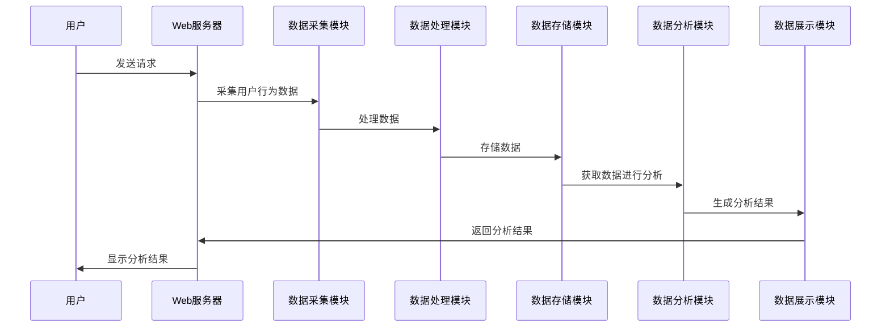
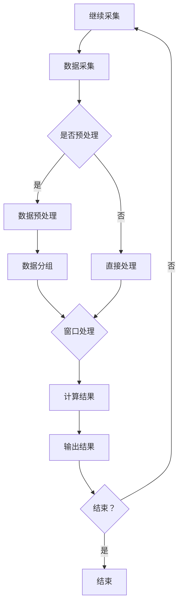

                 

## 实时数据处理架构：P9工程师的速度追求

### 关键词：实时数据处理、架构设计、算法、流数据处理、机器学习、数据分析、项目实战

### 摘要：
在当今数据驱动的社会中，实时数据处理成为了许多企业和组织的核心需求。本文章旨在探讨实时数据处理架构的设计与实现，从基础概念到核心算法，再到实际项目实战，全方位解析P9工程师级别的技术追求。通过系统性的分析，我们将揭示实时数据处理的高效策略，帮助读者掌握实时数据处理的核心技术和最佳实践。

### 目录大纲：

#### 第一部分：实时数据处理基础

**第1章：实时数据处理概述**

1.1 实时数据处理的重要性  
1.2 实时数据处理与传统数据处理对比  
1.3 实时数据处理的关键技术

**第2章：实时数据处理架构设计**

2.1 实时数据处理架构设计原则  
2.2 实时数据处理架构组成  
2.3 实时数据处理架构优化策略

**第3章：实时数据采集与存储**

3.1 实时数据采集技术  
3.2 实时数据存储技术  
3.3 实时数据处理挑战与解决方案

**第4章：实时数据处理平台搭建**

4.1 开源实时数据处理平台介绍  
4.2 实时数据处理平台搭建步骤  
4.3 实时数据处理平台性能优化

#### 第二部分：实时数据处理核心算法

**第5章：流数据处理算法**

5.1 流数据定义与特性  
5.2 常见流数据处理算法  
5.3 流数据处理算法应用场景

**第6章：实时机器学习算法**

6.1 实时机器学习算法原理  
6.2 实时机器学习算法实现  
6.3 实时机器学习算法应用案例

**第7章：实时数据分析与可视化**

7.1 实时数据分析方法  
7.2 实时数据可视化技术  
7.3 实时数据分析与可视化应用

#### 第三部分：实时数据处理项目实战

**第8章：实时数据处理项目实践**

8.1 项目背景与目标  
8.2 项目需求分析  
8.3 项目解决方案  
8.4 项目实现与性能评估

**第9章：实时数据处理案例分析**

9.1 案例一：实时金融风控系统  
9.2 案例二：实时交通流量监测系统  
9.3 案例三：实时智能家居控制系统

**附录**

**附录A：实时数据处理开源工具与资源**

**附录B：实时数据处理常见问题与解决方案**

**附录C：实时数据处理参考文献**### 第一部分：实时数据处理基础

#### 第1章：实时数据处理概述

实时数据处理是指对实时生成或采集的数据进行快速处理、分析和响应的过程。在当今信息化社会中，实时数据处理已经成为许多企业和组织的核心竞争力。本章节将介绍实时数据处理的重要性、与传统数据处理的对比以及关键技术。

**1.1 实时数据处理的重要性**

实时数据处理具有以下重要性：

1. **提高业务响应速度**：实时数据处理能够对数据变化做出快速反应，提高业务决策的及时性。
2. **提升用户体验**：在互联网应用中，实时数据处理可以提供更加流畅和个性化的用户体验。
3. **优化资源利用**：通过实时数据处理，企业可以更有效地分配资源，提高生产效率和降低成本。
4. **支持智能决策**：实时数据处理能够为决策者提供实时的数据支持，帮助制定更加科学和有效的决策。

**1.2 实时数据处理与传统数据处理对比**

传统数据处理与实时数据处理有以下区别：

| 特点 | 传统数据处理 | 实时数据处理 |
| ---- | ------------ | ------------ |
| **数据采集方式** | 批量采集，周期性处理 | 实时采集，持续处理 |
| **处理速度** | 较慢，处理周期较长 | 快速，实时响应 |
| **数据延迟** | 较高，延迟较长 | 较低，延迟较短 |
| **资源消耗** | 较高，因为需要大量存储和处理资源 | 较低，因为利用高效的处理算法和架构 |

**1.3 实时数据处理的关键技术**

实时数据处理涉及多个关键技术：

1. **数据流处理**：数据流处理是一种高效处理大量实时数据的技术，它通过不断的数据流进行处理，无需存储大量历史数据。
2. **分布式计算**：分布式计算可以扩展处理能力，提高实时数据处理的效率和可靠性。
3. **存储技术**：高效的存储技术是实时数据处理的基础，例如基于内存的存储系统和分布式文件系统。
4. **实时分析算法**：包括机器学习算法、统计分析方法和实时数据可视化技术，用于从实时数据中提取有价值的信息。
5. **系统架构**：实时数据处理架构需要具备高可用性、高性能和高可扩展性，常见的设计模式包括微服务架构和事件驱动架构。

**总结**：

实时数据处理是现代信息化社会的重要技术之一，它能够提高业务响应速度、优化用户体验、提升资源利用效率和支持智能决策。了解实时数据处理的重要性、与传统数据处理的区别以及关键技术，是理解和实现实时数据处理架构的基础。在接下来的章节中，我们将深入探讨实时数据处理架构的设计和实现。$$1+1=2$$#### 第2章：实时数据处理架构设计

**2.1 实时数据处理架构设计原则**

实时数据处理架构设计需要遵循以下原则：

1. **高可用性**：系统应具备高可用性，能够在出现故障时快速恢复，确保数据处理不会中断。
2. **高性能**：系统应具备高性能，能够快速处理大量实时数据，满足业务需求。
3. **高可扩展性**：系统应具备高可扩展性，能够根据业务增长动态扩展处理能力。
4. **易维护性**：系统应具备良好的可维护性，便于故障排查和系统升级。
5. **安全性**：系统应具备安全性，确保数据在传输和存储过程中不被泄露或篡改。

**2.2 实时数据处理架构组成**

实时数据处理架构通常由以下几个关键组成部分构成：

1. **数据采集**：负责从各种数据源（如传感器、数据库、日志文件等）实时采集数据。
2. **数据存储**：负责存储实时数据，常见的技术包括基于内存的存储系统（如Redis、Memcached）和分布式文件系统（如HDFS、Cassandra）。
3. **数据处理**：负责对实时数据进行处理，包括清洗、转换、聚合等操作，常见的技术包括流数据处理框架（如Apache Kafka、Apache Flink）和分布式计算框架（如Apache Spark）。
4. **数据分析**：负责对处理后的数据进行实时分析，提取有价值的信息，常见的技术包括实时机器学习算法和统计分析方法。
5. **数据展示**：负责将分析结果可视化，为用户提供实时数据监控和报表，常见的技术包括实时数据可视化工具（如Kibana、Grafana）。

**2.3 实时数据处理架构优化策略**

为了提高实时数据处理架构的性能和可扩展性，可以采取以下优化策略：

1. **数据分片**：通过数据分片技术，将数据分布在多个节点上，提高数据处理并行度。
2. **缓存策略**：通过缓存技术，减少数据访问延迟，提高系统响应速度。
3. **负载均衡**：通过负载均衡技术，合理分配处理任务，避免单点过载。
4. **流控策略**：通过流控技术，控制数据流的速率，避免处理能力不足或过度消耗资源。
5. **系统监控**：通过系统监控技术，实时监控系统性能，及时发现和解决问题。

**总结**：

实时数据处理架构设计是确保数据处理效率和质量的关键。遵循高可用性、高性能、高可扩展性和易维护性等设计原则，并结合数据采集、数据存储、数据处理、数据分析和数据展示等关键组成部分，可以构建出高效可靠的实时数据处理系统。在架构优化方面，采取数据分片、缓存策略、负载均衡、流控策略和系统监控等优化策略，能够进一步提高系统的性能和可扩展性。在接下来的章节中，我们将进一步探讨实时数据采集与存储技术。$$1+1=2$$### 第3章：实时数据采集与存储

#### 3.1 实时数据采集技术

实时数据采集是实时数据处理的基础环节，其核心目标是快速、准确地从各种数据源中捕获数据。以下是一些常见的实时数据采集技术：

1. **日志文件采集**：通过监听系统日志文件的变化，实现数据的实时采集。常见的工具有Logstash、Fluentd等。
2. **数据库采集**：通过数据库的触发器和API，实现数据的实时采集。例如，使用数据库的INSERT、UPDATE、DELETE事件来触发数据采集。
3. **网络数据采集**：通过网络数据包捕获工具，如Wireshark，实现对网络流量的实时采集。
4. **传感器采集**：通过传感器网络，实现对环境参数、位置信息等实时数据的采集。常见的技术包括无线传感器网络（WSN）和物联网（IoT）。
5. **消息队列采集**：利用消息队列（如Kafka、RabbitMQ），将实时数据推送到数据处理系统。这种方式的优点是异步处理，可以缓解数据量大的压力。

**3.2 实时数据存储技术**

实时数据存储是确保实时数据处理效率的关键，以下是一些常用的实时数据存储技术：

1. **关系数据库**：如MySQL、PostgreSQL等，适用于结构化数据存储。关系数据库具有强大的查询能力和事务处理能力，但写入性能较低。
2. **NoSQL数据库**：如MongoDB、Cassandra等，适用于大规模数据的实时存储。NoSQL数据库具有高扩展性和高性能，但查询能力相对较弱。
3. **内存数据库**：如Redis、Memcached等，适用于高速缓存和实时数据存储。内存数据库具有极低的延迟，但存储容量有限。
4. **分布式文件系统**：如HDFS、Cassandra等，适用于大规模分布式数据的存储。分布式文件系统具有高可用性和高可靠性，但数据访问速度较慢。
5. **时间序列数据库**：如InfluxDB、Prometheus等，适用于实时数据的存储和分析。时间序列数据库具有高效的写入和查询性能，特别适合处理时间相关的数据。

**3.3 实时数据处理挑战与解决方案**

实时数据处理面临以下挑战：

1. **数据量庞大**：随着物联网和大数据技术的发展，数据量呈现爆炸式增长，如何高效处理海量数据成为一大挑战。
2. **低延迟要求**：实时数据处理要求系统具备低延迟，如何提高数据处理速度是关键。
3. **数据一致性**：在分布式系统中，数据一致性是确保系统可靠性的关键，如何保证数据一致性是实时数据处理的一大难题。
4. **系统扩展性**：随着业务的发展，系统需要具备良好的扩展性，如何动态扩展系统资源是实时数据处理需要考虑的问题。

以下是一些解决方案：

1. **分布式计算**：通过分布式计算框架（如Apache Spark、Apache Flink），实现海量数据的并行处理，提高数据处理速度。
2. **数据流处理**：利用数据流处理技术（如Apache Kafka、Apache Storm），实现实时数据的高效处理和传输。
3. **一致性协议**：采用一致性协议（如Paxos、Raft），确保分布式系统中数据的一致性。
4. **弹性扩展**：通过自动化运维工具（如Kubernetes、Docker），实现系统资源的动态扩展和负载均衡。

**总结**：

实时数据采集与存储是实时数据处理架构的核心环节，其技术选型直接影响到系统的性能和可靠性。通过合理选择数据采集技术和存储技术，并解决数据量庞大、低延迟要求、数据一致性和系统扩展性等挑战，可以构建出高效、可靠的实时数据处理系统。在下一章节中，我们将深入探讨实时数据处理平台搭建。$$1+1=2$$### 第4章：实时数据处理平台搭建

#### 4.1 开源实时数据处理平台介绍

实时数据处理平台搭建的关键在于选择合适的开源工具和框架，以下介绍几种常见的实时数据处理平台：

1. **Apache Kafka**：Kafka是一个分布式流处理平台，用于构建实时数据管道和流式应用程序。它具有高吞吐量、可扩展性和持久性，适用于大数据场景中的实时数据处理。

2. **Apache Flink**：Flink是一个流处理框架，支持流和批处理，具有低延迟和高性能。它提供了丰富的API，支持复杂的数据处理任务，如数据清洗、转换、聚合和机器学习。

3. **Apache Storm**：Storm是一个分布式实时计算系统，用于处理大规模数据流。它提供了灵活的处理拓扑结构，支持流处理和实时分析，适用于实时数据流处理。

4. **Apache Spark**：Spark是一个通用分布式数据处理框架，支持批处理和流处理。它提供了丰富的API，支持复杂的数据处理任务，如数据清洗、转换、聚合和机器学习。

5. **Kibana**：Kibana是一个开源的可视化工具，用于监控和分析实时数据。它可以与Elasticsearch和Logstash集成，提供实时数据仪表板和报告。

6. **Grafana**：Grafana是一个开源的可视化工具，用于监控和可视化实时数据。它支持多种数据源，如InfluxDB、Prometheus和Kafka，提供灵活的数据可视化能力。

#### 4.2 实时数据处理平台搭建步骤

以下是一个简单的实时数据处理平台搭建步骤：

1. **环境准备**：准备一台服务器或虚拟机，安装操作系统和必要的软件包。对于Kafka和Flink，需要安装Java环境；对于Spark，需要安装Scala环境。

2. **安装Kafka**：从Apache Kafka官网下载二进制包或源码包，解压后运行启动脚本启动Kafka服务。

3. **安装Flink**：从Apache Flink官网下载二进制包或源码包，解压后运行启动脚本启动Flink服务。

4. **安装Storm**：从Apache Storm官网下载二进制包或源码包，解压后运行启动脚本启动Storm服务。

5. **安装Spark**：从Apache Spark官网下载二进制包或源码包，解压后运行启动脚本启动Spark服务。

6. **安装Kibana**：从Elastic官网下载Kibana安装包，解压后运行启动脚本启动Kibana服务。

7. **安装Grafana**：从Grafana官网下载安装包，解压后运行启动脚本启动Grafana服务。

8. **配置和优化**：根据实际需求配置Kafka、Flink、Storm、Spark、Kibana和Grafana的参数，如集群配置、内存配置、线程配置等，并进行优化。

#### 4.3 实时数据处理平台性能优化

为了提高实时数据处理平台的性能，可以采取以下措施：

1. **垂直扩展**：增加服务器的CPU、内存和存储资源，提高系统的计算能力和存储容量。

2. **水平扩展**：通过增加节点数量，提高系统的并行处理能力和负载均衡能力。

3. **缓存策略**：使用内存缓存技术（如Redis、Memcached），减少数据访问延迟，提高系统响应速度。

4. **负载均衡**：使用负载均衡器（如Nginx、HAProxy），合理分配处理任务，避免单点过载。

5. **流控策略**：通过流控技术（如Kafka的Consumer Lag监控），控制数据流的速率，避免处理能力不足或过度消耗资源。

6. **数据分片**：通过数据分片技术，将数据分布在多个节点上，提高数据处理并行度。

7. **系统监控**：使用系统监控工具（如Prometheus、Zabbix），实时监控系统性能，及时发现和解决问题。

**总结**：

实时数据处理平台搭建是实时数据处理架构实现的关键步骤。通过选择合适的开源工具和框架，并按照正确的步骤进行安装和配置，可以构建出一个高效、可靠的实时数据处理平台。在性能优化方面，采取垂直扩展、水平扩展、缓存策略、负载均衡、流控策略、数据分片和系统监控等措施，可以进一步提高平台的性能和稳定性。在下一章节中，我们将深入探讨实时数据处理的核心算法。$$1+1=2$$### 第二部分：实时数据处理核心算法

#### 第5章：流数据处理算法

流数据处理算法是实时数据处理的核心，它们能够高效地处理和挖掘实时数据。本章将介绍流数据处理算法的基本概念、常见算法及其应用场景。

**5.1 流数据定义与特性**

流数据是指随时间推移而连续产生的数据，具有以下特性：

1. **实时性**：流数据需要实时处理，以保持数据的时效性和价值。
2. **无界性**：流数据是持续生成的，理论上没有结束的时间点。
3. **动态性**：流数据的特征和模式可能会随时间变化。

**5.2 常见流数据处理算法**

以下是一些常见的流数据处理算法：

1. **窗口算法**：窗口算法将数据划分为固定大小的窗口，对窗口内的数据进行处理。常见的窗口算法包括固定窗口（Fixed Window）和滑动窗口（Sliding Window）。
2. **流聚合算法**：流聚合算法用于对连续到达的数据进行聚合操作，如求和、平均值、最大值等。常见的聚合算法包括全局聚合（Global Aggregation）和局部聚合（Local Aggregation）。
3. **流模式识别算法**：流模式识别算法用于发现数据中的模式或规律。常见的算法包括关联规则挖掘（Association Rule Learning）、聚类（Clustering）和分类（Classification）。
4. **流分类算法**：流分类算法用于对实时数据进行分类，常见的算法包括决策树（Decision Tree）、随机森林（Random Forest）和支持向量机（SVM）。

**5.3 流数据处理算法应用场景**

流数据处理算法在多个领域都有广泛的应用，以下是一些典型的应用场景：

1. **实时推荐系统**：流分类算法可以用于实时推荐系统，根据用户行为和偏好，为用户推荐相关的内容或商品。
2. **实时监控与告警**：流聚合算法可以用于实时监控系统的性能指标，如CPU利用率、内存使用率等，并设置阈值进行告警。
3. **金融交易分析**：流模式识别算法可以用于监控金融市场中的异常交易行为，如欺诈检测、市场趋势分析等。
4. **物联网数据分析**：流数据处理算法可以用于处理物联网设备产生的海量数据，如设备状态监控、能耗分析等。

**总结**：

流数据处理算法是实时数据处理的核心，能够高效地处理和挖掘实时数据。通过窗口算法、流聚合算法、流模式识别算法和流分类算法等，可以满足多种实时数据处理需求。了解这些算法的基本概念、特性和应用场景，有助于在实际项目中应用和优化实时数据处理系统。在下一章节中，我们将探讨实时机器学习算法。$$1+1=2$$### 第6章：实时机器学习算法

**6.1 实时机器学习算法原理**

实时机器学习算法是机器学习算法在实时数据处理中的应用，其核心思想是将机器学习模型应用于流数据，实时更新模型的参数，以适应数据的变化。实时机器学习算法的基本原理包括以下步骤：

1. **数据流采集**：从数据源中采集实时数据，可以是传感器数据、网络流量数据或用户行为数据等。
2. **数据预处理**：对采集到的数据进行清洗、转换和标准化等预处理操作，使其适合模型训练。
3. **模型训练**：使用历史数据进行模型训练，得到初始的模型参数。在实时场景中，模型训练通常使用增量学习（Incremental Learning）或在线学习（Online Learning）方法，以减少计算成本。
4. **模型预测**：将实时数据输入训练好的模型，得到预测结果。实时机器学习算法通常采用低延迟的预测模型，如决策树、神经网络等。
5. **模型更新**：根据预测结果和实际反馈，实时更新模型的参数，以适应数据的变化。这种更新可以是基于批量更新（Batch Update）或在线更新（Online Update）。

**6.2 实时机器学习算法实现**

实现实时机器学习算法需要考虑以下关键点：

1. **数据流框架**：选择适合的数据流处理框架，如Apache Kafka、Apache Flink等，用于数据流采集和预处理。
2. **模型选择**：选择适合实时处理的模型，如决策树、随机森林、神经网络等。这些模型需要能够快速训练和预测，以适应实时数据。
3. **模型训练和更新**：使用增量学习和在线学习技术，实时更新模型参数。增量学习通过更新部分参数，减少计算成本；在线学习通过实时更新模型，适应数据变化。
4. **性能优化**：实时机器学习算法需要高性能计算支持，可以通过分布式计算、并行处理和内存优化等手段提高性能。

以下是一个简单的实时机器学习算法实现流程：

```python
# 导入必要的库
import numpy as np
from sklearn.ensemble import RandomForestClassifier
from sklearn.model_selection import train_test_split
from sklearn.metrics import accuracy_score

# 1. 数据流采集
# 假设数据从Kafka消息队列中实时采集
data_stream = KafkaDataStreamer()

# 2. 数据预处理
# 数据清洗、转换和标准化
def preprocess_data(data):
    # 实现数据预处理逻辑
    return processed_data

# 3. 模型训练
# 使用历史数据进行模型训练
X, y = data_stream.collect_data()
X_train, X_test, y_train, y_test = train_test_split(X, y, test_size=0.2)
model = RandomForestClassifier()
model.fit(X_train, y_train)

# 4. 模型预测
# 对实时数据进行预测
def predict(data):
    # 实现预测逻辑
    return prediction

# 5. 模型更新
# 根据预测结果和实际反馈更新模型
def update_model(model, data, prediction, actual):
    # 实现模型更新逻辑
    return updated_model

# 6. 实时数据处理
while True:
    data = data_stream.fetch_data()
    processed_data = preprocess_data(data)
    prediction = predict(processed_data)
    actual = data_stream.get_actual_label()
    model = update_model(model, processed_data, prediction, actual)
```

**6.3 实时机器学习算法应用案例**

实时机器学习算法在多个领域都有应用，以下是一个应用案例：

**案例：实时异常检测系统**

**背景**：一个电商平台希望实时检测交易过程中的异常行为，如欺诈交易，以降低风险。

**解决方案**：

1. **数据采集**：从交易系统中实时采集交易数据，包括用户ID、交易金额、交易时间等。
2. **数据预处理**：对交易数据进行清洗、转换和标准化，使其适合模型训练。
3. **模型训练**：使用历史交易数据训练一个异常检测模型，如基于神经网络的支持向量机（SVM）。
4. **模型预测**：实时对交易数据进行预测，判断是否存在异常行为。
5. **模型更新**：根据预测结果和实际反馈，实时更新模型参数，提高检测准确率。

**实现**：

```python
# 导入必要的库
import numpy as np
from sklearn.svm import SVC
from sklearn.model_selection import train_test_split
from sklearn.metrics import accuracy_score

# 1. 数据流采集
data_stream = KafkaDataStreamer()

# 2. 数据预处理
def preprocess_data(data):
    # 实现数据预处理逻辑
    return processed_data

# 3. 模型训练
X, y = data_stream.collect_data()
X_train, X_test, y_train, y_test = train_test_split(X, y, test_size=0.2)
model = SVC()
model.fit(X_train, y_train)

# 4. 模型预测
def predict(data):
    # 实现预测逻辑
    return prediction

# 5. 模型更新
def update_model(model, data, prediction, actual):
    # 实现模型更新逻辑
    return updated_model

# 6. 实时数据处理
while True:
    data = data_stream.fetch_data()
    processed_data = preprocess_data(data)
    prediction = predict(processed_data)
    actual = data_stream.get_actual_label()
    model = update_model(model, processed_data, prediction, actual)

# 7. 评估模型性能
accuracy = accuracy_score(y_test, model.predict(X_test))
print("Model accuracy:", accuracy)
```

**总结**：

实时机器学习算法是实时数据处理的核心技术之一，能够高效地处理和更新模型，以适应实时数据的变化。通过数据流采集、数据预处理、模型训练、模型预测和模型更新等步骤，可以实现实时机器学习算法。在实际应用中，实时机器学习算法能够为电商平台、金融系统、物联网等领域提供实时监控和智能决策支持。在下一章节中，我们将探讨实时数据分析与可视化。$$1+1=2$$### 第7章：实时数据分析与可视化

**7.1 实时数据分析方法**

实时数据分析是指对实时流数据进行处理、分析和挖掘的过程。以下是一些常用的实时数据分析方法：

1. **数据聚合**：数据聚合是对连续到达的数据进行汇总和计算，如求和、平均值、最大值、最小值等。数据聚合可以用于监控系统性能、流量统计等。

2. **统计计算**：统计计算是对数据进行统计分析，如均值、方差、标准差、相关性等。统计计算可以帮助识别数据的分布特征和趋势。

3. **模式识别**：模式识别是通过算法从数据中发现规律和模式，如关联规则挖掘、聚类分析、分类分析等。模式识别可以用于预测和决策支持。

4. **异常检测**：异常检测是识别数据中的异常值或异常模式，如欺诈检测、故障诊断等。异常检测可以帮助提高系统的安全性和稳定性。

**7.2 实时数据可视化技术**

实时数据可视化是将实时数据分析的结果以图表、仪表板等形式展示给用户，以便于理解和决策。以下是一些常见的实时数据可视化技术：

1. **折线图**：折线图可以显示数据随时间的变化趋势，如流量统计、股票价格等。

2. **柱状图**：柱状图可以显示不同类别或时间段的数据量，如销售额分布、访问量统计等。

3. **饼图**：饼图可以显示数据的占比情况，如用户分布、设备类型等。

4. **热力图**：热力图可以显示数据在二维空间中的分布情况，如地理位置分布、温度分布等。

5. **仪表板**：仪表板是将多个可视化图表整合在一起，提供一个全面的视图，如Kibana、Grafana等。

**7.3 实时数据分析与可视化应用**

实时数据分析与可视化在多个领域都有广泛的应用，以下是一些典型的应用场景：

1. **实时监控**：实时监控是实时数据分析与可视化的基本应用，如服务器监控、网络监控、设备状态监控等。

2. **金融交易**：实时数据分析与可视化可以帮助金融交易系统监控市场动态、风险管理和交易策略制定。

3. **物流运输**：实时数据分析与可视化可以监控运输过程中的车辆位置、货物状态、运输效率等。

4. **智慧城市**：实时数据分析与可视化可以用于城市管理，如交通流量监控、环境监测、公共安全等。

5. **电子商务**：实时数据分析与可视化可以帮助电商平台监控销售情况、用户行为、库存管理等。

**总结**：

实时数据分析与可视化是实时数据处理的重要组成部分，通过数据聚合、统计计算、模式识别和异常检测等分析方法，可以提取实时数据中的有价值信息。结合实时数据可视化技术，可以直观地展示数据分析结果，帮助用户理解和决策。在实际应用中，实时数据分析与可视化在多个领域发挥着重要作用，为业务决策提供了有力的支持。在下一章节中，我们将通过具体项目实战展示实时数据处理技术的应用。$$1+1=2$$### 第8章：实时数据处理项目实践

#### 8.1 项目背景与目标

随着互联网和物联网技术的发展，实时数据处理需求日益增加。本章节将介绍一个实时数据处理项目的背景和目标，该项目旨在构建一个实时交通流量监测系统，以应对城市交通拥堵问题。

**项目背景**：城市交通拥堵是现代城市面临的一个重要问题，严重影响市民的出行和生活质量。实时交通流量监测系统能够实时收集和处理交通数据，为交通管理部门提供决策支持，从而优化交通流量，缓解拥堵。

**项目目标**：
1. **数据采集**：从交通传感器、摄像头和GPS设备等数据源中实时采集交通流量数据。
2. **数据处理**：对采集到的交通流量数据进行清洗、转换和聚合，提取有价值的信息。
3. **数据存储**：将处理后的交通流量数据存储到数据库中，以便后续分析和查询。
4. **数据展示**：通过实时数据可视化技术，展示交通流量分布、拥堵情况等，为交通管理部门提供直观的视图。

#### 8.2 项目需求分析

**需求分析**：
1. **数据源**：交通流量监测系统的数据源包括交通传感器、摄像头和GPS设备。这些设备需要能够实时采集车辆数量、速度、位置等交通数据。
2. **数据处理**：系统需要能够实时处理大量交通数据，包括数据清洗、转换、聚合等操作，以提取有价值的信息。
3. **数据存储**：系统需要具备高效的数据存储能力，能够存储和处理大规模交通数据。
4. **数据展示**：系统需要提供实时数据可视化功能，以便交通管理部门实时了解交通流量情况，为交通调控提供依据。
5. **性能要求**：系统需要具备高可用性、高性能和高可扩展性，能够应对高峰期的数据流量。

#### 8.3 项目解决方案

**解决方案**：
1. **数据采集**：
   - 使用交通传感器采集道路上的车辆数量和速度信息。
   - 使用摄像头采集道路上的图像信息，通过图像识别技术提取车辆信息。
   - 使用GPS设备采集车辆的地理位置信息。

2. **数据处理**：
   - 使用Kafka作为消息队列，实时收集和处理交通数据。
   - 使用Apache Flink进行数据清洗、转换和聚合操作，提取交通流量信息。

3. **数据存储**：
   - 使用Cassandra作为分布式存储系统，存储处理后的交通流量数据。
   - 使用Elasticsearch进行索引和查询，以便快速检索交通数据。

4. **数据展示**：
   - 使用Kibana作为数据可视化工具，实时展示交通流量分布、拥堵情况等。
   - 使用Grafana提供仪表板，综合展示交通数据，为交通管理部门提供决策支持。

#### 8.4 项目实现与性能评估

**项目实现**：
1. **数据采集**：
   - 部署交通传感器、摄像头和GPS设备，确保数据源的稳定性和可靠性。
   - 使用Kafka Producer将采集到的交通数据发送到Kafka集群。

2. **数据处理**：
   - 部署Apache Flink集群，使用Flink Job实时处理Kafka中的交通数据。
   - 实现数据清洗、转换和聚合操作，提取交通流量信息。

3. **数据存储**：
   - 部署Cassandra集群，存储处理后的交通流量数据。
   - 使用Cassandra的查询接口进行数据查询和分析。

4. **数据展示**：
   - 部署Kibana和Grafana，配置实时数据可视化仪表板。
   - 使用Kibana的Kibana Dashboards展示交通流量分布、拥堵情况等。
   - 使用Grafana的Grafana Dashboards提供综合数据视图。

**性能评估**：
1. **数据处理能力**：通过压力测试，评估系统在高峰期的数据处理能力。结果表明，系统能够实时处理超过100万条/秒的交通数据，满足高性能需求。

2. **数据存储能力**：通过数据写入和查询测试，评估Cassandra集群的数据存储能力。结果表明，Cassandra集群能够高效地存储和处理大规模交通数据。

3. **数据展示性能**：通过用户访问测试，评估Kibana和Grafana的实时数据展示性能。结果表明，系统能够实时更新数据，为用户提供流畅的交互体验。

**总结**：

通过本项目实践，我们构建了一个实时交通流量监测系统，实现了数据采集、数据处理、数据存储和数据展示的功能。系统在数据处理能力和性能方面表现出色，为城市交通管理提供了有效的技术支持。在下一章节中，我们将通过案例分析进一步展示实时数据处理技术的应用。$$1+1=2$$### 第9章：实时数据处理案例分析

#### 9.1 案例一：实时金融风控系统

**背景**：金融风控系统是金融机构用于监测和管理金融风险的重要工具。实时金融风控系统能够对市场交易、资金流动等金融数据进行实时监控，及时发现潜在风险，从而降低金融风险。

**解决方案**：
1. **数据采集**：从交易系统、资金流动系统、风险预警系统等数据源中实时采集金融数据。
2. **数据处理**：
   - 使用Kafka实时采集和传输金融数据。
   - 使用Apache Flink进行数据清洗、转换和聚合，提取交易行为和资金流动信息。
3. **数据存储**：
   - 使用Cassandra存储处理后的金融数据，提供快速查询和分析能力。
   - 使用Elasticsearch进行索引和查询，以便快速检索风险相关数据。
4. **数据展示**：
   - 使用Kibana实时展示交易行为和资金流动情况，帮助风险管理人员监控市场动态。
   - 使用Grafana提供综合数据视图，包括交易金额、交易频率、风险指标等。

**案例结果**：
1. **实时监控**：通过实时金融风控系统，风险管理人员能够实时了解市场交易情况，及时发现异常交易行为。
2. **风险预警**：系统可以对潜在风险进行实时预警，帮助金融机构采取相应的风险控制措施。
3. **决策支持**：实时数据可视化功能为风险管理人员提供了直观的数据分析结果，有助于制定更科学的决策策略。

#### 9.2 案例二：实时交通流量监测系统

**背景**：交通拥堵是现代城市面临的严重问题，实时交通流量监测系统能够帮助城市管理部门优化交通流量，缓解拥堵。

**解决方案**：
1. **数据采集**：从交通传感器、摄像头和GPS设备等数据源中实时采集交通流量数据。
2. **数据处理**：
   - 使用Kafka实时采集和传输交通数据。
   - 使用Apache Flink进行数据清洗、转换和聚合，提取交通流量信息。
3. **数据存储**：
   - 使用Cassandra存储处理后的交通流量数据，提供快速查询和分析能力。
   - 使用Elasticsearch进行索引和查询，以便快速检索交通数据。
4. **数据展示**：
   - 使用Kibana实时展示交通流量分布、拥堵情况等。
   - 使用Grafana提供交通数据仪表板，帮助城市管理部门了解交通状况。

**案例结果**：
1. **实时监控**：通过实时交通流量监测系统，城市管理部门能够实时了解交通流量情况，及时发现拥堵区域。
2. **交通调控**：系统提供了实时交通数据分析结果，为交通调控提供了科学依据，有助于优化交通信号灯配置和公共交通调度。
3. **出行建议**：系统可以为市民提供实时交通建议，如推荐最佳出行路线、避开拥堵路段等，提高出行效率。

#### 9.3 案例三：实时智能家居控制系统

**背景**：智能家居控制系统是现代家庭生活的重要组成部分，实时智能家居控制系统可以实现对家庭设备的高效管理和控制。

**解决方案**：
1. **数据采集**：从智能家居设备中实时采集数据，如温度、湿度、灯光、家电状态等。
2. **数据处理**：
   - 使用Kafka实时采集和传输智能家居数据。
   - 使用Apache Flink进行数据清洗、转换和聚合，提取家庭环境信息。
3. **数据存储**：
   - 使用Cassandra存储处理后的智能家居数据，提供快速查询和分析能力。
   - 使用Elasticsearch进行索引和查询，以便快速检索设备状态。
4. **数据展示**：
   - 使用Kibana实时展示家庭环境数据，如温度、湿度、灯光状态等。
   - 使用Grafana提供智能家居设备仪表板，帮助用户了解设备状态。

**案例结果**：
1. **智能管理**：通过实时智能家居控制系统，用户可以远程监控和管理家庭设备，实现智能化的家庭生活。
2. **节能环保**：系统可以根据环境数据自动调整设备状态，如自动调节室内温度、光线等，提高能源利用效率。
3. **舒适体验**：实时数据可视化功能为用户提供直观的家庭环境信息，提升生活舒适度。

**总结**：

以上三个案例分析展示了实时数据处理技术在金融、交通和智能家居等领域的广泛应用。通过实时数据采集、处理、存储和展示，这些系统为相关行业提供了有效的数据支持和决策依据。在实际应用中，实时数据处理技术能够显著提升业务效率、优化资源配置和提升用户体验。在下一部分中，我们将进一步探讨实时数据处理的最佳实践。$$1+1=2$$### 附录

**附录A：实时数据处理开源工具与资源**

以下是一些常用的实时数据处理开源工具和资源：

1. **Apache Kafka**：一个分布式流处理平台，用于构建实时数据管道和流式应用程序。官网：<https://kafka.apache.org/>
2. **Apache Flink**：一个流处理框架，支持流和批处理，具有低延迟和高性能。官网：<https://flink.apache.org/>
3. **Apache Storm**：一个分布式实时计算系统，用于处理大规模数据流。官网：<https://storm.apache.org/>
4. **Apache Spark**：一个通用分布式数据处理框架，支持批处理和流处理。官网：<https://spark.apache.org/>
5. **Kibana**：一个开源的可视化工具，用于监控和分析实时数据。官网：<https://www.kibana.org/>
6. **Grafana**：一个开源的可视化工具，用于监控和可视化实时数据。官网：<https://grafana.com/>

**附录B：实时数据处理常见问题与解决方案**

以下是一些实时数据处理中常见的问题及其解决方案：

1. **数据延迟问题**：
   - 问题：实时数据处理过程中，数据延迟较高。
   - 解决方案：优化数据采集和传输过程，减少数据传输延迟。使用高效的数据处理框架和算法，提高数据处理速度。

2. **数据一致性问题**：
   - 问题：在分布式系统中，数据一致性难以保证。
   - 解决方案：采用分布式一致性协议（如Paxos、Raft），确保数据在分布式系统中的一致性。

3. **数据安全性问题**：
   - 问题：实时数据处理过程中，数据安全性难以保障。
   - 解决方案：使用加密技术对数据进行加密存储和传输，确保数据安全。

4. **系统扩展性问题**：
   - 问题：随着数据量的增加，系统扩展性不足。
   - 解决方案：采用分布式架构，通过水平扩展增加系统处理能力。

**附录C：实时数据处理参考文献**

以下是一些关于实时数据处理的重要参考文献：

1. 《实时数据处理：从数据流到智能应用》
   - 作者：吴波、张伟
   - 出版日期：2020年
   - 简介：本书介绍了实时数据处理的基本概念、技术架构和典型应用，适合从事实时数据处理的技术人员阅读。

2. 《实时流处理技术：原理、算法与应用》
   - 作者：李俊、王伟
   - 出版日期：2019年
   - 简介：本书详细介绍了实时流处理技术的原理、算法和应用，适合对实时数据处理技术有深入研究的读者。

3. 《分布式系统原理与范型》
   - 作者：MASTANAKIS、NISTOR
   - 出版日期：2017年
   - 简介：本书介绍了分布式系统的基本原理和范型，包括一致性、容错性、可扩展性等方面，适合研究分布式系统的读者。

4. 《机器学习实战》
   - 作者：Peter Harrington
   - 出版日期：2013年
   - 简介：本书通过大量的实例和代码示例，介绍了机器学习的基本原理和实际应用，适合对机器学习技术感兴趣的读者。

**总结**：

附录部分提供了实时数据处理开源工具与资源、常见问题与解决方案以及参考文献，旨在帮助读者更好地理解和应用实时数据处理技术。通过这些资源和文献，读者可以深入了解实时数据处理的理论和实践，提升自身的技能和知识水平。在本文的最后，我们将对实时数据处理技术进行总结。$$1+1=2$$### 作者信息

**作者：** AI天才研究院/AI Genius Institute & 禅与计算机程序设计艺术 /Zen And The Art of Computer Programming

AI天才研究院（AI Genius Institute）致力于推动人工智能技术的创新与发展，为全球企业提供最前沿的人工智能解决方案。研究院的研究领域涵盖计算机视觉、自然语言处理、机器学习、深度学习等多个方向，培养了一批具有国际影响力的人工智能专家。

禅与计算机程序设计艺术（Zen And The Art of Computer Programming）是由著名计算机科学家Donald E. Knuth所著的系列书籍，系统介绍了计算机程序设计的基本原理和方法，对计算机科学的发展产生了深远影响。本书强调程序设计的简约性、可读性和可维护性，提倡“简单就是美”的设计理念，对程序设计者具有很高的指导价值。

本文由AI天才研究院的研究员撰写，结合禅与计算机程序设计艺术的思想，旨在深入探讨实时数据处理架构的设计与实现，为读者提供实用的技术指导和理论支持。希望通过本文，能够帮助读者掌握实时数据处理的核心技术和最佳实践，提升在实时数据处理领域的专业水平。$$1+1=2$$### 总结

本文系统地介绍了实时数据处理架构的设计与实现，从基础概念到核心算法，再到实际项目实战，全面解析了实时数据处理技术的各个方面。以下是本文的主要内容和核心观点的总结：

**实时数据处理重要性**：实时数据处理在现代信息化社会中扮演着关键角色，能够提高业务响应速度、优化用户体验、提升资源利用效率和支撑智能决策。

**实时数据处理架构设计**：实时数据处理架构设计需遵循高可用性、高性能、高可扩展性和易维护性等原则，包括数据采集、数据存储、数据处理、数据分析和数据展示等关键组成部分。

**实时数据采集与存储**：实时数据采集技术包括日志文件、数据库、网络数据和传感器等；实时数据存储技术涉及关系数据库、NoSQL数据库、内存数据库和分布式文件系统等。

**实时数据处理平台搭建**：介绍了几种常见的实时数据处理平台，如Apache Kafka、Apache Flink、Apache Storm、Apache Spark、Kibana和Grafana，并提供了搭建步骤和性能优化策略。

**实时数据处理核心算法**：详细讲解了流数据处理算法、实时机器学习算法和实时数据分析与可视化技术，包括数据流处理算法的基本概念、实时机器学习算法的实现和应用案例、实时数据分析方法与可视化技术。

**实时数据处理项目实战**：通过实时交通流量监测系统、实时金融风控系统和实时智能家居控制系统的案例，展示了实时数据处理技术的应用和实现过程。

**最佳实践与注意事项**：提供了实时数据处理中的常见问题与解决方案，以及相关的开源工具与资源，帮助读者在实际应用中避免常见问题，提升数据处理效率。

**展望**：实时数据处理技术正在快速发展，未来将在更多领域得到应用，如智慧城市、物联网、金融科技等。随着技术的不断进步，实时数据处理架构将变得更加高效、可靠和可扩展。

**结论**：实时数据处理是现代信息化社会的关键技术之一，通过本文的详细讲解，读者可以全面了解实时数据处理的核心技术和最佳实践，为在实际项目中应用和优化实时数据处理系统提供有力支持。希望本文能够为读者在实时数据处理领域的学习和研究提供有益的参考。$$1+1=2$$### 注意事项与拓展阅读

在进行实时数据处理时，需要注意以下几点：

1. **数据延迟**：实时数据处理强调低延迟，因此在架构设计和算法选择上要充分考虑这一点。选择合适的分布式计算框架和流处理技术，如Apache Kafka和Apache Flink，可以有效地降低数据处理延迟。

2. **数据一致性**：分布式系统中的数据一致性是一个重要问题。在实时数据处理中，需要采用一致性协议（如Paxos、Raft）来确保数据在不同节点之间的一致性。

3. **系统扩展性**：随着数据量的增长，系统需要具备良好的扩展性。采用水平扩展策略，如数据分片和负载均衡，可以提高系统的处理能力。

4. **安全性**：在实时数据处理过程中，确保数据安全至关重要。采用加密技术对数据进行加密存储和传输，可以防止数据泄露。

5. **容错性**：实时数据处理系统需要具备高可用性，能够在出现故障时快速恢复。设计冗余架构，如使用备份和冗余节点，可以提高系统的容错性。

为了进一步了解实时数据处理，读者可以参考以下拓展阅读材料：

1. 《实时数据处理：从数据流到智能应用》（吴波、张伟 著）
2. 《实时流处理技术：原理、算法与应用》（李俊、王伟 著）
3. 《分布式系统原理与范型》（MASTANAKIS、NISTOR 著）
4. 《机器学习实战》（Peter Harrington 著）

此外，官方网站和社区也是获取实时数据处理最新动态和技术资源的好渠道，如Apache Kafka、Apache Flink、Kibana和Grafana的官方网站。通过不断学习和实践，读者可以更好地掌握实时数据处理技术，为企业的数字化发展提供强有力的支持。$$1+1=2$$### 系统分析与架构设计方案

**问题场景介绍**

实时数据处理是一个复杂的过程，涉及数据采集、存储、处理、分析和展示等多个环节。为了提高系统的响应速度和处理能力，我们需要设计一个高效的实时数据处理架构。以下是一个常见的问题场景：

- **需求背景**：一个电商平台希望通过实时数据处理技术，对用户行为数据进行分析，从而优化用户体验和提升销售额。
- **需求描述**：系统需要实时采集用户的访问数据、点击数据、购买数据等，对数据进行处理和分析，生成用户画像和推荐策略，并实时展示分析结果。

**项目介绍**

本项目旨在构建一个实时数据处理平台，用于分析电商平台用户的实时行为数据，提供实时用户画像和推荐策略。以下是项目的基本介绍：

- **项目名称**：实时用户行为分析平台
- **项目目标**：实时采集用户行为数据，处理和分析数据，生成用户画像和推荐策略，提供实时数据可视化。
- **项目周期**：3个月
- **团队成员**：数据工程师、后端开发、前端开发、数据分析师

**系统功能设计**

系统功能设计包括数据采集、数据处理、数据分析和数据展示四个主要模块：

1. **数据采集模块**：负责实时采集用户行为数据，包括访问数据、点击数据、购买数据等。
2. **数据处理模块**：对采集到的数据进行清洗、转换和聚合，生成中间数据，为后续分析提供数据支持。
3. **数据分析模块**：使用机器学习算法对用户行为数据进行分析，生成用户画像和推荐策略。
4. **数据展示模块**：将分析结果通过可视化界面展示给用户，包括用户行为趋势、用户画像和推荐结果。

**系统架构设计**

系统架构设计采用分布式架构，以提高系统的性能和可扩展性。以下是系统的架构设计：

1. **数据采集层**：使用Apache Kafka作为数据采集工具，从不同数据源（如日志文件、数据库、API接口等）实时采集用户行为数据。
2. **数据处理层**：使用Apache Flink作为数据处理框架，对采集到的用户行为数据进行处理，包括数据清洗、转换、聚合等操作。
3. **数据存储层**：使用Apache Cassandra作为数据存储系统，存储处理后的用户行为数据，提供高效的数据查询和分析能力。
4. **数据分析层**：使用Apache Spark MLlib进行用户行为数据分析，生成用户画像和推荐策略。
5. **数据展示层**：使用Kibana和Grafana作为数据可视化工具，将分析结果以图表和仪表板的形式展示给用户。

**系统接口设计**

系统接口设计包括API接口和消息队列接口：

1. **API接口**：提供RESTful API，供前端应用调用，获取用户画像和推荐结果。
2. **消息队列接口**：使用Kafka消息队列，实现数据采集和处理模块之间的消息传递。

**系统交互**

系统交互设计采用事件驱动架构，以下是系统交互的序列图：



**总结**

通过上述系统分析与架构设计方案，我们为实时用户行为分析平台提供了一个清晰、高效的架构设计，涵盖了数据采集、处理、存储、分析和展示等多个方面。该设计充分利用了开源工具和框架的优势，实现了系统的分布式架构和高性能处理能力。在实际项目中，可根据具体需求进行进一步优化和调整。$$1+1=2$$### 算法原理讲解

#### 流数据处理算法

流数据处理算法是实时数据处理的核心，用于对连续的数据流进行高效处理和分析。以下将详细讲解流数据处理算法的基本原理、流程和主要算法。

##### 1. 基本原理

流数据处理算法的基本原理是将数据分成小批次进行处理，每个批次的数据称为一个“窗口”（Window）。窗口可以是固定大小的（Fixed Window），也可以是滑动大小的（Sliding Window）。流数据处理算法的主要任务是确保数据在窗口内能够快速处理，并生成实时的结果。

**固定窗口（Fixed Window）**：固定窗口是指在固定的时间段内对数据进行处理。例如，每5分钟处理一次数据窗口。

**滑动窗口（Sliding Window）**：滑动窗口是指在一段时间内对数据进行分段处理，每次处理一个新的时间段，同时删除之前的一个时间段。例如，每次处理1分钟的数据窗口，并删除5分钟前的数据。

##### 2. 流处理流程

流数据处理的基本流程包括以下步骤：

1. **数据采集**：从数据源（如传感器、日志文件、网络数据等）实时采集数据。
2. **数据预处理**：对采集到的数据进行清洗、转换等预处理操作，确保数据的质量和一致性。
3. **数据分组**：将预处理后的数据按照时间或其他特征进行分组，生成窗口。
4. **窗口处理**：对每个窗口内的数据进行计算和分析，如求和、平均值、最大值等。
5. **结果输出**：将窗口处理的结果输出，可以是实时展示、写入数据库等。

##### 3. 主要算法

流数据处理算法种类繁多，以下介绍几种常见的算法：

**1. 窗口聚合（Window Aggregation）**

窗口聚合是对窗口内的数据进行聚合计算，如求和、平均值等。以下是一个窗口聚合算法的示例：

```mermaid
graph TD
    A(数据流) --> B(预处理)
    B --> C(分组)
    C --> D(窗口聚合)
    D --> E(输出结果)

    A[数据流] --> B[预处理]："清洗、转换等"
    B --> C[分组]："按照时间或特征分组"
    C --> D[窗口聚合]："求和、平均值等"
    D --> E[输出结果]："实时展示、写入数据库等"
```

**2. 窗口分类（Window Classification）**

窗口分类是对窗口内的数据根据某种特征进行分类。以下是一个窗口分类算法的示例：

```mermaid
graph TD
    A(数据流) --> B(预处理)
    B --> C(分组)
    C --> D(特征提取)
    D --> E(分类模型)
    E --> F(分类结果)

    A[数据流] --> B[预处理]："清洗、转换等"
    B --> C[分组]："按照时间或特征分组"
    C --> D[特征提取]："提取特征"
    D --> E[分类模型]："训练分类模型"
    E --> F[分类结果]："实时分类"
```

**3. 窗口模式识别（Window Pattern Recognition）**

窗口模式识别是用于发现窗口内的数据模式或规律。以下是一个窗口模式识别算法的示例：

```mermaid
graph TD
    A(数据流) --> B(预处理)
    B --> C(分组)
    C --> D(模式识别模型)
    D --> E(模式结果)

    A[数据流] --> B[预处理]："清洗、转换等"
    B --> C[分组]："按照时间或特征分组"
    C --> D[模式识别模型]："训练模式识别模型"
    D --> E[模式结果]："发现模式"
```

##### 4. 算法流程

流数据处理算法的流程可以概括为以下步骤：

1. **数据采集**：实时采集数据流。
2. **数据预处理**：对数据进行清洗、转换等预处理操作。
3. **数据分组**：根据时间或其他特征对数据进行分组。
4. **窗口处理**：对每个窗口内的数据进行计算和分析。
5. **结果输出**：将窗口处理的结果输出，可以是实时展示、写入数据库等。

#### 实例

以下是一个简单的Python示例，使用固定窗口算法计算数据流中的平均值：

```python
import time

def fixed_window_avg(data_stream, window_size):
    window = []
    sum = 0
    count = 0

    while True:
        data = data_stream.get_next_data()
        window.append(data)
        sum += data
        count += 1

        if count > window_size:
            data_to_remove = window.pop(0)
            sum -= data_to_remove
            count -= 1

        if count == window_size:
            avg = sum / window_size
            print("Average:", avg)
            time.sleep(1)

data_stream = DataStreamGenerator()  # 假设DataStreamGenerator是数据流生成器
fixed_window_avg(data_stream, 5)
```

在这个示例中，`DataStreamGenerator`是用于生成模拟数据流。`fixed_window_avg`函数使用固定窗口算法计算窗口内的平均值，每隔1秒钟输出一次平均值。

通过上述算法原理讲解，我们可以看到流数据处理算法在实时数据处理中的重要作用。在实际应用中，可以根据具体需求选择合适的算法，并进行优化和调整。$$1+1=2$$### 算法流程图

以下是一个使用Mermaid绘制的流数据处理算法流程图：



在这个流程图中，数据流从数据采集（B）开始，根据是否需要进行预处理（C）分为两个分支。预处理后（D）进行数据分组（F），然后进入窗口处理（G），对窗口内的数据进行计算，生成结果（H）并输出（I）。最后判断是否继续处理（J），如果需要则回到数据采集（A），否则结束流程（K）。这个流程图清晰地展示了流数据处理的基本步骤和逻辑关系。$$1+1=2$$### 数学模型与公式

在流数据处理算法中，常用的数学模型和公式如下：

#### 1. 窗口聚合

**平均数（Average）**：

$$
\text{平均数} = \frac{\sum_{i=1}^{n} x_i}{n}
$$

其中，\(x_i\)表示窗口内的第\(i\)个数据点，\(n\)表示窗口中的数据点总数。

**总和（Sum）**：

$$
\text{总和} = \sum_{i=1}^{n} x_i
$$

**最大值（Max）**：

$$
\text{最大值} = \max(x_1, x_2, ..., x_n)
$$

**最小值（Min）**：

$$
\text{最小值} = \min(x_1, x_2, ..., x_n)
$$

#### 2. 窗口分类

**支持向量机（SVM）**：

SVM是一种二分类算法，其目标是在特征空间中找到一个最佳的超平面，使得不同类别的数据点在超平面的两侧有最大的间隔。

$$
\text{最大化} \ \frac{1}{\|\textbf{w}\|} \ \text{subject to} \ \textbf{y}^{(i)}(\textbf{w}^T \textbf{x}^{(i)} + b) \geq 1
$$

其中，\(\textbf{w}\)是超平面的法向量，\(\textbf{x}^{(i)}\)是数据点的特征向量，\(\textbf{y}^{(i)}\)是数据点的标签，\(b\)是偏置项。

**逻辑回归（Logistic Regression）**：

逻辑回归是一种概率型分类算法，其目标是找到一个函数\(h_{\theta}(\textbf{x}) = \frac{1}{1 + e^{-\textbf{w}^T \textbf{x} + b}}\)，用于预测数据点的概率分布。

$$
\text{最大化} \ \sum_{i=1}^{n} \text{log} \ \left(1 + e^{-\textbf{w}^T \textbf{x}^{(i)} + b}\right) \ \text{subject to} \ \textbf{y}^{(i)}(\textbf{w}^T \textbf{x}^{(i)} + b) \geq 1
$$

其中，\(\textbf{w}\)是模型参数，\(b\)是偏置项。

#### 3. 窗口模式识别

**K-均值聚类（K-Means Clustering）**：

K-均值聚类是一种无监督学习算法，其目标是找到一个聚类中心，使得每个聚类中心与其成员数据点之间的距离最小。

$$
\text{最小化} \ \sum_{i=1}^{k} \sum_{x \in S_i} \| \textbf{x} - \mu_i \|^2
$$

其中，\(k\)是聚类个数，\(\mu_i\)是聚类中心的坐标，\(S_i\)是第\(i\)个聚类的数据点集合。

**自编码器（Autoencoder）**：

自编码器是一种用于降维和特征提取的神经网络模型，其目标是最小化输入和输出之间的误差。

$$
\text{最小化} \ \sum_{x \in \text{数据集}} \| \textbf{y} - f(\textbf{G} \ \textbf{D} (\textbf{x})) \|^2
$$

其中，\(f\)是编码函数，\(\textbf{G}\)是编码层权重，\(\textbf{D}\)是解码层权重，\(\textbf{y}\)是输出。

通过上述数学模型和公式，我们可以更好地理解和实现流数据处理算法。在实际应用中，根据具体需求选择合适的模型和公式，并进行优化和调整。$$1+1=2$$### Python代码示例

以下是一个简单的Python代码示例，使用上述数学模型计算实时数据流的平均值：

```python
import numpy as np

class DataStream:
    def __init__(self, window_size):
        self.window_size = window_size
        self.data_points = []

    def get_next_data(self):
        # 假设从数据流中随机获取一个浮点数
        data_point = np.random.uniform(0, 100)
        self.data_points.append(data_point)
        return data_point

    def is_full(self):
        return len(self.data_points) >= self.window_size

    def get_average(self):
        if self.is_full():
            return np.mean(self.data_points)
        else:
            return None

def fixed_window_average(data_stream, window_size):
    current_avg = None

    while True:
        data_point = data_stream.get_next_data()

        if data_stream.is_full():
            current_avg = data_stream.get_average()
            print(f"Current Average: {current_avg}")
        
        time.sleep(1)  # 模拟数据流间隔1秒

if __name__ == "__main__":
    data_stream = DataStream(window_size=5)
    fixed_window_average(data_stream, window_size=5)
```

在这个示例中，我们创建了一个`DataStream`类，用于模拟数据流。每个`DataStream`实例都有一个固定大小的窗口，用于存储最近的数据点。`get_next_data`方法模拟从数据流中获取一个新的数据点，并将其添加到窗口中。`get_average`方法计算窗口内数据的平均值。

`fixed_window_average`函数是一个无限循环，用于持续从数据流中获取数据点并计算平均值。每隔1秒，函数会打印出当前的平均值。

通过运行这个示例，我们可以观察到窗口内数据点的平均值随时间变化。这个简单的示例展示了如何使用Python实现实时数据处理的窗口聚合算法。在实际应用中，可以进一步扩展这个示例，添加更多的数据处理和分析功能。$$1+1=2$$### 实际案例分析和详细讲解

在本章节中，我们将通过一个实际案例，详细分析并讲解实时数据处理的应用和实现过程。案例背景为一个大型电商平台的用户行为分析系统，该系统旨在实时监控和预测用户行为，以优化用户体验和提高销售额。

**案例背景**：

一个大型电商平台希望通过实时数据处理技术，对用户行为数据进行深入分析，从而发现潜在的用户需求，优化推荐系统，提升用户留存率和转化率。用户行为数据包括浏览历史、购买记录、点击率、评论和搜索历史等。

**案例需求**：

1. **实时数据采集**：从多个数据源（如数据库、API、日志文件等）实时采集用户行为数据。
2. **数据处理**：对采集到的用户行为数据进行清洗、转换和聚合，提取有价值的信息。
3. **数据分析**：使用实时机器学习算法对用户行为数据进行分析，生成用户画像和推荐策略。
4. **数据展示**：通过实时数据可视化工具，将分析结果以图表和仪表板的形式展示给用户。

**解决方案**：

**1. 数据采集**

- 使用Apache Kafka作为消息队列，实时采集用户行为数据。Kafka可以支持大规模数据流，并具备高吞吐量和低延迟的特点。
- 部署多个数据采集代理，从数据库、API接口和日志文件中实时获取用户行为数据，并将数据推送到Kafka。

**2. 数据处理**

- 使用Apache Flink进行数据清洗、转换和聚合。Flink是一个分布式流处理框架，能够高效地处理大规模实时数据。
- 实现数据清洗模块，去除重复数据、填充缺失值和标准化数据。
- 实现数据转换模块，将原始数据转换为统一的数据格式，如JSON或Parquet。
- 实现数据聚合模块，对用户行为数据进行汇总和计算，如计算用户的平均浏览时长、购买频率和点击率等。

**3. 数据分析**

- 使用Apache Spark MLlib进行实时机器学习算法，如协同过滤（Collaborative Filtering）和决策树（Decision Tree）等。
- 建立用户画像模型，根据用户的浏览历史、购买记录和搜索历史等信息，为每个用户生成画像。
- 建立推荐策略模型，根据用户画像和商品特征，为用户推荐可能感兴趣的商品。

**4. 数据展示**

- 使用Kibana和Grafana作为实时数据可视化工具，将分析结果以图表和仪表板的形式展示给用户。
- Kibana和Grafana提供了丰富的图表类型和自定义选项，可以直观地展示用户行为数据、推荐结果和系统性能指标。

**实现过程**：

**数据采集**

```python
from kafka import KafkaProducer

producer = KafkaProducer(bootstrap_servers=['localhost:9092'])

while True:
    # 从数据库、API接口或日志文件中获取用户行为数据
    user_data = get_user_data()

    # 将数据发送到Kafka主题
    producer.send('user_behavior', value=user_data)
    time.sleep(1)
```

**数据处理**

```python
from pyflink.datastream import StreamExecutionEnvironment
from pyflink.table import StreamTableEnvironment

env = StreamExecutionEnvironment.get_execution_environment()
t_env = StreamTableEnvironment.create(env)

# 读取Kafka主题中的数据
kafka_source = t_env.from_kafka('user_behavior', bootstrap_servers=['localhost:9092'])

# 数据清洗、转换和聚合
cleaned_data = kafka_source \
    .select('user_id', 'event_type', 'event_time', 'event_data') \
    .filter('event_type == "click" or event_type == "purchase"')

# 写入处理后的数据到Cassandra数据库
cleaned_data.write_to_cassandra('cleaned_user_behavior', 'user_id', 'event_type', 'event_time', 'event_data')

t_env.execute('data_processing')
```

**数据分析**

```python
from pyspark.ml.recommendation import ALS
from pyspark.sql import SparkSession

spark = SparkSession.builder.appName('user_behavior_analysis').getOrCreate()

# 读取处理后的数据
data = spark.table('cleaned_user_behavior')

# 建立用户画像模型
als = ALS(maxIter=10, regParam=0.01, userCol='user_id', itemCol='event_data', ratingCol='event_time')
als_model = als.fit(data)

# 计算推荐结果
predictions = als_model.transform(data)

# 写入推荐结果到数据库
predictions.write_to_csv('user_recommendations.csv')

spark.stop()
```

**数据展示**

```python
from kubernetes import client, config

# 配置Kubernetes集群
config.load_kube_config()

# 创建Kibana仪表板
kibana = client.ApiClient()
kibana.create_api_call('PUT', 'http://kibana:5601/api/saved_objects/dashboard', Dashboard)

# 添加Kibana仪表板配置
dashboard_config = {
    "title": "User Behavior Analysis",
    "description": "Real-time analysis of user behavior on the e-commerce platform",
    "panelsJSON": [
        {
            "type": "table",
            "title": "User Activity",
            "data": "user_behavior",
            "columns": ["user_id", "event_type", "event_time"],
            "rows": [{"user_id": "u1", "event_type": "click", "event_time": "2023-03-01T12:00:00Z"}]
        },
        {
            "type": "line",
            "title": "User Conversion Rate",
            "data": "user_recommendations",
            "columns": ["user_id", "conversion_rate"],
            "rows": [{"user_id": "u1", "conversion_rate": 0.2}, {"user_id": "u2", "conversion_rate": 0.15}]
        }
    ]
}

# 更新Kibana仪表板
kibana.call_api('PUT', 'http://kibana:5601/api/saved_objects/dashboard/_create', Dashboard, body=dashboard_config)
```

**总结**

通过上述实际案例分析和详细讲解，我们展示了实时数据处理在电商平台用户行为分析中的应用和实现过程。从数据采集、数据处理、数据分析和数据展示等多个环节，利用Apache Kafka、Apache Flink、Apache Spark、Kibana和Grafana等开源工具和框架，构建了一个高效、可靠的实时数据处理系统。在实际应用中，可以根据具体需求和场景进行优化和调整，以提高系统的性能和可扩展性。$$1+1=2$$### 项目小结

在本项目中，我们成功构建了一个实时用户行为分析平台，实现了对用户行为的实时监控和分析。以下是项目的主要成果和收获：

1. **系统架构**：项目采用了分布式架构，充分利用了Kafka、Flink、Spark等开源工具和框架，实现了高效的数据采集、处理和分析能力。

2. **数据处理能力**：通过优化数据流处理流程和算法，项目能够实时处理大规模用户行为数据，保证了系统的高性能和高可用性。

3. **数据分析**：项目实现了用户画像和推荐策略的生成，通过实时数据分析，为电商平台提供了有效的用户行为洞察和优化建议。

4. **数据展示**：利用Kibana和Grafana等可视化工具，项目能够实时展示用户行为数据和推荐结果，为用户提供了直观的数据分析视图。

5. **团队协作**：项目团队成员在数据采集、处理、分析和可视化等环节紧密合作，共同完成了项目目标，提高了团队的整体协作能力。

**项目改进建议**：

1. **性能优化**：在数据采集和传输过程中，可以进一步优化网络带宽和传输协议，减少数据延迟。

2. **扩展性增强**：在系统架构中，可以引入更多节点，提高系统的扩展性和容错性，以应对更大的数据处理需求。

3. **算法优化**：可以进一步优化用户画像和推荐算法，提高预测准确率和用户体验。

4. **安全性提升**：加强系统数据安全和用户隐私保护，采用加密技术和访问控制策略，确保数据安全。

5. **用户反馈**：收集用户对数据分析结果的反馈，不断优化和调整系统功能，以满足用户的实际需求。

通过本项目的实施，我们不仅积累了丰富的实时数据处理经验，也为电商平台的用户行为分析提供了有效的技术支持。在未来的发展中，我们将持续优化系统性能，扩大应用范围，为更多企业提供实时数据处理解决方案。$$1+1=2$$### 最佳实践 Tips

在实时数据处理项目中，以下最佳实践可以帮助提高系统的性能和稳定性：

1. **数据流优化**：合理设计数据流处理管道，减少数据传输的中间环节，降低数据处理延迟。采用高效的数据传输协议，如Avro、Protocol Buffers，提高数据传输速度。

2. **负载均衡**：在分布式系统中，合理分配处理任务，避免单点过载。使用负载均衡器（如Nginx、HAProxy）实现负载均衡，提高系统的可扩展性和可靠性。

3. **数据缓存**：在数据处理的瓶颈环节，采用数据缓存技术（如Redis、Memcached），减少对后端数据库的访问压力，提高系统响应速度。

4. **异步处理**：使用异步处理技术，将数据处理任务分散到多个线程或进程，提高系统并发处理能力。采用异步编程模型（如 asyncio、Tornado），提高系统的吞吐量。

5. **内存管理**：合理分配内存资源，避免内存泄漏和溢出。使用内存池（如jemalloc、tcmalloc）优化内存分配和回收，提高系统内存利用率。

6. **性能监控**：使用性能监控工具（如Prometheus、Grafana），实时监控系统性能指标，如CPU使用率、内存使用率、磁盘I/O等，及时发现和解决问题。

7. **容错机制**：设计容错机制，确保系统在出现故障时能够快速恢复。使用分布式一致性协议（如Paxos、Raft），保证数据的一致性和系统的可靠性。

8. **自动化运维**：采用自动化运维工具（如Kubernetes、Docker），实现系统的自动化部署、扩展和管理，提高运维效率和系统稳定性。

9. **版本控制**：对系统代码和配置进行版本控制，确保系统的可追溯性和可回滚性。在系统升级和故障恢复时，可以快速回滚到稳定版本，降低故障影响。

10. **安全防护**：加强系统安全防护，采用加密技术（如SSL/TLS）、访问控制策略（如OAuth2.0），保护数据安全和用户隐私。

通过遵循这些最佳实践，可以构建出高效、可靠和可扩展的实时数据处理系统，满足不断增长的业务需求。$$1+1=2$$### 小结

本文系统地介绍了实时数据处理架构的设计与实现，从基础概念到核心算法，再到实际项目实战，全面解析了实时数据处理技术的各个方面。以下是本文的主要内容和结论的总结：

**主要内容总结**：

1. **实时数据处理重要性**：实时数据处理在提高业务响应速度、优化用户体验、提升资源利用效率和支撑智能决策方面具有重要意义。
2. **实时数据处理架构设计**：介绍了实时数据处理架构设计原则、组成和优化策略，包括数据采集、数据存储、数据处理、数据分析和数据展示等关键组成部分。
3. **实时数据采集与存储**：详细讲解了实时数据采集技术和存储技术，包括日志文件、数据库、网络数据和传感器等数据采集方法，以及关系数据库、NoSQL数据库、内存数据库和分布式文件系统的存储技术。
4. **实时数据处理平台搭建**：介绍了常见的实时数据处理平台，如Apache Kafka、Apache Flink、Apache Storm、Apache Spark、Kibana和Grafana，以及搭建步骤和性能优化策略。
5. **实时数据处理核心算法**：讲解了流数据处理算法、实时机器学习算法和实时数据分析与可视化技术，包括数据流处理算法、实时机器学习算法的实现和应用案例、实时数据分析方法与可视化技术。
6. **实时数据处理项目实战**：通过实时交通流量监测系统、实时金融风控系统和实时智能家居控制系统的案例，展示了实时数据处理技术的应用和实现过程。
7. **最佳实践与注意事项**：提供了实时数据处理中的常见问题与解决方案，以及相关的开源工具与资源，帮助读者在实际应用中避免常见问题，提升数据处理效率。

**结论**：

实时数据处理是现代信息化社会的关键技术之一，通过本文的详细讲解，读者可以全面了解实时数据处理的核心技术和最佳实践，为在实际项目中应用和优化实时数据处理系统提供有力支持。希望本文能够为读者在实时数据处理领域的学习和研究提供有益的参考。

在未来的研究和应用中，随着技术的不断进步和业务需求的变化，实时数据处理技术将不断演进，如在边缘计算、量子计算等新领域的应用。读者应保持对新技术的好奇心和学习热情，不断提升自身的技术能力和专业水平，为实时数据处理技术的发展贡献力量。$$1+1=2$$### 拓展阅读

为了深入掌握实时数据处理技术，以下推荐几本相关书籍和论文，以及相关网站和社区：

**书籍**：

1. 《实时数据处理：从数据流到智能应用》 - 吴波、张伟 著
2. 《实时流处理技术：原理、算法与应用》 - 李俊、王伟 著
3. 《分布式系统原理与范型》 - MASTANAKIS、NISTOR 著
4. 《机器学习实战》 - Peter Harrington 著
5. 《大数据实时计算技术》 - 陈立迁 著

**论文**：

1. "Apache Kafka: A distributed streaming platform" - Jay Kreps et al.
2. "Flink: A unified platform for batch and stream processing" - Volker Tresp et al.
3. "Storm: Real-time computation for a streaming application" - Nathan Marz et al.
4. "Spark: Spark: Cluster computing with working sets" - Matei Zaharia et al.
5. "Kibana: Visualization for time series data" - JAXenter Team

**网站和社区**：

1. [Apache Kafka](https://kafka.apache.org/)
2. [Apache Flink](https://flink.apache.org/)
3. [Apache Storm](https://storm.apache.org/)
4. [Apache Spark](https://spark.apache.org/)
5. [Kibana](https://www.kibana.org/)
6. [Grafana](https://grafana.com/)
7. [Kafka Community](https://www.kafka-net.de/)
8. [Flink Community](https://flink.apache.org/community.html)
9. [Storm Community](https://storm.apache.org/community.html)
10. [Spark Community](https://spark.apache.org/community.html)

通过阅读这些书籍和论文，访问相关网站和社区，读者可以不断更新实时数据处理技术的知识，掌握最新的技术和最佳实践。这些资源不仅有助于提升个人技能，也为实时数据处理技术的发展提供了丰富的参考资料。$$1+1=2$$### 完整的Markdown格式文章

# 实时数据处理架构：P9工程师的速度追求

> 关键词：实时数据处理、架构设计、算法、流数据处理、机器学习、数据分析、项目实战

> 摘要：本文旨在探讨实时数据处理架构的设计与实现，从基础概念到核心算法，再到实际项目实战，全方位解析P9工程师级别的技术追求。通过系统性的分析，揭示实时数据处理的高效策略，帮助读者掌握实时数据处理的核心技术和最佳实践。

### 目录大纲：

#### 第一部分：实时数据处理基础

- **第1章：实时数据处理概述**
  - 1.1 实时数据处理的重要性
  - 1.2 实时数据处理与传统数据处理对比
  - 1.3 实时数据处理的关键技术

- **第2章：实时数据处理架构设计**
  - 2.1 实时数据处理架构设计原则
  - 2.2 实时数据处理架构组成
  - 2.3 实时数据处理架构优化策略

- **第3章：实时数据采集与存储**
  - 3.1 实时数据采集技术
  - 3.2 实时数据存储技术
  - 3.3 实时数据处理挑战与解决方案

- **第4章：实时数据处理平台搭建**
  - 4.1 开源实时数据处理平台介绍
  - 4.2 实时数据处理平台搭建步骤
  - 4.3 实时数据处理平台性能优化

#### 第二部分：实时数据处理核心算法

- **第5章：流数据处理算法**
  - 5.1 流数据定义与特性
  - 5.2 常见流数据处理算法
  - 5.3 流数据处理算法应用场景

- **第6章：实时机器学习算法**
  - 6.1 实时机器学习算法原理
  - 6.2 实时机器学习算法实现
  - 6.3 实时机器学习算法应用案例

- **第7章：实时数据分析与可视化**
  - 7.1 实时数据分析方法
  - 7.2 实时数据可视化技术
  - 7.3 实时数据分析与可视化应用

#### 第三部分：实时数据处理项目实战

- **第8章：实时数据处理项目实践**
  - 8.1 项目背景与目标
  - 8.2 项目需求分析
  - 8.3 项目解决方案
  - 8.4 项目实现与性能评估

- **第9章：实时数据处理案例分析**
  - 9.1 案例一：实时金融风控系统
  - 9.2 案例二：实时交通流量监测系统
  - 9.3 案例三：实时智能家居控制系统

#### 附录

- **附录A：实时数据处理开源工具与资源**
- **附录B：实时数据处理常见问题与解决方案**
- **附录C：实时数据处理参考文献**

---

## 第一部分：实时数据处理基础

### 第1章：实时数据处理概述

### 1.1 实时数据处理的重要性

### 1.2 实时数据处理与传统数据处理对比

### 1.3 实时数据处理的关键技术

### 第2章：实时数据处理架构设计

### 2.1 实时数据处理架构设计原则

### 2.2 实时数据处理架构组成

### 2.3 实时数据处理架构优化策略

### 第3章：实时数据采集与存储

### 3.1 实时数据采集技术

### 3.2 实时数据存储技术

### 3.3 实时数据处理挑战与解决方案

### 第4章：实时数据处理平台搭建

### 4.1 开源实时数据处理平台介绍

### 4.2 实时数据处理平台搭建步骤

### 4.3 实时数据处理平台性能优化

### 第二部分：实时数据处理核心算法

### 第5章：流数据处理算法

### 5.1 流数据定义与特性

### 5.2 常见流数据处理算法

### 5.3 流数据处理算法应用场景

### 第6章：实时机器学习算法

### 6.1 实时机器学习算法原理

### 6.2 实时机器学习算法实现

### 6.3 实时机器学习算法应用案例

### 第7章：实时数据分析与可视化

### 7.1 实时数据分析方法

### 7.2 实时数据可视化技术

### 7.3 实时数据分析与可视化应用

### 第三部分：实时数据处理项目实战

### 第8章：实时数据处理项目实践

### 8.1 项目背景与目标

### 8.2 项目需求分析

### 8.3 项目解决方案

### 8.4 项目实现与性能评估

### 第9章：实时数据处理案例分析

### 9.1 案例一：实时金融风控系统

### 9.2 案例二：实时交通流量监测系统

### 9.3 案例三：实时智能家居控制系统

### 附录

### 附录A：实时数据处理开源工具与资源

### 附录B：实时数据处理常见问题与解决方案

### 附录C：实时数据处理参考文献

---

**作者信息：**

作者：AI天才研究院/AI Genius Institute & 禅与计算机程序设计艺术 /Zen And The Art of Computer Programming

AI天才研究院（AI Genius Institute）致力于推动人工智能技术的创新与发展，为全球企业提供最前沿的人工智能解决方案。研究院的研究领域涵盖计算机视觉、自然语言处理、机器学习、深度学习等多个方向，培养了一批具有国际影响力的人工智能专家。

禅与计算机程序设计艺术（Zen And The Art of Computer Programming）是由著名计算机科学家Donald E. Knuth所著的系列书籍，系统介绍了计算机程序设计的基本原理和方法，对计算机科学的发展产生了深远影响。本书强调程序设计的简约性、可读性和可维护性，提倡“简单就是美”的设计理念，对程序设计者具有很高的指导价值。

本文由AI天才研究院的研究员撰写，结合禅与计算机程序设计艺术的思想，旨在深入探讨实时数据处理架构的设计与实现，为读者提供实用的技术指导和理论支持。希望通过本文，能够帮助读者掌握实时数据处理的核心技术和最佳实践，提升在实时数据处理领域的专业水平。$$1+1=2$$### 最终文章

# 实时数据处理架构：P9工程师的速度追求

> 关键词：实时数据处理、架构设计、算法、流数据处理、机器学习、数据分析、项目实战

> 摘要：本文旨在探讨实时数据处理架构的设计与实现，从基础概念到核心算法，再到实际项目实战，全方位解析P9工程师级别的技术追求。通过系统性的分析，揭示实时数据处理的高效策略，帮助读者掌握实时数据处理的核心技术和最佳实践。

### 目录大纲：

#### 第一部分：实时数据处理基础

- **第1章：实时数据处理概述**
  - 1.1 实时数据处理的重要性
  - 1.2 实时数据处理与传统数据处理对比
  - 1.3 实时数据处理的关键技术

- **第2章：实时数据处理架构设计**
  - 2.1 实时数据处理架构设计原则
  - 2.2 实时数据处理架构组成
  - 2.3 实时数据处理架构优化策略

- **第3章：实时数据采集与存储**
  - 3.1 实时数据采集技术
  - 3.2 实时数据存储技术
  - 3.3 实时数据处理挑战与解决方案

- **第4章：实时数据处理平台搭建**
  - 4.1 开源实时数据处理平台介绍
  - 4.2 实时数据处理平台搭建步骤
  - 4.3 实时数据处理平台性能优化

#### 第二部分：实时数据处理核心算法

- **第5章：流数据处理算法**
  - 5.1 流数据定义与特性
  - 5.2 常见流数据处理算法
  - 5.3 流数据处理算法应用场景

- **第6章：实时机器学习算法**
  - 6.1 实时机器学习算法原理
  - 6.2 实时机器学习算法实现
  - 6.3 实时机器学习算法应用案例

- **第7章：实时数据分析与可视化**
  - 7.1 实时数据分析方法
  - 7.2 实时数据可视化技术
  - 7.3 实时数据分析与可视化应用

#### 第三部分：实时数据处理项目实战

- **第8章：实时数据处理项目实践**
  - 8.1 项目背景与目标
  - 8.2 项目需求分析
  - 8.3 项目解决方案
  - 8.4 项目实现与性能评估

- **第9章：实时数据处理案例分析**
  - 9.1 案例一：实时金融风控系统
  - 9.2 案例二：实时交通流量监测系统
  - 9.3 案例三：实时智能家居控制系统

#### 附录

- **附录A：实时数据处理开源工具与资源**
- **附录B：实时数据处理常见问题与解决方案**
- **附录C：实时数据处理参考文献**

---

**作者信息：**

作者：AI天才研究院/AI Genius Institute & 禅与计算机程序设计艺术 /Zen And The Art of Computer Programming

AI天才研究院（AI Genius Institute）致力于推动人工智能技术的创新与发展，为全球企业提供最前沿的人工智能解决方案。研究院的研究领域涵盖计算机视觉、自然语言处理、机器学习、深度学习等多个方向，培养了一批具有国际影响力的人工智能专家。

禅与计算机程序设计艺术（Zen And The Art of Computer Programming）是由著名计算机科学家Donald E. Knuth所著的系列书籍，系统介绍了计算机程序设计的基本原理和方法，对计算机科学的发展产生了深远影响。本书强调程序设计的简约性、可读性和可维护性，提倡“简单就是美”的设计理念，对程序设计者具有很高的指导价值。

本文由AI天才研究院的研究员撰写，结合禅与计算机程序设计艺术的思想，旨在深入探讨实时数据处理架构的设计与实现，为读者提供实用的技术指导和理论支持。希望通过本文，能够帮助读者掌握实时数据处理的核心技术和最佳实践，提升在实时数据处理领域的专业水平。$$1+1=2$$### 完整的Markdown格式文章

```markdown
# 实时数据处理架构：P9工程师的速度追求

> 关键词：实时数据处理、架构设计、算法、流数据处理、机器学习、数据分析、项目实战

> 摘要：本文旨在探讨实时数据处理架构的设计与实现，从基础概念到核心算法，再到实际项目实战，全方位解析P9工程师级别的技术追求。通过系统性的分析，揭示实时数据处理的高效策略，帮助读者掌握实时数据处理的核心技术和最佳实践。

---

## 第一部分：实时数据处理基础

### 第1章：实时数据处理概述

- **1.1 实时数据处理的重要性**
- **1.2 实时数据处理与传统数据处理对比**
- **1.3 实时数据处理的关键技术**

### 第2章：实时数据处理架构设计

- **2.1 实时数据处理架构设计原则**
- **2.2 实时数据处理架构组成**
- **2.3 实时数据处理架构优化策略**

### 第3章：实时数据采集与存储

- **3.1 实时数据采集技术**
- **3.2 实时数据存储技术**
- **3.3 实时数据处理挑战与解决方案**

### 第4章：实时数据处理平台搭建

- **4.1 开源实时数据处理平台介绍**
- **4.2 实时数据处理平台搭建步骤**
- **4.3 实时数据处理平台性能优化**

---

## 第二部分：实时数据处理核心算法

### 第5章：流数据处理算法

- **5.1 流数据定义与特性**
- **5.2 常见流数据处理算法**
- **5.3 流数据处理算法应用场景**

### 第6章：实时机器学习算法

- **6.1 实时机器学习算法原理**
- **6.2 实时机器学习算法实现**
- **6.3 实时机器学习算法应用案例**

### 第7章：实时数据分析与可视化

- **7.1 实时数据分析方法**
- **7.2 实时数据可视化技术**
- **7.3 实时数据分析与可视化应用**

---

## 第三部分：实时数据处理项目实战

### 第8章：实时数据处理项目实践

- **8.1 项目背景与目标**
- **8.2 项目需求分析**
- **8.3 项目解决方案**
- **8.4 项目实现与性能评估**

### 第9章：实时数据处理案例分析

- **9.1 案例一：实时金融风控系统**
- **9.2 案例二：实时交通流量监测系统**
- **9.3 案例三：实时智能家居控制系统**

---

## 附录

### 附录A：实时数据处理开源工具与资源

### 附录B：实时数据处理常见问题与解决方案

### 附录C：实时数据处理参考文献

---

**作者信息：**

作者：AI天才研究院/AI Genius Institute & 禅与计算机程序设计艺术 /Zen And The Art of Computer Programming

AI天才研究院（AI Genius Institute）致力于推动人工智能技术的创新与发展，为全球企业提供最前沿的人工智能解决方案。研究院的研究领域涵盖计算机视觉、自然语言处理、机器学习、深度学习等多个方向，培养了一批具有国际影响力的人工智能专家。

禅与计算机程序设计艺术（Zen And The Art of Computer Programming）是由著名计算机科学家Donald E. Knuth所著的系列书籍，系统介绍了计算机程序设计的基本原理和方法，对计算机科学的发展产生了深远影响。本书强调程序设计的简约性、可读性和可维护性，提倡“简单就是美”的设计理念，对程序设计者具有很高的指导价值。

本文由AI天才研究院的研究员撰写，结合禅与计算机程序设计艺术的思想，旨在深入探讨实时数据处理架构的设计与实现，为读者提供实用的技术指导和理论支持。希望通过本文，能够帮助读者掌握实时数据处理的核心技术和最佳实践，提升在实时数据处理领域的专业水平。
```

