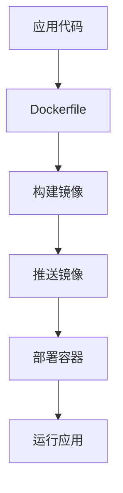
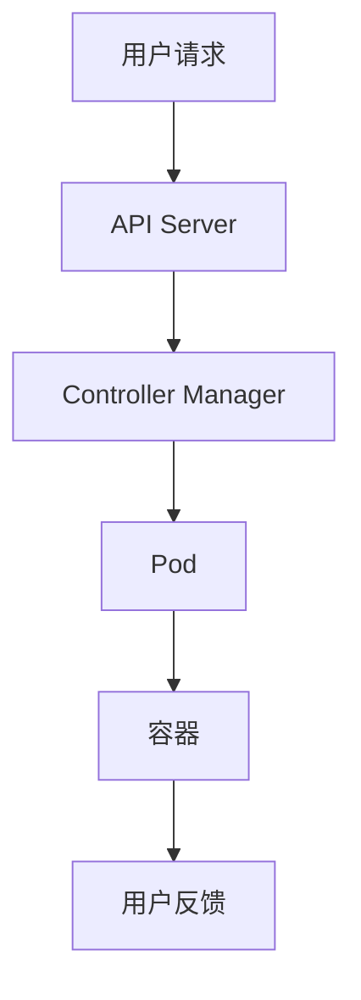
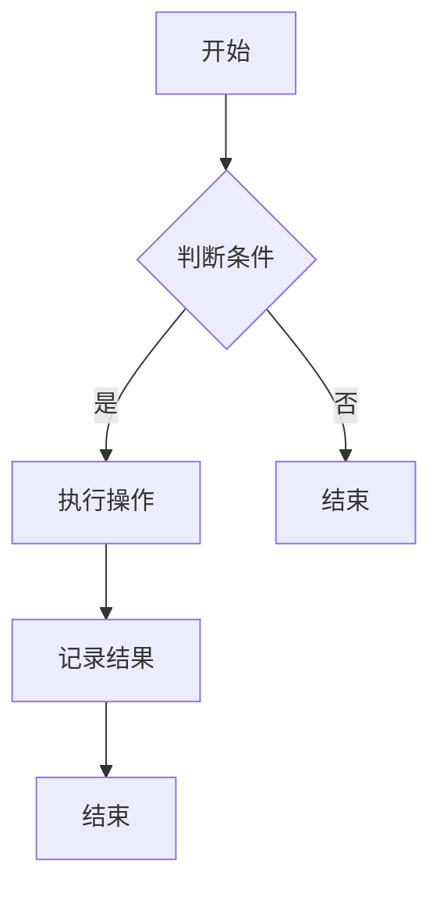

                 

### 容器化与编排：P9工程师的资源管理艺术

#### 关键词
- 容器化技术
- 资源管理
- Kubernetes
- 微服务架构
- DevOps

#### 摘要
随着云计算和微服务架构的兴起，容器化技术已成为现代IT基础设施的核心。本文旨在深入探讨容器化与编排技术，尤其是P9工程师在资源管理方面的艺术。通过一步步的逻辑推理，我们将分析容器技术基础、高级应用、资源监控与调度、性能优化、高级资源管理策略，并结合企业级应用案例进行实战讲解，帮助读者全面掌握容器化与编排的艺术。

---

# 容器化与编排：P9工程师的资源管理艺术

在当今的IT领域中，容器化技术已经成为提升应用交付效率和资源利用率的重要手段。P9级别的工程师，往往负责企业级应用架构的顶层设计和资源优化，他们不仅需要深入理解容器技术的基础，还要精通编排系统的运用，以实现对复杂应用环境的全面掌控。本文将围绕这一主题，通过逻辑清晰、结构紧凑的分析，带领读者探索容器化与编排的深层次知识，并展示P9工程师在资源管理方面的艺术。

## 第一部分：容器化技术基础

### 第1章：容器技术概述

#### 1.1 容器的概念与优势

**容器**是一种轻量级的、可移植的计算环境，它允许开发者在几乎任何地方运行应用程序，而不受硬件或操作系统的限制。与虚拟机相比，容器仅封装应用程序及其依赖项，而不需要完整的操作系统映像，因此具有更高的性能和效率。

**优势：**
- **轻量级**：容器启动速度快，占用资源少。
- **可移植性**：容器可以在不同的环境中无缝运行。
- **灵活性和隔离性**：容器提供了一种高效的资源隔离方式，同时保证了应用程序的独立性。

**应用场景：**
- **持续集成与持续部署**（CI/CD）
- **微服务架构**
- **云计算与混合云环境**
- **大数据处理**

**容器生态的演变历程：**
容器技术的发展经历了从LXC到Docker，再到Kubernetes的演变过程。LXC最早提供了容器化的基础，而Docker的推出则使容器技术得到了广泛应用。Kubernetes的出现，则将容器编排提升到了一个新的层次，实现了自动化部署、扩展和管理。

### 第2章：Docker技术深度解析

#### 2.1 Docker的基本原理

Docker是一种容器平台，它通过容器镜像和容器实现应用程序的打包和部署。容器镜像是一种静态的、不可变的文件系统，包含应用程序及其运行所需的库、配置文件等。容器则是基于镜像创建的可执行实例。

**Docker镜像与容器：**
- **镜像**：镜像是一个只读的模板，用于创建容器。
- **容器**：容器是基于镜像创建的动态运行实例。

**Dockerfile与Docker Compose：**
- **Dockerfile**：用于定义如何构建容器镜像的脚本文件。
- **Docker Compose**：用于定义和运行多容器应用的工具，它通过YAML文件描述应用程序的各个组件及其依赖关系。

### 第3章：Docker高级应用

#### 2.2 Docker网络与存储

**容器网络配置：**
Docker支持多种网络模式，如桥接、主机、容器网络等，可以根据应用需求进行灵活配置。

**容器存储解决方案：**
Docker提供了一种灵活的存储解决方案，包括卷（Volume）、绑定挂载（Bind Mount）等，可以满足不同的数据存储需求。

**Docker volume深入理解：**
卷是一种外部存储，可以在容器之间共享数据。卷支持持久化存储，即使在容器删除后，数据仍然保持不变。

#### 2.3 容器编排与管理

**Kubernetes基础架构：**
Kubernetes是一个开源的容器编排系统，提供了一种自动化部署、扩展和管理容器化应用程序的强大工具。

**Kubernetes工作原理：**
Kubernetes通过控制平面（Control Plane）和集群中的节点（Node）协同工作，实现对容器的调度和管理。

**Kubernetes核心组件详解：**
- **Master组件**：包括API Server、Scheduler、Controller Manager和Etcd。
- **Node组件**：包括Kubelet、Kube-Proxy和Container Runtime。

### 第4章：容器与微服务架构

#### 3.1 微服务架构理念

**微服务架构的优点与挑战：**
- **优点**：提高系统的可扩展性、灵活性和容错性。
- **挑战**：分布式系统的复杂性、服务间通信和依赖管理。

**微服务与容器的结合：**
容器技术为微服务架构提供了高效的部署和运维方式，使微服务能够快速响应业务需求。

**微服务架构设计模式：**
- **服务拆分**：将大型应用拆分为多个小型服务。
- **服务自治**：每个服务独立开发、部署和扩展。
- **服务通信**：通过API网关或服务发现机制进行服务间通信。

#### 3.2 容器与DevOps

**DevOps文化：**
DevOps是一种文化、实践和工具的集合，旨在提高开发和运维团队的协作效率，缩短软件交付周期。

**持续集成与持续部署：**
持续集成（CI）和持续部署（CD）是DevOps的核心实践，通过自动化流程实现代码的快速集成、测试和部署。

**容器化环境下的自动化运维：**
容器技术为自动化运维提供了良好的支持，通过CI/CD流程实现从代码提交到生产环境部署的自动化。

### 第5章：容器安全与隐私

#### 4.1 容器安全挑战

**容器攻击面分析：**
容器具有高度的自动化和灵活性，但也暴露了更大的攻击面，如容器镜像漏洞、容器逃逸攻击等。

**容器镜像安全策略：**
通过扫描和验证容器镜像，确保其安全性和合规性。

**容器运行时安全：**
在容器运行时，通过安全策略、隔离机制和监控工具保护容器免受攻击。

#### 4.2 容器隐私保护

**容器数据安全：**
通过加密、访问控制和数据备份等手段保护容器数据的安全。

**容器网络流量监控：**
通过监控容器网络流量，检测和防御网络攻击。

**容器日志分析与审计：**
通过分析容器日志，发现潜在的安全问题和合规性风险。

## 第二部分：容器资源管理

### 第6章：资源监控与调度

#### 5.1 Kubernetes资源监控

**监控工具选择：**
根据实际需求选择合适的监控工具，如Prometheus、Grafana等。

**资源监控指标：**
定义关键指标，如CPU利用率、内存使用率、网络带宽等，以评估集群和应用的性能。

**集群健康状态监控：**
通过监控集群节点的健康状态，确保集群的稳定运行。

#### 5.2 Kubernetes资源调度

**调度策略与算法：**
Kubernetes采用多种调度策略，如最优匹配、最邻近等，以优化资源利用率和应用性能。

**节点选择器与亲和性：**
通过节点选择器和亲和性策略，确保应用能够部署在满足特定要求的节点上。

**负载均衡原理：**
Kubernetes内置了负载均衡机制，通过自动调度容器实例，实现流量的均衡分配。

### 第7章：性能优化与调优

#### 6.1 容器性能监控

**系统资源使用监控：**
监控容器使用的系统资源，如CPU、内存、磁盘I/O等，以识别性能瓶颈。

**容器性能瓶颈分析：**
通过分析性能监控数据，定位性能瓶颈，如CPU占用过高、内存泄露等。

**性能调优最佳实践：**
根据性能分析结果，采取相应的优化措施，如调整容器资源限制、优化网络配置等。

#### 6.2 容器性能优化

**容器资源限制：**
通过设置容器资源限制，如CPU份额、内存限制等，确保容器不会占用过多资源。

**容器网络性能优化：**
优化容器网络配置，如调整网络模式、优化路由策略等，以提高网络性能。

**存储I/O性能优化：**
通过优化存储配置、使用高性能存储设备等手段，提高存储I/O性能。

### 第8章：高级资源管理策略

#### 7.1 跨云资源管理

**多云环境下的资源调度：**
在多云环境中，实现跨云资源调度，以充分利用不同云服务的优势。

**跨云容器服务集成：**
通过集成跨云容器服务，实现应用的一致性和可移植性。

**云原生应用架构：**
构建云原生应用架构，以充分利用容器化和云计算的优势。

#### 7.2 资源管理自动化

**自动化资源管理工具：**
使用自动化资源管理工具，如Kubernetes Operator、云原生应用平台等，实现资源的自动化管理和优化。

**资源调度的自动化流程：**
构建自动化资源调度流程，如自动扩缩容、自动故障恢复等。

**AI驱动的资源优化：**
利用人工智能技术，实现智能化的资源优化和调度，如基于机器学习的负载预测和资源分配。

## 第三部分：案例与实战

### 第9章：容器化企业级应用案例

#### 9.1 容器化电商平台

**架构设计：**
分析电商平台的需求，设计基于容器的微服务架构。

**容器化流程：**
将电商平台应用容器化，包括容器镜像构建、容器编排和部署等步骤。

**实战案例解析：**
分析容器化电商平台在实际应用中的效果和优化方案。

#### 9.2 容器化大数据平台

**架构优化：**
对大数据平台进行架构优化，以适应容器化环境。

**容器化实施：**
将大数据平台容器化，实现快速部署和弹性扩展。

**性能提升实践：**
通过性能优化实践，提升大数据平台的处理能力和稳定性。

### 第10章：容器编排项目实战

#### 10.1 Kubernetes集群搭建

**环境准备：**
准备Kubernetes集群运行的环境，包括虚拟机、物理机或云服务。

**集群配置：**
配置Kubernetes集群的各个组件，如Master节点、Worker节点等。

**集群运维：**
实施Kubernetes集群的日常运维和管理。

#### 10.2 容器化应用部署与管理

**应用容器化：**
将应用容器化，构建应用容器镜像。

**持续集成与部署：**
实现应用的持续集成和持续部署，提高交付效率。

**应用性能监控：**
监控应用性能，确保应用稳定运行。

### 第11章：资源管理实践与反思

#### 11.1 资源管理挑战与解决思路

**资源分配不均：**
分析资源分配不均的原因，并提出优化策略。

**资源竞争与调度：**
研究资源竞争现象，探讨调度策略的优化。

**资源浪费与优化：**
识别资源浪费的现象，提出优化措施。

#### 11.2 资源管理最佳实践

**资源管理策略选择：**
根据实际需求选择合适的资源管理策略。

**资源监控与预警：**
建立资源监控体系，实现实时预警和及时响应。

**资源使用效率评估：**
定期评估资源使用效率，持续优化资源管理。

## 附录

### 附录A：常用容器技术工具汇总

**A.1 Docker常用命令：**
- `docker pull`：下载镜像
- `docker run`：运行容器
- `docker ps`：查看运行中的容器
- `docker exec`：在容器内执行命令
- `docker stop`：停止容器

**A.2 Kubernetes命令行工具：**
- `kubectl`：Kubernetes的命令行工具，用于管理集群资源
- `kubelet`：节点上的组件，负责与Master节点通信并管理容器
- `kubectl get pods`：查看集群中所有Pod的状态

**A.3 容器监控工具：**
- Prometheus：开源的监控解决方案，用于收集和存储容器性能数据
- Grafana：开源的数据可视化和监控工具，用于展示Prometheus数据
- cAdvisor：谷歌开源的容器监控工具，用于收集和展示容器资源使用情况

### 附录B：Mermaid流程图示例

**B.1 容器化流程：**

**B.2 Kubernetes核心组件交互流程：**

### 附录C：数学公式与算法流程图示例

**C.1 数学公式：**
$$E = mc^2$$

**C.2 算法流程图：**

### 附录D：作者信息

**作者：** AI天才研究院 / AI Genius Institute & 禅与计算机程序设计艺术 / Zen And The Art of Computer Programming

---

本文通过逻辑清晰、结构紧凑的分析，从容器技术基础到高级应用，再到资源管理策略，全面探讨了容器化与编排的艺术。希望读者能够在阅读本文后，对容器化技术有更深入的理解，并在实践中掌握资源管理的核心技巧。在未来的IT领域中，容器化与编排将继续发挥重要作用，为企业的数字化转型提供强有力的支持。让我们共同探索这一领域，不断提升我们的技术水平，共同迎接更加智能、高效的未来。

