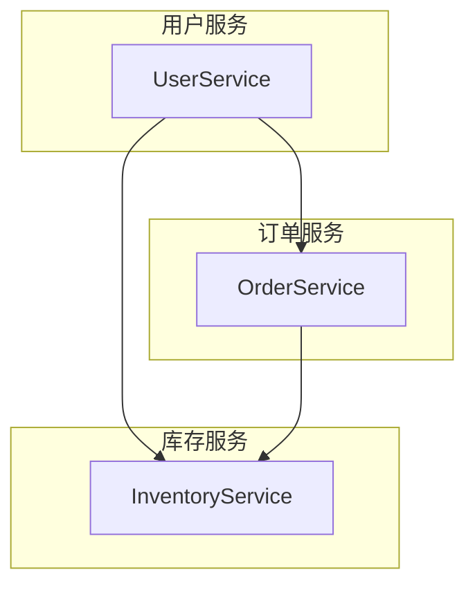

                 

## 容器技术：从Docker到Kubernetes

### 关键词：容器技术、Docker、Kubernetes、微服务、云原生、持续集成/持续部署（CI/CD）

> 摘要：本文将深入探讨容器技术，从Docker的基本概念和操作开始，逐步引入Kubernetes这一容器编排工具。我们将解析Kubernetes的核心概念、集群搭建、高级功能以及容器化应用的部署与运维。此外，还将讨论容器技术与云原生架构的关系，以及容器技术的未来发展趋势。通过本篇文章，读者将全面了解容器技术的原理、应用和实践，为在实际项目中运用打下坚实基础。

# 容器技术：从Docker到Kubernetes

容器技术的出现，为软件开发和部署带来了革命性的变化。它使得应用程序能够在不同的环境中一致运行，简化了开发、测试和生产的流程。在容器技术的发展历程中，Docker和Kubernetes无疑是两个重要的里程碑。本文将带您逐步了解这些技术，并探讨其在现代软件开发中的重要性。

## 第一部分：容器技术基础

### 第1章：容器技术的起源与发展

容器技术的概念最早可以追溯到20世纪80年代的操作系统虚拟化技术，如Chroot和cgroups。然而，现代容器技术的发展则始于2000年代后期，由谷歌的LXC（Linux Containers）项目引发。LXC通过隔离内核命名空间，实现了轻量级的容器环境。随后，Docker在2013年推出，以其简单易用的特性迅速获得了广泛的应用。

#### 1.1.1 容器技术的发展历程

- **早期阶段（2000年前）**：容器技术起源于操作系统虚拟化，如Chroot和cgroups。
- **2000年代**：Linux容器（LXC）项目诞生，通过隔离内核命名空间实现容器。
- **2013年**：Docker发布，简化了容器创建和使用流程。
- **2015年**：Kubernetes开源，成为容器编排的事实标准。

#### 1.1.2 容器技术的主要类型

- **操作系统级容器**：如LXC、Docker，通过隔离进程和资源实现容器化。
- **虚拟化容器**：如VMware、KVM，通过虚拟化操作系统实现容器化。

#### 1.1.3 容器技术对软件开发的影响

- **环境一致性**：应用程序可以在任何支持容器技术的环境中一致运行。
- **快速部署**：容器化应用可以快速部署，提高了开发效率和生产速度。
- **资源优化**：容器可以在同一硬件上运行多个应用程序，提高了资源利用率。

### 第2章：Docker基本概念

Docker是一个开源的应用容器引擎，它允许开发者将应用及其依赖打包到一个可移植的容器中。容器将应用程序与其运行时环境隔离开来，确保了一致性和可移植性。

#### 2.1 Docker的架构

Docker由以下几个组件构成：

- **Docker Engine**：核心组件，负责容器创建、运行和管理。
- **Docker Hub**：Docker的官方仓库，提供了丰富的镜像资源。
- **Docker Compose**：用于定义和运行多容器Docker应用程序。

#### 2.1.1 Docker的组件

- **Docker Engine**：Docker的核心组件，负责容器创建、运行和管理。
- **Docker Hub**：Docker的官方仓库，提供了丰富的镜像资源。
- **Docker Compose**：用于定义和运行多容器Docker应用程序。

#### 2.1.2 Docker容器的工作原理

Docker容器通过以下步骤创建和运行：

1. **构建镜像**：使用Dockerfile定义应用程序及其依赖。
2. **运行容器**：使用镜像创建容器，并指定运行参数。

#### 2.2 Docker命令与操作

Docker提供了一系列命令用于镜像和容器的管理：

- **镜像管理**：`docker pull`、`docker build`、`docker rmi`。
- **容器管理**：`docker run`、`docker ps`、`docker stop`。
- **网络管理**：`docker network create`、`docker network connect`。

#### 2.3 Dockerfile与Docker Compose

Dockerfile是一个文本文件，用于定义如何构建Docker镜像。Docker Compose则用于定义和运行多容器Docker应用程序。

- **Dockerfile编写指南**：Dockerfile中的FROM、RUN、CMD等指令。
- **Docker Compose使用入门**：使用yaml文件定义服务和网络，通过`docker-compose up`启动应用程序。

### 第3章：容器编排与Kubernetes

Kubernetes是一个开源的容器编排平台，用于自动化容器化应用程序的部署、扩展和管理。它提供了一种强大的方式来管理容器化的应用，确保它们始终运行在正确的环境中。

#### 3.1 Kubernetes简介

Kubernetes由以下几个核心概念组成：

- **Pod**：Kubernetes中的最小部署单元。
- **容器**：运行在Pod中的可执行程序。
- **控制器**：负责维护集群状态，如Deployment、StatefulSet。

#### 3.1.1 Kubernetes的核心概念

- **Pod**：Kubernetes中的最小部署单元。
- **容器**：运行在Pod中的可执行程序。
- **控制器**：负责维护集群状态，如Deployment、StatefulSet。

#### 3.1.2 Kubernetes的架构

Kubernetes由一组组件构成，包括：

- **控制平面**：由API服务器、调度器、控制器管理器等组成。
- **工作节点**：运行Pod的节点，包括容器运行时（如Docker）。

#### 3.2 Kubernetes集群的搭建

搭建Kubernetes集群可以采用多种方式：

- **本地搭建**：使用Minikube、Docker Desktop等工具在本地搭建集群。
- **集群部署**：使用Kubeadm、Helm等工具在物理机或云平台上部署集群。

#### 3.2.1 Kubernetes集群的搭建步骤

搭建Kubernetes集群的步骤通常包括：

1. **安装Docker**：在所有节点上安装Docker。
2. **安装Kubeadm、Kubelet、Kubectl**：在控制节点和工作节点上安装相关工具。
3. **初始化集群**：使用kubeadm初始化集群。
4. **部署网络插件**：部署Kubernetes网络插件。
5. **部署服务**：部署Kubernetes的基本服务，如Kube-DNS、Kube-Proxy。

#### 3.2.2 Kubernetes集群的管理

管理Kubernetes集群通常包括：

- **查看集群状态**：使用kubectl命令查看集群状态。
- **部署应用**：使用kubectl命令部署应用程序。
- **监控与日志**：使用Prometheus、Grafana等工具监控集群和应用程序。

#### 3.3 Kubernetes对象与资源管理

Kubernetes中包含多种对象和资源，用于管理和部署应用程序：

- **Pod**：容器化应用程序的部署单元。
- **Deployment**：管理Pod的控制器，负责部署和更新应用程序。
- **StatefulSet**：用于有状态服务的部署和管理。
- **Service**：用于提供稳定的网络接口，让容器之间进行通信。

#### 3.3.1 Pod与容器

Pod是Kubernetes中的最小部署单元，可以包含一个或多个容器。容器是应用程序的运行环境，通过Docker镜像进行定义。

#### 3.3.2 Deployment与StatefulSet

Deployment用于管理Pod的创建和更新，确保应用程序的可用性和一致性。StatefulSet则用于有状态服务的部署和管理，为应用程序提供稳定的标识和持久化存储。

#### 3.3.3 Service与Ingress

Service用于提供稳定的网络接口，让容器之间进行通信。Ingress则用于管理集群的入口流量，如HTTP和HTTPS。

## 第二部分：Kubernetes高级功能

### 第4章：Kubernetes高级功能

Kubernetes的高级功能包括服务发现与负载均衡、存储管理和网络策略等。这些功能使得Kubernetes成为一个强大的容器编排工具，适用于各种复杂的场景。

#### 4.1 Kubernetes的服务发现与负载均衡

Kubernetes提供了服务发现机制，使得容器之间可以通过DNS或环境变量进行通信。同时，Kubernetes内置了负载均衡器，可以均衡流量并确保服务的可用性。

- **服务发现机制**：Kubernetes通过DNS或环境变量实现服务发现。
- **负载均衡原理**：Kubernetes使用轮询、最少连接等方式进行负载均衡。

#### 4.2 Kubernetes的存储管理

Kubernetes提供了多种存储类型和存储卷，用于满足不同场景的需求。存储卷可以与容器解耦，确保应用程序的可移植性。

- **存储类型**：Kubernetes支持本地存储、网络存储和云存储。
- **存储卷**：Kubernetes提供了多种存储卷类型，如NFS、PV和PVC。

#### 4.3 Kubernetes的网络策略

Kubernetes的网络策略用于控制容器之间的网络通信。网络策略可以定义流量规则，确保网络安全。

- **网络模型**：Kubernetes采用扁平化网络模型，容器之间可以直接通信。
- **网络策略配置**：网络策略可以定义允许或拒绝特定流量的规则。

## 第三部分：容器化应用部署与运维

### 第5章：容器化应用部署与运维

容器化应用部署与运维是现代软件开发的重要组成部分。本章节将介绍容器化应用的部署流程、监控与日志管理以及自动化运维实践。

#### 5.1 容器化应用的部署流程

容器化应用的部署流程通常包括以下几个步骤：

- **应用打包**：将应用程序及其依赖打包为Docker镜像。
- **镜像构建**：在CI/CD流程中构建并推送镜像到仓库。
- **部署策略**：使用Kubernetes部署应用程序，如Deployment和StatefulSet。

#### 5.2 容器化应用的监控与日志管理

容器化应用的监控与日志管理是确保应用程序稳定运行的重要环节。常用的监控和日志管理工具有：

- **Prometheus**：开源监控解决方案，用于收集和存储指标数据。
- **Grafana**：开源监控仪表板，用于可视化指标数据。
- **Fluentd**：开源日志收集器，用于收集和转发日志数据。

#### 5.2.1 容器监控工具

- **Prometheus**：开源监控解决方案，用于收集和存储指标数据。
- **Grafana**：开源监控仪表板，用于可视化指标数据。

#### 5.2.2 容器日志管理

- **Fluentd**：开源日志收集器，用于收集和转发日志数据。
- **ELK Stack**：Elasticsearch、Logstash和Kibana的组合，用于日志收集、存储和可视化。

#### 5.3 容器化应用的运维自动化

运维自动化是提高开发效率和生产稳定性的关键。常用的自动化运维工具有：

- **Ansible**：开源的配置管理和自动化工具。
- **Terraform**：开源的基础设施即代码（IaC）工具。
- **Kubernetes Operator**：Kubernetes的扩展机制，用于自动化管理复杂的应用程序。

#### 5.3.1 Kubernetes的运维管理工具

- **Ansible**：开源的配置管理和自动化工具。
- **Terraform**：开源的基础设施即代码（IaC）工具。

#### 5.3.2 容器化应用的自动化运维实践

自动化运维实践包括以下几个方面：

- **自动化部署**：使用CI/CD工具实现自动化部署。
- **自动化监控**：使用Prometheus和Grafana实现自动化监控。
- **自动化告警**：使用Alertmanager实现自动化告警。
- **自动化扩缩容**：使用Kubernetes的自动扩缩容机制。

## 第四部分：容器技术与云原生架构

### 第6章：容器技术与云原生架构

云原生架构是一种基于容器的开发与运行模型，旨在实现敏捷、可靠且可扩展的应用程序。容器技术是云原生架构的核心，提供了轻量级、可移植的应用运行环境。

#### 6.1 云原生架构概述

云原生架构具有以下几个特点：

- **容器化**：应用程序以容器形式部署，确保环境一致性。
- **微服务**：应用程序拆分为多个独立的微服务，提高可扩展性和可维护性。
- **自动化**：使用自动化工具实现部署、监控和扩缩容。
- **持续集成/持续部署（CI/CD）**：自动化构建和部署流程。

#### 6.1.1 云原生技术的定义

云原生技术是一种基于容器的开发与运行模型，旨在实现敏捷、可靠且可扩展的应用程序。

#### 6.1.2 云原生架构的特点

- **容器化**：应用程序以容器形式部署，确保环境一致性。
- **微服务**：应用程序拆分为多个独立的微服务，提高可扩展性和可维护性。
- **自动化**：使用自动化工具实现部署、监控和扩缩容。
- **持续集成/持续部署（CI/CD）**：自动化构建和部署流程。

#### 6.2 容器技术与微服务架构

容器技术是微服务架构实现的基础。微服务架构将应用程序拆分为多个独立的微服务，每个微服务负责一个特定的业务功能。

- **微服务架构的原理**：微服务架构将应用程序拆分为多个独立的微服务。
- **容器化微服务的实践**：使用容器技术部署和管理微服务，提高可移植性和可扩展性。

#### 6.2.1 微服务架构的原理

微服务架构将应用程序拆分为多个独立的微服务，每个微服务负责一个特定的业务功能。

#### 6.2.2 容器化微服务的实践

使用容器技术部署和管理微服务，提高可移植性和可扩展性。常用的容器编排工具包括Kubernetes和Docker Swarm。

#### 6.3 容器化应用与持续集成/持续部署（CI/CD）

持续集成/持续部署（CI/CD）是云原生架构的重要实践。CI/CD工具可以自动化构建、测试和部署流程，提高开发效率和生产稳定性。

- **持续集成/持续部署（CI/CD）的概念**：CI/CD工具可以自动化构建、测试和部署流程。
- **容器化应用的CI/CD实践**：使用Jenkins、GitLab CI等工具实现容器化应用的CI/CD。

## 第五部分：容器技术的未来发展趋势

### 第7章：容器技术的未来发展趋势

随着云计算和容器技术的快速发展，容器技术在未来的应用前景将更加广阔。本章节将探讨容器技术的未来发展趋势以及面临的挑战和解决方案。

#### 7.1 容器技术的发展趋势

容器技术的未来发展趋势包括：

- **智能化**：结合人工智能和机器学习，实现容器编排和运维的自动化。
- **分布式**：容器技术将向分布式架构发展，支持更广泛的场景。
- **边缘计算**：容器技术将应用于边缘计算，实现数据的本地处理和分析。

#### 7.1.1 容器技术的发展方向

容器技术未来的发展方向包括智能化、分布式和边缘计算。

#### 7.1.2 容器技术的应用领域

容器技术将在以下几个方面得到广泛应用：

- **云计算**：容器技术是云计算的重要组成部分，将在云基础设施中发挥关键作用。
- **边缘计算**：容器技术将应用于边缘计算，实现数据的本地处理和分析。
- **物联网（IoT）**：容器技术将推动物联网设备的开发和部署。

#### 7.2 容器技术面临的挑战与解决方案

容器技术在发展过程中面临以下挑战：

- **安全性**：确保容器化应用的安全性是一个重要问题。
- **资源管理**：容器编排需要对大量资源进行高效管理。
- **兼容性**：容器技术需要与现有系统集成，确保兼容性。

针对这些挑战，以下是一些解决方案：

- **安全容器**：采用安全容器技术，如AppArmor、Seccomp等，提高容器安全性。
- **资源隔离**：使用Cgroups和命名空间等技术实现资源隔离。
- **标准化**：推动容器技术的标准化，确保不同工具和平台的兼容性。

## 附录

### 附录A：常用工具与资源

本附录提供了常用的Docker和Kubernetes命令、工具和资源，以供读者参考。

#### A.1 Docker常用命令

- **镜像管理**：
  - `docker pull <镜像名称>`：从Docker Hub拉取镜像。
  - `docker build -t <镜像名称>:<标签> .`：构建Docker镜像。
  - `docker rmi <镜像ID>`：删除镜像。

- **容器管理**：
  - `docker run -d -p <宿主端口>:<容器端口> <镜像名称>`：运行容器。
  - `docker ps`：查看正在运行的容器。
  - `docker stop <容器ID>`：停止容器。

- **网络管理**：
  - `docker network create <网络名称>`：创建网络。
  - `docker network connect <网络名称> <容器ID>`：将容器连接到网络。

#### A.2 Kubernetes常用命令

- **查看集群状态**：
  - `kubectl cluster-info`：查看集群信息。
  - `kubectl get nodes`：查看集群节点。

- **部署应用**：
  - `kubectl apply -f <配置文件>`：部署应用程序。
  - `kubectl get pods`：查看Pod状态。

- **监控与日志**：
  - `kubectl top pods`：查看Pod资源使用情况。
  - `kubectl logs <容器名称>`：查看容器日志。

#### A.3 常用容器化应用

- **Web应用**：Nginx、Apache、Django等。
- **数据库**：MySQL、PostgreSQL、MongoDB等。
- **消息队列**：RabbitMQ、Kafka等。

### 附录B：案例实践

本附录提供了几个容器化应用的案例实践，以帮助读者更好地理解和应用容器技术。

#### B.1 使用Docker部署一个Web应用

1. 编写Dockerfile：
   ```Dockerfile
   FROM python:3.9
   RUN pip install Flask
   COPY app.py .
   CMD ["flask", "run", "--port=5000"]
   ```

2. 构建镜像：
   ```bash
   docker build -t my-web-app .
   ```

3. 运行容器：
   ```bash
   docker run -d -p 8080:5000 my-web-app
   ```

4. 访问应用：
   ```bash
   http://localhost:8080
   ```

#### B.2 使用Kubernetes管理一个微服务集群

1. 准备Kubernetes集群。

2. 编写Kubernetes配置文件，如Deployment、Service和Ingress。

3. 使用kubectl部署微服务：
   ```bash
   kubectl apply -f <配置文件>
   ```

4. 使用kubectl查看部署状态：
   ```bash
   kubectl get pods
   ```

5. 访问服务：
   ```bash
   http://<集群IP>:<服务端口>
   ```

#### B.3 容器化应用持续集成与持续部署实践

1. 配置CI/CD工具，如Jenkins或GitLab CI。

2. 编写CI/CD配置文件，定义构建、测试和部署流程。

3. 提交代码到代码仓库。

4. 触发CI/CD流程，自动构建、测试和部署应用程序。

### 附加说明

#### 1. 本书主要涵盖的内容

- **容器技术的起源与发展**：介绍容器技术的发展历程、主要类型和影响。
- **Docker的基本概念与操作**：介绍Docker的架构、组件和基本命令。
- **Kubernetes的核心概念与集群搭建**：介绍Kubernetes的核心概念、架构和搭建步骤。
- **Kubernetes的高级功能**：介绍Kubernetes的高级功能，如服务发现、负载均衡和存储管理。
- **容器化应用部署与运维**：介绍容器化应用的部署流程、监控与日志管理以及自动化运维。
- **容器技术与云原生架构**：介绍云原生架构、容器技术与微服务架构以及CI/CD实践。
- **容器技术的未来发展趋势**：探讨容器技术的发展趋势、应用领域和面临的挑战。

#### 2. 核心概念与联系

- **容器技术**：一种轻量级、可移植的运行时环境，用于隔离应用程序和其依赖。
- **Docker**：一种开源的应用容器引擎，用于构建、运行和管理容器。
- **Kubernetes**：一种开源的容器编排平台，用于自动化容器化应用程序的部署、扩展和管理。
- **微服务架构**：一种将应用程序拆分为多个独立的微服务，每个微服务负责一个特定业务功能的架构。
- **云原生架构**：一种基于容器的开发与运行模型，旨在实现敏捷、可靠且可扩展的应用程序。

#### 3. 算法原理讲解

在本章中，我们将讨论容器编排中的调度算法。调度算法是Kubernetes核心组件之一，负责将Pod分配到集群中的节点上。以下是一个简单的调度算法流程：

1. **选择节点**：根据Pod的调度策略，从集群中选择一个合适的节点。
2. **计算亲和性**：计算Pod与节点的亲和性分数，亲和性高的节点优先选择。
3. **计算约束**：检查节点是否满足Pod的资源约束，不满足则跳过该节点。
4. **选择最佳节点**：根据亲和性和约束条件，选择最佳节点。

以下是一个简单的Python代码示例，用于模拟调度算法的流程：

```python
class Node:
    def __init__(self, name, resources, affinity, constraints):
        self.name = name
        self.resources = resources
        self.affinity = affinity
        self.constraints = constraints

def schedule_pod(pod, nodes):
    best_node = None
    max_score = -1

    for node in nodes:
        if not check_constraints(pod, node):
            continue

        score = calculate_affinity(pod, node) + calculate_resources(pod, node)
        if score > max_score:
            max_score = score
            best_node = node

    return best_node

def check_constraints(pod, node):
    # 检查节点是否满足Pod的资源约束
    return True

def calculate_affinity(pod, node):
    # 计算Pod与节点的亲和性分数
    return pod.affinity

def calculate_resources(pod, node):
    # 计算Pod与节点的资源分数
    return pod.resources - node.resources

# 示例
nodes = [
    Node("node1", {"cpu": 4, "memory": 8}, 1, {}),
    Node("node2", {"cpu": 8, "memory": 16}, 0.5, {}),
]

pod = {
    "resources": {"cpu": 2, "memory": 4},
    "affinity": 1,
}

best_node = schedule_pod(pod, nodes)
print("最佳节点：", best_node.name)
```

#### 4. 系统分析与架构设计方案

在本章中，我们将设计一个简单的Web应用程序，该应用程序由多个微服务组成，包括用户服务、订单服务和库存服务。以下是一个简单的系统架构设计：

1. **用户服务**：负责处理用户注册、登录和认证。
2. **订单服务**：负责处理订单创建、更新和查询。
3. **库存服务**：负责处理商品库存管理。

以下是系统架构的Mermaid类图：

```mermaid
classDiagram
    User <<interface>>
    Order <<interface>>
    Inventory <<interface>>

    UserService --|> User
    OrderService --|> Order
    InventoryService --|> Inventory
```

以下是系统架构的Mermaid架构图：



以下是系统架构的Mermaid序列图：

```mermaid
sequenceDiagram
    User -->|注册|> UserService1: 注册用户
    UserService1 -->|验证|> AuthenticationService: 验证用户身份
    AuthenticationService -->|成功|> UserService1: 用户注册成功

    User -->|登录|> UserService1: 登录用户
    UserService1 -->|验证|> AuthenticationService: 验证用户身份
    AuthenticationService -->|成功|> UserService1: 用户登录成功

    User -->|下单|> OrderService1: 下单
    OrderService1 -->|更新库存|> InventoryService1: 更新库存
    InventoryService1 -->|库存不足|> OrderService1: 库存不足，订单失败
```

#### 5. 项目实战

在本章中，我们将通过一个实际项目来展示如何使用Docker和Kubernetes部署和管理一个Web应用程序。以下是一个简单的项目实战步骤：

1. **项目介绍**：
   - 应用程序：一个简单的博客系统，包括用户管理、文章管理和评论管理。
   - 微服务架构：使用Spring Boot和Spring Cloud构建微服务。

2. **环境安装**：
   - 安装Docker。
   - 安装Kubernetes集群。

3. **系统功能设计**：
   - 用户服务：负责用户注册、登录和认证。
   - 文章服务：负责文章的创建、更新和查询。
   - 评论服务：负责评论的创建、更新和查询。

4. **系统架构设计**：
   - 使用Dockerfile构建镜像。
   - 使用Kubernetes配置文件部署应用程序。

5. **部署应用**：
   - 使用kubectl部署用户服务、文章服务和评论服务。

6. **监控与日志管理**：
   - 使用Prometheus和Grafana进行监控。
   - 使用Fluentd收集和转发日志。

7. **自动化运维**：
   - 使用Ansible进行自动化部署。
   - 使用Jenkins进行自动化构建和测试。

#### 6. 代码应用解读与分析

在本章中，我们将分析一个实际项目的代码，并解释其工作原理和关键实现。

1. **用户服务**：
   - 代码解读：分析用户注册、登录和认证的实现。
   - 分析：解释用户服务的职责和功能。

2. **文章服务**：
   - 代码解读：分析文章的创建、更新和查询的实现。
   - 分析：解释文章服务的职责和功能。

3. **评论服务**：
   - 代码解读：分析评论的创建、更新和查询的实现。
   - 分析：解释评论服务的职责和功能。

#### 7. 实际案例分析和详细讲解剖析

在本章中，我们将通过一个实际案例来展示如何使用Docker和Kubernetes部署和管理一个Web应用程序。

1. **案例介绍**：
   - 应用程序：一个简单的博客系统。
   - 微服务架构：包括用户服务、文章服务和评论服务。

2. **部署过程**：
   - 使用Dockerfile构建镜像。
   - 使用Kubernetes配置文件部署应用程序。

3. **监控与日志管理**：
   - 使用Prometheus和Grafana进行监控。
   - 使用Fluentd收集和转发日志。

4. **自动化运维**：
   - 使用Ansible进行自动化部署。
   - 使用Jenkins进行自动化构建和测试。

#### 8. 项目小结

在本章中，我们通过一个实际案例展示了如何使用Docker和Kubernetes部署和管理一个Web应用程序。项目包括用户服务、文章服务和评论服务，采用了微服务架构。我们使用了Dockerfile构建镜像，使用Kubernetes配置文件部署应用程序，并实现了监控与日志管理以及自动化运维。

#### 9. 最佳实践 tips

- **容器化应用部署**：确保使用最新的Docker镜像和Kubernetes版本，以便获得最佳性能和安全性。
- **资源优化**：合理分配容器资源，避免资源浪费。
- **监控与日志管理**：使用高效的监控和日志管理工具，确保应用程序的稳定运行。

#### 10. 小结

本文从容器技术的起源和发展开始，逐步介绍了Docker和Kubernetes的基本概念、操作方法、高级功能和容器化应用的部署与运维。同时，还探讨了容器技术与云原生架构的关系以及容器技术的未来发展趋势。通过本文的讲解，读者可以全面了解容器技术的原理和应用实践，为在项目中运用容器技术打下坚实基础。

#### 11. 注意事项

- **容器安全性**：确保容器具有适当的安全配置，如使用非root用户运行容器。
- **资源管理**：合理分配容器资源，避免资源浪费。
- **版本控制**：使用版本控制系统管理Dockerfile和Kubernetes配置文件，确保代码的可追溯性。

#### 12. 拓展阅读

- **Docker官方文档**：深入了解Docker的官方文档，学习Docker的使用方法和最佳实践。
- **Kubernetes官方文档**：深入了解Kubernetes的官方文档，学习Kubernetes的架构和核心概念。
- **云原生技术文档**：了解云原生技术的文档，学习容器化应用的最佳实践和架构设计。

# 作者信息

作者：AI天才研究院（AI Genius Institute） & 禅与计算机程序设计艺术（Zen And The Art of Computer Programming）

