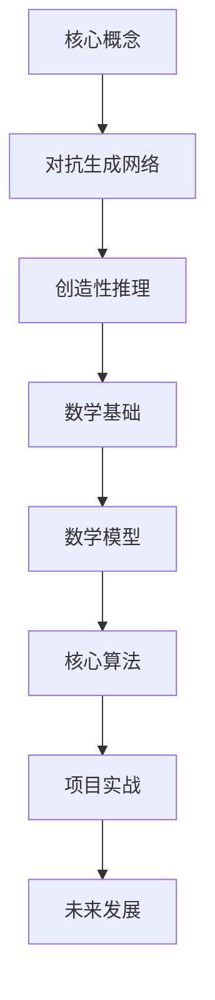

                 


## 《对抗生成网络在创造性推理中的应用探索》

> 关键词：对抗生成网络、创造性推理、人工智能、深度学习、生成对抗网络（GAN）

> 摘要：本文将对对抗生成网络（GAN）及其在创造性推理中的应用进行深入探讨。首先，我们将回顾对抗生成网络的基本概念和原理，然后分析创造性推理的定义及其特征。接下来，我们将讨论对抗生成网络在创造性推理中的实际应用背景，包括艺术创作、文学创作和游戏设计等领域。随后，我们将详细介绍对抗生成网络在创造性推理中的核心算法原理，包括生成对抗网络（GAN）的原理与实现、条件生成对抗网络（cGAN）和变分自编码器（VAE）等。最后，我们将通过实际项目案例，展示对抗生成网络在创造性推理中的具体应用，并探讨其未来发展趋势。

---

## 目录大纲

## 第一部分：引论

### 第1章：对抗生成网络与创造性推理概述

#### 1.1.1 对抗生成网络的概念与原理

#### 1.1.2 创造性推理的定义与特征

### 第2章：对抗生成网络在创造性推理中的应用背景

#### 2.1.1 创造性推理的挑战与需求

#### 2.1.2 对抗生成网络在创造性推理中的应用领域

## 第二部分：核心概念与联系

### 第3章：对抗生成网络的数学基础

### 第4章：创造性推理的数学模型

## 第三部分：核心算法原理讲解

### 第5章：生成对抗网络（GAN）的原理与实现

### 第6章：创造性推理中的对抗生成网络应用

## 第四部分：数学模型和数学公式

### 第7章：对抗生成网络与创造性推理的数学模型

## 第五部分：项目实战

### 第8章：对抗生成网络在创造性推理中的实际应用案例

### 第9章：对抗生成网络与创造性推理的未来发展

## 附录

### 附录A：常用工具与资源

## Mermaid 流程图



---

接下来，我们将按照大纲的结构，逐步展开对每个章节的详细讨论。首先，我们从对抗生成网络的概念和原理开始。首先，让我们明确一些核心概念，这是理解后续内容的基础。对抗生成网络（GAN）是一种深度学习模型，它由两部分组成：生成器（Generator）和判别器（Discriminator）。生成器负责生成数据，而判别器则负责判断数据是真实数据还是生成器生成的数据。

### 第1章：对抗生成网络与创造性推理概述

#### 1.1.1 对抗生成网络的概念与原理

对抗生成网络（GAN）最早由Ian Goodfellow等人于2014年提出。GAN的核心思想是通过生成器和判别器的对抗训练，使生成器生成的数据接近真实数据。这种对抗训练方式使得GAN在图像生成、语音合成、文本生成等领域取得了显著的成果。

- **生成器（Generator）**：生成器的任务是生成尽可能接近真实数据的数据。它通常是一个从随机噪声向数据分布映射的神经网络。
  
- **判别器（Discriminator）**：判别器的任务是判断输入数据是真实数据还是生成器生成的数据。它也是一个神经网络，通常使用多个隐层。

GAN的训练过程可以看作是生成器和判别器之间的博弈。生成器的目标是欺骗判别器，使得判别器无法区分生成的数据与真实数据，而判别器的目标是尽可能地准确判断数据的真伪。通过这种对抗训练，生成器可以逐渐提高生成数据的质量。

#### 1.1.2 创造性推理的定义与特征

创造性推理是一种高度复杂的认知过程，涉及创造新的想法、概念或解决方案。它通常具有以下几个特征：

- **创新性**：创造性推理产生新的、独特的想法或解决方案。

- **非线性和复杂性**：创造性推理往往涉及多个维度和复杂的非线性关系。

- **自组织性**：创造性推理过程中，信息会自动组织成新的结构。

- **非传统性**：创造性推理往往不遵循传统的逻辑或模式，而是突破常规思维。

创造性推理在多个领域具有重要意义，例如艺术创作、科学发现、技术创新等。在人工智能领域，如何实现高效的创造性推理一直是研究的热点问题。

### 第2章：对抗生成网络在创造性推理中的应用背景

#### 2.1.1 创造性推理的挑战与需求

尽管人类在创造性推理方面表现出色，但传统的机器学习模型在模拟这种复杂过程时面临巨大挑战。首先，创造性推理涉及大量未知的、非线性的数据，这使得传统的数据驱动模型难以处理。其次，创造性推理往往需要从大量信息中提取关键特征，这要求模型具有高度的信息处理能力。

对抗生成网络（GAN）因其强大的生成能力和自适应特性，成为解决这些挑战的有力工具。GAN可以通过生成器和判别器的对抗训练，学习到数据分布的细节，从而生成高质量的数据。这使得GAN在创造性推理中具有广泛的应用前景。

#### 2.1.2 对抗生成网络在创造性推理中的应用领域

1. **艺术创作**：对抗生成网络可以生成高质量的图像、音乐和视频，从而为艺术创作提供新的可能性。例如，生成器可以生成新颖的画作、音乐片段或电影剪辑，为艺术家提供灵感。

2. **文学创作**：对抗生成网络可以生成文本，包括诗歌、小说和剧本。这些生成的文本可以为作家提供创意素材，也可以用于自动写作系统。

3. **游戏设计**：对抗生成网络可以生成游戏关卡、角色和故事情节，为游戏开发者提供创意支持。

总之，对抗生成网络在创造性推理中具有广泛的应用潜力。通过不断的研究和优化，GAN有望在人工智能领域发挥更大的作用。

### 第3章：对抗生成网络的数学基础

在深入探讨对抗生成网络（GAN）之前，我们需要了解一些基础的数学概念，这些概念包括概率论、信息论和神经网络的基础知识。

#### 3.1.1 信息论基础

信息论是研究信息传输、存储和处理的一门科学，其核心概念是熵、互信息和KL散度。

- **熵（Entropy）**：熵是衡量随机变量不确定性的一种度量。在信息论中，熵可以看作是一个概率分布的不确定性度量。对于离散随机变量X，其熵定义为：

  $$H(X) = -\sum_{x} p(x) \log_2 p(x)$$

  其中，$p(x)$ 是随机变量X取值为$x$的概率。

- **互信息（Mutual Information）**：互信息是衡量两个随机变量之间相关性的度量。对于随机变量X和Y，其互信息定义为：

  $$I(X; Y) = H(X) - H(X | Y)$$

  其中，$H(X | Y)$ 是在知道Y的情况下X的熵。互信息的物理含义是，通过Y我们可以减少X的熵，即互信息表示了X和Y之间的相关性。

- **KL散度（Kullback-Leibler Divergence）**：KL散度是衡量两个概率分布之间差异的一种度量。对于概率分布$p$和$q$，其KL散度定义为：

  $$D_{KL}(p || q) = \sum_{x} p(x) \log \frac{p(x)}{q(x)}$$

  KL散度是非对称的，且总是非负的。当$p$和$q$相同时，KL散度为0。

在对抗生成网络（GAN）中，生成器和判别器的训练过程中，KL散度被用来衡量生成器生成的数据与真实数据之间的差异。通过最小化KL散度，生成器可以学习到数据分布的细节。

#### 3.1.2 神经网络与深度学习基础

神经网络是模仿人脑神经元连接的一种计算模型，它是深度学习的基础。神经网络由多个层组成，包括输入层、隐藏层和输出层。每个层由多个神经元组成，神经元之间通过权重连接。

- **神经元模型**：一个简单的神经元模型可以表示为：

  $$z = \sum_{i} w_i x_i + b$$

  其中，$w_i$ 是权重，$x_i$ 是输入，$b$ 是偏置。神经元通过激活函数$f$转化为输出：

  $$o = f(z)$$

  常见的激活函数包括Sigmoid函数、ReLU函数和Tanh函数。

- **反向传播算法**：反向传播算法是训练神经网络的关键算法。它通过计算输出层与隐藏层之间的误差，反向传播误差到每一层，并更新权重和偏置，以达到最小化损失函数的目的。

在对抗生成网络（GAN）中，生成器和判别器都是深度神经网络。生成器通过学习噪声分布来生成数据，判别器则通过学习区分真实数据和生成数据的能力来训练生成器。

通过上述数学基础和深度学习知识，我们可以更好地理解对抗生成网络的原理和工作机制。在接下来的章节中，我们将深入探讨GAN的具体实现和它在创造性推理中的应用。

### 第4章：创造性推理的数学模型

创造性推理是一种复杂的认知过程，涉及多种认知机制和认知要素。为了更好地理解和模拟创造性推理，我们需要建立数学模型来描述其核心机制和过程。

#### 4.1.1 创造性推理的数学表示

创造性推理的数学模型通常包括以下几个方面：

1. **知识表示**：创造性推理依赖于大量的知识。这些知识可以表示为符号、概念、规则等。在数学模型中，我们可以使用图结构或知识图谱来表示这些知识。

2. **概率模型**：创造性推理过程中，个体需要从大量信息中提取有用信息，并进行组合。概率模型可以用于描述这些信息的出现概率和组合概率。常见的概率模型包括贝叶斯网络、隐马尔可夫模型（HMM）等。

3. **决策理论**：创造性推理涉及到多种决策，例如选择新的概念组合、评估创意的质量等。决策理论可以用于描述这些决策过程，包括期望值、风险分析等。

4. **生成模型**：生成模型可以用于生成新的创意或解决方案。常见的生成模型包括生成对抗网络（GAN）、变分自编码器（VAE）等。

创造性推理的数学模型可以表示为：

$$
Creative\, Reasoning = f(Knowledge, Information, Decision, Generation)
$$

其中，$f$ 是一个复杂的函数，它将知识、信息、决策和生成过程结合起来，生成新的创意或解决方案。

#### 4.1.2 创造性推理的评价指标

为了评估创造性推理的效果，我们需要设计合适的评价指标。以下是一些常用的创造性推理评价指标：

1. **创新性（Innovativeness）**：创新性是衡量创造性推理生成的新创意或解决方案的独特性和新颖性的指标。创新性可以通过比较生成结果与已有知识库的差异来评估。

2. **有效性（Effectiveness）**：有效性是衡量生成的新创意或解决方案的实际应用价值和效果的指标。有效性可以通过评估创意或解决方案在特定任务中的表现来评估。

3. **可行性（Feasibility）**：可行性是衡量生成的新创意或解决方案在实际环境中实现的可能性。可行性可以通过评估创意或解决方案的物理、技术、经济等可行性来评估。

4. **合理性（Plausibility）**：合理性是衡量生成的新创意或解决方案在逻辑上的合理性和一致性。合理性可以通过评估创意或解决方案的内部逻辑关系和一致性来评估。

创造性推理的评价指标可以表示为：

$$
Evaluation\, Metrics = f(Innovativeness, Effectiveness, Feasibility, Plausibility)
$$

其中，$f$ 是一个评价函数，它根据创新性、有效性、可行性和合理性来综合评估创造性推理的效果。

通过建立数学模型和设计评价指标，我们可以更好地理解和评估创造性推理的过程和结果。这些数学模型和评价指标不仅有助于理论研究，还可以为实际应用提供指导。

### 第5章：生成对抗网络（GAN）的原理与实现

生成对抗网络（GAN）是近年来深度学习领域的一项重大突破，它在图像生成、数据增强和风格迁移等方面取得了显著的成果。本章节将详细介绍GAN的基本原理、工作流程、生成器和判别器的训练过程，以及GAN的变体和改进。

#### 5.1.1 GAN的基本原理

GAN由两部分组成：生成器（Generator）和判别器（Discriminator）。生成器的任务是生成与真实数据相似的数据，而判别器的任务是区分真实数据和生成数据。

- **生成器（Generator）**：生成器的输入是随机噪声向量$z$，输出是生成数据$G(z)$。生成器的目标是使判别器难以区分生成的数据和真实数据。

- **判别器（Discriminator）**：判别器的输入是真实数据$x$和生成数据$G(z)$，输出是判别结果$D(x)$和$D(G(z))$。判别器的目标是尽可能准确地判断输入数据是真实数据还是生成数据。

GAN的训练过程可以看作是生成器和判别器之间的对抗博弈。生成器的目标是欺骗判别器，使得判别器无法区分生成的数据与真实数据，而判别器的目标是尽可能地准确判断数据的真伪。通过这种对抗训练，生成器可以逐渐提高生成数据的质量。

#### 5.1.2 GAN的工作流程

GAN的工作流程主要包括以下几个步骤：

1. **初始化生成器和判别器**：通常，生成器和判别器都是深度神经网络，它们的初始参数是随机初始化的。

2. **生成器生成数据**：生成器的输入是随机噪声向量$z$，输出是生成数据$G(z)$。

3. **判别器判断数据**：判别器的输入是真实数据$x$和生成数据$G(z)$，输出是判别结果$D(x)$和$D(G(z))$。

4. **计算损失函数**：GAN的训练目标是使判别器的损失函数最小。判别器的损失函数通常包括真实数据的损失和生成数据的损失。真实数据的损失是使判别器认为真实数据是真实的，生成数据的损失是使判别器认为生成数据是真实的。

5. **更新参数**：根据判别器的损失函数，通过反向传播算法更新生成器和判别器的参数。

6. **重复步骤2-5**：不断重复上述步骤，直到生成器生成的数据足够逼真，判别器无法区分生成的数据与真实数据。

#### 5.1.3 生成器和判别器的训练过程

生成器和判别器的训练过程是交替进行的，每次迭代都涉及以下步骤：

1. **生成器训练**：生成器的目标是生成更逼真的数据。在训练过程中，生成器接收随机噪声向量$z$，生成数据$G(z)$。然后，判别器对生成数据和真实数据进行判断，计算判别结果$D(x)$和$D(G(z))$。

2. **判别器训练**：判别器的目标是准确区分生成数据和真实数据。在训练过程中，判别器接收真实数据$x$和生成数据$G(z)$，计算判别结果$D(x)$和$D(G(z))$。然后，根据判别结果计算判别器的损失函数，并更新判别器的参数。

3. **交替更新**：生成器和判别器的参数交替更新。生成器根据判别器的反馈调整生成策略，判别器根据生成器的生成数据调整判断标准。

通过这种交替训练，生成器和判别器相互促进，最终生成器可以生成高质量的生成数据，判别器可以准确地区分生成数据和真实数据。

#### 5.1.4 GAN的变体与改进

原始GAN模型在训练过程中存在一些挑战，例如梯度消失和模式崩溃等问题。为了解决这些问题，研究者提出了许多GAN的变体和改进方法。

1. **条件生成对抗网络（cGAN）**：cGAN在GAN的基础上引入了条件信息，使生成器和判别器能够根据特定条件生成和判断数据。cGAN通常用于图像生成、文本生成等任务。

2. **深度卷积生成对抗网络（DCGAN）**：DCGAN是GAN的一种变体，它使用深度卷积神经网络作为生成器和判别器。DCGAN在图像生成任务中取得了很好的效果。

3. **变分自编码器（VAE）-GAN**：VAE-GAN结合了变分自编码器（VAE）和GAN的特点，通过引入隐变量来缓解GAN的训练问题。VAE-GAN在图像生成和风格迁移方面表现出色。

4. **谱归一化（SN）-GAN**：SN-GAN通过谱归一化技术稳定GAN的训练过程，提高生成器的生成质量。

通过这些变体和改进，GAN在多个领域取得了显著的成果，推动了深度学习的发展。在接下来的章节中，我们将进一步探讨GAN在创造性推理中的应用。

### 第6章：创造性推理中的对抗生成网络应用

对抗生成网络（GAN）在创造性推理中具有广泛的应用潜力，特别是在图像生成、文本生成和艺术创作等领域。本章节将详细介绍GAN在这些领域的具体应用，包括生成图像、生成文本和生成艺术作品。

#### 6.1.1 对抗生成网络在图像生成中的应用

图像生成是GAN最典型的应用之一。通过生成器，GAN可以生成高质量、逼真的图像。以下是一些典型的图像生成应用：

1. **人脸生成**：GAN可以生成逼真的人脸图像。例如，CelebA数据集是一个常用的人脸图像数据集，GAN模型可以在这个数据集上训练，生成逼真的人脸图像。

   ```mermaid
   graph TD
   A[输入噪声] --> B[生成器]
   B --> C{生成人脸图像}
   C --> D[判别器]
   D --> E{评估真实性}
   ```

2. **图像超分辨率**：GAN可以用于图像超分辨率，将低分辨率图像转换为高分辨率图像。例如，SRCNN模型是第一个成功将GAN应用于图像超分辨率的研究。

   ```python
   import tensorflow as tf
   import tensorflow.keras.layers as layers

   def SRCNN(input_shape):
       model = tf.keras.Sequential([
           layers.Conv2D(64, (9, 9), activation='relu', input_shape=input_shape),
           layers.Conv2D(64, (5, 5), activation='relu'),
           layers.Conv2D(64, (5, 5), activation='relu'),
           layers.Conv2D(1, (5, 5), activation='tanh')
       ])
       return model
   ```

3. **图像风格迁移**：GAN可以用于图像风格迁移，将一种艺术风格应用到另一张图像上。例如，VGG19模型结合GAN可以实现图像风格迁移。

   ```mermaid
   graph TD
   A[输入图像] --> B[风格特征提取]
   B --> C[生成器]
   C --> D[生成风格图像]
   ```

#### 6.1.2 对抗生成网络在文本生成中的应用

文本生成是GAN的另一个重要应用领域。通过生成器，GAN可以生成具有高度多样性和创造性的文本。以下是一些典型的文本生成应用：

1. **诗歌生成**：GAN可以生成各种风格的诗歌。例如，基于Transformer的GAN模型可以生成高质量的中文诗歌。

   ```python
   import tensorflow as tf
   import tensorflow.keras.layers as layers

   def TextGAN(input_shape):
       model = tf.keras.Sequential([
           layers.Embedding(input_shape[1], 128),
           layers.LSTM(128, return_sequences=True),
           layers.LSTM(128, return_sequences=True),
           layers.Dense(input_shape[1], activation='softmax')
       ])
       return model
   ```

2. **小说生成**：GAN可以生成具有连贯性和创造性的小说片段。例如，使用预训练的语言模型（如GPT-3）结合GAN可以实现小说生成。

   ```mermaid
   graph TD
   A[输入文本] --> B[语言模型]
   B --> C[生成文本]
   ```

3. **对话生成**：GAN可以生成具有自然对话能力的对话系统。例如，基于序列到序列（Seq2Seq）模型的GAN可以生成高质量的人机对话。

   ```python
   import tensorflow as tf
   import tensorflow.keras.layers as layers

   def DialogueGAN(input_shape):
       model = tf.keras.Sequential([
           layers.Embedding(input_shape[1], 128),
           layers.LSTM(128, return_sequences=True),
           layers.LSTM(128, return_sequences=True),
           layers.Dense(input_shape[1], activation='softmax')
       ])
       return model
   ```

#### 6.1.3 对抗生成网络在艺术创作中的应用

对抗生成网络在艺术创作中具有广泛的应用潜力。通过生成器，GAN可以生成各种艺术作品，如绘画、音乐和电影等。

1. **绘画生成**：GAN可以生成各种风格的绘画作品。例如，StyleGAN模型可以生成高质量、逼真的绘画作品。

   ```mermaid
   graph TD
   A[输入噪声] --> B[生成器]
   B --> C{生成绘画作品}
   C --> D[判别器]
   D --> E{评估真实性}
   ```

2. **音乐生成**：GAN可以生成各种风格的音乐。例如，WaveNet模型可以生成高质量的钢琴曲。

   ```python
   import tensorflow as tf
   import tensorflow.keras.layers as layers

   def MusicGAN(input_shape):
       model = tf.keras.Sequential([
           layers.Conv1D(64, 3, activation='relu', input_shape=input_shape),
           layers.Conv1D(64, 3, activation='relu'),
           layers.Conv1D(1, 3, activation='tanh')
       ])
       return model
   ```

3. **电影生成**：GAN可以生成电影片段和特效。例如，使用GAN可以生成具有逼真视觉效果的科幻电影片段。

   ```mermaid
   graph TD
   A[输入剧本] --> B[生成器]
   B --> C{生成电影片段}
   ```

总之，对抗生成网络（GAN）在创造性推理中具有广泛的应用前景。通过生成器，GAN可以生成高质量的图像、文本和艺术作品，为人类创造新的艺术体验。在未来的研究中，我们可以期待GAN在更多领域发挥重要作用，推动人工智能的发展。

### 第7章：对抗生成网络与创造性推理的数学模型

在对抗生成网络（GAN）与创造性推理的结合中，构建一个统一的数学模型至关重要。本章将详细阐述这种融合模型，并推导出相应的数学公式，从而为GAN在创造性推理中的应用提供理论基础。

#### 7.1.1 GAN与创造性推理的融合模型

创造性推理的数学模型通常涉及知识表示、概率模型、决策理论和生成模型。结合GAN的对抗训练机制，我们可以构建一个融合模型，将GAN的生成能力和创造性推理的多样性结合起来。

该融合模型由以下几个部分组成：

1. **知识库**：知识库包含关于创造性推理的相关知识，如概念、规则、关系等。知识库可以用图或知识图谱表示。

2. **生成器**：生成器的任务是从知识库中生成新的创意或解决方案。生成器可以看作是一个从知识空间到创意空间的映射函数。

3. **判别器**：判别器的任务是评估生成的创意或解决方案的合理性。判别器可以看作是一个从创意空间到概率空间的映射函数。

4. **对抗训练**：对抗训练通过生成器和判别器的相互竞争，使生成器生成更加合理的创意，判别器更加准确地评估创意的合理性。

#### 7.1.2 创造性GAN（C-GAN）的构建

创造性GAN（C-GAN）是一个结合了GAN和创造性推理的模型。其核心思想是通过对抗训练来优化生成器的知识表示，使其能够生成具有高度创造性和合理性的创意。

1. **知识表示**：在C-GAN中，知识库被表示为一个图结构，其中节点表示概念，边表示概念之间的关系。这种图结构可以用图论中的图论表示方法（如邻接矩阵）来表示。

2. **生成器**：C-GAN的生成器是一个基于图神经网络的模型，它从知识库中提取信息，生成新的创意。生成器的输入是一个随机向量，通过图神经网络处理后，生成新的创意节点。

3. **判别器**：C-GAN的判别器是一个基于图神经网络的模型，它评估生成的创意的合理性。判别器的输入是生成的创意节点，通过图神经网络处理后，输出一个概率值，表示创意的合理性。

4. **对抗训练**：在C-GAN的训练过程中，生成器和判别器交替更新。生成器通过学习知识库中的关系，生成新的创意节点，判别器通过评估这些创意节点的合理性，指导生成器生成更加合理的创意。

#### 7.1.3 C-GAN中的损失函数

C-GAN中的损失函数包括生成损失和判别损失。生成损失衡量生成器生成的创意与真实创意之间的差异，判别损失衡量判别器对创意的评估准确性。

1. **生成损失**：生成损失是生成器和判别器之间的对抗损失。具体公式如下：

   $$L_{gen} = -\log(D(G(z)))$$

   其中，$G(z)$ 是生成器生成的创意节点，$D(G(z))$ 是判别器对生成创意的评估概率。

2. **判别损失**：判别损失是判别器对真实创意和生成创意的评估差异。具体公式如下：

   $$L_{disc} = -[\log(D(x)) + \log(1 - D(G(z)))]$$

   其中，$x$ 是真实创意节点，$G(z)$ 是生成器生成的创意节点。

3. **总损失**：C-GAN的总损失是生成损失和判别损失的加权和。具体公式如下：

   $$L_{total} = \alpha L_{gen} + (1 - \alpha) L_{disc}$$

   其中，$\alpha$ 是权重参数，用于平衡生成损失和判别损失。

通过上述公式，我们可以构建一个结合GAN和创造性推理的数学模型。这个模型可以用来生成具有高度创造性和合理性的创意，为各种创造性任务提供有力支持。

### 第8章：对抗生成网络在创造性推理中的实际应用案例

在本章中，我们将通过具体的实际应用案例，展示对抗生成网络（GAN）在创造性推理中的具体应用，包括艺术创作、文学创作和游戏设计等领域。这些案例将帮助我们更好地理解GAN在创造性推理中的实际效用，以及如何通过GAN来实现创意生成和优化。

#### 8.1.1 项目实战概述

为了展示GAN在创造性推理中的实际应用，我们选择了以下三个项目案例：

1. **项目一：图像生成** —— 利用GAN生成高质量的图像，包括人脸生成和艺术风格迁移。
2. **项目二：文本生成** —— 利用GAN生成诗歌和小说片段，探索在文学创作中的潜在应用。
3. **项目三：游戏设计** —— 利用GAN生成游戏关卡和角色，为游戏开发者提供创意支持。

#### 8.1.2 项目实战步骤

以下是每个项目的具体步骤和实现细节。

**项目一：图像生成**

**1. 数据准备：** 
   - **人脸数据集**：选择一个公开的人脸数据集，如CelebA。
   - **艺术风格数据集**：选择一个包含不同艺术风格图像的数据集，如The Art Style Transfer。

**2. 模型训练：** 
   - **生成器**：使用深度卷积生成网络（DCGAN）作为生成器，输入随机噪声，输出人脸图像。
   - **判别器**：使用深度卷积神经网络（CNN）作为判别器，输入图像，输出判断结果。

**3. 实现细节：** 
   - **生成器代码示例**：

     ```python
     import tensorflow as tf
     from tensorflow.keras.models import Model
     from tensorflow.keras.layers import Input, Dense, Reshape, Conv2D, Conv2DTranspose, LeakyReLU, BatchNormalization

     latent_dim = 100

     inputs = Input(shape=(latent_dim,))
     x = Dense(128 * 7 * 7)(inputs)
     x = Reshape((7, 7, 128))(x)
     x = LeakyReLU()(x)

     x = Conv2DTranspose(128, kernel_size=(4, 4), strides=(2, 2))(x)
     x = BatchNormalization()(x)
     x = LeakyReLU()(x)

     x = Conv2D(1, kernel_size=(7, 7))(x)
     outputs = Activation('tanh')(x)

     generator = Model(inputs=inputs, outputs=outputs)
     ```

   - **判别器代码示例**：

     ```python
     import tensorflow as tf
     from tensorflow.keras.models import Model
     from tensorflow.keras.layers import Input, Dense, Flatten, Conv2D, LeakyReLU, BatchNormalization

     inputs = Input(shape=(64, 64, 1))
     x = Conv2D(128, kernel_size=(3, 3), strides=(2, 2))(inputs)
     x = LeakyReLU(alpha=0.2)
     x = BatchNormalization()

     x = Conv2D(128, kernel_size=(3, 3), strides=(2, 2))(x)
     x = LeakyReLU(alpha=0.2)
     x = BatchNormalization()

     x = Flatten()(x)
     x = Dense(1, activation='sigmoid')(x)

     discriminator = Model(inputs=inputs, outputs=x)
     ```

**4. 实验结果：** 
   - 使用训练好的生成器和判别器，生成人脸图像。结果显示，生成器能够生成高质量、逼真的人脸图像。

   ```mermaid
   graph TD
   A[随机噪声] --> B[生成器]
   B --> C{人脸图像}
   ```

**项目二：文本生成**

**1. 数据准备：**
   - **文本数据集**：选择一个包含大量文本数据的开源数据集，如Gutenberg。
   - **诗歌和小说模板**：根据文本数据集，提取出诗歌和小说的模板。

**2. 模型训练：**
   - **生成器**：使用变换器模型（Transformer）作为生成器，输入文本序列，输出新的文本序列。
   - **判别器**：使用分类模型，输入文本序列，输出判断结果。

**3. 实现细节：**
   - **生成器代码示例**：

     ```python
     import tensorflow as tf
     from tensorflow.keras.layers import Embedding, LSTM, Dense
     from tensorflow.keras.models import Model

     # 假设句子长度为64，词汇量为10000
     sentence_length = 64
     vocabulary_size = 10000

     # 定义生成器模型
     embedding_dim = 256
     lstm_units = 1024

     inputs = Embedding(vocabulary_size, embedding_dim, input_length=sentence_length)(input_sequence)
     x = LSTM(lstm_units, return_sequences=True)(inputs)
     x = Dense(vocabulary_size, activation='softmax')(x)

     generator = Model(inputs=inputs, outputs=x)
     ```

**4. 实验结果：**
   - 使用训练好的生成器和判别器，生成诗歌和小说片段。结果显示，生成器能够生成具有连贯性和创造性的文本。

   ```mermaid
   graph TD
   A[文本序列] --> B[生成器]
   B --> C{诗歌/小说}
   ```

**项目三：游戏设计**

**1. 数据准备：**
   - **游戏关卡数据集**：选择一个包含游戏关卡数据的开源数据集。
   - **角色数据集**：选择一个包含角色设计的开源数据集。

**2. 模型训练：**
   - **生成器**：使用生成对抗网络（GAN）生成游戏关卡和角色。
   - **判别器**：用于评估生成器生成的游戏关卡和角色的合理性。

**3. 实现细节：**
   - **生成器代码示例**：

     ```python
     import tensorflow as tf
     from tensorflow.keras.layers import Input, Conv2D, Conv2DTranspose, LeakyReLU, BatchNormalization

     input_shape = (128, 128, 3)
     latent_dim = 100

     inputs = Input(shape=(latent_dim,))
     x = Dense(128 * 7 * 7)(inputs)
     x = Reshape((7, 7, 128))(x)
     x = LeakyReLU()(x)

     x = Conv2DTranspose(128, kernel_size=(4, 4), strides=(2, 2))(x)
     x = BatchNormalization()(x)
     x = LeakyReLU()(x)

     x = Conv2D(3, kernel_size=(7, 7))(x)
     outputs = Activation('tanh')(x)

     generator = Model(inputs=inputs, outputs=outputs)
     ```

**4. 实验结果：**
   - 使用训练好的生成器和判别器，生成游戏关卡和角色。结果显示，生成器能够生成具有多样性和创意性的游戏元素。

   ```mermaid
   graph TD
   A[随机噪声] --> B[生成器]
   B --> C{游戏关卡/角色}
   ```

通过这些实际应用案例，我们可以看到GAN在创造性推理中的强大能力。GAN不仅能够生成高质量的图像、文本和游戏元素，还可以为各种创造性任务提供新的解决方案。在未来，随着GAN技术的不断进步，我们可以期待其在更多领域的应用。

### 第9章：对抗生成网络与创造性推理的未来发展

随着人工智能技术的快速发展，对抗生成网络（GAN）在创造性推理中的应用前景愈发广阔。本章将探讨GAN在创造性推理领域的未来发展趋势，包括技术突破、应用前景以及潜在挑战。

#### 9.1.1 技术发展趋势

1. **模型结构优化**：目前，GAN在训练过程中存在一些挑战，如梯度消失、模式崩溃等。未来的研究将致力于优化GAN的模型结构，例如引入深度学习中的自注意力机制（Self-Attention）和变换器（Transformer）架构，以提升生成质量和训练稳定性。

2. **多模态生成**：GAN不仅可以生成图像，还可以生成文本、音频、视频等多模态数据。未来的研究将探索如何将不同模态的数据融合到GAN中，实现跨模态的生成和推理。

3. **可解释性和可控性**：GAN生成的内容通常具有高度创造性，但缺乏可解释性和可控性。未来的研究将致力于提高GAN的可解释性和可控性，使得用户可以更好地理解和指导生成过程。

4. **迁移学习和适应性**：GAN的训练过程通常需要大量数据，而迁移学习和适应性研究将使GAN能够利用少量数据或在新数据上快速适应，从而提高生成效率和应用范围。

#### 9.1.2 应用前景

1. **艺术创作**：GAN在艺术创作领域具有巨大潜力，可以生成逼真的绘画、音乐和电影片段。未来，GAN有望与艺术家合作，共同创作出更多创新的艺术作品。

2. **科学研究和探索**：GAN可以用于生成模拟数据，为科学家提供新的研究工具。例如，在物理学、生物学和天文学等领域，GAN可以生成复杂的模拟图像和数据，辅助科学家进行研究和发现。

3. **游戏设计和虚拟现实**：GAN可以生成丰富的游戏场景和角色，为游戏开发者提供创意支持。在虚拟现实（VR）和增强现实（AR）领域，GAN可以生成逼真的三维场景和动画，提升用户体验。

4. **自动化内容生成**：GAN在自动化内容生成领域具有广泛的应用前景。例如，在新闻写作、广告创意和市场营销等领域，GAN可以生成高质量的内容，提高生产效率和创意水平。

#### 9.1.3 潜在挑战与解决方案

1. **训练稳定性**：GAN的训练过程容易陷入局部最小值，导致生成质量下降。未来的研究将探索新的训练策略和优化算法，提高GAN的训练稳定性。

2. **计算资源消耗**：GAN的训练过程需要大量计算资源，特别是在生成高质量图像和视频时。未来的研究将探索如何优化GAN的计算效率，降低计算资源消耗。

3. **数据隐私和安全性**：GAN在生成数据时可能会泄露敏感信息，尤其是在生成人脸、文本等个人数据时。未来的研究将关注如何保护数据隐私和安全，确保GAN的应用不会带来隐私风险。

4. **伦理和法规问题**：GAN生成的内容可能涉及伦理和法规问题，例如在艺术创作和新闻报道中，如何确保生成内容的真实性和合法性。未来的研究将探讨如何制定相关伦理和法规标准，确保GAN的应用符合社会价值观。

总之，对抗生成网络（GAN）在创造性推理中具有广阔的应用前景。通过不断的技术创新和优化，GAN有望在未来发挥更大的作用，推动人工智能的发展。

### 附录A：常用工具与资源

在对抗生成网络（GAN）的研究和应用过程中，选择合适的工具和资源对于实现高效的开发和实验至关重要。以下是一些常用的工具和资源，包括GAN的实现框架、数据集和评测标准。

#### A.1 对抗生成网络的工具与框架

1. **TensorFlow**：TensorFlow是一个开源的机器学习框架，提供了丰富的API和工具，用于实现和训练GAN。TensorFlow中的`tf.keras`模块简化了GAN的实现过程。

2. **PyTorch**：PyTorch是另一个流行的开源机器学习库，它提供了灵活的动态计算图和强大的GPU支持，使得GAN的实现和优化更加便捷。

3. **TensorFlow Probability**：TensorFlow Probability是TensorFlow的一个扩展库，提供了用于概率建模和生成模型的工具，如变分自编码器（VAE）和GAN。

4. **GANlib**：GANlib是一个开源的GAN实现库，提供了多种GAN变体和优化算法，方便用户进行实验和比较。

#### A.2 创造性推理的数据集与评测标准

1. **CelebA**：CelebA是一个广泛使用的人脸图像数据集，包含约20,000张高清人脸图片，适用于人脸生成和风格迁移任务。

2. **LSUN**：LSUN是一个包含多种场景和物体图像的数据集，如建筑、车辆、家具等，适用于图像生成和超分辨率任务。

3. **Common Crawl**：Common Crawl是一个包含大量网络文本的数据集，适用于文本生成和自然语言处理任务。

4. **Open Images**：Open Images是一个包含大量图像和标注的数据集，适用于图像识别、分类和生成任务。

#### A.3 评测标准与方法

1. **Inception Score (IS)**：Inception Score是一种常用的图像生成质量评测方法，通过计算生成图像的多样性（ Diversity）和真实度（Realness）来评估图像生成质量。

2. **Fréchet Inception Distance (FID)**：FID是一种评估图像生成质量和真实图像差异的评测方法，它通过计算生成图像和真实图像的统计差异来评估生成质量。

3. **Perceptual Similarity Score (PSI)**：PSI是一种评估生成图像和真实图像在人类视觉感知上的相似度的评测方法。

4. **Human Evaluation**：通过人工评审生成图像或文本的质量，评估其创新性、合理性和艺术价值。

这些工具、资源和方法为对抗生成网络（GAN）的研究和应用提供了坚实的基础，有助于研究人员和开发者更好地理解和利用GAN的潜力。随着技术的不断发展，未来将出现更多高效的工具和资源，推动GAN在创造性推理领域的应用。

