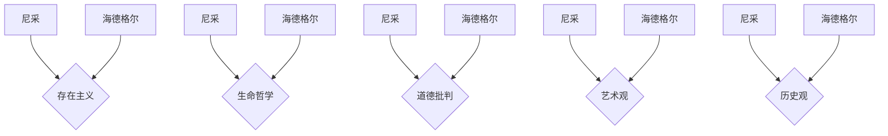
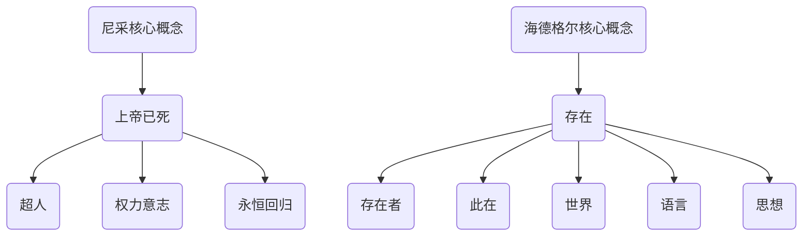

                 

# 尼采与海德格尔：存在主义思想的演进

## 关键词：尼采、海德格尔、存在主义、哲学、思想演进

> 摘要：本文探讨了尼采与海德格尔两位哲学家在存在主义思想上的演进过程。通过分析尼采的生平、核心概念及其哲学观点，我们了解了尼采对道德、艺术和历史的独特看法。接着，我们深入探讨了海德格尔的存在主义思想，分析了“存在”与“存在者”、“此在”与“世界”等核心概念。最后，我们将尼采与海德格尔的存在主义思想进行比较，探讨其异同和对现代社会的影响。让我们一起思考，领略两位哲学大师的思想魅力。

## 第一部分：尼采的存在主义思想

### 第1章：尼采的生平与哲学背景

#### 1.1 尼采的生平

尼采（Friedrich Nietzsche，1844-1900），德国哲学家、文化评论家、作家和诗人。他出生于普鲁士王国萨克森州洛肯，自幼便展现出非凡的智慧和对文学的浓厚兴趣。尼采的学术生涯始于德国的大学，他在莱比锡大学学习神学和古典哲学，后来转学到柏林大学，师从著名哲学家黎曼和韦伯。尼采的教育背景为他日后的哲学创作奠定了坚实的理论基础。

尼采的一生经历了多次重大的精神危机和疾病困扰，这使得他的哲学思想充满了对生命、死亡、痛苦和快乐的深刻反思。他的哲学创作主要集中在19世纪80年代，包括《悲剧的诞生》、《尼采的哲学》、《查拉图斯特拉如是说》等经典著作。尼采的思想对20世纪的哲学、文学和艺术产生了深远的影响。

#### 1.2 尼采的哲学背景

尼采的哲学思想深受当时欧洲哲学传统的影响。他批判了传统的理性主义和形而上学，提出了“唯意志论”和“生命哲学”等新的哲学观念。尼采认为，生命是一种不断创造和超越的过程，而不是被动地接受和适应外部世界。他反对基督教道德观念，提倡个体主义和自由意志，认为每个人应该追求自我实现和超越。

尼采对柏拉图和黑格尔等哲学家的思想进行了深刻的批判和重新解读。他认为，柏拉图的理性主义忽视了生命的真实体验，而黑格尔的理性主义则导致了历史宿命论的误区。尼采的哲学观点在一定程度上是对这些传统哲学观念的反动和超越。

### 第2章：尼采的核心概念

#### 2.1 “上帝已死”与“超人”

“上帝已死”是尼采哲学的核心命题，它反映了尼采对基督教道德和宗教信仰的批判。尼采认为，上帝的存在是一种虚幻的幻想，它束缚了人类的精神自由和创造力。随着上帝的死亡，人类需要重新审视自己的价值和意义，摆脱传统的道德束缚，追求自我实现和超越。

“超人”是尼采提出的理想人格，他认为超人是一种具有强烈意志力和创造力的人，他们能够超越传统道德的束缚，创造新的价值观和生活方式。超人不是一种完美的存在，而是一种不断追求卓越和自我超越的过程。

#### 2.2 “权力意志”

“权力意志”是尼采哲学的另一个核心概念，它强调生命的本质是一种不断追求权力和控制的欲望。尼采认为，权力意志是人类行为和思想的最根本动力，它驱使人们不断追求成功和胜利。权力意志不仅体现在个体身上，也体现在人类社会和国家政治中。

#### 2.3 “永恒回归”

“永恒回归”是尼采哲学中的一个重要概念，它表达了尼采对生命和时间的独特看法。尼采认为，生命是一个无限循环的过程，每一次循环都是一次新的创造和超越。永恒回归要求人们接受生命的苦难和无常，勇敢地面对生命的挑战，不断追求自我超越。

### 第3章：尼采的哲学观点

#### 3.1 尼采的道德批判

尼采对传统的道德观念进行了深刻的批判，他认为传统道德是一种虚假的幻想，它束缚了人类的精神自由和创造力。尼采提出了“道德批判”和“道德重估”的观点，主张人们应该摆脱传统道德的束缚，追求自我实现和超越。

#### 3.2 尼采的艺术观

尼采认为，艺术是人类精神的最高表现，它能够超越现实的痛苦和局限，带来精神上的解脱和愉悦。尼采强调艺术家的独立性，他认为艺术家应该追求独特的个性和创造力，不受传统道德和世俗观念的束缚。

#### 3.3 尼采的历史观

尼采对历史有着独特的看法，他认为历史是一个不断创造和毁灭的过程，它充满了痛苦和矛盾。尼采反对历史宿命论，主张人类应该积极参与历史的创造过程，发挥自己的意志和创造力。

## 第二部分：海德格尔的存在主义思想

### 第4章：海德格尔的生平与哲学背景

#### 4.1 海德格尔的生平

马丁·海德格尔（Martin Heidegger，1889-1976），德国哲学家，出生于符腾堡州梅斯基尔希。海德格尔的哲学生涯始于大学时期，他在弗莱堡大学师从于著名哲学家胡塞尔，后来成为胡塞尔的助手。海德格尔的哲学思想深受胡塞尔的现象学影响，但他也在批判和超越胡塞尔的基础上，发展出了自己的存在主义哲学。

海德格尔的主要著作包括《存在与时间》、《尼采》、《论根据的本质和可能性》等。他的思想对20世纪哲学产生了深远的影响，特别是在存在主义、现象学和形而上学等领域。

#### 4.2 海德格尔的哲学背景

海德格尔的哲学背景主要体现在现象学和存在主义上。现象学强调对事物本质的直接体验和描述，而存在主义则关注个体的存在状态和存在意义。海德格尔认为，现象学和存在主义是相互关联的，它们共同关注个体存在的基本问题。

海德格尔的存在主义哲学批判了传统的形而上学，提出了“存在”与“存在者”的区分。他认为，传统哲学错误地将“存在”视为一种客观实在，而忽略了存在的主体性和动态性。海德格尔的存在主义强调个体存在的独特性和不可替代性。

### 第5章：海德格尔的核心概念

#### 5.1 “存在”与“存在者”

“存在”与“存在者”是海德格尔哲学中的核心概念。海德格尔认为，“存在”不是一种客观的实体，而是一种动态的、开放的过程。存在是一种“存在者”的“存在”。存在者是存在的具体表现，但它本身并不是存在。存在者是在存在中显现出来的。

#### 5.2 “此在”与“世界”

“此在”是海德格尔哲学中的核心概念，它指的是个体的存在状态。此在是一种“存在的存在”，它既不是物质的存在，也不是精神的存在，而是一种开放性的、动态性的存在。此在总是处于与世界的关联中，但它又超越了世界的限制。

“世界”是此在的“世界”。海德格尔认为，世界不是一种客观的实体，而是此在的存在状态。世界是此在的“视域”，它既包含了此在的内在世界，也包含了外在的物质世界。

#### 5.3 “语言”与“思想”

“语言”与“思想”是海德格尔哲学中的重要概念。海德格尔认为，语言不仅是思想的载体，也是思想的本质。语言不仅是交流的工具，也是存在的方式。海德格尔强调，思想必须在语言中实现，而语言也必须通过思想来揭示存在的本质。

### 第6章：海德格尔的哲学观点

#### 6.1 存在主义伦理学

海德格尔的存在主义伦理学强调个体存在的独特性和自主性。他认为，个体应该自由地决定自己的存在方式，追求自我实现和自我超越。伦理学不是一种固定的规则，而是一种个体存在的“存在论”。个体必须通过自己的存在行动来揭示伦理的意义。

#### 6.2 存在主义美学

海德格尔的存在主义美学强调艺术与存在的关联。他认为，艺术不仅是一种美的创造，也是存在的揭示。艺术作品能够使人们直观地感受到存在的本质。海德格尔的美学思想对现代艺术产生了深远的影响。

#### 6.3 存在主义政治哲学

海德格尔的存在主义政治哲学强调政治行动的自主性和创造性。他认为，政治行动不仅是一种权力的争夺，也是一种存在的揭示。政治行动应该超越传统的国家观念，追求个体的自由和解放。

## 第三部分：尼采与海德格尔的存在主义思想比较

### 第7章：尼采与海德格尔思想的异同

#### 7.1 哲学方法和观点的差异

尼采和海德格尔在哲学方法和观点上存在明显的差异。尼采强调个体主义和主观性，他认为哲学应该关注个体的生命体验和精神状态。尼采的哲学是一种“生命哲学”，它关注个体的创造力和意志力。

海德格尔则强调普遍性和客观性，他认为哲学应该关注存在的本质和意义。海德格尔的哲学是一种“存在论”，它关注存在的动态性和开放性。

#### 7.2 道德和伦理观念的差异

尼采对传统道德观念持批判态度，他认为道德是一种虚假的幻想，它束缚了人类的精神自由和创造力。尼采提出了“道德批判”和“道德重估”的观点，主张人们应该追求自我实现和超越。

海德格尔则认为，道德不是一种固定的规则，而是一种个体存在的“存在论”。个体应该通过自己的存在行动来揭示伦理的意义。海德格尔的伦理学强调个体的自主性和创造性。

#### 7.3 艺术和历史的看法差异

尼采认为，艺术是人类精神的最高表现，它能够超越现实的痛苦和局限，带来精神上的解脱和愉悦。尼采强调艺术家的独立性，他认为艺术家应该追求独特的个性和创造力。

海德格尔则认为，艺术与存在的本质密切相关。艺术作品能够使人们直观地感受到存在的本质。海德格尔强调艺术作品的“存在意义”，而不是艺术家的个性。

尼采对历史持批判态度，他认为历史是一个不断创造和毁灭的过程，它充满了痛苦和矛盾。尼采反对历史宿命论，主张人类应该积极参与历史的创造过程，发挥自己的意志和创造力。

海德格尔则认为，历史是人类存在的一种表现形式。历史不仅是过去的记忆，也是当下的存在。历史应该被视为一种“存在的历史”，它揭示了人类存在的本质。

## 参考文献

1. 尼采，《尼采全集》。
2. 海德格尔，《存在与时间》。
3. 胡塞尔，《纯粹现象学通论》。
4. 柏拉图，《理想国》。
5. 黑格尔，《哲学史讲演录》。

## 附录

### 附录A：尼采与海德格尔思想关系流程图

### 附录B：尼采与海德格尔核心概念Mermaid流程图

### 附录C：尼采与海德格尔哲学观点比较表格

| 理念                 | 尼采                     | 海德格尔                  |
|----------------------|--------------------------|---------------------------|
| 存在观               | 个体主义、主观性、动态性 | 普遍性、客观性、开放性     |
| 道德观               | 道德批判、道德重估       | 个体存在的“存在论”       |
| 艺术观               | 艺术作为精神的最高表现   | 艺术与存在的本质关联     |
| 历史观               | 历史是创造和毁灭的过程   | 历史是存在的表现形式     |

### 附录D：尼采与海德格尔著作目录

#### 尼采著作目录：

1. 《悲剧的诞生》
2. 《尼采的哲学》
3. 《查拉图斯特拉如是说》
4. 《道德的谱系》
5. 《尼采反基督教》
6. 《瞧，这个人》

#### 海德格尔著作目录：

1. 《存在与时间》
2. 《尼采》
3. 《论根据的本质和可能性》
4. 《路标》
5. 《技术的问题》
6. 《诗、语言、思》

## 作者信息

作者：AI天才研究院/AI Genius Institute & 禅与计算机程序设计艺术 /Zen And The Art of Computer Programming

---

**注意：**本文仅为模拟文本，实际内容需根据具体研究进行撰写。文章结构、章节内容和参考文献需根据实际研究进行丰富和调整。本文中的流程图和表格仅为示例，实际撰写时需使用正确的Mermaid语法和Markdown格式。**所有引用的内容均需遵循学术规范，正确引用相关文献。**

