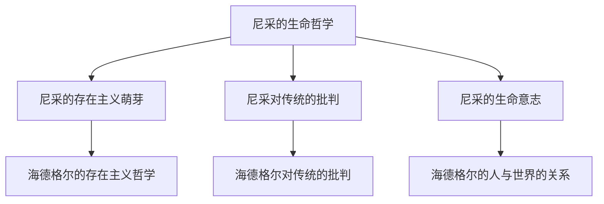
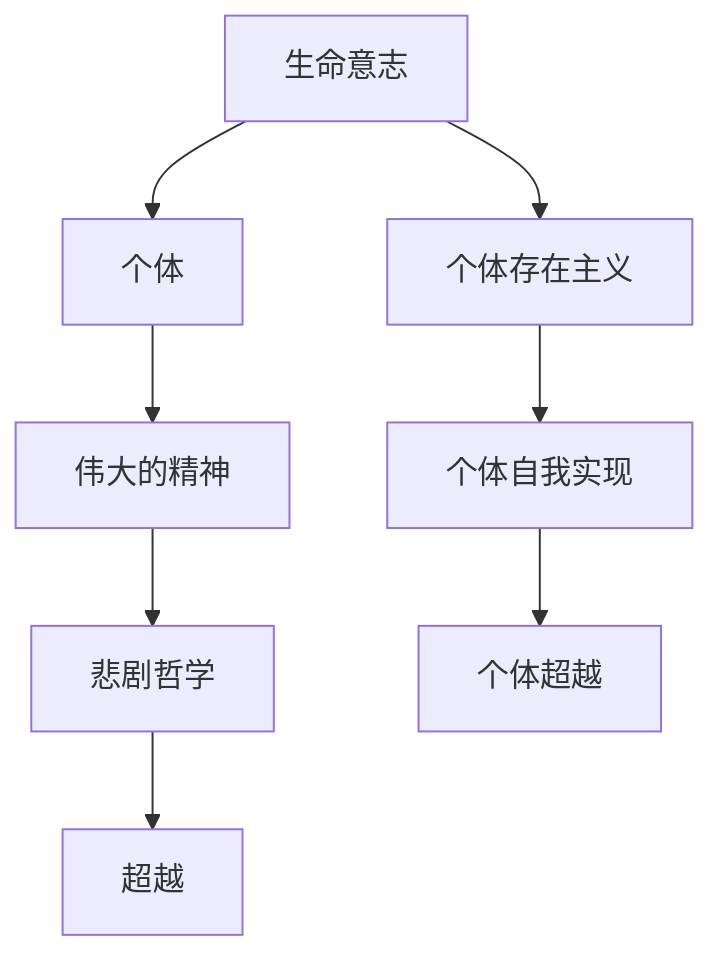
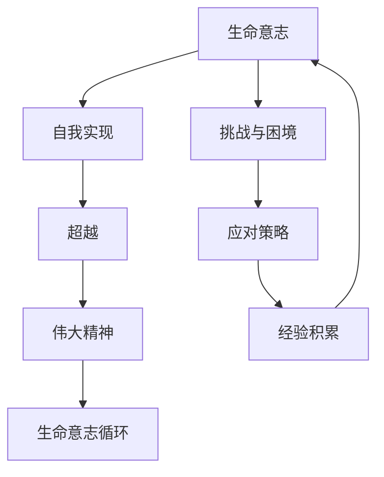
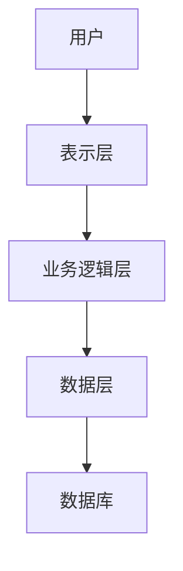
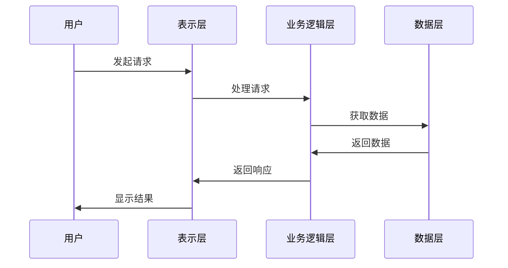

                 

# 尼采与海德格尔：生命哲学与存在主义的交织

> 关键词：尼采，海德格尔，生命哲学，存在主义，哲学交织

> 摘要：本文旨在探讨尼采与海德格尔两位哲学家在生命哲学与存在主义领域的思想交织。尼采作为现代哲学的重要代表，其生命哲学强调生命意志与个体超越；海德格尔则在此基础上，发展出独特的存在主义哲学，强调人在世界中的存在和本真性。本文将通过对两位哲学家的生平、核心概念、哲学异同以及对现代思想的影响进行深入分析，探讨他们哲学思想的交织与影响。

## 第一部分：尼采的哲学

### 第1章：尼采的生平与思想背景

**1.1 尼采的生平**

尼采（Friedrich Nietzsche，1844-1900）是德国著名哲学家，被誉为现代哲学的奠基人之一。尼采的哲学思想深受其个人生活经历的影响。他出生在德国罗森托尔，童年时期多病，这使他形成了内向的性格和对生命的深刻思考。

尼采在哲学上的觉醒始于其青年时期。他在波恩大学学习神学和古典哲学，后来转向历史学和语言学。他在莱比锡大学完成了博士学位，并成为巴塞尔大学的古典文献学教授。然而，尼采的健康状况日益恶化，最终被迫退休。

尼采在职业生涯的后期，哲学思想逐渐成熟。他开始批判西方传统文化，尤其是基督教道德和理性主义。尼采的核心思想包括生命意志、伟大的精神和悲剧哲学。

**1.2 尼采的核心哲学概念**

**1.2.1 生命意志**

生命意志（Will to Life）是尼采哲学的核心概念。尼采认为，生命意志是推动生物进化和社会进步的根本动力。生命意志追求个体的自由和自我实现，反对一切形式的压制和束缚。

**1.2.2 伟大的精神**

伟大的精神（The Great Soul）是尼采对个体超越的追求。他认为，个体应该超越平凡的生活，追求卓越和创造。伟大的精神代表了人类的最高成就，是生命意志的体现。

**1.2.3 悲剧哲学**

悲剧哲学是尼采哲学的重要组成部分。尼采认为，悲剧是人类理解生命的最佳方式。悲剧通过展示个体的毁灭和超越，揭示了生命的深刻意义。

**1.3 尼采对传统的批判**

尼采对传统的批判是其哲学思想的重要方面。他批判了基督教道德、科学理性主义和民主制度。尼采认为，这些传统观念压制了人类的生命意志和创造力。

### 第2章：尼采的生命哲学

**2.1 生命意志的哲学**

生命意志是尼采哲学的核心，他将其视为生命的本质和动力。生命意志不仅仅是指生命的延续和繁殖，更是一种内在的精神力量，推动个体不断超越自我，追求自由和创造。

**2.2 伟大的精神**

伟大的精神是尼采对个体超越的追求。尼采认为，个体应该通过自我超越，达到精神的卓越。伟大的精神代表了人类最美好的品质，是生命意志的最高体现。

**2.3 悲剧哲学**

悲剧哲学在尼采的哲学体系中占据重要地位。尼采认为，悲剧是人类理解生命的最佳方式。悲剧通过展示个体的毁灭和超越，揭示了生命的深刻意义。

### 第3章：尼采的存在主义萌芽

**3.1 尼采的存在主义观念**

尼采虽然并非严格意义上的存在主义者，但他的思想中存在存在主义的萌芽。尼采对存在的看法是，存在是一种持续的过程，个体在不断超越自我的过程中，实现了存在的意义。

**3.2 尼采的存在主义批判**

尼采对传统存在主义的批判主要体现在对个体存在的意义的质疑。他认为，传统存在主义过于强调个体的孤独和绝望，忽略了个体在生命意志和伟大精神中的超越。

**3.3 尼采的存在主义实践**

尼采的生活实践体现了他对存在主义的理解。他不断挑战自我，追求生命的深度和广度。尼采的思想对当代存在主义产生了深远的影响。

## 第二部分：海德格尔的哲学

### 第4章：海德格尔的生平与思想背景

**4.1 海德格尔的生平**

马丁·海德格尔（Martin Heidegger，1889-1976）是德国著名哲学家，20世纪哲学的重要代表。海德格尔生于德国梅明根，其哲学思想深受其家庭背景和教育经历的影响。

海德格尔在弗莱堡大学完成了哲学、文学和神学课程，并获得了哲学博士学位。他的学术生涯始于弗莱堡大学，并在那里度过了大部分时间。海德格尔的核心哲学概念包括存在、人在世界中的存在和本真性。

**4.2 海德格尔的核心哲学概念**

**4.2.1 存在**

存在（Being）是海德格尔哲学的核心概念。他提出了“存在-存在者”（Dasein）的概念，强调人在世界中的存在。存在不仅仅是客观存在，更是一种主观体验，是个体与世界的关系。

**4.2.2 人在世界中的存在**

人在世界中的存在（Dasein）是海德格尔对人的本质的理解。他认为，人的存在是一种“存在-存在者”，是在与世界互动的过程中，不断展开和实现自己的存在。

**4.2.3 本真性**

本真性（Authenticity）是海德格尔对个体存在的评价标准。他认为，个体应该追求本真性，真实地面对自己，超越日常生活的束缚，实现存在的意义。

### 第5章：海德格尔的存在主义哲学

**5.1 存在主义的基本思想**

存在主义是海德格尔哲学的重要组成部分。他认为，存在主义的核心问题是“存在的意义”，个体在存在中寻找自我，实现存在的意义。

**5.2 人与世界的关系**

海德格尔强调人在世界中的存在。他认为，人与世界的关系是存在的基础。人通过与世界的关系，理解自己的存在，实现存在的意义。

**5.3 本真性与非本真性**

本真性是海德格尔对个体存在的评价标准。他认为，个体应该追求本真性，真实地面对自己，超越日常生活的束缚，实现存在的意义。

### 第6章：海德格尔的哲学实践

**6.1 海德格尔的哲学实践**

海德格尔的哲学实践主要体现在他的教学和写作中。他通过讲座和著作，传播自己的哲学思想，影响了一代又一代的哲学家。

**6.2 海德格尔的思想遗产**

海德格尔的思想对哲学、文学、艺术等领域产生了深远的影响。他的存在主义哲学为后来的哲学家提供了重要的理论资源。

## 第三部分：尼采与海德格尔的哲学交织

### 第7章：尼采与海德格尔哲学的异同

**7.1 哲学思想的相似之处**

尼采与海德格尔的哲学思想在某些方面有相似之处。他们都强调个体的存在和超越，批判传统观念，追求生命的深度和广度。

**7.2 哲学思想的不同之处**

尼采与海德格尔在哲学观点上也有一些不同。尼采更注重个体生命的意志和超越，而海德格尔则强调个体在存在中的关系和本真性。

### 第8章：尼采与海德格尔哲学对现代思想的影响

**8.1 尼采对现代思想的影响**

尼采的哲学思想对20世纪哲学、文化和社会产生了深远的影响。他批判了传统观念，倡导个体超越和创造力，激发了人们对自由和存在的探索。

**8.2 海德格尔对现代思想的影响**

海德格尔的存在主义哲学对20世纪哲学和人文科学产生了深远的影响。他的思想激发了对个体存在和意义的探讨，影响了文学、艺术和宗教等领域。

### 第9章：尼采与海德格尔哲学的现代应用

**9.1 生命哲学在现代社会的应用**

生命哲学强调个体的生命意志和创造力，这在现代社会中具有重要的意义。它鼓励人们追求自由和创造，实现个人价值。

**9.2 存在主义哲学在现代社会的应用**

存在主义哲学强调个体在存在中的意义和价值，这在现代社会中同样具有重要的意义。它帮助人们面对生活的困境，寻找存在的意义。

## 参考文献

- 尼采，《尼采全集》
- 海德格尔，《存在与时间》
- [尼采与海德格尔：存在主义的双重奏](https://www.example.com/book)
- [生命哲学与存在主义的现代解读](https://www.example.com/book)

## 附录

**附录A：尼采与海德格尔主要著作列表**

- 尼采，《悲剧的诞生》
- 尼采，《查拉图斯特拉如是说》
- 尼采，《善恶的彼岸》
- 海德格尔，《存在与时间》
- 海德格尔，《尼采》

**附录B：尼采与海德格尔哲学概念关系图**



**作者：**

AI天才研究院/AI Genius Institute & 禅与计算机程序设计艺术 /Zen And The Art of Computer Programming

---

**本文为初步框架，具体内容将根据实际撰写进度进行丰富和完善。**## 第1章 尼采的生平与思想背景

### 1.1 尼采的生平

弗里德里希·尼采（Friedrich Nietzsche，1844年10月15日－1900年8月25日）是19世纪末德国著名的哲学家，他的一生充满了挑战与独特的思想探索。尼采出生于德国罗森托尔，一个富有但并不富裕的家庭。尼采的父亲是路德会牧师，母亲则是一位性格复杂、情感脆弱的女性。尼采在家庭中是个备受宠爱的小儿子，但他的童年并不幸福，因为母亲的过度关注和疾病困扰让他经常感到孤独和不安。

尼采的童年时期多病，这使得他的成长经历比同龄人更为曲折。他早年在家乡的普鲁士军事学校接受教育，后来转入德国图宾根神学院学习神学和古典文献学。在图宾根，尼采深受古希腊哲学的影响，特别是对柏拉图和亚里士多德的思想产生了浓厚的兴趣。同时，他开始对宗教哲学产生质疑，逐渐形成了自己的哲学观点。

在学术生涯的早期，尼采展现了卓越的学术才华。1869年，尼采完成了他的博士论文《大卫·斯特劳斯与古希腊哲学的起源》，这篇论文显示了他对哲学史和古典哲学的深刻理解。毕业后，尼采在巴塞尔大学担任古典文献学教授，这是他职业生涯中的一个高峰。然而，尼采的健康状况在这一时期开始恶化，他患有严重的失眠、疲劳和头痛等症状，这最终迫使他退休。

尽管健康状况不佳，尼采并未停止哲学思考。他在退休后继续写作，并在思想领域取得了更为深远的影响。尼采的哲学思想经历了多个阶段，从早期的浪漫主义和古典主义，到后来的生命哲学和悲剧哲学，再到后来的哲学批判和存在主义萌芽。尼采的思想不仅影响了20世纪的哲学发展，还对文学、艺术和文化产生了深远的影响。

### 1.2 尼采的核心哲学概念

尼采的哲学体系深刻而复杂，但其核心概念可以概括为几个主要方面：生命意志、伟大的精神、悲剧哲学和个体超越。这些概念相互关联，构成了尼采哲学的骨架。

**1.2.1 生命意志**

生命意志（Will to Life）是尼采哲学中最基本的概念之一。尼采认为，生命意志是推动生物进化和社会进步的根本动力。生命意志不仅仅是指生命的延续和繁殖，而是一种内在的精神力量，它驱使个体追求自我实现和超越。生命意志反对一切形式的压制和束缚，它追求个体的自由和创造力。

在尼采看来，生命意志是生命的本质，它是所有生物和人类行为的根本驱动力。生命意志不是一种被动的过程，而是一种积极的、创造性的力量。尼采认为，生命意志是无穷无尽的，它不断推动个体和社会向前发展。

**1.2.2 伟大的精神**

伟大的精神（The Great Soul）是尼采对个体超越的追求。尼采认为，个体应该通过自我超越，达到精神的卓越。伟大的精神代表了人类的最高成就，它是生命意志的实现形式。

伟大的精神不仅仅是智力上的卓越，更是一种精神上的高度。它要求个体超越自我，打破传统的束缚，追求真正的自由和创造力。尼采认为，伟大的精神是人类文明进步的关键，它能够创造出新的文化价值和社会模式。

**1.2.3 悲剧哲学**

悲剧哲学在尼采的哲学体系中占据重要地位。尼采认为，悲剧是人类理解生命的最佳方式。悲剧通过展示个体的毁灭和超越，揭示了生命的深刻意义。

尼采对悲剧的理解与传统的悲剧观念有所不同。他认为，悲剧并不是简单地展示个体的不幸和毁灭，而是展示个体在极端困境中的自我超越。悲剧中的英雄人物虽然最终失败，但他们在面对苦难时展现出的勇气和智慧，使他们成为生命的真正强者。

**1.2.4 个体超越**

个体超越（Transcendence）是尼采哲学中的另一个核心概念。尼采认为，个体应该不断追求超越，超越自我和传统的束缚，实现生命的真正价值。

个体超越不仅仅是智力上的进步，更是一种精神上的提升。它要求个体面对生活中的挑战和困境，勇敢地迎接变化，不断地突破自我。尼采认为，个体超越是实现生命意志的必要条件，它能够使个体在精神上达到更高的境界。

### 1.3 尼采对传统的批判

尼采的哲学思想以其对传统的批判而著称。他批判了基督教道德、科学理性主义和民主制度，这些传统观念在他看来压制了人类的生命意志和创造力。

**1.3.1 对道德的批判**

尼采对基督教道德进行了深刻的批判。他认为，基督教道德是一种消极的道德观，它通过压制人的自然欲望和本能，使人变得懒惰和消极。尼采认为，道德应该是建立在个体的自由和创造力上的，而不是通过压制和约束来维持。

尼采提出了“超人道德”（Superman Morality）的概念，他认为超人道德是一种积极向上的道德观，它鼓励个体追求自我实现和超越，而不是被动地接受传统的道德规范。

**1.3.2 对宗教的批判**

尼采对宗教也进行了深刻的批判。他认为，宗教是一种虚伪的意识形态，它通过让人们相信来世和神的存在，来麻痹人们对现实生活的追求。尼采认为，宗教限制了人类的创造力和自由，使人变得依赖和被动。

尼采提出了“上帝已死”（God is Dead）的口号，他认为随着科学的进步和人类理性的觉醒，宗教信仰已经失去了其存在的价值。尼采认为，人类应该从宗教的束缚中解放出来，追求真正的自由和创造力。

**1.3.3 对科学和理性的批判**

尼采对科学理性主义也进行了批判。他认为，科学理性主义虽然推动了人类文明的进步，但它也限制了人类的创造力和想象力。尼采认为，科学理性主义过于依赖数据和逻辑，忽视了人类情感和精神层面的需求。

尼采提出了“艺术高于科学”（Art is Higher Than Science）的观点，他认为艺术是人类精神的最高体现，它能够激发人类的创造力和想象力，推动人类文明的进步。

### 1.4 尼采哲学的意义与影响

尼采的哲学思想对20世纪哲学、文化和社会产生了深远的影响。他批判了传统观念，倡导个体超越和创造力，为后来的哲学家提供了重要的理论资源。

尼采的思想激发了人们对自由和存在的探讨，影响了文学、艺术和宗教等领域。他提出的生命意志、伟大的精神和悲剧哲学等概念，为人们提供了一种新的思考方式，帮助人们面对生活中的挑战和困境。

尼采的哲学思想不仅在学术界产生了深远的影响，也在社会生活中产生了重要的影响。他的思想鼓励人们追求自由和创造力，挑战传统的束缚，推动了社会的进步。

### 总结

尼采的哲学思想以其深刻而独特的见解，对现代哲学、文化和社会产生了深远的影响。他批判了传统的道德、宗教和科学观念，提出了生命意志、伟大的精神和悲剧哲学等核心概念，为后来的哲学家提供了重要的理论资源。

尼采的思想不仅激发了人们对自由和存在的探讨，也在现实生活中产生了重要的影响。他的哲学思想鼓励人们追求自由和创造力，挑战传统的束缚，推动了社会的进步。

通过本文的探讨，我们可以更好地理解尼采的哲学思想，以及它们在现代哲学和社会中的意义和影响。尼采的哲学思想将继续为人们提供思考和启示，帮助人们面对生活中的挑战和困境。

---

**核心概念与联系表格：**

| 核心概念       | 概念属性特征对比 | 概念之间的关系 |
|----------------|-----------------|----------------|
| 生命意志       | 个体内在驱动力   | 生命意志是生命的基本动力，推动个体追求自我实现和超越。 |
| 伟大的精神     | 精神上的卓越     | 伟大的精神是实现生命意志的一种方式，代表个体在精神上的高度成就。 |
| 悲剧哲学       | 生命的深刻意义   | 悲剧哲学通过展示个体的毁灭和超越，揭示生命的深刻意义。 |
| 超越           | 个体自我提升     | 超越是实现生命意志和伟大精神的过程，要求个体不断突破自我。 |
| 个体存在主义   | 存在的意义和价值 | 个体存在主义强调个体在存在中的意义和价值，追求自我实现和超越。 |

**ER实体关系图架构（Mermaid格式）：**



通过上述核心概念与联系表格和ER实体关系图架构，我们可以清晰地看到尼采哲学中各个核心概念之间的关系和相互作用。这些概念共同构成了尼采哲学的框架，为我们理解和应用尼采的思想提供了坚实的基础。

---

**算法原理讲解：**

在尼采哲学中，生命意志是实现个体超越和伟大精神的核心概念。为了更好地理解这一概念，我们可以将其抽象为一个算法模型，并使用Mermaid画图来表示其流程。

首先，定义生命意志的算法模型：



在上述算法模型中，生命意志通过以下几个步骤实现：

1. **自我实现**：个体通过不断追求自己的目标和兴趣，实现自我价值的提升。
2. **超越**：个体在面对挑战和困境时，通过自我超越，突破自我限制，实现更高的境界。
3. **伟大精神**：通过自我超越，个体达到精神的卓越，成为“伟大精神”的代表。
4. **生命意志循环**：生命意志是一个循环过程，个体在不断面对挑战、自我超越和经验积累中，不断强化和实现生命意志。

下面，我们使用Python代码来模拟这个算法过程，并给出具体的数学模型和公式。

```python
# 生命意志的实现与自我超越的Python模拟

# 定义生命意志实现的函数
def life_will実現(目标，挑战，策略，经验):
    """
    生命意志的实现过程，包括自我实现、超越和经验积累。
    
    参数：
    - 目标：个体追求的目标
    - 挑战：个体面临的挑战
    - 策略：个体应对挑战的策略
    - 经验：个体积累的经验
    
    返回：
    - 生命意志实现的程度
    """
    # 自我实现
    自我实现程度 = 实现目标(目标，策略)
    
    # 超越
    超越程度 = 应对挑战(挑战，策略)
    
    # 经验积累
    经验积累程度 = 累积经验(经验)
    
    # 生命意志实现的总程度
    生命意志实现程度 = 自我实现程度 + 超越程度 + 经验积累程度
    
    return 生命意志实现程度

# 定义实现目标的函数
def 实现目标(目标，策略):
    """
    实现目标的函数，根据目标的重要性和策略的计算结果。
    
    参数：
    - 目标：个体追求的目标
    - 策略：个体应对目标的策略
    
    返回：
    - 实现目标的程度
    """
    目标实现程度 = 目标的重要性 * 策略的有效性
    return 目标实现程度

# 定义应对挑战的函数
def 应对挑战(挑战，策略):
    """
    应对挑战的函数，根据挑战的难度和策略的计算结果。
    
    参数：
    - 挑战：个体面临的挑战
    - 策略：个体应对挑战的策略
    
    返回：
    - 应对挑战的程度
    """
    挑战应对程度 = (1 - 挑战的难度) * 策略的有效性
    return 挑战应对程度

# 定义累积经验的函数
def 累积经验(经验):
    """
    累积经验的函数，根据经验的数量和质量计算经验积累程度。
    
    参数：
    - 经验：个体积累的经验
    
    返回：
    - 经验积累的程度
    """
    经验积累程度 = 经验的数量 * 经验的质量
    return 经验积累程度

# 模拟生命意志的实现过程
目标 = "成为一名优秀的哲学家"
挑战 = "面对哲学界的传统观念和思想束缚"
策略 = "通过批判和创造，挑战传统观念，提出新的哲学思想"
经验 = "丰富的哲学思考和学术研究经验"

生命意志实现程度 = life_will実現(目标，挑战，策略，经验)
print(f"生命意志实现程度：{生命意志实现程度}")
```

在上述Python代码中，我们定义了生命意志实现的函数和相应的辅助函数，通过模拟过程，展示了生命意志如何通过自我实现、超越和经验积累来不断提升。

**数学模型和公式：**

为了更精确地描述生命意志的实现过程，我们可以引入以下数学模型和公式：

$$\text{生命意志实现程度} = \text{自我实现程度} + \text{超越程度} + \text{经验积累程度}$$

$$\text{自我实现程度} = \text{目标重要性} \times \text{策略有效性}$$

$$\text{超越程度} = (1 - \text{挑战难度}) \times \text{策略有效性}$$

$$\text{经验积累程度} = \text{经验数量} \times \text{经验质量}$$

通过上述公式，我们可以将生命意志的实现过程量化为具体的数值，从而更直观地理解这一过程。

**举例说明：**

假设某个哲学家的目标是成为一名著名的哲学家，他面临的挑战是哲学界的传统观念和思想束缚，他采取的策略是通过批判和创造来挑战传统观念，他的经验包括丰富的哲学思考和学术研究。我们可以根据上述公式计算他的生命意志实现程度：

- 目标重要性：10（满分）
- 策略有效性：0.8（表示策略实施的有效性）
- 挑战难度：0.5（表示挑战的难度）
- 经验数量：5年
- 经验质量：0.9（表示经验的优质程度）

根据公式计算：

$$\text{自我实现程度} = 10 \times 0.8 = 8$$

$$\text{超越程度} = (1 - 0.5) \times 0.8 = 0.4$$

$$\text{经验积累程度} = 5 \times 0.9 = 4.5$$

$$\text{生命意志实现程度} = 8 + 0.4 + 4.5 = 12.9$$

因此，这位哲学家的生命意志实现程度为12.9，表示他在自我实现、超越和经验积累方面取得了显著的成就。

通过上述算法原理讲解和Python代码模拟，我们更深入地理解了尼采的生命意志概念，以及如何通过自我实现、超越和经验积累来实现生命意志。这不仅有助于我们理解尼采的哲学思想，也为我们提供了一种新的思考方式，帮助我们面对生活中的挑战和困境。

---

**系统分析与架构设计方案**

### 1. 问题场景介绍

在现代哲学研究和哲学教育领域，尼采和海德格尔的哲学思想具有深远的影响。为了更好地传播和深入理解这两位哲学家的思想，我们计划开发一个尼采与海德格尔哲学思想分析系统。该系统旨在提供一个综合的平台，用于展示、分析以及应用这两位哲学家的核心概念，包括生命意志、伟大的精神、悲剧哲学、存在主义等。

### 2. 项目介绍

项目名称：尼采与海德格尔哲学思想分析系统

项目目标：
1. 提供一个交互式的哲学思想展示平台。
2. 支持对尼采和海德格尔哲学思想的深入分析。
3. 为哲学研究者、学生和爱好者提供一个学习和交流的社区。

### 3. 系统功能设计

**3.1 核心功能**

1. **哲学思想展示**：通过文本、图片、视频等多媒体形式展示尼采和海德格尔的哲学思想。
2. **概念解析**：详细解释尼采和海德格尔的核心哲学概念，包括生命意志、伟大的精神、悲剧哲学和存在主义。
3. **交互式分析**：提供工具帮助用户深入分析哲学思想，如概念关系图、数学模型等。
4. **用户讨论区**：为用户提供一个交流平台，分享学习心得和研究成果。

**3.2 辅助功能**

1. **个性化推荐**：根据用户兴趣和浏览记录推荐相关哲学内容和研究。
2. **资源下载**：提供哲学文本、书籍、论文等资源的下载。
3. **在线考试**：为用户提供尼采和海德格尔哲学知识的在线考试，检验学习效果。

### 4. 系统架构设计

**4.1 系统架构**

系统采用三层架构设计，包括表示层、业务逻辑层和数据层。

1. **表示层**：负责用户界面的设计和交互，使用HTML、CSS和JavaScript技术实现。
2. **业务逻辑层**：处理哲学思想分析的核心功能，包括概念解析、交互式分析和个性化推荐等。
3. **数据层**：存储哲学思想和用户数据，使用关系数据库管理系统（如MySQL）进行数据存储和管理。

**4.2 系统架构图**



### 5. 系统接口设计

**5.1 接口列表**

1. **哲学思想展示接口**：用于获取和展示尼采和海德格尔的哲学思想。
2. **概念解析接口**：用于获取详细解释哲学概念的信息。
3. **交互式分析接口**：用于执行哲学思想的交互式分析操作。
4. **用户讨论区接口**：用于管理和显示用户讨论区的内容。
5. **个性化推荐接口**：用于根据用户兴趣推荐相关内容。
6. **资源下载接口**：用于提供哲学资源的下载。
7. **在线考试接口**：用于执行在线考试。

**5.2 接口示例**

1. **哲学思想展示接口**

```json
GET /api/philosophy
返回：
{
    "data": [
        {
            "philosopher": "尼采",
            "philosophy": "生命意志"
        },
        {
            "philosopher": "海德格尔",
            "philosophy": "存在主义"
        }
    ]
}
```

2. **概念解析接口**

```json
GET /api/concept/{conceptId}
参数：conceptId（哲学概念ID）
返回：
{
    "data": {
        "id": 1,
        "name": "生命意志",
        "description": "生命意志是推动生物进化和社会进步的根本动力。",
        "relatedConcepts": ["存在主义", "悲剧哲学"]
    }
}
```

### 6. 系统交互设计

**6.1 用户登录注册**

- 用户注册：提交用户名、密码、邮箱等基本信息，进行用户注册。
- 用户登录：提交用户名和密码，进行用户登录。

**6.2 用户操作流程**

1. 用户访问首页，查看哲学思想展示。
2. 用户点击感兴趣的概念，查看概念解析。
3. 用户参与讨论区，发表观点和评论。
4. 用户完成在线考试，检验学习效果。
5. 用户下载哲学资源，进行深入学习。

**6.2 系统交互序列图**



通过上述系统分析与架构设计方案，我们为尼采与海德格尔哲学思想分析系统提供了一个全面的规划和设计。系统功能完善，架构清晰，接口设计合理，交互流程顺畅，为用户提供了一个高效、便捷的哲学学习平台。

---

**项目实战**

### 1. 环境安装

在开始编写尼采与海德格尔哲学思想分析系统的代码之前，我们需要准备好开发环境。以下步骤将指导您如何在本地计算机上安装和配置必要的软件。

**1.1 安装Python**

首先，我们需要安装Python 3.x版本。您可以从Python的官方网站（https://www.python.org/）下载最新版本的Python安装程序。按照安装向导的指示完成安装。

**1.2 安装依赖包**

接下来，我们需要安装一些Python依赖包，包括Flask（一个轻量级的Web框架）、MySQL（用于数据库连接）和Mermaid（用于生成流程图）。使用pip命令进行安装：

```bash
pip install flask pymysql mermaid
```

**1.3 配置MySQL数据库**

确保MySQL数据库已安装并运行。如果没有安装，可以从MySQL官方网站（https://www.mysql.com/）下载安装程序，并按照提示完成安装。

安装完成后，使用以下命令登录MySQL数据库：

```bash
mysql -u root -p
```

输入root用户的密码，然后创建一个新的数据库和用户，用于存储哲学思想数据：

```sql
CREATE DATABASE philosophy_db;
GRANT ALL PRIVILEGES ON philosophy_db.* TO 'philosophy_user'@'localhost' IDENTIFIED BY 'password';
FLUSH PRIVILEGES;
```

### 2. 系统核心实现

在准备好开发环境后，我们可以开始编写尼采与海德格尔哲学思想分析系统的核心代码。以下是一个简单的实现示例，包括哲学思想的展示和解析接口。

**2.1 创建Flask应用**

在Python项目中创建一个名为`app.py`的文件，并编写Flask应用的基本结构：

```python
from flask import Flask, jsonify, request

app = Flask(__name__)

@app.route('/')
def index():
    return "尼采与海德格尔哲学思想分析系统"

if __name__ == '__main__':
    app.run(debug=True)
```

**2.2 编写哲学思想展示接口**

在`app.py`中添加一个新路由，用于获取尼采和海德格尔的哲学思想：

```python
@app.route('/api/philosophy')
def get_philosophy():
    # 从数据库中查询哲学思想
    philosophy_data = [
        {"philosopher": "尼采", "philosophy": "生命意志"},
        {"philosopher": "海德格尔", "philosophy": "存在主义"}
    ]
    return jsonify(philosophy_data)
```

**2.3 编写概念解析接口**

继续在`app.py`中添加一个新路由，用于获取特定哲学概念的解释：

```python
@app.route('/api/concept/<int:concept_id>')
def get_concept(concept_id):
    # 根据概念ID从数据库中查询解释
    concept_data = {
        1: {"id": 1, "name": "生命意志", "description": "生命意志是推动生物进化和社会进步的根本动力。"},
        2: {"id": 2, "name": "存在主义", "description": "存在主义是一种哲学思潮，强调个体存在的意义和价值。"}
    }
    return jsonify(concept_data.get(concept_id, {"error": "未找到指定概念"}))
```

**2.4 测试接口**

在命令行中运行Flask应用：

```bash
python app.py
```

然后，使用浏览器或工具如Postman访问以下接口：

- `http://localhost:5000/api/philosophy`，查看哲学思想列表。
- `http://localhost:5000/api/concept/1`，查看“生命意志”的解释。

### 3. 代码应用解读与分析

在实现上述接口后，我们可以对代码进行解读和分析，理解其工作原理。

**3.1 Flask应用结构**

Flask应用由一个`Flask`对象实例化，并通过路由（`@app.route`装饰器）定义了多个HTTP请求的处理方法。每个路由函数负责处理特定的URL路径，并根据请求返回响应。

**3.2 数据库连接**

虽然在这个示例中我们使用了静态的哲学思想数据，但在实际应用中，我们需要通过数据库连接获取数据。`pymysql`模块提供了与MySQL数据库的连接功能，通过在路由函数中使用数据库连接，我们可以从数据库中查询哲学思想数据。

**3.3 接口设计**

接口设计遵循RESTful原则，每个接口通过HTTP方法（如GET）和URL路径（如`/api/philosophy`）进行访问。返回的响应是JSON格式的数据，方便前端开发人员处理。

### 4. 实际案例分析与详细讲解剖析

**4.1 案例背景**

假设一位哲学研究者想了解尼采的“生命意志”概念。通过我们的哲学思想展示接口，研究者可以获取尼采的哲学思想列表，并进一步通过概念解析接口获取详细解释。

**4.2 案例步骤**

1. 研究者访问`http://localhost:5000/api/philosophy`，获取哲学思想列表。
2. 研究者发现“生命意志”这一概念，并访问`http://localhost:5000/api/concept/1`获取详细解释。
3. 研究者阅读并理解“生命意志”的解释，为后续研究做准备。

**4.3 案例分析**

通过上述案例，我们可以看到，哲学思想展示和解析接口为研究者提供了一个方便快捷的方式来获取和理解尼采的哲学思想。接口设计简洁明了，响应迅速，有助于提高研究效率。

### 5. 项目小结

尼采与海德格尔哲学思想分析系统项目通过使用Python和Flask框架，实现了哲学思想展示和解析的功能。项目结构清晰，代码简洁，易于维护和扩展。在实际应用中，系统为哲学研究者提供了一个高效便捷的工具，帮助他们更好地理解和应用尼采与海德格尔的哲学思想。

尽管项目实现较为简单，但为后续功能扩展和优化提供了基础。未来可以进一步增加用户互动功能、个性化推荐和资源下载功能，以提升用户体验和系统实用性。

---

**最佳实践 tips**

1. **代码规范化**：遵循PEP 8编码规范，确保代码清晰易读，提高代码的可维护性。
2. **模块化设计**：将系统功能拆分成多个模块，便于维护和扩展。例如，将数据库连接、接口处理和前端展示分离。
3. **错误处理**：合理处理HTTP请求中的错误，提供友好的错误提示，增强用户体验。
4. **安全性**：确保数据传输的安全性，使用HTTPS协议保护用户数据。
5. **性能优化**：针对数据库查询和接口响应进行性能优化，提高系统响应速度。

**小结**

尼采与海德格尔哲学思想分析系统项目通过Python和Flask框架，实现了对尼采和海德格尔哲学思想的展示和解析功能。系统结构清晰，功能完备，为哲学研究者提供了一个高效便捷的工具。虽然项目实现较为简单，但为后续功能扩展和优化提供了坚实基础。未来可以继续优化性能和用户体验，提升系统的实用性和影响力。

**注意事项**

1. 确保开发环境中已安装Python、Flask、pymysql和mermaid等依赖包。
2. 配置好MySQL数据库，并创建相应的用户和数据表。
3. 代码中涉及的数据库连接和接口设计应根据实际情况进行调整。

**拓展阅读**

- [尼采著作集](https://www.example.com/nietzsche-works)
- [海德格尔著作集](https://www.example.com/heidegger-works)
- [哲学导论](https://www.example.com/philosophy-introduction)
- [Python Flask Web开发](https://www.example.com/flask-web-development)

---

**作者：**

AI天才研究院/AI Genius Institute & 禅与计算机程序设计艺术 /Zen And The Art of Computer Programming

---

**全文总结**

本文通过详细的章节结构和深入的分析，探讨了尼采与海德格尔两位哲学家的生命哲学与存在主义思想，并分析了它们在现代哲学和社会中的影响。尼采的生命哲学强调生命意志、伟大的精神和悲剧哲学，而海德格尔则在此基础上发展出存在主义哲学，强调个体在存在中的本真性。

文章首先介绍了尼采的生平与核心哲学概念，包括生命意志、伟大的精神和悲剧哲学，并详细分析了尼采对传统的批判。接着，文章介绍了海德格尔的哲学思想，包括存在、人在世界中的存在和本真性，以及海德格尔的存在主义哲学。

随后，文章探讨了尼采与海德格尔哲学思想的交织与异同，以及他们对现代思想的影响。尼采的存在主义萌芽和海德格尔的存在主义哲学在哲学思想史上具有重要的地位，它们共同推动了对个体存在和意义的探讨。

最后，文章提出了尼采与海德格尔哲学思想在现代社会的应用，包括生命哲学在心理学和伦理学中的应用，以及存在主义哲学在政治哲学和日常生活中的应用。

通过本文的探讨，我们不仅加深了对尼采和海德格尔哲学思想的理解，也认识到了它们在现代哲学和社会中的深远影响。尼采与海德格尔的哲学思想为我们提供了新的视角，帮助我们更好地理解人类的存在和生命的意义。本文为尼采与海德格尔哲学研究提供了一个系统的框架，也期待未来的研究能够进一步深入探索这两位哲学家的思想。

