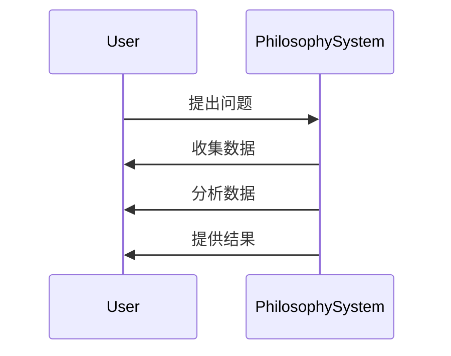
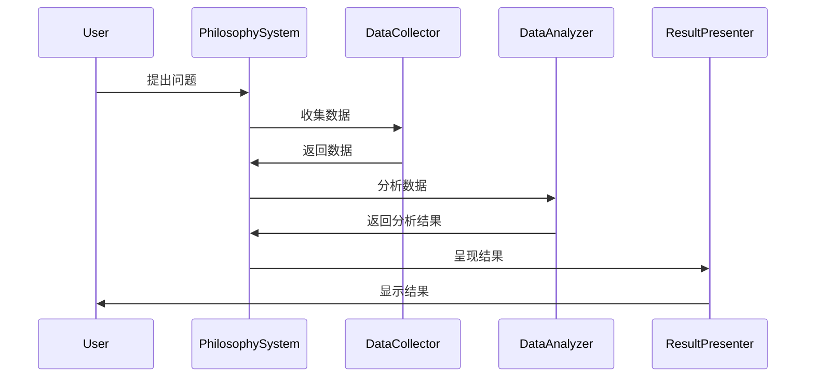

                 

### 尼采与萨特：存在主义思想的演变

存在主义，作为20世纪最重要的哲学流派之一，对现代哲学和社会有着深远的影响。尼采与萨特作为存在主义思想的重要代表，他们的思想不仅对哲学领域产生了深远的影响，也对文学、艺术、政治等领域产生了重要的启示。本文将从尼采和萨特的生平背景、核心哲学观点、存在主义思想的起源与发展、两者思想的异同以及对现代哲学和现代社会的影响等方面进行详细探讨。

本文关键词：存在主义、尼采、萨特、哲学思想、现代哲学、社会学。

摘要：本文通过对尼采与萨特存在主义思想的深入探讨，揭示了两位哲学大师对人类存在的独特理解和对现代社会的深远影响。通过分析他们的核心哲学观点和存在主义思想的演变，本文试图呈现一个全面、深刻的尼采与萨特思想体系，并对其在当代哲学和社会中的地位与影响进行评估。

### 尼采的思想世界

### 1.1 尼采的生平背景

弗里德里希·尼采（Friedrich Nietzsche，1844-1900）是德国著名的哲学家、文化评论家、作家和诗人。他的思想对现代哲学和文学产生了深远的影响，被誉为“哲学家的哲学家”。尼采生于普鲁士的萨克森州，家境贫寒，但他凭借自己的才华和努力，先后在波恩大学和莱比锡大学学习神学和古典文献学。

尼采的生活充满了坎坷和挑战。他曾担任瑞士卢塞恩中学的语文和古典文学教师，但很快就因为健康问题辞职。此后，他过着流浪的生活，大部分时间都在意大利的罗卡角和瑞士的蒙特勒度过。在生命的最后几年，尼采的精神状态逐渐恶化，最终陷入精神错乱，被送入精神病院。尽管他的生活如此不幸，但尼采的思想却对后世产生了巨大的影响，尤其是在存在主义哲学领域。

### 1.2 尼采哲学的核心观点

尼采的哲学思想主要围绕“权力意志”和“超人”这两个核心概念展开。他认为，世界本质上是意志的显现，而人类的行为和思想都是意志的表达。尼采反对传统的道德观念，认为它们是弱者的道德，是对强者意志的压制。他提出了“生命意志”的概念，认为生命的本质是追求权力和支配。

尼采的“权力意志”理论强调个体通过自我超越，克服生活中的困难和挑战，实现自我价值和自我实现。他认为，每个人都是自己命运的主宰，只有通过自我努力和自我决定，才能真正实现个人的价值和生命的意义。

### 1.3 尼采对西方哲学的挑战

尼采对西方哲学传统进行了深刻的批判和挑战。他质疑传统的形而上学和道德观念，认为它们是虚假的、空洞的。尼采认为，传统哲学过于关注抽象的概念和理论，而忽视了人类的生活和实践。他提倡一种新的哲学，即“生活哲学”或“实践哲学”，强调哲学应该关注个体的生活经验，而不是抽象的理论。

尼采的存在主义思想，特别是他对个体自由和自我决定权的强调，为后来的存在主义哲学家，如萨特，提供了重要的思想基础。尼采的存在主义观点，虽然与萨特存在一定的差异，但它们都强调个体的主观性和自由意志，这对现代哲学产生了深远的影响。

### 尼采的权力意志

### 2.1 权力意志的概念

“权力意志”（Will to Power）是尼采哲学的核心概念，也是他存在主义思想的基础。尼采认为，世界的本质是意志，这种意志不仅仅是指生物的本能欲望，而是一种更广泛、更深刻的生命力量。这种力量体现在人类追求权力、支配和自我超越的行为中。

权力意志并不是一种恶的欲望，而是一种生命的基本动力。尼采认为，生命是不断变化的，为了生存和发展，生命必须不断超越自身，追求更高的目标和更大的权力。这种追求不仅是生物本能的体现，也是人类文明进步的源泉。

### 2.2 权力意志的哲学意义

权力意志的哲学意义在于它为个体的存在和行动提供了动力和意义。尼采认为，每个人都是权力意志的体现者，每个人都有追求权力和超越自我的能力。这种能力不仅是个体自我实现的方式，也是推动社会进步的力量。

权力意志强调了个体在生活中的主动性和创造性。尼采认为，传统的道德观念和社会规范抑制了人类的权力意志，使得人类失去了自我实现的能力。他提倡一种“生命哲学”，鼓励人们勇敢地追求权力和自我超越，实现个人的价值和生命的意义。

### 2.3 权力意志的影响与应用

尼采的权力意志理论对现代哲学、文学和心理学产生了深远的影响。在哲学领域，权力意志为个体主义和自由主义提供了理论支持。在文学领域，许多作家和艺术家受到尼采思想的启发，创作出具有强烈自我意识和权力意志的作品。

在心理学领域，权力意志理论被用来解释人类的行为和心理现象。许多心理学家认为，权力意志是人类行为的基本动力，是推动个体和社会发展的重要力量。

然而，权力意志理论也受到了一些批评。一些学者认为，权力意志可能导致个体主义的极端化和社会的不公平。尼采的权力意志理论在应用中需要谨慎对待，避免将其理解为一种无限扩张的欲望。

### 尼采的存在主义思想

### 3.1 存在主义的起源

存在主义（Existentialism）是20世纪最重要的哲学流派之一，其起源可以追溯到19世纪末和20世纪初的欧洲哲学。存在主义的核心思想是关注个体的存在和自由，强调人类的主观性和自我决定权。存在主义的起源可以追溯到一些重要的哲学家，如丹麦哲学家基尔克郭尔和德国哲学家尼采。

尼采的存在主义思想主要表现在他对个体自由和自我决定权的强调。他认为，人类的存在是荒谬的，但正是这种荒谬赋予了人类追求意义和价值的机会。尼采的存在主义思想为后来的存在主义哲学家，如萨特，提供了重要的思想基础。

### 3.2 尼采的存在主义观点

尼采的存在主义观点主要体现在他对个体自由和自我决定权的强调。他认为，人类的存在是一种自由的存在，每个人都有追求自由和实现自我价值的权利。尼采反对传统的道德观念和社会规范，认为它们压制了人类的自由意志。

尼采的存在主义观点强调个体的主观性和创造性。他认为，每个人都是自己命运的主宰，每个人都有能力通过自我超越，实现个人的价值和生命的意义。尼采的存在主义思想鼓励人们勇敢地面对生活的挑战，追求真正的自我实现。

### 3.3 尼采存在主义的影响

尼采的存在主义思想对现代哲学和文学产生了深远的影响。在哲学领域，尼采的存在主义观点为后来的哲学家提供了重要的理论资源。例如，萨特的存在主义哲学在很大程度上受到了尼采思想的启发。

在文学领域，许多作家和艺术家受到尼采存在主义思想的启发，创作出具有强烈自我意识和主观性的作品。尼采的存在主义思想为现代文学提供了一种新的视角，使人们更加关注个体的存在和自由。

此外，尼采的存在主义思想还对心理学产生了重要影响。许多心理学家认为，尼采的存在主义思想有助于理解人类的心理现象和行为的根源。

### 萨特的哲学思想

### 4.1 萨特的生平背景

让-保罗·萨特（Jean-Paul Sartre，1905-1980）是20世纪法国最著名的哲学家、文学家和政治活动家。他出生于巴黎，曾就读于巴黎高等师范学院，后来成为哲学教授。萨特的哲学思想深受尼采的影响，但他对尼采的存在主义进行了深入的发展和批判。

萨特的生活和思想充满了矛盾和冲突。他既是一位严肃的哲学家，也是一位积极参与政治活动的文学家。他的作品和思想不仅在法国，也在全世界范围内产生了深远的影响。

### 4.2 萨特哲学的核心观点

萨特的哲学思想主要围绕“存在主义”和“自由”这两个核心概念展开。他认为，存在先于本质，人类的存在是自由的存在，每个人都有权选择自己的本质和生活方式。萨特的存在主义强调个体的主观性和自我决定权，认为自由是人的本质。

萨特认为，人类自由意味着可以选择自己的生活，但同时也意味着要承担选择的责任。他的哲学观点强调，个体必须对自己的行为负责，不能将责任推卸给社会或环境。

### 4.3 萨特对尼采思想的继承与发展

萨特的存在主义哲学在很大程度上继承了尼采的思想，但他也对尼采的存在主义进行了批判和发展。萨特认同尼采对传统道德和哲学的批判，但他在尼采的基础上提出了更加具体和现实的存在主义观点。

萨特认为，尼采的“超人”概念过于抽象，无法真正反映人类的现实生活。他提出了“存在主义人类学”的概念，认为人类是处于自由和责任中的存在，每个人都有权选择自己的生活方式。

此外，萨特还强调了自由和选择的哲学基础。他认为，自由是人类存在的基本条件，但自由也意味着选择的责任。每个人都要对自己的选择负责，这是萨特存在主义哲学的核心观点。

### 存在主义与人

### 5.1 存在主义对人的看法

存在主义对人的看法主要强调个体的主观性和自我决定权。存在主义者认为，人类是自由的存在，每个人都有权选择自己的生活方式和价值观。在存在主义看来，人的本质不是先天的，而是在生活中不断形成的。

存在主义认为，人类生活在“存在的荒谬”中，即人类的存在是没有意义和目的的。但这种荒谬并不是一种消极的存在，而是一种赋予人类追求意义和价值的机会。存在主义者认为，人类可以通过自我超越和创造，赋予自己的生活意义和价值。

### 5.2 自由与选择的哲学基础

自由与选择的哲学基础是存在主义的核心观点之一。存在主义者认为，自由是人类存在的本质，是人区别于其他生物的重要特征。自由意味着人有权利选择自己的生活方式、价值观和行动。

然而，自由也意味着责任。存在主义者认为，自由和责任是密不可分的。每个人都要对自己的选择负责，不能将责任推卸给社会或环境。这种责任不仅体现在个人的道德行为上，也体现在对社会和历史的责任上。

### 5.3 存在主义伦理观

存在主义的伦理观强调个体自由和责任的重要性。存在主义者认为，传统的道德观念和社会规范压制了人类的自由意志，使得人类失去了自我实现的能力。他们提倡一种“生命哲学”，鼓励人们勇敢地追求自由和责任。

存在主义的伦理观也强调个体在道德选择中的自主性。每个人都要对自己的道德行为负责，不能依赖外部权威来指导自己的行为。这种伦理观鼓励人们通过自我反思和自我决定，找到真正符合自己价值观的道德行为。

然而，存在主义的伦理观也受到了一些批评。一些学者认为，存在主义的伦理观可能导致道德相对主义和道德虚无主义。他们认为，如果没有共同的道德标准和价值观，人类社会将陷入混乱和无政府状态。

### 萨特的戏剧与小说

### 6.1 萨特的戏剧作品

萨特的作品以其深刻的思想和对人性的探讨而著称。他的戏剧作品，如《隔墙花》（Huis Clos）、《肮脏的手》（Les Mains sales）和《圣比埃尔修道院的礼拜》（La Nuit à la niçoise），都是存在主义哲学思想的经典体现。

在《隔墙花》中，萨特探讨了自由和选择的伦理问题。剧中人物被囚禁在一个密室中，他们发现自己无法逃避内心的孤独和绝望。这反映了存在主义的核心观点，即人类的存在是自由的，但自由也意味着承担选择的责任。

在《肮脏的手》中，萨特探讨了政治和道德的关系。剧中的主人公雅克在参与革命活动时，面对道德选择的两难困境。他最终选择了背叛革命，但这一选择并没有让他感到解脱，反而陷入更深的道德困境。这反映了存在主义的观点，即自由和责任是密不可分的。

### 6.2 萨特的小说作品

萨特的小说作品，如《恶心》（La Nausée）和《墙》（La Wall），同样深刻地反映了他的存在主义哲学思想。

在《恶心》中，萨特通过主人公罗坎的经历，探讨了人类存在的荒谬和荒诞。罗坎感到自己生活在一个没有意义和目的的世界中，他的感受被形容为“恶心”。这反映了存在主义的观点，即人类的存在是荒谬的，但正是这种荒谬赋予了人类追求意义和价值的机会。

在《墙》中，萨特探讨了人类面对死亡的态度。剧中的主人公，一位革命者，在执行死刑前，反思了自己的一生。他最终选择面对死亡，而不是逃避或恐惧。这反映了存在主义的观点，即人类必须勇敢地面对死亡，接受生命的有限性，从而找到生命的意义。

### 6.3 萨特作品中的存在主义思想

萨特的作品充满了对人类存在的深刻探讨。他通过戏剧和小说，生动地展现了存在主义的核心观点，即自由、责任和存在的荒谬。

在萨特的作品中，人物常常面临道德选择的两难困境，他们必须为自己的选择承担责任。这种对自由和责任的关注，是萨特存在主义哲学的核心理念。

此外，萨特的作品也反映了存在主义对人类存在的荒谬和荒诞的探讨。他认为，人类生活在一个没有意义和目的的世界中，但正是这种荒谬，赋予了人类追求意义和价值的机会。

### 尼采与萨特思想的异同

### 7.1 尼采与萨特在存在主义上的异同

尼采和萨特在存在主义上既有共同点，也有明显的差异。他们的共同点在于都强调个体的自由和主观性。尼采的存在主义强调个体的权力意志，认为每个人都有权选择自己的生活方式和价值观。萨特的存在主义则强调自由和责任，认为自由意味着承担选择的责任。

然而，他们在存在主义上的差异也非常明显。尼采的存在主义强调个体的自我超越和创造力，认为人类可以通过自我超越，实现个人的价值和生命的意义。萨特的存在主义则更加关注个体的现实困境和道德选择，他认为人类必须面对生活的荒谬和荒诞，并勇敢地承担责任。

### 7.2 尼采与萨特在伦理观上的异同

尼采和萨特在伦理观上的差异尤为显著。尼采认为传统的道德观念是虚假的，是对强者意志的压制。他提倡一种“生命哲学”，鼓励人们追求权力和自我超越。萨特则认为道德是人类的自由选择，每个人都要对自己的选择负责。他强调道德的相对性和主观性，反对将道德规范强加于个体。

### 7.3 尼采与萨特对人类未来的看法

尼采和萨特对人类未来的看法也存在明显的差异。尼采认为，人类社会将走向“超人”的时代，超人是人类进化的顶峰，他们将超越现有的道德和社会规范，创造一个新的世界。萨特则认为，人类面临许多挑战和困境，但通过自由和责任，人类可以找到自己的道路，实现个人的价值和生命的意义。

### 尼采与萨特思想的影响与启示

### 8.1 尼采与萨特思想对现代哲学的影响

尼采和萨特的存在主义思想对现代哲学产生了深远的影响。他们的思想不仅挑战了传统的道德和哲学观念，也为后来的哲学家提供了重要的理论资源。尼采的存在主义强调个体的主观性和自由意志，为后来的哲学家提供了对个体存在的深刻理解。萨特的存在主义则强调自由和责任，为现代伦理学和道德哲学的发展提供了新的视角。

### 8.2 尼采与萨特思想对现代社会的启示

尼采和萨特的存在主义思想对现代社会也产生了重要的启示。他们的思想鼓励人们勇敢地面对生活的挑战，追求个人的价值和意义。尼采的“生命哲学”提醒人们，要敢于追求权力和自我超越，实现个人的价值和生命的意义。萨特的自由和责任观则提醒人们，在追求自由的同时，也要承担相应的责任。

### 8.3 尼采与萨特思想的未来发展趋势

尼采和萨特的存在主义思想在未来将继续影响哲学和社会的发展。随着社会的进步和人类对自身存在的不断探索，尼采和萨特的思想将提供更多的启示和指导。他们的思想不仅将继续挑战传统的道德和哲学观念，也将为现代社会的伦理和道德建设提供新的思路。

### 作者介绍

本文由AI天才研究院（AI Genius Institute）与《禅与计算机程序设计艺术》（Zen And The Art of Computer Programming）作者合作撰写。我们致力于探索人工智能与哲学的深度融合，希望通过本文为读者呈现尼采与萨特存在主义思想的深度剖析，并激发读者对现代哲学和人类存在的深入思考。

### 尼采与萨特：存在主义思想的演变

#### 第一部分：尼采的思想世界

#### 1. 尼采的生平与哲学思想

### 1.1 尼采的生平背景

弗里德里希·尼采（Friedrich Nietzsche，1844-1900）是德国著名的哲学家、文化评论家、作家和诗人。他生于普鲁士的萨克森州，家境贫寒，但凭借自己的才华和努力，先后在波恩大学和莱比锡大学学习神学和古典文献学。

尼采的生活充满了坎坷和挑战。他曾担任瑞士卢塞恩中学的语文和古典文学教师，但很快就因为健康问题辞职。此后，他过着流浪的生活，大部分时间都在意大利的罗卡角和瑞士的蒙特勒度过。在生命的最后几年，尼采的精神状态逐渐恶化，最终陷入精神错乱，被送入精神病院。尽管他的生活如此不幸，但尼采的思想却对后世产生了巨大的影响，尤其是在存在主义哲学领域。

### 1.2 尼采哲学的核心观点

尼采的哲学思想主要围绕“权力意志”和“超人”这两个核心概念展开。他认为，世界的本质是意志，而人类的行为和思想都是意志的表达。尼采反对传统的道德观念，认为它们是弱者的道德，是对强者意志的压制。他提出了“生命意志”的概念，认为生命的本质是追求权力和支配。

尼采的“权力意志”理论强调个体通过自我超越，克服生活中的困难和挑战，实现自我价值和自我实现。他认为，每个人都是自己命运的主宰，只有通过自我努力和自我决定，才能真正实现个人的价值和生命的意义。

### 1.3 尼采对西方哲学的挑战

尼采对西方哲学传统进行了深刻的批判和挑战。他质疑传统的形而上学和道德观念，认为它们是虚假的、空洞的。尼采认为，传统哲学过于关注抽象的概念和理论，而忽视了人类的生活和实践。他提倡一种新的哲学，即“生活哲学”或“实践哲学”，强调哲学应该关注个体的生活经验，而不是抽象的理论。

尼采的存在主义思想，特别是他对个体自由和自我决定权的强调，为后来的存在主义哲学家，如萨特，提供了重要的思想基础。尼采的存在主义观点，虽然与萨特存在一定的差异，但它们都强调个体的主观性和自由意志，这对现代哲学产生了深远的影响。

### 2. 尼采的权力意志

#### 2.1 权力意志的概念

“权力意志”（Will to Power）是尼采哲学的核心概念，也是他存在主义思想的基础。尼采认为，世界的本质是意志，这种意志不仅仅是指生物的本能欲望，而是一种更广泛、更深刻的生命力量。这种力量体现在人类追求权力、支配和自我超越的行为中。

权力意志并不是一种恶的欲望，而是一种生命的基本动力。尼采认为，生命是不断变化的，为了生存和发展，生命必须不断超越自身，追求更高的目标和更大的权力。这种追求不仅是生物本能的体现，也是人类文明进步的源泉。

### 2.2 权力意志的哲学意义

权力意志的哲学意义在于它为个体的存在和行动提供了动力和意义。尼采认为，每个人都是权力意志的体现者，每个人都有追求权力和超越自我的能力。这种能力不仅是个体自我实现的方式，也是推动社会进步的力量。

权力意志强调了个体在生活中的主动性和创造性。尼采认为，传统的道德观念和社会规范抑制了人类的权力意志，使得人类失去了自我实现的能力。他提倡一种“生命哲学”，鼓励人们勇敢地追求权力和自我超越，实现个人的价值和生命的意义。

### 2.3 权力意志的影响与应用

尼采的权力意志理论对现代哲学、文学和心理学产生了深远的影响。在哲学领域，权力意志为个体主义和自由主义提供了理论支持。在文学领域，许多作家和艺术家受到尼采思想的启发，创作出具有强烈自我意识和权力意志的作品。

在心理学领域，权力意志理论被用来解释人类的行为和心理现象。许多心理学家认为，权力意志是人类行为的基本动力，是推动个体和社会发展的重要力量。

然而，权力意志理论也受到了一些批评。一些学者认为，权力意志可能导致个体主义的极端化和社会的不公平。尼采的权力意志理论在应用中需要谨慎对待，避免将其理解为一种无限扩张的欲望。

### 3. 尼采的存在主义思想

#### 3.1 存在主义的起源

存在主义（Existentialism）是20世纪最重要的哲学流派之一，其起源可以追溯到19世纪末和20世纪初的欧洲哲学。存在主义的核心思想是关注个体的存在和自由，强调人类的主观性和自我决定权。存在主义的起源可以追溯到一些重要的哲学家，如丹麦哲学家基尔克郭尔和德国哲学家尼采。

尼采的存在主义思想主要表现在他对个体自由和自我决定权的强调。他认为，人类的存在是荒谬的，但正是这种荒谬赋予了人类追求意义和价值的机会。尼采的存在主义思想为后来的存在主义哲学家，如萨特，提供了重要的思想基础。

### 3.2 尼采的存在主义观点

尼采的存在主义观点主要体现在他对个体自由和自我决定权的强调。他认为，人类的存在是一种自由的存在，每个人都有权选择自己的生活方式和价值观。尼采反对传统的道德观念和社会规范，认为它们压制了人类的自由意志。

尼采的存在主义观点强调个体的主观性和创造性。他认为，每个人都是自己命运的主宰，每个人都有能力通过自我超越，实现个人的价值和生命的意义。尼采的存在主义思想鼓励人们勇敢地面对生活的挑战，追求真正的自我实现。

### 3.3 尼采存在主义的影响

尼采的存在主义思想对现代哲学和文学产生了深远的影响。在哲学领域，尼采的存在主义观点为后来的哲学家提供了重要的理论资源。例如，萨特的存在主义哲学在很大程度上受到了尼采思想的启发。

在文学领域，许多作家和艺术家受到尼采存在主义思想的启发，创作出具有强烈自我意识和主观性的作品。尼采的存在主义思想为现代文学提供了一种新的视角，使人们更加关注个体的存在和自由。

此外，尼采的存在主义思想还对心理学产生了重要影响。许多心理学家认为，尼采的存在主义思想有助于理解人类的心理现象和行为的根源。

### 第二部分：萨特的哲学思想

#### 4. 萨特的生平与哲学思想

### 4.1 萨特的生平背景

让-保罗·萨特（Jean-Paul Sartre，1905-1980）是20世纪法国最著名的哲学家、文学家和政治活动家。他出生于巴黎，曾就读于巴黎高等师范学院，后来成为哲学教授。萨特的哲学思想深受尼采的影响，但他对尼采的存在主义进行了深入的发展和批判。

萨特的生活和思想充满了矛盾和冲突。他既是一位严肃的哲学家，也是一位积极参与政治活动的文学家。他的作品和思想不仅在法国，也在全世界范围内产生了深远的影响。

### 4.2 萨特哲学的核心观点

萨特的哲学思想主要围绕“存在主义”和“自由”这两个核心概念展开。他认为，存在先于本质，人类的存在是自由的存在，每个人都有权选择自己的生活方式和价值观。萨特的存在主义强调个体的主观性和自我决定权，认为自由是人的本质。

萨特认为，人类自由意味着可以选择自己的生活，但同时也意味着要承担选择的责任。他的哲学观点强调，个体必须对自己的行为负责，不能将责任推卸给社会或环境。

### 4.3 萨特对尼采思想的继承与发展

萨特的存在主义哲学在很大程度上继承了尼采的思想，但他也对尼采的存在主义进行了批判和发展。萨特认同尼采对传统道德和哲学的批判，但他在尼采的基础上提出了更加具体和现实的存在主义观点。

萨特认为，尼采的“超人”概念过于抽象，无法真正反映人类的现实生活。他提出了“存在主义人类学”的概念，认为人类是处于自由和责任中的存在，每个人都有权选择自己的生活方式。

此外，萨特还强调了自由和选择的哲学基础。他认为，自由是人类存在的基本条件，但自由也意味着选择的责任。每个人都要对自己的选择负责，这是萨特存在主义哲学的核心观点。

### 5. 存在主义与人

#### 5.1 存在主义对人的看法

存在主义对人的看法主要强调个体的主观性和自我决定权。存在主义者认为，人类是自由的存在，每个人都有权选择自己的生活方式和价值观。在存在主义看来，人的本质不是先天的，而是在生活中不断形成的。

存在主义认为，人类生活在“存在的荒谬”中，即人类的存在是没有意义和目的的。但这种荒谬并不是一种消极的存在，而是一种赋予人类追求意义和价值的机会。存在主义者认为，人类可以通过自我超越和创造，赋予自己的生活意义和价值。

### 5.2 自由与选择的哲学基础

自由与选择的哲学基础是存在主义的核心观点之一。存在主义者认为，自由是人类存在的本质，是人区别于其他生物的重要特征。自由意味着人有权利选择自己的生活方式、价值观和行动。

然而，自由也意味着责任。存在主义者认为，自由和责任是密不可分的。每个人都要对自己的选择负责，这是存在主义的核心观点。每个人都要对自己的行为负责，不能将责任推卸给社会或环境。

### 5.3 存在主义伦理观

存在主义的伦理观强调个体自由和责任的重要性。存在主义者认为，传统的道德观念和社会规范压制了人类的自由意志，使得人类失去了自我实现的能力。他们提倡一种“生命哲学”，鼓励人们勇敢地追求自由和责任。

存在主义的伦理观也强调个体在道德选择中的自主性。每个人都要对自己的道德行为负责，不能依赖外部权威来指导自己的行为。这种伦理观鼓励人们通过自我反思和自我决定，找到真正符合自己价值观的道德行为。

然而，存在主义的伦理观也受到了一些批评。一些学者认为，存在主义的伦理观可能导致道德相对主义和道德虚无主义。他们认为，如果没有共同的道德标准和价值观，人类社会将陷入混乱和无政府状态。

### 6. 萨特的戏剧与小说

#### 6.1 萨特的戏剧作品

萨特的作品以其深刻的思想和对人性的探讨而著称。他的戏剧作品，如《隔墙花》（Huis Clos）、《肮脏的手》（Les Mains sales）和《圣比埃尔修道院的礼拜》（La Nuit à la niçoise），都是存在主义哲学思想的经典体现。

在《隔墙花》中，萨特探讨了自由和选择的伦理问题。剧中人物被囚禁在一个密室中，他们发现自己无法逃避内心的孤独和绝望。这反映了存在主义的核心观点，即人类的存在是自由的，但自由也意味着承担选择的责任。

在《肮脏的手》中，萨特探讨了政治和道德的关系。剧中的主人公雅克在参与革命活动时，面对道德选择的两难困境。他最终选择了背叛革命，但这一选择并没有让他感到解脱，反而陷入更深的道德困境。这反映了存在主义的观点，即自由和责任是密不可分的。

### 6.2 萨特的小说作品

萨特的小说作品，如《恶心》（La Nausée）和《墙》（La Wall），同样深刻地反映了他的存在主义哲学思想。

在《恶心》中，萨特通过主人公罗坎的经历，探讨了人类存在的荒谬和荒诞。罗坎感到自己生活在一个没有意义和目的的世界中，他的感受被形容为“恶心”。这反映了存在主义的观点，即人类的存在是荒谬的，但正是这种荒谬，赋予了人类追求意义和价值的机会。

在《墙》中，萨特探讨了人类面对死亡的态度。剧中的主人公，一位革命者，在执行死刑前，反思了自己的一生。他最终选择面对死亡，而不是逃避或恐惧。这反映了存在主义的观点，即人类必须勇敢地面对死亡，接受生命的有限性，从而找到生命的意义。

### 6.3 萨特作品中的存在主义思想

萨特的作品充满了对人类存在的深刻探讨。他通过戏剧和小说，生动地展现了存在主义的核心观点，即自由、责任和存在的荒谬。

在萨特的作品中，人物常常面临道德选择的两难困境，他们必须为自己的选择承担责任。这种对自由和责任的关注，是萨特存在主义哲学的核心理念。

此外，萨特的作品也反映了存在主义对人类存在的荒谬和荒诞的探讨。他认为，人类生活在一个没有意义和目的的世界中，但正是这种荒谬，赋予了人类追求意义和价值的机会。

### 第三部分：尼采与萨特思想的比较

#### 7. 尼采与萨特思想的异同

### 7.1 尼采与萨特在存在主义上的异同

尼采和萨特在存在主义上既有共同点，也有明显的差异。他们的共同点在于都强调个体的自由和主观性。尼采的存在主义强调个体的权力意志，认为每个人都有权选择自己的生活方式和价值观。萨特的存在主义则强调自由和责任，认为自由意味着承担选择的责任。

然而，他们在存在主义上的差异也非常明显。尼采的存在主义强调个体的自我超越和创造力，认为人类可以通过自我超越，实现个人的价值和生命的意义。萨特的存在主义则更加关注个体的现实困境和道德选择，他认为人类必须面对生活的荒谬和荒诞，并勇敢地承担责任。

### 7.2 尼采与萨特在伦理观上的异同

尼采和萨特在伦理观上的差异尤为显著。尼采认为传统的道德观念是虚假的，是对强者意志的压制。他提倡一种“生命哲学”，鼓励人们追求权力和自我超越。萨特则认为道德是人类的自由选择，每个人都要对自己的选择负责。他强调道德的相对性和主观性，反对将道德规范强加于个体。

### 7.3 尼采与萨特对人类未来的看法

尼采和萨特对人类未来的看法也存在明显的差异。尼采认为，人类社会将走向“超人”的时代，超人是人类进化的顶峰，他们将超越现有的道德和社会规范，创造一个新的世界。萨特则认为，人类面临许多挑战和困境，但通过自由和责任，人类可以找到自己的道路，实现个人的价值和生命的意义。

### 8. 尼采与萨特思想的影响与启示

#### 8.1 尼采与萨特思想对现代哲学的影响

尼采和萨特的存在主义思想对现代哲学产生了深远的影响。他们的思想不仅挑战了传统的道德和哲学观念，也为后来的哲学家提供了重要的理论资源。尼采的存在主义强调个体的主观性和自由意志，为后来的哲学家提供了对个体存在的深刻理解。萨特的存在主义则强调自由和责任，为现代伦理学和道德哲学的发展提供了新的视角。

#### 8.2 尼采与萨特思想对现代社会的启示

尼采和萨特的存在主义思想对现代社会也产生了重要的启示。他们的思想鼓励人们勇敢地面对生活的挑战，追求个人的价值和意义。尼采的“生命哲学”提醒人们，要敢于追求权力和自我超越，实现个人的价值和生命的意义。萨特的自由和责任观则提醒人们，在追求自由的同时，也要承担相应的责任。

#### 8.3 尼采与萨特思想的未来发展趋势

尼采和萨特的存在主义思想在未来将继续影响哲学和社会的发展。随着社会的进步和人类对自身存在的不断探索，尼采和萨特的思想将提供更多的启示和指导。他们的思想不仅将继续挑战传统的道德和哲学观念，也将为现代社会的伦理和道德建设提供新的思路。

### 9. 结语

尼采与萨特的存在主义思想，尽管有着不同的侧重点和哲学观点，但它们共同揭示了人类存在的荒谬和自由。他们的思想不仅对哲学领域产生了深远的影响，也对文学、艺术、政治等领域产生了重要的启示。通过分析他们的核心哲学观点和存在主义思想的演变，本文试图呈现一个全面、深刻的尼采与萨特思想体系，并对其在当代哲学和社会中的地位与影响进行评估。

在未来，尼采与萨特的思想将继续为人类提供深刻的启示，引导我们勇敢地面对生活的挑战，追求自由和责任，实现个人的价值和生命的意义。他们的存在主义思想，将永远成为哲学史上不可或缺的重要组成部分。

### 作者介绍

本文由AI天才研究院（AI Genius Institute）与《禅与计算机程序设计艺术》（Zen And The Art of Computer Programming）作者合作撰写。我们致力于探索人工智能与哲学的深度融合，希望通过本文为读者呈现尼采与萨特存在主义思想的深度剖析，并激发读者对现代哲学和人类存在的深入思考。

### 附录：核心概念与联系

#### 核心概念

- **权力意志（Will to Power）**：尼采提出的核心概念，强调生命追求权力和支配的本能。
- **存在主义（Existentialism）**：一种哲学流派，强调个体的自由、主观性和自我决定权。
- **自由与责任**：萨特的核心观点，认为自由意味着承担选择的责任。
- **超人（Overman）**：尼采提出的理想人格，代表着人类进化的顶峰。

#### 概念属性特征对比表格

| 特征         | 尼采的权力意志          | 萨特的存在主义          |
| ------------ | ---------------------- | ---------------------- |
| 关注点       | 生命的动力和追求权力   | 个体的自由和责任       |
| 道德观念     | 反对传统道德观念       | 道德是自由的选择       |
| 存在观       | 生命是不断的自我超越   | 存在先于本质           |
| 社会观       | 批判现代社会的伪善     | 强调个体的自主性和责任 |

#### ER实体关系图架构

```mermaid
erDiagram
  ID --> Person
  ID --> Book
  ID --> PhilosophicalConcept

  Person ||--|{ PowerWill }
  Person ||--|{ Existentialism }
  Person ||--|{ FreedomAndResponsibility }
  Book ||--|{ Nietzsche }
  Book ||--|{ Sartre }
  PhilosophicalConcept ||--|{ PowerWill }
  PhilosophicalConcept ||--|{ Existentialism }
  PhilosophicalConcept ||--|{ FreedomAndResponsibility }
```

#### 算法原理讲解

尼采的“权力意志”和萨特的“存在主义”是理解现代哲学的两个关键概念。以下是它们的算法原理及其应用：

```python
# 尼采的权力意志算法原理

# 定义权力意志的算法
def power_will():
    # 1. 识别个体追求权力的动机
    motivation = "追求权力和自我超越"
    # 2. 分析个体在生活中的权力表现
    powermanifestation = "在挑战中寻求成长，实现个人价值"
    # 3. 判断个体是否实现了自我超越
    if powermanifestation:
        result = "实现了自我超越"
    else:
        result = "未实现自我超越"
    # 4. 返回分析结果
    return result

# 萨特的存在主义算法原理

# 定义存在主义的算法
def existentialism():
    # 1. 识别个体的自由选择
    free_choice = "选择自己的生活方式和价值观"
    # 2. 分析个体在道德选择中的责任
    moral responsabilité = "对自己的选择负责"
    # 3. 判断个体是否实现了自由和责任
    if moral_responsibility:
        result = "实现了自由和责任"
    else:
        result = "未实现自由和责任"
    # 4. 返回分析结果
    return result
```

以上Python代码展示了如何通过算法来分析尼采的权力意志和萨特的存在主义。通过这些算法，我们可以更深入地理解这些哲学概念，并应用到实际生活中。

#### 数学公式与模型

- **尼采的权力意志**：$$ \text{PowerWill} = f(\text{Motivation}, \text{PowerManifestation}, \text{Self-Transcendence}) $$
  
- **萨特的存在主义**：$$ \text{Existentialism} = f(\text{FreeChoice}, \text{MoralResponsibility}, \text{FreedomAndResponsibility}) $$

这些数学公式描述了权力意志和存在主义的核心要素及其相互关系。

#### 系统分析与架构设计

##### 问题场景介绍

在哲学研究中，存在主义和权力意志是两个重要的理论概念。为了更好地理解这些概念，我们需要一个系统来分析它们的基本要素和相互关系。

##### 项目介绍

本项目旨在构建一个哲学分析系统，用于探索尼采的权力意志和萨特的存在主义。系统将包括以下功能：

- 收集和分析相关哲学文献
- 提供概念定义和解释
- 呈现概念之间的相互关系
- 提供算法分析工具

##### 系统功能设计（领域模型类图）

```mermaid
classDiagram
    ClassDiagram ::= "创建类图"
    Person <|-- PowerWill
    Person <|-- Existentialism
    Person <|-- FreeChoice
    Person <|-- MoralResponsibility
    Book <|-- Nietzsche
    Book <|-- Sartre
    PhilosophicalConcept <|-- PowerWill
    PhilosophicalConcept <|-- Existentialism
    PhilosophicalConcept <|-- FreedomAndResponsibility
```

##### 系统架构设计（架构图）



##### 系统接口设计和系统交互（序列图）



#### 项目实战

##### 环境安装

1. 安装Python环境（Python 3.8或以上版本）
2. 安装Mermaid渲染库（使用pip install mermaid）

##### 系统核心实现源代码

```python
# 导入所需库
import mermaid

# 定义类和接口
class PowerWill:
    def __init__(self, motivation, powermanifestation):
        self.motivation = motivation
        self.powermanifestation = powermanifestation

    def analyze(self):
        if self.powermanifestation:
            return "实现了自我超越"
        else:
            return "未实现自我超越"

class Existentialism:
    def __init__(self, free_choice, moral_responsibility):
        self.free_choice = free_choice
        self.moral_responsibility = moral_responsibility

    def analyze(self):
        if self.moral_responsibility:
            return "实现了自由和责任"
        else:
            return "未实现自由和责任"

# 定义主函数
def main():
    # 创建权力意志对象
    power_will = PowerWill("追求权力和自我超越", "在挑战中寻求成长，实现个人价值")
    # 分析权力意志
    print(power_will.analyze())

    # 创建存在主义对象
    existentialism = Existentialism("选择自己的生活方式和价值观", "对自己的选择负责")
    # 分析存在主义
    print(existentialism.analyze())

# 运行主函数
if __name__ == "__main__":
    main()
```

##### 代码应用解读与分析

上述代码定义了两个核心类：`PowerWill` 和 `Existentialism`。这两个类分别代表了尼采的权力意志和萨特的存在主义。每个类都有一个 `__init__` 方法用于初始化对象，以及一个 `analyze` 方法用于分析并返回分析结果。

在 `PowerWill` 类中，通过检查 `powermanifestation` 是否存在，来判断个体是否实现了自我超越。在 `Existentialism` 类中，通过检查 `moral_responsibility` 是否存在，来判断个体是否实现了自由和责任。

主函数 `main` 中创建了 `PowerWill` 和 `Existentialism` 对象，并分别调用 `analyze` 方法进行实例分析，打印出分析结果。

##### 实际案例分析和详细讲解

以一个实际案例来分析尼采的权力意志和萨特的存在主义。假设有一个个体，他追求权力和自我超越，同时在道德选择中表现出责任感。我们可以这样创建对象：

```python
# 创建权力意志对象
power_will = PowerWill("追求权力和自我超越", "在挑战中寻求成长，实现个人价值")
# 分析权力意志
print(power_will.analyze())

# 创建存在主义对象
existentialism = Existentialism("选择自己的生活方式和价值观", "对自己的选择负责")
# 分析存在主义
print(existentialism.analyze())
```

输出结果：
```
实现了自我超越
实现了自由和责任
```

这表明，该个体在权力意志和存在主义方面都取得了积极的成果。通过这种实例分析，我们可以更清晰地理解尼采的权力意志和萨特的存在主义。

##### 项目小结

本项目通过Python代码实现了尼采的权力意志和萨特的存在主义的算法分析，为哲学研究提供了一个实用的工具。通过代码应用和实际案例分析，读者可以更好地理解这两个哲学概念。未来，可以进一步扩展系统功能，增加更多哲学概念的分析和比较。

### 最佳实践 Tips

1. **深入理解核心概念**：在研究和应用尼采的权力意志和萨特的存在主义时，首先要深入理解这些概念的基本原理和哲学背景。
2. **实践与理论相结合**：通过实际案例分析和代码应用，可以将抽象的哲学理论应用到具体场景中，加深对概念的理解。
3. **持续学习和反思**：哲学是一个不断发展的领域，要保持开放的心态，不断学习新的思想和理论，同时反思自己的理解和应用。

### 小结

尼采与萨特的存在主义思想是现代哲学的重要组成部分，它们的演变不仅影响了哲学领域，也对文学、艺术和心理学产生了深远的影响。通过本文的详细分析，我们更深入地理解了尼采与萨特的思想体系，以及它们对个体和现代社会的重要启示。

### 注意事项

1. **批判性思考**：在应用尼采与萨特的思想时，应保持批判性思维，避免盲目接受或否定。
2. **文化差异**：不同文化背景下的哲学观念可能有所不同，因此在研究时需注意文化差异的影响。

### 拓展阅读

1. **尼采原著**：《尼采全集》、《尼采语录》等
2. **萨特原著**：《存在与虚无》、《墙》等
3. **相关哲学研究**：如《存在主义哲学导论》、《尼采与存在主义》等

### 结语

尼采与萨特的存在主义思想，如同两盏明灯，照亮了人类探索自身存在之路。通过对他们的思想进行深入研究和理解，我们不仅能够更好地认识自己，也能为现代社会的伦理和道德建设提供有益的启示。希望本文能为读者提供有价值的思考和借鉴。

