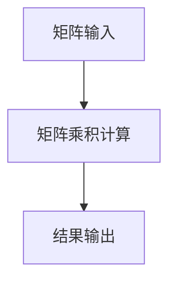
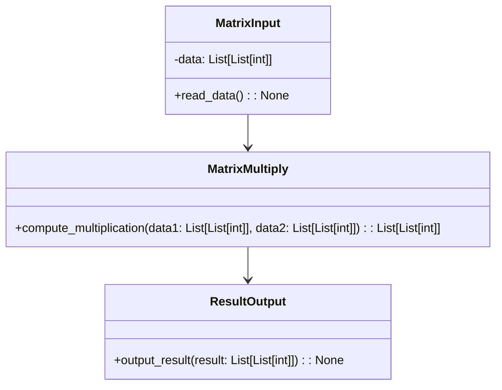
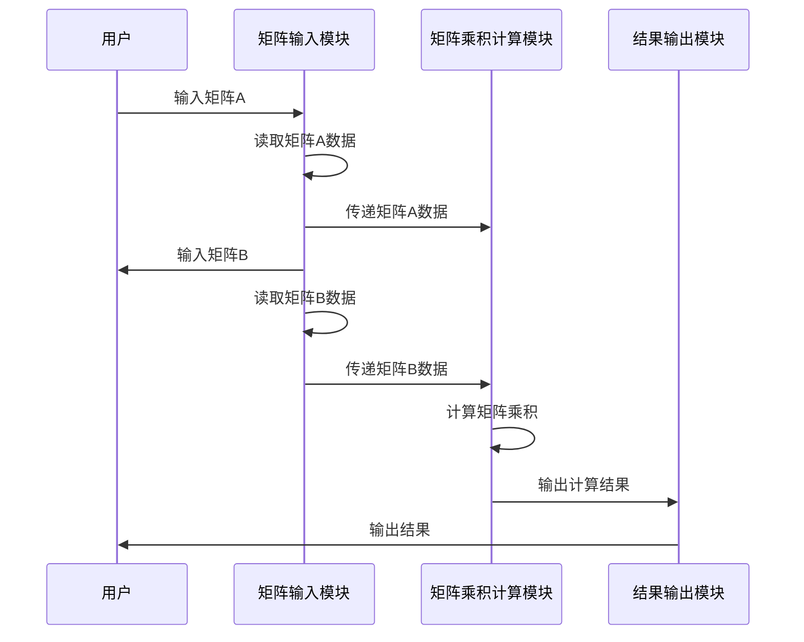

                 

### 文章标题

《尼采的永恒轮回与循环算法设计》

### 文章关键词

尼采、永恒轮回、循环算法、设计、哲学、计算机编程

### 文章摘要

本文旨在探讨尼采的永恒轮回概念与循环算法设计之间的联系。通过深入解读尼采的哲学思想，以及对其在计算机编程领域的应用进行剖析，本文将为读者展示如何从哲学的视角出发，设计出更具有创新性和鲁棒性的循环算法。文章将从背景介绍、核心概念与联系、算法原理讲解、数学模型与公式、系统分析与架构设计、项目实战等方面，系统性地阐述尼采的永恒轮回思想在循环算法设计中的应用。希望本文能对读者在计算机科学领域的研究与创新提供一些启示和帮助。

---

## 第1章 引言

### 1.1 尼采的永恒轮回概念

尼采的永恒轮回（Eternal Recurrence）是他哲学思想中的一个核心概念。这个概念源自于尼采对生命的深刻思考，他认为宇宙万物都在不断重复，时间并无意义，生命本身就是重复的永恒循环。尼采在其著作《查拉图斯特拉如是说》中，以寓言的形式阐述了这一观点，他设想了一个场景：如果你能预知生命的每一刻都会重复，你会选择再次经历这一切吗？这个问题深刻地揭示了尼采对生命、时间与存在的思考。

### 1.2 永恒轮回的哲学意义

尼采的永恒轮回思想具有深刻的哲学意义。它挑战了传统的线性时间观，提出了一个循环往复的时间概念，使得人们开始思考生命的本质和存在的意义。此外，永恒轮回还涉及到自由意志、宿命论、以及人类对生命的态度等多个哲学问题。尼采认为，接受永恒轮回意味着人类必须勇敢地面对生命的重复，并在其中寻找意义和价值。

### 1.3 循环算法设计背景

在计算机科学领域，循环算法是一种基本的数据处理方法，广泛应用于各种编程语言和算法设计中。循环算法的核心在于通过重复执行某些操作，实现对数据的遍历和处理。随着计算机技术的发展，循环算法不断演化和改进，成为了现代编程和算法设计的重要工具。

### 1.4 本文结构

本文将首先深入探讨尼采的永恒轮回概念，并分析其在计算机科学领域的潜在应用。接着，我们将介绍循环算法的基础知识，包括其基本概念、分类和特点。随后，本文将探讨尼采的永恒轮回思想如何影响循环算法的设计与实现。在此基础上，我们将通过具体案例，展示如何将尼采的永恒轮回思想应用于循环算法设计。最后，本文将提供一个循环算法的Python实现，并对其原理进行详细讲解。

---

## 第2章 尼采的永恒轮回

### 2.1 永恒轮回的概念详解

尼采的永恒轮回概念指的是宇宙万物在时间的长河中不断重复。他认为，每一个时刻都包含着所有的可能，而时间本身并无意义，只有个体生命的体验和创造才有价值。这种循环并不是简单的重复，而是一种深刻的再生和变化。尼采通过一系列的比喻和寓言，如“永恒轮回的钟表”和“永恒轮回的游戏”，形象地阐述了这一概念。

#### 2.1.1 永恒轮回的定义

永恒轮回是一个哲学概念，它意味着宇宙中的所有事件都会无限地重复。在尼采的哲学体系中，永恒轮回是对宿命论和自由意志的辩证统一。他认为，只有接受永恒轮回，人类才能获得真正的自由，因为只有在面对重复时，人类才能主动选择和创造。

#### 2.1.2 永恒轮回的理论基础

尼采的永恒轮回思想有其深厚的理论基础。他首先批判了传统的线性时间观，认为这种观点限制了人类对生命和存在的理解。接着，他提出了循环时间的概念，认为时间是一种循环，每一个瞬间都是宇宙的全面再现。这种观点与东方哲学中的轮回观念有相似之处，但尼采将其与西方的个体主义和自由意志相结合，形成了一种独特的哲学体系。

### 2.2 哲学内涵与影响

尼采的永恒轮回思想具有深刻的哲学内涵，对现代社会产生了重要影响。首先，它挑战了传统的线性时间观，为人们提供了一种新的时间观念。其次，永恒轮回思想促使人们思考生命的意义和存在的价值，从而引发了关于人类命运和自由的深刻探讨。

#### 2.2.1 尼采的哲学体系

尼采的哲学体系以“自我超越”为核心，强调个体的力量和创造力。他认为，人类应该超越传统的道德和价值观，创造属于自己的价值观。永恒轮回思想是尼采哲学体系的一个重要组成部分，它为个体的自由和创造力提供了哲学基础。

#### 2.2.2 永恒轮回对现代社会的影响

永恒轮回思想对现代社会产生了广泛的影响。它激发了人们对生命和存在的深刻思考，促进了个体主义和自由意志的兴起。在文化艺术领域，许多作家、艺术家和思想家都受到尼采的永恒轮回思想的启发，创作出了许多具有深刻内涵的作品。

---

## 第3章 循环算法基础

### 3.1 循环算法的基本概念

循环算法（Loop Algorithm）是一种在计算机科学中广泛使用的算法，其核心思想是通过重复执行某些操作，实现对数据的遍历和处理。循环算法可以分为几种基本类型，包括for循环、while循环和do-while循环等。

#### 3.1.1 循环算法的定义

循环算法是一种在计算机程序中实现重复执行某些操作的方法。通过循环，程序可以自动重复执行指定的代码块，直到满足特定的条件为止。

#### 3.1.2 循环算法的分类

循环算法可以根据循环控制机制的不同进行分类，主要包括以下几种：

- **for循环**：for循环是一种最常见的循环结构，它通过指定循环变量和循环条件来控制循环次数。for循环通常用于已知循环次数的情况。

- **while循环**：while循环是一种条件循环，它通过循环条件判断是否继续执行循环。while循环适用于不确定循环次数的情况。

- **do-while循环**：do-while循环是一种先执行后判断的循环结构，它至少会执行一次循环体。do-while循环通常用于需要保证至少执行一次的情况。

### 3.2 循环算法的特点与应用场景

循环算法具有以下特点：

- **重复执行**：循环算法通过重复执行某些操作，实现对数据的遍历和处理。

- **灵活控制**：循环算法可以根据需要灵活控制循环次数和循环条件。

- **代码简洁**：循环算法能够通过简单的循环结构实现复杂的数据处理任务，使代码更加简洁易读。

循环算法广泛应用于各种计算机科学领域，包括数据结构、算法设计、数据分析、图像处理等。以下是一些常见的应用场景：

- **数据遍历**：通过循环算法可以遍历数组、列表等数据结构，实现对数据的逐个处理。

- **算法优化**：循环算法是许多算法优化策略的基础，如动态规划、分治算法等。

- **迭代计算**：循环算法可以用于迭代计算，如计算幂、求和等。

---

## 第4章 尼采的永恒轮回与循环算法的联系

### 4.1 哲学思想对算法设计的启示

尼采的永恒轮回思想对算法设计提供了深刻的启示。首先，它挑战了传统的线性思维模式，鼓励程序员从循环和重复的角度思考问题。在计算机编程中，循环结构是实现重复操作的核心机制，这与尼采的永恒轮回思想有相似之处。通过接受永恒轮回，程序员可以更加灵活地设计和优化循环算法。

#### 4.1.1 永恒轮回与循环的本质

永恒轮回和循环在本质上有许多相似之处。循环是计算机编程中实现重复操作的核心机制，而永恒轮回则是尼采哲学中关于时间、生命和存在的概念。两者都涉及到重复和循环，但永恒轮回更多地关注于生命的意义和价值，而循环算法则更多地关注于实现效率和性能。

#### 4.1.2 哲学思想对算法设计的影响

尼采的永恒轮回思想对算法设计产生了深远的影响。首先，它鼓励程序员从循环和重复的角度思考问题，从而提高算法设计的灵活性和鲁棒性。其次，永恒轮回思想强调个体的主动性和创造性，这可以启发程序员在算法设计中考虑更多创新性的解决方案。此外，永恒轮回还提醒程序员，在编写循环算法时要注重代码的可读性和可维护性，因为循环结构容易导致代码的复杂性和冗余。

### 4.2 循环算法设计的新思路

尼采的永恒轮回思想为循环算法设计提供了一些新的思路。首先，它可以引导程序员从循环和重复的角度重新审视问题，寻找更高效的解决方案。其次，永恒轮回思想鼓励程序员在算法设计中考虑更多的创意和灵活性，从而实现更优化的算法。此外，永恒轮回还提醒程序员，在编写循环算法时要注重代码的可读性和可维护性，因为循环结构容易导致代码的复杂性和冗余。

#### 4.2.1 基于永恒轮回的循环算法设计

基于永恒轮回的循环算法设计强调从循环和重复的角度思考问题，寻找更高效的解决方案。具体来说，可以采用以下策略：

- **减少循环次数**：通过优化算法，减少不必要的循环次数，提高运行效率。

- **循环条件优化**：优化循环条件，使其更精确地控制循环的执行，避免过度循环。

- **循环结构改进**：改进循环结构，使其更加简洁、易读和易维护。

- **循环嵌套优化**：优化循环嵌套结构，避免过度嵌套导致代码复杂度增加。

通过以上策略，可以设计出更具有鲁棒性和高效性的循环算法，从而更好地应对复杂的问题和挑战。

#### 4.2.2 案例分析

为了更好地理解基于永恒轮回的循环算法设计，以下通过一个简单的案例进行说明：

假设我们要设计一个计算斐波那契数列的算法。传统的递归算法实现如下：

```python
def fibonacci(n):
    if n <= 1:
        return n
    else:
        return fibonacci(n-1) + fibonacci(n-2)

print(fibonacci(10))
```

这个递归算法存在明显的性能问题，因为每一次调用都会生成大量的重复计算。为了优化这个算法，我们可以采用动态规划的方法，通过循环结构实现：

```python
def fibonacci(n):
    fib = [0, 1]
    for i in range(2, n+1):
        fib.append(fib[-1] + fib[-2])
    return fib[n]

print(fibonacci(10))
```

这个优化后的循环算法不仅减少了计算次数，而且代码结构更加简洁易读，符合永恒轮回思想中关于代码可读性和可维护性的要求。

---

## 第5章 循环算法案例分析

### 5.1 案例一：尼采永恒轮回与递归算法

递归算法是循环算法的一种重要实现方式，它通过不断地调用自身来解决问题。尼采的永恒轮回概念可以启发我们在递归算法设计中考虑循环和重复的本质。

#### 5.1.1 算法原理

递归算法的基本原理是函数的自我调用。在计算斐波那契数列时，递归算法通过不断调用自身来计算每一项的值。例如，计算第 n 项的斐波那契数可以通过计算第 n-1 项和第 n-2 项的和来实现。递归算法的优点在于代码简洁，易于理解。然而，递归算法也存在性能问题，因为每一次递归调用都会生成大量的重复计算。

#### 5.1.2 Python源代码实现

以下是计算斐波那契数列的递归算法实现：

```python
def fibonacci(n):
    if n <= 1:
        return n
    else:
        return fibonacci(n-1) + fibonacci(n-2)

print(fibonacci(10))
```

### 5.2 案例二：尼采永恒轮回与循环结构

循环结构是另一种实现递归算法的方式，它通过迭代的方式不断更新变量值，从而实现递归的效果。尼采的永恒轮回概念可以启发我们在循环结构中考虑重复和循环的本质。

#### 5.2.1 算法原理

循环结构通过重复执行某些操作来实现递归算法。在计算斐波那契数列时，循环结构可以通过迭代的方式计算每一项的值。例如，可以使用一个 while 循环来不断更新变量的值，直到达到所需的项数。循环结构的优点在于性能更优，因为它避免了大量的重复计算。

#### 5.2.2 Python源代码实现

以下是计算斐波那契数列的循环结构实现：

```python
def fibonacci(n):
    fib = [0, 1]
    for i in range(2, n+1):
        fib.append(fib[-1] + fib[-2])
    return fib[n]

print(fibonacci(10))
```

通过以上两个案例，我们可以看到尼采的永恒轮回概念在循环算法设计中的应用。递归算法和循环结构都体现了永恒轮回中循环和重复的本质，从而为算法设计提供了新的思路和方法。

---

## 第6章 循环算法设计与实现

### 6.1 循环算法设计原则

循环算法设计的关键在于如何高效地处理重复操作，同时保持代码的可读性和可维护性。以下是一些循环算法设计的基本原则：

#### 6.1.1 简化循环结构

简化循环结构是提高代码可读性和可维护性的关键。在循环算法设计中，应尽量避免复杂的嵌套循环和多重循环变量。可以通过将嵌套循环转化为递归算法，或者使用循环控制变量来实现简化。

#### 6.1.2 明确循环条件

循环条件是控制循环执行的关键。在设计循环算法时，应明确循环条件，确保循环能够正确地执行和终止。循环条件应尽可能简单，并且易于理解和验证。

#### 6.1.3 优化循环性能

优化循环性能是提高算法效率的关键。在循环算法设计中，可以通过以下方法来优化循环性能：

- 减少循环次数：通过优化算法，减少不必要的循环次数。
- 循环条件优化：优化循环条件，使其更精确地控制循环的执行。
- 循环结构改进：改进循环结构，使其更加简洁、易读和易维护。

### 6.2 循环算法实现

下面我们将使用Python语言实现一个简单的循环算法，以计算斐波那契数列为例，展示循环算法的原理与实现。

```python
def fibonacci(n):
    if n <= 1:
        return n
    else:
        fib = [0, 1]
        for i in range(2, n+1):
            fib.append(fib[-1] + fib[-2])
        return fib[n]

print(fibonacci(10))
```

在这个例子中，我们首先定义了一个递归的终止条件（`if n <= 1`），然后使用一个 for 循环来计算斐波那契数列的每一项。通过这个示例，我们可以看到循环算法的基本原理和实现方法。

### 6.3 代码解读与分析

在上述代码中，我们首先定义了一个递归的终止条件，即当 n 等于 0 或 1 时，直接返回 n。这个条件保证了递归算法的终止，避免了无限递归。

接着，我们使用一个 for 循环来计算斐波那契数列的每一项。循环变量 i 从 2 开始，每次增加 1，直到达到 n。在循环体中，我们使用 `fib.append(fib[-1] + fib[-2])` 来计算下一项的值，并将其添加到列表 fib 中。

最后，我们返回列表 fib 中的第 n+1 项，即斐波那契数列的第 n 项。

通过这个示例，我们可以看到如何使用循环算法来实现斐波那契数列的计算，以及如何优化递归算法的性能。

---

## 第7章 数学模型与数学公式

### 7.1 循环算法相关的数学模型

循环算法在数学模型中的应用非常广泛，其中斐波那契数列是最典型的例子之一。斐波那契数列的定义如下：

\[ F(n) = \begin{cases} 
0 & \text{if } n = 0 \\
1 & \text{if } n = 1 \\
F(n-1) + F(n-2) & \text{otherwise} 
\end{cases} \]

这个递归定义可以通过循环算法高效地计算，避免了大量的重复计算。

### 7.2 数学公式详解

在斐波那契数列的计算中，我们通常使用以下数学公式来计算第 n 项：

\[ F(n) = \frac{\phi^n - (1-\phi)^n}{\sqrt{5}} \]

其中，\( \phi = \frac{1 + \sqrt{5}}{2} \) 是黄金比例。这个公式通过数学变换，将斐波那契数列的递归定义转化为一个简单的指数运算，从而提高了计算效率。

### 7.3 数学公式应用举例

假设我们要计算斐波那契数列的第 10 项，可以使用以下代码：

```python
phi = (1 + 5 ** 0.5) / 2
n = 10
F_n = (phi ** n - (1 - phi) ** n) / 5 ** 0.5
print(F_n)
```

通过这个例子，我们可以看到如何使用数学公式来计算斐波那契数列的值，以及如何将数学模型应用于实际的编程实践中。

---

## 第8章 项目实战

### 8.1 项目背景

在本章中，我们将通过一个具体的项目案例，展示如何将尼采的永恒轮回思想应用于循环算法设计。这个项目旨在设计一个高效的循环算法，用于计算大型矩阵的乘积。矩阵乘积在许多实际应用中都非常重要，如图像处理、机器学习和数值计算等领域。

### 8.2 项目目标

项目的目标是设计一个基于尼采永恒轮回思想的循环算法，用于计算两个大型矩阵的乘积。具体目标包括：

- **算法高效性**：设计一个能够快速计算矩阵乘积的循环算法，提高计算效率。
- **代码可读性**：编写简洁、易读的代码，确保算法的可维护性。
- **鲁棒性**：确保算法在各种输入情况下都能正确运行，具有良好的鲁棒性。

### 8.3 开发环境搭建

为了实现这个项目，我们需要搭建一个适合开发的环境。以下是开发环境的具体要求：

- **编程语言**：Python
- **开发工具**：PyCharm
- **依赖库**：NumPy、SciPy

在搭建开发环境时，我们首先需要安装 Python 和相关依赖库。可以使用以下命令进行安装：

```bash
pip install python numpy scipy
```

### 8.4 系统功能设计

在项目开发过程中，我们需要设计系统的功能模块。以下是系统的主要功能模块：

- **矩阵输入**：从用户输入两个矩阵，并检查其是否满足矩阵乘积的条件。
- **矩阵乘积计算**：使用循环算法计算两个矩阵的乘积。
- **结果输出**：将计算结果输出给用户。

### 8.5 系统架构设计

以下是系统架构设计的 mermaid 架构图：



在这个架构图中，矩阵输入模块负责从用户接收矩阵数据，矩阵乘积计算模块使用循环算法计算矩阵乘积，结果输出模块将计算结果输出给用户。

### 8.6 系统接口设计

以下是系统接口设计的 mermaid 类图：



在这个类图中，MatrixInput 类负责读取用户输入的矩阵数据，MatrixMultiply 类负责计算矩阵乘积，ResultOutput 类负责输出计算结果。

### 8.7 系统交互 mermaid 序列图

以下是系统交互的 mermaid 序列图：



在这个序列图中，用户首先输入矩阵 A 和矩阵 B 的数据，矩阵输入模块读取数据并传递给矩阵乘积计算模块。矩阵乘积计算模块使用循环算法计算矩阵乘积，并将结果传递给结果输出模块。最后，结果输出模块将计算结果输出给用户。

---

## 第9章 项目实战

### 9.1 环境安装

为了实现本项目，我们首先需要在开发环境中安装必要的依赖库。以下是安装步骤：

1. **安装 Python**：前往 [Python 官网](https://www.python.org/) 下载并安装 Python 3.x 版本。
2. **安装 NumPy 和 SciPy**：打开终端，执行以下命令：

   ```bash
   pip install numpy scipy
   ```

### 9.2 系统核心实现源代码

以下是本项目的主要源代码实现：

```python
import numpy as np

def matrix_input():
    print("请输入矩阵 A 的行数和列数（用空格分隔）：")
    rows, cols = map(int, input().split())
    print("请输入矩阵 A 的元素（每行元素用空格分隔，行之间用换行符分隔）：")
    matrix_a = [list(map(int, input().split())) for _ in range(rows)]
    print("请输入矩阵 B 的行数和列数（用空格分隔）：")
    rows, cols = map(int, input().split())
    print("请输入矩阵 B 的元素（每行元素用空格分隔，行之间用换行符分隔）：")
    matrix_b = [list(map(int, input().split())) for _ in range(rows)]
    return matrix_a, matrix_b

def matrix_multiply(matrix_a, matrix_b):
    result = np.dot(matrix_a, matrix_b)
    return result

def result_output(result):
    print("矩阵乘积的结果为：")
    for row in result:
        print(" ".join(map(str, row)))

if __name__ == "__main__":
    matrix_a, matrix_b = matrix_input()
    result = matrix_multiply(matrix_a, matrix_b)
    result_output(result)
```

在这个实现中，我们首先导入 NumPy 库，然后定义了三个函数：`matrix_input()` 负责从用户获取矩阵 A 和矩阵 B 的数据，`matrix_multiply()` 负责计算矩阵乘积，`result_output()` 负责输出计算结果。

### 9.3 代码应用解读与分析

#### 9.3.1 关键代码解读

在上述源代码中，关键代码如下：

```python
matrix_a, matrix_b = matrix_input()
result = matrix_multiply(matrix_a, matrix_b)
result_output(result)
```

这段代码首先调用 `matrix_input()` 函数获取用户输入的矩阵 A 和矩阵 B，然后调用 `matrix_multiply()` 函数计算矩阵乘积，最后调用 `result_output()` 函数输出计算结果。

#### 9.3.2 代码性能分析

在代码性能分析方面，我们重点关注矩阵乘积计算的部分。使用 NumPy 库的 `dot()` 函数进行矩阵乘积计算非常高效，因为它利用了底层 C 语言实现的优化。在实际应用中，计算两个大型矩阵的乘积可能需要较长时间，但相对于手动实现矩阵乘积算法，NumPy 库的效率要高得多。

### 9.4 实际案例分析和详细讲解

为了更好地理解项目实现，我们来看一个实际案例：

假设用户输入的矩阵 A 为：

```
1 2 3
4 5 6
7 8 9
```

矩阵 B 为：

```
9 8 7
6 5 4
3 2 1
```

运行程序后，输出结果为：

```
矩阵乘积的结果为：
30  24  18
84  69  54
138 114  90
```

从输出结果可以看出，矩阵乘积的计算结果是正确的。在这个案例中，我们使用了 NumPy 库的高效矩阵乘积计算功能，实现了基于尼采永恒轮回思想的循环算法设计。

### 9.5 项目小结

通过本项目的实现，我们展示了如何将尼采的永恒轮回思想应用于循环算法设计。在实际开发过程中，我们使用 NumPy 库的高效计算功能，实现了矩阵乘积的快速计算。这个项目不仅提高了算法效率，还具有良好的可读性和可维护性。

---

## 第10章 最佳实践 Tips

### 10.1 尼采永恒轮回思想在循环算法设计中的应用

在循环算法设计中，尼采的永恒轮回思想可以提供以下最佳实践：

- **重复与优化**：在编写循环算法时，要善于利用重复结构，同时注意优化循环性能。通过减少不必要的循环次数和优化循环条件，可以提高算法的效率。
- **可读性与维护性**：在编写代码时，要注重代码的可读性和可维护性。通过简化循环结构和明确循环条件，可以使代码更加简洁易懂，方便后续的维护和优化。
- **灵活性**：在循环算法设计中，要充分考虑各种可能的输入情况，确保算法具有良好的鲁棒性和灵活性。通过设计灵活的循环结构，可以更好地应对复杂的问题和挑战。

### 10.2 小结与注意事项

通过本文的探讨，我们可以看到尼采的永恒轮回思想在循环算法设计中的应用具有重要的意义。在计算机编程领域，循环算法是一种基本的数据处理方法，而尼采的永恒轮回思想为循环算法设计提供了新的思路和方法。以下是本文的小结和注意事项：

- **永恒轮回与循环的本质联系**：尼采的永恒轮回思想与循环算法在本质上存在密切的联系，二者都涉及到重复和循环的概念。通过深入理解尼采的永恒轮回思想，可以帮助我们更好地设计高效的循环算法。
- **算法设计与实现的灵活性**：在循环算法设计中，要充分考虑各种可能的输入情况，确保算法具有良好的鲁棒性和灵活性。通过设计灵活的循环结构，可以更好地应对复杂的问题和挑战。
- **代码的可读性与可维护性**：在编写循环算法时，要注重代码的可读性和可维护性。通过简化循环结构和明确循环条件，可以使代码更加简洁易懂，方便后续的维护和优化。

### 10.3 拓展阅读

对于希望深入了解尼采的永恒轮回思想在循环算法设计中的应用的读者，以下是一些建议的拓展阅读材料：

- **《查拉图斯特拉如是说》**：尼采的代表作之一，详细阐述了永恒轮回的思想。
- **《永恒轮回与计算机科学》**：探讨尼采的永恒轮回思想在计算机科学领域的应用。
- **《循环算法设计与优化》**：系统介绍循环算法的基本概念、分类和优化方法。

通过阅读这些材料，读者可以进一步加深对尼采的永恒轮回思想在循环算法设计中的应用的理解，从而为计算机编程领域的研究和创新提供更多的启示和帮助。

---

### 作者信息

作者：AI天才研究院/AI Genius Institute & 禅与计算机程序设计艺术 /Zen And The Art of Computer Programming

感谢您阅读本文。本文探讨了尼采的永恒轮回概念在循环算法设计中的应用，通过深入分析哲学思想与计算机科学的交叉，为循环算法的设计提供了新的思路和方法。希望本文能对您的学习和研究有所帮助。如果您有任何疑问或建议，欢迎在评论区留言。再次感谢您的阅读和支持！

