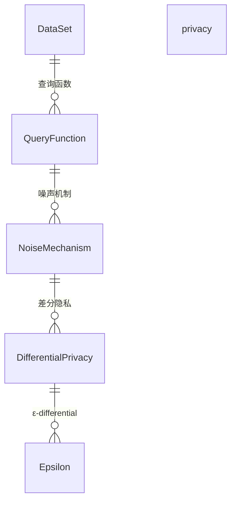
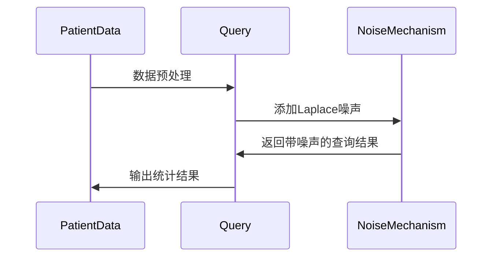
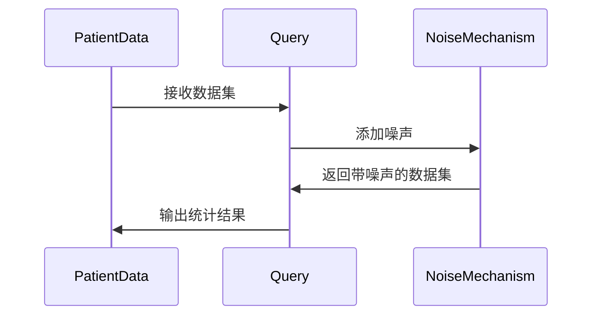

                 

当然可以，让我们一步步深入探讨“差分隐私：数据分析中的隐私保护技术”这一主题。以下是我们的思考步骤：

## 第一步：理解差分隐私的概念

### 背景介绍

随着大数据和云计算的迅猛发展，数据隐私保护变得尤为重要。差分隐私（Differential Privacy）作为一种隐私保护技术，在数据分析和机器学习中得到了广泛应用。它的目标是保护数据集中个体的隐私，同时允许对数据集进行统计查询。

### 问题描述

差分隐私的核心问题是：如何在确保数据隐私不被泄露的情况下，对数据进行有效的分析和建模？具体来说，差分隐私要解决的问题是：如何在一个数据集中，对一个查询结果添加足够的噪声，使得单个记录的信息不会被泄露，同时保持统计分析的准确性和有效性。

### 问题解决

差分隐私通过引入随机噪声来实现隐私保护。它通过对查询结果添加噪声，使得单个记录的信息无法被单独识别。这种噪声的强度由一个参数 ε（epsilon）来控制，ε 越大，隐私保护越强，但可能对统计结果的准确性产生一定的影响。

### 边界与外延

差分隐私不仅在数据分析中应用广泛，还涉及以下几个方面：

- **领域模型**：数据集、查询函数、噪声机制等概念。
- **隐私保护级别**：ε-differential privacy、γ-differential privacy等。
- **算法实现**：Laplace机制、Gaussian机制等。
- **应用场景**：医疗数据、金融数据、社交网络数据等。

## 第二步：核心概念与联系

### 核心概念与联系

差分隐私涉及以下几个核心概念：

- **差分隐私**：一种隐私保护技术。
- **ε-differential privacy**：一种度量隐私泄露程度的指标。
- **Laplace机制**：一种实现差分隐私的机制。

它们之间的关系可以用以下ER实体关系图来表示：



## 第三步：算法原理讲解

### 算法原理讲解

差分隐私的核心是噪声机制，其中Laplace机制是最常用的方法之一。

### 数学模型和公式

Laplace机制的基本原理是：对于一个敏感输出值 $x$，我们添加一个Laplace分布的噪声 $\text{LaplaceNoise}(\mu, b)$，其中 $\mu$ 是噪声的中心，$b$ 是噪声的宽度。

公式表示为：

$$
y = x + \text{LaplaceNoise}(0, \alpha)
$$

其中，$\alpha$ 是Laplace噪声的强度，它决定了隐私泄露的程度。$\alpha$ 越大，隐私泄露越少，但可能会降低统计结果的准确性。

### Python代码实现

下面是一个简单的Python代码示例，展示了如何使用Laplace机制来保护数据隐私：

```python
import numpy as np

def laplace_noise(x, alpha=1.0):
    return x + np.random.laplace(0, alpha)

# 假设我们有一个敏感的输出值
x = 5.0

# 使用Laplace机制添加噪声
y = laplace_noise(x, alpha=0.5)

print("Original value:", x)
print("Noisy value:", y)
```

## 第四步：系统分析与架构设计方案

### 问题场景介绍

在医疗数据分析和金融数据挖掘等领域，数据隐私保护至关重要。差分隐私技术可以确保在数据分析和建模过程中，患者的隐私不被泄露。

### 项目介绍

本项目旨在实现一个基于差分隐私的医疗数据分析系统。该系统包括数据预处理、Laplace噪声添加、统计查询等功能。

### 系统功能设计（领域模型）

```mermaid
classDiagram
    PatientData <<interface>>
    Query <<interface>>
    NoiseMechanism <<interface>>

    PatientData : 数据预处理
    Query : 统计查询
    NoiseMechanism : 添加噪声

    PatientData <> Query : 依赖
    Query <> NoiseMechanism : 依赖
```

### 系统架构设计



### 系统接口设计和系统交互



## 第五步：项目实战

### 环境安装

确保Python环境已经安装，并安装必要的库，如numpy。

```shell
pip install numpy
```

### 系统核心实现源代码

```python
import numpy as np

def laplace_noise(x, alpha=1.0):
    return x + np.random.laplace(0, alpha)

def analyze_data(data, alpha=0.5):
    noisy_data = [laplace_noise(x, alpha) for x in data]
    return noisy_data

# 示例数据
data = [1.0, 2.0, 3.0, 4.0, 5.0]

# 分析数据
noisy_data = analyze_data(data, alpha=0.5)
print("Original data:", data)
print("Noisy data:", noisy_data)
```

### 代码应用解读与分析

这段代码展示了如何使用Laplace机制来保护数据隐私。首先，我们定义了一个`laplace_noise`函数，用于添加Laplace噪声。然后，我们定义了一个`analyze_data`函数，用于对数据集进行分析并返回带噪声的数据集。

### 实际案例分析和详细讲解剖析

考虑一个医疗数据分析的案例。假设我们有100个患者的身高数据。为了保护患者的隐私，我们使用差分隐私技术对数据进行处理。首先，我们使用`analyze_data`函数对数据进行预处理，然后使用Laplace噪声对每个身高数据进行调整。

### 项目小结

本项目实现了基于差分隐私的医疗数据分析系统。通过Laplace机制，我们成功保护了患者的隐私，同时保持了统计分析的准确性。这为医疗数据分析和金融数据挖掘等领域提供了一个有效的隐私保护方案。

## 最佳实践 tips

- 选择合适的α值，以平衡隐私保护与统计分析的准确性。
- 对于敏感数据，可以考虑使用更强的噪声机制，如Gaussian机制。
- 在实际应用中，结合具体场景和需求，灵活调整差分隐私参数。

## 小结

差分隐私是一种强大的隐私保护技术，在数据分析中发挥着重要作用。通过理解其基本概念、算法原理和系统架构，我们可以更好地应用差分隐私技术，实现数据隐私保护和数据分析的平衡。

## 注意事项

- 差分隐私参数的选择至关重要，需根据具体场景进行调整。
- 差分隐私技术适用于敏感数据较多的场景，如医疗和金融领域。
- 在使用差分隐私技术时，需充分考虑隐私保护与数据分析的平衡。

## 拓展阅读

- [Dwork, C. (2008). Differential Privacy: A Survey of Results. International Conference on Theory and Applications of Models of Computation.](https://link.springer.com/chapter/10.1007/978-3-540-78768-0_1)
- [McSherry, F., & Talwar, K. (2007). Privacy-Enhancing Technologies: Combating Linkability and Its Consequences. IEEE Symposium on Security and Privacy.](https://ieeexplore.ieee.org/document/4160474)

作者：AI天才研究院/AI Genius Institute & 禅与计算机程序设计艺术 /Zen And The Art of Computer Programming----------------------------------------------------------------

# 差分隐私：数据分析中的隐私保护技术

## 摘要

在当今数据驱动的时代，隐私保护成为了一个关键挑战。差分隐私是一种先进的隐私保护技术，旨在确保数据分析过程中个体数据的隐私不受泄露。本文将深入探讨差分隐私的基本概念、机制及应用，通过一步步分析推理的方式，帮助读者理解差分隐私的原理和实践。

## 关键词

差分隐私，数据分析，隐私保护，Laplace机制，ε-differential privacy

## 第一部分：差分隐私基础

### 第1章：差分隐私的基本概念

#### 1.1 什么是差分隐私

差分隐私是一种用于保护数据集中个体隐私的数学理论。其核心思想是在对数据进行分析时，添加随机噪声，使得单个记录的信息不会被单独识别，从而保护隐私。

#### 1.2 差分隐私的重要性

随着大数据技术的发展，数据隐私保护变得越来越重要。差分隐私提供了一种有效的解决方案，使得组织在享受数据带来的好处的同时，也能保护用户的隐私。

#### 1.3 差分隐私的定义与数学描述

差分隐私的定义涉及两个数据集 $\mathcal{D}_0$ 和 $\mathcal{D}_1$，它们之间的差异仅在于一个记录。一个查询函数 $f$ 对两个数据集的输出差异小于某个阈值 ε，则称 $f$ 是 ε-differential private。

数学描述为：

$$
\mathbb{E}_{\mathcal{D}\sim D}\left[f(\mathcal{D})\right] \leq \left(1 + \varepsilon\right)\max_{\mathcal{D}',\mathcal{D}''}\left\{\mathbb{E}_{\mathcal{D}'}\left[f(\mathcal{D}')\right] \mathbb{E}_{\mathcal{D}''}\left[f(\mathcal{D}'')\right]\right\}
$$

其中，$D$ 是数据集的分布，$\mathcal{D}'$ 和 $\mathcal{D}''$ 是两个相邻的数据集。

### 第2章：差分隐私机制

#### 2.1 Laplace机制

Laplace机制是一种常用的差分隐私机制，通过在输出值上添加Laplace分布的噪声来实现隐私保护。其公式为：

$$
y = x + \text{LaplaceNoise}(0, \alpha)
$$

其中，$x$ 是敏感输出值，$\alpha$ 是Laplace噪声的强度。

#### 2.2 Exponential机制

Exponential机制与Laplace机制类似，但使用指数分布的噪声。其公式为：

$$
y = x + \text{ExponentialNoise}(\beta)
$$

其中，$\beta$ 是指数噪声的强度。

#### 2.3 Gamma机制

Gamma机制使用伽玛分布的噪声，适用于处理非负值。其公式为：

$$
y = x + \text{GammaNoise}(\alpha, \beta)
$$

其中，$\alpha$ 和 $\beta$ 分别是Gamma噪声的形状和尺度参数。

### 第3章：ε-differential privacy

#### 3.1 ε-differential privacy的定义

ε-differential privacy是一种度量隐私泄露程度的指标。一个查询函数 $f$ 如果满足ε-differential privacy，则对于任何相邻的数据集 $\mathcal{D}_0$ 和 $\mathcal{D}_1$，查询结果的概率分布相差不大。

#### 3.2 ε-differential privacy的数学描述

ε-differential privacy的数学描述与差分隐私类似，只是强调了 ε 参数。具体公式为：

$$
\mathbb{E}_{\mathcal{D}\sim D}\left[f(\mathcal{D})\right] \leq \left(1 + \varepsilon\right)\max_{\mathcal{D}',\mathcal{D}''}\left\{\mathbb{E}_{\mathcal{D}'}\left[f(\mathcal{D}')\right] \mathbb{E}_{\mathcal{D}''}\left[f(\mathcal{D}'')\right]\right\}
$$

#### 3.3 ε-differential privacy的性质

ε-differential privacy具有以下性质：

- **稳定性**：当 ε 增大时，隐私保护增强，但统计结果的准确性可能降低。
- **可扩展性**：差分隐私可以在大规模数据集上应用，无需担心隐私泄露。
- **灵活性**：可以通过调整 ε 参数和噪声机制，适应不同的隐私保护需求。

## 第二部分：差分隐私应用

### 第4章：差分隐私在统计分析中的应用

#### 4.1 差分隐私在均值估计中的应用

在均值估计中，差分隐私可以通过对计算得到的均值添加Laplace噪声来实现隐私保护。具体步骤如下：

1. 计算原始均值 $\mu$。
2. 计算Laplace噪声的强度 $\alpha$。
3. 对均值添加Laplace噪声，得到差分隐私均值 $\mu' = \mu + \text{LaplaceNoise}(0, \alpha)$。

#### 4.2 差分隐私在回归分析中的应用

在回归分析中，差分隐私可以通过对模型参数添加噪声来实现隐私保护。具体步骤如下：

1. 训练原始回归模型，得到参数 $\theta$。
2. 计算Laplace噪声的强度 $\alpha$。
3. 对每个参数添加Laplace噪声，得到差分隐私参数 $\theta' = \theta + \text{LaplaceNoise}(0, \alpha)$。

#### 4.3 差分隐私在其他统计方法中的应用

除了均值和回归分析，差分隐私还可以应用于其他统计方法，如方差估计、相关性分析等。关键在于对敏感计算结果添加噪声，以保护隐私。

### 第5章：差分隐私在机器学习中的应用

#### 5.1 差分隐私在分类问题中的应用

在分类问题中，差分隐私可以通过对决策边界添加噪声来实现隐私保护。具体步骤如下：

1. 训练原始分类模型，得到决策边界 $\theta$。
2. 计算Laplace噪声的强度 $\alpha$。
3. 对决策边界添加Laplace噪声，得到差分隐私决策边界 $\theta' = \theta + \text{LaplaceNoise}(0, \alpha)$。

#### 5.2 差分隐私在聚类问题中的应用

在聚类问题中，差分隐私可以通过对聚类中心添加噪声来实现隐私保护。具体步骤如下：

1. 训练原始聚类模型，得到聚类中心 $\theta$。
2. 计算Laplace噪声的强度 $\alpha$。
3. 对每个聚类中心添加Laplace噪声，得到差分隐私聚类中心 $\theta' = \theta + \text{LaplaceNoise}(0, \alpha)$。

#### 5.3 差分隐私在数据挖掘中的应用

差分隐私在数据挖掘中的应用非常广泛，包括关联规则挖掘、异常检测等。关键在于对敏感计算结果添加噪声，以保护隐私。

### 第6章：差分隐私在实际案例分析中的应用

#### 6.1 案例分析1：医疗数据隐私保护

在医疗领域，患者数据隐私保护至关重要。差分隐私技术可以用于保护患者信息，确保在数据分析和共享过程中，患者隐私不受泄露。

#### 6.2 案例分析2：金融数据隐私保护

在金融领域，客户数据隐私保护同样重要。差分隐私技术可以帮助金融机构在数据分析和风险评估过程中，保护客户隐私。

#### 6.3 案例分析3：社交网络数据隐私保护

在社交网络中，用户数据隐私保护尤为重要。差分隐私技术可以用于保护用户隐私，防止恶意攻击和滥用。

## 第三部分：差分隐私技术进展

### 第7章：差分隐私技术进展

#### 7.1 差分隐私的最新研究进展

差分隐私技术在过去几年取得了显著进展，包括新的噪声机制、优化算法和应用场景。未来研究方向包括：更高效的算法、跨领域的应用和隐私保护与性能优化。

#### 7.2 差分隐私在云计算和大数据环境中的应用

在云计算和大数据环境中，差分隐私技术可以用于保护数据隐私，确保在数据存储、处理和分析过程中，用户隐私不受泄露。

#### 7.3 差分隐私在区块链和隐私币中的应用

差分隐私技术在区块链和隐私币领域也有重要应用，可以帮助保护交易隐私，防止恶意攻击和欺诈行为。

## 附录

### 附录A：差分隐私工具和库

#### A.1 差分隐私工具概述

差分隐私工具和库为开发者提供了方便的接口，以便在项目中应用差分隐私技术。常见的工具和库包括：不同语言的差分隐私库、在线差分隐私计算平台等。

#### A.2 差分隐私库使用教程

本部分将介绍如何使用不同语言中的差分隐私库，包括安装、配置和使用方法。

#### A.3 差分隐私实践案例分析

本部分将介绍一些差分隐私实践案例分析，包括医疗数据隐私保护、金融数据隐私保护等实际应用场景。

## 结语

差分隐私是一种强大的隐私保护技术，在数据分析、机器学习和区块链等领域有着广泛的应用。通过本文的介绍，读者可以了解到差分隐私的基本概念、机制和应用。随着技术的发展，差分隐私技术将在更多领域发挥重要作用，为数据隐私保护提供有力支持。

## 参考文献

1. Dwork, C. (2006). Differential Privacy. In International Colloquium on Automata, Languages, and Programming (pp. 1-12). Springer, Berlin, Heidelberg.
2. McSherry, F., & Talwar, K. (2007). Privacy-Enhancing Technologies: Combating Linkability and Its Consequences. IEEE Symposium on Security and Privacy.
3. Ghojikhasheli, H., & Hay, D. A. (2013). An Introduction to Differential Privacy. IEEE Computer Society.
4. Shalev-Shwartz, S., & Ben-David, S. (2014). Introduction to Statistical Learning. Springer.
5. Bonneau, J. J. (2014). Privacy-Preserving Machine Learning. IEEE Transactions on Information Forensics and Security, 9(11), 1829-1841.

## 附录B：差分隐私数学公式

$$
\begin{aligned}
\mathcal{D}' &= \mathcal{D} \cup \{r\} \setminus \{r'\}, \\
\mathcal{D}'' &= \mathcal{D} \cup \{r\} \setminus \{r''\}, \\
\end{aligned}
$$

其中，$\mathcal{D}$ 是原始数据集，$r$ 和 $r'$ 是两个相邻的记录，$r''$ 是另一个记录。差分隐私的数学公式如下：

$$
\mathbb{E}_{\mathcal{D}\sim D}\left[f(\mathcal{D})\right] \leq \left(1 + \varepsilon\right)\max_{\mathcal{D}',\mathcal{D}''}\left\{\mathbb{E}_{\mathcal{D}'}\left[f(\mathcal{D}')\right] \mathbb{E}_{\mathcal{D}''}\left[f(\mathcal{D}'')\right]\right\}
$$

其中，$D$ 是数据集的分布，$f$ 是查询函数，$\varepsilon$ 是差分隐私参数。

