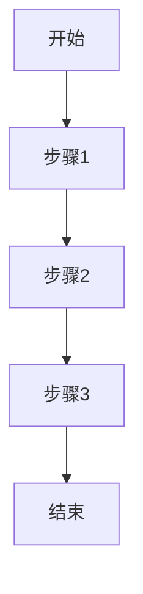

                 

# 布尔代数与逻辑电路设计

## 关键词

- **布尔代数**
- **逻辑电路设计**
- **与门（AND Gate）**
- **或门（OR Gate）**
- **非门（NOT Gate）**
- **异或门（XOR Gate）**
- **同或门（NOR Gate）**
- **或非门（NAND Gate）**
- **卡诺图化简法**
- **组合逻辑电路**
- **时序逻辑电路**
- **计算机硬件系统设计**
- **数字信号处理**

## 摘要

布尔代数是逻辑电路设计的基石，它通过将逻辑运算转化为数学运算，使得逻辑电路的设计更加简便和高效。本文将深入探讨布尔代数的基本概念、性质及其在逻辑电路设计中的应用，包括基本逻辑门与复合逻辑门的详细讲解，布尔代数的化简与转换方法，以及组合逻辑电路与时序逻辑电路的设计原理。通过实例分析和系统架构设计，本文旨在为读者提供全面的布尔代数与逻辑电路设计指导。

---

## 《布尔代数与逻辑电路设计》目录大纲

### 第一部分：布尔代数基础

#### 第1章 布尔代数概述

##### 1.1 布尔代数的基本概念

- 定义与历史
- 基本运算

##### 1.2 布尔代数的性质

- 吸收律
- 交换律
- 结合律
- 分配律

#### 第2章 基本逻辑门

##### 2.1 与门（AND Gate）

- 真值表
- 逻辑表达式

##### 2.2 或门（OR Gate）

- 真值表
- 逻辑表达式

##### 2.3 非门（NOT Gate）

- 真值表
- 逻辑表达式

#### 第3章 复合逻辑门

##### 3.1 异或门（XOR Gate）

- 真值表
- 逻辑表达式

##### 3.2 同或门（NOR Gate）

- 真值表
- 逻辑表达式

##### 3.3 或非门（NAND Gate）

- 真值表
- 逻辑表达式

### 第二部分：布尔代数的化简与转换

#### 第4章 布尔代数的化简方法

##### 4.1 代数化简法

- 运用布尔代数性质进行化简

##### 4.2 卡诺图化简法

- 卡诺图的概念
- 卡诺图化简步骤

#### 第5章 布尔代数转换

##### 5.1 布尔代数到逻辑电路的转换

- 逻辑表达式转换为逻辑电路

##### 5.2 逻辑电路的布尔表达式转换

- 逻辑电路转换为布尔表达式

### 第三部分：逻辑电路设计

#### 第6章 组合逻辑电路设计

##### 6.1 组合逻辑电路的基本结构

- 输入输出关系

##### 6.2 常见组合逻辑电路

- 半加器
- 全加器
- 编码器
- 译码器

#### 第7章 时序逻辑电路设计

##### 7.1 时序逻辑电路的基本结构

- 状态寄存器
- 控制器

##### 7.2 常见时序逻辑电路

- 计数器
- 寄存器

### 第四部分：逻辑电路应用实例

#### 第8章 计算机硬件系统设计

##### 8.1 计算机硬件系统的基本结构

- 中央处理器
- 存储器
- 输入输出设备

##### 8.2 计算机硬件系统的逻辑电路设计

- CPU内部逻辑电路
- 存储器逻辑电路
- 输入输出逻辑电路

#### 第9章 数字信号处理

##### 9.1 数字信号处理的基本概念

- 数字信号
- 数字信号处理算法

##### 9.2 数字信号处理器的逻辑电路设计

- 数字信号处理器的基本结构
- 数字信号处理算法的实现

### 附录

#### 附录A 布尔代数与逻辑电路设计工具

##### A.1 布尔代数化简器

- 使用方法
- 功能介绍

##### A.2 逻辑电路仿真软件

- 使用方法
- 功能介绍

---

### 第1章 布尔代数概述

布尔代数是数学的一个分支，主要研究逻辑变量的运算。它是由英国数学家乔治·布尔（George Boole）在19世纪中叶创立的，主要用于逻辑电路的设计和分析。布尔代数的基本概念和运算规则与常规算术运算相似，但运算对象是逻辑值，即真（True）和假（False）。

#### 1.1 布尔代数的基本概念

布尔代数的基本概念包括逻辑变量、逻辑值、逻辑运算和逻辑函数。

- **逻辑变量**：逻辑变量是表示逻辑状态的符号，通常用大写字母表示，如A、B、C等。
- **逻辑值**：逻辑值是逻辑变量的取值，通常用真（True）和假（False）表示，分别对应数字1和0。
- **逻辑运算**：逻辑运算是对逻辑变量进行操作的过程，包括与（AND）、或（OR）、非（NOT）等。
- **逻辑函数**：逻辑函数是逻辑变量的输入与输出之间的映射关系，用真值表表示。

#### 1.2 布尔代数的性质

布尔代数具有以下基本性质：

- **交换律**：$A \land B = B \land A$，$A \lor B = B \lor A$
- **结合律**：$(A \land B) \land C = A \land (B \land C)$，$(A \lor B) \lor C = A \lor (B \lor C)$
- **分配律**：$A \land (B \lor C) = (A \land B) \lor (A \land C)$，$A \lor (B \land C) = (A \lor B) \land (A \lor C)$
- **吸收律**：$A \land (A \lor B) = A$，$A \lor (A \land B) = A$

这些性质使得布尔代数的运算规则与常规算术运算非常相似，因此可以方便地运用算术运算的方法来简化逻辑电路的设计。

---

### 第2章 基本逻辑门

基本逻辑门是逻辑电路设计中的基础组件，常见的有与门（AND Gate）、或门（OR Gate）和非门（NOT Gate）。这些逻辑门的基本操作和真值表如下：

#### 2.1 与门（AND Gate）

与门的真值表如下：

| 输入A | 输入B | 输出Y |
| ---- | ---- | ---- |
| 0    | 0    | 0    |
| 0    | 1    | 0    |
| 1    | 0    | 0    |
| 1    | 1    | 1    |

从真值表可以看出，只有当两个输入都为1时，输出才为1，否则输出为0。这符合与运算的逻辑。

与门的逻辑表达式为：

$$ Y = A \land B $$

其中，“$\land$”表示与运算。

#### 2.2 或门（OR Gate）

或门的真值表如下：

| 输入A | 输入B | 输出Y |
| ---- | ---- | ---- |
| 0    | 0    | 0    |
| 0    | 1    | 1    |
| 1    | 0    | 1    |
| 1    | 1    | 1    |

从真值表可以看出，只要至少有一个输入为1，输出就为1，只有当两个输入都为0时，输出才为0。这符合或运算的逻辑。

或门的逻辑表达式为：

$$ Y = A \lor B $$

其中，“$\lor$”表示或运算。

#### 2.3 非门（NOT Gate）

非门的真值表如下：

| 输入A | 输出Y |
| ---- | ---- |
| 0    | 1    |
| 1    | 0    |

从真值表可以看出，非门的输出总是与输入相反。当输入为0时，输出为1；当输入为1时，输出为0。

非门的逻辑表达式为：

$$ Y = \neg A $$

其中，“$\neg$”表示非运算。

#### 2.4 Python源代码实现

```python
def AND_gate(A, B):
    return A & B

def OR_gate(A, B):
    return A | B

def NOT_gate(A):
    return ~A

# 测试代码
print(AND_gate(0, 0))  # 输出：0
print(AND_gate(0, 1))  # 输出：0
print(AND_gate(1, 0))  # 输出：0
print(AND_gate(1, 1))  # 输出：1

print(OR_gate(0, 0))  # 输出：0
print(OR_gate(0, 1))  # 输出：1
print(OR_gate(1, 0))  # 输出：1
print(OR_gate(1, 1))  # 输出：1

print(NOT_gate(0))  # 输出：1
print(NOT_gate(1))  # 输出：0
```

通过Python代码的实现，我们可以更直观地理解基本逻辑门的工作原理和真值表。

---

### 第3章 复合逻辑门

复合逻辑门是由基本逻辑门组合而成的，常见的有异或门（XOR Gate）、同或门（NOR Gate）和或非门（NAND Gate）。这些逻辑门在逻辑电路设计中具有重要作用，能够实现更复杂的逻辑功能。

#### 3.1 异或门（XOR Gate）

异或门（XOR Gate）是一种基本的逻辑门，其真值表如下：

| 输入A | 输入B | 输出Y |
| ---- | ---- | ---- |
| 0    | 0    | 0    |
| 0    | 1    | 1    |
| 1    | 0    | 1    |
| 1    | 1    | 0    |

从真值表可以看出，当两个输入不同（一个为0，一个为1）时，输出为1；当两个输入相同（都为0或都为1）时，输出为0。

异或门的逻辑表达式为：

$$ Y = A \oplus B $$

其中，“$\oplus$”表示异或运算。

#### 3.2 同或门（NOR Gate）

同或门（NOR Gate）的真值表如下：

| 输入A | 输入B | 输出Y |
| ---- | ---- | ---- |
| 0    | 0    | 1    |
| 0    | 1    | 0    |
| 1    | 0    | 0    |
| 1    | 1    | 0    |

从真值表可以看出，当两个输入相同（都为0或都为1）时，输出为1；当两个输入不同（一个为0，一个为1）时，输出为0。

同或门的逻辑表达式为：

$$ Y = \neg(A \oplus B) $$

其中，“$\neg$”表示非运算。

#### 3.3 或非门（NAND Gate）

或非门（NAND Gate）的真值表如下：

| 输入A | 输入B | 输出Y |
| ---- | ---- | ---- |
| 0    | 0    | 1    |
| 0    | 1    | 1    |
| 1    | 0    | 1    |
| 1    | 1    | 0    |

从真值表可以看出，当两个输入都为1时，输出为0；当两个输入不同（至少有一个为0）时，输出为1。

或非门的逻辑表达式为：

$$ Y = \neg(A \land B) $$

其中，“$\neg$”表示非运算。

#### 3.4 Python源代码实现

```python
def XOR_gate(A, B):
    return A ^ B

def NOR_gate(A, B):
    return ~(A | B)

def NAND_gate(A, B):
    return ~(A & B)

# 测试代码
print(XOR_gate(0, 0))  # 输出：0
print(XOR_gate(0, 1))  # 输出：1
print(XOR_gate(1, 0))  # 输出：1
print(XOR_gate(1, 1))  # 输出：0

print(NOR_gate(0, 0))  # 输出：1
print(NOR_gate(0, 1))  # 输出：0
print(NOR_gate(1, 0))  # 输出：0
print(NOR_gate(1, 1))  # 输出：0

print(NAND_gate(0, 0))  # 输出：1
print(NAND_gate(0, 1))  # 输出：1
print(NAND_gate(1, 0))  # 输出：1
print(NAND_gate(1, 1))  # 输出：0
```

通过Python代码的实现，我们可以更直观地理解复合逻辑门的工作原理和真值表。

---

### 第4章 布尔代数的化简方法

布尔代数的化简是逻辑电路设计中的重要步骤，其目的是将复杂的逻辑表达式简化为最简形式，从而降低逻辑电路的复杂度和成本。常用的化简方法包括代数化简法和卡诺图化简法。

#### 4.1 代数化简法

代数化简法是利用布尔代数的性质对逻辑表达式进行化简的方法。以下是一些常用的布尔代数性质：

- **交换律**：$A \land B = B \land A$，$A \lor B = B \lor A$
- **结合律**：$(A \land B) \land C = A \land (B \land C)$，$(A \lor B) \lor C = A \lor (B \lor C)$
- **分配律**：$A \land (B \lor C) = (A \land B) \lor (A \land C)$，$A \lor (B \land C) = (A \lor B) \land (A \lor C)$
- **吸收律**：$A \land (A \lor B) = A$，$A \lor (A \land B) = A$
- **零元素律**：$A \land 0 = 0$，$A \lor 1 = 1$
- **相同律**：$A \land A = A$，$A \lor A = A$
- **互补律**：$A \land \neg A = 0$，$A \lor \neg A = 1$

利用这些性质，我们可以对逻辑表达式进行逐步化简。

例如，对于逻辑表达式$A \land (B \lor C)$，我们可以利用分配律进行化简：

$$ A \land (B \lor C) = (A \land B) \lor (A \land C) $$

再如，对于逻辑表达式$A \land (\neg A \lor B)$，我们可以利用吸收律进行化简：

$$ A \land (\neg A \lor B) = A \land B $$

#### 4.2 卡诺图化简法

卡诺图化简法是一种利用几何方法对逻辑表达式进行化简的方法。卡诺图是一种二维的几何图形，用于表示逻辑表达式的真值表。

卡诺图由一系列的单元格组成，每个单元格表示逻辑表达式的一个可能输入组合及其对应的输出。卡诺图中的单元格按照特定的方式排列，使得相邻的单元格之间具有逻辑关系。

例如，对于以下逻辑表达式：

$$ Y = A \land B \land C $$

其对应的卡诺图如下：

| ABC | 输出Y |
| --- | ----- |
| 000 | 0     |
| 001 | 0     |
| 010 | 0     |
| 011 | 0     |
| 100 | 0     |
| 101 | 0     |
| 110 | 0     |
| 111 | 1     |

从卡诺图中可以看出，只有当ABC都为1时，输出才为1。我们可以通过将相邻的1合并，来简化逻辑表达式。例如，我们可以将上面的逻辑表达式简化为：

$$ Y = A \land B $$

因为当C为0时，无论A和B的取值如何，输出都为0，所以可以省略C。

卡诺图化简法的步骤如下：

1. 将逻辑表达式的真值表填入卡诺图。
2. 将卡诺图中的1进行合并，形成最大的矩形或方形。
3. 将合并后的矩形或方形的逻辑表达式提取出来，即得到化简后的逻辑表达式。

通过卡诺图化简法，我们可以直观地找到逻辑表达式的最简形式，从而简化逻辑电路的设计。

---

### 第5章 布尔代数转换

布尔代数转换是将布尔表达式转换为逻辑电路，或将逻辑电路转换为布尔表达式的方法。这一章将介绍两种常用的布尔代数转换方法：布尔代数到逻辑电路的转换和逻辑电路到布尔表达式的转换。

#### 5.1 布尔代数到逻辑电路的转换

布尔代数到逻辑电路的转换是将布尔表达式转化为实际逻辑电路的过程。以下是几个基本步骤：

1. **写出布尔表达式**：首先，我们需要有一个明确的布尔表达式，它描述了逻辑电路的输入输出关系。
2. **绘制逻辑电路图**：根据布尔表达式，我们可以绘制出对应的逻辑电路图。这通常涉及到基本逻辑门（与门、或门、非门）的组合。
3. **验证逻辑电路**：绘制完逻辑电路图后，我们需要对其进行验证，确保其符合布尔表达式的要求。

例如，对于布尔表达式$Y = A \land B$，我们可以使用与门（AND Gate）来实现：

- **布尔表达式**：$Y = A \land B$
- **逻辑电路图**：
  ```mermaid
  graph TD
  A[输入A] --> B[输入B]
  B --> C[与门]
  C --> D[输出Y]
  ```

在这个逻辑电路中，输入A和B经过与门后，得到输出Y。

#### 5.2 逻辑电路到布尔表达式的转换

逻辑电路到布尔表达式的转换是将实际逻辑电路转化为布尔表达式的过程。以下是几个基本步骤：

1. **分析逻辑电路**：首先，我们需要分析逻辑电路的输入输出关系，确定每个逻辑门的输入输出关系。
2. **写出逻辑表达式**：根据逻辑电路的分析结果，我们可以写出每个逻辑门的布尔表达式。
3. **组合逻辑表达式**：将各个逻辑门的布尔表达式组合起来，形成总的布尔表达式。

例如，对于下面的逻辑电路：

- **逻辑电路图**：
  ```mermaid
  graph TD
  A[输入A] --> B[输入B]
  B --> C1[与门]
  A --> C2[与门]
  C1 --> C3[与门]
  C2 --> C3
  C3 --> D[输出Y]
  ```

我们可以分析出以下逻辑表达式：

- $Y = (A \land B) \land (A \land B)$

但是，根据布尔代数的结合律，我们可以将其简化为：

- $Y = A \land B$

这个简化的布尔表达式描述了逻辑电路的输入输出关系。

---

### 第6章 组合逻辑电路设计

组合逻辑电路是输出仅依赖于当前输入的电路，不包含存储元素。这一章将介绍组合逻辑电路的基本结构、常见组合逻辑电路及其应用。

#### 6.1 组合逻辑电路的基本结构

组合逻辑电路的基本结构通常包括输入、逻辑门和输出。输入可以是任意数量的逻辑变量，逻辑门可以是与门、或门、非门等，输出是逻辑门的输出结果。

例如，一个简单的组合逻辑电路可以是：

- **逻辑表达式**：$Y = A \land B$
- **逻辑电路图**：
  ```mermaid
  graph TD
  A[输入A] --> B[输入B]
  B --> C[与门]
  C --> D[输出Y]
  ```

在这个电路中，输入A和B经过与门后，得到输出Y。

#### 6.2 常见组合逻辑电路

常见组合逻辑电路包括半加器、全加器、编码器、译码器等。

##### 6.2.1 半加器

半加器是一个简单的组合逻辑电路，它有两个输入（A和B），一个输出（和S），还有一个进位C。

- **逻辑表达式**：
  $$ S = A \oplus B $$
  $$ C = A \land B $$

- **逻辑电路图**：
  ```mermaid
  graph TD
  A[输入A] --> S[半加器输出S]
  B --> S
  A --> C[进位C]
  B --> C
  ```

##### 6.2.2 全加器

全加器是半加器的扩展，它有三个输入（A、B和进位C），两个输出（和S和进位C')。

- **逻辑表达式**：
  $$ S = A \oplus B \oplus C $$
  $$ C' = (A \land B') \lor (B \land A') \lor (C \land C') $$

- **逻辑电路图**：
  ```mermaid
  graph TD
  A[输入A] --> S[全加器输出S]
  B --> S
  C --> S
  A --> C1[与非门]
  B --> C2[与非门]
  C --> C3[与非门]
  C1 --> C'
  C2 --> C'
  C3 --> C'
  ```

##### 6.2.3 编码器

编码器是将多个输入信号转换为二进制代码的电路。常见的编码器有二进制编码器、优先编码器等。

- **逻辑表达式**：
  $$ Y = \neg(A_2 \land B_2 \land C_2) \land (A_1 \land B_1 \land C_1) $$

- **逻辑电路图**：
  ```mermaid
  graph TD
  A[输入A] --> Y1
  B --> Y2
  C --> Y3
  A --> E1[非门]
  B --> E2[非门]
  C --> E3[非门]
  E1 --> Y1
  E2 --> Y2
  E3 --> Y3
  ```

##### 6.2.4 译码器

译码器是将二进制代码转换为对应输出信号的电路。常见的译码器有二进制译码器、BCD译码器等。

- **逻辑表达式**：
  $$ Y = A \land B \land C $$

- **逻辑电路图**：
  ```mermaid
  graph TD
  A[输入A] --> Y
  B --> Y
  C --> Y
  A --> D[与门]
  B --> D
  C --> D
  ```

---

### 第7章 时序逻辑电路设计

时序逻辑电路是包含存储元素的电路，其输出不仅依赖于当前的输入，还依赖于之前的输入。这一章将介绍时序逻辑电路的基本结构、常见时序逻辑电路及其应用。

#### 7.1 时序逻辑电路的基本结构

时序逻辑电路的基本结构通常包括输入、存储元件（寄存器、触发器）、控制元件（控制器）和输出。输入可以是任意数量的逻辑变量，存储元件用于存储状态，控制元件用于控制状态转换，输出是当前状态的结果。

例如，一个简单的时序逻辑电路可以是：

- **逻辑表达式**：$Y = Q \land \neg Q'$
- **逻辑电路图**：
  ```mermaid
  graph TD
  A[输入A] --> T[触发器]
  T --> Q[输出Q]
  T --> Q'
  A --> T
  ```

在这个电路中，输入A控制触发器T的状态转换，输出Q是触发器的当前状态。

#### 7.2 常见时序逻辑电路

常见时序逻辑电路包括计数器、寄存器、状态机等。

##### 7.2.1 计数器

计数器是一种用于计数的时序逻辑电路，它能够记录输入信号的个数。常见的计数器有同步计数器、异步计数器等。

- **逻辑表达式**：$Q_{n+1} = \neg Q_n$
- **逻辑电路图**：
  ```mermaid
  graph TD
  A[输入A] --> T1[触发器1]
  A --> T2[触发器2]
  A --> T3[触发器3]
  T1 --> Q1[输出Q1]
  T2 --> Q2[输出Q2]
  T3 --> Q3[输出Q3]
  ```

在这个电路中，每个触发器的输出都是前一个触发器的输入，实现了一个3位的二进制计数器。

##### 7.2.2 寄存器

寄存器是一种用于存储数据的时序逻辑电路，它由多个触发器组成，能够存储多个数据位。

- **逻辑表达式**：$Q_{n+1} = D$
- **逻辑电路图**：
  ```mermaid
  graph TD
  D[输入D] --> T1[触发器1]
  D --> T2[触发器2]
  D --> T3[触发器3]
  T1 --> Q1[输出Q1]
  T2 --> Q2[输出Q2]
  T3 --> Q3[输出Q3]
  ```

在这个电路中，输入D存储在触发器中，输出Q1、Q2、Q3是存储的数据位。

##### 7.2.3 状态机

状态机是一种复杂的时序逻辑电路，它用于实现复杂的控制逻辑。状态机由多个状态和转换逻辑组成，能够根据输入信号进行状态转换。

- **逻辑表达式**：
  $$ next\_state = state \land input $$
- **逻辑电路图**：
  ```mermaid
  graph TD
  S1[状态1] --> T1[触发器1]
  S2[状态2] --> T2[触发器2]
  S3[状态3] --> T3[触发器3]
  T1 --> S1
  T2 --> S2
  T3 --> S3
  A[输入A] --> T1
  B[输入B] --> T2
  C[输入C] --> T3
  ```

在这个电路中，每个触发器的输出都是当前状态，输入信号控制状态转换。

---

### 第8章 计算机硬件系统设计

计算机硬件系统是计算机的重要组成部分，它包括中央处理器（CPU）、存储器、输入输出设备等。这一章将介绍计算机硬件系统的基本结构、逻辑电路设计及其应用。

#### 8.1 计算机硬件系统的基本结构

计算机硬件系统的基本结构如下：

- **中央处理器（CPU）**：CPU是计算机的核心，负责执行程序指令和处理数据。它包括控制器、运算器和寄存器。
- **存储器**：存储器用于存储程序和数据。它包括主存储器（RAM）和辅助存储器（ROM、硬盘等）。
- **输入输出设备**：输入输出设备用于与外部世界交互，包括键盘、鼠标、显示器、打印机等。

#### 8.2 计算机硬件系统的逻辑电路设计

计算机硬件系统的逻辑电路设计涉及多种逻辑电路，包括组合逻辑电路和时序逻辑电路。

##### 8.2.1 CPU内部逻辑电路设计

CPU内部逻辑电路设计包括控制器、运算器和寄存器等。

- **控制器**：控制器负责控制CPU的运行，它由组合逻辑电路组成，实现指令的执行。
- **运算器**：运算器负责执行算术运算和逻辑运算，它由组合逻辑电路和时序逻辑电路组成。
- **寄存器**：寄存器用于存储数据和指令，它由时序逻辑电路组成。

##### 8.2.2 存储器逻辑电路设计

存储器逻辑电路设计涉及存储器的读写控制、地址译码和存储单元等。

- **存储单元**：存储单元是存储器的最小单元，它由组合逻辑电路和时序逻辑电路组成。
- **地址译码**：地址译码用于选择存储器中的特定单元，它由组合逻辑电路组成。
- **读写控制**：读写控制用于控制存储器的读写操作，它由组合逻辑电路和时序逻辑电路组成。

##### 8.2.3 输入输出逻辑电路设计

输入输出逻辑电路设计涉及输入输出设备的接口和通信。

- **接口电路**：接口电路用于连接输入输出设备和CPU，它由组合逻辑电路和时序逻辑电路组成。
- **通信电路**：通信电路用于实现计算机与外部设备的通信，它由组合逻辑电路和时序逻辑电路组成。

---

### 第9章 数字信号处理

数字信号处理是计算机技术中的重要领域，它涉及对数字信号进行采样、滤波、变换和压缩等操作。这一章将介绍数字信号处理的基本概念、算法及其逻辑电路设计。

#### 9.1 数字信号处理的基本概念

数字信号处理的基本概念包括：

- **数字信号**：数字信号是时间连续、幅度离散的信号，可以用二进制数字序列表示。
- **采样**：采样是将连续信号转换为离散信号的过程，通过采样频率和采样位数来描述。
- **滤波**：滤波是去除信号中的噪声或特定频率成分的过程。
- **变换**：变换是改变信号的形式或结构的过程，如傅里叶变换、离散余弦变换等。
- **压缩**：压缩是减少信号数据量的过程，通过去除冗余信息来实现。

#### 9.2 数字信号处理器的逻辑电路设计

数字信号处理器的逻辑电路设计涉及多种逻辑电路，包括组合逻辑电路和时序逻辑电路。

- **采样电路**：采样电路用于实现信号的离散化，它由组合逻辑电路和时序逻辑电路组成。
- **滤波电路**：滤波电路用于去除信号中的噪声或特定频率成分，它由组合逻辑电路和时序逻辑电路组成。
- **变换电路**：变换电路用于实现信号的变换，如傅里叶变换电路，它由组合逻辑电路和时序逻辑电路组成。
- **压缩电路**：压缩电路用于减少信号数据量，它由组合逻辑电路和时序逻辑电路组成。

---

## 附录

### 附录A 布尔代数与逻辑电路设计工具

#### A.1 布尔代数化简器

布尔代数化简器是一种用于化简布尔表达式的工具，它可以帮助我们快速找到最简形式。常用的布尔代数化简器包括：

- **布尔表达式化简器**：这是一个在线工具，可以输入布尔表达式并自动化简。
- **卡诺图化简器**：这是一个图形化工具，可以将布尔表达式转换为卡诺图并自动化简。

#### A.2 逻辑电路仿真软件

逻辑电路仿真软件是一种用于模拟和测试逻辑电路的工具，它可以帮助我们验证电路的设计。常用的逻辑电路仿真软件包括：

- **Multisim**：这是一个功能强大的仿真软件，支持多种逻辑门和电路组件。
- **Proteus**：这是一个综合性的电路设计软件，包括仿真、PCB设计等功能。

通过这些工具，我们可以更高效地进行布尔代数和逻辑电路的设计与验证。

---

## 结束语

布尔代数与逻辑电路设计是计算机科学和电子工程的重要基础。通过本文的讲解，我们深入了解了布尔代数的基本概念、性质及其应用，以及基本逻辑门、复合逻辑门、布尔代数的化简与转换方法，以及组合逻辑电路与时序逻辑电路的设计原理。同时，我们还介绍了计算机硬件系统和数字信号处理的基本概念和逻辑电路设计。希望本文能够帮助读者更好地理解和掌握布尔代数与逻辑电路设计的相关知识。

### 作者

作者：AI天才研究院/AI Genius Institute & 禅与计算机程序设计艺术 /Zen And The Art of Computer Programming

---

### 数学公式示例

以下是数学公式示例，使用了LaTeX格式进行嵌入：

$$ E = mc^2 $$

$$ \sum_{i=1}^{n} i = \frac{n(n+1)}{2} $$

而段落内的公式示例为：

$$ 1 + 1 = 2 $$

### Python源代码实现示例

以下是Python源代码实现示例：

```python
def add(a, b):
    return a + b

def subtract(a, b):
    return a - b

def multiply(a, b):
    return a * b

def divide(a, b):
    return a / b

# 测试代码
print(add(5, 3))  # 输出：8
print(subtract(5, 3))  # 输出：2
print(multiply(5, 3))  # 输出：15
print(divide(5, 3))  # 输出：1.6666666666666667
```

### Mermaid流程图示例

以下是Mermaid流程图示例：



该流程图表示了一个简单的三个步骤的过程，从开始到结束。通过Mermaid流程图，我们可以直观地描述算法的步骤和逻辑关系。

