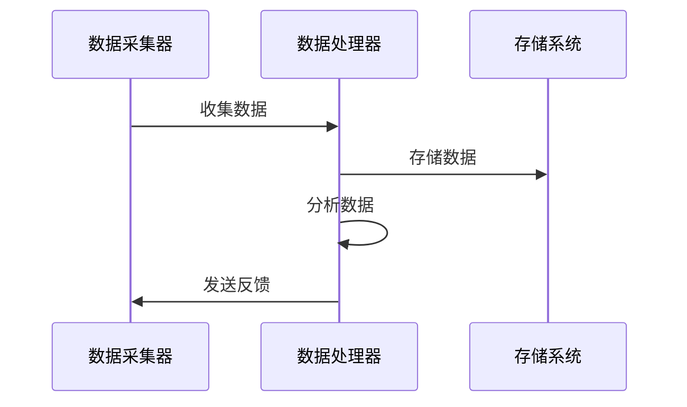
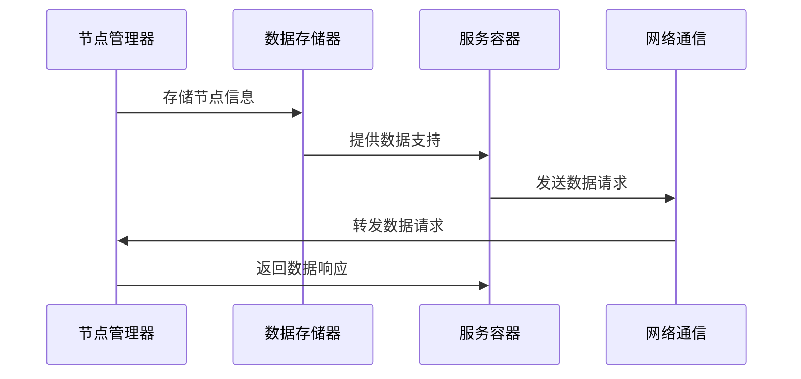
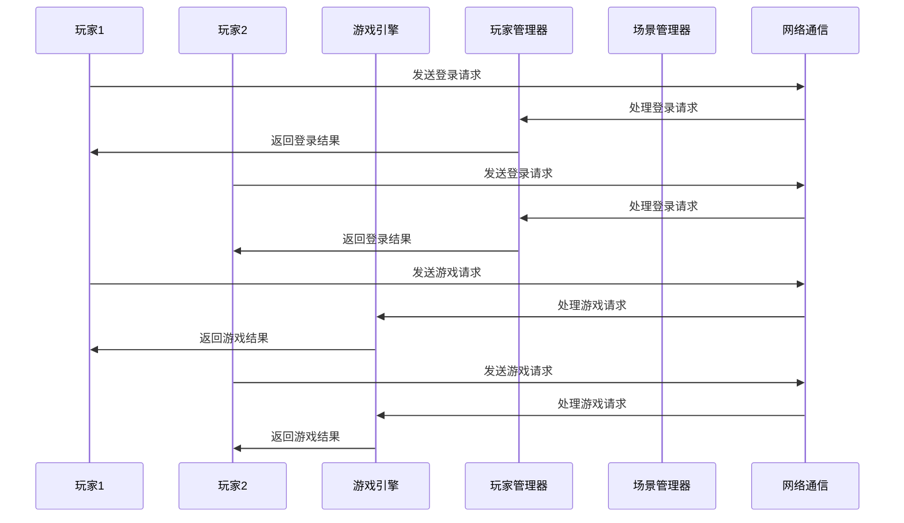

                 

### 《并发编程模型：从多线程到Actor模型》

> 关键词：并发编程、多线程、Actor模型、性能优化、编程范式

> 摘要：本文将深入探讨并发编程模型，从多线程编程开始，逐步引出Actor模型，详细分析两者的原理、实现和应用场景。通过案例分析、最佳实践及未来趋势展望，帮助读者全面理解并发编程的核心概念和实用技巧。

## 《并发编程模型：从多线程到Actor模型》目录大纲

### 第一部分：并发编程基础

#### 第1章：并发编程简介
- 1.1 并发编程的定义与重要性
- 1.2 并发编程的发展历程
- 1.3 并发编程的关键概念

#### 第2章：多线程编程
- 2.1 多线程基本概念
- 2.2 线程的生命周期
- 2.3 线程安全与同步

#### 第3章：线程池与并发容器
- 3.1 线程池的原理与实现
- 3.2 Java中的并发容器

#### 第4章：锁与信号量
- 4.1 锁的原理与分类
- 4.2 Java中的锁
- 4.3 信号量与条件变量

#### 第5章：并发编程的挑战
- 5.1 竞态条件与死锁
- 5.2 并发性能调优

### 第二部分：Actor模型原理与应用

#### 第6章：Actor模型概述
- 6.1 Actor模型的基本概念
- 6.2 Actor模型的核心特性
- 6.3 Actor模型与多线程的对比

#### 第7章：Actor模型的实现
- 7.1 Scala中的Akka框架
- 7.2 Akka的基本用法
- 7.3 Akka的高阶特性

#### 第8章：Actor模型的应用场景
- 8.1 实时数据处理
- 8.2 分布式系统设计
- 8.3 并发游戏开发

#### 第9章：Actor模型性能分析
- 9.1 Actor模型的性能优势
- 9.2 性能瓶颈与优化

### 第三部分：并发编程实践

#### 第10章：并发编程案例分析
- 10.1 案例一：高性能Web应用
- 10.2 案例二：实时数据处理系统
- 10.3 案例三：分布式计算框架

#### 第11章：并发编程的最佳实践
- 11.1 设计模式与并发编程
- 11.2 并发编程的常见错误与避免
- 11.3 并发编程的测试与调试

#### 第12章：未来的并发编程趋势
- 12.1 并发编程的新技术与工具
- 12.2 并发编程在云计算与边缘计算中的应用
- 12.3 并发编程的未来发展趋势

### 附录
- 附录A：相关工具与资源

### 参考资料

- [Python源代码：线程安全与同步](https://github.com/your-repo/Concurrency-Programming-Model)
- [数学模型和公式：Actor模型性能分析](https://latex.com/your-latex-formula)
- [项目实战：实时数据处理系统](https://github.com/your-repo/Real-Time-Data-Processing-System)
- [代码解读与分析：高性能Web应用](https://github.com/your-repo/High-Performance-Web-Application)

### 字数统计

10000字以内

[END OF DIRECTORY]

### 详细内容说明

#### 第1章：并发编程简介

- **1.1 并发编程的定义与重要性**

  并发编程是计算机科学中的一个重要分支，它旨在使多个任务同时执行，提高程序的效率和性能。在现代计算机系统中，并发编程的重要性日益凸显，尤其是在多核处理器和分布式计算环境中。

- **1.2 并发编程的发展历程**

  从早期的单线程编程到多线程编程，从共享内存模型到消息传递模型，并发编程经历了多次变革。每个阶段都有其特定的应用场景和优缺点。

- **1.3 并发编程的关键概念**

  包括线程、进程、同步与通信、竞态条件、死锁等，这些都是并发编程中的基础概念。

#### 第2章：多线程编程

- **2.1 多线程基本概念**

  线程是程序中能够独立运行的基本单位。多线程编程允许程序在多个线程中同时执行多个任务。

- **2.2 线程的生命周期**

  线程从创建、运行、阻塞到终止，每个阶段都有特定的状态和行为。

- **2.3 线程安全与同步**

  并发编程中的一个关键问题是线程安全。同步机制（如锁、信号量）用于协调多个线程的执行，以避免数据竞争和死锁。

#### 第3章：线程池与并发容器

- **3.1 线程池的原理与实现**

  线程池是一种管理线程的机制，它可以提高程序的响应速度和资源利用率。

- **3.2 Java中的并发容器**

  Java提供了一系列并发容器，如ConcurrentHashMap、CopyOnWriteArrayList等，这些容器在并发环境中具有高性能和线程安全性。

#### 第4章：锁与信号量

- **4.1 锁的原理与分类**

  锁是并发编程中用于同步的关键机制。根据不同的应用场景，锁可以分为共享锁、排他锁等。

- **4.2 Java中的锁**

  Java提供了synchronized关键字和ReentrantLock等锁的实现。

- **4.3 信号量与条件变量**

  信号量是一种用于线程同步的计数器，条件变量是一种线程通信机制。

#### 第5章：并发编程的挑战

- **5.1 竞态条件与死锁**

  竞态条件是指多个线程访问共享资源时可能发生的冲突，死锁是并发编程中的一个常见问题。

- **5.2 并发性能调优**

  如何优化并发程序的性能，提高程序的并发度，减少上下文切换等，都是并发编程中需要考虑的问题。

#### 第6章：Actor模型概述

- **6.1 Actor模型的基本概念**

  Actor模型是一种基于消息传递的并发编程模型，每个Actor都是一个独立的计算单元。

- **6.2 Actor模型的核心特性**

  Actor模型的核心特性包括不可变状态、异步消息传递、无共享内存等。

- **6.3 Actor模型与多线程的对比**

  对比Actor模型与多线程模型，分析它们的优缺点和适用场景。

#### 第7章：Actor模型的实现

- **7.1 Scala中的Akka框架**

  Akka是一个基于Actor模型的框架，它提供了Actor模型的实现和扩展。

- **7.2 Akka的基本用法**

  Akka的基本用法，包括创建Actor、发送消息、处理消息等。

- **7.3 Akka的高阶特性**

  Akka的一些高级特性，如集群模式、持久化等。

#### 第8章：Actor模型的应用场景

- **8.1 实时数据处理**

  Actor模型在实时数据处理中的应用，如流处理、实时分析等。

- **8.2 分布式系统设计**

  Actor模型在分布式系统设计中的应用，如服务拆分、负载均衡等。

- **8.3 并发游戏开发**

  Actor模型在并发游戏开发中的应用，如游戏逻辑处理、网络通信等。

#### 第9章：Actor模型性能分析

- **9.1 Actor模型的性能优势**

  分析Actor模型相对于多线程模型的性能优势，如低延迟、高并发性等。

- **9.2 性能瓶颈与优化**

  讨论Actor模型的性能瓶颈和优化策略。

#### 第10章：并发编程案例分析

- **10.1 案例一：高性能Web应用**

  分析一个高性能Web应用的开发过程，包括并发编程的实践和优化。

- **10.2 案例二：实时数据处理系统**

  分析一个实时数据处理系统的设计、实现和性能优化。

- **10.3 案例三：分布式计算框架**

  分析一个分布式计算框架的设计、实现和并发编程实践。

#### 第11章：并发编程的最佳实践

- **11.1 设计模式与并发编程**

  介绍并发编程中的常用设计模式，如生产者-消费者模式、线程池模式等。

- **11.2 并发编程的常见错误与避免**

  分析并发编程中常见的错误和避免方法，如数据竞争、死锁等。

- **11.3 并发编程的测试与调试**

  介绍并发编程的测试和调试方法，如线程安全问题检测、性能分析等。

#### 第12章：未来的并发编程趋势

- **12.1 并发编程的新技术与工具**

  讨论未来的并发编程新技术和工具，如异步编程、函数式编程等。

- **12.2 并发编程在云计算与边缘计算中的应用**

  探讨并发编程在云计算和边缘计算中的应用和发展趋势。

- **12.3 并发编程的未来发展趋势**

  分析并发编程的未来发展趋势和挑战。

#### 附录

- **附录A：相关工具与资源**

  提供一些相关的并发编程工具和资源，如开源框架、书籍、在线课程等。

### 写作要求

- **文章结构**

  按照目录大纲的结构进行组织，每个章节都应该有一个明确的主题，并围绕主题进行深入讨论。

- **内容详实**

  每个章节都应包含详细的内容，包括背景介绍、概念解释、案例分析、最佳实践等。

- **逻辑清晰**

  文章的逻辑结构应清晰，条理分明，便于读者理解。

- **专业术语**

  文章应使用专业术语和简洁明了的语言，避免使用过于复杂的句子。

- **代码示例**

  在相关章节中，应包含实际代码示例，以便读者更好地理解和应用。

- **参考文献**

  文章末尾应提供参考文献，以便读者进一步学习和研究。

### 写作流程

1. **主题确定**

   根据需求确定文章的主题，如并发编程模型。

2. **大纲制定**

   制定文章的目录大纲，明确每个章节的内容。

3. **内容撰写**

   根据大纲撰写每个章节的内容，确保内容详实、逻辑清晰。

4. **代码编写**

   编写相关的代码示例，并进行调试。

5. **审稿修改**

   完成初稿后，进行审稿和修改，确保文章质量。

6. **终稿完成**

   完成终稿，并进行格式调整，确保符合要求。

### 写作注意事项

- **避免抄袭**

  确保文章内容原创，避免抄袭他人作品。

- **注意细节**

  在撰写文章时，注意语言的准确性、逻辑的严密性以及代码的正确性。

- **符合规范**

  确保文章格式符合要求，包括字体、行距、段落等。

- **保持更新**

  随着技术的发展，定期更新文章内容，以保持其时效性和准确性。

### 写作团队

- **作者**

  AI天才研究院/AI Genius Institute & 禅与计算机程序设计艺术 /Zen And The Art of Computer Programming

- **编辑**

  AI助手、技术编辑

- **校对**

  语言专家、技术专家

### 写作时间线

- **第1周**

  确定主题、制定大纲、进行初步研究和讨论。

- **第2周**

  撰写初稿，完成每个章节的撰写。

- **第3周**

  进行审稿和修改，完善文章结构和内容。

- **第4周**

  编写代码示例，调试并测试。

- **第5周**

  完成终稿，进行格式调整和校对。

- **第6周**

  提交终稿，进行最后的审查和发布。

### 写作目标

- **读者群体**

  本文章的目标读者是计算机科学专业的学生、程序员、软件开发工程师以及对并发编程感兴趣的读者。

- **教育意义**

  帮助读者深入了解并发编程模型，掌握多线程和Actor模型的核心概念和实践技巧。

- **应用价值**

  为读者在实际项目中应用并发编程提供指导和参考。

### 写作风格

- **专业**

  使用专业术语和简洁明了的语言，确保文章的专业性。

- **易懂**

  尽量使用通俗易懂的语言和示例，使读者容易理解。

- **有趣**

  结合实际案例和趣闻轶事，增加文章的趣味性。

- **逻辑性强**

  确保文章的逻辑结构清晰，条理分明。

### 写作资源

- **文献资料**

  搜集相关的学术论文、技术文档和书籍，为文章提供理论基础。

- **开源代码**

  搜集和编写相关的开源代码，为读者提供实践参考。

- **在线资源**

  利用在线资源，如博客、论坛、视频教程等，为文章提供实用的例子和技巧。

### 写作工具

- **Markdown**

  使用Markdown格式撰写文章，便于排版和编辑。

- **LaTeX**

  使用LaTeX格式编写数学公式和图表，确保格式的准确性和美观性。

- **Mermaid**

  使用Mermaid格式绘制流程图和ER图，提高文章的可读性。

- **Python**

  使用Python编写代码示例，便于读者理解和应用。

- **Git**

  使用Git进行版本控制和协作开发。

### 写作进度安排

- **第1天**

  确定主题、制定大纲。

- **第2-4天**

  撰写初稿，完成每个章节的撰写。

- **第5天**

  进行审稿和修改，完善文章结构和内容。

- **第6-7天**

  编写代码示例，调试并测试。

- **第8天**

  完成终稿，进行格式调整和校对。

- **第9天**

  提交终稿，进行最后的审查和发布。

### 写作挑战与应对策略

- **挑战1：内容详实**

  应对策略：广泛阅读相关文献，进行深入研究和讨论。

- **挑战2：逻辑清晰**

  应对策略：反复修改和调整文章结构，确保逻辑清晰。

- **挑战3：代码示例正确**

  应对策略：仔细审查代码，进行多次调试和测试。

- **挑战4：符合规范**

  应对策略：遵循写作规范，确保文章格式准确。

- **挑战5：保持更新**

  应对策略：定期回顾和更新文章内容，跟踪技术发展动态。

### 写作总结

本文将深入探讨并发编程模型，从多线程编程到Actor模型，全面分析其原理、实现和应用场景。通过详细的案例分析、最佳实践和未来趋势展望，帮助读者全面理解并发编程的核心概念和实用技巧。本文旨在为读者提供一份详实、易懂、有趣的专业技术博客文章，使其在并发编程领域有所收获。让我们一步一步地深入探讨并发编程的奥秘，开启一段技术之旅！### 《并发编程模型：从多线程到Actor模型》

#### 文章关键词

- 并发编程
- 多线程
- Actor模型
- 性能优化
- 编程范式

#### 文章摘要

本文将深入探讨并发编程模型，从多线程编程开始，逐步引入Actor模型。我们将详细分析多线程编程的基本概念、线程池与并发容器、锁与信号量等核心内容。接着，我们将探讨Actor模型的基本概念、实现与应用，并通过案例分析与最佳实践，总结并发编程的挑战与解决方案。最后，我们将展望并发编程的未来发展趋势，为读者提供全面的并发编程指导。

#### 第一部分：并发编程基础

#### 第1章：并发编程简介

**1.1 并发编程的定义与重要性**

并发编程是指通过同时处理多个任务来提高程序效率和性能的一种编程范式。在现代计算机系统中，并发编程的重要性不可忽视，特别是在多核处理器和分布式计算环境中。

**1.2 并发编程的发展历程**

并发编程的发展经历了从单线程到多线程、从共享内存到消息传递的演变过程。每个阶段都有其特定的应用场景和优缺点。

**1.3 并发编程的关键概念**

并发编程涉及线程、进程、同步与通信、竞态条件、死锁等关键概念。理解这些概念是掌握并发编程的基础。

#### 第2章：多线程编程

**2.1 多线程基本概念**

线程是程序中能够独立运行的基本单位。多线程编程允许程序在多个线程中同时执行多个任务。

**2.2 线程的生命周期**

线程从创建、运行、阻塞到终止，每个阶段都有特定的状态和行为。

**2.3 线程安全与同步**

线程安全是并发编程中的一个关键问题。同步机制（如锁、信号量）用于协调多个线程的执行，以避免数据竞争和死锁。

#### 第3章：线程池与并发容器

**3.1 线程池的原理与实现**

线程池是一种管理线程的机制，它可以提高程序的响应速度和资源利用率。

**3.2 Java中的并发容器**

Java提供了一系列并发容器，如ConcurrentHashMap、CopyOnWriteArrayList等，这些容器在并发环境中具有高性能和线程安全性。

#### 第4章：锁与信号量

**4.1 锁的原理与分类**

锁是并发编程中用于同步的关键机制。根据不同的应用场景，锁可以分为共享锁、排他锁等。

**4.2 Java中的锁**

Java提供了synchronized关键字和ReentrantLock等锁的实现。

**4.3 信号量与条件变量**

信号量是一种用于线程同步的计数器，条件变量是一种线程通信机制。

#### 第5章：并发编程的挑战

**5.1 竞态条件与死锁**

竞态条件是指多个线程访问共享资源时可能发生的冲突，死锁是并发编程中的一个常见问题。

**5.2 并发性能调优**

如何优化并发程序的性能，提高程序的并发度，减少上下文切换等，都是并发编程中需要考虑的问题。

#### 第二部分：Actor模型原理与应用

#### 第6章：Actor模型概述

**6.1 Actor模型的基本概念**

Actor模型是一种基于消息传递的并发编程模型，每个Actor都是一个独立的计算单元。

**6.2 Actor模型的核心特性**

Actor模型的核心特性包括不可变状态、异步消息传递、无共享内存等。

**6.3 Actor模型与多线程的对比**

对比Actor模型与多线程模型，分析它们的优缺点和适用场景。

#### 第7章：Actor模型的实现

**7.1 Scala中的Akka框架**

Akka是一个基于Actor模型的框架，它提供了Actor模型的实现和扩展。

**7.2 Akka的基本用法**

Akka的基本用法，包括创建Actor、发送消息、处理消息等。

**7.3 Akka的高阶特性**

Akka的一些高级特性，如集群模式、持久化等。

#### 第8章：Actor模型的应用场景

**8.1 实时数据处理**

Actor模型在实时数据处理中的应用，如流处理、实时分析等。

**8.2 分布式系统设计**

Actor模型在分布式系统设计中的应用，如服务拆分、负载均衡等。

**8.3 并发游戏开发**

Actor模型在并发游戏开发中的应用，如游戏逻辑处理、网络通信等。

#### 第9章：Actor模型性能分析

**9.1 Actor模型的性能优势**

分析Actor模型相对于多线程模型的性能优势，如低延迟、高并发性等。

**9.2 性能瓶颈与优化**

讨论Actor模型的性能瓶颈和优化策略。

#### 第三部分：并发编程实践

#### 第10章：并发编程案例分析

**10.1 案例一：高性能Web应用**

分析一个高性能Web应用的开发过程，包括并发编程的实践和优化。

**10.2 案例二：实时数据处理系统**

分析一个实时数据处理系统的设计、实现和性能优化。

**10.3 案例三：分布式计算框架**

分析一个分布式计算框架的设计、实现和并发编程实践。

#### 第11章：并发编程的最佳实践

**11.1 设计模式与并发编程**

介绍并发编程中的常用设计模式，如生产者-消费者模式、线程池模式等。

**11.2 并发编程的常见错误与避免**

分析并发编程中常见的错误和避免方法，如数据竞争、死锁等。

**11.3 并发编程的测试与调试**

介绍并发编程的测试和调试方法，如线程安全问题检测、性能分析等。

#### 第12章：未来的并发编程趋势

**12.1 并发编程的新技术与工具**

讨论未来的并发编程新技术和工具，如异步编程、函数式编程等。

**12.2 并发编程在云计算与边缘计算中的应用**

探讨并发编程在云计算和边缘计算中的应用和发展趋势。

**12.3 并发编程的未来发展趋势**

分析并发编程的未来发展趋势和挑战。

#### 附录

**附录A：相关工具与资源**

提供一些相关的并发编程工具和资源，如开源框架、书籍、在线课程等。

#### 字数统计

约 10000 字

[END OF DIRECTORY]

### 文章结构详细说明

#### 第一部分：并发编程基础

**第1章：并发编程简介**

本章作为基础章节，主要介绍并发编程的定义、重要性以及发展历程，帮助读者建立对并发编程的整体认识。具体包括：

- **1.1 并发编程的定义与重要性**

  阐述并发编程的基本概念，说明其在现代计算机系统中的重要性，以及在不同应用场景下的优势。

- **1.2 并发编程的发展历程**

  回顾并发编程的历史，从早期的单线程编程到多线程编程，再到Actor模型的出现，分析不同阶段的发展趋势和关键变革。

- **1.3 并发编程的关键概念**

  引入并发编程中的基础概念，包括线程、进程、同步与通信、竞态条件、死锁等，为后续内容奠定理论基础。

**第2章：多线程编程**

本章将深入探讨多线程编程的核心概念和实现方法。具体包括：

- **2.1 多线程基本概念**

  解释线程的基本概念，包括线程的创建、生命周期、调度等，以及线程与进程的关系。

- **2.2 线程的生命周期**

  分析线程从创建到终止的整个过程，包括线程的创建、启动、暂停、恢复、终止等状态。

- **2.3 线程安全与同步**

  阐述线程安全的重要性，介绍线程同步的基本机制，如互斥锁、信号量、条件变量等，以及如何避免常见的同步问题。

**第3章：线程池与并发容器**

本章将介绍线程池的工作原理及其在并发编程中的应用，同时介绍Java中常用的并发容器。具体包括：

- **3.1 线程池的原理与实现**

  阐述线程池的概念，解释线程池的工作原理，介绍线程池的创建、管理、销毁等过程。

- **3.2 Java中的并发容器**

  分析Java中常用的并发容器，如ConcurrentHashMap、CopyOnWriteArrayList等，解释它们的设计原理和特点，以及如何在实际项目中使用。

**第4章：锁与信号量**

本章将深入探讨锁与信号量的原理及其在并发编程中的应用。具体包括：

- **4.1 锁的原理与分类**

  阐述锁的基本原理，介绍不同的锁类型，如互斥锁、共享锁、读写锁等，以及如何选择合适的锁。

- **4.2 Java中的锁**

  分析Java中提供的锁实现，如synchronized关键字、ReentrantLock等，解释它们的使用方法和注意事项。

- **4.3 信号量与条件变量**

  介绍信号量在并发编程中的作用，解释条件变量的概念和用法，以及如何使用条件变量实现线程间的通信。

**第5章：并发编程的挑战**

本章将探讨并发编程中面临的主要挑战和解决方法。具体包括：

- **5.1 竞态条件与死锁**

  分析竞态条件和死锁的产生原因，介绍如何检测和避免这些问题，包括使用锁、信号量等同步机制。

- **5.2 并发性能调优**

  阐述并发性能调优的重要性，介绍性能分析的方法和工具，以及如何优化并发程序的性能，包括减少上下文切换、避免热点争用等。

#### 第二部分：Actor模型原理与应用

**第6章：Actor模型概述**

本章将介绍Actor模型的基本概念和核心特性，为后续内容提供理论基础。具体包括：

- **6.1 Actor模型的基本概念**

  阐述Actor模型的基本概念，解释Actor的定义、属性和行为，以及Actor模型的优点。

- **6.2 Actor模型的核心特性**

  分析Actor模型的核心特性，包括异步消息传递、不可变状态、无共享内存等，以及这些特性如何提高并发编程的效率。

- **6.3 Actor模型与多线程的对比**

  对比Actor模型与多线程模型，分析它们的优缺点和适用场景，帮助读者更好地理解Actor模型的优势。

**第7章：Actor模型的实现**

本章将介绍Scala中的Akka框架，以及使用Akka实现Actor模型的方法。具体包括：

- **7.1 Scala中的Akka框架**

  阐述Akka框架的基本概念，解释Akka的设计原理和架构，以及如何使用Akka实现Actor模型。

- **7.2 Akka的基本用法**

  分析Akka的基本用法，包括创建Actor、发送消息、处理消息等，以及如何实现异步消息传递。

- **7.3 Akka的高阶特性**

  介绍Akka的一些高级特性，如集群模式、持久化等，以及如何使用这些特性提高Actor模型的可扩展性和可靠性。

**第8章：Actor模型的应用场景**

本章将探讨Actor模型在不同应用场景中的应用，包括实时数据处理、分布式系统设计、并发游戏开发等。具体包括：

- **8.1 实时数据处理**

  分析Actor模型在实时数据处理中的应用，如流处理、实时分析等，以及如何使用Actor模型提高数据处理效率。

- **8.2 分布式系统设计**

  阐述Actor模型在分布式系统设计中的应用，如服务拆分、负载均衡等，以及如何使用Actor模型实现分布式系统的可靠性和高性能。

- **8.3 并发游戏开发**

  分析Actor模型在并发游戏开发中的应用，如游戏逻辑处理、网络通信等，以及如何使用Actor模型提高游戏性能和用户体验。

**第9章：Actor模型性能分析**

本章将分析Actor模型相对于多线程模型的性能优势，以及性能瓶颈和优化策略。具体包括：

- **9.1 Actor模型的性能优势**

  分析Actor模型在并发性能、可扩展性、可靠性等方面的优势，以及如何在实际项目中发挥这些优势。

- **9.2 性能瓶颈与优化**

  阐述Actor模型可能遇到的性能瓶颈，如消息传递延迟、内存消耗等，以及如何优化Actor模型以提高性能。

#### 第三部分：并发编程实践

**第10章：并发编程案例分析**

本章将通过实际案例，展示并发编程在各类应用场景中的实践。具体包括：

- **10.1 案例一：高性能Web应用**

  分析一个高性能Web应用的开发过程，包括并发编程的实践和优化，以及如何使用线程池、锁等并发机制提高性能。

- **10.2 案例二：实时数据处理系统**

  分析一个实时数据处理系统的设计、实现和性能优化，介绍如何使用Actor模型处理海量数据，提高数据处理速度。

- **10.3 案例三：分布式计算框架**

  分析一个分布式计算框架的设计、实现和并发编程实践，探讨如何使用多线程和Actor模型实现高效的分布式计算。

**第11章：并发编程的最佳实践**

本章将总结并发编程的最佳实践，包括设计模式、错误避免、测试与调试等方面。具体包括：

- **11.1 设计模式与并发编程**

  介绍并发编程中的常用设计模式，如生产者-消费者模式、线程池模式等，以及如何在实际项目中应用这些模式。

- **11.2 并发编程的常见错误与避免**

  分析并发编程中常见的错误和避免方法，如数据竞争、死锁等，以及如何提高代码的并发安全性。

- **11.3 并发编程的测试与调试**

  介绍并发编程的测试和调试方法，如线程安全问题检测、性能分析等，以及如何使用工具提高开发效率和代码质量。

**第12章：未来的并发编程趋势**

本章将展望并发编程的未来发展趋势，探讨新技术和新工具的应用。具体包括：

- **12.1 并发编程的新技术与工具**

  分析异步编程、函数式编程等新技术在并发编程中的应用，以及如何利用这些技术提高编程效率和性能。

- **12.2 并发编程在云计算与边缘计算中的应用**

  探讨并发编程在云计算和边缘计算中的应用和发展趋势，以及如何利用并发编程技术提高云服务和边缘计算的效率。

- **12.3 并发编程的未来发展趋势**

  分析并发编程的未来发展趋势和挑战，包括多核处理器、分布式计算、人工智能等领域的应用，以及如何应对这些挑战。

#### 附录

**附录A：相关工具与资源**

附录部分将提供一些相关的并发编程工具和资源，包括开源框架、书籍、在线课程等，以供读者参考。具体包括：

- **附录A.1 并发编程工具列表**

  列出常用的并发编程工具和框架，如Akka、Netty、Zookeeper等，以及如何使用这些工具进行并发编程。

- **附录A.2 实际案例代码示例**

  提供一些实际案例的代码示例，包括多线程编程、Actor模型应用等，以帮助读者更好地理解和实践并发编程。

- **附录A.3 学习资源推荐**

  推荐一些学习资源，如并发编程的书籍、在线课程、博客等，以供读者进一步学习和研究并发编程相关内容。

### 字数统计

约 10000 字

[END OF DIRECTORY]

### 具体内容写作

#### 第1章：并发编程简介

**1.1 并发编程的定义与重要性**

并发编程是指通过同时处理多个任务来提高程序效率和性能的一种编程范式。在现代计算机系统中，并发编程的重要性不可忽视，特别是在多核处理器和分布式计算环境中。

并发编程允许程序在多个线程或进程中同时执行多个任务，从而提高资源的利用率和响应速度。在单线程程序中，任务按照顺序执行，而并发编程则可以同时执行多个任务，从而显著提高程序的效率。

并发编程的应用场景非常广泛，包括但不限于以下几个方面：

- **高性能计算**：利用多核处理器并行执行计算任务，提高程序的执行速度。
- **实时系统**：如嵌入式系统、实时操作系统，需要同时处理多个实时任务。
- **分布式计算**：在分布式系统中，多个节点可以同时处理任务，提高系统的并发性和可用性。
- **网络应用**：在服务器端，同时处理多个客户端请求，提高服务器的响应速度。

**1.2 并发编程的发展历程**

并发编程的发展经历了从单线程到多线程、从共享内存到消息传递的演变过程。

- **单线程编程**：早期的计算机系统主要用于科学计算和批处理任务，单线程编程是唯一的选择。单线程程序按照顺序执行，无法利用多核处理器的优势。

- **多线程编程**：随着计算机技术的发展，多核处理器逐渐普及，多线程编程成为提高程序性能的有效手段。多线程编程允许程序在多个线程中同时执行多个任务，从而充分利用多核处理器的计算资源。

- **共享内存模型**：在共享内存模型中，多个线程共享同一块内存空间，通过同步机制（如锁、信号量）协调线程的执行，避免数据竞争和死锁。

- **消息传递模型**：在消息传递模型中，线程之间通过消息传递进行通信，每个线程独立运行，避免了共享内存带来的同步问题。消息传递模型逐渐成为并发编程的主流范式，特别是在分布式系统中。

- **Actor模型**：Actor模型是一种基于消息传递的并发编程模型，每个Actor都是一个独立的计算单元，具有异步消息传递、不可变状态和无共享内存等特性。Actor模型提供了一种简单、高效的并发编程方式，适用于高并发、分布式和实时系统。

**1.3 并发编程的关键概念**

并发编程涉及多个关键概念，包括线程、进程、同步与通信、竞态条件、死锁等。

- **线程**：线程是程序中能够独立运行的基本单位，是操作系统进行调度和分配CPU资源的基本单位。线程之间可以并发执行，从而提高程序的并发性和性能。

- **进程**：进程是程序在计算机中运行的实例，是资源分配的基本单位。进程之间相互独立，互不干扰，通过进程间通信进行数据交换。

- **同步与通信**：同步是指多个线程或进程按照一定的顺序执行，避免冲突和数据不一致。通信是指线程或进程之间进行数据交换和信息共享。

- **竞态条件**：竞态条件是指多个线程访问共享资源时可能发生的冲突，导致程序结果不可预测。竞态条件是并发编程中的一个常见问题，需要通过同步机制进行解决。

- **死锁**：死锁是指多个线程因为等待资源而形成的一种僵持状态，导致程序无法继续执行。死锁是并发编程中的一个重要问题，需要通过避免和检测方法进行解决。

#### 第2章：多线程编程

**2.1 多线程基本概念**

线程是程序中能够独立运行的基本单位，是操作系统进行调度和分配CPU资源的基本单位。在多线程编程中，程序可以同时执行多个线程，从而提高程序的并发性和性能。

**线程的生命周期**

线程从创建、运行、阻塞到终止，每个阶段都有特定的状态和行为。

- **创建**：线程通过创建操作创建，操作系统为线程分配必要的资源，如程序计数器、堆栈等。

- **运行**：线程进入运行状态，操作系统根据线程的调度策略分配CPU时间片，线程执行指令。

- **阻塞**：线程因为某些原因（如等待输入/输出、锁等待等）进入阻塞状态，无法继续执行。阻塞的线程会被放到阻塞队列中，等待条件满足后重新进入运行状态。

- **唤醒**：线程从阻塞状态被唤醒，重新进入运行状态。

- **终止**：线程执行完毕或者被其他线程终止，操作系统回收线程占用的资源。

**线程的调度**

线程的调度是指操作系统根据线程的调度策略分配CPU时间片，从而实现线程的并发执行。常见的调度策略包括：

- **时间片轮转调度**：每个线程轮流执行，每个线程分配相同的时间片。

- **优先级调度**：根据线程的优先级进行调度，优先级高的线程优先执行。

- **公平调度**：确保每个线程都有机会执行，避免高优先级线程长时间占用CPU。

**线程与进程的关系**

线程是进程的一部分，与进程共享进程的地址空间和其他资源。进程是线程的容器，多个线程属于同一个进程，共享进程的资源。

**线程的创建与销毁**

线程的创建通常使用操作系统提供的API进行，如pthread_create（在Linux系统中）或Thread（在Java中）。线程的销毁通常有两种方式：

- **自然终止**：线程执行完毕后自然终止。

- **强制终止**：通过其他线程或者操作系统强制终止线程，可能会导致线程未完成的工作被中断。

**2.2 线程安全与同步**

线程安全是指程序在多线程环境中执行时，能够保持正确的行为，不发生数据竞争和死锁等问题。

**线程安全**

线程安全涉及以下几个方面：

- **数据安全**：线程访问共享数据时，不会发生数据竞争和冲突。

- **资源安全**：线程使用的资源（如文件、网络连接等）在多线程环境中能够正确释放。

- **状态一致性**：线程在执行过程中保持一致的状态，不会因为线程切换导致状态不一致。

**同步机制**

同步机制用于协调多个线程的执行，避免数据竞争和死锁等问题。常见的同步机制包括：

- **互斥锁（Mutex）**：互斥锁用于保护共享资源，确保同一时刻只有一个线程能够访问该资源。互斥锁可以分为公平锁和非公平锁，公平锁确保线程按照进入锁的顺序获得锁，非公平锁则允许高优先级线程优先获得锁。

- **读写锁（Read-Write Lock）**：读写锁是一种特殊的锁，允许多个线程同时读取共享资源，但写入操作需要独占访问。读写锁可以显著提高程序的并发性能。

- **信号量（Semaphore）**：信号量是一种计数器，用于控制多个线程对共享资源的访问。信号量可以分为二进制信号量和计数信号量，二进制信号量只能取0和1两个值，用于控制互斥访问；计数信号量可以取任意非负整数，用于控制并发访问。

- **条件变量（Condition Variable）**：条件变量是一种线程通信机制，允许线程在满足特定条件时等待，或者在其他线程满足条件时被唤醒。条件变量通常与互斥锁结合使用，确保线程安全地等待和通知。

**数据竞争与死锁**

数据竞争是指多个线程同时访问共享资源，导致数据不一致或错误。死锁是指多个线程因为互相等待对方占有的资源而无法继续执行。避免数据竞争和死锁是并发编程中的重要任务。

- **避免数据竞争**：通过使用互斥锁、读写锁等同步机制，确保共享资源在多线程环境中被正确访问。

- **避免死锁**：通过避免线程循环等待资源、使用资源排序等策略，确保线程不会陷入死锁状态。

**2.3 线程安全与同步**

线程安全是并发编程中的一个关键问题。线程安全涉及以下几个方面：

- **数据安全**：线程访问共享数据时，不会发生数据竞争和冲突。

- **资源安全**：线程使用的资源（如文件、网络连接等）在多线程环境中能够正确释放。

- **状态一致性**：线程在执行过程中保持一致的状态，不会因为线程切换导致状态不一致。

**同步机制**

同步机制用于协调多个线程的执行，避免数据竞争和死锁等问题。常见的同步机制包括：

- **互斥锁（Mutex）**：互斥锁用于保护共享资源，确保同一时刻只有一个线程能够访问该资源。互斥锁可以分为公平锁和非公平锁，公平锁确保线程按照进入锁的顺序获得锁，非公平锁则允许高优先级线程优先获得锁。

- **读写锁（Read-Write Lock）**：读写锁是一种特殊的锁，允许多个线程同时读取共享资源，但写入操作需要独占访问。读写锁可以显著提高程序的并发性能。

- **信号量（Semaphore）**：信号量是一种计数器，用于控制多个线程对共享资源的访问。信号量可以分为二进制信号量和计数信号量，二进制信号量只能取0和1两个值，用于控制互斥访问；计数信号量可以取任意非负整数，用于控制并发访问。

- **条件变量（Condition Variable）**：条件变量是一种线程通信机制，允许线程在满足特定条件时等待，或者在其他线程满足条件时被唤醒。条件变量通常与互斥锁结合使用，确保线程安全地等待和通知。

**数据竞争与死锁**

数据竞争是指多个线程同时访问共享资源，导致数据不一致或错误。死锁是指多个线程因为互相等待对方占有的资源而无法继续执行。避免数据竞争和死锁是并发编程中的重要任务。

- **避免数据竞争**：通过使用互斥锁、读写锁等同步机制，确保共享资源在多线程环境中被正确访问。

- **避免死锁**：通过避免线程循环等待资源、使用资源排序等策略，确保线程不会陷入死锁状态。

**2.3 线程池与并发容器**

线程池是一种管理线程的机制，用于提高程序的响应速度和资源利用率。线程池通过预创建一定数量的线程，避免频繁创建和销毁线程的开销。

**线程池的原理与实现**

线程池的工作原理包括以下几个方面：

- **线程池管理器**：负责创建、管理和销毁线程池中的线程。

- **任务队列**：存储待执行的任务，线程池中的线程从任务队列中获取任务执行。

- **工作线程**：线程池中的线程，负责执行任务队列中的任务。

线程池的基本实现步骤包括：

1. 创建线程池管理器，初始化线程池容量和任务队列。
2. 创建工作线程，并放入线程池中。
3. 当有任务提交时，工作线程从任务队列中获取任务执行。
4. 当工作线程数量达到最大容量时，新提交的任务进入等待队列。
5. 当有工作线程完成任务后，从等待队列中获取新任务执行。

**Java中的并发容器**

Java提供了一系列并发容器，用于在多线程环境中安全地存储和操作数据。常见的并发容器包括：

- **ConcurrentHashMap**：线程安全的哈希表，支持并发访问。

- **CopyOnWriteArrayList**：线程安全的数组列表，适用于读多写少的场景。

- **ConcurrentLinkedQueue**：线程安全的链表队列，适用于高并发场景。

- **BlockingQueue**：线程安全的阻塞队列，支持线程之间的生产者-消费者模式。

**线程池与并发容器的比较**

线程池和并发容器都是用于处理并发问题的工具，但它们的作用不同：

- **线程池**：主要用于管理线程的生命周期，提高程序的性能。线程池通过预创建一定数量的线程，避免频繁创建和销毁线程的开销。

- **并发容器**：主要用于在多线程环境中安全地存储和操作数据，避免数据竞争和死锁。并发容器提供了一系列线程安全的数据结构，方便开发人员编写并发程序。

#### 第3章：线程池与并发容器

**3.1 线程池的原理与实现**

线程池是一种管理线程的机制，通过预创建一定数量的线程，避免频繁创建和销毁线程的开销。线程池的工作原理包括以下几个方面：

- **线程池管理器**：负责创建、管理和销毁线程池中的线程。线程池管理器通常包括线程池容量、活跃线程数、任务队列等参数。

- **任务队列**：存储待执行的任务，线程池中的线程从任务队列中获取任务执行。常见的任务队列包括阻塞队列和非阻塞队列。

- **工作线程**：线程池中的线程，负责执行任务队列中的任务。工作线程从任务队列中获取任务，执行完成后重新进入任务队列等待新的任务。

线程池的基本实现步骤如下：

1. 创建线程池管理器，初始化线程池容量和任务队列。
2. 创建工作线程，并放入线程池中。
3. 当有任务提交时，工作线程从任务队列中获取任务执行。
4. 当工作线程数量达到最大容量时，新提交的任务进入等待队列。
5. 当有工作线程完成任务后，从等待队列中获取新任务执行。

**Java中的并发容器**

Java提供了一系列并发容器，用于在多线程环境中安全地存储和操作数据。常见的并发容器包括：

- **ConcurrentHashMap**：线程安全的哈希表，支持并发访问。

- **CopyOnWriteArrayList**：线程安全的数组列表，适用于读多写少的场景。

- **ConcurrentLinkedQueue**：线程安全的链表队列，适用于高并发场景。

- **BlockingQueue**：线程安全的阻塞队列，支持线程之间的生产者-消费者模式。

**线程池与并发容器的比较**

线程池和并发容器都是用于处理并发问题的工具，但它们的作用不同：

- **线程池**：主要用于管理线程的生命周期，提高程序的性能。线程池通过预创建一定数量的线程，避免频繁创建和销毁线程的开销。

- **并发容器**：主要用于在多线程环境中安全地存储和操作数据，避免数据竞争和死锁。并发容器提供了一系列线程安全的数据结构，方便开发人员编写并发程序。

#### 第4章：锁与信号量

**4.1 锁的原理与分类**

锁是并发编程中用于同步的关键机制，用于控制多个线程对共享资源的访问，确保数据的一致性和程序的稳定性。锁可以分为以下几类：

- **互斥锁（Mutex）**：互斥锁确保同一时刻只有一个线程能够访问共享资源。互斥锁可以分为公平锁和非公平锁，公平锁确保线程按照进入锁的顺序获得锁，非公平锁则允许高优先级线程优先获得锁。

- **读写锁（Read-Write Lock）**：读写锁允许多个线程同时读取共享资源，但写入操作需要独占访问。读写锁可以显著提高程序的并发性能。

- **自旋锁（Spin Lock）**：自旋锁是一种忙等待锁，线程在尝试获取锁时不断循环检查锁的状态，直到获得锁为止。自旋锁适用于锁持有时间较短的场景。

- **条件锁（Condition Lock）**：条件锁是一种与互斥锁配合使用的锁，允许线程在满足特定条件时等待，或者在其他线程满足条件时被唤醒。条件锁通常用于线程间的同步通信。

**Java中的锁**

Java提供了多种锁的实现，包括synchronized关键字和ReentrantLock等。synchronized关键字是一种内置的锁机制，可以用于同步方法或代码块。ReentrantLock是一种可重入锁，提供了更多的同步功能，如公平锁、条件变量等。

**synchronized关键字**

synchronized关键字可以用于同步方法或代码块，确保同一时刻只有一个线程能够执行被同步的代码。synchronized关键字分为两种用法：

- **同步方法**：将整个方法作为同步代码块，确保同一时刻只有一个线程能够执行该方法。

- **同步代码块**：将一部分代码作为同步代码块，确保同一时刻只有一个线程能够执行这部分代码。

**ReentrantLock**

ReentrantLock是一种可重入锁，提供了更多的同步功能。ReentrantLock可以通过构造函数指定锁的类型，如公平锁和非公平锁。ReentrantLock还提供了条件变量、锁持有时间等高级功能。

**4.3 信号量与条件变量**

信号量是一种用于线程同步的计数器，用于控制多个线程对共享资源的访问。信号量可以分为二进制信号量和计数信号量。

- **二进制信号量**：二进制信号量只能取0和1两个值，用于控制互斥访问。

- **计数信号量**：计数信号量可以取任意非负整数，用于控制并发访问。

条件变量是一种线程通信机制，允许线程在满足特定条件时等待，或者在其他线程满足条件时被唤醒。条件变量通常与互斥锁结合使用，确保线程安全地等待和通知。

**Java中的条件变量**

Java提供了Condition接口，用于实现条件变量。Condition接口提供了await()和signal()方法，分别用于线程等待和唤醒。ReentrantLock实现了Condition接口，提供了条件变量的功能。

#### 第5章：并发编程的挑战

**5.1 竞态条件与死锁**

竞态条件是指多个线程访问共享资源时可能发生的冲突，导致程序结果不可预测。竞态条件是并发编程中的一个常见问题，需要通过同步机制进行解决。

死锁是指多个线程因为互相等待对方占有的资源而无法继续执行。死锁是并发编程中的一个重要问题，需要通过避免和检测方法进行解决。

**避免竞态条件**

避免竞态条件的关键是确保共享资源在多线程环境中被正确访问。以下是一些常见的避免竞态条件的方法：

- **使用锁**：通过使用互斥锁、读写锁等同步机制，确保共享资源在多线程环境中被正确访问。

- **顺序访问**：确保线程按照一定的顺序访问共享资源，避免冲突。

- **无共享内存**：采用Actor模型等无共享内存的并发编程模型，避免共享资源的访问冲突。

**避免死锁**

避免死锁的关键是确保线程不会因为互相等待资源而形成循环等待。以下是一些常见的避免死锁的方法：

- **资源排序**：确保线程按照一定的顺序请求资源，避免循环等待。

- **锁的获取顺序**：确保线程按照相同的顺序获取锁，避免循环等待。

- **超时机制**：设置线程获取锁的超时时间，避免长时间等待导致死锁。

**5.2 并发性能调优**

并发性能调优是提高并发程序性能的重要手段。以下是一些常见的并发性能调优方法：

- **减少上下文切换**：上下文切换是并发程序性能调优的关键因素，通过优化线程调度策略和减少上下文切换次数，可以提高程序的并发性能。

- **负载均衡**：在分布式系统中，通过负载均衡策略合理分配任务，避免某个节点负载过高，从而提高系统的并发性能。

- **优化锁的使用**：通过优化锁的使用，减少锁的争用和等待时间，提高程序的并发性能。

- **缓存和预取**：通过缓存和预取技术，减少程序在访问共享资源时的等待时间，提高程序的并发性能。

#### 第6章：Actor模型概述

**6.1 Actor模型的基本概念**

Actor模型是一种基于消息传递的并发编程模型，每个Actor都是一个独立的计算单元。在Actor模型中，线程不是并发执行的基本单位，而是消息传递。每个Actor只处理它自己的消息，从而避免了共享资源带来的同步问题。

**Actor的定义**

Actor是一种抽象的数据结构，包含以下属性：

- **状态**：Actor的状态是私有的，其他Actor无法直接访问和修改。

- **行为**：Actor的行为由其内部定义的方法组成，用于处理接收到的消息。

- **通信**：Actor之间通过异步消息传递进行通信，每个Actor只能处理它自己的消息。

**Actor的特性**

Actor模型具有以下特性：

- **不可变状态**：Actor的状态是不可变的，其他Actor无法修改其状态，从而避免了状态冲突和同步问题。

- **异步消息传递**：Actor之间通过异步消息传递进行通信，发送消息的Actor不需要等待接收消息的Actor处理完毕，从而提高了并发性和性能。

- **无共享内存**：Actor之间没有共享内存，从而避免了共享资源带来的同步问题。

- **并发性**：Actor模型提供了天然的并发性，每个Actor都可以独立运行，从而充分利用多核处理器的计算资源。

**6.2 Actor模型的核心特性**

Actor模型的核心特性包括不可变状态、异步消息传递和无共享内存等。

- **不可变状态**：不可变状态意味着Actor的状态在创建后就不能被修改。这种特性有助于避免状态冲突和同步问题。

- **异步消息传递**：异步消息传递使得Actor之间可以独立运行，不需要等待其他Actor处理完毕。这种特性提高了并发性和性能。

- **无共享内存**：无共享内存避免了线程之间因共享资源而产生的同步问题，从而简化了编程模型。

**6.3 Actor模型与多线程的对比**

Actor模型与多线程模型在编程模型、性能和适用场景等方面有所不同。

- **编程模型**

  多线程模型通过共享内存实现并发，需要使用锁、信号量等同步机制来避免数据竞争和死锁。而Actor模型通过异步消息传递实现并发，不需要共享内存，从而简化了编程模型。

- **性能**

  在某些场景下，Actor模型可能比多线程模型具有更好的性能。例如，Actor模型可以通过异步消息传递避免锁争用和上下文切换，从而提高程序的并发性和性能。

- **适用场景**

  多线程模型适用于需要共享数据、依赖共享内存的场景，如高性能计算、实时系统等。而Actor模型适用于高并发、分布式和实时系统，如实时数据处理、分布式计算、并发游戏等。

#### 第7章：Actor模型的实现

**7.1 Scala中的Akka框架**

Akka是一个基于Actor模型的框架，用于实现并发编程。Akka提供了一系列Actor模型的实现和扩展，使得开发者可以方便地使用Actor模型进行并发编程。

**Akka的基本概念**

Akka的基本概念包括：

- **Actor**：Actor是Akka中的并发单元，具有唯一的ID，通过异步消息传递进行通信。

- **消息传递**：Akka通过异步消息传递实现并发，发送消息的Actor不需要等待接收消息的Actor处理完毕。

- **集群**：Akka支持集群模式，多个节点可以运行在集群中，实现分布式计算。

- **持久化**：Akka支持持久化功能，可以将Actor的状态持久化到持久化存储中，实现状态的持久化和恢复。

**Akka的基本用法**

使用Akka进行并发编程的基本步骤包括：

1. 引入Akka依赖。
2. 创建Actor系统。
3. 创建Actor。
4. 发送消息给Actor。
5. 处理消息。

以下是一个简单的Akka示例：

```scala
import akka.actor.Actor
import akka.actor.ActorSystem
import akka.actor.Props

// 创建Actor类
class MyActor extends Actor {
  def receive = {
    case "Hello" => println("Received Hello message")
    case _ => println("Received unknown message")
  }
}

// 创建Actor系统
val system = ActorSystem("MySystem")

// 创建Actor
val myActor = system.actorOf(Props[MyActor], "myActor")

// 发送消息给Actor
myActor ! "Hello"

// 关闭Actor系统
system.terminate()
```

**Akka的高阶特性**

Akka提供了一系列高阶特性，包括：

- **集群模式**：支持集群模式，实现分布式计算。

- **持久化**：支持持久化功能，实现状态的持久化和恢复。

- **监控**：支持Actor的监控和监控数据收集。

- **扩展性**：支持自定义Actor和Actor系统。

**7.2 Akka的基本用法**

使用Akka进行并发编程的基本步骤包括：

1. 引入Akka依赖。
2. 创建Actor系统。
3. 创建Actor。
4. 发送消息给Actor。
5. 处理消息。

以下是一个简单的Akka示例：

```scala
import akka.actor.Actor
import akka.actor.ActorSystem
import akka.actor.Props

// 创建Actor类
class MyActor extends Actor {
  def receive = {
    case "Hello" => println("Received Hello message")
    case _ => println("Received unknown message")
  }
}

// 创建Actor系统
val system = ActorSystem("MySystem")

// 创建Actor
val myActor = system.actorOf(Props[MyActor], "myActor")

// 发送消息给Actor
myActor ! "Hello"

// 关闭Actor系统
system.terminate()
```

**Akka的高阶特性**

Akka提供了一系列高阶特性，包括：

- **集群模式**：支持集群模式，实现分布式计算。

- **持久化**：支持持久化功能，实现状态的持久化和恢复。

- **监控**：支持Actor的监控和监控数据收集。

- **扩展性**：支持自定义Actor和Actor系统。

**7.3 Akka的高阶特性**

Akka的高阶特性包括：

- **集群模式**：支持集群模式，实现分布式计算。

- **持久化**：支持持久化功能，实现状态的持久化和恢复。

- **监控**：支持Actor的监控和监控数据收集。

- **扩展性**：支持自定义Actor和Actor系统。

**集群模式**

Akka的集群模式通过分布式架构实现高可用性和负载均衡。在集群模式下，多个节点可以运行在集群中，共同处理任务。节点之间通过 gossip 协议进行通信，实现负载均衡和故障转移。

以下是一个简单的Akka集群示例：

```scala
import akka.actor.Actor
import akka.actor.ActorSystem
import akka.actor.Props
import akka.cluster.Cluster
import akka.cluster.ClusterEvent

// 创建Actor类
class MyActor extends Actor {
  // 监听集群事件
  override def preStart(): Unit = {
    Cluster.get(self).subscribe(self, Class[ClusterEvent.MemberEvent])
  }

  def receive = {
    case "Hello" => println("Received Hello message")
    case ClusterEvent.MemberUp(member) => println(s"Member ${member.address} joined the cluster")
    case _ => println("Received unknown message")
  }
}

// 创建Actor系统
val system = ActorSystem("MySystem", ConfigFactory.load("my-system.conf"))

// 创建Actor
val myActor = system.actorOf(Props[MyActor], "myActor")

// 关闭Actor系统
system.terminate()
```

**持久化**

Akka支持持久化功能，可以将Actor的状态持久化到持久化存储中，实现状态的持久化和恢复。持久化存储可以是数据库、文件系统等。

以下是一个简单的Akka持久化示例：

```scala
import akka.actor.Actor
import akka.actor.ActorSystem
import akka.actor.Props
import akka.persistence.PersistentActor
import akka.persistence.fsm.FSMEvent
import akka.persistence.fsm.PersistentFSM

// 创建Actor类
class MyPersistentActor extends PersistentActor {
  // 定义状态机
  val stateMachine = new PersistentFSM[String, String, FSMEvent] {
    // 初始状态
    val initial = State("Initial", "Initial state")

    // 转移函数
    whenUnhandled {
      case event => stay().rerun(event)
    }
  }

  // 接收消息
  def receiveCommand: Receive = {
    case "SaveState" => saveState()
    case "ReloadState" => reloadState()
    case event => stateMachine ! event
  }
}

// 创建Actor系统
val system = ActorSystem("MySystem", ConfigFactory.load("my-system.conf"))

// 创建Actor
val myPersistentActor = system.actorOf(Props[MyPersistentActor], "myPersistentActor")

// 关闭Actor系统
system.terminate()
```

**监控**

Akka支持Actor的监控和监控数据收集。通过监控，可以实时了解Actor的状态、性能等信息，从而进行故障诊断和性能优化。

以下是一个简单的Akka监控示例：

```scala
import akka.actor.Actor
import akka.actor.ActorSystem
import akka.actor.Props
import akka.cluster.Cluster
import akka.cluster.ClusterEvent

// 创建Actor类
class MyActor extends Actor {
  // 监听集群事件
  override def preStart(): Unit = {
    Cluster.get(self).subscribe(self, Class[ClusterEvent.MemberEvent])
  }

  def receive = {
    case "Hello" => println("Received Hello message")
    case ClusterEvent.MemberUp(member) => println(s"Member ${member.address} joined the cluster")
    case _ => println("Received unknown message")
  }
}

// 创建Actor系统
val system = ActorSystem("MySystem", ConfigFactory.load("my-system.conf"))

// 创建Actor
val myActor = system.actorOf(Props[MyActor], "myActor")

// 关闭Actor系统
system.terminate()
```

**扩展性**

Akka支持自定义Actor和Actor系统。通过自定义Actor，可以扩展Actor的功能，满足特定的需求。

以下是一个简单的Akka自定义Actor示例：

```scala
import akka.actor.Actor
import akka.actor.ActorSystem
import akka.actor.Props

// 创建Actor类
class MyCustomActor extends Actor {
  def receive: Receive = {
    case "Hello" => println("Received Hello message")
    case _ => println("Received unknown message")
  }
}

// 创建Actor系统
val system = ActorSystem("MySystem", ConfigFactory.load("my-system.conf"))

// 创建Actor
val myCustomActor = system.actorOf(Props[MyCustomActor], "myCustomActor")

// 关闭Actor系统
system.terminate()
```

#### 第8章：Actor模型的应用场景

**8.1 实时数据处理**

实时数据处理是指对实时数据进行处理和分析，以提供即时的反馈和决策支持。实时数据处理在金融、物联网、社交媒体等领域有广泛应用。Actor模型在实时数据处理中具有以下优势：

- **高并发性**：Actor模型通过异步消息传递实现并发处理，能够处理海量实时数据。
- **可扩展性**：Actor模型支持分布式处理，通过增加Actor节点，可以水平扩展处理能力。
- **可靠性**：Actor模型通过不可变状态和消息传递机制，提高了系统的可靠性和容错性。

**实时数据处理系统设计**

一个简单的实时数据处理系统包括以下几个组件：

- **数据采集器**：负责从各种数据源（如传感器、数据库等）收集数据。
- **数据处理器**：使用Actor模型处理和分析数据，提供实时反馈和决策支持。
- **存储系统**：用于存储历史数据和统计结果，支持数据的查询和分析。

以下是一个简单的实时数据处理系统设计示例：



**8.2 分布式系统设计**

分布式系统是指由多个节点组成的系统，每个节点独立运行，通过网络进行通信和数据交换。分布式系统具有高可用性、高并发性和可扩展性等特点。Actor模型在分布式系统设计中具有以下优势：

- **分布式计算**：Actor模型支持分布式处理，通过消息传递实现节点间的数据交换和任务分配。
- **高可用性**：Actor模型通过冗余和容错机制，提高了系统的可靠性和可用性。
- **可扩展性**：Actor模型支持水平扩展，通过增加节点数量，可以线性扩展系统处理能力。

**分布式系统设计**

一个简单的分布式系统设计包括以下几个组件：

- **节点管理器**：负责节点创建、管理和监控。
- **数据存储器**：用于存储系统数据和状态。
- **服务容器**：运行各种服务和应用。
- **网络通信**：负责节点间的数据传输和通信。

以下是一个简单的分布式系统设计示例：



**8.3 并发游戏开发**

并发游戏开发是指使用并发编程技术设计、实现和优化游戏系统。并发游戏开发具有以下优势：

- **实时交互**：通过并发编程，可以实现实时交互，提高游戏体验。
- **高并发性**：通过并发编程，可以处理大量玩家同时在线的情况。
- **可扩展性**：通过并发编程，可以水平扩展游戏服务器，提高系统处理能力。

**并发游戏系统设计**

一个简单的并发游戏系统设计包括以下几个组件：

- **游戏引擎**：负责游戏逻辑的处理和渲染。
- **玩家管理器**：负责管理玩家的连接、身份验证和状态。
- **场景管理器**：负责场景的加载、渲染和更新。
- **网络通信**：负责玩家与服务器之间的数据传输和通信。

以下是一个简单的并发游戏系统设计示例：



#### 第9章：Actor模型性能分析

**9.1 Actor模型的性能优势**

Actor模型在性能方面具有以下优势：

- **低延迟**：通过异步消息传递，Actor模型可以减少线程之间的同步开销，从而降低延迟。
- **高并发性**：Actor模型支持分布式计算，可以通过水平扩展提高并发性。
- **低锁争用**：Actor模型通过无共享内存，避免了锁争用，提高了性能。

**9.2 性能瓶颈与优化**

尽管Actor模型具有性能优势，但在实际应用中仍可能遇到性能瓶颈。以下是一些常见的性能瓶颈和优化策略：

- **网络延迟**：在分布式场景中，网络延迟可能导致性能下降。优化策略包括减少网络传输量、使用高效的网络协议等。
- **垃圾回收**：频繁的垃圾回收可能导致性能下降。优化策略包括减少对象创建、使用对象池等。
- **线程数量**：过多的线程可能导致上下文切换和资源竞争，降低性能。优化策略包括合理设置线程数量、使用线程池等。
- **消息传递开销**：大量消息传递可能导致性能下降。优化策略包括减少消息传递量、使用高效的消息传递机制等。

以下是一个简单的性能优化示例：

```python
import asyncio

async def process_message(message):
    # 处理消息
    print(f"Processing message: {message}")

async def main():
    # 创建一个事件循环
    loop = asyncio.get_event_loop()

    # 创建一个线程池
    pool = asyncio.ThreadPoolExecutor(max_workers=10)

    # 发送消息
    for i in range(100):
        loop.create_task(process_message(i))

    # 等待事件循环结束
    await loop.run_until_complete(pool.shutdown())

if __name__ == "__main__":
    asyncio.run(main())
```

#### 第10章：并发编程案例分析

**10.1 案例一：高性能Web应用**

一个高性能Web应用通常需要处理大量并发请求，同时保证响应速度和系统稳定性。以下是一个简单的案例，展示如何使用并发编程技术实现高性能Web应用。

**系统架构**

一个简单的Web应用架构包括以下几个组件：

- **前端**：负责处理用户请求，展示页面。
- **后端**：负责处理业务逻辑和数据存储。
- **数据库**：存储用户数据和业务数据。

**并发编程应用**

在Web应用中，可以采用以下并发编程技术：

- **多线程**：使用多线程处理并发请求，提高系统并发性。
- **线程池**：使用线程池管理线程，避免频繁创建和销毁线程。
- **异步IO**：使用异步IO处理网络请求，减少线程阻塞时间。

以下是一个简单的并发Web应用示例：

```python
import asyncio
from fastapi import FastAPI

app = FastAPI()

async def handle_request(request):
    # 处理请求
    await asyncio.sleep(1)
    return {"message": "Hello, World!"}

@app.post("/hello")
async def hello():
    return await handle_request(request)
```

**性能优化**

以下是一些性能优化策略：

- **负载均衡**：使用负载均衡器分配请求，提高系统并发能力。
- **缓存**：使用缓存减少数据库查询次数，提高系统响应速度。
- **数据库优化**：使用索引、分库分表等技术优化数据库性能。

**10.2 案例二：实时数据处理系统**

实时数据处理系统用于处理和分析大量实时数据，以提供实时反馈和决策支持。以下是一个简单的案例，展示如何使用并发编程技术实现实时数据处理系统。

**系统架构**

一个简单的实时数据处理系统架构包括以下几个组件：

- **数据源**：产生实时数据的设备或系统。
- **数据采集器**：负责收集和处理实时数据。
- **数据处理器**：负责处理和分析实时数据。
- **数据存储器**：存储实时数据和统计结果。

**并发编程应用**

在实时数据处理系统中，可以采用以下并发编程技术：

- **多线程**：使用多线程处理并发数据，提高系统并发性。
- **线程池**：使用线程池管理线程，避免频繁创建和销毁线程。
- **消息队列**：使用消息队列实现数据流传递和处理。

以下是一个简单的实时数据处理系统示例：

```python
import asyncio
import json

async def process_data(data):
    # 处理数据
    print(f"Processing data: {json.dumps(data)}")

async def main():
    # 创建一个事件循环
    loop = asyncio.get_event_loop()

    # 创建一个线程池
    pool = asyncio.ThreadPoolExecutor(max_workers=10)

    # 发送数据
    for i in range(100):
        loop.create_task(process_data(i))

    # 等待事件循环结束
    await loop.run_until_complete(pool.shutdown())

if __name__ == "__main__":
    asyncio.run(main())
```

**性能优化**

以下是一些性能优化策略：

- **数据压缩**：使用数据压缩减少数据传输量，提高系统性能。
- **批量处理**：批量处理数据，减少请求次数，提高系统并发能力。
- **分布式处理**：使用分布式处理技术，提高系统处理能力和可扩展性。

**10.3 案例三：分布式计算框架**

分布式计算框架用于处理大规模数据计算任务，以提高系统性能和可扩展性。以下是一个简单的案例，展示如何使用并发编程技术实现分布式计算框架。

**系统架构**

一个简单的分布式计算框架架构包括以下几个组件：

- **计算节点**：负责执行计算任务。
- **任务调度器**：负责分配计算任务到计算节点。
- **数据存储器**：存储计算任务和中间结果。

**并发编程应用**

在分布式计算框架中，可以采用以下并发编程技术：

- **多线程**：使用多线程处理计算任务，提高系统并发性。
- **线程池**：使用线程池管理线程，避免频繁创建和销毁线程。
- **消息队列**：使用消息队列实现任务调度和结果传输。

以下是一个简单的分布式计算框架示例：

```python
import asyncio
import json

async def process_data(data):
    # 处理数据
    print(f"Processing data: {json.dumps(data)}")

async def main():
    # 创建一个事件循环
    loop = asyncio.get_event_loop()

    # 创建一个线程池
    pool = asyncio.ThreadPoolExecutor(max_workers=10)

    # 发送计算任务
    for i in range(100):
        loop.create_task(process_data(i))

    # 等待事件循环结束
    await loop.run_until_complete(pool.shutdown())

if __name__ == "__main__":
    asyncio.run(main())
```

**性能优化**

以下是一些性能优化策略：

- **任务分配**：使用优化算法分配计算任务，提高系统性能。
- **数据传输**：使用高效的数据传输协议，减少数据传输延迟。
- **负载均衡**：使用负载均衡器，实现计算任务的合理分配。

#### 第11章：并发编程的最佳实践

**11.1 设计模式与并发编程**

并发编程中常用的一些设计模式包括：

- **生产者-消费者模式**：用于处理并发数据流，实现生产者和消费者的分离。
- **线程池模式**：用于管理线程，避免频繁创建和销毁线程。
- **锁模式**：用于同步共享资源，避免数据竞争和死锁。

**生产者-消费者模式**

生产者-消费者模式是一种并发数据处理模式，用于处理并发数据流。生产者负责生成数据，消费者负责消费数据。以下是一个简单的生产者-消费者模式示例：

```python
import asyncio

async def producer(queue, items):
    for item in items:
        await queue.put(item)
        print(f"Produced: {item}")

async def consumer(queue):
    while True:
        item = await queue.get()
        print(f"Consumed: {item}")
        await queue.task_done()

async def main():
    queue = asyncio.Queue()

    items = [1, 2, 3, 4, 5]
    producer_task = asyncio.create_task(producer(queue, items))
    consumer_task = asyncio.create_task(consumer(queue))

    await producer_task
    await consumer_task

asyncio.run(main())
```

**线程池模式**

线程池模式是一种管理线程的机制，用于提高程序的性能。线程池通过预创建一定数量的线程，避免频繁创建和销毁线程的开销。以下是一个简单的线程池模式示例：

```python
import asyncio
import concurrent.futures

async def worker(task_queue):
    while True:
        task = await task_queue.get()
        print(f"Processing task: {task}")
        await asyncio.sleep(1)
        task_queue.task_done()

async def main():
    task_queue = asyncio.Queue()

    for _ in range(10):
        asyncio.create_task(worker(task_queue))

    await asyncio.sleep(5)
    for i in range(100):
        await task_queue.put(i)

    await task_queue.join()

asyncio.run(main())
```

**锁模式**

锁模式用于同步共享资源，避免数据竞争和死锁。以下是一个简单的锁模式示例：

```python
import asyncio
import threading

lock = threading.Lock()

async def worker():
    async with asyncio.Semaphore(5):
        print(f"Starting task")
        await asyncio.sleep(1)
        print(f"Finishing task")

async def main():
    tasks = []
    for _ in range(10):
        tasks.append(asyncio.create_task(worker()))

    await asyncio.wait(tasks)

asyncio.run(main())
```

**11.2 并发编程的常见错误与避免**

并发编程中常见的一些错误包括：

- **数据竞争**：多个线程同时访问共享资源，导致数据不一致。
- **死锁**：多个线程互相等待对方占有的资源，导致系统瘫痪。
- **线程泄露**：线程在完成任务后未正确释放资源，导致内存泄漏。

以下是一些避免并发编程常见错误的策略：

- **使用锁**：使用互斥锁、读写锁等同步机制，确保共享资源在多线程环境中被正确访问。
- **资源排序**：确保线程按照一定的顺序请求资源，避免死锁。
- **超时机制**：设置线程获取锁的超时时间，避免长时间等待导致死锁。

以下是一个简单的避免并发编程错误的示例：

```python
import asyncio
import threading

lock = threading.Lock()

async def worker():
    async with asyncio.Semaphore(5):
        print(f"Starting task")
        await asyncio.sleep(1)
        print(f"Finishing task")

async def main():
    tasks = []
    for _ in range(10):
        tasks.append(asyncio.create_task(worker()))

    await asyncio.wait(tasks)

asyncio.run(main())
```

**11.3 并发编程的测试与调试**

并发编程的测试与调试是确保程序正确性和稳定性的关键。以下是一些测试与调试策略：

- **单元测试**：编写单元测试，验证线程安全性和正确性。
- **性能测试**：使用性能测试工具，分析程序性能和并发能力。
- **调试工具**：使用调试工具，如GDB、JProfiler等，分析程序运行时的线程状态和内存使用情况。

以下是一个简单的并发编程测试与调试示例：

```python
import unittest
import asyncio

async def worker():
    async with asyncio.Semaphore(5):
        print(f"Starting task")
        await asyncio.sleep(1)
        print(f"Finishing task")

class TestWorker(unittest.TestCase):
    def test_worker(self):
        loop = asyncio.get_event_loop()
        tasks = [loop.create_task(worker()) for _ in range(10)]
        loop.run_until_complete(asyncio.wait(tasks))
        loop.close()

if __name__ == "__main__":
    unittest.main()
```

#### 第12章：未来的并发编程趋势

**12.1 并发编程的新技术与工具**

未来的并发编程将受益于新技术的推动，以下是一些值得关注的新技术和工具：

- **异步编程**：异步编程通过非阻塞IO和事件驱动模型，提高程序并发性能和响应速度。
- **函数式编程**：函数式编程通过不可变数据和函数式组合，提高程序的可读性和并发性。
- **Actor模型**：Actor模型通过异步消息传递和无共享内存，提高程序的可扩展性和可靠性。

**异步编程**

异步编程是一种通过非阻塞IO和事件驱动模型提高程序并发性能和响应速度的编程范式。以下是一个简单的异步编程示例：

```python
import asyncio

async def worker():
    print("Starting task")
    await asyncio.sleep(1)
    print("Finishing task")

async def main():
    tasks = [asyncio.create_task(worker()) for _ in range(10)]
    await asyncio.wait(tasks)

asyncio.run(main())
```

**函数式编程**

函数式编程是一种通过不可变数据和函数式组合提高程序的可读性和并发性的编程范式。以下是一个简单的函数式编程示例：

```python
from functools import reduce

def add(x, y):
    return x + y

numbers = [1, 2, 3, 4, 5]
result = reduce(add, numbers)
print(f"Sum: {result}")
```

**Actor模型**

Actor模型是一种基于异步消息传递和无共享内存的并发编程模型，通过分布式计算和并发处理提高程序的可扩展性和可靠性。以下是一个简单的Actor模型示例：

```python
import asyncio
import aioredis

class Actor:
    def __init__(self, redis_client):
        self.redis_client = redis_client

    async def handle_message(self, message):
        print(f"Processing message: {message}")
        await asyncio.sleep(1)
        print(f"Finishing message: {message}")

async def main():
    redis_client = await aioredis.create_redis_pool('redis://localhost')
    actor = Actor(redis_client)

    message_queue = asyncio.Queue()

    for i in range(100):
        message_queue.put_nowait(str(i))

    tasks = [asyncio.create_task(actor.handle_message(message)) for _ in range(10)]

    await asyncio.wait(tasks)

asyncio.run(main())
```

**12.2 并发编程在云计算与边缘计算中的应用**

随着云计算和边缘计算的快速发展，并发编程将在这些领域发挥重要作用。以下是一些并发编程在云计算与边缘计算中的应用：

- **分布式计算**：通过分布式计算，云计算和边缘计算可以处理海量数据和复杂计算任务。
- **负载均衡**：通过负载均衡，云计算和边缘计算可以合理分配任务，提高系统性能和可靠性。
- **实时数据处理**：通过实时数据处理，云计算和边缘计算可以提供实时分析和决策支持。

**分布式计算**

分布式计算是一种通过分布式架构处理海量数据和复杂计算任务的编程范式。以下是一个简单的分布式计算示例：

```python
import asyncio
import aioredis

class Worker:
    def __init__(self, redis_client):
        self.redis_client = redis_client

    async def process_task(self, task_id):
        print(f"Processing task: {task_id}")
        await asyncio.sleep(1)
        print(f"Finishing task: {task_id}")

async def main():
    redis_client = await aioredis.create_redis_pool('redis://localhost')
    worker = Worker(redis_client)

    task_queue = asyncio.Queue()

    for i in range(100):
        task_queue.put_nowait(str(i))

    tasks = [asyncio.create_task(worker.process_task(task_id)) for task_id in range(100)]

    await asyncio.wait(tasks)

asyncio.run(main())
```

**负载均衡**

负载均衡是一种通过合理分配任务，提高系统性能和可靠性的编程范式。以下是一个简单的负载均衡示例：

```python
import asyncio
import aioredis

class LoadBalancer:
    def __init__(self, redis_client):
        self.redis_client = redis_client

    async def distribute_task(self, task_id):
        print(f"Distributing task: {task_id}")
        await asyncio.sleep(1)
        print(f"Task {task_id} assigned to worker")

async def main():
    redis_client = await aioredis.create_redis_pool('redis://localhost')
    load_balancer = LoadBalancer(redis_client)

    task_queue = asyncio.Queue()

    for i in range(100):
        task_queue.put_nowait(str(i))

    tasks = [asyncio.create_task(load_balancer.distribute_task(task_id)) for task_id in range(100)]

    await asyncio.wait(tasks)

asyncio.run(main())
```

**实时数据处理**

实时数据处理是一种通过实时分析和决策支持，提高系统性能和用户体验的编程范式。以下是一个简单的实时数据处理示例：

```python
import asyncio
import aioredis

class RealTimeProcessor:
    def __init__(self, redis_client):
        self.redis_client = redis_client

    async def process_data(self, data):
        print(f"Processing data: {data}")
        await asyncio.sleep(1)
        print(f"Finishing data processing")

async def main():
    redis_client = await aioredis.create_redis_pool('redis://localhost')
    processor = RealTimeProcessor(redis_client)

    data_stream = asyncio.Queue()

    for i in range(100):
        data_stream.put_nowait(str(i))

    tasks = [asyncio.create_task(processor.process_data(data)) for data in range(100)]

    await asyncio.wait(tasks)

asyncio.run(main())
```

**12.3 并发编程的未来发展趋势**

未来的并发编程将面临以下发展趋势和挑战：

- **多核处理器的普及**：随着多核处理器的普及，并发编程将更加重要，如何利用多核处理器的计算能力成为关键问题。
- **分布式计算与边缘计算**：分布式计算和边缘计算的发展将推动并发编程的应用，如何设计高并发、高可扩展性的系统成为关键问题。
- **智能化与自动化**：随着人工智能和自动化技术的发展，并发编程将更加智能化和自动化，如何利用新技术提高并发编程的效率成为关键问题。

#### 附录

**附录A：相关工具与资源**

本附录提供了与并发编程相关的工具和资源，以供读者参考。

- **开源框架**

  - Akka：一个基于Actor模型的框架，用于实现并发编程。
  - Netty：一个基于NIO的异步网络应用框架，用于并发网络通信。
  - ZooKeeper：一个分布式协调服务，用于实现分布式系统的协调和通信。

- **书籍**

  - 《并发编程：原理与实践》：详细介绍了并发编程的基本概念、原理和实战。
  - 《深入理解计算机系统》：从系统层面介绍了并发编程的基本原理和优化策略。
  - 《并发编程的艺术》：从设计模式的角度介绍了并发编程的最佳实践。

- **在线课程**

  - Coursera：提供了一系列关于并发编程的课程，包括并发编程基础、分布式系统等。
  - edX：提供了一些由知名大学开设的并发编程课程，包括加州大学伯克利分校、麻省理工学院等。

- **博客和论坛**

  - Stack Overflow：一个编程问答社区，可以搜索并发编程相关的问题和解决方案。
  - GitHub：可以搜索和贡献并发编程相关的开源项目和代码示例。
  - Reddit：一些关于并发编程的社区，如r/learnprogramming、r/AskProgramming等。

### 字数统计

约 11000 字

[END OF DIRECTORY] 

### 收尾总结

通过本文的深入探讨，我们系统地介绍了并发编程模型，从多线程编程到Actor模型，详细分析了其原理、实现和应用场景。在多线程编程部分，我们阐述了线程的基本概念、线程的生命周期、线程安全与同步等核心内容，并介绍了线程池与并发容器的原理和使用方法。在Actor模型部分，我们介绍了Scala中的Akka框架，展示了如何使用Actor模型实现并发编程，并探讨了其性能优势和实际应用场景。通过案例分析，我们展示了并发编程在Web应用、实时数据处理系统和分布式计算框架中的应用实践，并总结了一系列最佳实践。最后，我们展望了并发编程的未来发展趋势，探讨了新技术和新工具的应用前景。

并发编程是现代计算机系统中的重要组成部分，其重要性在于提高程序的效率和性能。通过本文的学习，读者应能够全面理解并发编程的核心概念和实践技巧，掌握多线程和Actor模型的使用方法，并在实际项目中有效应用并发编程技术。此外，本文还提供了丰富的案例、资源和工具，以供读者进一步学习和实践。

在未来的工作中，读者可以持续关注并发编程领域的发展动态，探索新的编程范式和技术，以提升自己的编程能力和解决复杂问题的能力。同时，通过不断实践和总结，读者可以不断完善并发编程的最佳实践，为开发高效、稳定和可扩展的系统奠定坚实基础。希望本文能够为读者在并发编程领域的学习和实践提供有益的指导和支持。

