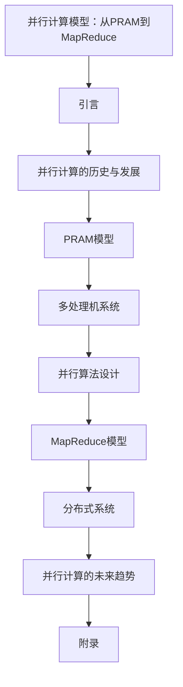

                 

# 《并行计算模型：从PRAM到MapReduce》

## 关键词
并行计算、PRAM模型、MapReduce模型、分布式系统、多处理机系统、并行算法设计

## 摘要
本文旨在探讨并行计算模型的发展历程，从传统的PRAM模型到现代的MapReduce模型，分析各自的优缺点及其应用领域。通过深入剖析并行计算的基本概念、发展历程、核心技术、算法设计、模型应用、分布式系统以及未来趋势，为读者呈现一幅全面而系统的并行计算全景图。

## 引言
### 并行计算的基本概念
并行计算是指利用多个处理单元（如处理器、CPU、GPU等）同时处理多个任务或同一任务的不同部分，以加快计算速度和提升计算能力。与传统的串行计算相比，并行计算能够显著提高计算效率和处理能力。

### 并行计算的重要性
并行计算在科学计算、大数据处理、人工智能、图形渲染等多个领域具有广泛的应用。随着计算需求的不断增加，并行计算成为了提升计算能力、解决复杂问题的重要手段。

## 目录大纲

### 第1章 并行计算的历史与发展
#### 1.1 并行计算的发展历程
#### 1.2 并行计算的核心技术
#### 1.3 并行计算的应用领域

### 第2章 PRAM模型
#### 2.1 PRAM模型的基本概念
#### 2.2 PRAM模型的特性
#### 2.3 PRAM模型的应用

### 第3章 多处理机系统
#### 3.1 多处理机系统的基本结构
#### 3.2 多处理机系统的调度策略
#### 3.3 多处理机系统的性能评估

### 第4章 并行算法设计
#### 4.1 并行算法的基本原理
#### 4.2 并行算法的设计方法
#### 4.3 并行算法的案例分析

### 第5章 MapReduce模型
#### 5.1 MapReduce模型的基本概念
#### 5.2 MapReduce模型的特点
#### 5.3 MapReduce模型的应用

### 第6章 分布式系统
#### 6.1 分布式系统的基本概念
#### 6.2 分布式系统的架构
#### 6.3 分布式系统的挑战与解决方案

### 第7章 并行计算的未来趋势
#### 7.1 并行计算的发展趋势
#### 7.2 并行计算的新技术
#### 7.3 并行计算的未来应用

### 附录
#### 7.1 并行计算相关资源
#### 7.2 并行计算工具和框架介绍
#### 7.3 练习题与案例分析

## 第1章 并行计算的历史与发展

### 1.1 并行计算的发展历程
并行计算的发展可以追溯到20世纪50年代，当时计算机科学家开始探索如何通过多个处理器来提高计算能力。早期的并行计算主要基于硬件共享和任务分解，代表性的模型包括SIMD（单指令流多数据流）和多处理机系统。

到了20世纪80年代，并行计算理论取得了重要进展，PRAM（并行随机访问存储器）模型被提出。PRAM模型作为一种理想的并行计算模型，为并行算法设计提供了理论指导。

进入21世纪，随着互联网和大数据技术的发展，分布式系统逐渐成为并行计算的主流形式。Google在2004年推出了MapReduce模型，该模型简化了分布式计算的开发过程，并成功应用于搜索引擎和数据挖掘等场景。

### 1.2 并行计算的核心技术
并行计算的核心技术主要包括并行架构、并行编程模型、并行算法和数据传输协议。

- 并行架构：包括多处理机系统、GPU并行计算、FPGA（现场可编程门阵列）等。
- 并行编程模型：包括PRAM模型、MapReduce模型、并行编程框架等。
- 并行算法：包括并行搜索、并行排序、并行矩阵运算等。
- 数据传输协议：包括MPI（并行通信库）、P2P（对等网络）等。

### 1.3 并行计算的应用领域
并行计算广泛应用于以下领域：

- 科学计算：如气象预测、地震模拟、分子建模等。
- 大数据处理：如搜索引擎、社交媒体分析、推荐系统等。
- 人工智能：如深度学习、自然语言处理、计算机视觉等。
- 图形渲染：如三维动画、游戏开发等。
- 金融工程：如风险控制、算法交易等。

## 第2章 PRAM模型

### 2.1 PRAM模型的基本概念
PRAM（Parallel Random Access Machine）模型是一种理想的并行计算模型，它假设存在多个处理器，每个处理器都可以随机访问共享的全局存储器。PRAM模型通常用于设计并行算法，其特点是易于理解和分析。

### 2.2 PRAM模型的特性
- 并行性：PRAM模型允许多个处理器同时执行任务。
- 随机访问存储器：每个处理器可以随机访问共享的全局存储器。
- 同步通信：处理器之间可以通过共享存储器进行通信，但需要同步操作。

### 2.3 PRAM模型的应用
PRAM模型在并行算法设计、并行编程模型、分布式系统等领域有广泛应用。

- 并行算法设计：PRAM模型为并行算法设计提供了理论指导。
- 并行编程模型：如MPI（Message Passing Interface）基于PRAM模型。
- 分布式系统：PRAM模型可以用于分析和设计分布式算法。

### 2.4 PRAM模型的优缺点
- 优点：易于理解和分析，为并行算法设计提供了理论指导。
- 缺点：实际的多处理机系统往往难以实现PRAM模型中的理想特性，如随机访问存储器和同步通信。

## 第3章 多处理机系统

### 3.1 多处理机系统的基本结构
多处理机系统包括多个处理器、共享存储器、通信网络和操作系统等组成部分。处理器可以执行任务，共享存储器用于数据存储和通信，通信网络用于处理器之间的数据传输。

### 3.2 多处理机系统的调度策略
多处理机系统的调度策略包括静态调度和动态调度。

- 静态调度：在系统启动时分配处理器和任务，任务一旦分配就无法改变。
- 动态调度：在任务执行过程中动态调整处理器和任务的分配。

### 3.3 多处理机系统的性能评估
多处理机系统的性能评估主要包括以下指标：

- 吞吐量：单位时间内系统处理的数据量。
- 响应时间：任务从提交到完成所需的时间。
- 利用率：系统资源的使用率。

## 第4章 并行算法设计

### 4.1 并行算法的基本原理
并行算法设计的目标是在多处理机系统上提高计算效率。并行算法设计的基本原理包括任务分解、数据分解和负载平衡。

- 任务分解：将任务分解成多个子任务。
- 数据分解：将数据分解成多个部分。
- 负载平衡：确保处理器之间的任务负载均衡。

### 4.2 并行算法的设计方法
并行算法设计方法包括直接映射、负载均衡、动态负载平衡和并行迭代等。

- 直接映射：将任务直接映射到处理器。
- 负载均衡：通过动态调整任务分配来实现负载均衡。
- 动态负载平衡：在任务执行过程中动态调整任务分配。
- 并行迭代：通过迭代的方式将任务分解成更小的子任务。

### 4.3 并行算法的案例分析
以并行矩阵乘法为例，介绍并行算法的设计方法和实现。

- 任务分解：将矩阵乘法分解成多个子任务。
- 数据分解：将矩阵分解成多个部分。
- 负载平衡：通过动态调整子任务分配来实现负载平衡。

## 第5章 MapReduce模型

### 5.1 MapReduce模型的基本概念
MapReduce是一种分布式计算模型，由Google提出。MapReduce模型将复杂的大规模数据处理任务分解成多个可并行执行的子任务，然后通过映射（Map）和归约（Reduce）操作来处理数据。

### 5.2 MapReduce模型的特点
- 映射（Map）：将输入数据分解成键值对。
- 归约（Reduce）：对相同键的值进行汇总。
- 分布式存储：MapReduce模型使用分布式存储来处理大规模数据。

### 5.3 MapReduce模型的应用
MapReduce模型在搜索引擎、数据挖掘、机器学习等领域有广泛应用。

- 搜索引擎：用于处理大规模网页索引。
- 数据挖掘：用于分析大量数据，提取有价值的信息。
- 机器学习：用于训练大规模机器学习模型。

## 第6章 分布式系统

### 6.1 分布式系统的基本概念
分布式系统是由多个节点组成的系统，节点之间通过网络进行通信。分布式系统具有以下特点：

- 分布性：系统中的节点可以分布在不同地理位置。
- 异构性：节点可以是不同类型的计算机或设备。
- 资源共享：节点可以共享系统中的资源，如存储、计算能力等。

### 6.2 分布式系统的架构
分布式系统的架构包括以下层次：

- 网络层：用于节点之间的通信。
- 应用层：用于实现分布式应用程序。
- 数据层：用于存储和管理数据。

### 6.3 分布式系统的挑战与解决方案
分布式系统面临以下挑战：

- 数据一致性：确保分布式系统中数据的一致性。
- 节点故障：处理节点故障，确保系统稳定运行。
- 网络延迟：降低网络延迟，提高系统性能。

解决方案包括分布式锁、一致性协议、备份和恢复等。

## 第7章 并行计算的未来趋势

### 7.1 并行计算的发展趋势
并行计算的发展趋势包括：

- 多核处理器：多核处理器将成为主流计算平台。
- GPU并行计算：GPU在并行计算领域将有更广泛的应用。
- 超算与云计算：超算和云计算将为并行计算提供更强大的计算能力。

### 7.2 并行计算的新技术
并行计算的新技术包括：

- 异构计算：利用不同类型的处理器，如CPU、GPU、FPGA等，提高计算效率。
- 脑启发计算：模仿人脑结构和工作原理，实现高效并行计算。
- 光计算：利用光信号进行计算，提高计算速度。

### 7.3 并行计算的未来应用
并行计算的未来应用包括：

- 大数据处理：处理大规模数据，提取有价值的信息。
- 人工智能：训练大规模机器学习模型，提高智能水平。
- 科学研究：进行复杂科学计算，推动科学研究。

## 附录

### 7.1 并行计算相关资源
- 《并行计算导论》
- 《分布式系统：概念与设计》
- 《高性能并行计算》

### 7.2 并行计算工具和框架介绍
- MPI：并行通信库。
- MapReduce：分布式计算框架。
- TensorFlow：机器学习框架。

### 7.3 练习题与案例分析
- 设计一个并行矩阵乘法算法。
- 使用MapReduce模型实现一个简单的WordCount程序。

### 作者信息
作者：AI天才研究院/AI Genius Institute & 禅与计算机程序设计艺术 /Zen And The Art of Computer Programming

# Mermaid流程图


# 数学模型和数学公式
并行算法的效率通常用时间复杂度来衡量，例如PRAM模型中，假设每个处理器需要T时间来完成其任务，则整个PRAM模型的时间复杂度为O(nT)，其中n为处理器的数量。

$$
T_{\text{PRAM}} = O(nT)
$$

# 项目实战
以MapReduce模型为例，一个简单的WordCount案例：

```python
# 导入MapReduce模块
from mrjob.job import MRJob

class WordCount(MRJob):

    def mapper(self, _, line):
        # 将每一行按空格分割成单词
        words = line.split()
        # 输出每个单词及其出现次数
        for word in words:
            yield word, 1

    def reducer(self, word, counts):
        # 将单词的出现次数求和
        yield word, sum(counts)

if __name__ == '__main__':
    WordCount.run()
```

这个案例中，Mapper将每一行按空格分割成单词，然后输出每个单词及其出现次数。Reducer将相同单词的所有出现次数相加，得到每个单词的总出现次数。

# 代码解读与分析
在这个WordCount案例中，Mapper和Reducer都是简单的函数，但它们在并行计算中扮演着关键角色。Mapper将输入数据分割成小块，然后并行处理每个小块。Reducer则对Mapper的输出结果进行汇总。这种分而治之的策略使得MapReduce模型能够高效地处理大规模数据。

# 最佳实践 tips
- 选择适合问题的并行算法和编程模型。
- 关注数据传输和通信开销，优化算法性能。
- 考虑使用异构计算，充分利用不同类型的处理器。

# 小结
并行计算是提升计算能力和解决复杂问题的重要手段。从传统的PRAM模型到现代的MapReduce模型，并行计算模型不断发展，为各个领域提供了强大的计算支持。了解并行计算的基本概念、模型和应用，有助于我们更好地利用并行计算的优势，应对未来的计算挑战。

# 注意事项
- 并行计算可能会引入新的复杂性，如数据一致性和同步问题，需要仔细设计解决方案。
- 并行算法的性能受到硬件和系统环境的影响，需要针对具体情况进行优化。

# 拓展阅读
- 《并行计算导论》
- 《分布式系统：概念与设计》
- 《高性能并行计算》

### 附录：并行计算相关资源

在深入探讨并行计算的世界时，掌握相关的资源是至关重要的。以下是一些推荐的并行计算相关资源，包括书籍、在线课程、开源框架和论坛，这些资源将为读者提供丰富的知识和实践经验。

#### 书籍推荐

1. **《并行计算导论》（Introduction to Parallel Computing）** by F. J. Buono
   - 该书系统地介绍了并行计算的基础知识，包括并行计算模型、并行算法设计以及并行编程技术。

2. **《并行计算：理论与实践》（Parallel Computing: Techniques and Applications）** by K. G. Shin
   - 本书详细介绍了并行计算的理论基础和实际应用，包括多核处理器和分布式系统的内容。

3. **《分布式系统：概念与设计》（Distributed Systems: Concepts and Design）** by George Coulouris, Jean Dollimore, Tim Kindberg, and Gordon Blair
   - 这本书是分布式系统的经典教材，涵盖了分布式系统的设计原则、通信协议、一致性模型等内容。

4. **《高性能并行计算》（High-Performance Parallel Computing）** by B. de Supinski, R. van der Pas, and A. L. Weaver
   - 本书聚焦于高性能并行计算，探讨了并行编程模型、性能优化技术以及并行算法的设计。

#### 在线课程

1. **MIT OpenCourseWare: Introduction to Computer Science and Programming** (MIT)
   - 该课程介绍了计算机科学的基础知识，包括并行计算的概念和应用。

2. **Coursera: Parallel, Concurrent, and Distributed Programming in Java** (University of Colorado Boulder)
   - 这门课程深入讲解了并行和分布式编程的基础，包括并行算法设计和并发编程。

3. **edX: Introduction to Parallel Computing** (University of Illinois at Urbana-Champaign)
   - 该课程提供了并行计算的基础知识，包括并行模型、并行算法和并行编程。

#### 开源框架

1. **MPI（Message Passing Interface）**
   - MPI是一种并行编程标准，用于在分布式系统上进行高效的消息传递。

2. **OpenMP**
   - OpenMP是一种用于共享内存并行编程的API，广泛用于多核处理器和对称多处理（SMP）系统。

3. **Hadoop and MapReduce**
   - Hadoop是一个开源的分布式计算框架，实现了MapReduce模型，用于大数据处理。

4. **TensorFlow**
   - TensorFlow是一个开源机器学习框架，支持并行计算和分布式训练。

#### 论坛和社区

1. **Parallel Computing Stack Exchange**
   - 这是一个专注于并行计算问题的问答社区，适合寻找解决方案和讨论技术问题。

2. **Stack Overflow**
   - Stack Overflow是编程问题解决平台，有许多关于并行计算和分布式系统的讨论。

3. **GitHub**
   - GitHub上有很多并行计算和分布式系统的开源项目和代码示例，可以学习实际应用。

#### 实践资源

1. **Parallel Programming with CUDA** (NVIDIA)
   - NVIDIA提供了一系列关于CUDA（并行计算平台和编程模型）的资源，适用于GPU并行计算。

2. **Parallel Programming Patterns and Best Practices** (Microsoft Research)
   - 该文档提供了并行编程的模式和最佳实践，适用于多种并行计算环境。

通过利用这些资源，读者可以系统地学习和实践并行计算，不断提升自己的技术水平和解决问题的能力。

### 附录：并行计算工具和框架介绍

在并行计算领域，有多种工具和框架可以帮助开发者设计和实现高效的并行应用。以下是几个常用的并行计算工具和框架的介绍，包括它们的基本概念、特点和适用场景。

#### 1. MPI（Message Passing Interface）

**基本概念：**
MPI是一种标准化的并行编程接口，用于在分布式系统中进行高效的消息传递。它允许程序员在多个处理器之间发送和接收数据，以及同步和控制并行执行。

**特点：**
- 高效：MPI提供了优化的消息传递机制，适合大规模分布式计算。
- 可移植性：MPI是跨平台的，可以在不同的操作系统和硬件上运行。
- 丰富的库和工具：MPI有广泛的库和工具支持，如MPI-2标准增加了更多的功能和优化。

**适用场景：**
- 科学计算：如气象模拟、流体动力学模拟等，需要大量并行计算和高效数据传输。
- 分布式数据处理：如大规模数据分析、分布式文件系统等。

#### 2. OpenMP

**基本概念：**
OpenMP是一种用于共享内存并行编程的API，允许程序员在多核处理器上轻松实现并行计算。它通过在代码中添加简单的编译指令来控制并行区域和任务分配。

**特点：**
- 简单易用：OpenMP的语法简单，易于集成到现有代码中。
- 高效：OpenMP提供了丰富的同步和控制机制，适合多核处理器的并行计算。
- 支持多种语言：OpenMP支持C、C++和Fortran等语言。

**适用场景：**
- 多核处理器上的并行计算：如数值模拟、图像处理等，需要充分利用多核处理器的计算能力。
- 优化现有代码：对于需要并行化的现有代码，OpenMP提供了有效的解决方案。

#### 3. Hadoop and MapReduce

**基本概念：**
Hadoop是一个开源的分布式计算框架，基于MapReduce模型。它提供了一个分布式文件系统（HDFS）和数据处理引擎，用于处理大规模数据集。

**特点：**
- 高扩展性：Hadoop能够轻松扩展到数千台服务器，适合大规模数据处理。
- 高可靠性：Hadoop提供了数据备份和自动恢复功能，确保数据的安全和稳定。
- 生态丰富：Hadoop生态系统包括多种工具和库，如Hive、Pig、Spark等，支持多种数据处理需求。

**适用场景：**
- 大数据分析：如日志分析、社交网络分析等，需要处理海量数据。
- 分布式存储和处理：如分布式文件存储、大规模数据处理平台等。

#### 4. TensorFlow

**基本概念：**
TensorFlow是一个开源的机器学习框架，由Google开发。它支持多种深度学习模型的训练和部署，并提供了高效的并行计算能力。

**特点：**
- 强大的计算能力：TensorFlow支持GPU和TPU（Tensor Processing Unit）等硬件加速器，提高计算效率。
- 易于使用：TensorFlow提供了丰富的API和工具，支持多种编程语言。
- 分布式训练：TensorFlow支持分布式训练，能够在多台服务器上进行模型训练。

**适用场景：**
- 深度学习应用：如图像识别、语音识别、自然语言处理等。
- 大规模数据处理：如实时数据流处理、大规模数据挖掘等。

通过了解和掌握这些并行计算工具和框架，开发者可以更有效地设计和实现并行应用，充分利用现代计算硬件的优势，提升计算性能和效率。

### 附录：练习题与案例分析

#### 练习题

1. 设计一个简单的并行搜索算法，用于在一个大数组中查找特定元素。请描述算法的基本思想和关键步骤。

2. 使用MapReduce模型实现一个简单的WordCount程序，计算一个大型文本文件中每个单词的出现次数。

3. 设计一个并行排序算法，用于在一个大数组中进行排序。请描述算法的基本思想和关键步骤。

#### 案例分析

**案例1：基于Hadoop的日志分析**

**问题背景：**
一家互联网公司需要对其用户访问日志进行分析，以了解用户的访问行为和热点页面。

**系统功能设计：**
- 数据采集：通过日志采集系统，将用户访问日志存储到HDFS（Hadoop分布式文件系统）中。
- 数据处理：使用MapReduce模型，对日志数据进行处理，提取用户访问时间和访问页面信息。
- 数据存储：将处理结果存储到HDFS或其他数据库中，以供进一步分析和展示。

**系统架构设计：**
- HDFS：分布式文件存储系统，存储原始日志数据。
- MapReduce：分布式计算框架，用于处理日志数据。
- 数据库：存储处理结果，如用户访问时间和访问页面信息。

**系统接口设计：**
- 日志采集接口：用于采集用户访问日志。
- 日志处理接口：用于处理和存储日志数据。

**系统交互：**
- 日志采集：采集系统将日志数据写入HDFS。
- 数据处理：MapReduce任务读取HDFS中的日志数据，进行处理，并将结果写入数据库。
- 数据展示：通过数据可视化工具，展示处理结果。

**项目小结：**
通过Hadoop和MapReduce技术，该公司能够高效地处理大规模日志数据，提取有价值的用户访问信息，为产品和运营提供数据支持。

**注意事项：**
- 在进行日志分析时，需要关注数据安全和隐私保护，确保用户数据的安全和合规。
- 根据实际需求，可以选择其他数据处理框架，如Spark，以提高数据处理性能。

**拓展阅读：**
- 《Hadoop权威指南》
- 《MapReduce实战：大数据处理原理、工具和实践》

通过以上练习题和案例分析，读者可以加深对并行计算技术的理解和应用能力，为实际项目中的并行计算任务做好准备。

