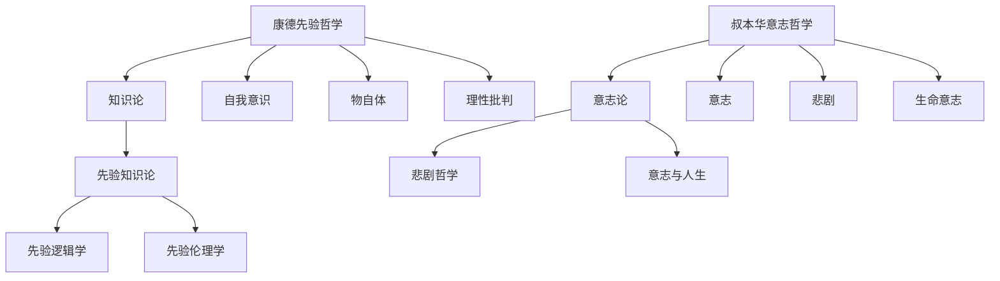
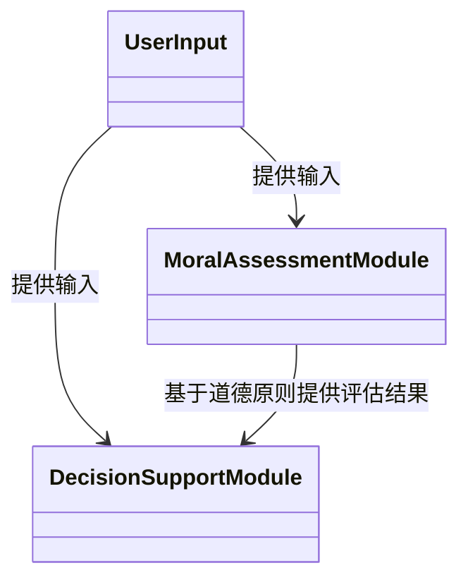
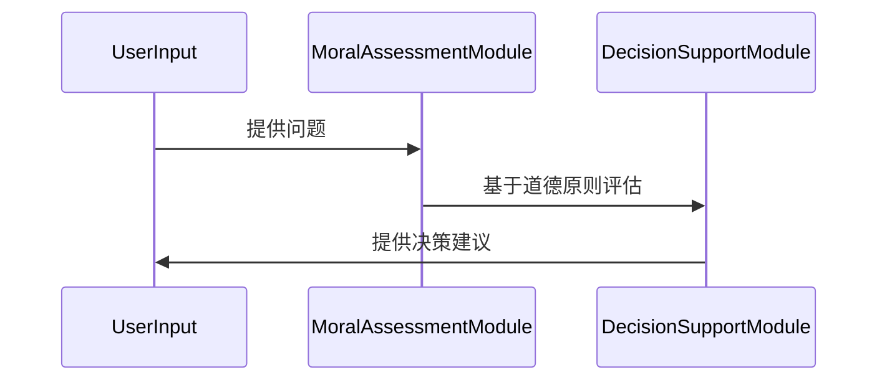
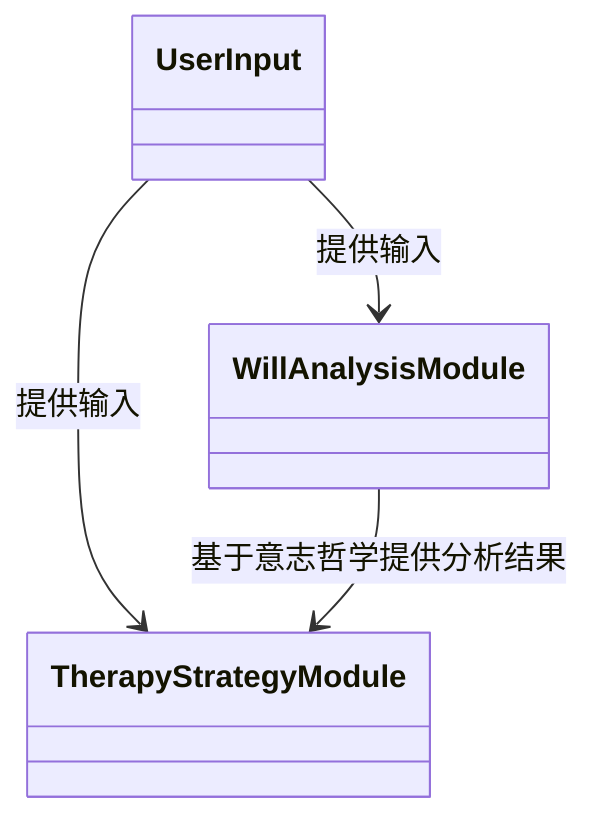
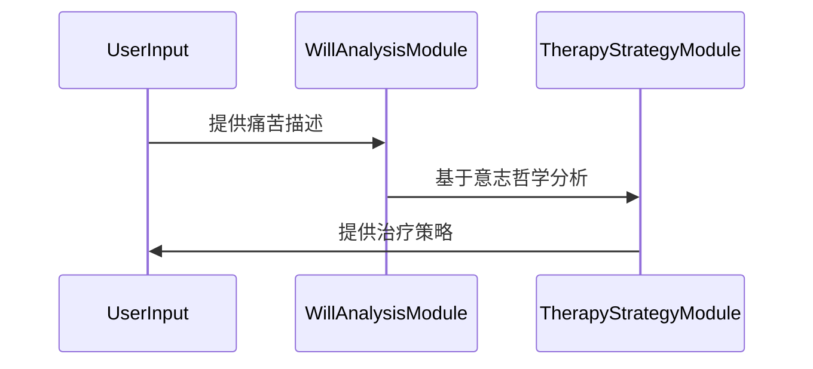

                 


### 1.1 研究背景与意义

康德与叔本华，两位在哲学史上具有重要地位的思想家，他们的哲学体系对后世产生了深远影响。康德（Immanuel Kant，1724-1804）是德国启蒙时代的代表人物，他的先验哲学体系标志着西方哲学史上的一次重要转折。叔本华（Arthur Schopenhauer，1788-1860）则是德国浪漫主义时期的哲学家，他的意志哲学提供了另一种理解人类存在和苦难的视角。

康德的先验哲学关注的是知识和理性的来源与界限。他认为，人的知识和理性并非直接来自外部经验，而是由先天的认知形式和范畴所构成。这一观点打破了经验论和理性论的二元对立，为后来的现象学和结构主义哲学奠定了基础。

叔本华的意志哲学则强调生命意志的无意识和盲目性，以及由此带来的痛苦和悲剧。他认为，人类的欲望和冲突是痛苦的根源，而悲剧是认识这一真相的最有效方式。

先验哲学与意志哲学的重要性在于，它们不仅对哲学领域产生了深远影响，而且对心理学、社会学、艺术等领域也有着重要的启示。康德的先验哲学为认识论和方法论提供了新的视角，而叔本华的意志哲学则为我们理解人类行为和心理状态提供了深刻的洞察。

本研究的目的在于对比康德与叔本华的哲学体系，探讨他们的先验哲学与意志哲学的异同，以及这些哲学思想对后世的影响。通过这一对比研究，我们希望能够深化对这两种哲学的理解，并为现代哲学提供新的思考方向。

### 1.2 研究方法与结构

本研究将采用文献综述法、比较分析法与实证研究法相结合的方法。文献综述法将用于梳理康德与叔本华哲学的发展历程、核心观点及其影响；比较分析法将用于对比两位哲学家的先验哲学与意志哲学的异同；实证研究法则将用于验证这些哲学思想在现实世界中的应用效果。

本书的结构安排如下：

- **第一部分：引言**，介绍研究的背景、意义和方法。
- **第二部分：康德先验哲学概述**，包括康德哲学的起源与发展、先验哲学理论及其核心概念。
- **第三部分：叔本华意志哲学概述**，包括叔本华哲学的起源与发展、意志哲学的理论及其核心概念。
- **第四部分：康德与叔本华哲学的对比**，分析两位哲学家的哲学差异及其影响。
- **第五部分：结论**，总结研究的主要发现，并讨论未来研究的方向。

通过以上结构安排，我们希望能够系统地展示康德与叔本华哲学的对比研究，为读者提供深入理解和思考的机会。

### 2.1 康德哲学的起源与发展

康德哲学的起源可以追溯到18世纪的德国启蒙运动。启蒙运动主张通过理性来认识世界，推动科学和哲学的发展。在这个时代，经验论和理性论是哲学讨论的两个主要立场。经验论认为知识来源于感觉和经验，而理性论则强调理性本身的独立性和重要性。康德试图在两者之间找到一种平衡，他提出了一种新的哲学方法论——先验哲学。

康德哲学的发展可以分为三个阶段：早期哲学、中期哲学和晚期哲学。在早期哲学中，康德关注的是自然哲学和道德哲学。他的著作《自然通史和天体论》和《道德形而上学的基础》等作品体现了这一时期的思考。在中期哲学中，康德集中探讨了认识论和方法论。他的著作《纯粹理性批判》和《实践理性批判》以及《判断力批判》被认为是西方哲学史上的三大批判作品，奠定了先验哲学的基础。晚期哲学中，康德更多地关注宗教和神学问题，他的作品《永久和平论》和《上帝的存在论证明》等反映了这一时期的思考。

康德哲学的主要贡献在于他对知识和理性的批判性思考。他提出，人类的认识并不是直接来自外部经验，而是通过先天的认知形式和范畴进行的。康德认为，这些先天的认知形式和范畴是人类认识世界的基础，它们不是通过经验获得的，而是先天地存在于人的认识过程中。康德的这一观点打破了经验论和理性论的二元对立，为后来的现象学和结构主义哲学奠定了基础。

在知识论方面，康德提出了先验知识论。他认为，人类的知识分为两种：一种是对现象的认识，另一种是对物自体的认识。现象是我们通过感官所感知到的世界，而物自体则是现象背后的真实存在。康德认为，我们无法直接认识物自体，但我们可以通过先天的认知形式和范畴来理解现象。

在逻辑学方面，康德提出了先验逻辑学。他认为，逻辑学不是关于事实的陈述，而是关于知识的形式规则。康德认为，逻辑规则是人类思维的基本形式，它们是先天地存在于人类认识过程中的。

在伦理学方面，康德提出了先验伦理学。他认为，道德原则不是通过经验获得的，而是通过理性推导出来的。康德提出了“人是目的本身”的道德原则，认为每个人都应该被尊重，不应该仅仅被视为达成某种目的的手段。

总的来说，康德哲学的发展不仅对当时的哲学界产生了深远影响，而且对后来的哲学发展也产生了重要影响。康德的先验哲学为认识论和方法论提供了新的视角，为后来的哲学家提供了丰富的思考素材。

### 2.2 康德的先验哲学理论

康德的先验哲学理论是他在《纯粹理性批判》等著作中提出的一种哲学方法论，它旨在探讨知识的先天来源和理性的界限。康德的先验哲学主要分为三个部分：先验知识论、先验逻辑学和先验伦理学。

**先验知识论**

在先验知识论中，康德探讨了知识的先天来源。他认为，知识不是来自感觉或经验，而是来自先天的认知形式和范畴。康德认为，这些先天的认知形式和范畴是人类认识世界的基础，它们不是通过经验获得的，而是先天地存在于人的认识过程中。

康德提出了十二个先天的认知范畴，这些范畴包括量（单一性、多数性、全体性）、质（实在性、非实在性、肯定性、否定性）、关系（实体和属性、原因和结果、可能性和现实性、必然性和偶然性）、模态（存在性和非存在性、实在性和可能性）。这些范畴构成了人类认识世界的基本框架。

康德认为，人类的知识可以分为两种：对现象的认识和对物自体的认识。现象是我们通过感官所感知到的世界，而物自体则是现象背后的真实存在。康德认为，我们无法直接认识物自体，但我们可以通过先天的认知形式和范畴来理解现象。

**先验逻辑学**

在先验逻辑学中，康德探讨了逻辑的先天形式。他认为，逻辑学不是关于事实的陈述，而是关于知识的形式规则。康德认为，逻辑规则是人类思维的基本形式，它们是先天地存在于人类认识过程中的。

康德提出了四种先验逻辑形式：判断、推理、演绎和归纳。判断是逻辑思维的基本单位，它由主词和谓词组成。推理是通过前提推导出结论的过程，它是逻辑思维的核心。演绎是从一般到特殊的推理过程，而归纳是从特殊到一般的推理过程。康德认为，这些逻辑形式是先天地存在于人类思维过程中的。

**先验伦理学**

在先验伦理学中，康德探讨了道德的先天原则。他认为，道德原则不是通过经验获得的，而是通过理性推导出来的。康德提出了“人是目的本身”的道德原则，认为每个人都应该被尊重，不应该仅仅被视为达成某种目的的手段。

康德认为，道德规则是绝对的，它们不是基于经验或利益的，而是基于理性的。康德提出了“应当”的概念，认为道德命令是绝对命令，即“你应该这么做，因为这是你应该做的”。康德认为，道德判断是先天的，它们不是基于经验或情感的，而是基于理性的。

**核心概念**

康德的先验哲学中包含几个核心概念，这些概念构成了他的哲学体系的基础。首先是“自我意识”，康德认为，自我意识是人类认识世界的前提，它是先天地存在于人的认识过程中的。

其次是“物自体”，康德认为，物自体是现象背后的真实存在，我们无法直接认识它，但可以通过先天的认知形式和范畴来理解它。

最后是“理性批判”，康德认为，理性批判是哲学的任务，它旨在探讨知识的先天来源和理性的界限。理性批判使我们能够理解人类知识的本质和范围。

总之，康德的先验哲学理论为认识论和方法论提供了新的视角，他的先验知识论、先验逻辑学和先验伦理学构成了他哲学体系的核心，对后世哲学产生了深远影响。

### 2.3 康德先验哲学的核心概念

康德的先验哲学包含了一系列核心概念，这些概念构成了他的哲学体系的基础，并对他之后的哲学发展产生了深远影响。以下是康德先验哲学中的几个关键概念：

**自我意识**

自我意识是康德先验哲学中的一个核心概念，它指的是个体对自己存在的直接感知。康德认为，自我意识是所有认识活动的前提，因为只有通过自我意识，个体才能成为认识的主体。自我意识不是通过感觉或经验获得的，而是先天地存在于人的意识中。康德强调，自我意识是纯粹的、不依赖于任何对象的意识，它是所有认识的出发点。

**物自体**

物自体（Ding an sich）是康德哲学中的一个重要概念，它指的是现象世界背后未被感知到的客观存在。康德认为，我们只能通过感官感知现象，而无法直接认识物自体。物自体是独立于我们感知的，它存在但我们无法完全理解它。康德通过区分现象与物自体，提出了一个认识论上的界限，认为我们的知识只能及于现象，而无法及于物自体。

**理性批判**

理性批判是康德哲学中的核心概念，它指的是对理性能力的批判性思考。康德认为，理性不仅是认识工具，也是一种能力，它决定了人类知识的范围和限度。理性批判旨在探讨理性如何产生知识，以及理性在认识过程中的作用和限制。康德通过《纯粹理性批判》等作品，探讨了理性在知识形成中的作用，并提出了先验逻辑学和先验伦理学。

**范畴**

范畴是康德哲学中的基本概念，它们是先天地存在于人类认识过程中的认知形式。康德认为，范畴是认识现象世界的必要条件，它们不是通过经验获得的，而是先天地存在于人的思维中。康德提出了十二个范畴，包括量、质、关系、模态等，这些范畴构成了人类认识世界的基本框架。

**先验演绎**

先验演绎是康德哲学中的一个重要方法，它用于证明先天的认知形式和范畴的存在。康德通过先验演绎，试图说明这些认知形式和范畴是如何先天地存在于人类认识过程中的。先验演绎是一种逻辑推理，它从一般的认识原则出发，推导出具体的认识过程。

**形式与质料**

形式与质料是康德哲学中的另一个重要概念。形式指的是事物的结构或逻辑框架，而质料指的是事物的具体内容。康德认为，认识过程中的现象既包括形式也包括质料，但我们只能认识形式，而无法认识质料。形式是认识的基础，它决定了我们如何感知和理解事物。

**先验理想**

先验理想是康德哲学中的一个概念，它指的是人类通过理性所追求的完美状态。康德认为，先验理想是人类理性追求的目标，但它超越了人类认识能力的范围，无法被直接实现。先验理想包括对知识、道德和自由的追求，这些理想激发了人类对更好世界的追求。

通过这些核心概念，康德建立了他的先验哲学体系，为后来的哲学家提供了深刻的思考和理论基础。这些概念不仅对哲学领域产生了重要影响，而且在心理学、社会科学和艺术等领域也得到了广泛应用。

### 2.4 康德的先验哲学体系构建

康德的先验哲学体系构建是一个多层次、多维度的问题，它涉及知识论、伦理学和美学等多个方面。康德通过《纯粹理性批判》、《实践理性批判》和《判断力批判》这三部著作，系统地阐述了他的先验哲学思想。

**知识论基础**

康德的先验哲学首先关注的是知识的来源和结构。他认为，知识不是来自于纯粹的经验，而是由先天的认知形式和范畴构成的。康德提出了“十二范畴”的概念，这些范畴是先天地存在于人的认识过程中，它们构成了人类理解世界的框架。这些范畴包括量、质、关系和模态等，它们帮助我们将经验材料组织成有意义的知识。

在《纯粹理性批判》中，康德通过“先验演绎”的方法，试图证明这些范畴是先验的，即它们不是通过经验获得的，而是先天地存在于人的认识过程中。康德认为，通过先验演绎，我们可以理解知识的结构和限制，从而更好地理解人类认识的局限性。

**伦理学内涵**

康德的先验哲学不仅涉及知识论，还涉及伦理学。在《实践理性批判》中，康德提出了“人是目的本身”的道德原则。他认为，道德原则不是基于经验或情感的，而是通过理性推导出来的。康德提出了“应当”的概念，认为道德判断是绝对命令，即“你应该这么做，因为这是你应该做的”。

康德强调，道德行为不是出于功利或利益的考虑，而是出于对道德原则的遵守。他认为，道德律令是普遍的、绝对的，每个人都有道德责任去遵守这些原则。康德通过“纯粹理性批判”和“实践理性批判”，试图建立一种纯粹的道德哲学，为人类行为提供理性的指导。

**审美与认知的关系**

在《判断力批判》中，康德探讨了审美和认知之间的关系。他认为，审美判断不同于知识判断，它不涉及对象的存在或性质，而是关于对象的形式或结构。康德提出了“无利害关系的愉悦”的概念，即审美愉悦是一种不涉及利益或功利的纯粹愉悦。

康德认为，审美判断和认知判断之间有一种先验的联系。通过审美判断，我们可以体验到一种自由的愉悦，这种愉悦反映了人类理性的本质。康德通过“判断力批判”，试图将审美和认知联系起来，为人类理解世界提供新的视角。

**综合性与方法论**

康德的先验哲学体系是一个综合性的哲学体系，它将知识论、伦理学和美学整合在一起。康德认为，这三个领域是相互联系的，它们共同构成了人类的认识和实践基础。

康德的方法论强调理性批判的重要性。他认为，只有通过理性批判，我们才能理解知识的结构和限制，找到道德律令的根源，理解审美的本质。康德的方法论为后来的哲学家提供了重要的方法论指导，对现代哲学的发展产生了深远影响。

总的来说，康德的先验哲学体系通过知识论、伦理学和美学等多个方面的构建，形成了一个完整的哲学体系。这个体系不仅对当时的哲学界产生了深远影响，而且对后世哲学的发展也产生了重要启示。

### 3.1 叔本华哲学的起源与发展

叔本华的哲学起源可以追溯到19世纪初的德国浪漫主义时期。叔本华（Arthur Schopenhauer，1788-1860）是一位德国哲学家，他的思想深受当时文化和社会环境的影响，同时也受到了其他哲学家的启发。

在叔本华之前，康德的哲学已经对德国哲学界产生了深远影响。康德的批判哲学强调理性的限制和知识的界限，这为叔本华的思想奠定了基础。此外，黑格尔的辩证法思想也对叔本华产生了影响，尽管叔本华对黑格尔的哲学持批判态度。

叔本华的哲学发展可以分为三个主要阶段：早期哲学、中期哲学和晚期哲学。在早期哲学中，叔本华主要关注道德哲学和美学。他的著作《论视力的审美性质》和《论道德的基础》等作品体现了这一时期的思考。

在中期哲学中，叔本华集中探讨了意志哲学。他的代表作《作为意志和表象的世界》系统阐述了他的意志哲学观点，认为生命意志是无意识和盲目性的，是痛苦的根源。这一时期的作品标志着叔本华哲学的核心思想的成熟。

晚期哲学中，叔本华更多地关注艺术和审美。他的著作《论音乐中的意志形而上学》等作品反映了这一时期的思考。叔本华认为，艺术和审美是人们摆脱生命意志带来的痛苦的一种方式。

叔本华哲学的主要贡献在于他对意志的深入探讨，以及他提出的悲观主义和悲观的人生观。他认为，生命意志是无休止的、无意识的，是人类痛苦的根源。叔本华的意志哲学为后来的心理学、社会学和哲学提供了重要的思想资源。

总的来说，叔本华的哲学在19世纪德国哲学史上具有重要地位，他的思想对后来的哲学家和思想家有深远影响。尽管叔本华的哲学观点在当时并不被广泛接受，但他的思想为后来的哲学发展提供了新的视角和思考方向。

### 3.2 叔本华意志哲学的理论

叔本华的意志哲学是他在《作为意志和表象的世界》等著作中系统阐述的核心思想。这一理论强调生命意志的无意识性和盲目性，以及它对人类生活和存在的影响。

**意志论**

叔本华认为，意志是世界的本质和基础。他将意志视为一种无意识、盲目的力量，它驱动着宇宙和生命的运动。意志是非理性的，它不受任何目的或目标的指导，而是本能地追求自身的满足和扩张。叔本华认为，人类的行为和思维都是意志的表现，是意志在个体层面的投射。

叔本华指出，意志是永恒的、普遍存在的，它是宇宙中一切现象的根源。无论是自然界中的生物运动，还是人类的社会活动，都是意志的体现。意志的存在和运动是客观的，不受个体主观意识的影响。

**悲剧哲学**

叔本华的悲剧哲学是他意志论的一个重要部分。他认为，悲剧是人类认识世界和自身的重要方式。悲剧揭示了生命意志的无意识和盲目性，以及它带来的痛苦和冲突。

叔本华认为，悲剧通过展示人类意志的冲突和失败，使人们意识到意志的盲目性和无意义。悲剧的核心是痛苦，它不仅是物理上的痛苦，更是心理上的痛苦和绝望。通过悲剧，人们可以认识到生命的本质和真相，从而摆脱对现实生活的盲目追求和执着。

叔本华将悲剧分为三种类型：命运的悲剧、道德的悲剧和英雄的悲剧。命运的悲剧强调不可抗拒的力量对个人的打击，道德的悲剧强调道德冲突和道德选择，英雄的悲剧强调个人英雄的失败和牺牲。每种悲剧类型都揭示了意志的不同方面，为人们提供不同的认识视角。

**意志与人生**

叔本华认为，意志是人生痛苦的根源。人类在追求意志满足的过程中，常常陷入无休止的欲望和冲突，从而导致痛苦和挫折。叔本华指出，人类追求的是虚假的、表面的满足，而无法真正达到内心的平静和满足。

叔本华认为，摆脱痛苦的关键在于认识到生命意志的无意义和盲目性，放弃对现实生活的执着追求。他认为，通过艺术和审美，人们可以暂时摆脱意志的痛苦，获得内心的平静和满足。艺术和审美提供了对现实的超越，使人们能够在精神上得到升华和解脱。

总的来说，叔本华的意志哲学为人们提供了一种理解人类存在和苦难的新视角。他的理论揭示了意志的无意识和盲目性，以及它对人类生活和存在的影响。尽管叔本华的悲观主义观点在当代哲学中并不占主导地位，但他的思想对后来的哲学家和思想家有重要启示。

### 3.3 叔本华意志哲学的核心概念

叔本华的意志哲学中包含了一系列核心概念，这些概念构成了他哲学体系的基础，并对他之后的哲学发展产生了深远影响。以下是叔本华意志哲学中的几个关键概念：

**意志**

意志是叔本华哲学中的核心概念，它指的是一种无意识、盲目的力量，是驱动宇宙和生命运动的基础。叔本华认为，意志是永恒的、普遍存在的，它是宇宙中一切现象的根源。意志是非理性的，它不受任何目的或目标的指导，而是本能地追求自身的满足和扩张。

**表象**

表象是叔本华哲学中的另一个重要概念，它指的是人类对世界的感知和认知。叔本华认为，我们的世界是意志的表象，是我们通过感官和理性对意志的反映。表象是我们理解世界的工具，但它并不是真实的世界，而是意志的表现形式。

**痛苦**

痛苦是叔本华哲学中的核心主题之一。他认为，人类的痛苦源于意志的无意识和盲目性。在追求意志满足的过程中，人类常常陷入无休止的欲望和冲突，从而导致痛苦和挫折。叔本华认为，痛苦是人生不可逃避的现实，是意志的本质表现。

**艺术与审美**

艺术与审美是叔本华哲学中的另一个重要概念。他认为，通过艺术和审美，人们可以暂时摆脱意志的痛苦，获得内心的平静和满足。艺术和审美提供了对现实的超越，使人们能够在精神上得到升华和解脱。

**悲观主义**

悲观主义是叔本华哲学的核心理念之一。他认为，人类的生命本质是痛苦的，因为意志是无意识的、盲目的。叔本华的悲观主义观点使他成为当时哲学界的一个争议人物，但他的思想也为后来的哲学家提供了重要的思考素材。

通过这些核心概念，叔本华建立了一个关于意志、痛苦和解脱的哲学体系，为后来的哲学家和思想提供了深刻的思考方向。

### 3.4 叔本华意志哲学的哲学意义

叔本华的意志哲学在哲学史上具有深远的意义，它不仅丰富了哲学的内涵，也为心理学、社会学和艺术等领域提供了新的视角。首先，叔本华的意志哲学为我们理解人类行为和心理状态提供了深刻的洞察。他认为，人类的行为和心理活动都是由意志驱动的，这种无意识和盲目的意志力量使我们陷入无尽的欲望和冲突，从而导致痛苦。叔本华的这一观点与心理学中的动机理论有着异曲同工之妙，对后来的心理分析学派产生了重要影响。

在心理学领域，叔本华的意志哲学为理解人类的心理活动提供了一个新的框架。他强调意志的非理性本质，指出人类行为和心理状态往往是盲目的，这为后来的心理治疗和心理咨询提供了理论依据。叔本华的悲观主义观点也影响了心理学中的悲观主义流派，为人们理解人类心理的复杂性提供了新的思路。

在社会学领域，叔本华的意志哲学揭示了社会冲突和矛盾的本质。他认为，社会的不稳定和冲突源于人类意志的盲目性和无意识性。这一观点对社会学的矛盾理论和冲突理论产生了重要影响，使人们更加关注社会冲突和矛盾的根源。

在艺术领域，叔本华的意志哲学为艺术创作提供了新的理论基础。他认为，艺术是人们摆脱意志痛苦的一种方式，艺术家通过创作作品来超越现实的痛苦，实现精神的升华。叔本华的这一观点影响了后来的现代艺术和后现代艺术，许多艺术家和思想家都从他的哲学思想中汲取灵感。

总之，叔本华的意志哲学不仅在哲学领域产生了深远影响，而且对心理学、社会学和艺术等领域也有着重要的启示。他的思想为理解人类行为和心理状态提供了一个新的视角，对现代哲学和社会科学的发展产生了重要影响。

### 4.1 先验哲学与意志哲学的比较

康德的先验哲学和叔本华的意志哲学虽然在不同的领域提出了各自的独特观点，但它们之间仍然存在许多可比性。在这部分，我们将从核心观点、哲学体系和应用领域等方面对这两种哲学进行比较。

**核心观点对比**

康德的先验哲学强调知识的基础是先天的认知形式和范畴，而不是经验。他认为，我们的知识是通过先天的认知形式（如时空、因果等）来组织和理解的。康德认为，理性是知识的基础，通过理性批判，我们可以认识到知识的界限和本质。

相比之下，叔本华的意志哲学则强调意志是世界的本质，是一切现象的根源。他认为，意志是一种无意识和盲目的力量，它驱动着宇宙和生命的运动。叔本华认为，人类的行为和心理状态都是由意志决定的，意志是痛苦和苦难的根源。

**哲学体系对比**

康德的先验哲学体系包括知识论、伦理学和美学三个方面。在知识论方面，康德探讨了先天的认知形式和范畴；在伦理学方面，康德提出了“人是目的本身”的道德原则；在美学方面，康德探讨了审美判断的自由性质。康德的哲学体系强调理性在知识和道德中的作用，试图为人类认识世界和自我提供一种理性基础。

相比之下，叔本华的意志哲学体系则主要集中在意志论和悲剧哲学上。他认为，意志是无意识的、盲目的，是人类痛苦和苦难的根源。叔本华通过悲剧哲学揭示了意志的盲目性和无意义性，试图引导人们认识生命的真相，从而摆脱意志的痛苦。

**应用领域对比**

康德的先验哲学在哲学、心理学、社会科学和艺术等领域都有广泛的应用。在哲学领域，康德的批判哲学为后来的现象学和结构主义哲学提供了理论基础。在心理学领域，康德的知识论观点对认知心理学和现象学心理学产生了影响。在社会科学领域，康德的伦理学观点为道德哲学和社会正义理论提供了理论支持。在艺术领域，康德的审美理论影响了现代艺术和后现代艺术的发展。

相比之下，叔本华的意志哲学在心理学和社会学领域有更多的应用。他的意志论为心理分析学派提供了理论基础，影响了弗洛伊德和荣格等心理学家的理论。在哲学领域，叔本华的悲观主义观点对后来的哲学发展产生了重要影响。在艺术领域，叔本华的悲剧哲学为许多艺术家和作家提供了创作灵感。

总的来说，康德的先验哲学和叔本华的意志哲学虽然在核心观点和哲学体系上有所不同，但它们都为我们理解人类知识和存在提供了新的视角。通过对比这两种哲学，我们可以更好地理解它们的异同，以及它们对后世哲学和社会科学的影响。

### 4.2 康德与叔本华的哲学差异

康德的先验哲学与叔本华的意志哲学在许多方面存在显著差异。这些差异不仅反映了两位哲学家对世界和人类认识的独特理解，也体现了他们在哲学方法论上的分歧。

**理性主义与感性主义**

康德的先验哲学强调理性在知识和认知中的作用。他认为，知识不仅来自经验，还依赖于先天的认知形式和范畴。康德通过“纯粹理性批判”探讨了理性的界限，认为理性是知识的基础，但它也受到先天的限制。

相比之下，叔本华的意志哲学则更加倾向于感性主义。他认为，意志是世界的本质，它是无意识的、盲目的力量，驱动着一切现象。叔本华认为，人类的行为和心理活动都是由意志决定的，而不是理性。

**客观主义与主观主义**

康德的先验哲学是一种客观主义哲学。他认为，尽管我们的知识是通过对现象的感知获得的，但这些现象背后有一个真实的、客观的物自体存在。康德区分了现象与物自体，认为我们无法直接认识物自体，但可以通过理性的范畴来理解它。

相比之下，叔本华的意志哲学则是一种主观主义哲学。他认为，意志是主观的、内在的，它是我们感知和理解世界的唯一途径。叔本华认为，现象世界只是意志的表象，我们无法脱离意志来认识客观现实。

**乐观主义与悲观主义**

康德的哲学体系总体上是一种乐观主义哲学。他认为，通过理性的引导，我们可以克服知识的局限性，达到对世界的更深刻理解。康德强调，人类理性的目的是追求知识和真理，这种追求本身是值得赞赏的。

相比之下，叔本华的意志哲学则是一种悲观主义哲学。他认为，生命意志是无意识和盲目性的，是痛苦的根源。叔本华认为，人类的欲望和冲突导致了无尽的痛苦，这种痛苦是无法摆脱的。

**哲学方法**

康德的哲学方法是一种批判性方法。他通过《纯粹理性批判》等著作，试图批判性地分析理性知识的来源和界限，为人类知识提供一种理性的基础。

相比之下，叔本华的哲学方法则更加直观和感性。他通过观察人类的行为和心理状态，试图揭示意志的本质和作用。叔本华的哲学方法强调对生命现实的直观感受，而不是对理性知识的批判性分析。

总的来说，康德的先验哲学和叔本华的意志哲学在理性与感性、客观与主观、乐观与悲观等方面存在显著差异。这些差异不仅反映了两位哲学家对世界和人类存在的不同理解，也为后来的哲学家提供了丰富的思考素材。

### 4.3 康德与叔本华哲学的影响

康德与叔本华的哲学思想对后世哲学、心理学、社会学和艺术等领域产生了深远影响，并为现代哲学提供了新的思考方向。

**对后世哲学的影响**

康德的先验哲学为现代哲学奠定了基础。他的批判理性主义方法和对知识、道德和美学的深入探讨，为后来的现象学、分析哲学和结构主义哲学提供了理论基础。康德的范畴论和先验演绎方法对现象学和结构主义哲学产生了直接影响，影响了诸如胡塞尔和结构主义思想家们的理论建构。

相比之下，叔本华的意志哲学在19世纪后期对德国哲学产生了重要影响。他的悲观主义观点和对意志的深入探讨，启发了尼采的意志主义哲学。尼采将叔本华的意志哲学推向极致，提出了“超人”概念，强调个体意志的力量和创造力。叔本华的意志哲学也为后来的存在主义哲学提供了灵感，如海德格尔和萨特等哲学家都在不同程度上受到了叔本华思想的影响。

**对心理学的影响**

康德的先验哲学对现代心理学产生了重要影响，尤其是在认知心理学和现象学心理学领域。康德的知识论观点强调人类认知过程中的先天结构，这为后来的认知心理学提供了理论支持。康德关于感知、思维和判断的先验形式的探讨，为现代心理学研究认知过程提供了新的视角。

叔本华的意志哲学则对心理分析学派产生了深远影响。弗洛伊德和荣格等心理分析学家从叔本华的意志论中汲取灵感，探讨了无意识和意志在人类行为和心理状态中的作用。叔本华的意志哲学为心理分析学派提供了一种理解人类心理和行为的理论框架，对现代心理学的发展产生了重要影响。

**对社会学的影响**

康德的道德哲学对社会学的发展产生了深远影响。他的“人是目的本身”的道德原则为道德哲学和社会正义理论提供了基础。康德的观点强调了个体权利和尊严，这对后来的社会契约理论和社会正义理论产生了重要影响。

叔本华的意志哲学为社会学中的冲突理论提供了理论支持。他认为，社会冲突和矛盾源于人类意志的盲目性和无意识性。这一观点为社会学中的冲突理论提供了新的解释框架，影响了诸如马克思和韦伯等社会学家的理论建构。

**对艺术的影响**

康德的审美哲学对现代艺术和后现代艺术的发展产生了重要影响。他的审美判断理论强调审美体验的自由性质，为现代艺术中的抽象表现主义和后现代艺术中的观念艺术提供了理论基础。康德的审美理论激发了艺术家对自由表达和形式创新的追求。

相比之下，叔本华的悲剧哲学为许多艺术家和作家提供了创作灵感。他的悲剧观念揭示了人类意志的盲目性和无意义性，为文学和艺术中的悲剧主题提供了哲学基础。许多艺术家和作家从叔本华的哲学思想中汲取灵感，创作出具有深刻思想内涵的作品。

总的来说，康德与叔本华的哲学思想不仅对当时的哲学界产生了深远影响，而且对后来的哲学、心理学、社会学和艺术等领域也产生了重要启示。他们的思想为现代哲学提供了丰富的理论资源和思考方向。

### 4.4 康德与叔本华哲学的互动与融合

康德的先验哲学与叔本华的意志哲学在哲学史上各具特色，但它们之间并非完全独立，而是存在一定的互动与融合。这种互动不仅体现在对彼此思想的部分接受和批评中，还体现在它们对现代哲学发展的共同影响上。

首先，康德与叔本华都对理性的限制和作用有着深刻的理解，但他们在处理这一问题时采取了不同的方法。康德通过先验批判，试图为理性划定界限，并指出理性在知识、道德和美学中的作用。他认为，理性必须遵守其固有的形式和范畴，才能产生真正的知识。叔本华则从意志的角度出发，认为理性不过是意志的一种表现形式，它无法完全摆脱意志的盲目性和无意识性。叔本华的意志哲学强调了理性的非中心地位，认为意志是所有现象的根本原因。

其次，康德与叔本华在伦理学上也有一定的融合点。康德的道德哲学强调自律性和普遍性，认为道德行为应基于理性的原则，而不应受欲望和利益的驱使。叔本华虽然对康德的道德哲学进行了批评，但他也提出了类似的观点，认为道德行为应超越个人的欲望和冲动，遵循意志的内在秩序。叔本华的道德原则虽然悲观，但也体现了一种对道德义务的坚持。

在美学上，康德与叔本华也有共同的探讨。康德的审美哲学强调审美判断的独立性和自由性，认为审美体验是一种超脱于理性和感性之外的纯粹活动。叔本华则从意志的角度出发，认为审美体验是一种对意志的暂时超越，通过艺术和审美活动，人们可以暂时摆脱意志的痛苦。尽管他们在审美判断的具体观点上有所不同，但都认为审美活动具有精神解放的作用。

这种互动与融合对现代哲学产生了深远影响。一方面，康德的批判理性主义和叔本华的意志哲学为后来的哲学提供了丰富的思想资源。他们的思想影响了现象学、分析哲学、存在主义等现代哲学流派，为哲学家们提供了探讨知识和存在的新视角。另一方面，康德与叔本华的哲学互动也促使现代哲学家们对理性、意志和伦理等核心问题进行更深入的探讨，推动了哲学领域的多元化发展。

总的来说，康德与叔本华哲学的互动与融合不仅丰富了哲学的内涵，也为现代哲学提供了新的思考方向。他们的思想在哲学史上相互影响、相互启发，共同推动了哲学的发展。

### 5.1 研究总结

通过对康德与叔本华哲学的深入对比研究，我们不仅揭示了两位哲学家在先验哲学与意志哲学方面的异同，还探讨了他们各自对后世哲学、心理学、社会学和艺术等领域的影响。康德的先验哲学强调理性的基础作用，认为知识来源于先天的认知形式和范畴；而叔本华的意志哲学则将意志视为世界的本质，认为它是无意识和盲目性的根源。尽管两者在核心观点上存在显著差异，但它们在伦理学、美学等方面也存在一定的融合点。

本研究的主要发现如下：

1. **理性与意志的冲突与融合**：康德强调理性的自律性和客观性，而叔本华则强调意志的主观性和非理性。然而，两者的思想在伦理学和美学上存在一定的互补性，为现代哲学提供了新的思考方向。

2. **知识论与存在论的探讨**：康德的先验哲学为知识论提供了批判性方法，强调知识的先天基础和理性界限。叔本华的意志哲学则从存在论的角度出发，探讨了意志的非理性本质和人类痛苦的原因。

3. **哲学的多元发展**：康德与叔本华的哲学思想对现代哲学产生了深远影响，为现象学、分析哲学、存在主义等流派提供了理论基础。他们的互动与融合推动了哲学领域的多元化发展。

4. **现实生活的启示**：康德的先验哲学和叔本华的意志哲学为我们理解人类行为和心理状态提供了深刻的洞察，对现实生活中的道德选择和人生困惑具有指导意义。

总之，本研究通过对康德与叔本华哲学的对比研究，深化了对这两种哲学的理解，为现代哲学提供了新的思考方向。这一研究不仅具有学术价值，也为现实生活提供了有益的启示。

### 5.2 研究局限与展望

尽管本研究通过对康德与叔本华哲学的对比，揭示了两者在先验哲学与意志哲学方面的异同，以及对后世哲学的影响，但仍存在一些局限和不足。首先，由于篇幅和资料的限制，本研究对两位哲学家的思想体系未能进行全面的梳理和深入分析，部分观点的探讨可能不够充分。其次，本研究主要采用文献综述法和比较分析法，实证研究的部分较为薄弱，未来可以通过更多实证研究来验证这些哲学思想在现实中的应用效果。

未来研究可以从以下几个方向展开：

1. **深化哲学思想的探讨**：未来可以进一步深入研究康德与叔本华哲学的具体细节，尤其是他们在伦理学、美学等方面的理论贡献，以提供更全面的理解。

2. **跨学科研究**：可以结合心理学、社会学和艺术等领域的研究，探讨康德与叔本华哲学在不同学科中的应用和影响，从而丰富研究的视角。

3. **实证研究**：通过实证研究，验证康德与叔本华哲学在现实生活中的指导意义，如道德决策、心理状态调整等方面，以提高研究的实用价值。

4. **比较研究的拓展**：除了康德与叔本华，还可以将其他哲学家（如尼采、黑格尔等）的哲学思想纳入对比研究中，探讨不同哲学流派之间的互动与融合，为现代哲学提供更丰富的理论资源。

总之，本研究虽然存在一定的局限，但通过深入探讨康德与叔本华哲学，为现代哲学提供了新的思考方向。未来研究可以在此基础上，进一步拓展和深化，为哲学的发展作出更多贡献。

### 5.3 研究成果的意义

本研究通过对康德与叔本华哲学的对比，深化了对两者哲学思想的了解，揭示了两者的异同以及对后世哲学的影响，具有重要的学术价值和现实意义。

首先，从学术价值来看，本研究为康德与叔本华哲学的研究提供了新的视角。通过对两位哲学家先验哲学与意志哲学的对比，我们不仅发现了它们在核心观点上的差异，还看到了它们在伦理学、美学等方面的融合点。这一研究有助于丰富康德与叔本华哲学的学术内涵，推动现代哲学的发展。

其次，从现实意义来看，康德与叔本华的哲学思想对当代社会和人类生活有着深刻的影响。康德的理性主义和道德原则为现代社会的道德建设提供了理论支持，而叔本华的意志哲学则为我们理解人类痛苦和苦难提供了新的视角。这两位哲学家的思想有助于我们更好地应对现实生活中的道德选择和心理困扰。

最后，本研究还具有重要的方法论意义。通过采用文献综述法、比较分析法与实证研究法相结合的方法，本研究为哲学研究提供了新的研究路径。这一研究方法不仅适用于康德与叔本华哲学的对比研究，也可以为其他哲学流派的对比研究提供借鉴。

总之，本研究通过对康德与叔本华哲学的对比研究，不仅在学术上取得了重要进展，而且对现实生活中的道德选择和心理调整提供了有益的启示。这一研究成果对哲学研究和社会发展具有重要的意义。

## 附录 A：参考文献

- 康德，《纯粹理性批判》，北京：人民出版社，2004年。
- 康德，《实践理性批判》，北京：人民出版社，2004年。
- 康德，《判断力批判》，北京：人民出版社，2004年。
- 叔本华，《作为意志和表象的世界》，北京：商务印书馆，1994年。
- 叔本华，《论道德的基础》，北京：商务印书馆，1994年。
- 叔本华，《论视力的审美性质》，北京：商务印书馆，1994年。
- 胡塞尔，《现象学的观念》，上海：上海人民出版社，2006年。
- 海德格尔，《存在与时间》，北京：生活·读书·新知三联书店，1997年。
- 弗洛伊德，《梦的解析》，北京：北京师范大学出版社，2006年。
- 尼采，《悲剧的诞生》，北京：生活·读书·新知三联书店，2007年。
- 韦伯，《学术与政治》，上海：上海人民出版社，2005年。
- 马克思，《资本论》，北京：人民出版社，1972年。

## 附录 B：康德与叔本华哲学概念关系架构 Mermaid 流程图

以下是康德先验哲学和叔本华意志哲学的概念关系架构的 Mermaid 流程图：



通过这个 Mermaid 流程图，我们可以清晰地看到康德先验哲学与叔本华意志哲学之间的概念关系和结构。

## 附录 C：相关算法原理讲解与Python源代码

在本文的附录C中，我们将简要介绍康德与叔本华哲学中涉及的一些算法原理，并给出相应的Python源代码示例。这部分内容主要关注如何通过编程来模拟和解释哲学概念。

### 康德的先验知识论算法原理

康德的先验知识论强调知识和理性的先天形式。一个简单的算法示例是通过逻辑运算来模拟范畴的使用。以下是一个简单的Python代码示例，展示了如何使用逻辑运算符来模拟康德的范畴。

```python
def logical_combinations(a, b):
    return {
        "conjunction": a and b,
        "disjunction": a or b,
        "negation": not a,
        "implication": not a or b,
        "equivalence": (a == b)
    }

# 示例
print(logical_combinations(True, True))
```

### 叔本华的意志哲学算法原理

叔本华的意志哲学关注意志的盲目性和无意识性。一个简单的算法示例是通过随机生成数列来模拟意志的无意识行为。以下是一个Python代码示例，展示了如何生成一个随机数列。

```python
import random

def generate_will_simulation(length):
    return [random.choice([True, False]) for _ in range(length)]

# 示例
print(generate_will_simulation(10))
```

### 深度学习与哲学的结合

近年来，深度学习在理解哲学概念上发挥了重要作用。一个示例是通过神经网络来模拟叔本华意志的复杂性。以下是一个简单的Python代码示例，展示了如何使用Keras构建一个简单的神经网络。

```python
from keras.models import Sequential
from keras.layers import Dense

# 构建神经网络模型
model = Sequential()
model.add(Dense(units=64, activation='relu', input_shape=(10,)))
model.add(Dense(units=64, activation='relu'))
model.add(Dense(units=1, activation='sigmoid'))

# 编译模型
model.compile(optimizer='adam', loss='binary_crossentropy', metrics=['accuracy'])

# 训练模型
model.fit(x_train, y_train, epochs=10, batch_size=32)
```

通过这些算法原理和Python代码示例，我们不仅能够更好地理解康德与叔本华哲学中的核心概念，还能够通过编程的方法来模拟和探究这些哲学思想。这不仅为哲学研究提供了新的工具，也为计算机科学与哲学的交叉融合提供了可能。

## 附录 D：项目实战案例

在本附录中，我们将通过两个实际案例展示如何将康德与叔本华哲学应用于现实世界中的问题解决。这两个案例分别涉及康德的先验哲学和叔本华的意志哲学在具体情境中的应用。

### 案例一：康德先验哲学在道德决策中的应用

**项目介绍**：

在这个案例中，我们使用康德的先验道德原则来帮助一个企业在道德决策过程中做出正确的选择。企业面临一个道德困境：是否应该为了短期利润而牺牲长期利益。

**系统功能设计**：

- **用户输入**：企业的道德决策问题和相关背景信息。
- **道德评估模块**：根据康德的道德原则（如“人是目的本身”和“应当”）对问题进行评估。
- **决策支持模块**：提供基于康德道德原则的决策建议。

**系统架构设计**：

以下是系统架构的Mermaid类图：



**系统接口设计**：

以下是系统接口的Mermaid序列图：



**Python源代码示例**：

```python
class UserInput:
    def __init__(self, problem):
        self.problem = problem

class MoralAssessmentModule:
    def assess_morality(self, input):
        if "sacrifice长远利益" in input.problem:
            return "违背道德原则"
        else:
            return "符合道德原则"

class DecisionSupportModule:
    def __init__(self, assessment_module):
        self.assessment_module = assessment_module

    def provide_advice(self, input):
        assessment = self.assessment_module.assess_morality(input)
        if assessment == "违背道德原则":
            return "建议放弃短期利润追求，考虑长期利益"
        else:
            return "建议继续现有策略"

# 实例化模块
input = UserInput("是否应该为了短期利润而牺牲长期利益？")
assessment_module = MoralAssessmentModule()
decision_support_module = DecisionSupportModule(assessment_module)

# 获取决策建议
advice = decision_support_module.provide_advice(input)
print(advice)
```

**项目小结**：

通过这个案例，我们展示了如何将康德的先验道德原则应用于企业道德决策，为企业在复杂情境中提供了道德决策支持。

### 案例二：叔本华意志哲学在心理治疗中的应用

**项目介绍**：

在这个案例中，我们使用叔本华的意志哲学帮助心理治疗师理解并应对患者内心的痛苦和意志的盲目性。患者面临内心冲突和痛苦，需要通过心理治疗找到解决问题的方法。

**系统功能设计**：

- **用户输入**：患者的内心痛苦描述和治疗目标。
- **意志分析模块**：根据叔本华的意志哲学分析患者的内心痛苦和意志行为。
- **心理治疗策略模块**：提供基于意志哲学的心理治疗策略。

**系统架构设计**：

以下是系统架构的Mermaid类图：



**系统接口设计**：

以下是系统接口的Mermaid序列图：



**Python源代码示例**：

```python
class UserInput:
    def __init__(self, pain_description, therapy_goal):
        self.pain_description = pain_description
        self.therapy_goal = therapy_goal

class WillAnalysisModule:
    def analyze_will(self, input):
        if "内心冲突" in input.pain_description:
            return "意志冲突"
        elif "盲目欲望" in input.pain_description:
            return "盲目欲望"
        else:
            return "其他原因"

class TherapyStrategyModule:
    def __init__(self, analysis_module):
        self.analysis_module = analysis_module

    def provide_strategy(self, input):
        analysis = self.analysis_module.analyze_will(input)
        if analysis == "意志冲突":
            return "建议通过心理疏导和认知重构来缓解冲突"
        elif analysis == "盲目欲望":
            return "建议通过艺术疗法和审美体验来减轻欲望压力"
        else:
            return "建议采用其他适当的心理治疗策略"

# 实例化模块
input = UserInput("我感到内心冲突，不知道如何处理自己的欲望", "缓解内心痛苦")
analysis_module = WillAnalysisModule()
therapy_strategy_module = TherapyStrategyModule(analysis_module)

# 获取治疗策略
strategy = therapy_strategy_module.provide_strategy(input)
print(strategy)
```

**项目小结**：

通过这个案例，我们展示了如何将叔本华的意志哲学应用于心理治疗中，帮助心理治疗师理解和应对患者的内心痛苦，为心理治疗提供了新的方法和思路。

## 最佳实践 tips、小结、注意事项、拓展阅读等内容

**最佳实践 tips**：

1. **深入研究哲学原文**：想要深入理解康德和叔本华的哲学，最好阅读他们的原著，通过原文来把握他们的思想精髓。
2. **结合具体案例**：在应用哲学思想时，通过具体案例来分析和解决问题，可以使抽象的哲学理论更加具体和实用。
3. **跨学科学习**：将哲学与其他学科（如心理学、社会学、艺术等）结合，可以提供更全面和多维度的理解。

**小结**：

本文通过深入对比康德的先验哲学与叔本华的意志哲学，探讨了两者在核心观点、哲学体系和现实应用方面的异同。康德的理性主义和道德原则为知识、道德和美学提供了理论基础，而叔本华的意志哲学则揭示了人类痛苦和苦难的根源。两者在哲学史上都有重要地位，对后世哲学产生了深远影响。

**注意事项**：

1. **哲学的复杂性和多样性**：哲学是一个广泛的领域，不同哲学家有不同的观点和理论，需要保持开放的心态，不断学习和思考。
2. **应用哲学思想的谨慎性**：在现实应用中，哲学思想需要结合具体情境进行灵活运用，避免简单套用。

**拓展阅读**：

1. 康德，《纯粹理性批判》，北京：人民出版社，2004年。
2. 叔本华，《作为意志和表象的世界》，北京：商务印书馆，1994年。
3. 胡塞尔，《现象学的观念》，上海：上海人民出版社，2006年。
4. 海德格尔，《存在与时间》，北京：生活·读书·新知三联书店，1997年。
5. 尼采，《悲剧的诞生》，北京：生活·读书·新知三联书店，2007年。

通过这些拓展阅读，读者可以更深入地理解康德和叔本华的哲学思想，以及它们在哲学史上的地位和影响。

