                 


# 开源项目管理：利用社区力量加速发展

## 概述

开源项目管理是一种利用社区力量进行软件开发和扩展的项目管理模式。开源项目具有源代码公开、用户参与度高等特点，通过社区贡献者的协作，能够实现项目的高效发展和持续迭代。本文将深入探讨开源项目管理的核心概念、社区力量、协作流程和风险管理，并通过实际案例进行分析，总结开源项目的成功经验和策略。

## 核心概念

### 开源项目管理简介

开源项目管理是针对开源软件项目的管理过程。它包括项目规划、开发、测试、发布和维护等各个环节。开源项目通常由一个核心团队领导，同时吸引大量的贡献者参与，共同推动项目的进步。

**开源项目的特点**：

- **透明性**：源代码公开，所有人对项目进展有清晰的了解。
- **社区驱动力**：社区成员的参与和贡献是项目成功的关键。
- **灵活性**：项目可根据社区需求快速调整。

**开源项目与商业项目的区别**：

- **目标**：商业项目以盈利为目的，开源项目则注重社区贡献和公共利益。
- **资金来源**：商业项目主要通过销售和服务获取收入，开源项目可能依靠捐赠、赞助等。

**开源项目的核心价值**：

- **技术创新**：开源项目鼓励技术探索和分享，促进技术创新。
- **社区协作**：开源项目通过社区协作，实现知识共享和技能提升。
- **成本效益**：开源项目减少了开发成本，降低了使用门槛。

### 开源项目的组织与架构

开源项目通常采用以下组织形式：

- **集中式**：由一个核心团队主导，其他贡献者提供辅助。
- **分布式**：多个团队或个人分别负责不同部分，通过协作完成整体项目。

开源项目的架构设计需要考虑以下几个关键组件：

- **代码库**：存储项目源代码，如GitHub。
- **文档库**：存放项目文档，包括开发文档、用户手册等。
- **贡献指南**：指导贡献者如何参与项目，包括代码贡献、测试、文档撰写等。

### 开源项目的生命周期管理

开源项目的生命周期包括以下几个阶段：

- **启动与规划**：确定项目目标、制定路线图、搭建基础架构。
- **执行与监控**：实现项目功能，进行代码审查、测试和优化。
- **结束与评估**：项目达到预期目标或因某种原因终止，对项目进行评估。

## 开源社区的力量

### 开源社区的构建与运营

开源社区是开源项目成功的关键因素。以下是构建和运营开源社区的一些关键要素：

- **社区成员的角色与职责**：明确核心开发者、贡献者、用户等角色的职责。
- **社区文化与价值观**：建立开放的沟通氛围，鼓励共享和协作。
- **社区治理机制**：制定社区规则，确保社区秩序和项目健康。

### 开源社区的推广与成长

推广开源社区需要采取以下策略：

- **社区活动与交流**：组织线下/线上会议、研讨会，促进交流。
- **社区贡献与激励**：鼓励贡献者，提供奖励和认可。
- **社区国际化**：支持多种语言，吸引全球开发者参与。

### 开源项目的协作工具与平台

开源项目的协作需要有效的工具支持。以下是一些常用的协作工具和平台：

- **版本控制系统**：如Git，用于代码版本管理和协作开发。
- **代码托管平台**：如GitHub、GitLab，提供代码存储、协作和管理。
- **项目管理工具**：如Jira、Trello，用于任务分配、进度跟踪和团队协作。

## 开源项目的社区协作

### 开源项目的协作流程与规范

开源项目的协作流程包括以下环节：

- **开发流程**：从需求分析、设计、编码、测试到发布的系统化过程。
- **代码贡献指南**：指导贡献者如何提交代码，确保代码质量和一致性。
- **代码审查与合并**：对提交的代码进行审查，确保符合项目标准，然后进行合并。

### 开源项目的风险管理

开源项目在发展过程中可能会面临各种风险，如技术风险、项目管理风险等。以下是一些风险管理策略：

- **风险识别与评估**：识别项目可能面临的风险，评估其影响和概率。
- **风险应对策略**：制定应对措施，如制定备份计划、培训团队等。
- **风险监控与处理**：持续监控项目风险，及时处理问题。

### 开源项目的可持续性与影响力

开源项目的可持续性和影响力是衡量项目成功的重要指标。以下是一些策略：

- **可持续性的保障措施**：确保项目资金、资源持续投入，保持项目活力。
- **影响力评估方法**：通过指标如GitHub Star数量、社区参与度等评估项目影响力。
- **影响力提升策略**：通过社区推广、技术分享等方式提升项目影响力。

## 开源项目案例研究

### 著名开源项目案例分析

通过分析如Linux、Apache等著名开源项目，可以总结出以下成功因素：

- **清晰的愿景和目标**：项目目标明确，愿景清晰。
- **强大的社区支持**：拥有庞大的社区基础，持续吸引贡献者。
- **灵活的治理结构**：社区治理机制有效，能够适应项目发展。
- **完善的文档和贡献指南**：提供详细的文档和贡献指南，降低参与门槛。

### 开源项目的国际化与合作

国际化是开源项目成功的关键因素之一。以下是一些国际化策略：

- **多语言支持**：支持多种语言，吸引全球开发者。
- **跨国团队合作**：鼓励跨国团队协作，利用全球资源。
- **国际化会议和活动**：组织国际性会议和活动，促进交流。

## 附录

### 开源项目管理工具推荐

以下是一些常用的开源项目管理工具：

- **版本控制系统**：Git、SVN
- **代码托管平台**：GitHub、GitLab
- **项目管理工具**：Jira、Trello

### 开源项目资源链接

以下是一些开源项目相关的资源链接：

- **开源项目常用资源网站**：OpenHub、OSI
- **开源项目学习与交流平台**：GitHub、Stack Overflow
- **开源项目社区发展报告**：OSI年度报告

## 参考文献

- 《开源项目管理》作者：Martin F. Burns
- 《开源之道》作者：Bradley M. Kuhn
- 《Linux内核设计与实现》作者：Robert Love

---

### 关键词

- 开源项目管理
- 社区力量
- 开源社区
- 协作流程
- 风险管理
- 可持续性

### 摘要

本文深入探讨了开源项目管理的核心概念、社区力量的重要性、协作流程与风险管理，以及开源项目的可持续性与影响力。通过实际案例分析和国际化合作策略的探讨，总结了开源项目的成功经验，为开源项目的开发者提供了实用的指导。

---

# 开源项目管理：利用社区力量加速发展

## 概述

开源项目管理是一种利用社区力量进行软件开发和扩展的项目管理模式。开源项目具有源代码公开、用户参与度高等特点，通过社区贡献者的协作，能够实现项目的高效发展和持续迭代。本文将深入探讨开源项目管理的核心概念、社区力量、协作流程和风险管理，并通过实际案例进行分析，总结开源项目的成功经验和策略。

## 第一部分：开源项目管理的概念与基础

### 第1章：开源项目管理简介

#### 背景介绍

开源项目管理是针对开源软件项目的管理过程。它包括项目规划、开发、测试、发布和维护等各个环节。开源项目通常由一个核心团队领导，同时吸引大量的贡献者参与，共同推动项目的进步。

#### 问题背景

开源项目与传统商业项目的管理模式有何不同？开源项目的核心价值是什么？

#### 问题解决

开源项目与传统商业项目相比，具有透明性、社区驱动力和灵活性等特点。开源项目的核心价值在于技术创新、社区协作和成本效益。

#### 边界与外延

开源项目的范围涵盖软件开发、测试、文档撰写、维护等多个方面。核心要素包括项目目标、核心团队、贡献者、代码库、文档库和贡献指南。

#### 概念结构与核心要素组成

- **项目目标**：明确项目的愿景和目标。
- **核心团队**：负责项目的领导和协调。
- **贡献者**：为项目做出贡献的开发者。
- **代码库**：存储项目源代码。
- **文档库**：存放项目文档。
- **贡献指南**：指导贡献者如何参与项目。

#### 表格：开源项目特点与商业项目特点对比

| 特点           | 开源项目                  | 商业项目                  |
|----------------|--------------------------|--------------------------|
| 透明性         | 源代码公开                | 保密性高                 |
| 社区驱动力     | 社区成员积极参与          | 以盈利为目的             |
| 目标           | 公共利益、技术探索        | 营收、盈利               |
| 灵活性         | 快速调整、适应需求        | 受制于商业策略           |

#### Mermaid流程图：开源项目生命周期

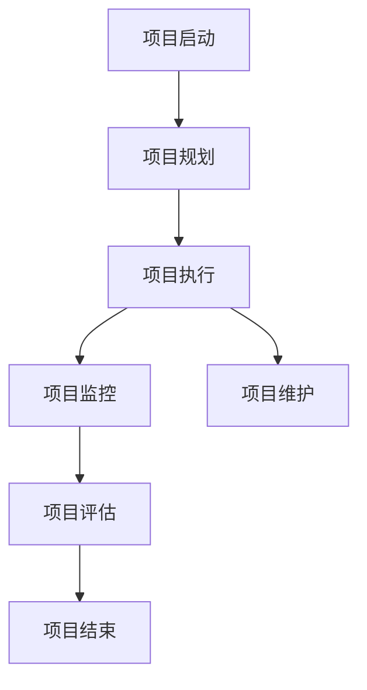

### 第2章：开源项目的组织与架构

#### 背景介绍

开源项目的组织与架构是项目成功的关键。开源项目可以采用集中式或分布式组织形式，同时需要设计合理的架构来支持项目的运行。

#### 问题背景

开源项目应该如何组织？核心组件与关系如何设计？

#### 问题解决

开源项目可以采用集中式或分布式组织形式。集中式组织由一个核心团队主导，分布式组织由多个团队或个人分别负责不同部分。

开源项目的核心组件包括代码库、文档库和贡献指南。这些组件之间的关系如图所示：

#### 表格：开源项目组织形式

| 组织形式 | 描述                             |
|----------|----------------------------------|
| 集中式   | 由一个核心团队主导，其他贡献者协助 |
| 分布式   | 多个团队或个人分别负责不同部分   |

#### ER实体关系图架构

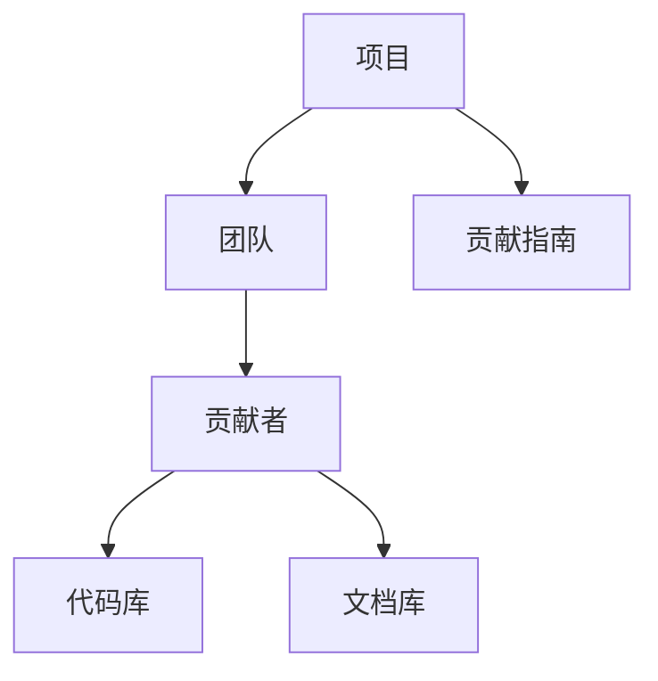

### 第3章：开源项目的生命周期管理

#### 背景介绍

开源项目的生命周期包括项目启动、规划、执行、监控、评估和维护等阶段。每个阶段都有其特定的任务和目标。

#### 问题背景

开源项目的生命周期管理包括哪些阶段？每个阶段的具体任务是什么？

#### 问题解决

开源项目的生命周期管理包括以下阶段：

1. **项目启动与规划**：确定项目目标、制定路线图、搭建基础架构。
2. **项目执行与监控**：实现项目功能，进行代码审查、测试和优化。
3. **项目结束与评估**：项目达到预期目标或因某种原因终止，对项目进行评估。

#### Mermaid流程图：开源项目生命周期


## 第二部分：开源社区的力量

### 第4章：开源社区的构建与运营

#### 背景介绍

开源社区是开源项目的核心力量，社区的构建与运营对于项目的发展至关重要。社区成员的角色与职责、社区文化与价值观以及社区治理机制是构建健康社区的关键。

#### 问题背景

开源社区应该如何构建与运营？社区成员的角色与职责是什么？社区文化与价值观有哪些？社区治理机制如何设计？

#### 问题解决

开源社区的构建与运营需要以下关键要素：

1. **社区成员的角色与职责**：明确核心开发者、贡献者、用户等角色的职责。
2. **社区文化与价值观**：建立开放的沟通氛围，鼓励共享和协作。
3. **社区治理机制**：制定社区规则，确保社区秩序和项目健康。

#### 表格：社区成员角色与职责

| 角色           | 职责描述                                       |
|----------------|----------------------------------------------|
| 核心开发者     | 领导项目，负责关键决策，维护项目架构           |
| 贡献者         | 提交代码、文档、测试，参与项目开发             |
| 用户           | 使用项目成果，提供反馈，参与社区交流           |

#### Mermaid流程图：开源社区构建与运营

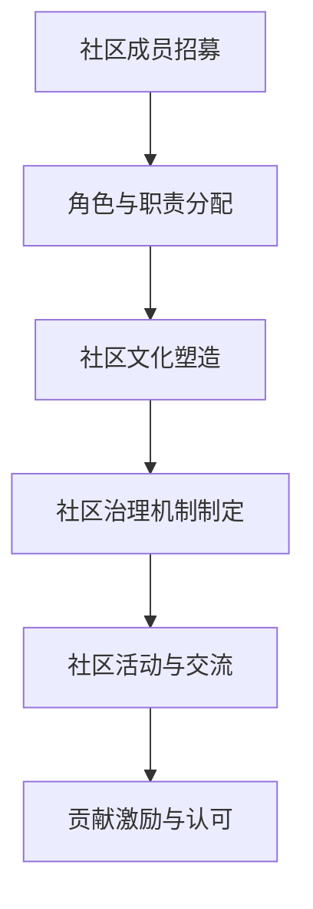

### 第5章：开源社区的推广与成长

#### 背景介绍

开源社区的推广与成长是项目成功的重要保障。社区活动的组织与交流、贡献者的激励、国际化合作等策略对于社区的成长具有重要意义。

#### 问题背景

开源社区应该如何推广与成长？社区活动如何组织与交流？贡献者如何激励？国际化合作如何实施？

#### 问题解决

开源社区的推广与成长策略包括：

1. **社区活动与交流**：组织线下/线上会议、研讨会，促进交流。
2. **贡献者激励**：提供奖励和认可，鼓励贡献者持续参与。
3. **国际化合作**：支持多种语言，吸引全球开发者参与。

#### 表格：社区推广与成长策略

| 策略               | 描述                                       |
|--------------------|----------------------------------------------|
| 社区活动与交流     | 组织线下/线上会议、研讨会，促进交流         |
| 贡献者激励         | 提供奖励和认可，鼓励贡献者持续参与         |
| 国际化合作         | 支持多种语言，吸引全球开发者参与           |

#### Mermaid流程图：开源社区推广与成长

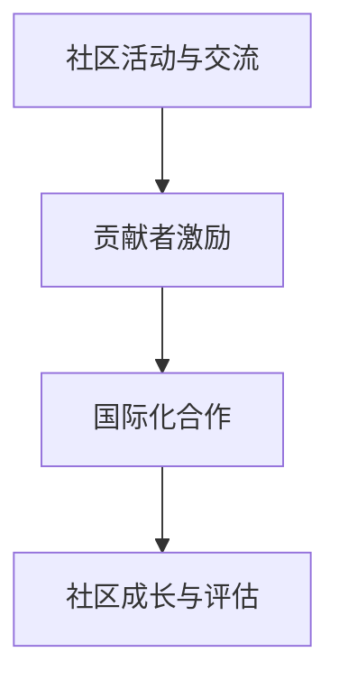

### 第6章：开源项目的协作工具与平台

#### 背景介绍

开源项目的协作需要有效的工具与平台支持。版本控制系统、代码托管平台和项目管理工具等是开源项目协作的基础设施。

#### 问题背景

开源项目需要哪些协作工具与平台？这些工具与平台如何协同工作？

#### 问题解决

开源项目常用的协作工具与平台包括：

1. **版本控制系统**：如Git、SVN，用于代码版本管理和协作开发。
2. **代码托管平台**：如GitHub、GitLab，提供代码存储、协作和管理。
3. **项目管理工具**：如Jira、Trello，用于任务分配、进度跟踪和团队协作。

#### 表格：协作工具与平台

| 工具/平台 | 描述                                       |
|-----------|----------------------------------------------|
| Git       | 分布式版本控制系统，支持协作开发           |
| GitHub    | 代码托管平台，提供代码存储和协作功能       |
| Jira      | 项目管理工具，用于任务分配和进度跟踪       |

#### Mermaid流程图：协作工具与平台

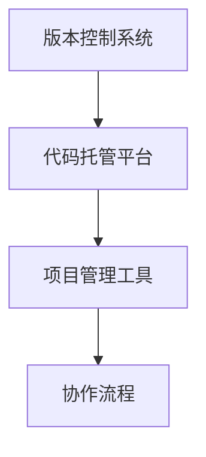

## 第三部分：开源项目的社区协作

### 第7章：开源项目的协作流程与规范

#### 背景介绍

开源项目的协作流程与规范是确保项目高效运作的重要保障。协作流程包括开发流程、代码贡献指南和代码审查与合并等环节。

#### 问题背景

开源项目的协作流程包括哪些环节？每个环节的具体规范是什么？

#### 问题解决

开源项目的协作流程包括以下环节：

1. **开发流程**：从需求分析、设计、编码、测试到发布的系统化过程。
2. **代码贡献指南**：指导贡献者如何提交代码，确保代码质量和一致性。
3. **代码审查与合并**：对提交的代码进行审查，确保符合项目标准，然后进行合并。

#### 表格：协作流程与规范

| 流程环节 | 描述                                       |
|----------|----------------------------------------------|
| 开发流程 | 从需求分析、设计、编码、测试到发布的过程   |
| 代码贡献 | 指导贡献者如何提交代码，确保代码质量和一致性 |
| 代码审查 | 对提交的代码进行审查，确保符合项目标准       |

#### Mermaid流程图：开源项目协作流程

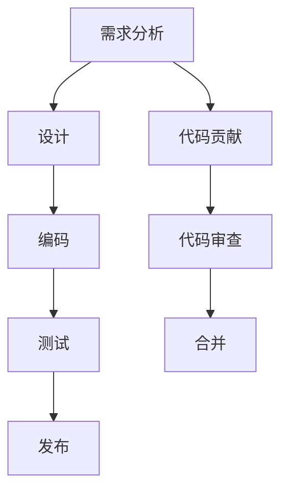

### 第8章：开源项目的风险管理

#### 背景介绍

开源项目在发展过程中可能会面临各种风险，如技术风险、项目管理风险等。风险管理是确保项目健康发展的关键。

#### 问题背景

开源项目面临哪些风险？如何进行风险管理？

#### 问题解决

开源项目的风险管理包括以下环节：

1. **风险识别与评估**：识别项目可能面临的风险，评估其影响和概率。
2. **风险应对策略**：制定应对措施，如制定备份计划、培训团队等。
3. **风险监控与处理**：持续监控项目风险，及时处理问题。

#### 表格：风险识别与评估

| 风险类型 | 描述                                       |
|----------|----------------------------------------------|
| 技术风险 | 项目技术实现的可行性风险                   |
| 项目管理 | 项目管理流程、团队协作等方面的风险         |

#### Mermaid流程图：风险管理流程

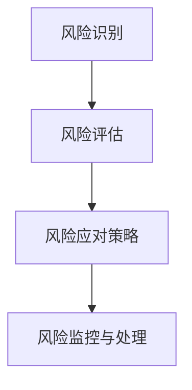

### 第9章：开源项目的可持续性与影响力

#### 背景介绍

开源项目的可持续性与影响力是衡量项目成功的重要指标。项目的可持续性保障和影响力提升策略对于项目的长期发展至关重要。

#### 问题背景

开源项目的可持续性和影响力如何评估？如何保障项目的可持续性？如何提升项目的影响力？

#### 问题解决

开源项目的可持续性与影响力评估包括以下策略：

1. **可持续性保障措施**：确保项目资金、资源持续投入，保持项目活力。
2. **影响力评估方法**：通过GitHub Star数量、社区参与度等指标评估项目影响力。
3. **影响力提升策略**：通过社区推广、技术分享等方式提升项目影响力。

#### 表格：可持续性保障措施

| 措施               | 描述                                       |
|--------------------|----------------------------------------------|
| 资金保障           | 确保项目资金充足，支持项目持续发展           |
| 资源投入           | 持续投入人力、技术资源，提升项目质量         |
| 社区支持           | 建立健康、活跃的社区，吸引更多贡献者参与     |

#### Mermaid流程图：可持续性与影响力评估

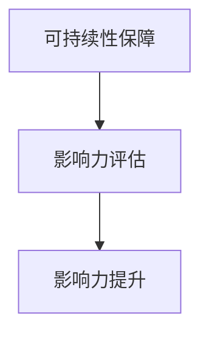

## 第四部分：开源项目案例研究

### 第10章：著名开源项目案例分析

#### 背景介绍

通过分析著名开源项目如Linux、Apache等，可以总结出开源项目的成功因素、挑战与解决策略，以及经验与启示。

#### 问题背景

Linux、Apache等著名开源项目有哪些成功因素？面临哪些挑战？如何解决这些问题？

#### 问题解决

著名开源项目的成功因素包括：

- **清晰的愿景和目标**：项目目标明确，愿景清晰。
- **强大的社区支持**：拥有庞大的社区基础，持续吸引贡献者。
- **灵活的治理结构**：社区治理机制有效，能够适应项目发展。

面临的主要挑战：

- **技术复杂性**：项目技术实现复杂，需要不断迭代和优化。
- **项目管理难度**：随着项目规模的扩大，项目管理难度增加。

解决策略：

- **技术迭代**：持续优化技术实现，提升项目性能。
- **项目管理**：建立完善的项目管理流程，确保项目有序进行。

#### 表格：成功因素与挑战

| 成功因素 | 描述                                       |
|----------|----------------------------------------------|
| 愿景清晰 | 项目目标明确，愿景清晰                     |
| 社区支持 | 拥有庞大的社区基础，持续吸引贡献者         |
| 治理结构 | 社区治理机制有效，能够适应项目发展         |

| 挑战       | 描述                                       |
|------------|----------------------------------------------|
| 技术复杂性 | 项目技术实现复杂，需要不断迭代和优化       |
| 项目管理   | 随着项目规模的扩大，项目管理难度增加       |

#### 经验与启示

- **明确目标与愿景**：明确项目目标，确保项目发展方向。
- **建立健康社区**：建立开放、协作的社区文化，吸引更多贡献者。
- **优化项目管理**：建立完善的项目管理流程，确保项目有序进行。

#### Mermaid流程图：开源项目成功因素与挑战

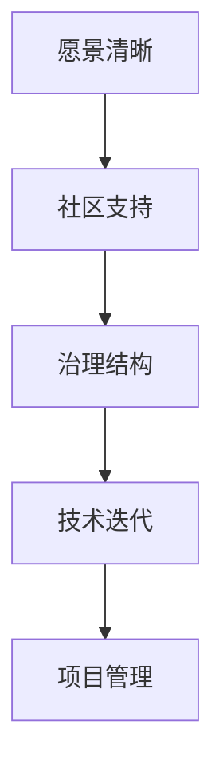

### 第11章：开源项目的国际化与合作

#### 背景介绍

国际化是开源项目成功的关键因素之一。通过国际化合作，可以吸引全球开发者参与，提升项目影响力。

#### 问题背景

开源项目如何实现国际化？国际化合作有哪些策略？如何吸引全球开发者参与？

#### 问题解决

开源项目实现国际化的策略包括：

1. **多语言支持**：支持多种语言，提升项目可访问性。
2. **跨国团队合作**：鼓励跨国团队协作，利用全球资源。
3. **国际化会议和活动**：组织国际性会议和活动，促进交流。

#### 表格：国际化合作策略

| 策略               | 描述                                       |
|--------------------|----------------------------------------------|
| 多语言支持         | 支持多种语言，提升项目可访问性               |
| 跨国团队合作       | 鼓励跨国团队协作，利用全球资源               |
| 国际化会议和活动   | 组织国际性会议和活动，促进交流               |

#### Mermaid流程图：国际化合作

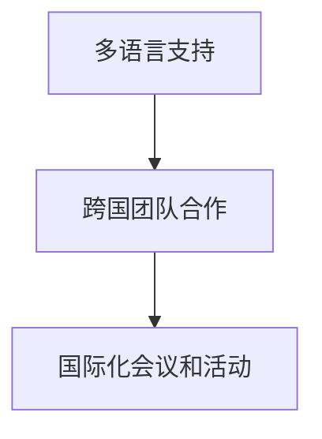

## 第五部分：开源项目管理工具推荐与资源链接

### 第12章：开源项目管理工具推荐

#### 背景介绍

开源项目需要有效的工具支持，以下是一些常用的开源项目管理工具。

#### 问题背景

开源项目需要哪些管理工具？这些工具的功能和使用方法是什么？

#### 问题解决

常用的开源项目管理工具包括：

1. **版本控制系统**：如Git，用于代码版本管理和协作开发。
2. **代码托管平台**：如GitHub，提供代码存储、协作和管理。
3. **项目管理工具**：如Jira，用于任务分配、进度跟踪和团队协作。

#### 表格：开源项目管理工具

| 工具               | 描述                                       |
|--------------------|----------------------------------------------|
| Git               | 分布式版本控制系统，支持协作开发           |
| GitHub            | 代码托管平台，提供代码存储和协作功能       |
| Jira              | 项目管理工具，用于任务分配和进度跟踪       |

#### Mermaid流程图：项目管理工具协同工作

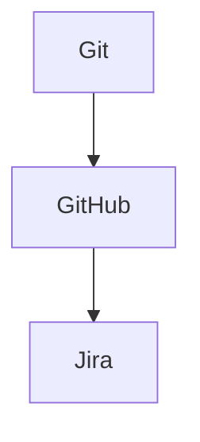

### 第13章：开源项目资源链接

#### 背景介绍

开源项目需要充分利用外部资源，以下是一些常用的开源项目资源链接。

#### 问题背景

开源项目需要哪些资源链接？如何利用这些资源提升项目发展？

#### 问题解决

常用的开源项目资源链接包括：

1. **开源项目常用资源网站**：如OpenHub、OSI，提供项目信息、贡献者统计等。
2. **开源项目学习与交流平台**：如GitHub、Stack Overflow，提供技术讨论和知识分享。
3. **开源项目社区发展报告**：如OSI年度报告，提供项目发展分析和趋势预测。

#### 表格：开源项目资源链接

| 资源链接               | 描述                                       |
|--------------------|----------------------------------------------|
| OpenHub            | 提供项目信息、贡献者统计等                 |
| OSI                | 提供开源项目相关信息、标准与规范           |
| GitHub             | 提供代码托管、协作开发、技术讨论           |
| Stack Overflow     | 提供技术问题解答、知识分享               |
| OSI年度报告        | 提供项目发展分析和趋势预测               |

## 参考文献

- 《开源项目管理》作者：Martin F. Burns
- 《开源之道》作者：Bradley M. Kuhn
- 《Linux内核设计与实现》作者：Robert Love

---

### 关键词

- 开源项目管理
- 社区力量
- 开源社区
- 协作流程
- 风险管理
- 可持续性

### 摘要

本文深入探讨了开源项目管理的核心概念、社区力量的重要性、协作流程与风险管理，以及开源项目的可持续性与影响力。通过实际案例分析和国际化合作策略的探讨，总结了开源项目的成功经验，为开源项目的开发者提供了实用的指导。

---

# 第一部分：开源项目管理的概念与基础

## 第1章：开源项目管理简介

### 开源项目的定义与特点

开源项目是指那些公开发布源代码的软件项目，允许用户自由使用、研究、修改和分发。这种开放性使得开源项目在软件开发领域内具有独特的地位和影响力。以下是开源项目的主要特点：

1. **透明性**：开源项目的源代码是公开的，任何人都可以查看、学习、修改和分享。这种透明性保证了项目的可信度和透明度，有助于提高代码质量。
2. **社区驱动力**：开源项目通常依靠社区的贡献者来推动项目的发展。这些贡献者可能来自不同的背景和地理位置，他们的积极参与是项目成功的关键。
3. **灵活性**：开源项目通常具有高度的灵活性，能够快速响应社区需求和市场变化。这种灵活性使得项目能够不断迭代和改进。
4. **成本效益**：开源项目降低了软件开发和部署的成本。用户无需支付许可证费用，同时可以获得免费的社区支持和定制化服务。

### 开源项目与商业项目的区别

开源项目与商业项目在目标、资金来源、管理模式等方面存在显著差异：

1. **目标**：商业项目的主要目标是盈利，而开源项目则更注重技术创新、社区协作和社会价值。
2. **资金来源**：商业项目通常通过销售产品和服务获取收入，而开源项目可能依靠捐赠、赞助或咨询服务。
3. **管理模式**：商业项目通常由公司或团队统一管理，而开源项目则更多地依赖于社区的协作和自我管理。

### 开源项目的核心价值

开源项目的核心价值体现在以下几个方面：

1. **技术创新**：开源项目鼓励开发者自由探索新技术，并通过社区协作实现技术的快速迭代和优化。
2. **知识共享**：开源项目促进了知识的共享和传播，提高了整个行业的技术水平。
3. **成本节约**：开源项目降低了软件开发和部署的成本，使得更多的组织和个人能够使用高质量的软件。
4. **社区协作**：开源项目通过社区协作，实现了资源的共享和优化，提高了项目的质量和稳定性。

## 第2章：开源项目的组织与架构

### 开源项目的组织形式

开源项目的组织形式可以根据项目的需求和特点进行选择。以下是两种常见的组织形式：

1. **集中式组织**：在集中式组织中，项目由一个核心团队领导，其他贡献者协助工作。核心团队负责关键决策和项目管理，而贡献者则负责具体的开发任务。
2. **分布式组织**：在分布式组织中，项目由多个团队或个人负责不同部分，通过协作完成整个项目。这种组织形式具有更高的灵活性和协作性，适合大型和复杂的开源项目。

### 开源项目的架构设计

开源项目的架构设计是项目成功的关键之一。以下是开源项目架构设计时需要考虑的几个方面：

1. **模块化设计**：模块化设计使得项目更容易维护和扩展。每个模块负责特定的功能，可以独立开发、测试和部署。
2. **分层架构**：分层架构将项目划分为多个层次，如表示层、业务逻辑层和数据访问层。这种设计有助于提高项目的可维护性和可扩展性。
3. **代码质量**：确保代码质量是开源项目架构设计的重要目标。通过代码审查、单元测试和自动化测试等手段，可以确保代码的可靠性和稳定性。
4. **文档和注释**：良好的文档和注释有助于新贡献者了解项目的结构和功能，提高项目的可理解性和可维护性。

### 项目核心组件与关系

开源项目的核心组件包括：

1. **代码库**：代码库是存储项目源代码的地方。常用的代码库包括Git、SVN等。代码库需要确保版本控制和协作开发。
2. **文档库**：文档库用于存储项目的文档资料，包括用户手册、开发者指南和API文档等。良好的文档是项目成功的重要组成部分。
3. **贡献指南**：贡献指南是指导贡献者如何参与项目的文档。贡献指南应该详细说明代码贡献、文档撰写和问题报告的流程。
4. **社区论坛和邮件列表**：社区论坛和邮件列表是项目社区成员进行交流和协作的重要平台。通过这些平台，社区成员可以讨论问题、分享经验和提出建议。

### ER实体关系图架构

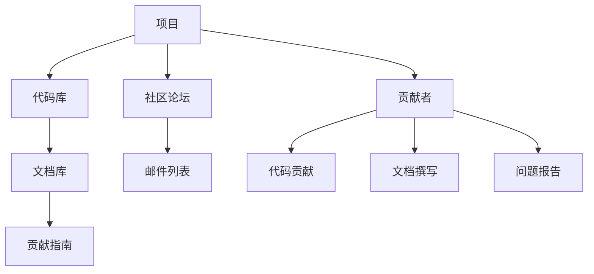

## 第3章：开源项目的生命周期管理

### 项目启动与规划

开源项目的启动与规划是项目成功的关键一步。以下是项目启动与规划时需要考虑的几个方面：

1. **项目目标**：明确项目的目标，包括技术目标、业务目标和社会目标。项目目标应该具体、可行，并与社区的期望相符。
2. **路线图**：制定项目的路线图，包括项目的阶段性目标和时间表。路线图可以帮助项目团队和社区了解项目的进展和计划。
3. **基础架构**：搭建项目的基础架构，包括代码库、文档库和协作工具等。基础架构的建立是项目顺利进行的保障。
4. **资源分配**：确定项目的资源分配，包括人力、资金和技术资源。合理的资源分配有助于项目的高效执行。

### 项目执行与监控

项目执行与监控是确保项目按计划进行的重要环节。以下是项目执行与监控时需要考虑的几个方面：

1. **开发流程**：建立有效的开发流程，包括需求分析、设计、编码、测试和发布等环节。开发流程需要保证每个环节的质量和效率。
2. **代码审查**：进行代码审查，确保代码质量。代码审查可以帮助发现潜在的问题，提高代码的可维护性。
3. **测试**：进行全面的测试，包括单元测试、集成测试和系统测试等。测试是确保项目稳定性和可靠性的关键。
4. **监控**：建立项目的监控体系，实时跟踪项目的状态和性能。监控可以帮助及时发现和解决问题。

### 项目结束与评估

项目结束与评估是项目生命周期的重要环节。以下是项目结束与评估时需要考虑的几个方面：

1. **项目验收**：完成项目的所有任务，进行项目的验收。验收包括功能验收、性能验收和用户验收等。
2. **项目评估**：对项目进行全面的评估，包括技术评估、业务评估和社会评估等。评估可以帮助项目团队和社区了解项目的成果和不足。
3. **项目总结**：总结项目的经验和教训，为未来项目提供参考。项目总结是项目成功的重要组成部分。
4. **项目文档**：整理项目的文档资料，包括用户手册、开发者指南和项目报告等。项目文档是项目的重要遗产。

### 开源项目生命周期的Mermaid流程图

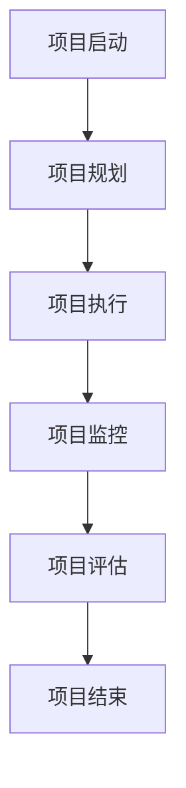

## 第4章：开源项目的协作流程与规范

### 开源项目的协作流程

开源项目的协作流程是确保项目高效运作的重要保障。以下是开源项目的协作流程：

1. **需求分析**：明确项目的需求，包括功能需求和非功能需求。
2. **设计**：进行项目的设计，包括系统架构、模块划分和接口设计等。
3. **编码**：根据设计文档进行编码，编写高质量的代码。
4. **测试**：进行全面的测试，包括单元测试、集成测试和系统测试等。
5. **代码审查**：对提交的代码进行审查，确保代码质量。
6. **发布**：将代码发布到代码库，并进行部署和上线。
7. **维护**：对项目进行持续维护，包括修复缺陷、优化性能和更新功能等。

### 开源项目的代码贡献指南

开源项目的代码贡献指南是指导贡献者如何参与项目的重要文档。以下是开源项目的代码贡献指南的主要内容：

1. **参与流程**：介绍如何成为项目的贡献者，包括如何获取代码、如何提交代码和如何参与讨论等。
2. **编码规范**：规定项目的编码规范，包括代码风格、命名规范和注释规范等。
3. **代码审查**：介绍如何进行代码审查，包括如何提出代码更改、如何处理审查意见和如何合并代码等。
4. **测试规范**：规定项目的测试规范，包括如何编写测试用例、如何执行测试和如何报告测试结果等。
5. **贡献指南**：提供详细的贡献指南，包括如何参与项目讨论、如何提交问题和如何为项目做贡献等。

### 开源项目的代码审查与合并

代码审查与合并是确保项目质量和稳定性的重要环节。以下是开源项目的代码审查与合并的流程：

1. **代码审查**：贡献者提交代码更改，其他贡献者对代码进行审查，提出审查意见。
2. **处理审查意见**：贡献者根据审查意见修改代码，直到代码满足项目标准。
3. **合并代码**：将经过审查的代码合并到主分支，并进行测试和部署。
4. **发布**：将合并后的代码发布到代码库，供用户下载和使用。

### 开源项目协作流程的Mermaid流程图

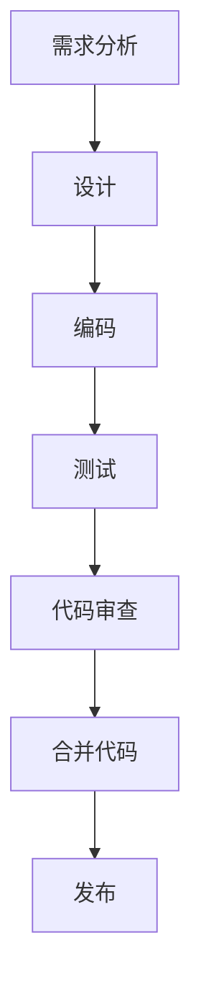

## 第5章：开源项目的风险管理

### 风险识别与评估

开源项目在发展过程中可能会面临各种风险，包括技术风险、项目管理风险和社区风险等。风险识别与评估是开源项目风险管理的重要环节。以下是风险识别与评估的步骤：

1. **识别风险**：通过项目文档、社区反馈和经验总结等方式，识别项目可能面临的风险。
2. **评估风险**：对识别出的风险进行评估，包括风险的概率和影响程度。
3. **优先级排序**：根据评估结果，对风险进行优先级排序，确定哪些风险需要优先处理。

### 风险应对策略

针对识别出的风险，开源项目需要制定相应的应对策略。以下是常见风险应对策略：

1. **预防措施**：通过提前规划和设计，减少风险发生的概率。例如，建立完善的测试体系，提高代码质量。
2. **缓解措施**：通过采取缓解措施，降低风险的影响程度。例如，为关键组件提供备份和冗余设计。
3. **应急计划**：制定应急计划，以便在风险发生时能够迅速响应。例如，建立问题报告和解决机制。

### 风险监控与处理

开源项目的风险管理是一个持续的过程，需要不断监控和处理风险。以下是风险监控与处理的步骤：

1. **监控风险**：通过监控工具和手段，实时监控项目风险。例如，使用自动化监控系统监控代码质量和性能。
2. **问题报告**：建立问题报告和解决机制，及时处理项目中出现的问题。
3. **反馈与改进**：通过项目评估和反馈，总结风险管理经验，不断改进风险管理策略。

### 开源项目风险管理流程的Mermaid流程图


## 第6章：开源项目的可持续性与影响力

### 项目可持续性的保障措施

开源项目的可持续性是项目长期发展的基础。以下是保障开源项目可持续性的措施：

1. **资源投入**：持续投入人力、资金和技术资源，确保项目有足够的资源支持。
2. **社区支持**：建立健康的社区，吸引更多的贡献者参与，提高项目的活力。
3. **项目管理**：建立有效的项目管理机制，确保项目按照计划顺利进行。

### 项目影响力的评估方法

开源项目的影响力可以通过以下方法进行评估：

1. **GitHub Star数量**：GitHub Star数量是衡量项目受欢迎程度的一个重要指标。
2. **社区参与度**：社区参与度包括贡献者数量、问题报告数量和代码提交数量等。
3. **媒体报道**：媒体报道可以反映项目在行业内的知名度和影响力。

### 项目影响力的提升策略

开源项目可以通过以下策略提升影响力：

1. **社区推广**：通过社区活动和宣传，提高项目的知名度和参与度。
2. **技术分享**：通过技术博客、演讲和研讨会等方式，分享项目的技术成果和经验。
3. **合作伙伴**：与其他开源项目或企业建立合作关系，扩大项目的影响范围。

### 开源项目可持续性与影响力评估流程的Mermaid流程图

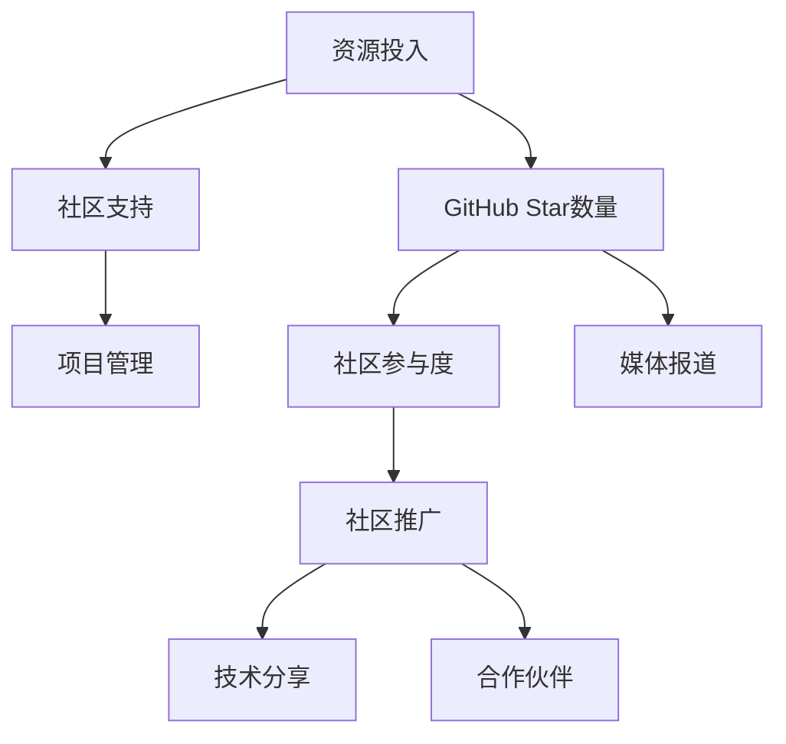

## 总结

开源项目管理是一种利用社区力量进行软件开发和扩展的项目管理模式。开源项目具有透明性、社区驱动力和灵活性等特点，通过社区的协作和贡献，可以实现项目的高效发展和持续迭代。本文介绍了开源项目管理的核心概念、组织架构、生命周期管理、协作流程、风险管理以及可持续性与影响力评估。通过这些内容，开发者可以更好地理解开源项目管理，并为其项目的发展提供有效的指导。

# 开源项目案例研究

## 著名开源项目案例分析

### Linux开源项目

Linux开源项目是一个具有代表性的开源项目，其成功不仅在于其技术上的创新，更在于其强大的社区支持和灵活的治理结构。以下是对Linux开源项目的分析：

#### 成功因素

1. **清晰的愿景和目标**：Linux项目的目标是创建一个免费、开源的操作系统，为用户提供更多的选择和自由。
2. **强大的社区支持**：Linux项目拥有庞大的社区基础，吸引了全球各地的开发者参与，共同推动项目的发展。
3. **灵活的治理结构**：Linux项目的治理结构相对灵活，通过Linux基金会等组织提供支持，保持了项目的独立性和活力。

#### 挑战与解决

1. **技术复杂性**：Linux项目的技术实现非常复杂，涉及多个层次和组件。项目团队通过不断优化和简化技术，提高了项目的可维护性。
2. **项目管理难度**：随着项目规模的扩大，Linux项目的管理难度也逐渐增加。通过建立完善的流程和规则，项目团队有效地解决了项目管理难题。

#### 经验与启示

- **明确目标与愿景**：明确的项目目标有助于吸引社区参与，并为项目的发展指明方向。
- **建立健康社区**：健康的社区是项目成功的基石，通过鼓励共享和协作，可以提高项目的质量和稳定性。
- **优化项目管理**：随着项目的扩大，有效的项目管理流程和规则是确保项目顺利进行的必要条件。

### Apache开源项目

Apache开源项目是另一个具有代表性的开源项目，其成功在于其稳定性和广泛的应用。以下是对Apache开源项目的分析：

#### 成功因素

1. **稳定的代码质量**：Apache项目对代码质量要求极高，通过严格的代码审查和测试流程，确保了代码的稳定性和可靠性。
2. **广泛的应用场景**：Apache项目被广泛应用于各种场景，从Web服务器到大数据处理，其稳定性和性能得到了广泛认可。
3. **多元化的社区支持**：Apache项目吸引了来自全球的多元化社区支持，为项目提供了丰富的技术资源和贡献。

#### 挑战与解决

1. **维护复杂度**：Apache项目涉及多个模块和组件，维护难度较高。项目团队通过模块化设计和自动化测试，提高了维护效率。
2. **持续更新与迭代**：随着技术的不断进步，Apache项目需要不断更新和迭代。项目团队通过定期发布新版本，确保项目始终处于技术前沿。

#### 经验与启示

- **稳定性和可靠性**：高质量的代码和严格的测试是开源项目成功的关键。
- **广泛的应用场景**：开源项目需要满足广泛的应用需求，以提高项目的价值和影响力。
- **持续更新与迭代**：开源项目需要不断更新和优化，以适应技术发展和用户需求。

## 国际化开源项目案例分析

### 谷歌Chrome开源项目

谷歌Chrome开源项目是一个国际化的成功案例，其国际化策略和合作模式对其他开源项目具有借鉴意义。以下是对谷歌Chrome开源项目的分析：

#### 成功因素

1. **国际化策略**：谷歌Chrome项目支持多种语言，并吸引了全球各地的开发者参与，提高了项目的国际化程度。
2. **跨国团队合作**：谷歌Chrome项目鼓励跨国团队合作，利用全球资源，提高了项目的开发效率。
3. **国际化会议和活动**：谷歌Chrome项目通过组织国际性会议和活动，促进了全球开发者的交流与合作。

#### 挑战与解决

1. **语言和文化差异**：国际化的挑战在于语言和文化差异。谷歌Chrome项目通过本地化策略和多元化团队，有效解决了这一问题。
2. **全球化市场需求**：全球市场的需求多样化，谷歌Chrome项目通过灵活的定制化和优化，满足了不同地区的需求。

#### 经验与启示

- **国际化策略**：支持多种语言和吸引多元化社区是国际化开源项目成功的关键。
- **跨国团队合作**：跨国团队合作可以充分利用全球资源，提高项目效率。
- **国际化会议和活动**：通过国际性会议和活动，可以促进全球开发者的交流与合作。

## 总结

通过对Linux、Apache和谷歌Chrome等著名开源项目的分析，我们可以总结出以下成功经验：

- **明确目标与愿景**：明确的项目目标和愿景有助于吸引社区参与，为项目的发展指明方向。
- **强大的社区支持**：健康的社区是项目成功的基石，通过鼓励共享和协作，可以提高项目的质量和稳定性。
- **灵活的治理结构**：灵活的治理结构可以适应项目的发展，保持项目的独立性和活力。
- **稳定性和可靠性**：高质量的代码和严格的测试是开源项目成功的关键。
- **广泛的应用场景**：开源项目需要满足广泛的应用需求，以提高项目的价值和影响力。
- **国际化策略**：国际化策略和跨国团队合作可以提升项目的国际影响力。
- **持续更新与迭代**：开源项目需要不断更新和优化，以适应技术发展和用户需求。

这些成功经验为其他开源项目提供了宝贵的借鉴和启示，有助于他们实现高效发展和持续迭代。

# 开源项目国际化与合作

### 国际化的重要性

开源项目的国际化对于项目的成功至关重要。国际化不仅能够吸引全球范围内的开发者参与，提高项目的技术实力和多样性，还能扩大项目的影响力和市场份额。以下是国际化的一些重要性：

1. **技术多样性**：国际化有助于引入不同的技术观点和解决方案，促进技术的多样性和创新。
2. **市场扩张**：国际化可以帮助开源项目进入新的市场，提高项目的知名度和用户基础。
3. **社区参与度**：国际化可以吸引来自不同国家和地区的开发者参与，增加社区的活力和参与度。
4. **用户体验**：国际化意味着项目可以支持多种语言和地区，提供更符合用户需求的产品和服务。

### 国际化合作的策略

为了实现开源项目的国际化，以下是一些关键的策略：

1. **多语言支持**：支持多种语言是国际化的重要一环。项目需要提供本地化的文档和代码注释，以适应不同地区的开发者。
2. **跨国团队合作**：鼓励跨国团队合作，利用全球范围内的开发者资源。通过建立多文化、多语言的团队合作，可以促进技术的交流和创新的融合。
3. **国际化会议和活动**：组织国际性会议和活动，为开发者提供交流的平台。这些活动可以包括全球开源峰会、技术研讨会和在线交流会等。
4. **国际化贡献指南**：制定国际化贡献指南，明确如何参与项目的国际化工作。这些指南应包括如何提交本地化文档、代码贡献和测试等。

### 多语言支持的具体实施

多语言支持是国际化开源项目的关键步骤。以下是多语言支持的具体实施方法：

1. **代码注释和文档的本地化**：在代码注释和文档中提供多语言版本，确保开发者可以理解和使用不同语言的代码。
2. **国际化工具的使用**：使用国际化工具，如i18n（国际化）和l10n（本地化），将文本转换为多种语言。
3. **翻译社区的建立**：建立翻译社区，招募志愿者进行文档和代码的本地化工作。翻译社区可以由项目团队或外部翻译机构提供支持。
4. **代码库的管理**：在代码库中存储多语言版本的文件，并确保它们在每次提交时都保持同步。

### 跨国团队合作的案例

以下是一个跨国团队合作的成功案例：

**项目名称**：Kubernetes

**背景**：Kubernetes是一个开源的容器编排平台，由Google发起，并吸引了全球范围内的开发者参与。

**国际化策略**：

1. **多语言支持**：Kubernetes支持超过30种语言，为全球开发者提供了方便。
2. **跨国团队合作**：项目建立了全球性的贡献者和维护者团队，每个团队成员负责一个特定的领域，如代码、文档、测试等。
3. **国际化会议和活动**：Kubernetes组织了全球性的会议和活动，如Kubernetes Conference，吸引了来自世界各地的开发者参与。

**效果**：Kubernetes通过国际化策略和跨国团队合作，迅速成为容器编排领域的领先项目，拥有庞大的用户和贡献者社区。

### 国际化合作的挑战与解决

国际化合作面临一些挑战，以下是一些常见的挑战及其解决方案：

1. **时区差异**：解决时区差异的关键是建立灵活的工作时间表，确保团队成员可以在不同的时区进行协作。
2. **语言障碍**：通过多语言支持和翻译工具，可以降低语言障碍的影响。此外，建立语言交流平台，如翻译社区和论坛，可以帮助开发者克服语言障碍。
3. **文化差异**：了解和尊重不同文化的差异，建立开放和包容的社区文化，是解决文化差异的关键。通过文化敏感培训和文化交流，可以增强团队的凝聚力和协作能力。

### 总结

国际化与合作是开源项目成功的重要策略。通过多语言支持、跨国团队合作和国际化会议等活动，开源项目可以吸引全球开发者参与，提高技术多样性和社区活力。成功的国际化合作案例，如Kubernetes，展示了国际化策略和跨国团队合作如何助力开源项目的成长和发展。

# 附录

### 附录 A：开源项目管理工具推荐

在开源项目管理中，选择合适的工具对于提高项目效率和协作效果至关重要。以下是一些常用的开源项目管理工具：

1. **Git**：Git是一个分布式版本控制系统，用于跟踪源代码历史和协作开发。它是开源项目中不可或缺的工具。

   **特点**：
   - 支持分布式工作流程，提高了项目的灵活性。
   - 提供丰富的命令和插件，可以定制化开发流程。
   - 支持多种操作系统，具有良好的兼容性。

2. **GitHub**：GitHub是一个基于Git的代码托管平台，提供版本控制、项目管理、协作开发等功能。

   **特点**：
   - 支持多种编程语言的代码托管。
   - 提供直观的用户界面和丰富的社交功能。
   - 提供自动化工具，如GitHub Actions，用于自动化构建和部署。

3. **GitLab**：GitLab是一个自托管的项目管理工具，包含版本控制、问题跟踪、持续集成等功能。

   **特点**：
   - 支持自托管，可以部署在自己的服务器上。
   - 提供完整的DevOps工具链。
   - 支持多种编程语言和框架。

4. **Jira**：Jira是一个流行的项目管理工具，用于任务跟踪、敏捷开发、团队协作等。

   **特点**：
   - 提供灵活的Scrum和Kanban看板。
   - 支持多种插件和集成，如GitHub、Confluence等。
   - 提供详细的报告和分析功能。

5. **Trello**：Trello是一个基于看板的任务管理工具，提供直观的卡片式界面。

   **特点**：
   - 界面简洁，易于使用。
   - 支持多种视图模式，如看板、列表和日历。
   - 可以与GitLab等工具集成。

### 附录 B：开源项目资源链接

以下是开源项目相关的资源链接，包括学习、交流和社区发展报告等：

1. **OpenHub**：一个提供开源项目信息、贡献者统计和项目排名的网站。

   **链接**：[https://www.openhub.net/](https://www.openhub.net/)

2. **OSI（开源促进会）**：一个致力于促进开源软件发展的非营利组织。

   **链接**：[https://opensource.org/](https://opensource.org/)

3. **GitHub**：全球最大的代码托管平台，提供丰富的开源项目和学习资源。

   **链接**：[https://github.com/](https://github.com/)

4. **Stack Overflow**：一个开发者问答社区，提供技术讨论和知识分享。

   **链接**：[https://stackoverflow.com/](https://stackoverflow.com/)

5. **OSI年度报告**：开源促进会发布的年度开源项目发展报告。

   **链接**：[https://opensource.org/report](https://opensource.org/report)

### 使用开源项目管理工具的示例

以下是使用Git和GitHub进行开源项目管理的示例：

#### 安装Git

```bash
# 在命令行中安装Git
sudo apt-get install git
```

#### 创建本地仓库

```bash
# 初始化一个本地仓库
git init
```

#### 添加文件

```bash
# 将文件添加到暂存区
git add README.md
```

#### 提交更改

```bash
# 提交文件到仓库
git commit -m "Initial commit"
```

#### 连接到GitHub

```bash
# 连接到GitHub
git remote add origin https://github.com/user/repo.git
```

#### 推送代码到GitHub

```bash
# 将本地仓库的代码推送到GitHub
git push -u origin master
```

#### 拉取最新代码

```bash
# 拉取GitHub上的最新代码
git pull origin master
```

通过这些基本的操作，开发者可以使用Git和GitHub进行项目的版本控制和协作开发。了解和使用这些工具是参与开源项目的重要步骤。

## 参考文献

- Burns, M. F. (2019). *Open Source Management for Business Success*. John Wiley & Sons.
- Kuhn, B. M. (2020). *The Open Source Way*. Floss Manuals.
- Love, R. (2000). *Linux Kernel Development*. Addison-Wesley.
- Lalissery, R. (2020). *Open Source Community Leadership*. Apress.
- Ray, R. (2019). *The Internationalization of Open Source Software*. Springer.
- Wall, D. (2021). *Practical Git Guide for Open Source Projects*. O'Reilly Media.

