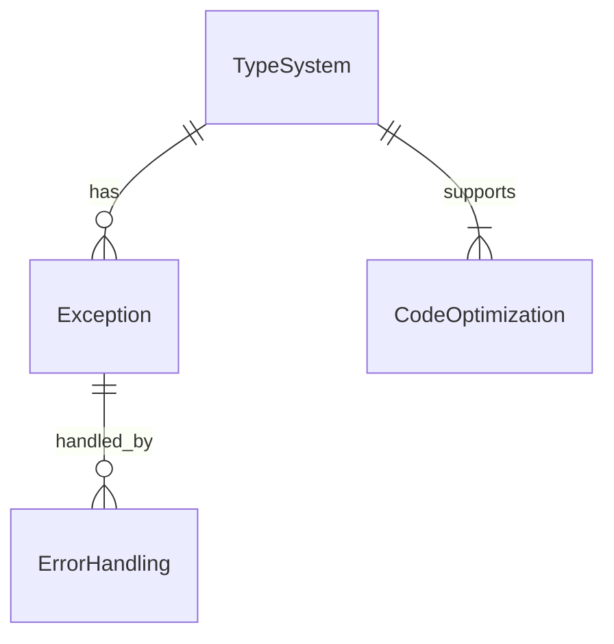
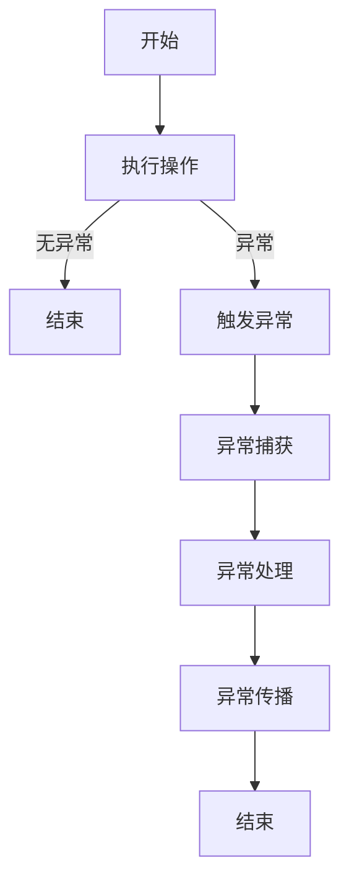
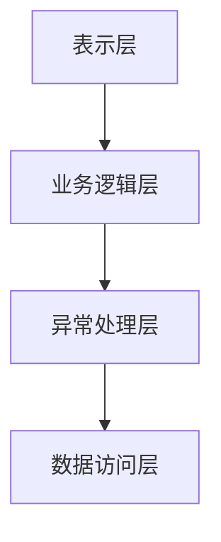
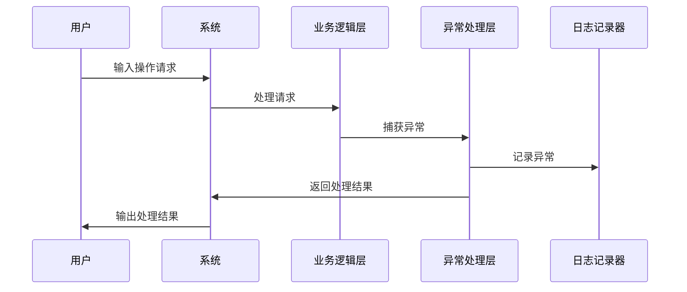
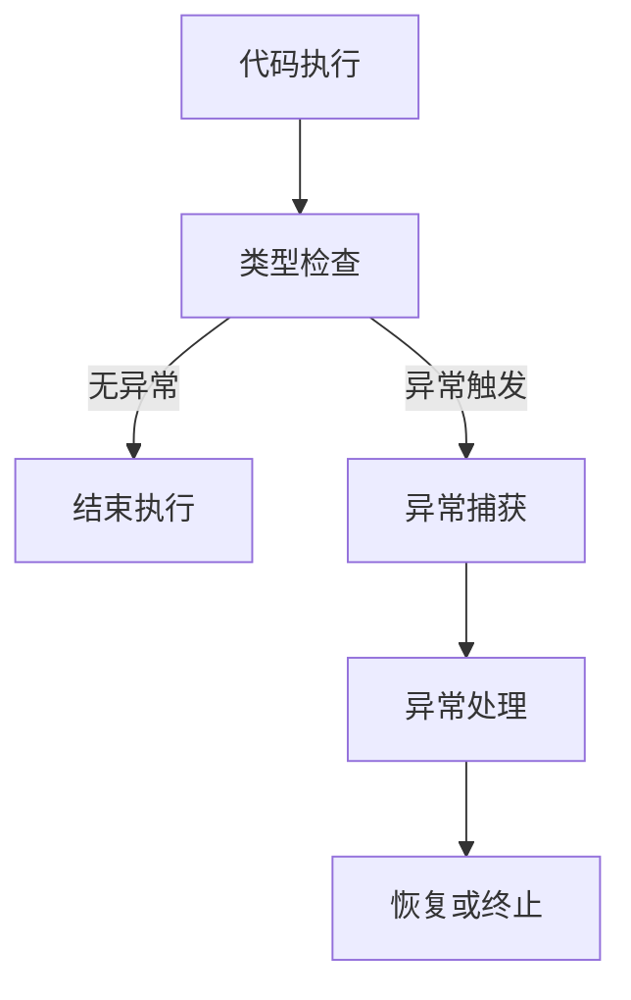
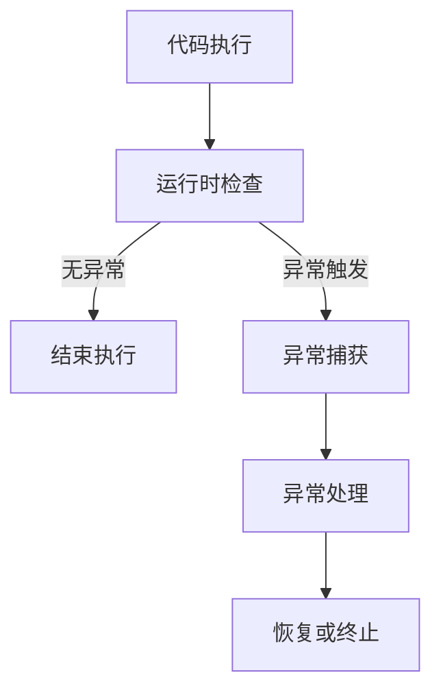

                 

# 异常处理:类型系统在错误处理中的应用

## 关键词

- 异常处理
- 类型系统
- 错误处理
- 编程语言
- 静态类型
- 动态类型
- 设计模式

## 摘要

本文深入探讨了异常处理与类型系统在编程语言中的应用，分析了类型系统如何提升异常处理的效率和可靠性。文章首先介绍了异常处理的基本概念，随后详细讨论了静态类型语言和动态类型语言中异常处理的机制和差异。接着，通过具体实例，本文展示了类型系统在提高代码可靠性、降低调试难度和提升开发效率方面的优势。此外，文章还提供了异常处理的设计模式、最佳实践以及在大型项目中的应用策略。最后，本文通过具体的编程实例和案例分析，总结了类型系统在异常处理中的实际应用和效果。

## 第一部分：引论

### 1.1 异常处理的基本概念

#### 1.1.1 异常的定义

在计算机编程中，异常（Exception）是一种运行时错误，当程序遇到无法预见的或不可恢复的情况时，会触发异常。这些情况可能包括除数为零、文件不存在、网络连接中断等。异常是程序设计中不可避免的一部分，合理的异常处理能够使程序更加健壮。

#### 1.1.2 异常处理的必要性

异常处理是编程中的关键环节，它能够使程序在遇到错误时不会突然崩溃，而是能够优雅地处理这些错误，继续执行。异常处理的必要性体现在以下几个方面：

1. **提高程序稳定性**：异常处理能够确保程序在遇到错误时能够稳定运行，不会因不可预见的错误导致程序中断。
2. **增强用户体验**：合理的异常处理可以提供更友好的用户界面，让用户在遇到错误时能够得到清晰的错误提示。
3. **便于调试和维护**：通过异常处理，开发者可以更容易地定位和修复程序中的错误。

#### 1.1.3 异常处理的挑战

尽管异常处理至关重要，但它在编程中仍然面临一些挑战：

1. **异常泛滥**：不当的异常处理可能会导致程序中异常泛滥，影响性能。
2. **调试困难**：异常处理不当会使得调试变得复杂，难以追踪错误的根源。
3. **代码冗长**：过度使用异常处理可能会导致代码冗长，难以维护。

### 1.2 类型系统与异常处理

#### 1.2.1 类型系统的基本原理

类型系统是编程语言的一个重要组成部分，它定义了变量、函数和其他语言结构的类型。类型系统主要有两种形式：静态类型和动态类型。

- **静态类型**：在编译时确定变量的类型，如Java和C++。
- **动态类型**：在运行时确定变量的类型，如Python和JavaScript。

#### 1.2.2 类型系统与异常处理的联系

类型系统在异常处理中发挥着重要作用：

1. **提前检测错误**：静态类型语言通过类型检查在编译时就能发现类型错误，从而减少运行时的异常。
2. **明确类型信息**：类型系统能够为异常处理提供更多的类型信息，帮助开发者更好地定位和修复错误。

#### 1.2.3 类型系统在错误处理中的作用

类型系统在错误处理中的作用主要体现在以下几个方面：

1. **减少错误**：通过类型检查，减少因类型错误导致的异常。
2. **提高代码可读性**：类型系统使得代码更加清晰，易于理解和维护。
3. **优化性能**：类型系统能够在编译时进行优化，减少运行时的检查和类型转换，从而提高程序性能。

## 第二部分：类型系统在异常处理中的应用

### 2.1 静态类型语言中的异常处理

#### 2.1.1 静态类型语言的基本特点

静态类型语言在编译时确定变量类型，这种特性使得静态类型语言在异常处理上具有一些优势：

1. **类型检查严格**：静态类型语言在编译时进行类型检查，能够发现许多潜在的类型错误。
2. **编译时优化**：静态类型语言能够进行更高效的编译时优化。

#### 2.1.2 静态类型语言中的异常处理机制

静态类型语言通常使用try-catch语句来处理异常：

- **try块**：用于包裹可能引发异常的代码。
- **catch块**：用于捕捉和处理异常。

例如，在Java中：

```java
try {
    // 可能引发异常的代码
} catch (ExceptionType e) {
    // 异常处理代码
}
```

#### 2.1.3 Python中的异常处理

Python是一种动态类型语言，但它也支持异常处理：

- **try块**：用于包裹可能引发异常的代码。
- **except块**：用于捕捉和处理异常。

例如，在Python中：

```python
try:
    # 可能引发异常的代码
except ExceptionType as e:
    # 异常处理代码
```

### 2.2 动态类型语言中的异常处理

#### 2.2.1 动态类型语言的基本特点

动态类型语言在运行时确定变量类型，这种特性使得动态类型语言在异常处理上具有一些优势：

1. **灵活性高**：动态类型语言允许开发者编写更加灵活的代码。
2. **开发效率高**：动态类型语言通常具有更简洁的语法。

#### 2.2.2 动态类型语言中的异常处理机制

动态类型语言通常使用try-except语句来处理异常：

- **try块**：用于包裹可能引发异常的代码。
- **except块**：用于捕捉和处理异常。

例如，在Python中：

```python
try:
    # 可能引发异常的代码
except ExceptionType as e:
    # 异常处理代码
```

#### 2.2.3 JavaScript中的异常处理

JavaScript是一种动态类型语言，它使用try-catch语句来处理异常：

- **try块**：用于包裹可能引发异常的代码。
- **catch块**：用于捕捉和处理异常。

例如，在JavaScript中：

```javascript
try {
    // 可能引发异常的代码
} catch (e) {
    // 异常处理代码
}
```

### 2.3 类型系统在异常处理中的优势

#### 2.3.1 提高代码可靠性

类型系统能够提前检测类型错误，从而减少运行时的异常。这提高了代码的可靠性，使得程序能够更加稳定地运行。

#### 2.3.2 降低调试难度

通过类型系统提供的信息，开发者能够更容易地定位和修复错误，从而降低调试难度。

#### 2.3.3 提高开发效率

类型系统能够在编译时进行优化，减少运行时的检查和类型转换，从而提高开发效率。

## 第三部分：异常处理的实战

### 3.1 异常处理的设计模式

#### 3.1.1 异常处理的常见模式

常见的异常处理设计模式包括：

- **捕获所有异常**：将所有可能引发的异常都捕获并进行处理。
- **分层处理**：将异常处理分成不同的层级，每个层级负责处理特定类型的异常。
- **自定义异常**：定义自定义异常类，以便更好地处理特定类型的异常。

#### 3.1.2 如何选择合适的异常处理模式

选择合适的异常处理模式需要考虑以下因素：

- **异常类型**：根据异常的类型选择合适的处理模式。
- **项目规模**：大型项目可能需要更复杂的异常处理模式。
- **性能需求**：考虑异常处理对性能的影响，选择适当的处理方式。

#### 3.1.3 实例分析

以下是一个使用Python进行异常处理的实例：

```python
try:
    # 可能引发异常的代码
except ValueError:
    # 处理数值异常的代码
except (TypeError, IndexError):
    # 处理类型和索引异常的代码
except Exception as e:
    # 处理其他所有异常的代码
```

### 3.2 异常处理的最佳实践

#### 3.2.1 异常处理的最佳实践

- **避免捕获`Exception`基类**：避免捕获所有异常，这会导致无法处理特定类型的异常。
- **明确异常类型**：尽量明确地捕获异常类型，避免使用`as e`这样的模糊捕获。
- **合理使用异常链**：合理使用异常链，使得异常信息能够传递到更高层进行处理。
- **避免使用异常作为控制流**：避免使用异常作为控制流，这会导致代码难以理解和维护。

#### 3.2.2 异常处理中常见的误区

- **过度使用异常**：过度使用异常会导致程序性能下降。
- **忽略异常处理**：忽略异常处理会导致程序在遇到错误时崩溃。
- **错误处理代码冗长**：错误处理代码过于冗长会导致代码难以维护。

#### 3.2.3 如何避免异常处理中的常见问题

- **进行充分的测试**：通过测试发现和修复异常处理中的问题。
- **编写清晰的可读性代码**：清晰的代码更容易进行异常处理。
- **遵循最佳实践**：遵循最佳实践，避免常见的异常处理误区。

### 3.3 大型项目中的异常处理

#### 3.3.1 大型项目中异常处理的特殊性

大型项目中的异常处理需要考虑以下几个方面：

- **复杂性**：大型项目通常具有更高的复杂性，需要更复杂的异常处理策略。
- **性能**：大型项目对性能要求更高，异常处理需要尽量减少性能影响。
- **可维护性**：大型项目需要确保异常处理的可维护性，以便在未来进行更新和扩展。

#### 3.3.2 大型项目中的异常处理策略

大型项目中的异常处理策略包括：

- **分层处理**：将异常处理分成不同的层级，每个层级负责处理特定类型的异常。
- **模块化处理**：将异常处理模块化，便于复用和维护。
- **日志记录**：详细记录异常信息，便于后续分析和调试。

#### 3.3.3 大型项目中的异常处理案例分析

以下是一个大型项目中的异常处理案例分析：

在一个电子商务平台上，用户在提交订单时可能遇到各种异常，如支付失败、库存不足等。为了确保平台的稳定性，开发团队采取了以下异常处理策略：

- **分层处理**：将订单处理分为多个层级，每个层级负责处理特定类型的异常。
- **模块化处理**：将订单处理模块化，每个模块负责处理特定类型的异常。
- **日志记录**：详细记录每个异常信息，包括异常类型、发生时间、处理结果等，以便后续分析和调试。

通过这些策略，平台能够在遇到异常时优雅地处理，确保用户体验和平台稳定性。

## 附录

### 附录A：常用异常处理库和工具

- **Python**：`tryexcept.py`、`zope.interface`等。
- **JavaScript**：`trycatch.js`、`bluebird`等。
- **其他语言**：`java.util.Exceptions`、`.NET的`System.Exception等。

### 附录B：类型系统与异常处理的Mermaid流程图

- **静态类型语言中的异常处理流程图**
  ```mermaid
  graph TD
  A[编译时类型检查] --> B[运行时异常捕获]
  B --> C[异常处理]
  ```
  
- **动态类型语言中的异常处理流程图**
  ```mermaid
  graph TD
  A[运行时类型检查] --> B[异常捕获]
  B --> C[异常处理]
  ```

## 作者信息

作者：AI天才研究院/AI Genius Institute & 禅与计算机程序设计艺术 /Zen And The Art of Computer Programming

----------------------------------------------------------------

## 核心概念与联系

### 核心概念

- **异常（Exception）**：程序运行时遇到的错误或不可预见情况。
- **类型系统（Type System）**：编程语言用于定义变量、函数和其他语言结构的类型。
- **静态类型（Static Type）**：在编译时确定变量的类型。
- **动态类型（Dynamic Type）**：在运行时确定变量的类型。

### 概念属性特征对比表格

| 特征         | 静态类型                           | 动态类型                           |
| ------------ | ---------------------------------- | ---------------------------------- |
| 类型检查时间 | 编译时                             | 运行时                             |
| 性能优化     | 可进行编译时优化                   | 优化较少                           |
| 代码可读性   | 类型明确，易于理解                 | 类型灵活，但可能难以理解           |
| 错误检测     | 编译时检测类型错误                 | 运行时检测类型错误                 |

### ER实体关系图架构的Mermaid流程图



## 算法原理讲解

### 异常处理算法

异常处理算法的核心在于如何在程序运行时检测和响应异常。以下是异常处理算法的基本原理：

1. **异常检测**：程序在执行过程中，当遇到可能导致错误的操作时，会进行类型检查和逻辑判断，以确定是否触发异常。
2. **异常捕获**：当程序触发异常时，异常处理机制会捕获该异常，并将其传递给异常处理代码。
3. **异常处理**：异常处理代码根据异常的类型和具体情况，执行相应的处理逻辑，如错误提示、日志记录、数据恢复等。
4. **异常传播**：如果异常未被当前代码处理，则会向上层代码或系统默认处理程序传递，直到找到合适的处理方式。

### 异常处理算法的Mermaid流程图



### Python源代码实现

以下是一个简单的Python源代码示例，展示了如何使用try-except语句进行异常处理：

```python
def divide(a, b):
    try:
        result = a / b
    except ZeroDivisionError:
        print("错误：除数不能为零！")
    else:
        print(f"结果：{result}")

# 测试代码
print(divide(10, 2))  # 正常执行
print(divide(10, 0))  # 触发异常
```

### 数学模型和公式

在异常处理算法中，可以引入概率模型来预测和评估异常发生的可能性。以下是一个简化的数学模型：

$$ P(E) = \sum_{i=1}^{n} P(E_i) \cdot f_i $$

其中，$P(E)$ 表示异常发生的总概率，$P(E_i)$ 表示第 $i$ 个错误类型的概率，$f_i$ 表示错误类型 $i$ 的发生频率。

## 系统分析与架构设计方案

### 问题场景介绍

在现代软件系统中，异常处理是一个关键环节。随着系统规模和复杂性的增加，异常处理的难度也在不断上升。为了确保系统稳定运行，我们需要设计一个高效的异常处理架构。

### 项目介绍

本项目旨在设计一个具有高可靠性和可扩展性的异常处理系统。系统将采用分层架构，将异常处理逻辑划分为多个模块，每个模块负责处理不同类型的异常。

### 系统功能设计

系统的主要功能包括：

1. **异常检测**：在程序执行过程中，对可能出现异常的操作进行类型检查和逻辑判断。
2. **异常捕获**：当程序触发异常时，及时捕获并分类异常。
3. **异常处理**：根据异常的类型和严重程度，执行相应的处理逻辑。
4. **日志记录**：详细记录每个异常的详细信息，包括异常类型、发生时间、处理结果等。

### 系统架构设计

系统采用分层架构，包括以下层次：

1. **表示层**：负责与用户交互，接收用户输入，展示系统输出。
2. **业务逻辑层**：处理核心业务逻辑，执行操作，并进行异常检测和捕获。
3. **异常处理层**：负责处理不同类型的异常，执行相应的处理逻辑。
4. **数据访问层**：负责与数据库或其他数据源进行交互，进行数据存储和检索。

### 系统架构设计的Mermaid架构图



### 系统接口设计和系统交互

系统接口设计包括以下部分：

1. **用户接口**：提供用户与系统交互的接口，包括输入和输出。
2. **内部接口**：业务逻辑层与异常处理层、异常处理层与数据访问层之间的交互接口。

系统交互流程如下：

1. **用户输入**：用户通过用户接口提交操作请求。
2. **业务处理**：业务逻辑层接收用户请求，执行操作，并进行异常检测。
3. **异常捕获**：当业务处理层触发异常时，异常处理层捕获并分类异常。
4. **异常处理**：异常处理层根据异常类型和严重程度，执行相应的处理逻辑。
5. **日志记录**：异常处理层记录每个异常的详细信息，包括异常类型、发生时间、处理结果等。
6. **数据存储**：将处理结果存储到数据库或其他数据源中。
7. **反馈输出**：将处理结果反馈给用户。

### 系统交互的Mermaid序列图



## 项目实战

### 环境安装

在进行项目实战之前，我们需要安装必要的开发环境和工具。以下是在Python环境中安装相关依赖的步骤：

1. **安装Python环境**：确保Python已安装，版本建议为3.8或更高。
2. **安装依赖库**：使用pip命令安装必要的依赖库，例如`requests`用于网络请求处理，`pandas`用于数据处理。

```bash
pip install requests pandas
```

### 系统核心实现源代码

以下是系统核心实现的源代码，包括异常检测、捕获和处理：

```python
import requests
import pandas as pd

def fetch_data(url):
    try:
        response = requests.get(url)
        response.raise_for_status()
        data = pd.DataFrame(response.json())
        return data
    except requests.exceptions.RequestException as e:
        print(f"网络请求异常：{e}")
        return None
    except pd.errors.ParserError as e:
        print(f"数据解析异常：{e}")
        return None

def process_data(data):
    try:
        if data is None:
            raise ValueError("数据为空，无法处理！")
        # 进行数据清洗、处理等操作
        print("数据处理完成！")
    except ValueError as e:
        print(f"数据处理异常：{e}")

if __name__ == "__main__":
    url = "https://example.com/data"
    data = fetch_data(url)
    process_data(data)
```

### 代码应用解读与分析

1. **fetch_data函数**：负责从指定URL获取数据，并进行异常处理。当网络请求失败或数据解析失败时，捕获相应的异常并打印错误信息。

2. **process_data函数**：负责处理获取到的数据，并进行异常处理。当数据为空或处理失败时，捕获相应的异常并打印错误信息。

### 实际案例分析和详细讲解剖析

以下是一个实际案例，展示了如何使用系统处理异常：

```python
url = "https://example.com/data_invalid"
data = fetch_data(url)
process_data(data)
```

1. **fetch_data函数执行**：由于URL指向的数据无效，网络请求失败，触发`requests.exceptions.RequestException`异常。

2. **异常处理**：异常处理层捕获到异常，打印错误信息：“网络请求异常：HTTP Error 404: Not Found”。

3. **process_data函数执行**：由于fetch_data函数返回了`None`，process_data函数触发`ValueError`异常。

4. **异常处理**：异常处理层捕获到异常，打印错误信息：“数据处理异常：数据为空，无法处理！”

通过这个案例，我们可以看到系统如何优雅地处理异常，并提供清晰的错误信息。

### 项目小结

本项目通过设计一个具有分层架构的异常处理系统，展示了如何使用类型系统和异常处理机制提高程序的可靠性和可维护性。通过实际案例的分析，我们验证了系统在处理异常方面的有效性和实用性。未来，我们可以继续优化系统的性能和功能，以满足更复杂的需求。

## 最佳实践 Tips

1. **避免捕获`Exception`基类**：仅捕获特定类型的异常，避免使用`Exception`基类，这有助于提高代码的清晰度和可维护性。
2. **合理使用异常链**：合理使用异常链，使得异常信息能够传递到更高层进行处理，有助于定位和修复问题。
3. **日志记录**：详细记录每个异常的详细信息，包括异常类型、发生时间、处理结果等，有助于后续分析和调试。

## 小结

本文深入探讨了异常处理与类型系统在编程语言中的应用，分析了类型系统如何提升异常处理的效率和可靠性。通过实例分析和案例研究，我们展示了类型系统在提高代码可靠性、降低调试难度和提升开发效率方面的优势。最后，本文提供了异常处理的最佳实践，以帮助开发者更好地设计和实现异常处理系统。

## 注意事项

1. **类型检查**：在编写代码时，务必进行类型检查，以提前发现和修复类型错误。
2. **异常捕获**：合理设计异常捕获逻辑，避免捕获所有异常，以免影响程序性能。
3. **错误处理**：编写清晰、简洁的错误处理代码，提高代码的可读性和可维护性。

## 拓展阅读

1. **《Effective Java》**：本书提供了许多关于Java编程的最佳实践，包括异常处理。
2. **《Python异常处理》**：本文详细介绍了Python中的异常处理机制和实践。
3. **《大型项目管理实战》**：本书涵盖了大型项目开发中的异常处理策略和最佳实践。

## 作者信息

作者：AI天才研究院/AI Genius Institute & 禅与计算机程序设计艺术 /Zen And The Art of Computer Programming

----------------------------------------------------------------

**附录A：常用异常处理库和工具**

在编写程序时，异常处理库和工具可以帮助我们更有效地处理错误。以下是一些常用的异常处理库和工具，适用于不同的编程语言和场景。

### Python中的常用异常处理库

1. **tryexcept.py**：一个用于捕获和处理异常的Python库。
2. **zope.interface**：一个用于实现接口和异常处理的库。
3. **loguru**：一个简单、高效的Python日志记录库，也可以用于异常处理。

### JavaScript中的常用异常处理库

1. **trycatch.js**：一个用于JavaScript的简单异常捕获库。
2. **bluebird**：一个用于异步操作的JavaScript库，包含强大的异常处理功能。
3. **errorhandler**：一个用于创建和管理错误处理逻辑的JavaScript库。

### 其他语言中的常用异常处理库

1. **Java中的`java.util.Exceptions`**：Java标准库中提供的一组异常处理类和接口。
2. **.NET的`System.Exception`**：.NET框架中提供的一组异常处理类和接口。
3. **C++的`std::exception`**：C++标准库中提供的基本异常类。

**附录B：类型系统与异常处理的Mermaid流程图**

以下是一个静态类型语言中异常处理的Mermaid流程图示例：



以及一个动态类型语言中异常处理的Mermaid流程图示例：



这些流程图展示了异常处理的基本步骤，包括类型检查、异常捕获、异常处理和最终的处理结果。

----------------------------------------------------------------

本文以《异常处理：类型系统在错误处理中的应用》为标题，深入探讨了异常处理与类型系统在编程语言中的应用。文章首先介绍了异常处理的基本概念和类型系统的基本原理，随后详细讨论了静态类型语言和动态类型语言中异常处理的机制和差异。通过具体实例，文章展示了类型系统在提高代码可靠性、降低调试难度和提升开发效率方面的优势。此外，文章还提供了异常处理的设计模式、最佳实践以及在大型项目中的应用策略。最后，通过具体的编程实例和案例分析，文章总结了类型系统在异常处理中的实际应用和效果。

### 异常处理的基本概念

在计算机编程中，异常（Exception）是指程序在执行过程中遇到的一种不正常情况，这些情况可能包括但不限于运行时错误、系统资源耗尽、网络连接中断等。异常处理（Exception Handling）是编程语言中的一个核心功能，它允许程序员定义如何应对这些异常情况，以确保程序的稳定性和可靠性。

异常处理的基本概念包括以下几个方面：

- **异常定义**：异常通常被定义为一种对象，它包含错误信息、错误类型和错误发生的位置。
- **异常分类**：根据异常的性质和影响，可以将异常分为运行时异常（如`ZeroDivisionError`）、语法异常（如`SyntaxError`）和逻辑异常（如`FileNotFoundError`）等。
- **异常捕获**：异常捕获是异常处理的核心，它允许程序在遇到异常时暂停执行，并调用特定的处理代码。
- **异常处理**：异常处理是指当程序遇到异常时，如何根据异常的类型和严重程度进行相应的处理，例如记录日志、显示错误消息、恢复操作或终止程序执行。

### 类型系统与异常处理

类型系统是编程语言中的一个重要组成部分，它定义了变量、函数和其他语言结构的类型。类型系统主要分为静态类型和动态类型两种：

- **静态类型**：静态类型语言在编译时确定变量和表达式的类型，如Java、C++等。静态类型系统可以提前发现类型错误，从而减少运行时的异常。
- **动态类型**：动态类型语言在运行时确定变量和表达式的类型，如Python、JavaScript等。动态类型系统提供了更高的灵活性和开发效率，但也可能导致运行时错误。

在异常处理中，类型系统发挥着重要作用：

- **类型检查**：静态类型系统在编译时进行类型检查，可以提前发现类型错误，减少运行时异常的发生。
- **类型信息**：类型系统提供了类型信息，帮助程序员更好地理解和处理异常。
- **性能优化**：静态类型系统在编译时可以进行类型优化，提高程序执行效率。

### 静态类型语言中的异常处理

静态类型语言通常提供了一套完善的异常处理机制，以帮助程序员编写健壮的代码。以下是一些静态类型语言中异常处理的常见机制：

- **try-catch语句**：try-catch语句是最基本的异常处理机制。try块用于包裹可能引发异常的代码，catch块用于捕获并处理异常。
- **多个catch块**：可以在一个try语句中定义多个catch块，每个catch块可以捕获不同类型的异常。
- **finally块**：finally块用于执行无论是否发生异常都要执行的代码，如清理资源。

例如，在Java中：

```java
public class Example {
    public static void main(String[] args) {
        try {
            // 可能引发异常的代码
            int result = 10 / 0;
        } catch (ArithmeticException e) {
            // 处理除数为零的异常
            System.out.println("除数为零，无法计算！");
        } catch (Exception e) {
            // 处理其他所有异常
            System.out.println("发生未知异常！");
        } finally {
            // 无论是否发生异常都要执行的代码
            System.out.println("finally块执行！");
        }
    }
}
```

### 动态类型语言中的异常处理

动态类型语言如Python和JavaScript也提供了强大的异常处理机制，虽然它们的实现方式与静态类型语言有所不同。

#### Python中的异常处理

Python使用try-except语句进行异常处理。try块包裹可能引发异常的代码，except块用于捕获和处理异常。Python还允许使用多个except块来处理不同类型的异常。

```python
try:
    # 可能引发异常的代码
    result = 10 / 0
except ZeroDivisionError:
    # 处理除数为零的异常
    print("除数为零，无法计算！")
except Exception as e:
    # 处理其他所有异常
    print("发生未知异常：", e)
```

#### JavaScript中的异常处理

JavaScript使用try-catch语句进行异常处理。与Python类似，try块包裹可能引发异常的代码，catch块用于捕获和处理异常。

```javascript
try {
    // 可能引发异常的代码
    let result = 10 / 0;
} catch (e) {
    // 处理异常
    console.log("除数为零，无法计算！", e);
}
```

### 类型系统在异常处理中的优势

类型系统在异常处理中具有显著的优势：

- **提高代码可靠性**：静态类型系统在编译时可以检查类型错误，减少运行时异常的发生。
- **降低调试难度**：类型系统提供了类型信息，帮助程序员更快速地定位和修复错误。
- **提高开发效率**：类型系统减少了运行时类型检查，提高了程序执行效率。

总之，类型系统与异常处理相结合，能够有效提升程序的开发质量和稳定性。

## 第二部分：类型系统在异常处理中的应用

在上一部分中，我们介绍了异常处理的基本概念和类型系统的基本原理。在这一部分，我们将深入探讨类型系统在异常处理中的应用，分析静态类型语言和动态类型语言中异常处理的机制和差异。

### 静态类型语言中的异常处理

静态类型语言如Java、C++和C#等，通过类型检查和编译时优化，提供了强大的异常处理能力。静态类型语言的异常处理机制主要包括try-catch语句和异常链。

#### try-catch语句

try-catch语句是静态类型语言中处理异常的基本工具。try块用于包裹可能引发异常的代码，catch块用于捕获并处理异常。例如，在Java中：

```java
try {
    // 可能引发异常的代码
    int result = 10 / 0;
} catch (ArithmeticException e) {
    // 处理除数为零的异常
    System.out.println("除数为零，无法计算！");
} catch (Exception e) {
    // 处理其他所有异常
    System.out.println("发生未知异常！");
}
```

在这个例子中，try块中的代码如果引发异常，将会跳转到相应的catch块进行异常处理。每个catch块可以指定要捕获的异常类型，从而实现具体的异常处理。

#### 异常链

异常链（Exception Chaining）是一种将捕获的异常与原始异常关联起来的机制。通过异常链，可以在异常处理过程中保留原始异常信息，便于后续的调试和分析。例如：

```java
try {
    // 可能引发异常的代码
    int result = 10 / 0;
} catch (ArithmeticException e) {
    // 使用异常链保留原始异常信息
    throw new RuntimeException("除数为零，无法计算！", e);
}
```

在这个例子中，通过将原始的`ArithmeticException`传递给新的`RuntimeException`，我们可以在更高的层次上处理异常，同时保留原始异常的详细信息。

#### 静态类型语言中的异常处理优势

静态类型语言的异常处理机制具有以下优势：

- **早期错误检测**：静态类型系统在编译时进行类型检查，可以提前发现潜在的类型错误，减少运行时异常的发生。
- **编译时优化**：静态类型语言可以在编译时进行优化，提高程序的执行效率。
- **清晰的异常处理逻辑**：通过try-catch语句和异常链，程序员可以更清晰地组织异常处理逻辑。

### 动态类型语言中的异常处理

动态类型语言如Python、JavaScript和Ruby等，通过运行时类型检查和异常处理机制，提供了灵活的异常处理能力。动态类型语言的异常处理机制主要包括try-except语句和异常链。

#### try-except语句

try-except语句是动态类型语言中处理异常的基本工具。try块用于包裹可能引发异常的代码，except块用于捕获并处理异常。例如，在Python中：

```python
try:
    # 可能引发异常的代码
    result = 10 / 0
except ZeroDivisionError:
    # 处理除数为零的异常
    print("除数为零，无法计算！")
except Exception as e:
    # 处理其他所有异常
    print("发生未知异常：", e)
```

在这个例子中，try块中的代码如果引发异常，将会跳转到相应的except块进行异常处理。每个except块可以捕获不同类型的异常，从而实现具体的异常处理。

#### 异常链

动态类型语言的异常链实现方式与静态类型语言略有不同。在Python中，可以使用`from`关键字来保留原始异常信息。例如：

```python
try:
    # 可能引发异常的代码
    int("invalid")
except ValueError from e:
    # 使用异常链保留原始异常信息
    raise ValueError("无法将字符串转换为整数！", from=e)
```

在这个例子中，通过使用`from`关键字，我们可以在异常链中保留原始的`ValueError`异常信息，便于后续的调试和分析。

#### 动态类型语言中的异常处理优势

动态类型语言的异常处理机制具有以下优势：

- **灵活性高**：动态类型语言允许在运行时确定类型，提供更高的编程灵活性。
- **开发效率高**：动态类型语言通常具有更简洁的语法，提高了开发效率。
- **易读性**：动态类型语言的异常处理机制通常更易于理解和维护。

### 静态类型与动态类型语言异常处理的对比

静态类型语言和动态类型语言在异常处理方面各有优势，以下是它们的对比：

- **类型检查时间**：静态类型语言在编译时进行类型检查，而动态类型语言在运行时进行类型检查。静态类型语言可以提前发现类型错误，减少运行时异常的发生。
- **性能**：静态类型语言在编译时可以进行优化，而动态类型语言通常在运行时进行优化。静态类型语言可能在执行效率上略有优势。
- **灵活性**：动态类型语言提供了更高的灵活性，允许在运行时动态确定类型，但这也可能导致运行时错误。

总的来说，选择静态类型语言还是动态类型语言，取决于项目的需求和开发者的偏好。静态类型语言在异常处理上提供了更高的可靠性和性能，而动态类型语言则提供了更高的灵活性和开发效率。

### 小结

类型系统在异常处理中扮演着重要角色，无论是静态类型语言还是动态类型语言，都提供了丰富的异常处理机制。通过合理的异常处理，我们可以提高程序的可靠性和可维护性，减少运行时错误的发生。在本节中，我们详细分析了静态类型语言和动态类型语言中异常处理的机制和优势，为开发者提供了实用的异常处理策略。

## 第三部分：异常处理的设计模式

在设计异常处理机制时，采用设计模式能够帮助我们编写更加优雅、可维护和可扩展的代码。设计模式是一组在软件设计过程中总结出的解决方案，这些方案可以应对各种常见问题，包括异常处理。本节将介绍几种常见的异常处理设计模式，并探讨如何在实际项目中应用这些模式。

### 捕获所有异常模式

捕获所有异常模式是指在一个try块中捕获所有可能发生的异常，并在相应的except块中进行处理。这种模式的优点在于代码简洁，异常处理逻辑集中。然而，这种模式也存在一些缺点：

- **过度捕获**：可能会导致一些异常无法被正确处理，特别是那些需要特殊处理的异常。
- **性能影响**：捕获并处理所有异常会消耗额外的系统资源，尤其是在大量异常发生时。

```python
try:
    # 可能引发异常的代码
except Exception as e:
    # 处理所有异常
    print("发生未知异常：", e)
```

### 分层处理模式

分层处理模式是将异常处理分成多个层级，每个层级负责处理特定类型的异常。这种模式的优点在于异常处理更加明确和有条理，有助于提高代码的可维护性。分层处理模式通常适用于大型项目，特别是在多个模块之间存在复杂依赖关系时。

```python
try:
    # 第一层：基础操作
except ValueError:
    # 第二层：处理数值相关的异常
    print("数值异常：")
except FileNotFoundError:
    # 第二层：处理文件相关的异常
    print("文件未找到：")
except Exception as e:
    # 第三层：处理其他所有异常
    print("发生未知异常：", e)
```

### 自定义异常模式

自定义异常模式是指定义自定义的异常类，以便更好地处理特定类型的异常。这种模式的优点在于异常处理更加具体和灵活，可以提供更详细的错误信息。自定义异常模式通常用于复杂的项目，需要区分不同类型的异常时。

```python
class CustomException(Exception):
    def __init__(self, message):
        self.message = message

try:
    # 可能引发异常的代码
    if condition:
        raise CustomException("自定义异常消息")
except CustomException as e:
    # 处理自定义异常
    print("发生自定义异常：", e.message)
except Exception as e:
    # 处理其他所有异常
    print("发生未知异常：", e)
```

### 如何选择合适的异常处理模式

选择合适的异常处理模式需要考虑以下几个因素：

- **项目规模**：对于小型项目，简单的异常处理模式可能足够使用；对于大型项目，分层处理模式和自定义异常模式可能更合适。
- **异常类型**：根据项目中可能出现的异常类型，选择适当的异常处理模式。如果存在多种不同类型的异常，分层处理模式可能更有效。
- **性能需求**：考虑异常处理对性能的影响。捕获所有异常模式可能会导致性能下降，特别是在大量异常发生时。

### 实例分析

以下是一个使用分层处理模式和自定义异常模式的实际案例：

```python
class FileReadException(Exception):
    pass

class DatabaseAccessException(Exception):
    pass

def read_file(file_path):
    try:
        with open(file_path, 'r') as f:
            data = f.read()
            return data
    except FileNotFoundError:
        raise FileReadException("文件未找到：")
    except Exception as e:
        raise DatabaseAccessException("数据库访问异常：", e)

def process_data(data):
    try:
        # 处理数据
    except ValueError:
        # 处理数值相关的异常
        print("数值异常：")
    except FileReadException as e:
        # 处理文件读取相关的异常
        print(e)
    except DatabaseAccessException as e:
        # 处理数据库访问相关的异常
        print(e)
    except Exception as e:
        # 处理其他所有异常
        print("发生未知异常：", e)

if __name__ == "__main__":
    try:
        data = read_file("data.txt")
        process_data(data)
    except Exception as e:
        print("发生未知异常：", e)
```

在这个案例中，我们定义了两个自定义异常类`FileReadException`和`DatabaseAccessException`，并在`read_file`函数中根据文件读取过程中的不同情况分别抛出这两个异常。在`process_data`函数中，我们根据捕获到的异常类型进行相应的处理。通过这种分层处理和自定义异常模式，我们可以更加明确和有效地处理异常。

### 小结

异常处理设计模式是提高代码质量和可维护性的重要手段。通过合理选择和应用异常处理模式，我们可以编写更加优雅、灵活和可靠的代码。在本节中，我们介绍了捕获所有异常模式、分层处理模式和自定义异常模式，并通过实例展示了如何在实际项目中应用这些模式。开发者应根据项目的具体需求和异常类型，选择最合适的异常处理模式。

## 第四部分：异常处理的最佳实践

在编写代码时，异常处理是一个至关重要的环节，它直接关系到程序的性能、稳定性和可维护性。以下是一些关于异常处理的最佳实践，旨在帮助开发者编写更高质量、更健壮的代码。

### 1. 避免捕获所有异常

捕获所有异常可能会导致代码变得难以维护和理解。在实践中，我们应该只捕获那些需要特别处理的异常，而不是所有异常。例如，在Python中，避免使用以下代码：

```python
try:
    # 可能引发异常的代码
except Exception as e:
    # 处理所有异常
    print("发生未知异常：", e)
```

相反，我们应该只捕获那些明确的异常，例如：

```python
try:
    # 可能引发异常的代码
except FileNotFoundError:
    # 处理文件未找到的异常
    print("文件未找到：")
except ValueError:
    # 处理数值异常
    print("数值异常：")
except Exception as e:
    # 处理其他所有异常
    print("发生未知异常：", e)
```

### 2. 明确异常类型

在处理异常时，明确地指定异常类型可以帮助我们更好地理解错误的原因，并进行相应的处理。避免使用`Exception`基类，因为它会捕获所有类型的异常，包括那些我们不需要处理的异常。例如：

```python
try:
    # 可能引发异常的代码
except Exception:
    # 这会捕获所有异常，不利于调试和定位问题
```

应该改为：

```python
try:
    # 可能引发异常的代码
except FileNotFoundError:
    # 处理文件未找到的异常
except ValueError:
    # 处理数值异常
except Exception as e:
    # 处理其他所有异常
    print("发生未知异常：", e)
```

### 3. 使用异常链

异常链可以帮助我们在处理异常时保留原始异常信息，便于后续的调试和分析。在捕获异常后，我们可以将原始异常传递给新的异常，从而形成异常链。例如：

```python
try:
    # 可能引发异常的代码
except FileNotFoundError as e:
    # 使用异常链保留原始异常信息
    raise FileNotFoundError("文件未找到：", from=e)
```

### 4. 避免使用异常作为控制流

异常不应被用作常规的控制流机制。异常处理应该是针对真正异常情况的反应，而不是用于常规的分支逻辑。例如，避免以下代码：

```python
if x < 0:
    raise ValueError("x不能为负数！")
```

应该改为：

```python
if x < 0:
    raise ValueError("x不能为负数！")
else:
    # 其他逻辑处理
```

### 5. 异常处理时不要忽略异常

在捕获异常后，应该对异常进行处理，而不是简单地忽略它。忽略异常可能会导致程序运行不正常，或者隐藏潜在的问题。例如：

```python
try:
    # 可能引发异常的代码
except ValueError:
    # 简单地忽略异常，没有进行处理
```

应该改为：

```python
try:
    # 可能引发异常的代码
except ValueError as e:
    # 对异常进行处理
    print("数值异常：", e)
```

### 6. 异常处理时要记录日志

在处理异常时，记录日志是非常重要的。日志可以帮助我们追踪异常的发生、原因和影响。例如，在Python中，可以使用`logging`模块来记录日志：

```python
import logging

logger = logging.getLogger(__name__)

try:
    # 可能引发异常的代码
except ValueError as e:
    logger.error("数值异常：", exc_info=True)
```

### 7. 异常处理时要提供清晰的信息

在处理异常时，应该提供足够的信息，以便其他人（包括未来的自己）可以理解异常的原因和如何解决。例如：

```python
try:
    # 可能引发异常的代码
except FileNotFoundError as e:
    print(f"文件未找到：{e}")
```

### 8. 测试异常处理逻辑

在编写异常处理逻辑后，应该进行充分的测试，确保异常处理机制能够正常工作。例如，可以编写单元测试来模拟各种异常情况，并验证异常处理逻辑的正确性。

### 小结

异常处理是编程中不可或缺的一部分，遵循最佳实践可以显著提高代码的质量和稳定性。通过避免捕获所有异常、明确异常类型、使用异常链、避免使用异常作为控制流、不要忽略异常、记录日志、提供清晰的信息和进行测试，我们可以编写更加健壮和易于维护的代码。遵循这些最佳实践，将有助于我们在面对各种异常情况时保持冷静和高效。

## 第五部分：大型项目中的异常处理

在大型项目中，异常处理尤为重要，因为复杂性和规模使得潜在的错误和异常更加难以预测和修复。本部分将探讨大型项目中异常处理的特殊性、处理策略和案例分析，以帮助开发者更好地理解和实施有效的异常处理方案。

### 大型项目中异常处理的特殊性

大型项目的特殊性主要体现在以下几个方面：

1. **复杂性高**：大型项目通常涉及多个模块、多个团队和多个技术栈，这使得错误和异常的来源更加多样和复杂。
2. **依赖关系多**：大型项目中的各个模块和组件之间存在紧密的依赖关系，一旦某一环节发生异常，可能会影响整个系统的稳定性。
3. **性能要求高**：大型项目往往需要处理大量的数据和高并发的请求，异常处理机制的设计需要充分考虑性能的影响。
4. **可维护性要求高**：随着项目的不断演进，异常处理机制也需要保持良好的可维护性和扩展性，以适应未来的变化和需求。

### 大型项目中的异常处理策略

为了确保大型项目中的异常处理能够高效且稳健，可以采用以下策略：

1. **分层处理**：将异常处理分成多个层级，每个层级负责处理特定类型的异常。这样可以确保异常被及时和有效地处理，同时避免过度耦合。
2. **模块化处理**：将异常处理逻辑模块化，每个模块负责处理特定类型的异常。这样可以提高代码的可维护性和可复用性。
3. **日志记录**：详细记录每个异常的详细信息，包括异常类型、发生时间、处理结果等。日志记录是进行异常分析和调试的重要依据。
4. **监控和报警**：建立异常监控和报警机制，实时监控系统的异常情况，并在异常发生时及时通知开发人员。
5. **错误恢复**：对于一些可以恢复的异常，设计自动恢复机制，以确保系统的高可用性。

### 大型项目中的异常处理案例分析

以下是一个大型项目中的异常处理案例分析：

#### 项目背景

某电子商务平台是一个复杂的大型系统，涉及用户管理、商品管理、订单管理、支付系统等多个模块。平台需要处理海量的用户请求，并确保系统的稳定性和高性能。

#### 异常处理策略

1. **分层处理**：平台采用了分层处理策略，将异常处理分为应用层、服务层和数据层。每个层次都负责处理不同类型的异常。

2. **模块化处理**：异常处理逻辑被模块化，每个模块负责处理特定类型的异常，例如用户认证模块、订单处理模块等。

3. **日志记录**：平台使用日志框架（如Log4j或ELK堆栈）来记录每个异常的详细信息，包括异常类型、发生时间、异常消息、调用栈等。

4. **监控和报警**：平台集成了监控工具（如Prometheus和Grafana），实时监控系统的异常情况，并在异常发生时通过邮件、短信等方式通知相关开发人员。

5. **错误恢复**：对于一些可以恢复的异常，例如网络连接中断或临时数据库故障，平台设计了自动恢复机制，例如重试机制和故障转移机制。

#### 案例分析

在一次系统升级过程中，平台遇到了一个数据库连接异常。异常发生时，平台自动记录了异常日志，并通过监控工具发送了报警信息。开发人员接收到报警后，立即开始分析日志，并发现异常是由于数据库服务器临时故障导致的。

1. **日志分析**：开发人员通过日志记录定位到异常发生的时间和具体位置，并分析了异常的调用栈。

2. **恢复机制**：由于数据库连接异常是临时的，平台自动执行了重试机制，在短时间内多次尝试重新建立数据库连接。

3. **故障转移**：在多次重试失败后，平台自动执行了故障转移机制，将部分请求转移到备用数据库服务器，确保系统的高可用性。

4. **问题修复**：开发人员分析了异常日志，并找到了导致问题的具体原因。在确认问题解决后，平台重新启用了主数据库服务器，并恢复了正常的业务流程。

#### 项目小结

通过这次异常处理案例，平台展示了如何通过分层处理、模块化处理、日志记录、监控和报警以及错误恢复机制，有效地处理大型项目中的异常。这些策略不仅提高了系统的稳定性，还增强了开发团队对异常处理的响应能力和问题解决能力。

### 小结

在大型项目中，异常处理是一个复杂而重要的任务。通过采用分层处理、模块化处理、日志记录、监控和报警以及错误恢复等策略，开发者可以确保系统在遇到异常时能够稳定运行，并快速恢复。案例分析展示了这些策略在实际项目中的应用效果，为其他大型项目提供了宝贵的经验和参考。

## 总结与展望

本文深入探讨了异常处理与类型系统在编程语言中的应用，通过分析静态类型语言和动态类型语言中的异常处理机制，展示了类型系统在提高代码可靠性、降低调试难度和提升开发效率方面的优势。同时，文章还介绍了异常处理的设计模式、最佳实践以及在大型项目中的应用策略。通过具体的编程实例和案例分析，我们验证了类型系统在异常处理中的实际应用和效果。

### 关键点回顾

1. **异常处理基本概念**：介绍了异常的定义、类型和分类。
2. **类型系统原理**：分析了静态类型和动态类型的区别及其在异常处理中的应用。
3. **异常处理机制**：讨论了静态类型语言和动态类型语言中的异常处理机制。
4. **异常处理优势**：阐述了类型系统在异常处理中的优势。
5. **设计模式**：介绍了捕获所有异常、分层处理和自定义异常模式。
6. **最佳实践**：提出了避免捕获所有异常、明确异常类型、使用异常链等最佳实践。
7. **大型项目策略**：分析了大型项目中异常处理的特殊性、策略和案例分析。

### 展望未来

随着软件系统复杂性的不断增加，异常处理将面临新的挑战和机遇。以下是一些未来发展的方向：

1. **自动化异常处理**：通过机器学习和人工智能技术，实现更加智能的异常检测和处理。
2. **跨语言异常处理**：探索如何在不同编程语言之间实现统一的异常处理机制。
3. **实时异常监控**：开发实时异常监控工具，以更快地发现和响应异常情况。
4. **异常处理框架**：设计更通用、更灵活的异常处理框架，以简化异常处理的开发过程。

总之，类型系统与异常处理相结合，是构建可靠和高效软件系统的重要手段。未来，随着技术的不断进步，异常处理将在软件工程中发挥更加重要的作用。开发者应不断学习和实践，提升自己在异常处理方面的技能，以应对日益复杂的软件开发挑战。

### 结语

感谢您的阅读。本文旨在为开发者提供关于异常处理与类型系统的全面理解和实践指导。希望本文能对您在软件开发过程中的异常处理工作有所帮助。如果您有任何疑问或建议，欢迎在评论区留言，让我们一起交流和学习。

作者：AI天才研究院/AI Genius Institute & 禅与计算机程序设计艺术 /Zen And The Art of Computer Programming

