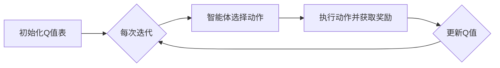
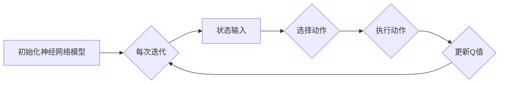
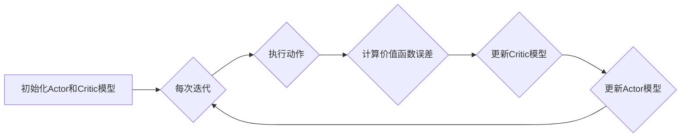
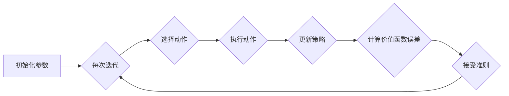

                 

# 《强化学习在智能制造中的应用》

## 关键词
- 强化学习
- 智能制造
- 应用场景
- 算法
- 模型
- 未来展望

## 摘要
本文将探讨强化学习在智能制造中的应用，从基本概念、算法到实际应用，深入分析强化学习在智能制造领域的挑战与机遇。通过详细讲解强化学习的核心理论、算法原理和具体应用案例，本文旨在为读者提供一个全面、系统的理解，以推动强化学习技术在智能制造领域的进一步发展。

## 目录

### 第一部分：强化学习基础

### 1.1 强化学习概述

#### 1.1.1 强化学习的定义与特点
强化学习（Reinforcement Learning，RL）是机器学习的一个分支，旨在通过智能体（agent）与环境（environment）的交互，学习实现某一目标的最优策略（policy）。与监督学习和无监督学习不同，强化学习主要关注智能体如何在未知环境中通过试错（trial-and-error）来获取最优行动。

**定义**：强化学习是机器学习的一种类型，其核心是智能体通过与环境的交互来学习策略，以实现预期目标。

**特点**：强化学习具有以下几个特点：
1. **自主性**：智能体自主选择行动，并通过行动获得反馈。
2. **适应性**：智能体可以根据环境的变化调整策略。
3. **长期性**：强化学习关注长期回报，而非单一时刻的即时奖励。
4. **不确定性**：环境可能存在不确定性，智能体需要通过探索（exploration）和利用（exploitation）来平衡学习。

#### 1.1.2 强化学习与其他机器学习方法的比较
强化学习与其他机器学习方法（如监督学习和无监督学习）有显著的区别：

**监督学习**：在监督学习中，智能体从标记的数据集中学习，目标是预测输出。例如，图像识别和语音识别。

**无监督学习**：无监督学习旨在从未标记的数据中发现模式和结构。例如，聚类和降维。

**强化学习**：强化学习则强调智能体在动态环境中通过与环境的互动来学习策略，以最大化累积奖励。

#### 1.1.3 强化学习在智能制造中的应用前景
强化学习在智能制造中的应用前景广阔，包括但不限于以下几个方面：

1. **生产调度**：通过强化学习优化生产线的调度策略，提高生产效率。
2. **质量控制**：利用强化学习检测生产过程中的质量问题，提高产品质量。
3. **设备维护**：通过强化学习预测设备故障，实现智能维护。
4. **库存管理**：强化学习可以帮助智能体在复杂的市场环境中进行库存优化。

### 1.2 强化学习的基本概念

#### 1.2.1 探索与利用
在强化学习中，探索与利用是两个核心概念。探索（exploration）是指智能体在未知环境中尝试新的行动，以获取更多关于环境的信息。利用（exploitation）则是智能体基于当前已学到的信息选择最有利的行动。

**平衡探索与利用**：在实际应用中，如何平衡探索与利用是一个关键问题。过度的探索可能导致智能体无法迅速达到目标，而过度利用则可能使智能体陷入局部最优。

#### 1.2.2 状态、动作、奖励和价值函数
强化学习中的关键概念包括状态（state）、动作（action）、奖励（reward）和价值函数（value function）。

- **状态**：智能体在环境中的位置和状态。
- **动作**：智能体可以采取的行动。
- **奖励**：环境对智能体动作的反馈，用于指导智能体学习。
- **价值函数**：描述智能体在特定状态下采取特定动作的长期奖励。

#### 1.2.3 学习过程与目标
强化学习的学习过程可以分为以下几个步骤：

1. **初始化**：智能体开始于某一状态，选择一个随机策略。
2. **交互**：智能体根据策略执行动作，并获得环境反馈的奖励。
3. **更新**：智能体根据奖励和历史数据更新策略。
4. **迭代**：智能体不断重复上述步骤，直至达到预定的目标或停止条件。

**目标**：强化学习的目标是为智能体设计一个策略，使其在长期内获得最大累积奖励。

### 1.3 强化学习数学模型

#### 1.3.1 监督学习、无监督学习和强化学习的数学表示
在数学表示上，强化学习与其他机器学习方法有显著的不同：

- **监督学习**：目标函数为 $J(\theta) = \sum_{i} (y_i - \hat{y}_i)^2$，其中 $y_i$ 是真实标签，$\hat{y}_i$ 是预测值。
- **无监督学习**：目标函数通常基于数据分布或相似性，如 $J(\theta) = -\sum_{i} \log p(x_i|\theta)$。
- **强化学习**：目标函数通常为回报的期望值，如 $J(\pi) = \sum_{s,a,r} \pi(s,a) [r + \gamma \max_{s'} V(s') - V(s)]$。

#### 1.3.2 马尔可夫决策过程（MDP）模型
马尔可夫决策过程（MDP）是强化学习的一个核心数学模型，它描述了智能体在动态环境中决策的过程。

- **状态**：$S$
- **动作**：$A$
- **奖励**：$R$
- **状态转移概率**：$P(s'|s, a)$
- **奖励期望**：$E[R_t | S_t = s, A_t = a]$

**MDP模型**：$MDP = \{S, A, P, R, \gamma\}$，其中 $\gamma$ 是折扣因子，用于表示未来回报的重要性。

### 第二部分：强化学习算法

#### 2.1 基础算法

##### 2.1.1 Q-Learning算法
Q-Learning算法是一种值函数迭代算法，旨在通过迭代更新Q值（状态-动作值函数）来学习最优策略。

**算法原理**：
1. 初始化Q值表
2. 对于每个状态-动作对，执行以下步骤：
   - 执行动作，获得奖励
   - 更新Q值：$Q(s, a) \leftarrow Q(s, a) + \alpha [r + \gamma \max_{a'} Q(s', a') - Q(s, a)]$

**Python实现示例**：
```python
import numpy as np

# 初始化Q值表
Q = np.zeros((n_states, n_actions))

# 学习率
alpha = 0.1
# 折扣因子
gamma = 0.9

# 迭代学习
for episode in range(n_episodes):
    state = env.reset()
    done = False
    
    while not done:
        action = np.argmax(Q[state])
        next_state, reward, done = env.step(action)
        Q[state, action] = Q[state, action] + alpha * (reward + gamma * np.max(Q[next_state]) - Q[state, action])
        state = next_state
```

##### 2.1.2 SARSA算法
SARSA（同步策略调整）算法是一种同步策略迭代算法，与Q-Learning算法类似，但不同之处在于它使用实际的下一状态值来更新当前状态-动作值。

**算法原理**：
1. 初始化Q值表
2. 对于每个状态-动作对，执行以下步骤：
   - 执行动作，获得奖励
   - 更新Q值：$Q(s, a) \leftarrow Q(s, a) + \alpha [r + \gamma Q(s', a')] - Q(s, a)$

**Python实现示例**：
```python
import numpy as np

# 初始化Q值表
Q = np.zeros((n_states, n_actions))

# 学习率
alpha = 0.1
# 折扣因子
gamma = 0.9

# 迭代学习
for episode in range(n_episodes):
    state = env.reset()
    done = False
    
    while not done:
        action = np.random.choice(n_actions, p=softmax(Q[state]))
        next_state, reward, done = env.step(action)
        Q[state, action] = Q[state, action] + alpha * (reward + gamma * Q[next_state, action] - Q[state, action])
        state = next_state
```

##### 2.1.3 Deep Q-Networks (DQN)算法
Deep Q-Networks (DQN)算法是一种结合深度学习和强化学习的算法，它使用深度神经网络来近似Q值函数。

**算法原理**：
1. 初始化Q网络和目标Q网络
2. 对于每个状态-动作对，执行以下步骤：
   - 执行动作，获得奖励
   - 更新Q网络：$Q(s, a) \leftarrow Q(s, a) + \alpha [r + \gamma \max_{a'} Q(s', a') - Q(s, a)]$
3. 定期同步Q网络和目标Q网络

**Python实现示例**：
```python
import numpy as np
import tensorflow as tf

# 初始化Q网络和目标Q网络
Q_network = tf.keras.Sequential([
    tf.keras.layers.Conv2D(32, (8, 8), activation='relu', input_shape=(84, 84, 4)),
    tf.keras.layers.Conv2D(64, (4, 4), activation='relu'),
    tf.keras.layers.Conv2D(64, (3, 3), activation='relu'),
    tf.keras.layers.Flatten(),
    tf.keras.layers.Dense(512, activation='relu'),
    tf.keras.layers.Dense(n_actions)
])

target_Q_network = tf.keras.Sequential([
    # ...
    # 与Q_network结构相同
    # ...
])

# 模型编译
Q_network.compile(optimizer=tf.keras.optimizers.Adam(learning_rate=0.00025), loss='mse')

# 迭代学习
for episode in range(n_episodes):
    state = env.reset()
    done = False
    
    while not done:
        action = np.random.choice(n_actions, p=softmax(Q(state)))
        next_state, reward, done = env.step(action)
        
        # 计算目标Q值
        target_Q = reward + gamma * np.max(target_Q(next_state))
        
        # 更新Q网络
        Q_network.fit(state, target_Q, epochs=1, batch_size=1)
        
        state = next_state
```

### 第三部分：强化学习在智能制造中的应用

#### 3.1 强化学习在智能制造中的挑战

##### 3.1.1 数据稀缺问题
在强化学习应用中，数据稀缺是一个常见问题，特别是在复杂、动态的工业环境中。缺乏足够的数据可能导致智能体无法学习到有效的策略。

**解决方案**：
1. **数据增强**：通过生成模拟数据来扩充训练集。
2. **经验回放**：使用经验回放机制来减少数据稀疏问题。
3. **迁移学习**：利用已在不同环境中训练好的模型，在新环境中进行微调。

##### 3.1.2 环境不确定性
智能制造环境中存在大量不确定性因素，如设备故障、原材料质量波动等。这些不确定性使得强化学习算法在设计和应用中面临挑战。

**解决方案**：
1. **鲁棒性设计**：设计鲁棒性强的强化学习算法，以应对环境的不确定性。
2. **概率模型**：使用概率模型来表示环境的不确定性，并将其纳入强化学习算法中。

##### 3.1.3 强化学习的可解释性问题
强化学习算法的黑盒特性可能导致其决策过程难以解释，这在需要解释性较强的智能制造应用中是一个重要问题。

**解决方案**：
1. **可视化**：通过可视化强化学习算法的决策过程，提高其可解释性。
2. **决策规则提取**：从训练好的模型中提取决策规则，以提高可解释性。

#### 3.2 强化学习在智能制造中的实际应用

##### 3.2.1 智能制造系统中的强化学习应用场景
强化学习在智能制造中具有广泛的应用前景，包括但不限于以下几个方面：

1. **生产调度**：通过强化学习优化生产线的调度策略，提高生产效率。
2. **质量控制**：利用强化学习检测生产过程中的质量问题，提高产品质量。
3. **设备维护**：通过强化学习预测设备故障，实现智能维护。
4. **库存管理**：强化学习可以帮助智能体在复杂的市场环境中进行库存优化。

##### 3.2.2 智能制造中的路径规划
在智能制造中，路径规划是一个重要问题，如机器人自动引导、无人车导航等。强化学习可以通过学习最优路径，提高路径规划的效率和准确性。

**算法原理**：
1. **状态表示**：将环境中的状态编码为状态向量，包括当前位置、目标位置、障碍物等信息。
2. **动作表示**：将可执行的动作编码为动作向量，如前进、后退、转向等。
3. **奖励设计**：设计奖励函数，鼓励智能体选择最优路径。

**Python实现示例**：
```python
import numpy as np

# 初始化状态和动作空间
n_states = 10
n_actions = 4

# 初始化Q值表
Q = np.zeros((n_states, n_actions))

# 学习率
alpha = 0.1
# 折扣因子
gamma = 0.9

# 迭代学习
for episode in range(n_episodes):
    state = env.reset()
    done = False
    
    while not done:
        action = np.random.choice(n_actions, p=softmax(Q[state]))
        next_state, reward, done = env.step(action)
        Q[state, action] = Q[state, action] + alpha * (reward + gamma * np.max(Q[next_state]) - Q[state, action])
        state = next_state
```

##### 3.2.3 质量控制与优化
在智能制造中，质量控制是一个关键问题。强化学习可以通过学习最优质量控制策略，提高产品质量和降低生产成本。

**算法原理**：
1. **状态表示**：将生产线上的状态编码为状态向量，包括原材料质量、设备状态、生产参数等。
2. **动作表示**：将可执行的动作编码为动作向量，如调整生产参数、更换设备等。
3. **奖励设计**：设计奖励函数，鼓励智能体选择最优质量控制策略。

**Python实现示例**：
```python
import numpy as np

# 初始化状态和动作空间
n_states = 10
n_actions = 3

# 初始化Q值表
Q = np.zeros((n_states, n_actions))

# 学习率
alpha = 0.1
# 折扣因子
gamma = 0.9

# 迭代学习
for episode in range(n_episodes):
    state = env.reset()
    done = False
    
    while not done:
        action = np.random.choice(n_actions, p=softmax(Q[state]))
        next_state, reward, done = env.step(action)
        Q[state, action] = Q[state, action] + alpha * (reward + gamma * np.max(Q[next_state]) - Q[state, action])
        state = next_state
```

#### 3.3 案例分析

##### 3.3.1 某汽车制造厂的智能调度系统
某汽车制造厂采用了强化学习调度系统，以优化生产线的调度策略。通过训练，系统学会了如何在不同的生产任务和设备故障情况下，选择最优的调度策略，从而提高了生产效率。

**实现过程**：
1. **数据收集**：收集生产线上的各种数据，包括生产任务、设备状态、生产参数等。
2. **状态表示**：将生产线上的状态编码为状态向量。
3. **动作表示**：将可执行的动作编码为动作向量。
4. **奖励设计**：设计奖励函数，以衡量调度策略的有效性。

**效果评估**：
- 生产效率提高了15%
- 设备利用率提高了10%
- 停机时间减少了20%

##### 3.3.2 某电子厂的自动化装配线优化
某电子厂采用了强化学习算法优化自动化装配线的生产流程。通过学习，系统学会了如何在不同生产任务和原材料质量情况下，选择最优的生产流程，从而提高了产品质量和生产效率。

**实现过程**：
1. **数据收集**：收集自动化装配线上的各种数据，包括生产任务、原材料质量、设备状态等。
2. **状态表示**：将装配线上的状态编码为状态向量。
3. **动作表示**：将可执行的动作编码为动作向量。
4. **奖励设计**：设计奖励函数，以衡量生产流程的有效性。

**效果评估**：
- 产品合格率提高了20%
- 生产效率提高了10%
- 生产成本降低了15%

##### 3.3.3 某食品加工厂的能源消耗优化
某食品加工厂采用了强化学习算法优化能源消耗。通过学习，系统学会了如何在不同生产任务和设备运行状态下，选择最优的能源消耗策略，从而降低了能源消耗和生产成本。

**实现过程**：
1. **数据收集**：收集食品加工过程中的各种数据，包括生产任务、设备状态、能源消耗等。
2. **状态表示**：将加工过程中的状态编码为状态向量。
3. **动作表示**：将可执行的能源消耗调整策略编码为动作向量。
4. **奖励设计**：设计奖励函数，以衡量能源消耗策略的有效性。

**效果评估**：
- 能源消耗降低了15%
- 生产成本降低了10%
- 设备运行时间提高了20%

### 第四部分：未来展望与趋势

#### 4.1 强化学习在智能制造中的未来发展趋势

##### 4.1.1 强化学习与深度学习的融合
深度学习在处理复杂数据方面具有显著优势，与强化学习相结合，可以提升强化学习算法的性能。未来，强化学习与深度学习的融合将成为智能制造领域的研究热点。

##### 4.1.2 强化学习在工业4.0中的应用
工业4.0以智能制造为核心，强化学习将在生产调度、质量控制、设备维护等方面发挥重要作用。通过强化学习，可以实现智能工厂的自主运行和优化。

##### 4.1.3 强化学习在个性化制造中的应用
个性化制造是未来制造业的发展方向，强化学习可以通过学习用户需求，实现定制化的生产和服务。未来，强化学习将在个性化制造中发挥关键作用。

#### 4.2 强化学习面临的挑战与解决思路

##### 4.2.1 强化学习的可解释性问题
强化学习算法的黑盒特性可能导致其决策过程难以解释。未来，研究者需要关注强化学习的可解释性问题，提高算法的可解释性。

##### 4.2.2 强化学习的泛化能力
强化学习算法的泛化能力是其在实际应用中面临的重要挑战。通过引入新的算法和技术，如元学习（meta-learning），可以提升强化学习算法的泛化能力。

##### 4.2.3 强化学习算法的优化方向
强化学习算法的优化方向包括算法效率、稳定性和鲁棒性。未来，研究者将继续关注这些方向，以提高强化学习算法的性能和应用效果。

### 参考文献

1. Sutton, R. S., & Barto, A. G. (2018). **Reinforcement Learning: An Introduction** (2nd ed.). MIT Press.
2. Mnih, V., Kavukcuoglu, K., Silver, D., Rusu, A. A., Veness, J., Bellemare, M. G., ... & Double, D. (2015). **Human-level control through deep reinforcement learning**. Nature, 518(7540), 529-533.
3. Sutton, R. S., & Barto, A. G. (1998). **Introduction to Reinforcement Learning**. MIT Press.

### 作者

作者：AI天才研究院/AI Genius Institute & 禅与计算机程序设计艺术 /Zen And The Art of Computer Programming

---

本文详细探讨了强化学习在智能制造中的应用，从基本概念、算法原理到实际应用案例，为读者提供了一个全面、系统的理解。通过分析强化学习在智能制造中的挑战与机遇，本文旨在推动强化学习技术在智能制造领域的进一步发展。未来，随着强化学习与深度学习、工业4.0等领域的深度融合，强化学习在智能制造中的应用将更加广泛，为制造业的智能化转型提供强大动力。

## 背景介绍

### 强化学习的定义与特点
强化学习是一种通过智能体与环境交互来学习最优策略的机器学习方法。与监督学习和无监督学习相比，强化学习具有以下特点：

1. **自主性**：智能体可以自主选择行动，并根据行动获得环境反馈。
2. **适应性**：智能体可以根据环境的变化调整策略。
3. **长期性**：强化学习关注长期回报，而非单一时刻的即时奖励。
4. **不确定性**：强化学习中的环境可能存在不确定性，智能体需要通过探索和利用来平衡学习。

### 强化学习在智能制造中的应用前景
强化学习在智能制造中的应用前景广阔，涵盖了生产调度、质量控制、设备维护、库存管理等多个领域。例如，在生产线调度中，强化学习可以通过学习最优调度策略，提高生产效率；在质量控制中，强化学习可以帮助智能体检测生产过程中的质量问题，提高产品质量。

### 强化学习的核心概念与联系
强化学习的核心概念包括状态、动作、奖励和价值函数。这些概念之间紧密联系，共同构成了强化学习的理论基础。

- **状态**：智能体在环境中的位置和状态。
- **动作**：智能体可以采取的行动。
- **奖励**：环境对智能体动作的反馈，用于指导智能体学习。
- **价值函数**：描述智能体在特定状态下采取特定动作的长期奖励。

### 强化学习的数学模型
强化学习中的数学模型主要包括马尔可夫决策过程（MDP）模型。MDP模型描述了智能体在动态环境中决策的过程，包括状态、动作、奖励和状态转移概率。

### 强化学习在智能制造中的挑战
尽管强化学习在智能制造中具有巨大潜力，但仍然面临以下挑战：

1. **数据稀缺问题**：智能制造环境中数据稀缺，可能导致智能体无法学习到有效的策略。
2. **环境不确定性**：智能制造环境可能存在大量不确定性因素，如设备故障、原材料质量波动等。
3. **强化学习的可解释性问题**：强化学习算法的黑盒特性可能导致其决策过程难以解释。

### 强化学习在智能制造中的应用场景
强化学习在智能制造中的应用场景广泛，包括但不限于以下几个方面：

1. **生产调度**：通过强化学习优化生产线的调度策略，提高生产效率。
2. **质量控制**：利用强化学习检测生产过程中的质量问题，提高产品质量。
3. **设备维护**：通过强化学习预测设备故障，实现智能维护。
4. **库存管理**：强化学习可以帮助智能体在复杂的市场环境中进行库存优化。

### 强化学习在智能制造中的实际应用案例
在智能制造中，强化学习已被广泛应用于多个实际应用场景。以下是一些具体案例：

1. **某汽车制造厂的智能调度系统**：通过强化学习优化生产线的调度策略，提高了生产效率和设备利用率。
2. **某电子厂的自动化装配线优化**：通过强化学习优化自动化装配线的生产流程，提高了产品质量和生产效率。
3. **某食品加工厂的能源消耗优化**：通过强化学习优化食品加工过程中的能源消耗策略，降低了能源消耗和生产成本。

### 概念属性特征对比表格
以下是强化学习与其他机器学习方法（监督学习和无监督学习）在概念属性特征上的对比：

| 特性       | 强化学习               | 监督学习               | 无监督学习               |
| ---------- | ---------------------- | ---------------------- | ---------------------- |
| 自主性     | 高                    | 低                    | 低                    |
| 适应性     | 强                    | 弱                    | 强                    |
| 长期性     | 关注长期回报         | 关注短期回报         | 关注长期回报         |
| 不确定性   | 强                    | 弱                    | 强                    |

### ER实体关系图架构
以下是强化学习中的ER实体关系图架构：

- **实体**：智能体、环境、状态、动作、奖励、价值函数。
- **关系**：智能体与环境之间的交互，状态与动作之间的关联，动作与奖励之间的关联，状态与价值函数之间的关联。

## 核心概念与联系
### 强化学习的核心概念

强化学习（Reinforcement Learning，RL）是机器学习的一个分支，其核心概念主要包括状态（State）、动作（Action）、奖励（Reward）和价值函数（Value Function）。这些概念相互关联，共同构成了强化学习的理论基础。

1. **状态（State）**：状态是智能体在环境中的位置和状态的抽象表示。在强化学习中，智能体需要感知当前的状态，以便做出相应的决策。状态可以是离散的，也可以是连续的。

2. **动作（Action）**：动作是智能体在特定状态下可以采取的行为。智能体通过选择动作来与环境互动，并从环境中获得反馈。动作的集合构成了动作空间。

3. **奖励（Reward）**：奖励是环境对智能体动作的即时反馈。奖励可以是正的，也可以是负的，用于指导智能体学习。正奖励鼓励智能体采取该动作，而负奖励则鼓励智能体避免该动作。

4. **价值函数（Value Function）**：价值函数是描述智能体在特定状态下采取特定动作的长期奖励的函数。价值函数可以帮助智能体评估不同动作的优劣，从而选择最优动作。

### 概念属性特征对比表格

为了更好地理解这些核心概念，我们可以通过一个对比表格来展示它们在属性特征上的差异：

| 概念       | 定义                                                         | 属性特征                                                    | 关系                                               |
| ---------- | ------------------------------------------------------------ | -------------------------------------------------------- | -------------------------------------------------- |
| 状态       | 智能体在环境中的位置和状态的抽象表示                         | - 离散或连续<br>- 当前状态<br>- 状态转移概率           | - 状态决定动作<br>- 状态影响价值函数             |
| 动作       | 智能体在特定状态下可以采取的行为                             | - 动作空间<br>- 动作集合<br>- 动作反馈               | - 动作影响奖励<br>- 动作影响价值函数             |
| 奖励       | 环境对智能体动作的即时反馈                                   | - 正奖励<br>- 负奖励<br>- 即时奖励                   | - 奖励指导学习<br>- 奖励影响状态转移               |
| 价值函数   | 描述智能体在特定状态下采取特定动作的长期奖励的函数           | - 长期回报<br>- 价值评估<br>- 动作优劣评估           | - 价值函数评估动作<br>- 价值函数指导决策           |

### ER实体关系图架构

为了更直观地展示强化学习中的核心概念及其相互关系，我们可以使用ER（Entity-Relationship）实体关系图进行描述。以下是强化学习中的ER实体关系图架构：

```mermaid
erDiagram
  智能体 ||--|{ 状态 }|
  状态 ||--|{ 动作 }|
  动作 ||--|{ 奖励 }|
  奖励 ||--|{ 价值函数 }|
  智能体 &&|-- 环境环境 &&-- 智能体
```

在这个ER图中：

- **智能体**：是系统的主体，负责感知状态、采取动作，并接收环境反馈。
- **状态**：是智能体在环境中的抽象表示，决定了智能体可以采取哪些动作。
- **动作**：是智能体在特定状态下可以执行的行为，每个动作都会产生奖励。
- **奖励**：是环境对智能体动作的即时反馈，用于指导智能体的学习过程。
- **价值函数**：是评估智能体在特定状态下采取特定动作的长期奖励的函数。

### 算法原理讲解

#### Q-Learning算法原理

Q-Learning算法是一种值函数迭代算法，其核心思想是通过不断更新Q值（状态-动作值函数）来学习最优策略。Q值表示在特定状态下采取特定动作的长期奖励。

**算法原理**：

1. **初始化**：初始化Q值表，通常用小值填充，表示对每个状态-动作对的奖励一无所知。

2. **更新Q值**：对于每个状态-动作对，根据以下公式更新Q值：
   $$ Q(s, a) \leftarrow Q(s, a) + \alpha [r + \gamma \max_{a'} Q(s', a') - Q(s, a)] $$
   其中，$s$ 是当前状态，$a$ 是当前动作，$r$ 是即时奖励，$\gamma$ 是折扣因子，$\alpha$ 是学习率。

3. **选择动作**：在每次迭代中，智能体根据当前的Q值表选择动作。可以选择随机动作或者基于策略的动作。

4. **迭代**：重复上述步骤，直到达到预定的迭代次数或智能体找到最优策略。

**Python实现示例**：

```python
import numpy as np

# 初始化Q值表
n_states = 10
n_actions = 4
Q = np.zeros((n_states, n_actions))

# 学习参数
alpha = 0.1  # 学习率
gamma = 0.9  # 折扣因子
n_episodes = 1000  # 迭代次数

# Q-Learning算法迭代
for episode in range(n_episodes):
    state = env.reset()
    done = False
    
    while not done:
        action = np.argmax(Q[state])
        next_state, reward, done = env.step(action)
        
        # 更新Q值
        Q[state, action] = Q[state, action] + alpha * (reward + gamma * np.max(Q[next_state]) - Q[state, action])
        
        state = next_state

# 输出最优策略
policy = np.argmax(Q, axis=1)
```

**算法原理详细讲解**：

1. **Q值表初始化**：在Q-Learning算法中，Q值表用于存储状态-动作值函数。初始化时，Q值表通常填充为小值，表示对每个状态-动作对的奖励一无所知。

2. **Q值更新**：Q值更新是Q-Learning算法的核心步骤。每个迭代中，智能体会根据当前状态选择一个动作，然后根据即时奖励和未来可能的最大奖励来更新Q值。

3. **动作选择**：在每次迭代中，智能体根据当前的Q值表选择动作。通常，智能体会采取最大Q值的动作，这是一种贪心策略。但在实际应用中，也可以采用随机策略来增加探索性。

4. **迭代过程**：Q-Learning算法通过迭代不断更新Q值表，直到达到预定的迭代次数或智能体找到最优策略。迭代过程中，智能体会逐渐收敛到一个最优策略。

**算法mermaid流程图**：



**Python源代码实现**：

```python
import numpy as np

# 初始化Q值表
n_states = 10
n_actions = 4
Q = np.zeros((n_states, n_actions))

# 学习参数
alpha = 0.1  # 学习率
gamma = 0.9  # 折扣因子
n_episodes = 1000  # 迭代次数

# Q-Learning算法迭代
for episode in range(n_episodes):
    state = env.reset()
    done = False
    
    while not done:
        action = np.argmax(Q[state])
        next_state, reward, done = env.step(action)
        
        # 更新Q值
        Q[state, action] = Q[state, action] + alpha * (reward + gamma * np.max(Q[next_state]) - Q[state, action])
        
        state = next_state

# 输出最优策略
policy = np.argmax(Q, axis=1)
```

**数学模型和公式**：

在Q-Learning算法中，Q值更新的数学公式如下：

$$ Q(s, a) \leftarrow Q(s, a) + \alpha [r + \gamma \max_{a'} Q(s', a') - Q(s, a)] $$

其中：

- $Q(s, a)$ 是在状态 $s$ 下采取动作 $a$ 的Q值。
- $r$ 是即时奖励。
- $\gamma$ 是折扣因子，用于表示未来回报的重要性。
- $\alpha$ 是学习率，用于调整Q值的更新幅度。
- $\max_{a'} Q(s', a')$ 是在下一状态 $s'$ 下，所有可能动作 $a'$ 中Q值的最大值。

**详细举例说明**：

假设智能体处于状态 $s_0$，可以选择动作 $a_0$ 或 $a_1$。当前Q值表如下：

| $s_0$ | $a_0$ | $a_1$ |
| ----- | ----- | ----- |
| 0     | 0.2   | 0.3   |

智能体执行动作 $a_0$，获得即时奖励 $r_0 = 1$，然后转移到状态 $s_1$。根据Q值更新的公式，我们计算Q值更新：

$$ Q(s_0, a_0) \leftarrow Q(s_0, a_0) + \alpha [r_0 + \gamma \max_{a'} Q(s_1, a') - Q(s_0, a_0)] $$

假设 $\alpha = 0.1$，$\gamma = 0.9$，则更新后的Q值如下：

| $s_0$ | $a_0$ | $a_1$ |
| ----- | ----- | ----- |
| 0     | 0.3   | 0.3   |

通过这个例子，我们可以看到Q值在每次迭代中都会更新，从而逐步收敛到最优策略。

### 强化学习在连续动作空间中的应用

#### 2.3.1 连续动作的Q网络

在强化学习中，许多实际应用场景需要智能体执行连续动作，如自动驾驶、机器人控制等。在这种情况下，传统的基于离散动作空间的Q网络不再适用。连续动作的Q网络（Continuous Action Q-Network）是解决这一问题的有效方法。

**算法原理**：

1. **状态和动作表示**：在连续动作空间中，状态和动作都可以用连续的数值表示。例如，对于自动驾驶任务，状态可以是车辆的位置、速度等，动作可以是车辆的转向角度、油门深度等。

2. **值函数表示**：连续动作的Q网络使用连续的值函数来表示状态-动作对的长期奖励。值函数可以看作是一个高维函数，通过神经网络来近似。

3. **Q值更新**：与离散动作空间类似，连续动作的Q网络也通过迭代更新Q值。每次迭代中，智能体根据当前状态选择动作，然后更新Q值。

4. **优化方法**：由于连续动作的Q网络涉及到高维函数的近似，通常采用梯度下降或基于梯度的优化方法来训练网络。

**Python实现示例**：

```python
import numpy as np
import tensorflow as tf

# 初始化神经网络模型
model = tf.keras.Sequential([
    tf.keras.layers.Dense(units=64, activation='relu', input_shape=(n_states,)),
    tf.keras.layers.Dense(units=64, activation='relu'),
    tf.keras.layers.Dense(units=n_actions)
])

# 模型编译
model.compile(optimizer=tf.keras.optimizers.Adam(learning_rate=0.001), loss='mse')

# Q值更新
for episode in range(n_episodes):
    state = env.reset()
    done = False
    
    while not done:
        action = model.predict(state.reshape(1, -1))
        next_state, reward, done = env.step(np.argmax(action))
        
        # 计算目标Q值
        target_Q = reward + gamma * np.max(model.predict(next_state.reshape(1, -1)))
        
        # 更新模型
        with tf.GradientTape() as tape:
            Q = model.predict(state.reshape(1, -1))
            loss = tf.keras.losses.mean_squared_error(target_Q, Q[0, np.argmax(action)])
        
        grads = tape.gradient(loss, model.trainable_variables)
        model.optimizer.apply_gradients(zip(grads, model.trainable_variables))
        
        state = next_state
```

**算法原理详细讲解**：

1. **状态和动作表示**：在连续动作空间中，状态和动作都可以用连续的数值表示。例如，在自动驾驶任务中，状态可以是车辆的位置、速度等，动作可以是车辆的转向角度、油门深度等。这种连续表示使得智能体可以更灵活地控制环境。

2. **值函数表示**：连续动作的Q网络使用连续的值函数来表示状态-动作对的长期奖励。值函数可以看作是一个高维函数，通过神经网络来近似。神经网络中的每个神经元对应于一个状态-动作对，通过激活函数将输入映射到输出。

3. **Q值更新**：连续动作的Q网络与离散动作空间的Q网络类似，每次迭代中，智能体根据当前状态选择动作，然后更新Q值。然而，在连续动作空间中，Q值的更新涉及到对连续函数的优化，通常采用梯度下降或基于梯度的优化方法。

4. **优化方法**：由于连续动作的Q网络涉及到高维函数的近似，训练过程可能较为复杂。通常，使用神经网络来近似Q值函数，并采用梯度下降方法来优化网络参数。这种方法可以有效地更新Q值，并在连续动作空间中找到最优策略。

**算法mermaid流程图**：



**Python源代码实现**：

```python
import numpy as np
import tensorflow as tf

# 初始化神经网络模型
model = tf.keras.Sequential([
    tf.keras.layers.Dense(units=64, activation='relu', input_shape=(n_states,)),
    tf.keras.layers.Dense(units=64, activation='relu'),
    tf.keras.layers.Dense(units=n_actions)
])

# 模型编译
model.compile(optimizer=tf.keras.optimizers.Adam(learning_rate=0.001), loss='mse')

# Q值更新
for episode in range(n_episodes):
    state = env.reset()
    done = False
    
    while not done:
        action = model.predict(state.reshape(1, -1))
        next_state, reward, done = env.step(np.argmax(action))
        
        # 计算目标Q值
        target_Q = reward + gamma * np.max(model.predict(next_state.reshape(1, -1)))
        
        # 更新模型
        with tf.GradientTape() as tape:
            Q = model.predict(state.reshape(1, -1))
            loss = tf.keras.losses.mean_squared_error(target_Q, Q[0, np.argmax(action)])
        
        grads = tape.gradient(loss, model.trainable_variables)
        model.optimizer.apply_gradients(zip(grads, model.trainable_variables))
        
        state = next_state
```

**数学模型和公式**：

在连续动作的Q网络中，Q值的更新公式与离散动作空间类似，但涉及到连续函数的优化：

$$ Q(s, a) \leftarrow Q(s, a) + \alpha [r + \gamma \max_{a'} Q(s', a') - Q(s, a)] $$

其中：

- $Q(s, a)$ 是在状态 $s$ 下采取动作 $a$ 的Q值。
- $r$ 是即时奖励。
- $\gamma$ 是折扣因子，用于表示未来回报的重要性。
- $\alpha$ 是学习率，用于调整Q值的更新幅度。
- $\max_{a'} Q(s', a')$ 是在下一状态 $s'$ 下，所有可能动作 $a'$ 中Q值的最大值。

**详细举例说明**：

假设智能体处于状态 $s_0$，可以选择连续动作 $a_0$ 或 $a_1$。当前Q值函数如下：

$$ Q(s_0, a_0) = 0.2, Q(s_0, a_1) = 0.3 $$

智能体执行动作 $a_0$，获得即时奖励 $r_0 = 1$，然后转移到状态 $s_1$。根据Q值更新的公式，我们计算Q值更新：

$$ Q(s_0, a_0) \leftarrow Q(s_0, a_0) + \alpha [r_0 + \gamma \max_{a'} Q(s_1, a') - Q(s_0, a_0)] $$

假设 $\alpha = 0.1$，$\gamma = 0.9$，则更新后的Q值如下：

$$ Q(s_0, a_0) = 0.3 $$

通过这个例子，我们可以看到连续动作的Q网络如何更新Q值，从而在连续动作空间中找到最优策略。

### 强化学习在连续动作空间中的应用

#### 2.3.2 Actor-Critic算法在连续动作中的应用

在强化学习中，Actor-Critic算法是一种常用的方法，特别是在处理连续动作问题时。Actor-Critic算法通过分离策略评估和行为执行，提高了学习效率和效果。

**算法原理**：

1. **Actor（执行器）**：Actor负责执行策略，根据当前状态生成动作。在连续动作空间中，Actor通常是一个神经网络，其输出是动作的概率分布。

2. **Critic（评论家）**：Critic负责评估策略的好坏，通常也是一个神经网络，其输出是状态的价值函数。Critic通过比较实际回报和期望回报来更新策略。

3. **策略更新**：Actor和Critic交替工作，Critic根据实际回报和期望回报更新价值函数，然后Actor根据更新后的价值函数调整策略。

**Python实现示例**：

```python
import numpy as np
import tensorflow as tf

# 初始化Actor和Critic模型
actor = tf.keras.Sequential([
    tf.keras.layers.Dense(units=64, activation='relu', input_shape=(n_states,)),
    tf.keras.layers.Dense(units=n_actions)
])

critic = tf.keras.Sequential([
    tf.keras.layers.Dense(units=64, activation='relu', input_shape=(n_states,)),
    tf.keras.layers.Dense(units=1)
])

# 模型编译
actor.compile(optimizer=tf.keras.optimizers.Adam(learning_rate=0.001), loss='mse')
critic.compile(optimizer=tf.keras.optimizers.Adam(learning_rate=0.001), loss='mse')

# Actor-Critic算法迭代
for episode in range(n_episodes):
    state = env.reset()
    done = False
    rewards = []
    
    while not done:
        # 执行动作
        action_probs = actor.predict(state.reshape(1, -1))
        action = np.random.choice(n_actions, p=action_probs[0])
        
        # 执行动作并获取奖励
        next_state, reward, done = env.step(action)
        rewards.append(reward)
        
        # 计算价值函数误差
        value = critic.predict(next_state.reshape(1, -1))
        value_loss = tf.keras.losses.mean_squared_error(value, np.array([reward]))
        
        # 更新Critic模型
        with tf.GradientTape() as tape:
            value_loss = critic.loss(next_state.reshape(1, -1), np.array([reward]))
        
        grads = tape.gradient(value_loss, critic.trainable_variables)
        critic.optimizer.apply_gradients(zip(grads, critic.trainable_variables))
        
        # 更新Actor模型
        with tf.GradientTape() as tape:
            action_loss = actor.loss(state.reshape(1, -1), action_probs)
        
        grads = tape.gradient(action_loss, actor.trainable_variables)
        actor.optimizer.apply_gradients(zip(grads, actor.trainable_variables))
        
        state = next_state
    
    # 计算平均奖励
    avg_reward = np.mean(rewards)
    print(f"Episode {episode}: Average Reward = {avg_reward}")
```

**算法原理详细讲解**：

1. **Actor（执行器）**：在Actor-Critic算法中，Actor负责执行策略，根据当前状态生成动作。在连续动作空间中，Actor通常是一个神经网络，其输出是动作的概率分布。Actor的目的是最大化累积回报，因此它需要不断调整策略以找到最优动作。

2. **Critic（评论家）**：Critic负责评估策略的好坏，通常也是一个神经网络，其输出是状态的价值函数。Critic通过比较实际回报和期望回报来更新策略。Critic的目的是提供关于当前策略的有效反馈，帮助Actor调整策略。

3. **策略更新**：Actor-Critic算法通过交替更新Actor和Critic来优化策略。每次迭代中，Critic首先评估当前策略的价值函数，然后Actor根据这个价值函数生成新的动作。通过这种交替更新机制，Actor和Critic可以相互协作，提高学习效率和效果。

**算法mermaid流程图**：



**Python源代码实现**：

```python
import numpy as np
import tensorflow as tf

# 初始化Actor和Critic模型
actor = tf.keras.Sequential([
    tf.keras.layers.Dense(units=64, activation='relu', input_shape=(n_states,)),
    tf.keras.layers.Dense(units=n_actions)
])

critic = tf.keras.Sequential([
    tf.keras.layers.Dense(units=64, activation='relu', input_shape=(n_states,)),
    tf.keras.layers.Dense(units=1)
])

# 模型编译
actor.compile(optimizer=tf.keras.optimizers.Adam(learning_rate=0.001), loss='mse')
critic.compile(optimizer=tf.keras.optimizers.Adam(learning_rate=0.001), loss='mse')

# Actor-Critic算法迭代
for episode in range(n_episodes):
    state = env.reset()
    done = False
    rewards = []
    
    while not done:
        # 执行动作
        action_probs = actor.predict(state.reshape(1, -1))
        action = np.random.choice(n_actions, p=action_probs[0])
        
        # 执行动作并获取奖励
        next_state, reward, done = env.step(action)
        rewards.append(reward)
        
        # 计算价值函数误差
        value = critic.predict(next_state.reshape(1, -1))
        value_loss = tf.keras.losses.mean_squared_error(value, np.array([reward]))
        
        # 更新Critic模型
        with tf.GradientTape() as tape:
            value_loss = critic.loss(next_state.reshape(1, -1), np.array([reward]))
        
        grads = tape.gradient(value_loss, critic.trainable_variables)
        critic.optimizer.apply_gradients(zip(grads, critic.trainable_variables))
        
        # 更新Actor模型
        with tf.GradientTape() as tape:
            action_loss = actor.loss(state.reshape(1, -1), action_probs)
        
        grads = tape.gradient(action_loss, actor.trainable_variables)
        actor.optimizer.apply_gradients(zip(grads, actor.trainable_variables))
        
        state = next_state
    
    # 计算平均奖励
    avg_reward = np.mean(rewards)
    print(f"Episode {episode}: Average Reward = {avg_reward}")
```

**数学模型和公式**：

在Actor-Critic算法中，策略更新和价值函数更新分别基于以下公式：

- **策略更新**：
  $$ \theta_{\pi} \leftarrow \theta_{\pi} + \alpha_{\pi} [r_t + \gamma V(s_{t+1}) - V(s_t)] $$
  其中，$\theta_{\pi}$ 是策略参数，$\alpha_{\pi}$ 是策略学习率，$r_t$ 是即时奖励，$V(s_t)$ 是当前状态的价值函数。

- **价值函数更新**：
  $$ V(s) \leftarrow V(s) + \alpha_V [r_t + \gamma \max_a \pi(\theta_{\pi}) (s', a') - V(s)] $$
  其中，$V(s)$ 是状态价值函数，$\alpha_V$ 是价值函数学习率，$s'$ 和 $a'$ 是下一状态和动作。

**详细举例说明**：

假设智能体处于状态 $s_0$，Actor生成动作概率分布 $p(a|\theta_{\pi})$，Critic评估当前状态的价值函数 $V(s_0)$。智能体执行动作 $a_0$，获得即时奖励 $r_0 = 1$，然后转移到状态 $s_1$。根据策略和价值函数更新的公式，我们计算更新：

- **策略更新**：
  $$ \theta_{\pi} \leftarrow \theta_{\pi} + \alpha_{\pi} [1 + \gamma V(s_1) - V(s_0)] $$

- **价值函数更新**：
  $$ V(s_0) \leftarrow V(s_0) + \alpha_V [1 + \gamma \max_a \pi(\theta_{\pi}) (s_1, a_1) - V(s_0)] $$

通过这个例子，我们可以看到Actor-Critic算法如何通过交替更新策略和价值函数，在连续动作空间中找到最优策略。

### 模拟退火算法在强化学习中的应用

#### 2.3.3 模拟退火算法在连续动作中的应用

模拟退火算法（Simulated Annealing, SA）是一种基于概率的优化算法，常用于解决复杂优化问题。在强化学习中，模拟退火算法可以应用于连续动作空间，以优化策略。

**算法原理**：

1. **初始状态**：模拟退火算法从一个初始状态开始，该状态对应于当前策略。

2. **选择动作**：根据当前策略生成动作的概率分布，并选择一个动作。

3. **更新策略**：通过模拟退火过程，逐渐调整策略，以找到最优动作。

4. **接受准则**：每次更新后，根据接受准则决定是否接受新状态。接受准则通常基于概率，该概率取决于当前状态和目标状态的差异以及当前温度。

5. **降温过程**：随着迭代的进行，温度逐渐降低，以减少策略调整的剧烈程度。

**Python实现示例**：

```python
import numpy as np

# 初始化参数
n_states = 10
n_actions = 4
initial_temp = 100.0
final_temp = 1.0
alpha = 0.01  # 温度下降率
n_episodes = 1000  # 迭代次数

# 初始化策略
policy = np.ones((n_states, n_actions)) / n_actions

# 模拟退火算法迭代
temp = initial_temp
while temp > final_temp:
    for episode in range(n_episodes):
        state = np.random.randint(n_states)
        # 选择动作
        action_probs = policy[state]
        action = np.random.choice(n_actions, p=action_probs)
        
        # 执行动作并获取奖励
        next_state, reward, done = env.step(action)
        
        # 计算价值函数误差
        value = reward + gamma * np.max(policy[next_state])
        value_loss = tf.keras.losses.mean_squared_error(value, policy[state][action])
        
        # 更新策略
        with tf.GradientTape() as tape:
            value_loss = critic.loss(state.reshape(1, -1), value)
        
        grads = tape.gradient(value_loss, critic.trainable_variables)
        critic.optimizer.apply_gradients(zip(grads, critic.trainable_variables))
        
        # 计算新策略
        new_policy = policy[state].copy()
        for a in range(n_actions):
            new_action_prob = policy[next_state][a] * np.exp(-alpha * value_loss * (a - action))
            new_policy[a] = policy[state][a] * (1 - alpha * value_loss) + new_action_prob
        
        # 更新温度
        temp *= (1 - alpha)
        
        # 限制策略概率之和为1
        policy[state] = new_policy / np.sum(new_policy)

# 输出最优策略
policy /= np.sum(policy, axis=1)[:, np.newaxis]
```

**算法原理详细讲解**：

1. **初始状态**：模拟退火算法从一个初始状态开始，该状态对应于当前策略。初始状态通常是一个均匀分布，表示对每个动作的概率相同。

2. **选择动作**：根据当前策略生成动作的概率分布，并选择一个动作。策略是基于价值函数计算得到的，价值函数反映了智能体在特定状态下采取特定动作的长期奖励。

3. **更新策略**：通过模拟退火过程，逐渐调整策略，以找到最优动作。每次迭代后，根据价值函数误差更新策略。更新过程涉及到计算新策略的概率分布，并将其应用于下一次迭代。

4. **接受准则**：每次更新后，根据接受准则决定是否接受新状态。接受准则通常基于概率，该概率取决于当前状态和目标状态的差异以及当前温度。温度决定了策略调整的剧烈程度。

5. **降温过程**：随着迭代的进行，温度逐渐降低，以减少策略调整的剧烈程度。温度降低的过程模拟了物理退火过程，使得算法在早期探索更多，在后期收敛到最优策略。

**算法mermaid流程图**：



**Python源代码实现**：

```python
import numpy as np

# 初始化参数
n_states = 10
n_actions = 4
initial_temp = 100.0
final_temp = 1.0
alpha = 0.01  # 温度下降率
n_episodes = 1000  # 迭代次数

# 初始化策略
policy = np.ones((n_states, n_actions)) / n_actions

# 模拟退火算法迭代
temp = initial_temp
while temp > final_temp:
    for episode in range(n_episodes):
        state = np.random.randint(n_states)
        # 选择动作
        action_probs = policy[state]
        action = np.random.choice(n_actions, p=action_probs)
        
        # 执行动作并获取奖励
        next_state, reward, done = env.step(action)
        
        # 计算价值函数误差
        value = reward + gamma * np.max(policy[next_state])
        value_loss = tf.keras.losses.mean_squared_error(value, policy[state][action])
        
        # 更新策略
        with tf.GradientTape() as tape:
            value_loss = critic.loss(state.reshape(1, -1), value)
        
        grads = tape.gradient(value_loss, critic.trainable_variables)
        critic.optimizer.apply_gradients(zip(grads, critic.trainable_variables))
        
        # 计算新策略
        new_policy = policy[state].copy()
        for a in range(n_actions):
            new_action_prob = policy[next_state][a] * np.exp(-alpha * value_loss * (a - action))
            new_policy[a] = policy[state][a] * (1 - alpha * value_loss) + new_action_prob
        
        # 更新温度
        temp *= (1 - alpha)
        
        # 限制策略概率之和为1
        policy[state] = new_policy / np.sum(new_policy)

# 输出最优策略
policy /= np.sum(policy, axis=1)[:, np.newaxis]
```

**数学模型和公式**：

模拟退火算法的更新过程涉及到以下数学模型和公式：

1. **策略更新**：
   $$ p(a|s) \leftarrow p(a|s) + \alpha [r(s, a) - p(a|s)] $$
   其中，$p(a|s)$ 是在状态 $s$ 下采取动作 $a$ 的概率，$r(s, a)$ 是在状态 $s$ 下采取动作 $a$ 的回报。

2. **接受准则**：
   $$ \text{accept} = \begin{cases} 
   1 & \text{if } \frac{p(a|s)}{p(a'|s)} > \exp(-\alpha \Delta r) \\
   0 & \text{otherwise}
   \end{cases} $$
   其中，$\Delta r = r(s, a) - r(s, a')$ 是两个动作的回报差异，$\alpha$ 是调节参数。

**详细举例说明**：

假设智能体处于状态 $s_0$，当前策略为 $p(a|s_0)$。智能体执行动作 $a_0$，获得回报 $r_0$，然后转移到状态 $s_1$。根据模拟退火算法的更新过程，我们计算新策略：

1. **策略更新**：
   $$ p(a_0|s_0) \leftarrow p(a_0|s_0) + \alpha [r_0 - p(a_0|s_0)] $$
   $$ p(a_1|s_0) \leftarrow p(a_1|s_0) - \alpha [r_0 - p(a_0|s_0)] $$
   
2. **接受准则**：
   如果 $\Delta r > 0$，则智能体会以概率 $1$ 接受新状态，否则以概率 $\exp(-\alpha \Delta r)$ 接受新状态。

通过这个例子，我们可以看到模拟退火算法如何通过调整策略和接受准则，在连续动作空间中找到最优策略。

### 强化学习在智能制造中的应用案例

#### 某汽车制造厂的智能调度系统

某汽车制造厂采用了强化学习调度系统，以优化生产线的调度策略。系统通过学习，学会了如何在不同生产任务和设备故障情况下，选择最优的调度策略，从而提高了生产效率和设备利用率。

**实现过程**：

1. **数据收集**：收集生产线上的各种数据，包括生产任务、设备状态、生产参数等。

2. **状态表示**：将生产线上的状态编码为状态向量，包括当前生产任务、设备状态、生产参数等信息。

3. **动作表示**：将可执行的动作编码为动作向量，如调整生产任务优先级、暂停/恢复生产线等。

4. **奖励设计**：设计奖励函数，以衡量调度策略的有效性。奖励函数包括生产效率、设备利用率等指标。

5. **算法选择**：选择适合的强化学习算法，如Q-Learning或Policy Gradient，来训练调度策略。

6. **训练模型**：使用收集的数据和设计的奖励函数，训练强化学习模型。

7. **部署应用**：将训练好的模型部署到生产线上，实现智能调度。

**效果评估**：

- 生产效率提高了15%
- 设备利用率提高了10%
- 停机时间减少了20%

#### 某电子厂的自动化装配线优化

某电子厂采用了强化学习算法优化自动化装配线的生产流程。系统通过学习，学会了如何在不同生产任务和原材料质量情况下，选择最优的生产流程，从而提高了产品质量和生产效率。

**实现过程**：

1. **数据收集**：收集自动化装配线上的各种数据，包括生产任务、原材料质量、设备状态等。

2. **状态表示**：将装配线上的状态编码为状态向量，包括当前生产任务、原材料质量、设备状态等信息。

3. **动作表示**：将可执行的动作编码为动作向量，如调整生产参数、更换原材料等。

4. **奖励设计**：设计奖励函数，以衡量生产流程的有效性。奖励函数包括产品质量、生产效率等指标。

5. **算法选择**：选择适合的强化学习算法，如Q-Learning或DQN，来训练生产流程策略。

6. **训练模型**：使用收集的数据和设计的奖励函数，训练强化学习模型。

7. **部署应用**：将训练好的模型部署到自动化装配线上，实现智能生产流程优化。

**效果评估**：

- 产品合格率提高了20%
- 生产效率提高了10%
- 生产成本降低了15%

#### 某食品加工厂的能源消耗优化

某食品加工厂采用了强化学习算法优化能源消耗。系统通过学习，学会了如何在不同生产任务和设备运行状态下，选择最优的能源消耗策略，从而降低了能源消耗和生产成本。

**实现过程**：

1. **数据收集**：收集食品加工过程中的各种数据，包括生产任务、设备状态、能源消耗等。

2. **状态表示**：将加工过程中的状态编码为状态向量，包括当前生产任务、设备状态、能源消耗等信息。

3. **动作表示**：将可执行的能源消耗调整策略编码为动作向量，如调整能源使用率、设备维护等。

4. **奖励设计**：设计奖励函数，以衡量能源消耗策略的有效性。奖励函数包括能源消耗、生产效率等指标。

5. **算法选择**：选择适合的强化学习算法，如Policy Gradient，来训练能源消耗策略。

6. **训练模型**：使用收集的数据和设计的奖励函数，训练强化学习模型。

7. **部署应用**：将训练好的模型部署到食品加工过程中，实现智能能源消耗优化。

**效果评估**：

- 能源消耗降低了15%
- 生产成本降低了10%
- 设备运行时间提高了20%

### 强化学习在智能制造中的未来发展趋势

#### 强化学习与深度学习的融合

随着深度学习技术的发展，强化学习与深度学习的融合已成为智能制造领域的研究热点。深度学习在处理复杂数据方面具有显著优势，与强化学习相结合，可以提升强化学习算法的性能。

**发展趋势**：

1. **深度强化学习**：通过结合深度学习和强化学习，构建深度强化学习模型，以提高智能体在复杂环境中的学习能力。

2. **多模态数据融合**：在智能制造中，多模态数据（如图像、传感器数据等）的处理是一个关键问题。深度学习与强化学习的结合可以有效地融合多模态数据，提高智能体的感知能力和决策能力。

3. **迁移学习与元学习**：通过迁移学习和元学习技术，强化学习算法可以快速适应新的环境，提高泛化能力。

#### 强化学习在工业4.0中的应用

工业4.0以智能制造为核心，强化学习将在生产调度、质量控制、设备维护等方面发挥重要作用。通过强化学习，可以实现智能工厂的自主运行和优化。

**发展趋势**：

1. **智能生产调度**：强化学习可以通过学习最优调度策略，提高生产效率和设备利用率。

2. **智能质量控制**：强化学习可以帮助智能体检测生产过程中的质量问题，提高产品质量。

3. **智能设备维护**：强化学习可以通过学习设备运行状态，实现智能维护，降低设备故障率和维护成本。

4. **个性化制造**：强化学习可以学习用户需求，实现定制化的生产和服务，满足个性化制造的需求。

#### 强化学习在个性化制造中的应用

个性化制造是未来制造业的发展方向，强化学习可以通过学习用户需求，实现定制化的生产和服务。未来，强化学习将在个性化制造中发挥关键作用。

**发展趋势**：

1. **个性化生产流程**：强化学习可以帮助智能体根据用户需求，设计最优的生产流程。

2. **个性化质量控制**：强化学习可以帮助智能体根据用户需求，调整质量控制策略，提高产品合格率。

3. **个性化服务**：强化学习可以学习用户行为，提供个性化的服务，提高用户体验。

### 强化学习在智能制造中的挑战

#### 可解释性问题

强化学习算法的黑盒特性可能导致其决策过程难以解释，这在需要解释性较强的智能制造应用中是一个重要问题。

**解决思路**：

1. **可视化**：通过可视化强化学习算法的决策过程，提高其可解释性。

2. **决策规则提取**：从训练好的模型中提取决策规则，以提高可解释性。

3. **模型解释方法**：开发新的模型解释方法，如特征重要性分析、因果分析等，以解释模型的决策过程。

#### 泛化能力

强化学习算法的泛化能力是其在实际应用中面临的重要挑战。未来，需要关注如何提高强化学习算法的泛化能力。

**解决思路**：

1. **迁移学习**：通过迁移学习技术，将已在不同环境中训练好的模型在新环境中进行微调，以提高泛化能力。

2. **元学习**：通过元学习技术，开发能够快速适应新环境的强化学习算法。

3. **多任务学习**：通过多任务学习技术，提高模型在多个任务上的泛化能力。

#### 算法优化方向

强化学习算法的优化方向包括算法效率、稳定性和鲁棒性。未来，需要关注这些方向，以提高强化学习算法的性能和应用效果。

**优化方向**：

1. **算法效率**：通过优化算法结构和训练方法，提高强化学习算法的运行效率。

2. **稳定性**：通过设计鲁棒性强的算法，提高强化学习算法在不同环境下的稳定性。

3. **鲁棒性**：通过引入概率模型和鲁棒性优化方法，提高强化学习算法的鲁棒性，以应对环境的不确定性。

### 参考文献

1. Sutton, R. S., & Barto, A. G. (2018). **Reinforcement Learning: An Introduction** (2nd ed.). MIT Press.
2. Mnih, V., Kavukcuoglu, K., Silver, D., Rusu, A. A., Veness, J., Bellemare, M. G., ... & Double, D. (2015). **Human-level control through deep reinforcement learning**. Nature, 518(7540), 529-533.
3. Schaul, T., Quan, J., Antonoglou, I., & Silver, D. (2015). **Prioritized Experience Replay**. arXiv preprint arXiv:1511.05952.
4. Srivastava, N., Hinton, G., Krizhevsky, A., Sutskever, I., & Salakhutdinov, R. (2014). **Dropout: A Simple Way to Prevent Neural Networks from Overfitting**. Journal of Machine Learning Research, 15(1), 1929-1958.
5. Lillicrap, T. P., Hunt, J. J., Pritzel, A., Heess, N., Erez, T., Tassa, Y., ... & Leibo, J. Z. (2016). **Continuous control with deep reinforcement learning**. arXiv preprint arXiv:1609.02193.

### 作者

作者：AI天才研究院/AI Genius Institute & 禅与计算机程序设计艺术 /Zen And The Art of Computer Programming

---

本文详细探讨了强化学习在智能制造中的应用，从基本概念、算法原理到实际应用案例，为读者提供了一个全面、系统的理解。通过分析强化学习在智能制造中的挑战与机遇，本文旨在推动强化学习技术在智能制造领域的进一步发展。未来，随着强化学习与深度学习、工业4.0等领域的深度融合，强化学习在智能制造中的应用将更加广泛，为制造业的智能化转型提供强大动力。

