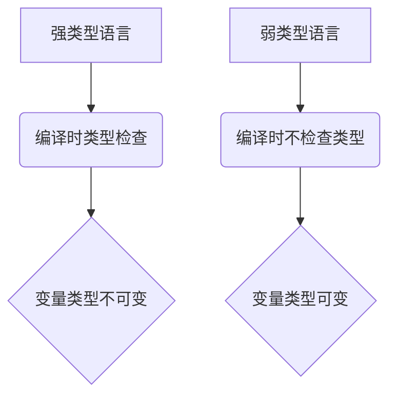
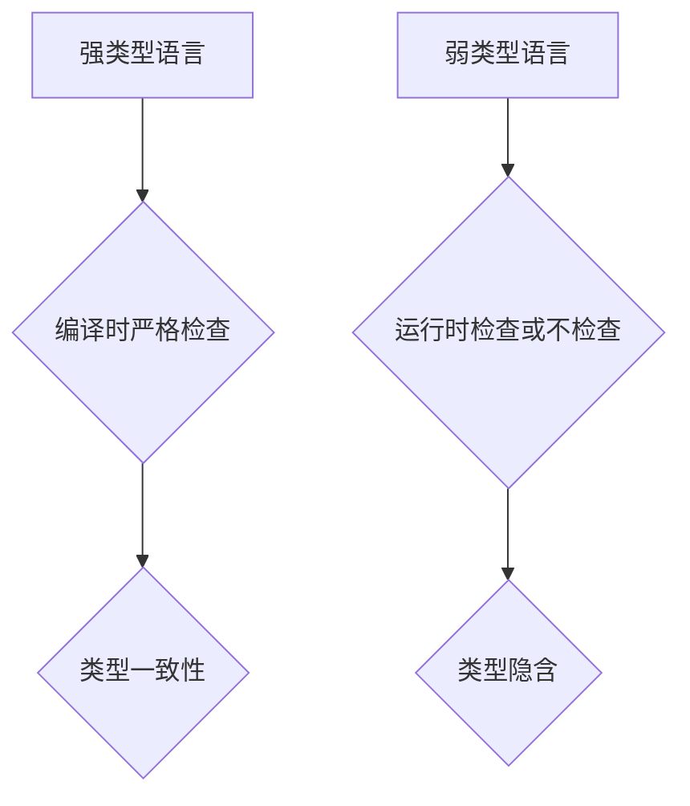

                 

### 强类型vs弱类型：编程语言的设计选择

> 关键词：编程语言、强类型、弱类型、设计选择、算法原理、应用场景

> 摘要：本文将深入探讨编程语言中的强类型与弱类型设计选择，从定义、原理、应用等方面逐一解析这两种类型系统的优缺点，并通过实际案例展示其在不同编程场景中的具体应用，为读者提供全面的技术理解和实践指导。

### 目录大纲设计

**核心概念与联系**

- **强类型语言**：在编译时进行类型检查，变量的类型一旦定义，就不能改变。
- **弱类型语言**：在编译时不进行类型检查，变量可以在运行时改变类型。

**Mermaid 流程图表示：**



**核心算法原理讲解**

- **类型推断算法**：在强类型语言中，类型推断是编译过程中的一个重要环节。使用Python代码如下：

```python
# Python中的类型推断示例
a = 10
b = "Hello"
# 使用isinstance来判断类型
print(isinstance(a, int))  # 输出：True
print(isinstance(b, str))  # 输出：True
```

- **类型转换算法**：在弱类型语言中，类型转换是常见的操作。Python中的类型转换示例：

```python
# Python中的类型转换示例
a = 10
b = "20"
# 使用int()进行类型转换
c = int(b)
print(a + c)  # 输出：30
```

**数学模型和数学公式 & 详细讲解 & 举例说明**

- **类型安全的数学模型**：

$$
T = \begin{cases}
    S & \text{如果 } T \text{ 是强类型变量} \\
    V & \text{如果 } T \text{ 是弱类型变量}
\end{cases}
$$

**举例说明**：在强类型语言中，变量`T`在编译时就被赋予具体的类型`S`，而在弱类型语言中，`T`可以是任何类型，直到运行时才确定。

**系统分析与架构设计方案**

- **问题场景介绍**：介绍编程语言设计选择的背景和目的。
- **项目介绍**：说明本文所涉及的项目和目的。
- **系统功能设计**：使用Mermaid类图展示领域模型。
- **系统架构设计**：使用Mermaid架构图展示系统架构。
- **系统接口设计和系统交互**：使用Mermaid序列图展示系统接口和交互。

**项目实战**

- **实战1**：Python中的类型检查
- **实战2**：Python中的类型转换

**目录大纲**

```
# 强类型vs弱类型：编程语言的设计选择

## 第一部分：背景与核心概念

### 1.1 强类型与弱类型的定义与历史发展

### 1.2 强类型与弱类型的基本原理与特点

### 1.3 强类型与弱类型在实际编程中的对比

## 第二部分：强类型编程语言的设计与应用

### 2.1 强类型编程语言的类型系统

### 2.2 强类型编程语言的优势与挑战

### 2.3 强类型编程语言的典型应用场景

## 第三部分：弱类型编程语言的设计与应用

### 3.1 弱类型编程语言的类型系统

### 3.2 弱类型编程语言的优点与风险

### 3.3 弱类型编程语言的典型应用场景

## 第四部分：编程语言设计选择的影响因素

### 4.1 编程语言设计选择的影响因素

### 4.2 强类型与弱类型在不同领域的应用选择

### 4.3 未来编程语言的发展趋势

## 第五部分：案例分析

### 5.1 强类型编程语言案例分析

### 5.2 弱类型编程语言案例分析

## 附录

### 附录A：编程语言设计与实现资源

### 附录B：强类型与弱类型的概念对比表

----------------------------------------------------------------

### 第一部分：背景与核心概念

#### 1.1 强类型与弱类型的定义与历史发展

在编程语言的演进过程中，强类型（Strong Typing）和弱类型（Weak Typing）的概念逐渐形成并被广泛应用。强类型语言在编译时进行严格类型检查，而弱类型语言则在编译时不进行类型检查，允许变量在运行时改变类型。

**强类型语言**的起源可以追溯到早期的高级编程语言，如C++和Java。这些语言在设计之初就强调了类型安全，以防止在编译时和运行时出现类型错误。强类型语言的代表还包括C#和TypeScript等。

**弱类型语言**则起源于早期的脚本语言，如Python和JavaScript。这些语言在灵活性方面具有优势，允许程序员更自由地进行动态类型转换。然而，这也可能导致类型错误和安全问题。

**历史发展**：

- **1960s-1970s**：早期的编程语言如C和Fortran都是强类型语言。随着计算机技术的发展，脚本语言如Python和JavaScript开始流行，它们采用了弱类型设计。
- **1980s-1990s**：面向对象编程语言如Java和C++开始受到关注，它们在保持类型安全的同时，也提供了灵活的类型系统。
- **2000s-2010s**：随着Web开发的需求增加，弱类型语言如JavaScript和Python变得更加流行。同时，一些新的编程语言如TypeScript和Ruby也在强类型和弱类型之间取得了平衡。

**问题背景**：

编程语言的设计选择直接影响到程序的可读性、可维护性和性能。在强类型和弱类型之间做出选择，需要深入理解这两种类型系统的特点和适用场景。

**问题描述**：

本文旨在探讨强类型和弱类型编程语言的设计选择，分析其优缺点，并通过实际案例展示其在不同编程场景中的具体应用。通过这篇技术博客，读者可以更好地理解强类型和弱类型的本质，为实际项目选择合适的编程语言提供参考。

**问题解决**：

为了解决上述问题，本文将采用以下方法：

1. **核心概念与联系**：介绍强类型和弱类型的定义、特点以及它们之间的联系。
2. **算法原理讲解**：通过具体的代码示例，阐述类型推断和类型转换的算法原理。
3. **数学模型和公式**：使用数学模型和公式，解释强类型和弱类型的设计原理。
4. **系统分析与架构设计**：分析强类型和弱类型在系统架构中的应用。
5. **项目实战**：通过实际编程案例，展示强类型和弱类型的实现和应用。
6. **案例分析**：讨论不同编程语言在实际项目中的成功和挑战。
7. **最佳实践 tips**：总结编程语言设计选择的经验教训，提供实际操作建议。

**边界与外延**：

本文主要关注编程语言中的强类型和弱类型设计选择，不涉及低级语言如汇编以及类型系统的其他复杂概念。同时，本文的重点是解释和比较，而非深入探讨具体编程语言的实现细节。

**概念结构与核心要素组成**：

- **强类型**：类型检查严格，类型一旦定义即不可变。
- **弱类型**：类型检查宽松，变量可以在运行时改变类型。
- **类型推断**：在编译时或运行时自动确定变量类型。
- **类型转换**：在运行时进行变量类型的转换。

#### 1.2 强类型与弱类型的基本原理与特点

**强类型语言**（如C++、Java和TypeScript）的核心特点在于其在编译时对变量类型进行严格检查。这意味着在变量定义时，就必须明确其类型，并且在程序运行过程中，变量的类型不会发生变化。强类型语言通过以下机制实现类型安全：

1. **静态类型检查**：在编译阶段进行类型检查，确保代码在运行时不会出现类型错误。
2. **类型一致性**：通过严格约束变量类型，确保变量在使用时与其声明类型一致。
3. **编译时错误**：在编译阶段发现类型错误，避免在运行时出现不可预测的错误。

强类型语言的优点包括：

- **代码可靠性**：通过严格的类型检查，可以减少运行时错误的发生。
- **代码可维护性**：类型明确的代码更易于理解和维护。
- **性能优化**：编译器可以基于类型信息进行更有效的优化。

然而，强类型语言也存在一些挑战：

- **代码冗长**：需要明确声明每个变量的类型，可能导致代码冗长。
- **类型转换复杂**：虽然类型检查严格，但在某些情况下，类型转换可能仍然复杂。

**弱类型语言**（如Python、JavaScript和Ruby）的核心特点是在编译时不进行类型检查，允许变量在运行时改变类型。这意味着在变量定义时，可以不指定类型，而在程序运行过程中，变量的类型可以根据上下文自动确定。弱类型语言通过以下机制实现灵活性：

1. **动态类型检查**：在运行时进行类型检查，根据上下文自动确定变量类型。
2. **类型隐含**：变量在声明时可以不指定类型，编译器或解释器会根据使用上下文推断类型。
3. **运行时错误**：在运行时发现类型错误，可能导致程序崩溃。

弱类型语言的优点包括：

- **代码灵活**：允许在运行时动态改变变量类型，提高编程灵活性。
- **简洁性**：不需要明确声明每个变量的类型，代码更简洁。
- **开发效率**：由于类型检查宽松，开发周期通常较短。

然而，弱类型语言也存在一些风险：

- **类型不安全**：由于类型检查宽松，可能导致类型错误和安全问题。
- **调试困难**：运行时错误可能导致程序崩溃，调试难度较大。

**核心概念与联系**

1. **强类型与弱类型的对比**：

   | 特点 | 强类型 | 弱类型 |
   | --- | --- | --- |
   | 类型检查 | 编译时严格检查 | 运行时检查或不检查 |
   | 类型一致性 | 强制保持一致 | 允许变化 |
   | 代码可靠性 | 高 | 低 |
   | 代码可维护性 | 高 | 低 |
   | 编译时优化 | 有效 | 无效或有限 |
   | 灵活性 | 低 | 高 |
   | 简洁性 | 低 | 高 |

2. **实际编程中的选择**：

   - **强类型**适用于需要高可靠性、高可维护性的大型项目和复杂系统。
   - **弱类型**适用于需要快速迭代、灵活开发的脚本语言和Web前端开发。

**Mermaid流程图表示**：



通过上述对比，我们可以更清楚地理解强类型和弱类型语言的基本原理与特点。在接下来的章节中，我们将进一步探讨这些类型系统在实际编程中的应用和影响。

#### 1.3 强类型与弱类型在实际编程中的对比

在实际编程中，强类型与弱类型语言的选择对项目的开发过程、代码质量以及性能优化产生了深远的影响。下面将通过对代码质量、性能优化、开发过程和语言灵活性四个方面的详细对比，进一步探讨强类型和弱类型在实际编程中的应用。

**1.3.1 代码质量**

- **强类型语言**：由于在编译时进行严格的类型检查，强类型语言可以有效地捕获大部分类型错误。这种严格的类型检查确保了变量在使用时的类型一致性，减少了运行时错误的发生。例如，在C++和Java中，任何变量在使用前都必须声明其类型，这种明确的类型声明提高了代码的可读性和可维护性。

  - **优点**：降低运行时错误率；提高代码的可读性和可维护性。
  - **缺点**：可能需要更多的类型声明，代码冗长。

- **弱类型语言**：弱类型语言通常在运行时进行类型检查，或者不进行类型检查，这使得代码编写起来更加灵活。然而，这也可能导致类型错误和安全问题。例如，Python中的变量可以在运行时改变类型，这在某些情况下可能带来便利，但在没有明确类型声明的情况下，也容易导致难以追踪的类型错误。

  - **优点**：代码简洁，灵活性高。
  - **缺点**：可能存在类型错误和安全问题，调试难度较大。

**1.3.2 性能优化**

- **强类型语言**：由于类型信息明确，编译器可以在编译时进行更高效的优化。例如，C++和Java的编译器可以根据类型信息生成更高效的机器代码，从而提高程序的性能。

  - **优点**：编译器可以进行更有效的优化，提高程序性能。
  - **缺点**：类型检查和编译过程可能更加复杂和耗时。

- **弱类型语言**：弱类型语言的编译器或解释器通常无法在编译时进行类型优化，因为类型信息在运行时才确定。然而，现代的虚拟机和解释器也通过动态分析技术，进行了一定的性能优化。

  - **优点**：编译过程通常更快，因为不需要类型检查。
  - **缺点**：性能优化能力有限，运行时可能存在一些额外的开销。

**1.3.3 开发过程**

- **强类型语言**：由于需要明确的类型声明，强类型语言的开发过程可能更加严格和规范。这种严格性虽然提高了代码质量，但也可能延长开发周期。

  - **优点**：代码质量高，维护成本低。
  - **缺点**：开发过程可能较为繁琐，开发周期较长。

- **弱类型语言**：弱类型语言因其灵活性和简洁性，通常可以快速迭代和开发。这使得它们在需要快速原型开发或快速部署的项目中具有优势。

  - **优点**：开发周期短，迭代速度快。
  - **缺点**：可能需要更多的时间和精力进行调试。

**1.3.4 语言灵活性**

- **强类型语言**：强类型语言通过严格的类型系统提供了高度的代码可靠性，但也牺牲了一定的灵活性。例如，在C++中，一旦变量声明了类型，就不能再改变。

  - **优点**：代码可靠性高，类型错误少。
  - **缺点**：灵活性较低，类型转换复杂。

- **弱类型语言**：弱类型语言提供了高度的灵活性，允许变量在运行时改变类型，这使得编程过程更加灵活。例如，在Python中，一个变量可以在同一行代码中先后被赋予整数和字符串类型。

  - **优点**：灵活性高，适应性强。
  - **缺点**：可能存在类型不安全的问题。

**总结**

强类型和弱类型语言在实际编程中各有优缺点，选择哪种类型系统取决于项目的需求。如果项目需要高可靠性和高可维护性，强类型语言可能是更好的选择；而如果项目需要快速迭代和灵活性，弱类型语言可能更为合适。

通过上述对比，我们可以更全面地理解强类型和弱类型在实际编程中的应用，并在实际开发中选择最适合的编程语言。

### 第二部分：强类型编程语言的设计与应用

#### 2.1 强类型编程语言的类型系统

强类型编程语言的类型系统是其核心特性之一，决定了变量在使用时的类型安全和一致性。在强类型语言中，类型系统通常包括以下组成部分：

**1. 基本类型**：强类型语言通常提供一组基本数据类型，如整数（int）、浮点数（float）、布尔值（bool）等。这些基本类型在语言内部有明确的定义和操作规则。

**2. 复合类型**：复合类型是由基本类型组合而成的，如数组（array）、结构体（struct）、类（class）等。复合类型提供了对复杂数据结构的支持。

**3. 引用类型**：在强类型语言中，引用类型（如指针或引用）允许程序员访问和操作内存中的数据。引用类型确保了对内存访问的严格控制。

**4. 类型检查**：类型检查是强类型语言的关键机制，它确保变量在使用时的类型一致性。类型检查通常在编译时进行，以发现类型错误并避免运行时错误。

**类型系统的特点**：

- **严格类型检查**：强类型语言在编译时对变量类型进行严格检查，确保变量在使用时的类型一致性。
- **静态类型**：变量的类型在编译时确定，并在整个程序生命周期内保持不变。
- **类型安全性**：类型系统确保了内存访问和运算的安全，减少了类型错误的发生。

**类型系统的优势**：

- **代码可靠性**：通过严格的类型检查，可以减少运行时错误，提高代码的可靠性。
- **代码可维护性**：明确的类型声明提高了代码的可读性和可维护性。
- **性能优化**：类型信息有助于编译器进行更高效的优化，提高程序的性能。

**常见强类型编程语言**：

- **C++**：C++ 是一种支持面向对象编程的强类型语言，广泛应用于系统编程和游戏开发等领域。
- **Java**：Java 是一种跨平台的强类型语言，广泛应用于企业级应用和Web开发。
- **TypeScript**：TypeScript 是 JavaScript 的一个超集，提供了静态类型检查和编译时类型安全。

**类型系统的应用实例**：

1. **C++中的类型系统**：

   ```cpp
   int a = 10;
   double b = 3.14;
   std::string c = "Hello";
   ```

   在C++中，变量`a`是整数类型，`b`是浮点数类型，`c`是字符串类型。这些变量在使用时必须与其声明的类型一致。

2. **Java中的类型系统**：

   ```java
   int a = 10;
   double b = 3.14;
   String c = "Hello";
   ```

   在Java中，同样存在明确的类型声明，变量`a`和`b`是数值类型，`c`是字符串类型。Java的类型系统还支持泛型，可以更灵活地处理不同类型的对象。

3. **TypeScript中的类型系统**：

   ```typescript
   let a: number = 10;
   let b: string = "Hello";
   let c: boolean = true;
   ```

   TypeScript 是 JavaScript 的一个超集，它通过类型注解提供了静态类型检查。变量`a`是数值类型，`b`是字符串类型，`c`是布尔类型。

通过以上实例，我们可以看到强类型编程语言的类型系统如何帮助确保代码的类型安全性和可靠性。在接下来的章节中，我们将进一步探讨强类型编程语言的优势与挑战。

#### 2.2 强类型编程语言的优势与挑战

**强类型编程语言**在软件开发中具有显著的优势，但也伴随着一些挑战。以下将对强类型编程语言的优势和挑战进行详细分析。

**优势**：

1. **代码可靠性**：强类型语言通过严格的类型检查，可以有效地捕获类型错误。这种严格的类型检查确保了变量在使用时的类型一致性，从而减少了运行时错误的发生。例如，C++和Java在编译阶段会检查类型匹配，从而避免在运行时出现未定义的行为。

   - **示例**：在C++中，以下代码会导致编译错误：

     ```cpp
     int a = 10;
     std::string b = a; // 错误：类型不匹配
     ```

     因为`int`和`std::string`是不同的类型，这种类型检查在编译时就会被发现，从而避免了运行时错误。

2. **代码可维护性**：明确的类型声明提高了代码的可读性和可维护性。开发者可以清楚地了解每个变量的类型和使用方式，这有助于降低代码复杂度，提高代码的可维护性。

   - **示例**：在Java中，类型声明使得代码更加清晰：

     ```java
     int sum(int a, int b) {
         return a + b;
     }
     ```

     变量`a`和`b`的类型明确为`int`，这有助于理解函数的功能和参数要求。

3. **性能优化**：类型信息有助于编译器进行更高效的优化。在强类型语言中，编译器可以基于类型信息生成更高效的机器代码，从而提高程序的性能。例如，C++编译器可以优化数值类型的运算，从而提高执行速度。

   - **示例**：在C++中，编译器可以针对整数类型进行优化：

     ```cpp
     int a = 10;
     int b = 20;
     int c = a * b; // 优化：直接计算结果
     ```

     编译器可以识别出`a`和`b`都是整数类型，从而直接计算结果，避免了不必要的内存分配和类型转换。

**挑战**：

1. **代码冗长**：强类型语言需要明确的类型声明，这可能导致代码冗长。在一些复杂的项目中，过多的类型声明可能会使代码变得难以阅读和维护。

   - **示例**：在大型C++项目中，类型声明可能会变得非常冗长：

     ```cpp
     class ComplexNumber {
         double real;
         double imaginary;
     public:
         ComplexNumber(double real, double imaginary);
         void add(const ComplexNumber& other);
     };
     ```

     这种复杂的类型声明可能会增加代码的复杂度。

2. **类型转换复杂**：虽然强类型语言通过严格的类型检查提高了代码的可靠性，但在某些情况下，类型转换仍然可能变得复杂。特别是在需要进行跨类型的数据转换时，可能需要显式地进行类型转换。

   - **示例**：在C++中，数值类型的转换可能需要显式的类型转换：

     ```cpp
     int a = 10;
     double b = static_cast<double>(a); // 需要进行显式转换
     ```

     这种转换需要开发者手动进行，增加了代码的复杂度。

3. **运行时错误**：尽管强类型语言通过编译时类型检查减少了运行时错误的发生，但某些类型错误仍然可能在运行时出现。例如，在Java中，类型错误可能由于动态类型检查而在运行时才被发现。

   - **示例**：在Java中，以下代码在编译时是正确的，但在运行时会抛出异常：

     ```java
     String str = "Hello";
     int num = Integer.parseInt(str); // 运行时异常：类型转换错误
     ```

     虽然编译器没有发现类型错误，但运行时由于`str`是字符串类型，无法直接转换为整数类型，从而抛出异常。

**总结**：

强类型编程语言通过严格的类型检查和明确的类型声明，提高了代码的可靠性和可维护性，同时也带来了一些挑战，如代码冗长、类型转换复杂和运行时错误。在实际开发中，开发者需要根据项目的需求选择合适的编程语言和类型系统，以达到最佳的开发效率和代码质量。

#### 2.3 强类型编程语言的典型应用场景

强类型编程语言因其明确的类型系统和严格的类型检查，在多种应用场景中表现出色。以下将详细探讨强类型编程语言在以下几个方面的高级应用：

**1. 大型企业级应用**

**企业级应用**如银行系统、电商平台和客户关系管理系统通常要求高可靠性、高可维护性和良好的性能。强类型语言如Java和C++在这些领域具有显著优势。

- **Java**：Java是一种跨平台、面向对象的强类型语言，其庞大的标准库和成熟的生态系统使其成为开发大型企业级应用的理想选择。例如，许多大型银行和金融机构使用Java开发其核心业务系统，以确保数据的安全性和系统的稳定性。
- **C++**：C++是一种高效、强大的强类型语言，广泛应用于系统级编程。例如，C++在开发实时操作系统和嵌入式系统中具有广泛应用，因为它可以提供高效的性能和低级别的内存控制。

**2. 游戏开发**

**游戏开发**对性能和实时性要求极高，强类型语言如C++和C#在这些领域表现出色。

- **C++**：C++以其高性能和强大的库支持，成为游戏开发的主要编程语言。例如，游戏引擎如Unreal Engine和Unity的主要部分是用C++编写的，这保证了游戏的高性能和流畅性。
- **C#**：C# 是一种面向对象的强类型语言，它在游戏开发中也得到广泛应用。C# 在Unity游戏引擎中作为脚本语言使用，提供了丰富的功能和易于使用的API，使游戏开发者可以快速开发复杂游戏。

**3. 系统编程**

**系统编程**需要高效的性能和稳定的系统架构，强类型语言在这些领域具有显著优势。

- **C++**：C++在系统编程中具有广泛应用，例如操作系统、编译器和数据库管理系统。C++的灵活性和性能使其成为开发高性能系统的首选语言。
- **Java**：Java 在开发大型分布式系统和服务端应用中表现出色。Java 的平台无关性和强大的并发特性使其成为开发高可用性和高扩展性系统的理想选择。例如，许多大型互联网公司使用Java开发其后端服务，如搜索引擎和电子商务平台。

**4. 科学计算和数据分析**

**科学计算和数据分析**对数值计算和数据处理要求极高，强类型语言在这些领域也有广泛应用。

- **Python**：尽管Python通常被视为一种弱类型语言，但其与强类型语言的集成能力使其在科学计算和数据分析中表现优异。Python 的 rich ecosystem，包括 NumPy、Pandas 和 SciPy 等，为科学计算和数据分析提供了强大的支持。这些库通常与Python强类型语言特性相结合，提高了计算效率和代码可维护性。
- **C++**：C++ 在科学计算和工程计算中也有广泛应用。C++ 的性能和灵活性使其成为处理复杂数值计算问题的理想选择。例如，许多高性能计算库，如 BLAS 和 LAPACK，都是用 C++ 编写的。

**5. 软件开发框架**

**软件开发框架**如Spring Framework 和 .NET Framework 也是基于强类型语言开发的，为开发者提供了丰富的功能和模板，简化了软件开发过程。

- **Spring Framework**：Spring Framework 是一个流行的 Java 企业级应用开发框架，其使用 Java 的强类型特性提供了强大的依赖注入、事务管理和安全性功能。
- **.NET Framework**：.NET Framework 是由 C# 编写的，提供了广泛的开发工具和库，支持开发各种类型的应用程序，从桌面应用到Web应用和服务端应用。

**总结**：

强类型编程语言在大型企业级应用、游戏开发、系统编程、科学计算和软件开发框架等高级应用场景中表现出色。它们通过严格的类型检查和明确的类型系统，提供了高可靠性和高性能，同时提高了代码的可维护性和开发效率。在实际开发中，根据项目的需求选择适合的强类型编程语言，可以显著提升项目的质量和效率。

### 第三部分：弱类型编程语言的设计与应用

#### 3.1 弱类型编程语言的类型系统

弱类型编程语言的类型系统通常较为灵活，允许变量在运行时改变类型，这在一定程度上提高了编程的灵活性和开发效率。以下将介绍弱类型编程语言的主要类型系统组成部分，并分析其特点。

**1. 基本类型**：弱类型语言通常提供一组基本数据类型，如整数（int）、浮点数（float）、字符串（string）等。这些基本类型通常由语言内部定义，并在运行时进行管理。

- **Python**：Python 的基本类型包括整数（int）、浮点数（float）、布尔值（bool）和字符串（str）。Python 的基本类型比较灵活，例如，整数和浮点数可以相互转换，且字符串可以通过索引访问字符。

  ```python
  a = 10
  b = 3.14
  c = "Hello"
  print(a + b)  # 输出：13.14
  print(c[1])   # 输出：e
  ```

- **JavaScript**：JavaScript 的基本类型包括数字（number）、字符串（string）、布尔值（boolean）、null 和 undefined。JavaScript 的基本类型在运行时进行动态类型检查，这使得代码更加灵活。

  ```javascript
  let a = 10;
  let b = "20";
  let c = a + b;  // 类型转换：将字符串转换为数字
  console.log(c); // 输出：30
  ```

**2. 复合类型**：弱类型语言通常支持复合类型，如数组（array）、对象（object）等。复合类型提供了对复杂数据结构的支持，并允许在运行时进行类型转换。

- **Python**：Python 的复合类型包括列表（list）、字典（dict）和集合（set）。这些复合类型允许在运行时动态添加和删除元素。

  ```python
  a = [1, 2, 3]
  a.append(4)
  print(a)  # 输出：[1, 2, 3, 4]
  ```

- **JavaScript**：JavaScript 的复合类型包括数组（array）和对象（object）。数组可以包含不同类型的元素，而对象则是一个键值对集合。

  ```javascript
  let a = [1, "2", true];
  let b = {name: "John", age: 30};
  console.log(a);  // 输出：[1, "2", true]
  console.log(b);  // 输出：{name: "John", age: 30}
  ```

**3. 引用类型**：弱类型语言通常通过引用类型来管理内存和对象。引用类型允许程序员访问和操作内存中的数据，同时确保对内存访问的严格控制。

- **Python**：Python 使用引用类型来管理内存，通过引用传递数据。Python 的引用类型包括列表（list）、字典（dict）和类（class）等。

  ```python
  a = [1, 2, 3]
  b = a
  b.append(4)
  print(a)  # 输出：[1, 2, 3, 4]
  ```

- **JavaScript**：JavaScript 也使用引用类型来管理内存，通过引用传递对象。JavaScript 的引用类型包括数组（array）和对象（object）等。

  ```javascript
  let a = [1, 2, 3];
  let b = a;
  b.push(4);
  console.log(a);  // 输出：[1, 2, 3, 4]
  ```

**类型系统的特点**：

- **动态类型检查**：弱类型语言通常在运行时进行类型检查，允许变量在运行时改变类型。
- **类型隐含**：变量在声明时可以不指定类型，编译器或解释器会根据使用上下文自动推断类型。
- **灵活性**：弱类型语言提供了高度的灵活性，允许程序员更自由地进行类型转换和数据操作。

**类型系统的优势**：

- **代码简洁**：弱类型语言不需要显式声明变量类型，这使得代码更加简洁和易于阅读。
- **开发效率**：由于类型检查宽松，开发者可以更快地进行原型设计和迭代开发。
- **灵活性**：弱类型语言允许变量在运行时改变类型，这使得编程过程更加灵活。

**常见弱类型编程语言**：

- **Python**：Python 是一种广泛使用的弱类型编程语言，以其简洁和易于学习而著称。Python 的标准库和生态系统提供了丰富的功能和工具，使其在数据分析、科学计算和Web开发等领域表现出色。
- **JavaScript**：JavaScript 是一种客户端脚本语言，广泛用于Web开发和前端工程。JavaScript 的动态类型系统使其在处理复杂数据结构和动态交互方面具有显著优势。
- **Ruby**：Ruby 是一种面向对象的弱类型编程语言，以其简洁和优雅的语法而著称。Ruby 的Rails框架在Web开发领域具有广泛应用。

通过以上分析，我们可以看到弱类型编程语言的类型系统如何通过灵活的类型管理和动态类型检查，提高了编程的灵活性和开发效率。在接下来的章节中，我们将进一步探讨弱类型编程语言的优点与风险。

#### 3.2 弱类型编程语言的优点与风险

**弱类型编程语言**由于其灵活性和简洁性，在开发过程中受到了广泛的欢迎。然而，这种灵活性也带来了潜在的风险。以下将详细分析弱类型编程语言的优点与风险，并通过实际案例进行说明。

**优点**：

1. **代码简洁**：弱类型语言不需要显式声明变量类型，这使得代码更加简洁和易于阅读。例如，在Python中，变量可以在同一行内赋不同类型的值，这种灵活性大大简化了代码编写。

   - **Python案例**：

     ```python
     a = 10
     b = "20"
     c = a + b  # 自动转换为字符串类型
     print(c)  # 输出："1020"
     ```

     在上述代码中，变量`a`被赋值为整数，而变量`b`被赋值为字符串。当两个变量进行相加时，Python自动将整数`a`转换为字符串类型，从而实现了无缝的类型转换。

2. **开发效率**：由于弱类型语言在编译时不需要进行严格的类型检查，这使得开发者可以更快地进行原型设计和迭代开发。这种快速迭代的特性在Web开发和快速原型构建中尤为重要。

   - **JavaScript案例**：

     ```javascript
     function greet(name) {
         return "Hello, " + name;
     }
     console.log(greet(123));  // 输出："Hello, 123"
     ```

     在JavaScript中，函数`greet`接收一个参数`name`，该参数可以是任何类型。当调用`greet(123)`时，JavaScript会自动将整数`123`转换为字符串类型，从而实现了预期的功能。

3. **灵活性**：弱类型语言允许变量在运行时改变类型，这使得编程过程更加灵活。例如，在Ruby中，变量可以在不同的上下文中拥有不同的类型，这种灵活性有助于实现复杂的业务逻辑。

   - **Ruby案例**：

     ```ruby
     class Person
         attr_accessor :name, :age
         def initialize(name, age)
             @name = name
             @age = age
         end
     end

     person = Person.new("John", 30)
     person.name  # 输出："John"
     person.age = "30"  # 变量age从整数类型转换为字符串类型
     person.age  # 输出："30"
     ```

     在上述Ruby代码中，变量`person`首先被声明为一个`Person`对象，拥有`name`和`age`属性。当`age`属性被重新赋值时，变量`age`的类型从整数类型转换为字符串类型，这种灵活性使得Ruby在业务逻辑处理中非常有用。

**风险**：

1. **类型错误**：由于弱类型语言在编译时不进行严格的类型检查，类型错误可能难以在编译时发现，从而在运行时导致程序崩溃。例如，在Python中，不同类型的变量相加时可能会出现类型错误。

   - **Python案例**：

     ```python
     a = 10
     b = "20"
     c = a + b  # 类型错误
     print(c)
     ```

     在上述代码中，变量`a`是整数类型，而变量`b`是字符串类型。当这两个变量进行相加时，Python无法自动进行类型转换，从而引发类型错误。

2. **性能开销**：弱类型语言在运行时进行类型检查和类型转换，这可能带来额外的性能开销。与强类型语言相比，弱类型语言在运行时的性能可能较低。

   - **JavaScript案例**：

     ```javascript
     let a = 10;
     let b = "20";
     let c = a + b;  // 类型转换：将数字转换为字符串
     console.log(c);  // 输出："1020"
     ```

     在上述JavaScript代码中，变量`a`是数字类型，而变量`b`是字符串类型。当这两个变量进行相加时，JavaScript需要进行类型转换，从而增加了运行时的性能开销。

3. **调试困难**：由于类型错误在运行时才被发现，这使得调试过程更加复杂和困难。开发者需要仔细检查代码中的类型转换和类型错误，以确保程序的稳定性。

   - **Python案例**：

     ```python
     a = 10
     b = "ten"
     c = a + b  # 运行时错误
     print(c)
     ```

     在上述代码中，变量`a`是整数类型，而变量`b`是字符串类型。当这两个变量进行相加时，Python无法自动进行类型转换，从而在运行时抛出错误。

**总结**：

弱类型编程语言通过其灵活性和简洁性，提高了开发效率和代码可读性。然而，这种灵活性也带来了类型错误、性能开销和调试困难等风险。在实际开发中，开发者需要权衡这些优点与风险，根据项目的需求选择合适的编程语言和类型系统，以实现最佳的开发效果和性能。

#### 3.3 弱类型编程语言的典型应用场景

弱类型编程语言因其灵活性、简洁性和快速开发能力，在多个领域表现出色。以下将详细探讨弱类型编程语言在以下几个方面的高级应用：

**1. Web开发**

**Web开发**是弱类型编程语言的典型应用场景之一。由于Web开发通常要求快速迭代和灵活的功能实现，弱类型语言如JavaScript和Python在这些领域具有显著优势。

- **JavaScript**：JavaScript 是客户端脚本语言，广泛用于创建动态网页和交互式Web应用。其动态类型系统使得开发者可以轻松处理各种类型的数据和对象。

  - **应用实例**：使用JavaScript开发一个简单的网页表单验证：

    ```javascript
    function validateForm() {
        let x = document.forms["myForm"]["fname"].value;
        if (x == "") {
            alert("名字必须填写");
            return false;
        }
    }
    ```

    在此例中，JavaScript的动态类型系统允许开发者无需明确声明变量类型，即可实现高效的表单验证功能。

- **Python**：Python 在 Web 开发中也有广泛应用，特别是通过 Django 和 Flask 等框架。Python 的简洁性和易用性使其成为快速构建 Web 应用的理想选择。

  - **应用实例**：使用 Flask 框架创建一个简单的 Web 服务：

    ```python
    from flask import Flask, jsonify

    app = Flask(__name__)

    @app.route('/api/data', methods=['GET'])
    def get_data():
        data = {'message': 'Hello, World!'}
        return jsonify(data)

    if __name__ == '__main__':
        app.run(debug=True)
    ```

    在此例中，Python 的动态类型系统使得开发者可以快速实现 Web API，无需担心类型声明和检查。

**2. 数据分析**

**数据分析**是另一个弱类型编程语言的重要应用领域。Python 以其丰富的库和工具（如 NumPy、Pandas 和 Matplotlib）成为数据分析的首选语言。

- **Python**：Python 的简洁性和灵活性使其在数据分析中表现出色，特别是在处理复杂数据集和执行数据分析任务时。

  - **应用实例**：使用 Pandas 进行数据清洗和统计分析：

    ```python
    import pandas as pd

    data = pd.read_csv('data.csv')
    data.head()
    data.describe()
    ```

    在此例中，Python 的动态类型系统使得数据操作变得更加简便，同时提高了数据分析的效率。

**3. 脚本语言**

弱类型语言如 Python 和 Ruby 在脚本编程中也具有显著优势。由于脚本语言通常用于自动化任务和快速原型开发，其灵活性使得开发者可以快速实现所需功能。

- **Python**：Python 作为一种通用编程语言，广泛应用于自动化脚本、测试和系统集成。

  - **应用实例**：使用 Python 编写自动化脚本：

    ```python
    import os

    for file in os.listdir('.'):
        if file.endswith('.txt'):
            print(f"Found a text file: {file}")
    ```

    在此例中，Python 的动态类型系统使得脚本编写更加简单和高效。

- **Ruby**：Ruby 也常用于编写自动化脚本和快速原型开发，特别是通过 Ruby on Rails 框架。

  - **应用实例**：使用 Ruby 编写自动化脚本：

    ```ruby
    Dir.glob("*.txt").each do |file|
        puts "Found a text file: #{file}"
    end
    ```

    在此例中，Ruby 的动态类型系统使得脚本编写变得更加简洁和易读。

**总结**：

弱类型编程语言在 Web 开发、数据分析和脚本编程等领域具有显著的应用优势。它们通过其灵活性和简洁性，提高了开发效率和代码可读性。在实际开发中，根据项目需求和场景选择合适的弱类型编程语言，可以显著提升开发速度和项目质量。

### 第四部分：编程语言设计选择的影响因素

在编程语言的设计选择中，多个因素相互作用，共同决定了语言的特点和应用场景。以下将详细讨论编程语言设计选择的主要影响因素，包括目标领域、代码可维护性、性能优化、开发效率和代码可靠性等方面。

**1. 目标领域**

编程语言的选择往往与目标领域密切相关。不同的领域对编程语言有特定的需求，例如：

- **系统级编程**：系统级编程通常需要高效和灵活的编程语言，如C和C++。这些语言提供了对硬件的低级别访问，适合开发操作系统、嵌入式系统和高性能计算应用。
- **Web开发**：Web开发需要支持快速迭代和交互性，JavaScript和Python等动态类型语言因其灵活性和简洁性而广泛应用于Web前端和后端开发。
- **科学计算**：科学计算对性能和数值精度有严格要求，Python和Fortran等语言因其丰富的数学库和高效数值计算能力而成为科学计算的首选。

**2. 代码可维护性**

代码的可维护性是编程语言设计选择的重要因素之一。良好的可维护性有助于降低维护成本，提高开发效率。

- **类型系统**：强类型语言通过严格的类型检查和明确的类型声明，提高了代码的可读性和可维护性。例如，Java和C++在编译时进行类型检查，减少了运行时错误的发生。
- **模块化和封装**：编程语言的支持模块化和封装特性有助于提高代码的可维护性。例如，Python的类和模块机制使得代码更易于组织和复用。
- **静态类型检查**：静态类型语言通过在编译时检查类型错误，提前发现潜在问题，从而提高了代码的可维护性。

**3. 性能优化**

性能优化是编程语言设计选择中的重要考量因素，特别是在系统级编程和科学计算等对性能有严格要求的应用领域。

- **编译优化**：编译优化是提高程序性能的关键技术。强类型语言如C++和Java提供了丰富的编译优化选项，编译器可以根据类型信息生成高效的机器代码。
- **运行时优化**：弱类型语言如JavaScript和Python在运行时进行动态优化，现代虚拟机和解释器通过即时编译（Just-In-Time Compilation）等技术，提高了程序的性能。
- **内存管理**：高效的内存管理是高性能的关键。例如，C++提供了手动内存管理功能，而Python通过自动内存回收机制减少了内存泄漏的风险。

**4. 开发效率**

开发效率是编程语言设计选择中的重要因素，特别是在快速迭代和敏捷开发中。

- **动态类型**：弱类型语言通过动态类型系统减少了类型声明的负担，提高了开发效率。例如，JavaScript和Python允许变量在运行时改变类型，简化了代码编写。
- **语法简洁**：简洁的语法可以提高开发效率。Python以其简洁的语法和易于理解的代码风格而著称，使得开发者可以更快地编写和阅读代码。
- **快速迭代**：弱类型语言通常支持快速原型开发和迭代。例如，JavaScript和Python的动态类型系统使得开发者可以快速实现和测试功能。

**5. 代码可靠性**

代码可靠性是编程语言设计选择中的重要考量，特别是在企业级应用和系统级编程中。

- **类型安全**：强类型语言通过严格的类型检查和类型安全机制，提高了代码的可靠性。例如，Java和C++在编译时进行类型检查，防止了类型错误的发生。
- **异常处理**：良好的异常处理机制有助于提高代码的可靠性。例如，Java的异常处理机制通过捕获和抛出异常，确保了程序在异常情况下能够正确处理。
- **内存安全**：内存安全是代码可靠性的关键。强类型语言如C++提供了智能指针和自动内存管理功能，减少了内存泄漏和悬挂指针的风险。

**总结**

编程语言的设计选择受到多种因素的影响，包括目标领域、代码可维护性、性能优化、开发效率和代码可靠性。在实际开发中，根据项目需求和语言特点进行选择，可以显著提高开发效率和项目质量。通过综合考虑这些因素，开发者可以做出明智的编程语言选择，以实现最佳的开发效果和性能。

#### 4.2 强类型与弱类型在不同领域的应用选择

在编程语言的选择过程中，强类型与弱类型的区别是至关重要的。不同领域对编程语言的需求不同，这决定了选择强类型或弱类型语言的合理性。以下将详细探讨强类型与弱类型在不同领域的应用选择，并分析其适用性。

**1. 系统级编程**

**系统级编程**涉及到操作系统、嵌入式系统和硬件驱动等低层次编程，通常需要高效的性能和严格的内存管理。在这些领域，强类型语言具有显著优势：

- **C和C++**：C和C++是系统级编程的常用语言，它们提供了对硬件的低级别访问和控制。强类型语言在这些语言中通过严格的类型检查和编译时优化，提高了程序的效率和稳定性。
- **性能要求**：系统级编程需要高效的代码执行，强类型语言的静态类型检查和编译优化使得程序在运行时更加高效。
- **内存管理**：强类型语言如C++提供了手动内存管理功能，这有助于减少内存泄漏和悬挂指针的风险。

**适用性**：强类型语言在系统级编程中非常适用，特别是对性能和稳定性有严格要求的应用。

**2. Web开发**

**Web开发**涉及前端和后端开发，通常需要快速迭代和灵活的功能实现。在这些领域，弱类型语言表现出色：

- **JavaScript**：JavaScript 是 Web 开发的核心技术，其动态类型系统和丰富的库支持使得开发者可以快速实现前端和后端功能。
- **灵活性**：弱类型语言通过动态类型系统允许变量在运行时改变类型，这使得编程过程更加灵活，适合快速开发。
- **开发效率**：弱类型语言简化了代码编写，提高了开发效率，特别是在前端开发中，JavaScript 的简洁语法使得开发者可以更快速地实现功能。

**适用性**：弱类型语言在 Web 开发中非常适用，特别是需要快速迭代和灵活功能实现的应用。

**3. 科学计算**

**科学计算**通常涉及复杂的数值计算和数据处理，对性能和数值精度有严格要求。在这

